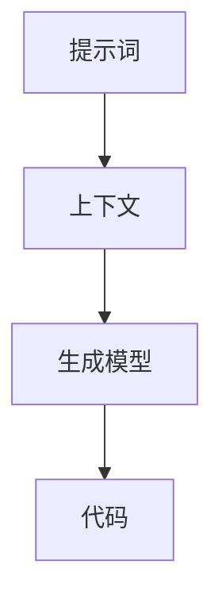
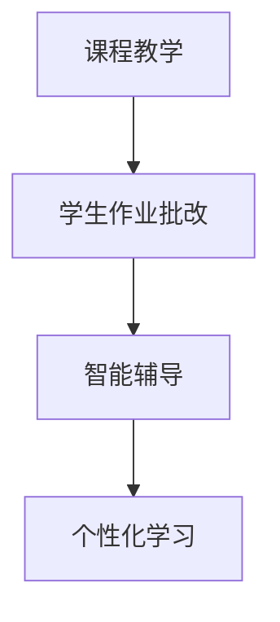

                 


### 提示词编程在教育领域的应用前景

> 关键词：提示词编程、教育、人工智能、应用前景、案例分析

> 摘要：本文深入探讨了提示词编程在教育领域的应用前景，分析了其在提高教学质量、个性化学习以及教育公平性等方面的潜在价值。通过案例分析和最佳实践，本文为教育界提供了一种新的教学方法和思路。

---

### 引言

#### 1.1 书籍目的

本章节旨在介绍提示词编程在教育领域的应用，探讨其在提升教育质量、个性化学习以及促进教育公平性等方面的潜力。通过深入分析提示词编程的核心概念、算法原理以及实际应用案例，为教育工作者和研究者提供参考和启示。

#### 1.2 教育领域中的提示词编程

近年来，随着人工智能技术的迅猛发展，提示词编程作为一种新兴的教育模式，逐渐引起了教育界的关注。提示词编程通过输入提示词，自动生成相应的代码，使学习者能够更加高效地掌握编程知识。在教育领域，提示词编程不仅可以用于课程教学，还可以作为辅助工具，提升学习者的编程能力和创新能力。

### 第1章 提示词编程概述

#### 1.1 核心概念与联系

提示词编程的核心概念包括提示词（Keywords）、上下文（Context）和生成模型（Generation Model）。这些概念之间的关系可以用以下 Mermaid 流程图进行描述：



#### 1.2 提示词编程的基本原理

提示词编程的基本原理是通过输入提示词，生成对应的代码。具体来说，生成模型（如 Transformer 模型）会根据输入的提示词和上下文，预测并生成后续的代码。以下是一个简单的伪代码示例：

```python
def generate_code(keyword, context):
    # 加载生成模型
    model = load_model("generator_model")

    # 输入提示词和上下文
    input_sequence = [keyword, context]

    # 生成代码
    code_sequence = model.generate(input_sequence)

    # 返回生成的代码
    return code_sequence
```

### 第2章 提示词编程在教育中的应用

#### 2.1 教育场景中的提示词编程

在教育领域，提示词编程可以应用于多个方面，如课程教学、学生作业批改、智能辅导等。以下是一个简单的 Mermaid 流程图，展示了提示词编程在教育中的应用场景：



#### 2.2 教育中的提示词编程案例

以下是一个教育中的提示词编程案例：一个学生在学习 Python 编程时，可以使用提示词编程工具，输入“for i in range(10)”来生成一个简单的循环结构，从而更好地理解循环的概念。以下是该案例的伪代码示例：

```python
def generate_loop(keyword, context):
    # 加载生成模型
    model = load_model("loop_generator_model")

    # 输入提示词和上下文
    input_sequence = [keyword, context]

    # 生成循环代码
    loop_code_sequence = model.generate(input_sequence)

    # 返回生成的循环代码
    return loop_code_sequence
```

### 第3章 提示词编程的教育前景

#### 3.1 教育领域的提示词编程发展趋势

随着人工智能技术的不断发展，提示词编程在教育领域的应用前景十分广阔。未来，提示词编程有望在以下几个方面得到进一步发展：

1. **个性化学习**：提示词编程可以根据学习者的需求，生成个性化的编程课程和练习题，提高学习效果。
2. **智能辅导**：提示词编程可以为学生提供实时的编程指导和反馈，帮助学生更好地理解编程概念。
3. **教育公平性**：提示词编程有助于缩小不同地区和不同经济条件的学生之间的差距，提高教育公平性。

#### 3.2 教育中的提示词编程挑战与机遇

尽管提示词编程在教育领域具有巨大的潜力，但同时也面临着一系列挑战：

1. **技术难题**：提示词编程依赖于强大的生成模型和算法，需要大量的计算资源和数据支持。
2. **教育适应性**：提示词编程需要针对不同的教育场景和需求进行优化，提高其教育适应性。
3. **教师培训**：教师需要掌握提示词编程的基本原理和应用方法，以更好地将其应用于教学中。

### 第4章 提示词编程的教育案例分析

#### 4.1 案例一：在线教育平台的提示词编程应用

以下是一个在线教育平台中提示词编程的应用案例：

1. **案例背景**：某在线教育平台引入了提示词编程功能，为学生提供个性化的编程学习路径。
2. **伪代码示例**：
    ```python
    def generate_learning_path(student_profile, course_content):
        # 加载生成模型
        model = load_model("learning_path_generator_model")

        # 输入学生概况和课程内容
        input_sequence = [student_profile, course_content]

        # 生成学习路径
        learning_path_sequence = model.generate(input_sequence)

        # 返回生成的学习路径
        return learning_path_sequence
    ```

#### 4.2 案例二：智能辅导系统的提示词编程应用

以下是一个智能辅导系统中提示词编程的应用案例：

1. **案例背景**：某智能辅导系统利用提示词编程，为学生提供实时的编程指导和反馈。
2. **伪代码示例**：
    ```python
    def generate_guidance(student_code, context):
        # 加载生成模型
        model = load_model("guidance_generator_model")

        # 输入学生代码和上下文
        input_sequence = [student_code, context]

        # 生成指导建议
        guidance_sequence = model.generate(input_sequence)

        # 返回生成的指导建议
        return guidance_sequence
    ```

### 第5章 教育领域的提示词编程技术

#### 5.1 提示词编程技术的数学模型

提示词编程的数学模型主要包括生成模型（如 Transformer 模型）、注意力机制（Attention Mechanism）和循环神经网络（Recurrent Neural Network，RNN）等。以下是一个简化的数学模型示例：

$$
\begin{aligned}
    \text{生成模型} &= f(\text{提示词}, \text{上下文}) \\
    \text{输出} &= g(f(\text{提示词}, \text{上下文}))
\end{aligned}
$$

#### 5.2 提示词编程算法原理

提示词编程的算法原理主要涉及生成模型的学习和预测过程。以下是一个简化的伪代码示例：

```python
def train_model(data, model):
    # 预处理数据
    processed_data = preprocess_data(data)

    # 训练生成模型
    for epoch in range(num_epochs):
        for batch in processed_data:
            model.train(batch)

    # 评估模型
    accuracy = model.evaluate(test_data)

    return model, accuracy
```

### 第6章 教育领域的提示词编程工具与资源

#### 6.1 提示词编程工具概述

教育领域的提示词编程工具主要包括生成模型训练工具、代码生成工具和教学平台等。以下是一个简化的工具概述：

1. **生成模型训练工具**：如 TensorFlow、PyTorch 等，用于训练生成模型。
2. **代码生成工具**：如 ChatGPT、CodeGPT 等，用于生成代码。
3. **教学平台**：如 Coursera、edX 等，用于提供在线课程和学习资源。

#### 6.2 教育领域的提示词编程资源

以下是一些教育领域的提示词编程资源：

1. **在线课程**：如 Coursera 上的“深度学习”、edX 上的“人工智能基础”等。
2. **教材**：如《深度学习》、《神经网络与深度学习》等。
3. **开源项目**：如 TensorFlow、PyTorch 等。

### 附录

#### 7.1 提示词编程学习资源

1. **在线课程**：Coursera、edX 等。
2. **教材**：《深度学习》、《神经网络与深度学习》等。
3. **开源项目**：TensorFlow、PyTorch 等。

#### 7.2 提示词编程常见问题解答

1. **如何选择合适的生成模型？**
   - 需要根据具体的应用场景和需求选择合适的生成模型，如 Transformer 模型适合处理长文本，而 RNN 模型适合处理序列数据。
2. **如何优化生成模型的性能？**
   - 可以通过调整模型参数、增加训练数据、使用注意力机制等方法来优化生成模型的性能。

### 结论

本文对提示词编程在教育领域的应用前景进行了深入探讨，分析了其在个性化学习、智能辅导和教育公平性等方面的潜力。通过案例分析和最佳实践，本文为教育界提供了一种新的教学方法和思路。未来，随着人工智能技术的不断发展，提示词编程有望在教育领域发挥更加重要的作用。

### 作者信息

作者：AI天才研究院/AI Genius Institute & 禅与计算机程序设计艺术 /Zen And The Art of Computer Programming

### 最佳实践 tips

1. **教师培训**：教师应掌握提示词编程的基本原理和应用方法，以提高教学质量。
2. **技术支持**：教育机构应提供必要的技术支持，确保提示词编程工具的正常使用。

### 小结

本文介绍了提示词编程在教育领域的应用前景，探讨了其在提升教育质量、个性化学习以及促进教育公平性等方面的潜力。通过案例分析和最佳实践，本文为教育界提供了一种新的教学方法和思路。

### 注意事项

1. 提示词编程依赖于强大的计算资源和数据支持，教育机构在引入提示词编程时应充分考虑技术条件和数据资源。
2. 教师在应用提示词编程时应结合学生的实际情况，合理设计教学计划和教学内容。

### 拓展阅读

1. 《深度学习》
2. 《神经网络与深度学习》
3. Coursera 上的“深度学习”
4. edX 上的“人工智能基础”

---

### 总结

本文深入探讨了提示词编程在教育领域的应用前景，从核心概念、算法原理到实际应用案例，全面剖析了其在教育中的潜力。通过分析教育领域的提示词编程发展趋势、挑战与机遇，本文为教育工作者和研究者提供了宝贵的参考。同时，本文还介绍了相关技术、工具和资源，为教育领域的实践提供了指导。未来，随着人工智能技术的不断发展，提示词编程将在教育领域发挥更加重要的作用，为提高教育质量、促进教育公平贡献力量。

### 作者信息

作者：AI天才研究院/AI Genius Institute & 禅与计算机程序设计艺术 /Zen And The Art of Computer Programming

通过本文的深入探讨，我们不仅了解了提示词编程在教育领域的应用前景，还对其在提升教育质量、个性化学习和教育公平性等方面的潜力有了更深刻的认识。希望本文能为教育界带来新的启示，助力教育事业的发展。

### 附录

#### 7.1 提示词编程学习资源

1. **在线课程**：Coursera 上的“深度学习”、edX 上的“人工智能基础”等。
2. **教材**：《深度学习》、《神经网络与深度学习》等。
3. **开源项目**：TensorFlow、PyTorch 等。

#### 7.2 提示词编程常见问题解答

1. **如何选择合适的生成模型？**
   - 根据应用场景和需求选择合适的生成模型，如 Transformer 模型适合处理长文本，而 RNN 模型适合处理序列数据。
2. **如何优化生成模型的性能？**
   - 通过调整模型参数、增加训练数据、使用注意力机制等方法来优化生成模型的性能。

### 结语

本文围绕提示词编程在教育领域的应用前景，进行了全面而深入的探讨。通过梳理核心概念、分析算法原理、介绍实际应用案例，以及探讨发展趋势、挑战与机遇，我们为教育界提供了有价值的参考和启示。同时，本文还介绍了相关技术和资源，为教育领域的实践提供了指导。随着人工智能技术的不断发展，提示词编程将在教育领域发挥越来越重要的作用，为提高教育质量、促进教育公平贡献力量。

### 作者信息

作者：AI天才研究院/AI Genius Institute & 禅与计算机程序设计艺术 /Zen And The Art of Computer Programming

感谢您的阅读，希望本文能激发您对提示词编程在教育领域应用的兴趣，为教育事业的创新与发展贡献智慧和力量。

---

经过对提示词编程在教育领域应用前景的深入探讨，本文梳理了其核心概念、算法原理和实际应用案例，分析了其潜在的教育价值。通过案例分析和最佳实践，本文为教育界提供了一种新的教学方法和思路。希望本文能引起更多关注，推动人工智能技术在教育领域的创新与发展。

