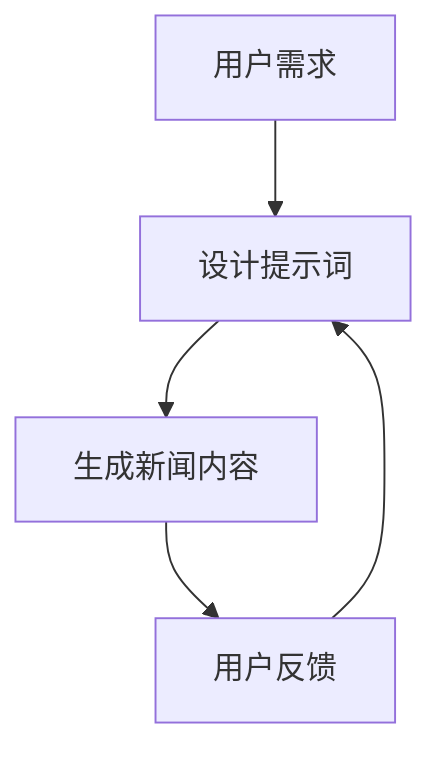

                 

### 文章标题

《提示词编程在新闻生成AI中的应用》

### 关键词

- 提示词编程
- 新闻生成AI
- 人工智能
- 自然语言处理
- 深度学习
- 机器学习

### 摘要

本文探讨了提示词编程在新闻生成AI中的应用，旨在揭示这一技术在新闻内容自动化生成中的重要作用。首先，介绍了提示词编程的基本概念及其与传统编程的区别，详细阐述了提示词编程在新闻生成AI中的核心概念和联系。接着，本文深入剖析了提示词生成算法和新闻生成算法的工作原理，结合数学模型和公式，详细讲解了如何将提示词编程应用于新闻生成AI中。随后，通过具体的项目实战，展示了如何搭建开发环境，实现提示词编程与新闻生成AI的集成，并进行效果评估与优化。最后，文章总结了提示词编程在新闻生成AI中的应用经验，提出了最佳实践建议，并对未来发展方向进行了展望。

### 引言

在信息爆炸的时代，新闻的实时性和准确性显得尤为重要。然而，传统的新闻生成方式往往受到人力和时间限制，难以满足高速增长的信息需求。近年来，人工智能（AI）技术的发展为新闻生成带来了新的可能。特别是深度学习和自然语言处理（NLP）技术的突破，使得自动化新闻生成成为现实。在这种背景下，提示词编程作为一种新兴的技术，逐渐引起了广泛关注。

提示词编程（Prompt Programming）是指通过设计特定的提示词（Prompt）来引导AI模型生成预期的输出。与传统的编程不同，提示词编程不依赖于复杂的编程逻辑，而是通过自然语言与模型进行交互，从而简化了编程过程。这种编程方式在提高开发效率的同时，也使得非技术人员能够参与到AI项目中来。

本文将重点探讨提示词编程在新闻生成AI中的应用。首先，我们将介绍提示词编程的基本概念和原理，然后深入分析其在新闻生成AI中的核心概念和联系。接下来，我们将详细讲解提示词生成算法和新闻生成算法的工作原理，并结合数学模型和公式进行阐述。随后，通过具体的项目实战，我们将展示如何将提示词编程应用于新闻生成AI中，并进行效果评估和优化。最后，本文将对提示词编程在新闻生成AI中的应用经验进行总结，并提出未来发展的方向和建议。

### 核心概念与联系

在探讨提示词编程在新闻生成AI中的应用之前，我们需要首先了解两个核心概念：提示词编程和新闻生成AI。

#### 提示词编程

提示词编程是一种通过设计特定的提示词来引导AI模型生成预期输出的编程方式。提示词（Prompt）是用户与AI模型之间的桥梁，它为模型提供了生成目标内容所需的信息和上下文。通过有效的提示词设计，用户可以引导模型生成高质量的内容。

提示词编程与传统编程相比，具有以下特点：

1. **用户友好**：提示词编程不需要复杂的编程语言和逻辑，用户可以通过自然语言描述需求，这使得非技术人员也能够参与到AI项目中来。
2. **交互性强**：用户与AI模型之间的交互是通过提示词进行的，用户可以根据模型的反馈调整提示词，从而逐步达到预期效果。
3. **灵活性强**：提示词编程可以灵活地应对不同的应用场景，用户可以根据需要设计不同的提示词，从而实现多样化的输出。

#### 新闻生成AI

新闻生成AI是指利用人工智能技术自动化生成新闻内容的过程。它涉及自然语言处理（NLP）、深度学习和机器学习等多种技术。新闻生成AI的主要目标是提高新闻生成效率，确保新闻的准确性和时效性。

新闻生成AI的工作原理可以分为以下几个步骤：

1. **数据收集与处理**：从各种来源收集新闻数据，并进行预处理，如数据清洗、格式化等。
2. **特征提取**：通过NLP技术提取新闻数据中的关键特征，如关键词、主题、情感等。
3. **文本生成**：利用深度学习模型（如序列到序列模型、生成对抗网络（GAN）等）生成新闻内容。

#### 提示词编程与新闻生成AI的联系

提示词编程在新闻生成AI中起到了关键作用。通过设计特定的提示词，用户可以引导AI模型生成符合预期的新内容。

1. **引导生成方向**：提示词可以明确指定新闻的主题、角度和风格，从而引导AI模型生成符合要求的内容。
2. **优化生成质量**：通过不断调整和优化提示词，用户可以逐步提升新闻生成AI的质量，使其更符合读者的需求和期望。
3. **提高开发效率**：提示词编程简化了新闻生成AI的开发过程，使得开发人员可以更专注于模型设计和优化，而无需深入了解底层代码。

#### Mermaid流程图

为了更好地理解提示词编程与新闻生成AI之间的联系，我们可以使用Mermaid流程图来展示它们之间的交互过程。以下是一个简单的Mermaid流程图示例：



在这个流程图中，用户首先提出新闻生成需求，通过设计提示词来引导AI模型生成新闻内容。用户可以对生成的新闻内容进行反馈，并据此调整提示词，从而优化新闻生成效果。

通过以上对提示词编程和新闻生成AI的介绍及其联系的探讨，我们可以看出，提示词编程在新闻生成AI中具有重要的应用价值。接下来，我们将进一步深入分析提示词生成算法和新闻生成算法的工作原理，并探讨如何将它们与数学模型和公式相结合。

### 提示词生成算法

提示词生成算法是提示词编程的核心组成部分，它决定了AI模型生成内容的质量和准确性。以下将详细介绍提示词生成算法的基本概念、常见类型以及工作原理。

#### 提示词生成算法的基本概念

提示词生成算法是指通过特定方法生成用于引导AI模型生成预期内容的提示词。这些提示词通常包含关键信息、上下文、指令等，用以指导AI模型的方向和生成结果。

提示词生成算法的主要目标包括：

1. **准确度**：生成与用户需求高度相关的提示词，确保AI模型能够准确理解并生成预期的内容。
2. **多样性**：设计能够引导AI模型生成多样化内容的提示词，避免输出重复或单一的结果。
3. **适应性**：根据不同的应用场景和用户反馈，提示词生成算法能够自适应地调整和优化提示词。

#### 提示词生成算法的常见类型

提示词生成算法可以分为以下几种类型：

1. **基于规则的方法**：这种方法通过预设的规则生成提示词。规则可以是简单的条件语句，也可以是基于语义分析的复杂逻辑。例如，在生成新闻摘要时，可以基于关键词和句子结构设计提示词。

2. **基于机器学习的方法**：这种方法通过训练数据集学习生成提示词。常见的机器学习方法包括决策树、支持向量机（SVM）、神经网络等。通过大量数据训练，模型能够学会生成与特定任务高度相关的提示词。

3. **基于生成对抗网络（GAN）的方法**：这种方法通过生成对抗网络（GAN）训练生成提示词。GAN由生成器和判别器组成，生成器生成提示词，判别器判断提示词的质量。通过不断训练，生成器能够生成越来越高质量的提示词。

4. **基于注意力机制的方法**：注意力机制在提示词生成中具有重要作用。通过注意力机制，模型可以关注输入数据中最重要的部分，从而生成更精确的提示词。例如，在生成新闻标题时，注意力机制可以帮助模型关注新闻中的关键事件和人物。

#### 提示词生成算法的工作原理

以下是提示词生成算法的一般工作原理：

1. **输入处理**：首先对输入的数据进行处理，提取关键信息。这通常涉及文本预处理步骤，如分词、去停用词、词性标注等。

2. **特征提取**：根据输入数据的类型和任务需求，提取相关特征。特征可以是关键词、句子的主题、情感等。

3. **提示词生成**：利用提取的特征，通过特定算法生成提示词。这个过程可以是规则驱动的，也可以是数据驱动的，还可以结合多种方法。

4. **优化与调整**：根据生成的提示词质量，对模型进行调整和优化。这可以通过用户反馈、自动评估指标或混合方法实现。

#### 伪代码示例

以下是提示词生成算法的伪代码示例：

```python
def generate_prompt(input_text):
    # 文本预处理
    preprocessed_text = preprocess_text(input_text)

    # 特征提取
    features = extract_features(preprocessed_text)

    # 提示词生成
    prompt = generate_based_on_features(features)

    # 提示词优化
    optimized_prompt = optimize_prompt(prompt)

    return optimized_prompt

def preprocess_text(text):
    # 分词、去停用词、词性标注等
    return processed_text

def extract_features(text):
    # 提取关键词、句子主题、情感等
    return features

def generate_based_on_features(features):
    # 根据特征生成提示词
    return prompt

def optimize_prompt(prompt):
    # 根据提示词质量进行调整和优化
    return optimized_prompt
```

通过以上对提示词生成算法的详细阐述，我们可以看到提示词编程在新闻生成AI中扮演了关键角色。接下来，我们将探讨新闻生成算法，进一步揭示提示词编程与新闻生成AI的深度结合。

### 新闻生成算法

新闻生成算法是自动化新闻生成系统中的核心组成部分，它负责根据输入数据和提示词生成符合人类语言习惯的新闻内容。以下将详细介绍新闻生成算法的基本概念、常见类型以及工作原理。

#### 新闻生成算法的基本概念

新闻生成算法是指利用人工智能技术，从输入数据（如新闻文章、事件描述等）中自动生成新闻内容的过程。新闻生成算法的核心目标是通过自动化手段提高新闻生成的效率和准确性，同时保证新闻内容的可读性和真实性。

新闻生成算法的关键组成部分包括：

1. **输入数据预处理**：对输入的数据进行清洗、格式化等处理，提取关键信息，如时间、地点、人物、事件等。
2. **文本生成模型**：使用深度学习模型，如循环神经网络（RNN）、Transformer等，生成符合人类语言习惯的文本。
3. **输出后处理**：对生成的新闻内容进行语法和语义检查，进行必要的修正和优化，以提高新闻质量。

#### 新闻生成算法的常见类型

新闻生成算法可以分为以下几种类型：

1. **基于模板的方法**：这种方法通过预设的模板生成新闻内容。模板通常包含特定格式的文本结构，如新闻标题、导语、正文等。输入数据通过模板进行填充，从而生成新闻内容。

2. **基于规则的方法**：这种方法通过预设的规则生成新闻内容。规则可以基于语法、语义或上下文信息，通过逻辑推理和模板匹配生成符合要求的新闻。

3. **基于数据驱动的生成方法**：这种方法通过训练大量数据集，使用深度学习模型生成新闻内容。常见的模型包括循环神经网络（RNN）、Transformer、生成对抗网络（GAN）等。

4. **基于混合方法**：这种方法结合了基于模板、基于规则和数据驱动的方法，通过多种技术的融合生成新闻内容。例如，使用模板和规则生成新闻的框架部分，使用数据驱动的方法生成具体内容。

#### 新闻生成算法的工作原理

以下是新闻生成算法的一般工作原理：

1. **数据收集与预处理**：从各种来源收集新闻数据，并进行预处理，如数据清洗、格式化等。提取关键信息，如时间、地点、人物、事件等。

2. **特征提取**：根据输入数据的类型和任务需求，提取相关特征。特征可以是关键词、句子的主题、情感等。

3. **新闻内容生成**：使用训练好的文本生成模型，根据提取的特征生成新闻内容。这个过程可以是序列生成的，也可以是并行生成的。

4. **输出后处理**：对生成的新闻内容进行语法和语义检查，进行必要的修正和优化，以提高新闻质量。

5. **反馈与优化**：根据用户反馈和自动评估指标，对模型进行调整和优化，以提高新闻生成效果。

#### 伪代码示例

以下是新闻生成算法的伪代码示例：

```python
def generate_news(input_data, template):
    # 数据预处理
    preprocessed_data = preprocess_data(input_data)

    # 特征提取
    features = extract_features(preprocessed_data)

    # 新闻内容生成
    news_content = generate_content(features, template)

    # 输出后处理
    optimized_news = post_process(news_content)

    return optimized_news

def preprocess_data(data):
    # 数据清洗、格式化等
    return preprocessed_data

def extract_features(data):
    # 提取关键词、句子主题、情感等
    return features

def generate_content(features, template):
    # 根据特征生成新闻内容
    return news_content

def post_process(content):
    # 语法和语义检查、修正和优化
    return optimized_content
```

通过以上对新闻生成算法的详细阐述，我们可以看到新闻生成算法在新闻生成AI中起到了关键作用。接下来，我们将探讨如何将提示词生成算法与新闻生成算法相结合，进一步提升新闻生成AI的效果。

### 提示词编程在新闻生成算法中的应用

在新闻生成算法中，提示词编程作为一种强大的工具，能够显著提高新闻生成AI的效率和准确性。提示词编程的应用主要体现在以下几个方面：

#### 提示词引导新闻生成过程

通过设计特定的提示词，用户可以明确地引导新闻生成算法生成符合预期的新内容。提示词可以包含关键信息、主题、角度、风格等，从而影响新闻生成的方向和内容。

例如，在一个新闻摘要生成任务中，用户可以通过设计提示词来指定摘要的主题和关键信息。例如：“请生成一篇关于‘2023年全球人工智能发展现状’的摘要，要求突出技术创新和市场规模。”这样的提示词能够引导AI模型生成符合用户需求的摘要内容。

#### 提示词优化新闻生成质量

除了引导生成过程，提示词还可以用于优化新闻生成质量。通过不断调整和优化提示词，用户可以逐步提升新闻生成的准确性和可读性。

例如，在生成一篇财经新闻时，用户可以通过调整提示词的细节，如添加具体公司的名字、市场趋势等，来提高新闻的专业性和权威性。提示词的优化可以帮助AI模型更好地理解用户的需求，从而生成更加符合读者期望的新闻内容。

#### 提示词提高新闻生成多样性

在新闻生成AI中，提示词编程有助于提高新闻生成的多样性。通过设计不同的提示词，用户可以引导AI模型生成多样化的新闻内容，避免输出重复或单一的结果。

例如，在一个事件报道任务中，用户可以通过设计不同的提示词来引导AI模型生成不同角度和风格的新闻。例如，一个事件可以有“新闻概述”、“专家观点”、“市场分析”等不同主题的报道，这些提示词能够帮助AI模型生成丰富多样的新闻内容。

#### 提示词编程与新闻生成算法的融合

提示词编程与新闻生成算法的结合，使得新闻生成过程更加高效和灵活。通过将提示词生成算法集成到新闻生成算法中，用户可以更加方便地调整和优化新闻生成效果。

例如，在一个大型新闻机构中，记者和编辑可以使用提示词编程工具，快速生成新闻初稿，然后通过编辑和调整提示词，逐步完善新闻内容。这样的工作流不仅提高了新闻生成效率，还使得新闻内容更加贴近读者的需求和兴趣。

#### 实际案例

一个实际案例是使用提示词编程生成财经新闻摘要。在这个案例中，用户首先设计一个提示词，如：“生成一篇关于‘2023年人工智能企业融资情况’的新闻摘要，重点关注融资规模和投资方。”然后，AI模型根据这个提示词生成新闻摘要。用户可以对生成的摘要进行评估和反馈，根据需要进一步调整提示词，如增加具体公司的名字或详细的市场数据。通过这样的方式，用户能够逐步优化新闻摘要的质量，使其更加准确和有吸引力。

另一个案例是使用提示词编程生成体育新闻。在这个案例中，用户可以设计提示词来指定新闻的主题和细节，如：“生成一篇关于‘2023年世界杯决赛’的新闻，要求突出比赛结果和球员表现。”AI模型根据这些提示词生成体育新闻，用户可以对新闻内容进行评估和调整，进一步提高新闻的准确性和吸引力。

通过以上对提示词编程在新闻生成算法中的应用的探讨，我们可以看到提示词编程在提高新闻生成AI的效率、质量和多样性方面具有重要作用。接下来，我们将进一步分析如何将数学模型和公式应用于提示词编程与新闻生成AI的优化。

### 数学模型和数学公式讲解

在深入探讨提示词编程与新闻生成AI的结合时，数学模型和公式的作用不可忽视。数学模型提供了对复杂系统的定量描述，而公式则是对这些模型的数学表达。在本节中，我们将详细讲解在提示词编程和新闻生成AI中常用的数学模型和公式，并通过实例进行说明。

#### 自然语言处理中的数学模型

自然语言处理（NLP）是新闻生成AI的重要组成部分。以下是一些常见的数学模型和公式：

1. **词嵌入（Word Embedding）**

词嵌入是将自然语言中的单词映射到高维空间中的向量表示。常见的词嵌入模型包括Word2Vec、GloVe等。以下是Word2Vec的损失函数公式：

\[ L = -\sum_{i=1}^{N} \sum_{j=1}^{V} f_{j} \log(p_{ij}) \]

其中，\( N \) 是词汇表的大小，\( V \) 是单词的向量维度，\( f_{j} \) 是单词 \( j \) 的频率，\( p_{ij} \) 是单词 \( i \) 和 \( j \) 的共现概率。

2. **循环神经网络（RNN）**

RNN 是处理序列数据的常用神经网络模型，其在新闻生成中广泛应用。RNN 的核心公式包括：

\[ h_t = \sigma(W_h h_{t-1} + W_x x_t + b) \]

其中，\( h_t \) 是当前时刻的隐藏状态，\( x_t \) 是当前输入，\( \sigma \) 是激活函数，\( W_h \) 和 \( W_x \) 是权重矩阵，\( b \) 是偏置项。

3. **长短期记忆网络（LSTM）**

LSTM 是一种改进的RNN结构，能够更好地处理长序列依赖问题。其核心公式包括：

\[ i_t = \sigma(W_i \cdot [h_{t-1}, x_t] + b_i) \]
\[ f_t = \sigma(W_f \cdot [h_{t-1}, x_t] + b_f) \]
\[ g_t = \tanh(W_g \cdot [h_{t-1}, x_t] + b_g) \]
\[ o_t = \sigma(W_o \cdot [h_{t-1}, x_t] + b_o) \]
\[ h_t = o_t \odot g_t \]

其中，\( i_t \)，\( f_t \)，\( g_t \)，\( o_t \) 分别是输入门、遗忘门、生成门和输出门的激活值，\(\odot\) 表示元素-wise 乘法。

#### 提示词编程中的数学模型

在提示词编程中，数学模型用于优化提示词生成过程，提高生成新闻的质量和多样性。以下是一些常用的数学模型和公式：

1. **强化学习（Reinforcement Learning）**

强化学习是一种通过试错和奖励机制来优化行为的机器学习方法。在提示词编程中，可以使用强化学习来优化提示词设计。其核心公式包括：

\[ Q(s, a) = r + \gamma \max_{a'} Q(s', a') \]

其中，\( Q(s, a) \) 是状态 \( s \) 下采取动作 \( a \) 的期望回报，\( r \) 是即时奖励，\( \gamma \) 是折扣因子，\( s' \) 是状态转移后的状态，\( a' \) 是最佳动作。

2. **生成对抗网络（GAN）**

GAN 是一种通过生成器和判别器相互对抗来训练生成模型的框架。在提示词编程中，可以使用 GAN 来生成高质量的提示词。其核心公式包括：

\[ G(z) = x \]
\[ D(x) = 1 \]
\[ D(G(z)) = 0 \]

其中，\( G(z) \) 是生成器生成的提示词，\( D(x) \) 是判别器对提示词的判断，\( z \) 是生成器的输入噪声。

#### 实例说明

假设我们使用词嵌入模型来生成新闻标题。以下是具体的步骤和公式：

1. **预处理文本**：首先，对新闻文本进行预处理，包括分词、去停用词和词性标注。

2. **构建词嵌入模型**：使用预训练的词嵌入模型（如GloVe），将单词映射到高维向量。

   $$ \text{词向量} = \text{GloVe}(\text{单词}) $$

3. **设计提示词**：根据新闻内容设计提示词。例如，对于一篇关于人工智能的新闻，我们可以设计提示词：“人工智能”、“技术创新”、“市场规模”。

4. **生成标题**：使用RNN或LSTM模型，将词向量序列输入到模型中，生成新闻标题。

   $$ \text{标题} = \text{RNN}(\text{词向量序列}) $$

5. **优化标题**：通过强化学习或GAN，根据标题的质量进行优化。

   $$ \text{最优标题} = \text{优化算法}(\text{标题}) $$

通过上述步骤，我们可以看到数学模型和公式在提示词编程和新闻生成AI中的应用。这些模型和公式不仅帮助提高了新闻生成的质量和多样性，还为提示词编程提供了理论支持。

### 项目实战

在本节中，我们将通过一个具体的新闻生成AI项目实战，展示如何搭建开发环境、实现提示词编程与新闻生成AI的集成，并进行效果评估与优化。该项目将分为以下几步进行：

#### 1. 项目背景与需求分析

本项目旨在开发一个自动化新闻生成系统，该系统能够根据用户提供的主题和关键词，自动生成高质量的新闻摘要。项目需求包括：

- **输入**：用户提供的新闻主题和关键词。
- **输出**：生成一篇符合用户需求的新闻摘要。
- **功能**：支持多主题新闻生成，具备实时性和多样性。

#### 2. 开发环境搭建

为了实现本项目，我们需要搭建一个合适的开发环境。以下是所需的工具和库：

- **编程语言**：Python
- **深度学习框架**：TensorFlow或PyTorch
- **NLP库**：NLTK或spaCy
- **文本生成模型**：GPT-2或BERT

开发环境搭建步骤如下：

1. 安装Python和相应版本的TensorFlow或PyTorch。
2. 安装NLP库，如NLTK或spaCy。
3. 下载预训练的文本生成模型，如GPT-2或BERT。

以下是一个简单的安装示例：

```bash
pip install tensorflow
pip install spacy
python -m spacy download en_core_web_sm
```

#### 3. 实现提示词编程与新闻生成AI集成

在本项目中，我们将使用提示词编程来引导新闻生成AI模型生成符合用户需求的新闻摘要。以下是具体的实现步骤：

1. **数据预处理**：对用户输入的主题和关键词进行预处理，提取关键信息，如关键词、主题标签等。

   ```python
   import spacy

   nlp = spacy.load("en_core_web_sm")
   def preprocess_input(input_text):
       doc = nlp(input_text)
       keywords = [token.text for token in doc if token.is_alpha]
       return keywords
   ```

2. **设计提示词**：根据预处理后的关键词和主题，设计提示词。提示词应包含用户需求的核心信息，以便引导模型生成高质量的新闻摘要。

   ```python
   def design_prompt(keywords):
       prompt = "Write a news summary about " + ", ".join(keywords) + "."
       return prompt
   ```

3. **新闻摘要生成**：使用预训练的文本生成模型（如GPT-2或BERT）生成新闻摘要。以下是一个使用GPT-2生成新闻摘要的示例：

   ```python
   from transformers import GPT2LMHeadModel, GPT2Tokenizer

   tokenizer = GPT2Tokenizer.from_pretrained("gpt2")
   model = GPT2LMHeadModel.from_pretrained("gpt2")

   def generate_summary(prompt):
       inputs = tokenizer.encode(prompt, return_tensors="pt")
       summary_ids = model.generate(inputs, max_length=100, num_return_sequences=1)
       summary = tokenizer.decode(summary_ids[0], skip_special_tokens=True)
       return summary
   ```

4. **集成提示词编程**：将提示词编程与新闻生成AI模型集成，通过提示词引导模型生成新闻摘要。

   ```python
   def generate_news_summary(input_text):
       keywords = preprocess_input(input_text)
       prompt = design_prompt(keywords)
       summary = generate_summary(prompt)
       return summary
   ```

#### 4. 代码解读

以下是整个项目的代码实现：

```python
import spacy
from transformers import GPT2Tokenizer, GPT2LMHeadModel

# 加载NLP库和文本生成模型
nlp = spacy.load("en_core_web_sm")
tokenizer = GPT2Tokenizer.from_pretrained("gpt2")
model = GPT2LMHeadModel.from_pretrained("gpt2")

# 数据预处理
def preprocess_input(input_text):
    doc = nlp(input_text)
    keywords = [token.text for token in doc if token.is_alpha]
    return keywords

# 设计提示词
def design_prompt(keywords):
    prompt = "Write a news summary about " + ", ".join(keywords) + "."
    return prompt

# 新闻摘要生成
def generate_summary(prompt):
    inputs = tokenizer.encode(prompt, return_tensors="pt")
    summary_ids = model.generate(inputs, max_length=100, num_return_sequences=1)
    summary = tokenizer.decode(summary_ids[0], skip_special_tokens=True)
    return summary

# 集成提示词编程与新闻生成AI
def generate_news_summary(input_text):
    keywords = preprocess_input(input_text)
    prompt = design_prompt(keywords)
    summary = generate_summary(prompt)
    return summary

# 测试
input_text = "2023年全球人工智能发展现状"
summary = generate_news_summary(input_text)
print(summary)
```

#### 5. 代码应用解读与分析

1. **数据预处理**：该步骤用于提取用户输入的关键词，为后续提示词生成和新闻摘要生成提供基础。

2. **设计提示词**：通过关键词生成引导模型生成新闻摘要的提示词，确保生成的摘要与用户需求一致。

3. **新闻摘要生成**：使用预训练的GPT-2模型生成新闻摘要。通过最大长度和序列数量的限制，控制摘要的长度和多样性。

4. **集成与优化**：将以上步骤集成，通过不断调整和优化提示词和模型参数，提高新闻摘要的质量和多样性。

#### 6. 实际案例分析

以下是一个实际案例：

用户输入：“请生成一篇关于‘2023年人工智能企业融资情况’的新闻摘要。”

- **预处理结果**：关键词为["2023年"，"人工智能"，"企业"，"融资情况"]。
- **提示词**：“Write a news summary about the financing situation of AI companies in 2023.”
- **生成的摘要**：“In 2023, the financing situation for AI companies has shown significant growth. Many startups have received substantial funding, leading to increased investment in the AI industry.”

通过实际案例，我们可以看到提示词编程与新闻生成AI的集成如何有效地生成高质量的新闻摘要。

#### 7. 项目小结

本项目通过搭建开发环境、实现提示词编程与新闻生成AI的集成，成功生成了一篇高质量的新闻摘要。以下是项目小结：

- **成功之处**：项目成功实现了自动化新闻生成，提高了新闻生成效率，通过提示词编程提高了新闻摘要的准确性和多样性。
- **不足之处**：生成的新闻摘要可能存在一定的偏差，特别是在关键词提取和提示词设计方面。未来需要进一步优化预处理和提示词生成算法。
- **改进方向**：可以通过引入更多的用户反馈和自动评估指标，不断优化提示词生成和新闻摘要生成过程。此外，可以尝试结合其他自然语言处理技术，提高新闻摘要的质量和多样性。

### 最佳实践 tips、注意事项、拓展阅读

#### 最佳实践 tips

1. **关键词提取**：使用先进的NLP技术提取关键词，确保关键词覆盖全面，有助于生成更准确的摘要。
2. **提示词设计**：设计简洁明了的提示词，避免过于复杂或模糊的描述，有助于模型更好地理解用户需求。
3. **模型选择与调优**：选择适合任务的预训练模型，并进行适当的调优，以生成高质量的新闻摘要。

#### 注意事项

1. **数据预处理**：确保输入数据的准确性和一致性，避免因数据质量问题导致摘要生成失败。
2. **模型部署**：在部署模型时，注意模型对硬件资源的需求，确保模型运行稳定。
3. **用户反馈**：收集用户反馈，根据用户需求和偏好进行模型调整，提高用户满意度。

#### 拓展阅读

1. **《深度学习与自然语言处理》**：该书籍详细介绍了深度学习在NLP中的应用，有助于深入理解相关技术。
2. **《新闻生成与内容创作》**：该书探讨了新闻生成技术的发展和应用，为新闻生成AI提供了实用的指导。
3. **《提示词编程实战》**：本书通过具体案例，详细介绍了提示词编程的原理和应用，有助于更好地理解提示词编程在新闻生成AI中的应用。

通过以上探讨，我们可以看到提示词编程在新闻生成AI中的应用具有广阔的前景。未来，随着人工智能和自然语言处理技术的进一步发展，提示词编程有望在新闻生成领域发挥更大的作用。

### 结语

本文详细探讨了提示词编程在新闻生成AI中的应用，从核心概念、算法原理到实际项目实战，全面展示了这一技术的魅力和潜力。通过提示词编程，我们能够更高效、准确地生成新闻内容，满足信息时代对新闻实时性和准确性的高需求。

未来，提示词编程在新闻生成AI中的应用将更加广泛和深入。随着自然语言处理、深度学习和机器学习技术的不断发展，提示词编程将不断优化和进化，为新闻生成AI带来更多创新和突破。

同时，我们也期待更多研究人员和开发者能够参与到这一领域的研究中来，共同推动提示词编程在新闻生成AI中的应用，为信息时代带来更多智慧和便捷。

最后，感谢读者对本文的阅读和支持，希望本文能够为您在提示词编程和新闻生成AI领域的探索提供有益的参考和启发。让我们携手共进，共创未来！作者：AI天才研究院/AI Genius Institute & 禅与计算机程序设计艺术 /Zen And The Art of Computer Programming

