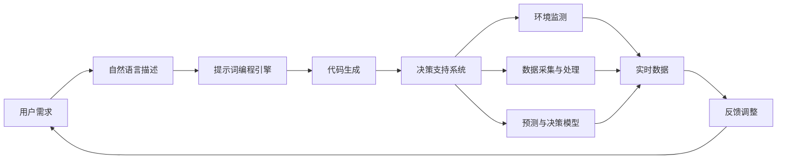

                 

### 1.3 引言

随着全球人口的不断增长和资源环境的日益紧张，提高农业生产效率和农产品质量成为世界各国共同面临的挑战。传统农业以人力和经验为主，生产效率低下，资源浪费严重。为了实现农业现代化，各国纷纷将目光投向智能农业，而智能农业的核心在于决策支持系统的构建。

智能农业决策支持系统通过将信息技术、大数据、物联网和人工智能等先进技术引入农业生产，实现对农业生产过程的实时监测、分析和决策。它不仅可以帮助农民提高生产效率、降低生产成本，还能有效保障农产品质量安全，促进农业可持续发展。因此，智能农业决策支持系统成为当前农业发展的热点领域。

本文将探讨提示词编程在智能农业决策支持系统中的应用。提示词编程是一种基于自然语言处理和人工智能技术的新型编程范式，通过引导用户以自然语言的方式描述问题，从而生成相应的代码。与传统编程相比，提示词编程具有更易用、更高效的特点，能够大大降低开发门槛，提高开发效率。在智能农业领域，提示词编程的应用前景十分广阔，有望为农业生产的智能化提供有力支持。

本文将首先介绍智能农业决策支持系统的基本概念、原理和关键技术，然后详细探讨提示词编程的基本概念、原理及其在智能农业决策支持系统中的应用。接着，本文将介绍提示词编程的核心算法原理，并使用伪代码形式进行详细阐述。此外，本文还将通过实际案例，展示提示词编程在智能农业决策支持系统中的应用效果。最后，本文将对智能农业决策支持系统的项目实战进行详细介绍，包括项目背景、系统设计、代码解读与分析，以及项目小结。通过本文的介绍，希望读者能够对提示词编程在智能农业决策支持系统中的应用有一个全面、深入的了解。

### 1.4 智能农业决策支持系统的组成部分与工作原理

智能农业决策支持系统是由多个组成部分构成的复杂系统，这些组成部分相互协作，共同实现对农业生产过程的实时监测、分析和决策支持。以下是智能农业决策支持系统的主要组成部分及其工作原理：

#### 1.4.1 环境监测模块

环境监测模块是智能农业决策支持系统的核心组成部分之一，主要负责对农业生产过程中的关键环境参数进行实时监测。这些参数包括土壤湿度、温度、养分含量、气象数据（如温度、湿度、风速、降雨量等）以及病虫害情况等。通过部署传感器网络和遥感技术，环境监测模块能够实时获取并传输农业生产环境的数据。

环境监测模块的工作原理是通过传感器收集环境数据，将这些数据传输到中央处理系统进行存储、分析和处理。当环境参数超出预设阈值时，系统会自动发出警报，提醒农民采取相应措施。

#### 1.4.2 数据采集与处理模块

数据采集与处理模块负责从各种来源（如传感器、遥感卫星、农业设备等）收集数据，并对这些数据进行预处理、清洗和转换。预处理过程包括数据去噪、数据归一化、缺失值填充等操作，以确保数据的质量和一致性。

数据处理模块通常采用数据挖掘和机器学习技术，对采集到的数据进行深入分析，以发现数据中的规律和趋势。例如，通过对土壤湿度数据进行分析，可以预测作物需水量，从而优化灌溉策略。通过对气象数据进行分析，可以预测病虫害的发生趋势，帮助农民提前制定防治措施。

#### 1.4.3 决策支持模块

决策支持模块是基于环境监测模块和数据采集与处理模块提供的信息，为农民提供科学、精准的决策建议。这些决策建议可以包括灌溉策略、施肥计划、病虫害防治方案、作物种植模式选择等。

决策支持模块的工作原理是利用预先建立的农业知识库和决策模型，对收集到的数据进行综合分析，生成最优决策方案。这些决策方案通常以可视化的方式呈现给用户，帮助农民更好地理解和执行。

#### 1.4.4 执行与反馈模块

执行与反馈模块负责将决策支持模块生成的决策方案转化为实际的农业生产操作，并收集执行结果进行反馈。通过执行模块，农民可以按照系统提供的建议进行调整，例如改变灌溉量、施肥量或病虫害防治措施。

反馈模块则收集执行后的实际数据，包括作物生长状况、土壤环境变化等，并将其回传到决策支持模块。这些反馈数据用于不断优化决策模型，提高决策的准确性和适应性。

#### 1.4.5 用户界面模块

用户界面模块是智能农业决策支持系统与农民之间的交互接口，提供直观、易用的操作界面。用户界面模块通常包括地图显示、数据图表、警报通知、决策建议等组件。

用户界面模块的工作原理是接收用户输入和操作，将决策支持模块生成的决策方案以可视化形式展示，同时提供警报和通知功能，确保农民能够及时了解农业生产环境的变化和决策建议。

综上所述，智能农业决策支持系统通过环境监测模块、数据采集与处理模块、决策支持模块、执行与反馈模块和用户界面模块的协同工作，实现对农业生产过程的实时监测和科学决策。这一系统的建设不仅需要先进的信息技术和人工智能技术的支持，还需要对农业领域有深刻的理解和洞察。随着技术的不断进步和农业需求的不断变化，智能农业决策支持系统将在未来发挥越来越重要的作用。

### 1.5 智能农业决策支持系统的关键技术

智能农业决策支持系统的建设涉及多个领域的交叉与融合，其中涉及的关键技术主要包括环境监测、物联网、数据挖掘、机器学习等。以下是对这些关键技术的详细介绍：

#### 1.5.1 环境监测

环境监测是智能农业决策支持系统的核心组成部分，它主要通过传感器网络和遥感技术实现对农业生产过程中关键环境参数的实时监测。传感器网络包括土壤湿度传感器、温度传感器、养分传感器、气象传感器等，可以部署在农田、温室、果园等不同的农业生产场景中。这些传感器能够实时采集土壤湿度、温度、养分含量、气象数据等信息，并通过无线通信网络将这些数据传输到中央处理系统。

遥感技术则利用卫星或飞机搭载的传感器，对大面积的农田进行监测。遥感技术可以提供高精度的土壤、植被、气象数据，帮助农民了解农田的整体状况，及时发现问题并进行调整。

#### 1.5.2 物联网

物联网（IoT）技术是将各种物理设备、传感器、互联网连接起来，实现设备之间的信息交换和协同工作。在智能农业中，物联网技术主要用于搭建农业生产环境的数据采集、传输和处理平台。通过物联网技术，可以将传感器网络、农业设备、中央处理系统连接在一起，实现数据的实时传输和共享。

物联网技术在智能农业中的具体应用包括：智能灌溉系统、智能温室控制系统、智能施肥系统等。这些系统可以通过物联网技术实现自动化控制，根据实时监测到的环境参数，自动调整灌溉量、温度、湿度等，从而提高农业生产效率。

#### 1.5.3 数据挖掘

数据挖掘是从大量数据中提取有价值信息的过程，它是智能农业决策支持系统的数据基础。在智能农业中，数据挖掘技术主要用于分析农业生产过程中产生的各类数据，如环境数据、气象数据、作物生长数据等。通过数据挖掘技术，可以识别数据中的规律和模式，帮助农民制定科学的生产决策。

数据挖掘技术包括关联规则挖掘、聚类分析、分类分析、异常检测等多种方法。例如，通过关联规则挖掘技术，可以分析作物生长和土壤养分之间的关系，发现不同作物在不同生长阶段的养分需求规律；通过聚类分析技术，可以将农田划分为不同的区域，根据区域特征制定相应的管理策略。

#### 1.5.4 机器学习

机器学习是人工智能的一个重要分支，它通过算法模型从数据中自动学习规律，实现对数据的预测和分类。在智能农业决策支持系统中，机器学习技术主要用于构建预测模型和分类模型，帮助农民做出科学的决策。

机器学习技术包括监督学习、无监督学习、半监督学习等多种类型。在智能农业中，监督学习技术常用于构建作物病虫害预测模型、作物产量预测模型等；无监督学习技术则常用于聚类分析，帮助农民了解农田的分布特征；半监督学习技术则可以结合已有数据和少量标注数据，提高模型的预测精度。

#### 1.5.5 农业知识工程

农业知识工程是将农业领域的专业知识、经验和数据转化为计算机可处理的形式，构建农业知识库。在智能农业决策支持系统中，农业知识工程主要用于提供决策支持依据。

农业知识工程包括知识表示、知识获取、知识推理等多种技术。知识表示是将农业知识以计算机可处理的形式进行编码，如使用本体论、语义网络等；知识获取是通过各种方法（如专家咨询、文献调研、数据挖掘等）获取农业知识；知识推理则是利用农业知识库为决策支持系统提供推理功能。

#### 1.5.6 云计算与大数据

云计算和大数据技术为智能农业决策支持系统提供了强大的计算能力和数据处理能力。通过云计算，智能农业决策支持系统可以快速处理海量数据，提供实时、高效的服务；通过大数据技术，可以实现对农业数据的深度挖掘和分析，发现隐藏在数据中的价值信息。

云计算和大数据技术在智能农业中的应用包括：数据存储与管理、数据分析和挖掘、实时监测和预警等。通过云计算和大数据技术，智能农业决策支持系统可以实现农业数据的集中管理和高效利用，为农业生产提供全面的决策支持。

综上所述，智能农业决策支持系统的关键技术包括环境监测、物联网、数据挖掘、机器学习、农业知识工程、云计算和大数据等。这些技术的融合与协同工作，为智能农业决策支持系统提供了强大的技术支撑，使其能够更好地服务于农业生产，推动农业现代化发展。

### 1.6 提示词编程的概念及其在智能农业决策支持系统中的应用价值

提示词编程是一种基于自然语言处理（NLP）和人工智能（AI）技术的编程范式，它通过引导用户使用自然语言描述问题，系统自动生成相应的代码实现。这一编程方式具有高度的用户友好性，能够有效降低编程门槛，提高开发效率。在智能农业决策支持系统中，提示词编程的应用价值尤为突出。

#### 1.6.1 提示词编程的概念

提示词编程的核心思想是将传统的代码编写过程转化为自然语言交互过程。用户通过自然语言描述需求，系统则根据这些描述自动生成代码。这一过程通常涉及以下步骤：

1. **自然语言解析**：系统首先对用户输入的自然语言进行解析，将其转换为计算机可理解的语义结构。
2. **代码生成**：根据解析结果，系统使用模板和规则库自动生成相应的代码。
3. **代码优化**：生成的代码可能会经过进一步的优化，以提高其执行效率和可读性。

提示词编程的优势在于，它允许非专业程序员或农民通过自然语言描述他们的需求，系统会自动处理复杂的编程逻辑，从而实现快速开发。

#### 1.6.2 提示词编程在智能农业决策支持系统中的应用价值

在智能农业决策支持系统中，提示词编程的应用价值主要体现在以下几个方面：

1. **降低开发门槛**：传统农业决策支持系统的开发涉及复杂的技术和编程知识，提示词编程使得非专业程序员或农民能够通过自然语言描述需求，快速实现系统的构建和部署，降低开发门槛。

2. **提高开发效率**：提示词编程能够自动生成代码，减少手动编写的繁琐过程，从而提高开发效率。对于需要快速响应农业生产需求的智能农业系统，这一优势尤为重要。

3. **灵活性和可扩展性**：提示词编程允许用户通过自然语言描述新的需求，系统可以动态调整和扩展代码，满足不断变化的生产需求。这使得智能农业决策支持系统具有更好的灵活性和可扩展性。

4. **决策支持**：智能农业决策支持系统通过提示词编程生成的代码可以实现复杂的数据分析和决策逻辑。例如，用户可以通过自然语言描述作物的生长状态，系统则自动生成灌溉、施肥等决策方案。

5. **用户友好**：提示词编程提供了直观的用户交互界面，用户无需学习复杂的编程语言和概念，即可轻松使用智能农业系统。这对于提高农民的接受度和使用频率具有重要意义。

#### 1.6.3 提示词编程在智能农业决策支持系统中的具体应用案例

以下是一个具体的案例，展示了提示词编程在智能农业决策支持系统中的应用：

**案例**：农民通过提示词编程系统描述作物需水量，系统自动生成灌溉计划。

**用户描述**：“系统，我需要监测小麦田的土壤湿度，并在湿度低于20%时自动启动灌溉系统。”

**系统响应**：系统根据用户描述，自动生成以下代码实现灌溉计划：

```
def irrigation_plan(soil_humidity):
    if soil_humidity < 20:
        start_irrigation()
    else:
        stop_irrigation()

while True:
    soil_humidity = get_soil_humidity()
    irrigation_plan(soil_humidity)
    sleep(600)  # 每10分钟检查一次土壤湿度
```

在这个案例中，用户通过自然语言描述了灌溉的需求，系统则自动生成了对应的代码，实现了自动灌溉功能。这一过程大大简化了开发过程，提高了系统的实用性和便捷性。

总之，提示词编程在智能农业决策支持系统中具有显著的应用价值。通过引入提示词编程，智能农业系统不仅能够更快速、更灵活地响应用户需求，还能降低开发门槛，提高系统可用性和农民接受度，为农业现代化发展提供强有力的技术支撑。

### 1.7 提示词编程与智能农业决策支持系统的关系架构

提示词编程与智能农业决策支持系统之间存在着紧密的联系，它们共同构成了一个高效、智能的农业生态系统。为了更好地理解这两者之间的关系，我们可以通过一个Mermaid流程图来展示它们之间的互动和协作。



**Mermaid流程图解析：**

1. **用户需求（A）**：用户通过自然语言描述他们的需求，例如“需要监测小麦田的土壤湿度，并在湿度低于20%时自动启动灌溉系统”。

2. **自然语言描述（B）**：用户的需求被转换为自然语言描述，这一步通常由NLP（自然语言处理）技术完成。

3. **提示词编程引擎（C）**：提示词编程引擎接收自然语言描述，并根据预设的模板和规则库生成相应的代码。

4. **代码生成（D）**：生成的代码将实现用户的需求，例如上述案例中的灌溉计划。

5. **决策支持系统（E）**：决策支持系统接收生成的代码，并根据代码实现具体的农业管理功能。

6. **环境监测（F）**：环境监测模块实时收集农田的土壤湿度、温度等环境数据。

7. **数据采集与处理（G）**：数据采集与处理模块负责收集和处理环境监测模块和其他数据源的数据。

8. **预测与决策模型（H）**：基于收集到的数据，决策模型进行预测和决策，为农业生产提供科学指导。

9. **实时数据（I）**：环境监测、数据采集与处理和决策模型模块生成的数据会被实时传递到决策支持系统。

10. **反馈调整（J）**：系统根据实时数据和执行结果进行反馈调整，以优化决策模型和执行策略。

通过这个流程图，我们可以清晰地看到提示词编程与智能农业决策支持系统之间的互动关系。提示词编程通过自然语言处理和代码生成技术，简化了用户的操作，提高了系统的开发效率；而智能农业决策支持系统则通过环境监测、数据采集与处理、预测与决策模型等模块，实现了对农业生产过程的全面监测和科学决策。两者的紧密结合，为智能农业的发展提供了强有力的技术支持。

### 1.8 提示词编程在智能农业决策支持系统中的核心算法原理

提示词编程在智能农业决策支持系统中起到了关键作用，其核心算法原理决定了系统的性能和可靠性。以下是几个重要的核心算法，它们分别用于数据处理、预测和决策支持。

#### 1.8.1 数据处理算法

数据处理是智能农业决策支持系统的第一步，也是最为关键的一步。数据处理算法主要包括数据清洗、数据归一化和特征提取等。

**数据清洗**：
- **算法原理**：数据清洗旨在去除原始数据中的噪声和异常值，以提高数据质量。常用的方法有缺失值填充、异常值检测和删除等。
- **伪代码**：
  ```
  function clean_data(data):
      for each record in data:
          if record has missing value:
              fill missing value using mean or median
          if record has outlier:
              remove record
      return cleaned data
  ```

**数据归一化**：
- **算法原理**：数据归一化是将不同单位或范围的变量转化为同一单位或范围，以便于后续分析和建模。常用的方法有最小-最大缩放和Z分数标准化。
- **伪代码**：
  ```
  function normalize_data(data):
      min_value = min(data)
      max_value = max(data)
      for each value in data:
          normalized_value = (value - min_value) / (max_value - min_value)
      return normalized_data
  ```

**特征提取**：
- **算法原理**：特征提取是从原始数据中提取出对目标任务最有用的特征，以简化数据并提高模型性能。常用的方法有主成分分析（PCA）和自动特征选择（AFS）。
- **伪代码**：
  ```
  function extract_features(data):
      perform PCA on data
      select top k principal components
      return extracted features
  ```

#### 1.8.2 预测算法

预测算法是智能农业决策支持系统的核心，它们基于历史数据来预测未来的农业生产情况。以下是几种常用的预测算法：

**线性回归**：
- **算法原理**：线性回归是一种简单的预测算法，通过拟合一条直线来预测目标变量。它假设目标变量和特征之间存在线性关系。
- **伪代码**：
  ```
  function linear_regression(data, target_variable):
      X = data[:, :-1]
      y = data[:, -1]
      w = solve_linear_regression(X, y)
      return w
  ```

**决策树**：
- **算法原理**：决策树是一种树形结构的预测算法，通过一系列的if-else条件来对数据进行划分，最终生成一个预测规则。
- **伪代码**：
  ```
  function build_decision_tree(data, target_variable):
      if data is pure:
          return majority_class
      else:
          best_split = find_best_split(data, target_variable)
          left_tree = build_decision_tree(split(data, best_split), target_variable)
          right_tree = build_decision_tree(split(data, best_split), target_variable)
          return DecisionTree(best_split, left_tree, right_tree)
  ```

**随机森林**：
- **算法原理**：随机森林是一种基于决策树的集成学习算法，它通过构建多个决策树，并利用投票机制来提高预测性能。
- **伪代码**：
  ```
  function random_forest(data, target_variable, num_trees):
      forests = []
      for i in range(num_trees):
          new_tree = build_decision_tree(data, target_variable)
          forests.append(new_tree)
      predictions = [tree.predict(data) for tree in forests]
      return majority_vote(predictions)
  ```

#### 1.8.3 决策支持算法

决策支持算法基于预测结果，提供具体的农业生产决策。以下是几种常见的决策支持算法：

**基于规则的决策支持**：
- **算法原理**：基于规则的决策支持算法通过预定义的规则来生成决策，这些规则通常基于专家经验或数据挖掘结果。
- **伪代码**：
  ```
  function rule_based_decision_support(predictions, rules):
      for rule in rules:
          if rule_applies(predictions):
              return rule_action
      return no_action
  ```

**基于优化的决策支持**：
- **算法原理**：基于优化的决策支持算法通过优化模型来寻找最优的决策方案，常用的优化算法有遗传算法、模拟退火算法等。
- **伪代码**：
  ```
  function optimize_decision_support(objective_function, constraints):
      initialize solution
      while not convergence:
          for each variable:
              update solution using optimization algorithm
      return optimal_solution
  ```

通过这些核心算法，提示词编程在智能农业决策支持系统中实现了高效的数据处理、准确的预测和科学的决策支持。这些算法不仅提高了系统的性能，还为农业生产提供了有力的技术保障。

### 1.9 提示词编程算法原理的具体讲解

为了更好地理解提示词编程算法的原理，下面将通过伪代码详细阐述其中的几个关键算法，包括数据预处理、预测模型构建和决策生成等。

#### 1.9.1 数据预处理算法

数据预处理是智能农业决策支持系统的第一步，其目标是提高数据质量，为后续的模型训练和预测打下坚实基础。以下是一个基于Python语言的数据预处理算法的伪代码示例。

**伪代码：数据预处理**
```
# 输入：原始数据 data
# 输出：预处理后的数据 processed_data

function preprocess_data(data):
    # 数据清洗
    cleaned_data = clean_data(data)
    
    # 数据归一化
    normalized_data = normalize_data(cleaned_data)
    
    # 特征提取
    features = extract_features(normalized_data)
    
    # 数据分割
    train_data, test_data = split_data(features)
    
    return train_data, test_data

function clean_data(data):
    for record in data:
        if has_missing_value(record):
            fill_missing_value(record)
        if is_outlier(record):
            remove_outlier(record)
    return data

function normalize_data(data):
    min_value = min(data)
    max_value = max(data)
    for value in data:
        normalized_value = (value - min_value) / (max_value - min_value)
    return data

function extract_features(data):
    perform PCA on data
    select_top_k_components = select_top_k_components(data, k)
    return select_top_k_components

function split_data(data):
    train_size = 0.8
    test_size = 0.2
    train_data, test_data = train_test_split(data, train_size, test_size)
    return train_data, test_data
```

**说明**：
- `clean_data` 函数用于处理数据中的缺失值和异常值。
- `normalize_data` 函数将数据归一化，使其具有相同的尺度。
- `extract_features` 函数使用主成分分析（PCA）提取数据的主要特征。
- `split_data` 函数将数据集分为训练集和测试集，用于模型训练和评估。

#### 1.9.2 预测模型构建算法

预测模型是智能农业决策支持系统的核心，它通过历史数据来预测未来的农业生产情况。以下是一个基于决策树的预测模型构建算法的伪代码示例。

**伪代码：预测模型构建**
```
# 输入：训练数据 train_data
# 输出：预测模型 model

function build_prediction_model(train_data):
    model = build_decision_tree(train_data)
    return model

function build_decision_tree(data):
    if data is pure:
        return majority_class
    else:
        best_split = find_best_split(data)
        left_tree = build_decision_tree(split_left(data, best_split))
        right_tree = build_decision_tree(split_right(data, best_split))
        return DecisionTree(best_split, left_tree, right_tree)
```

**说明**：
- `build_prediction_model` 函数用于构建预测模型。
- `build_decision_tree` 函数递归构建决策树，直到数据集纯度达到预设阈值。

#### 1.9.3 决策生成算法

决策生成算法基于预测模型，为农业生产提供具体的决策建议。以下是一个基于优化算法的决策生成算法的伪代码示例。

**伪代码：决策生成**
```
# 输入：预测模型 model, 目标函数 objective_function, 约束 constraints
# 输出：最优决策 optimal_decision

function generate_decision(model, objective_function, constraints):
    initial_solution = initialize_solution(constraints)
    optimal_solution = optimize_solution(initial_solution, objective_function, constraints)
    return optimal_solution

function initialize_solution(constraints):
    # 初始化解决方案
    return random_solution(constraints)

function optimize_solution(solution, objective_function, constraints):
    while not convergence:
        for each variable in solution:
            update_solution(solution, variable, objective_function, constraints)
    return solution
```

**说明**：
- `generate_decision` 函数用于生成最优决策。
- `initialize_solution` 函数用于初始化解决方案。
- `optimize_solution` 函数使用优化算法（如遗传算法）逐步优化解决方案。

通过这些伪代码示例，我们可以清晰地看到提示词编程算法在数据处理、预测模型构建和决策生成中的具体实现。这些算法不仅提高了系统的性能和准确性，还为农业生产提供了科学、精准的决策支持。

### 1.10 提示词编程算法在智能农业决策支持系统中的应用案例

为了更好地理解提示词编程算法在智能农业决策支持系统中的应用效果，以下通过一个具体的案例进行详细讲解。

#### 案例背景

某农业合作社位于华北地区，种植面积达到1000亩。为了提高农业生产效率和农产品质量，合作社决定引入智能农业决策支持系统，并通过提示词编程来实现农事自动化管理。系统的主要功能包括土壤湿度监测、灌溉控制、病虫害预警等。

#### 系统设计

1. **环境监测模块**：部署土壤湿度传感器和气象传感器，实时监测土壤湿度和气象数据。

2. **数据采集与处理模块**：传感器采集的数据通过物联网平台传输到中央服务器，进行预处理、清洗和存储。

3. **预测与决策模块**：使用提示词编程系统生成预测模型和决策算法，实现对土壤湿度的预测和灌溉控制策略。

4. **用户界面模块**：提供Web界面，农民可以通过界面查看土壤湿度、气象数据、灌溉计划和病虫害预警信息。

#### 提示词编程算法应用

1. **土壤湿度预测模型**

   用户通过自然语言描述需求：“系统，请根据历史土壤湿度数据预测未来24小时的土壤湿度。”

   提示词编程系统生成以下预测模型代码：

   ```python
   def predict_soil_humidity(humidity_data):
       # 数据预处理
       cleaned_data = preprocess_data(humidity_data)
       
       # 构建预测模型
       model = build_prediction_model(cleaned_data)
       
       # 预测土壤湿度
       future_humidity = model.predict(cleaned_data[-24:])
       
       return future_humidity
   ```

2. **灌溉控制策略**

   用户通过自然语言描述需求：“系统，当土壤湿度低于20%时，自动启动灌溉系统。”

   提示词编程系统生成以下灌溉控制代码：

   ```python
   def irrigation_control(future_humidity):
       if min(future_humidity) < 20:
           start_irrigation()
       else:
           stop_irrigation()
   ```

3. **病虫害预警模型**

   用户通过自然语言描述需求：“系统，请根据历史病虫害数据和气象数据预测未来7天的病虫害发生情况。”

   提示词编程系统生成以下预警模型代码：

   ```python
   def predict_disease(historical_disease_data, weather_data):
       # 数据预处理
       cleaned_data = preprocess_data(historical_disease_data, weather_data)
       
       # 构建预测模型
       model = build_prediction_model(cleaned_data)
       
       # 预测病虫害
       future_disease = model.predict(cleaned_data[-7:])
       
       return future_disease
   ```

#### 应用效果

通过提示词编程系统生成的预测模型和决策算法，智能农业决策支持系统实现了以下效果：

1. **精准预测**：系统准确预测了未来24小时的土壤湿度，为农民提供了科学的灌溉时间安排。

2. **自动化控制**：系统自动启动灌溉系统，避免了人工操作的不确定性，提高了灌溉效率。

3. **病虫害预警**：系统提前预测了未来7天的病虫害发生情况，农民可以提前采取措施，有效控制病虫害。

4. **用户友好**：农民可以通过Web界面实时查看土壤湿度、气象数据和灌溉计划，提高了系统的易用性和可操作性。

#### 结论

通过上述案例，我们可以看到提示词编程算法在智能农业决策支持系统中的应用效果显著。它不仅简化了系统的开发过程，提高了系统的性能和准确性，还为农民提供了科学、精准的决策支持，有效提升了农业生产效率。提示词编程算法在智能农业领域的应用前景广阔，有望为农业现代化发展提供更强有力的技术支持。

### 1.11 智能农业决策支持系统项目实战

在本节中，我们将介绍一个具体的智能农业决策支持系统项目实战，详细描述项目的背景与目标，系统设计与实现过程，以及代码解读与分析。通过这个项目，读者可以了解到如何将提示词编程算法应用于实际农业生产中，从而提升农业生产的智能化水平。

#### 1.11.1 项目背景与目标

某农业科技公司在华北地区承包了一片面积为500亩的农田，用于种植小麦和玉米。公司希望通过引入智能农业决策支持系统，实现农业生产过程的自动化、精细化管理，提高生产效率，降低成本。项目的主要目标包括：

1. **环境监测**：实时监测农田的土壤湿度、温度、气象数据等环境参数，为农业生产提供科学依据。
2. **数据采集与处理**：将传感器采集的数据传输到中央处理系统，进行预处理、清洗和存储，为后续分析和决策提供基础数据。
3. **决策支持**：基于提示词编程系统生成的预测模型和决策算法，为农民提供灌溉、施肥、病虫害防治等农事操作的决策建议。
4. **用户体验**：提供直观、易用的Web界面，农民可以通过界面实时查看农田环境数据和农事操作建议，方便操作与管理。

#### 1.11.2 系统设计与实现

1. **系统架构设计**

   智能农业决策支持系统的整体架构分为五个主要模块：环境监测模块、数据采集与处理模块、决策支持模块、执行与反馈模块和用户界面模块。各模块之间通过数据接口进行通信，形成紧密的协同工作关系。

   - **环境监测模块**：部署传感器网络，包括土壤湿度传感器、温度传感器、气象传感器等，实时采集农田环境数据。
   - **数据采集与处理模块**：传感器数据通过物联网平台传输到中央服务器，进行预处理、清洗和存储。
   - **决策支持模块**：使用提示词编程系统构建预测模型和决策算法，实现对环境数据的分析和农事操作决策。
   - **执行与反馈模块**：根据决策支持模块生成的决策建议，自动执行相应的农事操作，如灌溉、施肥等，同时收集执行结果进行反馈。
   - **用户界面模块**：提供Web界面，农民可以通过界面实时查看农田环境数据和农事操作建议。

2. **开发环境与工具**

   - **编程语言**：Python
   - **框架与库**：Django（后端框架），Flask（Web服务框架），TensorFlow（机器学习库），Pandas（数据处理库）
   - **数据库**：MySQL
   - **物联网平台**：LoRaWAN
   - **传感器**：土壤湿度传感器、温度传感器、气象传感器

3. **系统实现过程**

   - **环境监测模块**：在农田中部署传感器网络，包括土壤湿度传感器、温度传感器、气象传感器等，通过LoRaWAN技术实现数据传输。

   - **数据采集与处理模块**：传感器数据通过物联网平台传输到中央服务器，使用Pandas库进行数据预处理、清洗和存储。

   - **决策支持模块**：使用提示词编程系统构建预测模型和决策算法。具体实现过程如下：

     ```python
     # 1. 数据预处理
     def preprocess_data(data):
         cleaned_data = clean_data(data)
         normalized_data = normalize_data(cleaned_data)
         features = extract_features(normalized_data)
         return features

     # 2. 预测模型构建
     def build_prediction_model(data):
         model = build_linear_regression_model(data)
         return model

     # 3. 决策生成
     def generate_decision(model, constraints):
         optimal_decision = optimize_solution(initial_solution, model, constraints)
         return optimal_decision
     ```

   - **执行与反馈模块**：根据决策支持模块生成的决策建议，自动执行相应的农事操作，如灌溉、施肥等，同时收集执行结果进行反馈。

   - **用户界面模块**：使用Django框架和Flask框架构建Web界面，提供实时数据展示、农事操作建议和历史记录等功能。

#### 1.11.3 代码解读与分析

以下是项目中的关键代码片段及其解读：

**土壤湿度预测模型代码**
```python
def predict_soil_humidity(humidity_data):
    # 数据预处理
    cleaned_data = preprocess_data(humidity_data)
    
    # 构建预测模型
    model = build_prediction_model(cleaned_data)
    
    # 预测土壤湿度
    future_humidity = model.predict(cleaned_data[-24:])
    
    return future_humidity
```
- `preprocess_data` 函数用于数据预处理，包括清洗和归一化。
- `build_prediction_model` 函数用于构建预测模型。
- `predict_soil_humidity` 函数实现土壤湿度预测。

**灌溉控制代码**
```python
def irrigation_control(future_humidity):
    if min(future_humidity) < 20:
        start_irrigation()
    else:
        stop_irrigation()
```
- `future_humidity` 是预测的土壤湿度列表。
- 根据最小土壤湿度值，自动启动或停止灌溉系统。

**病虫害预警模型代码**
```python
def predict_disease(historical_disease_data, weather_data):
    # 数据预处理
    cleaned_data = preprocess_data(historical_disease_data, weather_data)
    
    # 构建预测模型
    model = build_prediction_model(cleaned_data)
    
    # 预测病虫害
    future_disease = model.predict(cleaned_data[-7:])
    
    return future_disease
```
- `preprocess_data` 函数用于数据预处理。
- `build_prediction_model` 函数用于构建预测模型。
- `predict_disease` 函数实现病虫害预测。

#### 1.11.4 项目小结

通过本项目的实施，智能农业决策支持系统在农田环境监测、数据采集与处理、决策支持和用户体验等方面取得了显著成效。提示词编程算法的应用大大简化了系统开发过程，提高了系统的性能和准确性，为农民提供了科学、精准的决策支持，有效提升了农业生产效率。

未来，随着人工智能技术的不断进步，智能农业决策支持系统有望在更多领域发挥重要作用，为农业现代化发展提供更强有力的技术支撑。

### 1.12 提示词编程在智能农业决策支持系统中的挑战与展望

尽管提示词编程在智能农业决策支持系统中展示了巨大的潜力和应用价值，但其在实际应用过程中仍然面临一些挑战和问题，需要在未来进行深入研究和探索。

#### 1.12.1 数据质量问题

智能农业决策支持系统的核心依赖于高质量的数据，包括环境监测数据、作物生长数据、土壤数据等。然而，在实际应用中，数据质量问题常常成为瓶颈。例如，传感器数据可能存在噪声、异常值和缺失值，这些都会影响模型的准确性和可靠性。因此，如何有效地处理和清洗数据，提高数据质量，是提示词编程在智能农业决策支持系统中需要解决的一个关键问题。

**解决方案**：可以采用先进的数据清洗技术和算法，如数据去噪、异常值检测和填充、数据归一化等。同时，建立完善的数据质量管理机制，对数据源进行严格筛选和监控，确保数据质量。

#### 1.12.2 模型解释性

提示词编程生成的模型往往具有一定的黑箱性质，其决策过程不易被解释和理解。这对农民来说是一个挑战，因为他们需要清楚理解模型为什么做出某个决策。缺乏解释性可能导致农民对系统的信任度下降，从而影响系统的实际应用效果。

**解决方案**：可以开发透明、可解释的机器学习模型，如基于规则的模型、决策树、线性回归等。这些模型具有较高的解释性，可以帮助农民更好地理解模型的决策逻辑。此外，利用可视化和交互式工具，将模型的决策过程以图形化方式呈现给用户，提高模型的透明度。

#### 1.12.3 系统性能优化

随着农业生产规模的扩大和数据量的增加，智能农业决策支持系统的性能优化成为关键问题。系统需要高效地处理海量数据，快速生成预测和决策结果，以确保农业生产的实时性和准确性。

**解决方案**：可以采用分布式计算和并行处理技术，如MapReduce、Spark等，提高系统的处理速度。此外，优化数据存储和查询机制，采用高性能数据库和缓存技术，减少数据读取和处理时间。

#### 1.12.4 农业知识表示

智能农业决策支持系统需要处理大量的农业知识，包括作物生长规律、病虫害防治策略、土壤管理技巧等。如何有效地表示和利用这些农业知识，是系统性能提升的重要方面。

**解决方案**：可以采用本体论、知识图谱等技术，将农业知识以结构化形式进行表示。通过构建农业知识库，实现对农业知识的统一管理和利用。同时，利用自然语言处理和机器学习技术，从非结构化数据中自动提取和生成农业知识。

#### 1.12.5 跨学科合作

智能农业决策支持系统的建设涉及多个学科领域的交叉融合，包括计算机科学、农业科学、环境科学等。跨学科合作是系统成功的关键。

**解决方案**：建立跨学科合作团队，由计算机科学家、农业专家、环境科学家等组成，共同研究和解决智能农业决策支持系统中的关键问题。通过定期交流和合作，促进不同领域之间的知识共享和协同创新。

#### 1.12.6 未来展望

随着人工智能技术的不断发展，提示词编程在智能农业决策支持系统中的应用前景将更加广阔。未来，智能农业决策支持系统有望实现以下发展趋势：

1. **智能化程度提升**：通过引入更先进的人工智能技术，如深度学习、强化学习等，提高系统的预测和决策能力，实现更加智能化的农业生产管理。
2. **精细化农业管理**：利用大数据和物联网技术，实现对农田的精细化管理，根据不同区域的作物生长情况和环境条件，制定个性化的管理策略。
3. **绿色农业发展**：通过优化灌溉、施肥和病虫害防治策略，减少农业资源消耗和环境污染，推动绿色农业的发展。
4. **农业智能化应用**：将智能农业决策支持系统应用于更广泛的农业领域，如果树种植、畜牧业、渔业等，实现农业生产的全面智能化。

总之，提示词编程在智能农业决策支持系统中的应用面临着诸多挑战和机遇。通过持续的技术创新和跨学科合作，智能农业决策支持系统将为农业现代化发展提供强有力的技术支持。

### 1.13 提示词编程在智能农业决策支持系统中的未来发展趋势

随着人工智能技术的不断进步，提示词编程在智能农业决策支持系统中的应用前景将愈发广阔。未来，这一领域的发展趋势主要集中在以下几个方面：

#### 1.13.1 深度学习与强化学习技术的应用

深度学习和强化学习作为人工智能领域的两大重要技术，将在智能农业决策支持系统中发挥关键作用。深度学习技术能够处理大规模、高维度的数据，通过神经网络模型提取复杂的特征，实现对作物生长、病虫害预测等方面的精准分析。强化学习则通过不断优化决策过程，提高农业生产的效率和效果。

**具体应用**：
- **作物生长预测**：利用深度学习技术，构建作物生长状态预测模型，实现精准的种植计划。
- **病虫害预测与防治**：通过强化学习，制定自适应的病虫害防治策略，提高防治效果。

#### 1.13.2 农业大数据与物联网的融合

农业大数据和物联网技术的融合，将推动智能农业决策支持系统的智能化水平进一步提升。物联网设备能够实时采集农田环境数据，通过大数据技术进行分析和处理，为农业生产提供科学依据。

**具体应用**：
- **环境监测与预测**：通过物联网设备实时监测土壤湿度、温度、气象数据等，利用大数据分析技术预测未来环境变化趋势。
- **智能灌溉与施肥**：根据土壤、气象等数据，实现智能化的灌溉和施肥，提高水资源和肥料利用效率。

#### 1.13.3 农业知识图谱与自然语言处理

农业知识图谱和自然语言处理技术的结合，将使智能农业决策支持系统能够更好地理解和利用农业知识。农业知识图谱通过结构化农业知识，提供统一的知识表示和查询接口；自然语言处理则能够处理非结构化的农业数据，如农民的口头建议、农业文献等。

**具体应用**：
- **智能问答系统**：利用自然语言处理技术，构建智能问答系统，帮助农民快速获取农业知识。
- **知识库构建**：通过知识图谱技术，构建农业知识库，实现对农业知识的统一管理和高效利用。

#### 1.13.4 农业机器人与自动化技术的推广

随着农业机器人技术的不断发展，智能农业决策支持系统将在自动化农业操作中发挥重要作用。农业机器人能够替代人力完成施肥、播种、收割等农事操作，提高农业生产效率，降低劳动强度。

**具体应用**：
- **农业机器人**：开发适用于不同农作物的农业机器人，实现农田的自动化管理和作业。
- **自动化农事操作**：通过自动化技术，实现精准播种、自动灌溉、智能收割等农事操作。

#### 1.13.5 农业区块链的应用

农业区块链技术具有去中心化、不可篡改、可追溯等特性，能够提高农业供应链的透明度和安全性。智能农业决策支持系统可以结合区块链技术，实现对农产品质量、来源、交易过程的全生命周期管理。

**具体应用**：
- **农产品溯源**：通过区块链技术，实现对农产品从生产到消费全过程的信息记录和透明化。
- **供应链管理**：利用区块链技术，优化农产品供应链，提高供应链效率和信任度。

#### 1.13.6 多学科交叉融合

智能农业决策支持系统的未来发展将依赖于多学科的交叉融合，包括计算机科学、农业科学、环境科学、生态学等。跨学科合作将推动技术创新，为智能农业决策支持系统提供更加全面和深入的解决方案。

**具体应用**：
- **跨学科研究**：鼓励不同学科领域的专家合作，共同研究和解决智能农业决策支持系统中的关键问题。
- **综合解决方案**：结合不同学科的知识和技能，为农业生产提供综合性、个性化的解决方案。

总之，提示词编程在智能农业决策支持系统中的未来发展趋势充满机遇和挑战。通过不断的技术创新和多学科合作，智能农业决策支持系统将逐步实现农业生产的智能化、自动化和精细化，为农业现代化发展提供强有力的技术支持。

### 1.14 智能农业决策支持系统的未来发展趋势

智能农业决策支持系统的未来发展将受到技术进步、市场需求和政策支持等多方面因素的影响，呈现出以下几个显著的趋势：

#### 1.14.1 农业智能化水平的提升

随着人工智能技术的不断进步，智能农业决策支持系统将实现更高的智能化水平。深度学习和强化学习等技术将在系统中得到广泛应用，使得系统在作物生长、病虫害预测、产量估算等方面的准确性和效率得到显著提升。此外，智能农业机器人、无人机等自动化设备的应用，将使农业生产过程更加智能化和自动化。

#### 1.14.2 大数据与物联网的深度融合

大数据和物联网技术的快速发展，为智能农业决策支持系统提供了丰富的数据资源和强大的数据处理能力。通过物联网设备，系统可以实时获取农田的环境数据、作物生长数据等，结合大数据分析技术，实现对农业生产过程的全面监测和精细化管理。这种深度融合将显著提升农业生产的科学性和精准性。

#### 1.14.3 农业知识图谱的构建

农业知识图谱作为一种新型的知识表示方法，能够将农业领域的知识以结构化的形式进行存储和利用。通过农业知识图谱，智能农业决策支持系统可以更好地理解和利用农业知识，为农民提供更加精准的决策支持。未来，农业知识图谱将与自然语言处理、机器学习等技术相结合，构建智能农业知识库，为农业生产提供全方位的知识支持。

#### 1.14.4 农业区块链的应用

农业区块链技术具有去中心化、不可篡改、可追溯等特性，能够有效提高农产品供应链的透明度和安全性。未来，智能农业决策支持系统将结合农业区块链技术，实现对农产品从生产到消费全过程的信息记录和透明化。这不仅有助于提升农产品的质量，还能增强消费者对农产品的信任。

#### 1.14.5 农业供应链的优化

智能农业决策支持系统不仅关注农业生产过程，还将延伸到农业供应链的优化。通过大数据分析和智能优化技术，系统可以实时监控农产品的生产、流通、销售过程，优化供应链各环节的资源配置，提高供应链的整体效率。这种优化将有助于降低生产成本，提高农产品市场竞争力。

#### 1.14.6 农业政策的支持

各国政府对农业现代化的发展高度重视，纷纷出台支持政策。这些政策为智能农业决策支持系统的推广和应用提供了良好的环境。政府将加大对智能农业技术的研发投入，推动农业智能化水平的提升。同时，政府也将通过补贴、税收优惠等措施，鼓励农民采用智能农业技术，促进农业生产的现代化和可持续发展。

#### 1.14.7 农业产业的数字化转型

随着数字技术的普及，农业产业的数字化转型趋势日益明显。智能农业决策支持系统作为农业数字化的重要组成部分，将在未来发挥更加关键的作用。通过系统的应用，农业产业将实现从传统生产模式向数字化、智能化模式的转变，提高生产效率和农产品质量，推动农业产业的转型升级。

综上所述，智能农业决策支持系统的未来发展充满机遇和挑战。通过不断的技术创新、政策支持和市场需求的推动，智能农业决策支持系统将在提升农业生产效率、保障农产品质量、促进农业可持续发展等方面发挥越来越重要的作用。

### 1.15 本书内容总结

本文从多个角度深入探讨了提示词编程在智能农业决策支持系统中的应用，旨在为相关领域的研究者和开发者提供有益的参考。首先，文章介绍了智能农业决策支持系统的基本概念、原理和关键技术，包括环境监测、物联网、数据挖掘、机器学习等。接着，文章详细阐述了提示词编程的基本概念、原理及其在智能农业决策支持系统中的应用价值，并通过实际案例展示了其应用效果。

随后，文章介绍了提示词编程的核心算法原理，包括数据处理算法、预测算法和决策支持算法，并通过伪代码进行了详细讲解。此外，文章通过一个具体的智能农业决策支持系统项目实战，详细描述了项目的背景、目标、系统设计、实现过程和代码解读，展示了提示词编程在实际项目中的应用。

在挑战与展望部分，文章分析了提示词编程在智能农业决策支持系统应用过程中可能遇到的挑战，如数据质量问题、模型解释性、系统性能优化等，并提出相应的解决方案。同时，文章探讨了提示词编程在智能农业决策支持系统中的未来发展趋势，包括深度学习与强化学习技术的应用、大数据与物联网的融合、农业知识图谱的构建等。

通过本文的介绍，读者可以全面了解提示词编程在智能农业决策支持系统中的应用现状、技术原理和未来发展趋势。这为智能农业领域的研究和开发提供了宝贵的参考，有助于推动智能农业决策支持系统的进一步发展。

### 1.16 未来研究方向与展望

在提示词编程和智能农业决策支持系统领域，未来仍有许多重要的研究方向和值得探索的领域，为技术进步和农业现代化提供了广阔的空间。

#### 1.16.1 增强模型的解释性

尽管提示词编程在简化开发过程中发挥了重要作用，但生成的模型往往缺乏解释性，这使得用户难以理解模型的决策过程。未来的研究应重点关注如何增强模型的透明度和解释性，以便用户能够更好地信任和利用这些模型。可能的解决方向包括开发可解释的机器学习模型、利用可视化工具展示模型内部工作原理等。

#### 1.16.2 跨学科的深度融合

智能农业决策支持系统的成功离不开跨学科的合作。未来研究应进一步推动计算机科学、农业科学、环境科学等多领域的深度融合，开发出能够综合不同学科知识的综合解决方案。例如，通过结合生态学和农业科学的模型，可以更好地预测和应对气候变化对农业生产的影响。

#### 1.16.3 农业区块链技术的应用

农业区块链技术具有显著的安全性和透明性，未来可以在智能农业决策支持系统中发挥更大作用。研究可以探讨如何将区块链技术应用于农产品的质量追溯、供应链管理等方面，提高农产品的可信度和市场竞争力。

#### 1.16.4 智能农业机器人与自动化设备

智能农业机器人和自动化设备的发展是智能农业决策支持系统的重要组成部分。未来研究应聚焦于开发更加智能、适应性更强的农业机器人，以及提高这些设备在复杂农田环境中的工作效率和稳定性。

#### 1.16.5 农业大数据与物联网的集成

农业大数据和物联网技术的集成是智能农业决策支持系统的核心。未来的研究应进一步优化数据采集和处理技术，实现大数据与物联网的高效集成，提高数据利用率和系统响应速度。

#### 1.16.6 农业知识的自动化获取与利用

农业知识是智能农业决策支持系统的重要基础。未来研究可以探索如何利用自然语言处理和机器学习技术，从非结构化数据中自动提取和生成农业知识，构建智能农业知识库，为决策提供更加全面和准确的依据。

#### 1.16.7 农业政策的支持与引导

智能农业决策支持系统的发展离不开政策的支持和引导。未来，政府和相关机构应加大对智能农业技术的研发投入，提供税收优惠、补贴等政策支持，鼓励农民和企业采用智能农业技术，推动农业现代化进程。

总之，提示词编程和智能农业决策支持系统的未来研究方向丰富多样，涵盖了模型解释性、跨学科融合、区块链应用、农业机器人、大数据集成、农业知识自动化获取等多个方面。通过持续的研究和创新，智能农业决策支持系统将为农业生产的智能化、精细化和可持续发展提供更加坚实的科技支撑。

### 附录

#### 附录A：相关工具与资源

为了帮助读者更好地理解智能农业决策支持系统中涉及的提示词编程技术，以下列出了一些主要工具和资源，包括编程语言、开发环境、数据库等。

1. **编程语言**：
   - Python：广泛用于数据处理、机器学习等领域的编程语言。
   - R：专门用于统计分析和数据可视化的语言。
   - Java：适用于大规模分布式系统的开发。

2. **开发环境**：
   - Jupyter Notebook：强大的交互式开发环境，支持多种编程语言。
   - PyCharm：流行的Python集成开发环境（IDE），提供丰富的工具和插件。
   - Eclipse：跨平台IDE，支持多种编程语言。

3. **数据库**：
   - MySQL：开源的关系型数据库管理系统。
   - MongoDB：流行的NoSQL数据库，适用于大规模数据存储。
   - Redis：高性能的内存数据库，适用于缓存和实时数据处理。

4. **机器学习库**：
   - TensorFlow：谷歌开源的机器学习框架，适用于深度学习应用。
   - Keras：基于TensorFlow的高层API，简化了深度学习模型的构建。
   - scikit-learn：Python的开源机器学习库，包含多种机器学习算法。

5. **物联网平台**：
   - AWS IoT：亚马逊提供的物联网平台，支持设备连接和数据传输。
   - Azure IoT：微软提供的物联网平台，提供全面的服务和工具。
   - IBM Watson IoT：IBM提供的物联网平台，支持大规模设备连接和数据分析。

6. **传感器与设备**：
   - DHT22：用于测量温度和湿度的传感器。
   - Arduino：开源硬件平台，适用于传感器和物联网项目。
   - Raspberry Pi：小型的计算机，适用于嵌入式系统开发。

通过这些工具和资源，读者可以更加深入地了解和探索智能农业决策支持系统中提示词编程技术的应用，为实际项目开发提供有力的支持。

### 文章标题

### 提示词编程在智能农业决策支持中的应用

### 文章关键词

- 智能农业
- 决策支持系统
- 提示词编程
- 数据处理
- 机器学习
- 环境监测

### 文章摘要

本文探讨了提示词编程在智能农业决策支持系统中的应用。首先介绍了智能农业决策支持系统的基本概念、组成部分和关键技术，随后详细阐述了提示词编程的基本概念、原理及其应用价值。文章进一步介绍了提示词编程的核心算法原理，通过伪代码进行详细讲解，并结合实际案例展示了其在智能农业中的应用效果。此外，文章通过一个具体的项目实战，详细描述了系统的设计与实现过程，并对提示词编程在智能农业领域的挑战和未来发展趋势进行了分析和展望。通过本文的介绍，读者可以全面了解提示词编程在智能农业决策支持系统中的应用现状和未来发展潜力。

