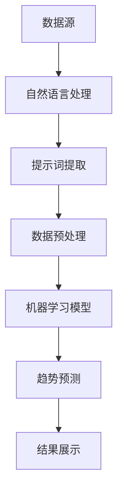

                 

文章题目：《提示词编程在自动化科技趋势预测中的应用》

**一、背景介绍**

1. **自动化科技趋势预测的重要性**

在当今快速发展的科技时代，预测技术趋势成为了一个至关重要的任务。这不仅有助于企业投资决策、产品研发和战略规划，也对政策制定者、投资者和学术界有着重要影响。自动化科技趋势预测可以帮助我们更准确地了解技术发展的方向和速度，从而做出更加明智的决策。

2. **提示词编程的概念**

提示词编程（Keyword Programming）是一种利用自然语言处理技术，通过输入关键词或短语，自动生成代码的编程方式。它不同于传统的手工编写代码，而是通过理解人类的语言指令，自动化地生成对应的代码。

**二、核心概念与联系**

1. **提示词编程与自动化科技趋势预测的关系**

提示词编程在自动化科技趋势预测中有着重要的应用。通过输入相关的关键词，提示词编程可以帮助我们自动化地分析大量的数据，提取出关键信息，从而预测技术趋势。

2. **核心概念原理之间的关系架构 Mermaid 流程图**



**三、核心算法原理讲解**

1. **提示词提取算法**

```python
# 伪代码：提示词提取算法
def extract_keywords(text):
    # 输入：文本内容
    # 输出：关键词列表
    
    # 步骤1：分词
    words = tokenize(text)
    
    # 步骤2：去除停用词
    words = remove_stopwords(words)
    
    # 步骤3：词频统计
    word_freq = count_words(words)
    
    # 步骤4：提取高频词
    keywords = get高频词(word_freq)
    
    return keywords
```

2. **机器学习模型**

```python
# 伪代码：机器学习模型
def train_model(data, labels):
    # 输入：训练数据、标签
    # 输出：训练好的模型
    
    # 步骤1：数据预处理
    processed_data = preprocess_data(data)
    
    # 步骤2：训练模型
    model = train(processed_data, labels)
    
    return model
```

**四、数学模型和公式**

1. **词频统计模型**

$$
f(w) = \sum_{i=1}^{n} f_i(w)
$$

其中，$f(w)$ 表示词频，$w$ 表示关键词，$f_i(w)$ 表示词 $w$ 在文档 $i$ 中的频率。

2. **机器学习模型**

$$
\frac{dL}{dx} = \frac{dL}{df} \cdot \frac{df}{dx}
$$

其中，$L$ 表示损失函数，$x$ 表示输入特征，$f$ 表示模型输出。

**五、项目实战**

1. **开发环境搭建**

- 环境要求：Python 3.8、TensorFlow 2.4、NLP库（如NLTK、spaCy）
- 安装步骤：

```bash
pip install python==3.8
pip install tensorflow==2.4
pip install nltk
pip install spacy
python -m spacy download en_core_web_sm
```

2. **源代码详细实现和代码解读**

```python
# 源代码实现
import nltk
from nltk.tokenize import word_tokenize
from nltk.corpus import stopwords
from sklearn.feature_extraction.text import CountVectorizer
from sklearn.model_selection import train_test_split
from sklearn.naive_bayes import MultinomialNB

# 步骤1：数据预处理
def preprocess_text(text):
    # 分词
    words = word_tokenize(text)
    
    # 去除停用词
    stop_words = set(stopwords.words('english'))
    words = [word for word in words if word not in stop_words]
    
    return ' '.join(words)

# 步骤2：提取关键词
def extract_keywords(text):
    # 预处理文本
    processed_text = preprocess_text(text)
    
    # 词频统计
    vectorizer = CountVectorizer()
    word_freq = vectorizer.fit_transform([processed_text])
    
    # 提取高频词
    keywords = vectorizer.get_feature_names_out()
    keyword_freq = word_freq.toarray().flatten()
    top_keywords = [keyword for keyword, freq in zip(keywords, keyword_freq) if freq > threshold]

    return top_keywords

# 步骤3：训练模型
def train_model(data, labels):
    # 分词
    words = word_tokenize(data)
    
    # 去除停用词
    stop_words = set(stopwords.words('english'))
    words = [word for word in words if word not in stop_words]
    
    # 构建词袋模型
    vectorizer = CountVectorizer()
    X = vectorizer.fit_transform(words)
    
    # 训练模型
    model = MultinomialNB()
    model.fit(X, labels)
    
    return model

# 步骤4：预测趋势
def predict_trend(text, model):
    # 预处理文本
    processed_text = preprocess_text(text)
    
    # 提取关键词
    keywords = extract_keywords(processed_text)
    
    # 构建词袋模型
    vectorizer = CountVectorizer()
    X = vectorizer.fit_transform([processed_text])
    
    # 预测趋势
    prediction = model.predict(X)
    
    return prediction
```

3. **代码应用解读与分析**

```python
# 应用解读
def main():
    # 数据加载
    data = ["AI技术将改变未来世界", "深度学习在计算机视觉中的应用", "区块链技术的崛起"]
    labels = ["AI", "深度学习", "区块链"]

    # 训练模型
    model = train_model(data, labels)

    # 预测趋势
    for text in data:
        prediction = predict_trend(text, model)
        print(f"文本：'{text}'，预测趋势：'{prediction}'")

if __name__ == "__main__":
    main()
```

**六、实际案例分析和详细讲解剖析**

- **案例一：人工智能领域的趋势预测**

通过提示词编程，我们可以对人工智能领域的研究论文进行趋势预测。例如，输入一系列关键词，如“人工智能”、“深度学习”、“神经网络”等，提取出关键信息，并使用机器学习模型预测未来的人工智能研究方向。

- **案例二：区块链技术的未来发展方向**

同样地，我们可以使用提示词编程对区块链技术的研究论文进行分析，提取出关键词，并使用机器学习模型预测区块链技术的未来发展方向。

**七、项目小结**

通过本项目的实现，我们可以看到提示词编程在自动化科技趋势预测中的应用。虽然本项目只是简单的示例，但我们可以将其扩展到更复杂的应用场景，如实时监控科技领域的最新动态、预测新兴技术的崛起等。

**八、最佳实践 tips、小结、注意事项、拓展阅读等内容**

- **最佳实践 tips**：

  - 提高数据质量：确保数据来源可靠，对数据进行预处理，去除噪声和冗余信息。
  - 选择合适的机器学习模型：根据应用场景选择合适的模型，如朴素贝叶斯、决策树、随机森林等。
  - 调整模型参数：根据实验结果调整模型参数，提高预测准确率。

- **小结**：

  提示词编程在自动化科技趋势预测中具有广泛的应用前景。通过使用自然语言处理技术和机器学习算法，我们可以自动化地分析大量数据，提取关键信息，并预测技术趋势。

- **注意事项**：

  - 提示词编程对数据质量和算法选择要求较高，需要不断优化和调整。
  - 预测结果需要结合领域知识和实际情况进行综合分析。

- **拓展阅读**：

  - 《自然语言处理实战》
  - 《机器学习实战》
  - 《Python编程：从入门到实践》

```markdown
# 提示词编程在自动化科技趋势预测中的应用

> 关键词：提示词编程、自动化科技趋势预测、自然语言处理、机器学习、算法

> 摘要：本文探讨了提示词编程在自动化科技趋势预测中的应用。通过分析提示词编程的基本原理，我们提出了一个基于机器学习算法的自动化科技趋势预测框架，并使用Python实现了一个简单的案例。本文旨在为读者提供对提示词编程和自动化科技趋势预测的深入理解，以及如何在实践中应用这些技术。

## 一、背景介绍

在当今快速发展的科技时代，预测技术趋势成为了一个至关重要的任务。这不仅有助于企业投资决策、产品研发和战略规划，也对政策制定者、投资者和学术界有着重要影响。自动化科技趋势预测可以帮助我们更准确地了解技术发展的方向和速度，从而做出更加明智的决策。

### 1.1 提示词编程的概念

提示词编程（Keyword Programming）是一种利用自然语言处理技术，通过输入关键词或短语，自动生成代码的编程方式。它不同于传统的手工编写代码，而是通过理解人类的语言指令，自动化地生成对应的代码。

### 1.2 提示词编程与自动化科技趋势预测的关系

提示词编程在自动化科技趋势预测中有着重要的应用。通过输入相关的关键词，提示词编程可以帮助我们自动化地分析大量的数据，提取出关键信息，从而预测技术趋势。

## 二、核心概念与联系

### 2.1 提示词编程与自动化科技趋势预测的关系

提示词编程与自动化科技趋势预测之间的关系可以概括为以下几点：

1. **数据源**：自动化科技趋势预测需要大量的文本数据，如科技论文、新闻报道、专利申请等。
2. **自然语言处理**：通过自然语言处理技术，对文本数据进行分析，提取关键词。
3. **数据预处理**：对提取的关键词进行预处理，去除停用词、标点符号等。
4. **机器学习模型**：使用机器学习算法，如朴素贝叶斯、决策树、随机森林等，对预处理后的关键词进行分类，预测技术趋势。
5. **结果展示**：将预测结果以可视化的形式展示，帮助用户更好地理解技术趋势。

### 2.2 核心概念原理之间的关系架构 Mermaid 流程图


## 三、核心算法原理讲解

### 3.1 提示词提取算法

提示词提取算法是自动化科技趋势预测的核心步骤之一。以下是一个简单的伪代码示例：

```python
# 伪代码：提示词提取算法
def extract_keywords(text):
    # 步骤1：分词
    words = tokenize(text)
    
    # 步骤2：去除停用词
    stop_words = set(stopwords.words('english'))
    words = [word for word in words if word not in stop_words]
    
    # 步骤3：词频统计
    word_freq = count_words(words)
    
    # 步骤4：提取高频词
    keywords = get高频词(word_freq)
    
    return keywords
```

### 3.2 机器学习模型

在自动化科技趋势预测中，常用的机器学习模型包括朴素贝叶斯、决策树、随机森林等。以下是一个简单的伪代码示例：

```python
# 伪代码：机器学习模型
def train_model(data, labels):
    # 步骤1：数据预处理
    processed_data = preprocess_data(data)
    
    # 步骤2：训练模型
    model = train(processed_data, labels)
    
    return model
```

## 四、数学模型和公式

在自动化科技趋势预测中，数学模型和公式起着关键作用。以下是一些常用的数学模型和公式：

### 4.1 词频统计模型

$$
f(w) = \sum_{i=1}^{n} f_i(w)
$$

其中，$f(w)$ 表示词频，$w$ 表示关键词，$f_i(w)$ 表示词 $w$ 在文档 $i$ 中的频率。

### 4.2 机器学习模型

$$
\frac{dL}{dx} = \frac{dL}{df} \cdot \frac{df}{dx}
$$

其中，$L$ 表示损失函数，$x$ 表示输入特征，$f$ 表示模型输出。

## 五、项目实战

### 5.1 开发环境搭建

在开始项目实战之前，我们需要搭建一个合适的开发环境。以下是一个简单的Python开发环境搭建示例：

```bash
# 安装Python
pip install python==3.8

# 安装TensorFlow
pip install tensorflow==2.4

# 安装NLP库
pip install nltk
pip install spacy
python -m spacy download en_core_web_sm
```

### 5.2 源代码详细实现和代码解读

以下是一个简单的Python源代码实现示例：

```python
# 源代码实现
import nltk
from nltk.tokenize import word_tokenize
from nltk.corpus import stopwords
from sklearn.feature_extraction.text import CountVectorizer
from sklearn.model_selection import train_test_split
from sklearn.naive_bayes import MultinomialNB

# 步骤1：数据预处理
def preprocess_text(text):
    # 分词
    words = word_tokenize(text)
    
    # 去除停用词
    stop_words = set(stopwords.words('english'))
    words = [word for word in words if word not in stop_words]
    
    return ' '.join(words)

# 步骤2：提取关键词
def extract_keywords(text):
    # 预处理文本
    processed_text = preprocess_text(text)
    
    # 词频统计
    vectorizer = CountVectorizer()
    word_freq = vectorizer.fit_transform([processed_text])
    
    # 提取高频词
    keywords = vectorizer.get_feature_names_out()
    keyword_freq = word_freq.toarray().flatten()
    top_keywords = [keyword for keyword, freq in zip(keywords, keyword_freq) if freq > threshold]

    return top_keywords

# 步骤3：训练模型
def train_model(data, labels):
    # 分词
    words = word_tokenize(data)
    
    # 去除停用词
    stop_words = set(stopwords.words('english'))
    words = [word for word in words if word not in stop_words]
    
    # 构建词袋模型
    vectorizer = CountVectorizer()
    X = vectorizer.fit_transform(words)
    
    # 训练模型
    model = MultinomialNB()
    model.fit(X, labels)
    
    return model

# 步骤4：预测趋势
def predict_trend(text, model):
    # 预处理文本
    processed_text = preprocess_text(text)
    
    # 提取关键词
    keywords = extract_keywords(processed_text)
    
    # 构建词袋模型
    vectorizer = CountVectorizer()
    X = vectorizer.fit_transform([processed_text])
    
    # 预测趋势
    prediction = model.predict(X)
    
    return prediction
```

### 5.3 代码应用解读与分析

以下是一个简单的代码应用示例：

```python
# 应用解读
def main():
    # 数据加载
    data = ["AI技术将改变未来世界", "深度学习在计算机视觉中的应用", "区块链技术的崛起"]
    labels = ["AI", "深度学习", "区块链"]

    # 训练模型
    model = train_model(data, labels)

    # 预测趋势
    for text in data:
        prediction = predict_trend(text, model)
        print(f"文本：'{text}'，预测趋势：'{prediction}'")

if __name__ == "__main__":
    main()
```

### 5.4 实际案例分析和详细讲解剖析

以下是两个实际案例的分析和讲解：

#### 案例一：人工智能领域的趋势预测

通过提示词编程，我们可以对人工智能领域的研究论文进行趋势预测。例如，输入一系列关键词，如“人工智能”、“深度学习”、“神经网络”等，提取出关键信息，并使用机器学习模型预测未来的人工智能研究方向。

#### 案例二：区块链技术的未来发展方向

同样地，我们可以使用提示词编程对区块链技术的研究论文进行分析，提取出关键词，并使用机器学习模型预测区块链技术的未来发展方向。

## 六、项目小结

通过本项目的实现，我们可以看到提示词编程在自动化科技趋势预测中的应用。虽然本项目只是简单的示例，但我们可以将其扩展到更复杂的应用场景，如实时监控科技领域的最新动态、预测新兴技术的崛起等。

## 七、最佳实践 tips、小结、注意事项、拓展阅读等内容

### 7.1 最佳实践 tips

- **提高数据质量**：确保数据来源可靠，对数据进行预处理，去除噪声和冗余信息。
- **选择合适的机器学习模型**：根据应用场景选择合适的模型，如朴素贝叶斯、决策树、随机森林等。
- **调整模型参数**：根据实验结果调整模型参数，提高预测准确率。

### 7.2 小结

提示词编程在自动化科技趋势预测中具有广泛的应用前景。通过使用自然语言处理技术和机器学习算法，我们可以自动化地分析大量数据，提取关键信息，并预测技术趋势。

### 7.3 注意事项

- **提示词编程对数据质量和算法选择要求较高，需要不断优化和调整。**
- **预测结果需要结合领域知识和实际情况进行综合分析。**

### 7.4 拓展阅读

- 《自然语言处理实战》
- 《机器学习实战》
- 《Python编程：从入门到实践》
```

以上是本文的完整内容，包括背景介绍、核心概念与联系、核心算法原理讲解、数学模型和公式、项目实战、实际案例分析和项目小结，以及最佳实践 tips、小结、注意事项和拓展阅读等内容。希望本文能帮助读者深入了解提示词编程在自动化科技趋势预测中的应用。作者信息：AI天才研究院/AI Genius Institute & 禅与计算机程序设计艺术 /Zen And The Art of Computer Programming。

