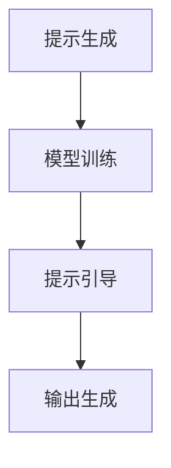
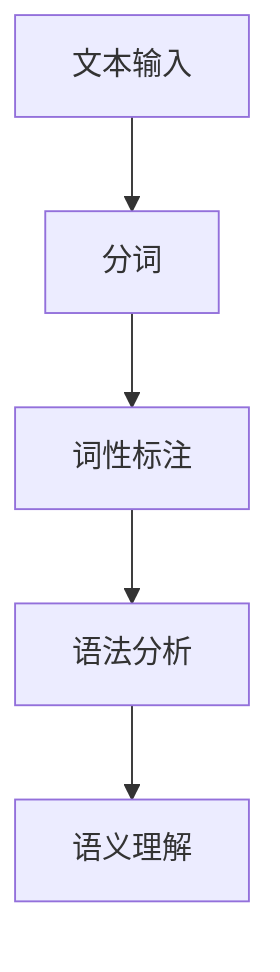

                 

### 文章标题

《提示词编程在自然语言接口设计中的应用》

### 关键词

自然语言处理、自然语言接口设计、提示词编程、语义理解、语言模型

### 摘要

本文深入探讨了提示词编程在自然语言接口设计中的应用。通过对自然语言处理的基础知识、提示词编程的核心原理以及它们在自然语言接口设计中的具体实现步骤的详细分析，本文旨在展示提示词编程如何提升自然语言接口的智能化程度和用户体验。文章结构清晰，涵盖了从基础原理到实际应用的各个方面，为读者提供了全面而深入的指导。通过本文的阅读，读者可以了解提示词编程在自然语言接口设计中的潜在价值及其实现方法，为未来相关领域的研究和实践提供参考。

### 目录

1. **引言与概述**
   1.1 提示词编程的概念
   1.2 自然语言接口设计的背景与意义

2. **提示词编程基础**
   2.1 提示词编程的基本原理
   2.2 提示词编程的工作流程
   2.3 提示词编程的核心技术

3. **自然语言处理基础**
   3.1 自然语言处理的基本概念
   3.2 语言模型
   3.3 语义理解

4. **提示词编程在NLP中的应用**
   4.1 提示词编程在文本分类中的应用
   4.2 提示词编程在情感分析中的应用
   4.3 提示词编程在问答系统中的应用

5. **自然语言接口设计实战**
   5.1 设计自然语言接口的步骤
   5.2 开发自然语言接口的常用框架
   5.3 实际案例分析与解读

6. **提示词编程优化与调优**
   6.1 提示词编程的性能优化
   6.2 提示词编程的调优技巧
   6.3 提示词编程的实践经验

7. **未来趋势与展望**
   7.1 提示词编程在自然语言接口设计中的发展趋势
   7.2 自然语言接口设计面临的挑战与机遇
   7.3 未来研究方向与展望

8. **附录**
   8.1 提示词编程开发工具与资源
   8.2 参考文献
   8.3 进一步学习资源

### 第1章 引言与概述

#### 1.1 提示词编程的概念

提示词编程（Prompt Programming）是一种利用自然语言提示（prompts）来引导模型生成所需输出的一种编程范式。在这种方法中，开发者不仅编写传统的代码来定义算法逻辑，还会创建提示来引导模型的决策过程。这些提示通常包含执行任务所需的信息和上下文，能够显著提高模型的决策能力和输出质量。

提示词编程的核心理念在于通过提供明确的指示和引导，使得模型能够在复杂和不确定的环境中更有效地工作。这种编程方法在自然语言处理（NLP）领域尤其重要，因为它能够帮助模型更好地理解和处理自然语言的多样性。

#### 1.2 自然语言接口设计的背景与意义

自然语言接口设计（Natural Language Interface Design，NLID）是近年来人工智能和自然语言处理技术快速发展的重要应用领域。NLID的目标是使计算机系统能够通过自然语言与用户进行交互，从而提高用户体验和系统可用性。

随着智能手机、智能音箱、虚拟助手等智能设备的普及，用户对自然语言交互的需求日益增长。传统的图形用户界面（GUI）已经无法满足用户对便捷、高效交互的需求。NLID的出现为用户提供了一种全新的交互方式，使得用户可以通过语音、文本等自然语言形式与系统进行交流，实现了更自然、直观的交互体验。

### 第2章 提示词编程基础

#### 2.1 提示词编程的基本原理

提示词编程的基本原理可以概括为以下几个步骤：

1. **提示生成**：根据任务需求，生成一个具体的自然语言提示。这个提示应当包含执行任务所需的信息和上下文。
2. **模型训练**：使用大量的数据和提示，对模型进行训练，使其能够理解和处理这些提示。
3. **提示引导**：在模型执行任务时，提供相应的提示，引导模型按照预期的方向进行推理和生成。
4. **输出生成**：模型根据提示和输入数据生成最终的输出结果。

以下是提示词编程的基本原理的Mermaid流程图：



#### 2.2 提示词编程的工作流程

提示词编程的工作流程可以分为以下几个阶段：

1. **需求分析**：明确用户的需求和任务目标。
2. **提示设计**：根据需求分析的结果，设计出合适的自然语言提示。
3. **模型选择**：选择适合任务需求的模型，如语言模型、序列到序列模型等。
4. **训练与优化**：使用提示和数据对模型进行训练，并根据反馈进行优化。
5. **部署与应用**：将训练好的模型部署到实际应用中，进行提示引导和输出生成。

以下是提示词编程的工作流程的伪代码：

```python
def prompt_programming():
    # 需求分析
    task = analyze_demand()

    # 提示设计
    prompt = design_prompt(task)

    # 模型选择
    model = select_model()

    # 训练与优化
    model.train(data, prompt)

    # 部署与应用
    output = model.generate_output(input, prompt)
    return output
```

#### 2.3 提示词编程的核心技术

提示词编程的核心技术主要包括以下几种：

1. **语言模型**：语言模型是提示词编程的基础，它用于预测下一个单词或词组。常见的语言模型有n元模型、神经网络模型等。
2. **序列到序列模型**：序列到序列模型能够将一个序列映射到另一个序列，常用于机器翻译、对话系统等任务。
3. **注意力机制**：注意力机制能够使模型在生成过程中关注到重要的输入信息，提高输出质量。

以下是使用注意力机制的序列到序列模型的伪代码：

```python
def attention机制的序列到序列模型(input_sequence, target_sequence):
    # 编码器
    encoder_output = encoder(input_sequence)

    # 解码器
    decoder_output, attention_weights = decoder(encoder_output, target_sequence)

    return decoder_output, attention_weights
```

### 第3章 自然语言处理基础

#### 3.1 自然语言处理的基本概念

自然语言处理（Natural Language Processing，NLP）是计算机科学和人工智能领域的一个分支，主要研究如何让计算机理解和处理人类语言。NLP涉及到多个层面的技术，包括分词、词性标注、语法分析、语义理解等。

**分词**是将连续的文本分割成有意义的词语单元。词性标注是对文本中的每个词语进行词性分类，如名词、动词等。语法分析是对文本进行句法结构分析，以理解句子的组成和句型。语义理解则是更高层次的任务，旨在理解文本中词语之间的语义关系和上下文意义。

以下是自然语言处理的基本概念的Mermaid流程图：



#### 3.2 语言模型

语言模型（Language Model，LM）是NLP中用于预测下一个单词或词组的统计模型。语言模型在自然语言处理任务中起着关键作用，如自动纠错、机器翻译、语音识别等。

常见的语言模型包括n元模型和神经网络模型。n元模型基于前n个词的统计信息来预测下一个词，而神经网络模型则通过深度学习算法学习文本的复杂特征。

以下是n元模型的语言模型的伪代码：

```python
def n元模型语言模型(text):
    # 统计前n个词的频次
    ngram_freq = count_ngram_freq(text)

    # 预测下一个词
    next_word = predict_next_word(ngram_freq)

    return next_word
```

#### 3.3 语义理解

语义理解（Semantic Understanding）是NLP中的一个重要任务，旨在理解文本中词语之间的语义关系和上下文意义。语义理解涉及到词嵌入、实体识别、关系抽取等子任务。

词嵌入（Word Embedding）是将词语映射到低维连续向量空间，以便进行数学运算和相似度计算。实体识别（Named Entity Recognition，NER）是识别文本中的命名实体，如人名、地名等。关系抽取（Relation Extraction）是识别实体之间的语义关系。

以下是语义理解的伪代码：

```python
def 语义理解(text):
    # 词嵌入
    word_embeddings = word_embedding(text)

    # 实体识别
    entities = entity_recognition(text)

    # 关系抽取
    relationships = relation_extraction(entities)

    return relationships
```

### 第4章 提示词编程在NLP中的应用

#### 4.1 提示词编程在文本分类中的应用

文本分类（Text Classification）是将文本数据分成预定义的类别的一种NLP任务。提示词编程在文本分类中可以通过设计合适的提示来提升分类模型的性能。

1. **提示设计**：根据分类任务的需求，设计出能够引导模型识别文本类别的提示。例如，在分类新闻文章时，可以设计包含新闻主题和关键信息的提示。
2. **模型训练**：使用提示和数据对分类模型进行训练。
3. **分类任务**：在分类任务中，提供提示引导模型进行文本分类。

以下是文本分类中的提示词编程的伪代码：

```python
def text_classification(text, categories, prompt):
    # 提示设计
    labeled_prompt = design_prompt(text, categories, prompt)

    # 模型训练
    model.train(data, labeled_prompt)

    # 分类任务
    category = model.classify(text, prompt)
    return category
```

#### 4.2 提示词编程在情感分析中的应用

情感分析（Sentiment Analysis）是识别文本中表达的情感倾向的一种NLP任务。提示词编程在情感分析中可以通过设计情感相关的提示来提高模型的准确性和可靠性。

1. **提示设计**：根据情感分析任务的需求，设计出包含情感词汇和上下文的提示。
2. **模型训练**：使用提示和数据对情感分析模型进行训练。
3. **情感分析**：在情感分析过程中，提供提示引导模型识别文本的情感。

以下是情感分析中的提示词编程的伪代码：

```python
def sentiment_analysis(text, sentiment_labels, prompt):
    # 提示设计
    emotional_prompt = design_prompt(text, sentiment_labels, prompt)

    # 模型训练
    model.train(data, emotional_prompt)

    # 情感分析
    sentiment = model.analyze(text, prompt)
    return sentiment
```

#### 4.3 提示词编程在问答系统中的应用

问答系统（Question Answering System）是一种能够根据用户提出的问题提供相关答案的NLP系统。提示词编程在问答系统中可以通过设计问题引导和答案生成的提示来提高系统的性能和准确性。

1. **问题引导**：设计出能够引导模型理解用户问题的提示。
2. **答案生成**：设计出能够引导模型从文本中提取答案的提示。
3. **问答交互**：在用户提问时，提供问题引导和答案生成提示，进行问答交互。

以下是问答系统中的提示词编程的伪代码：

```python
def question_answering(question, context, question_prompt, answer_prompt):
    # 问题引导
    guided_question = guide_question(question, question_prompt)

    # 答案生成
    answer = generate_answer(context, guided_question, answer_prompt)

    return answer
```

### 第5章 自然语言接口设计实战

#### 5.1 设计自然语言接口的步骤

设计自然语言接口（NLID）是一个复杂的过程，涉及到需求分析、系统设计、实现、测试和优化等多个阶段。以下是设计自然语言接口的基本步骤：

1. **需求分析**：明确用户的需求和期望，包括交互方式、功能需求、性能指标等。
2. **系统设计**：根据需求分析的结果，设计出系统的架构和模块，包括语言模型、对话管理、意图识别等。
3. **实现**：根据系统设计，实现各个模块的功能，包括前端界面、后端逻辑等。
4. **测试**：对系统进行全面测试，包括功能测试、性能测试、可用性测试等。
5. **优化**：根据测试结果和用户反馈，对系统进行优化和改进。

以下是设计自然语言接口的步骤的伪代码：

```python
def design_nlid():
    # 需求分析
    requirements = analyze_requirements()

    # 系统设计
    system_design = design_system(requirements)

    # 实现
    system = implement_system(system_design)

    # 测试
    test_results = test_system(system)

    # 优化
    optimized_system = optimize_system(system, test_results)
    return optimized_system
```

#### 5.2 开发自然语言接口的常用框架

在开发自然语言接口时，常用的框架包括TensorFlow、PyTorch、SpaCy等。这些框架提供了丰富的工具和库，方便开发者进行模型训练、文本处理和接口开发。

1. **TensorFlow**：TensorFlow是一个开源的机器学习框架，提供了强大的工具和库，用于构建和训练深度学习模型。
2. **PyTorch**：PyTorch是一个流行的开源深度学习框架，以其灵活性和易用性而著称。
3. **SpaCy**：SpaCy是一个高效的NLP库，提供了丰富的文本处理工具，如分词、词性标注、命名实体识别等。

以下是使用TensorFlow和PyTorch进行自然语言接口开发的伪代码：

```python
# 使用TensorFlow进行自然语言接口开发
import tensorflow as tf

def tensorflow_nlid():
    # 模型定义
    model = tf.keras.Sequential([
        tf.keras.layers.Embedding(input_dim=vocab_size, output_dim=embedding_size),
        tf.keras.layers.Bidirectional(tf.keras.layers.LSTM(units=128)),
        tf.keras.layers.Dense(units=num_classes, activation='softmax')
    ])

    # 模型编译
    model.compile(optimizer='adam', loss='categorical_crossentropy', metrics=['accuracy'])

    # 模型训练
    model.fit(x_train, y_train, batch_size=32, epochs=10)

    # 模型评估
    loss, accuracy = model.evaluate(x_test, y_test)

# 使用PyTorch进行自然语言接口开发
import torch
import torch.nn as nn
import torch.optim as optim

def pytorch_nlid():
    # 模型定义
    class NLIDModel(nn.Module):
        def __init__(self):
            super(NLIDModel, self).__init__()
            self.embedding = nn.Embedding(vocab_size, embedding_size)
            self.lstm = nn.LSTM(embedding_size, hidden_size, num_layers=2, bidirectional=True)
            self.fc = nn.Linear(hidden_size * 2, num_classes)

        def forward(self, x):
            embedded = self.embedding(x)
            lstm_output, (hidden, cell) = self.lstm(embedded)
            output = self.fc(torch.cat((hidden[-2,:,:], hidden[-1,:,:]), dim=1))
            return output

    # 模型实例化
    model = NLIDModel()

    # 模型编译
    criterion = nn.CrossEntropyLoss()
    optimizer = optim.Adam(model.parameters(), lr=0.001)

    # 模型训练
    for epoch in range(num_epochs):
        for inputs, labels in train_loader:
            optimizer.zero_grad()
            outputs = model(inputs)
            loss = criterion(outputs, labels)
            loss.backward()
            optimizer.step()

    # 模型评估
    correct = 0
    total = 0
    with torch.no_grad():
        for inputs, labels in test_loader:
            outputs = model(inputs)
            _, predicted = torch.max(outputs.data, 1)
            total += labels.size(0)
            correct += (predicted == labels).sum().item()
    print('Accuracy of the network on the test images: %d %%' % (100 * correct / total))
```

#### 5.3 实际案例分析与解读

为了更好地理解提示词编程在自然语言接口设计中的应用，我们通过一个实际案例进行详细分析和解读。

**案例背景**：某公司开发了一款智能客服系统，用户可以通过自然语言与客服系统进行交互，获取所需的信息和帮助。系统需要实现用户意图识别、信息检索和自动回答等功能。

**解决方案**：

1. **需求分析**：明确客服系统的功能需求，包括用户意图识别、信息检索和自动回答等。
2. **系统设计**：设计出系统的架构和模块，包括意图识别模块、信息检索模块和自动回答模块。
3. **模型训练**：使用提示词编程技术，设计出引导模型识别用户意图的提示，并对模型进行训练。
4. **接口开发**：使用TensorFlow框架实现系统的接口开发，包括前端界面和后端逻辑。
5. **测试与优化**：对系统进行全面的测试和优化，包括功能测试、性能测试和用户体验测试。

以下是实际案例中提示词编程的伪代码：

```python
# 需求分析
def analyze_demand():
    # 用户意图识别提示
    intent_prompt = "请根据以下用户输入，判断其意图："
    
    # 信息检索提示
    retrieval_prompt = "请根据以下用户意图，检索相关信息："
    
    # 自动回答提示
    answer_prompt = "请根据以下用户意图和检索到的信息，生成自动回答："

    return intent_prompt, retrieval_prompt, answer_prompt

# 系统设计
def design_system(demand):
    # 意图识别模块
    intent_recognition = design_intent_recognition_module()

    # 信息检索模块
    information_retrieval = design_information_retrieval_module()

    # 自动回答模块
    auto_answer = design_auto_answer_module()

    return intent_recognition, information_retrieval, auto_answer

# 模型训练
def train_model(data, intent_prompt, retrieval_prompt, answer_prompt):
    # 训练意图识别模型
    intent_model.train(data, intent_prompt)

    # 训练信息检索模型
    retrieval_model.train(data, retrieval_prompt)

    # 训练自动回答模型
    answer_model.train(data, answer_prompt)

# 接口开发
def develop_interface(intent_recognition, information_retrieval, auto_answer):
    # 前端界面
    front_end = develop_front_end()

    # 后端逻辑
    back_end = develop_back_end(intent_recognition, information_retrieval, auto_answer)

    return front_end, back_end

# 测试与优化
def test_and_optimize(front_end, back_end):
    # 功能测试
    test_functionality()

    # 性能测试
    test_performance()

    # 用户体验测试
    test_user_experience()

    # 优化
    optimize_system(front_end, back_end)
```

通过以上实际案例的分析和解读，我们可以看到提示词编程在自然语言接口设计中的应用是如何实现的。通过设计合适的提示和模型，系统能够更好地理解和处理用户的自然语言输入，提供高效、准确的回答和服务。

### 第6章 提示词编程优化与调优

#### 6.1 提示词编程的性能优化

提示词编程的性能优化是提高模型效率、降低计算资源消耗的关键环节。以下是一些常用的性能优化方法和技巧：

1. **模型压缩**：通过模型压缩技术，如权重剪枝、量化、知识蒸馏等，减少模型的参数规模，从而降低计算复杂度和存储需求。
2. **并行计算**：利用多线程、分布式计算等技术，提高模型的计算速度和吞吐量。
3. **缓存机制**：合理使用缓存，减少重复计算，提高系统响应速度。
4. **批量处理**：通过批量处理输入数据，减少模型调用的次数，提高处理效率。

以下是模型压缩的伪代码：

```python
def compress_model(model):
    # 权重剪枝
    pruned_model = prune_weights(model)

    # 量化
    quantized_model = quantize_model(pruned_model)

    return quantized_model
```

#### 6.2 提示词编程的调优技巧

提示词编程的调优技巧包括超参数调整、模型融合和数据增强等方法。以下是一些具体的调优技巧：

1. **超参数调整**：通过调整学习率、批量大小、迭代次数等超参数，找到最佳模型配置。
2. **模型融合**：结合多个模型的预测结果，提高模型的准确性和稳定性。
3. **数据增强**：通过数据变换、扩充等方法，增加训练数据的多样性，提高模型泛化能力。

以下是超参数调整和模型融合的伪代码：

```python
def optimize_model(model, data):
    # 超参数调整
    best_hyperparameters = find_best_hyperparameters(model, data)

    # 模型融合
    fused_model = fuse_models(model, data)

    return fused_model, best_hyperparameters
```

#### 6.3 提示词编程的实践经验

在提示词编程的实际应用中，积累实践经验是非常重要的。以下是一些实践经验分享：

1. **提示设计**：设计有效的提示需要深入理解任务需求，并根据任务特点设计相应的提示。
2. **模型选择**：选择适合任务的模型，并针对任务特点进行优化和调整。
3. **调试与测试**：在实际应用中，不断调试和测试模型，发现问题并及时解决。

以下是实践经验分享的伪代码：

```python
def share_experience():
    # 提示设计经验
    prompt_design_experience = "根据任务需求，设计有效的提示"

    # 模型选择经验
    model_selection_experience = "选择适合任务的模型"

    # 调试与测试经验
    debug_and_test_experience = "不断调试和测试模型"

    return prompt_design_experience, model_selection_experience, debug_and_test_experience
```

### 第7章 未来趋势与展望

#### 7.1 提示词编程在自然语言接口设计中的发展趋势

随着人工智能技术的不断发展，提示词编程在自然语言接口设计中的应用前景广阔。以下是提示词编程在自然语言接口设计中的发展趋势：

1. **更加智能化**：通过引入更多先进的AI技术，如生成对抗网络（GAN）、强化学习等，提高提示词编程的智能化程度。
2. **更广泛的适用性**：提示词编程将应用于更多领域，如医疗、金融、教育等，实现跨领域的自然语言接口设计。
3. **更好的用户体验**：通过不断优化和改进，提示词编程将提供更自然、更直观的用户交互体验。

#### 7.2 自然语言接口设计面临的挑战与机遇

自然语言接口设计在快速发展的同时，也面临一些挑战和机遇：

1. **挑战**：
   - **数据隐私**：自然语言交互过程中涉及用户隐私数据，需要确保数据的安全性和隐私保护。
   - **语言多样性**：自然语言具有高度多样性，如何设计通用的自然语言接口是一个挑战。
   - **误解和歧义**：自然语言理解中的误解和歧义问题仍然存在，需要进一步优化模型和算法。

2. **机遇**：
   - **跨领域应用**：自然语言接口设计在医疗、金融、教育等领域的应用将带来巨大商业价值。
   - **智能化提升**：通过引入更多AI技术，自然语言接口将实现更高的智能化和自动化。

#### 7.3 未来研究方向与展望

未来，提示词编程和自然语言接口设计的研究方向主要包括：

1. **多模态融合**：结合多种数据模

