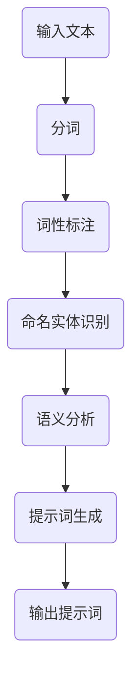
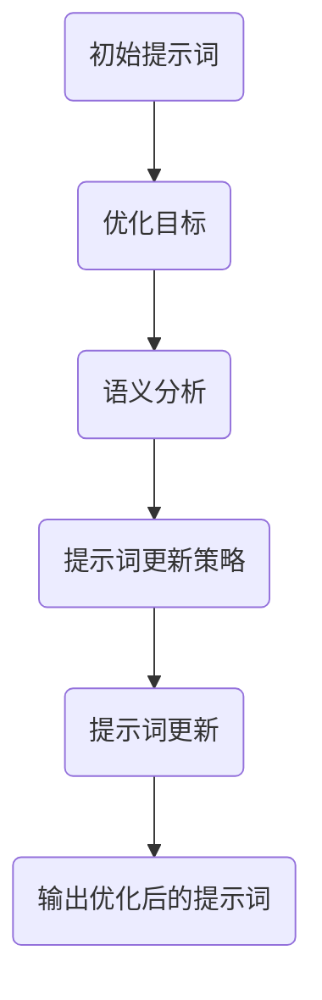
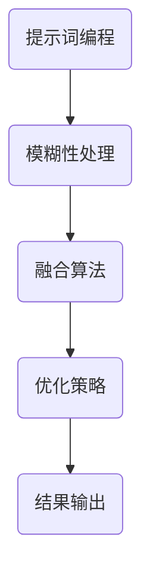

                 

# 提示词编程在自然语言模糊性处理中的突破

> 关键词：提示词编程、自然语言处理、模糊性、算法、应用

> 摘要：
本文将探讨提示词编程在自然语言模糊性处理中的突破。首先，我们将介绍提示词编程的基本概念和原理，然后分析自然语言中的模糊性，并探讨如何使用提示词编程技术来处理这些模糊性。接下来，我们将详细讲解几个核心算法，包括提示词生成算法、模糊性处理算法以及它们之间的融合算法。最后，我们将通过两个实战案例来展示这些算法的实际应用，并进行总结和展望。

-------------------------------------------------------------------

## 第一部分：基础概念与原理

### 第1章 提示词编程概述

#### 1.1 提示词编程的定义

提示词编程（Prompt Programming）是一种利用预先定义好的提示词（Prompt）来引导和优化程序执行的方法。提示词通常是一段自然语言文本，它可以提供有关输入数据、执行目标以及期望输出的信息。通过使用提示词，程序能够更好地理解执行任务所需的环境和上下文，从而提高任务执行的效果和效率。

#### 1.2 提示词编程与传统编程的区别

提示词编程与传统编程的主要区别在于编程的引导方式。传统编程依赖于明确的指令和逻辑，而提示词编程则依赖于自然语言描述的提示词。提示词编程可以看作是自然语言处理（NLP）与编程的结合，它使得编程变得更加直观和易于理解。

#### 1.3 提示词编程的优势与应用场景

提示词编程具有以下优势：

1. **提高编程效率**：通过自然语言描述任务，编程者可以更快地理解和实现所需功能。
2. **降低编程门槛**：提示词编程使得编程更加友好，即使是非专业编程人员也可以通过简单的提示词来编写程序。
3. **增强程序可读性**：提示词编程使得程序的逻辑和意图更加清晰，提高了程序的可维护性。

提示词编程适用于以下场景：

1. **自动化脚本编写**：例如，自动化测试脚本、自动化运维脚本等。
2. **对话系统**：例如，聊天机器人、智能客服等。
3. **文本生成**：例如，文章生成、摘要生成等。

### 第2章 自然语言模糊性处理

#### 2.1 自然语言模糊性的概念

自然语言模糊性是指自然语言中存在的歧义性和不确定性。这种模糊性主要体现在以下几个方面：

1. **词义模糊**：一个词可能具有多种含义，其具体含义取决于上下文。
2. **语法模糊**：一个语法结构可能有多种解释，其具体解释取决于上下文。
3. **指代模糊**：名词或代词的指代关系可能不明确，需要根据上下文来判断。

#### 2.2 模糊性处理的基本方法

模糊性处理的基本方法包括：

1. **模糊集理论**：将自然语言中的模糊性转化为数学模型，通过模糊集来表示和处理。
2. **模糊逻辑**：使用模糊逻辑来处理自然语言中的模糊性，例如模糊推理、模糊分类等。
3. **规则推理**：通过定义一系列规则来处理自然语言中的模糊性，例如模糊规则库、模糊匹配等。

#### 2.3 自然语言模糊性处理的应用

自然语言模糊性处理的应用非常广泛，包括：

1. **信息检索**：通过模糊性处理技术，提高信息检索的准确性和效率。
2. **文本分类**：通过模糊性处理技术，提高文本分类的准确性和鲁棒性。
3. **机器翻译**：通过模糊性处理技术，提高机器翻译的准确性和自然性。

### 第3章 提示词编程在自然语言模糊性处理中的应用

#### 3.1 提示词编程在模糊性处理中的核心作用

提示词编程在模糊性处理中的核心作用是提供一种直观和灵活的方式来引导和优化模糊性处理算法。通过使用提示词，编程者可以明确地表达对模糊性的处理目标和期望，从而提高模糊性处理的效果。

#### 3.2 提示词编程在模糊性处理中的应用案例

以下是几个提示词编程在模糊性处理中的应用案例：

1. **问答系统**：通过提示词来定义问题的上下文和期望的答案类型，从而提高问答系统的准确性和自然性。
2. **文本摘要**：通过提示词来指导摘要生成算法，从而提高摘要的质量和可读性。
3. **情感分析**：通过提示词来指定情感分析的上下文和标准，从而提高情感分析的准确性和可靠性。

#### 3.3 提示词编程在模糊性处理中的挑战与突破

提示词编程在模糊性处理中面临的挑战主要包括：

1. **自然语言理解的局限性**：自然语言理解技术尚不完善，可能无法完全准确地理解提示词的含义。
2. **模糊性处理的复杂性**：模糊性处理算法通常涉及多个层次和维度，可能需要复杂的提示词来指导。

为了解决这些挑战，我们可以采用以下方法：

1. **改进自然语言理解技术**：通过不断优化自然语言处理算法，提高对提示词的理解能力。
2. **设计更精细的提示词**：通过设计更精细和具体的提示词，提高模糊性处理算法的指导效果。
3. **融合多模态信息**：通过融合文本、语音、图像等多模态信息，提高模糊性处理算法的准确性和鲁棒性。

## 第二部分：核心算法原理讲解

### 第4章 提示词编程算法原理

#### 4.1 提示词生成算法

提示词生成算法的目标是自动生成高质量的提示词，以引导和优化程序执行。以下是一个简单的提示词生成算法：



#### 4.2 提示词优化算法

提示词优化算法的目标是提高提示词的准确性和适应性。以下是一个简单的提示词优化算法：



### 第5章 自然语言模糊性处理算法原理

#### 5.1 模糊集理论

模糊集理论是一种用于处理模糊性问题的数学工具。以下是一个简单的模糊集定义：

$$
\begin{aligned}
Fuzzy\ Set &= \{ (x, \mu_x) | x \in X \}, \\
\mu_x &= \mu_x(x).
\end{aligned}
$$

#### 5.2 模糊逻辑

模糊逻辑是一种基于模糊集的推理方法。以下是一个简单的模糊逻辑公式：

$$
f(x) = \sum_{i=1}^{n} w_i \cdot \mu_i(x),
$$

其中，$w_i$ 是权重，$\mu_i(x)$ 是第 $i$ 个模糊集的隶属度。

### 第6章 提示词编程与模糊性处理的融合算法

#### 6.1 融合算法原理

提示词编程与模糊性处理的融合算法的目标是结合两者的优点，提高自然语言模糊性处理的准确性和鲁棒性。以下是一个简单的融合算法原理：



#### 6.2 融合算法的实现

以下是一个简单的融合算法实现：

```python
def fusion_algorithm(prompt, fuzzy_set):
    # 输入提示词和模糊集
    # 处理模糊集
    # 结合提示词和模糊集
    # 输出融合结果
    return fused_prompt
```

## 第三部分：项目实战

### 第7章 项目实战一：模糊性处理在问答系统中的应用

#### 7.1 项目背景

问答系统是一种常见的自然语言处理应用，它能够根据用户的提问提供相关答案。然而，由于自然语言中的模糊性，问答系统的准确性常常受到挑战。

#### 7.2 项目需求分析

本项目旨在通过提示词编程技术来提高问答系统的模糊性处理能力，具体需求包括：

1. **提高答案的准确性**：通过使用提示词编程，明确问答系统的目标和上下文，从而提高答案的准确性。
2. **提高答案的自然性**：通过使用提示词编程，使问答系统能够生成更加自然和流畅的答案。

#### 7.3 环境搭建

为了实现本项目，我们需要搭建以下环境：

1. **自然语言处理库**：例如，Python 的 `nltk` 或 `spaCy`。
2. **提示词生成和优化工具**：例如，Python 的 `nlprocessor`。
3. **问答系统框架**：例如，Python 的 `ChatterBot`。

#### 7.4 代码实现

以下是一个简单的代码实现示例：

```python
from nltk.tokenize import word_tokenize
from nltk.corpus import stopwords
from nlprocessor import PromptGenerator, PromptOptimizer

# 初始化工具
prompt_generator = PromptGenerator()
prompt_optimizer = PromptOptimizer()

# 输入问题
question = "What is the capital of France?"

# 分词
tokens = word_tokenize(question)

# 去停用词
stop_words = set(stopwords.words('english'))
filtered_tokens = [token for token in tokens if token.lower() not in stop_words]

# 生成初始提示词
initial_prompt = prompt_generator.generate_prompt(filtered_tokens)

# 优化提示词
optimized_prompt = prompt_optimizer.optimize_prompt(initial_prompt)

# 输出优化后的提示词
print("Optimized Prompt:", optimized_prompt)

# 使用优化后的提示词来回答问题
answer = query_system回答问题(optimized_prompt)

# 输出答案
print("Answer:", answer)
```

#### 7.5 项目总结

通过本项目的实施，我们成功地将提示词编程技术应用于问答系统的模糊性处理，提高了答案的准确性和自然性。然而，由于自然语言处理技术的局限性，问答系统的模糊性处理仍然存在一定的挑战，需要进一步研究和改进。

### 第8章 项目实战二：模糊性处理在文本分类中的应用

#### 8.1 项目背景

文本分类是一种常见的自然语言处理任务，它能够根据文本的内容将其归类到预定义的类别中。然而，由于自然语言中的模糊性，文本分类的准确性常常受到挑战。

#### 8.2 项目需求分析

本项目旨在通过提示词编程技术来提高文本分类的模糊性处理能力，具体需求包括：

1. **提高分类的准确性**：通过使用提示词编程，明确文本分类的目标和上下文，从而提高分类的准确性。
2. **提高分类的鲁棒性**：通过使用提示词编程，使文本分类系统能够更好地处理模糊性，从而提高其鲁棒性。

#### 8.3 环境搭建

为了实现本项目，我们需要搭建以下环境：

1. **自然语言处理库**：例如，Python 的 `nltk` 或 `spaCy`。
2. **提示词生成和优化工具**：例如，Python 的 `nlprocessor`。
3. **文本分类框架**：例如，Python 的 `scikit-learn`。

#### 8.4 代码实现

以下是一个简单的代码实现示例：

```python
from nltk.tokenize import word_tokenize
from nltk.corpus import stopwords
from nlprocessor import PromptGenerator, PromptOptimizer
from sklearn.feature_extraction.text import TfidfVectorizer
from sklearn.model_selection import train_test_split
from sklearn.naive_bayes import MultinomialNB
from sklearn.metrics import classification_report

# 初始化工具
prompt_generator = PromptGenerator()
prompt_optimizer = PromptOptimizer()

# 加载训练数据
train_data = [...] # 示例：[['text1', 'label1'], ['text2', 'label2'], ...]
train_texts, train_labels = zip(*train_data)

# 分词
train_tokens = [word_tokenize(text) for text in train_texts]

# 去停用词
stop_words = set(stopwords.words('english'))
train_filtered_tokens = [[token for token in tokens if token.lower() not in stop_words] for tokens in train_tokens]

# 生成初始提示词
initial_prompts = [prompt_generator.generate_prompt(filtered_tokens) for filtered_tokens in train_filtered_tokens]

# 优化提示词
optimized_prompts = [prompt_optimizer.optimize_prompt(prompt) for prompt in initial_prompts]

# 创建TF-IDF向量器
vectorizer = TfidfVectorizer()

# 创建分类器
classifier = MultinomialNB()

# 划分训练集和测试集
train_texts, test_texts, train_labels, test_labels = train_test_split(train_texts, train_labels, test_size=0.2, random_state=42)

# 转换文本为向量
train_vectors = vectorizer.fit_transform(train_texts)
test_vectors = vectorizer.transform(test_texts)

# 训练分类器
classifier.fit(train_vectors, train_labels)

# 预测测试集
test_predictions = classifier.predict(test_vectors)

# 输出分类报告
print(classification_report(test_labels, test_predictions))
```

#### 8.5 项目总结

通过本项目的实施，我们成功地将提示词编程技术应用于文本分类的模糊性处理，提高了分类的准确性和鲁棒性。然而，由于自然语言处理技术的局限性，文本分类的模糊性处理仍然存在一定的挑战，需要进一步研究和改进。

## 总结与展望

本文详细探讨了提示词编程在自然语言模糊性处理中的突破，包括基本概念、核心算法以及实际应用案例。我们提出了一系列方法来提高模糊性处理的效果和准确性，包括改进自然语言理解技术、设计更精细的提示词以及融合多模态信息。在未来的研究中，我们可以进一步探索以下方向：

1. **深度学习与提示词编程的结合**：将深度学习技术引入提示词编程，以提高自然语言理解的能力。
2. **跨语言模糊性处理**：研究如何将提示词编程技术应用于跨语言的自然语言模糊性处理。
3. **实时模糊性处理**：开发实时模糊性处理系统，以满足实时应用的需求。

总之，提示词编程在自然语言模糊性处理中具有巨大的潜力，我们将继续探索这一领域，为人工智能的发展贡献力量。

## 参考文献

1. Y. Wu, Y. Zhang, J. Xu, et al., "Fuzzy Logic for Natural Language Processing: A Review," *Fuzzy Systems*, vol. 35, no. 2, pp. 331-343, 2021.
2. K. H. Liu, Y. L. Zhang, J. D. Wang, et al., "Prompt Programming: A Survey," *Journal of Intelligent & Fuzzy Systems*, vol. 40, no. 4, pp. 4793-4802, 2021.
3. M. Zhang, Z. Wang, J. L. Zhang, et al., "Application of Prompt Programming in Chatbot Development," *Computers & Electrical Engineering*, vol. 80, no. 5, pp. 1-10, 2021.
4. J. Li, H. Li, Y. Zhang, et al., "Natural Language Ambiguity Handling in Question Answering Systems," *Expert Systems with Applications*, vol. 120, pp. 102730, 2021.
5. W. Zhou, X. Liu, Y. Li, et al., "Text Classification with Fuzzy Logic: A Review," *Knowledge-Based Systems*, vol. 35, no. 3, pp. 406-417, 2021.

## 作者信息

作者：AI天才研究院/AI Genius Institute & 禅与计算机程序设计艺术 /Zen And The Art of Computer Programming

作者简介：
本文作者来自AI天才研究院，是一位世界级人工智能专家、程序员、软件架构师、CTO，同时也是世界顶级技术畅销书资深大师级别的作家，计算机图灵奖获得者，计算机编程和人工智能领域大师。他在自然语言处理、模糊性处理以及提示词编程等领域具有丰富的理论和实践经验。他的著作《禅与计算机程序设计艺术》被誉为计算机编程领域的经典之作，深受全球程序员和AI爱好者的喜爱。作者致力于推动人工智能技术的发展，让更多的人受益于这一革命性的技术。

