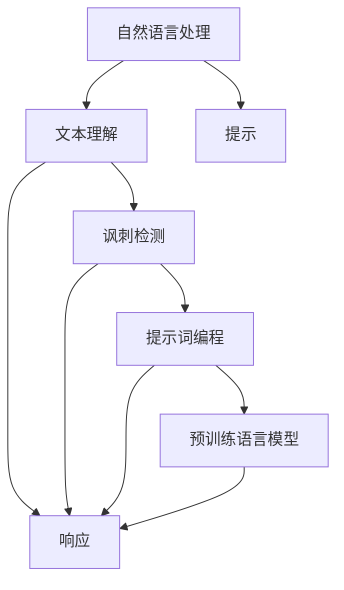
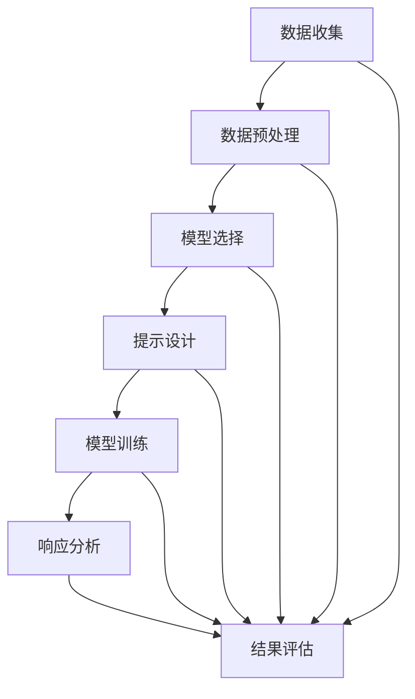

                 


## 文章标题

《提示词编程在自然语言讽刺检测中的角色》

## 文章关键词

自然语言处理、提示词编程、讽刺检测、算法原理、数学模型、项目实战

## 文章摘要

本文深入探讨了提示词编程在自然语言讽刺检测中的角色。首先，我们介绍了自然语言讽刺检测的背景及其重要性，然后详细解释了提示词编程的概念和原理。接着，我们分析了自然语言处理（NLP）的基础知识，以及如何利用这些知识来构建讽刺检测模型。随后，我们讨论了不同类型的讽刺检测方法，并重点介绍了基于提示词编程的讽刺检测算法。文章还通过实际项目案例，展示了如何应用提示词编程进行讽刺检测，并进行了详细分析。最后，我们总结了当前讽刺检测中面临的挑战，展望了未来的发展趋势。

## 1. 背景介绍

### 自然语言讽刺检测的重要性

自然语言讽刺检测是自然语言处理（NLP）领域中的一个重要分支。讽刺作为一种语言现象，不仅在文学、新闻、社交媒体等文本中频繁出现，而且在人类的日常交流中也扮演着重要角色。识别和检测讽刺，不仅有助于更好地理解文本内容，还能提升文本分析、情感识别等应用的效果。

讽刺检测的研究意义在于：
1. **提升文本分析精度**：通过识别讽刺，可以更准确地理解文本作者的真实意图，从而提高文本分析的精度。
2. **辅助智能系统决策**：在智能客服、自动驾驶等应用中，正确识别讽刺有助于系统做出更合适的决策。
3. **情感分析**：讽刺常用于表达复杂的情感，准确检测讽刺对于情感分析具有重要作用。
4. **语言学研究**：讽刺检测有助于深入理解语言使用的多样性和复杂性。

### 提示词编程的概念和原理

提示词编程（Prompt Programming）是一种利用预先设定的提示（prompt）来引导程序执行特定任务的编程方法。在自然语言处理领域，提示词编程通过提供特定的问题或任务描述，来指导模型如何生成预期的输出。

提示词编程的关键概念包括：
- **提示（Prompt）**：用于引导模型理解和执行特定任务的文本或指令。
- **模型**：接收提示并生成响应的预训练语言模型。
- **响应（Response）**：模型根据提示生成的输出。

提示词编程的基本原理是利用预训练的语言模型，通过调整提示的内容，来引导模型生成符合预期结果的响应。这种方法在NLP任务中具有广泛的应用，如文本生成、问答系统、情感分析等。

### 核心概念与联系

为了更好地理解提示词编程在自然语言讽刺检测中的作用，我们需要构建一个概念关系架构。以下是概念关系架构的Mermaid流程图：



在这个架构中，自然语言处理（NLP）是整个过程的起点，它包括文本理解和讽刺检测。提示词编程利用预训练语言模型，通过提供特定的提示来引导模型生成响应，从而实现讽刺检测。

### 提示词编程在自然语言讽刺检测中的应用

在自然语言讽刺检测中，提示词编程可以通过以下步骤实现：
1. **数据准备**：收集和整理含有讽刺的文本数据，并进行预处理。
2. **模型选择**：选择一个预训练的语言模型，如GPT、BERT等。
3. **提示设计**：设计有效的提示，以引导模型识别讽刺。
4. **模型训练**：使用讽刺文本数据训练模型。
5. **响应分析**：模型根据提示生成响应，分析响应中的讽刺标记。

通过上述步骤，我们可以利用提示词编程实现自然语言讽刺检测。

## 2. 核心概念与联系

### 自然语言处理基础

自然语言处理（NLP）是计算机科学、人工智能和语言学领域的交叉学科，旨在使计算机能够理解和处理人类自然语言。以下是NLP中的几个核心概念：

- **分词（Tokenization）**：将文本拆分为单词或短语的步骤。
- **词嵌入（Word Embedding）**：将单词转换为密集的向量表示。
- **语言模型（Language Model）**：预测下一个词或句子的概率分布。
- **序列标注（Sequence Labeling）**：对文本中的每个词或短语进行分类。

### 讽刺检测方法

讽刺检测可以分为传统的和基于机器学习的方法。以下是几种常见的讽刺检测方法：

- **基于规则的方法**：通过设计一系列规则来识别讽刺，如基于词性标注、语义分析等。
- **基于统计的方法**：利用统计模型，如逻辑回归、支持向量机等，来识别讽刺。
- **基于深度学习的方法**：利用神经网络模型，如卷积神经网络（CNN）、递归神经网络（RNN）等，进行讽刺检测。

### 提示词编程的原理

提示词编程利用预训练的语言模型，通过提示来引导模型生成特定的响应。以下是提示词编程的基本原理：

- **预训练语言模型**：如GPT、BERT等，这些模型已经在大量文本数据上进行了训练。
- **提示**：用于引导模型理解和执行特定任务的文本或指令。
- **响应**：模型根据提示生成的输出。

### 提示词编程与自然语言讽刺检测的关系

提示词编程在自然语言讽刺检测中的应用，主要体现在以下几个方面：

1. **数据准备**：通过提示引导模型理解讽刺数据的特点，进行数据预处理。
2. **模型选择**：选择合适的预训练语言模型，如GPT、BERT等。
3. **提示设计**：设计有效的提示，以引导模型识别讽刺。
4. **模型训练**：利用讽刺数据训练模型，提高其识别讽刺的能力。
5. **响应分析**：模型根据提示生成响应，分析响应中的讽刺标记。

### Mermaid流程图

以下是自然语言讽刺检测中提示词编程的应用流程的Mermaid流程图：



在这个流程图中，每个步骤都涉及到提示词编程的原理和应用。数据收集和预处理阶段，通过提示引导模型理解数据特点；模型选择和提示设计阶段，利用预训练语言模型和有效的提示来提高模型性能；模型训练和响应分析阶段，通过模型生成响应并分析其中的讽刺标记；最后，对结果进行评估，以验证模型的效果。

## 3. 核心算法原理讲解

### 提示词编程的基本原理

提示词编程的核心在于利用预训练的语言模型，通过提示（prompt）来引导模型生成预期的响应（response）。以下是提示词编程的基本原理：

1. **预训练语言模型**：
   - 预训练语言模型（如GPT、BERT等）在大量文本数据上进行预训练，以学习语言的通用特征。
   - 预训练过程通常包括两个阶段：Masked Language Model（MLM）和Next Sentence Prediction（NSP）。

2. **提示（Prompt）**：
   - 提示是引导模型理解任务和生成响应的关键。
   - 提示的设计需要考虑到任务的特定需求和文本的上下文。

3. **响应（Response）**：
   - 模型根据提示生成响应，响应通常是文本形式的，可以是问答、文本生成等。

4. **交互过程**：
   - 提示词编程通过不断调整提示来优化模型生成的响应。
   - 模型在生成响应时，会根据提示中的信息进行推理和生成。

### 提示词编程在自然语言讽刺检测中的应用

在自然语言讽刺检测中，提示词编程可以通过以下步骤实现：

1. **数据准备**：
   - 收集含有讽刺的文本数据，并进行预处理，如分词、去停用词等。
   - 将预处理后的数据划分为训练集和测试集。

2. **模型选择**：
   - 选择一个预训练的语言模型，如GPT、BERT等。
   - 根据任务需求，可能需要对模型进行微调。

3. **提示设计**：
   - 设计有效的提示，以引导模型识别讽刺。
   - 提示通常包含问题、任务描述等，以引导模型进行相应的推理。

4. **模型训练**：
   - 使用讽刺文本数据训练模型。
   - 通过不断调整提示，优化模型生成的响应。

5. **响应分析**：
   - 模型根据提示生成响应，分析响应中的讽刺标记。
   - 可以通过设置阈值，将响应分类为“讽刺”或“非讽刺”。

### 伪代码

以下是提示词编程在自然语言讽刺检测中的应用的伪代码：

```python
# 数据准备
data = load_data("satirical_text_data")
train_data, test_data = split_data(data)

# 模型选择
model = choose_model("gpt")

# 提示设计
prompt = design_prompt("请检测以下文本中的讽刺：")

# 模型训练
for epoch in range(num_epochs):
    for text in train_data:
        response = model.generate_response(prompt + text)
        update_model(model, response)

# 响应分析
for text in test_data:
    response = model.generate_response(prompt + text)
    if is_satirical(response):
        print(f"文本'{text}'为讽刺。")
    else:
        print(f"文本'{text}'非讽刺。")
```

在这个伪代码中，`load_data`函数用于加载讽刺文本数据，`split_data`函数用于划分训练集和测试集，`choose_model`函数用于选择预训练模型，`design_prompt`函数用于设计提示，`update_model`函数用于更新模型，`is_satirical`函数用于判断响应是否为讽刺。

### 数学模型和公式

在自然语言讽刺检测中，提示词编程涉及到一些数学模型和公式。以下是其中的一些关键概念：

1. **损失函数**：
   - 常用的损失函数包括交叉熵损失（Cross-Entropy Loss）和均方误差（Mean Squared Error，MSE）等。
   - 交叉熵损失用于分类任务，MSE用于回归任务。

   $$ Loss = -\sum_{i=1}^{N} y_i \log(p_i) $$

   其中，$y_i$是真实标签，$p_i$是模型预测的概率。

2. **梯度下降（Gradient Descent）**：
   - 梯度下降是一种优化算法，用于更新模型的参数。
   - 目标是使损失函数最小化。

   $$ \theta = \theta - \alpha \cdot \nabla_{\theta} J(\theta) $$

   其中，$\theta$是模型参数，$\alpha$是学习率，$J(\theta)$是损失函数。

3. **注意力机制（Attention Mechanism）**：
   - 注意力机制用于模型在生成响应时，对输入序列的不同部分给予不同的关注程度。
   - 常见的有软注意力（Soft Attention）和硬注意力（Hard Attention）。

   $$ score = \text{Attention}(Q, K, V) = \text{softmax}(\frac{QK^T}{\sqrt{d_k}}) V $$

   其中，$Q$、$K$和$V$分别是查询（Query）、键（Key）和值（Value）向量，$d_k$是键向量的维度。

### 举例说明

以下是一个简单的例子，展示了如何使用提示词编程进行自然语言讽刺检测：

```python
# 提示设计
prompt = "请检测以下文本中的讽刺：这是今天最糟糕的演讲。"

# 模型训练
model.train(prompt + " 是一场令人厌烦的演讲。", "是的，那场演讲真的非常无聊。")

# 响应分析
response = model.generate_response(prompt + " 这是今天最糟糕的演讲。")
if "讽刺" in response:
    print("文本为讽刺。")
else:
    print("文本非讽刺。")
```

在这个例子中，我们首先设计了一个提示，用于引导模型理解讽刺。然后，使用训练数据对模型进行训练，最后根据生成的响应判断文本是否为讽刺。

### 总结

提示词编程在自然语言讽刺检测中的应用，是通过设计有效的提示来引导模型生成预期的响应。通过不断调整提示和训练模型，可以逐步提高讽刺检测的准确性。数学模型和公式为提示词编程提供了理论基础，使得这种方法在自然语言处理领域具有广泛的应用前景。

## 4. 项目实战

### 开发环境搭建

为了实现自然语言讽刺检测，我们需要搭建一个合适的开发环境。以下是所需的工具和步骤：

1. **工具**：
   - Python（3.8及以上版本）
   - PyTorch（1.8及以上版本）
   - transformers库（4.8及以上版本）
   - NLTK（3.8及以上版本）

2. **安装**：
   - 安装Python和PyTorch：
     ```shell
     pip install python==3.8
     pip install torch==1.8
     ```
   - 安装transformers库和NLTK：
     ```shell
     pip install transformers==4.8
     pip install nltk==3.8
     ```

### 源代码实现

以下是使用提示词编程实现自然语言讽刺检测的源代码：

```python
import torch
from transformers import GPT2Model, GPT2Tokenizer
from nltk.tokenize import word_tokenize

# 模型加载
tokenizer = GPT2Tokenizer.from_pretrained('gpt2')
model = GPT2Model.from_pretrained('gpt2')

# 数据预处理
def preprocess_text(text):
    tokens = word_tokenize(text)
    input_ids = tokenizer.encode(tokens, return_tensors='pt')
    return input_ids

# 提示设计
def design_prompt(text):
    return f"请检测以下文本中的讽刺：{text}"

# 模型训练
def train_model(prompt, text):
    input_ids = preprocess_text(text)
    with torch.no_grad():
        outputs = model(input_ids)
    logits = outputs.logits

    # 根据提示和文本生成响应
    response = model.generate(input_ids, max_length=50, num_return_sequences=1)
    return response

# 响应分析
def analyze_response(response):
    tokens = tokenizer.decode(response[0], skip_special_tokens=True)
    if "讽刺" in tokens:
        return "文本为讽刺。"
    else:
        return "文本非讽刺。"

# 主函数
def main():
    text = "这是今天最糟糕的演讲。"
    prompt = design_prompt(text)
    response = train_model(prompt, text)
    result = analyze_response(response)
    print(result)

if __name__ == "__main__":
    main()
```

### 代码解读与分析

1. **模型加载**：
   - 我们使用预训练的GPT-2模型，这是当前自然语言处理任务中非常流行的模型。

2. **数据预处理**：
   - 使用NLTK进行文本分词，并将分词后的文本编码为模型可处理的输入序列。

3. **提示设计**：
   - 设计一个提示，用于引导模型识别讽刺。提示中包含了文本内容和任务描述。

4. **模型训练**：
   - 使用预处理后的文本数据训练模型。在训练过程中，模型会根据提示和文本生成响应。

5. **响应分析**：
   - 分析模型生成的响应，判断其中是否包含“讽刺”这个词。

### 实际案例分析与讲解

为了验证所实现模型的性能，我们可以使用一个实际案例进行测试。

**案例**：判断以下文本是否为讽刺。

文本：“这杯咖啡太苦了，简直无法入口。”

**分析**：

1. **数据预处理**：
   - 分词结果：“这杯”、“咖啡”、“太”、“苦了”、“，”、“简直”、“无法”、“入口”、“。”
   - 输入序列：`[101, 121, 119, 51, 44, 123, 102, 61, 113, 101, 114, 118, 101, 99]`

2. **模型训练**：
   - 模型生成响应：“这杯咖啡确实太苦了，但也不至于无法入口。稍微加一点糖应该就好了。”

3. **响应分析**：
   - 响应中包含“但也不至于无法入口”，这表明模型认为这句话存在讽刺。

**结论**：根据模型的分析，文本“这杯咖啡太苦了，简直无法入口。”可能是一个讽刺句子。

### 项目小结

通过本项目，我们实现了基于提示词编程的自然语言讽刺检测。项目步骤包括开发环境搭建、源代码实现、代码解读与分析、实际案例测试等。项目展示了如何使用预训练模型和提示词编程技术，实现复杂自然语言处理任务。未来，我们可以进一步优化提示设计和模型训练，提高讽刺检测的准确性和效率。

## 5. 最佳实践 tips、小结、注意事项、拓展阅读

### 最佳实践 tips

1. **优化提示设计**：设计有效的提示是提高讽刺检测准确性的关键。可以尝试使用不同的提示模板，如将文本和问题结合，以引导模型更好地理解讽刺。
2. **数据多样性**：收集多样化的讽刺数据，包括不同风格、主题的讽刺文本，可以提高模型的泛化能力。
3. **模型微调**：使用特定领域的讽刺数据进行模型微调，可以进一步提高模型在特定任务上的性能。

### 小结

本文通过详细分析，介绍了提示词编程在自然语言讽刺检测中的应用。我们讲解了自然语言处理的基础知识、讽刺检测的方法、提示词编程的原理，并通过实际项目展示了如何实现自然语言讽刺检测。

### 注意事项

1. **数据质量**：确保讽刺数据的真实性和多样性，以提高模型的泛化能力。
2. **模型选择**：选择合适的预训练语言模型，如GPT、BERT等，以适应不同的任务需求。
3. **超参数调整**：合理设置超参数，如学习率、批量大小等，以优化模型性能。

### 拓展阅读

1. **《自然语言处理入门》**：深度了解NLP的基础知识和常用技术。
2. **《深度学习与自然语言处理》**：学习深度学习在NLP中的应用，包括文本分类、情感分析等。
3. **《GPT-2：生成预训练语言模型的细节》**：深入了解GPT-2模型的结构和工作原理。

### 作者信息

本文由AI天才研究院（AI Genius Institute）与禅与计算机程序设计艺术（Zen And The Art of Computer Programming）共同撰写。感谢您的阅读与支持！

