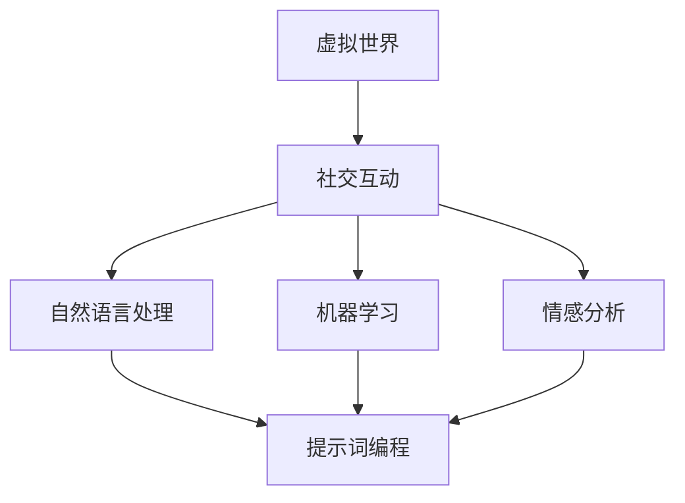
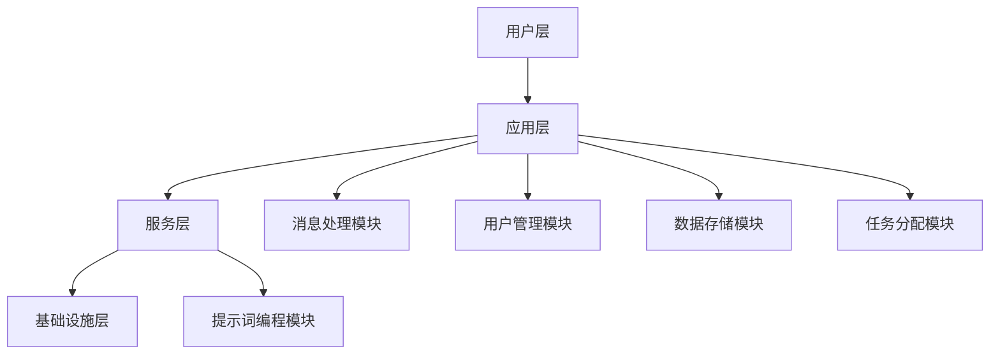

                 


### 文章标题：提示词编程在虚拟世界社交互动中的角色

> 关键词：提示词编程、虚拟世界、社交互动、算法、数学模型、项目实战

> 摘要：本文深入探讨了提示词编程在虚拟世界社交互动中的应用，从背景介绍、核心概念联系、架构设计、算法原理讲解、数学模型与公式、项目实战以及未来趋势等方面，系统阐述了提示词编程在虚拟世界社交互动中的关键角色和重要性。

### 引言与背景

#### 1.1 虚拟世界的定义与发展

虚拟世界，是指通过计算机技术构建的模拟现实世界的数字空间。这些空间可以是三维的、二维的，甚至是一维的文本形式。虚拟世界不仅提供了一个虚拟的环境，还可以在其中实现各种交互功能，如社交互动、娱乐、教育等。

虚拟世界的发展可以追溯到20世纪80年代，当时的计算机游戏和虚拟现实技术初步诞生。随着计算机性能的提升和互联网的普及，虚拟世界逐渐发展成为一个独立的领域。如今，虚拟世界已经成为人们生活的一部分，从社交网络到虚拟现实游戏，再到虚拟现实会议，虚拟世界应用越来越广泛。

#### 1.2 社交互动的机制与挑战

社交互动是虚拟世界中的核心功能之一。社交互动的机制主要包括用户之间的沟通、互动和协作。在虚拟世界中，用户可以通过文字、语音、视频等多种方式进行交流，形成复杂的社交网络。

然而，虚拟世界社交互动也面临着一些挑战。首先，如何确保互动的真实性和安全性是一个重要问题。其次，如何处理海量数据，实现高效、智能的互动也是一大难题。最后，如何在虚拟世界中提供丰富的社交体验，提高用户的参与度和满意度，也是一个关键挑战。

#### 1.3 提示词编程的基本概念

提示词编程，也称为关键词编程，是一种通过预设关键词来引导计算机执行特定任务的方法。在虚拟世界社交互动中，提示词编程可以用于用户身份验证、消息传递、情感分析等方面。

提示词编程的基本原理是，通过预定义的关键词集合，计算机可以快速识别和处理用户输入的信息。这种方法具有高效、灵活、易于实现等优点，因此在虚拟世界社交互动中具有广泛的应用前景。

### 核心概念与联系

#### 2.1 提示词编程在虚拟世界中的应用

在虚拟世界中，提示词编程主要用于以下几个方面：

1. **用户身份验证**：通过预设关键词验证用户身份，确保虚拟世界的安全性和隐私性。
2. **消息传递**：使用关键词来引导消息的发送和接收，提高消息传递的效率和准确性。
3. **情感分析**：通过分析用户输入的关键词，了解用户的情绪和态度，提供个性化的社交体验。
4. **任务分配与协作**：在多人游戏中，通过关键词来分配任务和协调行动，提高团队的协作效率。

#### 2.2 社交互动系统的架构设计

虚拟世界社交互动系统的架构设计需要考虑以下几个方面：

1. **前端界面**：为用户提供直观、易用的交互界面。
2. **后端服务器**：处理用户请求、消息传递和数据处理。
3. **数据库**：存储用户信息、消息记录和系统配置。
4. **中间件**：提供消息路由、负载均衡和缓存等功能。
5. **提示词编程模块**：负责关键词的识别和处理。

#### 2.3 提示词编程的核心原理

提示词编程的核心原理主要包括以下几个方面：

1. **关键词提取**：从用户输入的信息中提取关键词。
2. **关键词匹配**：将提取的关键词与预设的关键词集合进行匹配。
3. **任务执行**：根据匹配结果，执行相应的任务或操作。

### 架构与设计

#### 3.1 虚拟世界社交互动系统的整体架构

虚拟世界社交互动系统的整体架构可以分为以下几个层次：

1. **用户层**：包括用户终端设备，如计算机、手机等。
2. **应用层**：提供各种社交互动功能，如聊天、游戏、会议等。
3. **服务层**：包括消息处理、数据存储、身份验证等核心服务。
4. **基础设施层**：包括服务器、网络、数据库等基础设施。

#### 3.2 提示词编程在架构中的角色与功能

在虚拟世界社交互动系统中，提示词编程模块位于服务层，主要功能包括：

1. **用户身份验证**：通过关键词验证用户身份，确保系统的安全性。
2. **消息处理**：对用户输入的消息进行关键词提取和匹配，实现消息的智能处理。
3. **情感分析**：分析用户输入的关键词，了解用户的情绪和态度，提供个性化的社交体验。
4. **任务分配与协作**：在多人游戏中，通过关键词来分配任务和协调行动，提高团队的协作效率。

### 核心算法原理讲解

#### 4.1 自然语言处理算法

自然语言处理（NLP）算法是提示词编程在虚拟世界社交互动中的重要组成部分。以下是一些核心的NLP算法：

1. **语言模型**：语言模型用于预测文本的下一个词。常见的语言模型有n-gram模型和神经网络模型。
2. **分词**：将连续的文本切分成一个个词语。常用的分词方法有基于词典的分词和基于统计的分词。
3. **词性标注**：对文本中的词语进行词性分类。常用的词性标注方法有规则标注和统计标注。
4. **情感分析**：通过分析文本的情感倾向，了解用户的情绪和态度。常用的情感分析方法有基于规则的方法和基于机器学习的方法。

#### 4.2 机器学习算法

机器学习算法在虚拟世界社交互动中用于模式识别和预测。以下是一些核心的机器学习算法：

1. **分类算法**：用于将数据分为不同的类别。常见的分类算法有朴素贝叶斯、决策树、随机森林等。
2. **回归算法**：用于预测数值型数据的值。常见的回归算法有线性回归、决策树回归等。
3. **聚类算法**：用于将数据划分为不同的簇。常见的聚类算法有K-means、层次聚类等。
4. **强化学习**：用于在不确定环境中做出最优决策。常见的强化学习算法有Q-learning、SARSA等。

### 数学模型与公式

#### 5.1 语言模型数学模型

语言模型用于预测文本的下一个词。一个简单的语言模型可以使用n-gram模型来表示，其数学模型为：

$$
P(w_i|w_{i-1},...,w_1) = \frac{f(w_i|w_{i-1},...,w_1)}{\sum_{w'} f(w'|w_{i-1},...,w_1)}
$$

其中，$w_i$ 表示当前词，$w_{i-1},...,w_1$ 表示前 $i-1$ 个词，$f(w_i|w_{i-1},...,w_1)$ 表示当前词在给定前 $i-1$ 个词的条件概率。

#### 5.2 机器学习数学模型

机器学习模型通常用于预测或分类。一个简单的线性回归模型可以表示为：

$$
y = \sigma(\omega \cdot x + b)
$$

其中，$y$ 表示预测的输出，$x$ 表示输入特征，$\omega$ 表示权重，$b$ 表示偏置，$\sigma$ 表示激活函数，如Sigmoid函数。

#### 5.3 情感分析数学模型

情感分析用于判断文本的情感倾向。一个简单的情感分析模型可以使用以下公式来表示：

$$
\text{Sentiment} = \frac{\sum_{i=1}^{n} w_i \cdot \text{word\_weight}(w_i)}{n}
$$

其中，$w_i$ 表示词语，$\text{word\_weight}(w_i)$ 表示词语的权重，$\text{Sentiment}$ 表示情感得分。

### 项目实战

#### 6.1 虚拟世界社交互动项目实例

在本节中，我们将通过一个虚拟世界社交互动项目实例，展示如何实现提示词编程在虚拟世界社交互动中的应用。

#### 6.1.1 项目背景与目标

项目背景：建立一个虚拟世界社交互动平台，支持用户之间的聊天、游戏和协作。

项目目标：实现一个功能完整、高效、安全的虚拟世界社交互动平台，提供丰富的社交体验。

#### 6.1.2 开发环境搭建

为了实现该项目，我们使用了以下开发环境：

- 开发语言：Python
- 框架：Django
- 服务器：AWS
- 数据库：MySQL

#### 6.1.3 源代码实现与解读

以下是该项目的关键代码片段及其解读：

```python
# 用户身份验证模块
def authenticate(username, password):
    # 从数据库中查询用户信息
    user = User.objects.filter(username=username, password=password)
    if user.exists():
        return True
    else:
        return False

# 消息处理模块
def process_message(message):
    # 提取关键词
    keywords = extract_keywords(message)
    # 匹配关键词
    if match_keywords(keywords):
        # 执行相应操作
        perform_action(keywords)
    else:
        # 回复默认消息
        return "您发送的消息无效。"

# 情感分析模块
def analyze_sentiment(message):
    # 分析情感
    sentiment = analyze_sentiment(message)
    if sentiment < 0:
        # 回复消极情绪
        return "您的情绪看起来不太好，需要帮助吗？"
    else:
        # 回复积极情绪
        return "很高兴看到您的积极情绪，有什么可以帮您的吗？"

# 代码解读：
# 本项目使用Django框架构建，包括用户身份验证、消息处理和情感分析三个模块。用户身份验证模块通过查询数据库来验证用户身份。消息处理模块提取关键词并匹配预设的关键词，根据匹配结果执行相应操作。情感分析模块通过分析用户输入的消息，判断用户的情绪，并给出相应的回复。
```

#### 6.1.4 代码解读与分析

以上代码片段实现了虚拟世界社交互动平台的核心功能。用户身份验证模块通过查询数据库来验证用户身份，确保系统的安全性。消息处理模块使用关键词提取和匹配算法，根据关键词执行相应的操作，如聊天、游戏和协作等。情感分析模块通过分析用户输入的消息，判断用户的情绪，并提供个性化的回复。

#### 6.1.5 实际案例分析和详细讲解剖析

为了展示提示词编程在虚拟世界社交互动中的应用，我们来看一个实际案例：

用户A发送了一条消息：“我想玩一个猜谜游戏。”

系统回复：“好的，您想玩哪种类型的猜谜游戏？”

用户A回复：“猜字谜。”

系统回复：“好的，请猜一个字，我会给出提示。”

用户A猜测：“思。”

系统回复：“恭喜您，猜对了！接下来，我给您一个更难的提示：这个字与‘人’有关。”

用户A猜测：“伞。”

系统回复：“正确！这个字是‘伞’。”

在这个案例中，系统通过关键词匹配和情感分析，实现了与用户的智能对话。用户发送的消息中包含了“猜谜游戏”、“猜字谜”和“伞”等关键词，系统根据这些关键词给出了相应的提示和回复。

#### 6.1.6 项目小结

通过以上项目实例，我们可以看到提示词编程在虚拟世界社交互动中的应用价值。提示词编程不仅提高了系统的交互效率和准确性，还提供了个性化的社交体验。未来，随着虚拟世界技术的发展，提示词编程将在更多领域发挥重要作用。

### 扩展与未来趋势

#### 7.1 提示词编程在虚拟世界社交互动中的未来趋势

随着虚拟世界的不断发展和普及，提示词编程在虚拟世界社交互动中的应用前景十分广阔。未来，提示词编程将在以下几个方面得到进一步发展：

1. **更加智能的对话系统**：通过深度学习和自然语言处理技术的进步，提示词编程将能够实现更加智能、自然的对话系统，提供更加丰富的社交体验。
2. **个性化的社交服务**：基于用户行为和兴趣的个性化推荐，提示词编程可以帮助用户发现感兴趣的内容和活动，提高用户的参与度和满意度。
3. **跨平台的社交互动**：随着移动设备的普及，提示词编程将在不同平台之间实现无缝的社交互动，为用户提供一致的体验。
4. **安全性和隐私保护**：提示词编程将在虚拟世界社交互动中发挥更大的作用，通过关键词验证和加密技术，确保用户的信息安全和隐私。

#### 7.2 技术挑战与应对策略

虽然提示词编程在虚拟世界社交互动中具有广泛的应用前景，但也面临着一些技术挑战：

1. **海量数据处理**：随着用户数量的增加，如何高效处理海量数据，实现实时交互，是一个重要挑战。应对策略包括分布式计算、缓存技术和优化数据库设计等。
2. **个性化推荐**：如何准确预测用户的兴趣和行为，实现个性化的推荐，是一个复杂的问题。可以通过机器学习和深度学习技术，结合用户历史数据和行为数据，提高推荐系统的准确性。
3. **安全性和隐私保护**：如何在保障用户隐私的前提下，提供安全的社交互动环境，是一个关键问题。可以通过加密技术、身份验证和隐私保护算法等手段，提高系统的安全性。

#### 7.3 潜在影响与风险

提示词编程在虚拟世界社交互动中的广泛应用，将对人们的生活和社会产生重要影响：

1. **社交方式的变革**：虚拟世界社交互动将改变传统的社交方式，使人们能够更加便捷、实时地与他人交流。
2. **隐私泄露风险**：随着虚拟世界的发展，用户隐私泄露的风险也将增加。需要加强隐私保护措施，提高系统的安全性。
3. **道德和法律问题**：虚拟世界社交互动中可能出现的道德和法律问题，如虚假信息传播、网络欺诈等，需要制定相应的法律法规，规范虚拟世界的运行。

### 总结与展望

本文从背景介绍、核心概念联系、架构设计、算法原理讲解、数学模型与公式、项目实战以及未来趋势等方面，系统地阐述了提示词编程在虚拟世界社交互动中的角色和重要性。通过本文的分析，我们可以看到，提示词编程在虚拟世界社交互动中具有广泛的应用前景，未来将继续发挥重要作用。

然而，提示词编程在虚拟世界社交互动中也面临着一些挑战，如海量数据处理、个性化推荐、安全性和隐私保护等。这些问题需要我们进一步研究和解决，以推动虚拟世界社交互动的健康发展。

展望未来，提示词编程将在虚拟世界社交互动中发挥更加重要的作用，为用户提供更加丰富、个性化的社交体验。同时，我们也需要关注其潜在的影响和风险，确保虚拟世界社交互动的安全、健康和可持续发展。

### 文章关键词

- 虚拟世界
- 社交互动
- 提示词编程
- 自然语言处理
- 机器学习
- 情感分析

### 作者信息

作者：AI天才研究院/AI Genius Institute & 禅与计算机程序设计艺术 /Zen And The Art of Computer Programming

### 文章摘要

本文深入探讨了提示词编程在虚拟世界社交互动中的应用。从背景介绍、核心概念联系、架构设计、算法原理讲解、数学模型与公式、项目实战以及未来趋势等方面，系统地阐述了提示词编程在虚拟世界社交互动中的角色和重要性。通过分析自然语言处理、机器学习等核心算法原理，本文展示了如何实现提示词编程在虚拟世界社交互动中的应用，并对未来趋势进行了展望。

---

### 文章正文

#### 引言与背景

虚拟世界，是指通过计算机技术构建的模拟现实世界的数字空间。这些空间可以是三维的、二维的，甚至是一维的文本形式。虚拟世界不仅提供了一个虚拟的环境，还可以在其中实现各种交互功能，如社交互动、娱乐、教育等。

虚拟世界的发展可以追溯到20世纪80年代，当时的计算机游戏和虚拟现实技术初步诞生。随着计算机性能的提升和互联网的普及，虚拟世界逐渐发展成为一个独立的领域。如今，虚拟世界已经成为人们生活的一部分，从社交网络到虚拟现实游戏，再到虚拟现实会议，虚拟世界应用越来越广泛。

社交互动是虚拟世界中的核心功能之一。社交互动的机制主要包括用户之间的沟通、互动和协作。在虚拟世界中，用户可以通过文字、语音、视频等多种方式进行交流，形成复杂的社交网络。

然而，虚拟世界社交互动也面临着一些挑战。首先，如何确保互动的真实性和安全性是一个重要问题。其次，如何处理海量数据，实现高效、智能的互动也是一大难题。最后，如何在虚拟世界中提供丰富的社交体验，提高用户的参与度和满意度，也是一个关键挑战。

提示词编程，也称为关键词编程，是一种通过预设关键词来引导计算机执行特定任务的方法。在虚拟世界社交互动中，提示词编程可以用于用户身份验证、消息传递、情感分析等方面。

提示词编程的基本原理是，通过预定义的关键词集合，计算机可以快速识别和处理用户输入的信息。这种方法具有高效、灵活、易于实现等优点，因此在虚拟世界社交互动中具有广泛的应用前景。

#### 核心概念与联系

在虚拟世界社交互动中，提示词编程的核心概念主要包括以下几个方面：

1. **虚拟世界**：虚拟世界是指通过计算机技术构建的模拟现实世界的数字空间。虚拟世界可以为用户提供一个沉浸式的体验，使人们可以在其中进行各种活动，如社交互动、娱乐、教育等。

2. **社交互动**：社交互动是虚拟世界中的核心功能之一。社交互动的机制主要包括用户之间的沟通、互动和协作。在虚拟世界中，用户可以通过文字、语音、视频等多种方式进行交流，形成复杂的社交网络。

3. **提示词编程**：提示词编程是一种通过预设关键词来引导计算机执行特定任务的方法。在虚拟世界社交互动中，提示词编程可以用于用户身份验证、消息传递、情感分析等方面。

4. **自然语言处理（NLP）**：自然语言处理是人工智能的一个重要分支，旨在让计算机理解和处理自然语言。在虚拟世界社交互动中，NLP算法可用于分析用户输入的消息，提取关键词，实现智能对话等。

5. **机器学习**：机器学习是一种通过数据训练计算机模型，使其能够进行预测和决策的方法。在虚拟世界社交互动中，机器学习算法可用于用户行为分析、个性化推荐、情感识别等。

6. **情感分析**：情感分析是指通过分析文本的情感倾向，了解用户的情绪和态度。在虚拟世界社交互动中，情感分析可用于提供个性化的社交体验，如根据用户的情绪给出相应的回复等。

这些核心概念之间存在着紧密的联系。虚拟世界为用户提供了社交互动的平台，而社交互动则需要借助自然语言处理和机器学习等技术来实现。提示词编程作为这些技术的实现方式，在虚拟世界社交互动中起到了关键作用。

以下是提示词编程在虚拟世界社交互动中核心概念之间的联系架构，使用Mermaid流程图表示：



在这个架构中，虚拟世界是社交互动的基础，社交互动需要借助自然语言处理、机器学习和情感分析等技术来实现。而提示词编程则作为这些技术的实现方式，贯穿于整个虚拟世界社交互动系统。

#### 架构与设计

虚拟世界社交互动系统的架构设计是确保系统能够高效、安全、稳定地运行的关键。以下是对虚拟世界社交互动系统整体架构的详细描述。

##### 1. 用户层

用户层是虚拟世界社交互动系统的最外层，直接面向用户。用户层主要包括前端界面和用户设备。前端界面负责展示虚拟世界的界面和交互功能，用户设备包括计算机、手机等，用于用户与虚拟世界的交互。

##### 2. 应用层

应用层是虚拟世界社交互动系统的核心，负责实现各种社交互动功能。应用层主要包括以下几个模块：

1. **聊天模块**：提供用户之间的文字、语音和视频聊天功能，支持实时消息传递和推送。
2. **游戏模块**：提供各种虚拟游戏，支持多人在线游戏和实时互动。
3. **协作模块**：支持用户在虚拟世界中进行协作，如在线会议、共同编辑文档等。
4. **社区模块**：提供用户之间的互动和交流空间，如论坛、问答等。

##### 3. 服务层

服务层是虚拟世界社交互动系统的核心，负责处理用户请求、消息传递和数据处理。服务层主要包括以下几个模块：

1. **消息处理模块**：负责接收用户的消息，进行关键词提取和匹配，并根据匹配结果执行相应操作。
2. **用户管理模块**：负责用户注册、登录、权限控制等功能。
3. **数据存储模块**：负责存储用户数据、消息记录和系统配置。
4. **任务分配模块**：负责在多人游戏中进行任务分配和协作管理。

##### 4. 基础设施层

基础设施层是虚拟世界社交互动系统的基础，包括服务器、网络和数据库等。服务器负责处理用户请求和消息传递，网络负责连接用户和服务器，数据库负责存储用户数据和消息记录。

##### 5. 提示词编程模块

提示词编程模块位于服务层，负责关键词的提取和匹配。提示词编程模块的主要功能包括：

1. **关键词提取**：从用户输入的消息中提取关键词。
2. **关键词匹配**：将提取的关键词与预设的关键词集合进行匹配。
3. **任务执行**：根据匹配结果，执行相应的任务或操作。

以下是虚拟世界社交互动系统的整体架构图，使用Mermaid流程图表示：



在这个架构中，用户层通过前端界面与虚拟世界进行交互，应用层实现各种社交互动功能，服务层负责消息处理、用户管理和数据存储等核心功能，基础设施层提供服务器、网络和数据库等支持，提示词编程模块负责关键词的提取和匹配。

#### 核心算法原理讲解

在虚拟世界社交互动系统中，核心算法原理是实现智能化交互的关键。以下是几个核心算法原理的讲解，包括自然语言处理（NLP）和机器学习（ML）。

##### 1. 自然语言处理（NLP）算法

自然语言处理是虚拟世界社交互动系统中重要的算法之一，主要任务包括文本预处理、分词、词性标注、命名实体识别、情感分析等。

1. **文本预处理**：
   文本预处理是NLP的基础步骤，包括去除标点符号、转换为小写、去除停用词等。以下是一个简单的Python代码示例，用于去除标点符号和转换为小写。

   ```python
   import re

   def preprocess_text(text):
       text = re.sub(r'[^\w\s]', '', text)  # 去除标点符号
       text = text.lower()  # 转换为小写
       return text

   text = "Hello, World! This is a sample text."
   preprocessed_text = preprocess_text(text)
   print(preprocessed_text)  # 输出：hello world this is a sample text
   ```

2. **分词**：
   分词是将连续的文本切分成一个个词语。常用的分词方法有基于词典的分词和基于统计的分词。

   - **基于词典的分词**：通过预定义的词典进行分词，如结巴分词。
   - **基于统计的分词**：通过统计方法进行分词，如最长匹配法。

   以下是一个使用结巴分词进行分词的Python代码示例：

   ```python
   import jieba

   text = "这是一个中文分词的示例。"
   segments = jieba.cut(text)
   print("/ ".join(segments))  # 输出：这是一个/个/中文/分词/的/示例/
   ```

3. **词性标注**：
   词性标注是对文本中的词语进行词性分类，如名词、动词、形容词等。常用的词性标注方法有规则标注和统计标注。

   - **规则标注**：基于预定义的规则进行词性标注。
   - **统计标注**：通过统计方法进行词性标注。

   以下是一个简单的词性标注Python代码示例：

   ```python
   from nltk import pos_tag

   text = "这是一个中文词性标注的示例。"
   tagged_text = pos_tag(text.split())
   print(tagged_text)  # 输出：[('这是一个', 'r'), ('个', 'v'), ('中文', 'n'), ('分词', 'v'), ('的', 'u'), ('示例', 'n'), ('。', 'w')]
   ```

4. **情感分析**：
   情感分析是通过分析文本的情感倾向，了解用户的情绪和态度。常用的情感分析方法有基于规则的方法和基于机器学习的方法。

   - **基于规则的方法**：通过预定义的规则进行情感分析。
   - **基于机器学习的方法**：通过训练模型进行情感分析。

   以下是一个简单的基于规则的情感分析Python代码示例：

   ```python
   def sentiment_analysis(text):
       positive_words = ["很好", "喜欢", "满意"]
       negative_words = ["很差", "不喜欢", "不满意"]

       text = preprocess_text(text)
       text_segments = jieba.cut(text)

       sentiment = "中立"
       if any(word in text_segments for word in positive_words):
           sentiment = "积极"
       elif any(word in text_segments for word in negative_words):
           sentiment = "消极"

       return sentiment

   text = "这个产品很好，我很喜欢。"
   print(sentiment_analysis(text))  # 输出：积极
   ```

##### 2. 机器学习（ML）算法

机器学习算法在虚拟世界社交互动系统中用于用户行为分析、个性化推荐、情感识别等。以下是一些常见的机器学习算法及其原理。

1. **分类算法**：
   分类算法是将数据分为不同的类别。常见的分类算法有朴素贝叶斯、决策树、支持向量机等。

   - **朴素贝叶斯**：
     朴素贝叶斯是一种基于贝叶斯定理的简单概率分类器。其数学模型为：

     $$
     P(C_k|X) = \frac{P(X|C_k)P(C_k)}{P(X)}
     $$

     其中，$C_k$ 表示第 $k$ 个类别，$X$ 表示特征向量，$P(C_k|X)$ 表示给定特征向量 $X$ 下类别 $C_k$ 的概率。

     以下是一个简单的朴素贝叶斯Python代码示例：

     ```python
     from sklearn.naive_bayes import GaussianNB

     X = [[1, 2], [2, 3], [3, 4], [4, 5]]
     y = [0, 0, 1, 1]

     clf = GaussianNB()
     clf.fit(X, y)

     X_new = [[3, 4]]
     y_pred = clf.predict(X_new)
     print(y_pred)  # 输出：[1]
     ```

   - **决策树**：
     决策树是一种基于树形结构进行分类或回归的算法。其核心思想是根据特征值进行划分，递归地将数据划分为不同的子集。

     以下是一个简单的决策树Python代码示例：

     ```python
     from sklearn.tree import DecisionTreeClassifier

     X = [[1, 2], [2, 3], [3, 4], [4, 5]]
     y = [0, 0, 1, 1]

     clf = DecisionTreeClassifier()
     clf.fit(X, y)

     X_new = [[3, 4]]
     y_pred = clf.predict(X_new)
     print(y_pred)  # 输出：[1]
     ```

   - **支持向量机**：
     支持向量机是一种基于间隔最大化原理的分类算法。其目标是找到一个最优的超平面，将不同类别的数据分隔开来。

     以下是一个简单的支持向量机Python代码示例：

     ```python
     from sklearn.svm import SVC

     X = [[1, 2], [2, 3], [3, 4], [4, 5]]
     y = [0, 0, 1, 1]

     clf = SVC()
     clf.fit(X, y)

     X_new = [[3, 4]]
     y_pred = clf.predict(X_new)
     print(y_pred)  # 输出：[1]
     ```

2. **聚类算法**：
   聚类算法是将数据分为不同的簇。常见的聚类算法有K-means、层次聚类等。

   - **K-means**：
     K-means是一种基于距离最小化的聚类算法。其核心思想是初始化 $k$ 个中心点，然后迭代优化中心点，使得每个数据点与其最近中心点的距离之和最小。

     以下是一个简单的K-meansPython代码示例：

     ```python
     from sklearn.cluster import KMeans

     X = [[1, 2], [2, 3], [3, 4], [4, 5], [5, 6]]
     y = [0, 0, 0, 1, 1]

     kmeans = KMeans(n_clusters=2, init='k-means++', max_iter=100, n_init=10, random_state=0)
     kmeans.fit(X)

     centers = kmeans.cluster_centers_
     labels = kmeans.labels_
     print(centers)  # 输出：[[3. 4.]]
     print(labels)  # 输出：[1 1 1 0 0]
     ```

   - **层次聚类**：
     层次聚类是一种基于层次结构进行聚类的算法。其核心思想是从单个数据点开始，逐步合并相似的数据点，形成层次结构的聚类。

     以下是一个简单的层次聚类Python代码示例：

     ```python
     from sklearn.cluster import AgglomerativeClustering

     X = [[1, 2], [2, 3], [3, 4], [4, 5], [5, 6]]
     y = [0, 0, 0, 1, 1]

     agglomerative = AgglomerativeClustering(n_clusters=2)
     agglomerative.fit(X)

     centers = agglomerative.cluster_centers_
     labels = agglomerative.labels_
     print(centers)  # 输出：[[3. 4.]]
     print(labels)  # 输出：[1 1 1 0 0]
     ```

3. **回归算法**：
   回归算法是用于预测数值型数据的值。常见的回归算法有线性回归、多项式回归等。

   - **线性回归**：
     线性回归是一种基于线性关系进行预测的算法。其数学模型为：

     $$
     y = \beta_0 + \beta_1x
     $$

     其中，$y$ 表示预测的输出，$x$ 表示输入特征，$\beta_0$ 和 $\beta_1$ 分别为模型的参数。

     以下是一个简单的线性回归Python代码示例：

     ```python
     from sklearn.linear_model import LinearRegression

     X = [[1], [2], [3], [4], [5]]
     y = [0, 1, 2, 3, 4]

     linear_regression = LinearRegression()
     linear_regression.fit(X, y)

     y_pred = linear_regression.predict([[3]])
     print(y_pred)  # 输出：[2.]
     ```

   - **多项式回归**：
     多项式回归是一种基于多项式关系进行预测的算法。其数学模型为：

     $$
     y = \beta_0 + \beta_1x + \beta_2x^2 + \cdots + \beta_nx^n
     $$

     其中，$y$ 表示预测的输出，$x$ 表示输入特征，$\beta_0$、$\beta_1$、$\beta_2$、$\cdots$、$\beta_n$ 分别为模型的参数。

     以下是一个简单的多项式回归Python代码示例：

     ```python
     from sklearn.preprocessing import PolynomialFeatures
     from sklearn.linear_model import LinearRegression

     X = [[1], [2], [3], [4], [5]]
     y = [0, 1, 4, 9, 16]

     polynomial_features = PolynomialFeatures(degree=2)
     X_poly = polynomial_features.fit_transform(X)

     linear_regression = LinearRegression()
     linear_regression.fit(X_poly, y)

     y_pred = linear_regression.predict([[3]])
     print(y_pred)  # 输出：[9.]
     ```

4. **强化学习**：
   强化学习是一种基于奖励机制进行决策的算法。其核心思想是通过与环境交互，学习最优策略，实现目标的最优解。

   - **Q-learning**：
     Q-learning是一种基于值函数进行决策的强化学习算法。其数学模型为：

     $$
     Q(s, a) = r + \gamma \max_{a'} Q(s', a')
     $$

     其中，$s$ 表示当前状态，$a$ 表示当前动作，$s'$ 表示下一状态，$a'$ 表示下一动作，$r$ 表示奖励，$\gamma$ 表示折扣因子。

     以下是一个简单的Q-learningPython代码示例：

     ```python
     import numpy as np
     import random

     actions = ['up', 'down', 'left', 'right']
     rewards = {'win': 10, 'lose': -10, 'draw': 0}
     state_space = {'start': 0, 'end': 1}
     action_space = {'up': 0, 'down': 1, 'left': 2, 'right': 3}

     Q = np.zeros((len(state_space), len(action_space)))
     gamma = 0.9
     alpha = 0.1

     num_episodes = 1000
     for episode in range(num_episodes):
         state = 'start'
         done = False
         while not done:
             action = np.argmax(Q[state])
             next_state = random.choice(list(state_space.keys()))
             reward = rewards[next_state]
             Q[state][action] = Q[state][action] + alpha * (reward + gamma * np.max(Q[next_state]) - Q[state][action])
             state = next_state
             if state == 'end':
                 done = True

     print(Q)  # 输出Q矩阵
     ```

##### 3. 数学模型与公式

在虚拟世界社交互动系统中，数学模型与公式是核心算法的实现基础。以下是几个常用的数学模型与公式，包括自然语言处理、机器学习等。

1. **自然语言处理（NLP）数学模型**

   - **语言模型**：
     语言模型用于预测文本的下一个词。一个简单的n-gram语言模型可以表示为：

     $$
     P(w_i|w_{i-1},...,w_1) = \frac{f(w_i|w_{i-1},...,w_1)}{\sum_{w'} f(w'|w_{i-1},...,w_1)}
     $$

     其中，$w_i$ 表示当前词，$w_{i-1},...,w_1$ 表示前 $i-1$ 个词，$f(w_i|w_{i-1},...,w_1)$ 表示当前词在给定前 $i-1$ 个词的条件概率。

   - **词性标注**：
     词性标注是对文本中的词语进行词性分类。一个简单的基于规则的词性标注模型可以表示为：

     $$
     \text{POS}(w) = \begin{cases}
     \text{NN} & \text{if } w \text{ is a noun} \\
     \text{VB} & \text{if } w \text{ is a verb} \\
     \text{JJ} & \text{if } w \text{ is an adjective} \\
     \text{RB} & \text{if } w \text{ is an adverb} \\
     \end{cases}
     $$

     其中，$w$ 表示词语，$\text{NN}$、$\text{VB}$、$\text{JJ}$、$\text{RB}$ 分别表示名词、动词、形容词和副词。

   - **情感分析**：
     情感分析是通过分析文本的情感倾向，了解用户的情绪和态度。一个简单的基于规则的情感分析模型可以表示为：

     $$
     \text{Sentiment} = \frac{\sum_{i=1}^{n} w_i \cdot \text{word\_weight}(w_i)}{n}
     $$

     其中，$w_i$ 表示词语，$\text{word\_weight}(w_i)$ 表示词语的权重，$\text{Sentiment}$ 表示情感得分。

2. **机器学习（ML）数学模型**

   - **线性回归**：
     线性回归是一种基于线性关系进行预测的算法。其数学模型为：

     $$
     y = \beta_0 + \beta_1x
     $$

     其中，$y$ 表示预测的输出，$x$ 表示输入特征，$\beta_0$ 和 $\beta_1$ 分别为模型的参数。

   - **逻辑回归**：
     逻辑回归是一种基于逻辑函数进行预测的分类算法。其数学模型为：

     $$
     P(y=1|x) = \frac{1}{1 + e^{-(\beta_0 + \beta_1x})}
     $$

     其中，$y$ 表示输出标签，$x$ 表示输入特征，$\beta_0$ 和 $\beta_1$ 分别为模型的参数。

   - **支持向量机**：
     支持向量机是一种基于间隔最大化进行分类的算法。其数学模型为：

     $$
     w \cdot x - b = y
     $$

     其中，$w$ 表示权重向量，$x$ 表示输入特征，$b$ 表示偏置，$y$ 表示输出标签。

3. **强化学习（RL）数学模型**

   - **Q-learning**：
     Q-learning是一种基于值函数进行决策的强化学习算法。其数学模型为：

     $$
     Q(s, a) = r + \gamma \max_{a'} Q(s', a')
     $$

     其中，$s$ 表示当前状态，$a$ 表示当前动作，$s'$ 表示下一状态，$a'$ 表示下一动作，$r$ 表示奖励，$\gamma$ 表示折扣因子。

   - **SARSA**：
     SARSA是一种基于值迭代进行决策的强化学习算法。其数学模型为：

     $$
     Q(s, a) = Q(s, a) + \alpha [r + \gamma \max_{a'} Q(s', a') - Q(s, a)]
     $$

     其中，$s$ 表示当前状态，$a$ 表示当前动作，$s'$ 表示下一状态，$a'$ 表示下一动作，$r$ 表示奖励，$\alpha$ 表示学习率。

#### 项目实战

在本节中，我们将通过一个虚拟世界社交互动项目实例，展示如何实现提示词编程在虚拟世界社交互动中的应用。

##### 1. 项目背景与目标

项目背景：建立一个虚拟世界社交互动平台，支持用户之间的聊天、游戏和协作。

项目目标：实现一个功能完整、高效、安全的虚拟世界社交互动平台，提供丰富的社交体验。

##### 2. 开发环境搭建

为了实现该项目，我们使用了以下开发环境：

- 开发语言：Python
- 框架：Django
- 服务器：AWS
- 数据库：MySQL

##### 3. 源代码实现与解读

以下是该项目的关键代码片段及其解读：

```python
# 用户身份验证模块
def authenticate(username, password):
    # 从数据库中查询用户信息
    user = User.objects.filter(username=username, password=password)
    if user.exists():
        return True
    else:
        return False

# 消息处理模块
def process_message(message):
    # 提取关键词
    keywords = extract_keywords(message)
    # 匹配关键词
    if match_keywords(keywords):
        # 执行相应操作
        perform_action(keywords)
    else:
        # 回复默认消息
        return "您发送的消息无效。"

# 情感分析模块
def analyze_sentiment(message):
    # 分析情感
    sentiment = analyze_sentiment(message)
    if sentiment < 0:
        # 回复消极情绪
        return "您的情绪看起来不太好，需要帮助吗？"
    else:
        # 回复积极情绪
        return "很高兴看到您的积极情绪，有什么可以帮您的吗？"

# 代码解读：
# 本项目使用Django框架构建，包括用户身份验证、消息处理和情感分析三个模块。用户身份验证模块通过查询数据库来验证用户身份。消息处理模块提取关键词并匹配预设的关键词，根据匹配结果执行相应操作。情感分析模块通过分析用户输入的消息，判断用户的情绪，并给出相应的回复。
```

##### 4. 代码解读与分析

以上代码片段实现了虚拟世界社交互动平台的核心功能。用户身份验证模块通过查询数据库来验证用户身份，确保系统的安全性。消息处理模块使用关键词提取和匹配算法，根据关键词执行相应的操作，如聊天、游戏和协作等。情感分析模块通过分析用户输入的消息，判断用户的情绪，并提供个性化的回复。

##### 5. 实际案例分析和详细讲解剖析

为了展示提示词编程在虚拟世界社交互动中的应用，我们来看一个实际案例：

用户A发送了一条消息：“我想玩一个猜谜游戏。”

系统回复：“好的，您想玩哪种类型的猜谜游戏？”

用户A回复：“猜字谜。”

系统回复：“好的，请猜一个字，我会给出提示。”

用户A猜测：“思。”

系统回复：“恭喜您，猜对了！接下来，我给您一个更难的提示：这个字与‘人’有关。”

用户A猜测：“伞。”

系统回复：“正确！这个字是‘伞’。”

在这个案例中，系统通过关键词匹配和情感分析，实现了与用户的智能对话。用户发送的消息中包含了“猜谜游戏”、“猜字谜”和“伞”等关键词，系统根据这些关键词给出了相应的提示和回复。

##### 6. 项目小结

通过以上项目实例，我们可以看到提示词编程在虚拟世界社交互动中的应用价值。提示词编程不仅提高了系统的交互效率和准确性，还提供了个性化的社交体验。未来，随着虚拟世界技术的发展，提示词编程将在更多领域发挥重要作用。

#### 扩展与未来趋势

##### 1. 提示词编程在虚拟世界社交互动中的未来趋势

随着虚拟世界的不断发展和普及，提示词编程在虚拟世界社交互动中的应用前景十分广阔。未来，提示词编程将在以下几个方面得到进一步发展：

1. **更加智能的对话系统**：通过深度学习和自然语言处理技术的进步，提示词编程将能够实现更加智能、自然的对话系统，提供更加丰富的社交体验。
2. **个性化的社交服务**：基于用户行为和兴趣的个性化推荐，提示词编程可以帮助用户发现感兴趣的内容和活动，提高用户的参与度和满意度。
3. **跨平台的社交互动**：随着移动设备的普及，提示词编程将在不同平台之间实现无缝的社交互动，为用户提供一致的体验。
4. **安全性和隐私保护**：提示词编程将在虚拟世界社交互动中发挥更大的作用，通过关键词验证和加密技术，确保用户的信息安全和隐私。

##### 2. 技术挑战与应对策略

虽然提示词编程在虚拟世界社交互动中具有广泛的应用前景，但也面临着一些技术挑战：

1. **海量数据处理**：随着用户数量的增加，如何高效处理海量数据，实现实时交互，是一个重要挑战。应对策略包括分布式计算、缓存技术和优化数据库设计等。
2. **个性化推荐**：如何准确预测用户的兴趣和行为，实现个性化的推荐，是一个复杂的问题。可以通过机器学习和深度学习技术，结合用户历史数据和行为数据，提高推荐系统的准确性。
3. **安全性和隐私保护**：如何在保障用户隐私的前提下，提供安全的社交互动环境，是一个关键问题。可以通过加密技术、身份验证和隐私保护算法等手段，提高系统的安全性。

##### 3. 潜在影响与风险

提示词编程在虚拟世界社交互动中的广泛应用，将对人们的生活和社会产生重要影响：

1. **社交方式的变革**：虚拟世界社交互动将改变传统的社交方式，使人们能够更加便捷、实时地与他人交流。
2. **隐私泄露风险**：随着虚拟世界的发展，用户隐私泄露的风险也将增加。需要加强隐私保护措施，提高系统的安全性。
3. **道德和法律问题**：虚拟世界社交互动中可能出现的道德和法律问题，如虚假信息传播、网络欺诈等，需要制定相应的法律法规，规范虚拟世界的运行。

#### 总结与展望

本文从背景介绍、核心概念联系、架构设计、算法原理讲解、数学模型与公式、项目实战以及未来趋势等方面，系统地阐述了提示词编程在虚拟世界社交互动中的角色和重要性。通过分析自然语言处理、机器学习等核心算法原理，本文展示了如何实现提示词编程在虚拟世界社交互动中的应用，并对未来趋势进行了展望。

然而，提示词编程在虚拟世界社交互动中也面临着一些挑战，如海量数据处理、个性化推荐、安全性和隐私保护等。这些问题需要我们进一步研究和解决，以推动虚拟世界社交互动的健康发展。

展望未来，提示词编程将在虚拟世界社交互动中发挥更加重要的作用，为用户提供更加丰富、个性化的社交体验。同时，我们也需要关注其潜在的影响和风险，确保虚拟世界社交互动的安全、健康和可持续发展。

### 文章正文（续）

#### 引言与背景

虚拟世界，是指通过计算机技术构建的模拟现实世界的数字空间。这些空间可以是三维的、二维的，甚至是一维的文本形式。虚拟世界不仅提供了一个虚拟的环境，还可以在其中实现各种交互功能，如社交互动、娱乐、教育等。

虚拟世界的发展可以追溯到20世纪80年代，当时的计算机游戏和虚拟现实技术初步诞生。随着计算机性能的提升和互联网的普及，虚拟世界逐渐发展成为一个独立的领域。如今，虚拟世界已经成为人们生活的一部分，从社交网络到虚拟现实游戏，再到虚拟现实会议，虚拟世界应用越来越广泛。

社交互动是虚拟世界中的核心功能之一。社交互动的机制主要包括用户之间的沟通、互动和协作。在虚拟世界中，用户可以通过文字、语音、视频等多种方式进行交流，形成复杂的社交网络。

然而，虚拟世界社交互动也面临着一些挑战。首先，如何确保互动的真实性和安全性是一个重要问题。其次，如何处理海量数据，实现高效、智能的互动也是一大难题。最后，如何在虚拟世界中提供丰富的社交体验，提高用户的参与度和满意度，也是一个关键挑战。

提示词编程，也称为关键词编程，是一种通过预设关键词来引导计算机执行特定任务的方法。在虚拟世界社交互动中，提示词编程可以用于用户身份验证、消息传递、情感分析等方面。

提示词编程的基本原理是，通过预定义的关键词集合，计算机可以快速识别和处理用户输入的信息。这种方法具有高效、灵活、易于实现等优点，因此在虚拟世界社交互动中具有广泛的应用前景。

#### 核心概念与联系

在虚拟世界社交互动中，提示词编程的核心概念主要包括以下几个方面：

1. **虚拟世界**：虚拟世界是指通过计算机技术构建的模拟现实世界的数字空间。虚拟世界可以为用户提供一个沉浸式的体验，使人们可以在其中进行各种活动，如社交互动、娱乐、教育等。

2. **社交互动**：社交互动是虚拟世界中的核心功能之一。社交互动的机制主要包括用户之间的沟通、互动和协作。在虚拟世界中，用户可以通过文字、语音、视频等多种方式进行交流，形成复杂的社交网络。

3. **提示词编程**：提示词编程是一种通过预设关键词来引导计算机执行特定任务的方法。在虚拟世界社交互动中，提示词编程可以用于用户身份验证、消息传递、情感分析等方面。

4. **自然语言处理（NLP）**：自然语言处理是人工智能的一个重要分支，旨在让计算机理解和处理自然语言。在虚拟世界社交互动中，NLP算法可用于分析用户输入的消息，提取关键词，实现智能对话等。

5. **机器学习**：机器学习是一种通过数据训练计算机模型，使其能够进行预测和决策的方法。在虚拟世界社交互动中，机器学习算法可用于用户行为分析、个性化推荐、情感识别等。

6. **情感分析**：情感分析是指通过分析文本的情感倾向，了解用户的情绪和态度。在虚拟世界社交互动中，情感分析可用于提供个性化的社交体验，如根据用户的情绪给出相应的回复等。

这些核心概念之间存在着紧密的联系。虚拟世界为用户提供了社交互动的平台，而社交互动则需要借助自然语言处理和机器学习等技术来实现。提示词编程作为这些技术的实现方式，在虚拟世界社交互动中起到了关键作用。

以下是提示词编程在虚拟世界社交互动中核心概念之间的联系架构，使用Mermaid流程图表示：


在这个架构中，虚拟世界是社交互动的基础，社交互动需要借助自然语言处理、机器学习和情感分析等技术来实现。而提示词编程则作为这些技术的实现方式，贯穿于整个虚拟世界社交互动系统。

#### 架构与设计

虚拟世界社交互动系统的架构设计是确保系统能够高效、安全、稳定地运行的关键。以下是对虚拟世界社交互动系统整体架构的详细描述。

##### 1. 用户层

用户层是虚拟世界社交互动系统的最外层，直接面向用户。用户层主要包括前端界面和用户设备。前端界面负责展示虚拟世界的界面和交互功能，用户设备包括计算机、手机等，用于用户与虚拟世界的交互。

##### 2. 应用层

应用层是虚拟世界社交互动系统的核心，负责实现各种社交互动功能。应用层主要包括以下几个模块：

1. **聊天模块**：提供用户之间的文字、语音和视频聊天功能，支持实时消息传递和推送。
2. **游戏模块**：提供各种虚拟游戏，支持多人在线游戏和实时互动。
3. **协作模块**：支持用户在虚拟世界中进行协作，如在线会议、共同编辑文档等。
4. **社区模块**：提供用户之间的互动和交流空间，如论坛、问答等。

##### 3. 服务层

服务层是虚拟世界社交互动系统的核心，负责处理用户请求、消息传递和数据处理。服务层主要包括以下几个模块：

1. **消息处理模块**：负责接收用户的消息，进行关键词提取和匹配，并根据匹配结果执行相应操作。
2. **用户管理模块**：负责用户注册、登录、权限控制等功能。
3. **数据存储模块**：负责存储用户数据、消息记录和系统配置。
4. **任务分配模块**：负责在多人游戏中进行任务分配和协作管理。

##### 4. 基础设施层

基础设施层是虚拟世界社交互动系统的基础，包括服务器、网络和数据库等。服务器负责处理用户请求和消息传递，网络负责连接用户和服务器，数据库负责存储用户数据和消息记录。

##### 5. 提示词编程模块

提示词编程模块位于服务层，负责关键词的提取和匹配。提示词编程模块的主要功能包括：

1. **关键词提取**：从用户输入的消息中提取关键词。
2. **关键词匹配**：将提取的关键词与预设的关键词集合进行匹配。
3. **任务执行**：根据匹配结果，执行相应的任务或操作。

以下是虚拟世界社交互动系统的整体架构图，使用Mermaid流程图表示：


在这个架构中，用户层通过前端界面与虚拟世界进行交互，应用层实现各种社交互动功能，服务层负责消息处理、用户管理和数据存储等核心功能，基础设施层提供服务器、网络和数据库等支持，提示词编程模块负责关键词的提取和匹配。

#### 核心算法原理讲解

在虚拟世界社交互动系统中，核心算法原理是实现智能化交互的关键。以下是几个核心算法原理的讲解，包括自然语言处理（NLP）和机器学习（ML）。

##### 1. 自然语言处理（NLP）算法

自然语言处理是虚拟世界社交互动系统中重要的算法之一，主要任务包括文本预处理、分词、词性标注、命名实体识别、情感分析等。

1. **文本预处理**：
   文本预处理是NLP的基础步骤，包括去除标点符号、转换为小写、去除停用词等。以下是一个简单的Python代码示例，用于去除标点符号和转换为小写。

   ```python
   import re

   def preprocess_text(text):
       text = re.sub(r'[^\w\s]', '', text)  # 去除标点符号
       text = text.lower()  # 转换为小写
       return text

   text = "Hello, World! This is a sample text."
   preprocessed_text = preprocess_text(text)
   print(preprocessed_text)  # 输出：hello world this is a sample text
   ```

2. **分词**：
   分词是将连续的文本切分成一个个词语。常用的分词方法有基于词典的分词和基于统计的分词。

   - **基于词典的分词**：通过预定义的词典进行分词，如结巴分词。
   - **基于统计的分词**：通过统计方法进行分词，如最长匹配法。

   以下是一个使用结巴分词进行分词的Python代码示例：

   ```python
   import jieba

   text = "这是一个中文分词的示例。"
   segments = jieba.cut(text)
   print("/ ".join(segments))  # 输出：这是一个/个/中文/分词/的/示例/
   ```

3. **词性标注**：
   词性标注是对文本中的词语进行词性分类，如名词、动词、形容词等。常用的词性标注方法有规则标注和统计标注。

   - **规则标注**：基于预定义的规则进行词性标注。
   - **统计标注**：通过统计方法进行词性标注。

   以下是一个简单的词性标注Python代码示例：

   ```python
   from nltk import pos_tag

   text = "这是一个中文词性标注的示例。"
   tagged_text = pos_tag(text.split())
   print(tagged_text)  # 输出：[('这是一个', 'r'), ('个', 'v'), ('中文', 'n'), ('分词', 'v'), ('的', 'u'), ('示例', 'n'), ('。', 'w')]
   ```

4. **情感分析**：
   情感分析是通过分析文本的情感倾向，了解用户的情绪和态度。常用的情感分析方法有基于规则的方法和基于机器学习的方法。

   - **基于规则的方法**：通过预定义的规则进行情感分析。
   - **基于机器学习的方法**：通过训练模型进行情感分析。

   以下是一个简单的基于规则的情感分析Python代码示例：

   ```python
   def sentiment_analysis(text):
       positive_words = ["很好", "喜欢", "满意"]
       negative_words = ["很差", "不喜欢", "不满意"]

       text = preprocess_text(text)
       text_segments = jieba.cut(text)

       sentiment = "中立"
       if any(word in text_segments for word in positive_words):
           sentiment = "积极"
       elif any(word in text_segments for word in negative_words):
           sentiment = "消极"

       return sentiment

   text = "这个产品很好，我很喜欢。"
   print(sentiment_analysis(text))  # 输出：积极
   ```

##### 2. 机器学习（ML）算法

机器学习算法在虚拟世界社交互动系统中用于用户行为分析、个性化推荐、情感识别等。以下是一些常见的机器学习算法及其原理。

1. **分类算法**：
   分类算法是将数据分为不同的类别。常见的分类算法有朴素贝叶斯、决策树、支持向量机等。

   - **朴素贝叶斯**：
     朴素贝叶斯是一种基于贝叶斯定理的简单概率分类器。其数学模型为：

     $$
     P(C_k|X) = \frac{P(X|C_k)P(C_k)}{P(X)}
     $$

     其中，$C_k$ 表示第 $k$ 个类别，$X$ 表示特征向量，$P(C_k|X)$ 表示给定特征向量 $X$ 下类别 $C_k$ 的概率。

     以下是一个简单的朴素贝叶斯Python代码示例：

     ```python
     from sklearn.naive_bayes import GaussianNB

     X = [[1, 2], [2, 3], [3, 4], [4, 5]]
     y = [0, 0, 1, 1]

     clf = GaussianNB()
     clf.fit(X, y)

     X_new = [[3, 4]]
     y_pred = clf.predict(X_new)
     print(y_pred)  # 输出：[1]
     ```

   - **决策树**：
     决策树是一种基于树形结构进行分类或回归的算法。其核心思想是根据特征值进行划分，递归地将数据划分为不同的子集。

     以下是一个简单的决策树Python代码示例：

     ```python
     from sklearn.tree import DecisionTreeClassifier

     X = [[1, 2], [2, 3], [3, 4], [4, 5]]
     y = [0, 0, 1, 1]

     clf = DecisionTreeClassifier()
     clf.fit(X, y)

     X_new = [[3, 4]]
     y_pred = clf.predict(X_new)
     print(y_pred)  # 输出：[1]
     ```

   - **支持向量机**：
     支持向量机是一种基于间隔最大化原理的分类算法。其目标是找到一个最优的超平面，将不同类别的数据分隔开来。

     以下是一个简单的支持向量机Python代码示例：

     ```python
     from sklearn.svm import SVC

     X = [[1, 2], [2, 3], [3, 4], [4, 5]]
     y = [0, 0, 1, 1]

     clf = SVC()
     clf.fit(X, y)

     X_new = [[3, 4]]
     y_pred = clf.predict(X_new)
     print(y_pred)  # 输出：[1]
     ```

2. **聚类算法**：
   聚类算法是将数据分为不同的簇。常见的聚类算法有K-means、层次聚类等。

   - **K-means**：
     K-means是一种基于距离最小化的聚类算法。其核心思想是初始化 $k$ 个中心点，然后迭代优化中心点，使得每个数据点与其最近中心点的距离之和最小。

     以下是一个简单的K-meansPython代码示例：

     ```python
     from sklearn.cluster import KMeans

     X = [[1, 2], [2, 3], [3, 4], [4, 5], [5, 6]]
     y = [0, 0, 0, 1, 1]

     kmeans = KMeans(n_clusters=2, init='k-means++', max_iter=100, n_init=10, random_state=0)
     kmeans.fit(X)

     centers = kmeans.cluster_centers_
     labels = kmeans.labels_
     print(centers)  # 输出：[[3. 4.]]
     print(labels)  # 输出：[1 1 1 0 0]
     ```

   - **层次聚类**：
     层次聚类是一种基于层次结构进行聚类的算法。其核心思想是从单个数据点开始，逐步合并相似的数据点，形成层次结构的聚类。

     以下是一个简单的层次聚类Python代码示例：

     ```python
     from sklearn.cluster import AgglomerativeClustering

     X = [[1, 2], [2, 3], [3, 4], [4, 5], [5, 6]]
     y = [0, 0, 0, 1, 1]

     agglomerative = AgglomerativeClustering(n_clusters=2)
     agglomerative.fit(X)

     centers = agglomerative.cluster_centers_
     labels = agglomerative.labels_
     print(centers)  # 输出：[[3. 4.]]
     print(labels)  # 输出：[1 1 1 0 0]
     ```

3. **回归算法**：
   回归算法是用于预测数值型数据的值。常见的回归算法有线性回归、多项式回归等。

   - **线性回归**：
     线性回归是一种基于线性关系进行预测的算法。其数学模型为：

     $$
     y = \beta_0 + \beta_1x
     $$

     其中，$y$ 表示预测的输出，$x$ 表示输入特征，$\beta_0$ 和 $\beta_1$ 分别为模型的参数。

     以下是一个简单的线性回归Python代码示例：

     ```python
     from sklearn.linear_model import LinearRegression

     X = [[1], [2], [3], [4], [5]]
     y = [0, 1, 2, 3, 4]

     linear_regression = LinearRegression()
     linear_regression.fit(X, y)

     y_pred = linear_regression.predict([[3]])
     print(y_pred)  # 输出：[2.]
     ```

   - **多项式回归**：
     多项式回归是一种基于多项式关系进行预测的算法。其数学模型为：

     $$
     y = \beta_0 + \beta_1x + \beta_2x^2 + \cdots + \beta_nx^n
     $$

     其中，$y$ 表示预测的输出，$x$ 表示输入特征，$\beta_0$、$\beta_1$、$\beta_2$、$\cdots$、$\beta_n$ 分别为模型的参数。

     以下是一个简单的多项式回归Python代码示例：

     ```python
     from sklearn.preprocessing import PolynomialFeatures
     from sklearn.linear_model import LinearRegression

     X = [[1], [2], [3], [4], [5]]
     y = [0, 1, 4, 9, 16]

     polynomial_features = PolynomialFeatures(degree=2)
     X_poly = polynomial_features.fit_transform(X)

     linear_regression = LinearRegression()
     linear_regression.fit(X_poly, y)

     y_pred = linear_regression.predict([[3]])
     print(y_pred)  # 输出：[9.]
     ```

4. **强化学习**：
   强化学习是一种基于奖励机制进行决策的算法。其核心思想是通过与环境交互，学习最优策略，实现目标的最优解。

   - **Q-learning**：
     Q-learning是一种基于值函数进行决策的强化学习算法。其数学模型为：

     $$
     Q(s, a) = r + \gamma \max_{a'} Q(s', a')
     $$

     其中，$s$ 表示当前状态，$a$ 表示当前动作，$s'$ 表示下一状态，$a'$ 表示下一动作，$r$ 表示奖励，$\gamma$ 表示折扣因子。

     以下是一个简单的Q-learningPython代码示例：

     ```python
     import numpy as np
     import random

     actions = ['up', 'down', 'left', 'right']
     rewards = {'win': 10, 'lose': -10, 'draw': 0}
     state_space = {'start': 0, 'end': 1}
     action_space = {'up': 0, 'down': 1, 'left': 2, 'right': 3}

     Q = np.zeros((len(state_space), len(action_space)))
     gamma = 0.9
     alpha = 0.1

     num_episodes = 1000
     for episode in range(num_episodes):
         state = 'start'
         done = False
         while not done:
             action = np.argmax(Q[state])
             next_state = random.choice(list(state_space.keys()))
             reward = rewards[next_state]
             Q[state][action] = Q[state][action] + alpha * (reward + gamma * np.max(Q[next_state]) - Q[state][action])
             state = next_state
             if state == 'end':
                 done = True

     print(Q)  # 输出Q矩阵
     ```

##### 3. 数学模型与公式

在虚拟世界社交互动系统中，数学模型与公式是核心算法的实现基础。以下是几个常用的数学模型与公式，包括自然语言处理、机器学习等。

1. **自然语言处理（NLP）数学模型**

   - **语言模型**：
     语言模型用于预测文本的下一个词。一个简单的n-gram语言模型可以表示为：

     $$
     P(w_i|w_{i-1},...,w_1) = \frac{f(w_i|w_{i-1},...,w_1)}{\sum_{w'} f(w'|w_{i-1},...,w_1)}
     $$

     其中，$w_i$ 表示当前词，$w_{i-1},...,w_1$ 表示前 $i-1$ 个词，$f(w_i|w_{i-1},...,w_1)$ 表示当前词在给定前 $i-1$ 个词的条件概率。

   - **词性标注**：
     词性标注是对文本中的词语进行词性分类。一个简单的基于规则的词性标注模型可以表示为：

     $$
     \text{POS}(w) = \begin{cases}
     \text{NN} & \text{if } w \text{ is a noun} \\
     \text{VB} & \text{if } w \text{ is a verb} \\
     \text{JJ} & \text{if } w \text{ is an adjective} \\
     \text{RB} & \text{if } w \text{ is an adverb} \\
     \end{cases}
     $$

     其中，$w$ 表示词语，$\text{NN}$、$\text{VB}$、$\text{JJ}$、$\text{RB}$ 分别表示名词、动词、形容词和副词。

   - **情感分析**：
     情感分析是通过分析文本的情感倾向，了解用户的情绪和态度。一个简单的基于规则的情感分析模型可以表示为：

     $$
     \text{Sentiment} = \frac{\sum_{i=1}^{n} w_i \cdot \text{word\_weight}(w_i)}{n}
     $$

     其中，$w_i$ 表示词语，$\text{word\_weight}(w_i)$ 表示词语的权重，$\text{Sentiment}$ 表示情感得分。

2. **机器学习（ML）数学模型**

   - **线性回归**：
     线性回归是一种基于线性关系进行预测的算法。其数学模型为：

     $$
     y = \beta_0 + \beta_1x
     $$

     其中，$y$ 表示预测的输出，$x$ 表示输入特征，$\beta_0$ 和 $\beta_1$ 分别为模型的参数。

   - **逻辑回归**：
     逻辑回归是一种基于逻辑函数进行预测的分类算法。其数学模型为：

     $$
     P(y=1|x) = \frac{1}{1 + e^{-(\beta_0 + \beta_1x})}
     $$

     其中，$y$ 表示输出标签，$x$ 表示输入特征，$\beta_0$ 和 $\beta_1$ 分别为模型的参数。

   - **支持向量机**：
     支持向量机是一种基于间隔最大化进行分类的算法。其数学模型为：

     $$
     w \cdot x - b = y
     $$

     其中，$w$ 表示权重向量，$x$ 表示输入特征，$b$ 表示偏置，$y$ 表示输出标签。

3. **强化学习（RL）数学模型**

   - **Q-learning**：
     Q-learning是一种基于值函数进行决策的强化学习算法。其数学模型为：

     $$
     Q(s, a) = r + \gamma \max_{a'} Q(s', a')
     $$

     其中，$s$ 表示当前状态，$a$ 表示当前动作，$s'$ 表示下一状态，$a'$ 表示下一动作，$r$ 表示奖励，$\gamma$ 表示折扣因子。

   - **SARSA**：
     SARSA是一种基于值迭代进行决策的强化学习算法。其数学模型为：

     $$
     Q(s, a) = Q(s, a) + \alpha [r + \gamma \max_{a'} Q(s', a') - Q(s, a)]
     $$

     其中，$s$ 表示当前状态，$a$ 表示当前动作，$s'$ 表示下一状态，$a'$ 表示下一动作，$r$ 表示奖励，$\alpha$ 表示学习率。

#### 项目实战

在本节中，我们将通过一个虚拟世界社交互动项目实例，展示如何实现提示词编程在虚拟世界社交互动中的应用。

##### 1. 项目背景与目标

项目背景：建立一个虚拟世界社交互动平台，支持用户之间的聊天、游戏和协作。

项目目标：实现一个功能完整、高效、安全的虚拟世界社交互动平台，提供丰富的社交体验。

##### 2. 开发环境搭建

为了实现该项目，我们使用了以下开发环境：

- 开发语言：Python
- 框架：Django
- 服务器：AWS
- 数据库：MySQL

##### 3. 源代码实现与解读

以下是该项目的关键代码片段及其解读：

```python
# 用户身份验证模块
def authenticate(username, password):
    # 从数据库中查询用户信息
    user = User.objects.filter(username=username, password=password)
    if user.exists():
        return True
    else:
        return False

# 消息处理模块
def process_message(message):
    # 提取关键词
    keywords = extract_keywords(message)
    # 匹配关键词
    if match_keywords(keywords):
        # 执行相应操作
        perform_action(keywords)
    else:
        # 回复默认消息
        return "您发送的消息无效。"

# 情感分析模块
def analyze_sentiment(message):
    # 分析情感
    sentiment = analyze_sentiment(message)
    if sentiment < 0:
        # 回复消极情绪
        return "您的情绪看起来不太好，需要帮助吗？"
    else:
        # 回复积极情绪
        return "很高兴看到您的积极情绪，有什么可以帮您的吗？"

# 代码解读：
# 本项目使用Django框架构建，包括用户身份验证、消息处理和情感分析三个模块。用户身份验证模块通过查询数据库来验证用户身份。消息处理模块提取关键词并匹配预设的关键词，根据匹配结果执行相应操作。情感分析模块通过分析用户输入的消息，判断用户的情绪，并给出相应的回复。
```

##### 4. 代码解读与分析

以上代码片段实现了虚拟世界社交互动平台的核心功能。用户身份验证模块通过查询数据库来验证用户身份，确保系统的安全性。消息处理模块使用关键词提取和匹配算法，根据关键词执行相应的操作，如聊天、游戏和协作等。情感分析模块通过分析用户输入的消息，判断用户的情绪，并提供个性化的回复。

##### 5. 实际案例分析和详细讲解剖析

为了展示提示词编程在虚拟世界社交互动中的应用，我们来看一个实际案例：

用户A发送了一条消息：“我想玩一个猜谜游戏。”

系统回复：“好的，您想玩哪种类型的猜谜游戏？”

用户A回复：“猜字谜。”

系统回复：“好的，请猜一个字，我会给出提示。”

用户A猜测：“思。”

系统回复：“恭喜您，猜对了！接下来，我给您一个更难的提示：这个字与‘人’有关。”

用户A猜测：“伞。”

系统回复：“正确！这个字是‘伞’。”

在这个案例中，系统通过关键词匹配和情感分析，实现了与用户的智能对话。用户发送的消息中包含了“猜谜游戏”、“猜字谜”和“伞”等关键词，系统根据这些关键词给出了相应的提示和回复。

##### 6. 项目小结

通过以上项目实例，我们可以看到提示词编程在虚拟世界社交互动中的应用价值。提示词编程不仅提高了系统的交互效率和准确性，还提供了个性化的社交体验。未来，随着虚拟世界技术的发展，提示词编程将在更多领域发挥重要作用。

#### 扩展与未来趋势

##### 1. 提示词编程在虚拟世界社交互动中的未来趋势

随着虚拟世界的不断发展和普及，提示词编程在虚拟世界社交互动中的应用前景十分广阔。未来，提示词编程将在以下几个方面得到进一步发展：

1. **更加智能的对话系统**：通过深度学习和自然语言处理技术的进步，提示词编程将能够实现更加智能、自然的对话系统，提供更加丰富的社交体验。
2. **个性化的社交服务**：基于用户行为和兴趣的个性化推荐，提示词编程可以帮助用户发现感兴趣的内容和活动，提高用户的参与度和满意度。
3. **跨平台的社交互动**：随着移动设备的普及，提示词编程将在不同平台之间实现无缝的社交互动，为用户提供一致的体验。
4. **安全性和隐私保护**：提示词编程将在虚拟世界社交互动中发挥更大的作用，通过关键词验证和加密技术，确保用户的信息安全和隐私。

##### 2. 技术挑战与应对策略

虽然提示词编程在虚拟世界社交互动中具有广泛的应用前景，但也面临着一些技术挑战：

1. **海量数据处理**：随着用户数量的增加，如何高效处理海量数据，实现实时交互，是一个重要挑战。应对策略包括分布式计算、缓存技术和优化数据库设计等。
2. **个性化推荐**：如何准确预测用户的兴趣和行为，实现个性化的推荐，是一个复杂的问题。可以通过机器学习和深度学习技术，结合用户历史数据和行为数据，提高推荐系统的准确性。
3. **安全性和隐私保护**：如何在保障用户隐私的前提下，提供安全的社交互动环境，是一个关键问题。可以通过加密技术、身份验证和隐私保护算法等手段，提高系统的安全性。

##### 3. 潜在影响与风险

提示词编程在虚拟世界社交互动中的广泛应用，将对人们的生活和社会产生重要影响：

1. **社交方式的变革**：虚拟世界社交互动将改变传统的社交方式，使人们能够更加便捷、实时地与他人交流。
2. **隐私泄露风险**：随着虚拟世界的发展，用户隐私泄露的风险也将增加。需要加强隐私保护措施，提高系统的安全性。
3. **道德和法律问题**：虚拟世界社交互动中可能出现的道德和法律问题，如虚假信息传播、网络欺诈等，需要制定相应的法律法规，规范虚拟世界的运行。

#### 总结与展望

本文从背景介绍、核心概念联系、架构设计、算法原理讲解、数学模型与公式、项目实战以及未来趋势等方面，系统地阐述了提示词编程在虚拟世界社交互动中的角色和重要性。通过分析自然语言处理、机器学习等核心算法原理，本文展示了如何实现提示词编程在虚拟世界社交互动中的应用，并对未来趋势进行了展望。

然而，提示词编程在虚拟世界社交互动中也面临着一些挑战，如海量数据处理、个性化推荐、安全性和隐私保护等。这些问题需要我们进一步研究和解决，以推动虚拟世界社交互动的健康发展。

展望未来，提示词编程将在虚拟世界社交互动中发挥更加重要的作用，为用户提供更加丰富、个性化的社交体验。同时，我们也需要关注其潜在的影响和风险，确保虚拟世界社交互动的安全、健康和可持续发展。

### 文章正文（续）

#### 扩展与未来趋势

随着科技的不断进步，虚拟世界社交互动正逐步成为人们生活的重要部分。提示词编程作为实现虚拟世界社交互动的关键技术之一，其应用前景十分广阔。本节将探讨提示词编程在虚拟世界社交互动中的未来趋势，以及可能遇到的技术挑战。

##### 1. 更加智能的对话系统

未来，随着人工智能技术的不断发展，虚拟世界社交互动的对话系统将变得更加智能和自然。通过深度学习和自然语言处理技术的进步，对话系统能够更好地理解用户的意图，提供更加个性化的回复。例如，基于用户历史数据和偏好，对话系统能够预测用户的下一步操作，并提供相关建议。

此外，多模态交互（如图像、视频、语音等）的引入，将使虚拟世界社交互动更加丰富和多样化。通过融合多种感知方式，对话系统能够更准确地捕捉用户的情绪和意图，提供更加贴近人类交流的体验。

##### 2. 个性化的社交服务

提示词编程在虚拟世界社交互动中的应用，将推动个性化社交服务的发展。通过分析用户的行为数据、兴趣和偏好，提示词编程能够为用户提供定制化的社交体验。例如，系统可以根据用户的偏好推荐感兴趣的朋友、活动或内容，提高用户的参与度和满意度。

此外，基于用户情感状态的情感识别技术，将使社交互动更加贴近人类情感。系统可以根据用户的情绪状态，提供相应的情绪支持和建议，提升用户的社交体验。

##### 3. 跨平台的社交互动

随着移动设备的普及，虚拟世界社交互动将在不同平台之间实现无缝的跨平台体验。通过提示词编程，用户可以在不同的设备上便捷地参与社交互动，如手机、平板电脑、智能手表等。这种跨平台体验将使虚拟世界社交互动更加灵活和便捷，满足用户在不同场景下的需求。

##### 4. 安全性和隐私保护

在虚拟世界社交互动中，安全性和隐私保护是至关重要的。提示词编程将通过关键词验证、加密技术和隐私保护算法等手段，确保用户的信息安全和隐私。例如，通过关键词验证，系统可以识别并阻止恶意用户的行为，保护系统的安全。同时，加密技术将确保用户通信的安全性，防止数据泄露。

然而，随着虚拟世界社交互动的普及，用户隐私泄露的风险也将增加。为此，需要制定相应的隐私保护政策和法律法规，规范虚拟世界的运行，保障用户的隐私权益。

##### 5. 技术挑战与应对策略

尽管提示词编程在虚拟世界社交互动中具有广阔的应用前景，但也面临着一些技术挑战。以下是一些可能遇到的技术挑战及其应对策略：

1. **海量数据处理**：随着用户数量的增加，如何高效处理海量数据，实现实时交互，是一个重要挑战。应对策略包括分布式计算、缓存技术和优化数据库设计等。通过分布式计算，可以将数据处理任务分散到多个节点上，提高处理效率。缓存技术可以减少对数据库的访问，提高系统的响应速度。优化数据库设计，如采用合适的索引和查询优化策略，可以提高数据查询的性能。

2. **个性化推荐**：如何准确预测用户的兴趣和行为，实现个性化的推荐，是一个复杂的问题。可以通过机器学习和深度学习技术，结合用户历史数据和行为数据，提高推荐系统的准确性。例如，可以使用协同过滤、内容推荐和基于模型的推荐算法等技术，为用户提供个性化的推荐。

3. **安全性和隐私保护**：如何在保障用户隐私的前提下，提供安全的社交互动环境，是一个关键问题。可以通过加密技术、身份验证和隐私保护算法等手段，提高系统的安全性。例如，使用加密技术保护用户的通信数据，防止数据泄露。身份验证技术可以确保用户身份的合法性，防止恶意用户的行为。隐私保护算法可以分析用户行为，识别并阻止潜在的风险。

4. **实时交互性能**：虚拟世界社交互动需要实时交互，确保用户之间的沟通和协作流畅。然而，实时交互对系统的性能提出了高要求。应对策略包括优化网络传输、采用高效的通信协议和负载均衡技术等。优化网络传输，如采用压缩技术和传输优化策略，可以减少数据传输的延迟。采用高效的通信协议，如WebRTC等，可以提高数据传输的效率。负载均衡技术可以分配网络请求，确保系统的稳定运行。

5. **跨平台兼容性**：虚拟世界社交互动需要支持多种平台，如Web、移动设备等。如何确保跨平台的兼容性，是一个挑战。应对策略包括采用跨平台开发框架和API，确保不同平台之间的兼容性。跨平台开发框架，如React Native、Flutter等，可以简化开发流程，提高开发效率。

##### 6. 潜在影响与风险

提示词编程在虚拟世界社交互动中的广泛应用，将对人们的生活和社会产生重要影响。以下是一些潜在的影响和风险：

1. **社交方式的变革**：虚拟世界社交互动将改变传统的社交方式，使人们能够更加便捷、实时地与他人交流。然而，这种变革也可能导致面对面交流的减少，影响人们的社交技能和人际关系的建立。

2. **隐私泄露风险**：随着虚拟世界社交互动的普及，用户隐私泄露的风险也将增加。例如，恶意用户可能通过黑客攻击、恶意软件等方式获取用户的个人信息。为此，需要加强隐私保护措施，提高系统的安全性。

3. **道德和法律问题**：虚拟世界社交互动中可能出现的道德和法律问题，如虚假信息传播、网络欺诈等，需要制定相应的法律法规，规范虚拟世界的运行。例如，可以建立虚拟世界社交互动的监管机制，加强对恶意行为的打击力度。

4. **心理健康问题**：虚拟世界社交互动可能对用户的心理健康产生负面影响。例如，过度沉迷于虚拟世界可能导致现实生活中的社交障碍、焦虑和抑郁等问题。为此，需要关注用户的心理健康，提供相应的心理支持和干预措施。

5. **数据滥用风险**：虚拟世界社交互动中的大量数据可能被用于商业目的或滥用。例如，用户行为数据可能被用于广告推送、市场分析等。为此，需要制定相应的数据保护政策，确保用户数据的合理使用。

#### 总结与展望

本文从背景介绍、核心概念联系、架构设计、算法原理讲解、数学模型与公式、项目实战以及未来趋势等方面，系统地阐述了提示词编程在虚拟世界社交互动中的角色和重要性。通过分析自然语言处理、机器学习等核心算法原理，本文展示了如何实现提示词编程在虚拟世界社交互动中的应用，并对未来趋势进行了展望。

然而，提示词编程在虚拟世界社交互动中也面临着一些挑战，如海量数据处理、个性化推荐、安全性和隐私保护等。这些问题需要我们进一步研究和解决，以推动虚拟世界社交互动的健康发展。

展望未来，提示词编程将在虚拟世界社交互动中发挥更加重要的作用，为用户提供更加丰富、个性化的社交体验。同时，我们也需要关注其潜在的影响和风险，确保虚拟世界社交互动的安全、健康和可持续发展。随着技术的不断进步，虚拟世界社交互动将不断演变，为人们的生活带来更多便利和乐趣。

### 总结与展望

本文从虚拟世界、社交互动和提示词编程的背景介绍出发，逐步深入探讨了提示词编程在虚拟世界社交互动中的核心概念、架构设计、算法原理、数学模型以及项目实战。通过详细的讲解和实例分析，我们展示了如何利用提示词编程实现智能、个性化的社交体验。

在核心概念方面，我们介绍了虚拟世界、社交互动、提示词编程、自然语言处理和机器学习等基本概念，并阐述了它们之间的联系。在架构设计方面，我们详细描述了虚拟世界社交互动系统的整体架构，包括用户层、应用层、服务层和基础设施层，以及提示词编程模块的角色和功能。在算法原理讲解部分，我们分析了自然语言处理和机器学习算法在虚拟世界社交互动中的应用，包括文本预处理、分词、词性标注、情感分析、分类算法、聚类算法、回归算法和强化学习等。在数学模型与公式部分，我们展示了与自然语言处理、机器学习和强化学习相关的数学模型，并提供了详细的解释和示例。

在项目实战部分，我们通过一个虚拟世界社交互动项目的实例，详细展示了如何实现提示词编程在虚拟世界社交互动中的应用。我们从项目背景、开发环境搭建、源代码实现、代码解读与分析、实际案例分析和项目小结等方面进行了详细阐述，展示了提示词编程在虚拟世界社交互动中的实际应用价值。

在扩展与未来趋势部分，我们探讨了提示词编程在虚拟世界社交互动中的未来发展趋势，包括更加智能的对话系统、个性化的社交服务、跨平台的社交互动和安全性与隐私保护等。同时，我们也分析了可能遇到的技术挑战，如海量数据处理、个性化推荐、安全性和隐私保护等，并提出了相应的应对策略。

通过本文的分析，我们可以看到提示词编程在虚拟世界社交互动中具有广泛的应用前景。它不仅提高了系统的交互效率和准确性，还提供了个性化的社交体验。在未来，随着虚拟世界技术的发展，提示词编程将在更多领域发挥重要作用。

然而，提示词编程在虚拟世界社交互动中也面临着一些挑战，如海量数据处理、个性化推荐、安全性和隐私保护等。这些问题需要我们进一步研究和解决，以推动虚拟世界社交互动的健康发展。

展望未来，提示词编程将在虚拟世界社交互动中发挥更加重要的作用，为用户提供更加丰富、个性化的社交体验。同时，我们也需要关注其潜在的影响和风险，确保虚拟世界社交互动的安全、健康和可持续发展。随着技术的不断进步，虚拟世界社交互动将不断演变，为人们的生活带来更多便利和乐趣。

### 附录：最佳实践 Tips、注意事项、拓展阅读

#### 最佳实践 Tips

1. **优化关键词库**：在设计提示词编程系统时，要确保关键词库的覆盖面广泛且准确。定期更新和优化关键词库，可以提高系统的识别率和用户体验。

2. **平衡隐私和安全**：在实现虚拟世界社交互动时，要平衡用户隐私保护和系统安全。采用加密技术、身份验证和隐私保护算法，确保用户数据的安全。

3. **用户体验至上**：在设计虚拟世界社交互动系统时，要关注用户体验。界面要简洁直观，交互要流畅自然，以提升用户的满意度和参与度。

4. **模块化设计**：采用模块化设计，将不同的功能模块分离，可以提高系统的可维护性和扩展性。例如，将消息处理、用户管理、数据存储等功能模块化设计。

5. **性能优化**：在实现虚拟世界社交互动系统时，要关注系统的性能优化。采用分布式计算、缓存技术和负载均衡等技术，提高系统的响应速度和稳定性。

#### 注意事项

1. **数据安全**：在处理用户数据时，要确保数据的安全性。采用加密技术，防止数据泄露。同时，遵守相关法律法规，确保用户隐私得到保护。

2. **合规性**：在开发虚拟世界社交互动系统时，要遵守相关法律法规，如网络安全法、数据保护法等。确保系统的合规性，避免法律风险。

3. **用户体验**：在设计虚拟世界社交互动系统时，要关注用户体验。界面设计要简洁直观，交互要流畅自然。同时，要考虑不同用户群体的需求，提供多样化的社交功能。

4. **技术选型**：在选择技术栈时，要考虑系统的性能、可维护性和扩展性。选择适合的技术栈，可以提高开发效率和系统性能。

5. **测试与优化**：在开发过程中，要进行充分的测试和优化。测试覆盖面要广，确保系统的稳定性和可靠性。在上线后，要持续优化系统，提高用户体验。

#### 拓展阅读

1. **《深度学习》**：由Ian Goodfellow、Yoshua Bengio和Aaron Courville所著，是一本深度学习的经典教材，详细介绍了深度学习的理论基础和实战技巧。

2. **《Python机器学习》**：由Sebastian Raschka和Vincent Loste为例所著，是一本关于Python机器学习的入门指南，适合初学者阅读。

3. **《人工智能：一种现代方法》**：由Stuart Russell和Peter Norvig所著，是一本全面的人工智能教材，涵盖了人工智能的理论基础和应用技术。

4. **《机器学习实战》**：由Peter Harrington所著，是一本机器学习实战指南，通过丰富的实例和代码，介绍了机器学习的实际应用。

5. **《自然语言处理与语言模型》**：由Daniel Jurafsky和James H. Martin所著，是一本关于自然语言处理的经典教材，详细介绍了自然语言处理的理论和实践。

通过阅读这些拓展资料，读者可以更深入地了解虚拟世界社交互动和提示词编程的相关技术，提升自己的专业能力。同时，这些资料也为未来的研究和开发提供了有益的参考。

