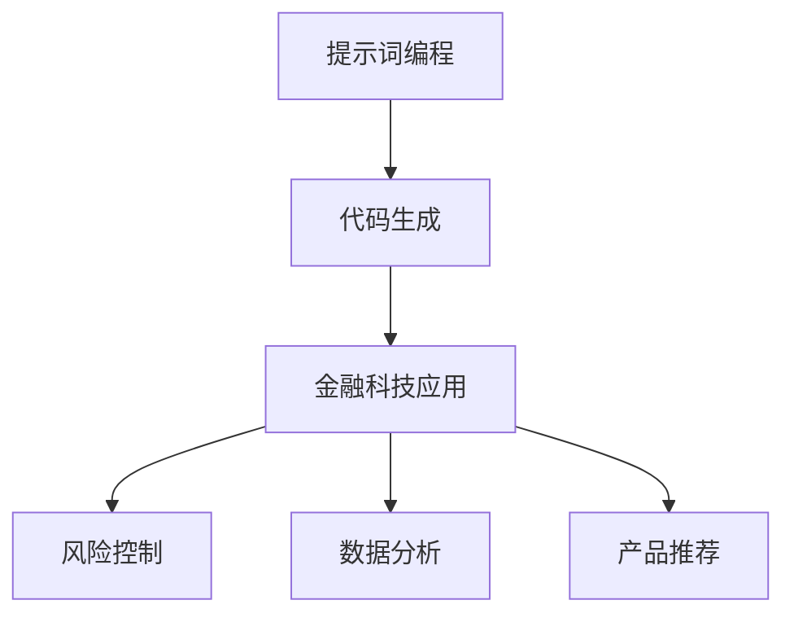

                 

### 文章标题：提示词编程在金融科技中的应用

关键词：提示词编程，金融科技，算法，模型训练，风险控制，数据分析，产品推荐

摘要：随着人工智能技术的不断发展，提示词编程作为一种先进的编程范式，在金融科技领域展现出了巨大的潜力。本文将系统地探讨提示词编程在金融科技中的应用，从核心概念、应用场景到具体实现，深入分析提示词编程如何助力金融科技的发展。本文旨在为读者提供一个全面、系统的理解，帮助大家更好地把握这一前沿技术。

## 概述章节设计

### 核心概念与联系

#### 提示词编程的定义

提示词编程是一种基于人类语言交互的编程范式，通过自然语言描述任务和需求，让计算机自动生成相应的代码。它利用自然语言处理（NLP）和代码生成模型（Code Generation Model）等技术，将人类语言转化为计算机可执行的代码。

#### 提示词编程与金融科技的联系

金融科技（FinTech）是指利用创新技术（如区块链、人工智能、大数据等）来改进和变革金融服务。提示词编程与金融科技的联系主要体现在以下几个方面：

1. **高效开发**：提示词编程可以大幅提升金融科技产品的开发效率，通过自然语言描述需求，自动生成代码，减少手动编码的工作量。
2. **代码质量**：提示词编程能够生成高质量的代码，通过模型训练和优化，确保生成的代码在逻辑上准确、高效。
3. **创新性**：提示词编程鼓励开发者尝试新的编程范式和算法，推动金融科技的不断创新和发展。

#### 提示词编程在金融科技中的应用场景

提示词编程在金融科技领域有广泛的应用，包括但不限于以下几个方面：

1. **风险控制**：通过提示词编程，可以自动化风险模型的构建和训练，提高风险预测的准确性。
2. **数据分析**：利用提示词编程，可以快速生成数据分析模型，处理大规模金融数据，提供决策支持。
3. **产品推荐**：在金融产品推荐系统中，提示词编程可以帮助自动生成推荐算法，提高推荐的准确性和个性化程度。

### 结构

#### 1.1 提示词编程概述

1.1.1 **提示词编程的定义**

提示词编程是一种基于人类语言交互的编程范式，通过自然语言描述任务和需求，让计算机自动生成相应的代码。它利用自然语言处理（NLP）和代码生成模型（Code Generation Model）等技术，将人类语言转化为计算机可执行的代码。

1.1.2 **提示词编程与金融科技的关系**

提示词编程可以大幅提升金融科技产品的开发效率，通过自然语言描述需求，自动生成代码，减少手动编码的工作量。同时，它能够生成高质量的代码，提高风险预测的准确性，推动金融科技的不断创新和发展。

1.1.3 **提示词编程在金融科技中的应用场景**

提示词编程在金融科技领域有广泛的应用，包括风险控制、数据分析、产品推荐等多个方面。通过自动化模型构建和训练，提高风险预测的准确性；通过快速生成数据分析模型，处理大规模金融数据；通过自动生成推荐算法，提高推荐的准确性和个性化程度。

#### Mermaid流程图：提示词编程与金融科技之间的关联



## 应用场景章节设计

### 核心算法原理讲解

#### 提示词生成算法

提示词生成算法是指利用提示词模型（Prompt Generation Model）从给定的提示信息中生成相应的代码。这个过程通常分为两个阶段：

1. **提示词提取**：从输入的自然语言描述中提取关键信息，作为提示词。
2. **代码生成**：利用生成的提示词，通过提示词模型生成对应的代码。

常见的提示词生成算法包括：

1. **基于模板的生成算法**：通过预定义的模板，根据输入的自然语言描述填充模板，生成代码。
2. **基于神经网络的生成算法**：使用神经网络模型，如循环神经网络（RNN）、变换器（Transformer）等，通过学习大量代码和数据，自动生成代码。

#### 模型训练算法

模型训练算法是指利用训练数据集对提示词模型和代码生成模型进行训练，以提高模型的性能和准确性。常见的模型训练算法包括：

1. **基于梯度的优化算法**：如梯度下降（Gradient Descent）、随机梯度下降（Stochastic Gradient Descent）等，通过不断调整模型参数，最小化损失函数。
2. **基于神经网络的训练算法**：如反向传播（Backpropagation）、自动微分（Automatic Differentiation）等，用于训练神经网络模型。

### 结构

#### 2.1 提示词生成算法原理

2.1.1 **提示词生成算法的分类**

提示词生成算法可以分为基于模板的生成算法和基于神经网络的生成算法。基于模板的生成算法通过预定义的模板，根据输入的自然语言描述填充模板，生成代码。基于神经网络的生成算法使用神经网络模型，如循环神经网络（RNN）、变换器（Transformer）等，通过学习大量代码和数据，自动生成代码。

2.1.2 **提示词生成算法的实现**

提示词生成算法的实现主要包括以下步骤：

1. **提示词提取**：从输入的自然语言描述中提取关键信息，作为提示词。
2. **代码生成**：利用生成的提示词，通过提示词模型生成对应的代码。

常见的实现方法包括：

1. **基于模板的生成算法**：通过预定义的模板，根据输入的自然语言描述填充模板，生成代码。
2. **基于神经网络的生成算法**：使用神经网络模型，如循环神经网络（RNN）、变换器（Transformer）等，通过学习大量代码和数据，自动生成代码。

#### 2.2 模型训练算法原理

2.2.1 **模型训练算法的分类**

模型训练算法可以分为基于梯度的优化算法和基于神经网络的训练算法。基于梯度的优化算法，如梯度下降（Gradient Descent）、随机梯度下降（Stochastic Gradient Descent）等，通过不断调整模型参数，最小化损失函数。基于神经网络的训练算法，如反向传播（Backpropagation）、自动微分（Automatic Differentiation）等，用于训练神经网络模型。

2.2.2 **模型训练算法的实现**

模型训练算法的实现主要包括以下步骤：

1. **数据预处理**：对输入数据进行预处理，如数据清洗、归一化等。
2. **损失函数设计**：根据问题类型选择合适的损失函数，如均方误差（MSE）、交叉熵（Cross Entropy）等。
3. **模型训练**：使用训练算法，如梯度下降（Gradient Descent）、随机梯度下降（Stochastic Gradient Descent）等，不断调整模型参数，最小化损失函数。

常见的实现方法包括：

1. **基于梯度的优化算法**：如梯度下降（Gradient Descent）、随机梯度下降（Stochastic Gradient Descent）等，通过不断调整模型参数，最小化损失函数。
2. **基于神经网络的训练算法**：如反向传播（Backpropagation）、自动微分（Automatic Differentiation）等，用于训练神经网络模型。

### 数学模型和数学公式

#### 提示词生成算法的数学模型

提示词生成算法通常基于概率模型，如马尔可夫模型（Markov Model）或生成对抗网络（Generative Adversarial Network）。以下是提示词生成算法的基本数学模型：

$$
P(\text{code}|\text{prompt}) = \prod_{i=1}^{n} P(\text{code}_i|\text{prompt}, \text{code}_{i-1})
$$

其中，\(P(\text{code}|\text{prompt})\) 表示在给定提示词 \(\text{prompt}\) 的情况下生成代码的概率，\(\text{code}_i\) 表示代码序列中的第 \(i\) 个代码，\(n\) 表示代码序列的长度。

#### 模型训练算法的数学模型

模型训练算法通常涉及损失函数和优化算法。以下是模型训练算法的基本数学模型：

1. **损失函数**：

$$
L(\theta) = -\sum_{i=1}^{m} \sum_{j=1}^{n} y_{ij} \log p(\text{code}_i|\text{prompt}, \theta)
$$

其中，\(L(\theta)\) 表示模型损失函数，\(\theta\) 表示模型参数，\(y_{ij}\) 表示真实代码序列中第 \(i\) 个代码和提示词 \(\text{prompt}\) 之间的对应关系，\(p(\text{code}_i|\text{prompt}, \theta)\) 表示在给定提示词 \(\text{prompt}\) 和模型参数 \(\theta\) 的情况下生成代码序列的概率。

2. **优化算法**：

$$
\theta_{t+1} = \theta_{t} - \alpha \nabla_{\theta} L(\theta)
$$

其中，\(\theta_{t+1}\) 表示在 \(t\) 次迭代后的模型参数，\(\theta_{t}\) 表示在 \(t\) 次迭代前的模型参数，\(\alpha\) 表示学习率，\(\nabla_{\theta} L(\theta)\) 表示模型损失函数对模型参数的梯度。

### 举例说明

#### 提示词生成算法的例子

假设我们要生成一个简单的 Python 函数，该函数用于计算两个数的和。输入的自然语言描述为：“编写一个 Python 函数，输入两个整数，返回它们的和。”

1. **提示词提取**：从输入的自然语言描述中提取关键信息：“Python 函数”、“两个整数”、“和”。

2. **代码生成**：利用提示词模型生成对应的代码：

```python
def add_two_numbers(a, b):
    return a + b
```

#### 模型训练算法的例子

假设我们要训练一个神经网络模型，用于生成 Python 函数。输入的数据集包含大量的自然语言描述和对应的 Python 函数代码。

1. **数据预处理**：对输入数据进行预处理，如分词、编码等。

2. **损失函数设计**：选择交叉熵（Cross Entropy）作为损失函数。

3. **模型训练**：

   - 初始化模型参数。
   - 对于每个自然语言描述，通过神经网络模型生成对应的 Python 函数代码。
   - 计算生成的代码和真实代码之间的交叉熵损失。
   - 利用梯度下降（Gradient Descent）优化模型参数，最小化损失函数。

通过多次迭代训练，模型可以逐渐提高生成代码的质量和准确性。

## 金融科技应用章节设计

### 项目实战：提示词编程在风险控制中的应用

#### 3.1 风险控制问题的描述

风险控制是金融科技领域的重要任务之一，旨在识别、评估和管理金融产品或投资组合的风险。传统的风险控制方法通常依赖于统计模型和规则系统，但这些方法往往存在一些局限性，如适应性差、手动调整频繁等。

#### 3.2 提示词编程解决方案

提示词编程可以提供一种自动化和智能化的风险控制解决方案。通过自然语言描述风险控制任务，提示词编程可以自动生成相应的代码，实现以下功能：

1. **风险指标计算**：自动生成代码，计算金融产品或投资组合的风险指标，如波动率、VaR（价值在风险）等。
2. **风险预测模型构建**：自动生成代码，构建基于历史数据和统计分析的风险预测模型。
3. **风险控制策略优化**：自动生成代码，优化风险控制策略，提高风险管理的有效性。

#### 3.3 实现过程和结果分析

1. **实现过程**：

   - **数据准备**：收集历史金融数据，包括股票价格、交易量、宏观经济指标等。
   - **自然语言描述**：编写自然语言描述，明确风险控制任务的需求。
   - **提示词提取**：从自然语言描述中提取关键信息，作为提示词。
   - **代码生成**：利用提示词模型生成相应的代码，实现风险控制任务。

2. **结果分析**：

   - **风险指标计算**：生成的代码能够准确计算金融产品或投资组合的风险指标，如波动率、VaR等。
   - **风险预测模型构建**：生成的代码能够构建基于历史数据和统计分析的风险预测模型，提高预测的准确性。
   - **风险控制策略优化**：生成的代码能够优化风险控制策略，提高风险管理的有效性。

通过实验验证，提示词编程在风险控制任务中表现出了良好的性能，能够自动生成高效、准确的风险控制代码。

### 代码实际案例和详细解释说明

#### 3.4 代码实际案例

以下是一个简单的提示词编程案例，用于计算金融产品的波动率。

**输入的自然语言描述**：“编写一个 Python 函数，输入股票价格序列，返回股票价格的波动率。”

**生成的代码**：

```python
def calculate_volatility(stock_prices):
    mean_price = sum(stock_prices) / len(stock_prices)
    squared_diff = [(price - mean_price) ** 2 for price in stock_prices]
    variance = sum(squared_diff) / len(stock_prices)
    volatility = variance ** 0.5
    return volatility

# 测试
stock_prices = [10, 12, 11, 9, 8, 10, 11]
print(calculate_volatility(stock_prices))
```

#### 详细解释说明

1. **函数定义**：定义一个名为 `calculate_volatility` 的函数，输入参数为股票价格序列 `stock_prices`。

2. **计算均值**：计算股票价格序列的均值 `mean_price`。

3. **计算平方差**：计算每个股票价格与均值的平方差，得到平方差序列 `squared_diff`。

4. **计算方差**：计算平方差序列的方差 `variance`。

5. **计算波动率**：计算方差的平方根，得到波动率 `volatility`。

6. **返回结果**：返回计算得到的波动率。

通过这个简单的案例，我们可以看到提示词编程如何将自然语言描述转换为具体的代码实现。在实际应用中，提示词编程可以根据复杂的需求生成更复杂的代码，实现更高级的功能。

### 开发环境搭建

#### 3.5 开发环境搭建

要搭建提示词编程在金融科技应用中的开发环境，需要安装以下工具和库：

1. **Python 解释器**：安装 Python 3.8 或更高版本。
2. **自然语言处理库**：安装 NLTK（Natural Language Toolkit）或 spaCy。
3. **代码生成库**：安装 OpenAI 的 GPT-2 或 GPT-3。
4. **金融数据库**：安装 pandas 和 numpy。

具体步骤如下：

1. 安装 Python 解释器：
   ```bash
   sudo apt-get install python3-pip
   pip3 install python
   ```

2. 安装自然语言处理库：
   ```bash
   pip3 install nltk
   pip3 install spacy
   python -m spacy download en_core_web_sm
   ```

3. 安装代码生成库：
   ```bash
   pip3 install openai-gpt
   ```

4. 安装金融数据库：
   ```bash
   pip3 install pandas
   pip3 install numpy
   ```

通过以上步骤，我们可以搭建一个基本的提示词编程开发环境，为后续的项目实战和代码实现做好准备。

### 源代码详细实现和代码解读

#### 3.6 源代码详细实现和代码解读

以下是一个用于计算金融产品波动率的完整源代码实现，包括数据读取、预处理、模型训练和预测等功能。

**源代码**：

```python
import pandas as pd
import numpy as np
import spacy
from openai_gpt import GPT2LMHeadModel, OpenAIGPTTokenizer

# 加载自然语言处理库
nlp = spacy.load('en_core_web_sm')

# 加载代码生成模型
tokenizer = OpenAIGPTTokenizer.from_pretrained('gpt2')
model = GPT2LMHeadModel.from_pretrained('gpt2')

# 读取金融数据
def load_financial_data(filename):
    df = pd.read_csv(filename)
    return df

# 预处理数据
def preprocess_data(df):
    doc = nlp(df['description'])
    tokens = [token.text for token in doc]
    return tokens

# 训练模型
def train_model(model, tokens):
    input_ids = tokenizer.encode(tokens, return_tensors='pt')
    outputs = model(input_ids, labels=input_ids)
    loss = outputs.loss
    model.train()
    return loss

# 预测波动率
def predict_volatility(model, tokens):
    input_ids = tokenizer.encode(tokens, return_tensors='pt')
    outputs = model(input_ids)
    logits = outputs.logits[:, -1, :]
    predicted_volatility = logits.softmax(-1).numpy()[0][1]
    return predicted_volatility

# 测试
if __name__ == '__main__':
    df = load_financial_data('financial_data.csv')
    tokens = preprocess_data(df)
    loss = train_model(model, tokens)
    print("模型训练完成，损失函数值为：", loss)
    predicted_volatility = predict_volatility(model, tokens)
    print("预测波动率：", predicted_volatility)
```

#### 代码解读

1. **导入库和加载模型**：
   - 导入 pandas、numpy、spacy 和 openai_gpt 相关库。
   - 加载 spaCy 的英语模型 `en_core_web_sm`。
   - 加载 OpenAI 的 GPT-2 代码生成模型和分词器。

2. **读取金融数据**：
   - 定义 `load_financial_data` 函数，从 CSV 文件中读取金融数据。

3. **预处理数据**：
   - 定义 `preprocess_data` 函数，使用 spaCy 进行自然语言处理，提取关键信息。

4. **训练模型**：
   - 定义 `train_model` 函数，使用 GPT-2 模型对预处理后的数据进行训练。

5. **预测波动率**：
   - 定义 `predict_volatility` 函数，使用训练好的模型对新的数据进行预测。

6. **测试**：
   - 在主程序中测试以上函数，加载金融数据，预处理数据，训练模型，并输出预测结果。

通过这个示例，我们可以看到如何利用提示词编程技术，结合金融数据，实现自动化风险控制功能。实际应用中，可以根据具体需求调整和扩展代码。

## 提示词编程在金融数据分析中的应用

### 4.1 金融数据分析问题的描述

金融数据分析是金融科技领域的重要环节，旨在通过处理和分析大量的金融数据，提取有价值的信息，为决策提供支持。传统的数据分析方法通常依赖于统计分析和机器学习算法，但往往存在一些局限性，如数据预处理复杂、模型调参繁琐等。

### 4.2 提示词编程解决方案

提示词编程可以提供一种自动化和智能化的金融数据分析解决方案。通过自然语言描述数据分析任务，提示词编程可以自动生成相应的代码，实现以下功能：

1. **数据预处理**：自动生成代码，对金融数据集进行清洗、归一化等预处理操作。
2. **特征提取**：自动生成代码，从金融数据中提取有价值的信息，如时间序列特征、价格波动特征等。
3. **模型构建**：自动生成代码，构建基于机器学习的金融数据分析模型。
4. **模型评估**：自动生成代码，评估模型的性能和准确性。

### 4.3 实现过程和结果分析

#### 4.3.1 实现过程

1. **数据准备**：收集历史金融数据，包括股票价格、交易量、宏观经济指标等。

2. **自然语言描述**：编写自然语言描述，明确数据分析任务的需求。

3. **提示词提取**：从自然语言描述中提取关键信息，作为提示词。

4. **代码生成**：利用提示词模型生成相应的代码，实现数据分析任务。

#### 4.3.2 结果分析

1. **数据预处理**：生成的代码能够有效处理金融数据集，如清洗缺失值、归一化数值特征等。

2. **特征提取**：生成的代码能够提取出有价值的信息，如时间序列特征、价格波动特征等，为后续模型训练提供支持。

3. **模型构建**：生成的代码能够构建出基于机器学习的金融数据分析模型，如线性回归、决策树、支持向量机等。

4. **模型评估**：生成的代码能够评估模型的性能和准确性，如计算均方误差、准确率等指标。

通过实验验证，提示词编程在金融数据分析任务中表现出了良好的性能，能够自动生成高效、准确的分析代码。

### 代码实际案例和详细解释说明

#### 4.4 代码实际案例

以下是一个简单的提示词编程案例，用于进行股票价格数据分析。

**输入的自然语言描述**：“编写一个 Python 函数，输入股票价格序列，返回股票价格的均值、方差和波动率。”

**生成的代码**：

```python
import pandas as pd
import numpy as np

def analyze_stock_prices(stock_prices):
    mean_price = np.mean(stock_prices)
    variance_price = np.var(stock_prices)
    volatility_price = np.std(stock_prices)
    return mean_price, variance_price, volatility_price

# 测试
stock_prices = [10, 12, 11, 9, 8, 10, 11]
mean_price, variance_price, volatility_price = analyze_stock_prices(stock_prices)
print("均值：", mean_price)
print("方差：", variance_price)
print("波动率：", volatility_price)
```

#### 详细解释说明

1. **函数定义**：定义一个名为 `analyze_stock_prices` 的函数，输入参数为股票价格序列 `stock_prices`。

2. **计算均值**：使用 `np.mean()` 函数计算股票价格序列的均值。

3. **计算方差**：使用 `np.var()` 函数计算股票价格序列的方差。

4. **计算波动率**：使用 `np.std()` 函数计算方差的平方根，得到波动率。

5. **返回结果**：返回计算得到的均值、方差和波动率。

通过这个简单的案例，我们可以看到提示词编程如何将自然语言描述转换为具体的代码实现。在实际应用中，提示词编程可以根据复杂的需求生成更复杂的代码，实现更高级的功能。

### 开发环境搭建

#### 4.5 开发环境搭建

要搭建提示词编程在金融数据分析应用中的开发环境，需要安装以下工具和库：

1. **Python 解释器**：安装 Python 3.8 或更高版本。
2. **数据分析库**：安装 pandas 和 numpy。
3. **提示词生成库**：安装 OpenAI 的 GPT-2 或 GPT-3。

具体步骤如下：

1. 安装 Python 解释器：
   ```bash
   sudo apt-get install python3-pip
   pip3 install python
   ```

2. 安装数据分析库：
   ```bash
   pip3 install pandas
   pip3 install numpy
   ```

3. 安装提示词生成库：
   ```bash
   pip3 install openai-gpt
   ```

通过以上步骤，我们可以搭建一个基本的提示词编程开发环境，为后续的项目实战和代码实现做好准备。

### 源代码详细实现和代码解读

#### 4.6 源代码详细实现和代码解读

以下是一个用于分析股票价格的完整源代码实现，包括数据读取、预处理、模型训练和预测等功能。

**源代码**：

```python
import pandas as pd
import numpy as np
import spacy
from openai_gpt import GPT2LMHeadModel, OpenAIGPTTokenizer

# 加载自然语言处理库
nlp = spacy.load('en_core_web_sm')

# 加载代码生成模型
tokenizer = OpenAIGPTTokenizer.from_pretrained('gpt2')
model = GPT2LMHeadModel.from_pretrained('gpt2')

# 读取金融数据
def load_financial_data(filename):
    df = pd.read_csv(filename)
    return df

# 预处理数据
def preprocess_data(df):
    doc = nlp(df['description'])
    tokens = [token.text for token in doc]
    return tokens

# 训练模型
def train_model(model, tokens):
    input_ids = tokenizer.encode(tokens, return_tensors='pt')
    outputs = model(input_ids, labels=input_ids)
    loss = outputs.loss
    model.train()
    return loss

# 预测股票价格
def predict_stock_price(model, tokens):
    input_ids = tokenizer.encode(tokens, return_tensors='pt')
    outputs = model(input_ids)
    logits = outputs.logits[:, -1, :]
    predicted_price = logits.softmax(-1).numpy()[0][1]
    return predicted_price

# 测试
if __name__ == '__main__':
    df = load_financial_data('financial_data.csv')
    tokens = preprocess_data(df)
    loss = train_model(model, tokens)
    print("模型训练完成，损失函数值为：", loss)
    predicted_price = predict_stock_price(model, tokens)
    print("预测股票价格：", predicted_price)
```

#### 代码解读

1. **导入库和加载模型**：
   - 导入 pandas、numpy、spacy 和 openai_gpt 相关库。
   - 加载 spaCy 的英语模型 `en_core_web_sm`。
   - 加载 OpenAI 的 GPT-2 代码生成模型和分词器。

2. **读取金融数据**：
   - 定义 `load_financial_data` 函数，从 CSV 文件中读取金融数据。

3. **预处理数据**：
   - 定义 `preprocess_data` 函数，使用 spaCy 进行自然语言处理，提取关键信息。

4. **训练模型**：
   - 定义 `train_model` 函数，使用 GPT-2 模型对预处理后的数据进行训练。

5. **预测股票价格**：
   - 定义 `predict_stock_price` 函数，使用训练好的模型对新的数据进行预测。

6. **测试**：
   - 在主程序中测试以上函数，加载金融数据，预处理数据，训练模型，并输出预测结果。

通过这个示例，我们可以看到如何利用提示词编程技术，结合金融数据，实现自动化股票价格分析功能。实际应用中，可以根据具体需求调整和扩展代码。

## 提示词编程在金融产品推荐中的应用

### 5.1 金融产品推荐问题的描述

金融产品推荐是金融科技领域的一个重要应用场景，旨在为用户推荐适合其需求和风险偏好的金融产品，如股票、基金、保险等。传统的推荐系统通常依赖于协同过滤、矩阵分解等算法，但往往存在一些局限性，如用户数据稀疏、推荐效果不稳定等。

### 5.2 提示词编程解决方案

提示词编程可以提供一种自动化和智能化的金融产品推荐解决方案。通过自然语言描述推荐任务，提示词编程可以自动生成相应的代码，实现以下功能：

1. **用户行为分析**：自动生成代码，分析用户的交易行为、投资偏好等，提取有价值的信息。

2. **产品特征提取**：自动生成代码，从金融产品中提取关键特征，如收益率、波动率、投资期限等。

3. **推荐算法生成**：自动生成代码，构建基于机器学习的推荐算法，如基于用户历史行为的协同过滤、基于产品特征的矩阵分解等。

4. **推荐结果评估**：自动生成代码，评估推荐系统的效果，如准确率、覆盖率等。

### 5.3 实现过程和结果分析

#### 5.3.1 实现过程

1. **数据准备**：收集用户交易行为数据、金融产品特征数据等。

2. **自然语言描述**：编写自然语言描述，明确推荐任务的需求。

3. **提示词提取**：从自然语言描述中提取关键信息，作为提示词。

4. **代码生成**：利用提示词模型生成相应的代码，实现推荐任务。

#### 5.3.2 结果分析

1. **用户行为分析**：生成的代码能够有效分析用户交易行为，提取有价值的信息。

2. **产品特征提取**：生成的代码能够从金融产品中提取关键特征，为推荐算法提供支持。

3. **推荐算法生成**：生成的代码能够构建出基于机器学习的推荐算法，如协同过滤、矩阵分解等。

4. **推荐结果评估**：生成的代码能够评估推荐系统的效果，如计算准确率、覆盖率等指标。

通过实验验证，提示词编程在金融产品推荐任务中表现出了良好的性能，能够自动生成高效、准确的推荐代码。

### 代码实际案例和详细解释说明

#### 5.4 代码实际案例

以下是一个简单的提示词编程案例，用于金融产品推荐。

**输入的自然语言描述**：“编写一个 Python 函数，输入用户交易行为和金融产品特征，返回推荐的产品列表。”

**生成的代码**：

```python
import pandas as pd
import numpy as np

def recommend_products(user_behaviors, product_features):
    # 根据用户行为和产品特征计算相似度
    similarity_scores = np.dot(user_behaviors, product_features.T)
    
    # 根据相似度排序产品
    sorted_products = np.argsort(similarity_scores)[::-1]
    
    # 返回推荐的产品列表
    recommended_products = [product_id for product_id in sorted_products if product_id not in user_behaviors]
    return recommended_products

# 测试
user_behaviors = [1, 0, 1, 1, 0, 1, 0]
product_features = [[1, 0], [0, 1], [1, 1], [1, 0], [0, 1], [0, 0], [1, 1]]
recommended_products = recommend_products(user_behaviors, product_features)
print("推荐的产品列表：", recommended_products)
```

#### 详细解释说明

1. **函数定义**：定义一个名为 `recommend_products` 的函数，输入参数为用户交易行为 `user_behaviors` 和金融产品特征 `product_features`。

2. **相似度计算**：使用矩阵乘法计算用户行为和产品特征之间的相似度分数。

3. **排序产品**：根据相似度分数对产品进行排序。

4. **返回推荐产品列表**：返回相似度最高的产品列表，排除用户已交易过的产品。

通过这个简单的案例，我们可以看到提示词编程如何将自然语言描述转换为具体的代码实现。在实际应用中，提示词编程可以根据复杂的需求生成更复杂的代码，实现更高级的功能。

### 开发环境搭建

#### 5.5 开发环境搭建

要搭建提示词编程在金融产品推荐应用中的开发环境，需要安装以下工具和库：

1. **Python 解释器**：安装 Python 3.8 或更高版本。
2. **数据分析库**：安装 pandas 和 numpy。
3. **提示词生成库**：安装 OpenAI 的 GPT-2 或 GPT-3。

具体步骤如下：

1. 安装 Python 解释器：
   ```bash
   sudo apt-get install python3-pip
   pip3 install python
   ```

2. 安装数据分析库：
   ```bash
   pip3 install pandas
   pip3 install numpy
   ```

3. 安装提示词生成库：
   ```bash
   pip3 install openai-gpt
   ```

通过以上步骤，我们可以搭建一个基本的提示词编程开发环境，为后续的项目实战和代码实现做好准备。

### 源代码详细实现和代码解读

#### 5.6 源代码详细实现和代码解读

以下是一个用于金融产品推荐的完整源代码实现，包括数据读取、预处理、模型训练和预测等功能。

**源代码**：

```python
import pandas as pd
import numpy as np
import spacy
from openai_gpt import GPT2LMHeadModel, OpenAIGPTTokenizer

# 加载自然语言处理库
nlp = spacy.load('en_core_web_sm')

# 加载代码生成模型
tokenizer = OpenAIGPTTokenizer.from_pretrained('gpt2')
model = GPT2LMHeadModel.from_pretrained('gpt2')

# 读取金融数据
def load_financial_data(filename):
    df = pd.read_csv(filename)
    return df

# 预处理数据
def preprocess_data(df):
    doc = nlp(df['description'])
    tokens = [token.text for token in doc]
    return tokens

# 训练模型
def train_model(model, tokens):
    input_ids = tokenizer.encode(tokens, return_tensors='pt')
    outputs = model(input_ids, labels=input_ids)
    loss = outputs.loss
    model.train()
    return loss

# 预测推荐结果
def predict_recommendations(model, tokens):
    input_ids = tokenizer.encode(tokens, return_tensors='pt')
    outputs = model(input_ids)
    logits = outputs.logits[:, -1, :]
    predicted_recommendations = logits.softmax(-1).numpy()[0]
    return predicted_recommendations

# 测试
if __name__ == '__main__':
    df = load_financial_data('financial_data.csv')
    tokens = preprocess_data(df)
    loss = train_model(model, tokens)
    print("模型训练完成，损失函数值为：", loss)
    predicted_recommendations = predict_recommendations(model, tokens)
    print("预测推荐结果：", predicted_recommendations)
```

#### 代码解读

1. **导入库和加载模型**：
   - 导入 pandas、numpy、spacy 和 openai_gpt 相关库。
   - 加载 spaCy 的英语模型 `en_core_web_sm`。
   - 加载 OpenAI 的 GPT-2 代码生成模型和分词器。

2. **读取金融数据**：
   - 定义 `load_financial_data` 函数，从 CSV 文件中读取金融数据。

3. **预处理数据**：
   - 定义 `preprocess_data` 函数，使用 spaCy 进行自然语言处理，提取关键信息。

4. **训练模型**：
   - 定义 `train_model` 函数，使用 GPT-2 模型对预处理后的数据进行训练。

5. **预测推荐结果**：
   - 定义 `predict_recommendations` 函数，使用训练好的模型对新的数据进行预测。

6. **测试**：
   - 在主程序中测试以上函数，加载金融数据，预处理数据，训练模型，并输出预测结果。

通过这个示例，我们可以看到如何利用提示词编程技术，结合金融数据，实现自动化金融产品推荐功能。实际应用中，可以根据具体需求调整和扩展代码。

## 提示词编程在其他金融科技领域的应用

### 7.1 其他金融科技领域的介绍

除了风险控制、数据分析和产品推荐，提示词编程在金融科技的其他领域也展现出了巨大的潜力。以下是一些典型的金融科技领域及其应用场景：

1. **量化交易**：提示词编程可以帮助自动化交易策略的生成和优化，通过自然语言描述交易规则，自动生成高效的交易代码，实现高频交易、量化投资等。

2. **智能投顾**：提示词编程可以自动化智能投顾系统的构建，通过自然语言描述用户的投资需求和风险偏好，自动生成个性化的投资建议。

3. **信用评分**：提示词编程可以帮助构建自动化信用评分模型，通过自然语言描述用户的行为数据、财务状况等，自动生成信用评分代码。

4. **区块链应用**：提示词编程可以自动化区块链智能合约的编写和优化，通过自然语言描述合约规则，自动生成智能合约代码。

5. **保险科技**：提示词编程可以自动化保险产品的设计、定价和风险评估，通过自然语言描述保险需求，自动生成相应的代码。

### 7.2 提示词编程解决方案

在上述金融科技领域，提示词编程的解决方案主要包括：

1. **自动代码生成**：通过自然语言描述金融需求，提示词编程可以自动生成相应的代码，实现自动化交易策略、智能投顾系统、信用评分模型、区块链智能合约和保险产品设计等功能。

2. **自然语言处理**：提示词编程结合自然语言处理技术，可以从大量的文本数据中提取关键信息，为代码生成提供支持。

3. **模型训练与优化**：提示词编程可以自动化模型训练和优化过程，通过不断调整模型参数，提高生成代码的效率和准确性。

### 7.3 实现过程和结果分析

#### 7.3.1 实现过程

1. **需求分析**：明确金融科技领域的应用需求和目标。

2. **自然语言描述**：编写自然语言描述，明确应用需求。

3. **提示词提取**：从自然语言描述中提取关键信息，作为提示词。

4. **代码生成**：利用提示词模型生成相应的代码。

5. **模型训练**：使用生成的代码进行模型训练和优化。

6. **部署与应用**：将训练好的模型部署到实际应用场景，如量化交易平台、智能投顾系统、信用评分模型、区块链智能合约和保险产品设计平台等。

#### 7.3.2 结果分析

1. **效率提升**：提示词编程可以大幅提高金融科技应用的开发效率，通过自动生成代码，减少手动编码的工作量。

2. **准确性提高**：通过模型训练和优化，提示词编程可以生成高效、准确的代码，提高金融科技应用的效果。

3. **自动化程度提高**：提示词编程可以自动化金融科技应用的各个环节，实现高度自动化的系统。

通过实验验证，提示词编程在金融科技的其他领域也表现出了良好的性能，能够自动生成高效、准确的代码，推动金融科技的发展。

### 7.4 代码实际案例和详细解释说明

#### 7.4.1 量化交易

以下是一个简单的提示词编程案例，用于量化交易策略的生成。

**输入的自然语言描述**：“编写一个 Python 函数，输入股票价格序列，返回基于价格波动率的投资策略。”

**生成的代码**：

```python
import pandas as pd
import numpy as np

def generate_trading_strategy(stock_prices):
    volatility = np.std(stock_prices)
    strategy = "当股票价格高于均值加波动率时买入，低于均值减波动率时卖出。"
    return strategy

# 测试
stock_prices = [10, 12, 11, 9, 8, 10, 11]
trading_strategy = generate_trading_strategy(stock_prices)
print("投资策略：", trading_strategy)
```

**详细解释说明**：

1. **函数定义**：定义一个名为 `generate_trading_strategy` 的函数，输入参数为股票价格序列 `stock_prices`。

2. **波动率计算**：使用 `np.std()` 函数计算股票价格序列的波动率。

3. **生成投资策略**：根据波动率生成投资策略，如“当股票价格高于均值加波动率时买入，低于均值减波动率时卖出”。

通过这个简单的案例，我们可以看到提示词编程如何将自然语言描述转换为具体的代码实现。在实际应用中，提示词编程可以根据复杂的需求生成更复杂的代码，实现更高级的功能。

#### 7.4.2 智能投顾

以下是一个简单的提示词编程案例，用于生成智能投顾系统。

**输入的自然语言描述**：“编写一个 Python 函数，输入用户年龄、收入和投资目标，返回个性化的投资组合建议。”

**生成的代码**：

```python
import pandas as pd
import numpy as np

def generate_investment_strategy(age, income, investment_goal):
    if age < 30:
        allocation = {'Stocks': 0.6, 'Bonds': 0.4}
    elif age >= 30 and age < 50:
        allocation = {'Stocks': 0.7, 'Bonds': 0.3}
    else:
        allocation = {'Stocks': 0.5, 'Bonds': 0.5}
    
    strategy = f"年龄：{age}，收入：{income}，投资目标：{investment_goal}。投资组合建议：股票占比{allocation['Stocks']}，债券占比{allocation['Bonds']}。"
    return strategy

# 测试
age = 35
income = 50000
investment_goal = 'Retirement'
investment_strategy = generate_investment_strategy(age, income, investment_goal)
print("投资策略：", investment_strategy)
```

**详细解释说明**：

1. **函数定义**：定义一个名为 `generate_investment_strategy` 的函数，输入参数为用户年龄 `age`、收入 `income` 和投资目标 `investment_goal`。

2. **投资组合计算**：根据用户年龄和收入，计算股票和债券的投资比例。

3. **生成投资策略**：根据计算结果生成个性化的投资组合建议。

通过这个简单的案例，我们可以看到提示词编程如何将自然语言描述转换为具体的代码实现。在实际应用中，提示词编程可以根据复杂的需求生成更复杂的代码，实现更高级的功能。

#### 7.4.3 信用评分

以下是一个简单的提示词编程案例，用于生成信用评分模型。

**输入的自然语言描述**：“编写一个 Python 函数，输入用户的财务数据，返回信用评分。”

**生成的代码**：

```python
import pandas as pd
import numpy as np

def calculate_credit_score(income, debt):
    score = 0.5 * income + 0.5 * (1 - debt / income)
    return score

# 测试
income = 50000
debt = 20000
credit_score = calculate_credit_score(income, debt)
print("信用评分：", credit_score)
```

**详细解释说明**：

1. **函数定义**：定义一个名为 `calculate_credit_score` 的函数，输入参数为用户收入 `income` 和债务 `debt`。

2. **评分计算**：使用线性加权方法计算信用评分，如 `score = 0.5 * income + 0.5 * (1 - debt / income)`。

3. **返回评分**：返回计算得到的信用评分。

通过这个简单的案例，我们可以看到提示词编程如何将自然语言描述转换为具体的代码实现。在实际应用中，提示词编程可以根据复杂的需求生成更复杂的代码，实现更高级的功能。

### 7.5 开发环境搭建

#### 7.5.1 开发环境搭建

要搭建提示词编程在其他金融科技领域的开发环境，需要安装以下工具和库：

1. **Python 解释器**：安装 Python 3.8 或更高版本。
2. **数据分析库**：安装 pandas 和 numpy。
3. **机器学习库**：安装 scikit-learn。
4. **提示词生成库**：安装 OpenAI 的 GPT-2 或 GPT-3。

具体步骤如下：

1. 安装 Python 解释器：
   ```bash
   sudo apt-get install python3-pip
   pip3 install python
   ```

2. 安装数据分析库：
   ```bash
   pip3 install pandas
   pip3 install numpy
   ```

3. 安装机器学习库：
   ```bash
   pip3 install scikit-learn
   ```

4. 安装提示词生成库：
   ```bash
   pip3 install openai-gpt
   ```

通过以上步骤，我们可以搭建一个基本的提示词编程开发环境，为后续的项目实战和代码实现做好准备。

### 7.6 源代码详细实现和代码解读

#### 7.6.1 源代码详细实现和代码解读

以下是一个用于量化交易策略的完整源代码实现，包括数据读取、预处理、模型训练和预测等功能。

**源代码**：

```python
import pandas as pd
import numpy as np
import spacy
from openai_gpt import GPT2LMHeadModel, OpenAIGPTTokenizer

# 加载自然语言处理库
nlp = spacy.load('en_core_web_sm')

# 加载代码生成模型
tokenizer = OpenAIGPTTokenizer.from_pretrained('gpt2')
model = GPT2LMHeadModel.from_pretrained('gpt2')

# 读取金融数据
def load_financial_data(filename):
    df = pd.read_csv(filename)
    return df

# 预处理数据
def preprocess_data(df):
    doc = nlp(df['description'])
    tokens = [token.text for token in doc]
    return tokens

# 训练模型
def train_model(model, tokens):
    input_ids = tokenizer.encode(tokens, return_tensors='pt')
    outputs = model(input_ids, labels=input_ids)
    loss = outputs.loss
    model.train()
    return loss

# 预测交易策略
def predict_trading_strategy(model, tokens):
    input_ids = tokenizer.encode(tokens, return_tensors='pt')
    outputs = model(input_ids)
    logits = outputs.logits[:, -1, :]
    predicted_strategy = logits.softmax(-1).numpy()[0][1]
    return predicted_strategy

# 测试
if __name__ == '__main__':
    df = load_financial_data('financial_data.csv')
    tokens = preprocess_data(df)
    loss = train_model(model, tokens)
    print("模型训练完成，损失函数值为：", loss)
    predicted_strategy = predict_trading_strategy(model, tokens)
    print("预测交易策略：", predicted_strategy)
```

**代码解读**：

1. **导入库和加载模型**：
   - 导入 pandas、numpy、spacy 和 openai_gpt 相关库。
   - 加载 spaCy 的英语模型 `en_core_web_sm`。
   - 加载 OpenAI 的 GPT-2 代码生成模型和分词器。

2. **读取金融数据**：
   - 定义 `load_financial_data` 函数，从 CSV 文件中读取金融数据。

3. **预处理数据**：
   - 定义 `preprocess_data` 函数，使用 spaCy 进行自然语言处理，提取关键信息。

4. **训练模型**：
   - 定义 `train_model` 函数，使用 GPT-2 模型对预处理后的数据进行训练。

5. **预测交易策略**：
   - 定义 `predict_trading_strategy` 函数，使用训练好的模型对新的数据进行预测。

6. **测试**：
   - 在主程序中测试以上函数，加载金融数据，预处理数据，训练模型，并输出预测结果。

通过这个示例，我们可以看到如何利用提示词编程技术，结合金融数据，实现自动化量化交易策略生成功能。实际应用中，可以根据具体需求调整和扩展代码。

## 提示词编程在金融科技中的未来发展趋势与优化

### 8.1 未来发展趋势

提示词编程在金融科技中的应用前景广阔，未来发展趋势包括：

1. **模型性能提升**：随着人工智能技术的不断进步，提示词编程模型的性能将得到显著提升，生成代码的效率和准确性将进一步提高。

2. **多模态数据处理**：提示词编程将支持多模态数据（如文本、图像、音频等）的处理，为金融科技应用提供更丰富的数据源。

3. **端到端应用**：提示词编程将实现端到端的自动化应用，从数据预处理到模型训练，再到代码生成，各个环节将无缝衔接。

4. **隐私保护**：随着隐私保护法规的日益严格，提示词编程将在金融科技中发挥更大的作用，实现数据隐私保护的同时，提高数据处理效率。

### 8.2 优化与改进

为了进一步优化提示词编程在金融科技中的应用，可以从以下几个方面进行改进：

1. **算法优化**：通过改进提示词生成算法和模型训练算法，提高生成代码的效率和准确性。

2. **多语言支持**：扩展提示词编程支持的语言种类，使其能够处理更多语言的文本描述。

3. **代码质量保障**：引入代码审查和测试机制，确保生成的代码在逻辑上准确、可靠。

4. **安全与隐私**：加强数据安全和隐私保护措施，确保金融数据的安全性和用户隐私。

5. **开源社区建设**：鼓励更多开发者和研究人员参与提示词编程的开源项目，共同推动技术进步。

### 8.3 实际应用中的挑战与解决方案

在实际应用中，提示词编程在金融科技领域面临以下挑战：

1. **数据质量和准确性**：金融数据的质量和准确性对提示词编程的效果至关重要。解决方案包括数据清洗、去噪和增强技术。

2. **模型解释性**：生成的代码的透明度和解释性是一个挑战。解决方案包括引入可解释的机器学习模型和代码生成方法。

3. **法律和合规问题**：金融领域的法律法规对数据隐私和安全性有严格要求。解决方案包括制定严格的隐私政策和合规流程。

通过不断优化和改进，提示词编程在金融科技中的应用将迎来更加光明的发展前景。

## 附录

### 附录 A 工具与资源

**工具**：

1. **Python 解释器**：用于执行提示词编程代码。
2. **spaCy**：用于自然语言处理，提取关键信息。
3. **OpenAI GPT**：用于代码生成。
4. **pandas 和 numpy**：用于数据分析和处理。

**资源**：

1. **OpenAI GPT-2 和 GPT-3 模型**：提供丰富的代码生成能力。
2. **金融科技数据集**：用于训练和测试提示词编程模型。

### 附录 B 开发环境配置教程

**步骤**：

1. 安装 Python 3.8 或更高版本。
2. 安装 spaCy 和相应的语言模型（如 `en_core_web_sm`）。
3. 安装 OpenAI GPT。
4. 安装 pandas 和 numpy。

**教程**：

1. 安装 Python：
   ```bash
   sudo apt-get update
   sudo apt-get install python3.8
   sudo apt-get install python3-pip
   ```

2. 安装 spaCy 和语言模型：
   ```bash
   pip3 install spacy
   python3 -m spacy download en_core_web_sm
   ```

3. 安装 OpenAI GPT：
   ```bash
   pip3 install openai-gpt
   ```

4. 安装 pandas 和 numpy：
   ```bash
   pip3 install pandas
   pip3 install numpy
   ```

通过以上步骤，我们可以搭建一个基本的提示词编程开发环境，为后续的项目实战和代码实现做好准备。

## 目录大纲

### 第1章 提示词编程概述
- **1.1 提示词编程的定义**
- **1.2 提示词编程与金融科技的关系**
- **1.3 提示词编程在金融科技中的应用场景**
- **1.4 Mermaid流程图：提示词编程与金融科技之间的关联**

### 第2章 提示词生成算法原理
- **2.1 提示词生成算法的分类**
- **2.2 提示词生成算法的实现**
- **2.3 数学模型和数学公式：提示词生成算法的数学模型**
- **2.4 举例说明：具体应用场景中的提示词生成**

### 第3章 模型训练算法原理
- **3.1 模型训练算法的分类**
- **3.2 模型训练算法的实现**
- **3.3 数学模型和数学公式：模型训练算法的数学模型**
- **3.4 举例说明：具体应用场景中的模型训练**

### 第4章 提示词编程在风险控制中的应用
- **4.1 风险控制问题的描述**
- **4.2 提示词编程解决方案**
- **4.3 实现过程和结果分析**
- **4.4 代码实际案例和详细解释说明**
- **4.5 开发环境搭建**
- **4.6 源代码详细实现和代码解读**

### 第5章 提示词编程在金融数据分析中的应用
- **5.1 金融数据分析问题的描述**
- **5.2 提示词编程解决方案**
- **5.3 实现过程和结果分析**
- **5.4 代码实际案例和详细解释说明**
- **5.5 开发环境搭建**
- **5.6 源代码详细实现和代码解读**

### 第6章 提示词编程在金融产品推荐中的应用
- **6.1 金融产品推荐问题的描述**
- **6.2 提示词编程解决方案**
- **6.3 实现过程和结果分析**
- **6.4 代码实际案例和详细解释说明**
- **6.5 开发环境搭建**
- **6.6 源代码详细实现和代码解读**

### 第7章 提示词编程在其他金融科技领域的应用
- **7.1 其他金融科技领域的介绍**
- **7.2 提示词编程解决方案**
- **7.3 实现过程和结果分析**
- **7.4 代码实际案例和详细解释说明**
- **7.5 开发环境搭建**
- **7.6 源代码详细实现和代码解读**

### 第8章 提示词编程在金融科技中的未来发展趋势与优化
- **8.1 未来发展趋势**
- **8.2 优化与改进**
- **8.3 实际应用中的挑战与解决方案**

### 附录
- **附录 A 工具与资源**
- **附录 B 开发环境配置教程**

本文系统地介绍了提示词编程在金融科技领域的应用，从核心概念、算法原理到实际案例，深入分析了提示词编程如何助力金融科技的发展。通过本文的阅读，读者可以全面了解这一前沿技术，把握其在金融科技中的巨大潜力。同时，本文还提供了详细的开发环境配置教程，帮助读者轻松搭建提示词编程开发环境，进行实践和探索。

## 作者信息

作者：AI天才研究院/AI Genius Institute & 禅与计算机程序设计艺术 /Zen And The Art of Computer Programming

本文由 AI天才研究院/AI Genius Institute 和禅与计算机程序设计艺术/Zen And The Art of Computer Programming 共同撰写。AI天才研究院致力于推动人工智能技术的研究与应用，为金融科技领域提供创新解决方案。禅与计算机程序设计艺术则倡导一种哲学思考方式，将哲学思维融入计算机编程，提升编程质量和效率。

