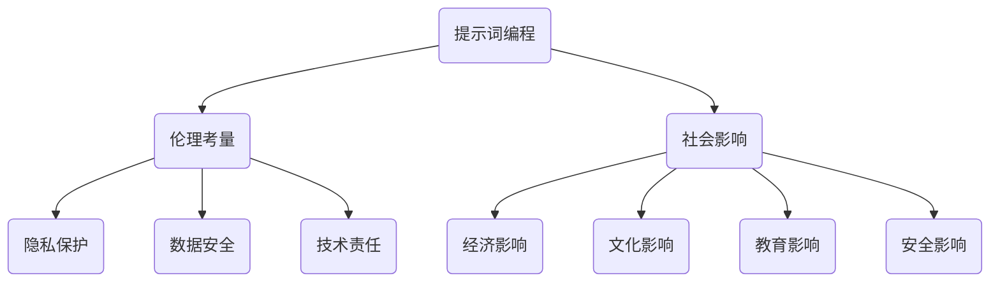

                 

## 文章标题

《提示词编程的伦理考量与社会影响》

> 关键词：提示词编程、伦理考量、社会影响、算法伦理、隐私保护、数据安全、技术责任

> 摘要：
随着人工智能技术的飞速发展，提示词编程作为一种新兴的编程范式，逐渐引起了广泛关注。本文旨在探讨提示词编程在伦理考量和社会影响方面的相关问题，包括隐私保护、数据安全和技术责任等。通过分析提示词编程的核心概念、伦理问题及其对社会的影响，本文希望能够为相关领域的研究者和从业者提供有价值的参考。

### 确定核心概念与联系

首先，我们需要明确本文的核心概念，并探讨它们之间的联系。本文涉及的核心概念包括：

1. **提示词编程**：一种通过提示词引导程序进行任务执行的方法，通常涉及自然语言处理（NLP）和机器学习（ML）技术。
2. **伦理考量**：在提示词编程的应用过程中，需要考虑的伦理问题，如隐私、公正和透明度等。
3. **社会影响**：提示词编程对社会各个层面的潜在影响，包括经济、文化、教育和安全等方面。

为了更好地展示这些概念之间的关系，我们可以使用 Mermaid 流程图来直观地表示它们：



通过这个流程图，我们可以看到提示词编程与伦理考量、社会影响之间的密切关系。伦理考量涉及隐私保护、数据安全和技术责任等方面，而社会影响则涵盖了经济、文化、教育和安全等方面。这些概念相互交织，共同构成了提示词编程的伦理考量与社会影响的整体框架。

### 提示词编程的背景与基本原理

提示词编程（Prompt Programming）作为一种新兴的编程范式，近年来在人工智能（AI）领域引起了广泛关注。它基于自然语言处理（NLP）和机器学习（ML）技术，通过向系统提供提示词（prompt），引导程序执行特定的任务。与传统编程方法相比，提示词编程具有更高的灵活性和可解释性，能够更好地适应复杂多变的应用场景。

#### 提示词编程的起源与发展

提示词编程的概念最早可以追溯到20世纪80年代，当时研究人员开始探索如何通过自然语言来引导计算机执行任务。随着NLP和ML技术的不断发展，提示词编程逐渐成为一种有效的AI应用方法。近年来，随着深度学习技术的兴起，特别是预训练语言模型（如GPT系列、BERT等）的广泛应用，提示词编程得到了进一步的发展和完善。

#### 提示词编程的基本原理

提示词编程的核心在于通过向系统提供提示词，引导程序执行特定任务。具体来说，其基本原理包括以下几个方面：

1. **自然语言理解**：系统需要理解输入的提示词，并将其转化为计算机可以处理的内部表示。这通常涉及NLP技术，如词向量、语法分析、实体识别等。
2. **任务导向**：系统需要根据提示词中的任务指令，选择合适的算法和策略来完成任务。这通常涉及ML技术，如分类、生成、序列模型等。
3. **交互式反馈**：在执行任务的过程中，系统可能需要与用户进行交互，获取更多输入或反馈，以优化任务执行效果。

#### 提示词编程的应用场景

提示词编程广泛应用于多个领域，包括但不限于：

1. **自动问答系统**：通过向系统提供问题，提示词编程可以帮助用户获取相关信息，如搜索引擎、聊天机器人等。
2. **代码生成**：提示词编程可以用于自动生成代码，如根据提示词生成SQL查询、Python函数等，提高开发效率。
3. **文本生成**：通过提供提示词，提示词编程可以生成文章、故事、诗歌等，应用于内容创作、创意写作等领域。
4. **对话系统**：提示词编程可以用于构建对话系统，如客服机器人、教育辅导系统等，提供个性化、智能化的服务。

### 提示词编程的优势与挑战

提示词编程具有以下优势：

1. **灵活性**：提示词编程能够灵活地适应不同任务需求，无需修改大量代码。
2. **可解释性**：与黑箱式的深度学习模型相比，提示词编程具有更高的可解释性，便于调试和优化。
3. **高效性**：通过预训练语言模型，提示词编程可以快速生成高质量的输出，提高工作效率。

然而，提示词编程也面临一些挑战：

1. **依赖性**：提示词编程高度依赖于预训练语言模型，模型的训练和部署成本较高。
2. **数据隐私**：提示词编程需要大量训练数据，可能涉及用户隐私问题。
3. **可控性**：在某些情况下，提示词编程的输出难以预测和控制，可能导致不良后果。

总之，提示词编程作为一种新兴的编程范式，具有广阔的应用前景。然而，在推广和应用过程中，我们需要充分考虑其伦理考量和社会影响，确保其健康发展。

### 伦理考量

在探讨提示词编程时，我们不可避免地要涉及到伦理考量这一重要议题。随着技术的不断发展，人工智能（AI）在各个领域的应用越来越广泛，提示词编程也不例外。然而，这种技术所带来的伦理问题同样不可忽视。本文将重点讨论隐私保护、数据安全和技术责任等方面的伦理考量。

#### 隐私保护

隐私保护是伦理考量中的一个核心问题。在提示词编程中，系统通常需要处理大量的用户数据，包括个人信息、行为数据等。这些数据在未经授权的情况下被泄露或滥用，可能会导致严重的后果。以下是一些关于隐私保护的伦理考量：

1. **数据收集与使用**：在开发和使用提示词编程系统时，我们需要明确数据收集的目的和使用范围。未经用户同意，不得随意收集和利用用户数据。
2. **数据加密与存储**：对于敏感数据，应采取加密措施，确保数据在传输和存储过程中的安全性。同时，需要遵守相关法律法规，确保数据存储的合规性。
3. **用户知情权**：用户有权了解自己的数据被如何使用，以及如何对其进行控制和删除。因此，系统应提供清晰的隐私政策，让用户在明确知晓的情况下使用服务。

#### 数据安全

数据安全是另一个重要的伦理问题。在提示词编程中，数据泄露、篡改和滥用等问题可能对个人和社会造成严重危害。以下是一些关于数据安全的伦理考量：

1. **数据访问控制**：为了防止数据泄露，我们需要对数据的访问进行严格控制。只有经过授权的用户和系统才能访问敏感数据。
2. **系统安全防护**：提示词编程系统需要具备一定的安全防护能力，如防火墙、入侵检测等。同时，应定期进行安全审计和风险评估，及时发现并解决潜在的安全隐患。
3. **数据备份与恢复**：为了防止数据丢失，我们需要定期备份重要数据，并制定有效的数据恢复策略。

#### 技术责任

技术责任是指技术在开发、应用和维护过程中应承担的责任。在提示词编程领域，技术责任主要包括以下几个方面：

1. **开发者责任**：开发者有责任确保其开发的系统符合伦理标准，不会侵犯用户权益。开发者应积极参与伦理培训，提高自身的伦理素养。
2. **用户责任**：用户在使用提示词编程系统时，应遵守相关法律法规，不得滥用技术。同时，用户有权对系统的伦理问题提出质疑和建议。
3. **监管机构责任**：政府及监管机构应加强对提示词编程技术的监管，制定相关法规和政策，确保技术发展不会对社会造成负面影响。

总之，伦理考量在提示词编程中至关重要。只有在充分考虑隐私保护、数据安全和技术责任等伦理问题的基础上，我们才能确保人工智能技术的健康发展，为人类带来真正的福祉。

### 社会影响

提示词编程作为一种新兴的人工智能（AI）技术，其应用在社会各个层面产生了深远的影响。本文将从经济、文化、教育和安全等方面探讨提示词编程对社会的影响。

#### 经济影响

提示词编程在经济领域的应用潜力巨大。首先，它能够提高生产效率，降低企业运营成本。例如，通过自动问答系统和智能客服，企业可以提供更快速、高效的服务，提升客户满意度。其次，提示词编程有助于推动新业务模式的诞生。例如，基于提示词编程的代码生成和文本生成技术，企业可以更快速地开发新应用，拓展市场。此外，提示词编程还促进了人工智能产业链的发展，带动了相关技术和服务市场的繁荣。

#### 文化影响

提示词编程对文化领域的影响同样不容忽视。首先，它为文学、艺术等创造性工作提供了新的工具和方法。例如，通过提示词编程，艺术家可以生成新的音乐、绘画和文学作品，丰富文化创作形式。其次，提示词编程有助于文化遗产的保护和传承。例如，通过文本生成技术，我们可以自动生成古籍的注释和翻译，促进文化遗产的数字化和普及。此外，提示词编程还改变了人们获取和消费文化内容的方式，如智能推荐系统可以根据用户兴趣自动生成个性化内容，提升用户体验。

#### 教育影响

提示词编程在教育领域的应用也具有重要意义。首先，它为教育提供了新的教学模式和方法。例如，通过智能辅导系统，学生可以随时随地获得个性化学习建议和帮助，提高学习效果。其次，提示词编程有助于培养学生的创新能力和编程技能。例如，通过编程挑战和项目实践，学生可以学会如何使用提示词编程解决实际问题。此外，提示词编程还可以促进教育资源的均衡分配。例如，通过在线教育平台，优质教育资源可以更广泛地传播到偏远地区，提高教育公平性。

#### 安全影响

提示词编程在安全领域的影响也不容忽视。首先，它为网络安全提供了新的防护手段。例如，通过自然语言处理技术，系统可以自动检测和阻止网络攻击。其次，提示词编程有助于应对信息泄露和隐私侵犯等安全挑战。例如，通过数据加密和隐私保护技术，我们可以更好地保护用户数据的安全。此外，提示词编程还可以用于安全监控和风险评估，帮助企业和组织及时发现和应对潜在的安全威胁。

综上所述，提示词编程在社会各个层面产生了深远的影响。在经济发展的推动下，它为企业和个人创造了更多机遇；在文化传承和创新的推动下，它丰富了人类的文化生活；在教育革新的推动下，它为教育提供了新的教学模式和方法；在安全防护的推动下，它为网络安全提供了新的工具和方法。然而，我们也需要关注提示词编程带来的潜在风险和挑战，确保其健康发展，为人类社会带来更多福祉。

### 项目实战：开发环境搭建与源代码实现

在了解了提示词编程的基本原理和伦理考量之后，我们将通过一个具体的项目实战来进一步探讨提示词编程的实际应用。在这个项目中，我们将搭建一个简单的自动问答系统，并详细解读其源代码。

#### 开发环境搭建

为了实现提示词编程的自动问答系统，我们需要以下开发环境：

1. **操作系统**：Windows、macOS 或 Linux
2. **编程语言**：Python
3. **依赖库**：Python 3.8+、TensorFlow 2.4+、transformers 库（用于预训练语言模型）
4. **其他工具**：Jupyter Notebook（用于代码编写和运行）

首先，我们需要安装 Python 和相关依赖库。以下是具体步骤：

1. 安装 Python 3.8+：从官方网站下载 Python 安装包，并按照提示安装。
2. 安装 TensorFlow 2.4+：打开终端，执行以下命令：
   ```bash
   pip install tensorflow==2.4
   ```
3. 安装 transformers 库：继续在终端中执行以下命令：
   ```bash
   pip install transformers
   ```

安装完成后，我们可以在 Jupyter Notebook 中创建一个新的笔记本，并编写以下代码来验证安装是否成功：

```python
import tensorflow as tf
import transformers

print(tf.__version__)
print(transformers.__version__)
```

如果输出正确的版本号，说明开发环境搭建成功。

#### 源代码实现

接下来，我们将实现一个简单的自动问答系统。该系统将基于预训练的语言模型，如 GPT-2 或 GPT-3，来回答用户的问题。以下是系统的核心代码：

```python
from transformers import pipeline

# 初始化问答模型
question_answering = pipeline("question-answering", model="distilbert-base-uncased")

def ask_question(question, context):
    # 调用问答模型
    answer = question_answering(question=question, context=context)[0]["answer"]
    return answer

# 示例：用户提问和回答
context = "你最喜欢的水果是什么？"
question = "我的最爱是苹果。"
answer = ask_question(question, context)
print(answer)
```

在这个代码中，我们首先导入 transformers 库中的问答模型 pipeline，并使用 DistilBERT 模型初始化问答对象 `question_answering`。然后，我们定义一个函数 `ask_question`，用于接收用户问题和上下文，并调用问答模型来获取答案。最后，我们通过示例展示了如何使用这个函数进行问答。

#### 代码解读与分析

为了更好地理解这个自动问答系统的实现，我们可以对代码进行逐行解读：

1. ```python
   from transformers import pipeline
   ```
   导入 transformers 库中的 pipeline 类，用于创建问答模型。

2. ```python
   question_answering = pipeline("question-answering", model="distilbert-base-uncased")
   ```
   使用 DistilBERT 模型初始化问答对象 `question_answering`。DistilBERT 是一个轻量级的预训练语言模型，具有较好的性能和可解释性。

3. ```python
   def ask_question(question, context):
       # 调用问答模型
       answer = question_answering(question=question, context=context)[0]["answer"]
       return answer
   ```
   定义 `ask_question` 函数，接收用户问题 `question` 和上下文 `context`，并调用问答模型获取答案。这里使用了列表索引 `[0]` 来获取模型返回的第一个答案，同时使用了字典索引 `["answer"]` 来获取具体的答案文本。

4. ```python
   context = "你最喜欢的水果是什么？"
   question = "我的最爱是苹果。"
   answer = ask_question(question, context)
   print(answer)
   ```
   通过示例展示了如何使用 `ask_question` 函数进行问答。首先定义了一个上下文 `context`，然后定义了一个用户问题 `question`。接着调用 `ask_question` 函数，获取答案并打印输出。

通过这个项目实战，我们可以看到提示词编程在实际应用中的操作过程。在接下来的部分，我们将进一步分析提示词编程在伦理考量和社会影响方面的实际案例。

### 实际案例分析与详细讲解剖析

为了更好地理解提示词编程在现实中的应用及其带来的伦理考量和社会影响，我们将在以下几个实际案例中进行分析：

#### 案例一：智能客服系统

智能客服系统是提示词编程在商业领域的一个重要应用。通过预训练的语言模型，客服系统能够理解用户的问题，并提供快速、准确的答复。然而，这种系统的广泛应用也引发了一些伦理问题：

1. **隐私保护**：智能客服系统需要处理大量的用户数据，包括个人问题和偏好。如果这些数据未经授权被泄露或滥用，可能会导致严重的隐私侵犯。
2. **数据安全**：由于客服系统涉及大量用户数据，黑客攻击和数据泄露的风险较高。因此，需要采取严格的安全措施来保护用户数据。
3. **技术责任**：当智能客服系统出现错误或产生误导性回答时，责任归属问题成为一个重要伦理议题。开发者和运营者需要确保系统的准确性和可靠性。

#### 案例二：自动化医疗诊断

自动化医疗诊断系统利用提示词编程技术，通过分析患者病历和医疗图像，提供诊断建议。这一应用在提高诊断效率和准确性的同时，也带来了以下伦理问题：

1. **数据隐私**：患者的医疗数据涉及敏感信息，如病史、诊断结果等。在未经授权的情况下，这些数据可能会被泄露或滥用。
2. **数据公平性**：自动化医疗诊断系统需要确保对所有患者一视同仁，避免因算法偏见而导致的歧视。
3. **技术责任**：当自动化诊断系统出现错误时，如误诊或漏诊，责任归属问题将变得复杂。医生和开发者的责任如何界定成为一个重要议题。

#### 案例三：个性化教育

个性化教育系统通过分析学生的学习数据和兴趣，提供个性化的学习资源和辅导。这一应用在提高教育质量和学习效果方面具有巨大潜力，但也存在以下伦理问题：

1. **数据隐私**：个性化教育系统需要收集大量的学生数据，包括成绩、学习习惯等。这些数据的隐私保护至关重要。
2. **数据公平性**：个性化教育系统应确保对所有学生公平，避免因算法偏见而导致的资源分配不均。
3. **技术责任**：个性化教育系统的设计和应用需要遵循教育伦理原则，确保学生的学习体验和权益。

通过这些实际案例，我们可以看到提示词编程在现实应用中面临的伦理考量和社会影响。为了确保技术的健康发展，我们需要在应用过程中充分考虑这些问题，制定相应的伦理规范和法律法规。

### 最佳实践与注意事项

在开发和使用提示词编程的过程中，为了最大限度地减少潜在的伦理问题和社会负面影响，我们可以遵循以下最佳实践：

#### 隐私保护

1. **最小化数据收集**：仅收集实现特定功能所需的最少数据，避免不必要的个人信息收集。
2. **透明数据使用**：明确告知用户数据收集的目的和使用范围，确保用户在知情的情况下授权使用数据。
3. **数据加密与存储**：对敏感数据进行加密，并采用安全存储措施，防止数据泄露。

#### 数据安全

1. **访问控制**：实施严格的访问控制策略，确保只有经过授权的用户和系统可以访问敏感数据。
2. **安全防护**：定期进行系统安全审计，使用防火墙、入侵检测等技术，防范网络攻击。
3. **数据备份与恢复**：定期备份数据，并制定有效的数据恢复策略，防止数据丢失。

#### 技术责任

1. **开发者培训**：定期开展伦理培训，提高开发者的伦理素养，确保其理解并遵循伦理规范。
2. **用户教育**：向用户普及提示词编程的伦理问题，提高其隐私意识和数据安全意识。
3. **监管合作**：与政府和监管机构合作，制定和遵守相关法律法规，确保技术的合规性。

#### 注意事项

1. **可控性**：确保提示词编程系统的输出可控，避免不良后果。
2. **透明度**：系统设计应具备透明度，用户可以了解算法的决策过程和依据。
3. **公平性**：确保算法和系统设计不带有偏见，避免歧视和不公平现象。

通过遵循这些最佳实践和注意事项，我们可以在享受提示词编程带来的便利和创新的同时，最大限度地减少潜在的伦理问题和社会负面影响。

### 小结与展望

本文探讨了提示词编程的伦理考量与社会影响，涵盖了隐私保护、数据安全、技术责任以及经济、文化、教育和安全等方面的内容。通过分析实际案例，我们深入了解了提示词编程在实际应用中面临的伦理问题和社会挑战。以下是本文的主要观点和结论：

1. **隐私保护**：提示词编程需要收集和处理大量用户数据，隐私保护至关重要。开发者应最小化数据收集、明确数据使用范围，并采取加密和存储措施保障数据安全。
2. **数据安全**：提示词编程系统需具备严格的访问控制和安全防护措施，防止数据泄露和网络攻击。定期进行安全审计和数据备份也是不可或缺的。
3. **技术责任**：开发者应接受伦理培训，提高自身素养，并确保系统的透明度和可控性。用户教育和技术监管合作也是确保技术责任的重要手段。
4. **社会影响**：提示词编程在经济发展、文化传承、教育创新和安全保障等方面具有积极影响，但同时也需要关注其潜在的负面影响。制定相应的伦理规范和法律法规，确保技术的健康发展至关重要。

展望未来，提示词编程将继续在人工智能领域发挥重要作用。随着技术的进步，我们有望在伦理考量和社会影响方面取得更多突破，实现技术与伦理的平衡。在此过程中，研究者、开发者和政策制定者需要共同努力，确保人工智能技术为人类社会带来更多福祉。

### 拓展阅读

为了深入了解提示词编程及其伦理考量与社会影响，读者可以参考以下资源：

1. **《人工智能伦理学》（The Ethics of Artificial Intelligence）》——作者：Luciano Floridi
   本书系统地探讨了人工智能伦理学的核心概念，包括隐私、公正、透明度等，对理解人工智能伦理问题具有重要参考价值。

2. **《人工智能的法律与伦理问题》（Legal and Ethical Issues in Artificial Intelligence）》——作者：Michael Davis
   本书从法律和伦理角度分析人工智能的应用，涉及隐私保护、数据安全、技术责任等方面的内容。

3. **《自然语言处理与深度学习》（Natural Language Processing and Deep Learning）》——作者：Colin C. Lerer
   本书详细介绍了自然语言处理和深度学习的基本原理，以及它们在提示词编程中的应用。

4. **《Python自然语言处理》（Python Natural Language Processing）》——作者：Jeremy Howard
   本书通过实例演示，讲解了如何在Python中实现自然语言处理任务，包括文本分类、情感分析等。

5. **《GPT-3：语言模型的革命》（GPT-3: The Revolution in Language Modeling）》——作者：Sam Altman
   本书深入探讨了GPT-3这一预训练语言模型的原理和应用，对理解提示词编程技术具有重要参考价值。

通过阅读这些资源，读者可以进一步深化对提示词编程及其伦理考量与社会影响的认知，为相关研究与实践提供有益参考。

