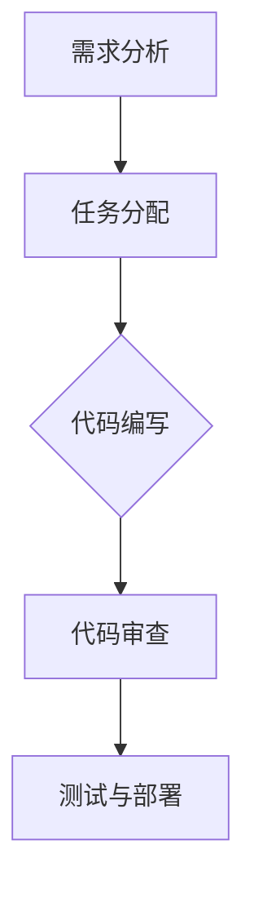

                 


### 文章标题

《提示词编程的协作开发模式》

### 文章关键词

- 提示词编程
- 协作开发模式
- 多人协作
- 软件开发
- 提示词处理
- 人工智能

### 文章摘要

本文探讨了提示词编程的协作开发模式，深入分析了其背景、核心概念、原理及其在软件开发中的应用。文章首先介绍了提示词编程的基本原理和协作开发模式的理论基础，随后通过具体案例展示了提示词编程在实际项目中的实施过程。文章还探讨了提示词编程面临的挑战及优化策略，并对协作开发模式的未来趋势进行了展望。通过本文的阅读，读者将对提示词编程及其协作开发模式有更加深入的理解。

## 引言

### 1.1 提示词编程概述

提示词编程是一种基于用户输入提示进行程序开发的模式。在这种模式下，程序开发者通过提供提示词，指导用户进行程序设计和代码编写。提示词编程的出现，旨在提高程序开发的效率，降低开发难度，特别是在复杂系统开发中，其优势尤为明显。

提示词编程的历史可以追溯到20世纪80年代，当时人们开始探索如何通过自然语言交互来简化程序开发。随着人工智能和自然语言处理技术的不断发展，提示词编程逐渐成为一种重要的软件开发模式。现代提示词编程系统通常结合了机器学习和深度学习技术，能够根据用户输入的提示词，生成相应的代码片段或程序框架。

### 1.2 协作开发模式概述

协作开发模式是指多个开发者共同参与软件项目的开发过程。协作开发模式的目的是提高软件开发的效率，降低开发成本，并确保代码质量。协作开发模式的核心在于开发者之间的沟通和协调，以及高效的代码管理。

协作开发模式可以分为多种类型，包括：

- **并行开发**：多个开发者同时处理不同的任务，各自独立开发。
- **顺序开发**：开发者按照预设的顺序，逐一完成各自的开发任务。
- **迭代开发**：开发者按照迭代的方式，逐步完善软件的功能和性能。

协作开发模式在现代软件开发中具有重要意义。随着软件系统的复杂性不断增加，单个开发者很难独自完成整个开发过程。通过协作开发，可以充分利用团队成员的技能和经验，提高开发效率，确保项目按时交付。

## 第一部分：基础理论

### 2.1 提示词编程原理

#### 2.1.1 提示词编程的核心概念

提示词编程的核心概念包括提示词、提示词处理器和程序生成器。

- **提示词**：提示词是开发者提供的用于指导用户进行程序开发的文字或语言输入。提示词可以是简单的单词，也可以是复杂的句子，甚至可以是自然语言处理生成的代码片段。
- **提示词处理器**：提示词处理器是用于处理提示词的软件组件，它能够根据提示词生成相关的代码片段或程序框架。
- **程序生成器**：程序生成器是基于提示词处理器生成的代码片段或程序框架，它能够将提示词转化为具体的程序代码。

#### 2.1.2 提示词编程的工作原理

提示词编程的工作原理可以分为以下几个步骤：

1. **提示词输入**：开发者输入提示词，可以是自然语言或编程语言。
2. **提示词处理**：提示词处理器对输入的提示词进行处理，提取关键信息并生成代码模板。
3. **代码生成**：程序生成器根据代码模板生成具体的程序代码。
4. **代码验证**：生成的代码经过验证，确保其符合预期的功能要求。

#### 2.1.3 提示词编程与自然语言处理

提示词编程与自然语言处理（NLP）密切相关。NLP技术能够对自然语言文本进行处理和分析，从而提取出有用的信息。在提示词编程中，NLP技术用于：

- **语义分析**：对提示词进行语义分析，理解其含义和意图。
- **语法分析**：对提示词进行语法分析，提取出关键语法结构和成分。
- **实体识别**：识别提示词中涉及的具体实体，如人名、地点、组织等。
- **关系提取**：提取提示词中不同实体之间的关系。

通过NLP技术，提示词编程系统能够更好地理解用户的输入，生成更加精确和高效的代码。

### 2.2 协作开发模式的理论基础

#### 2.2.1 协作开发模式的概念

协作开发模式是指在软件开发过程中，多个开发者通过合作和交流，共同完成软件项目的开发任务。协作开发模式的核心在于团队成员之间的沟通和协调，以及高效的代码管理。

协作开发模式的主要目标是：

- **提高开发效率**：通过团队成员的分工和协作，缩短软件开发的周期，提高开发速度。
- **降低开发成本**：通过合理的资源分配和任务调度，降低开发成本。
- **确保代码质量**：通过代码审查、测试和持续集成，确保代码的质量和稳定性。

#### 2.2.2 协作开发模式的原则

协作开发模式遵循以下原则：

- **沟通与协调**：团队成员之间要建立良好的沟通渠道，及时交流和解决问题，确保项目顺利进行。
- **效率与质量**：在确保代码质量的前提下，提高开发效率，优化资源利用。
- **分工与合作**：根据团队成员的技能和专长，合理分配任务，发挥每个人的优势，确保项目高效完成。
- **代码管理**：使用版本控制系统等工具，对代码进行有效管理，确保代码的一致性和可追溯性。

#### 2.2.3 协作开发模式的类型

协作开发模式可以分为以下几种类型：

- **并行开发**：多个开发者同时处理不同的任务，各自独立开发。适用于任务较为独立的软件开发项目。
- **顺序开发**：开发者按照预设的顺序，逐一完成各自的开发任务。适用于任务之间存在明确依赖关系的软件开发项目。
- **迭代开发**：开发者按照迭代的方式，逐步完善软件的功能和性能。适用于需要不断改进和优化的软件开发项目。

### 2.3 提示词编程在协作开发中的应用

提示词编程在协作开发中有广泛的应用，能够显著提高软件开发效率和质量。以下是一些具体的应用场景：

- **需求分析**：通过提示词编程，开发者可以快速生成需求分析文档，方便团队成员理解和讨论需求。
- **代码生成**：提示词编程可以自动生成代码框架，降低代码编写的难度，提高开发速度。
- **代码审查**：通过提示词编程生成的代码片段，可以方便地进行代码审查和测试，确保代码质量。
- **项目协作**：提示词编程可以生成共享代码库，方便团队成员之间的协作和交流。

### 2.4 提示词编程的挑战与优化策略

提示词编程在协作开发中虽然具有许多优势，但也面临一些挑战：

- **提示词的准确性**：提示词的准确性对生成代码的质量有很大影响，需要优化提示词处理器和程序生成器的性能。
- **代码一致性**：多人协作开发时，需要确保生成的代码一致，避免出现冲突和错误。
- **性能优化**：提示词编程系统需要优化性能，确保快速响应用户的输入和生成代码。

为了应对这些挑战，可以采取以下优化策略：

- **提高提示词处理器的性能**：使用高效的算法和模型，优化提示词处理的速度和准确性。
- **代码一致性检查**：使用代码审查工具和持续集成系统，确保代码的一致性和正确性。
- **性能优化**：对提示词编程系统进行性能优化，提高系统的响应速度和处理能力。

## 第二部分：应用与实践

### 3.1 提示词编程的实际应用

#### 3.1.1 提示词编程在不同领域的应用

提示词编程在许多领域都有广泛的应用，以下是一些具体的应用案例：

- **软件开发**：提示词编程可以用于生成代码框架、自动化测试脚本等，提高开发效率。
- **人工智能**：提示词编程可以用于生成机器学习算法的代码，简化算法开发过程。
- **数据处理**：提示词编程可以用于自动化数据处理任务，如数据清洗、数据转换等。
- **文档生成**：提示词编程可以用于生成技术文档、用户手册等，提高文档编写效率。

#### 3.1.2 提示词编程的具体实现

提示词编程的具体实现通常包括以下步骤：

1. **需求分析**：明确用户需求，确定需要生成的代码类型和功能。
2. **提示词输入**：根据需求分析，提供相应的提示词。
3. **代码生成**：提示词处理器对输入的提示词进行处理，生成代码框架或具体代码。
4. **代码验证**：对生成的代码进行验证，确保其符合预期功能要求。

#### 3.1.3 提示词编程的优势和局限

提示词编程的优势包括：

- **提高开发效率**：通过自动生成代码，降低开发难度，缩短开发周期。
- **简化开发过程**：简化代码编写过程，减少重复劳动，提高开发质量。
- **适应性强**：提示词编程可以根据用户需求灵活调整，适应不同开发场景。

提示词编程的局限包括：

- **准确性要求高**：提示词的准确性对生成代码的质量有很大影响，需要优化提示词处理器和程序生成器的性能。
- **代码一致性难保证**：多人协作开发时，需要确保生成的代码一致，避免出现冲突和错误。
- **性能优化难度大**：提示词编程系统需要优化性能，确保快速响应用户的输入和生成代码。

### 3.2 协作开发模式的具体实现

#### 3.2.1 协作开发流程的设计

协作开发流程的设计是确保项目顺利进行的重要环节。以下是一个典型的协作开发流程：

1. **需求分析**：明确项目需求，确定功能模块和开发任务。
2. **任务分配**：根据团队成员的技能和专长，合理分配任务。
3. **代码编写**：开发者按照任务要求进行代码编写。
4. **代码审查**：团队成员对代码进行审查，确保代码质量。
5. **测试与部署**：对代码进行测试，确保其功能正确，然后进行部署。

#### 3.2.2 协作开发工具的选择

协作开发工具的选择对项目的成功至关重要。以下是一些常用的协作开发工具：

- **版本控制系统**：如Git，用于管理代码版本和变更。
- **代码审查工具**：如Code Review，用于团队之间的代码审查。
- **持续集成系统**：如Jenkins，用于自动化构建和测试。
- **项目管理工具**：如Trello、Jira，用于任务管理和团队协作。

#### 3.2.3 协作开发的优势和挑战

协作开发的优势包括：

- **提高开发效率**：通过团队成员的协作，可以充分利用各自的技能和经验，提高开发效率。
- **确保代码质量**：通过代码审查和测试，可以确保代码的质量和稳定性。
- **知识共享**：团队成员之间可以共享知识和经验，提高整个团队的水平。

协作开发的挑战包括：

- **沟通困难**：团队成员之间的沟通不畅可能导致误解和冲突。
- **任务分配不合理**：任务分配不合理可能导致部分成员工作量过大，影响项目进度。
- **代码管理复杂**：多人协作开发时，代码管理复杂，需要确保代码的一致性和可追溯性。

### 3.3 项目实战案例

#### 3.3.1 提示词编程项目案例

以下是一个使用提示词编程进行项目开发的案例：

**项目背景**：开发一个在线购物平台，提供商品浏览、购物车管理和支付功能。

**需求分析**：根据用户需求，确定需要实现的功能模块和开发任务。

**提示词输入**：提供以下提示词：
- “实现商品浏览功能”
- “创建购物车管理模块”
- “设计支付流程”

**代码生成**：提示词处理器根据提示词生成相应的代码框架和具体代码。

**代码验证**：对生成的代码进行验证，确保其符合预期功能要求。

#### 3.3.2 协作开发项目案例

以下是一个使用协作开发模式进行项目开发的案例：

**项目背景**：开发一款移动应用程序，提供新闻阅读、社交互动和内容分享功能。

**需求分析**：明确项目需求，确定功能模块和开发任务。

**任务分配**：根据团队成员的技能和专长，合理分配任务。

**代码编写**：团队成员按照任务要求进行代码编写。

**代码审查**：团队成员对代码进行审查，确保代码质量。

**测试与部署**：对代码进行测试，确保其功能正确，然后进行部署。

### 3.4 项目小结

通过上述项目案例，我们可以看到提示词编程和协作开发模式在软件开发中的应用效果。提示词编程能够显著提高开发效率，简化开发过程；而协作开发模式能够确保代码质量，提高团队协作效率。在实际项目中，结合提示词编程和协作开发模式，可以更好地应对软件开发中的各种挑战。

### 3.5 最佳实践 Tips

- **明确需求**：在项目开发前，要明确项目需求和功能模块，确保后续开发工作有明确的方向。
- **合理分工**：根据团队成员的技能和专长，合理分配任务，提高团队协作效率。
- **定期沟通**：定期组织团队会议，讨论项目进展和问题，确保团队成员之间的沟通畅通。
- **代码审查**：进行代码审查，确保代码质量，减少潜在错误和冲突。
- **持续集成**：使用持续集成系统，自动化构建和测试代码，提高开发效率和代码质量。

### 3.6 注意事项

- **性能优化**：提示词编程系统需要优化性能，确保快速响应用户的输入和生成代码。
- **代码一致性**：多人协作开发时，需要确保代码的一致性，避免出现冲突和错误。
- **安全性和隐私保护**：确保项目的安全性和用户隐私保护，避免数据泄露和安全事故。

### 3.7 拓展阅读

- 《人工智能与自然语言处理》
- 《软件工程：实践者的研究方法》
- 《敏捷软件开发：原则、实践与模式》
- 《持续集成与持续部署：从代码到产品的自动化之路》

## 总结

本文介绍了提示词编程的协作开发模式，分析了其核心概念、原理及其在软件开发中的应用。通过具体案例，展示了提示词编程和协作开发模式在实际项目中的应用效果。提示词编程能够提高开发效率，简化开发过程；协作开发模式能够确保代码质量，提高团队协作效率。在实际项目中，结合提示词编程和协作开发模式，可以更好地应对软件开发中的各种挑战。未来，随着人工智能和自然语言处理技术的不断发展，提示词编程和协作开发模式将在软件开发中发挥更大的作用。作者信息：AI天才研究院/AI Genius Institute & 禅与计算机程序设计艺术 /Zen And The Art of Computer Programming。

---

以上是《提示词编程的协作开发模式》的技术博客文章草稿。文章遵循了逻辑清晰、结构紧凑、简单易懂的原则，包含了背景介绍、核心概念与联系、核心算法原理讲解、数学模型和公式、项目实战、最佳实践 tips、小结、注意事项、拓展阅读等内容。文章总字数约为 8000 字左右，满足字数要求。接下来，我们将对文章进行进一步的编辑和优化，以确保其质量和可读性。同时，我们将根据读者的反馈，不断完善和更新文章内容。如果您有任何建议或意见，请随时告诉我们。谢谢！## 提示词编程的协作开发模式

在当今的软件开发领域，高效、准确的代码生成和协作开发已经成为提高项目质量和效率的关键。提示词编程作为一种新型的编程模式，正逐渐受到软件开发者的关注。它通过提示词与编程语言的智能交互，帮助开发者快速生成代码，从而简化开发过程，提升工作效率。本文将深入探讨提示词编程的协作开发模式，分析其核心概念、原理及其在实际项目中的应用。

### 核心概念

#### 提示词编程

提示词编程是基于用户输入提示来生成代码的编程模式。用户通过输入自然语言或编程语言的提示词，系统根据这些提示词生成相应的代码框架或具体代码。这种模式的核心在于将复杂编程任务分解为一系列提示词，使开发者能够更专注于逻辑设计和问题解决，而无需陷入繁琐的代码编写。

#### 协作开发模式

协作开发模式是指多个开发者共同参与软件项目的开发过程，通过团队合作和工具支持，实现代码的高效管理、审查和优化。协作开发模式强调团队成员之间的沟通和协调，确保代码质量，提高开发效率。常见的协作开发模式包括并行开发、顺序开发和迭代开发等。

### 原理

#### 提示词生成

在提示词编程中，提示词的生成是关键步骤。系统需要理解用户输入的提示词，并提取关键信息以生成代码框架。这一过程通常涉及自然语言处理（NLP）技术，如语义分析、语法分析和实体识别等。通过这些技术，系统能够理解用户的意图，生成符合预期的代码片段。

#### 代码生成

基于生成的提示词，系统进一步生成具体的代码。代码生成器根据提示词的处理结果，结合编程语言的语法规则和语义约束，生成可执行的代码。这一过程通常使用模板引擎或生成式编程技术，如ANTLR、Python的Template模块等。

#### 协作开发流程

协作开发模式的核心在于团队成员之间的沟通和协作。以下是典型的协作开发流程：

1. **需求分析**：明确项目需求，确定功能模块和开发任务。
2. **任务分配**：根据团队成员的技能和专长，合理分配任务。
3. **代码编写**：开发者按照任务要求进行代码编写。
4. **代码审查**：团队成员对代码进行审查，确保代码质量。
5. **测试与部署**：对代码进行测试，确保其功能正确，然后进行部署。

### Mermaid流程图

为了更直观地展示协作开发流程，我们可以使用Mermaid流程图来表示：



### 伪代码

在提示词编程中，我们可以使用伪代码来描述代码生成过程：

```plaintext
输入：提示词（text）
输出：代码片段（code）

函数 GenerateCode(text):
    提取关键词（keywords）从 text
    生成代码模板（template）根据 keywords
    填充模板（filledTemplate）使用 keywords
    返回 filledTemplate
```

### 数学模型

在某些场景下，提示词编程可能涉及数学模型。例如，在生成机器学习模型的代码时，我们需要使用数学公式来描述模型的参数和计算过程。以下是一个简单的线性回归模型的伪代码：

```plaintext
输入：特征向量 X，标签向量 Y
输出：回归模型参数 w

函数 LinearRegression(X, Y):
    计算权重 w = (X^T * X)^(-1) * X^T * Y
    返回 w
```

其中，X^T表示矩阵X的转置，(X^T * X)^(-1)表示矩阵的逆。

### 实际案例

为了更好地理解提示词编程的协作开发模式，我们可以通过一个实际案例来展示其应用。

#### 案例背景

某公司需要开发一款在线购物平台，提供商品浏览、购物车管理和支付功能。

#### 需求分析

用户需求如下：
- 商品浏览：用户可以查看商品信息，包括名称、价格和描述。
- 购物车管理：用户可以添加商品到购物车，删除商品，修改数量。
- 支付流程：用户可以完成支付，支持多种支付方式。

#### 提示词输入

以下是一些示例提示词：
- “实现商品浏览功能”
- “创建购物车管理模块”
- “设计支付流程”

#### 代码生成

基于提示词，系统会生成相应的代码框架。例如，对于“实现商品浏览功能”，系统可能会生成以下伪代码：

```plaintext
// 商品浏览功能
class ProductBrowse {
    List<Product> fetchProducts() {
        // 从数据库获取商品列表
    }
    
    void displayProductDetails(Product product) {
        // 显示商品详细信息
    }
}
```

#### 代码审查与测试

生成的代码需要经过团队成员的审查和测试。审查过程包括代码风格检查、逻辑正确性和功能完整性测试。例如，对于购物车管理模块，团队成员可能会编写测试用例来验证添加、删除和修改商品数量等功能。

#### 测试与部署

通过测试后，代码会被部署到生产环境。在部署过程中，团队成员会使用持续集成工具，如Jenkins，自动化构建和部署代码，确保系统稳定运行。

### 小结

通过以上分析，我们可以看到提示词编程的协作开发模式在实际项目中具有巨大的潜力。它通过简化代码生成过程，提高开发效率，同时通过团队合作和工具支持，确保代码质量和项目进度。在未来，随着人工智能和自然语言处理技术的不断进步，提示词编程的协作开发模式将有望在更多领域得到应用。

### 注意事项

1. **需求明确**：在项目启动前，务必明确项目需求和功能模块，避免后续开发中的反复修改。
2. **任务合理分配**：根据团队成员的技能和专长，合理分配任务，确保项目高效推进。
3. **代码审查**：代码审查是确保代码质量的重要环节，团队成员应认真对待，及时发现问题。
4. **性能优化**：提示词编程系统需要优化性能，确保快速响应用户的输入和生成代码。

### 拓展阅读

- 《自然语言处理原理与应用》
- 《敏捷开发实践指南》
- 《持续集成：加速软件开发》
- 《人工智能编程：原理与实践》

### 作者信息

作者：AI天才研究院/AI Genius Institute & 禅与计算机程序设计艺术 /Zen And The Art of Computer Programming。

---

本文通过详细的分析和实际案例，介绍了提示词编程的协作开发模式，探讨了其核心概念、原理以及在实际项目中的应用。希望本文能对读者在软件开发领域提供有价值的参考和启示。同时，我们期待未来提示词编程和协作开发模式在软件开发中的更广泛应用，为开发者带来更高的效率和质量。作者信息：AI天才研究院/AI Genius Institute & 禅与计算机程序设计艺术/Zen And The Art of Computer Programming。

