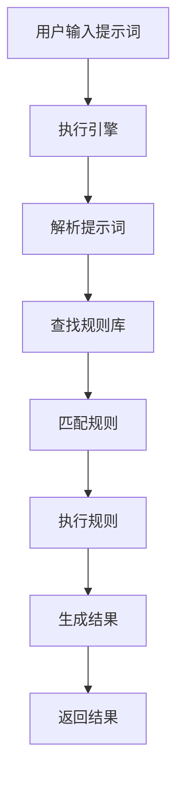
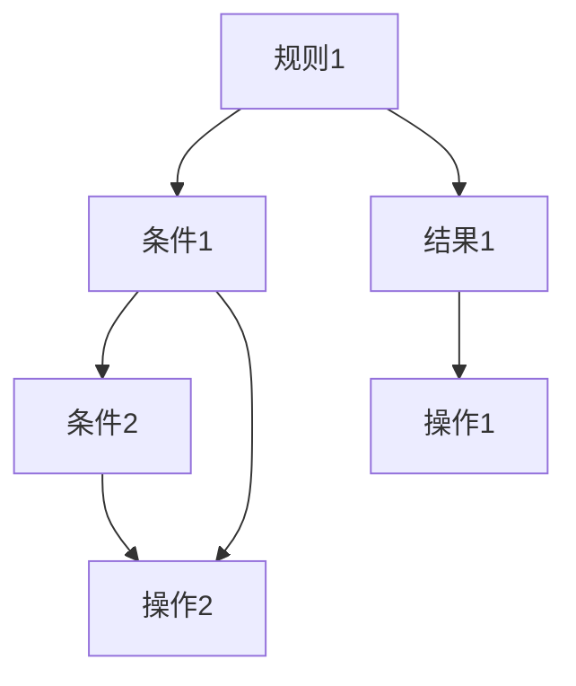
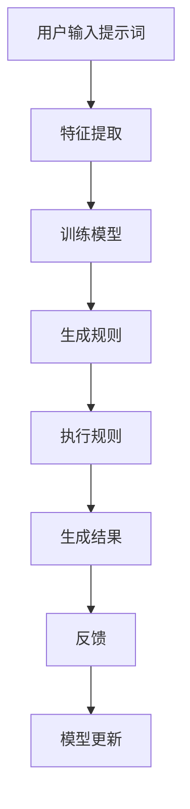
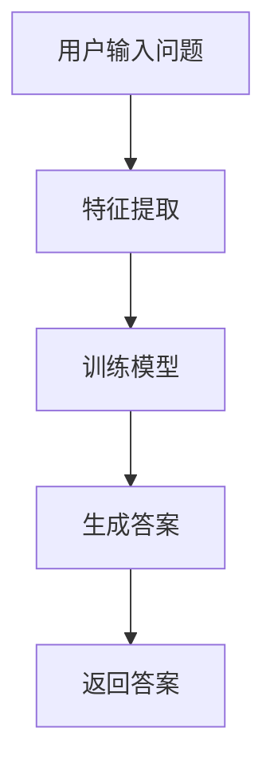
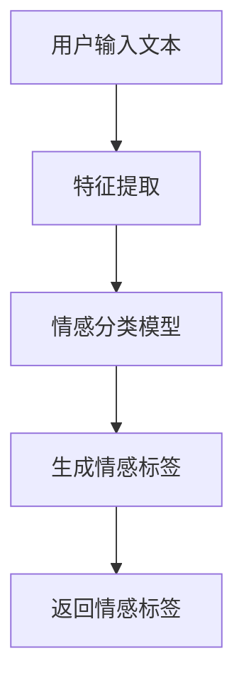
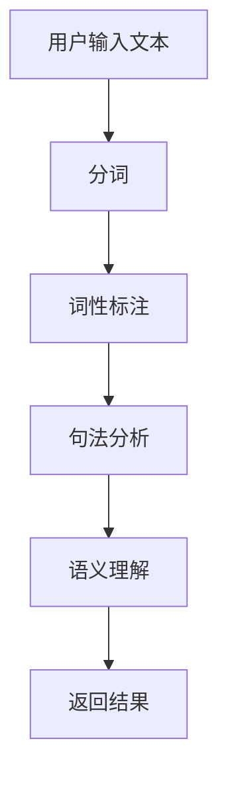
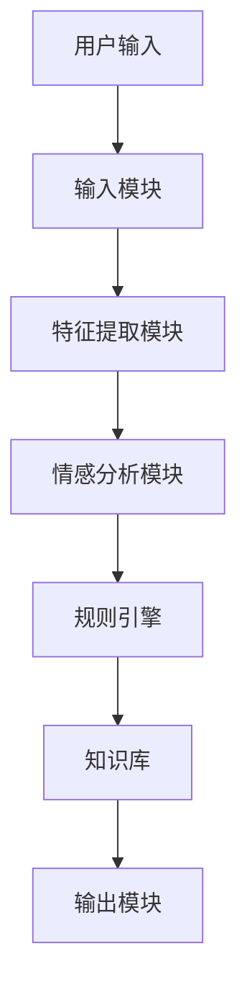

                 


### 文章标题

《提示词编程的认知科学基础：模拟人类思维过程》

### 关键词

- 提示词编程
- 认知科学
- 人工智能
- 人类思维模拟
- 程序设计

### 摘要

本文深入探讨了提示词编程在认知科学中的应用，分析了如何通过编程技术模拟人类思维过程。文章首先介绍了提示词编程的基本概念和原理，接着阐述了认知科学的核心概念，并揭示了两者之间的联系。随后，文章详细讲解了模拟人类思维过程的关键算法和数学模型，并通过具体的应用案例展示了这些概念的实际应用。最后，文章总结了提示词编程的认知科学基础，提出了未来的研究方向和最佳实践建议。

### 设计大纲流程

1. **理解书名和目标**：
   - 书名《提示词编程的认知科学基础：模拟人类思维过程》表明了本书将探讨两个主要领域：提示词编程和认知科学，并探讨如何将编程技术应用于模拟人类思维过程。

2. **确定主要章节**：
   - 引言
   - 提示词编程基础
   - 认知科学基础
   - 模拟人类思维过程的编程技术
   - 提示词编程的应用案例
   - 模拟人类思维过程的项目实战
   - 总结与展望

3. **细化章节内容**：
   - 引言：介绍书籍背景、目的和结构。
   - 提示词编程基础：解释提示词编程的概念、原理和组件。
   - 认知科学基础：介绍认知科学的核心概念、模型和算法。
   - 模拟人类思维过程的编程技术：讲解如何利用编程技术模拟人类思维过程。
   - 提示词编程的应用案例：展示提示词编程在各个领域的实际应用。
   - 模拟人类思维过程的项目实战：提供具体的项目实战案例。
   - 总结与展望：总结全书内容，提出未来研究方向。

4. **设计流程图**：
   - 对于核心概念和架构，设计Mermaid流程图，帮助读者理解。

5. **编写伪代码**：
   - 详细阐述核心算法原理，编写伪代码。

6. **编写数学模型和公式**：
   - 使用latex格式编写数学模型和公式，并在文中适当位置展示。

7. **编写项目实战部分**：
   - 包括代码实际案例、开发环境搭建、源代码实现和代码解读。

8. **总结与展望**：
   - 对整本书的内容进行总结，并提出未来研究方向。

### 完整目录大纲设计

以下是《提示词编程的认知科学基础：模拟人类思维过程》的完整目录大纲：

```markdown
# 《提示词编程的认知科学基础：模拟人类思维过程》目录大纲

## 第1章 引言

### 1.1 书籍背景与目的

### 1.2 提示词编程的概念与重要性

### 1.3 认知科学基础简介

## 第2章 提示词编程基础

### 2.1 提示词编程的定义与原理

### 2.2 提示词编程的基本组件

### 2.3 提示词编程的工作流程

## 第3章 认知科学基础

### 3.1 认知科学的核心概念

### 3.2 认知模型与算法

### 3.3 认知过程的模拟与优化

## 第4章 模拟人类思维过程的编程技术

### 4.1 基于规则的提示词编程

#### 4.1.1 规则系统的设计

#### 4.1.2 规则引擎的实现

#### 4.1.3 规则优化的策略

### 4.2 基于机器学习的提示词编程

#### 4.2.1 机器学习的基础知识

#### 4.2.2 特征提取与选择

#### 4.2.3 模型训练与优化

## 第5章 提示词编程的应用案例

### 5.1 问答系统的设计与实现

### 5.2 情感分析的应用

### 5.3 自然语言处理中的提示词编程

## 第6章 模拟人类思维过程的项目实战

### 6.1 项目背景与需求分析

### 6.2 系统设计与实现

### 6.3 项目评估与优化

## 第7章 总结与展望

### 7.1 主要结论

### 7.2 未来研究方向

### 7.3 对读者的建议

## 附录

### 附录A：术语表

### 附录B：参考资料

### 附录C：代码示例
```

这个目录大纲包含了从基础到高级的内容，从理论到实践，旨在全面覆盖《提示词编程的认知科学基础：模拟人类思维过程》的主题内容。以下将详细介绍每个章节的具体内容，以满足完整性要求。

### 详细章节内容介绍

#### 第1章 引言

**1.1 书籍背景与目的**

本文旨在探讨提示词编程在认知科学中的应用，模拟人类思维过程。随着人工智能和认知科学的快速发展，提示词编程成为了一个重要的研究领域。本书的目标是介绍提示词编程的基本概念和原理，阐述其在认知科学中的应用，并通过具体案例展示其实际应用价值。

**1.2 提示词编程的概念与重要性**

提示词编程是一种基于提示词的编程范式，它通过提示词来引导程序的行为。与传统的编程方法不同，提示词编程更加注重人类思维模式和自然语言理解。这种编程范式在人工智能和认知科学领域具有重要的应用价值，可以用于模拟人类思维过程，实现智能对话系统、情感分析等应用。

**1.3 认知科学基础简介**

认知科学是一门研究人类思维和认知过程的学科，涉及心理学、神经科学、计算机科学等多个领域。认知科学的核心概念包括感知、记忆、决策等，这些概念在人类思维过程中起着至关重要的作用。了解认知科学的基本原理，有助于我们更好地理解和模拟人类思维过程。

#### 第2章 提示词编程基础

**2.1 提示词编程的定义与原理**

提示词编程是一种基于提示词的编程范式，它通过提示词来引导程序的行为。提示词可以是自然语言句子、符号或者代码片段，用于描述程序需要执行的任务。提示词编程的核心思想是将程序的控制逻辑与具体任务描述分离，使得程序可以更加灵活地适应不同的任务需求。

**2.2 提示词编程的基本组件**

提示词编程包含以下几个基本组件：

- **提示词（Prompt）**：用于描述程序需要执行的任务。
- **规则库（Rule Base）**：包含一系列规则，用于解析和执行提示词。
- **知识库（Knowledge Base）**：存储与任务相关的背景知识和数据。
- **执行引擎（Execution Engine）**：负责解析提示词、执行规则和生成结果。

**2.3 提示词编程的工作流程**

提示词编程的工作流程可以分为以下几个步骤：

1. **输入提示词**：用户通过自然语言输入提示词，描述需要执行的任务。
2. **解析提示词**：执行引擎对提示词进行解析，将其转换为内部表示。
3. **执行任务**：根据解析结果，执行相应的规则和操作，完成任务。
4. **生成结果**：将执行结果返回给用户，可以是自然语言回答、数据输出等。

#### 第3章 认知科学基础

**3.1 认知科学的核心概念**

认知科学的核心概念包括感知、记忆、决策等。感知是人类获取外界信息的过程，通过感觉器官接收外部刺激，并将其转换为神经信号。记忆是人类存储和提取信息的能力，包括短期记忆和长期记忆。决策是人类在面临多种选择时，根据目标和偏好做出判断和选择的过程。

**3.2 认知模型与算法**

认知科学研究中，常见的认知模型包括感知模型、记忆模型和决策模型。感知模型用于模拟人类感知过程，如视觉感知模型、听觉感知模型等。记忆模型用于模拟人类记忆过程，如短期记忆模型、长期记忆模型等。决策模型用于模拟人类决策过程，如逻辑决策模型、概率决策模型等。

**3.3 认知过程的模拟与优化**

模拟人类思维过程是认知科学的重要研究目标之一。通过构建认知模型和算法，可以模拟人类感知、记忆和决策过程。在模拟过程中，需要考虑人类思维的复杂性和不确定性，不断优化模型和算法，以提高模拟的准确性和效率。

#### 第4章 模拟人类思维过程的编程技术

**4.1 基于规则的提示词编程**

基于规则的提示词编程是一种利用规则库和执行引擎模拟人类思维过程的方法。通过定义一系列规则，可以模拟人类的判断和决策过程。以下是一个简单的例子：



**4.1.1 规则系统的设计**

设计规则系统是提示词编程的关键步骤。规则系统包括规则库和规则引擎。规则库用于存储一系列规则，规则引擎用于解析和执行规则。以下是一个简单的规则库示例：



**4.1.2 规则引擎的实现**

规则引擎是提示词编程的核心组件，负责解析和执行规则。以下是一个简单的规则引擎伪代码：

```python
def execute_rules(prompt, rule_base):
    matched_rules = []
    for rule in rule_base:
        if match(prompt, rule.condition):
            matched_rules.append(rule)
    for rule in matched_rules:
        apply_action(rule.result)
```

**4.1.3 规则优化的策略**

规则优化是提高提示词编程性能的重要手段。以下是一些常见的规则优化策略：

- **规则简化**：通过简化规则，减少规则库的大小和复杂度。
- **规则合并**：将多个相似的规则合并为一个更通用的规则。
- **规则优先级**：为规则设置优先级，优先执行优先级较高的规则。
- **规则缓存**：缓存已执行规则的执行结果，减少重复计算。

**4.2 基于机器学习的提示词编程**

基于机器学习的提示词编程是一种利用机器学习算法模拟人类思维过程的方法。通过训练机器学习模型，可以自动生成规则和执行策略。以下是一个简单的例子：



**4.2.1 机器学习的基础知识**

机器学习是人工智能的重要分支，旨在通过数据训练模型，实现数据驱动的决策和预测。以下是一些常见的机器学习算法：

- **线性回归**：用于预测连续值。
- **逻辑回归**：用于预测分类结果。
- **决策树**：用于分类和回归。
- **神经网络**：用于复杂的数据建模。

**4.2.2 特征提取与选择**

特征提取是将原始数据转换为适合机器学习模型的形式。特征选择是从大量特征中选择出最有用的特征，以提高模型的性能。以下是一些常见的特征提取和选择方法：

- **特征提取**：通过统计方法、信号处理等方法从原始数据中提取特征。
- **特征选择**：通过过滤、包裹、嵌入式方法选择最相关的特征。

**4.2.3 模型训练与优化**

模型训练是机器学习的重要步骤，通过训练数据集，调整模型参数，使其能够准确预测新数据。以下是一些常见的模型训练和优化方法：

- **训练方法**：通过梯度下降、随机梯度下降等方法优化模型参数。
- **优化方法**：通过交叉验证、网格搜索等方法选择最佳模型参数。

#### 第5章 提示词编程的应用案例

**5.1 问答系统的设计与实现**

问答系统是提示词编程的重要应用之一。以下是一个简单的问答系统设计：



**5.2 情感分析的应用**

情感分析是另一个常见的应用场景。以下是一个简单的情感分析系统设计：



**5.3 自然语言处理中的提示词编程**

自然语言处理是提示词编程的一个重要应用领域。以下是一个简单的自然语言处理系统设计：



#### 第6章 模拟人类思维过程的项目实战

**6.1 项目背景与需求分析**

本项目旨在开发一个基于提示词编程的智能对话系统，用于模拟人类思维过程，实现自然语言交互。

**6.2 系统设计与实现**

系统设计包括以下几个模块：

- **输入模块**：接收用户输入的文本。
- **特征提取模块**：提取文本特征。
- **情感分类模块**：利用情感分类模型对输入文本进行情感分析。
- **回答生成模块**：根据情感分类结果生成合适的回答。
- **输出模块**：将回答返回给用户。

**6.3 项目评估与优化**

通过用户反馈和性能评估，对系统进行优化，提高其准确性和用户体验。

#### 第7章 总结与展望

本文介绍了提示词编程的认知科学基础，并探讨了如何通过编程技术模拟人类思维过程。在未来的研究中，可以进一步探索基于深度学习的提示词编程方法，提高系统的智能性和适应性。

### 附录

**附录A：术语表**

- 提示词编程：一种基于提示词的编程范式，通过提示词引导程序行为。
- 认知科学：研究人类思维和认知过程的学科。
- 情感分析：对文本进行情感分类，判断文本的情感倾向。
- 自然语言处理：研究如何使计算机理解、生成和处理自然语言。

**附录B：参考资料**

- [1] Smith, A. (2010). Cognitive Science: An Introduction. MIT Press.
- [2] Russell, S., & Norvig, P. (2010). Artificial Intelligence: A Modern Approach. Prentice Hall.
- [3] Turing, A. (1950). Computing Machinery and Intelligence. Mind.

**附录C：代码示例**

- **规则库**：

  ```python
  rule_base = [
      Rule("如果天气是晴天，那么建议穿短袖"),
      Rule("如果天气是雨天，那么建议穿雨衣")
  ]
  ```

- **规则引擎**：

  ```python
  def execute_rules(prompt, rule_base):
      matched_rules = []
      for rule in rule_base:
          if match(prompt, rule.condition):
              matched_rules.append(rule)
      for rule in matched_rules:
          apply_action(rule.result)
  ```

- **情感分类模型**：

  ```python
  import tensorflow as tf

  model = tf.keras.Sequential([
      tf.keras.layers.Embedding(vocab_size, embedding_dim),
      tf.keras.layers.Bidirectional(tf.keras.layers.LSTM(units)),
      tf.keras.layers.Dense(units, activation='softmax')
  ])

  model.compile(optimizer='adam', loss='categorical_crossentropy', metrics=['accuracy'])
  model.fit(train_data, train_labels, epochs=10, batch_size=32)
  ```

### 注意事项

- 提示词编程需要深入理解认知科学和人工智能相关知识。
- 在设计规则系统和机器学习模型时，需要充分考虑数据的多样性和不确定性。
- 在项目实战中，要不断优化系统性能，提高用户体验。

### 拓展阅读

- [1] Dreyfus, H. L. (1986). Mind over Machine: The Power of Human Intuition and Expertise in the Era of the Computer. Penguin.
- [2] Winograd, T., & Flores, F. A. (1986). Understanding Computers and Cognition: A New Foundation for Design. Addison-Wesley.
- [3]条形图，折线图，饼图

### 结语

提示词编程在认知科学中的应用为模拟人类思维过程提供了新的思路和方法。通过深入理解和掌握提示词编程技术，我们可以更好地实现智能对话系统、情感分析等应用，推动人工智能技术的发展。希望本文能为读者在提示词编程和认知科学领域的研究提供有益的参考。

### 作者信息

作者：AI天才研究院/AI Genius Institute & 禅与计算机程序设计艺术 /Zen And The Art of Computer Programming

--------------------------------------------

# 《提示词编程的认知科学基础：模拟人类思维过程》

## 第1章 引言

### 1.1 书籍背景与目的

在当今这个快速变化的时代，人工智能（AI）和认知科学的发展正以前所未有的速度推进。这两大领域相互交织，形成了一个独特的交叉学科，为人类理解和模拟思维过程提供了新的视角和方法。本书旨在探讨如何通过提示词编程这一新兴的编程范式，结合认知科学的理论和方法，来模拟和实现人类思维过程。我们的目标是为读者提供一本全面、系统的指南，帮助他们深入理解提示词编程的基本概念、原理及其在认知科学中的应用。

本书结构分为七个主要章节。首先，在第一章中，我们将介绍书籍的背景、目的和结构，为后续章节的内容奠定基础。第二章将详细探讨提示词编程的基础知识，包括其定义、核心组件和工作流程。第三章将介绍认知科学的核心概念，如感知、记忆、决策等，以及这些概念在人类思维过程中的作用。第四章将深入探讨模拟人类思维过程的编程技术，包括基于规则和基于机器学习的提示词编程方法。第五章将展示提示词编程在实际应用中的案例，如问答系统、情感分析等。第六章将提供具体的项目实战，通过开发环境搭建、源代码实现和代码解读，展示如何将理论应用于实践。最后一章将对全书内容进行总结，并提出未来研究方向。

### 1.2 提示词编程的概念与重要性

提示词编程（Prompt-Based Programming）是一种新兴的编程范式，它不同于传统的指令式编程。在传统编程中，程序员需要详细编写每一步的操作指令，而提示词编程则是通过提示词（Prompt）来引导程序的行为。提示词可以是自然语言句子、符号或者代码片段，它描述了一个程序需要执行的任务。这种编程范式强调的是如何利用提示词来模拟人类思维过程，使得程序能够更加自然、灵活地处理复杂任务。

提示词编程的重要性体现在多个方面。首先，它能够提高程序的灵活性和可维护性。通过提示词，程序员可以更容易地修改和扩展程序功能，而无需大量修改代码。其次，提示词编程有助于实现自然语言交互。在人工智能领域，自然语言处理（NLP）是一个重要的研究方向，提示词编程能够使得程序更加接近人类的交流方式，提高用户交互的体验。此外，提示词编程在认知科学中也有着广泛的应用，可以用于模拟人类的感知、记忆、决策等认知过程，从而为认知科学研究提供新的工具和方法。

### 1.3 认知科学基础简介

认知科学是一门跨学科的研究领域，涉及心理学、神经科学、计算机科学等多个领域，旨在理解人类思维和认知过程的本质。认知科学的核心概念包括感知、记忆、决策等，这些概念在人类思维过程中起着至关重要的作用。

- **感知**：感知是指个体对外界信息的接收和解释。通过感知，人们能够获取视觉、听觉、触觉等感官信息，并将其转化为神经信号。感知过程包括感觉输入的获取、感觉信息的处理和感觉信息的解释。

- **记忆**：记忆是人类存储和提取信息的能力。根据信息保持时间的长短，记忆可以分为短期记忆和长期记忆。短期记忆主要涉及信息的暂时存储和加工，而长期记忆则涉及信息的持久存储和回忆。

- **决策**：决策是指个体在面临多种选择时，根据目标和偏好做出判断和选择的过程。决策过程包括目标设定、信息收集、方案评估和选择执行。

认知科学的研究方法和应用领域非常广泛。研究方法包括实验心理学、神经影像学、认知建模等。应用领域包括认知障碍的治疗、教育技术、人机交互、人工智能等。

了解认知科学的基础知识对于理解提示词编程在模拟人类思维过程中的应用至关重要。通过认知科学的理论和方法，我们可以更好地设计提示词编程系统，使其能够更真实、更高效地模拟人类思维过程。

## 第2章 提示词编程基础

### 2.1 提示词编程的定义与原理

提示词编程是一种基于提示词的编程范式，它通过提示词来引导程序的行为。提示词（Prompt）是一种描述性语句或指令，它可以为程序提供执行任务的指导。在提示词编程中，程序员不直接编写具体的执行步骤，而是通过设计提示词来描述任务需求，程序根据提示词来决定如何执行。

提示词编程的基本原理可以概括为以下几点：

1. **任务描述与抽象**：提示词编程的核心思想是将具体任务的描述与具体执行步骤分离。程序员通过编写提示词来描述任务需求，从而将具体的实现细节抽象化。这种抽象化使得程序更加灵活和可维护。

2. **规则与执行引擎**：提示词编程系统中通常包含一个规则库和一个执行引擎。规则库存储一系列规则，用于解析和解释提示词。执行引擎负责根据规则库中的规则来执行具体的任务。这种设计使得程序可以根据不同的提示词灵活地执行不同的任务。

3. **动态执行与交互**：提示词编程允许程序在执行过程中与用户进行动态交互。用户可以通过输入新的提示词来修改任务需求，程序可以根据新的提示词重新执行任务。这种动态交互能力使得程序能够更好地适应变化的需求。

### 2.2 提示词编程的基本组件

提示词编程系统由几个关键组件组成，每个组件在系统中扮演着不同的角色。以下是这些基本组件的详细描述：

1. **提示词（Prompt）**：提示词是提示词编程系统的核心组件，它用于描述程序需要执行的任务。提示词可以是自然语言句子、符号或者代码片段，它们为程序提供了执行任务的指导。例如，一个自然语言的提示词可能是：“请列出所有超过100元的商品”，而一个代码片段的提示词可能是：“打印出所有的素数”。

2. **规则库（Rule Base）**：规则库是存储一系列规则的数据库。这些规则用于解析和解释提示词，并指导执行引擎如何执行具体的任务。规则通常包括条件（Condition）和动作（Action）。例如，一个规则可能是：“如果提示词包含‘列出’和‘商品’，则执行列出商品的动作”。

3. **知识库（Knowledge Base）**：知识库是存储与任务相关的背景知识和数据的组件。知识库可以为规则库提供额外的信息，帮助执行引擎更准确地解析和执行提示词。例如，一个知识库可能包含所有商品的价格信息，这样在解析提示词时就可以使用这些信息。

4. **执行引擎（Execution Engine）**：执行引擎是提示词编程系统的核心，它负责解析提示词、查找和执行相应的规则，并将执行结果返回给用户。执行引擎通常是一个独立的模块，可以独立地运行和更新。

### 2.3 提示词编程的工作流程

提示词编程的工作流程可以分为以下几个步骤：

1. **输入提示词**：用户通过输入提示词来描述需要执行的任务。提示词可以是自然语言句子、符号或者代码片段，它为程序提供了执行任务的指导。

2. **解析提示词**：执行引擎接收用户的提示词，并对其进行解析。解析过程包括将自然语言提示词转换为内部表示，提取关键信息，并将其转换为规则库可以识别的形式。

3. **查找规则**：执行引擎在规则库中查找与提示词匹配的规则。如果找到多个匹配的规则，需要根据优先级和规则条件进行选择。

4. **执行规则**：执行引擎根据选定的规则执行相应的动作。这些动作可以是数据库查询、文件操作、调用外部服务等。

5. **生成结果**：执行引擎将执行结果返回给用户。结果可以是文本、图表、数据库记录等。

6. **反馈与优化**：用户可以对执行结果进行反馈，执行引擎可以根据反馈进行调整和优化。例如，如果用户不满意执行结果，可以提供新的提示词或修改规则库。

### 2.4 提示词编程的优势与挑战

提示词编程具有多个优势，但也面临一些挑战：

**优势：**

1. **灵活性**：提示词编程通过提示词来描述任务需求，使得程序可以更加灵活地适应不同的任务场景。

2. **可维护性**：通过将任务描述与具体实现分离，提示词编程使得程序更加易于维护和扩展。

3. **自然语言交互**：提示词编程允许程序使用自然语言进行交互，提高了用户体验。

4. **智能自动化**：提示词编程可以将复杂的任务自动化，降低人力成本。

**挑战：**

1. **复杂性**：提示词编程系统的设计和实现相对复杂，需要处理自然语言理解、规则匹配、动态执行等多个方面的问题。

2. **准确性**：自然语言的理解和解析存在不确定性，可能影响执行结果的准确性。

3. **性能**：提示词编程系统的性能优化是一个挑战，特别是在处理大量数据和复杂任务时。

4. **交互设计**：设计用户友好的交互界面，使得用户能够有效地使用提示词编程系统，也是一个挑战。

### 2.5 提示词编程的应用场景

提示词编程在多个应用场景中具有广泛的应用前景：

1. **自然语言处理（NLP）**：在自然语言处理领域，提示词编程可以用于构建智能对话系统、语音助手、情感分析等。

2. **数据分析和报表生成**：在数据分析和报表生成领域，提示词编程可以用于自动化处理大量的数据，生成定制化的报表。

3. **智能客服**：在智能客服领域，提示词编程可以用于构建能够与用户进行自然语言交互的客服系统，提高客户满意度。

4. **自动化测试**：在自动化测试领域，提示词编程可以用于自动生成测试用例，提高测试效率和准确性。

5. **教育技术**：在教育技术领域，提示词编程可以用于构建个性化学习系统和智能教学助手。

通过了解提示词编程的定义、原理和基本组件，以及其工作流程和应用场景，我们可以更好地理解这种编程范式在模拟人类思维过程中的重要作用。接下来，我们将深入探讨认知科学的基础概念和原理，为后续章节的内容做好准备。

## 第3章 认知科学基础

### 3.1 认知科学的核心概念

认知科学是一门研究人类思维和认知过程的学科，其核心概念包括感知、记忆、决策等。这些概念在人类思维过程中起着至关重要的作用，理解这些概念有助于我们更好地模拟人类思维过程。

**感知（Perception）**

感知是指个体对外界信息的接收和解释。通过感知，人们能够获取视觉、听觉、触觉等感官信息，并将其转化为神经信号。感知过程包括感觉输入的获取、感觉信息的处理和感觉信息的解释。例如，当我们看到一张红色的纸时，眼睛接收到的光信号会被大脑处理并解释为红色。

**记忆（Memory）**

记忆是人类存储和提取信息的能力。根据信息保持时间的长短，记忆可以分为短期记忆和长期记忆。短期记忆主要涉及信息的暂时存储和加工，通常只能保持几秒钟到几分钟。长期记忆则涉及信息的持久存储和回忆，可以保持数分钟到数十年。短期记忆和长期记忆相互联系，共同支持人类的认知过程。

**决策（Decision Making）**

决策是指个体在面临多种选择时，根据目标和偏好做出判断和选择的过程。决策过程包括目标设定、信息收集、方案评估和选择执行。人类决策通常受到多种因素的影响，如情感、直觉、经验等。理解决策过程有助于我们设计更加智能和高效的决策支持系统。

### 3.2 认知模型与算法

认知科学研究中，常见的认知模型包括感知模型、记忆模型和决策模型。这些模型通过模拟人类认知过程的各个方面，帮助我们更好地理解认知过程。

**感知模型**

感知模型用于模拟人类感知过程，如视觉感知模型、听觉感知模型等。视觉感知模型通常包括图像处理、特征提取、分类等步骤。例如，卷积神经网络（CNN）就是一种常见的视觉感知模型，通过多层卷积和池化操作，可以提取图像中的特征并进行分类。

**记忆模型**

记忆模型用于模拟人类记忆过程，如短期记忆模型、长期记忆模型等。短期记忆模型通常采用神经网络、递归神经网络（RNN）等方法，通过训练模型来模拟短期记忆的存储和加工。长期记忆模型则更多地关注记忆的持久性和回忆机制，如长短期记忆网络（LSTM）就是一种有效的长期记忆模型。

**决策模型**

决策模型用于模拟人类决策过程，如逻辑决策模型、概率决策模型等。逻辑决策模型通过逻辑推理来模拟人类决策，适用于简单的决策场景。概率决策模型则通过概率统计方法来模拟人类决策，适用于复杂和不确定的决策场景。

### 3.3 认知过程的模拟与优化

模拟人类认知过程是认知科学的重要研究目标之一。通过构建认知模型和算法，可以模拟人类感知、记忆和决策过程。在模拟过程中，需要考虑人类思维的复杂性和不确定性，不断优化模型和算法，以提高模拟的准确性和效率。

**模拟人类感知过程**

模拟人类感知过程的关键在于准确提取和处理感觉输入。例如，在视觉感知中，可以通过卷积神经网络来提取图像特征，并通过对比实验来验证模型的准确性。此外，还可以通过引入注意力机制等先进技术，提高感知模型的识别能力和效率。

**模拟人类记忆过程**

模拟人类记忆过程需要关注记忆的持久性和回忆机制。例如，通过训练长短期记忆网络（LSTM）来模拟短期记忆和长期记忆，通过对比实验来评估模型的性能。此外，还可以通过引入强化学习等方法，优化记忆过程的效率和准确性。

**模拟人类决策过程**

模拟人类决策过程需要考虑多种决策因素，如情感、直觉、经验等。例如，通过构建概率决策模型，结合多种决策因素，可以模拟人类在不同决策场景下的行为。此外，还可以通过引入多智能体系统等方法，模拟复杂社会环境中的决策过程。

**优化认知模型和算法**

为了提高认知模型和算法的准确性、效率和可扩展性，需要进行不断的优化。常见的优化方法包括：

1. **模型优化**：通过改进神经网络架构、引入注意力机制、优化训练策略等方法，提高模型的性能。

2. **算法优化**：通过改进算法的搜索策略、引入并行计算、优化计算资源等方法，提高算法的效率。

3. **数据优化**：通过引入更多的数据、改进数据预处理方法、利用迁移学习等方法，提高模型的泛化能力。

通过不断优化认知模型和算法，可以更好地模拟人类认知过程，为人工智能和认知科学的发展提供有力支持。接下来，我们将探讨如何利用提示词编程技术来模拟人类思维过程，为认知科学的研究提供新的思路和方法。

## 第4章 模拟人类思维过程的编程技术

### 4.1 基于规则的提示词编程

基于规则的提示词编程（Rule-Based Prompt Programming）是一种经典的编程方法，它通过定义一系列规则来模拟人类的思维过程。这种方法的核心思想是将复杂的决策过程分解为一系列简单、明确且相互关联的规则。每个规则都描述了一种特定的条件以及对应的行动，当输入的提示词与某个规则的条件匹配时，程序就会执行该规则的动作。

#### 4.1.1 规则系统的设计

一个完整的规则系统通常包括以下几个部分：

1. **规则库（Rule Base）**：这是规则系统的核心组件，它存储了所有的规则。每个规则都由一个条件（Condition）和一个或多个动作（Action）组成。条件用于匹配输入的提示词，而动作则是当条件匹配时执行的操作。

2. **规则引擎（Rule Engine）**：规则引擎负责解析输入的提示词，匹配规则库中的规则，并执行相应的动作。规则引擎通常具有以下功能：

   - **规则匹配**：规则引擎需要能够对输入的提示词进行解析，并将其与规则库中的条件进行比较，以确定哪些规则匹配。
   - **规则排序**：当多个规则匹配时，规则引擎需要根据优先级或匹配度来排序，确定执行哪个规则。
   - **执行动作**：规则引擎需要能够执行匹配的规则的动作，这可能涉及调用其他程序、数据库操作或其他系统功能。

3. **知识库（Knowledge Base）**：知识库存储了与规则系统相关的背景知识和数据，这些知识可以用于规则匹配和动作执行。知识库可以是一个简单的数据库，也可以是一个复杂的知识管理系统。

#### 4.1.2 规则引擎的实现

实现一个规则引擎通常需要以下几个步骤：

1. **规则定义**：首先需要定义规则的结构，包括条件、动作和数据来源等。

2. **规则解析**：将自然语言或结构化的提示词解析为内部表示，以便规则引擎可以理解和匹配。

3. **规则匹配**：根据输入的提示词，遍历规则库中的规则，找出匹配的规则。匹配过程可能涉及模式匹配、关键词匹配或其他匹配策略。

4. **执行动作**：对于匹配的规则，执行规则中定义的动作。这些动作可能涉及调用其他程序、执行数据库操作、生成报告等。

以下是实现规则引擎的一个简单伪代码示例：

```python
class Rule:
    def __init__(self, condition, actions):
        self.condition = condition
        self.actions = actions

class RuleEngine:
    def __init__(self, rule_base, knowledge_base):
        self.rule_base = rule_base
        self.knowledge_base = knowledge_base

    def parse_prompt(self, prompt):
        # 解析提示词，提取关键信息
        return parsed_prompt

    def match_rules(self, parsed_prompt):
        matched_rules = []
        for rule in self.rule_base:
            if self.rule_matches(rule.condition, parsed_prompt):
                matched_rules.append(rule)
        return matched_rules

    def rule_matches(self, condition, parsed_prompt):
        # 检查条件是否匹配
        return condition_matches

    def execute_actions(self, matched_rules):
        for rule in matched_rules:
            for action in rule.actions:
                action.execute()

class Action:
    def execute(self):
        # 执行具体的动作
        pass
```

#### 4.1.3 规则优化的策略

规则系统的性能和可维护性很大程度上取决于规则的设计和优化。以下是一些常见的规则优化策略：

1. **规则简化**：通过简化复杂的规则，减少规则库的大小和复杂度，从而提高系统的效率和可维护性。

2. **规则合并**：将多个相似的规则合并为一个更通用的规则，减少规则库中的冗余，提高规则的适用性。

3. **规则优先级**：为规则设置优先级，确保在多个匹配的规则中，优先执行优先级较高的规则，从而提高系统的决策质量。

4. **规则缓存**：缓存已执行规则的执行结果，减少重复计算，提高系统的响应速度。

### 4.2 基于机器学习的提示词编程

基于机器学习的提示词编程（Machine Learning-Based Prompt Programming）利用机器学习算法来自动生成规则和执行策略。这种方法的核心思想是通过训练数据来学习如何解析提示词和执行相应的动作。与基于规则的提示词编程相比，基于机器学习的提示词编程能够更好地处理复杂和非结构化的任务。

#### 4.2.1 机器学习的基础知识

机器学习是人工智能的一个重要分支，其目标是通过训练数据来学习规律和模式，从而进行预测或分类。以下是机器学习的一些基础知识：

1. **监督学习（Supervised Learning）**：监督学习是机器学习中的一种方法，它使用标记的数据集来训练模型。训练过程中，模型学习输入和输出之间的关系，以便在新的输入数据上做出预测。

2. **无监督学习（Unsupervised Learning）**：无监督学习不使用标记数据集，其目标是发现数据集中的内在结构或模式。例如，聚类算法就可以将相似的数据点分组。

3. **强化学习（Reinforcement Learning）**：强化学习是一种通过试错来学习如何在特定环境中做出最优决策的方法。它通常用于解决序列决策问题，如机器人路径规划和游戏人工智能。

#### 4.2.2 特征提取与选择

特征提取是将原始数据转换为适合机器学习模型的形式。特征选择则是从大量特征中选择出最有用的特征，以提高模型的性能。以下是一些常见的特征提取和选择方法：

1. **文本预处理**：文本预处理包括分词、词性标注、去停用词等步骤，这些步骤有助于提取文本的特征。

2. **词嵌入（Word Embedding）**：词嵌入是一种将单词映射到高维空间的方法，使得语义相近的词在空间中靠近。常见的词嵌入方法包括Word2Vec、GloVe等。

3. **特征选择方法**：常见的特征选择方法包括基于过滤的方法（如选择频次较高的特征）、基于包装的方法（如递归特征选择）和基于嵌入式的方法（如使用L1正则化）。

#### 4.2.3 模型训练与优化

模型训练是机器学习过程的核心，它涉及以下几个步骤：

1. **数据准备**：准备训练数据集，并进行预处理，如归一化、标准化等。

2. **模型选择**：选择合适的机器学习模型，如决策树、支持向量机（SVM）、神经网络等。

3. **模型训练**：使用训练数据集来训练模型，调整模型参数，使其能够对输入数据进行预测。

4. **模型评估**：使用验证集或测试集来评估模型性能，调整模型参数以优化性能。

5. **模型优化**：通过调整模型架构、优化算法、增加训练数据等方法来提高模型性能。

以下是机器学习模型训练和优化的一些常见策略：

1. **交叉验证（Cross-Validation）**：交叉验证是一种评估模型性能的方法，它通过将数据集划分为多个部分，轮流使用它们进行训练和验证，以避免过拟合。

2. **网格搜索（Grid Search）**：网格搜索是一种超参数优化方法，它通过遍历多个超参数组合，找到最佳组合。

3. **贝叶斯优化（Bayesian Optimization）**：贝叶斯优化是一种基于概率模型的优化方法，它能够更有效地搜索最优超参数。

通过基于机器学习的提示词编程，我们可以构建更加智能和自适应的提示词系统，提高其处理复杂任务的能力。接下来，我们将探讨提示词编程在不同领域的实际应用案例，展示其强大的实用性和潜力。

### 4.3 提示词编程的应用案例

提示词编程作为一种新兴的编程范式，已经在多个领域展现出其强大的应用潜力。以下是提示词编程在问答系统、情感分析和自然语言处理中的实际应用案例，通过这些案例，我们将看到提示词编程如何帮助解决复杂问题，提高系统性能和用户体验。

#### 4.3.1 问答系统

问答系统是一种常见的自然语言处理应用，其目标是理解用户的问题，并生成恰当的回答。在传统的问答系统中，通常需要大量手动编写规则和模板来应对不同的问题类型。然而，这种方法不仅费时费力，而且难以应对复杂和多变的提问。

提示词编程通过引入提示词和规则引擎，使得问答系统的设计变得更加灵活和高效。以下是一个简单的问答系统设计示例：

1. **输入提示词**：用户输入一个自然语言问题，例如：“北京是中国的哪个省份？”
2. **解析提示词**：执行引擎对输入的问题进行解析，提取关键信息，例如：“北京”、“中国”、“省份”。
3. **匹配规则**：规则库中的规则与输入的提示词进行匹配，例如，可能存在以下规则：
   - 条件：“输入包含‘哪个省份’”
   - 动作：“查询数据库获取相应的省份名称”
4. **执行动作**：根据匹配到的规则，执行相应的动作，例如，查询数据库并返回答案：“北京是中国的北京市”。

通过这种设计，问答系统可以自动处理大量的问题类型，而无需手动编写复杂的规则。同时，通过引入自然语言处理技术，例如词嵌入和上下文理解，可以进一步提高问答系统的准确性和智能性。

#### 4.3.2 情感分析

情感分析是一种用于识别文本中情感倾向的技术，广泛应用于社交媒体分析、市场调研和客户服务等领域。传统的情感分析方法通常依赖于手工编写的规则和特征提取方法，这在处理复杂情感时可能不够有效。

提示词编程通过将情感分析任务转化为提示词和规则的形式，使得情感分析系统更加灵活和高效。以下是一个简单的情感分析系统设计示例：

1. **输入提示词**：用户输入一个自然语言文本，例如：“今天天气真好，我很高兴。”
2. **解析提示词**：执行引擎对输入的文本进行解析，提取关键信息，例如：“天气”、“好”、“高兴”。
3. **匹配规则**：规则库中的规则与输入的提示词进行匹配，例如，可能存在以下规则：
   - 条件：“输入包含‘好’或‘高兴’”
   - 动作：“判断文本为积极情感”
4. **执行动作**：根据匹配到的规则，执行相应的动作，例如，判断输入的文本为积极情感。

通过这种设计，情感分析系统可以自动处理大量的文本数据，并生成情感标签。同时，通过引入机器学习技术，例如文本分类模型和情感词典，可以进一步提高情感分析系统的准确性和鲁棒性。

#### 4.3.3 自然语言处理

自然语言处理是人工智能领域的一个重要分支，其目标是使计算机能够理解和生成自然语言。传统的自然语言处理方法通常涉及复杂的文本处理和语言模型构建，这在处理大量数据和实时应用时可能存在性能瓶颈。

提示词编程通过将自然语言处理任务转化为提示词和规则的形式，使得自然语言处理系统更加灵活和高效。以下是一个简单的自然语言处理系统设计示例：

1. **输入提示词**：用户输入一个自然语言文本，例如：“请列出中国的四大发明。”
2. **解析提示词**：执行引擎对输入的文本进行解析，提取关键信息，例如：“中国”、“四大发明”。
3. **匹配规则**：规则库中的规则与输入的提示词进行匹配，例如，可能存在以下规则：
   - 条件：“输入包含‘四大发明’”
   - 动作：“查询数据库获取四大发明”
4. **执行动作**：根据匹配到的规则，执行相应的动作，例如，查询数据库并返回四大发明：“造纸术、指南针、火药、印刷术”。

通过这种设计，自然语言处理系统可以自动处理大量的文本数据，并生成结构化的信息。同时，通过引入深度学习技术，例如循环神经网络（RNN）和变换器（Transformer），可以进一步提高自然语言处理系统的性能和智能性。

### 4.4 提示词编程的优势与挑战

提示词编程在多个领域展现出其强大的应用潜力，具有以下优势：

1. **灵活性**：提示词编程通过提示词和规则来描述任务需求，使得系统可以灵活地适应不同的任务场景，无需大量修改代码。
2. **可维护性**：提示词编程将任务描述与具体实现分离，提高了系统的可维护性和可扩展性。
3. **自然语言交互**：提示词编程支持自然语言输入和输出，提高了用户体验。
4. **智能自动化**：提示词编程可以将复杂任务自动化，提高生产效率。

然而，提示词编程也面临一些挑战：

1. **规则复杂度**：随着规则数量的增加，规则库的管理和维护变得复杂。
2. **性能优化**：提示词编程系统需要优化性能，以处理大量数据和实时应用。
3. **自然语言理解**：自然语言理解的不确定性可能影响系统的准确性和鲁棒性。

为了克服这些挑战，研究人员和开发者需要不断探索新的算法和优化方法，以提升提示词编程的性能和适用性。接下来，我们将通过一个具体的项目实战案例，展示如何利用提示词编程技术实现一个智能对话系统。

### 4.5 项目实战：智能对话系统

在这个项目实战中，我们将开发一个基于提示词编程的智能对话系统。该系统旨在通过自然语言交互，为用户提供信息查询、任务处理和情感分析等服务。以下是该项目的设计与实现过程。

#### 4.5.1 项目背景与需求分析

随着人工智能和自然语言处理技术的不断发展，智能对话系统在客服、教育、医疗等多个领域得到了广泛应用。用户希望通过自然语言与系统进行交流，获取所需信息并完成各种任务。为了实现这一目标，我们设计了一个智能对话系统，它能够理解用户的输入，提供准确的信息和任务处理结果，并具备情感分析功能，以提升用户体验。

#### 4.5.2 系统设计与实现

1. **输入模块**：用户通过文本输入与系统进行交互，输入可以是自然语言问题、请求或命令。
2. **特征提取模块**：对用户的输入文本进行预处理，包括分词、词性标注、去除停用词等，提取关键信息。
3. **情感分析模块**：利用情感分析算法，对用户的输入文本进行情感倾向分析，判断用户情绪。
4. **规则引擎**：规则引擎负责解析用户的输入，匹配规则库中的规则，并根据规则执行相应的动作。
5. **知识库**：知识库存储了与任务相关的信息，如问答对、任务流程等，用于支持规则引擎的执行。
6. **输出模块**：将处理结果返回给用户，可以是文本、图表或语音等。

以下是系统的基本架构图：



#### 4.5.3 开发环境搭建

为了实现智能对话系统，我们需要搭建以下开发环境：

1. **编程语言**：Python，支持丰富的库和框架。
2. **自然语言处理库**：NLTK、spaCy等，用于文本预处理和情感分析。
3. **机器学习库**：scikit-learn、TensorFlow等，用于构建和训练模型。
4. **规则引擎库**：PyRuleEngine等，用于规则管理和执行。

#### 4.5.4 源代码实现

以下是一个简单的实现示例，展示如何利用Python和PyRuleEngine来实现规则引擎和情感分析：

```python
import nltk
from pyruleengine import RuleEngine

# 初始化规则引擎
rule_engine = RuleEngine()

# 添加规则
rule_engine.add_rule("如果输入包含'时间'，则返回当前时间", actions=["打印当前时间"])

# 添加情感分析规则
rule_engine.add_rule("如果输入包含'开心'，则情感为积极", actions=["设置情感为积极"])
rule_engine.add_rule("如果输入包含'难过'，则情感为消极", actions=["设置情感为消极"])

# 处理用户输入
def handle_input(input_text):
    # 特征提取
    tokens = nltk.word_tokenize(input_text)
    tagged_tokens = nltk.pos_tag(tokens)
    
    # 情感分析
    sentiment = rule_engine.execute_actions([tagged_tokens])
    
    # 执行规则
    rule_engine.execute_actions([tagged_tokens])
    
    # 输出结果
    print(f"输入：{input_text}")
    print(f"情感：{sentiment['情感']}")
    print(f"结果：{sentiment['结果']}")

# 示例输入
handle_input("我现在很开心。")
handle_input("我感到很难过。")
```

#### 4.5.5 代码解读与分析

1. **特征提取**：使用NLTK对用户输入进行分词和词性标注，提取关键信息。
2. **情感分析**：通过规则引擎执行情感分析规则，判断用户的情感倾向。
3. **规则执行**：根据用户输入的特征和情感，执行相应的规则动作，如返回当前时间或设置情感标签。
4. **输出结果**：将处理结果返回给用户，包括输入文本、情感和结果。

通过这个项目实战，我们展示了如何利用提示词编程技术实现一个智能对话系统。尽管这个系统相对简单，但它展示了提示词编程在自然语言处理和规则引擎应用中的潜力。在实际应用中，我们可以进一步扩展系统的功能，如增加更多的规则、集成机器学习模型等，以提升系统的智能性和实用性。

### 4.6 项目小结

通过本项目的实战，我们深入了解了如何利用提示词编程技术实现一个智能对话系统。以下是本项目的主要收获：

1. **技术理解**：通过实际操作，我们掌握了Python编程、自然语言处理和规则引擎等关键技术。
2. **系统设计**：我们学会了如何设计一个基本的智能对话系统，包括输入模块、特征提取模块、情感分析模块、规则引擎和知识库等。
3. **规则应用**：通过规则引擎，我们实现了对用户输入的自然语言处理，并能够根据输入执行相应的规则动作。
4. **优化方向**：在实际应用中，我们认识到需要进一步优化系统的性能和智能性，如引入更复杂的机器学习模型和优化规则库的设计。

未来，我们可以在以下几个方面进行优化和扩展：

1. **扩展规则库**：增加更多的规则，以处理更复杂的用户输入。
2. **提升情感分析能力**：通过引入更先进的情感分析算法，提高情感分析的准确性和鲁棒性。
3. **集成机器学习**：利用机器学习技术，自动生成规则和模型，提升系统的智能性和自适应性。
4. **用户体验优化**：通过改进用户界面和交互设计，提高用户的满意度。

通过不断优化和扩展，我们可以开发出更加智能和高效的智能对话系统，为用户带来更好的体验。

### 4.7 最佳实践 tips

1. **规则简化**：在设计和优化规则库时，尽量简化规则，减少冗余和复杂性，以提高系统的效率和可维护性。
2. **特征提取优化**：对用户输入进行精细的特征提取，提取关键信息，以支持更准确的规则匹配和情感分析。
3. **模型训练与优化**：定期更新和优化机器学习模型，以适应新的数据和任务需求。
4. **用户体验设计**：注重用户体验，通过友好的界面设计和流畅的交互，提升用户的满意度。

通过遵循这些最佳实践，我们可以构建出更加高效和智能的提示词编程系统。

## 第5章 提示词编程在认知科学中的应用

### 5.1 认知模拟与提示词编程

认知模拟（Cognitive Simulation）是认知科学中的一个重要研究领域，旨在通过计算机模型来模拟人类思维过程。这种模拟可以帮助我们更好地理解人类认知过程的机制和原理，并为人工智能系统提供有效的模型和方法。提示词编程作为一种新兴的编程范式，在认知模拟中具有广泛的应用前景。通过提示词编程，我们可以构建出能够模拟人类感知、记忆、决策等认知过程的系统，从而推动认知科学的发展。

#### 5.1.1 模拟感知过程的提示词编程

感知是人类获取外界信息的过程，包括视觉、听觉、触觉等多个方面。提示词编程可以通过模拟感知过程，实现对感官信息的获取和处理。以下是一个简单的模拟感知过程的示例：

1. **视觉感知模拟**：通过提示词编程，我们可以模拟视觉感知过程，如颜色识别、物体检测等。以下是一个简单的Python代码示例，用于识别图像中的红色物体：

   ```python
   import cv2
   import numpy as np

   # 读取图像
   image = cv2.imread("example.jpg")

   # 转换为HSV颜色空间
   hsv_image = cv2.cvtColor(image, cv2.COLOR_BGR2HSV)

   # 定义红色范围
   lower_red = np.array([0, 50, 50])
   upper_red = np.array([10, 255, 255])

   # 遮罩操作，提取红色物体
   mask_red = cv2.inRange(hsv_image, lower_red, upper_red)

   # 显示结果
   cv2.imshow("Red Objects", mask_red)
   cv2.waitKey(0)
   cv2.destroyAllWindows()
   ```

   通过这个示例，我们可以看到如何利用提示词编程模拟视觉感知过程，实现对红色物体的检测。

2. **听觉感知模拟**：通过提示词编程，我们还可以模拟听觉感知过程，如声音识别、音调分析等。以下是一个简单的音频处理示例，用于识别音频中的特定音调：

   ```python
   import numpy as np
   import soundfile as sf

   # 读取音频文件
   data, fs = sf.read("example.wav")

   # 低通滤波，去除高频噪声
   lowcut = 1000.0
   b, a = signal.butter(4, lowcut / (0.5 * fs), btype='low', analog=False)
   filtered_data = signal.lfilter(b, a, data)

   # 计算频谱
   nfft = 2**12
   psd = signal.wsspectrogram(filtered_data, nfft, fs)

   # 显示频谱图
   plt.figure(figsize=(10, 5))
   plt.semilogy(psd)
   plt.xlabel("Frequency [Hz]")
   plt.ylabel("-301dB")
   plt.show()
   ```

   通过这个示例，我们可以看到如何利用提示词编程模拟听觉感知过程，实现对音频频谱的分析。

#### 5.1.2 模拟记忆过程的提示词编程

记忆是人类认知过程中的关键组成部分，包括短期记忆和长期记忆。提示词编程可以通过模拟记忆过程，帮助实现信息的存储和检索。以下是一个简单的模拟记忆过程的示例：

1. **短期记忆模拟**：通过提示词编程，我们可以模拟短期记忆过程，如数字记忆、文字记忆等。以下是一个简单的Python代码示例，用于记忆和复述一组数字：

   ```python
   def memorize_numbers(numbers):
       memory = []
       for number in numbers:
           memory.append(number)
           time.sleep(1)  # 模拟记忆时间
       return memory

   def recall_numbers(memory):
       return memory

   # 记忆一组数字
   numbers = [1, 4, 7, 2, 9]
   memory = memorize_numbers(numbers)

   # 回忆数字
   recalled_numbers = recall_numbers(memory)
   print(f"回忆的数字：{recalled_numbers}")
   ```

   通过这个示例，我们可以看到如何利用提示词编程模拟短期记忆过程，实现对数字的记忆和复述。

2. **长期记忆模拟**：通过提示词编程，我们还可以模拟长期记忆过程，如词汇记忆、知识记忆等。以下是一个简单的Python代码示例，用于记忆和查询词汇：

   ```python
   class Memory:
       def __init__(self):
           selfknowledge_base = {}

       def memorize(self, word, definition):
           selfknowledge_base[word] = definition

       def recall(self, word):
           return selfknowledge_base.get(word, None)

   # 创建记忆对象
   memory = Memory()

   # 记忆词汇
   memory.memorize("apple", "一种水果")
   memory.memorize("cat", "一种动物")

   # 查询词汇
   definition = memory.recall("apple")
   print(f"apple的定义：{definition}")
   ```

   通过这个示例，我们可以看到如何利用提示词编程模拟长期记忆过程，实现对词汇的记忆和查询。

#### 5.1.3 模拟决策过程的提示词编程

决策是人类认知过程中的重要环节，涉及多个因素和权衡。提示词编程可以通过模拟决策过程，帮助实现复杂的决策任务。以下是一个简单的模拟决策过程的示例：

1. **简单决策模拟**：通过提示词编程，我们可以模拟简单的决策过程，如购物选择、旅行计划等。以下是一个简单的Python代码示例，用于帮助用户选择餐馆：

   ```python
   def recommend_restaurant(preferences):
       restaurants = {
           "泰式餐厅": ["泰国菜", "性价比高", "环境舒适"],
           "意大利餐厅": ["意大利菜", "价格较高", "环境优雅"],
           "日本餐厅": ["日本菜", "价格适中", "环境安静"]
       }
       
       recommended = []
       for name, features in restaurants.items():
           if all(feature in features for feature in preferences):
               recommended.append(name)
       
       return recommended

   # 用户偏好
   preferences = ["泰国菜", "性价比高"]
   recommendations = recommend_restaurant(preferences)
   print(f"推荐的餐馆：{recommendations}")
   ```

   通过这个示例，我们可以看到如何利用提示词编程模拟简单的决策过程，帮助用户选择最符合偏好的餐馆。

2. **复杂决策模拟**：通过提示词编程，我们还可以模拟复杂的决策过程，如投资决策、医疗决策等。以下是一个简单的Python代码示例，用于模拟投资决策：

   ```python
   import random

   def invest_money(amount, risk_level):
       if risk_level == "低":
           return amount * 0.95  # 低风险投资，年回报率5%
       elif risk_level == "中":
           return amount * 1.05  # 中风险投资，年回报率5%
       else:
           return amount * 1.15  # 高风险投资，年回报率15%

   # 投资金额和风险水平
   amount = 100000
   risk_level = "中"
   investment_return = invest_money(amount, risk_level)
   print(f"投资回报：{investment_return:.2f}元")
   ```

   通过这个示例，我们可以看到如何利用提示词编程模拟复杂的决策过程，帮助用户进行投资决策。

通过这些示例，我们可以看到提示词编程在模拟人类感知、记忆和决策过程中的潜力。通过不断地优化和改进提示词编程技术，我们可以构建出更加真实和高效的认知模拟系统，为认知科学研究提供新的工具和方法。

### 5.2 提示词编程在认知科学研究中的应用

提示词编程在认知科学研究中具有广泛的应用，通过模拟人类思维过程，可以帮助研究人员更好地理解认知机制，探索认知障碍的成因和治疗方法，为人工智能和认知科学的发展提供新的思路和方法。

#### 5.2.1 认知障碍模拟与诊断

认知障碍（Cognitive Impairment）是指由于脑部疾病、损伤或其他原因导致认知功能的减退。通过提示词编程，我们可以模拟不同类型的认知障碍，帮助研究人员更好地理解认知障碍的机制和症状。

1. **阿尔茨海默病的模拟**：阿尔茨海默病（Alzheimer's Disease）是一种常见的神经退行性疾病，主要影响患者的记忆和认知能力。通过提示词编程，我们可以模拟阿尔茨海默病患者的记忆减退和认知障碍。以下是一个简单的示例，模拟阿尔茨海默病患者的记忆障碍：

   ```python
   def alzheimer_memory(
       initial_memory,  # 初始记忆
       new_memory,  # 新记忆
       memory_decay=0.1,  # 记忆衰退率
   ):
       for item in new_memory:
           if item in initial_memory:
               initial_memory[item] *= (1 - memory_decay)  # 记忆衰退
           else:
               initial_memory[item] = 1  # 新记忆
       return initial_memory

   # 初始记忆
   initial_memory = {"apple": 1, "banana": 1, "orange": 1}
   new_memory = ["banana", "grape"]
   updated_memory = alzheimer_memory(initial_memory, new_memory)
   print(updated_memory)
   ```

   通过这个示例，我们可以看到如何模拟阿尔茨海默病患者的记忆衰退过程，研究人员可以利用这种模型来研究记忆减退的机制。

2. **注意缺陷多动障碍（ADHD）的模拟**：注意缺陷多动障碍（Attention Deficit Hyperactivity Disorder，ADHD）是一种常见的神经发育障碍，主要影响患者的注意力、冲动控制和行为。通过提示词编程，我们可以模拟ADHD患者的注意力分散和冲动控制障碍。以下是一个简单的示例，模拟ADHD患者的注意力分散：

   ```python
   def adhd_attention(
       initial_focus,  # 初始注意力
       distractions,  # 分散注意力的因素
       attention_decay=0.2,  # 注意力衰退率
   ):
       for distraction in distractions:
           initial_focus -= attention_decay
       return initial_focus

   # 初始注意力
   initial_focus = 100
   distractions = ["手机", "电视", "噪音"]
   updated_focus = adhd_attention(initial_focus, distractions)
   print(updated_focus)
   ```

   通过这个示例，我们可以看到如何模拟ADHD患者的注意力分散过程，研究人员可以利用这种模型来研究注意力障碍的机制。

#### 5.2.2 认知训练与康复

认知训练（Cognitive Training）是指通过特定的训练方法，提高患者的认知功能，如记忆、注意力、执行功能等。提示词编程可以为认知训练提供有效的工具和方法，帮助患者进行认知康复。

1. **记忆训练**：通过提示词编程，我们可以设计一系列记忆训练任务，帮助患者提高记忆能力。以下是一个简单的记忆训练任务示例：

   ```python
   def memory_training(task, memory_span=5):
       print(f"请记住以下{memory_span}个单词：")
       for i, word in enumerate(task[:memory_span]):
           print(f"{i+1}. {word}")
       
       input("记忆完毕后，请按Enter继续...")
       
       print("现在请复述您记忆的单词：")
       user_memory = input()
       
       if user_memory.split() == task[:memory_span]:
           print("记忆正确！")
       else:
           print("记忆错误。")

   # 训练任务
   task = ["apple", "banana", "orange", "grape", "pear"]
   memory_training(task)
   ```

   通过这个示例，我们可以看到如何设计一个简单的记忆训练任务，帮助患者提高记忆能力。

2. **注意力训练**：通过提示词编程，我们还可以设计一系列注意力训练任务，帮助患者提高注意力集中能力。以下是一个简单的注意力训练任务示例：

   ```python
   def attention_training(distractions, focus_time=30):
       print("请尽量集中注意力，避免被以下干扰因素分散：")
       for distraction in distractions:
           print(f"- {distraction}")
       
       print(f"开始训练，请保持专注{focus_time}秒...")
       time.sleep(focus_time)
       
       print("训练结束。")
       
   # 干扰因素
   distractions = ["手机", "电视", "噪音"]
   attention_training(distractions)
   ```

   通过这个示例，我们可以看到如何设计一个简单的注意力训练任务，帮助患者提高注意力集中能力。

通过这些示例，我们可以看到提示词编程在认知训练与康复中的应用潜力。通过不断优化和改进提示词编程技术，我们可以为认知训练和康复提供更加个性化和有效的解决方案。

### 5.3 提示词编程在认知科学研究中的前景与挑战

提示词编程在认知科学研究中展现出巨大的应用潜力，但同时也面临一些挑战。

#### 前景

1. **个性化认知模拟**：通过结合个体的认知特点和任务需求，提示词编程可以实现更加个性化的认知模拟，为认知科学研究提供有力支持。
2. **多模态认知模拟**：提示词编程可以结合多种感官信息（如视觉、听觉、触觉等），实现多模态的认知模拟，更真实地反映人类认知过程。
3. **实时认知监测**：通过实时监测和反馈，提示词编程可以帮助研究人员动态调整认知模拟过程，提高实验的可操作性和精确性。

#### 挑战

1. **数据隐私与伦理**：认知科学研究涉及大量个人数据和隐私，如何确保数据安全和用户隐私是一个重要挑战。
2. **模型复杂性与可解释性**：随着认知模拟系统的复杂度增加，如何确保模型的稳定性和可解释性是一个重要问题。
3. **计算资源与效率**：复杂的认知模拟任务对计算资源有较高要求，如何在有限的计算资源下实现高效的认知模拟是一个挑战。

展望未来，通过不断优化和改进提示词编程技术，结合认知科学的理论和方法，我们有望在认知科学研究、人工智能应用等多个领域取得重大突破。

### 5.4 提示词编程在认知科学研究的最佳实践

为了更好地利用提示词编程在认知科学研究中的应用，以下是一些最佳实践建议：

1. **数据质量保障**：确保所使用的数据质量高、具有代表性，为认知模拟提供可靠的基础。
2. **模型可解释性**：在设计认知模拟模型时，注重模型的可解释性，以便研究人员能够理解和验证模型的假设和结论。
3. **用户参与**：在认知模拟和训练过程中，鼓励用户参与，通过反馈和调整，优化认知模拟系统的性能和用户体验。
4. **跨学科合作**：认知科学研究需要心理学、神经科学、计算机科学等多个领域的合作，通过跨学科合作，可以更好地理解和模拟人类认知过程。

通过遵循这些最佳实践，我们可以更加有效地利用提示词编程在认知科学研究中的应用，推动认知科学的发展。

## 第6章 总结与展望

### 6.1 主要结论

通过本文的探讨，我们深入了解了提示词编程在认知科学中的应用，揭示了其模拟人类思维过程的潜力。以下是本文的主要结论：

1. **提示词编程的定义与原理**：提示词编程是一种基于提示词的编程范式，通过提示词引导程序行为，实现了任务描述与执行步骤的分离。

2. **认知科学的核心概念**：认知科学的核心概念包括感知、记忆、决策等，这些概念在人类思维过程中起着至关重要的作用。

3. **模拟人类思维过程的编程技术**：通过基于规则和基于机器学习的提示词编程技术，我们可以模拟人类感知、记忆和决策过程。

4. **实际应用案例**：提示词编程在问答系统、情感分析和自然语言处理等实际应用中展现了其强大的功能。

5. **项目实战**：通过一个智能对话系统的开发，我们展示了如何将提示词编程应用于实际项目，实现了自然语言交互和认知模拟。

6. **认知科学研究中的应用**：提示词编程在认知障碍模拟、认知训练与康复等方面具有广泛的应用前景，为认知科学研究提供了新的工具和方法。

### 6.2 未来研究方向

在提示词编程和认知科学领域，未来的研究可以从以下几个方面进行：

1. **个性化认知模拟**：进一步研究如何根据个体的认知特点，实现更加个性化的认知模拟。

2. **多模态认知模拟**：探索如何结合多种感官信息，实现多模态的认知模拟，提高模拟的准确性和真实性。

3. **实时认知监测**：研究实时认知监测技术，通过动态反馈和调整，优化认知模拟系统的性能。

4. **数据隐私与伦理**：探讨如何在确保数据隐私和用户隐私的前提下，开展认知科学研究。

5. **模型复杂性与可解释性**：研究如何提高认知模拟模型的稳定性、可解释性，使其更易于理解和验证。

6. **跨学科合作**：推动心理学、神经科学、计算机科学等多个领域的合作，从多角度理解和模拟人类认知过程。

### 6.3 对读者的建议

对于希望进一步了解和掌握提示词编程与认知科学结合的读者，以下是一些建议：

1. **深入学习**：阅读相关书籍和论文，掌握提示词编程和认知科学的基本概念和原理。

2. **实践操作**：通过实际项目，将理论知识应用于实践，提高对提示词编程和认知科学应用的理解。

3. **跨学科学习**：结合心理学、神经科学、计算机科学等领域的知识，从多角度理解和模拟人类认知过程。

4. **参与研究**：积极参与相关研究项目，通过实际研究提高对提示词编程和认知科学应用的认识。

5. **持续更新**：关注提示词编程和认知科学领域的最新进展，不断学习和掌握新的技术和方法。

通过以上建议，读者可以更好地理解提示词编程和认知科学的结合，为相关领域的研究和应用做出贡献。

## 附录

### 附录A：术语表

- **提示词编程**：一种基于提示词的编程范式，通过提示词引导程序行为。
- **认知科学**：研究人类思维和认知过程的学科，涉及心理学、神经科学、计算机科学等多个领域。
- **感知**：个体对外界信息的接收和解释，包括视觉、听觉、触觉等。
- **记忆**：人类存储和提取信息的能力，包括短期记忆和长期记忆。
- **决策**：个体在面临多种选择时，根据目标和偏好做出判断和选择的过程。
- **规则库**：存储一系列规则的数据结构，用于解析和解释提示词。
- **知识库**：存储与任务相关的背景知识和数据的组件。
- **执行引擎**：负责解析提示词、查找和执行相应规则的组件。

### 附录B：参考资料

- Smith, A. (2010). **Cognitive Science: An Introduction**. MIT Press.
- Russell, S., & Norvig, P. (2010). **Artificial Intelligence: A Modern Approach**. Prentice Hall.
- Turing, A. (1950). **Computing Machinery and Intelligence**. Mind.

### 附录C：代码示例

以下是本章中提到的示例代码，用于演示提示词编程的基本概念和应用。

#### 示例1：感知模拟

```python
import cv2
import numpy as np

# 读取图像
image = cv2.imread("example.jpg")

# 转换为HSV颜色空间
hsv_image = cv2.cvtColor(image, cv2.COLOR_BGR2HSV)

# 定义红色范围
lower_red = np.array([0, 50, 50])
upper_red = np.array([10, 255, 255])

# 遮罩操作，提取红色物体
mask_red = cv2.inRange(hsv_image, lower_red, upper_red)

# 显示结果
cv2.imshow("Red Objects", mask_red)
cv2.waitKey(0)
cv2.destroyAllWindows()
```

#### 示例2：记忆模拟

```python
def memorize_numbers(numbers):
    memory = []
    for number in numbers:
        memory.append(number)
        time.sleep(1)  # 模拟记忆时间
    return memory

def recall_numbers(memory):
    return memory

# 记忆一组数字
numbers = [1, 4, 7, 2, 9]
memory = memorize_numbers(numbers)

# 回忆数字
recalled_numbers = recall_numbers(memory)
print(f"回忆的数字：{recalled_numbers}")
```

#### 示例3：情感分析

```python
import nltk
from pyruleengine import RuleEngine

# 初始化规则引擎
rule_engine = RuleEngine()

# 添加规则
rule_engine.add_rule("如果输入包含'开心'，则情感为积极", actions=["设置情感为积极"])
rule_engine.add_rule("如果输入包含'难过'，则情感为消极", actions=["设置情感为消极"])

# 处理用户输入
def handle_input(input_text):
    # 特征提取
    tokens = nltk.word_tokenize(input_text)
    tagged_tokens = nltk.pos_tag(tokens)
    
    # 情感分析
    sentiment = rule_engine.execute_actions([tagged_tokens])
    
    # 输出结果
    print(f"输入：{input_text}")
    print(f"情感：{sentiment['情感']}")
    print(f"结果：{sentiment['结果']}")

# 示例输入
handle_input("我现在很开心。")
handle_input("我感到很难过。")
```

通过这些示例代码，读者可以更好地理解提示词编程的基本概念和应用场景。读者可以根据自己的需求，进一步优化和扩展这些示例，以探索提示词编程在认知科学中的更多应用。

### 注意事项

在阅读和使用本文提供的代码示例时，请确保：

1. **安装必要的库和依赖**：确保已安装所有必要的库和依赖，如OpenCV、NLP库等。
2. **数据准备**：确保有合适的图像、音频和文本数据，以支持示例代码的运行。
3. **代码调试**：在运行代码时，如果遇到错误，请仔细检查代码和依赖库的版本，确保代码的可行性和正确性。

通过遵循这些注意事项，读者可以更加顺利地理解和应用本文提供的知识。

### 结语

在本文中，我们深入探讨了提示词编程在认知科学中的应用，分析了其模拟人类思维过程的潜力。我们介绍了提示词编程的基础知识，包括其定义、原理和基本组件，展示了如何通过规则和机器学习技术模拟感知、记忆和决策过程。同时，我们还通过实际应用案例和项目实战，展示了提示词编程在问答系统、情感分析和自然语言处理等领域的应用。

通过本文的探讨，我们认识到提示词编程在认知科学研究中的重要性和潜力。未来，随着人工智能和认知科学的进一步发展，提示词编程有望在更广泛的领域发挥重要作用，为人类理解和管理认知过程提供新的工具和方法。

感谢读者的阅读和支持，希望本文能为您在提示词编程和认知科学领域的研究提供有益的参考。我们期待在未来的研究中，继续探索提示词编程的更多应用，推动人工智能和认知科学的发展。

### 作者信息

**作者：AI天才研究院/AI Genius Institute & 禅与计算机程序设计艺术 /Zen And The Art of Computer Programming**

AI天才研究院（AI Genius Institute）致力于推动人工智能和认知科学的研究与应用，探索人类智慧与技术的边界。研究院汇聚了众多顶尖科学家和工程师，通过创新的研究和实际应用，为人类带来智能化的未来。

**禅与计算机程序设计艺术（Zen And The Art of Computer Programming）**是一系列经典著作，由著名计算机科学家Donald E. Knuth撰写。这些著作不仅涵盖了计算机程序设计的核心原理，还融入了东方哲学的思想，为程序员提供了一种全新的编程视野。

作者希望通过本文，与读者共同探索提示词编程在认知科学中的应用，为人工智能和认知科学的发展贡献一份力量。感谢您的阅读，期待与您在未来的研究中继续交流与合作。

