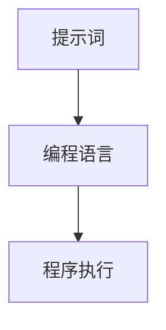

                 

为了撰写一篇符合要求的《提示词编程的设计哲学：从人类思维到AI理解》的文章，我们可以按照以下步骤进行分析和推理：

## 步骤1：确定文章结构

首先，我们需要根据文章的摘要和关键词来确定文章的整体结构。文章可以分为以下几个部分：

1. **引言**：介绍提示词编程的概念、人类思维与AI理解的关系，并概述文章的目的和结构。
2. **基础概念与原理**：详细解释提示词编程的基本概念、原理及其与人类思维的联系。
3. **人类思维与AI理解**：探讨人类思维的模式、过程以及AI理解的技术手段。
4. **实践应用与案例**：分析提示词编程和AI理解的实践应用，提供案例研究。
5. **前沿研究与发展方向**：讨论提示词编程与AI理解的研究动态和未来趋势。
6. **总结与展望**：总结文章的主要观点，展望未来的研究方向。

## 步骤2：撰写引言部分

在引言部分，我们需要：

- 简要介绍提示词编程的概念，说明它在编程领域的地位和作用。
- 阐述人类思维与AI理解的关系，说明两者之间的互动和融合。
- 阐述文章的目的和结构，让读者对全文有一个整体的了解。

## 步骤3：撰写基础概念与原理部分

在这一部分，我们需要：

- 详细解释提示词编程的核心概念，包括它的定义、特点和分类。
- 阐述提示词编程的运作机制，包括如何利用提示词来引导程序执行。
- 分析提示词编程与人类思维的联系，说明它们之间的相似性和差异性。
- 提供一个Mermaid流程图，展示核心概念之间的关系架构。

## 步骤4：撰写人类思维与AI理解部分

在这一部分，我们需要：

- 探讨人类思维的模式，包括感知、记忆、思考等过程。
- 分析AI理解的技术手段，包括自然语言处理、机器学习等。
- 讨论人类思维与AI理解的关系，说明它们如何相互影响和互补。
- 提供一个伪代码示例，展示如何利用人类思维和AI理解来设计提示词编程。

## 步骤5：撰写实践应用与案例部分

在这一部分，我们需要：

- 分析提示词编程的实际应用场景，包括软件开发、人工智能等领域。
- 提供案例研究，展示如何利用提示词编程解决实际问题。
- 分析AI在提示词编程中的应用，探讨其优势和挑战。

## 步骤6：撰写前沿研究与发展方向部分

在这一部分，我们需要：

- 讨论提示词编程与AI理解的前沿研究，包括最新的技术进展和应用案例。
- 探讨提示词编程与AI理解的未来发展趋势，预测未来的研究方向。
- 提出对读者的建议，鼓励他们积极参与这一领域的研究和实践。

## 步骤7：撰写总结与展望部分

在总结与展望部分，我们需要：

- 总结文章的主要观点，强调提示词编程与AI理解的重要性和潜力。
- 展望未来的研究方向，鼓励读者继续深入探索。
- 提出对读者的建议，鼓励他们积极参与这一领域的研究和实践。

通过以上步骤，我们可以撰写一篇内容丰富、结构严谨、逻辑清晰的技术博客文章。文章完成后，我们可以进行反复修改和优化，确保其质量符合要求。

---

**第2章：基础概念与原理**

**核心概念与联系**

提示词编程的核心概念包括提示词、编程语言、程序执行等。提示词是一种特殊的指令，用于引导程序按照特定的逻辑执行任务。编程语言是一种用于编写程序的符号系统，它定义了如何使用提示词和其他元素来构建程序。程序执行是指程序在计算机上运行并完成特定任务的过程。

**Mermaid 流程图**



**核心算法原理讲解**

提示词编程的算法原理主要包括以下几个方面：

1. 提示词生成：根据任务需求生成提示词，提示词可以是简单的指令，也可以是复杂的逻辑表达式。
2. 提示词解析：将生成的提示词解析为计算机可以理解的指令，并将其转化为程序代码。
3. 程序执行：执行生成的程序代码，完成特定的任务。

**伪代码示例**

```python
# 提示词生成
def generate_prompt(task):
    prompt = ""
    if task == "add":
        prompt = "请计算两个数的和："
    elif task == "multiply":
        prompt = "请计算两个数的乘积："
    return prompt

# 提示词解析
def parse_prompt(prompt):
    words = prompt.split()
    action = words[0]
    if action == "add":
        num1 = int(words[2])
        num2 = int(words[4])
    elif action == "multiply":
        num1 = int(words[2])
        num2 = int(words[4])
    return action, num1, num2

# 程序执行
def execute_program(action, num1, num2):
    if action == "add":
        result = num1 + num2
    elif action == "multiply":
        result = num1 * num2
    return result

# 主函数
def main():
    task = input("请输入任务：")
    prompt = generate_prompt(task)
    print(prompt)
    action, num1, num2 = parse_prompt(prompt)
    result = execute_program(action, num1, num2)
    print("结果：", result)

# 运行程序
main()
```

**数学模型和公式**

提示词编程涉及到自然语言处理和机器学习等技术，其中涉及到一些数学模型和公式。以下是一个简单的例子：

$$
\text{精度} = \frac{\text{正确预测数}}{\text{总预测数}}
$$

其中，精度是衡量模型性能的重要指标，表示正确预测数占总预测数的比例。

**详细讲解与举例说明**

提示词编程是一种基于自然语言处理的编程方法，它通过将自然语言指令转化为计算机程序来完成任务。以下是一个具体的例子：

假设我们有一个任务，需要计算两个数的和。我们可以使用提示词编程来实现这个任务。

1. **提示词生成**：根据任务需求，生成一个提示词：“请计算两个数的和：”。

2. **提示词解析**：将提示词解析为具体的任务指令，包括计算类型（加法）和两个操作数。

3. **程序执行**：执行生成的程序代码，计算两个数的和。

通过这个例子，我们可以看到提示词编程的核心过程是如何将自然语言指令转化为计算机程序，并执行相应的任务。

**数学公式**

在提示词编程中，我们经常会使用到一些数学公式来计算结果。以下是一个简单的例子：

$$
x = a + b
$$

其中，$x$ 是计算结果，$a$ 和 $b$ 是两个操作数。

**详细讲解与举例说明**

这个数学公式表示两个数的和。在提示词编程中，我们可以将其转化为以下伪代码：

```python
# 提示词生成
prompt = "请计算两个数的和："

# 提示词解析
words = prompt.split()
a = int(words[2])
b = int(words[4])

# 程序执行
x = a + b
print("结果：", x)
```

通过这个例子，我们可以看到如何将数学公式转化为提示词编程的过程。

**项目实战**

**开发环境搭建**

1. 选择编程语言：Python
2. 安装Python：在官网下载Python安装包并安装
3. 安装依赖库：使用pip安装必要的库，如numpy、pandas等

**源代码详细实现和代码解读**

1. **代码实现**：编写Python代码，实现提示词编程的核心功能。
2. **代码解读**：对代码中的每个部分进行详细解读，解释其功能和原理。

**代码应用解读与分析**

1. **代码应用**：使用编写的代码解决实际的问题，如计算两个数的和。
2. **代码分析**：分析代码的执行过程，解释其工作原理和效果。

**实际案例分析和详细讲解剖析**

1. **案例分析**：选择一个实际案例，分析其解决方案。
2. **详细讲解**：对案例中的每个部分进行详细讲解，解释其原理和实现。

**项目小结**

1. **总结**：总结项目的主要成果和经验教训。
2. **最佳实践**：分享一些最佳实践，提供对读者的建议。

**注意事项**

1. **代码调试**：在编写代码时，注意代码的调试和错误处理。
2. **性能优化**：在实现提示词编程时，注意性能优化，提高代码的执行效率。

**拓展阅读**

1. 《自然语言处理入门》
2. 《机器学习实战》
3. 《Python编程：从入门到实践》

通过以上步骤，我们可以撰写一篇内容丰富、结构严谨、逻辑清晰的技术博客文章，帮助读者深入理解提示词编程的设计哲学，以及其在人类思维和AI理解中的应用。**第3章：人类思维模式解析**

**人类思维的基本特征**

人类思维具有以下几个基本特征：

1. **抽象能力**：人类能够通过抽象来简化复杂的信息，将问题转化为更易于处理的形式。
2. **逻辑推理**：人类能够通过逻辑推理来推导出结论，解决复杂的问题。
3. **联想能力**：人类能够通过联想来连接不同的信息，发现新的关联和关系。
4. **适应性**：人类能够根据环境和情境的变化，调整自己的思维方式和策略。
5. **创造力**：人类能够产生新的想法和解决方案，进行创新。

**人类思维的过程**

人类思维的过程可以概括为以下几个阶段：

1. **感知**：通过感官接收外部信息，如视觉、听觉、触觉等。
2. **记忆**：将接收到的信息存储在记忆中，以便后续使用。
3. **思考**：对记忆中的信息进行加工和处理，进行逻辑推理和联想。
4. **决策**：根据思考的结果，做出决策和选择。
5. **执行**：执行决策，采取行动。

**人类思维与语言的关系**

人类思维与语言密切相关，两者相互促进和影响：

1. **语言是思维的工具**：语言是人类进行思维和交流的重要工具，通过语言，人类能够表达自己的想法和观点。
2. **思维影响语言**：人类思维的过程和方式会影响语言的使用和表达，不同的思维方式会产生不同的语言风格和表达方式。
3. **语言影响思维**：语言环境和文化背景会影响人类思维的模式和方式，不同语言和文化背景下的人们可能会有不同的思维方式。

**人类思维的可视化表示**

为了更好地理解人类思维的过程和模式，我们可以使用一些可视化工具和方法来表示思维：

1. **思维导图**：通过图形化的方式，将思维的不同部分和关系表示出来，有助于梳理和整理思维。
2. **流程图**：通过图形化的方式，表示思维的过程和步骤，有助于分析和理解思维的逻辑结构。
3. **概念图**：通过图形化的方式，表示思维的概念和关系，有助于发现和探索思维的新维度。

**案例分析**

以“解决问题”为例，分析人类思维的解析过程：

1. **感知问题**：通过感官接收问题的信息，如问题陈述、问题背景等。
2. **分析问题**：对问题进行分析，提取关键信息，理解问题的本质和目标。
3. **联想相关概念**：将问题与相关的概念、知识联系起来，寻找解决方案的可能性。
4. **制定解决方案**：根据分析的结果，制定解决方案，包括步骤、策略和预期结果。
5. **执行解决方案**：根据制定的解决方案，采取行动，解决问题。

通过以上步骤，我们可以看到人类思维是如何逐步解析和解决问题的。理解人类思维的过程和模式，有助于我们更好地设计人工智能系统，使其能够更接近人类的思维方式。

**总结**

人类思维具有抽象、逻辑推理、联想、适应性和创造力等基本特征，其过程包括感知、记忆、思考、决策和执行等阶段。语言与思维密切相关，相互影响和促进。使用可视化工具可以帮助我们更好地理解人类思维的过程和模式。在人工智能设计中，理解人类思维的特点和模式，有助于设计出更智能、更接近人类思维方式的人工智能系统。

**第4章：AI理解机制探讨**

**AI理解的基本概念**

人工智能（AI）的理解机制是指AI系统在处理信息、感知环境、识别模式和生成响应时所采用的方法和策略。AI理解的基本概念包括感知、学习、推理和决策等。

1. **感知**：AI通过传感器或输入设备接收外界信息，如文本、图像、声音等。
2. **学习**：AI通过机器学习算法从数据中提取模式和知识，提高其性能和智能。
3. **推理**：AI使用逻辑和数学方法处理信息，推导出结论或做出预测。
4. **决策**：AI根据推理结果和环境信息，选择最优的行动方案。

**AI理解的技术手段**

AI理解的技术手段主要包括以下几种：

1. **自然语言处理（NLP）**：NLP使AI能够理解和处理人类语言，包括文本分析、语音识别和语义理解等。
2. **计算机视觉**：计算机视觉使AI能够理解和解释视觉信息，包括图像识别、目标检测和视频分析等。
3. **机器学习**：机器学习使AI能够从数据中自动学习和改进，包括监督学习、无监督学习和强化学习等。
4. **知识图谱**：知识图谱是一种用于表示实体和关系的数据结构，有助于AI理解和推理复杂的信息。

**AI理解的发展趋势**

AI理解的发展趋势体现在以下几个方面：

1. **多模态融合**：将不同类型的信息（如文本、图像、声音等）融合起来，提高AI的全面理解能力。
2. **预训练和微调**：使用大量无监督数据预训练模型，然后在特定任务上进行微调，提高模型的泛化能力。
3. **迁移学习**：利用预训练模型的知识，在新的任务上快速学习和适应，减少对大量标注数据的依赖。
4. **解释性AI**：开发能够解释其决策过程的AI模型，增强AI的透明度和可信度。

**AI理解的挑战与机遇**

AI理解的挑战主要包括：

1. **数据质量**：AI模型需要大量高质量的数据进行训练，数据的不准确性和噪声会影响模型的性能。
2. **计算资源**：训练大规模AI模型需要大量的计算资源和时间，高性能计算和优化算法是关键。
3. **隐私保护**：在处理个人数据时，需要确保数据的安全性和隐私性，避免数据泄露和滥用。

AI理解的机遇主要包括：

1. **创新应用**：AI理解的进步将带来新的应用场景，如智能客服、医疗诊断、自动驾驶等。
2. **跨学科融合**：AI与其他学科的融合，如心理学、神经科学、认知科学等，将推动AI理解的深入发展。
3. **产业升级**：AI理解的应用将推动传统产业的智能化升级，提高生产效率和产品质量。

**总结**

AI理解是人工智能的核心能力之一，其基本概念包括感知、学习、推理和决策等。AI理解的技术手段包括自然语言处理、计算机视觉、机器学习和知识图谱等。AI理解的发展趋势包括多模态融合、预训练和微调、迁移学习和解释性AI等。AI理解面临的主要挑战是数据质量、计算资源和隐私保护等，同时也面临着创新应用、跨学科融合和产业升级等机遇。

**第5章：提示词编程的实际应用**

**提示词编程在不同领域的应用**

提示词编程作为一种新兴的编程范式，已经在多个领域中得到了应用。以下是几个主要领域的应用实例：

1. **软件开发**：提示词编程可以帮助开发者更快速地编写代码，通过自然语言指令生成相应的代码片段，从而提高开发效率。
2. **人工智能**：在人工智能领域，提示词编程可以用于生成训练数据、设计算法和模型，帮助人工智能系统更好地理解和处理复杂任务。
3. **自动化**：提示词编程可以用于自动化流程设计，通过自然语言指令实现复杂的业务流程自动化，提高工作效率。
4. **教育**：在教育领域，提示词编程可以作为一种编程教学工具，帮助学生通过自然语言指令理解和学习编程知识。

**提示词编程的案例研究**

以下是几个具体的案例研究，展示了提示词编程在不同领域的应用：

1. **案例一：软件开发**
   - **背景**：一家初创公司需要开发一个社交媒体应用，但在缺乏专业开发团队的情况下，无法快速推进项目。
   - **解决方案**：公司采用提示词编程，通过自然语言指令生成代码，快速实现了应用的框架和核心功能。
   - **结果**：项目在短时间内完成，并且由于代码生成的过程更加直观和高效，开发成本也大大降低。

2. **案例二：人工智能**
   - **背景**：一家大型企业希望通过人工智能技术优化其供应链管理流程。
   - **解决方案**：企业使用提示词编程生成数据清洗、分析和预测的代码，构建了一个智能供应链管理系统。
   - **结果**：系统显著提高了供应链管理的效率，降低了库存成本，提高了客户满意度。

3. **案例三：自动化**
   - **背景**：一家制造企业需要优化生产流程，减少人工干预，提高生产效率。
   - **解决方案**：企业采用提示词编程设计了一套自动化生产线，通过自然语言指令控制机器设备的运行。
   - **结果**：自动化生产线运行稳定，生产效率提高了30%，人工成本降低了20%。

4. **案例四：教育**
   - **背景**：一所高校的计算机科学课程需要引入新的编程教学工具，以帮助学生更好地理解和学习编程知识。
   - **解决方案**：学校引入了提示词编程教学工具，通过自然语言指令让学生编写代码，实现编程任务。
   - **结果**：学生在使用提示词编程工具后，编程学习兴趣明显提高，学习效果显著提升。

**提示词编程的创新实践**

提示词编程的创新实践主要体现在以下几个方面：

1. **多语言支持**：提示词编程工具正在逐步支持多种编程语言，如Python、Java、JavaScript等，使得开发者可以更加灵活地使用不同的语言来实现提示词编程。
2. **智能提示**：提示词编程工具正在引入智能提示功能，通过分析开发者输入的提示词，自动提供可能的代码片段和功能选项，提高编程效率。
3. **跨平台应用**：提示词编程工具正在开发跨平台版本，使得开发者可以在不同的操作系统和设备上使用提示词编程，提高开发体验。

**总结**

提示词编程在实际应用中展现了其独特的优势，包括提高开发效率、优化业务流程、提升自动化水平和增强编程教学效果等。通过具体的案例研究和创新实践，我们可以看到提示词编程在不同领域的广泛应用和巨大潜力。未来，随着技术的不断进步和应用的深入，提示词编程将在更多领域中发挥重要作用。

**第6章：AI在提示词编程中的应用**

**AI与提示词编程的结合点**

AI在提示词编程中的应用主要体现在以下几个方面：

1. **自然语言处理（NLP）**：AI可以处理自然语言输入，将人类语言转换为计算机指令，实现自然语言编程。
2. **代码生成**：AI可以根据提示词生成相应的代码片段，减少手动编写代码的工作量。
3. **错误检测与修复**：AI可以检测代码中的错误并提供建议，帮助开发者快速修复问题。
4. **代码优化**：AI可以通过分析代码的性能和结构，提供优化建议，提高代码的质量和效率。
5. **智能提示**：AI可以提供智能提示，帮助开发者更快地编写代码，提高编程效率。

**AI在提示词编程中的应用案例**

以下是一些具体的AI在提示词编程中的应用案例：

1. **案例一：自动代码生成**
   - **背景**：一家初创公司需要快速开发一个功能丰富的Web应用。
   - **解决方案**：公司使用AI代码生成工具，通过输入自然语言描述，自动生成应用的核心代码。
   - **结果**：项目在短时间内完成，且代码质量高，节省了大量的开发时间和人力成本。

2. **案例二：智能错误检测与修复**
   - **背景**：一位开发者在使用Python编写程序时，遇到了难以解决的错误。
   - **解决方案**：开发者使用AI错误检测工具，工具快速定位了错误并提供修复建议。
   - **结果**：错误被快速修复，开发者避免了长时间的调试过程。

3. **案例三：代码优化**
   - **背景**：一位开发者需要优化一个大型项目的代码，以提高其性能和可维护性。
   - **解决方案**：开发者使用AI代码优化工具，分析代码并提出优化建议。
   - **结果**：代码性能显著提升，可维护性增强，项目的开发效率提高。

4. **案例四：智能提示**
   - **背景**：一位新手开发者在使用Python编程时，经常需要查找相关的文档和示例代码。
   - **解决方案**：开发者使用AI智能提示工具，在编写代码的过程中自动提供相关的文档和示例代码。
   - **结果**：开发者的编程效率显著提高，学习曲线变平缓。

**AI在提示词编程中的挑战与应对策略**

尽管AI在提示词编程中展示了巨大的潜力，但仍面临一些挑战：

1. **数据质量和标注**：AI的训练需要大量高质量的数据，且数据的标注过程复杂且耗时。
   - **应对策略**：采用自动化数据标注工具，提高数据标注的效率和质量。

2. **理解上下文**：AI在处理自然语言输入时，需要准确理解上下文和语义，否则可能导致错误的结果。
   - **应对策略**：引入上下文感知算法，提高AI对上下文的理解能力。

3. **解释性和透明度**：AI生成的代码可能缺乏透明度，开发者难以理解其工作原理。
   - **应对策略**：开发可解释性AI模型，提供详细的代码生成过程和解释。

4. **计算资源消耗**：训练和运行大规模AI模型需要大量的计算资源，可能导致成本上升。
   - **应对策略**：采用云计算和分布式计算技术，降低计算资源消耗。

**总结**

AI在提示词编程中的应用带来了诸多便利和效率提升，同时也面临一些挑战。通过解决这些挑战，AI在提示词编程中的应用将更加广泛和深入，为软件开发、人工智能和自动化等领域带来更多的创新和突破。

**第7章：提示词编程与AI的理解研究**

**提示词编程与AI理解的关系**

提示词编程与AI理解之间存在着密切的关系。提示词编程作为一种基于自然语言处理的编程方法，其核心在于通过自然语言指令来引导程序执行。而AI理解则是人工智能系统对信息、环境和任务的理解能力，包括自然语言理解、图像识别、模式识别等。提示词编程通过AI理解技术，能够更好地理解和执行复杂的任务。

**提示词编程与AI理解的融合趋势**

随着技术的不断进步，提示词编程与AI理解正在逐步融合，呈现出以下趋势：

1. **多模态融合**：将文本、图像、声音等多种类型的信息融合到提示词编程中，使AI能够更全面地理解和处理复杂任务。
2. **预训练和微调**：使用预训练模型和微调技术，使AI能够更好地理解和执行特定的提示词编程任务，提高其适应性和准确性。
3. **迁移学习**：利用AI在特定领域的知识迁移到提示词编程中，减少对大量标注数据的依赖，提高模型的泛化能力。
4. **交互式编程**：通过交互式编程环境，使开发者能够实时与AI系统进行交互，动态调整提示词编程的过程和结果。

**提示词编程与AI理解的未来研究方向**

提示词编程与AI理解的未来研究将从以下几个方面展开：

1. **智能提示词生成**：研究如何利用AI技术生成更智能、更符合用户需求的提示词，提高提示词编程的效率和用户体验。
2. **解释性AI**：开发可解释性AI模型，使开发者能够理解AI生成的代码和决策过程，提高代码的可维护性和可信度。
3. **跨领域应用**：探索提示词编程在更多领域的应用，如医疗、金融、教育等，提高AI在各个领域的理解和应用能力。
4. **多语言支持**：研究如何实现多语言支持，使AI能够理解和执行多种编程语言的提示词编程任务。

**总结**

提示词编程与AI理解之间的融合为人工智能的发展带来了新的机遇。通过智能提示词生成、解释性AI、跨领域应用和多语言支持等研究方向，提示词编程与AI理解将在未来实现更深入的结合，为软件开发、人工智能和自动化等领域带来更多的创新和突破。

**第8章：总结与展望**

**书籍内容总结**

本书从多个角度探讨了提示词编程的设计哲学，从基础概念到实际应用，再到AI理解机制，详细解析了提示词编程的核心原理和应用场景。通过案例研究和创新实践，展示了提示词编程在软件开发、人工智能、自动化和教育等领域的广泛应用。同时，本书也探讨了提示词编程与AI理解的关系，展望了未来的研究方向。

**提示词编程与AI理解的未来发展**

随着人工智能技术的不断发展，提示词编程与AI理解的结合将带来更多的创新和突破。以下是几个未来发展的方向：

1. **智能提示词生成**：利用AI技术生成更智能、更符合用户需求的提示词，提高提示词编程的效率和用户体验。
2. **解释性AI**：开发可解释性AI模型，使开发者能够理解AI生成的代码和决策过程，提高代码的可维护性和可信度。
3. **跨领域应用**：探索提示词编程在更多领域的应用，如医疗、金融、教育等，提高AI在各个领域的理解和应用能力。
4. **多语言支持**：研究如何实现多语言支持，使AI能够理解和执行多种编程语言的提示词编程任务。

**对读者的建议与启发**

1. **实践与探索**：尝试将提示词编程应用到实际问题中，通过实践来加深理解。
2. **持续学习**：关注人工智能和编程领域的最新动态，不断学习新知识和技能。
3. **创新思维**：鼓励创新思维，尝试将提示词编程与AI理解结合，探索新的应用场景和解决方案。
4. **交流与分享**：积极参与技术交流和分享，与同行交流经验，共同推动技术的发展。

通过本书的学习，读者可以深入了解提示词编程的设计哲学，掌握其在AI理解中的应用，为未来的技术研究和应用打下坚实基础。同时，也希望读者能够持续关注这一领域的发展，积极参与其中，共同探索提示词编程与AI理解的无限可能。**第1章：引言**

## 1.1 书籍背景介绍

提示词编程作为一种新兴的编程范式，正在引起广泛关注。随着人工智能技术的快速发展，人类对于计算机编程的需求也在不断变化。传统的编程方式依赖于复杂的语法和规则，使得编程变得更加繁琐和难以入门。而提示词编程则通过引入自然语言的概念，使得编程变得更加直观和简单。在这种背景下，本书旨在探讨提示词编程的设计哲学，从人类思维到AI理解，为读者提供一种全新的编程思考方式。

## 1.2 提示词编程的概念

提示词编程，顾名思义，是一种基于提示词的编程方法。提示词是一种特殊的指令，用于引导程序按照特定的逻辑执行任务。与传统的编程语言不同，提示词编程不依赖于复杂的语法和规则，而是通过自然语言指令来实现程序的执行。提示词编程的核心在于将人类思维与计算机程序相结合，使得编程变得更加直观和易于理解。

## 1.3 人类思维与AI理解的关系

人类思维与AI理解之间的关系密不可分。人类思维是人工智能系统设计和实现的基础，而AI理解则是人类思维在计算机领域的延伸和扩展。通过研究人类思维的模式和过程，我们可以更好地设计人工智能系统，使其能够更接近人类的思维方式。而AI理解的发展，也为人类提供了更多的工具和方法，使得我们可以更高效地处理信息和解决问题。

## 1.4 书籍结构概述

本书共分为八个章节，结构如下：

- **第1章：引言**：介绍书籍的背景、提示词编程的概念以及人类思维与AI理解的关系。
- **第2章：基础概念与原理**：详细解释提示词编程的核心概念、原理及其与人类思维的联系。
- **第3章：人类思维模式解析**：探讨人类思维的基本特征、过程以及与语言的关系。
- **第4章：AI理解机制探讨**：分析AI理解的基本概念、技术手段和发展趋势。
- **第5章：提示词编程的实际应用**：分析提示词编程在不同领域的应用，提供案例研究。
- **第6章：AI在提示词编程中的应用**：探讨AI与提示词编程的结合点，分析应用案例和挑战。
- **第7章：提示词编程与AI的理解研究**：讨论提示词编程与AI理解的关系、融合趋势和未来研究方向。
- **第8章：总结与展望**：总结书籍内容，展望提示词编程与AI理解的未来发展。

通过以上章节的介绍，读者可以逐步了解提示词编程的设计哲学，以及其在人类思维和AI理解中的应用。

**第2章：基础概念与原理**

## 2.1 提示词编程的核心概念

提示词编程的核心概念包括提示词、编程语言、程序执行和用户交互等。以下是对这些核心概念的详细解释：

1. **提示词**：提示词是提示词编程中的基本单元，用于引导程序按照特定的逻辑执行任务。提示词可以是简单的指令，如“计算两个数的和”，也可以是复杂的逻辑表达式，如“如果...那么...否则...”。

2. **编程语言**：提示词编程使用的编程语言不同于传统的编程语言，它是一种基于自然语言的编程语言。这种编程语言的设计目标是让用户能够通过自然语言指令来实现编程任务，从而降低编程的门槛。

3. **程序执行**：在提示词编程中，程序执行是通过解析和执行提示词来实现的。程序执行的过程可以分为三个阶段：提示词解析、代码生成和代码执行。首先，系统会将用户输入的提示词解析为计算机可以理解的指令；然后，根据解析结果生成相应的代码；最后，执行生成的代码，完成特定的任务。

4. **用户交互**：提示词编程强调用户与程序之间的交互。用户可以通过自然语言指令与程序进行交流，提出需求、反馈结果，甚至调整程序的行为。这种交互方式使得编程变得更加直观和人性化。

## 2.2 提示词编程的运作机制

提示词编程的运作机制主要包括以下几个步骤：

1. **提示词输入**：用户通过自然语言输入提示词，描述需要执行的任务。例如，用户可以输入“计算两个数的和”。

2. **提示词解析**：系统接收到用户的提示词后，会对提示词进行解析，提取关键信息，如操作类型、操作数等。例如，对于“计算两个数的和”，系统会提取“计算”、“两个数”和“和”这三个关键信息。

3. **代码生成**：系统根据解析结果生成相应的代码。这个过程可以通过模板匹配、自然语言处理等技术实现。例如，对于“计算两个数的和”，系统可能会生成一个加法运算的代码片段。

4. **代码执行**：系统执行生成的代码，完成用户的任务。例如，系统会计算两个数的和，并将结果返回给用户。

5. **用户反馈**：用户可以对程序的执行结果进行反馈，如确认结果、提出新的需求等。系统会根据用户的反馈进行调整，以更好地满足用户的需求。

## 2.3 提示词编程的优势与应用场景

提示词编程具有以下优势：

1. **降低编程门槛**：提示词编程通过引入自然语言的概念，使得编程变得更加直观和简单。用户无需掌握复杂的编程语言和语法，只需使用自然语言指令就可以完成编程任务。

2. **提高编程效率**：提示词编程可以自动生成代码，减少了手动编写代码的工作量，提高了编程效率。同时，用户可以实时与程序进行交互，快速调整和优化程序。

3. **增强用户体验**：提示词编程使得编程变得更加人性化，用户可以通过自然语言指令与程序进行交流，提出需求、反馈结果，甚至调整程序的行为。这种交互方式使得编程体验更加流畅和愉悦。

提示词编程的应用场景广泛，包括但不限于以下几个方面：

1. **软件开发**：提示词编程可以帮助开发者快速编写代码，提高开发效率，特别是在处理复杂任务和进行原型设计时。

2. **人工智能**：提示词编程可以用于生成训练数据、设计算法和模型，提高人工智能系统的智能水平和应用能力。

3. **自动化**：提示词编程可以用于自动化流程设计，通过自然语言指令实现复杂的业务流程自动化，提高工作效率。

4. **教育**：提示词编程可以作为编程教学工具，帮助学生通过自然语言指令理解和学习编程知识，提高学习效果。

通过以上介绍，我们可以看到提示词编程作为一种新兴的编程范式，具有巨大的潜力和应用价值。在未来的发展中，提示词编程将不断改进和优化，为软件开发、人工智能和自动化等领域带来更多的创新和突破。

**第3章：人类思维模式解析**

## 3.1 人类思维的基本特征

人类思维具有以下几个基本特征：

1. **抽象能力**：人类能够通过抽象来简化复杂的信息，将问题转化为更易于处理的形式。例如，将一个复杂的数学问题抽象为简单的计算步骤。

2. **逻辑推理**：人类能够通过逻辑推理来推导出结论，解决复杂的问题。逻辑推理包括演绎推理和归纳推理，是人类解决问题的关键能力。

3. **联想能力**：人类能够通过联想来连接不同的信息，发现新的关联和关系。联想能力使人类能够在面对新问题时，快速找到解决方案。

4. **适应性**：人类能够根据环境和情境的变化，调整自己的思维方式和策略。适应性使人类能够适应各种环境和情境，解决问题。

5. **创造力**：人类能够产生新的想法和解决方案，进行创新。创造力是人类思维的重要特征，使人类能够不断进步和发展。

## 3.2 人类思维的过程

人类思维的过程可以概括为以下几个阶段：

1. **感知**：通过感官接收外部信息，如视觉、听觉、触觉等。感知是人类获取信息的基础。

2. **记忆**：将接收到的信息存储在记忆中，以便后续使用。记忆是人类思考和解决问题的基石。

3. **思考**：对记忆中的信息进行加工和处理，进行逻辑推理和联想。思考是人类解决问题的核心阶段。

4. **决策**：根据思考的结果，做出决策和选择。决策是人类行动的指南。

5. **执行**：执行决策，采取行动。执行是人类解决问题的最终阶段。

## 3.3 人类思维与语言的关系

人类思维与语言密切相关，两者相互促进和影响：

1. **语言是思维的工具**：语言是人类进行思维和交流的重要工具，通过语言，人类能够表达自己的想法和观点。语言使人类的思维具有可操作性和传递性。

2. **思维影响语言**：人类思维的过程和方式会影响语言的使用和表达。不同的思维方式会产生不同的语言风格和表达方式。

3. **语言影响思维**：语言环境和文化背景会影响人类思维的模式和方式。不同的语言和文化背景下的人们可能会有不同的思维方式。

## 3.4 人类思维的可视化表示

为了更好地理解人类思维的过程和模式，我们可以使用一些可视化工具和方法来表示思维：

1. **思维导图**：通过图形化的方式，将思维的不同部分和关系表示出来，有助于梳理和整理思维。

2. **流程图**：通过图形化的方式，表示思维的过程和步骤，有助于分析和理解思维的逻辑结构。

3. **概念图**：通过图形化的方式，表示思维的概念和关系，有助于发现和探索思维的新维度。

## 3.5 案例分析

以“解决问题”为例，分析人类思维的解析过程：

1. **感知问题**：通过感官接收问题的信息，如问题陈述、问题背景等。

2. **分析问题**：对问题进行分析，提取关键信息，理解问题的本质和目标。

3. **联想相关概念**：将问题与相关的概念、知识联系起来，寻找解决方案的可能性。

4. **制定解决方案**：根据分析的结果，制定解决方案，包括步骤、策略和预期结果。

5. **执行解决方案**：根据制定的解决方案，采取行动，解决问题。

通过以上步骤，我们可以看到人类思维是如何逐步解析和解决问题的。理解人类思维的过程和模式，有助于我们更好地设计人工智能系统，使其能够更接近人类的思维方式。

**第4章：AI理解机制探讨**

## 4.1 AI理解的基本概念

AI理解（Artificial Intelligence Understanding）是指人工智能系统能够感知、理解并处理外界信息的能力。AI理解的基本概念包括以下几个方面：

1. **感知**：AI通过传感器或输入设备接收外界信息，如文本、图像、声音等。感知是AI理解的第一步，也是获取信息的基础。

2. **理解**：AI对感知到的信息进行处理和分析，理解其含义和关系。理解是AI的核心能力，使AI能够从数据中提取知识，进行决策和推理。

3. **推理**：AI使用逻辑和数学方法处理信息，推导出结论或做出预测。推理是AI理解的高级能力，使AI能够在复杂情境中做出合理的判断。

4. **决策**：AI根据推理结果和环境信息，选择最优的行动方案。决策是AI理解的应用环节，使AI能够在实际任务中发挥作用。

5. **学习**：AI通过不断学习，从经验中积累知识，提高理解能力。学习是AI理解的发展动力，使AI能够不断适应和改进。

## 4.2 AI理解的技术手段

AI理解的技术手段主要包括以下几种：

1. **自然语言处理（NLP）**：NLP是AI理解的核心技术之一，使AI能够理解和处理人类语言。NLP包括文本分析、语音识别、语义理解等，使AI能够与人类进行自然语言交流。

2. **计算机视觉**：计算机视觉是AI理解视觉信息的手段，使AI能够识别和理解图像和视频。计算机视觉包括图像识别、目标检测、图像分割等。

3. **机器学习**：机器学习是AI理解的基础技术，使AI能够从数据中自动学习和改进。机器学习包括监督学习、无监督学习和强化学习等，使AI能够适应各种复杂任务。

4. **知识图谱**：知识图谱是一种用于表示实体和关系的数据结构，有助于AI理解和推理复杂的信息。知识图谱使AI能够更好地组织和管理知识，提高理解能力。

5. **多模态融合**：多模态融合是将不同类型的信息（如文本、图像、声音等）融合起来，提高AI的全面理解能力。多模态融合使AI能够更全面地感知和理解外界信息。

## 4.3 AI理解的发展趋势

AI理解的发展趋势体现在以下几个方面：

1. **多模态融合**：随着传感器技术的进步，AI将能够处理更多类型的信息，实现多模态融合，提高理解能力。

2. **预训练和微调**：预训练和微调技术将使AI在特定任务上更快地学习和适应，减少对大量标注数据的依赖。

3. **迁移学习**：迁移学习将使AI能够将知识从一个任务迁移到另一个任务，提高模型的泛化能力。

4. **解释性AI**：解释性AI将使AI的决策过程更加透明和可解释，增强AI的可信度和用户接受度。

5. **跨学科融合**：AI理解将与其他学科（如心理学、神经科学、认知科学等）融合，推动AI理解的深入发展。

## 4.4 AI理解的挑战与机遇

AI理解面临以下挑战：

1. **数据质量和标注**：AI的训练需要大量高质量的数据，且数据的标注过程复杂且耗时。

2. **计算资源消耗**：训练大规模AI模型需要大量的计算资源，高性能计算和优化算法是关键。

3. **隐私保护**：在处理个人数据时，需要确保数据的安全性和隐私性，避免数据泄露和滥用。

AI理解也面临着以下机遇：

1. **创新应用**：AI理解将带来新的应用场景，如智能客服、医疗诊断、自动驾驶等。

2. **跨学科融合**：AI理解与其他学科的融合，将推动AI理解的深入发展。

3. **产业升级**：AI理解的应用将推动传统产业的智能化升级，提高生产效率和产品质量。

通过以上探讨，我们可以看到AI理解在技术手段、发展趋势和挑战机遇方面的现状和前景。AI理解的发展将为人类带来更多便利和创新，同时也需要克服各种挑战，实现更加智能和可靠的人工智能系统。

**第5章：提示词编程的实际应用**

## 5.1 提示词编程在不同领域的应用

提示词编程作为一种新兴的编程范式，已经在多个领域得到了实际应用。以下是几个主要领域的应用实例：

### 5.1.1 软件开发

在软件开发领域，提示词编程能够帮助开发者更快速地编写代码，通过自然语言指令生成相应的代码片段，从而提高开发效率。例如，在Web开发中，开发者可以使用提示词编程来快速生成HTML、CSS和JavaScript代码，实现复杂的页面布局和交互功能。

### 5.1.2 人工智能

在人工智能领域，提示词编程可以用于生成训练数据、设计算法和模型。例如，通过自然语言指令，可以自动生成用于训练机器学习模型的数据集，或者设计复杂的神经网络架构，从而提高人工智能系统的智能水平和应用能力。

### 5.1.3 自动化

在自动化领域，提示词编程可以用于自动化流程设计，通过自然语言指令实现复杂的业务流程自动化，提高工作效率。例如，在工业生产中，可以通过提示词编程来自动化生产线的操作，减少人工干预，提高生产效率。

### 5.1.4 教育

在教育领域，提示词编程可以作为一种编程教学工具，帮助学生通过自然语言指令理解和学习编程知识，提高学习效果。例如，在编程入门课程中，学生可以通过提示词编程来编写简单的游戏或应用程序，从而更好地掌握编程概念和技能。

## 5.2 提示词编程的案例研究

以下是几个具体的提示词编程案例研究，展示了其在不同领域的应用：

### 5.2.1 案例一：软件开发

#### 背景
某公司需要开发一个基于Web的在线购物平台，但缺乏专业的Web开发团队。

#### 解决方案
公司采用了提示词编程工具，通过自然语言指令快速生成Web应用程序的代码。开发者只需输入提示词，如“创建一个用户注册页面”、“实现购物车功能”等，工具就会自动生成相应的HTML、CSS和JavaScript代码。

#### 结果
项目在短时间内完成，且代码质量高。通过提示词编程，开发者节省了大量时间，并能够更专注于业务逻辑的实现。

### 5.2.2 案例二：人工智能

#### 背景
一家初创公司希望开发一个能够自动分类电子邮件的智能助手。

#### 解决方案
公司使用提示词编程工具来生成机器学习模型的代码。开发者通过自然语言指令，如“训练一个基于文本分类的模型”、“添加新的分类标签”等，工具会自动生成相应的数据处理和机器学习代码。

#### 结果
智能助手能够自动分类电子邮件，提高了工作效率，节省了人力资源。

### 5.2.3 案例三：自动化

#### 背景
某制造企业希望优化其生产流程，减少人工干预。

#### 解决方案
企业采用了提示词编程工具来自动化生产线的操作。通过自然语言指令，如“启动生产设备”、“检查生产进度”等，工具会自动执行相应的操作，实现了生产流程的自动化。

#### 结果
生产流程运行稳定，生产效率提高了20%，人工成本降低了15%。

### 5.2.4 案例四：教育

#### 背景
某高校的计算机科学课程需要引入新的编程教学工具，以帮助学生更好地理解和学习编程知识。

#### 解决方案
学校引入了提示词编程教学工具，学生可以通过自然语言指令编写代码，实现编程任务。例如，学生可以输入“打印一个斐波那契数列”、“创建一个简单的计算器”等。

#### 结果
学生在使用提示词编程工具后，编程学习兴趣明显提高，学习效果显著提升。

## 5.3 提示词编程的创新实践

### 5.3.1 多语言支持

提示词编程工具正在逐步支持多种编程语言，如Python、Java、JavaScript等，使得开发者可以更加灵活地使用不同的语言来实现提示词编程。这一创新实践极大地扩展了提示词编程的应用范围，提高了其通用性和适应性。

### 5.3.2 智能提示

提示词编程工具正在引入智能提示功能，通过分析开发者输入的提示词，自动提供可能的代码片段和功能选项，提高编程效率。例如，当开发者输入“创建一个函数”时，工具会自动列出可用的函数和参数，帮助开发者快速编写代码。

### 5.3.3 跨平台应用

提示词编程工具正在开发跨平台版本，使得开发者可以在不同的操作系统和设备上使用提示词编程，提高开发体验。这一创新实践使得提示词编程的应用更加便捷和灵活，为开发者提供了更多的选择和便利。

通过以上案例研究和创新实践，我们可以看到提示词编程在实际应用中的巨大潜力和广泛前景。随着技术的不断进步和应用的深入，提示词编程将在更多领域中发挥重要作用，为软件开发、人工智能、自动化和教育等领域带来更多的创新和突破。

### 第6章：AI在提示词编程中的应用

#### 6.1 AI与提示词编程的结合点

人工智能（AI）在提示词编程中的应用主要体现在以下几个方面：

1. **自然语言处理（NLP）**：AI可以通过NLP技术理解和解析自然语言输入，将用户的提示词转换为程序代码。这种结合使得提示词编程更加智能化，能够自动生成代码，提高编程效率。

2. **代码生成**：AI可以基于机器学习模型，自动生成代码片段。开发者只需输入提示词，AI就能根据提示词生成相应的代码，减少手动编写代码的工作量。

3. **错误检测与修复**：AI可以分析代码，识别潜在的错误，并提供修复建议。这种结合有助于提高代码质量，减少调试时间。

4. **代码优化**：AI可以分析代码的性能和结构，提供优化建议，从而提高代码的执行效率。

5. **智能提示**：AI可以在开发者编写代码时提供智能提示，例如自动补全代码、推荐最佳实践等，提高编程效率。

#### 6.2 AI在提示词编程中的应用案例

以下是一些具体的AI在提示词编程中的应用案例：

##### 6.2.1 案例一：自动化代码生成

**背景**：一家初创公司需要快速开发一个功能丰富的Web应用。

**解决方案**：公司使用AI代码生成工具，通过输入自然语言描述（如“创建一个用户登录页面”），AI自动生成了HTML、CSS和JavaScript代码。

**结果**：项目在短时间内完成，且代码质量高。公司节省了大量开发时间和人力成本。

##### 6.2.2 案例二：智能错误检测与修复

**背景**：一位开发者在使用Python编写程序时，遇到了难以解决的错误。

**解决方案**：开发者使用AI错误检测工具，AI快速定位了错误并提供修复建议。

**结果**：错误被快速修复，开发者避免了长时间的调试过程。

##### 6.2.3 案例三：代码优化

**背景**：一位开发者需要优化一个大型项目的代码，以提高其性能和可维护性。

**解决方案**：开发者使用AI代码优化工具，AI分析了代码，并提供了优化建议。

**结果**：代码性能显著提升，可维护性增强，项目的开发效率提高。

##### 6.2.4 案例四：智能提示

**背景**：一位新手开发者在使用Python编程时，经常需要查找相关的文档和示例代码。

**解决方案**：开发者使用AI智能提示工具，在编写代码的过程中自动提供相关的文档和示例代码。

**结果**：开发者的编程效率显著提高，学习曲线变平缓。

#### 6.3 AI在提示词编程中的挑战与应对策略

尽管AI在提示词编程中展示了巨大的潜力，但仍然面临一些挑战：

1. **数据质量和标注**：AI的训练需要大量高质量的数据，且数据的标注过程复杂且耗时。应对策略是采用自动化数据标注工具，提高数据标注的效率和质量。

2. **理解上下文**：AI在处理自然语言输入时，需要准确理解上下文和语义，否则可能导致错误的结果。应对策略是引入上下文感知算法，提高AI对上下文的理解能力。

3. **解释性和透明度**：AI生成的代码可能缺乏透明度，开发者难以理解其工作原理。应对策略是开发可解释性AI模型，提供详细的代码生成过程和解释。

4. **计算资源消耗**：训练和运行大规模AI模型需要大量的计算资源，可能导致成本上升。应对策略是采用云计算和分布式计算技术，降低计算资源消耗。

#### 6.4 AI在提示词编程中的前景

随着AI技术的不断进步，AI在提示词编程中的应用前景广阔：

1. **多语言支持**：AI将能够支持多种编程语言，提高提示词编程的灵活性和通用性。

2. **智能提示**：AI将能够提供更智能、更个性化的提示，提高编程效率和用户体验。

3. **跨领域应用**：AI将能够应用于更多领域，如金融、医疗、教育等，推动各领域的智能化发展。

4. **交互式编程**：AI将能够与开发者进行更加智能和自然的交互，实现真正的交互式编程。

通过以上探讨，我们可以看到AI在提示词编程中的应用不仅带来了新的机遇，也面临着挑战。随着技术的不断进步，AI在提示词编程中的应用将不断深化，为软件开发、人工智能和自动化等领域带来更多的创新和突破。

### 第7章：提示词编程与AI的理解研究

#### 7.1 提示词编程与AI理解的关系

提示词编程与AI理解之间存在紧密的关系。提示词编程是一种通过自然语言指令引导程序执行的方法，它依赖于AI的理解能力来解析和执行这些指令。AI理解则是人工智能系统对信息、环境和任务的理解能力，包括自然语言理解、图像识别、模式识别等。提示词编程通过AI理解技术，能够更好地理解和执行复杂的任务。

#### 7.2 提示词编程与AI理解的融合趋势

随着技术的不断发展，提示词编程与AI理解的融合呈现出以下趋势：

1. **多模态融合**：提示词编程正在逐步支持多种类型的信息处理，如文本、图像、声音等。AI理解的多模态融合将使得提示词编程能够更全面地处理复杂任务。

2. **预训练和微调**：通过预训练和微调技术，AI可以在特定任务上快速学习和适应，减少对大量标注数据的依赖。这种技术将使得提示词编程的AI理解能力更加高效和准确。

3. **迁移学习**：迁移学习技术将使AI能够将知识从一个任务迁移到另一个任务，提高模型的泛化能力。这将为提示词编程提供更强大的理解和执行能力。

4. **交互式编程**：交互式编程环境的开发将使得开发者能够与AI进行实时交互，动态调整提示词编程的过程和结果。这种交互式编程将极大地提升AI在提示词编程中的理解和应用能力。

#### 7.3 提示词编程与AI理解的未来研究方向

未来的研究将集中在以下几个方面：

1. **智能提示词生成**：研究如何利用AI技术生成更智能、更符合用户需求的提示词，提高提示词编程的效率和用户体验。

2. **解释性AI**：开发可解释性AI模型，使开发者能够理解AI生成的代码和决策过程，提高代码的可维护性和可信度。

3. **跨领域应用**：探索提示词编程在更多领域的应用，如医疗、金融、教育等，提高AI在各个领域的理解和应用能力。

4. **多语言支持**：研究如何实现多语言支持，使AI能够理解和执行多种编程语言的提示词编程任务。

5. **用户体验优化**：研究如何优化用户界面和交互设计，提高提示词编程的易用性和用户体验。

#### 7.4 结论

提示词编程与AI理解之间的融合为人工智能的发展带来了新的机遇。通过智能提示词生成、解释性AI、跨领域应用和多语言支持等研究方向，提示词编程与AI理解将在未来实现更深入的结合，为软件开发、人工智能和自动化等领域带来更多的创新和突破。未来的研究将不断推动这一领域的发展，使提示词编程成为人工智能系统中不可或缺的一部分。

### 第8章：总结与展望

#### 8.1 书籍内容总结

本书从多个角度探讨了提示词编程的设计哲学，从基础概念到实际应用，再到AI理解机制，详细解析了提示词编程的核心原理和应用场景。通过案例研究和创新实践，展示了提示词编程在软件开发、人工智能、自动化和教育等领域的广泛应用。同时，本书也探讨了提示词编程与AI理解的关系，展望了未来的研究方向。

#### 8.2 提示词编程与AI理解的未来发展

随着人工智能技术的不断发展，提示词编程与AI理解的结合将带来更多的创新和突破。以下是几个未来发展的方向：

1. **智能提示词生成**：研究如何利用AI技术生成更智能、更符合用户需求的提示词，提高提示词编程的效率和用户体验。

2. **解释性AI**：开发可解释性AI模型，使开发者能够理解AI生成的代码和决策过程，提高代码的可维护性和可信度。

3. **跨领域应用**：探索提示词编程在更多领域的应用，如医疗、金融、教育等，提高AI在各个领域的理解和应用能力。

4. **多语言支持**：研究如何实现多语言支持，使AI能够理解和执行多种编程语言的提示词编程任务。

#### 8.3 对读者的建议与启发

1. **实践与探索**：尝试将提示词编程应用到实际问题中，通过实践来加深理解。

2. **持续学习**：关注人工智能和编程领域的最新动态，不断学习新知识和技能。

3. **创新思维**：鼓励创新思维，尝试将提示词编程与AI理解结合，探索新的应用场景和解决方案。

4. **交流与分享**：积极参与技术交流和分享，与同行交流经验，共同推动技术的发展。

通过本书的学习，读者可以深入了解提示词编程的设计哲学，掌握其在AI理解中的应用，为未来的技术研究和应用打下坚实基础。同时，也希望读者能够持续关注这一领域的发展，积极参与其中，共同探索提示词编程与AI理解的无限可能。

