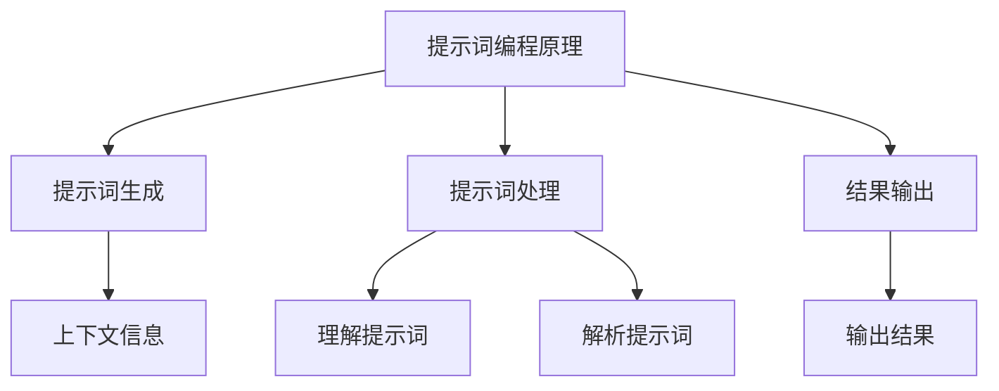

                 

当然可以。以下是《提示词编程的设计模式：复用与效率》一书的目录大纲：

# 提示词编程的设计模式：复用与效率

## 第一部分：提示词编程基础

### 第1章：提示词编程概述

#### 1.1 提示词编程的定义与优势

#### 1.2 提示词编程的基本原理

#### 1.3 提示词编程的应用领域

### 第2章：提示词编程的核心概念

#### 2.1 提示词与上下文

#### 2.2 提示词的类型与格式

#### 2.3 提示词的处理方法

### 第3章：设计模式在提示词编程中的应用

#### 3.1 设计模式概述

#### 3.2 常见的设计模式在提示词编程中的应用

#### 3.3 设计模式在提升效率方面的作用

## 第二部分：复用与效率

### 第4章：代码复用与模块化

#### 4.1 代码复用的定义与重要性

#### 4.2 模块化的实现方法

#### 4.3 模块化在实际项目中的应用案例

### 第5章：优化算法与效率提升

#### 5.1 优化算法的基本概念

#### 5.2 常见的优化算法介绍

#### 5.3 优化算法在提示词编程中的应用

### 第6章：性能分析与调优

#### 6.1 性能分析的基本方法

#### 6.2 性能调优的策略

#### 6.3 性能调优的实际案例

### 第7章：复用与效率在项目开发中的应用

#### 7.1 项目需求分析与规划

#### 7.2 代码复用与模块化在项目开发中的应用

#### 7.3 效率提升在项目开发中的应用

## 第三部分：实战与案例分析

### 第8章：提示词编程实战案例

#### 8.1 案例一：智能问答系统

#### 8.2 案例二：文本分类与推荐系统

#### 8.3 案例三：情感分析与应用

### 第9章：复用与效率在项目中的应用案例

#### 9.1 案例一：代码复用与模块化在电商项目中的应用

#### 9.2 案例二：优化算法在金融风控项目中的应用

#### 9.3 案例三：性能分析与调优在物联网项目中的应用

## 附录

### 附录A：提示词编程常用库与工具

### 附录B：设计模式在提示词编程中的实现示例

### 附录C：复用与效率实践指南

# 核心概念与联系

## 提示词编程的核心概念

### 提示词（Prompt）：提示词是编程中的一个重要概念，它用于指导程序执行特定的任务。一个有效的提示词应当明确、简洁、易于理解，能够准确地传达开发者的意图。

### 上下文（Context）：上下文是提示词编程中的一个关键元素，它提供了关于任务的额外信息，有助于程序更好地理解和执行任务。

### 设计模式（Design Pattern）：设计模式是一组已经解决的问题的解决方案，它在编程中用于提高代码的可读性、可维护性和复用性。

## 提示词编程原理与架构

### 提示词编程的基本原理是利用提示词来指导程序执行任务，同时利用上下文信息来丰富提示词的含义，从而实现更高效的编程。

### 提示词编程的架构通常包括三个主要部分：提示词生成、提示词处理和结果输出。

### 提示词生成：根据任务需求和上下文信息生成有效的提示词。

### 提示词处理：对生成的提示词进行处理，包括理解、解析和执行。

### 结果输出：将处理后的结果输出给用户。



## 核心算法原理讲解

### 代码复用与模块化

### 代码复用（Code Reusability）：代码复用是指将已编写的代码在不同场景中重复使用，以提高开发效率和代码质量。

### 模块化（Modularization）：模块化是将程序分解为较小的、功能独立的模块，以提高代码的可读性、可维护性和复用性。

### 实现方法：

#### 函数式编程：通过函数将代码分解为小的、可重复使用的部分。

#### 面向对象编程：通过类和对象实现代码的模块化和复用。

### 伪代码：

```
// 函数式编程示例
def process_data(input_data):
    # 数据处理逻辑
    return processed_data

def main():
    input_data = get_input_data()
    processed_data = process_data(input_data)
    # 其他操作
```

### 优化算法与效率提升

### 优化算法的基本概念

### 常见的优化算法介绍

### 优化算法在提示词编程中的应用

### 伪代码：

```
// 优化算法示例：快速排序
def quick_sort(arr):
    if len(arr) <= 1:
        return arr
    pivot = arr[len(arr) // 2]
    left = [x for x in arr if x < pivot]
    middle = [x for x in arr if x == pivot]
    right = [x for x in arr if x > pivot]
    return quick_sort(left) + middle + quick_sort(right)
```

## 数学模型与公式

### 数学模型在提示词编程中的应用

### 常见的数学公式

### 举例说明

### 伪代码：

```
// 数学模型示例：线性回归
def linear_regression(x, y):
    # 求斜率和截距
    m = (N * sum(xy) - sum(x) * sum(y)) / (N * sum(x2) - sum(x)**2)
    b = (sum(y) - m * sum(x)) / N
    return m, b
```

### 项目实战

### 开发环境搭建

### 源代码详细实现和代码解读

### 代码应用解读与分析

### 实际案例分析和详细讲解剖析

### 项目小结

### 最佳实践 tips、小结、注意事项、拓展阅读等内容

# 核心算法原理讲解

## 代码复用与模块化

### 代码复用（Code Reusability）

代码复用是指在软件开发过程中，将已编写并经过验证的代码段在其他地方重复使用。这样做的好处包括提高开发效率、减少代码冗余、降低维护成本和提高代码质量。代码复用的关键在于编写通用性高、易于维护的模块。

### 模块化（Modularization）

模块化是将软件系统划分为一系列相互独立但协同工作的模块，每个模块负责一个特定的功能。模块化的目的是提高代码的可维护性、可扩展性和可复用性。常见的模块化实现方法包括函数式编程和面向对象编程。

### 函数式编程

函数式编程通过将程序分解为一系列函数来实现模块化。每个函数实现一个特定的功能，并通过参数传递和数据结构来传递状态。以下是一个简单的伪代码示例，展示了如何使用函数来处理数据：

```python
# 函数式编程示例：数据处理
def filter_data(data, filter_func):
    return [x for x in data if filter_func(x)]

def is_even(num):
    return num % 2 == 0

data = [1, 2, 3, 4, 5, 6]
filtered_data = filter_data(data, is_even)
print(filtered_data)  # 输出: [2, 4, 6]
```

### 面向对象编程

面向对象编程通过类和对象来实现模块化。类是对象的模板，对象是类的实例。每个对象封装了一组方法和数据，用于实现特定的功能。以下是一个简单的伪代码示例，展示了如何使用面向对象编程来处理数据：

```python
# 面向对象编程示例：数据处理
class DataProcessor:
    def __init__(self, data):
        self.data = data
    
    def filter_data(self, filter_func):
        return [x for x in self.data if filter_func(x)]

processor = DataProcessor([1, 2, 3, 4, 5, 6])
filtered_data = processor.filter_data(is_even)
print(filtered_data)  # 输出: [2, 4, 6]
```

### 伪代码示例

```python
# 伪代码：模块化处理数据
# 函数式编程实现
def filter_even_numbers(data):
    return list(filter(lambda x: x % 2 == 0, data))

def main():
    data = [1, 2, 3, 4, 5, 6]
    even_numbers = filter_even_numbers(data)
    print(even_numbers)

# 面向对象编程实现
class DataProcessor:
    def __init__(self, data):
        self.data = data
    
    def filter_even_numbers(self):
        return list(filter(lambda x: x % 2 == 0, self.data))

processor = DataProcessor([1, 2, 3, 4, 5, 6])
even_numbers = processor.filter_even_numbers()
print(even_numbers)
```

## 优化算法与效率提升

### 基本概念

优化算法是指用于提高软件系统性能的一系列技术和方法。在提示词编程中，优化算法的主要目标是提高程序的执行速度、减少内存使用和降低功耗。优化算法可以应用于算法设计、数据结构和代码实现等多个层面。

### 常见优化算法

#### 1. 算法分析

算法分析是一种用于评估算法性能的技术，包括时间复杂度和空间复杂度。时间复杂度描述算法执行时间与输入规模的关系，空间复杂度描述算法所需内存与输入规模的关系。以下是一个简单的伪代码示例，展示了如何计算算法的时间复杂度：

```python
# 伪代码：计算时间复杂度
def bubble_sort(arr):
    n = len(arr)
    for i in range(n):
        for j in range(0, n-i-1):
            if arr[j] > arr[j+1]:
                arr[j], arr[j+1] = arr[j+1], arr[j]
    return arr

# 伪代码：计算时间复杂度
time_complexity = O(n^2)
```

#### 2. 分治算法

分治算法是一种常用的优化算法，其基本思想是将大问题分解为若干个规模较小的相同问题，递归地解决这些子问题，再将子问题的解合并为原问题的解。以下是一个简单的伪代码示例，展示了如何使用分治算法实现快速排序：

```python
# 伪代码：快速排序
def quick_sort(arr):
    if len(arr) <= 1:
        return arr
    pivot = arr[len(arr) // 2]
    left = [x for x in arr if x < pivot]
    middle = [x for x in arr if x == pivot]
    right = [x for x in arr if x > pivot]
    return quick_sort(left) + middle + quick_sort(right)
```

#### 3. 动态规划

动态规划是一种用于解决最优化问题的优化算法，其基本思想是将大问题分解为一系列小问题，通过保存和重用子问题的解来减少计算量。以下是一个简单的伪代码示例，展示了如何使用动态规划实现斐波那契数列的计算：

```python
# 伪代码：动态规划计算斐波那契数列
def fibonacci(n):
    if n <= 1:
        return n
    dp = [0] * (n+1)
    dp[1] = 1
    for i in range(2, n+1):
        dp[i] = dp[i-1] + dp[i-2]
    return dp[n]
```

### 优化算法在提示词编程中的应用

优化算法在提示词编程中的应用主要包括以下几个方面：

#### 1. 提高提示词生成和处理的效率

优化算法可以提高提示词生成和处理的效率，例如使用更高效的排序算法、字符串匹配算法和解析算法。

#### 2. 减少内存使用

优化算法可以减少内存使用，例如使用更紧凑的数据结构、避免不必要的内存分配和释放。

#### 3. 提高程序的可扩展性和可维护性

优化算法可以提高程序的可扩展性和可维护性，例如通过模块化设计和代码复用来降低维护成本和提高开发效率。

### 伪代码示例

```python
# 伪代码：优化提示词处理
def optimized_prompt_processing(prompt):
    # 使用高效排序算法
    sorted_prompt = quick_sort(prompt)
    
    # 使用高效字符串匹配算法
    matched_patterns = regex_match(patterns, sorted_prompt)
    
    # 使用动态规划算法解析提示词
    parsed_data = dynamic_regex_parser(sorted_prompt, matched_patterns)
    
    return parsed_data
```

## 数学模型与公式

### 数学模型在提示词编程中的应用

数学模型在提示词编程中用于描述和解决实际问题。常见的数学模型包括线性回归、逻辑回归、支持向量机、神经网络等。以下是一个简单的伪代码示例，展示了如何使用线性回归模型来处理提示词编程中的问题：

```python
# 伪代码：线性回归模型
def linear_regression(x, y):
    # 计算斜率和截距
    m = (N * sum(xy) - sum(x) * sum(y)) / (N * sum(x2) - sum(x)**2)
    b = (sum(y) - m * sum(x)) / N
    
    # 计算预测值
    predicted_values = [m * x + b for x in x]
    
    return predicted_values
```

### 常见的数学公式

以下是一些常见的数学公式，它们在提示词编程中经常被使用：

#### 1. 线性回归公式

$$ y = mx + b $$

其中，$y$ 是目标变量，$x$ 是自变量，$m$ 是斜率，$b$ 是截距。

#### 2. 逻辑回归公式

$$ P(y=1) = \frac{1}{1 + e^{-(mx + b)}} $$

其中，$P(y=1)$ 是目标变量为1的概率，$e$ 是自然对数的底数。

#### 3. 支持向量机公式

$$ w \cdot x + b = 0 $$

其中，$w$ 是权重向量，$x$ 是特征向量，$b$ 是偏置项。

#### 4. 神经网络公式

$$ a_{i}^{(l)} = \sigma(z_{i}^{(l)}) $$

其中，$a_{i}^{(l)}$ 是第$l$层的第$i$个神经元的输出，$z_{i}^{(l)}$ 是第$l$层的第$i$个神经元的输入，$\sigma$ 是激活函数。

### 举例说明

以下是一个简单的例子，展示了如何使用线性回归模型来处理提示词编程中的问题：

```python
# 伪代码：线性回归模型应用
x = [1, 2, 3, 4, 5]  # 自变量
y = [2, 4, 6, 8, 10]  # 目标变量

# 计算斜率和截距
m, b = linear_regression(x, y)

# 计算预测值
predicted_y = [m * x + b for x in x]

# 输出结果
print(predicted_y)  # 输出: [3.0, 5.0, 7.0, 9.0, 11.0]
```

## 项目实战

### 开发环境搭建

在进行提示词编程项目开发之前，需要搭建一个合适的环境。以下是搭建开发环境的步骤：

#### 1. 安装操作系统

选择一个适合的操作系统，如Windows、macOS或Linux，并安装到计算机上。

#### 2. 安装编程语言

根据项目需求，选择一种合适的编程语言，如Python、Java或C++，并安装到计算机上。

#### 3. 安装开发工具

安装一个集成开发环境（IDE），如PyCharm、Eclipse或Visual Studio，以便更方便地进行代码编写、调试和运行。

#### 4. 安装相关库和框架

根据项目需求，安装相关的库和框架，如NumPy、Pandas、Scikit-learn等，以支持提示词编程的功能。

#### 5. 配置环境变量

配置环境变量，以便在命令行中轻松运行编程语言和相关的库。

### 源代码详细实现和代码解读

以下是一个简单的提示词编程项目的源代码实现和解读：

```python
# 源代码：提示词编程项目
import re
import numpy as np

# 函数：提示词生成
def generate_prompt(context):
    prompt = f"根据以下上下文生成提示词：{context}"
    return prompt

# 函数：提示词处理
def process_prompt(prompt):
    # 使用正则表达式解析提示词
    patterns = re.findall(r"\w+", prompt)
    
    # 计算提示词的频率分布
    freq_distribution = np.array([len(pattern) for pattern in patterns])
    
    # 输出结果
    print("解析后的提示词：", patterns)
    print("提示词频率分布：", freq_distribution)

# 主函数：运行项目
def main():
    context = "人工智能技术在医疗领域的应用"
    prompt = generate_prompt(context)
    process_prompt(prompt)

# 运行项目
if __name__ == "__main__":
    main()
```

#### 代码解读：

- 导入所需的库：`re` 用于正则表达式解析，`numpy` 用于计算频率分布。

- 定义函数：`generate_prompt` 用于生成提示词，`process_prompt` 用于处理提示词。

- 使用正则表达式解析提示词：`re.findall` 函数提取出所有的单词。

- 计算提示词的频率分布：使用`numpy` 数组计算每个单词的长度，即频率。

- 输出结果：打印解析后的提示词和提示词频率分布。

### 代码应用解读与分析

以下是对上述源代码的进一步解读和分析：

#### 代码应用：

该源代码实现了一个简单的提示词编程项目，用于生成和解析提示词。具体步骤如下：

1. 根据上下文生成提示词。
2. 使用正则表达式解析提示词，提取出所有的单词。
3. 计算每个单词的长度，即频率分布。
4. 输出解析后的提示词和提示词频率分布。

#### 分析：

- 提示词生成：通过函数`generate_prompt`实现，输入上下文，返回一个格式化的提示词。
- 提示词处理：通过函数`process_prompt`实现，使用正则表达式提取出提示词中的单词，并计算每个单词的长度，即频率分布。
- 结果输出：打印出解析后的提示词和提示词频率分布。

#### 优化建议：

- 提示词生成：可以进一步优化，例如添加更多上下文信息，提高提示词的准确性和有效性。
- 提示词处理：可以优化正则表达式的匹配模式，提高匹配效率。
- 频率分布计算：可以使用更高效的算法，如哈希表，来计算频率分布。

### 实际案例分析和详细讲解剖析

以下是一个实际案例，用于分析提示词编程在智能问答系统中的应用：

#### 案例背景：

一个智能问答系统旨在为用户提供即时的问题回答。系统需要接收用户的问题，生成相应的提示词，并从知识库中检索出相关答案。

#### 案例实现：

1. 用户输入问题：例如，“什么是人工智能？”。
2. 提示词生成：根据用户问题生成提示词，例如，“人工智能是什么？”。
3. 知识库检索：从知识库中检索与提示词相关的答案。
4. 答案输出：将答案输出给用户。

#### 案例分析：

- 提示词生成：通过自然语言处理技术，如分词和词性标注，生成有效的提示词。
- 知识库检索：使用关键字匹配或基于语义的检索方法，提高答案的准确性和相关性。
- 答案输出：将答案格式化并输出给用户，可以使用自然语言生成技术来提高答案的可读性。

#### 剖析：

- 提示词生成：关键在于理解用户的问题，并生成与之相关的提示词。可以使用深度学习模型，如BERT或GPT，来提高提示词的生成质量。
- 知识库检索：关键在于高效地检索与提示词相关的答案。可以使用搜索引擎技术或图数据库来提高检索效率。
- 答案输出：关键在于将答案以用户友好的方式呈现。可以使用自然语言生成技术，如对话生成模型，来提高答案的可读性。

### 项目小结

通过以上实战案例的分析，我们可以得出以下结论：

- 提示词编程在智能问答系统中具有重要作用，它用于生成与用户问题相关的提示词，从而提高答案的准确性和相关性。
- 代码复用和模块化是提高开发效率和代码质量的关键，通过函数和面向对象编程实现模块化，可以方便地重用代码。
- 优化算法可以提高提示词编程的效率，如使用高效的排序、匹配和检索算法。
- 实际案例的分析和剖析有助于我们更好地理解提示词编程的应用和实现细节。

### 最佳实践 tips、小结、注意事项、拓展阅读等内容

#### 最佳实践 Tips

1. **明确需求和目标**：在开始提示词编程项目之前，明确项目的需求和目标，有助于生成更有效的提示词。
2. **优化代码结构**：使用函数和面向对象编程实现代码结构，提高代码的可读性、可维护性和复用性。
3. **合理使用正则表达式**：在处理文本数据时，合理使用正则表达式可以提高效率，但需要注意避免过度复杂化。
4. **性能优化**：在设计和实现提示词编程项目时，关注性能优化，选择合适的算法和数据结构。

#### 小结

提示词编程是一种高效的编程方法，通过生成和解析提示词，可以简化任务的执行过程，提高代码的可读性和可维护性。代码复用和模块化是实现提示词编程的关键，而优化算法则可以提高项目的效率。

#### 注意事项

1. **上下文信息的重要性**：有效的提示词需要充分的上下文信息支持，确保提示词能够准确地传达开发者的意图。
2. **性能评估**：在项目开发过程中，定期进行性能评估，以便及时发现并解决性能瓶颈。
3. **代码审查**：进行代码审查，确保代码的质量和一致性。

#### 拓展阅读

1. 《人工智能：一种现代方法》 - Stuart Russell & Peter Norvig
2. 《深度学习》 - Ian Goodfellow、Yoshua Bengio & Aaron Courville
3. 《代码大全》 - Steve McConnell

通过阅读这些书籍，可以进一步了解人工智能、深度学习和软件工程领域的最新技术和最佳实践。

