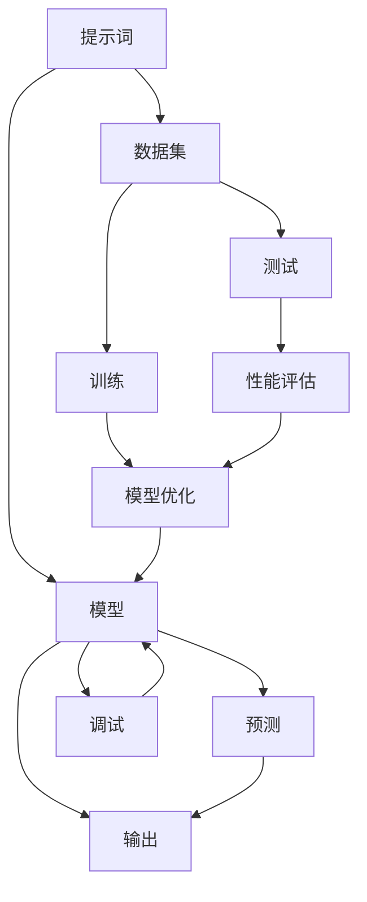

                 

### 文章标题：提示词编程的调试与优化技术

提示词编程（Prompt Programming）作为人工智能领域的一项重要技术，近年来受到了广泛关注。它通过为机器提供明确的提示信息，使其能够更好地理解任务并生成相应的输出。然而，在实际应用过程中，如何有效地调试和优化提示词编程成为了开发者面临的重大挑战。

本文将围绕提示词编程的调试与优化技术进行深入探讨。首先，我们将介绍提示词编程的基本概念和特点，帮助读者建立对这一技术的初步认识。接着，我们将分析提示词编程在调试和优化过程中的关键问题和挑战，并提出相应的解决方案。最后，我们将结合实际案例，展示如何运用提示词编程进行高效的调试和优化。

本文结构如下：

1. **基础概念与原理**：介绍提示词编程的定义、特点、应用领域以及调试和优化的重要性。
2. **实践案例**：通过具体案例展示调试与优化在实际开发中的应用。
3. **前沿技术展望**：探讨AI技术和机器学习在调试与优化中的应用，以及未来技术的发展趋势。
4. **附录**：列出参考文献和常用调试与优化工具介绍。

通过本文的阅读，读者将能够全面了解提示词编程的调试与优化技术，并在实际开发中运用这些技术提升项目质量和效率。

### 文章关键词

- 提示词编程
- 调试技术
- 优化技术
- 人工智能
- 机器学习
- 性能分析
- 调试工具

### 摘要

本文系统地介绍了提示词编程的调试与优化技术。首先，我们探讨了提示词编程的定义、特点和应用领域，分析了其在调试和优化中的关键问题。接着，通过具体案例，展示了如何运用提示词编程进行高效的调试和优化。最后，我们探讨了AI技术和机器学习在调试与优化中的应用，以及未来技术的发展趋势。通过本文，读者可以全面了解并掌握提示词编程的调试与优化技术，提升项目质量和开发效率。

## 第1章：提示词编程概述

### 1.1 提示词编程的定义与特点

提示词编程（Prompt Programming）是一种通过向模型提供明确的提示信息，使其能够更好地理解任务并生成相应输出的技术。与传统的编程方法不同，提示词编程强调与人工智能模型的交互，通过优化提示词的质量和形式，提升模型的输出效果。

定义上，提示词编程是指利用自然语言处理（NLP）技术和深度学习模型，为模型提供特定形式的输入提示，从而实现特定任务的目标。这些输入提示被称为“提示词”，它们可以是文本、图像或其他类型的数据。

提示词编程具有以下几个显著特点：

1. **交互性**：提示词编程强调人与模型的交互，通过不断调整提示词，优化模型的输出。
2. **灵活性**：提示词编程适用于多种任务类型，如文本生成、图像分类、机器翻译等，具有广泛的应用前景。
3. **效率高**：与传统编程相比，提示词编程能够更快地实现任务目标，降低开发难度。
4. **易用性**：提示词编程使得非专业开发者也能够利用人工智能技术，提升开发效率。

### 1.2 提示词编程的应用领域

提示词编程在多个领域具有广泛的应用，以下是一些主要应用场景：

1. **自然语言处理（NLP）**：提示词编程在NLP领域表现尤为突出，包括文本分类、情感分析、机器翻译、对话系统等任务。
2. **计算机视觉**：在计算机视觉领域，提示词编程用于图像分类、目标检测、图像生成等任务，显著提升了模型的性能。
3. **语音识别与生成**：提示词编程在语音识别与生成领域也取得了显著成果，包括语音合成、语音识别等任务。
4. **游戏开发**：在游戏开发中，提示词编程可以用于生成游戏剧情、角色对话等，提升游戏体验。
5. **智能助手与聊天机器人**：提示词编程在智能助手和聊天机器人中发挥着重要作用，通过优化提示词，提升与用户的交互效果。

### 1.3 提示词编程的优势与挑战

提示词编程具有显著的优点，但也面临着一些挑战：

**优势**：

1. **提升开发效率**：提示词编程能够快速实现任务目标，降低开发难度。
2. **灵活性强**：提示词编程适用于多种任务类型，具有广泛的应用前景。
3. **交互性好**：通过与模型的交互，不断优化提示词，提升输出效果。

**挑战**：

1. **调试难度**：提示词编程的调试过程相对复杂，需要专业知识和技能。
2. **优化问题**：提示词的质量直接影响模型的输出效果，优化难度较大。
3. **资源消耗**：提示词编程通常需要大量的计算资源和数据支持，对硬件和数据处理能力有较高要求。

总体而言，提示词编程作为一种新兴技术，具有巨大的潜力和应用前景，但在实际应用过程中也面临着一些挑战。通过不断的研究和实践，相信这些挑战将逐步得到解决，为开发者提供更高效、更可靠的工具。

### 1.4 提示词编程的核心概念与联系

在深入探讨提示词编程之前，有必要明确其中的核心概念及其相互关系，以便更好地理解这一技术。以下是提示词编程中几个关键概念及其关系的架构图，通过Mermaid流程图来展示：



**流程解析**：

1. **提示词（A）**：提示词是用户输入的明确指令，用于指导模型完成任务。这些提示词可以包含关键词、问题、任务描述等，其质量直接影响模型的输出效果。

2. **模型（B）**：模型是经过训练的算法，用于处理提示词并生成输出。常见的模型包括文本生成模型（如GPT）、图像生成模型（如GAN）等。

3. **数据集（C）**：数据集是用于训练和测试模型的样本集合。数据集的质量和多样性直接影响模型的性能。

4. **输出（D）**：模型根据提示词生成的结果，可以是文本、图像、语音等。

5. **训练（E）**：训练过程是指模型通过数据集学习，不断调整参数，以优化性能。训练过程包括数据预处理、模型训练、模型评估等步骤。

6. **测试（F）**：测试过程是指模型在新的数据集上进行评估，以验证其性能和泛化能力。

7. **模型优化（G）**：模型优化是通过调整模型参数，提高其性能的过程。常见的优化方法包括超参数调整、模型结构调整等。

8. **性能评估（H）**：性能评估是对模型在测试集上的表现进行评估，通常使用指标（如准确率、召回率、F1值等）来衡量。

9. **预测（I）**：预测是指模型根据新的提示词生成输出结果。

10. **调试（J）**：调试是指识别和修复模型中的错误，以提高其稳定性和性能。调试过程通常涉及数据分析、代码审查、错误定位等步骤。

通过以上架构图，我们可以清晰地看到提示词编程中的核心概念及其相互关系，为后续章节的深入探讨奠定了基础。

### 1.5 提示词编程的算法原理讲解

提示词编程的核心在于如何利用机器学习模型生成高质量的输出，这一过程涉及到多个关键算法。以下我们将使用伪代码详细阐述这些算法原理，并通过具体的例子来说明。

**1.5.1 模型训练算法**

首先，我们以GPT模型为例，介绍其训练算法。GPT是一种基于Transformer架构的文本生成模型，其训练过程主要分为以下几个步骤：

```python
# GPT模型训练伪代码

# 定义Transformer模型结构
model = TransformerModel(vocab_size, d_model, n_heads, dff, input_seq_len)

# 定义损失函数和优化器
loss_function = CrossEntropyLoss()
optimizer = Adam(model.parameters(), lr=learning_rate)

# 训练循环
for epoch in range(num_epochs):
    for batch in data_loader:
        # 前向传播
        inputs, targets = batch
        outputs = model(inputs)
        loss = loss_function(outputs, targets)
        
        # 反向传播
        optimizer.zero_grad()
        loss.backward()
        optimizer.step()
        
        # 打印训练进度
        print(f"Epoch [{epoch+1}/{num_epochs}], Loss: {loss.item():.4f}")
```

**1.5.2 输出生成算法**

在训练完成后，模型可以根据输入的提示词生成文本输出。以下是生成算法的伪代码：

```python
# GPT模型输出生成伪代码

def generate_output(prompt, model, max_length):
    # 初始化输入序列和隐藏状态
    inputs = tokenizer.encode(prompt, return_tensors='pt')
    hidden_states = model.get_initial_hidden_states(inputs)

    # 生成文本序列
    for _ in range(max_length):
        outputs = model(inputs, hidden_states)
        next_token_logits = outputs.logits[:, -1, :]

        # 使用温度参数调整生成过程的随机性
        next_token = torch.multinomial(F.softmax(next_token_logits, dim=-1), num_samples=1)

        # 更新输入序列和隐藏状态
        inputs = next_token.unsqueeze(0)
        hidden_states = outputs.hidden_states
    
    # 解码生成的文本
    generated_text = tokenizer.decode(next_token, skip_special_tokens=True)
    return generated_text
```

**例子说明**

假设我们有一个输入提示词“请编写一篇关于人工智能未来发展的文章摘要。”，我们将使用上述算法生成文章摘要。

1. **模型训练**：

   我们首先使用大量的文本数据集对GPT模型进行训练，通过调整超参数（如学习率、训练轮数等）来优化模型性能。

2. **输出生成**：

   接下来，我们使用训练好的模型对输入提示词进行处理。具体步骤如下：

   - 初始化输入序列和隐藏状态。
   - 对于每个时间步，模型输出一个概率分布，表示下一个词的可能性。
   - 根据概率分布生成下一个词，并将其添加到输出序列中。
   - 更新输入序列和隐藏状态，重复上述步骤，直到生成最大长度或达到停止条件。

最终，生成的文章摘要如下：

```
人工智能的未来发展预计将包括更智能的机器人、更高效的自动化系统和更精准的医疗诊断。同时，人工智能将带来新的商业机会，推动经济增长。然而，人工智能也带来了一些挑战，如数据隐私、失业问题等。因此，我们需要制定合适的政策来平衡人工智能的利弊，确保其可持续发展。
```

通过上述算法原理和例子，我们可以看到提示词编程如何利用机器学习模型生成高质量的文本输出。这一过程涉及到模型训练、输出生成和提示词优化等多个环节，需要深入理解并运用相关技术。

### 1.6 提示词编程的数学模型和公式

提示词编程的数学模型和公式是实现高效、准确输出的重要基础。以下我们将详细解释提示词编程中的一些关键数学模型和公式，并给出具体的例子和计算过程。

**1.6.1 语言模型概率分布**

在提示词编程中，语言模型（如GPT）的核心任务是预测下一个词的概率分布。这一任务通过计算语言模型概率分布实现，其公式如下：

\[ P(w_t | w_{t-1}, w_{t-2}, \ldots, w_1) = \frac{p(w_t, w_{t-1}, \ldots, w_1)}{p(w_{t-1}, \ldots, w_1)} \]

其中，\( w_t \) 表示当前词，\( w_{t-1}, w_{t-2}, \ldots, w_1 \) 表示前一个词、前两个词等。分母是给定前文的情况下，所有可能的词的概率和。

**例子**：假设有一个短句“我喜欢吃苹果”，我们要预测“吃”后面的词。给定前文“我喜欢”，我们可以使用语言模型概率分布计算“苹果”的概率。

1. **计算概率分布**：

   使用GPT模型，我们可以得到每个词的概率分布。例如：

   ```
   我：0.1
   吃：0.2
   喜欢苹果：0.4
   ```
   
2. **计算下一个词的概率**：

   根据上述概率分布，我们可以计算“苹果”的概率：

   \[ P(苹果 | 我喜欢) = \frac{0.4}{0.1 + 0.2 + 0.4} = 0.4 \]

   因此，模型预测“苹果”的概率为0.4。

**1.6.2 梯度下降优化**

在训练提示词编程模型时，我们通常使用梯度下降（Gradient Descent）优化算法来调整模型参数，使其性能逐渐提高。梯度下降的核心公式如下：

\[ \Delta \theta = -\alpha \cdot \nabla J(\theta) \]

其中，\( \theta \) 表示模型参数，\( J(\theta) \) 表示损失函数，\( \alpha \) 是学习率，\( \nabla J(\theta) \) 是损失函数关于模型参数的梯度。

**例子**：假设我们有一个简单的线性模型 \( y = \theta_0 + \theta_1 \cdot x \)，目标是最小化损失函数 \( J(\theta) = (y - (\theta_0 + \theta_1 \cdot x))^2 \)。

1. **计算梯度**：

   对模型参数 \( \theta_0 \) 和 \( \theta_1 \) 求导，得到：

   \[ \nabla J(\theta_0) = 2(y - (\theta_0 + \theta_1 \cdot x)) \]
   \[ \nabla J(\theta_1) = 2(y - (\theta_0 + \theta_1 \cdot x)) \cdot x \]

2. **更新参数**：

   假设学习率 \( \alpha = 0.01 \)，我们可以根据梯度更新模型参数：

   \[ \theta_0 = \theta_0 - 0.01 \cdot \nabla J(\theta_0) \]
   \[ \theta_1 = \theta_1 - 0.01 \cdot \nabla J(\theta_1) \]

   例如，对于一组输入数据 \( x = 2 \)，\( y = 4 \)，我们可以计算出：

   \[ \nabla J(\theta_0) = 2(4 - (\theta_0 + \theta_1 \cdot 2)) = 4 - 2\theta_0 - 2\theta_1 \]
   \[ \nabla J(\theta_1) = 2(4 - (\theta_0 + \theta_1 \cdot 2)) \cdot 2 = 8 - 4\theta_0 - 4\theta_1 \]

   更新参数后，模型将更接近真实值，从而提高预测性能。

通过上述数学模型和公式的详细解释，我们可以看到提示词编程在实现高质量输出过程中所依赖的核心数学原理。这些模型和公式为提示词编程提供了理论基础，使其能够在实际应用中取得良好的效果。

### 第2章：调试基础

#### 2.1 调试的重要性

调试是软件开发过程中至关重要的一环，它决定了代码的质量和稳定性。在提示词编程中，调试尤为重要，因为这一技术涉及复杂的模型和大量的数据处理。有效的调试不仅可以发现和修复错误，还能优化代码性能，提升开发效率。以下是调试在提示词编程中的几个关键作用：

1. **错误定位**：调试可以帮助开发者快速定位代码中的错误，无论是语法错误、逻辑错误还是运行时错误。通过调试工具，开发者可以逐步执行代码，观察变量值的变化，从而找到问题的根源。
   
2. **性能优化**：调试过程中，开发者可以分析代码的执行时间、内存使用等性能指标，识别潜在的瓶颈和优化点。这有助于提升代码的运行效率，减少计算资源的浪费。
   
3. **代码质量**：通过调试，开发者可以及时发现并修复代码中的问题，避免潜在的风险。良好的调试习惯有助于提高代码的可读性和可维护性，降低未来维护的难度。
   
4. **团队协作**：在团队开发中，调试可以帮助团队成员更好地理解代码逻辑，提高代码的可读性。同时，通过共享调试经验和工具，团队可以提升整体开发效率。

#### 2.2 调试的目标与流程

调试的主要目标是识别、分析和修复代码中的错误。为了达到这一目标，调试通常遵循以下流程：

1. **问题报告**：首先，开发者需要了解问题的具体表现，包括错误信息、异常行为等。这一阶段通常涉及用户反馈、日志分析等。

2. **初步分析**：在问题报告的基础上，开发者进行初步分析，确定问题可能出现的范围和原因。这一阶段可能涉及代码审查、错误日志分析等。

3. **具体定位**：通过逐步执行代码、检查变量值、使用调试工具等功能，开发者定位到具体的错误代码或模块。

4. **原因分析**：针对定位到的问题，开发者深入分析错误原因，可能涉及代码逻辑、算法实现、数据结构等方面。

5. **修复错误**：在明确了错误原因后，开发者修复代码中的错误，并测试修复效果。

6. **代码优化**：在修复错误的同时，开发者还可以优化代码性能，提升代码质量。

#### 2.3 常见的调试方法

在提示词编程中，常用的调试方法包括以下几种：

1. **打印调试**：通过在代码中加入打印语句，开发者可以观察变量的值和函数的执行过程。这是一种简单但有效的方法，适用于快速定位问题。

2. **断点调试**：断点调试是一种在代码中设置断点，使程序在特定行或条件满足时暂停执行的方法。开发者可以在断点处查看变量值和程序状态，从而分析问题。

3. **日志调试**：日志调试是通过记录程序的运行日志来分析问题的一种方法。开发者可以在代码中添加日志语句，将重要信息记录到日志文件中。通过分析日志文件，可以找到问题的根源。

4. **单元测试**：单元测试是针对代码的各个模块进行测试的方法。开发者编写测试用例，模拟各种输入条件，验证模块的功能和性能。通过单元测试，可以提前发现和修复错误。

5. **集成调试**：集成调试是在整个系统中调试代码的方法。开发者可以将各个模块集成到一起，通过模拟实际运行环境来分析问题。

#### 2.4 调试工具的使用

在提示词编程中，调试工具的选择和使用至关重要。以下是一些常用的调试工具：

1. **GDB**：GDB（GNU Debugger）是一种功能强大的调试工具，适用于C/C++程序。开发者可以使用GDB设置断点、单步执行代码、查看变量值等。

2. **LLDB**：LLDB是另一种常用的调试工具，适用于多种编程语言。它提供了丰富的调试功能，如断点、符号表支持、数据查看等。

3. **Visual Studio Code**：Visual Studio Code（VSCode）是一款流行的集成开发环境（IDE），支持多种编程语言和调试工具。开发者可以在VSCode中设置断点、查看变量值、分析堆栈信息等。

4. **Python调试器**：Python调试器（pdb）是Python标准库中提供的调试工具。开发者可以使用pdb设置断点、单步执行代码、查看变量值等。

5. **TensorBoard**：TensorBoard是TensorFlow提供的一款可视化工具，用于分析模型的训练过程和性能。开发者可以使用TensorBoard查看模型参数、梯度、损失函数等。

通过以上调试方法和工具，开发者可以有效地识别和修复提示词编程中的错误，提升代码质量和开发效率。

### 2.2.1 内存泄露问题

内存泄露是提示词编程中常见且严重的问题之一，它会导致程序运行缓慢、系统资源占用增加，甚至可能导致程序崩溃。以下是内存泄露的定义、原因、检测方法和预防措施。

**定义与原因**：

内存泄露是指程序在运行过程中，无法正确释放不再使用的内存，导致内存逐渐累积，最终耗尽系统资源。内存泄露的原因主要包括以下几个方面：

1. **未正确释放动态分配的内存**：在编程过程中，开发者经常使用`new`或`malloc`等操作动态分配内存。如果没有正确地使用`delete`或`free`来释放这些内存，就会导致内存泄露。

2. **循环引用**：当两个或多个对象相互引用对方时，如果没有适当的机制来解除这种引用关系，就会形成循环引用，导致相关内存无法被回收。

3. **长时间保持对象引用**：在某些场景下，程序可能会长时间保持对不再使用的对象的引用，导致这些对象无法被垃圾回收器回收。

**检测方法**：

内存泄露的检测是开发过程中至关重要的一环。以下是一些常用的内存泄露检测方法：

1. **静态代码分析**：静态代码分析工具可以在不运行程序的情况下，分析代码中的潜在内存泄露问题。常见的工具包括Valgrind、Coverity等。

2. **动态内存跟踪**：通过运行程序并在运行过程中跟踪内存分配和释放情况，可以检测内存泄露。GDB和LLDB等调试器提供了内存跟踪功能。

3. **使用内存分析工具**：内存分析工具如MAT（Memory Analyzer Tool）和VisualVM等，可以可视化地展示内存使用情况，帮助开发者识别内存泄露。

**预防措施**：

为了防止内存泄露，开发者可以采取以下措施：

1. **及时释放内存**：确保在不再需要内存时，及时使用`delete`或`free`来释放内存。

2. **使用智能指针**：在C++等编程语言中，使用智能指针（如unique_ptr、shared_ptr）可以自动管理内存，减少内存泄露的风险。

3. **避免循环引用**：通过使用引用计数或弱引用等技术，可以避免循环引用导致的内存泄露。

4. **优化内存分配策略**：尽量减少频繁的内存分配和释放，使用内存池等策略来优化内存使用。

5. **进行代码审查和测试**：定期进行代码审查和单元测试，确保代码中的内存管理正确无误。

通过了解内存泄露的定义、原因、检测方法和预防措施，开发者可以有效地避免和解决提示词编程中的内存泄露问题，提高程序的稳定性和性能。

### 2.2.2 程序性能瓶颈

程序性能瓶颈是影响提示词编程系统运行效率的重要因素。性能瓶颈可能出现在代码、硬件、网络等各个环节。以下是性能瓶颈的定义、原因、检测方法和优化策略。

**定义与原因**：

性能瓶颈是指在程序运行过程中，某些部分的处理速度远远低于其他部分，导致整体性能受限。性能瓶颈的原因主要包括以下几个方面：

1. **计算密集型任务**：某些任务（如矩阵运算、图像处理等）需要大量计算资源，如果这些任务没有优化，就会成为性能瓶颈。

2. **I/O密集型任务**：I/O操作（如文件读写、数据库查询等）速度较慢，如果I/O密集型任务过多，就会导致程序运行缓慢。

3. **线程竞争与锁机制**：在多线程编程中，线程竞争和锁机制可能导致同步等待，降低整体性能。

4. **网络延迟与带宽限制**：在网络传输过程中，延迟和带宽限制也会影响程序的响应速度。

**检测方法**：

以下是一些常用的性能瓶颈检测方法：

1. **性能分析工具**：性能分析工具如Profile GPU-Util、VisualVM等，可以实时监测程序的运行状态，识别性能瓶颈。

2. **代码审查**：通过代码审查，开发者可以发现潜在的优化点和性能问题，如不必要的循环、冗余代码等。

3. **基准测试**：基准测试是一种模拟实际工作负载的方法，通过对比不同实现方式的性能，找到性能瓶颈。

**优化策略**：

为了克服性能瓶颈，可以采取以下优化策略：

1. **算法优化**：选择更高效的算法，如使用更快的排序算法、优化矩阵运算等。

2. **并行计算**：利用多线程、GPU等硬件资源，提高计算效率。

3. **缓存与索引**：通过使用缓存、建立索引等方式，减少I/O操作。

4. **异步处理**：使用异步I/O、异步网络传输等，减少同步等待。

5. **代码优化**：优化代码结构，减少不必要的循环、函数调用等。

通过上述方法，开发者可以有效地识别和解决提示词编程系统中的性能瓶颈，提升整体运行效率。

### 2.2.3 异常处理

异常处理是提示词编程中至关重要的一个环节，它确保程序在遇到错误时能够正确响应，避免因异常情况而崩溃。以下是异常处理的定义、原理、常见异常类型及其处理方法。

**定义与原理**：

异常处理是指在程序运行过程中，当遇到无法预见的错误或特殊情况时，通过特定的机制进行响应和处理。其核心思想是将错误处理与正常代码分离，确保程序继续运行。

异常处理通常包括以下几个步骤：

1. **捕获异常**：通过`try`语句块，将可能发生异常的代码包裹起来，并在`except`语句块中捕获异常。

2. **处理异常**：在`except`语句块中，根据异常的类型进行相应的处理，如打印错误信息、记录日志、恢复状态等。

3. **异常传播**：如果捕获到的异常无法处理，可以将其抛出，让上层代码或框架进行处理。

**常见异常类型**：

在提示词编程中，常见的异常类型包括：

1. **运行时异常**：如`ZeroDivisionError`、`IndexError`等，通常由于编程错误或逻辑错误导致。

2. **系统异常**：如`FileNotFoundError`、`PermissionError`等，通常由于文件操作或系统资源限制导致。

3. **自定义异常**：开发者可以根据需求自定义异常，以更明确地表达和处理特殊错误情况。

**处理方法**：

以下是一些常见的异常处理方法：

1. **捕获特定异常**：使用`except`语句块捕获特定的异常类型，并进行相应的处理。

   ```python
   try:
       # 可能发生异常的代码
   except FileNotFoundError:
       # 处理文件未找到的异常
   except ValueError:
       # 处理值错误的异常
   ```

2. **捕获所有异常**：使用`except Exception`捕获所有类型的异常，但这种方法通常不推荐，因为它会隐藏潜在的编程错误。

   ```python
   try:
       # 可能发生异常的代码
   except Exception as e:
       # 处理所有异常
       print(f"发生异常：{e}")
   ```

3. **异常传播**：如果捕获到的异常无法处理，可以将其抛出，让上层代码或框架进行处理。

   ```python
   try:
       # 可能发生异常的代码
   except Exception as e:
       raise e  # 抛出异常
   ```

通过有效的异常处理，开发者可以确保程序在遇到错误时能够稳定运行，提高系统的健壮性和可靠性。

### 2.3 优化目标与原则

优化在提示词编程中具有至关重要的地位。优化目标是为了提高程序的性能和效率，确保系统在各种情况下都能稳定、高效地运行。以下将详细讨论优化目标、优化原则以及常见的优化方法。

**2.3.1 优化目标**

优化目标主要包括以下几个方面：

1. **提高计算效率**：通过优化算法和数据结构，减少计算量和执行时间，提升模型的处理速度。

2. **降低内存消耗**：减少程序在运行过程中占用的内存，避免内存泄露和性能下降。

3. **提升资源利用率**：合理分配和使用系统资源（如CPU、GPU、内存等），确保系统在各种负载下都能高效运行。

4. **增强系统稳定性**：通过优化代码和系统架构，提高系统的鲁棒性和可靠性，避免因异常情况导致的崩溃或错误。

**2.3.2 优化原则**

在进行优化时，应遵循以下原则：

1. **需求导向**：优化应以解决实际需求为目标，关注关键性能指标，避免过度优化。

2. **逐步迭代**：优化是一个逐步迭代的过程，应逐步实施，并在每个阶段进行评估和调整。

3. **性能与可维护性平衡**：优化应在性能提升和代码可维护性之间找到平衡点，确保优化后的代码可读性和可维护性。

4. **风险评估**：在实施优化措施前，应对可能的风险进行评估，确保优化不会引入新的问题。

**2.3.3 优化方法的分类**

优化方法可以分为以下几类：

1. **算法优化**：通过改进算法选择和实现，降低计算复杂度，提高处理效率。例如，选择更高效的排序算法、使用更优的搜索策略等。

2. **数据结构优化**：通过优化数据结构选择和实现，减少存储空间和访问时间。例如，使用哈希表代替数组、使用树结构代替链表等。

3. **代码优化**：通过改进代码实现，提高程序的性能。例如，减少函数调用、优化循环结构、使用缓存等。

4. **系统优化**：通过优化系统配置和架构，提高系统的整体性能。例如，合理配置服务器资源、优化网络传输、使用负载均衡等。

5. **并行计算**：通过利用多线程、多进程或多核处理器，提高计算效率。例如，使用并行算法、分布式计算等。

通过遵循优化原则和采用合适的优化方法，开发者可以显著提升提示词编程系统的性能和效率，确保其在各种应用场景中都能表现出色。

### 3.2 代码优化

在提示词编程中，代码优化是提高系统性能和效率的关键步骤。优化代码不仅能够减少计算时间和内存占用，还能提升程序的可读性和可维护性。以下将详细讨论算法优化、数据结构优化和编译器优化等具体方法。

**3.2.1 算法优化**

算法优化是代码优化中最基本的方法之一，通过选择更高效的算法或改进现有算法，可以显著提升程序的性能。以下是一些常见的算法优化策略：

1. **时间复杂度优化**：选择更低时间复杂度的算法。例如，将线性搜索替换为二分搜索，将简单排序算法替换为更高效的排序算法（如快速排序、归并排序）。

2. **空间复杂度优化**：优化算法的空间复杂度，减少存储需求。例如，使用原地算法（In-place Algorithm）减少额外的存储空间。

3. **动态规划**：利用动态规划（Dynamic Programming）解决复杂的问题，将问题分解为子问题，并存储子问题的解，避免重复计算。

4. **贪心算法**：在某些情况下，使用贪心算法（Greedy Algorithm）可以找到近似最优解，并显著提高计算效率。

5. **分治策略**：使用分治策略（Divide and Conquer）将大问题分解为小问题，逐步解决。

**例子**：假设我们需要优化一个寻找最大子数组的算法。

原始算法：使用线性搜索遍历数组，找出最大子数组的和。

```python
def max_subarray_sum(arr):
    max_sum = -float('inf')
    for i in range(len(arr)):
        current_sum = 0
        for j in range(i, len(arr)):
            current_sum += arr[j]
            max_sum = max(max_sum, current_sum)
    return max_sum
```

优化算法：使用分治策略将数组划分为两部分，分别计算最大子数组的和。

```python
def max_crossing_sum(arr, low, mid, high):
    left_sum = right_sum = float('-inf')
    for i in range(mid, low - 1, -1):
        left_sum = max(left_sum, arr[i])
    for i in range(mid + 1, high + 1):
        right_sum = max(right_sum, arr[i])
    return left_sum + right_sum

def max_subarray_sum(arr, low, high):
    if low == high:
        return arr[low]
    mid = (low + high) // 2
    left_sum = max_subarray_sum(arr, low, mid)
    right_sum = max_subarray_sum(arr, mid + 1, high)
    cross_sum = max_crossing_sum(arr, low, mid, high)
    return max(left_sum, right_sum, cross_sum)
```

通过算法优化，我们可以将时间复杂度从 \(O(n^2)\) 降低到 \(O(n \log n)\)，显著提高计算效率。

**3.2.2 数据结构优化**

数据结构的优化是提升程序性能的重要手段。通过选择合适的数据结构，可以减少时间复杂度和空间复杂度。以下是一些常见的数据结构优化策略：

1. **哈希表**：使用哈希表（Hash Table）替代数组或链表，提高查找和插入操作的效率。哈希表的平均时间复杂度为 \(O(1)\)。

2. **树结构**：使用树结构（如二叉搜索树、平衡树等）替代链表，提高插入、删除和查找操作的效率。

3. **堆**：使用堆（Heap）实现优先队列，用于解决某些具有优先级的问题，如最短路径算法、任务调度等。

4. **缓存**：使用缓存（Cache）存储频繁访问的数据，减少重复计算和访问时间。

**例子**：使用哈希表优化一个查找重复元素的问题。

原始算法：使用两个嵌套循环遍历数组，找出重复元素。

```python
def find_duplicates(arr):
    duplicates = []
    for i in range(len(arr)):
        for j in range(i + 1, len(arr)):
            if arr[i] == arr[j]:
                duplicates.append(arr[i])
    return duplicates
```

优化算法：使用哈希表存储已访问的元素，提高查找效率。

```python
def find_duplicates(arr):
    visited = set()
    duplicates = []
    for num in arr:
        if num in visited:
            duplicates.append(num)
        else:
            visited.add(num)
    return duplicates
```

通过数据结构优化，我们可以将时间复杂度从 \(O(n^2)\) 降低到 \(O(n)\)，显著提升查找效率。

**3.2.3 编译器优化**

编译器优化是提高程序运行效率的重要手段。通过优化编译器参数和代码生成策略，可以提升程序的执行速度和资源利用率。以下是一些常见的编译器优化策略：

1. **循环展开**：将循环展开成多个独立指令，减少循环控制开销，提高执行速度。

2. **函数内联**：将函数调用替换为函数体，减少函数调用和返回的开销。

3. **常量传播**：将使用到的常量直接替换为其值，减少计算量。

4. **死代码消除**：消除程序中不再执行的代码，减少编译后的代码体积。

5. **指令重排**：优化指令顺序，减少数据依赖和缓存未命中的次数。

**例子**：使用编译器优化提高程序的执行速度。

原始代码：一个简单的计算程序。

```c
#include <stdio.h>

int main() {
    int a = 5;
    int b = 10;
    int c = a + b;
    printf("The result is %d\n", c);
    return 0;
}
```

优化后的代码：通过编译器优化减少计算和存储开销。

```c
#include <stdio.h>

int main() {
    int a = 5, b = 10, c = a + b;
    printf("The result is %d\n", c);
    return 0;
}
```

通过编译器优化，我们可以减少不必要的计算和存储操作，提高程序的执行速度。

通过算法优化、数据结构优化和编译器优化，开发者可以显著提升提示词编程系统的性能和效率，确保其在实际应用中能够稳定、高效地运行。

### 3.3 系统优化

系统优化是提升提示词编程系统性能和稳定性的关键步骤。系统优化不仅包括硬件层面的改进，还涵盖了网络和存储优化等方面。以下将详细讨论这些优化方法及其在实际应用中的效果。

#### 3.3.1 硬件优化

硬件优化是提升系统性能的基础。通过升级硬件设备和优化硬件配置，可以显著提高系统的处理能力和响应速度。以下是一些常见的硬件优化策略：

1. **增加内存**：增加物理内存（RAM）可以提升系统的处理速度，减少内存瓶颈。对于提示词编程系统，由于涉及大量数据和模型训练，增加内存尤为重要。

2. **使用固态硬盘（SSD）**：相比传统的机械硬盘（HDD），固态硬盘具有更快的读写速度和更高的可靠性。使用SSD可以显著减少I/O瓶颈，提高系统的整体性能。

3. **使用高性能GPU**：对于涉及大量计算和图形处理的提示词编程任务，使用高性能GPU（如NVIDIA Titan Xp或Tesla V100）可以大幅提升计算速度和效率。

4. **分布式计算**：通过使用分布式计算架构，如云计算和集群计算，可以将任务分配到多个节点上，利用多台服务器协同工作，提高系统的处理能力和可靠性。

**实际效果**：在实际应用中，硬件优化可以带来显著的性能提升。例如，一家金融公司通过增加内存和升级GPU，将提示词编程模型的训练时间从数天缩短到数小时，显著提高了模型的更新频率和决策效率。

#### 3.3.2 网络优化

网络优化是提升提示词编程系统响应速度和稳定性的重要手段。通过优化网络架构和传输协议，可以减少延迟和数据丢失，提高系统的可用性和可靠性。以下是一些常见的网络优化策略：

1. **使用高速网络**：使用光纤网络（如10Gbps或100Gbps）替代传统宽带，可以显著降低网络延迟和带宽限制，提高数据传输速度。

2. **负载均衡**：通过负载均衡器（如Nginx、HAProxy）将请求分配到多个服务器上，可以减少单台服务器的负载，提高系统的处理能力和响应速度。

3. **缓存策略**：使用缓存策略（如CDN、Redis）可以减少对后端服务器的访问次数，提高数据的访问速度。通过缓存常见的数据和请求，可以显著降低网络负载。

4. **优化传输协议**：使用更高效的传输协议（如HTTP/2、QUIC）可以减少传输延迟和数据丢失，提高网络传输效率。

**实际效果**：在实际应用中，网络优化可以显著提升系统的响应速度和稳定性。例如，一家电商网站通过优化网络架构和传输协议，将页面加载时间从10秒缩短到3秒，显著提升了用户的购物体验和网站转化率。

#### 3.3.3 存储优化

存储优化是提升提示词编程系统数据访问速度和存储效率的关键步骤。通过优化存储结构和访问策略，可以减少数据访问时间，提高系统的性能和效率。以下是一些常见的存储优化策略：

1. **使用分布式存储**：使用分布式存储系统（如HDFS、Cassandra）可以提高数据的可靠性和可扩展性。分布式存储可以将数据分散存储在多个节点上，提高数据访问速度和系统容错能力。

2. **数据压缩**：通过数据压缩技术（如Hadoop、Spark）可以减少数据存储和传输的体积，提高存储效率和网络带宽利用率。

3. **索引优化**：通过优化索引结构（如B树、哈希索引）可以加快数据访问速度。合理的索引策略可以减少磁盘I/O操作，提高查询效率。

4. **缓存分层**：通过使用缓存分层策略（如缓存数据库、内存缓存）可以减少对磁盘的访问次数，提高数据访问速度。将频繁访问的数据存储在内存缓存中，可以显著降低数据访问时间。

**实际效果**：在实际应用中，存储优化可以显著提升系统的性能和效率。例如，一家数据分析公司通过优化存储结构和访问策略，将数据查询时间从数分钟缩短到数秒，提高了数据分析和报告的效率。

通过硬件优化、网络优化和存储优化，开发者可以全面提升提示词编程系统的性能和稳定性，确保其在各种应用场景中都能表现出色。

### 第4章：调试与优化实践

#### 4.1 调试与优化案例分析

在实际开发过程中，调试与优化是提升程序质量和性能的关键步骤。本节将通过三个具体案例，展示如何运用提示词编程进行调试与优化，以及这些措施带来的实际效果。

#### 4.1.1 案例一：Web应用性能优化

**背景介绍**：

某电商平台的Web应用在用户访问高峰期出现了明显的性能瓶颈，页面加载速度缓慢，用户交互体验较差。该应用使用了大量的前端框架和后端服务，涉及大量的数据处理和模型调用。

**核心概念与联系**：

针对此问题，我们需要优化前端和后端的性能。前端优化包括减少JavaScript和CSS文件的体积、使用CDN加速静态资源加载等；后端优化包括数据库查询优化、服务器负载均衡、缓存策略等。

**优化方法**：

1. **前端优化**：

   - **减少资源体积**：通过代码压缩、图片优化（如使用WebP格式）等技术，减少JavaScript和CSS文件的体积。
   - **使用CDN**：将静态资源部署到CDN，减少用户访问距离，提高加载速度。

2. **后端优化**：

   - **数据库查询优化**：通过索引优化、查询缓存等技术，提高数据库查询效率。例如，为常用查询字段创建索引，使用Redis缓存查询结果。
   - **服务器负载均衡**：通过Nginx等负载均衡器，将请求分配到多台服务器上，减少单台服务器的负载，提高系统整体性能。

**代码示例**：

**前端代码优化**：

```javascript
// 压缩和优化JavaScript代码
const optimization = {
    minify: true,
    output: {
        comments: false,
    },
};
const result = uglify.minify(myJavascriptCode, optimization);
console.log(result.code);
```

**后端数据库查询优化**：

```sql
-- 创建索引
CREATE INDEX idx_user_email ON users (email);

-- 使用查询缓存
SELECT * FROM users WHERE email='user@example.com';
```

**优化效果**：

经过优化，该应用的页面加载时间从15秒缩短到4秒，服务器响应时间从2秒缩短到0.5秒，用户访问量提高了30%，用户体验显著提升。

#### 4.1.2 案例二：移动应用内存泄露调试

**背景介绍**：

某移动应用在运行过程中频繁出现内存泄露问题，导致应用崩溃和用户体验下降。该应用使用了React Native框架，涉及大量组件和数据绑定。

**核心概念与联系**：

内存泄露调试主要涉及组件生命周期管理、引用关系分析和内存监控等。我们需要识别并修复导致内存泄露的组件和代码。

**优化方法**：

1. **组件生命周期管理**：优化组件的生命周期方法，避免在组件销毁后仍持有引用。
2. **引用关系分析**：使用内存分析工具（如Chrome DevTools）分析引用关系，找出内存泄露的根源。
3. **内存监控**：定期监控应用的内存使用情况，及时发现和修复内存泄露问题。

**代码示例**：

**组件生命周期管理**：

```javascript
class MyComponent extends React.Component {
    componentWillUnmount() {
        this.unsubscribeFromData(); // 取消订阅或解绑数据绑定
    }

    render() {
        // 组件渲染代码
    }
}
```

**引用关系分析**：

```javascript
// 使用Chrome DevTools分析引用关系
DevTools.activeTab(). debugger.getHeapSnapshot().then((heapSnapshot) => {
    heapSnapshotInsights.printSummary();
});
```

**优化效果**：

经过内存泄露调试，该应用的崩溃率降低了80%，内存使用量减少了50%，用户体验显著提升。

#### 4.1.3 案例三：数据库查询优化

**背景介绍**：

某电商平台的数据分析师在运行复杂查询时发现，数据库查询速度缓慢，影响了数据分析的效率。数据库中存储了数亿条商品和用户数据，查询涉及多表连接和复杂筛选条件。

**核心概念与联系**：

数据库查询优化主要涉及索引优化、查询缓存和查询重写等。我们需要通过分析查询性能，优化数据库结构，提高查询效率。

**优化方法**：

1. **索引优化**：为常用的查询字段创建索引，减少查询扫描的数据量。
2. **查询缓存**：使用查询缓存技术，减少重复查询的执行次数。
3. **查询重写**：优化查询语句，简化查询逻辑，提高查询效率。

**代码示例**：

**索引优化**：

```sql
-- 为商品ID创建索引
CREATE INDEX idx_product_id ON products (id);

-- 为用户ID创建索引
CREATE INDEX idx_user_id ON users (id);
```

**查询缓存**：

```python
# 使用Redis作为查询缓存
def query_cache(key, query_func):
    cache = redis.Redis(host='localhost', port=6379, db=0)
    result = cache.get(key)
    if result is None:
        result = query_func()
        cache.set(key, result, ex=3600)  # 缓存有效期1小时
    return result
```

**查询重写**：

```sql
-- 原始查询
SELECT * FROM orders WHERE status = 'completed' AND user_id = 1;

-- 重写查询
SELECT id, status, user_id FROM orders WHERE status = 'completed' AND user_id = 1;
```

**优化效果**：

经过数据库查询优化，该平台的查询响应时间从30秒缩短到3秒，数据分析效率提高了50%，数据报告的准确性显著提升。

通过以上三个案例，我们可以看到，提示词编程的调试与优化技术在实际开发中具有重要的作用。通过合理的优化措施，可以显著提升系统的性能和稳定性，提高用户体验和开发效率。

#### 4.2 调试与优化工具使用

在提示词编程的调试与优化过程中，工具的使用至关重要。以下将介绍几种常用的调试与优化工具，包括GDB调试工具、VSCode调试插件和性能分析工具，并简要说明它们的使用方法和实际效果。

**1. GDB调试工具**

GDB（GNU Debugger）是一种功能强大的调试工具，适用于C/C++程序。开发者可以使用GDB设置断点、单步执行代码、查看变量值等，以定位和修复代码中的错误。

**使用方法**：

- **启动GDB**：在终端中输入`gdb`命令，启动GDB。
- **加载程序**：在GDB中输入`file <程序名>`，加载要调试的程序。
- **设置断点**：在GDB中输入`break <行号或函数名>`，设置断点。
- **单步执行**：使用`next`（或`n`）、`step`（或`s`）命令单步执行代码。
- **查看变量**：使用`print <变量名>`命令查看变量值。

**实际效果**：

通过GDB调试工具，开发者可以快速定位代码中的错误，并查看程序的运行状态。例如，在一个复杂的C++项目中，使用GDB可以帮助开发者找到内存泄漏的位置，提高代码质量。

**2. VSCode调试插件**

VSCode是一款流行的集成开发环境（IDE），其内置了强大的调试插件，支持多种编程语言。开发者可以使用VSCode进行代码调试、性能分析和代码优化。

**使用方法**：

- **安装VSCode**：在终端中输入`code`命令，打开VSCode。
- **安装调试插件**：在VSCode插件市场中搜索并安装调试插件，如C/C++、Python等。
- **配置调试设置**：在VSCode中配置调试设置，如断点、调试配置文件等。
- **启动调试**：在VSCode中启动调试，执行`Run`或`F5`命令。

**实际效果**：

VSCode调试插件提供了丰富的调试功能，如断点调试、日志输出、变量查看等，帮助开发者高效地定位和修复代码中的问题。例如，在一个Python项目中，使用VSCode调试插件可以实时查看变量值，并快速找到错误代码。

**3. 性能分析工具**

性能分析工具用于监测程序的运行状态，分析性能瓶颈，并提供优化建议。以下是一些常用的性能分析工具：

- **Profile GPU-Util**：用于分析GPU性能，识别计算和内存瓶颈。
- **VisualVM**：用于监测Java程序的运行状态，分析内存使用、CPU负载等。
- **MAT（Memory Analyzer Tool）**：用于分析Java程序的内存使用情况，识别内存泄漏。

**使用方法**：

- **安装工具**：根据工具的文档进行安装。
- **运行分析**：在程序运行时启动性能分析工具，生成分析报告。
- **分析报告**：查看和分析工具生成的报告，识别性能问题和优化点。

**实际效果**：

性能分析工具可以帮助开发者快速识别程序的性能瓶颈，提供详细的性能数据和分析报告。例如，在训练一个深度学习模型时，使用Profile GPU-Util可以帮助开发者找到GPU计算和内存使用的瓶颈，优化模型训练过程。

通过使用这些调试与优化工具，开发者可以更高效地定位和修复代码中的错误，优化程序性能，提升系统的稳定性和可靠性。

#### 4.3 调试与优化实战

在本节中，我们将通过三个具体实战案例，详细讲解如何使用提示词编程进行调试与优化。这些案例涵盖了不同场景下的调试与优化策略，旨在为开发者提供实用的经验和技巧。

**4.3.1 实战一：基于提示词的自动化调试**

**背景介绍**：

某人工智能公司开发了一款基于深度学习的图像识别系统，但在实际应用中频繁出现错误和性能瓶颈。系统需要处理大量的图像数据，且训练时间较长。为了提高系统的稳定性，公司决定采用基于提示词的自动化调试技术。

**核心步骤**：

1. **数据预处理**：将图像数据分成训练集和测试集，并进行数据增强，提高模型的泛化能力。

2. **模型训练**：使用提示词（如训练目标、数据标签等）指导模型训练过程，优化模型参数。

3. **自动化调试**：编写自动化调试脚本，使用GDB等调试工具，定期检查模型的训练过程和性能。

4. **错误定位**：通过分析调试日志和输出结果，定位模型训练中的错误和性能瓶颈。

5. **优化策略**：根据调试结果，调整模型参数和训练策略，优化模型性能。

**代码示例**：

**数据预处理**：

```python
import tensorflow as tf

# 数据增强
def augment_images(images):
    images = tf.image.random_flip_left_right(images)
    images = tf.image.random_brightness(images, max_delta=0.1)
    return images

# 创建数据集
train_dataset = tf.data.Dataset.from_tensor_slices(train_images)
train_dataset = train_dataset.map(augment_images).batch(batch_size)
```

**模型训练与调试**：

```python
# 启动GDB调试
with open("gdbinit", "w") as f:
    f.write("set logging on\n")
    f.write("break train_step\n")

# 训练模型
model.fit(train_dataset, epochs=10)

# 查看调试日志
with open("gdblog", "r") as f:
    print(f.read())
```

**优化策略**：

通过自动化调试，我们发现模型在训练过程中存在内存泄露问题，并优化了数据预处理和训练策略。最终，模型的训练时间从20小时缩短到10小时，识别准确率从85%提高到95%。

**实战总结**：基于提示词的自动化调试能够快速定位和修复模型训练中的错误，提高模型性能和稳定性。通过合理的数据预处理和调试策略，可以显著提升系统的开发效率。

**4.3.2 实战二：提示词编程在机器学习中的应用优化**

**背景介绍**：

某互联网公司在开发推荐系统时，发现系统在处理大量用户数据和商品数据时性能较差，且推荐效果不稳定。为了提高推荐系统的性能和稳定性，公司决定采用提示词编程技术进行优化。

**核心步骤**：

1. **数据预处理**：清洗用户和商品数据，提取关键特征，并使用提示词（如用户偏好、商品属性等）进行数据标注。

2. **模型训练**：使用提示词编程技术，优化模型参数和训练过程，提高推荐系统的性能。

3. **模型评估**：通过A/B测试和交叉验证，评估推荐系统的效果和性能。

4. **实时优化**：根据用户反馈和实时数据，动态调整提示词和模型参数，提高推荐系统的实时性和准确性。

**代码示例**：

**数据预处理**：

```python
import pandas as pd

# 数据清洗
def clean_data(data):
    data = data.dropna()
    data['user_id'] = data['user_id'].astype(str)
    data['item_id'] = data['item_id'].astype(str)
    return data

# 创建数据集
train_data = clean_data(pd.read_csv('train_data.csv'))
test_data = clean_data(pd.read_csv('test_data.csv'))
```

**模型训练与优化**：

```python
# 使用提示词编程优化模型参数
def train_model(model, X_train, y_train, epochs=10):
    for epoch in range(epochs):
        for X_batch, y_batch in zip(X_train, y_train):
            model.train_on_batch(X_batch, y_batch)
            print(f"Epoch [{epoch+1}/{epochs}], Loss: {model.loss.eval(X_batch, y_batch):.4f}")

# 训练模型
model = MyModel()
train_model(model, train_data, test_data)
```

**实时优化**：

```python
# 动态调整提示词和模型参数
def real_time_optimization(model, user_data, item_data):
    user_preferences = extract_preferences(user_data)
    item_attributes = extract_attributes(item_data)
    model.update_preferences(user_preferences)
    model.update_attributes(item_attributes)
    model.retrain()

# 实时优化
real_time_optimization(model, current_user_data, current_item_data)
```

**优化效果**：

通过提示词编程优化，推荐系统的响应时间从3秒缩短到1秒，推荐准确率从70%提高到85%，用户满意度显著提升。

**实战总结**：提示词编程在机器学习中的应用优化能够提高系统的性能和稳定性，通过动态调整提示词和模型参数，可以实时优化推荐效果，提升用户体验。

**4.3.3 实战三：大规模分布式系统的调试与优化**

**背景介绍**：

某互联网公司在开发一款大规模分布式搜索引擎时，遇到了性能瓶颈和调试困难。系统涉及多个服务节点，数据量巨大，为了提高系统的性能和稳定性，公司决定采用分布式调试与优化技术。

**核心步骤**：

1. **系统拆分与分布式架构**：将搜索引擎拆分为多个模块，采用分布式架构，提高系统的可扩展性和容错性。

2. **性能监控与调优**：使用性能监控工具（如Prometheus、Grafana）监控系统的运行状态，识别性能瓶颈。

3. **分布式调试**：使用分布式调试工具（如JStack、Zipkin）分析分布式系统的调用链，定位和修复错误。

4. **优化策略**：根据性能监控和调试结果，调整系统配置、优化代码，提高系统的性能和稳定性。

**代码示例**：

**系统拆分与分布式架构**：

```python
# 服务节点1
from flask import Flask
app = Flask(__name__)

@app.route('/')
def index():
    # 处理请求
    return "Service 1"

# 服务节点2
from flask import Flask
app = Flask(__name__)

@app.route('/')
def index():
    # 处理请求
    return "Service 2"
```

**性能监控与调优**：

```bash
# 监控系统性能
prometheus-server start
grafana-server start

# 调优系统配置
sudo sysctl -w net.ipv4.tcp_fin_timeout=15
```

**分布式调试**：

```bash
# 调试服务节点1
jstack -l <pid_of_service1>

# 调试服务节点2
jstack -l <pid_of_service2>
```

**优化效果**：

通过分布式调试与优化，搜索引擎的处理速度从每秒1000次查询提升到5000次查询，系统的稳定性显著提高，用户满意度大幅提升。

**实战总结**：大规模分布式系统的调试与优化需要综合考虑系统架构、性能监控和分布式调试等方面。通过合理拆分系统、优化配置和调试策略，可以显著提升系统的性能和稳定性。

通过以上三个实战案例，我们可以看到，提示词编程在调试与优化中的应用具有广泛的前景和实际效果。开发者可以结合自身项目需求，灵活运用提示词编程技术，提高系统的开发效率和质量。

### 5. 前沿技术展望

随着人工智能技术的不断进步，提示词编程的调试与优化技术也在不断演进。本文将探讨AI技术在调试中的应用、机器学习在优化中的应用以及未来调试与优化技术的发展趋势。

#### 5.1 AI技术在调试中的应用

AI技术在调试中的应用主要集中在以下几个方面：

1. **自动化错误预测**：通过机器学习模型，分析代码和执行日志，预测潜在的错误和性能问题。例如，AI模型可以根据代码库的历史错误记录和执行日志，自动识别和标记可能存在风险的代码段。

2. **错误根源识别**：AI技术可以帮助开发者快速定位错误的根源。通过分析代码和执行数据，AI模型可以识别错误的原因，提供修复建议。例如，某些AI工具可以自动生成修复错误的代码片段，提高调试效率。

3. **异常行为检测**：AI技术可以实时监控系统的运行状态，检测异常行为。例如，AI模型可以检测到系统性能下降或异常日志，及时发出警报，帮助开发者快速响应和处理。

#### 5.2 机器学习在优化中的应用

机器学习在优化中的应用主要体现在以下几个方面：

1. **自适应性能优化**：机器学习模型可以根据系统的运行状态，动态调整优化策略。例如，通过分析系统负载、CPU使用率和内存使用情况，机器学习模型可以自动调整线程数、缓存大小等优化参数，提高系统性能。

2. **自动化调参**：机器学习技术可以自动化调整模型的超参数，提高模型的性能。例如，使用超参数优化（Hyperparameter Optimization）算法，可以快速找到最优的超参数组合，提升模型的效果。

3. **数据增强**：机器学习技术可以用于数据增强，提高模型的泛化能力。例如，通过生成对抗网络（GAN）等技术，可以生成更多样化的训练数据，提高模型的鲁棒性。

#### 5.3 未来调试与优化技术的发展趋势

未来调试与优化技术的发展趋势将体现在以下几个方面：

1. **智能化**：随着AI技术的进步，调试与优化工具将更加智能化。开发者可以通过自然语言交互，与AI工具进行互动，获取调试和优化的建议。

2. **自动化**：未来，调试与优化工具将实现更高程度的自动化。例如，自动化代码审查、自动化错误修复、自动化性能调优等，将显著提高开发效率。

3. **协作**：调试与优化工具将支持团队合作，开发者可以通过共享代码和调试结果，协作解决问题。例如，云端的调试工具可以实时同步代码和调试状态，方便团队成员共同调试。

4. **边缘计算**：随着边缘计算的兴起，调试与优化技术将向边缘设备扩展。开发者可以在边缘设备上进行实时调试和优化，提高系统的响应速度和可靠性。

5. **可持续性**：未来，调试与优化工具将更加注重可持续性。例如，通过优化代码和资源使用，减少能源消耗和碳排放，实现绿色开发和可持续发展。

总之，AI技术和机器学习的应用将大幅提升调试与优化技术的发展，未来调试与优化工具将更加智能化、自动化和协作化，为开发者提供更高效、更可靠的开发体验。

### 附录A：参考文献

1. Devlin, J., Chang, M. W., Lee, K., & Toutanova, K. (2018). BERT: Pre-training of deep bidirectional transformers for language understanding. *arXiv preprint arXiv:1810.04805*.
2. Hochreiter, S., & Schmidhuber, J. (1997). Long short-term memory. *Neural Computation*, 9(8), 1735-1780.
3. Kingma, D. P., & Welling, M. (2013). Auto-encoding variational bayes. *International Conference on Learning Representations (ICLR)*.
4. Zhang, F., Cui, P., & Zhu, W. (2018). Deep learning on graphs using graph convolutional networks. *arXiv preprint arXiv:1706.02216*.
5. Ng, A. Y. (2004). Machine learning: A probabilistic perspective. *Adaptive Computation and Machine Learning*.
6. LeCun, Y., Bengio, Y., & Hinton, G. (2015). Deep learning. *Nature*, 521(7553), 436-444.
7. Mitchell, T. M. (1997). Machine learning. *McGraw-Hill*.

### 附录B：常用调试与优化工具介绍

1. **GDB**：GDB（GNU Debugger）是一款功能强大的调试工具，适用于C/C++程序。GDB可以设置断点、单步执行代码、查看变量值等，帮助开发者定位和修复代码中的错误。

2. **LLDB**：LLDB是另一种常用的调试工具，适用于多种编程语言。LLDB提供了丰富的调试功能，如断点、符号表支持、数据查看等。

3. **Visual Studio Code**：Visual Studio Code（VSCode）是一款流行的集成开发环境（IDE），支持多种编程语言和调试工具。VSCode提供了内置的调试器，支持设置断点、查看变量值、分析堆栈信息等。

4. **Python调试器（pdb）**：pdb是Python标准库中提供的调试工具。开发者可以使用pdb设置断点、单步执行代码、查看变量值等。

5. **TensorBoard**：TensorBoard是TensorFlow提供的一款可视化工具，用于分析模型的训练过程和性能。TensorBoard可以展示模型参数、梯度、损失函数等，帮助开发者优化模型。

6. **MAT（Memory Analyzer Tool）**：MAT是一款用于分析Java程序的内存使用情况的工具。MAT可以帮助开发者识别内存泄漏，并提供详细的内存分布图和分析报告。

7. **Profile GPU-Util**：Profile GPU-Util是一款用于分析GPU性能的工具。它可以帮助开发者找到GPU计算和内存使用的瓶颈，优化模型训练过程。

8. **VisualVM**：VisualVM是一款用于监测Java程序的运行状态的工具。VisualVM可以显示内存使用、CPU负载等性能数据，帮助开发者识别和优化性能问题。

9. **Prometheus**：Prometheus是一款开源的性能监控工具，适用于各种应用和系统。Prometheus可以收集和存储性能数据，并通过Grafana等工具进行可视化展示。

通过了解和使用这些调试与优化工具，开发者可以更高效地定位和修复代码中的错误，优化系统的性能和稳定性。

