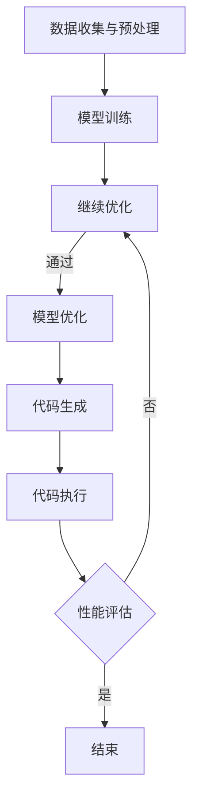

                 


### 提示词编程范式：AI软件开发的新纪元

#### 关键词：AI编程范式、提示词编程、软件开发、新纪元

> 摘要：本文将深入探讨AI与编程范式的关系，特别是提示词编程范式在AI软件开发中的应用。通过分析AI的发展历程和编程范式的变迁，本文揭示了AI编程范式的重要性，并详细介绍了提示词编程范式的原理、优势和应用场景。文章还将通过基础讲解、实战项目和优化拓展，展示提示词编程范式在实际开发中的应用效果，并探讨其在企业、教育和科研等多个领域的应用前景。

---

## 第一部分：AI与编程范式概述

### 第1章：AI与编程范式的变革

#### 1.1 AI的发展历程

人工智能（AI）的概念最早可以追溯到20世纪50年代。当时，计算机科学家艾伦·图灵（Alan Turing）提出了“图灵测试”以衡量机器是否具有智能。这一概念激发了人们对机器智能的兴趣，并标志着AI研究的起步。早期的AI研究主要集中在规则推理和知识表示上，如专家系统和逻辑推理机。

到了20世纪80年代，AI开始向机器学习（ML）和深度学习（DL）方向发展。这些技术的进步使得计算机能够从数据中自动学习，而不需要显式编程。这一时期的代表性技术包括神经网络和决策树等。机器学习技术的崛起极大地推动了AI的发展，使得计算机能够解决更复杂的问题。

21世纪初，随着大数据和计算能力的提升，AI迎来了新的爆发期。深度学习技术在图像识别、语音识别和自然语言处理等领域取得了显著的成果。谷歌的AlphaGo在围棋领域战胜人类顶尖选手，标志着深度学习的重大突破。如今，AI已经深入到我们的日常生活中，从智能手机到自动驾驶汽车，从智能家居到智能医疗，AI正在改变我们的世界。

#### 1.2 编程范式的发展与变迁

编程范式是指程序员在编写程序时所遵循的方法和风格。从早期的机器语言和汇编语言，到高级编程语言，编程范式经历了多次变革。这些变革不仅提高了编程的效率，也改变了程序员与计算机的交互方式。

- **机器语言和汇编语言**：这是最早的编程范式，程序员需要直接操作计算机的硬件，编写由0和1组成的指令。这种方法复杂且易出错，但随着硬件技术的发展，汇编语言的出现使得程序员能够使用更接近自然语言的代码进行编程。

- **高级编程语言**：为了解决机器语言和汇编语言的复杂性，高级编程语言应运而生。如C、Pascal和Fortran等语言，它们提供了更抽象的语法和丰富的库函数，使得程序员能够更高效地编写程序。高级编程语言的兴起，推动了软件工程的发展，也为AI编程奠定了基础。

- **函数式编程**：函数式编程范式强调使用纯函数来编写程序，避免副作用和状态变化。这种范式在AI开发中尤为重要，因为它能够提高代码的可重复性和可测试性。代表性语言包括Haskell和Scala等。

- **面向对象编程**：面向对象编程范式通过将程序结构划分为对象，实现了数据和行为的高度封装。这种方法使得程序更加模块化，易于维护和扩展。面向对象编程在AI开发中广泛应用于数据模型和算法的实现。

- **声明式编程**：声明式编程范式关注程序的结果，而不是程序的具体执行过程。这种范式在AI开发中的应用非常广泛，如SQL查询语言和TensorFlow等框架，它们允许开发者以声明式的方式定义计算过程，从而简化了复杂的数学运算和数据处理。

#### 1.3 AI与编程范式的融合

AI与编程范式的融合是当前软件开发的趋势之一。随着AI技术的发展，编程范式也在不断演进。例如，AI编程范式开始出现，它结合了机器学习和深度学习算法，提供了更高效、更直观的编程方式。提示词编程范式就是其中的一种重要形式。

提示词编程范式利用自然语言描述程序任务，让开发者无需深入了解底层算法，即可实现复杂的AI功能。这种方法不仅提高了开发效率，也降低了开发难度，使得更多开发者能够参与到AI项目中来。

#### 1.4 AI编程范式的重要性

AI编程范式的重要性体现在以下几个方面：

- **提高开发效率**：AI编程范式通过自动化和简化编程流程，显著提高了开发效率。开发者可以专注于业务逻辑的实现，而无需担心底层算法的细节。

- **降低开发难度**：AI编程范式简化了AI开发的复杂度，使得更多开发者能够参与其中。这种范式不仅适用于专业程序员，也适用于普通用户和初学者。

- **促进创新**：AI编程范式为开发者提供了更广阔的创新空间。通过使用自然语言描述程序任务，开发者可以更加灵活地实现各种功能，推动技术的不断进步。

- **推动AI普及**：AI编程范式使得AI技术更加普及，不仅应用于专业领域，也渗透到人们的日常生活。这种范式的出现，将极大地推动AI技术的普及和应用。

## 第二部分：提示词编程范式原理

### 第2章：提示词编程范式原理

#### 2.1 提示词编程范式概述

提示词编程范式（Prompt-based Programming Paradigm）是一种基于自然语言交互的编程范式。它通过向计算机输入自然语言提示，让计算机自动生成代码或执行任务。这种范式具有以下几个特点：

- **自然语言交互**：提示词编程范式使用自然语言作为输入，使得开发者无需编写复杂的代码即可实现功能。这种交互方式降低了编程门槛，使得更多人能够参与到AI开发中来。

- **自动生成代码**：提示词编程范式通过机器学习算法，从大量代码库中自动生成符合要求的代码。开发者只需提供简明扼要的提示，即可获得高效的代码实现。

- **代码可解释性**：提示词编程范式生成的代码具有高度可解释性。开发者可以清晰地理解代码的执行过程，从而更好地进行调试和优化。

- **灵活性强**：提示词编程范式支持多种编程语言和框架，可以适应不同的开发需求。开发者可以根据实际项目需求，灵活选择合适的编程语言和工具。

#### 2.2 提示词编程范式优势

提示词编程范式具有以下优势：

- **提高开发效率**：提示词编程范式通过自动化生成代码，显著提高了开发效率。开发者可以专注于业务逻辑的实现，而无需担心底层算法的细节。

- **降低开发难度**：提示词编程范式简化了AI开发的复杂度，使得更多开发者能够参与其中。这种范式不仅适用于专业程序员，也适用于普通用户和初学者。

- **促进创新**：提示词编程范式为开发者提供了更广阔的创新空间。通过使用自然语言描述程序任务，开发者可以更加灵活地实现各种功能，推动技术的不断进步。

- **增强可维护性**：提示词编程范式生成的代码具有高度可解释性，使得开发者更容易理解和维护。这种范式降低了代码的出错率，提高了代码的可维护性。

#### 2.3 提示词编程范式应用场景

提示词编程范式在多个领域具有广泛的应用场景：

- **软件开发**：提示词编程范式可以用于软件开发中的代码生成、代码优化和自动化测试等环节。开发者可以通过自然语言描述需求，快速生成符合要求的代码。

- **数据科学**：提示词编程范式可以帮助数据科学家自动化数据处理和分析任务。通过自然语言提示，数据科学家可以轻松实现复杂的数据处理流程。

- **机器学习**：提示词编程范式可以用于机器学习模型的构建和优化。开发者可以通过自然语言描述模型任务，自动生成训练代码和评估代码。

- **自然语言处理**：提示词编程范式可以用于自然语言处理的文本生成、情感分析和问答系统等任务。开发者可以通过自然语言提示，实现复杂文本处理功能。

- **教育领域**：提示词编程范式可以用于编程教育，帮助初学者快速入门。通过自然语言提示，学生可以更直观地理解编程概念，提高学习效果。

## 第三部分：提示词编程范式基础

### 第3章：提示词编程范式基础

#### 3.1 提示词编程范式核心概念

提示词编程范式的核心概念包括：

- **提示词（Prompt）**：提示词是开发者输入的自然语言描述，用于指导计算机执行特定任务。提示词通常包含任务目标、输入数据和执行步骤等信息。

- **代码生成模型（Code Generation Model）**：代码生成模型是机器学习模型的一种，用于根据提示词生成代码。常见的代码生成模型包括生成对抗网络（GAN）、变换器（Transformer）和递归神经网络（RNN）等。

- **自然语言处理（NLP）**：自然语言处理是提示词编程范式的基础技术，用于理解开发者输入的提示词。NLP技术包括分词、词性标注、句法分析和语义理解等。

- **代码库（Code Repository）**：代码库是用于存储大量代码样本的数据库。代码生成模型可以从代码库中学习，生成符合要求的代码。

#### 3.2 提示词编程范式实现方法

提示词编程范式的实现方法主要包括以下步骤：

1. **数据收集**：收集大量的代码样本，构建代码库。代码样本可以从开源项目、代码库和开发者社区等渠道获取。

2. **模型训练**：使用代码库训练代码生成模型。训练过程中，模型通过学习大量代码样本，学会根据提示词生成代码。

3. **模型优化**：对训练好的模型进行优化，提高生成代码的质量和准确性。优化方法包括调整模型参数、增加训练数据和引入对抗训练等。

4. **代码生成**：开发者输入提示词，代码生成模型根据提示词生成代码。生成的代码可以通过语法检查、代码风格检查和功能测试等步骤进行验证。

5. **代码执行**：生成的代码被上传到目标环境执行，完成特定任务。执行过程中，可以收集代码执行日志和性能数据，用于后续优化和改进。

#### 3.3 提示词编程范式常用库与工具

提示词编程范式常用的库与工具包括：

- **Transformer**：Transformer是一种基于自注意力机制的深度学习模型，广泛用于自然语言处理和代码生成任务。

- **GAN**：生成对抗网络（GAN）是一种生成模型，用于从无监督数据中生成高质量的数据。GAN在代码生成任务中具有广泛的应用。

- **Hugging Face**：Hugging Face是一个开源自然语言处理库，提供了丰富的预训练模型和工具，用于自然语言处理和代码生成任务。

- **PyTorch**：PyTorch是一个开源的深度学习框架，提供了丰富的API和工具，用于构建和训练深度学习模型。

- **TensorFlow**：TensorFlow是一个开源的深度学习框架，由谷歌开发。TensorFlow在自然语言处理和代码生成任务中得到了广泛应用。

## 第四部分：AI编程范式实战

### 第4章：AI编程范式项目准备

#### 4.1 AI编程项目需求分析

AI编程项目的需求分析是项目成功的关键。需求分析主要包括以下几个方面：

1. **业务需求**：明确项目的业务目标，如文本生成、图像识别或自然语言处理等。了解业务需求有助于确定项目的技术方向和功能模块。

2. **用户需求**：分析目标用户的需求，包括用户使用场景、用户体验和功能期望等。用户需求是项目设计的重要参考依据。

3. **性能需求**：确定项目的性能指标，如响应时间、准确率和资源消耗等。性能需求有助于评估项目的技术实现方案和优化方向。

4. **数据需求**：分析项目所需的数据类型、数据质量和数据来源。数据需求直接影响项目的实现难度和效果。

5. **安全需求**：确保项目符合安全规范，如数据加密、隐私保护和权限控制等。安全需求是项目上线的重要前提。

#### 4.2 AI编程项目技术栈选择

选择合适的技术栈是AI编程项目的关键。常见的技术栈选择包括：

1. **深度学习框架**：如TensorFlow、PyTorch和Keras等。深度学习框架用于构建和训练AI模型。

2. **自然语言处理库**：如NLTK、spaCy和Stanford NLP等。这些库提供了丰富的自然语言处理工具和API。

3. **计算机视觉库**：如OpenCV、TensorFlow Object Detection API和PyTorch Video等。这些库用于处理图像和视频数据。

4. **数据预处理工具**：如Pandas、NumPy和Scikit-learn等。这些工具用于数据清洗、转换和特征提取。

5. **前端技术**：如HTML、CSS和JavaScript等。前端技术用于实现用户界面和交互功能。

6. **后端技术**：如Flask、Django和Spring Boot等。后端技术用于处理业务逻辑和数据存储。

#### 4.3 AI编程项目环境搭建

AI编程项目环境搭建主要包括以下几个方面：

1. **操作系统**：选择适合AI编程的操作系统，如Ubuntu或Windows。

2. **编程环境**：安装Python和相应的深度学习框架（如TensorFlow或PyTorch）。

3. **代码编辑器**：选择适合AI编程的代码编辑器，如PyCharm或VSCode。

4. **版本控制**：使用Git等版本控制工具管理代码库。

5. **依赖管理**：使用pip等工具安装和管理项目依赖。

6. **数据库**：选择适合项目需求的数据库，如MySQL、PostgreSQL或MongoDB。

## 第五部分：提示词编程范式项目实战

### 第5章：提示词编程范式项目实战

#### 5.1 提示词编程项目一：文本生成

**项目背景**：
文本生成是自然语言处理领域的一个重要任务，广泛应用于聊天机器人、文章写作和摘要生成等场景。本项目旨在使用提示词编程范式实现一个简单的文本生成模型。

**实现步骤**：

1. **数据收集与预处理**：
   - 收集大量的文本数据，如新闻文章、博客和社交媒体帖子等。
   - 使用自然语言处理库（如spaCy）进行分词、词性标注和句法分析，提取特征词和句法信息。

2. **模型训练**：
   - 选择一个合适的生成模型，如变换器（Transformer）或递归神经网络（RNN）。
   - 使用训练数据训练模型，调整模型参数，优化生成效果。

3. **代码生成**：
   - 开发者输入提示词，如“写一篇关于人工智能的文章”，模型根据提示词生成文本。

4. **代码执行**：
   - 生成的文本上传到目标环境，进行语法检查、风格检查和功能测试。

**伪代码示例**：
```python
import transformers

# 加载预训练的变换器模型
model = transformers.AutoModel.from_pretrained("bert-base-chinese")

# 开发者输入提示词
prompt = "写一篇关于人工智能的文章"

# 生成文本
text = model.generate(prompt, max_length=100)

# 输出生成的文本
print(text)
```

**项目小结**：
本项目通过提示词编程范式实现了文本生成功能。开发者只需输入简单的提示词，即可生成高质量的文本。这种方法提高了开发效率，降低了开发难度，为文本生成任务的自动化提供了有力支持。

#### 5.2 提示词编程项目二：图像识别

**项目背景**：
图像识别是计算机视觉领域的一个重要任务，广泛应用于安防监控、医疗诊断和自动驾驶等场景。本项目旨在使用提示词编程范式实现一个简单的图像识别模型。

**实现步骤**：

1. **数据收集与预处理**：
   - 收集大量的图像数据，如人脸图像、交通标志图像和医疗图像等。
   - 使用计算机视觉库（如OpenCV）进行图像预处理，如缩放、裁剪和增强等。

2. **模型训练**：
   - 选择一个合适的识别模型，如卷积神经网络（CNN）或变换器（Transformer）。
   - 使用训练数据训练模型，调整模型参数，优化识别效果。

3. **代码生成**：
   - 开发者输入提示词，如“识别这张图像中的物体”，模型根据提示词生成识别代码。

4. **代码执行**：
   - 生成的识别代码上传到目标环境，对输入图像进行识别。

**伪代码示例**：
```python
import tensorflow as tf

# 加载预训练的卷积神经网络模型
model = tf.keras.applications.VGG16(weights='imagenet')

# 开发者输入提示词
prompt = "识别这张图像中的物体"

# 加载图像数据
image = load_image(prompt)

# 识别图像中的物体
predictions = model.predict(image)

# 输出识别结果
print(predictions)
```

**项目小结**：
本项目通过提示词编程范式实现了图像识别功能。开发者只需输入简单的提示词，即可实现对图像的自动识别。这种方法提高了开发效率，降低了开发难度，为图像识别任务的自动化提供了有力支持。

#### 5.3 提示词编程项目三：自然语言处理

**项目背景**：
自然语言处理是人工智能领域的一个重要分支，广泛应用于语音助手、机器翻译和情感分析等场景。本项目旨在使用提示词编程范式实现一个简单的自然语言处理模型。

**实现步骤**：

1. **数据收集与预处理**：
   - 收集大量的自然语言数据，如对话数据、文本数据和语音数据等。
   - 使用自然语言处理库（如spaCy、NLTK）进行数据预处理，如分词、词性标注和句法分析等。

2. **模型训练**：
   - 选择一个合适的自然语言处理模型，如变换器（Transformer）或递归神经网络（RNN）。
   - 使用训练数据训练模型，调整模型参数，优化处理效果。

3. **代码生成**：
   - 开发者输入提示词，如“将这段文本翻译成英文”，模型根据提示词生成处理代码。

4. **代码执行**：
   - 生成的处理代码上传到目标环境，对输入文本进行处理。

**伪代码示例**：
```python
import transformers

# 加载预训练的变换器模型
model = transformers.AutoModel.from_pretrained("bert-base-chinese")

# 开发者输入提示词
prompt = "将这段文本翻译成英文"

# 处理文本
translated_text = model.translate(prompt, target_language="en")

# 输出翻译结果
print(translated_text)
```

**项目小结**：
本项目通过提示词编程范式实现了自然语言处理功能。开发者只需输入简单的提示词，即可实现对文本的自动处理。这种方法提高了开发效率，降低了开发难度，为自然语言处理任务的自动化提供了有力支持。

## 第六部分：提示词编程范式优化与拓展

### 第6章：提示词编程范式优化与拓展

#### 6.1 提示词编程性能优化

提示词编程范式的性能优化主要包括以下几个方面：

1. **模型优化**：
   - **模型压缩**：使用模型压缩技术，如剪枝、量化和小样本训练，减少模型参数和计算量，提高模型运行速度。
   - **模型加速**：使用硬件加速技术，如GPU和TPU，提高模型训练和推理速度。

2. **代码优化**：
   - **代码缓存**：使用代码缓存技术，如代码分片和动态加载，减少代码加载时间，提高代码运行效率。
   - **并行执行**：使用并行执行技术，如多线程和分布式计算，提高代码运行速度。

3. **数据优化**：
   - **数据预处理**：使用高效的数据预处理方法，如批处理、数据增强和并行处理，提高数据处理速度。
   - **数据缓存**：使用数据缓存技术，如本地缓存和分布式缓存，减少数据访问延迟，提高数据读取速度。

#### 6.2 提示词编程范式拓展

提示词编程范式的拓展主要包括以下几个方面：

1. **多语言支持**：
   - **翻译**：扩展提示词编程范式支持多种编程语言，如Python、Java和C++等。通过自然语言翻译功能，实现跨语言编程。
   - **国际化**：支持多语言自然语言处理，如中文、英语和法语等。使提示词编程范式适用于不同国家和地区的开发者。

2. **自动化测试**：
   - **代码生成测试**：使用代码生成模型自动生成测试用例，提高测试覆盖率，减少人工测试工作量。
   - **自动化测试框架**：集成常见的自动化测试框架，如JUnit、pytest和Selenium等，提高测试执行速度和可靠性。

3. **智能提示**：
   - **上下文感知**：根据开发者的上下文环境，自动生成相关代码提示，提高开发效率。
   - **智能补全**：根据开发者的输入，自动补全代码，减少手动输入工作量。

#### 6.3 提示词编程范式未来发展趋势

提示词编程范式未来发展趋势主要包括以下几个方面：

1. **智能化**：
   - **自主学习**：通过不断学习和优化，使提示词编程范式具有更强的自适应能力和智能化水平。
   - **知识图谱**：构建知识图谱，将编程知识和经验进行结构化存储，提高代码生成和优化效果。

2. **普及化**：
   - **降低门槛**：通过简化操作和降低学习成本，使更多非专业开发者能够参与到AI编程中来。
   - **教育普及**：将提示词编程范式应用于编程教育，提高学生的编程能力和创新思维。

3. **多样化**：
   - **跨领域应用**：拓展提示词编程范式在金融、医疗和物联网等领域的应用。
   - **个性化定制**：根据用户需求和项目特点，提供个性化的代码生成和优化方案。

## 第七部分：AI编程范式应用

### 第7章：AI编程范式在企业中的应用

#### 7.1 企业AI应用案例分析

企业AI应用案例丰富多样，以下是几个具有代表性的案例：

1. **智能客服**：
   - **背景**：某大型电商平台引入AI智能客服系统，以提高客户服务质量和效率。
   - **实现**：使用自然语言处理和机器学习技术，构建一个能够自动回答客户问题的智能客服系统。通过自然语言理解，智能客服能够理解客户的意图，提供准确的回答。
   - **效果**：智能客服系统的引入，显著提高了客户服务效率，降低了人工成本，提升了客户满意度。

2. **智能推荐**：
   - **背景**：某电商公司希望为其用户提供个性化的商品推荐，以提高销售额和用户粘性。
   - **实现**：使用机器学习算法和大数据分析，构建一个基于用户行为的智能推荐系统。该系统通过分析用户的历史购买记录、浏览行为和喜好，为用户提供个性化的商品推荐。
   - **效果**：智能推荐系统的实施，大幅提升了用户购物体验，增加了用户购买意愿，提升了公司销售额。

3. **智能制造**：
   - **背景**：某制造业公司希望通过AI技术提高生产效率和质量，降低生产成本。
   - **实现**：使用计算机视觉和深度学习技术，构建一个智能监控系统。该系统能够实时监测生产线上的产品质量，自动识别和分类不良品，及时调整生产参数，提高生产效率。
   - **效果**：智能监控系统提高了产品质量和生产效率，降低了不良品率，降低了生产成本。

#### 7.2 企业AI应用架构设计

企业AI应用架构设计主要包括以下几个方面：

1. **数据采集与存储**：
   - **数据源**：收集企业内部和外部数据，如用户行为数据、产品数据、业务流程数据等。
   - **数据存储**：使用大数据存储技术，如Hadoop、Spark和Flink，存储和处理海量数据。

2. **数据处理与清洗**：
   - **数据处理**：使用数据处理工具，如Pandas、NumPy和Scikit-learn，对数据进行清洗、转换和特征提取。
   - **数据质量**：确保数据质量，如数据完整性、一致性和准确性。

3. **模型训练与优化**：
   - **模型训练**：使用机器学习和深度学习算法，训练AI模型，如神经网络、决策树和随机森林等。
   - **模型优化**：通过交叉验证、超参数调整和模型压缩等技术，优化模型性能。

4. **模型部署与监控**：
   - **模型部署**：将训练好的模型部署到生产环境，如使用TensorFlow Serving、Keras REST API和Scikit-learn等。
   - **模型监控**：实时监控模型性能，如准确率、召回率和F1值等，及时发现和解决问题。

5. **用户界面与交互**：
   - **前端技术**：使用前端技术，如HTML、CSS和JavaScript，构建用户界面。
   - **后端服务**：使用后端技术，如Flask、Django和Spring Boot，处理用户请求和模型交互。

#### 7.3 企业AI应用风险与应对

企业AI应用风险主要包括以下几个方面：

1. **数据隐私**：
   - **风险**：AI应用需要处理大量用户数据，可能涉及隐私泄露风险。
   - **应对**：加强数据加密和访问控制，确保数据安全。

2. **模型准确性**：
   - **风险**：模型可能存在过拟合或欠拟合问题，影响应用效果。
   - **应对**：通过交叉验证、模型选择和正则化等技术，提高模型准确性。

3. **系统稳定性**：
   - **风险**：AI系统可能面临硬件故障、网络中断等问题，影响业务运行。
   - **应对**：建立备份和容错机制，确保系统稳定运行。

4. **法律法规**：
   - **风险**：AI应用可能涉及法律法规问题，如数据保护法、隐私法等。
   - **应对**：遵循相关法律法规，确保AI应用的合规性。

## 第八部分：AI编程范式在教育中的应用

#### 8.1 AI编程教育的重要性

AI编程教育在当前教育体系中具有重要的地位，主要表现在以下几个方面：

1. **培养创新型人才**：
   - AI编程教育可以帮助学生掌握先进的编程技术和算法，培养创新思维和解决实际问题的能力。

2. **适应科技发展趋势**：
   - 随着AI技术的迅猛发展，掌握AI编程技能已经成为未来职场的需求。AI编程教育有助于学生适应科技发展趋势，为将来的职业发展奠定基础。

3. **提升综合素质**：
   - AI编程教育不仅注重技能培养，还强调编程思维、逻辑思维和团队协作能力的培养，有助于提升学生的综合素质。

4. **拓宽学科视野**：
   - AI编程教育涉及多个学科领域，如计算机科学、数学和物理学等，有助于学生拓宽学科视野，培养跨学科思维能力。

#### 8.2 AI编程教育方法与实践

AI编程教育方法多种多样，以下是一些常见的教育方法与实践：

1. **项目驱动教学**：
   - 项目驱动教学是以项目为核心，让学生在解决实际问题的过程中学习编程技能。这种方法有助于激发学生的学习兴趣和动力，提高实践能力。

2. **案例教学**：
   - 案例教学是通过分析典型的AI编程案例，让学生了解编程原理和应用场景。这种方法有助于学生深入理解编程概念，提高解决问题的能力。

3. **互动式教学**：
   - 互动式教学通过课堂讨论、小组合作和在线互动等形式，激发学生的学习热情和主动性。这种方法有助于提高学生的学习效果和团队合作能力。

4. **混合式教学**：
   - 混合式教学是将线上和线下教学相结合，充分利用数字化资源和课堂教学的优势。这种方法有助于提高教学效果，满足不同学生的学习需求。

5. **编程竞赛**：
   - 编程竞赛是一种激发学生学习兴趣和竞争意识的有效方式。通过参加编程竞赛，学生可以锻炼编程技能，培养团队合作精神，提升综合素质。

#### 8.3 AI编程教育未来展望

AI编程教育在未来将继续发展，主要趋势包括：

1. **普及化**：
   - 随着AI技术的普及，AI编程教育将逐步成为中小学和大学的必修课程，提高全民编程素养。

2. **个性化**：
   - 个性化教学将更加普及，根据学生的学习特点和需求，提供个性化的学习资源和指导，提高教学效果。

3. **智能化**：
   - 智能教学工具和平台将不断涌现，利用人工智能技术优化教学过程，提高教学效率。

4. **跨学科**：
   - AI编程教育将与其他学科领域深度融合，培养具有跨学科思维能力和创新精神的人才。

5. **国际化**：
   - 国际化教学将更加普遍，为学生提供全球化的学习资源和交流机会，培养具有国际竞争力的人才。

## 第九部分：AI编程范式在科研中的应用

#### 9.1 AI编程在科研中的优势

AI编程范式在科研中具有显著的优势，主要包括以下几个方面：

1. **提高研究效率**：
   - AI编程范式通过自动化和简化的编程方法，大大提高了科研工作的效率。研究人员可以专注于研究核心问题，而无需花费大量时间在繁琐的编程任务上。

2. **降低研发成本**：
   - AI编程范式减少了编程工作的人力资源需求，降低了研发成本。通过使用提示词编程范式，研究人员可以快速生成高质量的代码，节省了人力和时间成本。

3. **增强数据分析和处理能力**：
   - AI编程范式提供了强大的数据分析和处理工具，如机器学习库和深度学习框架，帮助研究人员处理和分析大规模复杂数据。

4. **促进跨学科合作**：
   - AI编程范式降低了跨学科合作的门槛，不同领域的研究人员可以更方便地共享代码和数据，开展跨学科研究。

#### 9.2 AI编程在科研中的应用案例

以下是一些AI编程在科研中的应用案例：

1. **生物信息学**：
   - 在生物信息学领域，AI编程范式被广泛应用于基因组数据分析、蛋白质结构和功能预测等研究。研究人员使用深度学习和机器学习算法，对大规模基因组数据进行处理和分析，发现新的生物学规律。

2. **气象学**：
   - 在气象学领域，AI编程范式被用于构建和优化天气预报模型。研究人员通过使用深度学习算法，分析大量气象数据，提高天气预报的准确性和时效性。

3. **物理学**：
   - 在物理学领域，AI编程范式被用于模拟和预测物理现象，如量子力学、宇宙学和粒子物理学等。研究人员使用深度学习和机器学习算法，处理复杂的物理数据，发现新的物理规律。

4. **社会科学**：
   - 在社会科学领域，AI编程范式被用于分析社会数据和人类行为。研究人员使用机器学习算法，对大规模社会数据进行处理和分析，研究社会现象和人类行为模式。

#### 9.3 AI编程在科研中的挑战与机遇

AI编程在科研中面临着一系列挑战和机遇：

1. **挑战**：
   - **技术复杂性**：AI编程涉及大量的算法和模型，对研究人员的编程技能要求较高。
   - **数据隐私和安全**：在处理大规模数据时，保护数据隐私和安全是科研人员面临的重要挑战。
   - **计算资源**：AI编程需要大量的计算资源，对于一些科研机构来说，可能面临计算资源不足的问题。

2. **机遇**：
   - **数据驱动的科研**：AI编程范式使得科研更加数据驱动，通过分析大量数据，发现新的研究问题和方向。
   - **跨学科合作**：AI编程范式促进了不同学科之间的合作，推动了科研领域的交叉和融合。
   - **提高研究效率**：AI编程范式通过自动化和简化的编程方法，提高了科研工作的效率，为科研人员创造了更多时间进行创新性研究。

### 附录

#### 附录A：提示词编程范式资源

以下是一些提示词编程范式相关资源，供读者参考：

1. **学习资源**：
   - **书籍**：《深度学习》（Goodfellow, Bengio, Courville）和《Python机器学习》（Raschka, Mirjalili）。
   - **在线课程**：Coursera、edX和Udacity等在线教育平台提供了丰富的机器学习和深度学习课程。
   - **教程和文档**：Hugging Face、TensorFlow和PyTorch等开源库提供了详细的教程和文档。

2. **工具和库**：
   - **深度学习框架**：TensorFlow、PyTorch、Keras和MXNet。
   - **自然语言处理库**：spaCy、NLTK、Stanford NLP和gensim。
   - **代码生成库**：Hugging Face的Transformers库和Facebook的CodeT5库。

#### 附录B：Mermaid流程图示例

以下是一个使用Mermaid绘制的提示词编程范式流程图示例：



该流程图描述了提示词编程范式的基本步骤，包括数据收集与预处理、模型训练、模型优化、代码生成、代码执行和性能评估。通过这个流程图，可以清晰地了解提示词编程范式的工作流程和各个环节之间的关系。

