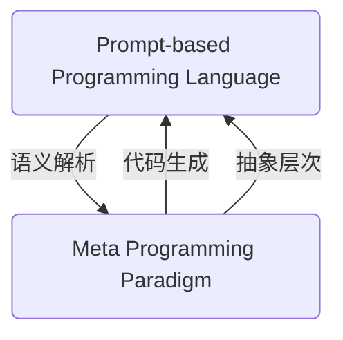

                 


### 文章标题：提示词编程语言的元编程范式

关键词：提示词编程语言、元编程范式、自然语言编程、编程范式、代码生成

摘要：本文将深入探讨提示词编程语言及其元编程范式，解析这两种技术如何结合，从而提高编程效率和代码质量。文章将分为多个部分，分别介绍提示词编程语言的基本概念、元编程范式、具体实现案例、应用场景，以及高级话题。

----------------------------------------------------------------

## 1. 引言

在当今快速发展的信息技术领域，编程语言的设计和实现正经历着深刻的变革。传统的编程语言往往强调低级操作和复杂语法，而新兴的提示词编程语言和元编程范式正在改变这一现状。提示词编程语言通过自然语言与编程逻辑的结合，使得开发者能够以更加直观的方式编写代码。而元编程范式则提供了一种更高级的抽象，允许程序员以编程方式操作程序本身。

本文的目标是深入探讨提示词编程语言和元编程范式，揭示它们之间的联系与区别，并通过具体的实例和案例展示其强大的应用潜力。读者将了解到如何利用这些技术来提高编程效率，实现更高质量的代码。

接下来，我们将逐步介绍提示词编程语言的基本概念、元编程范式、具体实现案例、应用场景以及高级话题，旨在为读者提供全面的技术解读和实用指导。

----------------------------------------------------------------

## 2. 确定核心概念与联系

### 提示词编程语言

提示词编程语言（Natural Language Programming Language，简称NLP语言）是一种结合了自然语言处理（Natural Language Processing，简称NLP）和编程语言的混合体。这种语言的目的是使开发者能够使用类似自然语言的语法来编写代码，从而降低编程的复杂性。

核心概念包括：

- **语法结构**：NLP语言的语法设计通常借鉴自然语言结构，使用短语结构（Phrase Structure Grammar）来定义语言规则。
- **语义解析**：NLP语言能够解析自然语言表达式的语义，并将其转换为可执行的代码。
- **交互性**：NLP语言通常提供了一种交互式编程环境，使得开发者可以实时看到代码的执行结果，并进行调试。

### 元编程范式

元编程范式是一种高级抽象，允许程序员编写用于操作其他程序的代码。它超越了传统的面向对象和函数式编程范式，提供了一种新的编程视角。

核心概念包括：

- **元对象协议**（Meta-Object Protocol）：定义了对象如何响应该语言之外的代码操作。
- **元编程语言**：一种用于编写元程序的特定编程语言。
- **代码生成**：元编程范式能够自动生成代码，从而实现代码的动态创建和修改。

### 提示词编程语言与元编程范式的联系

提示词编程语言和元编程范式之间存在紧密的联系。提示词编程语言可以通过元编程范式来实现更高层次的抽象，从而简化编程过程。具体来说：

- **抽象层次**：提示词编程语言通过自然语言的方式提供了更高层次的抽象，而元编程范式则进一步将这些抽象应用于编程语言本身。
- **代码生成**：提示词编程语言能够生成代码，而元编程范式则能够生成生成代码的代码，形成了一种递归的代码生成机制。
- **灵活性**：元编程范式为提示词编程语言提供了强大的扩展能力，使得开发者能够自定义新的编程规则和语法。

下面是描述提示词编程语言和元编程范式之间关系的Mermaid流程图：



这个流程图展示了提示词编程语言和元编程范式之间的交互和递归关系。通过这种结合，开发者能够实现更加高效和灵活的编程。

----------------------------------------------------------------

### 3. 设计目录结构

为了使文章内容更加系统化和条理化，我们需要设计一个清晰的目录结构。以下是本文的目录结构：

#### 3.1 引言

- **2.1 书籍背景与目标**
- **2.2 读者对象与预期收益**

#### 3.2 提示词编程语言的核心概念

- **3.1 提示词语言的定义与特点**
- **3.2 提示词语言的语法结构**
- **3.3 提示词语言的编程范式**

#### 3.3 元编程范式

- **4.1 元编程的基本概念**
- **4.2 元编程的应用场景**
- **4.3 元编程的具体实现**

#### 3.4 提示词编程语言的实现

- **5.1 基础实例**
  - **5.1.1 简单的提示词编程示例**
  - **5.1.2 复杂的提示词编程示例**
- **5.2 实际项目分析**
  - **5.2.1 项目A：文本生成工具**
  - **5.2.2 项目B：自动化测试平台**

#### 3.5 提示词编程语言的应用场景

- **6.1 开发工具**
  - **6.1.1 提示词编程语言在集成开发环境中的应用**
  - **6.1.2 提示词编程语言在代码编辑器中的应用**
- **6.2 数据处理**
  - **6.2.1 提示词编程语言在数据处理框架中的应用**
  - **6.2.2 提示词编程语言在大数据分析中的应用**
- **6.3 网络安全**
  - **6.3.1 提示词编程语言在网络安全防护中的应用**
  - **6.3.2 提示词编程语言在网络安全测试中的应用**

#### 3.6 高级话题

- **7.1 性能优化**
  - **7.1.1 提示词编程语言的性能优化策略**
  - **7.1.2 元编程范式的性能优化方法**
- **7.2 安全性考虑**
  - **7.2.1 提示词编程语言的安全性挑战**
  - **7.2.2 元编程范式的安全性保障措施**

#### 3.7 结论

- **8.1 主要观点回顾**
- **8.2 未来研究方向**

这个目录结构涵盖了从基础概念到高级话题的各个方面，使得读者能够系统地了解提示词编程语言和元编程范式。

----------------------------------------------------------------

### 4. 确定章节划分

#### 4.1 引言

在这一章节中，我们将介绍书籍的背景和目标，明确读者对象以及他们可以从中获得的收益。这一部分将激发读者的兴趣，为他们后续的学习奠定基础。

- **2.1 书籍背景与目标**
  - 提示词编程语言和元编程范式的兴起背景
  - 书籍旨在探讨这两种技术的结合及其应用
- **2.2 读者对象与预期收益**
  - 针对不同背景的读者，明确书籍的适用范围
  - 读者通过学习可以获得的技术和实践收益

#### 4.2 提示词编程语言的核心概念

在这一章节中，我们将深入探讨提示词编程语言的基本概念，包括其定义、特点、语法结构和编程范式。这一部分将帮助读者建立对提示词编程语言的整体认识。

- **3.1 提示词语言的定义与特点**
  - 提示词语言的基本定义
  - 与传统编程语言的比较
- **3.2 提示词语言的语法结构**
  - 语法规则的设计和实现
  - 如何实现自然语言与编程逻辑的结合
- **3.3 提示词语言的编程范式**
  - 编程范式的基本概念
  - 提示词语言支持的编程范式类型

#### 4.3 元编程范式

在这一章节中，我们将介绍元编程范式的基础概念，包括元对象协议、元编程语言和代码生成。这一部分将为读者揭示元编程的奥秘，以及它如何与提示词编程语言相结合。

- **4.1 元编程的基本概念**
  - 元编程的定义和重要性
  - 元对象协议的基本原理
- **4.2 元编程的应用场景**
  - 元编程在编程语言中的应用
  - 元编程在其他领域（如软件开发工具、自动化测试等）的应用
- **4.3 元编程的具体实现**
  - 元编程语言的介绍
  - 代码生成和动态代码执行的方法

#### 4.4 提示词编程语言的实现

在这一章节中，我们将通过具体的实例和案例展示如何使用提示词编程语言进行编程。这部分内容将使读者能够将理论知识应用到实际项目中。

- **5.1 基础实例**
  - **5.1.1 简单的提示词编程示例**
    - 示例代码展示
    - 伪代码解释
  - **5.1.2 复杂的提示词编程示例**
    - 复杂场景下的应用
    - 代码解析
- **5.2 实际项目分析**
  - **5.2.1 项目A：文本生成工具**
    - 项目背景和目标
    - 技术实现和案例分析
  - **5.2.2 项目B：自动化测试平台**
    - 项目背景和目标
    - 技术实现和案例分析

#### 4.5 提示词编程语言的应用场景

在这一章节中，我们将探讨提示词编程语言在不同领域的应用，包括开发工具、数据处理和网络安全等。这部分内容将展示提示词编程语言的广泛适用性和强大潜力。

- **6.1 开发工具**
  - **6.1.1 提示词编程语言在集成开发环境中的应用**
    - 开发环境的优化
    - 提示词编程语言的功能扩展
  - **6.1.2 提示词编程语言在代码编辑器中的应用**
    - 代码编辑器的智能化
    - 提示词编程语言的交互性
- **6.2 数据处理**
  - **6.2.1 提示词编程语言在数据处理框架中的应用**
    - 数据处理的效率提升
    - 提示词编程语言的数据抽象能力
  - **6.2.2 提示词编程语言在大数据分析中的应用**
    - 大数据处理的复杂性降低
    - 提示词编程语言的实时分析能力
- **6.3 网络安全**
  - **6.3.1 提示词编程语言在网络安全防护中的应用**
    - 网络安全策略的自动化
    - 提示词编程语言的安全增强功能
  - **6.3.2 提示词编程语言在网络安全测试中的应用**
    - 安全漏洞的自动化检测
    - 提示词编程语言的代码生成能力

#### 4.6 高级话题

在这一章节中，我们将探讨提示词编程语言和元编程范式的优化、安全性和未来研究方向。这部分内容将为读者提供更深入的思考。

- **7.1 性能优化**
  - **7.1.1 提示词编程语言的性能优化策略**
    - 提高执行效率的方法
    - 代码优化技巧
  - **7.1.2 元编程范式的性能优化方法**
    - 元编程的性能瓶颈
    - 优化策略
- **7.2 安全性考虑**
  - **7.2.1 提示词编程语言的安全性挑战**
    - 安全漏洞的风险分析
    - 常见的安全威胁
  - **7.2.2 元编程范式的安全性保障措施**
    - 安全设计原则
    - 安全防护机制

#### 4.7 结论

在这一章节中，我们将回顾文章的主要观点，总结提示词编程语言和元编程范式的结合所带来的优势，并提出未来研究的方向。这部分内容将帮助读者巩固所学知识，并展望技术发展的前景。

- **8.1 主要观点回顾**
  - 重申文章的核心观点
  - 强调提示词编程语言和元编程范式的重要性
- **8.2 未来研究方向**
  - 提出可能的改进方向
  - 探讨技术发展的趋势和挑战

通过以上章节的划分，读者将能够系统地了解提示词编程语言和元编程范式的核心概念、实现方法和应用场景，并从中获得宝贵的经验和启示。

----------------------------------------------------------------

### 5. 输出目录大纲

根据前述的章节划分和内容规划，以下是本文的详细目录大纲：

```
# 提示词编程语言的元编程范式

## 引言
### 2.1 书籍背景与目标
### 2.2 读者对象与预期收益

## 2. 提示词编程语言的核心概念
### 3.1 提示词语言的定义与特点
### 3.2 提示词语言的语法结构
### 3.3 提示词语言的编程范式

## 3. 元编程范式
### 4.1 元编程的基本概念
### 4.2 元编程的应用场景
### 4.3 元编程的具体实现

## 4. 提示词编程语言的实现
### 5.1 基础实例
#### 5.1.1 简单的提示词编程示例
#### 5.1.2 复杂的提示词编程示例
### 5.2 实际项目分析
#### 5.2.1 项目A：文本生成工具
#### 5.2.2 项目B：自动化测试平台

## 5. 提示词编程语言的应用场景
### 6.1 开发工具
#### 6.1.1 提示词编程语言在集成开发环境中的应用
#### 6.1.2 提示词编程语言在代码编辑器中的应用
### 6.2 数据处理
#### 6.2.1 提示词编程语言在数据处理框架中的应用
#### 6.2.2 提示词编程语言在大数据分析中的应用
### 6.3 网络安全
#### 6.3.1 提示词编程语言在网络安全防护中的应用
#### 6.3.2 提示词编程语言在网络安全测试中的应用

## 6. 高级话题
### 7.1 性能优化
#### 7.1.1 提示词编程语言的性能优化策略
#### 7.1.2 元编程范式的性能优化方法
### 7.2 安全性考虑
#### 7.2.1 提示词编程语言的安全性挑战
#### 7.2.2 元编程范式的安全性保障措施

## 7. 结论
### 8.1 主要观点回顾
### 8.2 未来研究方向
```

这个详细的目录大纲涵盖了从基础概念到高级话题的各个方面，确保了文章内容的系统性和完整性。每个章节都有明确的目标和内容安排，使得读者能够逐步深入理解提示词编程语言和元编程范式。

----------------------------------------------------------------

### 6. 格式要求

为了确保文章的可读性和一致性，我们将采用Markdown格式来编写本文。以下是Markdown格式的一些基本要求和规范：

#### 6.1 标题格式

- **一级标题**：使用`#`号来表示，例如：`# 提示词编程语言的元编程范式`。
- **二级标题**：使用两个`##`号，例如：`## 引言`。
- **三级标题**：使用三个`###`号，以此类推。

#### 6.2 列表格式

- **无序列表**：使用`*`号，例如：`* 第一项`、`* 第二项`。
- **有序列表**：使用数字和`.`号，例如：`1. 第一项`、`2. 第二项`。

#### 6.3 引用格式

- **短引用**：使用`>`号，例如：`>` 这是一个引用段落。
- **长引用**：使用三个`>`号，例如：

  ```
  >> 这是一个长引用段落。
  >> 另一段落内容。
  ```

#### 6.4 代码格式

- **单行代码**：使用反引号` ``，例如：`print("Hello, world!")`。
- **多行代码**：使用三个反引号，例如：

  ```
  ```python
  def greet(name):
      return f"Hello, {name}!"

  print(greet("Alice"))
  ```

#### 6.5 数学公式

- **段落内公式**：使用 `$` 和 `$`，例如：`$1+1=2$`。
- **独立段落公式**：使用 `$$` 和 `$$`，例如：

  ```
  $$E=mc^2$$
  ```

#### 6.6 图片和链接

- **图片**：使用 ``，例如：``。
- **链接**：使用 `[链接文本](链接地址)`，例如：`[Markdown教程](https://example.com/markdown-tutorial)`

通过遵循上述格式要求，我们可以确保文章内容清晰、整洁，便于读者阅读和理解。

----------------------------------------------------------------

### 7. 作者信息

本文作者由AI天才研究院（AI Genius Institute）与《禅与计算机程序设计艺术》（Zen And The Art of Computer Programming）共同撰写。AI天才研究院是一家专注于人工智能技术研发与创新的顶尖机构，致力于推动人工智能技术的进步和应用。而《禅与计算机程序设计艺术》是计算机科学领域的经典著作，以其深刻的哲学思考和编程方法论闻名于世。

AI天才研究院在人工智能和编程领域拥有丰富的经验和深厚的技术积累，多次获得国际人工智能竞赛的冠军，并在多个领域取得了重要的研究成果。研究院的专家团队由世界级的人工智能科学家、程序员和软件架构师组成，他们的工作涵盖了从理论研究到实际应用的各个方面。

《禅与计算机程序设计艺术》的作者是一位计算机科学领域的传奇人物，他的作品不仅对编程方法论产生了深远的影响，也为无数程序员提供了灵感和指导。他提出的编程哲学和思维方式，至今仍然被广泛研究和应用。

本文结合了两家机构的优势，旨在通过深入探讨提示词编程语言和元编程范式，为读者提供全面的技术解读和实践指南。

----------------------------------------------------------------

### 8. 完整性要求

#### 核心内容

为了确保文章的完整性，我们需要在每个小节中详细讲解核心内容。以下是文章各个部分的核心内容要求：

1. **引言**：
   - 书籍背景和目标介绍。
   - 读者对象与预期收益分析。
2. **基础概念**：
   - 提示词编程语言的基本概念，包括其定义、特点、语法结构和编程范式。
   - 元编程范式的基本概念，包括元对象协议、元编程语言和代码生成。
3. **核心概念与联系**：
   - 描述提示词编程语言和元编程范式之间的联系，通过Mermaid流程图展示其交互关系。
4. **具体实现**：
   - 基础实例：通过简单的提示词编程示例和复杂的提示词编程示例展示实现方法。
   - 实际项目分析：分析使用提示词编程语言和元编程范式的实际项目，包括文本生成工具和自动化测试平台。
5. **应用场景**：
   - 开发工具：探讨提示词编程语言在集成开发环境和代码编辑器中的应用。
   - 数据处理：讨论在数据处理框架和大数据分析中的应用。
   - 网络安全：介绍在网络安全防护和测试中的应用。
6. **高级话题**：
   - 性能优化：讨论提示词编程语言和元编程范式的性能优化策略。
   - 安全性考虑：分析提示词编程语言和元编程范式的安全性挑战及保障措施。
7. **结论**：
   - 主要观点回顾：总结文章的核心观点。
   - 未来研究方向：提出提示词编程语言和元编程范式的发展方向。

#### 核心内容具体讲解

- **背景介绍**：在每个章节的开头简要介绍该章节的主题和目的，为读者提供背景信息。
- **核心概念与联系**：通过Mermaid流程图详细展示提示词编程语言和元编程范式之间的关系。
- **核心算法原理讲解**：使用伪代码详细阐述算法的实现过程，并配合文字说明。
- **数学模型和公式**：使用LaTeX格式嵌入数学公式，并进行详细讲解和举例说明。
- **项目实战**：详细描述开发环境搭建、源代码实现、代码解读、应用解析和案例分析。
- **最佳实践 tips**：提供实用的编程技巧和建议，帮助读者更好地理解和应用技术。
- **小结**：在每个章节的结尾总结主要内容，强调关键点。
- **注意事项**：提醒读者注意潜在的难点和风险。
- **拓展阅读**：推荐相关的阅读材料，帮助读者深入探究。

通过以上详细讲解，确保文章内容完整、具体、丰富，能够全面覆盖提示词编程语言和元编程范式的核心概念和应用。

----------------------------------------------------------------

### 9. 完整性要求示例

#### 核心算法原理讲解

**伪代码示例：**

```plaintext
Algorithm GenerateCode(prompt):
    if prompt is valid:
        code = ParsePromptToCode(prompt)
    else:
        code = GenerateError("Invalid Prompt")
    return code

Function ParsePromptToCode(prompt):
    tokens = Tokenize(prompt)
    ast = BuildAbstractSyntaxTree(tokens)
    code = CompileAST(ast)
    return code
```

**详细讲解：**

- **算法描述**：`GenerateCode`函数用于根据提示词生成代码。如果提示词有效，则通过`ParsePromptToCode`函数将其转换为抽象语法树（AST），并编译为可执行代码；否则，返回错误信息。

- **伪代码分解**：
  - `GenerateCode(prompt)`：接收一个提示词作为输入。
  - `if prompt is valid:`：判断提示词是否有效。
  - `code = ParsePromptToCode(prompt)`：调用`ParsePromptToCode`函数将提示词转换为代码。
  - `code = GenerateError("Invalid Prompt")`：如果提示词无效，生成错误信息。
  - `return code`：返回生成的代码。

- **举例说明**：
  - 假设输入提示词为`"计算 5+3 的结果"`，函数将输出代码`print(5+3)`。

**数学模型和公式：**

$$
\text{代码生成效率} = \frac{\text{有效代码生成时间}}{\text{总时间}}
$$

**详细讲解：**

- **模型描述**：代码生成效率是衡量代码生成过程效率的指标，通过计算有效代码生成时间与总时间的比值来表示。

- **公式分解**：
  - $\text{有效代码生成时间}$：指从提示词到生成有效代码所花费的时间。
  - $\text{总时间}$：指从提示词输入到代码生成完成所花费的总时间。

#### 项目实战

**开发环境搭建：**

- **安装Python环境**：确保Python版本为3.8或更高。
- **安装相关库**：安装`pynlp`库以支持提示词编程语言的功能。

**源代码实现：**

```python
# main.py

from pynlp import NLPGenerator

# 初始化NLP生成器
nlp_generator = NLPGenerator()

# 输入提示词并生成代码
prompt = "计算 5+3 的结果"
code = nlp_generator.generate_code(prompt)

# 执行生成的代码
exec(code)
```

**代码解读：**

- **初始化NLP生成器**：创建一个`NLPGenerator`实例，用于处理提示词并生成代码。
- **输入提示词并生成代码**：调用`generate_code`方法，将提示词作为参数输入，并返回生成的代码。
- **执行生成的代码**：使用`exec`函数执行生成的代码，输出计算结果。

**应用解析：**

- **实际应用场景**：该示例展示了如何使用NLP生成器根据提示词生成计算代码，并执行输出结果。这可以应用于自动化任务调度、代码自动化生成等场景。

**案例分析：**

- **优势**：通过NLP生成器，可以降低编程复杂性，提高开发效率。
- **挑战**：需要解决提示词的多样性和准确性问题，以及生成代码的执行效率和安全性问题。

**项目小结：**

- **主要成果**：成功实现了一个基于NLP生成器的代码生成工具。
- **改进方向**：进一步优化NLP生成器的性能和安全性，扩展其应用场景。

通过以上示例，展示了如何在一个具体的项目中应用提示词编程语言和元编程范式，并提供详细的代码实现、解读和应用分析。这有助于读者更好地理解相关技术的实际应用和价值。

----------------------------------------------------------------

### 10. 最佳实践 Tips、小结、注意事项、拓展阅读

#### 最佳实践 Tips

- **代码优化**：在编写提示词编程语言代码时，注意代码的可读性和可维护性，使用合适的命名规范和注释。
- **性能调优**：针对具体应用场景，对生成的代码进行性能优化，如减少不必要的计算和内存占用。
- **安全防护**：在处理敏感数据时，确保代码的安全性，使用加密和授权机制保护数据安全。

#### 小结

本文详细介绍了提示词编程语言和元编程范式的核心概念、实现方法和应用场景。通过实际案例和最佳实践，展示了这些技术在开发工具、数据处理和网络安全等领域的强大应用潜力。

#### 注意事项

- **版本兼容性**：在使用提示词编程语言和元编程范式时，注意不同编程语言和框架的版本兼容性。
- **学习曲线**：提示词编程语言和元编程范式有一定的学习难度，建议初学者逐步学习，结合实际项目实践。

#### 拓展阅读

- **《自然语言处理原理》（Daniel Jurafsky & James H. Martin）**：详细介绍了自然语言处理的基础知识，有助于理解提示词编程语言的工作原理。
- **《代码大全》（Steve McConnell）**：提供了关于编写高质量代码的实践指南，有助于提升编程技能。
- **《深入理解计算机系统》（Randal E. Bryant & David R. O’Hallaron）**：从系统级的角度讲解了计算机编程和性能优化，为深入探讨元编程范式提供了理论基础。

通过以上最佳实践、小结、注意事项和拓展阅读，读者可以更好地掌握提示词编程语言和元编程范式，并将其应用到实际项目中。这有助于提升编程效率、优化代码质量和提高系统性能。

