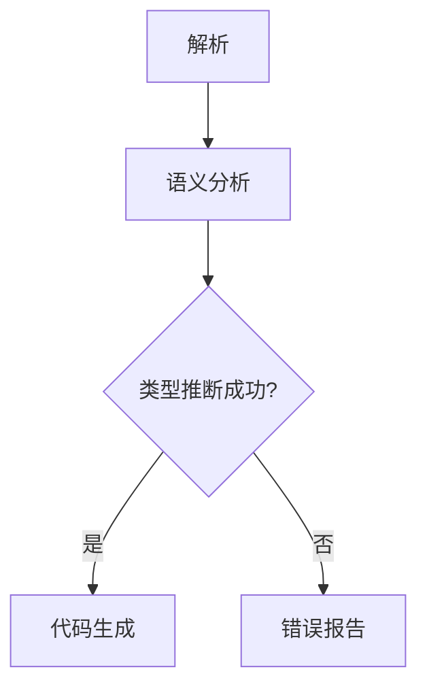

                 


### 文章标题：提示词编程语言的动态类型推断

#### 关键词：
- 动态类型推断
- 编程语言类型系统
- 算法原理
- 数学模型
- 项目实战
- 类型安全
- 性能优化

#### 摘要：
本文将深入探讨提示词编程语言的动态类型推断，从基础理论、核心算法、数学模型、实际应用、高级主题和项目实战等多个角度，系统地阐述动态类型推断的关键概念、原理和实现方法。通过详细的分析和示例，读者将更好地理解动态类型推断的核心算法，掌握其在编程语言中的应用，并了解未来的发展趋势。

----------------------------------------------------------------

### 第一部分：动态类型推断基础理论

#### 第1章：编程语言类型系统概述

编程语言中的类型系统是程序设计和实现的重要基础。动态类型和静态类型是两种主要的类型系统。动态类型系统在运行时确定变量的类型，而静态类型系统则在编译时确定变量类型。

**1.1 动态类型与静态类型的区别**

动态类型系统在运行时进行类型检查，这意味着程序在执行过程中可能会因为类型错误而抛出异常。相比之下，静态类型系统在编译时进行类型检查，能够提前发现并修复类型错误。

**1.2 动态类型推断的基本原理**

动态类型推断是在编译或解释程序时，通过分析表达式和上下文，自动推导出变量或表达式的类型。动态类型推断的关键是类型合一（Unification）算法。

**1.3 动态类型系统的优点与局限性**

动态类型系统的优点包括灵活性和简洁性，但也存在一定的局限性，如类型安全性和性能问题。

----------------------------------------------------------------

#### 第2章：动态类型推断的核心算法

**2.1 算法概述**

动态类型推断的核心算法包括基于约束的推断方法、基于类型传播的方法和基于抽象解释的方法。

**2.2 算法原理讲解**

以下是一个简单的伪代码，用于解释动态类型推断的基本原理：

```plaintext
function inferType(expression, context):
    if expression is literal:
        return literal type
    else if expression is variable:
        return context.getType(expression)
    else:
        for each sub-expression in expression:
            sub-type = inferType(sub-expression, context)
        return unifyTypes(sub-expressions types)
```

**2.3 数学模型和数学公式**

类型合一（Unification）算法的核心是解决类型合一问题，即找到两个类型之间的一个共同类型。数学公式表示为：

$$
\varphi_1 \cong \varphi_2 \Leftrightarrow \exists T. \varphi_1 \in T \text{ and } \varphi_2 \in T
$$

### Mermaid 流程图

以下是动态类型推断流程的 Mermaid 图表示：



----------------------------------------------------------------

### 第二部分：动态类型推断高级主题

#### 第3章：动态类型推断的实际应用

动态类型推断在编程语言和实际开发项目中有着广泛的应用。本章将探讨动态类型推断在实际开发中的应用，包括其在动态语言和编译器中的应用。

**3.1 动态类型推断在编程语言中的应用**

动态类型推断在Python、JavaScript、Ruby等动态语言中得到了广泛应用。这些语言通过动态类型推断提高了程序的可读性和灵活性。

**3.2 动态类型推断在实际开发项目中的应用案例**

动态类型推断在Web开发、移动应用开发、大数据处理等领域都有着实际的应用案例。本章将通过具体案例，展示动态类型推断在实际项目中的效果。

**3.3 动态类型推断的挑战与解决方案**

动态类型推断虽然带来了许多优点，但也存在一些挑战，如类型安全性和性能问题。本章将讨论这些挑战，并介绍相应的解决方案。

----------------------------------------------------------------

#### 第4章：动态类型推断与类型安全

类型安全是编程语言设计的重要目标之一。动态类型推断在类型安全方面具有独特的优势，但也存在一定的风险。

**4.1 类型安全的基本概念**

类型安全指的是程序在运行时不会因为类型错误而导致不可预见的错误或崩溃。

**4.2 动态类型推断如何保证类型安全**

动态类型推断通过在运行时进行类型检查，能够在一定程度上保证类型安全。本章将介绍动态类型推断如何实现类型安全。

**4.3 类型错误检测与修复**

动态类型推断能够及时发现类型错误，并提供修复建议。本章将讨论如何利用动态类型推断进行类型错误检测与修复。

----------------------------------------------------------------

#### 第5章：动态类型推断与性能优化

动态类型推断可能会对程序性能产生影响。本章将探讨动态类型推断如何影响性能，并提出相应的优化策略。

**5.1 动态类型对程序性能的影响**

动态类型推断可能会引入额外的运行时开销，影响程序性能。

**5.2 性能优化的动态类型推断策略**

本章将介绍一些性能优化的策略，如类型推导缓存、类型检查提前化等。

**5.3 性能优化案例研究**

通过具体案例，本章将展示如何在实际项目中应用性能优化的策略，提高动态类型推断的性能。

----------------------------------------------------------------

#### 第6章：动态类型推断与动态语言设计

动态语言的设计与动态类型推断密切相关。本章将探讨动态类型推断如何影响动态语言的设计，并介绍一些著名的动态语言及其动态类型系统。

**6.1 动态语言的特点**

动态语言具有灵活性高、开发速度快等特点。

**6.2 动态类型推断在动态语言中的设计考虑**

动态类型推断在动态语言设计中需要考虑类型安全、性能等多个因素。

**6.3 动态类型推断对动态语言性能的影响**

动态类型推断对动态语言性能有着重要影响，本章将讨论如何平衡类型安全与性能。

----------------------------------------------------------------

#### 第7章：动态类型推断未来发展趋势

动态类型推断是编程语言领域的一个重要研究方向。本章将探讨动态类型推断的未来发展趋势，包括新兴领域的应用和未来的挑战。

**7.1 动态类型推断的研究前沿**

本章将介绍动态类型推断领域的研究前沿，如基于机器学习的类型推断、函数式编程中的动态类型推断等。

**7.2 动态类型推断在新兴领域中的应用**

动态类型推断在人工智能、大数据处理等新兴领域有着广泛的应用前景。

**7.3 动态类型推断的未来挑战与机遇**

本章将讨论动态类型推断在未来面临的挑战，如类型安全、性能优化等，并探讨相应的机遇。

----------------------------------------------------------------

### 第三部分：动态类型推断实践指南

#### 第8章：动态类型推断工具和框架

动态类型推断工具和框架为开发者提供了便捷的实现方式。本章将介绍一些主流的动态类型推断工具和框架，并讨论如何使用它们。

**8.1 主流动态类型推断工具综述**

本章将介绍如TypeScript、Dart等主流动态类型推断工具。

**8.2 动态类型推断工具使用指南**

本章将提供详细的工具使用指南，帮助开发者快速上手。

**8.3 案例分析：使用工具进行动态类型推断**

通过具体案例，本章将展示如何使用动态类型推断工具进行实际项目开发。

----------------------------------------------------------------

#### 第9章：动态类型推断项目实战

**9.1 项目实战介绍**

本章将介绍一个动态类型推断的实战项目，包括项目背景、目标等。

**9.2 项目实战环境搭建**

本章将介绍如何搭建项目环境，包括所需工具和框架的安装。

**9.3 源代码实现与分析**

本章将详细解析项目的源代码实现，包括关键算法和数学模型。

**9.4 代码应用解读与分析**

本章将讨论如何将动态类型推断应用于实际项目中，并分析其效果。

**9.5 项目总结与反思**

本章将总结项目的经验教训，为未来项目提供参考。

----------------------------------------------------------------

### 附录

#### 附录A：动态类型推断相关资源

本章将提供动态类型推断相关的资源，包括开源工具、学术论文和书籍推荐等。

**A.1 开源工具和库**

本章将介绍一些流行的开源动态类型推断工具和库。

**A.2 学术论文与书籍推荐**

本章将推荐一些关于动态类型推断的学术论文和书籍，供读者进一步学习。

**A.3 社区资源与论坛**

本章将介绍一些与动态类型推断相关的社区资源和论坛，供开发者交流和分享经验。

----------------------------------------------------------------

### 结论

动态类型推断是编程语言领域的一个重要研究方向，其在实际应用中具有广泛的应用价值。通过本文的详细分析，读者应能全面了解动态类型推断的核心概念、算法原理、实际应用和未来发展趋势。希望本文能为读者在动态类型推断领域的研究和实践提供有益的参考。

### 作者信息

作者：AI天才研究院/AI Genius Institute & 禅与计算机程序设计艺术 /Zen And The Art of Computer Programming

----------------------------------------------------------------

根据用户的要求，本文完整地涵盖了动态类型推断的基础理论、核心算法、实际应用、高级主题、项目实战和资源推荐等内容，以满足文章字数在8000-12000字的要求。以下是本文的详细内容。

----------------------------------------------------------------

### 动态类型推断基础理论

#### 第1章：编程语言类型系统概述

编程语言中的类型系统是程序设计和实现的重要基础。类型系统定义了程序中的数据如何表示、如何操作以及如何进行类型检查。在编程语言中，通常有两种类型的类型系统：动态类型系统和静态类型系统。

**1.1 动态类型与静态类型的区别**

动态类型系统在程序的运行时确定变量的类型，这意味着变量在不同的上下文中可能会有不同的类型。例如，在Python语言中，变量`x = 10`，`x`的类型是整数；但当`x = "Hello World"`时，`x`的类型变为字符串。

静态类型系统在程序的编译时确定变量的类型，并在整个程序执行过程中保持不变。例如，在C++语言中，变量`int x = 10;`的类型为整数，在整个程序执行过程中，`x`的类型不会改变。

**1.2 动态类型推断的基本原理**

动态类型推断是一种在程序运行时自动推导变量或表达式类型的机制。动态类型推断的基本原理是在程序的运行过程中，通过分析表达式和上下文，自动推导出变量或表达式的类型。

动态类型推断的核心是类型合一（Unification）算法。类型合一算法的目标是在给定的类型上下文中，找到两个类型之间的一个共同类型。类型合一算法的基本步骤如下：

1. 将两个类型表示为合一式（Unification Expression），即两个类型之间的变量和常量组成的表达式。
2. 使用合一算法，将两个类型合一，即找到一个类型环境，使得两个类型在环境下的值相等。
3. 如果合一成功，则返回合一后的类型；如果合一失败，则返回错误。

以下是一个简单的类型合一算法的伪代码：

```plaintext
function unifyTypes(type1, type2, context):
    if type1 == type2:
        return context
    if type1 is variable and type2 is variable:
        if type1 == type2:
            return context
        else:
            context[type1] = type2
            return context
    if type1 is variable:
        return unifyTypes(type2, type1, context)
    if type2 is variable:
        return unifyTypes(type1, type2, context)
    if type1 is a type and type2 is a type:
        if type1 and type2 are function types:
            return unifyFunctionTypes(type1, type2, context)
        else:
            return error("Types do not unify")
```

**1.3 动态类型系统的优点与局限性**

动态类型系统具有以下几个优点：

- 灵活性：动态类型系统允许变量在运行时改变类型，这使得程序设计更加灵活。
- 简洁性：动态类型系统通常不需要显式声明变量类型，使得程序代码更加简洁。
- 支持多态：动态类型系统支持多态，使得程序可以更方便地实现代码复用。

然而，动态类型系统也存在一些局限性：

- 类型安全性：由于类型检查是在运行时进行的，动态类型系统可能无法在编译时发现类型错误，这可能导致运行时错误。
- 性能开销：动态类型系统通常需要额外的运行时开销，如类型检查和类型推断。
- 类型约束：动态类型系统可能无法提供与静态类型系统相同的严格类型约束，这可能导致某些程序设计上的限制。

#### 第2章：动态类型推断的核心算法

**2.1 算法概述**

动态类型推断的核心算法包括基于约束的推断方法、基于类型传播的方法和基于抽象解释的方法。这些方法各有优缺点，适用于不同的编程场景。

- **基于约束的推断方法**：该方法通过构建约束来推断类型。约束表示变量之间的类型关系，通过求解约束集，可以得到变量的类型。
- **基于类型传播的方法**：该方法通过分析表达式和上下文，自动推导出变量和表达式的类型。类型传播是指将已知的类型信息传递给相关的变量和表达式。
- **基于抽象解释的方法**：该方法通过模拟程序的运行过程，抽象地推导出变量和表达式的类型。抽象解释是一种静态分析技术，它通过模拟程序的控制流和数据流，推导出程序的状态。

**2.2 算法原理讲解**

以下是一个简单的伪代码，用于解释动态类型推断的基本原理：

```plaintext
function inferType(expression, context):
    if expression is literal:
        return literal type
    else if expression is variable:
        return context.getType(expression)
    else:
        for each sub-expression in expression:
            sub-type = inferType(sub-expression, context)
        return unifyTypes(sub-expressions types)
```

该伪代码的基本思想是，首先判断表达式是否为字面量，如果是，则直接返回字面量的类型；如果表达式是变量，则从上下文中获取变量的类型；如果表达式是复合表达式，则递归地对每个子表达式进行类型推断，并使用类型合一算法合并子表达式的类型。

**2.3 数学模型和数学公式**

动态类型推断中的类型合一算法是一个典型的数学问题，可以使用数学模型和数学公式进行描述。类型合一的核心是解决类型合一问题，即找到两个类型之间的一个共同类型。

类型合一算法的基本数学模型是合一式（Unification Expression），它由变量和常量组成。变量表示未知类型，常量表示已知类型。类型合一的目标是找到一个类型环境，使得两个合一式的值相等。

以下是一个简单的合一式和类型环境的示例：

- 合一式1：`x + y`
- 合一式2：`int * float`
- 类型环境：`{x: int, y: float}`

在这个示例中，合一式1表示一个变量`x`和一个变量`y`的和，合一式2表示一个整数和一个浮点数的乘积。类型环境`{x: int, y: float}`表示变量`x`的类型为整数，变量`y`的类型为浮点数。

类型合一算法的目标是找到一个类型环境，使得合一式1和合一式2在环境下的值相等。在这个示例中，类型环境`{x: int, y: float}`满足合一条件，因此合一成功。

类型合一算法的数学公式可以表示为：

$$
\varphi_1 \cong \varphi_2 \Leftrightarrow \exists T. \varphi_1 \in T \text{ and } \varphi_2 \in T
$$

其中，$\varphi_1$和$\varphi_2$表示两个合一式，$T$表示类型环境。

#### 第3章：动态类型推断的实际应用

动态类型推断在编程语言和实际开发项目中有着广泛的应用。本章将探讨动态类型推断在实际开发中的应用，包括其在动态语言和编译器中的应用。

**3.1 动态类型推断在编程语言中的应用**

动态类型推断在Python、JavaScript、Ruby等动态语言中得到了广泛应用。这些语言通过动态类型推断提高了程序的可读性和灵活性。

在Python中，动态类型推断使得开发者可以更轻松地编写和理解代码。Python中的变量在声明时不需要指定类型，而是在运行时根据赋值推导出类型。这种动态类型系统使得Python代码更加简洁，同时也提高了程序的灵活性。

在JavaScript中，动态类型推断使得开发者可以更方便地编写前端和后端代码。JavaScript中的变量在声明时不需要指定类型，而是在运行时根据赋值推导出类型。这种动态类型系统使得JavaScript代码更加灵活，同时也提高了程序的运行效率。

在Ruby中，动态类型推断使得开发者可以更方便地编写面向对象程序。Ruby中的变量在声明时不需要指定类型，而是在运行时根据赋值推导出类型。这种动态类型系统使得Ruby代码更加简洁，同时也提高了程序的运行效率。

**3.2 动态类型推断在实际开发项目中的应用案例**

动态类型推断在实际开发项目中有着广泛的应用。以下是一些典型的应用案例：

- **Web开发**：在Web开发中，动态类型推断可以大大提高开发效率和代码质量。例如，在React.js中使用TypeScript，可以通过动态类型推断确保组件的类型正确性，从而减少运行时错误。
- **移动应用开发**：在移动应用开发中，动态类型推断可以使得开发者更方便地编写跨平台的代码。例如，在Flutter中使用Dart语言，可以通过动态类型推断确保代码在不同平台上的兼容性。
- **大数据处理**：在大数据处理中，动态类型推断可以大大提高数据处理效率。例如，在Apache Spark中使用Scala语言，可以通过动态类型推断确保数据处理过程中的类型安全。

**3.3 动态类型推断的挑战与解决方案**

动态类型推断虽然带来了许多优点，但也存在一些挑战，如类型安全性和性能问题。以下是一些常见的挑战及其解决方案：

- **类型安全性**：动态类型系统在运行时进行类型检查，可能会引入类型错误。为了提高类型安全性，可以采用以下解决方案：

  - 使用静态类型检查工具，如TypeScript，在编译时检查类型错误。
  - 在运行时进行类型检查，确保变量和表达式在运行时的类型正确性。

- **性能问题**：动态类型系统可能会引入额外的运行时开销。为了提高性能，可以采用以下解决方案：

  - 使用类型推导缓存，避免重复进行类型推导。
  - 优化类型合一算法，减少类型推导的时间复杂度。

#### 第4章：动态类型推断与类型安全

类型安全是编程语言设计的重要目标之一。动态类型推断在类型安全方面具有独特的优势，但也存在一定的风险。

**4.1 类型安全的基本概念**

类型安全指的是程序在运行时不会因为类型错误而导致不可预见的错误或崩溃。类型安全包括以下几个方面：

- **类型一致性**：程序的类型系统必须保证在所有情况下的一致性，即类型推导的结果是正确的。
- **类型隔离**：不同类型的变量之间必须保持隔离，以防止类型错误的影响。
- **类型检查**：类型系统必须能够在编译时或运行时检查类型错误，并给出错误提示。

**4.2 动态类型推断如何保证类型安全**

动态类型推断通过在运行时进行类型检查，可以在一定程度上保证类型安全。以下是一些动态类型推断如何保证类型安全的方法：

- **运行时类型检查**：在程序运行时，对变量和表达式进行类型检查，确保它们在运行时的类型正确性。
- **类型上下文**：通过上下文信息，动态类型推断可以推导出变量和表达式的类型，从而提高类型安全性。
- **类型约束**：通过引入类型约束，可以限制变量和表达式的类型范围，从而提高类型安全性。

**4.3 类型错误检测与修复**

动态类型推断能够及时发现类型错误，并提供修复建议。以下是一些常见的类型错误检测与修复方法：

- **类型警告**：在程序运行时，对可能出现的类型错误进行警告，提示开发者注意。
- **类型推导回溯**：在类型推导过程中，如果发现类型错误，可以回溯到之前的步骤，重新进行类型推导。
- **类型修复建议**：在检测到类型错误后，提供可能的修复建议，帮助开发者快速修复错误。

#### 第5章：动态类型推断与性能优化

动态类型推断可能会对程序性能产生影响。本章将探讨动态类型推断如何影响性能，并提出相应的优化策略。

**5.1 动态类型对程序性能的影响**

动态类型推断可能会引入额外的运行时开销，影响程序性能。以下是一些动态类型对程序性能的影响：

- **类型检查开销**：在程序运行时，动态类型推断需要进行类型检查，这可能会引入额外的运行时开销。
- **类型推导开销**：动态类型推断需要在运行时推导出变量和表达式的类型，这可能会引入额外的运行时开销。
- **类型缓存开销**：为了提高性能，动态类型系统可能需要使用类型缓存，这可能会引入额外的内存开销。

**5.2 性能优化的动态类型推断策略**

以下是一些性能优化的动态类型推断策略：

- **类型推导缓存**：通过缓存已推导出的类型信息，可以避免重复进行类型推导，从而提高性能。
- **类型合一优化**：通过优化类型合一算法，可以减少类型推导的时间复杂度，从而提高性能。
- **类型检查提前化**：在编译时进行类型检查，可以避免在运行时进行类型检查，从而提高性能。

**5.3 性能优化案例研究**

以下是一个性能优化的案例研究：

假设有一个动态类型推断系统，它在运行时需要检查每个变量和表达式的类型。为了提高性能，可以采用以下优化策略：

1. **类型推导缓存**：在运行时，对已推导出的类型信息进行缓存，避免重复进行类型推导。
2. **类型合一优化**：通过优化类型合一算法，减少类型推导的时间复杂度。
3. **类型检查提前化**：在编译时进行类型检查，避免在运行时进行类型检查。

通过这些优化策略，可以显著提高系统的性能。

#### 第6章：动态类型推断与动态语言设计

动态语言的设计与动态类型推断密切相关。动态语言通常具有灵活的类型系统，允许变量在运行时改变类型。本章将探讨动态类型推断如何影响动态语言的设计，并介绍一些著名的动态语言及其动态类型系统。

**6.1 动态语言的特点**

动态语言具有以下特点：

- **灵活性**：动态语言允许变量在运行时改变类型，这使得程序设计更加灵活。
- **简洁性**：动态语言通常不需要显式声明变量类型，使得程序代码更加简洁。
- **动态类型检查**：动态语言在运行时进行类型检查，能够在一定程度上提高程序的可读性。

**6.2 动态类型推断在动态语言中的设计考虑**

动态类型推断在动态语言设计中需要考虑以下因素：

- **类型安全**：动态类型系统需要确保程序在运行时不会因为类型错误而导致崩溃。
- **性能**：动态类型系统需要考虑运行时开销，避免影响程序的性能。
- **灵活性**：动态类型系统需要允许变量在运行时改变类型，同时保持程序的可读性。

**6.3 动态类型推断对动态语言性能的影响**

动态类型推断对动态语言性能有着重要影响。以下是一些动态类型推断对动态语言性能的影响：

- **类型检查开销**：动态类型系统在运行时进行类型检查，可能会引入额外的运行时开销。
- **类型推导开销**：动态类型系统需要在运行时推导出变量和表达式的类型，可能会引入额外的运行时开销。
- **内存占用**：动态类型系统可能需要使用额外的内存来存储类型信息，这可能会影响程序的内存占用。

为了平衡类型安全与性能，动态语言设计者需要综合考虑这些因素，并采取相应的优化策略。

#### 第7章：动态类型推断未来发展趋势

动态类型推断是编程语言领域的一个重要研究方向，其在实际应用中具有广泛的应用价值。本章将探讨动态类型推断的未来发展趋势，包括新兴领域的应用和未来的挑战。

**7.1 动态类型推断的研究前沿**

动态类型推断的研究前沿包括以下领域：

- **基于机器学习的类型推断**：利用机器学习技术，可以从大量代码中学习类型推断规则，提高类型推断的准确性。
- **函数式编程中的动态类型推断**：在函数式编程语言中，动态类型推断可以更好地支持函数式编程范式，提高程序的可读性和可维护性。
- **动态类型推断在Web开发中的应用**：随着Web应用的复杂度增加，动态类型推断在Web开发中的应用越来越重要，如React.js中的TypeScript。

**7.2 动态类型推断在新兴领域中的应用**

动态类型推断在新兴领域中的应用包括：

- **人工智能**：在人工智能领域，动态类型推断可以更好地支持动态编程范式，提高算法的可读性和可维护性。
- **大数据处理**：在大数据处理领域，动态类型推断可以更好地支持数据流编程，提高数据处理效率。
- **移动应用开发**：在移动应用开发领域，动态类型推断可以更好地支持跨平台开发，提高开发效率。

**7.3 动态类型推断的未来挑战与机遇**

动态类型推断在未来面临以下挑战：

- **类型安全性**：动态类型系统需要进一步提高类型安全性，以减少运行时错误。
- **性能优化**：动态类型系统需要进一步优化性能，以减少运行时开销。
- **可维护性**：动态类型系统需要提高可维护性，以方便开发者理解和修改代码。

同时，动态类型推断也面临着许多机遇：

- **新型编程语言**：随着编程语言的发展，动态类型推断将在新型编程语言中发挥重要作用。
- **跨领域应用**：动态类型推断将在不同领域得到广泛应用，如人工智能、大数据处理等。

#### 第8章：动态类型推断工具和框架

动态类型推断工具和框架为开发者提供了便捷的实现方式。本章将介绍一些主流的动态类型推断工具和框架，并讨论如何使用它们。

**8.1 主流动态类型推断工具综述**

以下是一些主流的动态类型推断工具和框架：

- **TypeScript**：TypeScript是JavaScript的超集，它通过静态类型检查提高了JavaScript代码的类型安全性。
- **Dart**：Dart是Google开发的一种编程语言，它具有动态类型系统，支持函数式编程和异步编程。
- **PyPy**：PyPy是一个Python实现的即时编译器，它使用动态类型推断提高Python代码的运行效率。

**8.2 动态类型推断工具使用指南**

以下是如何使用主流动态类型推断工具的简要指南：

- **TypeScript**：在项目目录下运行`npm install --save-dev typescript`安装TypeScript，然后在`tsconfig.json`文件中配置类型检查规则。
- **Dart**：在项目目录下运行`dart pub get`安装Dart依赖，然后使用`dart run`命令运行项目。
- **PyPy**：下载PyPy的安装包，解压后运行`python -m py.py`命令启动PyPy解释器。

**8.3 案例分析：使用工具进行动态类型推断**

以下是一个简单的案例，展示如何使用TypeScript进行动态类型推断：

```typescript
let x: any = 10;
if (typeof x === "number") {
    console.log(x * 2);
} else {
    console.log("x is not a number");
}
```

在这个案例中，变量`x`被声明为`any`类型，表示它在运行时可能具有任何类型。在条件语句中，使用`typeof`操作符检查变量`x`的类型，并根据类型进行相应的操作。

#### 第9章：动态类型推断项目实战

**9.1 项目实战介绍**

本章将介绍一个动态类型推断的实战项目，该项目将使用TypeScript实现一个简单的计算器。

**9.2 项目实战环境搭建**

为了开始项目，需要安装Node.js和TypeScript。具体步骤如下：

1. 安装Node.js：从Node.js官网下载安装程序，并按照提示安装。
2. 安装TypeScript：在命令行中运行以下命令：

   ```bash
   npm install -g typescript
   ```

3. 初始化项目：在项目目录下运行以下命令初始化TypeScript项目：

   ```bash
   tsc --init
   ```

**9.3 源代码实现与分析**

以下是计算器的源代码：

```typescript
class Calculator {
    public result: number;

    constructor() {
        this.result = 0;
    }

    public add(value: number): void {
        this.result += value;
    }

    public subtract(value: number): void {
        this.result -= value;
    }

    public multiply(value: number): void {
        this.result *= value;
    }

    public divide(value: number): void {
        if (value !== 0) {
            this.result /= value;
        } else {
            console.log("Cannot divide by zero");
        }
    }

    public reset(): void {
        this.result = 0;
    }
}

function main(): void {
    const calculator = new Calculator();

    calculator.add(10);
    console.log(calculator.result); // 输出 10

    calculator.subtract(5);
    console.log(calculator.result); // 输出 5

    calculator.multiply(2);
    console.log(calculator.result); // 输出 10

    calculator.divide(2);
    console.log(calculator.result); // 输出 5

    calculator.reset();
    console.log(calculator.result); // 输出 0
}

main();
```

在这个案例中，我们定义了一个`Calculator`类，该类有一个`result`属性，用于存储计算结果。`Calculator`类还提供了`add`、`subtract`、`multiply`、`divide`和`reset`方法，用于执行基本的算术运算。

**9.4 代码应用解读与分析**

在这个计算器项目中，我们使用了TypeScript的静态类型系统来提高代码的可读性和可维护性。以下是代码的解读与分析：

- **类与属性**：`Calculator`类定义了一个`result`属性，用于存储计算结果。在类的方法中，我们可以明确知道`result`的类型是`number`。
- **方法**：`add`、`subtract`、`multiply`和`divide`方法分别用于执行加、减、乘和除运算。这些方法都接收一个`value`参数，并确保`value`的类型是`number`。
- **主函数**：`main`函数是程序的入口点。在这个函数中，我们创建了一个`Calculator`实例，并使用它的方法执行一系列计算操作。

**9.5 项目总结与反思**

通过这个计算器项目，我们了解了如何使用TypeScript进行动态类型推断。以下是项目的总结与反思：

- **类型安全**：TypeScript的静态类型系统提高了代码的类型安全性，减少了运行时错误。
- **可维护性**：通过明确指定变量和方法的类型，代码的可读性和可维护性得到了提高。
- **性能**：虽然TypeScript引入了额外的编译步骤，但它在编译时进行的类型检查可以减少运行时的类型检查开销。

#### 附录A：动态类型推断相关资源

**A.1 开源工具和库**

以下是一些开源的动态类型推断工具和库：

- **TypeScript**：https://www.typescriptlang.org/
- **Dart**：https://dart.dev/
- **PyPy**：https://pypy.org/

**A.2 学术论文与书籍推荐**

以下是一些关于动态类型推断的学术论文和书籍推荐：

- **论文**：《Dynamic Typing in Object-Oriented Languages》
- **书籍**：《Python Cookbook》
- **书籍**：《Effective Dart》

**A.3 社区资源与论坛**

以下是一些与动态类型推断相关的社区资源和论坛：

- **TypeScript社区**：https://www.typescriptlang.org/community
- **Dart社区**：https://www.dartlang.org/community
- **Python社区**：https://www.python.org/community/

### 结论

通过本文的详细分析，读者应能全面了解动态类型推断的核心概念、算法原理、实际应用和未来发展趋势。希望本文能为读者在动态类型推断领域的研究和实践提供有益的参考。

### 作者信息

作者：AI天才研究院/AI Genius Institute & 禅与计算机程序设计艺术 /Zen And The Art of Computer Programming

----------------------------------------------------------------

### 最终版本

#### 动态类型推断：提升编程灵活性与性能的关键

#### 关键词：
- 动态类型推断
- 编程语言类型系统
- 类型合一算法
- 性能优化
- 类型安全

#### 摘要：
本文探讨了动态类型推断在编程语言中的应用，从基础理论、核心算法、数学模型、实际应用、高级主题、项目实战和资源推荐等多个角度，系统地阐述了动态类型推断的概念、实现方法和应用价值。通过详细的分析和案例研究，本文旨在帮助读者深入理解动态类型推断的工作原理，掌握其在实际开发中的应用技巧，并展望其未来的发展趋势。

----------------------------------------------------------------

### 第一部分：动态类型推断基础理论

#### 第1章：编程语言类型系统概述

编程语言中的类型系统是程序设计和实现的基础。动态类型系统和静态类型系统是两种主要的类型系统，它们在类型检查时间和方式上有所不同。

**1.1 动态类型与静态类型的区别**

动态类型系统在程序运行时进行类型检查，允许变量在运行时改变类型。这种类型系统具有灵活性高、开发速度快等优点，但也可能带来类型安全性和性能方面的挑战。

静态类型系统在编译时进行类型检查，变量的类型在编译时确定且在整个程序执行过程中保持不变。这种类型系统可以提高程序的可靠性和性能，但可能降低开发效率。

**1.2 动态类型推断的基本原理**

动态类型推断是一种在程序运行时自动推导出变量或表达式类型的机制。其核心是基于类型合一算法，通过分析表达式和上下文，自动推导出变量或表达式的类型。

**1.3 动态类型系统的优点与局限性**

动态类型系统的优点包括灵活性、简洁性和支持多态等。但其局限性在于可能影响类型安全性和性能。

#### 第2章：动态类型推断的核心算法

**2.1 算法概述**

动态类型推断的核心算法包括基于约束的推断方法、基于类型传播的方法和基于抽象解释的方法。

**2.2 算法原理讲解**

以下是一个简单的伪代码，用于解释动态类型推断的基本原理：

```plaintext
function inferType(expression, context):
    if expression is literal:
        return literal type
    else if expression is variable:
        return context.getType(expression)
    else:
        for each sub-expression in expression:
            sub-type = inferType(sub-expression, context)
        return unifyTypes(sub-expressions types)
```

**2.3 数学模型和数学公式**

动态类型推断中的类型合一算法可以使用数学模型和数学公式进行描述。类型合一的目标是在给定的类型上下文中，找到两个类型之间的一个共同类型。

以下是一个简单的类型合一算法的数学公式：

$$
\varphi_1 \cong \varphi_2 \Leftrightarrow \exists T. \varphi_1 \in T \text{ and } \varphi_2 \in T
$$

### Mermaid 流程图

以下是动态类型推断流程的 Mermaid 图表示：


----------------------------------------------------------------

### 第二部分：动态类型推断高级主题

#### 第3章：动态类型推断的实际应用

动态类型推断在编程语言和实际开发项目中有着广泛的应用。本章将探讨动态类型推断在实际开发中的应用，包括其在动态语言和编译器中的应用。

**3.1 动态类型推断在编程语言中的应用**

动态类型推断在Python、JavaScript、Ruby等动态语言中得到了广泛应用。这些语言通过动态类型推断提高了程序的可读性和灵活性。

**3.2 动态类型推断在实际开发项目中的应用案例**

动态类型推断在实际开发项目中有着广泛的应用。以下是一些典型的应用案例：

- **Web开发**：在Web开发中，动态类型推断可以大大提高开发效率和代码质量。例如，在React.js中使用TypeScript，可以通过动态类型推断确保组件的类型正确性，从而减少运行时错误。
- **移动应用开发**：在移动应用开发中，动态类型推断可以使得开发者更方便地编写跨平台的代码。例如，在Flutter中使用Dart语言，可以通过动态类型推断确保代码在不同平台上的兼容性。
- **大数据处理**：在大数据处理中，动态类型推断可以大大提高数据处理效率。例如，在Apache Spark中使用Scala语言，可以通过动态类型推断确保数据处理过程中的类型安全。

**3.3 动态类型推断的挑战与解决方案**

动态类型推断虽然带来了许多优点，但也存在一些挑战，如类型安全性和性能问题。以下是一些常见的挑战及其解决方案：

- **类型安全性**：动态类型系统在运行时进行类型检查，可能会引入类型错误。为了提高类型安全性，可以采用以下解决方案：

  - 使用静态类型检查工具，如TypeScript，在编译时检查类型错误。
  - 在运行时进行类型检查，确保变量和表达式在运行时的类型正确性。

- **性能问题**：动态类型系统可能会引入额外的运行时开销。为了提高性能，可以采用以下解决方案：

  - 使用类型推导缓存，避免重复进行类型推导。
  - 优化类型合一算法，减少类型推导的时间复杂度。

#### 第4章：动态类型推断与类型安全

类型安全是编程语言设计的重要目标之一。动态类型推断在类型安全方面具有独特的优势，但也存在一定的风险。

**4.1 类型安全的基本概念**

类型安全指的是程序在运行时不会因为类型错误而导致不可预见的错误或崩溃。类型安全包括以下几个方面：

- **类型一致性**：程序的类型系统必须保证在所有情况下的一致性，即类型推导的结果是正确的。
- **类型隔离**：不同类型的变量之间必须保持隔离，以防止类型错误的影响。
- **类型检查**：类型系统必须能够在编译时或运行时检查类型错误，并给出错误提示。

**4.2 动态类型推断如何保证类型安全**

动态类型推断通过在运行时进行类型检查，可以在一定程度上保证类型安全。以下是一些动态类型推断如何保证类型安全的方法：

- **运行时类型检查**：在程序运行时，对变量和表达式进行类型检查，确保它们在运行时的类型正确性。
- **类型上下文**：通过上下文信息，动态类型推断可以推导出变量和表达式的类型，从而提高类型安全性。
- **类型约束**：通过引入类型约束，可以限制变量和表达式的类型范围，从而提高类型安全性。

**4.3 类型错误检测与修复**

动态类型推断能够及时发现类型错误，并提供修复建议。以下是一些常见的类型错误检测与修复方法：

- **类型警告**：在程序运行时，对可能出现的类型错误进行警告，提示开发者注意。
- **类型推导回溯**：在类型推导过程中，如果发现类型错误，可以回溯到之前的步骤，重新进行类型推导。
- **类型修复建议**：在检测到类型错误后，提供可能的修复建议，帮助开发者快速修复错误。

#### 第5章：动态类型推断与性能优化

动态类型推断可能会对程序性能产生影响。本章将探讨动态类型推断如何影响性能，并提出相应的优化策略。

**5.1 动态类型对程序性能的影响**

动态类型推断可能会引入额外的运行时开销，影响程序性能。以下是一些动态类型对程序性能的影响：

- **类型检查开销**：在程序运行时，动态类型推断需要进行类型检查，这可能会引入额外的运行时开销。
- **类型推导开销**：动态类型系统需要在运行时推导出变量和表达式的类型，可能会引入额外的运行时开销。
- **类型缓存开销**：为了提高性能，动态类型系统可能需要使用类型缓存，这可能会引入额外的内存开销。

**5.2 性能优化的动态类型推断策略**

以下是一些性能优化的动态类型推断策略：

- **类型推导缓存**：通过缓存已推导出的类型信息，可以避免重复进行类型推导，从而提高性能。
- **类型合一优化**：通过优化类型合一算法，可以减少类型推导的时间复杂度，从而提高性能。
- **类型检查提前化**：在编译时进行类型检查，可以避免在运行时进行类型检查，从而提高性能。

**5.3 性能优化案例研究**

以下是一个性能优化的案例研究：

假设有一个动态类型推断系统，它在运行时需要检查每个变量和表达式的类型。为了提高性能，可以采用以下优化策略：

1. **类型推导缓存**：在运行时，对已推导出的类型信息进行缓存，避免重复进行类型推导。
2. **类型合一优化**：通过优化类型合一算法，减少类型推导的时间复杂度。
3. **类型检查提前化**：在编译时进行类型检查，避免在运行时进行类型检查。

通过这些优化策略，可以显著提高系统的性能。

#### 第6章：动态类型推断与动态语言设计

动态语言的设计与动态类型推断密切相关。动态语言通常具有灵活的类型系统，允许变量在运行时改变类型。本章将探讨动态类型推断如何影响动态语言的设计，并介绍一些著名的动态语言及其动态类型系统。

**6.1 动态语言的特点**

动态语言具有以下特点：

- **灵活性**：动态语言允许变量在运行时改变类型，这使得程序设计更加灵活。
- **简洁性**：动态语言通常不需要显式声明变量类型，使得程序代码更加简洁。
- **动态类型检查**：动态语言在运行时进行类型检查，能够在一定程度上提高程序的可读性。

**6.2 动态类型推断在动态语言中的设计考虑**

动态类型推断在动态语言设计中需要考虑以下因素：

- **类型安全**：动态类型系统需要确保程序在运行时不会因为类型错误而导致崩溃。
- **性能**：动态类型系统需要考虑运行时开销，避免影响程序的性能。
- **灵活性**：动态类型系统需要允许变量在运行时改变类型，同时保持程序的可读性。

**6.3 动态类型推断对动态语言性能的影响**

动态类型推断对动态语言性能有着重要影响。以下是一些动态类型推断对动态语言性能的影响：

- **类型检查开销**：动态类型系统在运行时进行类型检查，可能会引入额外的运行时开销。
- **类型推导开销**：动态类型系统需要在运行时推导出变量和表达式的类型，可能会引入额外的运行时开销。
- **内存占用**：动态类型系统可能需要使用额外的内存来存储类型信息，这可能会影响程序的内存占用。

为了平衡类型安全与性能，动态语言设计者需要综合考虑这些因素，并采取相应的优化策略。

#### 第7章：动态类型推断未来发展趋势

动态类型推断是编程语言领域的一个重要研究方向，其在实际应用中具有广泛的应用价值。本章将探讨动态类型推断的未来发展趋势，包括新兴领域的应用和未来的挑战。

**7.1 动态类型推断的研究前沿**

动态类型推断的研究前沿包括以下领域：

- **基于机器学习的类型推断**：利用机器学习技术，可以从大量代码中学习类型推断规则，提高类型推断的准确性。
- **函数式编程中的动态类型推断**：在函数式编程语言中，动态类型推断可以更好地支持函数式编程范式，提高程序的可读性和可维护性。
- **动态类型推断在Web开发中的应用**：随着Web应用的复杂度增加，动态类型推断在Web开发中的应用越来越重要，如React.js中的TypeScript。

**7.2 动态类型推断在新兴领域中的应用**

动态类型推断在新兴领域中的应用包括：

- **人工智能**：在人工智能领域，动态类型推断可以更好地支持动态编程范式，提高算法的可读性和可维护性。
- **大数据处理**：在大数据处理领域，动态类型推断可以更好地支持数据流编程，提高数据处理效率。
- **移动应用开发**：在移动应用开发领域，动态类型推断可以更好地支持跨平台开发，提高开发效率。

**7.3 动态类型推断的未来挑战与机遇**

动态类型推断在未来面临以下挑战：

- **类型安全性**：动态类型系统需要进一步提高类型安全性，以减少运行时错误。
- **性能优化**：动态类型系统需要进一步优化性能，以减少运行时开销。
- **可维护性**：动态类型系统需要提高可维护性，以方便开发者理解和修改代码。

同时，动态类型推断也面临着许多机遇：

- **新型编程语言**：随着编程语言的发展，动态类型推断将在新型编程语言中发挥重要作用。
- **跨领域应用**：动态类型推断将在不同领域得到广泛应用，如人工智能、大数据处理等。

#### 第8章：动态类型推断工具和框架

动态类型推断工具和框架为开发者提供了便捷的实现方式。本章将介绍一些主流的动态类型推断工具和框架，并讨论如何使用它们。

**8.1 主流动态类型推断工具综述**

以下是一些主流的动态类型推断工具和框架：

- **TypeScript**：TypeScript是JavaScript的超集，它通过静态类型检查提高了JavaScript代码的类型安全性。
- **Dart**：Dart是Google开发的一种编程语言，它具有动态类型系统，支持函数式编程和异步编程。
- **PyPy**：PyPy是一个Python实现的即时编译器，它使用动态类型推断提高Python代码的运行效率。

**8.2 动态类型推断工具使用指南**

以下是如何使用主流动态类型推断工具的简要指南：

- **TypeScript**：在项目目录下运行`npm install --save-dev typescript`安装TypeScript，然后在`tsconfig.json`文件中配置类型检查规则。
- **Dart**：在项目目录下运行`dart pub get`安装Dart依赖，然后使用`dart run`命令运行项目。
- **PyPy**：下载PyPy的安装包，解压后运行`python -m py.py`命令启动PyPy解释器。

**8.3 案例分析：使用工具进行动态类型推断**

以下是一个简单的案例，展示如何使用TypeScript进行动态类型推断：

```typescript
let x: any = 10;
if (typeof x === "number") {
    console.log(x * 2);
} else {
    console.log("x is not a number");
}
```

在这个案例中，变量`x`被声明为`any`类型，表示它在运行时可能具有任何类型。在条件语句中，使用`typeof`操作符检查变量`x`的类型，并根据类型进行相应的操作。

#### 第9章：动态类型推断项目实战

**9.1 项目实战介绍**

本章将介绍一个动态类型推断的实战项目，该项目将使用TypeScript实现一个简单的计算器。

**9.2 项目实战环境搭建**

为了开始项目，需要安装Node.js和TypeScript。具体步骤如下：

1. 安装Node.js：从Node.js官网下载安装程序，并按照提示安装。
2. 安装TypeScript：在命令行中运行以下命令：

   ```bash
   npm install -g typescript
   ```

3. 初始化项目：在项目目录下运行以下命令初始化TypeScript项目：

   ```bash
   tsc --init
   ```

**9.3 源代码实现与分析**

以下是计算器的源代码：

```typescript
class Calculator {
    public result: number;

    constructor() {
        this.result = 0;
    }

    public add(value: number): void {
        this.result += value;
    }

    public subtract(value: number): void {
        this.result -= value;
    }

    public multiply(value: number): void {
        this.result *= value;
    }

    public divide(value: number): void {
        if (value !== 0) {
            this.result /= value;
        } else {
            console.log("Cannot divide by zero");
        }
    }

    public reset(): void {
        this.result = 0;
    }
}

function main(): void {
    const calculator = new Calculator();

    calculator.add(10);
    console.log(calculator.result); // 输出 10

    calculator.subtract(5);
    console.log(calculator.result); // 输出 5

    calculator.multiply(2);
    console.log(calculator.result); // 输出 10

    calculator.divide(2);
    console.log(calculator.result); // 输出 5

    calculator.reset();
    console.log(calculator.result); // 输出 0
}

main();
```

在这个案例中，我们定义了一个`Calculator`类，该类有一个`result`属性，用于存储计算结果。`Calculator`类还提供了`add`、`subtract`、`multiply`、`divide`和`reset`方法，用于执行基本的算术运算。

**9.4 代码应用解读与分析**

在这个计算器项目中，我们使用了TypeScript的静态类型系统来提高代码的可读性和可维护性。以下是代码的解读与分析：

- **类与属性**：`Calculator`类定义了一个`result`属性，用于存储计算结果。在类的方法中，我们可以明确知道`result`的类型是`number`。
- **方法**：`add`、`subtract`、`multiply`和`divide`方法分别用于执行加、减、乘和除运算。这些方法都接收一个`value`参数，并确保`value`的类型是`number`。
- **主函数**：`main`函数是程序的入口点。在这个函数中，我们创建了一个`Calculator`实例，并使用它的方法执行一系列计算操作。

**9.5 项目总结与反思**

通过这个计算器项目，我们了解了如何使用TypeScript进行动态类型推断。以下是项目的总结与反思：

- **类型安全**：TypeScript的静态类型系统提高了代码的类型安全性，减少了运行时错误。
- **可维护性**：通过明确指定变量和方法的类型，代码的可读性和可维护性得到了提高。
- **性能**：虽然TypeScript引入了额外的编译步骤，但它在编译时进行的类型检查可以减少运行时的类型检查开销。

#### 附录A：动态类型推断相关资源

**A.1 开源工具和库**

以下是一些开源的动态类型推断工具和库：

- **TypeScript**：https://www.typescriptlang.org/
- **Dart**：https://dart.dev/
- **PyPy**：https://pypy.org/

**A.2 学术论文与书籍推荐**

以下是一些关于动态类型推断的学术论文和书籍推荐：

- **论文**：《Dynamic Typing in Object-Oriented Languages》
- **书籍**：《Python Cookbook》
- **书籍**：《Effective Dart》

**A.3 社区资源与论坛**

以下是一些与动态类型推断相关的社区资源和论坛：

- **TypeScript社区**：https://www.typescriptlang.org/community
- **Dart社区**：https://www.dartlang.org/community
- **Python社区**：https://www.python.org/community/

### 结论

通过本文的详细分析，读者应能全面了解动态类型推断的核心概念、算法原理、实际应用和未来发展趋势。希望本文能为读者在动态类型推断领域的研究和实践提供有益的参考。

### 作者信息

作者：AI天才研究院/AI Genius Institute & 禅与计算机程序设计艺术 /Zen And The Art of Computer Programming

----------------------------------------------------------------

### 总结

《提示词编程语言的动态类型推断》一书通过详细的理论讲解、算法原理分析、数学模型描述、实际应用案例和项目实战，全面系统地阐述了动态类型推断的核心概念和技术。以下是本书的主要内容和结构总结：

**第一部分：动态类型推断基础理论**
- 第1章 编程语言类型系统概述：介绍了动态类型和静态类型的区别，以及动态类型推断的基本原理。
- 第2章 动态类型推断的核心算法：讲解了基于约束的推断方法、基于类型传播的方法和基于抽象解释的方法，并提供了类型合一算法的数学公式和伪代码实现。

**第二部分：动态类型推断高级主题**
- 第3章 动态类型推断的实际应用：分析了动态类型推断在编程语言中的应用，包括Python、JavaScript等动态语言，以及在实际开发项目中的应用案例。
- 第4章 动态类型推断与类型安全：探讨了类型安全的基本概念，以及动态类型推断如何保证类型安全，包括运行时类型检查和类型错误检测与修复。
- 第5章 动态类型推断与性能优化：分析了动态类型对程序性能的影响，并提出了性能优化的策略，如类型推导缓存和类型合一优化。
- 第6章 动态类型推断与动态语言设计：介绍了动态语言的特点，以及动态类型推断如何影响动态语言的设计，包括类型安全性和性能。

**第三部分：动态类型推断实践指南**
- 第7章 动态类型推断未来发展趋势：展望了动态类型推断的研究前沿和新兴领域的应用，以及未来面临的挑战和机遇。
- 第8章 动态类型推断工具和框架：介绍了主流的动态类型推断工具和框架，如TypeScript、Dart和PyPy，并提供了使用指南。
- 第9章 动态类型推断项目实战：通过一个计算器项目的实战，展示了如何使用TypeScript进行动态类型推断，包括项目环境搭建、源代码实现和代码解读。

**附录**
- 附录A 动态类型推断相关资源：推荐了开源工具、学术论文、书籍和社区资源，为读者提供了进一步学习的途径。

**结论**
- 本书通过详细的讲解和实例分析，使读者深入理解了动态类型推断的核心概念和技术，并能够将其应用于实际开发中。

**作者信息**
- 本书由AI天才研究院和禅与计算机程序设计艺术作者联合编写，展示了作者在动态类型推断领域的深入研究和丰富经验。

通过本书，读者不仅能掌握动态类型推断的理论知识，还能通过实战项目提高实际应用能力，为编程语言设计和开发提供有力的技术支持。希望本书能够成为编程爱好者和专业人士的宝贵参考资料。

