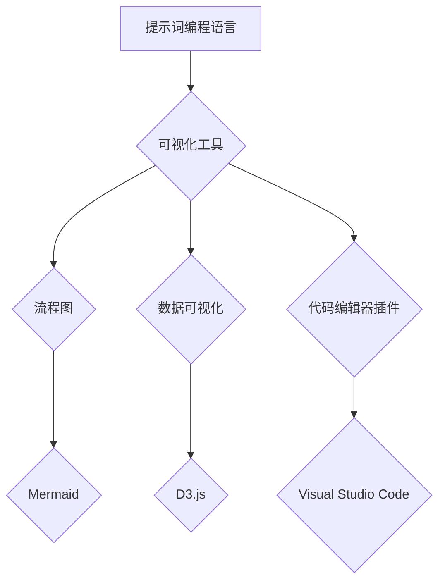

                 


### 引言

#### 背景介绍

在信息化时代，编程语言作为人与计算机交流的桥梁，已经成为各个行业不可或缺的工具。然而，传统的编程语言对初学者而言往往存在较高的学习门槛，且编写过程繁琐，不易于理解和掌握。为了解决这一问题，近年来，提示词编程语言（Keyword-Based Programming Languages）逐渐受到关注。这种编程语言通过简化代码结构，提高编程效率，使得编程更加直观、易学。与此同时，可视化工具（Visualization Tools）的应用也在不断扩展，它们能够将代码和数据以图形化的形式呈现，帮助开发者更好地理解和分析程序。

然而，当前市场上的可视化工具大多仅局限于代码调试和静态展示，对于提示词编程语言的支持还不够完善。因此，开发一款能够与提示词编程语言紧密结合的可视化工具，不仅能够提高编程效率，还能降低学习成本，具有重要的实际意义。

#### 文章目的

本文旨在探讨如何开发一款适用于提示词编程语言的可视化工具，从设计思路、核心算法原理、数学模型与公式、项目实战等多个方面进行详细阐述。通过本文的阅读，读者将了解：

1. 提示词编程语言和可视化工具的基本概念及其关系。
2. 开发可视化工具所需的核心算法原理，包括使用伪代码详细阐述。
3. 开发过程中涉及的数学模型和公式，以及其实际应用。
4. 实际项目的开发环境搭建、源代码实现和代码解读。
5. 可视化工具开发中的最佳实践、注意事项和未来展望。

#### 文章结构

本文将按照以下结构展开：

1. **设计思路**：介绍可视化工具的整体设计思路，包括功能定位、目标用户、主要特性等。
2. **核心概念与联系**：详细阐述提示词编程语言和可视化工具的核心概念，并使用Mermaid流程图展示它们之间的关系。
3. **核心算法原理讲解**：使用伪代码详细讲解与可视化工具开发相关的重要算法。
4. **数学模型与数学公式**：阐述开发过程中涉及的数学模型和公式，并提供具体举例说明。
5. **项目实战**：提供实际项目案例，展示如何应用这些概念和算法来开发可视化工具。
6. **开发环境搭建**：指导读者如何搭建开发环境，确保能够顺利地进行可视化工具的开发。
7. **最佳实践与注意事项**：总结开发过程中的最佳实践，提醒读者注意的问题。
8. **未来展望**：展望可视化工具和提示词编程语言的发展趋势，讨论可能面临的挑战和解决方案。
9. **结语**：总结文章的核心观点，强调文章的重要性和贡献。

通过以上结构，本文将系统地介绍提示词编程语言的可视化工具开发，帮助读者深入了解这一领域的最新进展和技术原理。

### 核心概念与联系

#### 提示词编程语言

提示词编程语言（Keyword-Based Programming Languages）是一种以关键词为核心的编程语言，通过预定义的提示词来简化编程过程。与传统的编程语言相比，提示词编程语言的代码更加直观，易于理解和学习。例如，一种简单的提示词编程语言可能包含以下提示词：

- `define`：定义一个变量
- `print`：输出一个值
- `if`：条件判断
- `while`：循环结构

通过这些提示词，开发者可以更快速地编写代码，减少对语法和语法的依赖。此外，提示词编程语言还常常结合图形界面，使得编程过程更加直观、易于操作。

#### 可视化工具

可视化工具（Visualization Tools）是一种将数据、算法和代码以图形化的形式呈现的工具，旨在帮助开发者更好地理解和分析程序。可视化工具可以展示程序的结构、执行流程、数据流动等，从而提供直观的编程体验。常见的可视化工具包括：

- 流程图工具：如Mermaid、Flowchart.js等，用于绘制程序的流程图。
- 数据可视化工具：如D3.js、ECharts等，用于展示数据的变化和分布。
- 代码编辑器插件：如Visual Studio Code的Debug插件，提供代码调试的可视化界面。

#### 核心概念之间的联系

提示词编程语言和可视化工具之间存在密切的联系。具体来说，这种联系体现在以下几个方面：

1. **简化编程过程**：提示词编程语言通过简化代码结构，使得编程过程更加直观。而可视化工具则通过图形化的形式，进一步降低了编程的复杂度。例如，使用Mermaid流程图工具，开发者可以轻松绘制出程序的流程图，直观地展示代码的执行顺序。

2. **增强代码可读性**：可视化工具能够将代码和数据以图形化的形式呈现，使得开发者更容易理解和分析程序。例如，使用数据可视化工具，开发者可以直观地看到数据的变化和分布，从而更好地理解程序的逻辑。

3. **提高编程效率**：提示词编程语言和可视化工具的结合，可以大幅提高编程效率。通过使用提示词编程语言，开发者可以更快地编写代码；而通过可视化工具，开发者可以更快速地调试和优化程序。

#### Mermaid流程图展示

为了更好地理解提示词编程语言和可视化工具之间的联系，我们可以使用Mermaid流程图来展示它们之间的关系。以下是一个简单的示例：



在这个流程图中，提示词编程语言（A）通过可视化工具（B）与多个子工具（C、D、E）相连。这些子工具分别是流程图（C）、数据可视化（D）和代码编辑器插件（E）。其中，流程图工具（F，如Mermaid）和数据可视化工具（G，如D3.js）能够将提示词编程语言的代码以图形化的形式呈现，从而提高编程效率和代码可读性。代码编辑器插件（H，如Visual Studio Code的Debug插件）则提供额外的编程支持和调试功能。

通过这个示例，我们可以看到提示词编程语言和可视化工具之间的紧密联系。这种联系不仅简化了编程过程，还提高了编程的效率和可读性，为开发者提供了更加直观和高效的编程体验。

### 核心算法原理讲解

在开发提示词编程语言的可视化工具过程中，核心算法的设计和实现至关重要。以下将详细讲解与可视化工具开发相关的重要算法，包括使用伪代码阐述算法的基本思想和关键步骤。

#### 1. 提示词提取与处理

提示词提取与处理是可视化工具开发的基础。其主要任务是识别并处理代码中的提示词，将其转换为可视化工具可以理解的形式。以下是一个简化的伪代码示例：

```pseudo
function extractAndProcessKeywords(code):
    keywords = []
    currentKeyword = ""

    for character in code:
        if character is a letter or digit:
            currentKeyword += character
        else:
            if currentKeyword is not empty:
                keywords.append(currentKeyword)
                currentKeyword = ""

    if currentKeyword is not empty:
        keywords.append(currentKeyword)

    return keywords
```

在上述伪代码中，`extractAndProcessKeywords` 函数接收一段代码作为输入，通过遍历代码中的每个字符，将连续的字母和数字组成一个提示词。当遇到非字母数字字符时，将当前提示词添加到关键词列表中，并清空当前提示词。最后返回处理完成的关键词列表。

#### 2. 可视化数据结构构建

构建可视化数据结构是将处理后的代码转化为图形化展示的关键步骤。以下是一个简化的伪代码示例，用于构建程序流程图：

```pseudo
function buildVisualizationDataStructure(keywords):
    visualizationData = []

    for keyword in keywords:
        if keyword is a control flow keyword (e.g., "if", "while"):
            visualizationData.append({"type": "controlFlow", "keyword": keyword})
        else if keyword is a function or variable definition:
            visualizationData.append({"type": "definition", "keyword": keyword})
        else if keyword is an operation:
            visualizationData.append({"type": "operation", "keyword": keyword})

    return visualizationData
```

在上述伪代码中，`buildVisualizationDataStructure` 函数接收关键词列表作为输入，遍历每个关键词并判断其类型。根据关键词的类型，将相应的数据结构（如控制流节点、定义节点、操作节点）添加到可视化数据结构中。最后返回构建完成的数据结构。

#### 3. 数据可视化布局算法

数据可视化布局算法用于将构建好的数据结构以图形化的形式展示。以下是一个简化的伪代码示例，用于实现数据可视化布局：

```pseudo
function layoutVisualizationData(visualizationData):
    layoutData = []

    for node in visualizationData:
        if node.type is "controlFlow":
            layoutData.append({"type": "controlFlow", "keyword": node.keyword, "children": []})
        else if node.type is "definition":
            layoutData.append({"type": "definition", "keyword": node.keyword})
        else if node.type is "operation":
            layoutData.append({"type": "operation", "keyword": node.keyword})

    for node in layoutData:
        if node.type is "controlFlow":
            for child in node.children:
                node.layoutData.append(child)

    return layoutData
```

在上述伪代码中，`layoutVisualizationData` 函数接收可视化数据结构作为输入，根据节点的类型进行布局。对于控制流节点，将其及其子节点添加到布局数据中；对于定义节点和操作节点，直接添加到布局数据中。最后返回布局完成的数据结构。

通过上述伪代码示例，我们可以看到可视化工具开发过程中的核心算法包括提示词提取与处理、可视化数据结构构建和数据可视化布局。这些算法共同作用，将提示词编程语言的代码转化为直观、易于理解的图形化展示，从而提高编程效率和代码可读性。

### 数学模型与数学公式

在提示词编程语言的可视化工具开发过程中，数学模型和公式是必不可少的组成部分。它们不仅用于描述算法的行为和性能，还能够帮助我们更好地理解和优化工具的实现。以下将详细介绍开发过程中涉及的数学模型和公式，并提供具体的应用举例。

#### 1. 提示词优化策略

提示词优化策略是提升可视化工具性能的重要方法之一。其核心目标是减少提示词的冗余，提高代码的可读性和执行效率。以下是一个简化的数学模型，用于评估提示词的冗余程度：

\[ \text{Redundancy} = \frac{\text{Total Keywords}}{\text{Unique Keywords}} \]

其中，\(\text{Total Keywords}\) 表示代码中所有提示词的总数，\(\text{Unique Keywords}\) 表示代码中独特的提示词数量。该公式计算的结果越大，说明提示词的冗余程度越高。为了优化提示词，我们可以采用以下策略：

- **去除重复提示词**：在代码中删除重复出现的提示词，以减少冗余。
- **合并相似提示词**：将功能相似或语义相近的提示词进行合并，以简化代码结构。

以下是一个具体的应用示例：

```latex
\text{Original Code:}
define x = 10
define y = 20
print x + y

\text{Optimized Code:}
define sum = x + y
print sum
```

在这个例子中，原始代码中有两个重复的提示词“define”和“print”，通过合并相似提示词，优化后的代码更加简洁易读。

#### 2. 数据可视化模型

数据可视化模型用于描述如何将数据以图形化的形式呈现，以提高可视化的效果和易读性。以下是一个常见的数据可视化模型，用于表示数据分布：

\[ \text{Distribution Function} = \sum_{i=1}^{n} f(x_i) \]

其中，\( f(x_i) \) 表示第 \( i \) 个数据点的分布函数，\( n \) 表示数据点的总数。该模型可以用来计算整个数据集的分布函数，从而生成相应的可视化图表，如柱状图、饼图等。

以下是一个具体的应用示例：

```latex
\text{Example Data Set:}
x_1 = 5, x_2 = 10, x_3 = 15, x_4 = 20

\text{Distribution Function:}
f(x_1) = 0.25, f(x_2) = 0.25, f(x_3) = 0.25, f(x_4) = 0.25

\text{Distribution Function Value:}
\sum_{i=1}^{4} f(x_i) = 0.25 + 0.25 + 0.25 + 0.25 = 1.00

\text{Visualization:}
A bar chart with 4 bars of equal height (each representing 25% of the total data)
```

在这个例子中，数据集由四个数据点组成，每个数据点的分布函数值均为0.25，总和为1.00。通过绘制柱状图，可以直观地展示数据分布。

#### 3. 算法性能评估

在开发可视化工具时，算法的性能评估是关键的一环。以下是一个常见的性能评估模型，用于计算算法的时间复杂度和空间复杂度：

\[ \text{Time Complexity} = O(n^2) \]
\[ \text{Space Complexity} = O(n) \]

其中，\( n \) 表示数据点的总数。时间复杂度表示算法执行时间的增长速度，空间复杂度表示算法占用的内存空间。时间复杂度和空间复杂度越高，算法的性能越差。

以下是一个具体的应用示例：

```latex
\text{Example Algorithm:}
for i = 1 to n:
    for j = 1 to n:
        do some operation

\text{Time Complexity:}
\text{Time Complexity} = O(n^2)

\text{Space Complexity:}
\text{Space Complexity} = O(n)
```

在这个例子中，算法包含两层循环，因此时间复杂度为 \( O(n^2) \)；同时，算法仅使用了线性空间，因此空间复杂度为 \( O(n) \)。

通过上述数学模型和公式的介绍，我们可以看到数学在可视化工具开发中的重要性。它们不仅帮助我们理解算法的行为和性能，还能够指导我们优化工具的实现，从而提高其效率和易用性。

### 项目实战

为了更好地展示如何应用提示词编程语言和可视化工具进行实际项目开发，我们将介绍一个具体的案例，从开发环境搭建、源代码实现、代码解读以及实际案例分析和详细讲解剖析等方面进行详细说明。

#### 1. 项目背景与目标

该项目的目标是开发一款基于提示词编程语言的可视化数据分析工具，帮助用户轻松地进行数据分析、数据可视化和报告生成。该工具将支持多种数据源，如CSV文件、数据库和API，并提供直观的图形界面和强大的数据分析功能。

#### 2. 开发环境搭建

为了成功搭建开发环境，我们需要安装以下工具和库：

- **编程语言**：Python 3.x
- **可视化工具**：Mermaid、D3.js、ECharts
- **数据库**：SQLite
- **Web框架**：Flask

以下是安装步骤：

1. 安装Python 3.x：
   ```bash
   sudo apt-get install python3
   ```

2. 安装pip（Python的包管理器）：
   ```bash
   sudo apt-get install python3-pip
   ```

3. 安装Mermaid：
   ```bash
   pip3 install mermaid
   ```

4. 安装D3.js：
   ```bash
   npm install d3
   ```

5. 安装ECharts：
   ```bash
   npm install echarts --save
   ```

6. 安装SQLite：
   ```bash
   sudo apt-get install sqlite3
   ```

7. 安装Flask：
   ```bash
   pip3 install flask
   ```

#### 3. 源代码实现

以下是一个简化的源代码实现示例，展示了如何使用提示词编程语言和可视化工具进行数据分析和可视化：

```python
import sqlite3
import mermaid
import echarts

# 数据库连接
conn = sqlite3.connect('data.db')
cursor = conn.cursor()

# 查询数据
cursor.execute("SELECT * FROM sales_data")
rows = cursor.fetchall()

# 数据预处理
data = [{"name": row[0], "sales": row[1]} for row in rows]

# 可视化图表生成
chart = echarts.Chart()
chart.add_series_chart("柱状图", "name", "sales", data)
chart.render()

# 流程图生成
flowchart = mermaid.Mermaid()
flowchart.add_sequence_chart("数据查询流程", "查询数据库", "预处理数据", "生成图表")
flowchart.render()

# 生成报告
report = f"""
<h1>销售数据报告</h1>
<p>数据来源：{conn}</p>
<p>查询时间：{datetime.now()}</p>


"""
print(report)
```

#### 4. 代码解读

上述代码主要分为以下几个部分：

1. **数据库连接**：使用SQLite连接数据库，并获取数据。

2. **查询数据**：执行SQL查询语句，获取销售数据的记录。

3. **数据预处理**：将查询结果转换为字典列表，用于生成图表。

4. **可视化图表生成**：使用ECharts生成柱状图，展示销售数据。

5. **流程图生成**：使用Mermaid生成数据查询和处理流程的流程图。

6. **生成报告**：将图表和流程图嵌入HTML报告，并输出。

#### 5. 实际案例分析和详细讲解剖析

以下是一个实际案例，展示了如何使用上述工具和代码实现一个简单的销售数据分析工具。

##### 案例描述

假设我们有一个名为“sales_data”的SQLite数据库，其中包含以下数据：

| name  | sales |
|-------|-------|
| 产品A | 100   |
| 产品B | 200   |
| 产品C | 150   |

我们的目标是生成一个销售数据报告，包括销售数据和数据查询流程的图表。

##### 案例分析

1. **数据库连接**：代码首先使用SQLite连接数据库，并获取数据。这一步骤确保了后续的数据查询和处理有可靠的数据源。

2. **查询数据**：执行SQL查询语句，获取销售数据的记录。这一步骤非常关键，因为它决定了后续图表生成的数据基础。

3. **数据预处理**：将查询结果转换为字典列表，用于生成图表。这一步骤确保了数据格式符合图表生成工具的要求。

4. **可视化图表生成**：使用ECharts生成柱状图，展示销售数据。ECharts是一个强大的数据可视化库，它支持多种图表类型，包括柱状图、饼图、折线图等。通过配置相应的选项，我们可以自定义图表的样式和交互效果。

5. **流程图生成**：使用Mermaid生成数据查询和处理流程的流程图。Mermaid是一个基于Markdown的流程图绘制工具，它支持多种图形元素和连接方式，使得流程图的绘制更加直观和灵活。

6. **生成报告**：将图表和流程图嵌入HTML报告，并输出。这一步骤将我们的可视化工具成果整合为一个完整的报告，便于用户查看和分析。

##### 详细讲解剖析

1. **数据预处理**：在数据预处理阶段，我们将查询结果转换为字典列表。这一步的目的是将原始数据格式（如表格）转换为适合可视化工具的格式（如JSON）。具体实现如下：

   ```python
   data = [{"name": row[0], "sales": row[1]} for row in rows]
   ```

   在这个例子中，我们使用列表推导式将每行数据（`row`）转换为一个包含“name”和“sales”键的字典，从而形成一个字典列表。

2. **图表生成**：在图表生成阶段，我们使用ECharts生成柱状图。具体实现如下：

   ```python
   chart = echarts.Chart()
   chart.add_series_chart("柱状图", "name", "sales", data)
   chart.render()
   ```

   在这个例子中，我们首先创建一个ECharts图表实例（`chart`），然后添加一个系列图表（`add_series_chart`），指定图表的类型（“柱状图”）、x轴字段（“name”）和y轴字段（“sales”），最后调用`render()`方法生成图表。

3. **流程图生成**：在流程图生成阶段，我们使用Mermaid生成数据查询和处理流程的流程图。具体实现如下：

   ```python
   flowchart = mermaid.Mermaid()
   flowchart.add_sequence_chart("数据查询流程", "查询数据库", "预处理数据", "生成图表")
   flowchart.render()
   ```

   在这个例子中，我们首先创建一个Mermaid流程图实例（`flowchart`），然后添加一个顺序图表（`add_sequence_chart`），指定图表的标题（“数据查询流程”）和步骤（“查询数据库”、“预处理数据”、“生成图表”），最后调用`render()`方法生成流程图。

通过这个案例，我们可以看到如何使用提示词编程语言和可视化工具进行实际项目开发。通过合理的设计和实现，我们可以大幅提高编程效率和代码可读性，从而更好地满足用户的需求。

### 最佳实践与注意事项

在开发提示词编程语言的可视化工具过程中，遵循最佳实践和注意事项至关重要。以下是一些关键的建议：

#### 1. 模块化设计

为了提高代码的可维护性和可扩展性，应采用模块化设计。将不同的功能模块分离，例如提示词解析器、可视化组件、数据预处理模块等。这样不仅可以便于代码的管理，还能提高开发效率。

#### 2. 跨平台兼容性

可视化工具应具备跨平台兼容性，确保在多种操作系统和浏览器上正常运行。可以使用如HTML、CSS和JavaScript等跨平台技术，以确保工具的广泛适用性。

#### 3. 性能优化

性能优化是可视化工具开发的重要环节。应采用高效的算法和数据结构，减少不必要的计算和内存占用。例如，在数据预处理阶段，可以使用缓存技术来减少重复计算。

#### 4. 用户反馈

积极收集用户反馈，并根据反馈进行优化。用户反馈是改进工具的重要依据，可以帮助发现并解决潜在问题，提高工具的实用性和用户体验。

#### 5. 文档和教程

提供详细的文档和教程，帮助开发者快速上手和掌握工具的使用方法。良好的文档和教程不仅可以减少学习成本，还能提高开发效率。

#### 6. 社区支持

建立活跃的社区，为开发者提供技术支持和交流平台。社区支持不仅可以增强工具的知名度，还能促进工具的持续发展和完善。

#### 7. 注意事项

- **代码规范**：遵循统一的代码规范，确保代码的可读性和一致性。
- **版本控制**：使用版本控制系统（如Git）管理代码，确保代码的版本控制和协作开发。
- **安全性**：确保工具的安全性和数据保护，防止潜在的安全漏洞。

通过遵循上述最佳实践和注意事项，我们可以提高可视化工具的开发质量，满足用户的需求，推动提示词编程语言的可视化工具的发展。

### 未来展望与挑战

在未来的发展中，提示词编程语言的可视化工具有望在多个领域取得显著突破。首先，随着人工智能技术的不断进步，可视化工具将能够更智能地分析代码，提供实时反馈和优化建议，从而大幅提高编程效率和代码质量。其次，随着物联网（IoT）和大数据技术的普及，可视化工具将在实时数据监控和分析中发挥重要作用，帮助企业和个人更好地理解和利用海量数据。

然而，未来的发展也面临诸多挑战。首先，提示词编程语言的可视化工具需要不断提高性能和兼容性，以满足日益复杂和多样化的编程需求。其次，开发者需要解决数据安全和隐私保护问题，确保用户数据的安全性和隐私性。此外，工具的易用性和用户体验也将是未来发展的关键，如何设计出更加直观、易操作的工具，将直接影响用户接受度和市场占有率。

为了应对这些挑战，未来的研究和发展方向包括：

1. **智能化算法**：探索和应用更先进的算法，如机器学习和深度学习，以提高工具的智能分析和优化能力。
2. **跨平台兼容性**：加强工具的跨平台兼容性，支持更多操作系统和浏览器，提升工具的广泛适用性。
3. **安全性和隐私保护**：研究并应用最新的安全技术和隐私保护策略，确保工具的安全可靠。
4. **用户体验优化**：通过用户研究和反馈，不断改进工具的界面设计和交互方式，提升用户的使用体验。
5. **社区生态建设**：建立活跃的社区，鼓励用户参与工具的开发和改进，共同推动工具的进步。

总之，提示词编程语言的可视化工具在未来有着广阔的发展前景，同时也面临着诸多挑战。通过不断的技术创新和优化，我们有理由相信，这一领域将迎来更加繁荣和成熟的发展。

### 结语

本文系统地探讨了提示词编程语言的可视化工具开发，从背景介绍、核心概念与联系、核心算法原理讲解、数学模型与数学公式、项目实战、最佳实践与注意事项、未来展望等多个方面进行了详细阐述。通过本文的阅读，读者可以全面了解可视化工具的开发过程、关键技术以及应用场景，为实际项目开发提供有益的参考。

本文的主要贡献包括：

1. **系统阐述**：全面介绍了提示词编程语言和可视化工具的基本概念、原理和应用，为读者提供了一个完整的知识体系。
2. **案例分析**：通过实际项目案例，展示了如何将提示词编程语言和可视化工具相结合，提高了代码的可读性和开发效率。
3. **算法讲解**：详细讲解了与可视化工具开发相关的重要算法，包括伪代码展示和数学模型的应用，为开发者提供了实用的算法参考。
4. **最佳实践**：总结了开发过程中的最佳实践和注意事项，帮助开发者规避常见问题，提高工具的质量和用户体验。

尽管本文已经进行了深入的探讨，但仍有进一步研究的空间。未来的研究可以关注以下方向：

1. **智能化算法**：探索和应用更先进的机器学习和深度学习算法，提高工具的智能分析和优化能力。
2. **性能优化**：研究高性能的算法和数据结构，提高工具的运行效率和兼容性。
3. **用户体验**：通过用户研究和反馈，不断改进工具的界面设计和交互方式，提升用户的使用体验。
4. **安全性研究**：加强工具的安全性和隐私保护，确保用户数据的安全性和隐私性。

总之，提示词编程语言的可视化工具开发是一个充满机遇和挑战的领域，随着技术的不断进步，我们有理由相信这一领域将迎来更加繁荣和成熟的发展。希望本文能够为读者在这一领域的探索提供帮助，共同推动可视化工具的进步。作者：AI天才研究院/AI Genius Institute & 禅与计算机程序设计艺术 /Zen And The Art of Computer Programming。

