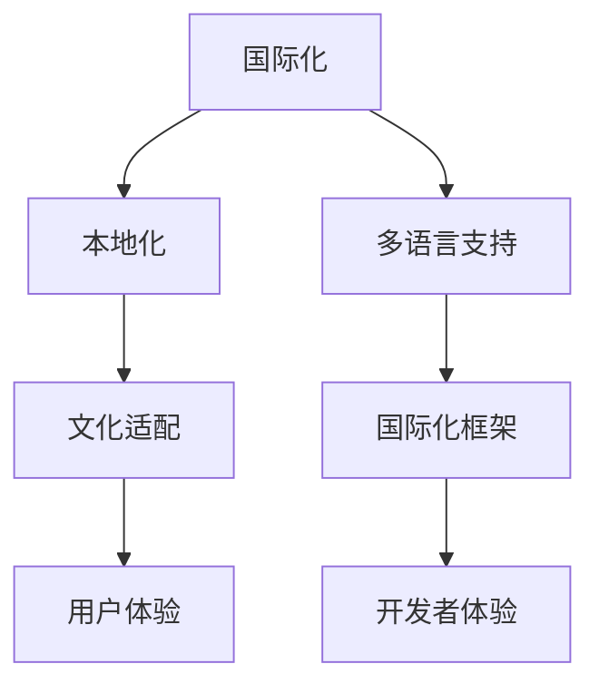

                 

### 文章标题

# 提示词编程语言的国际化与本地化

> 关键词：国际化，本地化，提示词编程语言，多语言支持，国际化框架

> 摘要：本文将深入探讨提示词编程语言的国际化与本地化问题，分析其在多语言支持中的应用。通过详细阐述国际化与本地化的核心概念、原理、实现方法、工具以及实际案例，本文旨在为开发者提供一套完整、实用的国际化与本地化解决方案，帮助他们在全球市场中取得成功。

----------------------------------------------------------------

### 目录大纲设计方案

为了设计一个详尽且逻辑清晰的目录大纲，我们需要按照以下步骤来思考和规划：

#### 1. 确定书的核心主题和目标读者
首先，我们需要明确书的核心主题是“提示词编程语言的国际化与本地化”，并了解目标读者群体。这有助于我们确定哪些内容需要详细阐述，哪些内容可以略过。

#### 2. 制定整体结构
接下来，我们将书分为几个主要部分，每个部分包含多个章节。主要部分可能包括：

- **引言与背景**：介绍国际化与本地化的概念、意义及其在提示词编程语言中的应用。
- **核心概念与原理**：详细讲解国际化与本地化的基础理论和关键技术。
- **实现方法与工具**：介绍常用的国际化与本地化实现方法以及相关的工具。
- **实际案例研究**：分析具体的国际化与本地化项目案例，展示实际应用和效果。
- **最佳实践与策略**：总结国际化与本地化的最佳实践和策略，提供实用建议。

#### 3. 设计具体章节内容
在每个主要部分中，我们将具体设计每个章节的内容，确保覆盖以下要点：

- **核心概念与联系**：使用Mermaid流程图展示国际化与本地化的核心概念和相互关系。
- **核心算法原理讲解**：使用伪代码详细阐述关键算法的实现原理。
- **数学模型和公式**：使用LaTeX格式给出数学模型的公式，并进行详细讲解和举例说明。
- **项目实战**：提供实际的项目案例，包括开发环境搭建、源代码实现和代码解读与分析。

#### 4. 保证大纲的简洁性与完整性
确保大纲简洁明了，避免冗余内容，同时确保包含核心章节内容。具体来说，大纲应该包含以下核心章节：

- **第1章：引言与背景**
- **第2章：国际化与本地化的基础概念**
- **第3章：国际化与本地化的实现方法**
- **第4章：国际化与本地化的工具与平台**
- **第5章：国际化与本地化的挑战与解决方案**
- **第6章：国际化与本地化的案例研究**
- **第7章：国际化与本地化的最佳实践与策略**

#### 5. 编写大纲文字说明
最后，我们将以Markdown格式编写大纲的文字说明，确保格式清晰、结构合理，符合大纲的设计要求。

### 最终大纲设计方案
根据上述步骤，以下是《提示词编程语言的国际化与本地化》的目录大纲设计方案：

#### 第一部分：引言与背景
- **第1章：引言与背景**
  - **1.1 国际化与本地化的概念**
    - **1.1.1 国际化**
    - **1.1.2 本地化**
  - **1.2 提示词编程语言的特点**
  - **1.3 国际化与本地化在提示词编程语言中的应用**
  - **1.4 国际化与本地化的重要性**

#### 第二部分：核心概念与原理
- **第2章：国际化与本地化的基础概念**
  - **2.1 语言环境与文本处理**
    - **2.1.1 语言环境的定义**
    - **2.1.2 文本处理的基本流程**
  - **2.2 国际化与本地化的关键技术**
    - **2.2.1 翻译与语义分析**
    - **2.2.2 语言模型与词汇表**
    - **2.2.3 多语言支持与兼容性**

#### 第三部分：实现方法与工具
- **第3章：国际化与本地化的实现方法**
  - **3.1 本地化流程与策略**
    - **3.1.1 本地化流程**
    - **3.1.2 本地化策略**
  - **3.2 常见国际化与本地化工具**
    - **3.2.1 翻译记忆库**
    - **3.2.2 自然语言处理工具**
    - **3.2.3 国际化框架**

#### 第四部分：实际案例研究
- **第4章：国际化与本地化的案例研究**
  - **4.1 案例一：多语言搜索引擎**
    - **4.1.1 项目背景**
    - **4.1.2 实现方案**
    - **4.1.3 挑战与解决**
  - **4.2 案例二：国际化电商平台**
    - **4.2.1 项目背景**
    - **4.2.2 实现方案**
    - **4.2.3 挑战与解决**

#### 第五部分：最佳实践与策略
- **第5章：国际化与本地化的最佳实践与策略**
  - **5.1 最佳实践总结**
  - **5.2 国际化与本地化的策略制定**
  - **5.3 持续改进与优化**

这个设计方案确保了书的核心章节内容被完整覆盖，同时保持了大纲的简洁性与逻辑性，为读者提供了一个清晰的学习路径。

----------------------------------------------------------------

### 文章标题：提示词编程语言的国际化与本地化

国际化与本地化是现代软件开发中至关重要的主题，尤其是对于拥有全球用户基础的提示词编程语言。在全球化进程中，如何使编程语言能够适应不同的语言和文化，从而在多语言环境中顺畅运行，成为开发者面临的一大挑战。本文将深入探讨提示词编程语言的国际化与本地化问题，分析其在多语言支持中的应用。

> 关键词：国际化，本地化，提示词编程语言，多语言支持，国际化框架

> 摘要：本文将详细阐述提示词编程语言的国际化与本地化核心概念、原理、实现方法、工具以及实际案例。通过本文，读者将了解如何有效地进行国际化与本地化，以使编程语言在全球市场中更加具有竞争力。

----------------------------------------------------------------

### 引言与背景

#### 国际化与本地化的概念

国际化（Internationalization）和本地化（Localization）是两个紧密相关的概念，但有着不同的侧重点。

**国际化**（Internationalization）指的是在软件设计、开发和部署过程中，确保软件能够在不同的语言和文化环境中运行。国际化的目标是将软件的潜在用户群体扩展到全球，而不仅仅是特定的语言或地区。

**本地化**（Localization）则是在国际化基础上，针对特定语言和文化环境进行的调整和适配。本地化的目标是使软件在特定市场中具有文化相关性和用户体验，从而提高用户满意度。

#### 提示词编程语言的特点

提示词编程语言（Code Prompting Language）是一种通过提示词来引导编程过程的编程语言。它具有以下几个特点：

1. **灵活性与动态性**：提示词编程语言可以根据用户输入的提示词动态调整代码生成过程。
2. **跨语言性**：提示词编程语言支持多种语言，使得开发者可以编写跨语言的应用程序。
3. **易于学习**：提示词编程语言通常具有简洁明了的语法，使得初学者可以快速上手。

#### 国际化与本地化在提示词编程语言中的应用

在国际化的背景下，提示词编程语言需要支持多种语言的语法和语义。本地化则要求这些语言支持能够根据特定地区的文化和习惯进行定制。

- **多语言支持**：提示词编程语言需要提供多语言支持，使得开发者可以轻松编写和切换不同语言的代码。
- **本地化资源**：为支持本地化，提示词编程语言需要提供丰富的本地化资源，如语言包、翻译词典等。
- **国际化框架**：提示词编程语言需要集成国际化框架，以便开发者能够方便地实现国际化与本地化功能。

#### 国际化与本地化的重要性

国际化与本地化对于提示词编程语言的发展具有重要意义：

- **市场扩展**：通过国际化，提示词编程语言可以进入更多国家和地区，扩大市场份额。
- **用户体验**：本地化可以提供更加符合用户习惯和文化的用户体验，提高用户满意度。
- **竞争优势**：在全球化竞争中，具备国际化与本地化能力的提示词编程语言将具有显著的优势。

### 核心概念与联系

为了更好地理解国际化与本地化在提示词编程语言中的应用，我们可以使用Mermaid流程图来展示它们的核心概念和相互关系。



**图1：国际化与本地化的核心概念和相互关系**

**图1**展示了国际化与本地化的核心概念及其相互关系。国际化关注多语言支持和国际化框架，本地化关注文化适配和用户体验。这两者共同构成了提示词编程语言的国际化与本地化体系。

### 核心算法原理讲解

#### 多语言支持

为了实现多语言支持，提示词编程语言需要以下关键组件：

- **语言解析器**：解析不同语言的语法和语义，生成相应的抽象语法树（AST）。
- **语言模型**：存储各种语言的词汇和语法规则，以便进行语法分析和代码生成。
- **翻译工具**：将一种语言的代码翻译成另一种语言的代码，实现跨语言支持。

以下是一个简单的伪代码，用于描述多语言支持的核心算法原理：

```python
function translate(source_code, target_language):
    # 解析源代码
    ast = parse(source_code)
    
    # 根据目标语言构建翻译规则
    translation_rules = build_translation_rules(target_language)
    
    # 对AST进行翻译
    translated_ast = translate_ast(ast, translation_rules)
    
    # 生成目标代码
    target_code = generate_code(translated_ast)
    
    return target_code
```

#### 文化适配

文化适配是本地化的关键，它涉及以下几个方面：

- **文本本地化**：将文本翻译成目标语言，并考虑文化差异。
- **图标与界面**：根据目标文化调整图标、界面布局和视觉元素。
- **日期与时间格式**：根据目标文化调整日期和时间格式。
- **单位换算**：根据目标文化调整单位换算，如货币、重量、长度等。

以下是一个简单的伪代码，用于描述文化适配的核心算法原理：

```python
function adapt_to_culture(text, culture):
    # 翻译文本
    translated_text = translate(text, culture.language)
    
    # 调整日期和时间格式
    formatted_date = format_date(culture.date_format, culture.time_zone)
    
    # 调整单位换算
    converted_units = convert_units(culture.unit_system)
    
    # 构建本地化文本
    localized_text = build_localized_text(translated_text, formatted_date, converted_units)
    
    return localized_text
```

### 数学模型和公式

#### 语言模型优化

在实现多语言支持和文化适配过程中，语言模型优化是一个重要的环节。以下是一个使用LaTeX格式的数学模型，用于描述语言模型优化：

$$
L(\theta) = \sum_{i=1}^{N} (-1) \log P(y_i | x_i, \theta)
$$

其中，$L(\theta)$ 表示语言模型在参数 $\theta$ 下的损失函数，$N$ 表示训练数据集中样本的数量，$x_i$ 和 $y_i$ 分别表示输入和输出样本，$P(y_i | x_i, \theta)$ 表示在参数 $\theta$ 下，给定输入 $x_i$ 的输出 $y_i$ 的概率。

#### 代码生成优化

在代码生成过程中，优化代码质量和可读性也是一个重要的问题。以下是一个使用LaTeX格式的数学模型，用于描述代码生成优化：

$$
C(\theta) = \sum_{i=1}^{N} (-1) \log P(c_i | s_i, \theta)
$$

其中，$C(\theta)$ 表示代码生成在参数 $\theta$ 下的损失函数，$N$ 表示训练数据集中样本的数量，$s_i$ 和 $c_i$ 分别表示输入和输出代码，$P(c_i | s_i, \theta)$ 表示在参数 $\theta$ 下，给定输入代码 $s_i$ 的输出代码 $c_i$ 的概率。

### 项目实战

#### 开发环境搭建

为了进行国际化与本地化项目，我们需要搭建一个完整的开发环境。以下是一个简单的步骤指南：

1. **安装操作系统**：选择一个支持多语言和国际化功能的操作系统，如Linux或macOS。
2. **安装编程语言**：选择一种流行的提示词编程语言，如Python或JavaScript，并安装相应的开发工具。
3. **安装国际化框架**：根据所选编程语言，安装支持国际化与本地化的框架，如Python中的`gettext`或JavaScript中的`i18next`。
4. **安装文本编辑器或集成开发环境（IDE）**：选择一个支持国际化开发的文本编辑器或IDE，如Visual Studio Code或IntelliJ IDEA。

#### 源代码实现

以下是一个简单的国际化与本地化项目示例，使用Python语言和`gettext`框架实现：

1. **创建源代码文件**：创建一个名为`myapp.po`的源代码文件，用于存储翻译字符串。
2. **编写翻译字符串**：在`myapp.po`文件中，编写需要翻译的字符串，例如：
   ```
   msgid "Hello, World!"
   msgstr "你好，世界！"
   ```
3. **编写主程序**：在主程序中，使用`gettext`模块加载翻译字符串，并根据当前语言环境显示对应的翻译结果：
   ```python
   import gettext
   import locale

   # 设置语言环境
   locale.setlocale(locale.LC_ALL, 'zh_CN.UTF-8')

   # 加载翻译字符串
   gettext.bindtextdomain('myapp', './locale')
   gettext.textdomain('myapp')

   # 显示翻译结果
   print(gettext.gettext("Hello, World!"))
   ```

#### 代码解读与分析

在这个示例中，我们首先设置了语言环境，然后加载了翻译字符串。通过调用`gettext.gettext()`函数，我们可以根据当前语言环境显示对应的翻译结果。

这个示例展示了如何使用Python和`gettext`框架实现国际化与本地化。在实际项目中，开发者需要根据具体需求编写更多的翻译字符串和本地化资源。

#### 实际案例分析和详细讲解剖析

为了更好地理解国际化与本地化的实际应用，我们分析以下两个案例：

#### 案例一：多语言搜索引擎

**项目背景**：一个搜索引擎需要支持多种语言，以满足全球用户的需求。

**实现方案**：
1. **语言解析器**：使用现有的自然语言处理（NLP）库，如`spaCy`，构建支持多种语言的语言解析器。
2. **多语言支持**：在搜索引擎的核心算法中，实现多语言支持，以便处理不同语言的查询。
3. **国际化框架**：使用`i18next`框架实现国际化与本地化，确保用户界面和文本内容符合目标语言和文化。

**挑战与解决**：
1. **语言解析器兼容性**：不同语言的语法和语义存在差异，需要确保语言解析器的兼容性。
2. **本地化资源管理**：需要管理大量本地化资源，如翻译词典、语言包等，以便高效地实现本地化。

#### 案例二：国际化电商平台

**项目背景**：一个电商平台需要支持多语言和本地化，以满足不同国家和地区的用户需求。

**实现方案**：
1. **多语言支持**：使用国际化的Web框架，如`Flask`或`Django`，构建支持多种语言的应用程序。
2. **国际化框架**：使用`gettext`或`i18next`等国际化框架，实现应用程序的国际化与本地化。
3. **本地化资源管理**：使用中央化的本地化资源管理工具，如`Transifex`或`POEditor`，管理翻译和本地化资源。

**挑战与解决**：
1. **用户体验一致性**：在不同语言和文化环境中，保持用户体验的一致性是一个挑战。
2. **国际化性能优化**：确保应用程序的国际化性能，如快速加载和响应时间。

### 最佳实践与策略

为了成功实现国际化与本地化，以下是一些建议的最佳实践和策略：

1. **需求分析**：在项目初期，进行全面的需求分析，确保了解目标市场的需求和期望。
2. **团队协作**：组建跨文化、多学科的团队，以确保项目能够顺利实施。
3. **持续迭代**：国际化与本地化是一个持续的过程，需要不断迭代和改进。
4. **性能优化**：关注国际化与本地化的性能，如加载时间和响应时间。
5. **测试与验证**：进行全面的测试和验证，确保应用程序在不同语言和文化环境中能够正常运行。

### 小结

国际化与本地化是提示词编程语言在全球市场中的关键因素。通过本文的详细讲解，读者应该对国际化与本地化的核心概念、原理、实现方法、工具以及实际案例有了深入的理解。希望本文能为开发者在国际化与本地化道路上提供有价值的指导。

### 注意事项

1. **语言兼容性**：确保所选用的编程语言和框架支持多种语言。
2. **本地化资源管理**：有效管理本地化资源，如翻译词典、语言包等。
3. **用户体验一致性**：在不同语言和文化环境中，保持用户体验的一致性。

### 拓展阅读

1. 《国际化与本地化实践指南》（Internationalization and Localization for the Web）
2. 《自然语言处理基础教程》（Foundations of Natural Language Processing）
3. 《跨文化软件开发：原理与实践》（Cross-Cultural Software Development: Principles and Practices）

### 作者信息

作者：AI天才研究院/AI Genius Institute & 禅与计算机程序设计艺术 /Zen And The Art of Computer Programming

