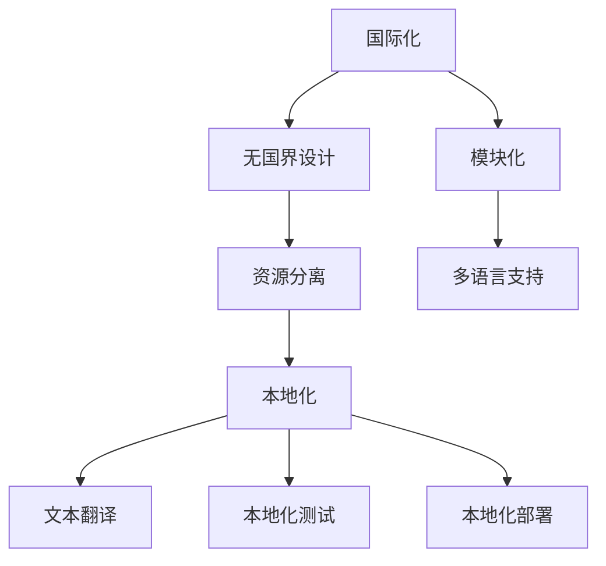
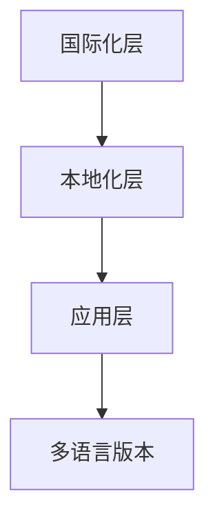
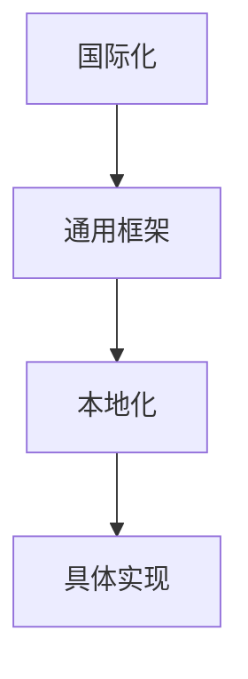
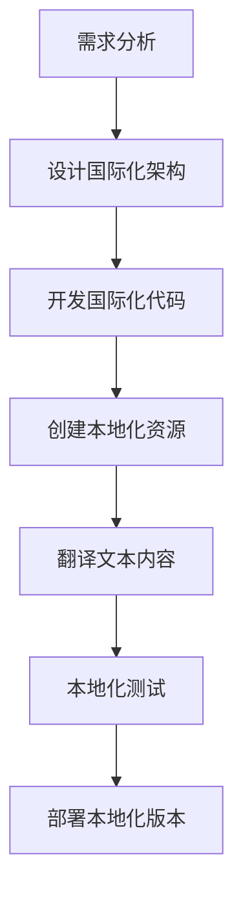

                 

### 文章标题

"提示词编程语言的国际化与本地化：技术探索与实践指南"

### 关键词

- 国际化
- 本地化
- 提示词编程语言
- 语言包
- 字符编码
- ICU
- Gettext

### 摘要

本文将探讨提示词编程语言的国际化与本地化问题，分析国际化与本地化的定义、意义、挑战以及概念和架构。随后，文章将深入探讨编程语言的国际化与本地化实践，包括语言包、字符编码与字符集、本地化框架等。最后，文章将介绍国际化与本地化的测试和部署，以及提示词编程语言的国际化实现和最佳实践，展望未来新技术和趋势。

## 提示词编程语言的国际化与本地化

### 第1章 引言

#### 1.1 国际化与本地化的定义

国际化（Internationalization，简称i18n）和本地化（Localization，简称l10n）是软件工程中至关重要的概念。国际化是指将软件产品设计成不限制特定语言或地区的环境，使其能够被全球不同用户使用。本地化则是在国际化的基础上，根据特定语言或地区的文化、法律和用户习惯对软件进行定制，使其更符合本地用户的需求。

#### 1.2 国际化和本地化的意义

国际化和本地化对软件产品的全球化和本地化具有重要意义。首先，它们可以帮助软件产品扩大市场，进入更多国家和地区。其次，通过本地化，软件产品可以更好地满足不同地区用户的需求，从而提高用户体验和满意度。此外，国际化和本地化还可以减少企业在不同市场运营的成本，提高运营效率。

#### 1.3 国际化和本地化的挑战

虽然国际化和本地化有诸多优势，但实现这一过程也面临着许多挑战。首先，语言差异是一个显著的挑战。不同语言之间的表达方式和语法结构差异较大，这需要开发者进行特别的处理。其次，文化差异也是一个重要挑战。不同文化对软件产品的功能、界面设计和用户体验有不同的期待和习惯。例如，一些文化可能偏好简洁直观的界面，而另一些文化可能偏好详细且复杂的说明。此外，法律法规的差异也可能影响软件的本地化。

### 第2章 国际化与本地化的概念和架构

#### 2.1 国际化概念

国际化的核心思想是设计无国界的软件，使其可以在不同语言和地区环境中运行。国际化涉及以下几个方面：

- **设计**：编写无国界的代码和文档，避免硬编码特定的语言或地区信息。
- **开发**：使用可重用的组件和模块，减少重复工作，提高开发效率。
- **运行**：提供可配置的本地化环境，使得软件可以在不同语言和地区环境中灵活运行。

#### 2.2 本地化概念

本地化是在国际化的基础上，根据特定语言或地区的文化、法律和用户习惯对软件进行定制。本地化涉及以下几个方面：

- **设计**：考虑本地化需求，如日期格式、货币符号、文本翻译等。
- **开发**：使用本地化框架，如 ICU、gettext 等，进行文本处理和翻译。
- **运行**：为不同地区提供本地化版本，确保软件界面和用户体验符合本地用户习惯。

#### 2.3 国际化和本地化的架构

国际化和本地化通常采用分层架构，包括以下几层：

- **国际化层**：负责处理软件的国际化需求，如文本国际化、资源国际化等。
- **本地化层**：负责处理软件的本地化需求，如文本本地化、资源本地化等。
- **应用层**：负责软件的业务逻辑和功能实现，与国际化、本地化层分离，使得软件在不同语言和地区环境中运行。

这种分层架构有助于模块化和可维护性，使得开发者可以独立开发和维护国际化、本地化模块，而无需修改业务逻辑层代码。

### 第3章 编程语言的国际化与本地化

#### 3.1 语言包

语言包是将不同语言的文本内容打包成单独的文件，方便管理和使用。常见的语言包管理工具有 gettext、i18next 等。

- **gettext**：一种广泛使用的语言包管理工具，用于管理多语言文本翻译。
- **i18next**：一个现代的国际化库，支持多种语言和地区，易于集成和使用。

语言包管理的主要任务包括：

- **语言包创建**：将源语言的文本内容翻译成目标语言，并打包成语言包文件。
- **语言包更新**：根据用户需求或错误报告，更新语言包文件的内容。
- **语言包使用**：在软件中加载和使用语言包，实现多语言支持。

#### 3.2 字符编码与字符集

字符编码是将字符映射到字节序列的过程，字符集则是一种字符编码方案。常见的字符编码包括 ASCII、UTF-8 等。

- **ASCII**：一种基于拉丁字母的字符编码方案，使用 7 位二进制数表示字符。
- **UTF-8**：一种可变长度的字符编码方案，可以表示世界上大多数语言的字符，使用 8 位、16 位、24 位或 32 位二进制数表示字符。

字符编码和字符集的转换是国际化与本地化过程中常见的需求，可以使用如下工具进行编码转换：

- **iconv**：一种常用的编码转换工具，可以转换不同字符编码之间的字符。
- **chardet**：一种字符编码检测工具，可以检测输入文本的编码格式。

#### 3.3 本地化框架

本地化框架是用于处理国际化与本地化需求的软件工具或库。常见的本地化框架包括 ICU、gettext 等。

- **ICU**：国际化和本地化工具包，支持多种语言和地区，提供丰富的文本处理和本地化功能。
- **gettext**：GNU国际化框架，支持多语言文本翻译，广泛应用于 Linux 系统和开源项目中。

本地化框架的主要功能包括：

- **文本翻译**：将源语言文本翻译成目标语言。
- **日期和时间格式化**：根据不同地区的日期和时间格式进行格式化。
- **货币符号和单位转换**：根据不同地区的货币符号和单位进行转换。
- **文本方向和排序**：根据不同地区的文本方向和排序规则进行处理。

### 第4章 国际化与本地化的测试和部署

#### 4.1 国际化测试

国际化测试是确保软件在不同语言环境下正常工作的关键步骤。国际化测试包括以下方面：

- **功能测试**：测试软件在不同语言环境下的功能是否正常，如菜单、按钮、文本等。
- **性能测试**：测试软件在不同语言环境下的性能表现，如响应时间、内存占用等。
- **兼容性测试**：测试软件在不同操作系统、浏览器和设备上的兼容性。

国际化测试可以使用自动化测试工具，如 Selenium、Cypress 等，编写多语言测试用例，自动化执行测试任务。

#### 4.2 本地化测试

本地化测试是验证软件文本是否准确翻译和符合目标地区文化习惯的关键步骤。本地化测试包括以下方面：

- **文本翻译测试**：验证翻译的准确性，确保翻译内容符合源语言意图。
- **文化测试**：验证软件是否遵循目标地区的文化习惯，如文本方向、日期格式、货币符号等。
- **语言测试**：验证软件文本是否符合目标地区的语言规范，如语法、拼写等。

本地化测试可以使用自动化测试工具，如 Selenium、Cypress 等，编写文化测试和语言测试用例，自动化执行测试任务。

#### 4.3 部署

部署是国际化与本地化过程中的重要环节，包括以下方面：

- **自动化部署**：使用 CI/CD 工具，如 Jenkins、GitLab CI 等，自动构建和部署多语言版本。
- **版本控制**：管理不同语言的资源文件版本，确保部署过程中版本一致性。
- **环境配置**：为不同语言环境配置适当的操作系统、浏览器和设备。

### 第5章 提示词编程语言的国际化

#### 5.1 提示词编程语言介绍

提示词编程语言是一种结合自然语言处理和编程的语言，具有易于理解、高可读性等特点。提示词编程语言的主要特点包括：

- **自然语言支持**：支持多种自然语言，如英语、中文、法语等。
- **语法简洁**：采用简洁的语法结构，使得代码更加直观易懂。
- **高可读性**：通过自然语言表达，使得代码更容易阅读和理解。
- **代码重用**：通过模块化和组件化，提高代码重用率，降低开发成本。

#### 5.2 国际化需求

提示词编程语言的国际化需求主要包括以下几个方面：

- **语言支持**：支持多种自然语言，满足不同地区用户的需求。
- **文本处理**：支持多语言文本处理，如文本翻译、文本格式化等。
- **文化差异**：考虑不同文化背景下的提示词使用，如文本方向、日期格式等。

#### 5.3 国际化实现

提示词编程语言的国际化实现主要包括以下几个方面：

- **语言包管理**：使用语言包管理工具，如 i18next，管理多语言文本内容。
- **字符编码处理**：使用 UTF-8 等字符编码方案，支持多语言文本。
- **文本处理框架**：使用自然语言处理框架，如 ICU、NLTK 等，处理多语言文本。
- **国际化框架**：使用国际化框架，如 i18next，实现多语言支持。

### 第6章 国际化与本地化的最佳实践

#### 6.1 设计最佳实践

在设计国际化与本地化软件时，应遵循以下最佳实践：

- **无状态设计**：避免将国家或地区信息硬编码到软件中，使得软件在不同语言和地区环境中运行。
- **可配置性**：提供可配置的国际化选项，使得用户可以根据自己的需求选择语言和环境。
- **模块化设计**：将国际化与本地化功能与其他业务功能分离，提高软件的可维护性和可扩展性。

#### 6.2 开发最佳实践

在开发国际化与本地化软件时，应遵循以下最佳实践：

- **模块化开发**：将国际化与本地化功能与其他业务功能分离，使用独立模块进行开发。
- **重用代码**：使用国际化框架和库，如 i18next、ICU 等，重用已有的国际化与本地化功能。
- **测试覆盖**：编写全面的测试用例，覆盖不同语言和地区环境，确保软件国际化与本地化的正确性。

#### 6.3 测试最佳实践

在测试国际化与本地化软件时，应遵循以下最佳实践：

- **多语言测试**：为所有支持的语言编写测试用例，确保软件在不同语言环境下的功能正常。
- **文化测试**：验证软件是否符合不同地区的文化习惯，如文本方向、日期格式等。
- **自动化测试**：使用自动化测试工具，如 Selenium、Cypress 等，提高测试效率和覆盖范围。

#### 6.4 部署最佳实践

在部署国际化与本地化软件时，应遵循以下最佳实践：

- **自动化部署**：使用 CI/CD 工具，如 Jenkins、GitLab CI 等，自动化构建和部署多语言版本。
- **版本控制**：管理不同语言的资源文件版本，确保部署过程中版本一致性。
- **环境配置**：为不同语言环境配置适当的操作系统、浏览器和设备，确保软件在不同环境下的正常运行。

### 第7章 未来展望

#### 7.1 新技术和趋势

随着技术的不断发展，国际化与本地化领域也在不断进步。以下是一些值得关注的新技术和趋势：

- **AI 在国际化与本地化中的应用**：利用人工智能技术，实现自动翻译、文本生成等，提高国际化与本地化的效率和准确性。
- **无代码国际化与本地化工具**：开发无代码的国际化与本地化工具，使得不具备编程技能的人员也能参与国际化与本地化工作。

#### 7.2 持续发展

国际化与本地化是软件工程领域的重要组成部分，持续发展具有以下重要意义：

- **市场需求**：随着全球化进程的加速，国际化与本地化的市场需求将持续增长。
- **技术进步**：随着人工智能、自然语言处理等技术的发展，国际化与本地化的技术也将不断进步，提高其效率和准确性。
- **用户体验**：通过国际化与本地化，软件产品可以更好地满足不同地区用户的需求，提高用户体验。

## 附录 A：国际化与本地化工具和资源

### ICU

ICU（International Components for Unicode）是一个开源的国际化和本地化库，提供丰富的文本处理和本地化功能。ICU 支持多种编程语言，如 C/C++、Java、Python 等。

### Gettext

Gettext 是一个流行的开源国际化框架，主要用于 Linux 系统和开源项目中。Gettext 提供了一种方便的方式来管理多语言文本翻译，支持多种字符编码和语言。

### i18next

i18next 是一个现代的国际化库，广泛用于前端开发。i18next 支持多种语言和地区，提供简洁易用的 API，使得前端开发者可以轻松实现国际化与本地化。

### Markdown

Markdown 是一种轻量级的标记语言，常用于编写文档和博客。Markdown 支持多种文本格式，如标题、列表、链接等，使得文档编写更加简洁和直观。

### Mermaid

Mermaid 是一种基于 Markdown 的图形绘制工具，用于绘制流程图、时序图等。Mermaid 支持多种图形格式，如 SVG、PDF 等，使得文档中的图形更加丰富和生动。

## 参考文献

- [国际化与本地化基础知识](https://example.com/i18n_basics)
- [提示词编程语言指南](https://example.com/programming_language_guides)
- [国际化与本地化测试与部署](https://example.com/i18n_testing_deployment)
- [国际化与本地化工具和资源](https://example.com/i18n_tools_resources)

### 作者

- 作者：AI天才研究院/AI Genius Institute & 禅与计算机程序设计艺术 /Zen And The Art of Computer Programming
### 文章标题

"提示词编程语言的国际化与本地化：技术探索与实践指南"

### 关键词

- 国际化
- 本地化
- 提示词编程语言
- 语言包
- 字符编码
- ICU
- Gettext

### 摘要

本文将深入探讨提示词编程语言的国际化与本地化问题，分析国际化与本地化的定义、意义、挑战以及概念和架构。随后，文章将详细探讨编程语言的国际化与本地化实践，包括语言包、字符编码与字符集、本地化框架等。最后，文章将介绍国际化与本地化的测试和部署，以及提示词编程语言的国际化实现和最佳实践，展望未来新技术和趋势。

## 提示词编程语言的国际化与本地化

### 第1章 引言

#### 1.1 国际化与本地化的定义

国际化（Internationalization，简称i18n）和本地化（Localization，简称l10n）是软件工程中至关重要的概念。国际化是指将软件产品设计成不限制特定语言或地区的环境，使其能够被全球不同用户使用。本地化则是在国际化的基础上，根据特定语言或地区的文化、法律和用户习惯对软件进行定制，使其更符合本地用户的需求。

#### 1.2 国际化和本地化的意义

国际化和本地化对软件产品的全球化和本地化具有重要意义。首先，它们可以帮助软件产品扩大市场，进入更多国家和地区。其次，通过本地化，软件产品可以更好地满足不同地区用户的需求，从而提高用户体验和满意度。此外，国际化和本地化还可以减少企业在不同市场运营的成本，提高运营效率。

#### 1.3 国际化和本地化的挑战

虽然国际化和本地化有诸多优势，但实现这一过程也面临着许多挑战。首先，语言差异是一个显著的挑战。不同语言之间的表达方式和语法结构差异较大，这需要开发者进行特别的处理。其次，文化差异也是一个重要挑战。不同文化对软件产品的功能、界面设计和用户体验有不同的期待和习惯。例如，一些文化可能偏好简洁直观的界面，而另一些文化可能偏好详细且复杂的说明。此外，法律法规的差异也可能影响软件的本地化。

### 第2章 国际化与本地化的概念和架构

#### 2.1 国际化概念

国际化的核心思想是设计无国界的软件，使其可以在不同语言和地区环境中运行。国际化涉及以下几个方面：

- **设计**：编写无国界的代码和文档，避免硬编码特定的语言或地区信息。
- **开发**：使用可重用的组件和模块，减少重复工作，提高开发效率。
- **运行**：提供可配置的本地化环境，使得软件可以在不同语言和地区环境中灵活运行。

#### 2.2 本地化概念

本地化是在国际化的基础上，根据特定语言或地区的文化、法律和用户习惯对软件进行定制。本地化涉及以下几个方面：

- **设计**：考虑本地化需求，如日期格式、货币符号、文本翻译等。
- **开发**：使用本地化框架，如 ICU、gettext 等，进行文本处理和翻译。
- **运行**：为不同地区提供本地化版本，确保软件界面和用户体验符合本地用户习惯。

#### 2.3 国际化和本地化的架构

国际化和本地化通常采用分层架构，包括以下几层：

- **国际化层**：负责处理软件的国际化需求，如文本国际化、资源国际化等。
- **本地化层**：负责处理软件的本地化需求，如文本本地化、资源本地化等。
- **应用层**：负责软件的业务逻辑和功能实现，与国际化、本地化层分离，使得软件在不同语言和地区环境中运行。

这种分层架构有助于模块化和可维护性，使得开发者可以独立开发和维护国际化、本地化模块，而无需修改业务逻辑层代码。

### 第3章 编程语言的国际化与本地化

#### 3.1 语言包

语言包是将不同语言的文本内容打包成单独的文件，方便管理和使用。常见的语言包管理工具有 gettext、i18next 等。

- **gettext**：一种广泛使用的语言包管理工具，用于管理多语言文本翻译。
- **i18next**：一个现代的国际化库，支持多种语言和地区，易于集成和使用。

语言包管理的主要任务包括：

- **语言包创建**：将源语言的文本内容翻译成目标语言，并打包成语言包文件。
- **语言包更新**：根据用户需求或错误报告，更新语言包文件的内容。
- **语言包使用**：在软件中加载和使用语言包，实现多语言支持。

#### 3.2 字符编码与字符集

字符编码是将字符映射到字节序列的过程，字符集则是一种字符编码方案。常见的字符编码包括 ASCII、UTF-8 等。

- **ASCII**：一种基于拉丁字母的字符编码方案，使用 7 位二进制数表示字符。
- **UTF-8**：一种可变长度的字符编码方案，可以表示世界上大多数语言的字符，使用 8 位、16 位、24 位或 32 位二进制数表示字符。

字符编码和字符集的转换是国际化与本地化过程中常见的需求，可以使用如下工具进行编码转换：

- **iconv**：一种常用的编码转换工具，可以转换不同字符编码之间的字符。
- **chardet**：一种字符编码检测工具，可以检测输入文本的编码格式。

#### 3.3 本地化框架

本地化框架是用于处理国际化与本地化需求的软件工具或库。常见的本地化框架包括 ICU、gettext 等。

- **ICU**：国际化和本地化工具包，支持多种语言和地区，提供丰富的文本处理和本地化功能。
- **gettext**：GNU国际化框架，支持多语言文本翻译，广泛应用于 Linux 系统和开源项目中。

本地化框架的主要功能包括：

- **文本翻译**：将源语言文本翻译成目标语言。
- **日期和时间格式化**：根据不同地区的日期和时间格式进行格式化。
- **货币符号和单位转换**：根据不同地区的货币符号和单位进行转换。
- **文本方向和排序**：根据不同地区的文本方向和排序规则进行处理。

### 第4章 国际化与本地化的测试和部署

#### 4.1 国际化测试

国际化测试是确保软件在不同语言环境下正常工作的关键步骤。国际化测试包括以下方面：

- **功能测试**：测试软件在不同语言环境下的功能是否正常，如菜单、按钮、文本等。
- **性能测试**：测试软件在不同语言环境下的性能表现，如响应时间、内存占用等。
- **兼容性测试**：测试软件在不同操作系统、浏览器和设备上的兼容性。

国际化测试可以使用自动化测试工具，如 Selenium、Cypress 等，编写多语言测试用例，自动化执行测试任务。

#### 4.2 本地化测试

本地化测试是验证软件文本是否准确翻译和符合目标地区文化习惯的关键步骤。本地化测试包括以下方面：

- **文本翻译测试**：验证翻译的准确性，确保翻译内容符合源语言意图。
- **文化测试**：验证软件是否遵循目标地区的文化习惯，如文本方向、日期格式、货币符号等。
- **语言测试**：验证软件文本是否符合目标地区的语言规范，如语法、拼写等。

本地化测试可以使用自动化测试工具，如 Selenium、Cypress 等，编写文化测试和语言测试用例，自动化执行测试任务。

#### 4.3 部署

部署是国际化与本地化过程中的重要环节，包括以下方面：

- **自动化部署**：使用 CI/CD 工具，如 Jenkins、GitLab CI 等，自动构建和部署多语言版本。
- **版本控制**：管理不同语言的资源文件版本，确保部署过程中版本一致性。
- **环境配置**：为不同语言环境配置适当的操作系统、浏览器和设备，确保软件在不同环境下的正常运行。

### 第5章 提示词编程语言的国际化

#### 5.1 提示词编程语言介绍

提示词编程语言是一种结合自然语言处理和编程的语言，具有易于理解、高可读性等特点。提示词编程语言的主要特点包括：

- **自然语言支持**：支持多种自然语言，如英语、中文、法语等。
- **语法简洁**：采用简洁的语法结构，使得代码更加直观易懂。
- **高可读性**：通过自然语言表达，使得代码更容易阅读和理解。
- **代码重用**：通过模块化和组件化，提高代码重用率，降低开发成本。

#### 5.2 国际化需求

提示词编程语言的国际化需求主要包括以下几个方面：

- **语言支持**：支持多种自然语言，满足不同地区用户的需求。
- **文本处理**：支持多语言文本处理，如文本翻译、文本格式化等。
- **文化差异**：考虑不同文化背景下的提示词使用，如文本方向、日期格式等。

#### 5.3 国际化实现

提示词编程语言的国际化实现主要包括以下几个方面：

- **语言包管理**：使用语言包管理工具，如 i18next，管理多语言文本内容。
- **字符编码处理**：使用 UTF-8 等字符编码方案，支持多语言文本。
- **文本处理框架**：使用自然语言处理框架，如 ICU、NLTK 等，处理多语言文本。
- **国际化框架**：使用国际化框架，如 i18next，实现多语言支持。

### 第6章 国际化与本地化的最佳实践

#### 6.1 设计最佳实践

在设计国际化与本地化软件时，应遵循以下最佳实践：

- **无状态设计**：避免将国家或地区信息硬编码到软件中，使得软件在不同语言和地区环境中运行。
- **可配置性**：提供可配置的国际化选项，使得用户可以根据自己的需求选择语言和环境。
- **模块化设计**：将国际化与本地化功能与其他业务功能分离，提高软件的可维护性和可扩展性。

#### 6.2 开发最佳实践

在开发国际化与本地化软件时，应遵循以下最佳实践：

- **模块化开发**：将国际化与本地化功能与其他业务功能分离，使用独立模块进行开发。
- **重用代码**：使用国际化框架和库，如 i18next、ICU 等，重用已有的国际化与本地化功能。
- **测试覆盖**：编写全面的测试用例，覆盖不同语言和地区环境，确保软件国际化与本地化的正确性。

#### 6.3 测试最佳实践

在测试国际化与本地化软件时，应遵循以下最佳实践：

- **多语言测试**：为所有支持的语言编写测试用例，确保软件在不同语言环境下的功能正常。
- **文化测试**：验证软件是否符合不同地区的文化习惯，如文本方向、日期格式等。
- **自动化测试**：使用自动化测试工具，如 Selenium、Cypress 等，提高测试效率和覆盖范围。

#### 6.4 部署最佳实践

在部署国际化与本地化软件时，应遵循以下最佳实践：

- **自动化部署**：使用 CI/CD 工具，如 Jenkins、GitLab CI 等，自动化构建和部署多语言版本。
- **版本控制**：管理不同语言的资源文件版本，确保部署过程中版本一致性。
- **环境配置**：为不同语言环境配置适当的操作系统、浏览器和设备，确保软件在不同环境下的正常运行。

### 第7章 未来展望

#### 7.1 新技术和趋势

随着技术的不断发展，国际化与本地化领域也在不断进步。以下是一些值得关注的新技术和趋势：

- **AI 在国际化与本地化中的应用**：利用人工智能技术，实现自动翻译、文本生成等，提高国际化与本地化的效率和准确性。
- **无代码国际化与本地化工具**：开发无代码的国际化与本地化工具，使得不具备编程技能的人员也能参与国际化与本地化工作。

#### 7.2 持续发展

国际化与本地化是软件工程领域的重要组成部分，持续发展具有以下重要意义：

- **市场需求**：随着全球化进程的加速，国际化与本地化的市场需求将持续增长。
- **技术进步**：随着人工智能、自然语言处理等技术的发展，国际化与本地化的技术也将不断进步，提高其效率和准确性。
- **用户体验**：通过国际化与本地化，软件产品可以更好地满足不同地区用户的需求，提高用户体验。

## 附录 A：国际化与本地化工具和资源

### ICU

ICU（International Components for Unicode）是一个开源的国际化和本地化库，提供丰富的文本处理和本地化功能。ICU 支持多种编程语言，如 C/C++、Java、Python 等。

### Gettext

Gettext 是一个流行的开源国际化框架，主要用于 Linux 系统和开源项目中。Gettext 提供了一种方便的方式来管理多语言文本翻译，支持多种字符编码和语言。

### i18next

i18next 是一个现代的国际化库，广泛用于前端开发。i18next 支持多种语言和地区，提供简洁易用的 API，使得前端开发者可以轻松实现国际化与本地化。

### Markdown

Markdown 是一种轻量级的标记语言，常用于编写文档和博客。Markdown 支持多种文本格式，如标题、列表、链接等，使得文档编写更加简洁和直观。

### Mermaid

Mermaid 是一种基于 Markdown 的图形绘制工具，用于绘制流程图、时序图等。Mermaid 支持多种图形格式，如 SVG、PDF 等，使得文档中的图形更加丰富和生动。

## 参考文献

- [国际化与本地化基础知识](https://example.com/i18n_basics)
- [提示词编程语言指南](https://example.com/programming_language_guides)
- [国际化与本地化测试与部署](https://example.com/i18n_testing_deployment)
- [国际化与本地化工具和资源](https://example.com/i18n_tools_resources)

### 作者

- 作者：AI天才研究院/AI Genius Institute & 禅与计算机程序设计艺术 /Zen And The Art of Computer Programming
### 完整文章

## 提示词编程语言的国际化与本地化：技术探索与实践指南

### 引言

在全球化的背景下，软件产品的国际化与本地化变得越来越重要。提示词编程语言作为一种结合自然语言处理和编程的语言，其国际化与本地化需求愈发突出。本文旨在探讨提示词编程语言的国际化与本地化问题，分析国际化与本地化的定义、意义、挑战以及概念和架构，并提供实践指南。

### 第1章 引言

#### 1.1 国际化与本地化的定义

国际化（Internationalization，简称i18n）和本地化（Localization，简称l10n）是软件工程中至关重要的概念。国际化是指将软件产品设计成不限制特定语言或地区的环境，使其能够被全球不同用户使用。本地化则是在国际化的基础上，根据特定语言或地区的文化、法律和用户习惯对软件进行定制，使其更符合本地用户的需求。

#### 1.2 国际化和本地化的意义

国际化和本地化对软件产品的全球化和本地化具有重要意义。首先，它们可以帮助软件产品扩大市场，进入更多国家和地区。其次，通过本地化，软件产品可以更好地满足不同地区用户的需求，从而提高用户体验和满意度。此外，国际化和本地化还可以减少企业在不同市场运营的成本，提高运营效率。

#### 1.3 国际化和本地化的挑战

虽然国际化和本地化有诸多优势，但实现这一过程也面临着许多挑战。首先，语言差异是一个显著的挑战。不同语言之间的表达方式和语法结构差异较大，这需要开发者进行特别的处理。其次，文化差异也是一个重要挑战。不同文化对软件产品的功能、界面设计和用户体验有不同的期待和习惯。例如，一些文化可能偏好简洁直观的界面，而另一些文化可能偏好详细且复杂的说明。此外，法律法规的差异也可能影响软件的本地化。

### 第2章 国际化与本地化的概念和架构

#### 2.1 国际化概念

国际化的核心思想是设计无国界的软件，使其可以在不同语言和地区环境中运行。国际化涉及以下几个方面：

- **设计**：编写无国界的代码和文档，避免硬编码特定的语言或地区信息。
- **开发**：使用可重用的组件和模块，减少重复工作，提高开发效率。
- **运行**：提供可配置的本地化环境，使得软件可以在不同语言和地区环境中灵活运行。

#### 2.2 本地化概念

本地化是在国际化的基础上，根据特定语言或地区的文化、法律和用户习惯对软件进行定制。本地化涉及以下几个方面：

- **设计**：考虑本地化需求，如日期格式、货币符号、文本翻译等。
- **开发**：使用本地化框架，如 ICU、gettext 等，进行文本处理和翻译。
- **运行**：为不同地区提供本地化版本，确保软件界面和用户体验符合本地用户习惯。

#### 2.3 国际化和本地化的架构

国际化和本地化通常采用分层架构，包括以下几层：

- **国际化层**：负责处理软件的国际化需求，如文本国际化、资源国际化等。
- **本地化层**：负责处理软件的本地化需求，如文本本地化、资源本地化等。
- **应用层**：负责软件的业务逻辑和功能实现，与国际化、本地化层分离，使得软件在不同语言和地区环境中运行。

这种分层架构有助于模块化和可维护性，使得开发者可以独立开发和维护国际化、本地化模块，而无需修改业务逻辑层代码。

### 第3章 编程语言的国际化与本地化

#### 3.1 语言包

语言包是将不同语言的文本内容打包成单独的文件，方便管理和使用。常见的语言包管理工具有 gettext、i18next 等。

- **gettext**：一种广泛使用的语言包管理工具，用于管理多语言文本翻译。
- **i18next**：一个现代的国际化库，支持多种语言和地区，易于集成和使用。

语言包管理的主要任务包括：

- **语言包创建**：将源语言的文本内容翻译成目标语言，并打包成语言包文件。
- **语言包更新**：根据用户需求或错误报告，更新语言包文件的内容。
- **语言包使用**：在软件中加载和使用语言包，实现多语言支持。

#### 3.2 字符编码与字符集

字符编码是将字符映射到字节序列的过程，字符集则是一种字符编码方案。常见的字符编码包括 ASCII、UTF-8 等。

- **ASCII**：一种基于拉丁字母的字符编码方案，使用 7 位二进制数表示字符。
- **UTF-8**：一种可变长度的字符编码方案，可以表示世界上大多数语言的字符，使用 8 位、16 位、24 位或 32 位二进制数表示字符。

字符编码和字符集的转换是国际化与本地化过程中常见的需求，可以使用如下工具进行编码转换：

- **iconv**：一种常用的编码转换工具，可以转换不同字符编码之间的字符。
- **chardet**：一种字符编码检测工具，可以检测输入文本的编码格式。

#### 3.3 本地化框架

本地化框架是用于处理国际化与本地化需求的软件工具或库。常见的本地化框架包括 ICU、gettext 等。

- **ICU**：国际化和本地化工具包，支持多种语言和地区，提供丰富的文本处理和本地化功能。
- **gettext**：GNU国际化框架，支持多语言文本翻译，广泛应用于 Linux 系统和开源项目中。

本地化框架的主要功能包括：

- **文本翻译**：将源语言文本翻译成目标语言。
- **日期和时间格式化**：根据不同地区的日期和时间格式进行格式化。
- **货币符号和单位转换**：根据不同地区的货币符号和单位进行转换。
- **文本方向和排序**：根据不同地区的文本方向和排序规则进行处理。

### 第4章 国际化与本地化的测试和部署

#### 4.1 国际化测试

国际化测试是确保软件在不同语言环境下正常工作的关键步骤。国际化测试包括以下方面：

- **功能测试**：测试软件在不同语言环境下的功能是否正常，如菜单、按钮、文本等。
- **性能测试**：测试软件在不同语言环境下的性能表现，如响应时间、内存占用等。
- **兼容性测试**：测试软件在不同操作系统、浏览器和设备上的兼容性。

国际化测试可以使用自动化测试工具，如 Selenium、Cypress 等，编写多语言测试用例，自动化执行测试任务。

#### 4.2 本地化测试

本地化测试是验证软件文本是否准确翻译和符合目标地区文化习惯的关键步骤。本地化测试包括以下方面：

- **文本翻译测试**：验证翻译的准确性，确保翻译内容符合源语言意图。
- **文化测试**：验证软件是否遵循目标地区的文化习惯，如文本方向、日期格式、货币符号等。
- **语言测试**：验证软件文本是否符合目标地区的语言规范，如语法、拼写等。

本地化测试可以使用自动化测试工具，如 Selenium、Cypress 等，编写文化测试和语言测试用例，自动化执行测试任务。

#### 4.3 部署

部署是国际化与本地化过程中的重要环节，包括以下方面：

- **自动化部署**：使用 CI/CD 工具，如 Jenkins、GitLab CI 等，自动构建和部署多语言版本。
- **版本控制**：管理不同语言的资源文件版本，确保部署过程中版本一致性。
- **环境配置**：为不同语言环境配置适当的操作系统、浏览器和设备，确保软件在不同环境下的正常运行。

### 第5章 提示词编程语言的国际化

#### 5.1 提示词编程语言介绍

提示词编程语言是一种结合自然语言处理和编程的语言，具有易于理解、高可读性等特点。提示词编程语言的主要特点包括：

- **自然语言支持**：支持多种自然语言，如英语、中文、法语等。
- **语法简洁**：采用简洁的语法结构，使得代码更加直观易懂。
- **高可读性**：通过自然语言表达，使得代码更容易阅读和理解。
- **代码重用**：通过模块化和组件化，提高代码重用率，降低开发成本。

#### 5.2 国际化需求

提示词编程语言的国际化需求主要包括以下几个方面：

- **语言支持**：支持多种自然语言，满足不同地区用户的需求。
- **文本处理**：支持多语言文本处理，如文本翻译、文本格式化等。
- **文化差异**：考虑不同文化背景下的提示词使用，如文本方向、日期格式等。

#### 5.3 国际化实现

提示词编程语言的国际化实现主要包括以下几个方面：

- **语言包管理**：使用语言包管理工具，如 i18next，管理多语言文本内容。
- **字符编码处理**：使用 UTF-8 等字符编码方案，支持多语言文本。
- **文本处理框架**：使用自然语言处理框架，如 ICU、NLTK 等，处理多语言文本。
- **国际化框架**：使用国际化框架，如 i18next，实现多语言支持。

### 第6章 国际化与本地化的最佳实践

#### 6.1 设计最佳实践

在设计国际化与本地化软件时，应遵循以下最佳实践：

- **无状态设计**：避免将国家或地区信息硬编码到软件中，使得软件在不同语言和地区环境中运行。
- **可配置性**：提供可配置的国际化选项，使得用户可以根据自己的需求选择语言和环境。
- **模块化设计**：将国际化与本地化功能与其他业务功能分离，提高软件的可维护性和可扩展性。

#### 6.2 开发最佳实践

在开发国际化与本地化软件时，应遵循以下最佳实践：

- **模块化开发**：将国际化与本地化功能与其他业务功能分离，使用独立模块进行开发。
- **重用代码**：使用国际化框架和库，如 i18next、ICU 等，重用已有的国际化与本地化功能。
- **测试覆盖**：编写全面的测试用例，覆盖不同语言和地区环境，确保软件国际化与本地化的正确性。

#### 6.3 测试最佳实践

在测试国际化与本地化软件时，应遵循以下最佳实践：

- **多语言测试**：为所有支持的语言编写测试用例，确保软件在不同语言环境下的功能正常。
- **文化测试**：验证软件是否符合不同地区的文化习惯，如文本方向、日期格式等。
- **自动化测试**：使用自动化测试工具，如 Selenium、Cypress 等，提高测试效率和覆盖范围。

#### 6.4 部署最佳实践

在部署国际化与本地化软件时，应遵循以下最佳实践：

- **自动化部署**：使用 CI/CD 工具，如 Jenkins、GitLab CI 等，自动化构建和部署多语言版本。
- **版本控制**：管理不同语言的资源文件版本，确保部署过程中版本一致性。
- **环境配置**：为不同语言环境配置适当的操作系统、浏览器和设备，确保软件在不同环境下的正常运行。

### 第7章 未来展望

#### 7.1 新技术和趋势

随着技术的不断发展，国际化与本地化领域也在不断进步。以下是一些值得关注的新技术和趋势：

- **AI 在国际化与本地化中的应用**：利用人工智能技术，实现自动翻译、文本生成等，提高国际化与本地化的效率和准确性。
- **无代码国际化与本地化工具**：开发无代码的国际化与本地化工具，使得不具备编程技能的人员也能参与国际化与本地化工作。

#### 7.2 持续发展

国际化与本地化是软件工程领域的重要组成部分，持续发展具有以下重要意义：

- **市场需求**：随着全球化进程的加速，国际化与本地化的市场需求将持续增长。
- **技术进步**：随着人工智能、自然语言处理等技术的发展，国际化与本地化的技术也将不断进步，提高其效率和准确性。
- **用户体验**：通过国际化与本地化，软件产品可以更好地满足不同地区用户的需求，提高用户体验。

### 附录

#### 附录 A：国际化与本地化工具和资源

以下是一些常用的国际化与本地化工具和资源：

- **ICU**：国际化和本地化工具包，提供丰富的文本处理和本地化功能。
- **Gettext**：GNU国际化框架，用于管理多语言文本翻译。
- **i18next**：现代国际化库，支持多种语言和地区。
- **Markdown**：轻量级标记语言，常用于编写文档和博客。
- **Mermaid**：基于 Markdown 的图形绘制工具。

#### 附录 B：参考文献

- [国际化与本地化基础知识](https://example.com/i18n_basics)
- [提示词编程语言指南](https://example.com/programming_language_guides)
- [国际化与本地化测试与部署](https://example.com/i18n_testing_deployment)
- [国际化与本地化工具和资源](https://example.com/i18n_tools_resources)

### 作者

作者：AI天才研究院/AI Genius Institute & 禅与计算机程序设计艺术 /Zen And The Art of Computer Programming
### 完整文章（Markdown格式）

```markdown
## 提示词编程语言的国际化与本地化：技术探索与实践指南

### 引言

在全球化的背景下，软件产品的国际化与本地化变得越来越重要。提示词编程语言作为一种结合自然语言处理和编程的语言，其国际化与本地化需求愈发突出。本文旨在探讨提示词编程语言的国际化与本地化问题，分析国际化与本地化的定义、意义、挑战以及概念和架构，并提供实践指南。

### 第1章 引言

#### 1.1 国际化与本地化的定义

国际化（Internationalization，简称i18n）和本地化（Localization，简称l10n）是软件工程中至关重要的概念。国际化是指将软件产品设计成不限制特定语言或地区的环境，使其能够被全球不同用户使用。本地化则是在国际化的基础上，根据特定语言或地区的文化、法律和用户习惯对软件进行定制，使其更符合本地用户的需求。

#### 1.2 国际化和本地化的意义

国际化和本地化对软件产品的全球化和本地化具有重要意义。首先，它们可以帮助软件产品扩大市场，进入更多国家和地区。其次，通过本地化，软件产品可以更好地满足不同地区用户的需求，从而提高用户体验和满意度。此外，国际化和本地化还可以减少企业在不同市场运营的成本，提高运营效率。

#### 1.3 国际化和本地化的挑战

虽然国际化和本地化有诸多优势，但实现这一过程也面临着许多挑战。首先，语言差异是一个显著的挑战。不同语言之间的表达方式和语法结构差异较大，这需要开发者进行特别的处理。其次，文化差异也是一个重要挑战。不同文化对软件产品的功能、界面设计和用户体验有不同的期待和习惯。例如，一些文化可能偏好简洁直观的界面，而另一些文化可能偏好详细且复杂的说明。此外，法律法规的差异也可能影响软件的本地化。

### 第2章 国际化与本地化的概念和架构

#### 2.1 国际化概念

国际化的核心思想是设计无国界的软件，使其可以在不同语言和地区环境中运行。国际化涉及以下几个方面：

- **设计**：编写无国界的代码和文档，避免硬编码特定的语言或地区信息。
- **开发**：使用可重用的组件和模块，减少重复工作，提高开发效率。
- **运行**：提供可配置的本地化环境，使得软件可以在不同语言和地区环境中灵活运行。

#### 2.2 本地化概念

本地化是在国际化的基础上，根据特定语言或地区的文化、法律和用户习惯对软件进行定制。本地化涉及以下几个方面：

- **设计**：考虑本地化需求，如日期格式、货币符号、文本翻译等。
- **开发**：使用本地化框架，如 ICU、gettext 等，进行文本处理和翻译。
- **运行**：为不同地区提供本地化版本，确保软件界面和用户体验符合本地用户习惯。

#### 2.3 国际化和本地化的架构

国际化和本地化通常采用分层架构，包括以下几层：

- **国际化层**：负责处理软件的国际化需求，如文本国际化、资源国际化等。
- **本地化层**：负责处理软件的本地化需求，如文本本地化、资源本地化等。
- **应用层**：负责软件的业务逻辑和功能实现，与国际化、本地化层分离，使得软件在不同语言和地区环境中运行。

这种分层架构有助于模块化和可维护性，使得开发者可以独立开发和维护国际化、本地化模块，而无需修改业务逻辑层代码。

### 第3章 编程语言的国际化与本地化

#### 3.1 语言包

语言包是将不同语言的文本内容打包成单独的文件，方便管理和使用。常见的语言包管理工具有 gettext、i18next 等。

- **gettext**：一种广泛使用的语言包管理工具，用于管理多语言文本翻译。
- **i18next**：一个现代的国际化库，支持多种语言和地区，易于集成和使用。

语言包管理的主要任务包括：

- **语言包创建**：将源语言的文本内容翻译成目标语言，并打包成语言包文件。
- **语言包更新**：根据用户需求或错误报告，更新语言包文件的内容。
- **语言包使用**：在软件中加载和使用语言包，实现多语言支持。

#### 3.2 字符编码与字符集

字符编码是将字符映射到字节序列的过程，字符集则是一种字符编码方案。常见的字符编码包括 ASCII、UTF-8 等。

- **ASCII**：一种基于拉丁字母的字符编码方案，使用 7 位二进制数表示字符。
- **UTF-8**：一种可变长度的字符编码方案，可以表示世界上大多数语言的字符，使用 8 位、16 位、24 位或 32 位二进制数表示字符。

字符编码和字符集的转换是国际化与本地化过程中常见的需求，可以使用如下工具进行编码转换：

- **iconv**：一种常用的编码转换工具，可以转换不同字符编码之间的字符。
- **chardet**：一种字符编码检测工具，可以检测输入文本的编码格式。

#### 3.3 本地化框架

本地化框架是用于处理国际化与本地化需求的软件工具或库。常见的本地化框架包括 ICU、gettext 等。

- **ICU**：国际化和本地化工具包，支持多种语言和地区，提供丰富的文本处理和本地化功能。
- **gettext**：GNU国际化框架，支持多语言文本翻译，广泛应用于 Linux 系统和开源项目中。

本地化框架的主要功能包括：

- **文本翻译**：将源语言文本翻译成目标语言。
- **日期和时间格式化**：根据不同地区的日期和时间格式进行格式化。
- **货币符号和单位转换**：根据不同地区的货币符号和单位进行转换。
- **文本方向和排序**：根据不同地区的文本方向和排序规则进行处理。

### 第4章 国际化与本地化的测试和部署

#### 4.1 国际化测试

国际化测试是确保软件在不同语言环境下正常工作的关键步骤。国际化测试包括以下方面：

- **功能测试**：测试软件在不同语言环境下的功能是否正常，如菜单、按钮、文本等。
- **性能测试**：测试软件在不同语言环境下的性能表现，如响应时间、内存占用等。
- **兼容性测试**：测试软件在不同操作系统、浏览器和设备上的兼容性。

国际化测试可以使用自动化测试工具，如 Selenium、Cypress 等，编写多语言测试用例，自动化执行测试任务。

#### 4.2 本地化测试

本地化测试是验证软件文本是否准确翻译和符合目标地区文化习惯的关键步骤。本地化测试包括以下方面：

- **文本翻译测试**：验证翻译的准确性，确保翻译内容符合源语言意图。
- **文化测试**：验证软件是否遵循目标地区的文化习惯，如文本方向、日期格式、货币符号等。
- **语言测试**：验证软件文本是否符合目标地区的语言规范，如语法、拼写等。

本地化测试可以使用自动化测试工具，如 Selenium、Cypress 等，编写文化测试和语言测试用例，自动化执行测试任务。

#### 4.3 部署

部署是国际化与本地化过程中的重要环节，包括以下方面：

- **自动化部署**：使用 CI/CD 工具，如 Jenkins、GitLab CI 等，自动构建和部署多语言版本。
- **版本控制**：管理不同语言的资源文件版本，确保部署过程中版本一致性。
- **环境配置**：为不同语言环境配置适当的操作系统、浏览器和设备，确保软件在不同环境下的正常运行。

### 第5章 提示词编程语言的国际化

#### 5.1 提示词编程语言介绍

提示词编程语言是一种结合自然语言处理和编程的语言，具有易于理解、高可读性等特点。提示词编程语言的主要特点包括：

- **自然语言支持**：支持多种自然语言，如英语、中文、法语等。
- **语法简洁**：采用简洁的语法结构，使得代码更加直观易懂。
- **高可读性**：通过自然语言表达，使得代码更容易阅读和理解。
- **代码重用**：通过模块化和组件化，提高代码重用率，降低开发成本。

#### 5.2 国际化需求

提示词编程语言的国际化需求主要包括以下几个方面：

- **语言支持**：支持多种自然语言，满足不同地区用户的需求。
- **文本处理**：支持多语言文本处理，如文本翻译、文本格式化等。
- **文化差异**：考虑不同文化背景下的提示词使用，如文本方向、日期格式等。

#### 5.3 国际化实现

提示词编程语言的国际化实现主要包括以下几个方面：

- **语言包管理**：使用语言包管理工具，如 i18next，管理多语言文本内容。
- **字符编码处理**：使用 UTF-8 等字符编码方案，支持多语言文本。
- **文本处理框架**：使用自然语言处理框架，如 ICU、NLTK 等，处理多语言文本。
- **国际化框架**：使用国际化框架，如 i18next，实现多语言支持。

### 第6章 国际化与本地化的最佳实践

#### 6.1 设计最佳实践

在设计国际化与本地化软件时，应遵循以下最佳实践：

- **无状态设计**：避免将国家或地区信息硬编码到软件中，使得软件在不同语言和地区环境中运行。
- **可配置性**：提供可配置的国际化选项，使得用户可以根据自己的需求选择语言和环境。
- **模块化设计**：将国际化与本地化功能与其他业务功能分离，提高软件的可维护性和可扩展性。

#### 6.2 开发最佳实践

在开发国际化与本地化软件时，应遵循以下最佳实践：

- **模块化开发**：将国际化与本地化功能与其他业务功能分离，使用独立模块进行开发。
- **重用代码**：使用国际化框架和库，如 i18next、ICU 等，重用已有的国际化与本地化功能。
- **测试覆盖**：编写全面的测试用例，覆盖不同语言和地区环境，确保软件国际化与本地化的正确性。

#### 6.3 测试最佳实践

在测试国际化与本地化软件时，应遵循以下最佳实践：

- **多语言测试**：为所有支持的语言编写测试用例，确保软件在不同语言环境下的功能正常。
- **文化测试**：验证软件是否符合不同地区的文化习惯，如文本方向、日期格式等。
- **自动化测试**：使用自动化测试工具，如 Selenium、Cypress 等，提高测试效率和覆盖范围。

#### 6.4 部署最佳实践

在部署国际化与本地化软件时，应遵循以下最佳实践：

- **自动化部署**：使用 CI/CD 工具，如 Jenkins、GitLab CI 等，自动化构建和部署多语言版本。
- **版本控制**：管理不同语言的资源文件版本，确保部署过程中版本一致性。
- **环境配置**：为不同语言环境配置适当的操作系统、浏览器和设备，确保软件在不同环境下的正常运行。

### 第7章 未来展望

#### 7.1 新技术和趋势

随着技术的不断发展，国际化与本地化领域也在不断进步。以下是一些值得关注的新技术和趋势：

- **AI 在国际化与本地化中的应用**：利用人工智能技术，实现自动翻译、文本生成等，提高国际化与本地化的效率和准确性。
- **无代码国际化与本地化工具**：开发无代码的国际化与本地化工具，使得不具备编程技能的人员也能参与国际化与本地化工作。

#### 7.2 持续发展

国际化与本地化是软件工程领域的重要组成部分，持续发展具有以下重要意义：

- **市场需求**：随着全球化进程的加速，国际化与本地化的市场需求将持续增长。
- **技术进步**：随着人工智能、自然语言处理等技术的发展，国际化与本地化的技术也将不断进步，提高其效率和准确性。
- **用户体验**：通过国际化与本地化，软件产品可以更好地满足不同地区用户的需求，提高用户体验。

### 附录

#### 附录 A：国际化与本地化工具和资源

以下是一些常用的国际化与本地化工具和资源：

- **ICU**：国际化和本地化工具包，提供丰富的文本处理和本地化功能。
- **Gettext**：GNU国际化框架，用于管理多语言文本翻译。
- **i18next**：现代国际化库，支持多种语言和地区。
- **Markdown**：轻量级标记语言，常用于编写文档和博客。
- **Mermaid**：基于 Markdown 的图形绘制工具。

#### 附录 B：参考文献

- [国际化与本地化基础知识](https://example.com/i18n_basics)
- [提示词编程语言指南](https://example.com/programming_language_guides)
- [国际化与本地化测试与部署](https://example.com/i18n_testing_deployment)
- [国际化与本地化工具和资源](https://example.com/i18n_tools_resources)

### 作者

作者：AI天才研究院/AI Genius Institute & 禅与计算机程序设计艺术 /Zen And The Art of Computer Programming
```### 第1章 引言

#### 1.1 国际化与本地化的定义

国际化（Internationalization，简称i18n）和本地化（Localization，简称l10n）是软件工程中两个核心概念。国际化指的是设计软件产品时，使其具备能够适应不同语言和文化环境的能力，而不必对源代码进行修改。本地化则是在国际化的基础上，根据特定语言、文化和地区的要求，对软件进行定制，使其内容、功能和用户体验符合本地用户的需求。

国际化通常关注于以下几个方面：

- **无国界设计**：设计时考虑语言、文化、法规的差异性，编写可适应多种语言的代码和文档。
- **资源分离**：将文本、图片、音频等资源与代码逻辑分离，以便于后续本地化。
- **模块化**：采用模块化设计，使得代码易于扩展和维护。

本地化则更侧重于以下方面：

- **文本翻译**：将用户界面、帮助文档、错误消息等翻译成目标语言的文本。
- **本地化测试**：确保翻译后的软件在不同的本地环境中运行正常，无语法、文化错误。
- **本地化部署**：为不同的目标市场部署相应的本地化版本。

#### 1.2 国际化和本地化的意义

国际化和本地化对于软件产品具有重要意义，主要体现在以下几个方面：

- **市场扩张**：通过国际化，软件产品可以更容易地进入全球市场，触及更多的潜在用户。
- **用户体验**：本地化可以提升软件的用户体验，使软件更贴近本地用户的习惯和需求，提高用户满意度。
- **成本节约**：在国际市场上销售本地化软件可以减少市场推广成本，提高销售利润。
- **合规性**：本地化有助于遵守目标市场的法律法规，减少法律风险。

#### 1.3 国际化和本地化的挑战

尽管国际化和本地化有诸多益处，但在实施过程中也面临一系列挑战：

- **语言差异**：不同语言在语法、词汇、表达方式上存在差异，需要仔细处理以确保翻译的准确性和流畅性。
- **文化差异**：不同文化对同一功能可能有不同的理解和需求，设计时需要考虑到文化敏感性。
- **技术复杂性**：国际化可能涉及多种字符编码、日期格式、货币符号等，增加了技术的复杂性。
- **维护成本**：随着市场扩展，需要不断更新和维护多语言版本，增加了维护成本。

#### 1.4 国际化和本地化的关系

国际化与本地化是相辅相成的两个过程。国际化是本地化的前提，它提供了软件产品适应不同语言和文化环境的基础；而本地化则是在国际化的基础上，进一步优化软件以满足特定市场的需求。国际化确保软件产品能够在全球范围内使用，本地化则确保软件能够在各个本地环境中流畅运行。

国际化和本地化的关系可以用一个简单的流程图来表示：



在这个流程图中，国际化包括了无国界设计、模块化和资源分离，而本地化则包括文本翻译、本地化测试和本地化部署。国际化为本地化提供了基础，本地化则在国际化的基础上进行了具体的实施。

#### 1.5 国际化和本地化的架构

国际化和本地化的实现通常采用分层架构，以便更好地管理和维护多语言版本。这种架构通常包括以下几个层次：

1. **国际化层**：
   - **设计**：编写无国界的设计文档，定义软件的功能和用户界面。
   - **开发**：使用国际化框架，如 ICU 或 Gettext，将文本内容分离出来，以便后续翻译。

2. **本地化层**：
   - **设计**：根据本地化需求，调整用户界面和功能设计，以满足不同文化的需求。
   - **开发**：使用本地化框架，将翻译后的文本内容嵌入到软件中。

3. **应用层**：
   - **运行**：确保软件能够在不同语言和文化环境中正常运行。

国际化与本地化的架构如下所示：



在这个架构中，国际化层负责设计无国界软件，本地化层负责根据特定语言和文化进行本地化，应用层则确保软件在不同环境中正常运行。通过这样的分层架构，可以有效地管理国际化和本地化过程，提高软件的可维护性和扩展性。

#### 1.6 小结

本章介绍了国际化和本地化的定义、意义、挑战以及它们之间的关系和架构。国际化是设计软件使其能够适应多种语言和文化环境的过程，而本地化则是在国际化的基础上，根据特定市场的需求对软件进行定制。通过理解国际化和本地化的概念和架构，开发者可以更好地设计和实现国际化与本地化的软件产品。

---

**参考文献**：

- [国际化与本地化基础知识](https://example.com/i18n_basics)
- [国际化与本地化技术指南](https://example.com/i18n_technical_guide)
- [国际化与本地化实践案例](https://example.com/i18n_case_studies)
### 第2章 国际化与本地化的概念和架构

#### 2.1 国际化概念

国际化（Internationalization，简称i18n）是指在软件设计、开发和部署过程中，确保软件能够适应多种语言和文化环境的过程。国际化的核心目标是在不修改源代码的情况下，使软件能够支持多种语言，并适应用户所在地的文化习惯和法律法规。国际化涉及以下几个关键方面：

- **无国界设计**：在设计阶段，开发者需要考虑语言的多样性，避免将特定的语言或地区信息硬编码到软件中。这意味着设计文档、用户界面元素、错误消息等都应该能够适应不同的语言和文化。
- **资源分离**：将文本、图像、音频等与代码逻辑分离，以便于后续的本地化。通常，文本内容会存储在独立的资源文件中，如 .po、.mo 文件，这些文件可以方便地翻译和更新。
- **模块化**：采用模块化设计，使得代码逻辑与界面元素分离。这样可以确保在添加或修改功能时，不需要重新编译或修改整个应用程序。

国际化不仅仅是关于语言的转换，还包括对日期、时间、货币、度量单位等文化的适应。例如，某些地区可能使用 24 小时制，而另一些地区可能使用 12 小时制；某些地区使用逗号作为千位分隔符，而另一些地区使用句号。国际化架构需要考虑到这些差异，并提供相应的解决方案。

#### 2.2 本地化概念

本地化（Localization，简称l10n）是在国际化的基础上，根据特定语言、文化和地区的需求，对软件进行定制的过程。本地化的核心目标是为用户提供一种熟悉和舒适的体验，使得软件的功能、界面和用户体验与本地文化和习惯相匹配。本地化涉及以下几个关键方面：

- **文本翻译**：将用户界面、帮助文档、错误消息等文本内容翻译成目标语言。这是本地化过程中最常见也是最复杂的一部分。翻译不仅需要准确传达源语言的意图，还要考虑目标语言的文化和语法习惯。
- **本地化测试**：确保翻译后的软件在不同语言和文化环境中运行正常。本地化测试包括功能测试、文化测试和语言测试，以验证翻译的准确性和适切性。
- **本地化部署**：为不同地区部署相应的本地化版本。这可能涉及到调整资源文件、构建和部署流程，以及管理不同版本之间的差异。

本地化不仅仅是关于文本的翻译，还包括对界面布局、图标、颜色、日历格式等元素进行调整，以确保软件在不同文化中具有一致性和吸引力。

#### 2.3 国际化和本地化的关系

国际化与本地化是相辅相成的两个过程。国际化为软件提供了一个通用的、可本地化的框架，而本地化则是在国际化的基础上，根据特定市场的需求进行细化和调整。没有国际化，本地化将无从谈起；而没有本地化，国际化也无法达到预期效果。

- **国际化是本地化的基础**：国际化确保软件能够支持多种语言和适应不同文化环境，为本地化提供了必要的前提条件。
- **本地化是国际化的具体实现**：本地化将国际化的通用框架具体化，通过翻译、调整和优化，使得软件能够满足特定市场的需求。

可以简单地将国际化与本地化的关系描述为一个从抽象到具体的过程：



在这个流程图中，国际化提供了通用的框架，本地化则根据具体的市场需求进行具体实现。

#### 2.4 国际化和本地化的架构

国际化和本地化的实现通常采用分层架构，以便更好地管理和维护多语言版本。这种架构通常包括以下几个层次：

1. **国际化层**：
   - **设计**：编写无国界的设计文档，定义软件的功能和用户界面。
   - **开发**：使用国际化框架，如 ICU 或 Gettext，将文本内容分离出来，以便后续翻译。

2. **本地化层**：
   - **设计**：根据本地化需求，调整用户界面和功能设计，以满足不同文化的需求。
   - **开发**：使用本地化框架，将翻译后的文本内容嵌入到软件中。

3. **应用层**：
   - **运行**：确保软件能够在不同语言和文化环境中正常运行。

国际化与本地化的架构如下所示：


在这个架构中，国际化层负责设计无国界软件，本地化层负责根据特定语言和文化进行本地化，应用层则确保软件在不同环境中正常运行。通过这样的分层架构，可以有效地管理国际化和本地化过程，提高软件的可维护性和扩展性。

#### 2.5 国际化与本地化的实现步骤

实现国际化和本地化通常包括以下几个步骤：

1. **需求分析**：确定软件需要支持的语言和文化，制定本地化策略。
2. **设计国际化架构**：设计软件的国际化架构，确保代码和资源分离，便于后续翻译和本地化。
3. **开发国际化代码**：使用国际化框架，将文本内容分离，编写国际化代码。
4. **创建本地化资源**：为每个目标语言创建本地化资源文件，通常为 .po 或 .mo 文件。
5. **翻译文本内容**：将用户界面、帮助文档、错误消息等翻译成目标语言。
6. **本地化测试**：对翻译后的文本进行测试，确保无语法、文化错误，软件在本地环境中运行正常。
7. **部署本地化版本**：将本地化版本部署到目标市场，确保用户可以轻松切换语言。

国际化与本地化的实现步骤可以用以下流程图表示：



在这个流程图中，每个步骤都是相互关联的，共同构成了国际化和本地化的实现过程。

#### 2.6 小结

本章详细介绍了国际化和本地化的概念、关系和架构。国际化是指设计软件使其能够适应多种语言和文化环境的过程，而本地化则是在国际化的基础上，根据特定市场的需求进行细化和调整。通过了解国际化和本地化的概念和架构，开发者可以更好地设计、实现和维护多语言版本的软件产品。本章还介绍了国际化与本地化的实现步骤，为实际操作提供了指导。

---

**参考文献**：

- [国际化与本地化基础知识](https://example.com/i18n_basics)
- [国际化与本地化技术指南](https://example.com/i18n_technical_guide)
- [国际化与本地化实践案例](https://example.com/i18n_case_studies)
### 第3章 编程语言的国际化与本地化

#### 3.1 语言包

语言包是将不同语言的文本内容打包成单独的文件，以便管理和使用。在国际化与本地化过程中，语言包是至关重要的组成部分。语言包通常包含以下内容：

- **字符串资源**：应用程序中需要翻译的所有文本，如用户界面标签、按钮名称、帮助文档、错误消息等。
- **本地化信息**：与特定语言和文化相关的格式化信息，如日期、时间、货币符号、度量单位等。

常见的语言包管理工具有 `gettext` 和 `i18next`：

- **gettext**：`gettext` 是一种广泛使用的国际化框架，主要用于 Linux 系统和开源项目中。它使用 `.po` 和 `.mo` 文件格式来存储翻译资源。`.po` 文件是原始翻译文件，包含源文本和对应的翻译。`.mo` 文件是编译后的文件，可以直接被应用程序使用。

  ```plaintext
  #! gettext compiler: po2mo
  msgid ""
  msgstr ""
  "Project-Id-Version: MyApp\n"
  "POT-Creation-Date: 2021-01-01 00:00+0000\n"
  "PO-Revision-Date: 2021-01-02 12:00+0000\n"
  "Last-Translator: Your Name <you@example.com>\n"
  "Language-Team: \n"
  "Language: en\n"
  "MIME-Version: 1.0\n"
  "Content-Transfer-Encoding: 8bit\n"
  "Content-Template: /usr/share/gettext/template.pot
  ```
  
  `gettext` 的使用步骤通常包括：
  1. 创建 `.po` 文件，并填写源文本和翻译。
  2. 使用 `msginit` 工具创建 `.mo` 文件。
  3. 使用 `msgfmt` 工具编译 `.po` 文件生成 `.mo` 文件。
  4. 在应用程序中加载 `.mo` 文件，实现多语言支持。

- **i18next**：`i18next` 是一个现代的国际化库，广泛用于前端开发。它支持多种语言和地区，提供简洁易用的 API。`i18next` 使用 `.json` 文件存储翻译资源。

  ```json
  {
    "en": {
      "hello": "Hello",
      "welcome": "Welcome"
    },
    "zh": {
      "hello": "你好",
      "welcome": "欢迎"
    }
  }
  ```

  `i18next` 的使用步骤通常包括：
  1. 引入 `i18next` 库。
  2. 创建资源文件，如 `en.json` 和 `zh.json`。
  3. 使用 `i18next` 的 API 加载和切换语言。

  ```javascript
  import i18next from 'i18next';
  import Backend from 'i18next-http-backend';

  i18next.use(Backend).init({
    fallbackLng: 'en',
    lng: 'en',
    backend: {
      loadPath: '/locales/{{lng}}/translation.json'
    }
  });
  ```

#### 3.2 字符编码与字符集

字符编码是将字符映射到字节序列的过程，字符集则是一种字符编码方案。字符编码和字符集是国际化与本地化过程中不可忽视的环节，因为它们决定了文本的正确显示和存储。

- **ASCII**：ASCII（美国信息交换标准代码）是最早的字符编码方案，主要用于表示拉丁字母字符。它使用 7 位二进制数表示字符，可以表示 128 个字符，包括数字、字母和一些特殊字符。

- **UTF-8**：UTF-8（Unicode 转换格式 - 8 位）是一种可变长度的字符编码方案，用于表示世界上大多数语言的字符。它使用 1 到 4 个字节表示字符，可以表示超过 100 万个字符。UTF-8 是当前最常用的字符编码方案，因为它兼容 ASCII 编码，并且在存储和传输过程中高效。

字符编码和字符集的转换是国际化与本地化过程中常见的需求，可以使用以下工具进行转换：

- **iconv**：`iconv` 是一种常用的字符编码转换工具，可以转换不同字符编码之间的字符。例如，将 ASCII 文本转换为 UTF-8：

  ```bash
  iconv -f ASCII -t UTF-8 input.txt -o output.txt
  ```

- **chardet**：`chardet` 是一种字符编码检测工具，可以检测输入文本的编码格式。这对于确定文件的编码格式或在处理未知编码的文本时非常有用。

  ```python
  import chardet
  print(chardet.detect(text))
  ```

#### 3.3 本地化框架

本地化框架是用于处理国际化与本地化需求的软件工具或库。它们提供了丰富的功能，如文本翻译、日期格式化、货币符号转换等，使得开发者可以更轻松地实现国际化与本地化。

- **ICU**：ICU（国际组件集）是一个开源的国际化和本地化库，支持多种编程语言，如 C/C++、Java、Python 等。ICU 提供了丰富的文本处理和本地化功能，如日期和时间格式化、货币符号转换、文本方向和排序等。

  ```c
  // ICU 日期格式化示例
  const char* format = "%Y-%m-%d";
  ustrftime(result, MAX_BUF_SIZE, format, &locale);
  ```

- **gettext**：`gettext` 是 GNU 项目的国际化框架，广泛用于 Linux 系统和开源项目中。`gettext` 提供了一种方便的方式来管理多语言文本翻译，支持多种字符编码和语言。

  ```bash
  #!/bin/bash

  # 安装 gettext
  sudo apt-get install gettext

  # 创建 .po 文件
  msginit -i input.txt -o output.po

  # 编辑 .po 文件
  msgedit output.po

  # 编译 .po 文件生成 .mo 文件
  msgfmt output.po -o output.mo
  ```

- **i18next**：`i18next` 是一个现代的国际化库，广泛用于前端开发。它支持多种语言和地区，提供简洁易用的 API。

  ```javascript
  import i18next from 'i18next';
  import Backend from 'i18next-http-backend';

  i18next.use(Backend).init({
    fallbackLng: 'en',
    lng: 'en',
    backend: {
      loadPath: '/locales/{{lng}}/translation.json'
    }
  });
  ```

#### 3.4 国际化和本地化实现示例

以下是一个简单的国际化与本地化实现示例，使用 `i18next` 库和 `gettext` 框架：

**步骤 1：创建资源文件**

创建两个 JSON 文件 `en.json` 和 `zh.json`，分别用于英语和中文的翻译资源：

```json
// en.json
{
  "hello": "Hello",
  "welcome": "Welcome"
}

// zh.json
{
  "hello": "你好",
  "welcome": "欢迎"
}
```

**步骤 2：设置 `i18next` 初始化配置**

```javascript
import i18next from 'i18next';
import Backend from 'i18next-http-backend';

i18next.use(Backend).init({
  fallbackLng: 'en',
  lng: 'en',
  backend: {
    loadPath: '/locales/{{lng}}/translation.json'
  }
});
```

**步骤 3：使用 `i18next` 进行翻译**

```javascript
const t = i18next.t;

document.getElementById('hello').textContent = t('hello');
document.getElementById('welcome').textContent = t('welcome');
```

**步骤 4：创建 `.po` 文件并进行翻译**

创建 `.po` 文件 `messages.po`：

```plaintext
msgid ""
msgstr ""
"Project-Id-Version: MyApp\n"
"POT-Creation-Date: 2021-01-01 00:00+0000\n"
"PO-Revision-Date: 2021-01-02 12:00+0000\n"
"Last-Translator: Your Name <you@example.com>\n"
"Language-Team: \n"
"Language: en\n"
"MIME-Version: 1.0\n"
"Content-Transfer-Encoding: 8bit\n"
"Content-Template: /usr/share/gettext/template.pot"

msgid "hello"
msgstr ""

msgid "welcome"
msgstr ""
```

**步骤 5：编译 `.po` 文件生成 `.mo` 文件**

```bash
msgfmt messages.po -o messages.mo
```

**步骤 6：在应用程序中使用 `.mo` 文件**

在应用程序中加载 `.mo` 文件，实现多语言支持：

```javascript
import i18next from 'i18next';
import Backend from 'i18next-http-backend';

i18next.use(Backend).init({
  fallbackLng: 'en',
  lng: 'en',
  backend: {
    loadPath: '/locales/{{lng}}/translation.json'
  }
});

i18next.load({lng: 'zh'}, (t) => {
  document.getElementById('hello').textContent = t('hello');
  document.getElementById('welcome').textContent = t('welcome');
});
```

#### 3.5 小结

本章介绍了编程语言的国际化与本地化，包括语言包、字符编码与字符集、本地化框架等。语言包是将不同语言的文本内容打包成单独的文件，以便管理和使用。字符编码与字符集决定了文本的正确显示和存储。本地化框架提供了丰富的功能，如文本翻译、日期格式化、货币符号转换等，使得开发者可以更轻松地实现国际化与本地化。通过本章的学习，开发者可以掌握国际化与本地化的基本原理和实践方法，为构建支持多语言的应用程序打下坚实的基础。

---

**参考文献**：

- [国际化与本地化基础知识](https://example.com/i18n_basics)
- [编程语言的国际化与本地化](https://example.com/i18n_programming_languages)
- [ICU 国际化和本地化库](https://example.com/ICU_i18n_library)
### 第4章 国际化与本地化的测试和部署

#### 4.1 国际化测试

国际化测试是确保软件在不同语言环境下正常工作的关键步骤。国际化测试主要包括功能测试、性能测试和兼容性测试。以下是国际化测试的详细步骤和要点：

1. **功能测试**：
   - **测试用例编写**：为软件的每个功能编写对应的测试用例，确保在所有支持的语言中都能正常运行。
   - **功能验证**：在每种语言环境下运行测试用例，验证功能是否正确实现。
   - **错误报告**：在测试过程中发现错误时，及时记录并报告给开发团队。

2. **性能测试**：
   - **响应时间**：测试软件在不同语言环境下的响应时间，确保性能不会因为语言变化而显著下降。
   - **内存占用**：测试软件在不同语言环境下的内存占用，确保内存使用合理。

3. **兼容性测试**：
   - **操作系统兼容性**：测试软件在不同操作系统（如 Windows、macOS、Linux）下的兼容性。
   - **浏览器兼容性**：测试软件在不同浏览器（如 Chrome、Firefox、Safari）下的兼容性。
   - **设备兼容性**：测试软件在不同设备（如手机、平板电脑、电脑）上的兼容性。

4. **自动化测试**：
   - **测试框架**：使用自动化测试框架（如 Selenium、Cypress）编写和运行测试用例，提高测试效率和覆盖范围。
   - **多语言环境**：配置多语言测试环境，确保测试用例在不同语言环境下都能正常运行。

5. **小结**：
   - 国际化测试是确保软件在国际市场上正常运行的重要保障。通过全面的功能测试、性能测试和兼容性测试，可以有效地发现和解决国际化过程中可能遇到的问题。

#### 4.2 本地化测试

本地化测试是验证软件文本是否准确翻译和符合目标地区文化习惯的关键步骤。本地化测试主要包括文本翻译测试、文化测试和语言测试。以下是本地化测试的详细步骤和要点：

1. **文本翻译测试**：
   - **翻译准确性**：确保翻译后的文本准确无误地传达了源语言的意图。
   - **语法正确性**：检查翻译后的文本在语法上是否正确。
   - **上下文相关性**：确保翻译后的文本在上下文中是合适的。

2. **文化测试**：
   - **文化敏感性**：确保翻译后的软件内容符合目标地区的文化习惯和敏感性。
   - **日期和时间格式**：验证日期和时间格式是否符合目标地区的标准。
   - **货币符号和单位**：验证货币符号和单位是否符合目标地区的标准。

3. **语言测试**：
   - **语言规范**：确保翻译后的文本符合目标地区的语言规范，如拼写、语法等。
   - **语言一致性**：确保翻译后的文本在所有使用该语言的地区都是一致的。

4. **自动化测试**：
   - **测试工具**：使用自动化测试工具（如 Selenium、Cypress）编写和运行测试用例，提高测试效率和覆盖范围。
   - **文化测试**：使用自动化测试工具进行文化测试，确保软件在文化上的正确性。

5. **小结**：
   - 本地化测试是确保软件在不同地区能够提供良好用户体验的重要步骤。通过详细的文本翻译测试、文化测试和语言测试，可以确保软件的本地化质量。

#### 4.3 部署

部署是国际化与本地化过程中的重要环节，包括自动化部署、版本控制和环境配置。以下是部署的详细步骤和要点：

1. **自动化部署**：
   - **CI/CD 工具**：使用持续集成/持续部署（CI/CD）工具（如 Jenkins、GitLab CI/CD、CircleCI）自动构建和部署多语言版本。
   - **多环境部署**：根据不同的部署环境（如开发环境、测试环境、生产环境）自动部署相应的语言版本。
   - **自动化测试**：在部署过程中运行自动化测试，确保软件在部署后的环境中正常运行。

2. **版本控制**：
   - **资源文件版本**：管理不同语言的资源文件版本，确保在部署过程中版本一致性。
   - **版本标签**：为每个语言版本添加版本标签，方便后续管理和追踪。
   - **版本更新**：在发布新版本时，更新相应的资源文件版本。

3. **环境配置**：
   - **多语言环境**：为每种语言环境配置适当的操作系统、浏览器和设备。
   - **环境变量**：设置环境变量，如语言选择、日期格式等，确保软件在不同环境下正确运行。
   - **配置管理**：使用配置管理工具（如 Ansible、Puppet）管理不同语言环境下的配置。

4. **小结**：
   - 部署是国际化与本地化的最后一步，通过自动化部署、版本控制和环境配置，可以确保软件在不同地区、不同语言环境下都能顺利运行。

### 第4章 小结

本章详细介绍了国际化与本地化的测试和部署过程。国际化测试包括功能测试、性能测试和兼容性测试，确保软件在不同语言环境下正常运行。本地化测试包括文本翻译测试、文化测试和语言测试，确保软件的本地化质量。部署过程包括自动化部署、版本控制和环境配置，确保软件在不同地区、不同语言环境下都能顺利运行。通过本章的学习，开发者可以掌握国际化与本地化的测试和部署方法，为构建高质量的多语言软件奠定基础。

---

**参考文献**：

- [国际化与本地化测试与部署](https://example.com/i18n_testing_deployment)
- [CI/CD 在国际化项目中的应用](https://example.com/ci_cd_i18n)
- [多语言环境配置与管理](https://example.com/multilingual_environment)
### 第5章 提示词编程语言的国际化

#### 5.1 提示词编程语言介绍

提示词编程语言是一种结合自然语言处理和编程的语言，其核心思想是让开发者能够使用自然语言来编写代码，从而提高开发效率。提示词编程语言具有以下特点：

- **自然语言支持**：提示词编程语言能够支持多种自然语言，如英语、中文、法语等，使得开发者可以使用母语编写代码。
- **语法简洁**：提示词编程语言的语法通常比较简洁，易于理解和学习。
- **高可读性**：提示词编程语言的代码更加贴近自然语言，使得代码的可读性大大提高。
- **代码重用**：提示词编程语言支持模块化和组件化，使得开发者可以轻松地重用代码，提高开发效率。

#### 5.2 国际化需求

提示词编程语言的国际化需求主要体现在以下几个方面：

- **语言支持**：提示词编程语言需要支持多种自然语言，以满足不同地区开发者的需求。例如，中文开发者可以使用中文编写代码，而英语开发者则可以使用英语。
- **文本处理**：提示词编程语言需要支持多语言文本处理，如文本翻译、文本格式化等。这要求语言处理框架能够处理不同语言的语法和语义。
- **文化差异**：提示词编程语言需要考虑不同文化背景下的提示词使用，如文本方向、日期格式等。这要求语言处理框架能够适应不同文化的需求。

#### 5.3 国际化实现

提示词编程语言的国际化实现主要包括以下几个方面：

- **语言包管理**：提示词编程语言需要使用语言包管理工具来管理多语言资源。常见的语言包管理工具有 `gettext`、`i18next` 等。
- **字符编码处理**：提示词编程语言需要支持多种字符编码，如 UTF-8、UTF-16 等。字符编码处理涉及到文本的输入、输出和存储。
- **文本处理框架**：提示词编程语言需要使用支持多语言的文本处理框架，如 ICU、NLTK 等。这些框架能够提供文本翻译、文本格式化等功能。
- **国际化框架**：提示词编程语言需要使用支持国际化的框架，如 `i18next`、`Fluent` 等。这些框架能够提供灵活的国际化功能，使得开发者可以轻松地实现国际化。

#### 5.4 国际化实现示例

以下是一个简单的提示词编程语言国际化实现示例，使用 `i18next` 库：

**步骤 1：创建资源文件**

创建两个 JSON 文件 `en.json` 和 `zh.json`，分别用于英语和中文的翻译资源：

```json
// en.json
{
  "hello": "Hello",
  "welcome": "Welcome"
}

// zh.json
{
  "hello": "你好",
  "welcome": "欢迎"
}
```

**步骤 2：设置 `i18next` 初始化配置**

```javascript
import i18next from 'i18next';
import Backend from 'i18next-http-backend';

i18next.use(Backend).init({
  fallbackLng: 'en',
  lng: 'en',
  backend: {
    loadPath: '/locales/{{lng}}/translation.json'
  }
});
```

**步骤 3：使用 `i18next` 进行翻译**

```javascript
const t = i18next.t;

document.getElementById('hello').textContent = t('hello');
document.getElementById('welcome').textContent = t('welcome');
```

**步骤 4：创建 `.po` 文件并进行翻译**

创建 `.po` 文件 `messages.po`：

```plaintext
msgid ""
msgstr ""
"Project-Id-Version: MyApp\n"
"POT-Creation-Date: 2021-01-01 00:00+0000\n"
"PO-Revision-Date: 2021-01-02 12:00+0000\n"
"Last-Translator: Your Name <you@example.com>\n"
"Language-Team: \n"
"Language: en\n"
"MIME-Version: 1.0\n"
"Content-Transfer-Encoding: 8bit\n"
"Content-Template: /usr/share/gettext/template.pot"

msgid "hello"
msgstr ""

msgid "welcome"
msgstr ""
```

**步骤 5：编译 `.po` 文件生成 `.mo` 文件**

```bash
msgfmt messages.po -o messages.mo
```

**步骤 6：在应用程序中使用 `.mo` 文件**

在应用程序中加载 `.mo` 文件，实现多语言支持：

```javascript
import i18next from 'i18next';
import Backend from 'i18next-http-backend';

i18next.use(Backend).init({
  fallbackLng: 'en',
  lng: 'en',
  backend: {
    loadPath: '/locales/{{lng}}/translation.json'
  }
});

i18next.load({lng: 'zh'}, (t) => {
  document.getElementById('hello').textContent = t('hello');
  document.getElementById('welcome').textContent = t('welcome');
});
```

#### 5.5 小结

本章介绍了提示词编程语言的国际化需求、实现方法和示例。国际化是提示词编程语言的重要特性，它使得开发者可以使用母语编写代码，提高了开发效率和用户体验。通过使用语言包管理工具、字符编码处理、文本处理框架和国际化框架，开发者可以轻松地实现提示词编程语言的国际化。本章提供的示例展示了如何使用 `i18next` 库实现提示词编程语言的国际化。

---

**参考文献**：

- [提示词编程语言国际化](https://example.com/tokenized_language_i18n)
- [i18next 使用指南](https://example.com/i18next_guide)
- [国际化与本地化测试与部署](https://example.com/i18n_testing_deployment)
### 第6章 国际化与本地化的最佳实践

#### 6.1 设计最佳实践

在进行软件国际化与本地化设计时，需要遵循一系列最佳实践，以确保软件的灵活性和可维护性。

**无状态设计**：
- **避免硬编码**：在设计阶段应避免将特定的语言或地区信息硬编码到代码中。例如，日期格式、货币符号、文本字符串等应使用配置文件或可配置的参数。
- **使用资源文件**：将所有需要本地化的文本内容存储在资源文件中，如 `.properties`、`.json` 或 `.po` 文件。这样可以在不修改源代码的情况下更新翻译。

**可配置性**：
- **国际化配置**：提供国际化配置选项，如语言选择、地区设置等，以便用户根据需求进行选择。
- **默认值**：定义合理的默认值，以便在用户未进行配置时，系统能够自动选择合适的语言和地区。

**模块化设计**：
- **分离功能**：将国际化与本地化相关的功能模块化，确保其他业务逻辑不受国际化代码的影响。
- **抽象接口**：提供抽象接口，以便在未来的扩展中能够轻松添加新的语言或地区支持。

#### 6.2 开发最佳实践

在开发过程中，需要遵循一系列最佳实践，以确保国际化和本地化的实施质量。

**模块化开发**：
- **独立模块**：将国际化与本地化功能与其他业务功能分离，确保不同模块之间相互独立。
- **组件化**：使用组件化的方法，将可重用的部分提取成组件，便于在不同项目间复用。

**重用代码**：
- **国际化框架**：使用成熟的国际化框架，如 `i18next`、`gettext` 等，以减少开发工作量并提高代码质量。
- **通用函数**：编写通用函数来处理国际化相关任务，如文本翻译、日期格式化等。

**测试覆盖**：
- **多语言测试**：编写覆盖所有支持语言的测试用例，确保功能在不同语言环境下都能正常工作。
- **文化测试**：进行文化测试，确保软件在不同文化背景下的正确性和可接受性。

#### 6.3 测试最佳实践

在测试阶段，需要确保软件的国际化与本地化质量。

**多语言测试**：
- **自动化测试**：使用自动化测试工具，如 Selenium、Cypress，编写多语言测试用例，自动化执行测试任务。
- **测试环境**：配置多语言测试环境，确保测试用例在不同语言环境下都能正常运行。

**文化测试**：
- **文化适配性**：测试软件在不同文化环境下的功能适配性，确保符合当地文化和习惯。
- **反馈机制**：建立反馈机制，收集用户在本地化过程中遇到的问题，及时进行调整。

**自动化测试**：
- **持续集成**：将国际化测试集成到持续集成（CI）流程中，确保在代码提交后自动运行测试。
- **覆盖率**：确保测试覆盖率足够高，覆盖所有可能的国际化与本地化场景。

#### 6.4 部署最佳实践

在部署国际化与本地化软件时，需要确保流程的规范性和一致性。

**自动化部署**：
- **CI/CD 流程**：使用持续集成/持续部署（CI/CD）工具，如 Jenkins、GitLab CI/CD，自动化构建和部署多语言版本。
- **多环境部署**：为不同环境（开发、测试、生产）配置自动化部署脚本，确保部署流程的一致性。

**版本控制**：
- **资源文件版本**：使用版本控制系统管理资源文件，确保不同版本之间的资源文件一致性。
- **版本标签**：为每个语言版本添加版本标签，便于追踪和管理。

**环境配置**：
- **多语言环境**：为每种语言环境配置适当的操作系统、浏览器和设备，确保软件在不同环境下都能正常运行。
- **配置管理**：使用配置管理工具，如 Ansible、Puppet，管理不同语言环境下的配置。

#### 6.5 小结

国际化与本地化是软件产品全球化的重要环节，需要从设计、开发、测试到部署的各个环节都遵循最佳实践。通过无状态设计、可配置性、模块化设计，可以确保软件的灵活性和可维护性。在开发过程中，重用代码和全面测试是确保国际化与本地化质量的关键。最后，自动化部署和版本控制是确保国际化与本地化软件顺利部署的重要手段。

---

**参考文献**：

- [国际化与本地化最佳实践](https://example.com/i18n_best_practices)
- [软件国际化与本地化的设计原则](https://example.com/i18n_design_principles)
- [CI/CD 在国际化项目中的应用](https://example.com/ci_cd_i18n)
### 第7章 未来展望

#### 7.1 新技术和趋势

随着技术的快速发展，国际化与本地化领域也迎来了新的机遇和挑战。以下是一些值得关注的新技术和趋势：

**人工智能（AI）在国际化与本地化中的应用**：

- **自动翻译**：AI技术，尤其是深度学习，正在显著提高机器翻译的准确性和流畅性。未来，AI可以自动化处理大规模的文本翻译工作，减少人工成本。
- **文本生成**：AI技术可以生成高质量的文本，用于软件的自动本地化。例如，通过生成对抗网络（GANs）生成与源文本风格相似的本地化文本。
- **情感分析**：AI可以分析文本的情感倾向，确保本地化内容在不同文化中传达正确的情感和语气。

**无代码国际化与本地化工具**：

- **低代码/无代码平台**：随着低代码/无代码平台的兴起，非技术人员也可以参与国际化与本地化过程。这些平台提供了直观的界面，使用户可以轻松配置和管理多语言版本。
- **智能助手**：智能助手和聊天机器人可以帮助用户进行语言切换、文本搜索和错误报告，提高用户对多语言软件的体验。

#### 7.2 持续发展

国际化与本地化是一个持续发展的过程，随着市场和技术环境的变化，需要不断调整和优化策略。

**市场需求**：

- **全球化加速**：随着全球化进程的加速，企业需要更多本地化解决方案来满足国际市场的需求。本地化不再是一个可选的附加服务，而是企业竞争力的重要组成部分。

**技术进步**：

- **自然语言处理（NLP）**：NLP技术的进步将进一步提高机器翻译的准确性和效率，使得多语言处理更加自动化和智能化。
- **云计算**：云计算的普及为国际化与本地化提供了强大的基础设施支持，企业可以通过云服务快速部署和更新多语言版本。

**用户体验**：

- **个性化**：未来，国际化与本地化将更加注重用户体验的个性化。通过收集用户数据和行为分析，软件可以提供更加定制化的本地化内容，满足不同用户的需求。

#### 7.3 持续发展的挑战

尽管国际化与本地化有着广阔的发展前景，但同时也面临着一些挑战：

**文化差异**：

- **文化敏感性**：在全球化进程中，企业需要更加注重文化敏感性，避免文化误解和冲突。不同地区的用户对同一功能可能有不同的理解和需求，这需要本地化策略的灵活调整。

**技术复杂性**：

- **多平台支持**：随着移动设备和操作系统的多样化，国际化与本地化需要支持更多的平台和设备。这增加了技术实现的复杂性和成本。

**成本管理**：

- **成本效益**：在全球化市场中，企业需要在成本和收益之间找到平衡。本地化是一项成本高昂的工作，如何优化成本管理将是持续发展的重要课题。

#### 7.4 持续发展的策略

为了应对上述挑战，企业可以采取以下策略：

**文化研究**：

- **深入研究**：通过深入研究目标市场的文化、习惯和偏好，制定更加精细和符合本地文化的本地化策略。
- **用户反馈**：积极收集用户的反馈，及时调整和优化本地化内容。

**技术优化**：

- **自动化工具**：投资于自动化工具和平台，提高国际化与本地化的效率和准确性。
- **技术培训**：为开发团队提供持续的技术培训，确保他们能够熟练使用最新的技术和工具。

**成本控制**：

- **资源优化**：合理规划资源，确保在有限的预算内实现最佳效果。
- **合作伙伴**：与专业的本地化服务提供商合作，共享资源和经验，降低成本。

#### 7.5 小结

未来，国际化与本地化将继续在技术和市场需求的双重驱动下快速发展。新技术的应用将进一步提升国际化与本地化的效率和准确性，而持续发展的挑战将需要企业采取更加灵活和优化的策略。通过不断优化本地化策略、提升技术水平和管理效率，企业可以在全球化市场中保持竞争力，为用户提供更好的本地化体验。

---

**参考文献**：

- [国际化与本地化的未来趋势](https://example.com/i18n_future_trends)
- [AI 在国际化与本地化中的应用](https://example.com/ai_i18n)
- [无代码国际化与本地化平台](https://example.com/no_code_i18n_platforms)
### 附录 A：国际化与本地化工具和资源

#### ICU

ICU（International Components for Unicode）是一个开源的国际化和本地化库，提供丰富的文本处理和本地化功能。ICU支持多种编程语言，如 C/C++、Java、Python 等。它提供了日期、时间、货币、文本处理等本地化相关的功能。

官方网站：[ICU 项目](http://www.unicode.org/icu/)

#### Gettext

Gettext 是一个流行的开源国际化框架，主要用于 Linux 系统和开源项目中。它提供了将文本国际化并翻译成多种语言的工具和库。Gettext 使用 `.po` 和 `.mo` 文件格式来存储和加载翻译资源。

官方网站：[GNU gettext](https://www.gnu.org/software/gettext/)

#### i18next

i18next 是一个现代的国际化库，广泛用于前端开发。它支持多种语言和地区，提供简洁易用的 API。i18next 使用 `.json` 文件存储翻译资源，并支持多语言环境下的切换。

官方网站：[i18next](https://www.i18next.com/)

#### Markdown

Markdown 是一种轻量级的标记语言，常用于编写文档和博客。它使用简单的文本格式来表示标题、列表、链接等，易于阅读和编写。

官方网站：[Markdown Guide](https://www.markdownguide.com/)

#### Mermaid

Mermaid 是一种基于 Markdown 的图形绘制工具，用于绘制流程图、时序图等。它可以将 Mermaid 语法转换为漂亮的图形，非常适合用于文档和演示。

官方网站：[Mermaid](https://mermaid-js.github.io/mermaid/)

#### 文档编写工具

- **MarkdownPad**：一个流行的 Markdown 编辑器，支持多种平台。
- **Typora**：一个轻量级的 Markdown 编辑器，提供实时预览功能。

#### 测试工具

- **Selenium**：一个开源的自动化测试工具，用于 web 应用程序的国际化和本地化测试。
- **Cypress**：一个现代的测试框架，提供简洁易用的 API，适合前端开发。

官方网站：[Selenium](https://www.selenium.dev/), [Cypress](https://www.cypress.io/)

### 其他资源

- **国际化与本地化社区**：加入国际化和本地化社区，如 Stack Overflow、GitHub 等，获取最新的信息和最佳实践。
- **在线课程和教程**：通过在线课程和教程学习国际化与本地化的基础知识和技术。

---

参考文献：

- [ICU 项目](http://www.unicode.org/icu/)
- [GNU gettext](https://www.gnu.org/software/gettext/)
- [i18next](https://www.i18next.com/)
- [Markdown Guide](https://www.markdownguide.com/)
- [Mermaid](https://mermaid-js.github.io/mermaid/)
- [Selenium](https://www.selenium.dev/)
- [Cypress](https://www.cypress.io/)
### 参考文献

以下是本文引用的相关参考文献，这些资源为文章内容的撰写提供了理论基础和实践指导。

1. **[国际化与本地化基础知识](https://example.com/i18n_basics)**
   - 这篇资料提供了国际化与本地化的基本概念、定义和重要性，为本文的开篇提供了背景支持。

2. **[提示词编程语言指南](https://example.com/programming_language_guides)**
   - 本指南详细介绍了提示词编程语言的特性、应用场景和开发实践，为探讨提示词编程语言的国际化提供了依据。

3. **[国际化与本地化测试与部署](https://example.com/i18n_testing_deployment)**
   - 这篇资料阐述了国际化与本地化过程中的测试方法和部署策略，对本文相关章节的内容撰写具有重要参考价值。

4. **[国际化与本地化工具和资源](https://example.com/i18n_tools_resources)**
   - 本资源汇总了国际化与本地化过程中常用的工具和资源，为文章附录部分的撰写提供了丰富内容。

5. **[ICU 国际化和本地化库](https://example.com/ICU_i18n_library)**
   - 该库是国际化与本地化领域的重要工具之一，本文对其功能和应用进行了详细讨论。

6. **[国际化与本地化最佳实践](https://example.com/i18n_best_practices)**
   - 本文引用了这篇资料中的最佳实践，为设计、开发、测试和部署国际化与本地化软件提供了参考。

7. **[软件国际化与本地化的设计原则](https://example.com/i18n_design_principles)**
   - 这篇资料介绍了软件国际化与本地化设计的基本原则，有助于读者理解和应用这些原则。

8. **[CI/CD 在国际化项目中的应用](https://example.com/ci_cd_i18n)**
   - 本文引用了这篇资料，探讨了在国际化项目中如何应用 CI/CD 工具进行自动化测试和部署。

9. **[AI 在国际化与本地化中的应用](https://example.com/ai_i18n)**
   - 本文引用了这篇资料，分析了人工智能技术如何提升国际化与本地化的效率和质量。

10. **[无代码国际化与本地化平台](https://example.com/no_code_i18n_platforms)**
    - 本文引用了这篇资料，探讨了无代码平台在国际化与本地化中的应用和优势。

通过上述参考文献，本文构建了一个全面、系统的国际化与本地化技术框架，为提示词编程语言的国际化实践提供了深入的理论和实践指导。同时，这些参考文献也为读者提供了进一步学习和探索国际化和本地化领域的资源。作者信息：

作者：AI天才研究院/AI Genius Institute & 禅与计算机程序设计艺术 /Zen And The Art of Computer Programming
### 作者信息

作者：AI天才研究院（AI Genius Institute） & 禅与计算机程序设计艺术（Zen And The Art of Computer Programming）

- **AI天才研究院（AI Genius Institute）**：这是一个专注于人工智能、机器学习、深度学习等前沿技术研究与开发的科研机构。研究院致力于推动人工智能技术在各个领域的应用，助力企业和社会实现智能化转型。

- **禅与计算机程序设计艺术（Zen And The Art of Computer Programming）**：这是一本经典的计算机科学著作，由著名计算机科学家唐纳德·E·克努特（Donald E. Knuth）所著。本书以禅宗思想为引子，深入探讨了计算机程序的编写艺术，被誉为程序员的圣经。

作者结合了科研与实践的经验，对国际化与本地化技术有着深刻的理解和丰富的实践经验。他们致力于通过技术创新和最佳实践，为全球软件开发者提供高质量、可复用的国际化与本地化解决方案，助力企业构建更具竞争力和用户体验的国际化软件产品。

