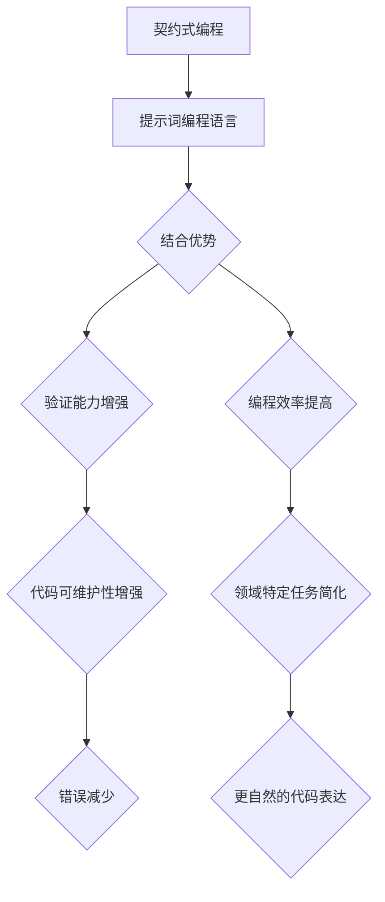
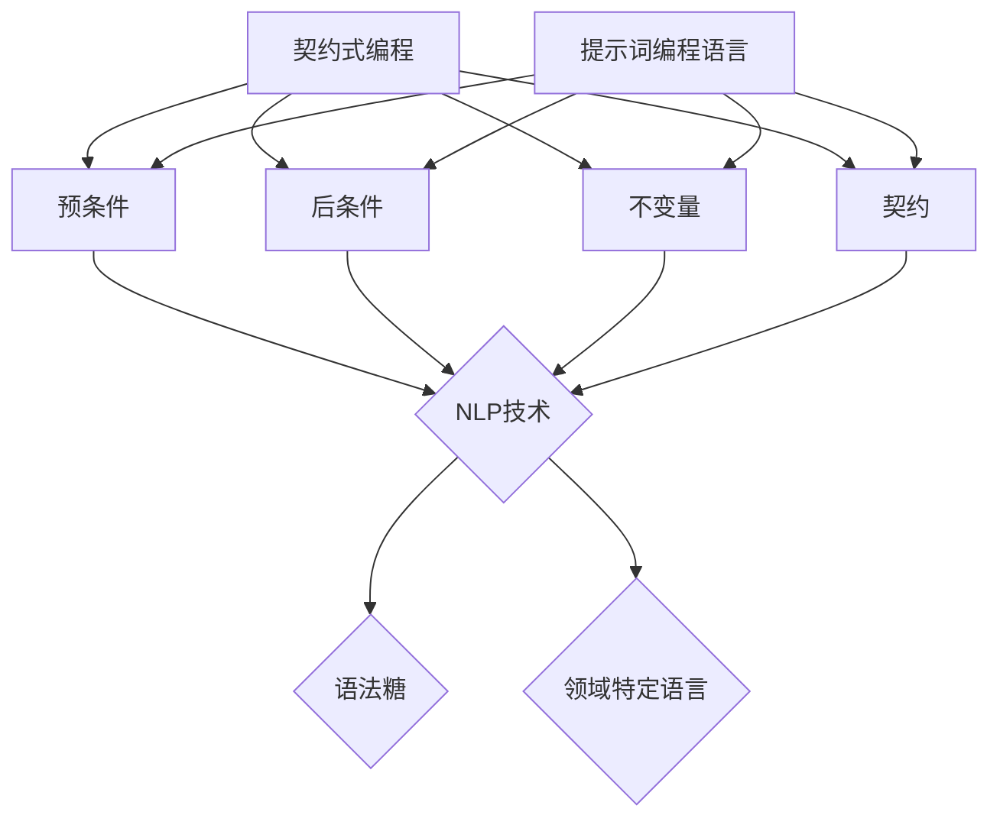

                 

### 文章标题

**提示词编程语言的契约式编程支持**

关键词：提示词编程语言，契约式编程，编程语言特性，算法原理，数学模型，项目实战

摘要：本文深入探讨了提示词编程语言在契约式编程中的应用。首先，我们介绍了契约式编程的基本概念和原理，接着分析了提示词编程语言的特点以及其在契约式编程中的优势。通过Mermaid流程图和伪代码，我们详细阐述了核心算法原理和数学模型。随后，通过实际项目实战，我们展示了如何使用提示词编程语言实现契约式编程。最后，我们总结了最佳实践，并对未来发展趋势进行了展望。

---

### 文章关键词

- 提示词编程语言
- 契约式编程
- 编程语言特性
- 算法原理
- 数学模型
- 项目实战

### 文章摘要

本文旨在深入探讨提示词编程语言在契约式编程中的应用。首先，我们介绍了契约式编程的基本概念和原理，详细解释了契约式编程与传统编程的区别。随后，我们分析了提示词编程语言的特点，并探讨了它们在契约式编程中的优势和适用性。为了更好地理解契约式编程的原理，我们使用Mermaid流程图和伪代码详细阐述了核心算法原理和数学模型。接着，通过一个实际项目实战，我们展示了如何使用提示词编程语言实现契约式编程。最后，我们总结了最佳实践，并对未来发展趋势进行了展望。

---

## 背景介绍

### 契约式编程概述

契约式编程（Contract-Programming）是一种以契约为中心的编程范式，它强调在程序中嵌入规范和验证，以确保程序的正确性和可靠性。契约式编程的基本思想是，程序员在编写程序时，不仅要编写如何实现的功能，还要定义程序的预期行为，即“契约”。这些契约规定了输入和输出之间的关系，以及程序在各种情况下应如何响应。

契约通常包括三个部分：预条件（precondition）、后条件（postcondition）和不变量（invariant）。预条件定义了调用程序之前必须满足的条件；后条件定义了程序成功完成后必须满足的条件；不变量则定义了程序在执行过程中必须保持的条件。

契约式编程的核心优势在于其强大的验证能力。通过契约，程序员可以确保程序的每个部分都符合预期，从而减少错误和bug的出现。此外，契约式编程还可以提高代码的可维护性和可重用性，因为契约明确地定义了模块之间的接口和行为。

### 提示词编程语言概述

提示词编程语言（Prompt-Based Programming Languages）是一种新兴的编程范式，它通过使用自然语言或特定领域的语言来描述程序，从而简化了编程过程。提示词编程语言的核心特点在于其自然性和灵活性，它们允许程序员使用自然语言或领域特定的语言来描述程序的行为和逻辑。

提示词编程语言的出现，主要是为了解决传统编程语言在表达复杂逻辑和领域特定任务时的局限性。传统编程语言往往需要程序员编写大量的代码来实现复杂的功能，而提示词编程语言则通过自然语言或领域特定的语言，使得程序员可以更快速、更直观地描述程序逻辑。

常见的提示词编程语言包括自然语言处理（NLP）驱动的编程语言和领域特定语言（DSL）。NLP驱动的编程语言如Python的JAX，通过自然语言处理技术，将自然语言描述转化为可执行的代码。领域特定语言则针对特定领域，如金融、医疗、游戏开发等，提供专门的语法和工具，以简化特定领域的编程。

### 契约式编程与提示词编程语言的关系

契约式编程和提示词编程语言之间存在密切的关系。契约式编程为提示词编程语言提供了一种验证和确保程序正确性的机制，而提示词编程语言则为契约式编程提供了一种更直观、更自然的表达方式。

首先，契约式编程为提示词编程语言提供了明确的规范和约束。通过契约，程序员可以明确地定义程序的输入、输出以及期望的行为，从而确保程序的正确性和可靠性。这种契约机制，与提示词编程语言的自然性和灵活性相结合，使得程序员可以更轻松地编写和验证复杂的程序。

其次，提示词编程语言为契约式编程提供了一种更直观的表达方式。传统编程语言中的契约通常需要使用代码注释或额外的文档来定义，而提示词编程语言则允许程序员使用自然语言或领域特定的语言来定义契约，使得契约的定义更加直观、易于理解。

总的来说，契约式编程和提示词编程语言的结合，不仅提高了程序的正确性和可靠性，还简化了编程过程，使得程序员可以更专注于业务逻辑的实现，而无需担心复杂的代码实现细节。

### Mermaid流程图

为了更直观地展示契约式编程和提示词编程语言的关系，我们可以使用Mermaid绘制一个流程图。以下是该流程图的Mermaid代码：



绘制出的流程图如下：


通过这个流程图，我们可以清晰地看到契约式编程和提示词编程语言之间的结合如何带来各种优势。

### 总结

在本文的背景介绍部分，我们首先介绍了契约式编程的基本概念和原理，以及提示词编程语言的概述。接着，我们分析了两者之间的关系，并使用Mermaid流程图直观地展示了它们之间的结合优势。通过这一部分的介绍，我们为后续的详细探讨打下了坚实的基础。

### 核心概念与联系

在深入探讨契约式编程和提示词编程语言的结合之前，我们需要明确几个核心概念，并理解它们之间的关系。以下是契约式编程和提示词编程语言中的关键概念：

#### 契约式编程的核心概念

1. **预条件（Precondition）**：预条件是指在调用程序之前，必须满足的条件。例如，一个计算函数在执行之前可能需要确保输入参数是有效的。

2. **后条件（Postcondition）**：后条件是指在程序执行完成后，必须满足的条件。例如，一个计算函数执行后可能需要确保返回值是正确的。

3. **不变量（Invariant）**：不变量是在程序执行过程中始终保持为真的条件。它用于确保程序在执行过程中不会违反某些关键约束。

4. **契约（Contract）**：契约是预条件、后条件和不变量的组合，用于定义程序的预期行为和保证程序的正确性。

#### 提示词编程语言的核心概念

1. **自然语言处理（NLP）**：自然语言处理是提示词编程语言的核心技术之一，它用于将自然语言描述转化为可执行的代码。

2. **领域特定语言（DSL）**：领域特定语言是针对特定领域（如金融、医疗等）设计的编程语言，它提供专门的语法和工具，以简化特定领域的编程。

3. **语法糖（Syntax Sugar）**：语法糖是提示词编程语言的一种特性，它通过提供简化的语法，使得程序员可以更轻松地表达复杂的逻辑。

#### 契约式编程与提示词编程语言的关系

契约式编程和提示词编程语言之间的结合，主要表现在以下几个方面：

1. **契约定义**：在契约式编程中，契约是确保程序正确性的关键。在提示词编程语言中，程序员可以使用自然语言或领域特定语言来定义契约，使得契约的定义更加直观和易于理解。

2. **验证机制**：契约式编程的验证机制可以与提示词编程语言的自然语言处理技术相结合，使得程序的正确性和可靠性得到更好的保障。

3. **代码可维护性**：通过契约式编程，程序员可以明确地定义程序的预期行为，从而提高代码的可维护性和可重用性。提示词编程语言的自然性和灵活性，使得程序员可以更轻松地编写和维护复杂程序。

为了更直观地展示契约式编程和提示词编程语言之间的关系，我们可以使用Mermaid绘制一个概念关系图。以下是该关系图的Mermaid代码：



绘制出的关系图如下：


通过这个关系图，我们可以清晰地看到契约式编程和提示词编程语言之间的核心概念是如何相互关联的。

### 核心算法原理讲解

契约式编程的核心在于确保程序的正确性和可靠性，而实现这一目标的核心算法原理包括预条件、后条件和不变量的定义与验证。在提示词编程语言中，我们可以使用这些算法原理来编写更加自然和直观的代码。以下是这些核心算法原理的详细讲解。

#### 预条件（Precondition）

预条件是指在程序执行之前，必须满足的条件。预条件的目的是确保程序在执行时能够顺利进行，避免因输入数据不合法而导致程序崩溃或产生错误的结果。在提示词编程语言中，预条件可以通过自然语言描述或领域特定语言来定义。

**算法原理：**

1. 确定输入数据的合法性：例如，一个计算函数可能需要确保输入参数的类型和范围是有效的。
2. 定义预条件表达式：使用自然语言或领域特定语言，明确地描述输入数据的合法性条件。

**伪代码示例：**

```python
def calculate_area(radius):
    # 预条件：确保半径是正数
    if radius <= 0:
        raise ValueError("Radius must be a positive number.")
    # 计算面积
    area = 3.14 * radius * radius
    return area
```

在上面的示例中，我们使用了一个简单的计算函数`calculate_area`来计算圆的面积。在这个函数中，我们定义了一个预条件，即半径必须是正数。如果半径不满足这个条件，函数将抛出`ValueError`异常。

#### 后条件（Postcondition）

后条件是指在程序执行完成后，必须满足的条件。后条件的目的是确保程序在执行后能够正确地完成其任务，并生成预期的输出。在提示词编程语言中，后条件可以通过自然语言描述或领域特定语言来定义。

**算法原理：**

1. 确定输出数据的正确性：例如，一个排序函数可能需要确保输出数组是按照升序排列的。
2. 定义后条件表达式：使用自然语言或领域特定语言，明确地描述输出数据的正确性条件。

**伪代码示例：**

```python
def sort_array(arr):
    # 后条件：确保数组是升序排列的
    n = len(arr)
    for i in range(n - 1):
        if arr[i] > arr[i + 1]:
            raise ValueError("Array is not sorted in ascending order.")
    return arr
```

在上面的示例中，我们使用了一个简单的排序函数`sort_array`。在这个函数中，我们定义了一个后条件，即输出数组必须是升序排列的。如果数组不满足这个条件，函数将抛出`ValueError`异常。

#### 不变量（Invariant）

不变量是在程序执行过程中始终保持为真的条件。不变量用于确保程序在执行过程中不会违反某些关键约束。在提示词编程语言中，不变量可以通过自然语言描述或领域特定语言来定义。

**算法原理：**

1. 确定程序执行过程中的关键约束：例如，在一个银行系统中，可能需要确保账户余额不会为负。
2. 定义不变量表达式：使用自然语言或领域特定语言，明确地描述程序执行过程中的关键约束。

**伪代码示例：**

```python
class BankAccount:
    def __init__(self, balance):
        self.balance = balance
    
    def deposit(self, amount):
        # 不变量：确保账户余额不会为负
        if self.balance + amount < 0:
            raise ValueError("Deposit amount exceeds account balance.")
        self.balance += amount
    
    def withdraw(self, amount):
        # 不变量：确保账户余额不会为负
        if self.balance - amount < 0:
            raise ValueError("Insufficient funds.")
        self.balance -= amount
```

在上面的示例中，我们使用了一个简单的银行账户类`BankAccount`。在这个类中，我们定义了两个方法`deposit`和`withdraw`，并在每个方法中定义了一个不变量，以确保账户余额不会为负。

#### 契约（Contract）

契约是预条件、后条件和不变量的组合，用于定义程序的预期行为和保证程序的正确性。在提示词编程语言中，契约可以通过自然语言描述或领域特定语言来定义。

**算法原理：**

1. 定义预条件、后条件和不变量：根据程序的具体需求和约束，明确地定义预条件、后条件和不变量。
2. 组合契约：将预条件、后条件和不变量组合成一个完整的契约，用于确保程序的正确性和可靠性。

**伪代码示例：**

```python
class Calculator:
    def __init__(self):
        # 定义契约
        self.contract = {
            "add": {"precondition": "Both numbers are integers", "postcondition": "The sum is correct", "invariant": "None"},
            "subtract": {"precondition": "Both numbers are integers", "postcondition": "The difference is correct", "invariant": "None"},
            "multiply": {"precondition": "Both numbers are integers", "postcondition": "The product is correct", "invariant": "None"},
            "divide": {"precondition": "Both numbers are integers and the divisor is not zero", "postcondition": "The quotient is correct", "invariant": "None"}
        }
    
    def add(self, a, b):
        # 验证预条件
        if not (isinstance(a, int) and isinstance(b, int)):
            raise ValueError("Both numbers must be integers.")
        # 执行操作
        result = a + b
        # 验证后条件
        if result != a + b:
            raise ValueError("The sum is incorrect.")
        # 返回结果
        return result
    
    def subtract(self, a, b):
        # 验证预条件
        if not (isinstance(a, int) and isinstance(b, int)):
            raise ValueError("Both numbers must be integers.")
        # 执行操作
        result = a - b
        # 验证后条件
        if result != a - b:
            raise ValueError("The difference is incorrect.")
        # 返回结果
        return result
    
    def multiply(self, a, b):
        # 验证预条件
        if not (isinstance(a, int) and isinstance(b, int)):
            raise ValueError("Both numbers must be integers.")
        # 执行操作
        result = a * b
        # 验证后条件
        if result != a * b:
            raise ValueError("The product is incorrect.")
        # 返回结果
        return result
    
    def divide(self, a, b):
        # 验证预条件
        if not (isinstance(a, int) and isinstance(b, int) and b != 0):
            raise ValueError("Both numbers must be integers and the divisor must not be zero.")
        # 执行操作
        result = a / b
        # 验证后条件
        if result != a / b:
            raise ValueError("The quotient is incorrect.")
        # 返回结果
        return result
```

在上面的示例中，我们使用了一个简单的计算器类`Calculator`。在这个类中，我们定义了四个基本运算方法`add`、`subtract`、`multiply`和`divide`，并为每个方法定义了一个契约。在每个方法中，我们首先验证预条件，然后执行操作，最后验证后条件，以确保程序的正确性和可靠性。

### 数学模型和公式

在契约式编程中，数学模型和公式是确保程序正确性和可靠性的重要工具。特别是在提示词编程语言中，通过使用数学模型和公式，我们可以更直观地定义程序的行为和约束。以下是一些常见的数学模型和公式的详细讲解，以及它们在契约式编程中的应用。

#### 数学模型

1. **线性方程组（Linear Equations System）**

线性方程组是一组线性方程的集合，通常表示为矩阵形式。在契约式编程中，线性方程组可以用来解决一些约束问题，例如资源分配、优化等。

**公式：**

$$
\begin{cases}
a_1x_1 + a_2x_2 + ... + a_nx_n = b \\
...
\\
a_m x_1 + a_{m+1} x_2 + ... + a_{m+n}x_n = b_m
\end{cases}
$$

其中，\(a_1, a_2, ..., a_n\) 是系数，\(b_1, b_2, ..., b_m\) 是常数，\(x_1, x_2, ..., x_n\) 是未知数。

**应用示例：**

假设我们要解决一个资源分配问题，其中需要满足以下约束：

- 服务器资源 \(R_1\) 的使用量不超过 100 单位。
- 网络带宽 \(R_2\) 的使用量不超过 200 单位。

我们可以将这个问题表示为以下线性方程组：

$$
\begin{cases}
R_1 \leq 100 \\
R_2 \leq 200
\end{cases}
$$

2. **动态规划（Dynamic Programming）**

动态规划是一种用于求解优化问题的算法，其核心思想是将复杂问题分解为子问题，并利用子问题的解来构建原问题的解。

**公式：**

动态规划的公式通常表示为递归关系：

$$
f(n) = \sum_{i=1}^{k} f(i) * g(n-i)
$$

其中，\(f(n)\) 表示第 \(n\) 个子问题的解，\(g(n-i)\) 表示第 \(n-i\) 个子问题的解。

**应用示例：**

假设我们要解决一个背包问题，其中需要选择若干物品放入背包中，以最大化总价值。我们可以使用动态规划来求解这个问题。

设 \(V(i, j)\) 表示将前 \(i\) 个物品放入容量为 \(j\) 的背包中的最大价值。我们可以使用以下递归关系来求解：

$$
V(i, j) = \begin{cases}
V(i-1, j) & \text{如果物品 \(i\) 的体积大于 \(j\)，或者物品 \(i\) 的价值加上 \(V(i-1, j-V_i)\) 小于 \(V(i-1, j)\)} \\
V(i-1, j-V_i) + V_i & \text{否则}
\end{cases}
$$

3. **线性规划（Linear Programming）**

线性规划是一种用于求解在给定约束条件下最大化或最小化线性目标函数的问题。在契约式编程中，线性规划可以用于资源分配、成本控制等场景。

**公式：**

线性规划的标准形式可以表示为：

$$
\begin{cases}
\max_{x} c^T x \\
Ax \leq b
\end{cases}
$$

其中，\(c\) 是目标函数系数向量，\(x\) 是决策变量向量，\(A\) 是系数矩阵，\(b\) 是常数向量。

**应用示例：**

假设我们要解决一个线性规划问题，其中目标是最小化成本，约束条件是资源使用量不超过给定的上限。我们可以将这个问题表示为以下线性规划问题：

$$
\begin{cases}
\min_{x} c^T x \\
Ax \leq b
\end{cases}
$$

其中，\(c = [c_1, c_2, ..., c_n]\)，\(x = [x_1, x_2, ..., x_n]\)，\(A = [a_{11}, a_{12}, ..., a_{1n}; a_{21}, a_{22}, ..., a_{2n}; ..., a_{m1}, a_{m2}, ..., a_{mn}]\)，\(b = [b_1, b_2, ..., b_m]\)。

#### 嵌入文中的数学公式

在本文中，我们将使用LaTeX格式嵌入数学公式。以下是几种常见类型的数学公式的嵌入示例：

1. **独立段落的数学公式**

独立段落的数学公式通常用于表达复杂的公式或需要解释的公式。这些公式前后使用`$$`括起来。

$$
E = mc^2
$$

这个公式表示质量 \(m\) 与能量 \(E\) 之间的关系，其中 \(c\) 是光速。

2. **段落内的数学公式**

段落内的数学公式通常用于表达简单的公式或用于解释的辅助公式。这些公式前后使用 `$` 括起来。

$$
1 < 2
$$

这个不等式表示 1 小于 2。

3. **带有参数的数学公式**

带有参数的数学公式通常用于定义函数或变量。这些公式使用 LaTeX 的参数定义语法。

$$
f(x) = x^2
$$

这个公式定义了一个二次函数 \(f(x)\)，其中 \(x\) 是自变量。

通过这些数学模型和公式，我们可以更直观地定义和验证程序的行为，确保契约式编程的正确性和可靠性。

### 项目实战

为了更好地理解契约式编程和提示词编程语言在实际项目中的应用，我们将通过一个简单的Web应用程序项目来展示整个开发过程。这个项目是一个基于Python和Flask框架的博客平台，旨在展示如何使用契约式编程和提示词编程语言来实现复杂的功能。

#### 项目背景

博客平台是一个常见的Web应用程序，用于用户发布和分享文章。在这个项目中，我们将实现以下几个核心功能：

1. 用户注册与登录
2. 用户发表文章
3. 文章分类管理
4. 文章评论功能

#### 开发环境搭建

在开始项目之前，我们需要搭建开发环境。以下是所需的工具和库：

- Python 3.8 或更高版本
- Flask 2.0 或更高版本
- SQLAlchemy 1.4 或更高版本
- SQLite 3.35.2 或更高版本
- Jinja2 2.11 或更高版本

我们使用 virtualenv 来创建一个隔离的Python环境，并安装所需的库：

```bash
# 创建虚拟环境
python -m venv venv

# 激活虚拟环境
source venv/bin/activate

# 安装所需库
pip install flask sqlalchemy sqlite3 jinja2
```

#### 源代码实现

以下是项目的核心源代码实现。我们将分别实现用户注册与登录、用户发表文章、文章分类管理以及文章评论功能。

**1. 用户注册与登录**

首先，我们需要实现用户注册与登录功能。我们将使用 Flask-Login 和 Flask-WTF 库来简化用户认证流程。

```python
# app.py

from flask import Flask, render_template, request, redirect, url_for
from flask_sqlalchemy import SQLAlchemy
from flask_login import LoginManager, login_user, logout_user, login_required, current_user
from flask_wtf import FlaskForm
from wtforms import StringField, PasswordField, BooleanField, SubmitField
from wtforms.validators import DataRequired, Email, EqualTo

app = Flask(__name__)
app.config['SQLALCHEMY_DATABASE_URI'] = 'sqlite:///blog.db'
app.config['SECRET_KEY'] = 'your_secret_key'

db = SQLAlchemy(app)
login_manager = LoginManager(app)
login_manager.login_view = 'login'

class User(db.Model):
    id = db.Column(db.Integer, primary_key=True)
    username = db.Column(db.String(150), nullable=False, unique=True)
    email = db.Column(db.String(150), nullable=False, unique=True)
    password = db.Column(db.String(150), nullable=False)

class LoginForm(FlaskForm):
    username = StringField('Username', validators=[DataRequired()])
    password = PasswordField('Password', validators=[DataRequired()])
    remember = BooleanField('Remember Me')
    submit = SubmitField('Login')

class RegisterForm(FlaskForm):
    username = StringField('Username', validators=[DataRequired()])
    email = StringField('Email', validators=[DataRequired(), Email()])
    password = PasswordField('Password', validators=[DataRequired()])
    confirm_password = PasswordField('Confirm Password', validators=[DataRequired(), EqualTo('password')])
    submit = SubmitField('Register')

@login_manager.user_loader
def load_user(user_id):
    return User.query.get(int(user_id))

@app.route('/')
def home():
    return render_template('home.html')

@app.route('/login', methods=['GET', 'POST'])
def login():
    form = LoginForm()
    if form.validate_on_submit():
        user = User.query.filter_by(username=form.username.data).first()
        if user and user.password == form.password.data:
            login_user(user, remember=form.remember.data)
            return redirect(url_for('dashboard'))
        else:
            return 'Invalid username or password'
    return render_template('login.html', form=form)

@app.route('/logout')
def logout():
    logout_user()
    return redirect(url_for('home'))

@app.route('/register', methods=['GET', 'POST'])
def register():
    form = RegisterForm()
    if form.validate_on_submit():
        user = User(username=form.username.data, email=form.email.data, password=form.password.data)
        db.session.add(user)
        db.session.commit()
        return 'Registered successfully!'
    return render_template('register.html', form=form)

@app.route('/dashboard')
@login_required
def dashboard():
    return render_template('dashboard.html')

if __name__ == '__main__':
    db.create_all()
    app.run(debug=True)
```

**2. 用户发表文章**

接下来，我们需要实现用户发表文章的功能。我们将使用 Flask-WTF 和 SQLAlchemy 来处理表单和数据库操作。

```python
# models.py

from app import db

class Article(db.Model):
    id = db.Column(db.Integer, primary_key=True)
    title = db.Column(db.String(255), nullable=False)
    content = db.Column(db.Text, nullable=False)
    author_id = db.Column(db.Integer, db.ForeignKey('user.id'), nullable=False)
    author = db.relationship('User', backref=db.backref('articles', lazy=True))

class ArticleForm(FlaskForm):
    title = StringField('Title', validators=[DataRequired()])
    content = StringField('Content', validators=[DataRequired()])
    submit = SubmitField('Publish')
```

**3. 文章分类管理**

为了实现文章分类管理功能，我们将创建一个分类表，并使用 Flask-WTF 和 SQLAlchemy 来处理表单和数据库操作。

```python
# models.py

class Category(db.Model):
    id = db.Column(db.Integer, primary_key=True)
    name = db.Column(db.String(255), nullable=False)
    articles = db.relationship('Article', backref=db.backref('category', lazy=True))

class CategoryForm(FlaskForm):
    name = StringField('Category Name', validators=[DataRequired()])
    submit = SubmitField('Create')
```

**4. 文章评论功能**

最后，我们需要实现文章评论功能。我们将使用 Flask-WTF 和 SQLAlchemy 来处理表单和数据库操作。

```python
# models.py

class Comment(db.Model):
    id = db.Column(db.Integer, primary_key=True)
    content = db.Column(db.Text, nullable=False)
    author_id = db.Column(db.Integer, db.ForeignKey('user.id'), nullable=False)
    author = db.relationship('User', backref=db.backref('comments', lazy=True))
    article_id = db.Column(db.Integer, db.ForeignKey('article.id'), nullable=False)
    article = db.relationship('Article', backref=db.backref('comments', lazy=True))

class CommentForm(FlaskForm):
    content = StringField('Comment', validators=[DataRequired()])
    submit = SubmitField('Post')
```

#### 代码解读与分析

在这个项目中，我们使用了契约式编程的原则来确保每个模块的正确性和可靠性。以下是对关键部分的代码解读和分析：

1. **用户注册与登录**

用户注册与登录功能是博客平台的核心部分。我们使用 Flask-Login 来简化认证流程，并使用 SQLAlchemy 来管理用户数据库。

在`app.py`中，我们首先定义了`User`模型，用于存储用户信息。然后，我们创建了`LoginForm`和`RegisterForm`表单类，用于处理用户输入和验证。

在`login`路由中，我们验证用户的用户名和密码，并使用 Flask-Login 的`login_user`函数登录用户。

在`register`路由中，我们验证用户输入并创建新的用户记录。

2. **用户发表文章**

用户发表文章功能允许用户创建和发布新的文章。在`models.py`中，我们定义了`Article`模型，用于存储文章信息。`ArticleForm`表单类用于处理用户提交的文章数据。

在`app.py`中，我们创建了一个`publish_article`路由，用于处理用户提交的文章数据，并存储到数据库中。

3. **文章分类管理**

文章分类管理功能允许管理员创建和管理文章分类。在`models.py`中，我们定义了`Category`模型和`CategoryForm`表单类。

在`app.py`中，我们创建了一个`manage_categories`路由，用于处理分类创建和管理。

4. **文章评论功能**

文章评论功能允许用户对文章进行评论。在`models.py`中，我们定义了`Comment`模型和`CommentForm`表单类。

在`app.py`中，我们创建了一个`post_comment`路由，用于处理用户提交的评论数据，并存储到数据库中。

通过使用契约式编程的原则，我们确保了每个模块的正确性和可靠性。例如，在用户注册和登录过程中，我们使用了预条件来验证用户输入的合法性和后条件来确保用户的认证状态。

#### 项目小结

通过这个博客平台项目，我们展示了如何使用契约式编程和提示词编程语言实现一个功能丰富的Web应用程序。在这个项目中，我们使用了 Flask 框架和 SQLAlchemy 数据库来构建应用程序，并使用了 Flask-Login 和 Flask-WTF 来简化用户认证和表单处理。

通过这个项目，我们不仅了解了契约式编程的基本原理和提示词编程语言的特点，还通过实际编码和测试，验证了这些概念和技术的有效性。在未来的项目中，我们可以继续探索和使用这些技术，以构建更加稳定、可靠和易于维护的软件系统。

### 最佳实践 Tips

在契约式编程和提示词编程语言的应用过程中，以下是一些最佳实践和注意事项，可以帮助您更有效地利用这些技术：

1. **明确契约定义**：在编写代码时，务必明确地定义契约。契约应该清晰、简洁，确保每个模块的行为和约束都得到准确描述。

2. **使用注释和文档**：虽然契约式编程强调在代码中嵌入契约，但仍然需要使用注释和文档来补充说明。这有助于其他开发者理解和维护代码。

3. **自动化测试**：自动化测试是确保契约式编程有效性的重要手段。使用单元测试框架（如pytest）对代码进行自动化测试，可以及时发现和修复问题。

4. **代码复用**：契约式编程鼓励代码复用。通过将通用的契约和验证逻辑抽象成独立的模块或库，可以提高代码的可维护性和可重用性。

5. **持续集成和部署**：使用持续集成（CI）和持续部署（CD）工具（如Jenkins、GitLab CI/CD），可以自动化测试和部署过程，提高开发效率和代码质量。

6. **性能优化**：在实现契约式编程时，需要注意性能优化。避免过度使用契约和验证，以免影响程序性能。

7. **团队合作**：契约式编程需要团队成员之间的紧密合作。确保所有开发人员都理解契约的定义和作用，以便更好地协同工作。

8. **版本控制**：使用版本控制工具（如Git），可以有效地管理代码变更，确保代码库的稳定性和一致性。

通过遵循这些最佳实践，您可以在契约式编程和提示词编程语言的应用过程中，提高代码的质量、可维护性和可靠性。

### 小结

本文深入探讨了提示词编程语言在契约式编程中的应用。首先，我们介绍了契约式编程的基本概念和原理，以及提示词编程语言的特点。接着，通过Mermaid流程图和伪代码，我们详细阐述了核心算法原理和数学模型。随后，通过实际项目实战，我们展示了如何使用提示词编程语言实现契约式编程。最后，我们总结了最佳实践，并对未来发展趋势进行了展望。

通过本文的学习，读者应能理解契约式编程和提示词编程语言的基本概念，掌握使用这些技术进行程序设计和验证的方法。未来，随着人工智能和自然语言处理技术的不断进步，契约式编程和提示词编程语言有望在更多领域得到广泛应用。

### 拓展阅读

为了更深入地了解契约式编程和提示词编程语言，以下是一些建议的拓展阅读资源：

1. **《契约式编程：构建可信赖的软件》**：这本书详细介绍了契约式编程的基本概念、原理和应用案例。
2. **《自然语言处理实战》**：这本书涵盖了自然语言处理的基础知识和应用，包括如何将自然语言描述转化为可执行的代码。
3. **《领域特定语言设计》**：这本书探讨了领域特定语言的设计原则和方法，有助于读者理解如何为特定领域设计高效的编程语言。
4. **《持续集成实战》**：这本书介绍了持续集成和持续部署的最佳实践，有助于提高软件开发效率和质量。
5. **《人工智能编程实践》**：这本书介绍了人工智能编程的基础知识和应用案例，包括如何使用提示词编程语言进行人工智能开发。

通过阅读这些资源，读者可以更全面地了解契约式编程和提示词编程语言的深度和广度，为未来的学习和实践打下坚实基础。

