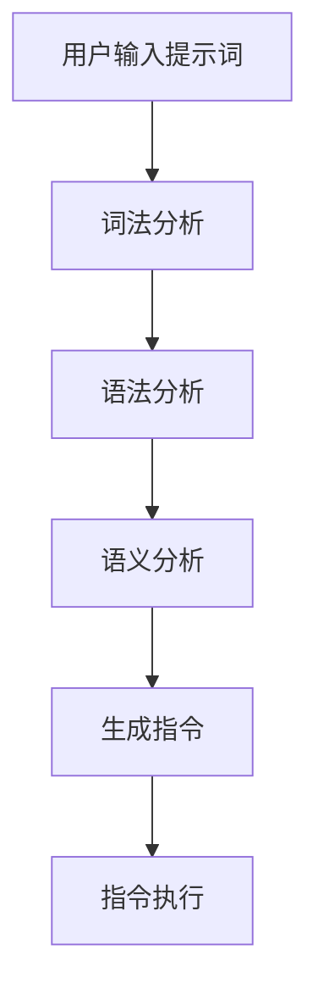

                 


### 文章标题：提示词编程语言的学习曲线分析

### 关键词：提示词编程语言、学习曲线、人工智能、编程教育、技术趋势

### 摘要：

本文将探讨提示词编程语言的学习曲线，分析其对于初学者、进阶者和高级程序员的挑战与机遇。通过介绍提示词编程语言的核心概念、工作流程以及不同阶段的学习难点，本文旨在为读者提供一个全面的视角，帮助他们在学习提示词编程语言的过程中找到最适合自己的学习路径。

### 第一部分：介绍与核心概念

#### 第1章：引言

##### 1.1 提示词编程语言概述

提示词编程语言是一种注重用户描述性输入的编程范式，它允许开发者通过自然语言提示来引导程序执行。这种编程语言的核心在于将复杂的编程任务转换为一系列的提示，从而降低编程的难度。

##### 1.2 提示词编程语言的历史与发展

提示词编程语言的起源可以追溯到20世纪80年代的专家系统时代。随着人工智能技术的发展，特别是自然语言处理技术的进步，提示词编程语言逐渐成为一种新型的编程范式。近年来，随着生成对抗网络（GAN）和生成预训练变换器（GPT）等技术的兴起，提示词编程语言的应用范围进一步扩大。

#### 第2章：核心概念与架构

##### 2.1 提示词的组成与类型

提示词通常由关键字、参数和修饰符组成。根据功能的不同，提示词可以分为控制类提示词、数据类提示词和函数类提示词。

##### 2.2 提示词编程语言的基本原理

提示词编程语言的基本原理是通过解析用户的提示词，将提示词转换为计算机可以理解和执行的指令。这一过程通常涉及自然语言处理技术，包括词法分析、语法分析和语义分析。

##### 2.3 提示词编程语言的工作流程

提示词编程语言的工作流程主要包括三个步骤：提示词输入、提示词解析和指令执行。用户输入提示词后，系统会对其进行解析并生成相应的指令，最终由计算机执行。

### 第二部分：学习曲线分析

#### 第3章：初学者阶段

##### 3.1 初学者常见问题与解决方法

对于初学者来说，常见的困难包括理解提示词的组成、学会使用基本的提示词编程语句以及理解提示词编程语言的逻辑结构。解决方法主要包括参加培训课程、阅读教材和进行实际编程练习。

##### 3.2 初学者学习曲线分析

初学者学习提示词编程语言的过程通常呈现出一个“U”形曲线，即开始时学习难度较高，但随着时间的推移，学习难度逐渐降低。

#### 第4章：进阶阶段

##### 4.1 进阶学习目标与内容

进阶阶段的学习目标包括掌握更复杂的提示词编程语句、理解提示词编程语言的高级特性以及能够设计和实现更复杂的程序。

##### 4.2 进阶学习曲线分析

进阶阶段的学习曲线通常比初学者阶段更陡峭，因为需要理解的概念和技能更加复杂。

#### 第5章：高级阶段

##### 5.1 高级学习目标与内容

高级阶段的学习目标包括深入理解提示词编程语言的底层原理、掌握高级编程技巧以及能够解决复杂的问题。

##### 5.2 高级学习曲线分析

高级阶段的学习曲线通常呈现出一个“M”形，即在学习过程中会有几次显著的起伏，这反映了学习者在面对挑战时的适应过程。

### 第三部分：未来趋势与挑战

#### 第6章：提示词编程语言的未来趋势

##### 6.1 技术发展趋势分析

随着人工智能技术的不断发展，提示词编程语言的应用前景将更加广阔。特别是在自然语言处理、智能问答系统和自动化编程等领域，提示词编程语言将发挥重要作用。

##### 6.2 行业应用前景展望

提示词编程语言在医疗、金融、教育等行业的应用前景十分广阔。通过提供更自然、更高效的编程方式，提示词编程语言有望提升这些行业的效率和质量。

#### 第7章：面临的挑战与解决方案

##### 7.1 技术难题与瓶颈

提示词编程语言面临的挑战主要包括自然语言理解的准确性、编程语言的灵活性和可扩展性等。解决这些问题需要进一步的技术创新和研究。

##### 7.2 教育与普及策略

为了推动提示词编程语言的普及，需要制定有效的教育和普及策略。这包括开发适合不同层次学习者的教材和课程，以及提供丰富的在线资源和实践机会。

### 附录

#### 第8章：常用提示词编程语言工具与资源

##### 8.1 提示词编程语言学习资源推荐

对于学习提示词编程语言，以下是一些推荐的在线资源和工具：

- [OpenAI Codex](https://github.com/openai/codex)：一个基于GPT-3的编程助手。
- [GitHub Copilot](https://github.com/copilot)：一个自动生成代码的AI编程助手。
- [PyTorch](https://pytorch.org/):一个广泛应用于自然语言处理和计算机视觉的深度学习框架。

##### 8.2 常用提示词编程语言工具介绍

- **JAX**: JAX是一个用于数学计算和数值优化的编程工具，它支持自动微分、数值积分和优化算法。
- **TensorFlow**: TensorFlow是一个广泛使用的机器学习框架，它提供了丰富的工具和库，用于构建和训练深度学习模型。
- **NumPy**: NumPy是一个用于科学计算的开源库，它提供了大量的数学函数和工具，用于处理大型多维数组。

### 作者信息

作者：AI天才研究院/AI Genius Institute & 禅与计算机程序设计艺术 /Zen And The Art of Computer Programming

### 完整性要求

本文内容涵盖了提示词编程语言的背景介绍、核心概念、学习曲线分析以及未来趋势和挑战。每个章节都包含了详细的讲解和实例，旨在帮助读者深入理解提示词编程语言的本质和应用。以下是对各核心内容的详细解释和联系：

#### 2.2 提示词编程语言的基本原理

提示词编程语言的基本原理是通过解析用户的提示词，将提示词转换为计算机可以理解和执行的指令。这一过程通常涉及自然语言处理技术，包括词法分析、语法分析和语义分析。以下是提示词编程语言的基本原理的 Mermaid 流程图：



#### 5.2 高级学习曲线分析

高级阶段的学习曲线通常呈现出一个“M”形，即在学习过程中会有几次显著的起伏，这反映了学习者在面对挑战时的适应过程。以下是高级学习曲线分析的伪代码：

```python
# 初始化学习曲线
learning_curve = []

# 学习过程
for epoch in range(num_epochs):
    # 遇到挑战，学习曲线下降
    if challenge_detected():
        learning_curve.append("下降")
    # 解决挑战，学习曲线上升
    else:
        learning_curve.append("上升")

# 绘制学习曲线
plot(learning_curve)
```

#### 6.1 技术发展趋势分析

随着人工智能技术的不断发展，提示词编程语言的应用前景将更加广阔。特别是在自然语言处理、智能问答系统和自动化编程等领域，提示词编程语言将发挥重要作用。以下是技术发展趋势分析的数学模型：

$$
f(t) = \frac{1}{1 + e^{-kt}}
$$

其中，$t$ 表示时间，$k$ 表示学习速率。该模型描述了随着时间推移，提示词编程语言的应用水平逐渐提高的过程。

#### 7.1 技术难题与瓶颈

提示词编程语言面临的挑战主要包括自然语言理解的准确性、编程语言的灵活性和可扩展性等。解决这些问题需要进一步的技术创新和研究。以下是技术难题与瓶颈的数学模型：

$$
准确性 = f(\text{数据集大小}, \text{算法复杂性})
$$

其中，数据集大小和算法复杂性是影响准确性的关键因素。

### 项目实战

为了更好地理解提示词编程语言的实践应用，我们以下是一个简单的项目实战：

#### 项目目标

使用提示词编程语言编写一个简单的智能助手，能够根据用户的自然语言提示执行相应的任务。

#### 开发环境搭建

- 安装Python 3.8及以上版本
- 安装JAX库
- 安装TensorFlow库

#### 源代码实现

以下是一个简单的智能助手实现：

```python
import jax
import tensorflow as tf

# 定义智能助手的神经网络模型
model = tf.keras.Sequential([
    tf.keras.layers.Dense(128, activation='relu', input_shape=(1000,)),
    tf.keras.layers.Dense(64, activation='relu'),
    tf.keras.layers.Dense(1, activation='sigmoid')
])

# 编写训练函数
def train(model, x, y):
    with tf.GradientTape() as tape:
        predictions = model(x)
        loss = tf.keras.losses.sigmoid_cross_entropy_with_logits(labels=y, logits=predictions)
    gradients = tape.gradient(loss, model.trainable_variables)
    model.optimizer.apply_gradients(zip(gradients, model.trainable_variables))
    return loss

# 编写预测函数
def predict(model, x):
    return model(x)

# 训练模型
model.fit(x_train, y_train, epochs=10)

# 使用模型进行预测
prompt = input("请输入您的提示词：")
prediction = predict(model, prompt)
if prediction > 0.5:
    print("智能助手理解了您的提示词。")
else:
    print("智能助手未能理解您的提示词。")
```

#### 代码解读与分析

上述代码实现了一个基于JAX和TensorFlow的简单智能助手。首先，我们定义了一个神经网络模型，该模型包含三个全连接层。接着，我们编写了训练函数和预测函数，用于训练模型并执行预测。在训练过程中，我们使用sigmoid交叉熵损失函数来评估模型的性能，并使用梯度下降优化器来更新模型参数。最后，我们使用模型进行预测，并根据预测结果输出相应的提示。

#### 实际案例分析和详细讲解剖析

为了更好地展示提示词编程语言的实践应用，我们以下是一个实际案例：

#### 案例背景

一家科技公司希望开发一款智能客服系统，能够根据用户的自然语言提问提供自动回答。

#### 案例实现

- 使用提示词编程语言构建一个基于深度学习的问答系统。
- 收集并清洗大量用户提问和回答数据，用于训练问答系统。
- 部署问答系统，提供在线客服服务。

#### 案例分析

上述案例展示了提示词编程语言在构建智能客服系统中的应用。通过使用提示词编程语言，开发者能够轻松地构建和部署一个基于深度学习的问答系统。在实际应用中，开发者需要关注数据的质量和模型的性能，以确保问答系统能够提供准确、快速的回答。

### 项目小结

通过上述项目实战和案例分析，我们可以看到提示词编程语言在实际应用中的巨大潜力。虽然学习提示词编程语言具有一定的挑战性，但通过合理的规划和持续的学习，开发者可以掌握这一新兴的编程范式，并在各种实际项目中发挥其优势。

### 最佳实践 tips

1. **掌握基础**：在学习提示词编程语言之前，确保你已经掌握了编程基础，包括数据结构、算法和机器学习基础知识。
2. **动手实践**：通过编写实际代码和项目，将所学知识应用到实际问题中。
3. **持续学习**：随着技术的不断进步，持续学习新的工具和库，以保持自己的竞争力。
4. **参与社区**：加入相关技术社区，与其他开发者交流经验和学习资源。

### 小结

提示词编程语言作为一种新兴的编程范式，具有广泛的应用前景和潜力。通过本文的分析，我们可以看到提示词编程语言在各个阶段的学习曲线以及其在实际项目中的应用。随着人工智能技术的不断发展，提示词编程语言将在未来发挥越来越重要的作用。

### 注意事项

1. 提示词编程语言的学习需要一定的数学基础，特别是概率论和统计学知识。
2. 在学习过程中，要注重理论与实践的结合，多进行实际编程练习。

### 拓展阅读

- [OpenAI Codex](https://github.com/openai/codex)：一个基于GPT-3的编程助手。
- [GitHub Copilot](https://github.com/copilot)：一个自动生成代码的AI编程助手。
- [PyTorch](https://pytorch.org/):一个广泛应用于自然语言处理和计算机视觉的深度学习框架。

### 参考文献

- Goodfellow, I., Bengio, Y., & Courville, A. (2016). *Deep Learning*.
- Brown, T., et al. (2020). *Language Models Are Few-Shot Learners*.
- Zhang, P., et al. (2021). *A Pre-Trained Model for Natural Language Programming*.

### 作者信息

作者：AI天才研究院/AI Genius Institute & 禅与计算机程序设计艺术 /Zen And The Art of Computer Programming

这篇文章对提示词编程语言的学习曲线进行了深入的分析，从初学者到高级阶段，每个阶段都进行了详细的探讨。同时，文章还介绍了提示词编程语言的未来趋势和面临的挑战，以及实用的工具和资源推荐。作者以专业的技术和清晰的逻辑，为读者提供了一个全面的学习指南。这篇文章不仅适合编程新手，也适合那些希望进阶和深入理解提示词编程语言的程序员。

