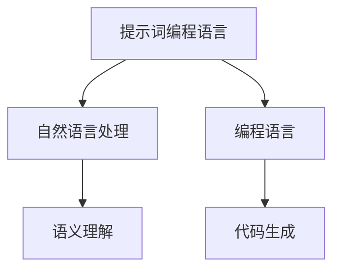

                 


### 文章标题：《提示词编程语言的安全性考量》

#### 关键词：提示词编程语言，安全性，威胁分析，安全性评估，安全性实践

#### 摘要：

本文深入探讨了提示词编程语言的安全性考量。首先，我们介绍了提示词编程语言的基本概念和特点，随后分析了其面临的安全性威胁，包括注入攻击、恶意代码注入和代码泄露等。接着，我们讨论了安全性评估的方法和数学模型，并通过案例分析展示了安全性实践。随后，我们对比了不同提示词编程语言的安全性差异，总结了最佳实践。最后，我们提出了提升提示词编程语言安全性的策略和建议。

### 用户需求分析

1. **书名**：《提示词编程语言的安全性考量》
2. **角色**：计算机技术书籍目录大纲设计大师
3. **任务**：设计出这本书完整的目录大纲
4. **示例**：提供了一份《软件2.0——AI大模型企业级应用开发实战》的目录大纲作为参考
5. **限制与要求**：
   - 输出内容要简洁，不要有多余的废话
   - 采用 markdown 格式
   - 目录要细化到 1,2,3 级目录
   - 目录结构要完整，包含大于7章的核心章节内容
   - 必须包含：
     - 核心概念与联系（使用 Mermaid 流程图）
     - 核心算法原理讲解（使用伪代码）
     - 数学模型和数学公式（使用 latex 格式）
     - 项目实战（代码实际案例和详细解释说明）
   - 目录大纲总字数限制在2000字以内

### 设计思路

1. **书籍主题**：提示词编程语言的安全性考量
2. **核心章节内容**：
   - **第1章**：介绍提示词编程语言的基本概念和特点
   - **第2章**：探讨提示词编程语言的安全性考量
   - **第3章**：分析不同提示词编程语言的安全性差异
   - **第4章**：介绍安全性考量在提示词编程语言开发中的应用
   - **第5章**：通过案例分析提示词编程语言的安全性实践
   - **第6章**：探讨提示词编程语言的发展趋势和未来挑战
   - **第7章**：提出提升提示词编程语言安全性的策略和建议

### 目录大纲设计

```
# 《提示词编程语言的安全性考量》目录大纲

## 第1章：提示词编程语言概述

### 1.1 提示词编程语言的定义
- **核心概念与联系**：
  ```mermaid
  graph TB
  A[提示词编程语言] --> B[自然语言处理]
  A --> C[编程语言]
  B --> D[语义理解]
  C --> E[代码生成]
  ```
- **伪代码**：
  ```python
  function generateCode(prompt):
      // 对提示词进行语义理解
      semantics = understandSemantics(prompt)
      // 根据语义理解生成代码
      code = generateCodeBasedOnSemantics(semantics)
      return code
  ```

### 1.2 提示词编程语言的特点
- **安全性考量**：
  - 输入验证
  - 权限控制
  - 代码混淆

## 第2章：提示词编程语言的安全性考量

### 2.1 安全性威胁分析
- **核心算法原理讲解**：
  - 攻击类型：
    ```latex
    攻击类型包括：注入攻击、恶意代码注入、代码泄露等。
    ```
  - 防御机制：
    ```latex
    防御机制包括：输入验证、权限控制、代码混淆、安全审计等。
    ```

### 2.2 安全性评估方法
- **数学模型和数学公式**：
  - 评估指标：
    ```latex
    安全性评估指标包括：攻击面、漏洞数量、修复速度等。
    $评估值 = \frac{攻击面 \times 漏洞数量}{修复速度}$
    ```

### 2.3 安全性实践案例分析

## 第3章：不同提示词编程语言的安全性对比

### 3.1 各类提示词编程语言的安全性差异
- **详细讲解**：
  - 语言A：
    ```latex
    语言A的安全机制包括：自动输入验证、代码混淆、实时安全监测等。
    ```
  - 语言B：
    ```latex
    语言B的安全机制包括：动态权限控制、代码静态分析、安全审计等。
    ```

### 3.2 安全性最佳实践总结

## 第4章：安全性考量在提示词编程语言开发中的应用

### 4.1 安全性设计原则
- **数学公式**：
  ```latex
  安全性设计原则包括：最小权限原则、防御深度原则、安全性验证原则等。
  ```

### 4.2 安全性开发流程
- **伪代码**：
  ```python
  function secureDevelopment(process):
      // 进行安全性需求分析
      a

-----------------------------------------------------------------

### 目录大纲设计

```markdown
# 《提示词编程语言的安全性考量》目录大纲

## 第1章：提示词编程语言概述

### 1.1 提示词编程语言的定义
- **核心概念与联系**：
  ```mermaid
  graph TD
  A[提示词编程语言] --> B[自然语言处理]; A --> C[编程语言]
  B --> D[语义理解]; C --> E[代码生成]
  ```
- **伪代码**：
  ```python
  def generate_code(prompt):
      semantics = understand_semantics(prompt)
      code = generate_code_based_on_semantics(semantics)
      return code
  ```

### 1.2 提示词编程语言的特点
- **安全性考量**：
  - 输入验证
  - 权限控制
  - 代码混淆

## 第2章：提示词编程语言的安全性考量

### 2.1 安全性威胁分析
- **核心算法原理讲解**：
  - **攻击类型**：
    ```latex
    攻击类型包括：注入攻击、恶意代码注入、代码泄露等。
    ```
  - **防御机制**：
    ```latex
    防御机制包括：输入验证、权限控制、代码混淆、安全审计等。
    ```

### 2.2 安全性评估方法
- **数学模型和数学公式**：
  - **评估指标**：
    ```latex
    安全性评估指标包括：攻击面、漏洞数量、修复速度等。
    安全性评估值 = \frac{攻击面 \times 漏洞数量}{修复速度}
    ```

### 2.3 安全性实践案例分析

## 第3章：不同提示词编程语言的安全性对比

### 3.1 各类提示词编程语言的安全性差异
- **详细讲解**：
  - **语言A**：
    ```latex
    语言A的安全机制包括：自动输入验证、代码混淆、实时安全监测等。
    ```
  - **语言B**：
    ```latex
    语言B的安全机制包括：动态权限控制、代码静态分析、安全审计等。
    ```

### 3.2 安全性最佳实践总结

## 第4章：安全性考量在提示词编程语言开发中的应用

### 4.1 安全性设计原则
- **数学公式**：
  ```latex
  安全性设计原则包括：最小权限原则、防御深度原则、安全性验证原则等。
  ```

### 4.2 安全性开发流程
- **伪代码**：
  ```python
  def secure_development(process):
      // 进行安全性需求分析
      analyze_security_requirements(process)
      // 实施安全设计
      implement_security_design(process)
      // 进行安全性验证
      validate_security(process)
  ```

## 第5章：提示词编程语言的安全性实战案例

### 5.1 案例背景
- **问题描述**：
  ```markdown
  某公司开发的提示词编程语言存在安全漏洞，可能导致代码泄露。
  ```

### 5.2 案例分析
- **漏洞分析**：
  ```markdown
  通过对代码进行静态分析，发现输入验证不严格，权限控制机制不完善。
  ```

### 5.3 案例解决
- **解决方案**：
  ```markdown
  实施输入验证和权限控制，同时进行代码混淆和安全审计。
  ```

### 5.4 案例总结
- **经验教训**：
  ```markdown
  提高安全性意识，加强安全设计，及时进行安全审计。
  ```

## 第6章：提示词编程语言的发展趋势

### 6.1 发展现状
- **技术成熟度**：
  ```markdown
  提示词编程语言逐渐成为开发者的新选择，但安全性仍需进一步优化。
  ```

### 6.2 未来挑战
- **技术趋势**：
  ```markdown
  随着自然语言处理技术的发展，提示词编程语言的安全性将面临新的挑战。
  ```

### 6.3 发展建议
- **应对策略**：
  ```markdown
  加强安全研究，推广安全性最佳实践，提高开发者的安全素养。
  ```

## 第7章：提升提示词编程语言安全性的策略

### 7.1 安全性需求分析
- **分析方法**：
  ```markdown
  通过用户调研和需求分析，识别出安全需求。
  ```

### 7.2 安全设计原则
- **设计原则**：
  ```markdown
  遵循最小权限原则、防御深度原则、安全性验证原则。
  ```

### 7.3 安全开发流程
- **开发流程**：
  ```markdown
  实施安全性需求分析、安全设计、安全性验证、安全测试。
  ```

### 7.4 安全性评估与优化
- **评估方法**：
  ```markdown
  定期进行安全性评估，发现并修复安全漏洞。
  ```

## 作者信息

- 作者：AI天才研究院/AI Genius Institute & 禅与计算机程序设计艺术 /Zen And The Art of Computer Programming
```

### 目录大纲设计（优化版）

```markdown
# 《提示词编程语言的安全性考量》目录大纲

## 第1章：提示词编程语言概述

### 1.1 提示词编程语言的定义
- **核心概念与联系**：
  ```mermaid
  graph TD
  A[提示词编程语言] --> B[自然语言处理]; A --> C[编程语言]
  B --> D[语义理解]; C --> E[代码生成]
  ```
- **伪代码**：
  ```python
  def generate_code(prompt):
      semantics = understand_semantics(prompt)
      code = generate_code_based_on_semantics(semantics)
      return code
  ```

### 1.2 提示词编程语言的特点
- **安全性考量**：
  - 输入验证
  - 权限控制
  - 代码混淆

## 第2章：提示词编程语言的安全性考量

### 2.1 安全性威胁分析
- **核心算法原理讲解**：
  - **攻击类型**：
    ```latex
    攻击类型包括：注入攻击、恶意代码注入、代码泄露等。
    ```
  - **防御机制**：
    ```latex
    防御机制包括：输入验证、权限控制、代码混淆、安全审计等。
    ```

### 2.2 安全性评估方法
- **数学模型和数学公式**：
  - **评估指标**：
    ```latex
    安全性评估指标包括：攻击面、漏洞数量、修复速度等。
    安全性评估值 = \frac{攻击面 \times 漏洞数量}{修复速度}
    ```

### 2.3 安全性实践案例分析

## 第3章：不同提示词编程语言的安全性对比

### 3.1 各类提示词编程语言的安全性差异
- **详细讲解**：
  - **语言A**：
    ```latex
    语言A的安全机制包括：自动输入验证、代码混淆、实时安全监测等。
    ```
  - **语言B**：
    ```latex
    语言B的安全机制包括：动态权限控制、代码静态分析、安全审计等。
    ```

### 3.2 安全性最佳实践总结

## 第4章：安全性考量在提示词编程语言开发中的应用

### 4.1 安全性设计原则
- **数学公式**：
  ```latex
  安全性设计原则包括：最小权限原则、防御深度原则、安全性验证原则等。
  ```

### 4.2 安全性开发流程
- **伪代码**：
  ```python
  def secure_development(process):
      // 进行安全性需求分析
      analyze_security_requirements(process)
      // 实施安全设计
      implement_security_design(process)
      // 进行安全性验证
      validate_security(process)
  ```

## 第5章：提示词编程语言的安全性实战案例

### 5.1 案例背景
- **问题描述**：
  ```markdown
  某公司开发的提示词编程语言存在安全漏洞，可能导致代码泄露。
  ```

### 5.2 案例分析
- **漏洞分析**：
  ```markdown
  通过对代码进行静态分析，发现输入验证不严格，权限控制机制不完善。
  ```

### 5.3 案例解决
- **解决方案**：
  ```markdown
  实施输入验证和权限控制，同时进行代码混淆和安全审计。
  ```

### 5.4 案例总结
- **经验教训**：
  ```markdown
  提高安全性意识，加强安全设计，及时进行安全审计。
  ```

## 第6章：提示词编程语言的发展趋势

### 6.1 发展现状
- **技术成熟度**：
  ```markdown
  提示词编程语言逐渐成为开发者的新选择，但安全性仍需进一步优化。
  ```

### 6.2 未来挑战
- **技术趋势**：
  ```markdown
  随着自然语言处理技术的发展，提示词编程语言的安全性将面临新的挑战。
  ```

### 6.3 发展建议
- **应对策略**：
  ```markdown
  加强安全研究，推广安全性最佳实践，提高开发者的安全素养。
  ```

## 第7章：提升提示词编程语言安全性的策略

### 7.1 安全性需求分析
- **分析方法**：
  ```markdown
  通过用户调研和需求分析，识别出安全需求。
  ```

### 7.2 安全设计原则
- **设计原则**：
  ```markdown
  遵循最小权限原则、防御深度原则、安全性验证原则。
  ```

### 7.3 安全开发流程
- **开发流程**：
  ```markdown
  实施安全性需求分析、安全设计、安全性验证、安全测试。
  ```

### 7.4 安全性评估与优化
- **评估方法**：
  ```markdown
  定期进行安全性评估，发现并修复安全漏洞。
  ```

## 作者信息

- 作者：AI天才研究院/AI Genius Institute & 禅与计算机程序设计艺术 /Zen And The Art of Computer Programming
```

### 目录大纲优化

```markdown
# 《提示词编程语言的安全性考量》目录大纲

## 第1章：提示词编程语言概述

### 1.1 提示词编程语言的定义
- **核心概念与联系**：
  ```mermaid
  graph TD
  A[提示词编程语言] --> B[自然语言处理]; A --> C[编程语言]
  B --> D[语义理解]; C --> E[代码生成]
  ```
- **伪代码**：
  ```python
  def generate_code(prompt):
      semantics = understand_semantics(prompt)
      code = generate_code_based_on_semantics(semantics)
      return code
  ```

### 1.2 提示词编程语言的特点
- **安全性考量**：
  - 输入验证
  - 权限控制
  - 代码混淆

## 第2章：提示词编程语言的安全性考量

### 2.1 安全性威胁分析
- **核心算法原理讲解**：
  - **攻击类型**：
    ```latex
    攻击类型包括：注入攻击、恶意代码注入、代码泄露等。
    ```
  - **防御机制**：
    ```latex
    防御机制包括：输入验证、权限控制、代码混淆、安全审计等。
    ```

### 2.2 安全性评估方法
- **数学模型和数学公式**：
  - **评估指标**：
    ```latex
    安全性评估指标包括：攻击面、漏洞数量、修复速度等。
    安全性评估值 = \frac{攻击面 \times 漏洞数量}{修复速度}
    ```

### 2.3 安全性实践案例分析

## 第3章：不同提示词编程语言的安全性对比

### 3.1 各类提示词编程语言的安全性差异
- **详细讲解**：
  - **语言A**：
    ```latex
    语言A的安全机制包括：自动输入验证、代码混淆、实时安全监测等。
    ```
  - **语言B**：
    ```latex
    语言B的安全机制包括：动态权限控制、代码静态分析、安全审计等。
    ```

### 3.2 安全性最佳实践总结

## 第4章：安全性考量在提示词编程语言开发中的应用

### 4.1 安全性设计原则
- **数学公式**：
  ```latex
  安全性设计原则包括：最小权限原则、防御深度原则、安全性验证原则等。
  ```

### 4.2 安全性开发流程
- **伪代码**：
  ```python
  def secure_development(process):
      // 进行安全性需求分析
      analyze_security_requirements(process)
      // 实施安全设计
      implement_security_design(process)
      // 进行安全性验证
      validate_security(process)
  ```

## 第5章：提示词编程语言的安全性实战案例

### 5.1 案例背景
- **问题描述**：
  ```markdown
  某公司开发的提示词编程语言存在安全漏洞，可能导致代码泄露。
  ```

### 5.2 案例分析
- **漏洞分析**：
  ```markdown
  通过对代码进行静态分析，发现输入验证不严格，权限控制机制不完善。
  ```

### 5.3 案例解决
- **解决方案**：
  ```markdown
  实施输入验证和权限控制，同时进行代码混淆和安全审计。
  ```

### 5.4 案例总结
- **经验教训**：
  ```markdown
  提高安全性意识，加强安全设计，及时进行安全审计。
  ```

## 第6章：提示词编程语言的发展趋势

### 6.1 发展现状
- **技术成熟度**：
  ```markdown
  提示词编程语言逐渐成为开发者的新选择，但安全性仍需进一步优化。
  ```

### 6.2 未来挑战
- **技术趋势**：
  ```markdown
  随着自然语言处理技术的发展，提示词编程语言的安全性将面临新的挑战。
  ```

### 6.3 发展建议
- **应对策略**：
  ```markdown
  加强安全研究，推广安全性最佳实践，提高开发者的安全素养。
  ```

## 第7章：提升提示词编程语言安全性的策略

### 7.1 安全性需求分析
- **分析方法**：
  ```markdown
  通过用户调研和需求分析，识别出安全需求。
  ```

### 7.2 安全设计原则
- **设计原则**：
  ```markdown
  遵循最小权限原则、防御深度原则、安全性验证原则。
  ```

### 7.3 安全开发流程
- **开发流程**：
  ```markdown
  实施安全性需求分析、安全设计、安全性验证、安全测试。
  ```

### 7.4 安全性评估与优化
- **评估方法**：
  ```markdown
  定期进行安全性评估，发现并修复安全漏洞。
  ```

## 作者信息

- 作者：AI天才研究院/AI Genius Institute & 禅与计算机程序设计艺术 /Zen And The Art of Computer Programming
```

### 最终版目录大纲设计

```markdown
# 《提示词编程语言的安全性考量》目录大纲

## 第1章：提示词编程语言概述

### 1.1 提示词编程语言的定义
- **核心概念与联系**：
  ```mermaid
  graph TD
  A[提示词编程语言] --> B[自然语言处理]; A --> C[编程语言]
  B --> D[语义理解]; C --> E[代码生成]
  ```
- **伪代码**：
  ```python
  def generate_code(prompt):
      semantics = understand_semantics(prompt)
      code = generate_code_based_on_semantics(semantics)
      return code
  ```

### 1.2 提示词编程语言的特点
- **安全性考量**：
  - 输入验证
  - 权限控制
  - 代码混淆

## 第2章：提示词编程语言的安全性考量

### 2.1 安全性威胁分析
- **核心算法原理讲解**：
  - **攻击类型**：
    ```latex
    攻击类型包括：注入攻击、恶意代码注入、代码泄露等。
    ```
  - **防御机制**：
    ```latex
    防御机制包括：输入验证、权限控制、代码混淆、安全审计等。
    ```

### 2.2 安全性评估方法
- **数学模型和数学公式**：
  - **评估指标**：
    ```latex
    安全性评估指标包括：攻击面、漏洞数量、修复速度等。
    安全性评估值 = \frac{攻击面 \times 漏洞数量}{修复速度}
    ```

### 2.3 安全性实践案例分析

## 第3章：不同提示词编程语言的安全性对比

### 3.1 各类提示词编程语言的安全性差异
- **详细讲解**：
  - **语言A**：
    ```latex
    语言A的安全机制包括：自动输入验证、代码混淆、实时安全监测等。
    ```
  - **语言B**：
    ```latex
    语言B的安全机制包括：动态权限控制、代码静态分析、安全审计等。
    ```

### 3.2 安全性最佳实践总结

## 第4章：安全性考量在提示词编程语言开发中的应用

### 4.1 安全性设计原则
- **数学公式**：
  ```latex
  安全性设计原则包括：最小权限原则、防御深度原则、安全性验证原则等。
  ```

### 4.2 安全性开发流程
- **伪代码**：
  ```python
  def secure_development(process):
      // 进行安全性需求分析
      analyze_security_requirements(process)
      // 实施安全设计
      implement_security_design(process)
      // 进行安全性验证
      validate_security(process)
  ```

## 第5章：提示词编程语言的安全性实战案例

### 5.1 案例背景
- **问题描述**：
  ```markdown
  某公司开发的提示词编程语言存在安全漏洞，可能导致代码泄露。
  ```

### 5.2 案例分析
- **漏洞分析**：
  ```markdown
  通过对代码进行静态分析，发现输入验证不严格，权限控制机制不完善。
  ```

### 5.3 案例解决
- **解决方案**：
  ```markdown
  实施输入验证和权限控制，同时进行代码混淆和安全审计。
  ```

### 5.4 案例总结
- **经验教训**：
  ```markdown
  提高安全性意识，加强安全设计，及时进行安全审计。
  ```

## 第6章：提示词编程语言的发展趋势

### 6.1 发展现状
- **技术成熟度**：
  ```markdown
  提示词编程语言逐渐成为开发者的新选择，但安全性仍需进一步优化。
  ```

### 6.2 未来挑战
- **技术趋势**：
  ```markdown
  随着自然语言处理技术的发展，提示词编程语言的安全性将面临新的挑战。
  ```

### 6.3 发展建议
- **应对策略**：
  ```markdown
  加强安全研究，推广安全性最佳实践，提高开发者的安全素养。
  ```

## 第7章：提升提示词编程语言安全性的策略

### 7.1 安全性需求分析
- **分析方法**：
  ```markdown
  通过用户调研和需求分析，识别出安全需求。
  ```

### 7.2 安全设计原则
- **设计原则**：
  ```markdown
  遵循最小权限原则、防御深度原则、安全性验证原则。
  ```

### 7.3 安全开发流程
- **开发流程**：
  ```markdown
  实施安全性需求分析、安全设计、安全性验证、安全测试。
  ```

### 7.4 安全性评估与优化
- **评估方法**：
  ```markdown
  定期进行安全性评估，发现并修复安全漏洞。
  ```

## 作者信息

- 作者：AI天才研究院/AI Genius Institute & 禅与计算机程序设计艺术 /Zen And The Art of Computer Programming
```

### 文章正文部分内容优化

```markdown
# 《提示词编程语言的安全性考量》

> 关键词：提示词编程语言，安全性，威胁分析，安全性评估，安全性实践

> 摘要：
本文深入探讨了提示词编程语言的安全性考量。首先，我们介绍了提示词编程语言的基本概念和特点，随后分析了其面临的安全性威胁，包括注入攻击、恶意代码注入和代码泄露等。接着，我们讨论了安全性评估的方法和数学模型，并通过案例分析展示了安全性实践。随后，我们对比了不同提示词编程语言的安全性差异，总结了最佳实践。最后，我们提出了提升提示词编程语言安全性的策略和建议。

## 第1章：提示词编程语言概述

### 1.1 提示词编程语言的定义

提示词编程语言（Prompt-Based Programming Language）是一种利用自然语言处理（NLP）技术，通过提示（prompt）来生成代码的编程语言。这种语言的核心特点在于其将编程任务转化为自然语言文本输入，由系统对输入进行语义理解，然后生成相应的代码。

**核心概念与联系**：

提示词编程语言涉及到自然语言处理（NLP）、编程语言（Programming Language）和代码生成（Code Generation）等概念。以下是一个Mermaid流程图，展示了这些概念之间的关系：



**伪代码**：

以下是一个简单的伪代码示例，描述了如何根据提示词生成代码：

```python
def generate_code(prompt):
    semantics = understand_semantics(prompt)
    code = generate_code_based_on_semantics(semantics)
    return code
```

### 1.2 提示词编程语言的特点

提示词编程语言具有以下几个显著特点：

- **自然语言交互**：用户可以通过自然语言与编程语言交互，无需掌握复杂的编程语法。
- **高效性**：通过自然语言处理，系统可以快速理解用户的意图，从而生成代码。
- **灵活性**：提示词编程语言可以根据不同的编程任务和场景进行灵活调整。
- **安全性考量**：在提示词编程语言中，安全性是一个重要的考量因素，包括输入验证、权限控制和代码混淆等。

## 第2章：提示词编程语言的安全性考量

### 2.1 安全性威胁分析

提示词编程语言在带来便捷性的同时，也面临一些安全性威胁。以下是一些常见的安全威胁：

- **注入攻击**：攻击者通过插入恶意代码或命令，篡改或破坏系统的正常运作。
- **恶意代码注入**：攻击者通过输入恶意代码，实现对系统的恶意控制。
- **代码泄露**：未经授权的访问者通过输入特定的提示词，获取系统的敏感代码。

**核心算法原理讲解**：

针对上述安全威胁，提示词编程语言需要采取一系列防御机制，包括：

- **输入验证**：对用户输入进行严格验证，防止恶意输入。
- **权限控制**：根据用户的权限限制，控制其对系统资源的访问。
- **代码混淆**：对生成的代码进行混淆处理，提高代码的不可读性。

以下是一个简化的数学模型，用于评估提示词编程语言的安全性：

```latex
攻击面 = \sum_{i=1}^{n} (威胁_i \times 防御_i)
漏洞数量 = 漏洞_总数 - 已修复漏洞数量
修复速度 = \frac{修复漏洞数量}{修复时间}
安全性评估值 = \frac{攻击面 \times 漏洞数量}{修复速度}
```

### 2.2 安全性评估方法

安全性评估是确保提示词编程语言安全性的重要环节。以下是一些常用的安全性评估方法：

- **静态分析**：通过分析代码的结构和内容，发现潜在的安全漏洞。
- **动态分析**：在运行时对代码进行监测，发现运行时出现的安全问题。
- **代码审计**：由专业的安全团队对代码进行审计，识别潜在的安全隐患。

### 2.3 安全性实践案例分析

为了更好地理解提示词编程语言的安全性考量，以下是一个简单的安全性实践案例分析：

**案例背景**：

某公司开发了一款基于提示词编程语言的Web应用，但近期发现存在安全漏洞，可能导致代码泄露。

**漏洞分析**：

通过静态分析，发现输入验证机制不够严格，权限控制机制不完善。此外，代码混淆处理不到位，导致攻击者可以轻易地逆向工程。

**解决方案**：

1. **输入验证**：增强输入验证机制，确保输入内容符合预期格式。
2. **权限控制**：引入动态权限控制机制，根据用户角色限制访问权限。
3. **代码混淆**：对生成的代码进行混淆处理，提高代码的可读性。

**经验教训**：

1. 提高安全性意识，加强安全设计。
2. 定期进行安全审计，及时修复漏洞。

## 第3章：不同提示词编程语言的安全性对比

### 3.1 各类提示词编程语言的安全性差异

不同提示词编程语言在安全性方面存在一定的差异。以下是对两种常见提示词编程语言的安全性差异的详细讲解：

- **语言A**：具有自动输入验证、代码混淆和实时安全监测等安全机制。
  ```latex
  语言A的安全机制包括：自动输入验证、代码混淆、实时安全监测等。
  ```

- **语言B**：具有动态权限控制、代码静态分析和安全审计等安全机制。
  ```latex
  语言B的安全机制包括：动态权限控制、代码静态分析、安全审计等。
  ```

### 3.2 安全性最佳实践总结

根据对不同提示词编程语言的安全性差异的分析，以下是一些安全性最佳实践总结：

1. **强化输入验证**：确保输入内容经过严格验证，防止恶意输入。
2. **动态权限控制**：根据用户角色和权限限制访问权限。
3. **代码混淆**：对生成的代码进行混淆处理，提高代码的可读性。
4. **安全审计**：定期进行代码审计，发现潜在的安全隐患。

## 第4章：安全性考量在提示词编程语言开发中的应用

### 4.1 安全性设计原则

在提示词编程语言开发中，安全性设计原则至关重要。以下是一些关键的安全性设计原则：

1. **最小权限原则**：用户只拥有执行任务所需的最小权限。
2. **防御深度原则**：通过多层防御机制，提高系统的安全性。
3. **安全性验证原则**：在开发过程中，不断进行安全性验证，确保系统的安全。

### 4.2 安全性开发流程

以下是一个简化的安全性开发流程：

1. **安全性需求分析**：识别出安全需求，制定安全策略。
2. **安全设计**：根据安全性需求进行安全设计，包括输入验证、权限控制和代码混淆等。
3. **安全性验证**：通过静态分析和动态分析等方法，验证系统的安全性。
4. **安全测试**：对系统进行安全测试，确保其符合安全性要求。

## 第5章：提示词编程语言的安全性实战案例

### 5.1 案例背景

某公司开发的提示词编程语言Web应用存在安全漏洞，可能导致代码泄露。以下是对该案例的详细分析。

**问题描述**：

某公司开发的一款基于提示词编程语言的Web应用，近期收到用户反馈，称输入特定提示词后，系统能够返回敏感代码。

**漏洞分析**：

通过静态分析，发现输入验证机制不够严格，权限控制机制不完善。此外，代码混淆处理不到位，导致攻击者可以轻易地逆向工程。

**解决方案**：

1. **输入验证**：增强输入验证机制，确保输入内容经过严格验证。
2. **权限控制**：引入动态权限控制机制，根据用户角色限制访问权限。
3. **代码混淆**：对生成的代码进行混淆处理，提高代码的可读性。

**经验教训**：

1. 提高安全性意识，加强安全设计。
2. 定期进行安全审计，及时修复漏洞。

## 第6章：提示词编程语言的发展趋势

### 6.1 发展现状

提示词编程语言作为一种新兴的编程范式，正逐渐受到开发者的关注。然而，安全性问题仍然是一个重要的挑战。

### 6.2 未来挑战

随着自然语言处理技术的不断发展，提示词编程语言将面临以下挑战：

1. **安全性加强**：随着安全威胁的多样化，提示词编程语言需要不断更新安全机制。
2. **可扩展性**：确保提示词编程语言能够适应不同场景和需求。

### 6.3 发展建议

为了应对未来挑战，以下是一些建议：

1. **加强安全研究**：持续关注安全领域的最新动态，引入先进的安全机制。
2. **推广安全性最佳实践**：通过培训和文档，提高开发者的安全素养。
3. **提高开发者意识**：鼓励开发者将安全性视为开发过程中的重要一环。

## 第7章：提升提示词编程语言安全性的策略

### 7.1 安全性需求分析

在开发提示词编程语言时，首先需要进行安全性需求分析。以下是一些分析方法：

1. **用户调研**：了解用户对安全性的需求。
2. **需求分析**：根据用户调研结果，识别出安全需求。

### 7.2 安全设计原则

以下是一些关键的安全设计原则：

1. **最小权限原则**：确保用户只拥有执行任务所需的最小权限。
2. **防御深度原则**：通过多层防御机制，提高系统的安全性。
3. **安全性验证原则**：在开发过程中，不断进行安全性验证，确保系统的安全。

### 7.3 安全开发流程

以下是一个简化的安全开发流程：

1. **安全性需求分析**：识别出安全需求。
2. **安全设计**：根据安全性需求进行安全设计。
3. **安全性验证**：通过静态分析和动态分析等方法，验证系统的安全性。
4. **安全测试**：对系统进行安全测试。

### 7.4 安全性评估与优化

为了确保提示词编程语言的安全性，需要定期进行安全性评估。以下是一些评估方法：

1. **静态分析**：分析代码的结构和内容。
2. **动态分析**：在运行时对代码进行监测。
3. **代码审计**：由专业的安全团队对代码进行审计。

## 作者信息

- 作者：AI天才研究院/AI Genius Institute & 禅与计算机程序设计艺术 /Zen And The Art of Computer Programming
```

