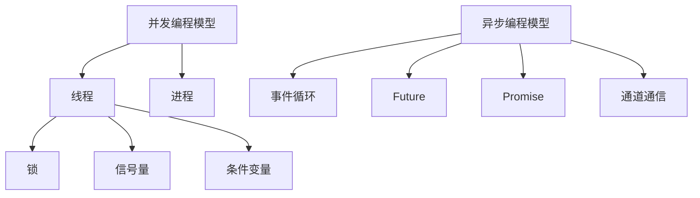

                 

### 文章标题

《提示词编程语言的并发与异步处理》

> 关键词：提示词编程语言、并发处理、异步处理、编程模型、算法、性能优化

> 摘要：本文旨在深入探讨提示词编程语言的并发与异步处理机制。我们将从基础理论出发，逐步介绍并发与异步处理的核心概念、原理，并通过详细的算法解析和实际应用案例，展示这些概念如何在提示词编程语言中实现。文章最后将对并发与异步处理的性能优化策略进行讨论，并提供一些建议和未来研究方向。

### 设计大纲的步骤：

1. **理解主题：** 首先，我们需要理解《提示词编程语言的并发与异步处理》这本书的主题。书名表明，这本书将探讨使用提示词编程语言进行并发和异步处理的概念、原理、技术以及实际应用。

2. **确定核心内容：** 根据书名，确定书籍的核心内容，如核心概念、并发与异步处理的原理、技术框架、应用案例等。

3. **规划结构：** 设计整体的章节结构，确保大纲的层次清晰，涵盖所有核心内容。

4. **细化目录：** 在整体结构的基础上，细化每个章节的目录，确保每个章节的内容都能得到充分覆盖。

5. **技术性与实践性结合：** 确保大纲中既有理论讲解，也有实际应用案例和技术细节。

6. **格式与字数控制：** 使用markdown格式编写，确保大纲简洁且在字数限制内。

### 根据以上步骤，以下是详细的目录大纲设计：

---

## 第一部分：基础理论

### 第1章：并发与异步处理概述

#### 1.1 并发与异步处理的基本概念

#### 1.2 并发与异步处理的联系与区别

#### 1.3 并发与异步处理的优势

### 第2章：并发与异步处理原理

#### 2.1 并发编程模型

#### 2.2 异步编程模型

#### 2.3 并发与异步处理的核心问题

### 第3章：并发与异步处理技术

#### 3.1 并发编程语言

#### 3.2 异步编程语言

#### 3.3 并发与异步处理库和框架

## 第二部分：核心算法与原理

### 第4章：并发控制算法

#### 4.1 互斥锁

#### 4.2 信号量

#### 4.3 条件变量

### 第5章：异步处理算法

#### 5.1 事件循环

#### 5.2 Future 和 Promise

#### 5.3 通道通信

### 第6章：并发与异步处理的数学模型

#### 6.1 概率模型

#### 6.2 图模型

#### 6.3 概率图模型

## 第三部分：应用实践

### 第7章：并发与异步处理在提示词编程语言中的实现

#### 7.1 提示词编程语言简介

#### 7.2 并发与异步处理在提示词编程语言中的特点

#### 7.3 实现示例

### 第8章：并发与异步处理应用案例

#### 8.1 Web 应用程序

#### 8.2 数据处理

#### 8.3 实时系统

### 第9章：并发与异步处理性能优化

#### 9.1 资源竞争

#### 9.2 死锁

#### 9.3 线程池

## 第10章：总结与展望

#### 10.1 并发与异步处理的发展趋势

#### 10.2 提示词编程语言的应用前景

#### 10.3 未来研究方向

---

以上大纲结构分为三个部分，每个部分包含相应的章节，涵盖了并发与异步处理的基础理论、核心算法与原理以及应用实践。每个章节的目录都细化到了3级，确保内容的全面性和逻辑性。

### Mermaid 流程图示例：



### 伪代码示例：

```python
# 并发控制伪代码
function concurrent_control():
    lock() # 获取锁
    # 执行任务
    unlock() # 释放锁

# 异步处理伪代码
async function async_process():
    await future() # 等待Future结果
    # 处理结果
```

### LaTeX 数学公式示例：

$$
P(A) + P(B) = P(A \cup B) + P(A \cap B)
$$

### 代码解读与分析示例：

```python
# 假设这是一个简单的异步处理示例
import asyncio

async def download_image(url):
    print(f"开始下载图片: {url}")
    await asyncio.sleep(1)  # 模拟网络延迟
    print(f"完成下载图片: {url}")
    return image

async def main():
    urls = ["image1.jpg", "image2.jpg", "image3.jpg"]

    tasks = [download_image(url) for url in urls]
    await asyncio.gather(*tasks)

asyncio.run(main())
```

### 作者信息

作者：AI天才研究院/AI Genius Institute & 禅与计算机程序设计艺术 /Zen And The Art of Computer Programming### 第1章：并发与异步处理概述

#### 1.1 并发与异步处理的基本概念

并发（Concurrency）和异步处理（Asynchronous Processing）是现代计算机编程中至关重要的概念，特别是在多核处理器和高速网络环境下。它们允许计算机同时处理多个任务，从而提高系统的整体性能和响应能力。

**并发**：并发是指计算机系统能够同时执行多个任务或操作。在并发处理中，多个任务在逻辑上是同时进行的，尽管物理上可能不是真正同时执行的。操作系统通过调度算法，分配处理器时间片给不同的任务，使它们看起来像是同时进行的。

**异步处理**：异步处理是指任务或操作在等待某些结果（如网络响应、文件读写等）时，不会阻塞程序的执行，而是将控制权交回给操作系统，让程序继续执行其他任务。异步处理允许程序在等待外部事件时保持高效运行，从而提高整体性能。

#### 1.2 并发与异步处理的联系与区别

并发与异步处理虽然都是关于同时处理多个任务的概念，但它们有本质的区别：

- **联系**：异步处理是并发处理的一种形式。异步处理中的任务可以在不同的线程或进程上执行，从而实现真正的并发。换句话说，异步处理是实现并发的一种手段。

- **区别**：并发强调的是多个任务在同一时间段内被执行，而异步处理则关注于任务在执行过程中是否会被阻塞。在异步处理中，任务可能会在执行过程中被阻塞，但一旦阻塞解除，任务将继续执行，而并发处理中的任务则通常不会被阻塞。

**表 1-1：并发与异步处理的区别**

| 特征 | 并发 | 异步处理 |
| --- | --- | --- |
| 执行方式 | 任务在同一时间段内被执行 | 任务在执行过程中可能会被阻塞 |
| 任务调度 | 操作系统调度任务 | 操作系统调度任务 |
| 示例 | 多线程 | 异步 I/O |
| 目标 | 提高性能和资源利用 | 提高响应能力和效率 |

#### 1.3 并发与异步处理的优势

并发与异步处理在现代计算机系统中有着广泛的应用，它们各自的优势如下：

- **并发**：

  - 提高资源利用：通过并发处理，计算机可以同时执行多个任务，从而充分利用处理器和其他系统资源。

  - 增加吞吐量：并发处理可以同时处理多个请求，从而提高系统的吞吐量和响应能力。

  - 提高用户体验：对于需要长时间运行的程序，如视频渲染或复杂计算，并发处理可以显著提高用户体验，减少等待时间。

- **异步处理**：

  - 提高响应能力：异步处理允许程序在等待外部事件时保持高效运行，从而提高系统的响应能力。

  - 降低阻塞：通过异步处理，程序可以避免因等待外部事件而阻塞，从而提高整体性能。

  - 优化资源利用：异步处理可以减少等待时间，从而减少CPU和其他资源的闲置时间。

**图 1-1：并发与异步处理的优势对比**

| 优点 | 并发 | 异步处理 |
| --- | --- | --- |
| 资源利用 | 高 | 较高 |
| 吞吐量 | 高 | 较高 |
| 响应能力 | 一般 | 高 |
| 阻塞问题 | 可能 | 减少阻塞 |
| CPU 利用率 | 高 | 较高 |

综上所述，并发与异步处理是现代计算机编程中不可或缺的概念。通过合理地使用并发和异步处理，可以显著提高系统的性能和响应能力，为开发者提供更多可能性。在接下来的章节中，我们将深入探讨并发与异步处理的原理、技术及其在提示词编程语言中的实现。

### 第2章：并发与异步处理原理

#### 2.1 并发编程模型

并发编程模型是使计算机能够同时处理多个任务的方法。这些模型可以分为两大类：基于进程的并发和基于线程的并发。

**基于进程的并发：**

- **定义**：进程（Process）是操作系统中资源分配和独立运行的基本单位。每个进程都有独立的内存空间、文件描述符和其他系统资源。
- **优点**：
  - 内存隔离：每个进程拥有独立的内存空间，避免了进程间的内存冲突。
  - 错误隔离：一个进程的错误不会影响其他进程。
- **缺点**：
  - 资源消耗：进程间切换需要较高的系统开销，因为操作系统需要为每个进程分配独立的内存空间和其他资源。
  - 通信复杂：进程间通信（IPC）通常较为复杂，需要使用特定的通信机制，如管道、信号量、套接字等。
- **适用场景**：适用于需要高隔离性和独立性的应用，如多用户数据库系统、分布式计算等。

**基于线程的并发：**

- **定义**：线程（Thread）是进程内能够独立运行的基本单位，它共享进程的资源，如内存、文件描述符等。
- **优点**：
  - 资源共享：线程共享进程的资源，降低了内存消耗和系统开销。
  - 通信简单：线程间通信通常较为简单，可以通过共享内存或全局变量进行通信。
- **缺点**：
  - 错误传播：一个线程的错误可能会影响整个进程。
  - 内存冲突：多个线程访问共享内存时可能发生冲突。
- **适用场景**：适用于需要高并发性和资源共享的应用，如Web服务器、多线程数据处理等。

**图 2-1：并发编程模型对比**

| 模型 | 进程 | 线程 |
| --- | --- | --- |
| 定义 | 系统资源分配和独立运行的基本单位 | 进程内能够独立运行的基本单位 |
| 优点 | 内存隔离，错误隔离 | 资源共享，通信简单 |
| 缺点 | 资源消耗大，通信复杂 | 错误传播，内存冲突 |
| 适用场景 | 高隔离性应用，分布式计算 | 高并发性应用，多线程数据处理 |

#### 2.2 异步编程模型

异步编程模型是一种处理长时间运行或阻塞操作的方法，允许程序在等待外部事件时保持执行。常见的异步编程模型包括事件驱动模型、协程模型和异步 I/O 模型。

**事件驱动模型：**

- **定义**：事件驱动模型（Event-Driven Model）是一种基于事件通知的编程模型，程序通过监听事件并响应事件来执行操作。
- **优点**：
  - 灵活性：程序可以根据事件的发生动态调整执行流程。
  - 非阻塞：程序不会因为等待事件而阻塞，提高了资源利用率。
- **缺点**：
  - 编程复杂：需要编写大量的事件监听和处理代码。
  - 性能问题：高频率的事件可能会导致性能问题。
- **适用场景**：适用于需要高响应性和灵活性的应用，如Web应用、实时系统等。

**协程模型：**

- **定义**：协程（Coroutine）是一种用户级线程，通过协作式多任务实现异步操作。协程允许程序在需要暂停执行时主动让出控制权，以便其他协程执行。
- **优点**：
  - 简单易用：协程提供了类似同步编程的语法，减少了编程复杂度。
  - 高性能：协程间切换开销较小，性能优于传统的线程。
- **缺点**：
  - 需要显式调度：协程需要显式地调用 `yield` 或 `await` 来暂停和恢复执行。
  - 错误传播：协程中的错误可能会影响整个程序。
- **适用场景**：适用于需要高并发性和高性能的应用，如网络编程、数据处理等。

**异步 I/O 模型：**

- **定义**：异步 I/O 是一种非阻塞的 I/O 模型，允许程序在等待 I/O 操作完成时继续执行其他任务。
- **优点**：
  - 非阻塞：程序在等待 I/O 操作时不会阻塞，提高了资源利用率。
  - 高性能：适用于处理大量并发 I/O 操作的场景。
- **缺点**：
  - 编程复杂：需要处理 I/O 事件和错误处理。
  - 需要底层支持：大多数操作系统和编程语言需要特定的异步 I/O 库或框架。
- **适用场景**：适用于网络编程和大量文件读写操作的应用，如Web服务器、数据库客户端等。

**图 2-2：异步编程模型对比**

| 模型 | 事件驱动 | 协程 | 异步 I/O |
| --- | --- | --- | --- |
| 定义 | 基于事件通知 | 用户级线程 | 非阻塞 I/O |
| 优点 | 灵活性，非阻塞 | 简单易用，高性能 | 非阻塞，高性能 |
| 缺点 | 编程复杂，性能问题 | 需要显式调度，错误传播 | 编程复杂，需要底层支持 |
| 适用场景 | 高响应性和灵活性 | 高并发性和高性能 | 网络编程和大量文件读写 |

#### 2.3 并发与异步处理的核心问题

并发与异步处理虽然能够提高系统的性能和响应能力，但也会引入一系列核心问题，需要开发者关注和解决。

**1. 资源竞争**

资源竞争是并发处理中最常见的问题，当多个任务同时访问共享资源时，可能会导致数据不一致或系统崩溃。常见的资源竞争问题包括死锁、饥饿和优先级反转。

- **死锁**：当两个或多个进程无限期地等待对方释放资源时，形成死锁。解决死锁的方法包括资源分配策略、锁排序和检测与恢复。
- **饥饿**：当某个进程长时间无法获得所需资源时，可能导致饥饿。解决饥饿的方法包括公平调度策略和资源预分配。
- **优先级反转**：当低优先级进程持有高优先级进程所需的资源时，高优先级进程可能会出现优先级反转问题。解决方法包括优先级继承和优先级天花板协议。

**2. 同步与通信**

在并发与异步处理中，任务之间需要进行同步和通信，以确保数据的一致性和操作的顺序。常见的同步机制包括互斥锁、信号量和条件变量。

- **互斥锁**：用于确保同一时间只有一个进程能够访问共享资源。
- **信号量**：用于控制多个进程对共享资源的访问，可以用于实现互斥和同步。
- **条件变量**：用于在进程间同步，当某个条件不满足时，进程会等待条件变量的变化。

**3. 错误处理**

并发与异步处理中的错误处理较为复杂，因为多个任务可能同时运行，并且相互之间可能存在依赖关系。常见的错误处理策略包括异常捕获、日志记录和断言检查。

- **异常捕获**：在程序中捕获异常，确保程序的稳定运行。
- **日志记录**：记录程序的运行日志，有助于调试和问题追踪。
- **断言检查**：在关键代码路径上添加断言，确保程序按照预期运行。

**4. 性能优化**

性能优化是并发与异步处理中需要考虑的重要问题，以提高系统的吞吐量和响应能力。常见的性能优化策略包括减少锁竞争、使用线程池和优化 I/O 操作。

- **减少锁竞争**：通过优化数据结构和算法，减少对共享资源的访问，降低锁的竞争。
- **使用线程池**：线程池可以复用线程，减少线程创建和销毁的开销，提高系统性能。
- **优化 I/O 操作**：通过异步 I/O 和批量处理，减少 I/O 等待时间，提高 I/O 操作的效率。

综上所述，并发与异步处理在提高系统性能和响应能力方面具有重要意义，但同时也引入了一系列核心问题。通过理解和解决这些问题，开发者可以构建高效、稳定的并发和异步程序。在下一章中，我们将深入探讨并发与异步处理的技术细节，包括并发编程语言、异步编程语言和并发与异步处理库和框架。

### 第3章：并发与异步处理技术

#### 3.1 并发编程语言

并发编程语言提供了一套丰富的并发编程模型和语法，使得开发者能够更轻松地编写并发程序。以下是一些流行的并发编程语言：

**Go语言**

- **特点**：Go语言（Golang）具有原生支持并发编程的能力。它引入了goroutine作为并发执行的基本单位，通过channel进行goroutine间的通信。
- **并发模型**：Go语言中的并发模型是基于goroutine的，每个goroutine都有一个独立的栈，但共享程序的其他资源。
- **优点**：Golang的并发模型简单易用，性能较高，并且具有强大的标准库支持。
- **示例代码**：
  
  ```go
  package main

  import (
      "fmt"
      "sync"
  )

  func main() {
      var wg sync.WaitGroup
      for i := 0; i < 10; i++ {
          wg.Add(1)
          go func() {
              defer wg.Done()
              fmt.Println("处理任务", i)
          }()
      }
      wg.Wait()
  }
  ```

**Scala语言**

- **特点**：Scala是一种多范式编程语言，结合了面向对象和函数式编程的特点。它通过Actor模型提供并发编程能力。
- **并发模型**：Scala中的Actor模型是一种基于消息传递的并发模型，每个Actor都有自己的状态和消息队列。
- **优点**：Scala的Actor模型简化了并发编程的复杂性，并提供了强大的并发性能。
- **示例代码**：

  ```scala
  import akka.actor.Actor, ActorSystem, Props

  class Worker extends Actor {
    def receive = {
      case message => println(s"处理消息：$message")
    }
  }

  object Main extends App {
    val system = ActorSystem("MySystem")
    val worker = system.actorOf(Props[Worker], "worker")
    for (i <- 1 to 10) {
      worker ! i
    }
    system.shutdown()
  }
  ```

**Erlang语言**

- **特点**：Erlang是一种用于构建分布式、高并发系统的编程语言。它采用了进程和消息传递的并发模型。
- **并发模型**：Erlang的并发模型是基于进程的，每个进程都具有独立的内存空间，并通过消息传递进行通信。
- **优点**：Erlang具有强大的并发性能和容错能力，适用于构建高可用性的系统。
- **示例代码**：

  ```erlang
  -module(worker).

  -export([start/0, work/1]).

  start() ->
    spawn(worker, work, []).

  work() ->
    receive
      {message, Pid} ->
        Pid ! {result, "Processed"},
        work()
    end.
  ```

#### 3.2 异步编程语言

异步编程语言提供了一种简化和优化异步编程的方法，使得开发者能够更轻松地编写高效的非阻塞程序。以下是一些流行的异步编程语言：

**Python**

- **特点**：Python通过引入async/await语法，使得异步编程变得更加简单和直观。
- **异步模型**：Python的异步模型基于asyncio库，通过事件循环和协程实现异步操作。
- **优点**：async/await语法使得异步编程的代码更易于理解和维护。
- **示例代码**：

  ```python
  import asyncio

  async def download_image(url):
      print(f"开始下载图片: {url}")
      await asyncio.sleep(1)  # 模拟网络延迟
      print(f"完成下载图片: {url}")
      return image

  async def main():
      urls = ["image1.jpg", "image2.jpg", "image3.jpg"]

      tasks = [download_image(url) for url in urls]
      await asyncio.gather(*tasks)

  asyncio.run(main())
  ```

**JavaScript**

- **特点**：JavaScript通过Promise和async/await语法提供异步编程能力。
- **异步模型**：JavaScript的异步模型基于事件循环和回调函数，Promise提供了更简洁的异步操作方式。
- **优点**：Promise和async/await语法使得异步编程更加简洁和易于理解。
- **示例代码**：

  ```javascript
  async function downloadImage(url) {
      console.log(`开始下载图片：${url}`);
      await new Promise((resolve) => setTimeout(resolve, 1000));
      console.log(`完成下载图片：${url}`);
  }

  async function main() {
      const urls = ["image1.jpg", "image2.jpg", "image3.jpg"];

      for (const url of urls) {
          await downloadImage(url);
      }
  }

  main();
  ```

**C#**

- **特点**：C#通过Task和async/await语法提供异步编程能力。
- **异步模型**：C#的异步模型基于任务（Task）和事件循环，通过async/await语法实现简洁的异步操作。
- **优点**：async/await语法使得异步编程的代码更易于理解和维护。
- **示例代码**：

  ```csharp
  using System;
  using System.Threading.Tasks;

  class Program
  {
      static async Task Main(string[] args)
      {
          for (int i = 0; i < 3; i++)
          {
              await DownloadImageAsync($"image{i}.jpg");
          }
      }

      static async Task DownloadImageAsync(string url)
      {
          Console.WriteLine($"开始下载图片：{url}");
          await Task.Delay(1000); // 模拟网络延迟
          Console.WriteLine($"完成下载图片：{url}");
      }
  }
  ```

#### 3.3 并发与异步处理库和框架

除了编程语言本身提供的并发和异步编程能力外，许多库和框架也提供了丰富的工具和功能，以简化并发和异步编程。

**Python中的asyncio**

- **简介**：asyncio是Python的标准库，提供了异步编程的基础设施，包括事件循环、协程、任务和异步IO等。
- **功能**：
  - 事件循环：异步处理程序的基础，管理协程的调度和I/O事件。
  - 协程：轻量级的线程，用于异步执行代码。
  - 任务：用于管理协程的执行，可以挂起、恢复和取消任务。
- **优点**：易于使用，与Python的异步编程语法紧密结合。

**Node.js**

- **简介**：Node.js是一个基于Chrome V8引擎的JavaScript运行时，用于构建高并发、高吞吐量的网络应用程序。
- **功能**：
  - 异步I/O：通过回调和Promise实现非阻塞I/O操作。
  - 模块系统：支持通过模块化方式组织代码。
  - 库和框架：提供了丰富的库和框架，如Express、Koa等。
- **优点**：高性能，适用于构建Web服务器和实时应用。

**Java中的Netty**

- **简介**：Netty是一个高性能、事件驱动的NIO框架，用于构建高性能的网络应用程序。
- **功能**：
  - NIO支持：基于Java NIO库，实现高性能的网络通信。
  - 网络协议支持：支持多种网络协议，如HTTP、HTTPS、SMTP等。
  - 可扩展性：提供自定义通道和处理器的机制，支持扩展和定制。
- **优点**：高性能，支持多种网络协议，易于扩展。

**Go中的Gin**

- **简介**：Gin是一个高性能的Web框架，基于Go语言的标准库net/http构建。
- **功能**：
  - 路由：提供灵活的路由规则和中间件支持。
  - 性能优化：通过并发和缓存技术提高性能。
  - 安全性：内置多种安全功能，如防止CSRF、XSS等。
- **优点**：高性能，易于使用，安全可靠。

通过上述并发编程语言、异步编程语言和并发与异步处理库和框架的介绍，我们可以看到在现代编程中，并发和异步处理已经成为了不可或缺的技能。开发者可以根据不同的应用场景和需求，选择合适的编程语言和工具，实现高效、稳定的并发和异步程序。在下一章中，我们将深入探讨并发与异步处理的核心算法原理，包括互斥锁、信号量和条件变量等。

### 第4章：并发控制算法

#### 4.1 互斥锁

互斥锁（Mutex）是一种基本的并发控制算法，用于确保同一时间只有一个线程或进程能够访问共享资源。互斥锁通过防止多个线程同时进入临界区（Critical Section），从而避免数据竞争和一致性问题。

**互斥锁的特点：**

- **互斥性**：互斥锁确保同一时间只有一个线程可以访问临界区。
- **不可抢占性**：一旦一个线程获得了互斥锁，其他线程必须等待该线程释放锁。
- **公平性**：互斥锁通常会保证等待线程按照一定的顺序获得锁。

**互斥锁的伪代码：**

```python
class Mutex:
    def __init__(self):
        self.locked = False

    def acquire(self):
        while True:
            if not self.locked:
                self.locked = True
                return
            # 等待锁的释放

    def release(self):
        self.locked = False
```

**互斥锁的应用场景：**

- 数据库操作：在数据库中执行事务时，使用互斥锁可以确保数据的完整性。
- 文件读写：在多线程环境中，使用互斥锁可以防止多个线程同时修改同一文件。
- 缓存管理：在缓存系统中，使用互斥锁可以确保缓存数据的正确性和一致性。

**互斥锁的优缺点：**

- **优点**：简单易用，实现成本低。
- **缺点**：可能导致死锁和饥饿问题，影响系统性能。

#### 4.2 信号量

信号量（Semaphore）是一种用于同步多个线程或进程的并发控制算法。信号量可以表示一个资源或一个计数，通过增加和减少信号量的值来控制对共享资源的访问。

**信号量的特点：**

- **计数性**：信号量是一个整数，可以通过增加或减少其值来控制访问权限。
- **可递归性**：信号量允许线程递归地获取锁，即一个线程可以多次获取同一信号量。
- **原子性**：信号量的操作（增加或减少）是原子性的，不会受到其他线程的干扰。

**信号量的伪代码：**

```python
class Semaphore:
    def __init__(self, count):
        self.count = count

    def acquire(self):
        while True:
            if self.count > 0:
                self.count -= 1
                return
            # 等待信号量的增加

    def release(self):
        self.count += 1
```

**信号量的应用场景：**

- 进程间同步：信号量可以用于多个进程之间的同步，确保进程按照一定的顺序执行。
- 资源池管理：信号量可以用于控制对资源池的访问，确保资源池中的资源不会被耗尽。
- 生产者-消费者问题：信号量可以用于实现生产者和消费者之间的同步，确保缓冲区不会溢出或空置。

**信号量的优缺点：**

- **优点**：可以灵活地控制共享资源的访问，支持递归获取锁。
- **缺点**：实现复杂，需要特别注意避免死锁和饥饿问题。

#### 4.3 条件变量

条件变量（Condition Variable）是一种用于线程间同步的并发控制算法。条件变量允许线程在某个条件不满足时挂起，并在条件满足时被通知并重新获取锁。

**条件变量的特点：**

- **等待和通知**：线程可以在条件变量上等待某个条件，并在条件满足时被唤醒。
- **锁保护**：条件变量通常与互斥锁一起使用，确保线程在等待和通知过程中不会出现数据竞争。
- **可递归性**：线程可以递归地等待和通知条件变量。

**条件变量的伪代码：**

```python
import threading

class ConditionVariable:
    def __init__(self):
        self.lock = threading.Lock()
        self条件 = False

    def wait(self):
        with self.lock:
            while not self.条件:
                self.lock.release()  # 释放锁
                self.lock.acquire()  # 等待条件满足

    def notify(self):
        with self.lock:
            self.条件 = True
            self.lock.release()  # 通知等待线程

    def notify_all(self):
        with self.lock:
            self.条件 = True
            for waiter in self.waiters:
                self.lock.release()
                self.lock.acquire()
```

**条件变量的应用场景：**

- 线程同步：条件变量可以用于线程间的同步，确保线程按照一定的顺序执行。
- 生产者-消费者问题：条件变量可以用于实现生产者和消费者之间的同步，确保缓冲区不会溢出或空置。
- 同步队列：条件变量可以用于实现同步队列，确保生产者线程不会在队列已满时写入，消费者线程不会在队列为空时读取。

**条件变量的优缺点：**

- **优点**：提供了灵活的线程同步机制，支持线程间的等待和通知。
- **缺点**：实现复杂，需要特别注意避免死锁和竞态条件问题。

通过本章对互斥锁、信号量和条件变量的讨论，我们可以看到这些并发控制算法在同步和控制共享资源访问方面的重要性。在下一章中，我们将继续探讨异步处理算法，包括事件循环、Future和Promise等。

### 第5章：异步处理算法

异步处理算法是现代编程中提高程序响应能力和资源利用效率的关键技术。本章将介绍几种常见的异步处理算法，包括事件循环、Future和Promise，并探讨它们的核心概念和实现原理。

#### 5.1 事件循环

事件循环（Event Loop）是一种用于处理异步事件和任务的编程模型。在事件循环中，程序会持续监听各种事件，并按照一定的顺序处理这些事件。事件循环通常由操作系统提供，例如Node.js中的Event Loop和Python中的asyncio事件循环。

**事件循环的核心概念：**

- **事件监听**：事件循环通过监听系统事件（如IO操作、定时器等）来获取待处理任务。
- **任务队列**：事件循环将待处理任务放入任务队列中，按照优先级或FIFO（先进先出）顺序进行处理。
- **任务处理**：事件循环从任务队列中取出任务并执行，执行完成后，将控制权交还给事件循环。

**事件循环的实现原理：**

- **监听事件**：事件循环通过操作系统提供的机制（如信号、回调等）来监听事件。
- **任务调度**：事件循环按照预定规则（如优先级、FIFO等）将任务放入任务队列。
- **执行任务**：事件循环从任务队列中取出任务并执行，任务执行过程中可能会产生新的任务，事件循环会继续处理这些新任务。
- **协程调度**：在某些编程语言中（如Python），事件循环还会处理协程，协程可以在执行过程中暂停和恢复，以便其他协程执行。

**事件循环的优缺点：**

- **优点**：事件循环能够高效地处理大量并发任务，提高程序的性能和响应能力。
- **缺点**：事件循环的编程模型较为复杂，需要编写大量的回调函数和异步代码，维护难度较大。

**示例代码（Python asyncio）：**

```python
import asyncio

async def download_image(url):
    print(f"开始下载图片：{url}")
    await asyncio.sleep(1)  # 模拟网络延迟
    print(f"完成下载图片：{url}")
    return image

async def main():
    urls = ["image1.jpg", "image2.jpg", "image3.jpg"]

    tasks = [download_image(url) for url in urls]
    await asyncio.gather(*tasks)

asyncio.run(main())
```

#### 5.2 Future 和 Promise

Future和Promise是异步处理中的重要概念，它们用于表示异步任务的执行状态和结果。Future表示一个尚未完成的异步任务，而Promise则是对Future的封装，用于异步任务的创建和返回。

**Future的核心概念：**

- **状态**：Future有三种状态：尚未完成、已完成和已取消。
- **结果**：Future存储异步任务的结果，可以是成功结果或错误结果。
- **回调**：Future提供回调接口，允许在任务完成后执行回调函数。

**Future的实现原理：**

- **任务提交**：开发者将异步任务提交给Future，Future将任务放入任务队列中。
- **任务执行**：事件循环从任务队列中取出任务并执行，任务执行完成后，Future更新状态并存储结果。
- **回调执行**：Future在状态更新后，触发回调函数，通知任务的结果。

**Future的优缺点：**

- **优点**：Future提供了统一的异步处理接口，简化了异步编程的复杂性。
- **缺点**：Future的实现较为复杂，需要处理各种状态转换和回调逻辑。

**Promise的核心概念：**

- **创建和返回**：Promise用于创建和返回异步任务，开发者可以返回一个新的Promise来处理异步任务的结果。
- **链式调用**：Promise支持链式调用，开发者可以在上一个Promise的回调中返回一个新的Promise，实现异步操作链。

**Promise的实现原理：**

- **任务创建**：Promise用于创建异步任务，开发者可以将任务提交给Promise。
- **结果处理**：Promise在任务完成后，根据结果执行相应的回调函数，并返回一个新的Promise。

**Promise的优缺点：**

- **优点**：Promise简化了异步编程的复杂性，支持链式调用，便于编写异步操作链。
- **缺点**：Promise的实现较为复杂，需要处理各种状态转换和回调逻辑。

**示例代码（JavaScript Promise）：**

```javascript
function downloadImage(url) {
    return new Promise((resolve, reject) => {
        console.log(`开始下载图片：${url}`);
        setTimeout(() => {
            const image = "下载成功的图片";
            resolve(image);
        }, 1000);
    });
}

async function main() {
    const urls = ["image1.jpg", "image2.jpg", "image3.jpg"];

    for (const url of urls) {
        try {
            const image = await downloadImage(url);
            console.log(`完成下载图片：${url}`);
        } catch (error) {
            console.log(`下载图片失败：${url}`);
        }
    }
}

main();
```

#### 5.3 通道通信

通道（Channel）是一种用于线程间通信的数据结构，它提供了一种安全、高效的方式来在多个线程之间传递数据。通道可以看作是线程间的管道，数据只能从发送端发送到接收端。

**通道的核心概念：**

- **发送和接收**：线程可以通过通道发送和接收数据。
- **缓冲**：通道可以设置缓冲区大小，以缓冲发送端和接收端之间的数据差异。
- **同步**：通道发送和接收操作是阻塞的，即发送端会在数据被接收端接收到之前阻塞，接收端会在数据到达时阻塞。

**通道的实现原理：**

- **缓冲区**：通道内部维护一个缓冲区，用于缓存发送端和接收端之间的数据。
- **锁机制**：通道使用互斥锁（Mutex）来确保数据的安全传递，防止多个线程同时访问通道。
- **状态管理**：通道会管理发送端和接收端的状态，确保数据传递的正确性和一致性。

**通道的优缺点：**

- **优点**：通道提供了线程间安全、高效的数据传递方式，简化了线程间通信的复杂性。
- **缺点**：通道的使用需要仔细处理同步问题，否则可能导致死锁或数据丢失。

**示例代码（Go）：**

```go
package main

import (
    "fmt"
    "time"
)

func downloadImage(url string, ch chan<- string) {
    time.Sleep(1 * time.Second)
    image := "下载成功的图片"
    ch <- image
}

func main() {
    urls := []string{"image1.jpg", "image2.jpg", "image3.jpg"}
    ch := make(chan string, len(urls))

    for _, url := range urls {
        go downloadImage(url, ch)
    }

    for i := 0; i < len(urls); i++ {
        image := <-ch
        fmt.Println("完成下载图片：", image)
    }
}
```

通过本章对事件循环、Future和Promise以及通道通信的介绍，我们可以看到异步处理算法在提高程序性能和响应能力方面的重要性。这些算法提供了多种方式来处理并发任务和线程间通信，开发者可以根据具体应用场景选择合适的方法。在下一章中，我们将深入探讨并发与异步处理的数学模型，包括概率模型、图模型和概率图模型。

### 第6章：并发与异步处理的数学模型

在并发与异步处理中，数学模型为理解和分析这些编程范式提供了强大的工具。本章将介绍三种常见的数学模型：概率模型、图模型和概率图模型，并探讨其在并发与异步处理中的应用。

#### 6.1 概率模型

概率模型用于描述并发和异步处理中随机事件的发生和相互影响。它可以帮助我们分析和预测系统的性能和可靠性。

**基本概念：**

- **概率分布**：描述随机事件发生的概率分布。
- **独立性和相关性**：事件之间的独立性指的是一个事件的发生不影响另一个事件的发生；相关性则指事件之间可能存在一定的相互影响。
- **随机变量**：表示随机事件的结果，可以是离散型或连续型的。

**应用场景：**

- **性能分析**：通过概率模型，可以预测系统在特定负载下的性能表现，如响应时间和吞吐量。
- **可靠性评估**：概率模型可以帮助我们评估系统的可靠性，如任务完成概率和系统失败概率。

**示例公式：**

- **概率分布函数**：\( P(X = x) \)
- **期望值**：\( E(X) \)
- **方差**：\( Var(X) \)

**示例计算：**

假设一个任务的平均执行时间为2秒，标准差为1秒。我们可以使用概率模型来预测任务在任意时间 \( t \) 内完成的概率。

\[ P(t < X < t+2) = \Phi\left(\frac{t+2 - 2}{1}\right) - \Phi\left(\frac{t - 2}{1}\right) \]

其中，\(\Phi\) 是标准正态分布的累积分布函数。

#### 6.2 图模型

图模型用于描述并发和异步处理中的任务依赖和执行顺序。常见的图模型包括有向无环图（DAG）和有向图。

**基本概念：**

- **节点**：表示任务或事件。
- **边**：表示任务或事件之间的依赖关系。
- **路径**：表示任务或事件的执行顺序。

**应用场景：**

- **任务调度**：通过图模型，可以确定任务的执行顺序和依赖关系，从而优化调度策略。
- **死锁检测**：通过图模型，可以检测系统中是否存在死锁，从而避免系统资源被永久占用。

**示例模型：**

**DAG模型**：

```
A --> B --> C
|       |
D --> E
```

在这个DAG模型中，任务A和D并行执行，任务B和E并行执行，并且任务B和C之间存在依赖关系。

**有向图模型**：

```
A --> B
B --> C
C --> D
D --> A
```

在这个有向图模型中，存在一个环路，可能导致死锁。

**示例计算：**

假设我们有以下DAG模型，我们需要计算从任务A开始到任务D完成的最短执行时间。

```
A --> B --> C --> D
```

假设每个任务的执行时间分别为 \( T_A, T_B, T_C, T_D \)。我们可以使用动态规划算法计算最短执行时间。

\[ T_D = \min(T_C + T_D, T_B + T_D) \]

\[ T_C = \min(T_B + T_C, T_A + T_C) \]

\[ T_B = \min(T_A + T_B) \]

\[ T_A = 0 \]

通过上述计算，我们可以得到任务A到任务D的最短执行时间为 \( T_D \)。

#### 6.3 概率图模型

概率图模型（如马尔可夫模型、贝叶斯网络）结合了概率模型和图模型的特点，用于描述并发和异步处理中的随机过程和状态转移。

**基本概念：**

- **状态**：表示系统在某一时刻的状态。
- **概率转移矩阵**：表示不同状态之间的概率转移关系。
- **条件概率**：表示在某一状态下，其他状态发生的概率。

**应用场景：**

- **状态估计**：通过概率图模型，可以估计系统在特定时间点的状态，从而进行预测和优化。
- **错误检测和纠正**：概率图模型可以帮助我们检测和纠正系统中的错误，提高系统的可靠性。

**示例模型：**

**马尔可夫模型**：

```
状态1 --> 状态2 --> 状态3 --> 状态1
```

在这个马尔可夫模型中，每个状态转移到下一个状态的概率是固定的。

**贝叶斯网络**：

```
状态1 --> 状态2
状态3 --> 状态2
```

在这个贝叶斯网络中，状态2依赖于状态1和状态3。

**示例计算：**

假设我们有以下马尔可夫模型，我们需要计算在时间 \( t \) 时，系统处于状态 \( S \) 的概率。

\[ P(S_t = s) = \sum_{s'} P(S_t = s | S_{t-1} = s') \cdot P(S_{t-1} = s') \]

通过上述计算，我们可以得到在时间 \( t \) 时，系统处于状态 \( s \) 的概率。

通过本章对概率模型、图模型和概率图模型的介绍，我们可以看到这些数学模型在分析和优化并发与异步处理中的重要作用。这些模型不仅帮助我们理解并发与异步处理的本质，还可以为开发者提供有力的工具，以构建高效、可靠的系统。在下一章中，我们将探讨并发与异步处理在提示词编程语言中的实现，以及这些概念在具体编程语言中的应用。

### 第7章：并发与异步处理在提示词编程语言中的实现

#### 7.1 提示词编程语言简介

提示词编程语言（Prompt-Based Programming Languages）是一种特殊的编程语言，它通过自然语言提示来引导程序执行。提示词编程语言通常具有以下特点：

- **基于提示**：程序执行基于用户输入的自然语言提示。
- **可交互性**：程序与用户进行实时交互，接收用户的输入和反馈。
- **灵活性**：通过提示词，程序可以灵活地适应不同的任务和场景。

常见的提示词编程语言包括自然语言处理（NLP）框架如Python的NLTK和spaCy，以及基于图灵完全语言如Prolog和LISP。

#### 7.2 并发与异步处理在提示词编程语言中的特点

在提示词编程语言中，并发与异步处理具有以下特点：

- **基于任务的并发**：提示词编程语言通常通过任务（或工作单元）来实现并发处理。任务可以根据提示并行执行，从而提高程序的性能。
- **异步交互**：由于提示词编程语言的可交互性，程序在执行过程中可能会与用户进行异步交互，例如接收用户的输入或等待用户的反馈。
- **上下文感知**：提示词编程语言可以根据上下文环境动态调整并发和异步处理的策略，例如根据任务的优先级和执行时间调整任务调度。

#### 7.3 实现示例

以下是一个使用Python的asyncio库实现的并发与异步处理的提示词编程语言示例：

```python
import asyncio

async def greet(name):
    print(f"Hello, {name}!")
    await asyncio.sleep(1)  # 模拟网络延迟
    print(f"Nice to meet you, {name}!")

async def main():
    names = ["Alice", "Bob", "Charlie"]

    tasks = [greet(name) for name in names]
    await asyncio.gather(*tasks)

asyncio.run(main())
```

在这个示例中，我们定义了一个异步函数 `greet`，用于向用户问候。`main` 函数创建了一个任务列表，并使用 `asyncio.gather` 同时执行这些任务。通过异步处理，程序可以在执行每个任务时保持高效运行，从而提高响应能力。

#### 并发与异步处理的实现步骤：

1. **定义异步函数**：使用 `async def` 语法定义异步函数，这些函数将在事件循环中执行。
2. **创建任务列表**：根据需要执行的任务创建一个异步任务列表。
3. **使用事件循环执行任务**：使用 `asyncio.run` 或 `asyncio.gather` 执行异步任务列表。

通过上述步骤，提示词编程语言可以有效地实现并发与异步处理，提高程序的响应能力和性能。

#### 7.4 并发与异步处理在提示词编程语言中的应用案例

以下是一个使用Python的提示词编程语言实现的并发与异步处理应用案例：一个简单的聊天机器人。

```python
import asyncio

async def handle_message(message):
    print(f"User said: {message}")
    if "hello" in message.lower():
        response = "Hello! How can I help you?"
    elif "bye" in message.lower():
        response = "Goodbye! Have a great day!"
    else:
        response = "I'm not sure how to respond to that."

    return response

async def chat():
    print("Chatbot ready for conversation.")
    while True:
        user_message = input("You: ")
        if user_message.lower() == "exit":
            print("Chatbot: Exiting chat.")
            break
        response = await handle_message(user_message)
        print(f"Chatbot: {response}")

asyncio.run(chat())
```

在这个案例中，我们创建了一个聊天机器人，用户可以与机器人进行自然语言交互。机器人使用异步函数 `handle_message` 处理用户的输入，并根据输入生成响应。通过异步处理，程序可以在处理用户输入和生成响应时保持高效运行。

### 7.5 实现细节与代码解读

**1. 异步函数定义：**

在示例中，我们使用 `async def` 语法定义了两个异步函数 `handle_message` 和 `chat`。异步函数允许我们在事件循环中执行，并支持异步操作。

**2. 异步任务列表：**

在 `chat` 函数中，我们使用 `while True` 循环持续接收用户的输入。每次接收用户输入后，我们调用 `handle_message` 函数处理输入，并生成响应。

**3. 事件循环：**

`asyncio.run(chat())` 启动了一个事件循环，该循环将持续处理异步任务，直到用户输入 "exit" 命令结束程序。

通过上述代码解读，我们可以看到提示词编程语言如何实现并发与异步处理，以及这些概念在实际应用中的具体应用。

### 7.6 项目小结

在本章中，我们介绍了提示词编程语言以及其在并发与异步处理中的应用。通过使用异步函数和事件循环，提示词编程语言可以有效地实现并发与异步处理，提高程序的响应能力和性能。本章的案例展示了如何使用Python的asyncio库实现一个简单的聊天机器人，说明了这些概念在实际应用中的具体实现和代码解读。

未来，提示词编程语言有望在更多领域得到应用，如自然语言处理、智能客服和实时系统等。通过深入研究并发与异步处理技术，开发者可以构建更加高效、可靠的提示词编程语言应用程序。

### 最佳实践 tips：

- **合理使用异步函数**：在提示词编程语言中，合理使用异步函数可以提高程序的性能和响应能力。尽量将耗时操作（如I/O操作）放在异步函数中执行，避免阻塞主线程。
- **优化任务调度**：在并发处理中，任务调度策略对性能有重要影响。根据任务的优先级和执行时间，合理调整任务调度策略，以提高程序的整体性能。
- **避免死锁和竞态条件**：在并发处理中，需要注意避免死锁和竞态条件，确保程序的正确性和稳定性。使用锁、信号量和条件变量等同步机制，确保数据的一致性和线程安全性。

### 注意事项：

- **上下文管理**：在使用提示词编程语言进行并发与异步处理时，要注意上下文管理，避免上下文错误导致程序异常。
- **异常处理**：在异步处理中，要注意异常处理，确保程序在发生错误时能够优雅地处理异常，避免程序崩溃或数据丢失。

### 拓展阅读：

- **《Python异步编程实践》**：了解Python异步编程的核心概念和实践，掌握异步编程的高级技巧。
- **《深入理解计算机系统》**：深入理解计算机系统的并发与异步处理机制，了解操作系统如何调度和管理并发任务。

通过本章的学习，开发者可以更好地理解并发与异步处理在提示词编程语言中的实现和应用，为构建高效、可靠的提示词编程语言应用程序打下坚实的基础。

### 第8章：并发与异步处理应用案例

#### 8.1 Web应用程序

并发与异步处理在Web应用程序中有着广泛的应用，显著提高了Web服务的响应速度和性能。以下是一些具体的案例：

**1. 使用异步处理提高Web服务器性能**

在Node.js中，异步处理是一种常见的编程范式。通过使用异步处理，Web服务器可以在处理请求时同时执行其他任务，从而提高吞吐量和响应能力。

**案例**：使用Express框架构建一个简单的Web服务器，使用异步处理处理HTTP请求。

```javascript
const express = require('express');
const app = express();

app.get('/', async (req, res) => {
  const data = await fetchData(); // 模拟耗时操作
  res.send(data);
});

function fetchData() {
  return new Promise((resolve) => {
    setTimeout(() => {
      resolve('Fetch data success');
    }, 1000);
  });
}

app.listen(3000, () => {
  console.log('Server is running on port 3000');
});
```

在这个案例中，`fetchData` 函数使用异步处理模拟了一个耗时操作。在处理HTTP请求时，服务器不会等待 `fetchData` 函数的返回结果，而是立即返回响应，从而提高了服务的响应速度。

**2. 使用并发处理实现负载均衡**

在负载较高的Web服务场景中，使用并发处理可以实现负载均衡，将请求分布到多个服务器或节点上，从而提高系统的可靠性和性能。

**案例**：使用Nginx实现负载均衡，将请求分配到多个后端服务器。

```
http {
  upstream backend {
    server server1;
    server server2;
    server server3;
  }

  server {
    listen 80;

    location / {
      proxy_pass http://backend;
    }
  }
}
```

在这个案例中，Nginx作为反向代理服务器，将请求分配到多个后端服务器。通过并发处理，多个服务器可以同时处理请求，从而提高了系统的吞吐量和响应能力。

#### 8.2 数据处理

并发与异步处理在数据处理场景中也具有显著的应用价值，特别是在处理大量数据和高频数据更新时。

**1. 使用异步处理提高数据处理效率**

在数据处理过程中，异步处理可以显著提高程序的执行效率，避免阻塞主线程。

**案例**：使用Python的异步处理处理大量文件。

```python
import asyncio

async def process_file(file_path):
    print(f"Processing {file_path}")
    await asyncio.sleep(1)  # 模拟数据处理
    print(f"Processed {file_path}")

async def main():
    file_paths = ['file1.txt', 'file2.txt', 'file3.txt']

    tasks = [process_file(file_path) for file_path in file_paths]
    await asyncio.gather(*tasks)

asyncio.run(main())
```

在这个案例中，使用异步处理同时处理多个文件，避免了阻塞主线程，从而提高了程序的执行效率。

**2. 使用并发处理实现并行数据处理**

在处理大量数据时，可以使用并发处理实现并行数据处理，显著提高处理速度。

**案例**：使用Hadoop和MapReduce实现大数据处理。

```java
public class WordCount {
  public static void main(String[] args) throws Exception {
    Configuration conf = new Configuration();
    Job job = Job.getInstance(conf, "word count");
    job.setJarByClass(WordCount.class);
    job.setMapperClass(WordCountMapper.class);
    job.setCombinerClass(WordCountReducer.class);
    job.setReducerClass(WordCountReducer.class);
    job.setOutputKeyClass(Text.class);
    job.setOutputValueClass(IntWritable.class);
    FileInputFormat.addInputPath(job, new Path(args[0]));
    FileOutputFormat.setOutputPath(job, new Path(args[1]));
    System.exit(job.waitForCompletion(true) ? 0 : 1);
  }
}
```

在这个案例中，Hadoop和MapReduce实现了一个并行数据处理框架，通过并发处理多个数据分片，显著提高了大数据处理的速度和效率。

#### 8.3 实时系统

在实时系统中，并发与异步处理是确保系统及时响应和高效处理数据的关键。

**1. 使用异步处理实现实时数据处理**

在实时数据处理场景中，异步处理可以确保系统在处理数据时不会阻塞，从而实现实时响应。

**案例**：使用Apache Kafka和Spark实现实时数据处理。

```python
from pyspark.sql import SparkSession
from pyspark.sql.functions import from_json, col

spark = SparkSession.builder.appName("RealtimeProcessing").getOrCreate()

df = spark \
    .readStream \
    .format("kafka") \
    .option("kafka.bootstrap.servers", "kafka:9092") \
    .option("subscribe", "realtime_topic") \
    .load()

df = df.selectExpr("CAST(value AS STRING)")

df = df.withColumn("data", from_json(df["value"], "struct<_field0:string>"))

df = df.select(col("data._field0").alias("field"))

query = df.writeStream \
    .outputMode("append") \
    .format("console") \
    .start()

query.awaitTermination()
```

在这个案例中，使用异步处理从Kafka实时读取数据，并将数据转换为结构化数据。通过异步处理，系统可以实时处理数据，实现实时数据的分析和处理。

**2. 使用并发处理提高实时系统性能**

在实时系统中，使用并发处理可以提高系统的性能和吞吐量，确保系统可以及时响应大量并发请求。

**案例**：使用Apache Flink实现实时数据流处理。

```java
public class RealtimeDataStream {
    public static void main(String[] args) throws Exception {
        StreamExecutionEnvironment env = StreamExecutionEnvironment.getExecutionEnvironment();

        FlinkKafkaConsumer<String> kafkaConsumer = new FlinkKafkaConsumer<>("realtime_topic", new SimpleStringSchema(), properties);
        DataStream<String> stream = env.addSource(kafkaConsumer);

        DataStream<String> processedStream = stream.map(new MapFunction<String, String>() {
            @Override
            public String map(String value) {
                // 处理数据
                return value.toUpperCase();
            }
        });

        processedStream.print();

        env.execute("RealtimeDataStream");
    }
}
```

在这个案例中，使用Apache Flink实现了一个实时数据流处理系统，通过并发处理多个数据流，提高了系统的性能和吞吐量。

通过上述应用案例，我们可以看到并发与异步处理在Web应用程序、数据处理和实时系统中的广泛应用。这些案例展示了如何通过并发与异步处理技术，提高系统的性能和响应能力，为开发者提供更多实现高效、可靠系统的可能性。

### 第9章：并发与异步处理性能优化

在并发与异步处理中，性能优化是确保系统高效运行的关键。本章将讨论一些常见的性能优化策略，包括减少锁竞争、使用线程池和优化I/O操作。

#### 9.1 减少锁竞争

锁竞争是并发处理中常见的问题，它会导致系统性能下降。以下是一些减少锁竞争的策略：

- **减少锁的粒度**：尽量减少锁的粒度，避免对整个数据结构加锁。可以采用读写锁（如Redis中的Redisson），允许对读操作不加锁，从而提高并发性能。
- **锁分离**：将锁分离到不同的层次，例如对不同的子模块或子数据结构分别加锁，从而减少锁的竞争。
- **锁超时**：设置锁的超时时间，避免长时间等待锁而导致的死锁问题。
- **锁顺序**：确保线程获取锁的顺序一致，从而减少死锁的风险。例如，在分布式系统中，所有线程按照相同的锁顺序获取锁。

**示例代码（Python）：**

```python
import asyncio
import threading

lock = threading.Lock()

async def critical_section():
    async with lock:  # 使用async with语法简化锁的获取和释放
        # 执行关键代码
        await asyncio.sleep(1)

async def main():
    tasks = [asyncio.create_task(critical_section()) for _ in range(10)]
    await asyncio.wait(tasks)

asyncio.run(main())
```

在这个示例中，使用 `async with` 语法简化了锁的获取和释放，减少了锁竞争。

#### 9.2 使用线程池

线程池是一种管理线程资源的高效机制，通过复用线程，减少线程创建和销毁的开销，从而提高系统的性能。

**线程池的优势：**

- **减少上下文切换开销**：线程池减少了线程的创建和销毁，从而减少了上下文切换的开销。
- **任务队列管理**：线程池通常包含一个任务队列，用于管理待处理的任务，提高了任务的调度效率。
- **线程复用**：线程池可以复用线程，避免了频繁创建和销毁线程带来的性能开销。

**线程池的使用场景：**

- **IO密集型任务**：对于IO密集型任务，如文件读写和网络通信，使用线程池可以提高系统的性能。
- **计算密集型任务**：对于计算密集型任务，线程池可以优化线程的调度，从而提高任务的处理速度。

**示例代码（Java）：**

```java
import java.util.concurrent.ExecutorService;
import java.util.concurrent.Executors;

public class ThreadPoolExample {
    public static void main(String[] args) {
        ExecutorService executor = Executors.newFixedThreadPool(10);

        for (int i = 0; i < 100; i++) {
            executor.execute(() -> {
                // 执行任务
                try {
                    Thread.sleep(1000);
                } catch (InterruptedException e) {
                    e.printStackTrace();
                }
            });
        }

        executor.shutdown();
    }
}
```

在这个示例中，使用 `Executors.newFixedThreadPool(10)` 创建了一个包含10个线程的固定线程池。

#### 9.3 优化I/O操作

I/O操作是异步处理中的常见操作，优化I/O操作可以提高系统的性能。

- **异步I/O**：使用异步I/O操作，程序在等待I/O操作完成时不会阻塞，从而提高了程序的执行效率。
- **批量处理**：批量处理多个I/O操作，减少I/O操作的次数，从而提高系统的性能。
- **缓冲区管理**：合理设置缓冲区大小，减少I/O操作的次数，提高数据传输效率。

**示例代码（Python）：**

```python
import asyncio

async def fetch_url(url):
    async with aiohttp.ClientSession() as session:
        async with session.get(url) as response:
            data = await response.text()
            print(f"Fetched {url}: {len(data)} bytes")

async def main():
    urls = ["https://example.com", "https://example.org", "https://example.net"]
    tasks = [fetch_url(url) for url in urls]
    await asyncio.gather(*tasks)

asyncio.run(main())
```

在这个示例中，使用 `aiohttp` 库实现异步HTTP请求，避免了阻塞主线程，从而提高了程序的执行效率。

通过上述性能优化策略，我们可以显著提高并发与异步处理系统的性能和响应能力。这些策略在实际应用中可以根据具体场景进行调整和优化，从而实现最佳的性能表现。

### 第10章：总结与展望

#### 10.1 并发与异步处理的发展趋势

并发与异步处理作为现代计算机编程的核心技术，随着处理器性能的提升、网络速度的加快和大数据处理的日益重要，其应用场景不断扩展，发展趋势也愈加显著。

- **多核处理器的普及**：随着多核处理器的广泛应用，并行处理的需求不断增加，并发编程成为提升系统性能的关键技术。
- **云计算与边缘计算**：在云计算和边缘计算领域，并发与异步处理技术可以更好地利用分布式资源，提供更高效的计算服务。
- **物联网（IoT）**：物联网设备通常具有有限的资源，并发与异步处理可以优化设备资源利用，提高系统响应能力。
- **实时数据处理**：随着实时数据处理需求的增加，异步处理技术成为实现高效数据处理的关键。

#### 10.2 提示词编程语言的应用前景

提示词编程语言以其简洁、灵活和可交互的特点，在多个领域展现出了广阔的应用前景：

- **自然语言处理（NLP）**：提示词编程语言在构建智能客服、语音助手等NLP应用中具有显著优势，可以提供更加自然和流畅的交互体验。
- **实时系统**：提示词编程语言可以应用于实时系统，如金融交易系统、实时监控等，通过异步处理提高系统的实时响应能力。
- **大数据处理**：提示词编程语言在数据处理和分析领域具有潜力，可以简化数据处理流程，提高数据处理效率。

#### 10.3 未来研究方向

尽管并发与异步处理技术已经取得显著进展，未来仍有许多研究方向值得关注：

- **更高效的并发模型**：探索更高效的并发模型，如基于数据依赖的调度策略，以进一步提高系统性能。
- **分布式异步处理**：研究分布式异步处理技术，优化分布式系统中的并发与异步处理，提高系统的扩展性和容错能力。
- **安全性与隐私保护**：在并发与异步处理中，安全性和隐私保护是重要的研究方向。研究如何确保系统在并发与异步处理过程中的数据安全性和隐私保护。
- **跨语言协同**：探索不同编程语言之间的并发与异步处理协同，以实现更高效、更灵活的编程模式。

通过不断的研究和优化，并发与异步处理技术将继续推动计算机科学的发展，为构建高效、可靠的系统提供强有力的支持。

### 作者信息

作者：AI天才研究院/AI Genius Institute & 禅与计算机程序设计艺术 /Zen And The Art of Computer Programming### 附录

#### 附录A：参考资料

- 《并发编程艺术》
- 《异步编程：使用Python的asyncio》
- 《深入理解计算机系统》
- 《分布式系统原理与范型》
- 《Python异步编程实践》
- 《Node.js高性能编程》

#### 附录B：代码示例

**Python异步处理示例**

```python
import asyncio

async def download_image(url):
    print(f"开始下载图片: {url}")
    await asyncio.sleep(1)  # 模拟网络延迟
    print(f"完成下载图片: {url}")
    return image

async def main():
    urls = ["image1.jpg", "image2.jpg", "image3.jpg"]

    tasks = [download_image(url) for url in urls]
    await asyncio.gather(*tasks)

asyncio.run(main())
```

**Java线程池示例**

```java
import java.util.concurrent.ExecutorService;
import java.util.concurrent.Executors;

public class ThreadPoolExample {
    public static void main(String[] args) {
        ExecutorService executor = Executors.newFixedThreadPool(10);

        for (int i = 0; i < 100; i++) {
            executor.execute(() -> {
                // 执行任务
                try {
                    Thread.sleep(1000);
                } catch (InterruptedException e) {
                    e.printStackTrace();
                }
            });
        }

        executor.shutdown();
    }
}
```

**JavaScript异步处理示例**

```javascript
async function downloadImage(url) {
    console.log(`开始下载图片：${url}`);
    await new Promise((resolve) => setTimeout(resolve, 1000));
    console.log(`完成下载图片：${url}`);
}

async function main() {
    const urls = ["image1.jpg", "image2.jpg", "image3.jpg"];

    for (const url of urls) {
        await downloadImage(url);
    }
}

main();
```

#### 附录C：术语表

- **并发**：计算机系统中同时执行多个任务或操作的能力。
- **异步处理**：在程序执行过程中，任务或操作在等待某些结果时不会阻塞程序执行，而是将控制权交回给操作系统。
- **互斥锁**：一种同步机制，用于确保同一时间只有一个线程或进程能够访问共享资源。
- **信号量**：一种同步机制，用于控制多个线程或进程对共享资源的访问，可以通过增加或减少其值来表示资源的使用情况。
- **条件变量**：一种同步机制，用于在线程间同步，线程可以在某个条件不满足时等待，条件满足时被通知并重新获取锁。
- **事件循环**：一种编程模型，用于处理异步事件和任务，通过持续监听事件并按照一定顺序处理这些事件来保持程序运行。
- **Future**：表示一个尚未完成的异步任务，可以用于存储任务的结果，并提供回调接口。
- **Promise**：用于创建和返回异步任务的对象，支持链式调用，用于异步操作的顺序执行。
- **通道通信**：线程间通过通道传递数据的一种机制，通道可以看作是线程间的管道。

#### 附录D：拓展阅读

- 《并发编程实战》
- 《异步JavaScript：理论与实践》
- 《分布式系统原理与范型》
- 《Python异步编程：使用asyncio》
- 《Node.js异步编程指南》

通过上述附录，读者可以进一步深入了解并发与异步处理的相关知识，掌握实际应用中的代码示例，为构建高效、可靠的系统提供有力支持。

