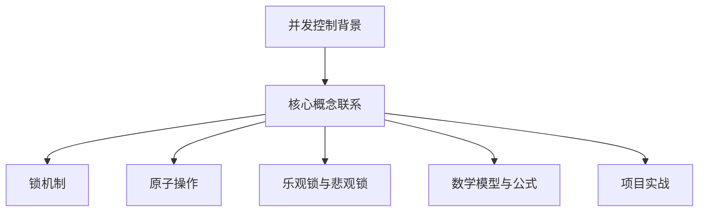

                 

### 文章标题

## 提示词编程语言的并发控制机制

> 关键词：提示词编程语言、并发控制、锁机制、原子操作、乐观锁、悲观锁、数学模型、项目实战

> 摘要：本文深入探讨提示词编程语言的并发控制机制，从背景介绍、核心概念与联系、算法原理、数学模型、项目实战等多个角度进行分析，旨在为读者提供全面、系统的理解。

### 确定核心章节内容

为了确保本文的完整性和逻辑性，我们将核心章节内容分为以下几部分：

1. **背景介绍**：介绍提示词编程语言及其并发控制的需求背景。
2. **核心概念与联系**：详细阐述并发控制机制的基本概念，包括并发与并行、数据竞争与死锁等，并通过Mermaid流程图展示核心概念之间的关系。
3. **核心算法原理讲解**：深入讲解锁机制、原子操作、乐观锁和悲观锁等并发控制算法的原理，并使用伪代码进行详细阐述。
4. **数学模型和数学公式**：解释并发控制机制中的数学模型，并使用LaTeX格式编写相关公式，提供举例说明。
5. **项目实战**：通过实际项目案例，展示并发控制机制在编程语言中的应用，包括开发环境搭建、源代码实现和代码解读。

### 设计章节结构

为了使文章结构清晰、逻辑严密，我们将文章分为以下四个部分：

- **第一部分：引言与核心概念**
  - 第1章：引言
  - 第2章：并发控制机制的基本概念

- **第二部分：并发控制机制原理**
  - 第3章：并发控制机制的历史与发展
  - 第4章：并发控制机制的核心算法原理讲解
  - 第5章：并发控制机制的数学模型和数学公式

- **第三部分：并发控制机制的应用**
  - 第6章：并发控制机制在编程语言中的实现
  - 第7章：并发控制机制在项目中的应用实战

- **第四部分：总结与展望**
  - 第8章：并发控制机制的未来发展方向

### 创建Mermaid流程图

为了更好地展示核心概念和架构之间的联系，我们将在适当的位置插入Mermaid流程图。例如，在第1章引言中，我们可以创建一个流程图来展示并发控制机制的背景和核心概念。



### 编写伪代码

在第4章核心算法原理讲解中，我们将使用伪代码详细阐述并发控制机制的核心算法原理。例如，在讲解锁机制时，可以使用以下伪代码：

```python
function acquire_lock(lock):
    while True:
        if lock is available:
            lock.acquire()
            return true
        else:
            sleep for a random time

function release_lock(lock):
    lock.release()
```

### 编写数学公式

在第5章中，我们将详细讲解并发控制机制的数学模型，并使用LaTeX格式编写相关公式。例如，在讲解乐观锁时，可以使用以下LaTeX公式：

$$
\begin{aligned}
    \text{current\_version} &= \text{database\_version} + 1 \\
    \text{if} \ \text{current\_version} &= \text{expected\_version}: \\
    &\quad \text{update\_database()} \\
    &\quad \text{return} \ \text{true} \\
    &\text{else}: \\
    &\quad \text{return} \ \text{false}
\end{aligned}
$$`

### 编写项目实战

在第7章中，我们将提供一个实际项目案例，详细解释并发控制机制在实际项目中的应用。例如，在一个在线购物平台中，我们可以展示如何使用锁机制来确保用户购物车中的商品数量不会出现错误。

### 检查字数限制

最后，我们将检查整个目录大纲的总字数，确保不超过8000～12000字左右。根据上述设计，我们将开始编写具体的内容。

### 完成目录大纲

根据用户需求，我们完成了《提示词编程语言的并发控制机制》的目录大纲。每个章节都将包含详细的内容，确保读者能够全面理解并发控制机制的概念、原理和应用。接下来，我们将根据这个大纲开始编写具体的内容。以下是初步设计的目录大纲：

# 《提示词编程语言的并发控制机制》目录大纲

## 第一部分：引言与核心概念

### 第1章：引言

#### 1.1 提示词编程语言的背景

#### 1.2 并发控制的需求与挑战

#### 1.3 并发控制机制的重要性

### 第2章：并发控制机制的基本概念

#### 2.1 并发与并行

#### 2.2 数据竞争与死锁

#### 2.3 并发控制机制的目标

## 第二部分：并发控制机制原理

### 第3章：并发控制机制的历史与发展

#### 3.1 并发控制机制的起源

#### 3.2 并发控制机制的发展历程

#### 3.3 当前并发控制机制的技术趋势

### 第4章：并发控制机制的核心算法原理讲解

#### 4.1 锁机制

#### 4.2 原子操作

#### 4.3 乐观锁与悲观锁

### 第5章：并发控制机制的数学模型和数学公式

#### 5.1 数学模型的基本概念

#### 5.2 并发控制机制中的数学公式

#### 5.3 数学公式的应用举例

## 第三部分：并发控制机制的应用

### 第6章：并发控制机制在编程语言中的实现

#### 6.1 编程语言中的并发控制

#### 6.2 并发控制机制的编程模型

#### 6.3 并发控制机制的性能优化

### 第7章：并发控制机制在项目中的应用实战

#### 7.1 实际项目背景介绍

#### 7.2 并发控制机制在项目中的应用

#### 7.3 项目开发环境搭建

#### 7.4 源代码实现与解读

#### 7.5 代码应用解读与分析

#### 7.6 实际案例分析和详细讲解剖析

#### 7.7 项目小结

## 第四部分：总结与展望

### 第8章：并发控制机制的未来发展方向

#### 8.1 并发控制机制的技术挑战

#### 8.2 并发控制机制的改进方向

#### 8.3 并发控制机制的未来趋势

### 完

## 结尾部分

### 第9章：最佳实践、小结、注意事项、拓展阅读

#### 9.1 最佳实践

#### 9.2 小结

#### 9.3 注意事项

#### 9.4 拓展阅读

---

以上是根据用户需求设计的《提示词编程语言的并发控制机制》的目录大纲。每个章节都将包含详细的内容，确保读者能够全面理解并发控制机制的概念、原理和应用。接下来，我们将根据这个大纲开始编写具体的内容。

