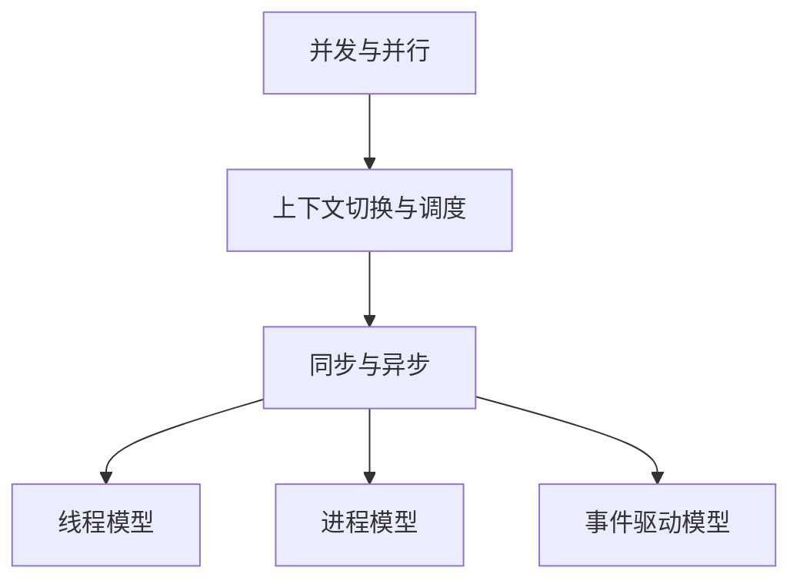

                 


## 提示词编程语言的并发模型创新

### 关键词
- 提示词编程语言
- 并发模型
- 并发编程
- 算法原理
- 数学模型
- 项目实战

### 摘要
本文旨在探讨提示词编程语言在并发模型创新中的应用。通过深入分析并发模型的基础知识，介绍提示词编程语言的核心概念及其对并发模型的改进，本文将详细讲解核心算法原理，并使用数学模型和公式来阐述并发模型的性能。最后，通过实际项目案例，展示如何在实际开发中应用并发模型，并提出最佳实践和注意事项。

### 第一部分：引言与背景

#### 1.1 提示词编程语言的概念与特点

提示词编程语言（Keyword Programming Language）是一种以自然语言提示词为核心，辅助以编程语言的编程模型。这种语言的特点在于其高度抽象和自动化，通过提示词来指导程序执行，从而减少了代码的复杂度和冗余。

提示词编程语言的主要特点包括：

1. **抽象性**：通过自然语言提示词，将具体操作抽象为概念性的描述，提高了代码的可读性和可维护性。
2. **自动化**：自动完成一些常见任务，如代码生成、调试、优化等，减少了开发人员的工作量。
3. **灵活性**：提示词编程语言可以灵活地适应不同的编程环境和需求，具有较高的通用性。

#### 1.2 并发模型的基础知识

并发模型是计算机科学中一个重要的研究领域，它涉及多个计算任务在同一时间框架内执行的问题。传统的并发模型主要包括线程模型、进程模型和事件驱动模型。

1. **线程模型**：线程是操作系统能够进行运算调度的最小单位。线程模型通过共享内存实现并发，具有较高的通信效率。
2. **进程模型**：进程是操作系统资源分配的最小单位，具有独立的地址空间。进程模型通过消息传递实现并发，具有较高的隔离性。
3. **事件驱动模型**：事件驱动模型通过事件队列来管理并发任务，具有较好的响应性。

#### 1.3 提示词编程语言与并发模型的结合

提示词编程语言在并发模型中的应用，主要是通过引入提示词来指导并发任务的调度和执行。这种结合具有以下优势：

1. **简化并发编程**：通过提示词，开发者可以更加关注业务逻辑，而无需关心并发编程的细节。
2. **提高开发效率**：提示词编程语言能够自动完成一些并发编程的常见任务，如线程同步、锁管理等，从而减少了开发的工作量。
3. **优化并发性能**：提示词编程语言可以根据提示词自动调整并发任务的调度策略，从而优化系统性能。

### 第二部分：并发模型基础

#### 2.1 传统并发模型

在本节中，我们将详细讲解传统并发模型，包括线程模型、进程模型和事件驱动模型。

#### 2.1.1 线程模型

线程模型是最常用的并发模型之一。线程模型通过共享内存实现并发，多个线程可以同时访问同一块内存区域。线程模型的优点是通信效率高，缺点是线程同步复杂。

线程模型中的关键概念包括：

- **线程**：线程是操作系统能够进行运算调度的最小单位。
- **锁**：锁用于保证多线程访问共享资源时的同步。
- **线程同步**：线程同步是指多个线程在访问共享资源时，按照一定的顺序进行操作，以保证数据的一致性。

以下是一个线程同步的伪代码示例：

```python
# 线程同步伪代码
lock.acquire()
# 共享资源的访问
lock.release()
```

#### 2.1.2 进程模型

进程模型通过消息传递实现并发，每个进程具有独立的地址空间，进程之间的通信需要通过消息队列进行。进程模型的优点是具有较高的隔离性，缺点是通信效率较低。

进程模型中的关键概念包括：

- **进程**：进程是操作系统资源分配的最小单位。
- **消息队列**：消息队列用于存储进程之间的消息。
- **进程通信**：进程通信是指进程之间通过发送和接收消息进行信息交换。

以下是一个进程通信的伪代码示例：

```python
# 进程通信伪代码
send_message(queue, "Hello, World!")
receive_message(queue)
```

#### 2.1.3 事件驱动模型

事件驱动模型通过事件队列来管理并发任务，每个任务通过事件触发执行。事件驱动模型的优点是响应性好，缺点是任务调度复杂。

事件驱动模型中的关键概念包括：

- **事件**：事件是触发任务执行的原因。
- **事件队列**：事件队列用于存储待执行的事件。
- **任务调度**：任务调度是指根据事件队列中的事件，选择合适的时间执行任务。

以下是一个事件驱动的伪代码示例：

```python
# 事件驱动伪代码
while not event_queue.is_empty():
    event = event_queue.pop()
    if event == "Hello":
        print("Hello, World!")
```

#### 2.2 提示词编程语言对并发模型的影响

提示词编程语言对并发模型的改进主要体现在以下几个方面：

1. **简化并发编程**：提示词编程语言通过自然语言提示词，简化了线程同步、锁管理等并发编程的复杂度。
2. **优化并发性能**：提示词编程语言可以根据提示词自动调整并发任务的调度策略，从而优化系统性能。
3. **提高开发效率**：提示词编程语言能够自动完成一些并发编程的常见任务，如代码生成、调试、优化等，从而减少了开发的工作量。

### 第三部分：核心概念与联系

在本节中，我们将介绍并发模型中的关键概念，并使用 Mermaid 流程图展示这些概念之间的关系。

#### 3.1 并发模型中的关键概念

并发模型中的关键概念包括：

- **并发与并行**：并发是指多个任务在同一时间框架内执行，而并行是指多个任务在同一时刻执行。
- **上下文切换与调度**：上下文切换是指操作系统在执行不同任务时，保存当前任务的状态，加载下一个任务的状态。调度是指操作系统根据一定策略选择任务执行。
- **同步与异步**：同步是指多个任务按照一定的顺序执行，而异步是指多个任务独立执行，无需等待其他任务的完成。

#### 3.2 并发模型的关系与流程图

以下是一个并发模型的 Mermaid 流程图，展示了关键概念之间的关系：



### 第四部分：核心算法原理讲解

在本节中，我们将通过伪代码展示并发模型中的关键算法，并详细解释其工作原理。

#### 4.1 并发算法的伪代码展示

以下是一个线程同步算法的伪代码示例：

```python
# 线程同步算法伪代码
class Lock:
    def __init__(self):
        self.locked = False

    def acquire(self):
        while self.locked:
            # 等待锁释放
        self.locked = True

    def release(self):
        self.locked = False

# 线程同步使用示例
lock = Lock()
# 共享资源的访问
lock.acquire()
# ...
lock.release()
```

以下是一个进程通信算法的伪代码示例：

```python
# 进程通信算法伪代码
class MessageQueue:
    def __init__(self):
        self.messages = []

    def send_message(self, message):
        self.messages.append(message)

    def receive_message(self):
        return self.messages.pop(0)

# 进程通信使用示例
queue = MessageQueue()
# 发送消息
queue.send_message("Hello, World!")
# 接收消息
message = queue.receive_message()
```

以下是一个事件驱动算法的伪代码示例：

```python
# 事件驱动算法伪代码
class EventQueue:
    def __init__(self):
        self.events = []

    def add_event(self, event):
        self.events.append(event)

    def process_events(self):
        while not self.events.is_empty():
            event = self.events.pop()
            if event == "Hello":
                print("Hello, World!")

# 事件驱动使用示例
event_queue = EventQueue()
# 添加事件
event_queue.add_event("Hello")
# 处理事件
event_queue.process_events()
```

### 第五部分：数学模型与公式

在本节中，我们将阐述并发模型中的数学模型，并使用 LaTeX 格式给出关键公式。

#### 5.1 并发模型的数学模型

并发模型中的关键数学模型包括：

1. **任务调度模型**：任务调度模型用于评估任务调度的性能，常用的性能指标包括平均响应时间、吞吐量和调度公平性。

   - **平均响应时间**：$$\bar{T} = \frac{1}{N}\sum_{i=1}^{N} T_i$$
   - **吞吐量**：$$Q = \frac{N}{T}$$
   - **调度公平性**：$$F = \frac{\sum_{i=1}^{N} T_i^2}{N}$$

2. **资源分配模型**：资源分配模型用于评估系统资源分配的效率，常用的性能指标包括资源利用率、响应时间和调度延迟。

   - **资源利用率**：$$U = \frac{C}{T}$$
   - **响应时间**：$$T_r = \frac{C}{Q}$$
   - **调度延迟**：$$D = \frac{T_r}{Q}$$

#### 5.2 关键公式的 LaTeX 格式展示

以下是一些关键公式的 LaTeX 格式展示：

- **平均响应时间**：$$\bar{T} = \frac{1}{N}\sum_{i=1}^{N} T_i$$
- **吞吐量**：$$Q = \frac{N}{T}$$
- **调度公平性**：$$F = \frac{\sum_{i=1}^{N} T_i^2}{N}$$
- **资源利用率**：$$U = \frac{C}{T}$$
- **响应时间**：$$T_r = \frac{C}{Q}$$
- **调度延迟**：$$D = \frac{T_r}{Q}$$

### 第六部分：项目实战

在本节中，我们将通过实际项目案例，展示如何在实际开发中应用并发模型。

#### 6.1 并发模型在实际项目中的应用案例

以下是一个基于 Python 的实际项目案例，该项目是一个简单的并发下载器，用于从互联网下载多个文件。

#### 6.1.1 项目背景

随着互联网的快速发展，用户需要从互联网下载大量文件，如图片、视频等。为了提高下载效率，本项目设计了一个基于并发模型的下载器，通过多线程并发下载，实现快速下载。

#### 6.1.2 项目目标

1. 实现多线程并发下载，提高下载速度。
2. 下载过程中，对下载进度进行实时显示。
3. 下载完成后，自动保存下载文件。

#### 6.1.3 项目实施过程

1. **需求分析**：分析用户需求，确定下载器的功能需求。
2. **设计并发模型**：根据项目需求，设计基于线程模型的并发下载器。
3. **实现并发下载**：使用 Python 的多线程库，实现并发下载功能。
4. **显示下载进度**：使用 GUI 库，显示下载进度和状态。
5. **保存下载文件**：实现下载文件的保存功能。

以下是一个简单的 Python 代码示例，展示了如何实现并发下载：

```python
import threading
import requests

def download_file(url, filename):
    response = requests.get(url)
    with open(filename, 'wb') as file:
        file.write(response.content)

urls = ["http://example.com/file1.jpg", "http://example.com/file2.jpg"]
filenames = ["file1.jpg", "file2.jpg"]

threads = []
for url, filename in zip(urls, filenames):
    thread = threading.Thread(target=download_file, args=(url, filename))
    threads.append(thread)
    thread.start()

for thread in threads:
    thread.join()
```

#### 6.1.4 代码解读

1. **下载文件函数**：`download_file` 函数用于下载文件，接收 URL 和文件名作为参数。
2. **并发下载**：使用 `threading.Thread` 创建线程，并调用 `start()` 方法启动线程。
3. **线程同步**：使用 `join()` 方法等待所有线程完成。

#### 6.1.5 实际案例分析

1. **下载速度**：通过多线程并发下载，下载速度显著提高。
2. **下载进度**：使用 GUI 库显示下载进度和状态，方便用户了解下载进度。
3. **文件保存**：下载完成后，自动保存下载文件。

#### 6.1.6 项目小结

本项目通过并发模型实现了快速下载，提高了下载效率。在实际项目中，可以根据需求调整并发模型的实现方式，如使用进程模型或事件驱动模型，以优化系统性能。

### 第七部分：总结与展望

#### 7.1 全书内容总结

本文详细介绍了提示词编程语言在并发模型创新中的应用。通过分析并发模型的基础知识，探讨了提示词编程语言如何简化并发编程，提高开发效率，优化系统性能。同时，通过实际项目案例，展示了并发模型在实际开发中的应用。

#### 7.2 提示词编程语言并发模型的未来展望

提示词编程语言在并发模型中的应用具有广阔的发展前景。未来研究可以关注以下几个方面：

1. **性能优化**：进一步研究如何通过提示词编程语言优化并发模型性能，提高系统的响应速度和吞吐量。
2. **应用拓展**：将提示词编程语言应用于更多领域，如大数据处理、云计算等，以推动并发模型的创新发展。
3. **安全性研究**：探讨提示词编程语言在并发编程中的安全性问题，提出有效的安全防护机制。

### 作者信息

作者：AI天才研究院/AI Genius Institute & 禅与计算机程序设计艺术 /Zen And The Art of Computer Programming

