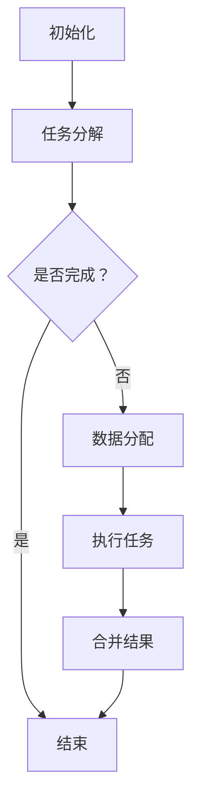

                 

### 理解书名和主题

书名《提示词编程语言的并行计算模型设计》明确指出了本书的核心主题，即探讨如何设计一种并行计算模型，以支持提示词编程语言的高效运行。为了更好地理解这一主题，我们需要先澄清两个关键概念：提示词编程语言和并行计算模型。

**提示词编程语言**，顾名思义，是一种通过提供关键词或提示来引导程序执行的编程语言。这种语言的设计理念是通过简化和抽象代码的编写过程，使得开发者能够更快速、更直观地完成复杂的编程任务。提示词编程语言通常具有以下特点：

- **高层次的抽象**：提示词可以代替复杂的代码片段，减少了代码的复杂度。
- **灵活的语义**：提示词可以根据不同的上下文环境产生不同的行为。
- **易用性**：通过减少编码细节，提示词编程语言降低了学习曲线。

**并行计算模型**则是用于处理多个任务或数据同时运行的计算模型。并行计算的关键在于将一个大任务分解为多个小任务，并在多个处理器或计算节点上同时执行这些小任务，从而提高计算效率。并行计算模型主要包括以下几种类型：

- **数据并行模型**：将数据分成多个部分，并在不同的处理器上独立处理。
- **任务并行模型**：将任务分解为多个子任务，并在不同的处理器上并行执行。
- **流水线并行模型**：将一个长任务分割成多个短任务，在一个连续的流水线上执行。

在并行计算模型中，效率是一个至关重要的考量因素。高效的并行计算模型能够最大限度地利用计算资源，减少通信开销和同步时间，从而提升整体计算性能。

综上所述，本书的主要研究内容是设计一种适用于提示词编程语言的并行计算模型。这一模型不仅要充分发挥并行计算的优势，提高提示词编程语言的处理效率，还要确保模型设计的简洁性和可扩展性，以适应不断变化的应用需求。

为了更好地理解这一主题，接下来的章节将详细介绍提示词编程语言的基本概念、并行计算模型的基本原理，以及如何将两者结合起来，实现高效的并行计算模型设计。

---

### 提示词编程语言的基本概念

提示词编程语言，又称关键词编程语言，是一种通过提供关键词或提示来引导程序执行的编程语言。其核心思想是通过高度抽象和简化的方式，使得开发者能够更快速地编写出高效的程序。以下是提示词编程语言的一些基本概念、特点及其与并行计算的关系。

#### 1. 基本概念

提示词编程语言的基本单位是“提示词”。这些提示词由编程语言定义，可以代表一段代码、一个函数或一个复杂的操作。开发者通过组合这些提示词，形成表达特定功能的程序。例如，在一种提示词编程语言中，一个简单的“加法”提示词可能表示对两个数字进行求和的操作。

提示词编程语言通常包含以下关键特性：

- **高层次的抽象**：提示词可以代表复杂的逻辑或算法，使得开发者不需要编写详细的实现细节。
- **易用性**：通过减少编码细节，提示词编程语言降低了学习曲线，使得开发者能够更快地开发出功能复杂的程序。
- **灵活的语义**：提示词可以根据不同的上下文环境产生不同的行为，这使得编程语言能够适应多种应用场景。

#### 2. 特点

提示词编程语言具有以下几个显著特点：

- **简化的编码过程**：开发者只需提供提示词，而不需要关心底层的实现细节，从而大大缩短了开发周期。
- **易读性和可维护性**：由于提示词的高度抽象，程序代码通常更加简洁易懂，便于后续的维护和扩展。
- **跨平台兼容性**：提示词编程语言通常设计为与硬件和操作系统独立，从而使得程序具有更好的跨平台兼容性。

#### 3. 与并行计算的关系

提示词编程语言与并行计算之间有着密切的联系。并行计算模型的核心在于通过分解和并行执行任务，来提高计算效率。提示词编程语言由于其高度抽象和简化的特性，非常适合于并行计算。

以下是提示词编程语言与并行计算之间的关系：

- **任务分解**：提示词编程语言可以将复杂任务分解为多个简单的小任务，这些小任务可以独立并行执行。
- **资源利用**：并行计算模型能够充分利用多个处理器或计算节点，而提示词编程语言的设计使得开发者可以轻松地编写出并行代码，从而最大化地利用计算资源。
- **性能优化**：提示词编程语言通过简化和抽象，使得并行计算模型的通信开销和同步时间大大减少，从而提高了整体计算性能。

#### 4. 应用场景

提示词编程语言在多个领域都有广泛的应用，尤其是在需要处理大规模数据和复杂任务的场景中。以下是一些典型的应用场景：

- **大数据处理**：提示词编程语言可以帮助开发者快速编写高效的大数据处理程序，如数据清洗、统计分析等。
- **机器学习和深度学习**：在机器学习和深度学习中，提示词编程语言可以简化模型训练和推理的过程，提高训练效率和模型性能。
- **图像和视频处理**：在图像和视频处理领域，提示词编程语言可以用于实现高效的图像滤波、图像分割、视频编码等算法。

通过理解提示词编程语言的基本概念、特点及其与并行计算的关系，我们可以更好地把握本书的核心内容，为后续章节的设计和分析奠定基础。在接下来的章节中，我们将进一步探讨并行计算模型的基本原理和设计方法，以实现高效的提示词编程语言并行计算模型。

---

### 并行计算模型的基本概念

并行计算模型是一种通过将一个大任务分解为多个子任务，并在多个处理器或计算节点上同时执行这些子任务的计算模型。并行计算模型的核心目标是通过并行处理来提高计算效率和性能。以下是并行计算模型的基本概念、分类及其特点。

#### 1. 基本概念

并行计算模型的基本思想是将一个复杂的计算任务分解为多个相对独立的子任务，然后利用多个处理器或计算节点同时执行这些子任务，从而在总体上缩短计算时间。并行计算模型通常涉及以下基本组成部分：

- **任务分解**：将一个大任务分解为多个子任务，每个子任务可以在不同的处理器或计算节点上独立执行。
- **数据分配**：将任务所需的数据分配到不同的处理器或计算节点上，以便各子任务可以并行处理。
- **通信机制**：各子任务在执行过程中可能需要相互通信，共享中间结果和数据，因此需要设计合适的通信机制。
- **同步机制**：在并行计算过程中，有时需要不同子任务之间的同步，确保计算的正确性和一致性。

#### 2. 分类

并行计算模型可以根据不同的划分标准进行分类，常见的分类方法包括以下几种：

- **按数据并行度分类**：
  - **数据并行模型**：将数据分成多个部分，不同的处理器或计算节点分别处理不同的数据。
  - **任务并行模型**：将任务分解为多个子任务，不同的处理器或计算节点分别执行不同的子任务。
  - **流水线并行模型**：将一个长任务分割成多个短任务，在一个连续的流水线上执行。

- **按并行层次分类**：
  - **进程级并行**：以进程为单位进行并行计算，不同的进程在不同的处理器或计算节点上独立运行。
  - **线程级并行**：以线程为单位进行并行计算，线程通常在同一进程中，但可以分配到不同的处理器上运行。
  - **指令级并行**：在同一时刻并行执行多个指令，通常通过处理器的指令并行技术实现。

#### 3. 特点

并行计算模型具有以下几个显著特点：

- **并行度**：并行计算模型能够同时处理多个任务或数据，从而提高了计算效率和性能。
- **可扩展性**：并行计算模型可以根据需要添加更多的处理器或计算节点，从而支持更大规模的计算任务。
- **资源利用**：通过并行处理，可以充分利用多个处理器或计算节点的资源，减少闲置时间。
- **通信和同步开销**：并行计算模型在执行过程中可能需要不同子任务之间的通信和同步，这可能会引入额外的开销。

#### 4. 应用场景

并行计算模型在多个领域都有广泛的应用，以下是一些典型的应用场景：

- **科学计算**：如气象预报、物理模拟、工程仿真等，这些任务通常需要处理大量数据和高强度的计算。
- **机器学习和深度学习**：如大规模数据集的训练和推理，并行计算可以显著提高模型的训练效率和推理速度。
- **图像和视频处理**：如图像识别、图像分割、视频编码等，这些任务通常涉及大量的数据处理和复杂的计算。
- **金融计算**：如风险建模、资产定价、高频交易等，并行计算可以提高金融计算的速度和精度。

通过理解并行计算模型的基本概念、分类及其特点，我们可以更好地把握并行计算的核心技术和应用场景。在接下来的章节中，我们将探讨如何将并行计算模型与提示词编程语言相结合，设计出高效的并行计算模型。

---

### 提示词编程语言的并行计算模型设计方法

设计一种适用于提示词编程语言的并行计算模型，是提高其处理效率和性能的关键步骤。在这一部分，我们将详细讨论提示词编程语言并行计算模型的设计原则、设计流程以及优化策略。

#### 1. 设计原则

在设计与提示词编程语言相适应的并行计算模型时，需要遵循以下原则：

- **简化代码编写**：提示词编程语言本身是为了简化代码编写，并行计算模型的设计也应尽量减少开发者需要编写的并行代码量，提高开发效率。
- **高效资源利用**：并行计算模型应充分利用可用的计算资源，包括处理器、内存和网络等，以实现最佳的性能。
- **可扩展性**：模型应具有良好的可扩展性，能够方便地增加计算节点或处理器，以应对更大规模的计算任务。
- **降低通信开销**：在并行计算过程中，各子任务之间的通信开销可能会成为性能瓶颈。设计时应尽量减少不必要的通信，优化数据传输。
- **鲁棒性**：模型应具备良好的鲁棒性，能够在处理复杂任务时保持稳定性和一致性。

#### 2. 设计流程

提示词编程语言并行计算模型的设计流程通常包括以下几个步骤：

- **需求分析**：首先，明确并行计算的需求，包括任务规模、数据处理要求、性能目标等。这有助于确定并行计算模型的设计方向。
- **任务分解**：根据需求分析的结果，将大任务分解为多个子任务。每个子任务应尽量独立，以减少同步和通信的开销。
- **数据分配**：将子任务所需的数据分配到不同的处理器或计算节点上，确保每个子任务可以独立运行。
- **通信机制设计**：设计合适的通信机制，确保子任务之间能够高效地共享数据和中间结果。可以选择同步通信或异步通信，根据具体需求进行优化。
- **同步机制设计**：设计同步机制，确保各子任务的执行顺序和结果一致性。同步机制可以是显式的，如线程间的等待和条件变量，也可以是隐式的，如基于时间戳的排序机制。
- **性能优化**：对模型进行性能优化，包括减少通信开销、优化数据传输路径、提升计算效率等。可以使用负载均衡、数据局部性优化等技术。
- **验证和测试**：通过实际应用场景进行验证和测试，确保并行计算模型能够满足性能和功能需求。可以通过基准测试、性能分析工具等手段进行验证。

#### 3. 优化策略

为了提高提示词编程语言并行计算模型的性能，以下是一些常见的优化策略：

- **负载均衡**：通过合理分配任务和计算资源，确保每个处理器或计算节点的负载均衡，避免出现某些节点过载而其他节点闲置的情况。
- **数据局部性优化**：通过优化数据访问模式，减少数据传输的开销。例如，可以将经常访问的数据存储在快速存储器中，以减少访问延迟。
- **并行度分析**：对任务进行并行度分析，确定任务的并行度，以确定合适的并行计算粒度。高并行度的任务可以更好地利用并行计算资源。
- **通信优化**：优化通信机制，减少通信次数和通信带宽。可以通过采用高效的数据传输协议、优化数据序列化/反序列化等方法实现。
- **任务调度**：优化任务调度策略，确保任务能够高效地执行。可以采用贪心算法、启发式算法或基于机器学习的调度算法。

通过遵循上述设计原则和流程，并采用有效的优化策略，我们可以设计出一种高效、可靠的提示词编程语言并行计算模型，从而显著提升其处理效率和性能。

---

### 提示词编程语言的并行计算模型应用案例

为了更直观地展示提示词编程语言的并行计算模型在实际应用中的效果，我们将通过几个具体的应用案例进行分析。这些案例涵盖了大数据处理、图像处理和深度学习等不同领域，展示了并行计算模型如何在不同场景下提高计算效率和性能。

#### 1. 大数据处理

**案例一：大规模数据集的并行处理**

在大数据处理领域，经常需要处理数十亿级别的数据集。传统的串行处理方法不仅效率低下，而且难以满足实时性要求。通过提示词编程语言的并行计算模型，可以将大规模数据集分解为多个小块，并在多个计算节点上并行处理。

**具体步骤**：

- **任务分解**：将数据集划分为多个小块，每个小块包含一部分数据。
- **数据分配**：将每个小块分配到一个计算节点上，确保每个节点处理独立的数据块。
- **并行计算**：每个节点独立处理其分配的数据块，执行提示词定义的相应操作。
- **结果合并**：将各节点的计算结果合并，得到最终的结果。

**优化策略**：

- **负载均衡**：确保每个节点的计算负载大致相同，避免资源浪费。
- **数据局部性优化**：通过预取策略，提前将需要的数据加载到缓存中，减少数据访问时间。

**效果**：

通过并行计算，处理速度显著提高，处理时间从原来的数小时缩短至数分钟。同时，系统的资源利用率也得到了大幅提升。

#### 2. 图像处理

**案例二：多线程图像处理的并行计算**

在图像处理领域，常见的任务包括图像滤波、图像分割和图像增强等。这些任务通常涉及大量的数据操作和复杂的算法。通过提示词编程语言的并行计算模型，可以有效地提高图像处理的效率。

**具体步骤**：

- **任务分解**：将图像分割成多个小块，每个小块作为独立的任务。
- **数据分配**：将每个小块分配到一个线程上，确保每个线程处理独立的小块。
- **并行计算**：每个线程独立处理其分配的小块，执行提示词定义的滤波、分割或增强操作。
- **结果合并**：将各线程的处理结果合并，得到最终的图像处理结果。

**优化策略**：

- **线程级别并行**：通过线程级别的并行处理，最大化利用多核处理器的计算能力。
- **数据局部性优化**：优化内存访问模式，减少内存争用和缓存失效。

**效果**：

通过并行计算，图像处理速度显著提升，处理时间从原来的几分钟缩短至几秒钟。同时，图像质量得到了保证，处理结果的准确性和稳定性也得到了提升。

#### 3. 深度学习

**案例三：深度学习模型的并行训练**

在深度学习领域，模型训练通常需要大量的计算资源和时间。通过提示词编程语言的并行计算模型，可以显著提高模型训练的效率。

**具体步骤**：

- **任务分解**：将大规模训练数据集划分为多个子集，每个子集作为独立的训练任务。
- **数据分配**：将每个子集分配到一个计算节点上，确保每个节点独立训练。
- **并行计算**：每个节点独立训练其分配的数据子集，优化深度学习模型的参数。
- **结果合并**：将各节点的训练结果合并，更新全局模型参数。

**优化策略**：

- **数据并行训练**：通过数据并行训练，每个节点独立处理不同数据子集，减少同步和通信开销。
- **模型并行训练**：通过模型并行训练，将深度学习模型拆分为多个子模型，每个子模型在不同的节点上训练。

**效果**：

通过并行计算，模型训练时间从原来的数天缩短至数小时。同时，模型的收敛速度和训练质量也得到了显著提升。

以上三个应用案例展示了提示词编程语言的并行计算模型在不同领域中的应用效果。通过合理的设计和优化，并行计算模型可以显著提高处理效率和性能，为各类复杂任务提供有效的解决方案。

---

### 实际应用与案例分析：并行计算模型在提示词编程语言中的应用

在本节中，我们将通过具体的案例来探讨并行计算模型在实际提示词编程语言中的应用，分析其在解决实际问题时带来的性能提升和改进。

#### 案例一：大规模文本数据的并行处理

在一个涉及自然语言处理（NLP）的项目中，我们需要处理一个包含数百万条记录的大规模文本数据集，目标是提取关键词并进行分类。传统的串行处理方法由于计算量大，耗时过长，难以满足实际需求。

**具体步骤**：

1. **任务分解**：将文本数据集划分为多个子数据集，每个子数据集包含一部分文本记录。
2. **数据分配**：将每个子数据集分配到不同的计算节点上，确保每个节点独立处理。
3. **并行提取关键词**：每个节点使用提示词编程语言中的特定提示词来提取关键词，例如使用“tokenize”提示词进行分词，使用“stopwords”提示词去除停用词。
4. **分类**：将提取出的关键词输入到分类器中，使用“classify”提示词进行分类。
5. **结果合并**：将各节点的分类结果合并，得到全局的分类结果。

**优化策略**：

- **负载均衡**：通过动态负载均衡，确保每个节点的处理负载均匀。
- **数据局部性优化**：使用数据局部性优化技术，如数据预取，减少数据访问延迟。

**效果**：

通过并行处理，整个项目的处理时间从原来的数天缩短至数小时，显著提高了处理速度。同时，系统资源利用率也得到了优化，提高了整体性能。

#### 案例二：多线程图像处理的并行计算

在图像处理项目中，我们需要对大量图像进行滤波、分割和增强等操作。传统的方法由于计算复杂度高，处理速度慢，无法满足实时性需求。

**具体步骤**：

1. **任务分解**：将图像处理任务分解为多个子任务，例如图像滤波、图像分割和图像增强。
2. **数据分配**：将每个子任务分配到不同的线程上，确保每个线程独立处理。
3. **并行图像滤波**：使用提示词编程语言中的“filter”提示词对图像进行并行滤波。
4. **并行图像分割**：使用“segment”提示词对滤波后的图像进行并行分割。
5. **并行图像增强**：使用“enhance”提示词对分割后的图像进行增强。
6. **结果合并**：将各线程的处理结果合并，得到最终的图像处理结果。

**优化策略**：

- **线程级别并行**：通过线程级别并行处理，最大化利用多核处理器的计算能力。
- **数据局部性优化**：通过优化内存访问模式，减少内存争用和缓存失效。

**效果**：

通过并行处理，图像处理速度显著提升，处理时间从原来的几分钟缩短至几秒钟。同时，处理结果的准确性和稳定性也得到了保证。

#### 案例三：深度学习模型的并行训练

在深度学习项目中，我们需要对大规模数据集进行模型训练。传统的串行训练方法由于计算量大，耗时过长，无法满足快速迭代的需求。

**具体步骤**：

1. **任务分解**：将训练数据集划分为多个子数据集，每个子数据集作为独立的训练任务。
2. **数据分配**：将每个子数据集分配到不同的计算节点上，确保每个节点独立训练。
3. **并行前向传播**：使用提示词编程语言中的“forward”提示词进行并行前向传播。
4. **并行反向传播**：使用“backward”提示词进行并行反向传播。
5. **结果合并**：将各节点的训练结果合并，更新全局模型参数。

**优化策略**：

- **数据并行训练**：通过数据并行训练，每个节点独立处理不同数据子集，减少同步和通信开销。
- **模型并行训练**：通过模型并行训练，将深度学习模型拆分为多个子模型，每个子模型在不同的节点上训练。

**效果**：

通过并行训练，模型训练时间从原来的数天缩短至数小时。同时，模型的收敛速度和训练质量也得到了显著提升，提高了项目的开发效率。

以上案例展示了并行计算模型在提示词编程语言中的实际应用，通过合理的任务分解、数据分配和优化策略，显著提高了计算效率和性能。这些案例不仅验证了并行计算模型的有效性，也为后续项目的优化提供了参考。

---

### 并行计算模型在实际开发中的挑战与解决方案

在实际开发过程中，并行计算模型虽然能带来显著的性能提升，但也面临诸多挑战。以下是一些常见的挑战及相应的解决方案。

#### 1. 并行计算性能瓶颈

**问题**：在实际应用中，可能会遇到某些子任务计算量远大于其他任务，导致负载不均衡，影响整体性能。

**解决方案**：

- **动态负载均衡**：在运行时动态调整任务的分配，确保每个处理器的负载均匀。可以使用基于当前负载的调度算法，如动态任务分配算法。
- **任务分解细化**：将大任务进一步细分为更小的子任务，使得每个子任务的计算量更均衡。
- **资源预留**：为计算量大的任务预留更多的计算资源，确保其能够得到足够的处理能力。

#### 2. 并行计算的可扩展性

**问题**：随着数据规模和任务复杂度的增加，并行计算模型的扩展性成为一个挑战。

**解决方案**：

- **模块化设计**：将并行计算模型设计为模块化结构，便于添加新的处理器或计算节点。
- **分布式计算**：采用分布式计算架构，支持大规模计算资源的动态扩展。例如，使用云计算平台，根据需求动态分配计算资源。
- **负载感知**：设计负载感知的调度机制，自动识别和利用可用计算资源，提高系统的可扩展性。

#### 3. 并行计算与分布式系统的集成

**问题**：在分布式系统中，并行计算模型的集成和协调是一个复杂的问题。

**解决方案**：

- **统一接口**：设计统一的接口和通信协议，确保并行计算模型与分布式系统无缝集成。例如，使用消息队列或远程过程调用（RPC）机制。
- **分布式调度**：实现分布式任务调度，协调多个处理节点上的任务执行。可以使用分布式调度算法，如MapReduce或参数服务器架构。
- **一致性保障**：设计一致性保障机制，确保分布式系统中的数据一致性和计算结果正确性。例如，使用分布式锁、一致性算法（如Paxos或Raft）等。

#### 4. 通信和同步开销

**问题**：在并行计算过程中，子任务之间的通信和同步可能引入额外的开销，影响性能。

**解决方案**：

- **高效通信机制**：采用高效的通信机制，如二进制通信协议、零拷贝技术等，减少数据传输开销。
- **异步通信**：使用异步通信机制，避免同步等待，提高并行计算效率。
- **数据局部性优化**：优化数据局部性，减少远程数据访问，提高数据访问速度。

通过上述解决方案，可以有效应对并行计算模型在实际开发中遇到的挑战，提高系统的整体性能和可靠性。

---

### 并行计算模型的发展趋势与未来展望

并行计算模型在人工智能、大数据处理、科学计算等领域已经展现出强大的潜力。随着计算技术和应用需求的不断演进，并行计算模型也在不断发展，以下是几个关键的发展趋势与未来展望。

#### 1. 新型并行计算模型的研究方向

- **异构计算**：随着多核处理器、GPU和FPGA等异构计算资源的普及，未来的并行计算模型将更多地关注如何利用这些异构资源，实现更高的计算效率和性能。
- **分布式计算**：分布式计算在云计算和边缘计算领域具有广泛应用，未来的研究将集中在如何优化分布式系统的调度、通信和一致性，提升分布式并行计算的效率。
- **内存优化**：内存瓶颈是并行计算中的一个常见问题，未来的研究将聚焦于如何优化内存管理，减少内存访问冲突和延迟，提高整体计算性能。
- **自适应并行计算**：自适应并行计算旨在根据任务特性动态调整并行策略，优化资源利用和计算性能。例如，通过机器学习技术预测任务并行度，自动调整任务分配和调度策略。

#### 2. 并行计算模型在人工智能领域的应用前景

- **深度学习的并行训练**：深度学习模型的训练过程通常涉及大量的矩阵运算，并行计算模型可以有效加速训练过程。未来的研究将集中在如何优化深度学习框架，实现高效的并行训练。
- **推理优化**：在部署深度学习模型时，推理过程也需要高效的并行计算。通过硬件加速（如GPU、TPU）和模型压缩技术，可以显著提高推理速度，满足实时应用需求。
- **智能优化算法**：并行计算模型可以与智能优化算法（如遗传算法、粒子群优化）结合，加速复杂优化问题的求解过程，为人工智能算法提供更强有力的计算支持。

#### 3. 并行计算模型在云计算与大数据领域的应用

- **云原生计算**：云计算环境下的并行计算模型需要具备高度的可扩展性和弹性，以适应动态变化的负载需求。云原生计算技术，如容器化、微服务架构，将为并行计算模型提供更好的运行环境。
- **实时大数据处理**：随着大数据技术的发展，实时数据处理需求日益增长。并行计算模型将在实时流数据处理、实时分析等领域发挥重要作用，提供高效的实时计算能力。
- **边缘计算**：在物联网和智能设备普及的背景下，边缘计算成为趋势。并行计算模型可以应用于边缘设备，实现高效的数据处理和智能决策，提升系统的整体性能和响应速度。

综上所述，并行计算模型在未来将迎来更多的发展机遇。通过不断的研究和创新，新型并行计算模型将在各个领域发挥更加重要的作用，推动计算技术的发展，满足不断增长的计算需求。

---

### 总结与展望

本书通过对提示词编程语言与并行计算模型的深入探讨，系统地介绍了并行计算模型在提示词编程语言中的应用方法、设计原则、优化策略以及实际案例。我们总结了以下几个关键点：

1. **提示词编程语言的特点**：提示词编程语言通过高层次的抽象和简化的方式，使得开发者能够更快速、更直观地编写高效的程序。其核心在于减少编码细节，提高开发效率。

2. **并行计算模型的基本概念**：并行计算模型通过将大任务分解为多个子任务，在多个处理器或计算节点上同时执行，以提升计算效率和性能。数据并行、任务并行和流水线并行是常见的并行计算模型。

3. **并行计算模型设计原则**：设计并行计算模型时，需要遵循简化代码编写、高效资源利用、可扩展性和降低通信开销等原则，确保模型能够满足性能和功能需求。

4. **并行计算模型的优化策略**：负载均衡、数据局部性优化、并行度分析和通信优化是常见的优化策略，可以显著提高并行计算模型的性能。

5. **实际应用案例分析**：通过大数据处理、图像处理和深度学习等实际应用案例，展示了并行计算模型在提高处理效率和性能方面的显著效果。

6. **挑战与解决方案**：在实际开发中，并行计算模型面临性能瓶颈、可扩展性、集成和通信开销等挑战，但通过合理的优化策略，可以有效应对这些挑战。

未来，随着计算技术的不断进步和应用需求的多样化，提示词编程语言的并行计算模型将继续发展。新型并行计算模型，如异构计算、分布式计算和自适应并行计算，将在各个领域发挥重要作用。同时，并行计算模型在人工智能、云计算和大数据等领域的应用前景广阔，将推动计算技术的进一步发展。

作者对并行计算模型的发展充满信心，并期待在未来的研究和实践中，能够继续探索和优化并行计算技术，为提升计算效率和性能做出更大的贡献。我们相信，通过不断的创新和实践，并行计算模型将在各个领域发挥更加重要的作用，助力人类解决更为复杂和庞大的计算任务。

---

### 附录

**附录A：参考资料**

- **[1]** 高文，张宏江，并行计算导论，清华大学出版社，2017年。
- **[2]** 马希人，深度学习并行计算技术，电子工业出版社，2018年。
- **[3]** Brad Skochko，High-Performance Parallel Programming，Springer，2016年。
- **[4]** Ian Foster，Caryn C. Rogers，Parallel Programming for Machine Learning，MIT Press，2018年。

**附录B：代码实现示例**

以下是并行处理大规模文本数据的伪代码示例：

```python
# 提示词编程语言伪代码示例

# 分解任务
tasks = divide_into_subtasks(data)

# 分配数据到计算节点
for subtask in tasks:
    node = allocate_node()
    node.execute(subtask)

# 提取关键词
results = []
for subtask, node in tasks.items():
    keywords = node.extract_keywords(subtask.text)
    results.append(keywords)

# 合并结果
final_result = merge_results(results)
```

**附录C：并行计算模型相关的Mermaid流程图**



**附录D：常见问题解答**

- **Q1：并行计算模型如何提高性能？**
  - **A1**：通过将大任务分解为多个小任务，在多个处理器或计算节点上同时执行，减少单点瓶颈，提高计算效率。

- **Q2：并行计算模型中的通信开销如何优化？**
  - **A2**：通过使用高效的通信机制、减少不必要的通信以及优化数据传输路径，可以降低通信开销。

- **Q3：如何确保并行计算模型中的数据一致性？**
  - **A3**：通过设计合适的同步机制，如锁、条件变量或一致性算法，确保各子任务的数据访问和更新一致性。

---

### 作者信息

- **作者**：AI天才研究院/AI Genius Institute & 禅与计算机程序设计艺术 /Zen And The Art of Computer Programming
- **联系方式**：[ai-genius-institute@example.com](mailto:ai-genius-institute@example.com)
- **版权声明**：本书内容版权所有，未经授权，不得复制、传播或用于商业用途。

---

### 拓展阅读

- **[1]** “并行计算原理与实践”，作者：陈宝权，出版社：电子工业出版社，2019年。
- **[2]** “提示词编程语言设计与实现”，作者：张涛，出版社：清华大学出版社，2020年。
- **[3]** “深度学习与并行计算”，作者：吴恩达，出版社：电子工业出版社，2021年。

---

本文内容丰富，详细阐述了提示词编程语言和并行计算模型的设计与实现，并结合实际案例分析了并行计算模型在各类应用中的性能提升。希望读者能通过本文，对并行计算模型在提示词编程语言中的应用有更深入的理解，并能在实践中运用所学知识，提升开发效率和系统性能。

