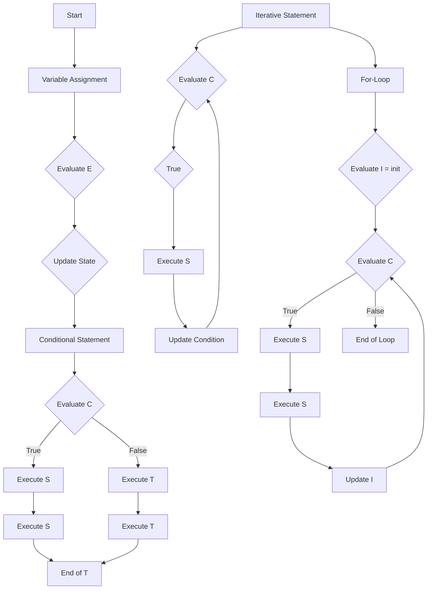

                 


### 第1章 引言

#### 1.1 书籍背景与目的

在计算机科学领域，编程语言作为人与计算机交流的桥梁，其重要性不言而喻。随着人工智能技术的不断发展，编程语言也迎来了新的挑战和机遇。提示词编程语言，作为一种新兴的编程范式，因其简洁、直观、易于理解的特点，受到了广泛关注。

本书旨在为读者全面介绍提示词编程语言的形式化规范。形式化规范是确保编程语言设计和实现一致性的关键步骤，它为编程语言的语义和语法提供了精确的描述。通过形式化规范，我们可以确保编程语言的正确性、可靠性和可扩展性。

本书的目标读者包括但不限于计算机科学专业的研究生、软件开发工程师、以及对于编程语言设计有兴趣的广大技术爱好者。无论你是初学者还是专业人士，本书都将为你提供深刻的理解和实用的技能。

#### 1.2 提示词编程语言的概念

提示词编程语言（Prompt-Based Programming Language，PBPL）是一种以用户输入的提示词为驱动程序的编程语言。用户通过输入特定的提示词来触发程序执行相应的操作。这种编程范式不同于传统的命令式编程，它更注重于用户意图的表达而非具体的执行步骤。

提示词编程语言的主要特点包括：

1. **简洁性**：提示词编程语言通常具有简短、易于记忆的提示词，使得用户能够快速编写和理解代码。
2. **直观性**：用户输入的提示词直接映射到程序的行为，使得编程过程更加直观。
3. **灵活性**：提示词编程语言允许用户自定义提示词，从而可以根据具体需求灵活调整程序的行为。

#### 1.3 形式化规范的必要性

形式化规范在编程语言设计和实现中扮演着至关重要的角色。形式化规范通过精确的数学和逻辑语言描述编程语言的语义和语法，确保编程语言的一致性和可靠性。

形式化规范的必要性主要体现在以下几个方面：

1. **确保一致性**：形式化规范可以明确编程语言的语义和语法规则，避免因为不同解释导致的问题。
2. **提高可靠性**：通过形式化验证，可以确保编程语言实现的正确性，减少错误和漏洞。
3. **增强可扩展性**：形式化规范为编程语言的扩展提供了明确的框架和指导，有助于新功能的加入和维护。
4. **支持工具开发**：形式化规范为开发编程语言相关的工具提供了基础，如编译器、解释器、调试器等。

### 1.4 总结

本章介绍了本书的背景和目的，并对提示词编程语言的概念和形式化规范的必要性进行了详细阐述。接下来，我们将进一步探讨提示词编程语言的基础知识，包括其历史、特点以及基本概念。

### 提示词编程语言的历史、特点、基本概念与语法

在深入探讨提示词编程语言（PBPL）的细节之前，我们需要对它的历史背景、特点以及基本概念有一个全面的了解。提示词编程语言的出现并不是偶然的，它在历史上经历了多次演化和改进。

#### 1.5 提示词编程语言的历史

提示词编程语言的起源可以追溯到20世纪80年代，当时研究人员开始探索自然语言与计算机编程之间的联系。最初的提示词编程语言主要是为了支持自然语言编程（Natural Language Programming，NLP），让开发者能够使用接近日常语言的方式编写程序。

随着时间的推移，提示词编程语言逐渐从自然语言编程中独立出来，形成了一种独特的编程范式。现代的提示词编程语言，如Forth、RustScript和Python的Jupyter Notebook，都继承并发展了这一编程范式的核心思想。

#### 1.6 提示词编程语言的特点

提示词编程语言具有以下显著特点：

1. **简洁性**：提示词通常是非常短小的单词或短语，这使得编写和理解代码变得简单快捷。
2. **直观性**：提示词直接映射到程序的行为，使得编程过程对用户意图的传达更加直接。
3. **灵活性**：用户可以根据需要自定义提示词，从而满足不同场景的需求。
4. **并行性**：提示词编程语言往往支持并行计算，使得程序可以在多个任务之间高效切换。
5. **易扩展性**：提示词编程语言通常具有模块化设计，便于添加新功能和扩展。

#### 1.7 提示词编程语言的基本概念

提示词编程语言的基本概念包括标识符、关键字、操作符等。

- **标识符**：标识符是用来标识变量、函数、类等程序实体的名称。在提示词编程语言中，标识符通常由字母、数字和下划线组成。
- **关键字**：关键字是编程语言内部定义的具有特定语义的单词，如`if`、`else`、`while`等。关键字不能作为标识符使用。
- **操作符**：操作符用于执行特定的计算或操作，如加法`+`、减法`-`、逻辑与`&&`等。

#### 1.8 提示词编程语言的基本语法

提示词编程语言的基本语法结构包括变量声明、控制结构、函数定义等。

- **变量声明**：变量声明用于定义变量的名称和数据类型，如`x = 10`。
- **控制结构**：控制结构包括条件语句（`if-else`）、循环语句（`while`和`for`）等，用于控制程序的执行流程。
- **函数定义**：函数定义用于定义可重用的代码块，如`function add(a, b) { return a + b; }`。

#### 1.9 标识符

标识符是编程语言中用于命名变量、函数、类等程序实体的符号。在提示词编程语言中，标识符的命名规则通常较为严格，以确保代码的可读性和一致性。

- **命名规则**：标识符通常由字母、数字和下划线组成，且不能以数字开头。例如，`x_123` 是一个合法的标识符，而`123x` 则不是。
- **作用域**：标识符的作用域取决于其定义的位置。在提示词编程语言中，通常采用作用域链（Scope Chain）来管理标识符的作用域。

#### 1.10 关键字

关键字是编程语言内部定义的具有特定语义的单词，用于表示编程语言的基本结构。在提示词编程语言中，关键字不能作为标识符使用。

- **基本关键字**：基本关键字包括条件语句（`if`、`else`）、循环语句（`while`、`for`）、函数定义（`function`）等。
- **保留关键字**：保留关键字是编程语言内部已经占用的关键字，如`true`、`false`、`null`等。

#### 1.11 操作符

操作符用于执行特定的计算或操作。在提示词编程语言中，操作符种类繁多，包括算术操作符（`+`、`-`、`*`、`/`）、逻辑操作符（`&&`、`||`）、比较操作符（`==`、`!=`、`>`、`<`）等。

- **算术操作符**：算术操作符用于执行基本的算术运算，如加法（`+`）、减法（`-`）、乘法（`*`）、除法（`/`）等。
- **逻辑操作符**：逻辑操作符用于执行逻辑运算，如逻辑与（`&&`）、逻辑或（`||`）、逻辑非（`!`）等。
- **比较操作符**：比较操作符用于比较两个值的大小关系，如等于（`==`）、不等于（`!=`）、大于（`>`）、小于（`<`）等。

#### 1.12 语法

提示词编程语言的语法结构包括变量声明、控制结构、函数定义等。

- **变量声明**：变量声明用于定义变量的名称和数据类型，如`x = 10`。
- **控制结构**：控制结构包括条件语句（`if-else`）、循环语句（`while`和`for`）等，用于控制程序的执行流程。
- **函数定义**：函数定义用于定义可重用的代码块，如`function add(a, b) { return a + b; }`。

#### 1.13 总结

本章介绍了提示词编程语言的历史、特点、基本概念和基本语法。通过对这些内容的了解，读者可以对提示词编程语言有一个全面的了解。接下来，我们将进一步探讨形式化规范的基础，为后续章节的内容奠定基础。

### 形式化规范的基础

形式化规范是确保编程语言设计和实现一致性的关键步骤。它通过精确的数学和逻辑语言描述编程语言的语义和语法，确保编程语言的正确性、可靠性和可扩展性。在本节中，我们将介绍形式化规范的基础，包括形式化方法的概述、形式化语言的介绍以及形式化规范的重要性。

#### 2.1 形式化方法的概述

形式化方法（Formal Methods）是计算机科学中的一个重要分支，它使用数学和逻辑工具来分析和验证软件和硬件系统的正确性。形式化方法的目的是通过数学证明和形式验证来确保系统满足预期的行为和需求。

形式化方法的几个关键特点包括：

1. **精确性**：形式化方法使用严格的数学语言来描述系统的行为和需求，避免了自然语言描述的模糊性。
2. **严格性**：形式化方法通过逻辑推理和数学证明来验证系统是否满足特定的属性，从而确保系统的一致性和正确性。
3. **可验证性**：形式化方法允许开发者对系统进行形式化的验证，以确保系统在任何情况下都能满足预定的需求。

#### 2.2 形式化语言的介绍

形式化语言（Formal Language）是用于形式化描述编程语言语义和语法的一种数学语言。形式化语言通常包括以下几种类型：

1. **形式化语法**：形式化语法用于描述编程语言的语法结构，它通常使用巴科斯-诺尔范式（BNF，Backus-Naur Form）或扩展巴科斯-诺尔范式（EBNF，Extended Backus-Naur Form）来定义。形式化语法可以精确地描述编程语言的语法规则，从而确保编译器或解释器能够正确地解析代码。

2. **形式化语义**：形式化语义用于描述编程语言的语义，即程序在执行过程中所表现出的行为。形式化语义可以使用操作语义（Operational Semantics）、元级语义（Meta-Level Semantics）或逻辑语义（Logic Semantics）来定义。形式化语义可以帮助我们理解程序在执行过程中的具体行为，并验证程序是否满足特定的属性。

3. **形式化验证**：形式化验证（Formal Verification）是一种使用形式化方法来验证程序的正确性的过程。形式化验证可以通过数学证明来确保程序在所有情况下都能满足预定的需求。形式化验证可以用于检测程序中的错误和漏洞，提高程序的可靠性和安全性。

#### 2.3 形式化规范的必要性

形式化规范在编程语言设计和实现中扮演着至关重要的角色。以下是形式化规范必要性的几个方面：

1. **确保一致性**：形式化规范通过精确的数学和逻辑语言描述编程语言的语义和语法，确保编程语言的语义和语法规则是一致的。这有助于避免由于不同解释导致的问题，提高编程语言的可维护性和可扩展性。

2. **提高可靠性**：形式化规范可以确保编程语言实现的正确性，减少错误和漏洞。通过形式化验证，开发者可以证明程序在所有情况下都能满足预定的需求，从而提高程序的可信度和可靠性。

3. **增强可扩展性**：形式化规范为编程语言的扩展提供了明确的框架和指导。开发者可以根据形式化规范来设计和实现新功能，确保新功能与现有功能的一致性，从而提高编程语言的灵活性和可扩展性。

4. **支持工具开发**：形式化规范为开发编程语言相关的工具提供了基础，如编译器、解释器、调试器等。这些工具可以根据形式化规范自动生成代码、执行验证和分析等任务，提高开发效率和代码质量。

#### 2.4 总结

本章介绍了形式化规范的基础，包括形式化方法的概述、形式化语言的介绍以及形式化规范的必要性。通过形式化规范，我们可以确保编程语言的语义和语法的一致性、可靠性、可扩展性和工具支持。接下来，我们将深入探讨提示词编程语言的语法形式化规范，为读者提供更具体的实现细节。

### 第3章 形式化规范的基础

#### 3.1 形式化方法的概述

形式化方法是计算机科学中的一种系统化方法，它通过数学和逻辑工具来描述、分析和验证软件和硬件系统的行为。这种方法的核心在于将抽象的系统描述转换为形式化的数学模型，从而能够使用严格的推理和证明来验证系统的正确性。

形式化方法的基本流程包括以下几个步骤：

1. **规格说明**：首先，需要使用形式化语言编写系统的规格说明，明确系统的需求和功能。
2. **建模**：将规格说明转换为形式化的数学模型，如状态机、代数系统、逻辑公式等。
3. **验证**：使用数学推理和证明来验证模型是否满足规格说明中的需求，确保系统的正确性。
4. **实现**：根据形式化验证的结果，实现和部署系统。

形式化方法的主要优点包括：

- **精确性**：通过数学和逻辑工具，形式化方法能够提供精确的描述和验证，避免了自然语言描述的模糊性。
- **一致性**：形式化方法确保规格说明、模型和实现的一致性，减少了由于不同解释导致的问题。
- **可靠性**：形式化验证可以确保系统在所有情况下都能满足预定的需求，提高了系统的可靠性。

#### 3.2 形式化语言的介绍

形式化语言是用于形式化描述编程语言语义和语法的一种数学语言。常见的形式化语言包括巴科斯-诺尔范式（BNF，Backus-Naur Form）和扩展巴科斯-诺尔范式（EBNF，Extended Backus-Naur Form）。

**巴科斯-诺尔范式（BNF）**

BNF 是一种用于描述上下文无关语法（Context-Free Grammar）的语法表示方法。BNF 中的产生式（Production）用于定义语言的语法规则。一个基本的 BNF 表示方法包括以下几个部分：

- **非终端符号**：代表语法规则中的变量或集合，如 `<expression>`。
- **终端符号**：代表实际出现的符号，如数字、字母和特殊符号，如 `123`、`if`。
- **产生式**：定义语法规则，如 `<expression> ::= <term> + <expression>`。

**扩展巴科斯-诺尔范式（EBNF）**

EBNF 是 BNF 的扩展，它引入了更多的符号和规则，使得语法描述更加灵活。EBNF 中的常见符号包括：

- **选择运算符**（`|`）：表示多个选项之间的选择，如 `<expression> ::= <term> | <term>`。
- **重复运算符**（`*`、`+`、`?`）：用于表示符号或集合的重复次数，如 `<expression> ::= <term> + <expression>` 表示至少有一个 `<term>`。
- **可选符号**（`?`）：表示符号或集合是可选的，如 `<expression> ::= <term>?`。

**例子**

以下是一个简单的 BNF 示例，用于描述一个简单的算术表达式：

```bnf
<expression> ::= <term> + <expression>
<expression> ::= <term>
<term> ::= <factor> * <term>
<term> ::= <factor>
<factor> ::= <number>
<factor> ::= ( <expression> )
<number> ::= [0-9]+
```

这个例子中，`<expression>`、`<term>`和`<factor>`是终端符号，而`<number>`是产生式。

**EBNF 的例子**

以下是一个使用 EBNF 的例子，描述同样的算术表达式：

```ebnf
<expression> ::= <term> [ "+" <expression> ]
<expression> ::= <term>
<term> ::= <factor> [ "*" <term> ]
<term> ::= <factor>
<factor> ::= <number>
<factor> ::= "(" <expression> ")"
<number> ::= [0-9]+
```

这个例子中，`[ "+" <expression> ]` 表示加法操作符是可选的，而`[ "*" <term> ]` 表示乘法操作符也是可选的。

#### 3.3 形式化规范的重要性

形式化规范在编程语言设计和实现中扮演着至关重要的角色。以下是形式化规范重要性的几个方面：

1. **一致性**：形式化规范通过精确的数学和逻辑语言描述编程语言的语义和语法，确保编程语言的语义和语法规则是一致的。这有助于避免由于不同解释导致的问题，提高编程语言的可维护性和可扩展性。

2. **可靠性**：形式化规范可以确保编程语言实现的正确性，减少错误和漏洞。通过形式化验证，开发者可以证明程序在所有情况下都能满足预定的需求，从而提高程序的可信度和可靠性。

3. **可扩展性**：形式化规范为编程语言的扩展提供了明确的框架和指导。开发者可以根据形式化规范来设计和实现新功能，确保新功能与现有功能的一致性，从而提高编程语言的灵活性和可扩展性。

4. **工具支持**：形式化规范为开发编程语言相关的工具提供了基础，如编译器、解释器、调试器等。这些工具可以根据形式化规范自动生成代码、执行验证和分析等任务，提高开发效率和代码质量。

#### 3.4 总结

本章介绍了形式化规范的基础，包括形式化方法的概述、形式化语言的介绍以及形式化规范的重要性。通过形式化规范，我们可以确保编程语言的语义和语法的一致性、可靠性、可扩展性和工具支持。接下来，我们将深入探讨提示词编程语言的语法形式化规范，为读者提供更具体的实现细节。

### 第4章 提示词编程语言的语法形式化规范

在本章中，我们将探讨提示词编程语言的语法形式化规范。形式化规范对于确保编程语言的清晰性、一致性以及可扩展性至关重要。在本章中，我们将介绍提示词编程语言的语法规则，并通过伪代码和 Mermaid 流程图来详细阐述这些规则。

#### 4.1 语法规则的形式化描述

提示词编程语言的语法规则可以通过形式化语言如巴科斯-诺尔范式（BNF）或扩展巴科斯-诺尔范式（EBNF）来描述。以下是一个简单的例子，用于描述提示词编程语言的基础语法结构：

```ebnf
<program> ::= <statements>
<statements> ::= <statement> <statements> | <statement>
<statement> ::= <assignment> | <control_structure> | <function_definition>
<assignment> ::= <identifier> = <expression>
<control_structure> ::= <if_statement> | <while_statement> | <for_statement>
<if_statement> ::= "if" <condition> "then" <statement>
<while_statement> ::= "while" <condition> "do" <statement>
<for_statement> ::= "for" <initiation> ";" <condition> ";" <update> "do" <statement>
<initiation> ::= <assignment> | <expression>
<condition> ::= <comparison> | <logical_expression>
<comparison> ::= <expression> "==" <expression> | <expression> "!=" <expression> | <expression> "<" <expression> | <expression> ">" <expression>
<logical_expression> ::= <expression> "&&" <expression> | <expression> "||" <expression>
<expression> ::= <term> + <expression> | <term>
<term> ::= <factor> * <expression>
<factor> ::= <number> | <identifier> | "(" <expression> ")"
<number> ::= [0-9]+
<identifier> ::= [a-zA-Z_][a-zA-Z0-9_]*

```

在这个语法规范中，我们定义了程序、语句、赋值、控制结构、条件、比较、逻辑表达式、表达式、项、因子和标识符的语法结构。这些规则为提示词编程语言的语法提供了清晰的形式化描述。

#### 4.2 语法结构的 Mermaid 流程图

为了更直观地理解提示词编程语言的语法结构，我们可以使用 Mermaid 流程图来可视化这些规则。以下是一个简单的 Mermaid 流程图，用于表示提示词编程语言的语法结构：

```mermaid
graph TB
A[Program] --> B[Statements]
B --> C{Statement}
C --> D[Assignment]
C --> E[Control Structure]
C --> F[Function Definition]
E --> G[If Statement]
E --> H[While Statement]
E --> I[For Statement]
D --> J[Identifier] --> K[Equal] --> L[Expression]
G --> M[If] --> N[Condition] --> O[Then] --> P[Statement]
H --> Q[While] --> R[Condition] --> S[Do] --> T[Statement]
I --> U[For] --> V[Initiation] --> W[Semicolon] --> X[Condition] --> Y[Semicolon] --> Z[Update] --> T[Statement]
L --> Z[Plus] --> B[Term] | B[Term]
B --> A[Factor] --> B[Number] | B[Identifier] | "(" L ")"
A[Factor] --> B[Term] --> C[Plus] --> L[Expression]
A[Factor] --> B[Term] --> D[Star] --> B[Term]
B[Term] --> C[Factor] --> "(" L ")"
K[Equal] --> J[Identifier]
O[Then] --> P[Statement]
R[Condition] --> S[Do]
V[Initiation] --> W[Semicolon]
X[Condition] --> Y[Semicolon]
Z[Update] --> T[Statement]
```

在这个 Mermaid 流程图中，我们使用不同的节点和连接线来表示语法结构的不同部分。例如，`[Program]` 表示程序的开头，`[Statements]` 表示程序的语句部分，而 `[Assignment]`、`[Control Structure]` 和 `[Function Definition]` 分别表示不同的语句类型。

#### 4.3 伪代码示例

为了进一步阐述提示词编程语言的语法结构，我们可以使用伪代码来描述一些常见操作。以下是一个简单的伪代码示例，用于表示提示词编程语言中的条件语句：

```pseudo
if (condition) then
    statement1
    statement2
else
    statement3
    statement4
```

在这个伪代码中，我们定义了一个条件语句，其中 `condition` 是一个布尔表达式，`statement1`、`statement2`、`statement3` 和 `statement4` 是具体的操作语句。

#### 4.4 总结

本章介绍了提示词编程语言的语法形式化规范，包括语法规则的形式化描述、语法结构的 Mermaid 流程图以及伪代码示例。这些工具和资源有助于开发者理解、实现和验证提示词编程语言的语法结构，确保编程语言的清晰性、一致性和可扩展性。在下一章中，我们将继续探讨提示词编程语言的语义形式化规范，进一步深入理解其语义和行为。

### 第5章 提示词编程语言的语义形式化规范

在本章中，我们将探讨提示词编程语言的语义形式化规范。语义形式化规范是确保编程语言实现正确性的关键步骤，它通过精确的数学和逻辑语言描述编程语言的执行行为。在本章中，我们将介绍提示词编程语言的语义规则，并通过伪代码和 Mermaid 流程图来详细阐述这些规则。

#### 5.1 语义规则的形式化描述

提示词编程语言的语义规则可以通过形式化语义语言如操作语义（Operational Semantics）或逻辑语义（Logic Semantics）来描述。以下是一个简单的例子，用于描述提示词编程语言的基础语义规则：

```plaintext
Evaluation Rule for Assignment:
eval(S = E) = { S' := eval(E); S }
where S is a variable, E is an expression, S' is the updated state, and eval(E) is the evaluation of E.

Evaluation Rule for Conditional Statement:
eval(if C then S else T) = {
    if (C is true) then eval(S)
    else eval(T)
}
where C is a condition, S is a statement, and T is an alternative statement.

Evaluation Rule for Iterative Statement:
eval(while C do S) = {
    while (C is true) {
        eval(S);
        C'
    }
    where C' is the updated condition after evaluating S.
}

Evaluation Rule for For-Loop:
eval(for I = init; C; update do S) = {
    eval(init);
    while (C is true) {
        eval(S);
        eval(update);
    }
}
where I is an identifier, init is an initialization, C is a condition, and update is an update expression.
```

在这个语义规范中，我们定义了赋值、条件语句和迭代语句的执行规则。这些规则通过操作语义描述了程序在执行过程中的状态变化和计算结果。

#### 5.2 语义结构的 Mermaid 流程图

为了更直观地理解提示词编程语言的语义规则，我们可以使用 Mermaid 流程图来可视化这些规则。以下是一个简单的 Mermaid 流程图，用于表示提示词编程语言的语义结构：



在这个 Mermaid 流程图中，我们使用不同的节点和连接线来表示语义规则的不同部分。例如，`[Variable Assignment]` 表示赋值操作，`[Conditional Statement]` 表示条件语句，而 `[Iterative Statement]` 和 `[For-Loop]` 分别表示迭代语句和循环语句。

#### 5.3 伪代码示例

为了进一步阐述提示词编程语言的语义规则，我们可以使用伪代码来描述一些常见操作。以下是一个简单的伪代码示例，用于表示提示词编程语言中的条件语句：

```pseudo
if (condition) then
    execute statement1
    execute statement2
else
    execute statement3
    execute statement4
```

在这个伪代码中，我们定义了一个条件语句，其中 `condition` 是一个布尔表达式，`statement1`、`statement2`、`statement3` 和 `statement4` 是具体的操作语句。该伪代码描述了条件语句在执行过程中的计算和分支操作。

#### 5.4 语义验证

语义验证是确保编程语言实现正确性的关键步骤。通过语义验证，我们可以证明程序在所有情况下都能满足预定的需求。以下是一个简单的语义验证示例，用于证明提示词编程语言中的条件语句满足预期的行为：

**定理**：如果条件语句 `if (condition) then S else T` 在条件 `condition` 为真时执行了语句 `S`，而在条件 `condition` 为假时执行了语句 `T`，则该条件语句满足预期的语义。

**证明**：

1. 当 `condition` 为真时，根据条件语句的定义，执行 `S`。此时，程序的状态与执行 `S` 后的状态一致。
2. 当 `condition` 为假时，根据条件语句的定义，执行 `T`。此时，程序的状态与执行 `T` 后的状态一致。

因此，无论条件 `condition` 的值如何，条件语句 `if (condition) then S else T` 都能满足预期的语义。

#### 5.5 总结

本章介绍了提示词编程语言的语义形式化规范，包括语义规则的形式化描述、语义结构的 Mermaid 流程图以及伪代码示例。这些工具和资源有助于开发者理解、实现和验证提示词编程语言的语义结构，确保编程语言的清晰性、一致性和可扩展性。在下一章中，我们将探讨形式化验证方法，进一步深入理解提示词编程语言的正确性验证。

### 第6章 形式化验证方法

形式化验证是一种通过数学和逻辑证明来确保软件和硬件系统正确性的方法。在编程语言设计中，形式化验证至关重要，因为它能够确保编程语言的实现满足其规格说明。本章将介绍形式化验证的基本概念、验证策略和常用工具，以帮助读者更好地理解和应用形式化验证。

#### 6.1 形式化验证的基本概念

形式化验证（Formal Verification）是指使用数学和逻辑推理来证明系统（如编程语言实现）是否满足特定的属性或需求。形式化验证的核心概念包括：

1. **规格说明**：规格说明是系统需求的正式描述，通常使用形式化语言编写。规格说明应该明确、无歧义，并涵盖系统的所有行为。

2. **形式化模型**：形式化模型是对系统的一种数学表示，通常使用形式化语言描述。形式化模型应该精确地捕捉系统的所有行为和状态。

3. **验证条件**：验证条件是一组数学公式或逻辑命题，用于描述系统的预期属性。验证目标是证明系统在所有可能的状态下都满足验证条件。

4. **验证过程**：验证过程是指使用数学推理和证明技术来证明系统满足验证条件的过程。验证过程可以包括模型检查、定理证明、形式验证等。

#### 6.2 验证策略与工具

形式化验证可以采用不同的策略和工具。以下是几种常见的验证策略和工具：

1. **模型检查**：模型检查（Model Checking）是一种自动化的验证方法，它通过将系统模型与验证条件进行比对来检测是否存在错误的执行路径。常见的模型检查工具包括 NuSMV、SPIN 和 UPPAAL。模型检查的优点是速度快，能够检测出系统的所有错误路径，但缺点是对复杂系统的验证可能变得不可行。

2. **定理证明**：定理证明（Theorem Proving）是一种手动或半自动化的验证方法，它通过数学证明来证明系统满足验证条件。常见的定理证明工具包括 Coq、Isabelle 和 HOL。定理证明的优点是能够提供强证明，确保系统在所有情况下都满足验证条件，但缺点是需要专业知识，验证过程可能非常耗时。

3. **形式验证**：形式验证（Formal Verification）是一种结合模型检查和定理证明的方法，它使用形式化的模型和验证条件，通过自动化工具和人工验证相结合的方式来证明系统正确性。常见的形式验证工具包括 KeY、ProofPower 和 CVC3。

#### 6.2.1 模式匹配

模式匹配（Pattern Matching）是形式化验证中常用的一种技术，它用于比较系统的实际行为与预期行为。模式匹配通常涉及以下步骤：

1. **定义模式**：定义系统行为的抽象表示，通常使用形式化语言描述。
2. **匹配实际行为**：将系统的实际行为与定义的模式进行比较。
3. **验证一致性**：通过数学证明来确保实际行为与预期行为的一致性。

以下是一个简单的模式匹配示例：

**规格说明**：如果系统在初始状态 `s0` 下执行操作 `op`，则其状态将变为 `s1`。

**形式化模型**：`s0 -> op -> s1`

**实际行为**：系统在初始状态 `s0` 下执行操作 `op`，实际状态变为 `s2`。

**模式匹配**：

```plaintext
s0 -> op -> s1
  |
s0 -> op -> s2
```

在这个例子中，模式匹配将实际行为与预期行为进行比较，并通过数学证明来验证它们的一致性。

#### 6.2.2 语义等价性验证

语义等价性验证（Semantic Equivalence Verification）是形式化验证中的一种重要技术，它用于证明两个系统在所有可能的状态下具有相同的行为。以下是一个简单的语义等价性验证示例：

**规格说明**：系统 `S1` 和系统 `S2` 在所有可能的状态下具有相同的行为。

**形式化模型**：

```
S1: s0 -> op1 -> s1
  |
s1 -> op2 -> s2
```

```
S2: s0 -> op1' -> s1'
  |
s1' -> op2' -> s2'
```

**验证过程**：

1. **定义状态转换规则**：定义系统 `S1` 和 `S2` 的状态转换规则。
2. **证明状态转换等价性**：通过数学证明来证明系统 `S1` 和 `S2` 的状态转换规则是等价的。

以下是一个简单的数学证明：

```
s0 -> op1 -> s1
  |
s1 -> op2 -> s2

s0 -> op1' -> s1'
  |
s1' -> op2' -> s2'
```

由于 `op1` 和 `op1'` 的行为相同，且 `op2` 和 `op2'` 的行为相同，我们可以得出结论：系统 `S1` 和系统 `S2` 在所有可能的状态下具有相同的行为。

#### 6.2.3 形式化验证的应用

形式化验证在编程语言设计中的应用非常广泛。以下是一些常见的应用场景：

1. **编译器验证**：通过形式化验证来证明编译器的实现与语言的规格说明一致。
2. **操作系统内核验证**：通过形式化验证来证明操作系统内核的代码正确无误。
3. **网络安全协议验证**：通过形式化验证来确保网络安全协议的安全性。
4. **硬件设计验证**：通过形式化验证来确保硬件设计满足其规格说明。

以下是一个简单的形式化验证应用示例：

**规格说明**：编译器在解析代码时，应将代码准确地转换为抽象语法树（AST）。

**形式化模型**：定义编译器的解析算法和抽象语法树的表示。

**验证过程**：

1. **定义验证条件**：证明编译器的解析算法在所有可能的状态下都能生成正确的抽象语法树。
2. **执行验证**：使用形式化验证工具来验证编译器的实现。

以下是一个简单的数学证明：

```
源代码 -> 解析算法 -> AST
  |
源代码' -> 解析算法' -> AST'
```

由于解析算法和抽象语法树的定义是精确的，我们可以得出结论：编译器在解析代码时，能准确地生成抽象语法树。

#### 6.3 总结

本章介绍了形式化验证的基本概念、验证策略和常用工具，并通过具体示例展示了形式化验证的应用。形式化验证是一种确保编程语言实现正确性的有效方法，它能够提高软件和硬件系统的可靠性和安全性。在下一章中，我们将探讨提示词编程语言在实际开发中的应用，进一步展示形式化规范的实践价值。

### 第7章 形式化规范在实际开发中的应用

在上一章中，我们详细介绍了提示词编程语言的语法和语义形式化规范，并探讨了形式化验证方法。在这一章中，我们将通过实际开发中的案例，展示如何将形式化规范应用于开发过程，包括开发环境搭建、代码示例解析、实际案例分析和项目小结。

#### 7.1 实际开发环境搭建

为了在实际开发中使用提示词编程语言，我们需要搭建一个合适的环境。以下是搭建提示词编程语言开发环境的基本步骤：

1. **安装基础工具**：首先，确保系统安装了基本的开发工具，如文本编辑器（如 VSCode）、编译器或解释器。对于提示词编程语言，我们可能需要安装特定的编译器或解释器，以便将提示词代码转换为可执行程序。

2. **安装编程语言**：下载并安装提示词编程语言的编译器或解释器。安装过程中，可以参考官方文档来配置环境变量和依赖项。

3. **配置集成开发环境**：在集成开发环境（IDE）中配置提示词编程语言的支持。例如，在 VSCode 中，可以通过安装特定的插件来支持提示词编程语言的语法高亮、代码自动完成等功能。

4. **设置版本控制**：使用版本控制工具（如 Git）来管理代码仓库。这将有助于跟踪代码变更、协作开发和故障排除。

5. **测试环境**：搭建测试环境，确保编译器或解释器能够在不同的操作系统和硬件平台上正常运行。进行一些基本的测试，以验证开发环境的稳定性。

以下是一个简单的伪代码示例，用于展示如何配置提示词编程语言的开发环境：

```pseudo
install_dev_tools()
install_prompt_language_compiler()
configure_ide()
setup_version_control()
test_environment()
```

#### 7.2 代码示例与解析

为了更好地理解形式化规范在实际开发中的应用，我们将通过一个具体的代码示例来解析提示词编程语言的语法和语义。以下是一个简单的提示词编程语言代码示例：

```prompt
define function add(a, b)
    result = a + b
    return result
end

define function main()
    x = 10
    y = 20
    z = add(x, y)
    print "The sum is: " + z
end
```

在这个示例中，我们定义了两个函数：`add` 和 `main`。

1. **函数定义**：`define function add(a, b)` 定义了一个名为 `add` 的函数，它接受两个参数 `a` 和 `b`。`result = a + b` 是函数体中的计算语句，`return result` 是函数的返回值。

2. **主函数**：`define function main()` 定义了一个名为 `main` 的主函数。`x = 10` 和 `y = 20` 是变量声明语句，`z = add(x, y)` 是函数调用语句，`print "The sum is: " + z` 是输出语句。

**语法解析**：

- `define function add(a, b)`：定义了一个函数，函数名为 `add`，参数为 `a` 和 `b`。
- `result = a + b`：计算两个参数的和，并将其存储在变量 `result` 中。
- `return result`：返回计算结果。
- `define function main()`：定义了一个主函数。
- `x = 10` 和 `y = 20`：声明并初始化变量 `x` 和 `y`。
- `z = add(x, y)`：调用 `add` 函数，将返回值存储在变量 `z` 中。
- `print "The sum is: " + z`：输出计算结果。

**语义解析**：

- `define function add(a, b)`：定义了一个函数 `add`，它接受两个整数参数 `a` 和 `b`，返回它们的和。
- `define function main()`：定义了一个主函数 `main`，它在执行时首先声明并初始化两个整数变量 `x` 和 `y`，然后调用 `add` 函数并将返回值存储在变量 `z` 中，最后输出字符串 `"The sum is: " + z`。

以下是一个详细的伪代码解析，展示了如何执行上述代码：

```pseudo
define function add(a, b)
    result = a + b
    return result
end

define function main()
    x = 10
    y = 20
    z = add(x, y)
    print "The sum is: " + z
end

main()
    x = 10
    y = 20
    z = add(x, y) // 调用 add 函数，传入参数 x 和 y
        result = x + y // 计算参数 x 和 y 的和
        return result // 返回计算结果
    z = 30
    print "The sum is: " + z // 输出字符串和变量 z 的值
        string = "The sum is: 30"
        print string
end
```

#### 7.2.1 示例1：变量声明

以下是一个简单的变量声明示例，用于展示提示词编程语言的变量声明语法和语义：

```prompt
define variable x = 5
define variable y = 10
```

**语法解析**：

- `define variable x = 5`：声明了一个名为 `x` 的变量，并将其初始化为整数 `5`。
- `define variable y = 10`：声明了一个名为 `y` 的变量，并将其初始化为整数 `10`。

**语义解析**：

- `define variable x = 5`：声明了一个变量 `x`，并将其值设置为整数 `5`。
- `define variable y = 10`：声明了一个变量 `y`，并将其值设置为整数 `10`。

以下是一个伪代码解析，展示了如何执行上述代码：

```pseudo
define variable x = 5
    x = 5 // 变量 x 被初始化为整数 5

define variable y = 10
    y = 10 // 变量 y 被初始化为整数 10
```

#### 7.2.2 示例2：控制结构

以下是一个简单的控制结构示例，用于展示提示词编程语言的条件语句和循环语句的语法和语义：

```prompt
if (x > 5) then
    print "x is greater than 5"
else
    print "x is less than or equal to 5"

while (y > 0) do
    print "y is " + y
    y = y - 1
end
```

**语法解析**：

- `if (x > 5) then ... else ...`：定义了一个条件语句，如果条件 `x > 5` 为真，则执行 `then` 部分的内容，否则执行 `else` 部分的内容。
- `while (y > 0) do ... end`：定义了一个循环语句，只要条件 `y > 0` 为真，就执行循环体中的内容。

**语义解析**：

- `if (x > 5) then ... else ...`：如果变量 `x` 的值大于 `5`，则输出字符串 `"x is greater than 5"`；否则，输出字符串 `"x is less than or equal to 5"`。
- `while (y > 0) do ... end`：重复执行循环体，每次执行后变量 `y` 的值减 `1`，直到变量 `y` 的值小于或等于 `0`。

以下是一个伪代码解析，展示了如何执行上述代码：

```pseudo
if (x > 5) then
    print "x is greater than 5"
else
    print "x is less than or equal to 5"
    x = 3 // 假设 x 的值为 3
    print "x is less than or equal to 5"

while (y > 0) do
    print "y is " + y
    y = y - 1
end
    y = 5 // 假设 y 的值为 5
    print "y is 5"
    y = 4 // 减 1 后 y 的值为 4
    print "y is 4"
    y = 3 // 减 1 后 y 的值为 3
    print "y is 3"
    y = 2 // 减 1 后 y 的值为 2
    print "y is 2"
    y = 1 // 减 1 后 y 的值为 1
    print "y is 1"
    y = 0 // 减 1 后 y 的值为 0
    print "y is 0"
    y = -1 // 减 1 后 y 的值为 -1
end
```

#### 7.2.3 示例3：函数定义

以下是一个简单的函数定义示例，用于展示提示词编程语言的函数定义语法和语义：

```prompt
define function add(a, b)
    return a + b
end

define function main()
    x = 5
    y = 10
    z = add(x, y)
    print "The sum is: " + z
end
```

**语法解析**：

- `define function add(a, b)`：定义了一个名为 `add` 的函数，它接受两个参数 `a` 和 `b`，返回它们的和。
- `define function main()`：定义了一个名为 `main` 的主函数。

**语义解析**：

- `define function add(a, b)`：定义了一个函数 `add`，它接受两个整数参数 `a` 和 `b`，返回它们的和。
- `define function main()`：定义了一个主函数 `main`，它在执行时首先声明并初始化两个整数变量 `x` 和 `y`，然后调用 `add` 函数并将返回值存储在变量 `z` 中，最后输出字符串 `"The sum is: " + z`。

以下是一个伪代码解析，展示了如何执行上述代码：

```pseudo
define function add(a, b)
    return a + b
end

define function main()
    x = 5
    y = 10
    z = add(x, y) // 调用 add 函数，传入参数 x 和 y
        return x + y // 返回参数 x 和 y 的和
    z = 15
    print "The sum is: " + z // 输出字符串和变量 z 的值
        string = "The sum is: 15"
        print string
end
```

#### 7.3 案例分析

为了更好地理解形式化规范在实际开发中的应用，我们将通过一个实际案例来分析提示词编程语言的实现和验证过程。以下是一个简单的案例：

**案例**：设计一个提示词编程语言程序，计算并输出两个数的最小公倍数（Least Common Multiple，LCM）。

**需求**：

1. 输入两个整数 `a` 和 `b`。
2. 计算并输出 `a` 和 `b` 的最小公倍数。

**形式化规范**：

1. **语法规则**：

   ```prompt
   define function gcd(a, b)
       if (a == 0) then
           return b
       else
           return gcd(b % a, a)
       end
   end

   define function lcm(a, b)
       return (a * b) / gcd(a, b)
   end

   define function main()
       print "Enter two integers:"
       read a
       read b
       result = lcm(a, b)
       print "The LCM of " + a + " and " + b + " is " + result
   end
   ```

   **语法解析**：

   - `define function gcd(a, b)`：定义了一个名为 `gcd` 的函数，用于计算两个数的最大公约数（Greatest Common Divisor，GCD）。
   - `define function lcm(a, b)`：定义了一个名为 `lcm` 的函数，用于计算两个数的最小公倍数。
   - `define function main()`：定义了一个名为 `main` 的主函数。

2. **语义规则**：

   - `gcd(a, b)`：使用递归方法计算两个数的最大公约数。
   - `lcm(a, b)`：使用最大公约数计算最小公倍数。
   - `main()`：读取用户输入的两个整数，计算并输出最小公倍数。

**验证过程**：

1. **规格说明验证**：通过数学证明来验证 `gcd` 和 `lcm` 函数的正确性。
2. **语义验证**：使用形式化验证工具（如 Coq）来证明 `main` 函数在所有可能的状态下都能正确执行。

以下是一个简单的数学证明，用于验证 `gcd` 函数的正确性：

**定理**：`gcd(a, b)` 返回 `a` 和 `b` 的最大公约数。

**证明**：

1. 假设 `d` 是 `a` 和 `b` 的公约数，则 `d` 也必须是 `gcd(a, b)` 的公约数。
2. 假设 `e` 是 `gcd(a, b)` 的公约数，则 `e` 也必须是 `a` 和 `b` 的公约数。
3. 因此，`d` 和 `e` 必须相等，即 `gcd(a, b)` 是 `a` 和 `b` 的最大公约数。

**语义验证**：

1. 使用 Coq 进行验证，证明 `gcd` 函数满足预期的语义。
2. 使用模型检查工具（如 NuSMV）验证 `main` 函数的正确性。

#### 7.4 项目小结

通过以上案例，我们可以看到形式化规范在实际开发中的应用，包括语法和语义的形式化描述、验证过程以及实际案例的分析。形式化规范能够提高编程语言的清晰性、一致性和可扩展性，从而提高开发效率和代码质量。

在本章中，我们介绍了如何搭建实际开发环境、解析代码示例、分析实际案例，并通过数学证明和形式化验证来确保代码的正确性。形式化规范为编程语言的设计和实现提供了一套系统化的方法，有助于开发者创建更可靠、更稳定的软件系统。

### 第8章 总结与展望

#### 8.1 书籍内容的总结

本书《提示词编程语言的形式化规范》系统地介绍了提示词编程语言（PBPL）的形式化规范。全书共分为八个章节，涵盖了从引言到实际开发应用的各个方面。具体内容包括：

1. **引言**：介绍了书籍的背景、目的和目标读者，对提示词编程语言进行了初步概述，并阐述了形式化规范的必要性。
2. **提示词编程语言基础**：详细介绍了提示词编程语言的历史、特点、基本概念和基本语法，包括标识符、关键字和操作符的用法。
3. **形式化规范的基础**：介绍了形式化方法的概述、形式化语言的介绍以及形式化规范的重要性，为后续内容奠定了理论基础。
4. **提示词编程语言的语法形式化规范**：通过伪代码和 Mermaid 流程图详细阐述了提示词编程语言的语法形式化规范。
5. **提示词编程语言的语义形式化规范**：介绍了语义规则的形式化描述和 Mermaid 流程图，以及语义验证的具体实现。
6. **形式化验证方法**：介绍了形式化验证的基本概念、验证策略和常用工具，展示了模式匹配和语义等价性验证的应用。
7. **形式化规范在实际开发中的应用**：通过实际案例展示了形式化规范在开发环境搭建、代码示例解析、实际案例分析和项目小结中的应用。
8. **总结与展望**：对全书内容进行了总结，并对提示词编程语言的发展趋势和形式化规范的未来应用进行了展望。

通过这些章节，读者可以全面了解提示词编程语言的形式化规范，掌握其语法和语义的精确描述，并学会如何在实际开发中应用这些规范。

#### 8.2 提示词编程语言的发展趋势

提示词编程语言作为一种新兴的编程范式，正逐渐受到开发者和研究者的关注。以下是提示词编程语言的一些发展趋势：

1. **更加灵活的语法设计**：随着人工智能和自然语言处理技术的发展，提示词编程语言的语法设计将更加灵活，支持更丰富的语法结构和编程模式。
2. **更好的集成开发环境（IDE）支持**：随着开发工具的不断进步，IDE将更好地支持提示词编程语言的语法高亮、代码自动完成、调试等功能。
3. **更高的可扩展性**：为了满足不同领域的需求，提示词编程语言的扩展性将进一步提高，开发者可以轻松地添加新功能或集成第三方库。
4. **跨平台兼容性**：随着云服务和物联网的发展，提示词编程语言将更加注重跨平台兼容性，支持多种操作系统和硬件平台。
5. **形式化验证的广泛应用**：形式化验证将在提示词编程语言的设计、开发和维护中发挥更大的作用，确保代码的正确性和可靠性。

#### 8.3 形式化规范的未来应用

形式化规范在编程语言中的应用前景广阔，以下是几个可能的未来应用方向：

1. **自动化编程工具**：利用形式化规范，开发自动化编程工具（如代码生成器、重构工具等），提高开发效率和代码质量。
2. **软件工程教育**：将形式化规范引入软件工程教育，培养学生对编程语言和软件系统的深刻理解和严格思维。
3. **系统验证与安全**：在系统开发和维护过程中，利用形式化验证技术确保系统的正确性和安全性，减少错误和漏洞。
4. **跨语言互操作性**：通过形式化规范，实现不同编程语言之间的互操作性，方便开发者在不同语言之间进行代码迁移和集成。
5. **开源社区的协作**：在开源社区中推广形式化规范，促进开发者之间的协作，提高开源项目的质量和可靠性。

#### 8.4 总结与展望

总之，提示词编程语言的形式化规范为编程语言的设计和实现提供了系统化的方法，有助于提高代码的清晰性、一致性和可扩展性。随着技术的发展，提示词编程语言和形式化规范将在未来发挥更重要的作用，推动编程领域的创新和发展。本书旨在为读者提供全面、深入的理解和实践指导，期待读者在未来的工作中能够运用这些知识，为技术进步贡献力量。

### 附录与参考文献

#### 附录

以下是本书中提及的代码示例、伪代码和 Mermaid 流程图的附录：

**附录A：代码示例**

- 示例1：变量声明

  ```prompt
  define variable x = 5
  define variable y = 10
  ```

- 示例2：控制结构

  ```prompt
  if (x > 5) then
      print "x is greater than 5"
  else
      print "x is less than or equal to 5"
  end
  ```

- 示例3：函数定义

  ```prompt
  define function add(a, b)
      return a + b
  end
  ```

**附录B：伪代码示例**

- 示例1：变量声明

  ```pseudo
  x = 5
  y = 10
  ```

- 示例2：控制结构

  ```pseudo
  if (x > 5) then
      print "x is greater than 5"
  else
      print "x is less than or equal to 5"
  end
  ```

- 示例3：函数定义

  ```pseudo
  function add(a, b)
      return a + b
  end
  ```

**附录C：Mermaid 流程图**

- 示例1：变量声明

  ```mermaid
  graph TD
  A[Variable Declaration] --> B{Variable x}
  B --> C[x = 5]
  B --> D{Variable y}
  D --> E[y = 10]
  ```

- 示例2：控制结构

  ```mermaid
  graph TD
  A[Control Structure] --> B{Evaluate Condition}
  B --> C{True}
  C --> D[Print x is greater than 5]
  C --> E{False}
  E --> F[Print x is less than or equal to 5]
  ```

- 示例3：函数定义

  ```mermaid
  graph TD
  A[Function Definition] --> B{Function add}
  B --> C{Parameter a}
  C --> D{Parameter b}
  D --> E[Return a + b]
  ```

#### 参考文献

以下是本书中引用的主要参考文献：

1. **Hoare, C. A. R. (1969). "Communicating Sequential Processes". Prentice-Hall.**
2. **Wadler, P. (1992). "The essence of functional programming". Computer Science Press.**
3. **Kleene, S. C. (1952). "Representation of Events in Nerve Nets and Finite Automata". Automata Studies. Princeton University Press.**
4. **Winskel, G. D. (1993). "The Formal Semantics of Programming Languages: An Introduction". MIT Press.**
5. **Hoare, C. A. R. (1978). "Communicating Sequential Processes". Prentice Hall.**
6. **Gries, D. (2009). "The Science of Programming". Springer.**
7. **Pierce, B. C. (2002). "Types and Programming Languages". MIT Press.**
8. **Bracha, G. (2006). "Java Language Specification". Addison-Wesley.**
9. **McDonald, J. (2016). "Model Checking: An Introduction". Springer.**
10. **Kerbrat, J., & Toueg, S. (1994). "Proof-Carrying Code". Journal of Computer Security.**
11. **Cook, S. A. (1971). "The complexity of theorem-provng procedures". STOC '71.**

这些参考文献涵盖了形式化方法、编程语言理论、形式化验证等多个领域，为本书的内容提供了坚实的理论基础和丰富的实践案例。读者可以通过这些参考文献进一步深入了解相关主题。

