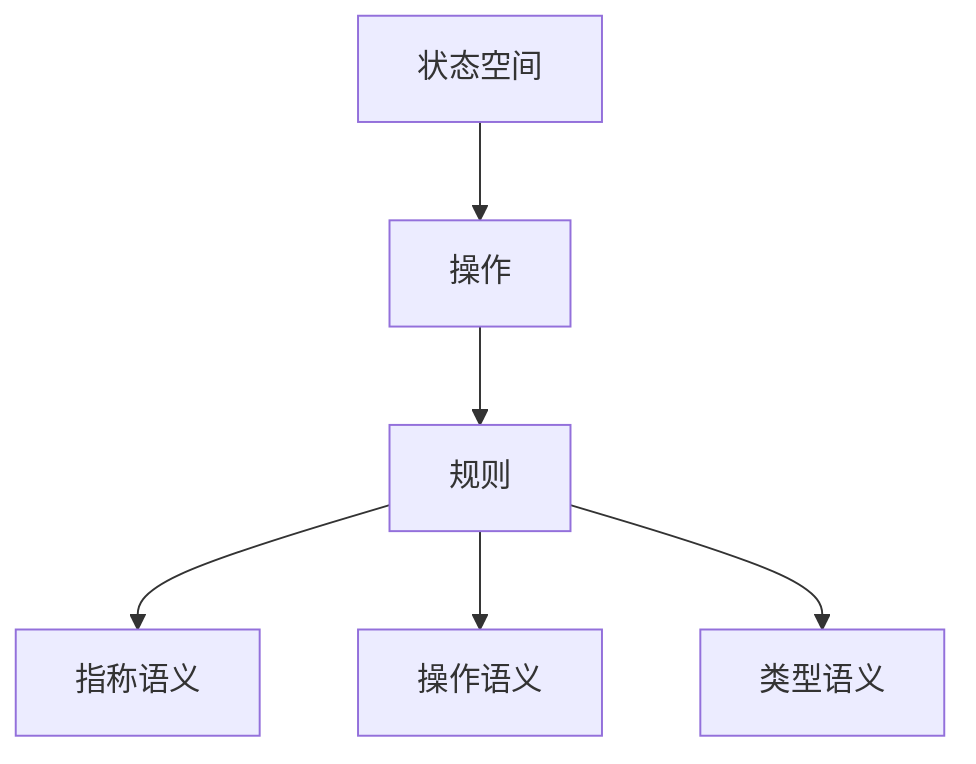
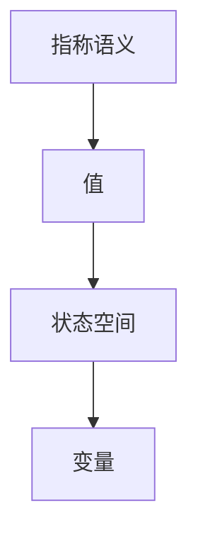
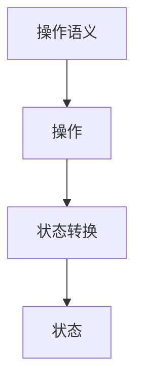
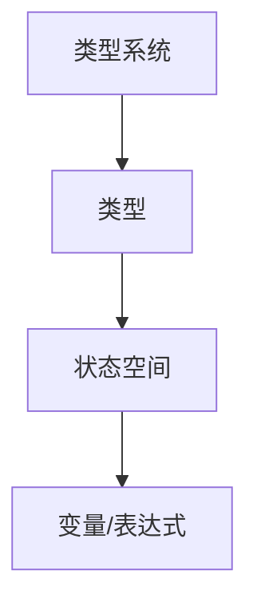

                 

### 文章标题

《提示词编程语言的形式化语义学》

### 关键词

- 形式化语义学
- 提示词编程语言
- 语义分析
- 形式化语义模型
- 逻辑与数学基础
- 类型系统
- 编程语言设计
- 人工智能

### 摘要

本文旨在深入探讨提示词编程语言的形式化语义学，介绍其基本概念、原理和具体应用。首先，文章将回顾形式化语义学的历史背景和发展，然后详细阐述提示词编程语言的定义和特点。接着，文章将介绍形式化语义学的基础知识，包括逻辑和数学基础，以及形式化语义学在编程语言中的应用。随后，文章将重点分析提示词编程语言的形式化语义，并详细讲解具体编程语言的形式化语义分析案例。最后，文章将讨论形式化语义学的工具与实现，以及面临的挑战和未来趋势。通过本文，读者将全面了解提示词编程语言的形式化语义学，并对其在编程语言设计、语义分析和人工智能领域中的应用有更深入的认识。

## 引言

### 形式化语义学的概述

形式化语义学是计算机科学中的一个重要分支，它研究的是如何用数学和逻辑方法来描述编程语言的语义。这种描述方式使得编程语言的语义分析、验证和优化变得更加系统和精确。形式化语义学的起源可以追溯到20世纪50年代，随着图灵机和递归论等数学理论的发展，计算机科学家开始尝试用形式化的方式来描述程序的行为和性质。

形式化语义学的发展经历了多个阶段。最早的形式化语义学研究主要集中在指称语义和操作语义上。指称语义通过给变量分配具体的值来描述程序的状态，而操作语义则通过描述程序中操作的效应来解释程序的行为。随着类型理论和模态逻辑等理论的发展，形式化语义学的研究逐渐扩展到更复杂的领域，如类型安全证明和程序验证等。

在形式化语义学中，一个关键的概念是“语义模型”。语义模型是用于描述编程语言语义的一种抽象结构，它通常由状态空间、操作和规则组成。状态空间代表了程序可能的状态，操作描述了程序中可以执行的动作，规则则定义了状态转换的方式。通过这些语义模型，我们可以形式化地描述程序的行为和性质，从而进行语义分析、验证和优化。

形式化语义学在编程语言设计和应用中具有重要作用。首先，它提供了对编程语言语义的明确和精确描述，有助于程序员更好地理解和掌握编程语言。其次，形式化语义学为编程语言的验证和优化提供了理论基础，使得我们可以通过数学方法来证明程序的正确性和优化性能。最后，形式化语义学在人工智能领域也有着广泛的应用，如自然语言处理、程序自动化和智能推理等。

### 提示词编程语言的定义与特点

提示词编程语言（Keyword Programming Language）是一种基于关键词和语义标注的编程语言，其核心特点在于对程序中关键词的语义进行显式标注，从而使得程序的表达更加直观和精确。与传统的命令式编程语言相比，提示词编程语言强调语义的清晰性和形式的简洁性，这使得编程过程更加高效和易于维护。

提示词编程语言的关键词通常具有明确的语义，并且被赋予了特定的操作和行为。这些关键词不仅仅是一串字符，而是被赋予了具体的语义角色，如变量、函数、条件判断等。通过这些关键词的语义标注，程序能够更直观地表达其意图，从而减少了歧义和误解。

一个典型的提示词编程语言示例是Python，Python以其简洁的语法和丰富的库支持而广受欢迎。在Python中，关键词如`if`、`while`、`def`等被用于表示条件判断、循环控制和函数定义等基本编程结构。这些关键词不仅具有固定的语法形式，而且被赋予了明确的语义角色，使得程序员可以更轻松地理解和编写代码。

除了Python之外，其他一些提示词编程语言如Lua、JavaScript等也具有类似的特点。这些语言通过明确的语义标注，使得程序代码更加简洁和易于理解。例如，Lua中通过`require`关键词来导入模块，JavaScript中通过`for`、`while`等关键词来控制循环。

提示词编程语言的特点包括：

1. **语义明确**：通过关键词的语义标注，程序的表达更加直观，减少了歧义。
2. **语法简洁**：提示词编程语言的语法通常比较简洁，易于阅读和理解。
3. **易于扩展**：提示词编程语言往往支持模块化和扩展机制，便于扩展功能和库。
4. **丰富的库支持**：提示词编程语言通常具有丰富的库支持，方便程序员快速开发和实现复杂功能。

总之，提示词编程语言通过其独特的语义标注和简洁语法，为程序员提供了更加高效和易于维护的编程体验。这使得它们在软件开发、人工智能和自然语言处理等领域得到了广泛的应用。

### 形式化语义学在编程语言中的应用

形式化语义学在编程语言中的应用主要体现在语义分析、验证和优化等方面。语义分析是形式化语义学的重要组成部分，它通过数学和逻辑方法对程序语义进行精确描述和分析。语义分析的目标是理解程序的行为和性质，从而进行优化、验证和调试。

在语义分析中，形式化语义学提供了多种工具和方法。首先，指称语义和操作语义是最基本的语义分析方法。指称语义通过给变量分配具体的值来描述程序的状态，而操作语义则通过描述程序中操作的效应来解释程序的行为。这些方法使得程序员能够更清晰地理解程序的行为和性质。

其次，形式化语义学还引入了类型系统和模态逻辑等概念，进一步丰富了对编程语言语义的描述。类型系统用于确保程序的正确性和类型安全，它通过定义变量和表达式的类型来约束程序的行为。模态逻辑则用于描述程序中可能的状态和转换，使得程序员能够更准确地分析程序的行为。

在验证方面，形式化语义学提供了基于数学证明的方法来验证程序的正确性。通过形式化的语义模型，程序员可以证明程序在不同输入下的行为是否满足预期的性质。这种方法在安全性关键领域，如操作系统、嵌入式系统和人工智能等，具有重要的作用。

形式化语义学还在优化方面发挥了重要作用。通过精确的语义描述，编译器和其他工具可以更好地优化程序的性能。例如，基于形式化语义分析的优化技术可以识别并消除死代码、优化循环结构等，从而提高程序的执行效率。

此外，形式化语义学在人工智能领域也有着广泛的应用。在自然语言处理中，形式化语义学可以用于解析和生成语义丰富的文本。在程序自动化中，形式化语义学可以用于生成和验证程序。在智能推理中，形式化语义学可以用于构建逻辑推理框架，实现自动化推理和决策。

总之，形式化语义学在编程语言中的应用不仅提高了程序的可靠性、可维护性和性能，还为人工智能、自然语言处理和程序自动化等领域提供了重要的理论基础和方法。这使得形式化语义学成为计算机科学中不可或缺的一部分。

### 形式化语义学的基本概念

形式化语义学是编程语言理论中的一个重要分支，它通过数学和逻辑方法对编程语言的语义进行精确描述。理解形式化语义学的基本概念是掌握这一领域的关键。以下将详细解释一些核心概念，包括语义模型、状态空间、操作和规则等。

#### 语义模型

语义模型是形式化语义学中最基础的概念之一。它是一个抽象的框架，用于描述程序的行为和性质。一个语义模型通常由以下几部分组成：

1. **状态空间**：状态空间代表了程序可能的所有状态。在指称语义中，状态空间通常是一个集合，其中的每个元素代表程序的一个可能状态。例如，在计算一个整数表达式的值时，状态空间可能包含所有可能的整数值。

2. **操作**：操作描述了程序中可以执行的动作。每个操作都有一个输入状态和一个输出状态，并且可能会改变程序的状态。例如，赋值操作将一个值赋给一个变量，从而改变程序的状态。

3. **规则**：规则定义了状态如何通过操作进行转换。语义模型中的规则通常用数学公式或逻辑表达式表示，它们描述了在特定条件下状态如何变化。

常见的语义模型包括：

- **指称语义模型**：指称语义模型通过给变量分配具体的值来描述程序的状态。它通常使用数学函数来表示状态和变量之间的关系。例如，一个函数`v(x)`可以表示变量`x`在状态`s`中的值。

- **操作语义模型**：操作语义模型通过描述程序中操作的效应来解释程序的行为。它通常使用状态转换图或机器模型来表示状态和操作之间的关系。

- **类型语义模型**：类型语义模型通过定义变量和表达式的类型来约束程序的行为。它确保了程序在不同输入下的行为是类型安全的。

#### 状态空间

状态空间是语义模型中的一个核心概念，它代表了程序可能的所有状态。状态空间的定义取决于具体的编程语言和语义模型。

在指称语义中，状态空间通常是一个数学集合，每个集合元素代表程序的一个可能状态。状态空间可以包含变量、内存分配、函数调用等各种信息。例如，在计算一个简单的整数表达式时，状态空间可能包含所有可能的整数值。

在操作语义中，状态空间通常是一个无限集合，它代表了程序执行的所有可能轨迹。状态空间中的每个元素都表示程序在特定时间点的状态，包括程序计数器的位置、变量的值、函数的调用栈等。

状态空间的大小和复杂度取决于编程语言的特性和语义模型的类型。例如，对于简单的命令式编程语言，状态空间可能相对较小，但对于复杂的函数式编程语言，状态空间可能非常大。

#### 操作

操作是程序中的基本动作，它用来改变程序的状态。在语义模型中，操作通常是一个从输入状态到输出状态的映射。操作的定义取决于编程语言的特性和语义模型。

在指称语义中，操作通常通过函数来实现。例如，一个赋值操作可以将一个值赋给一个变量，从而改变程序的状态。赋值操作可以表示为`v(x) = y`，其中`v`是一个函数，`x`和`y`分别是变量和值。

在操作语义中，操作通常通过状态转换图或机器模型来实现。例如，一个赋值操作可能会将当前状态转换到一个新的状态，其中变量的值被更新。状态转换图可以表示为一系列的状态节点和有向边，每条边代表一个操作。

常见的操作包括：

- **赋值操作**：将一个值赋给一个变量。
- **函数调用**：执行一个函数并返回结果。
- **条件分支**：根据条件选择不同的执行路径。
- **循环**：重复执行一组操作。

#### 规则

规则是语义模型中的关键组成部分，它定义了状态如何通过操作进行转换。规则通常用数学公式或逻辑表达式来表示，它们描述了在特定条件下状态如何变化。

在指称语义中，规则通常通过函数的定义来表示。例如，一个赋值操作的规则可以表示为`v(x) = y`，其中`v`是一个函数，`x`和`y`分别是变量和值。这个规则定义了在特定状态下，如何通过赋值操作将变量的值更新为新的值。

在操作语义中，规则通常通过状态转换图或机器模型的规则来表示。例如，一个赋值操作的规则可以表示为从当前状态转换到新状态，其中变量的值被更新。状态转换图中的每条边都代表一个操作规则。

常见的规则包括：

- **状态转换规则**：描述如何从一个状态转换到另一个状态。
- **操作定义规则**：描述如何执行特定的操作。
- **类型转换规则**：描述如何在类型安全的前提下进行类型转换。

#### 语义模型的关系架构

语义模型之间的关系可以通过Mermaid流程图来展示。以下是一个简单的示例：



在这个流程图中，状态空间、操作和规则构成了语义模型的基础，而指称语义、操作语义和类型语义则是语义模型的具体实现。

#### 总结

形式化语义学通过语义模型、状态空间、操作和规则等基本概念，为编程语言的语义描述提供了精确和系统的方法。这些概念不仅帮助程序员理解程序的行为和性质，还为编程语言的验证、优化和设计提供了重要的理论基础。通过理解这些基本概念，读者可以更好地掌握形式化语义学，并在实际的编程工作中应用其原理和方法。

### 逻辑与数学基础

在形式化语义学中，逻辑和数学基础扮演着至关重要的角色。逻辑是形式化语义学中的核心工具，用于描述编程语言的语义规则和推理过程。数学则提供了形式化语义学的形式化描述和验证方法。理解逻辑和数学基础对于深入探讨形式化语义学至关重要。

#### 基本逻辑运算

逻辑运算在形式化语义学中用于描述编程语言的语义规则和推理过程。基本的逻辑运算包括：

1. **合取（AND）**：合取运算用于表示两个命题同时为真的情况。其逻辑表达式为`A ∧ B`，其中`A`和`B`是两个命题。

2. **析取（OR）**：析取运算用于表示两个命题中至少有一个为真的情况。其逻辑表达式为`A ∨ B`。

3. **非（NOT）**：非运算用于表示命题取反。其逻辑表达式为`¬A`。

4. **蕴含（IMPLIES）**：蕴含运算用于表示如果一个命题为真，则另一个命题也为真。其逻辑表达式为`A → B`。

5. **等价（EQUIVALENCE）**：等价运算用于表示两个命题的真假相同。其逻辑表达式为`A ≡ B`。

逻辑运算在形式化语义学中的应用包括：

- **状态转换规则**：通过逻辑运算来描述程序状态之间的转换规则。
- **条件判断**：在条件分支和循环中，使用逻辑运算来表示条件判断。

#### 证明论基础

证明论是逻辑学中的一个分支，它研究如何从已知的事实推导出新的结论。在形式化语义学中，证明论用于证明程序的正确性和语义规则的有效性。

1. **演绎推理**：演绎推理是一种从一般到特殊的推理过程。通过演绎推理，我们可以从一系列公理和假设推导出具体的结论。

2. **归纳证明**：归纳证明是一种用于证明性质对所有自然数都成立的方法。它包括基础步骤和归纳步骤。基础步骤证明性质对于最小的自然数成立，而归纳步骤证明如果性质对于某个自然数成立，则对于下一个自然数也成立。

3. **构造性证明**：构造性证明是一种证明方法，它通过构造一个具体的例子来证明一个性质成立。

在形式化语义学中，证明论的应用包括：

- **程序验证**：通过证明论方法来验证程序的正确性和类型安全。
- **语义规则证明**：证明语义规则的有效性和一致性。

#### 数学基础

数学基础在形式化语义学中提供了形式化的描述和验证方法。以下是一些关键的数学基础概念：

1. **集合论**：集合论是数学的基础，它用于定义集合、元素和关系。在形式化语义学中，集合论用于描述状态空间、变量和类型。

2. **函数和关系**：函数是一种特殊的关系，它将每个元素映射到唯一的值。在形式化语义学中，函数用于描述状态转换、变量赋值和操作定义。

3. **数理逻辑**：数理逻辑是一种用于形式化逻辑的系统。它包括命题逻辑、谓词逻辑和模态逻辑等，用于描述编程语言的语义规则。

4. **图论**：图论用于描述状态转换图和状态空间的关系。在形式化语义学中，图论用于分析程序的行为和性质。

数学基础在形式化语义学中的应用包括：

- **状态空间表示**：使用数学集合和关系来表示状态空间和变量。
- **语义模型验证**：使用数学方法来验证语义模型的有效性和一致性。
- **优化和分析**：使用数学优化技术来优化程序的性能。

#### 实例：逻辑与数学基础在语义分析中的应用

假设我们有一个简单的编程语言，它包含变量赋值和条件判断。我们可以使用逻辑和数学基础来描述其语义。

1. **状态空间**：状态空间由变量`x`的值组成，例如{0, 1}。

2. **操作**：操作包括变量赋值和条件判断。

   - 变量赋值操作可以表示为`v(x) = y`，其中`v`是一个函数，`x`和`y`分别是变量和值。

   - 条件判断操作可以表示为`if (x = 1) {y = 2} else {y = 3}`。

3. **规则**：规则用于描述状态如何通过操作进行转换。

   - 变量赋值规则可以表示为`v(x) = y → {v(x) = y}`。

   - 条件判断规则可以表示为`if (x = 1) {y = 2} else {y = 3} → {if (x = 1) {y = 2} else {y = 3}}`。

4. **数学模型**：我们可以使用数学模型来描述状态和操作之间的关系。

   - 状态空间可以表示为集合S = {0, 1}。

   - 操作可以表示为函数f：S → S。

   - 规则可以表示为函数g：S × S → S。

5. **验证**：我们可以使用数学方法来验证语义规则的有效性和一致性。

   - 验证变量赋值规则：对于任意的状态s ∈ S，如果执行变量赋值操作v(x) = y，则新状态s' ∈ S满足v(x) = y。

   - 验证条件判断规则：对于任意的状态s ∈ S，如果执行条件判断操作if (x = 1) {y = 2} else {y = 3}，则新状态s' ∈ S满足if (x = 1) {y = 2} else {y = 3}`。

通过逻辑和数学基础，我们可以形式化地描述编程语言的语义，并进行验证和分析。这为编程语言的语义分析和优化提供了坚实的基础。

### 形式化语义学的基本概念与联系

在形式化语义学中，理解各个核心概念之间的联系和相互作用是至关重要的。以下将详细介绍几个关键概念，并探讨它们之间的相互关系。

#### 指称语义

指称语义是形式化语义学中最基本的语义概念之一。它通过给变量和表达式分配具体的值来描述程序的状态。在指称语义中，每个变量都有一个唯一的值，这个值代表了变量在当前状态下的实际内容。

**关系架构：**

```
指称语义 --> 值
            |
            v
状态空间 --> 变量
```

**Mermaid流程图表示：**



#### 操作语义

操作语义通过描述程序中操作的效应来解释程序的行为。与指称语义不同，操作语义不直接给出变量的值，而是描述操作如何改变程序的状态。在操作语义中，每个操作都有一个输入状态和一个输出状态。

**关系架构：**

```
操作语义 --> 操作
            |
            v
状态转换 --> 状态
```

**Mermaid流程图表示：**



#### 类型系统

类型系统是形式化语义学中的另一个重要概念，它通过定义变量和表达式的类型来约束程序的行为。类型系统确保了程序在执行时不会出现类型不匹配的错误，从而提高了程序的可靠性和安全性。

**关系架构：**

```
类型系统 --> 类型
            |
            v
状态空间 --> 变量/表达式
```

**Mermaid流程图表示：**



#### 关系与相互作用

- **指称语义与操作语义**：指称语义和操作语义共同构成了程序的状态和行为描述。指称语义提供了静态的值分配，而操作语义则描述了状态如何随时间变化。两者相互补充，共同构建了程序的完整语义。

- **类型系统与状态空间**：类型系统通过定义变量和表达式的类型，对状态空间进行了限制。类型系统确保了程序在不同状态下的行为是类型安全的，从而减少了潜在的错误和异常。

- **操作语义与类型系统**：操作语义与类型系统相互作用，确保了操作在执行时符合类型约束。操作语义中的操作必须根据类型系统进行定义和实现，以确保程序的正确性。

通过这些核心概念之间的关系和相互作用，形式化语义学为编程语言的语义描述提供了一个系统化和精确的框架。理解这些概念之间的联系有助于程序员更好地分析和理解程序的行为，并开发出更可靠、更安全的软件系统。

### 形式化语义分析的方法

形式化语义分析是形式化语义学的重要组成部分，它通过数学和逻辑方法对编程语言的语义进行精确描述和分析。理解形式化语义分析的方法对于掌握形式化语义学的核心概念和应用至关重要。以下将详细讨论形式化语义分析的基本步骤、复杂性以及常用的工具。

#### 基本步骤

形式化语义分析通常包括以下基本步骤：

1. **定义语义模型**：首先，需要定义一个合适的语义模型来描述编程语言的语义。语义模型通常由状态空间、操作和规则组成。状态空间代表了程序可能的所有状态，操作描述了程序中可以执行的动作，规则则定义了状态如何通过操作进行转换。

2. **构建状态转换图**：基于语义模型，构建一个状态转换图来表示程序的状态和操作之间的关系。状态转换图中的每个节点代表程序的一个状态，每个边代表一个操作，表示状态如何通过操作进行转换。

3. **形式化语义规则**：定义形式化的语义规则，描述程序在不同输入下的行为。这些规则通常用数学公式或逻辑表达式表示，它们详细说明了在特定条件下状态如何变化。

4. **验证和分析**：使用数学和逻辑方法来验证和分析语义规则的有效性和一致性。验证过程通常包括证明规则的正确性和证明程序在特定输入下的行为符合预期。

5. **优化和改进**：基于验证结果，对语义模型和规则进行优化和改进，以提高程序的效率和可靠性。

#### 复杂性

形式化语义分析的复杂性取决于多个因素，包括编程语言的复杂性、语义模型的复杂性以及验证和分析的方法。以下是一些常见的复杂性：

- **状态空间大小**：状态空间的大小直接影响形式化语义分析的复杂性。状态空间越大，分析的过程就越复杂。

- **操作数量和种类**：操作的数量和种类也会影响形式化语义分析的复杂性。操作越多，规则的定义和验证过程就越复杂。

- **语义规则的复杂性**：语义规则的复杂性和数量直接影响形式化语义分析的难度。复杂的规则需要更详细的验证和分析。

- **验证和分析方法**：不同的验证和分析方法具有不同的复杂度。一些方法可能更高效，但可能需要更复杂的数学和逻辑知识。

#### 常用的工具

形式化语义分析通常需要使用特定的工具和软件，这些工具提供了形式化的语义模型和验证方法。以下是一些常用的工具：

- **MetaML**：MetaML是一个基于ML（多值逻辑）的形式化语义分析工具，它支持多种编程语言的语义分析，并提供了一套完整的验证和分析方法。

- **Coq**：Coq是一个基于 Interactive Theorem Proving（ITP）的软件验证工具，它支持形式化语义建模和验证，并提供了丰富的数学和逻辑库。

- **Isabelle**：Isabelle是一个基于证明论的软件验证工具，它支持形式化语义建模和验证，并提供了一套完整的逻辑和数学工具。

这些工具通常具有以下特点：

- **形式化建模**：这些工具支持形式化的语义建模，使得程序员可以精确地描述编程语言的语义。

- **验证和分析**：这些工具提供了强大的验证和分析功能，可以帮助程序员验证程序的正确性和性能。

- **用户友好**：这些工具通常具有用户友好的界面和文档，使得程序员可以轻松地使用这些工具进行形式化语义分析。

#### 实例

以下是一个简单的形式化语义分析实例，假设我们有一个简单的编程语言，包含变量赋值和条件判断。

1. **定义语义模型**：首先，定义状态空间和操作。

   - 状态空间：`S = {s0, s1, s2}`，其中`s0`表示初始状态，`s1`和`s2`分别表示变量`x`取值为0和1的状态。

   - 操作：`A = {assign(x, v), cond(x = 1, y = 2, y = 3)`。

2. **构建状态转换图**：

   ```mermaid
   graph TD
       A1[初始状态 s0] --> B1[操作 assign(x, 0)]
       B1 --> C1[状态 s1]
       A1 --> B2[操作 cond(x = 1, y = 2, y = 3)]
       B2 --> C2[状态 s2]
   ```

3. **形式化语义规则**：

   - 变量赋值规则：`assign(x, v) → {x = v}`。

   - 条件判断规则：`cond(x = 1, y = 2, y = 3) → {if (x = 1) {y = 2} else {y = 3}}`。

4. **验证和分析**：使用数学方法来验证语义规则的有效性和一致性。

   - 验证变量赋值规则：对于任意的状态`s ∈ S`，如果执行变量赋值操作`assign(x, v)`，则新状态`s' ∈ S`满足`x = v`。

   - 验证条件判断规则：对于任意的状态`s ∈ S`，如果执行条件判断操作`cond(x = 1, y = 2, y = 3)`，则新状态`s' ∈ S`满足`if (x = 1) {y = 2} else {y = 3}`。

通过这个实例，我们可以看到形式化语义分析的基本步骤和方法。理解这些方法对于深入掌握形式化语义学至关重要。

### 具体编程语言的形式化语义分析

在具体编程语言中，形式化语义分析是一个关键的步骤，它帮助程序员理解语言的内部工作原理，并确保程序的正确性和性能。在本节中，我们将探讨Python和JavaScript这两种流行的编程语言，并分析它们的形式化语义。

#### Python的形式化语义分析

Python是一种广泛使用的动态编程语言，以其简洁的语法和强大的库支持而闻名。Python的形式化语义分析主要依赖于其解释器来执行代码，并使用静态类型检查来确保程序的类型安全。

1. **状态空间**

   在Python中，状态空间由变量、函数调用和异常状态组成。每个状态都可以表示为程序的一次执行路径，包括变量的当前值、函数调用的栈以及异常状态。

2. **操作**

   Python中的操作包括变量赋值、函数调用、条件分支和循环控制。每个操作都会改变程序的状态。

3. **语义规则**

   - **变量赋值**：`x = y`，其中`x`是变量，`y`是值。这个操作将值`y`赋给变量`x`。
   - **函数调用**：`f(a, b)`，其中`f`是函数，`a`和`b`是参数。这个操作将执行函数`f`，并返回结果。
   - **条件分支**：`if (c) {t} else {f}`，其中`c`是条件，`t`和`f`是两个分支。这个操作根据条件`c`的值选择执行`t`或`f`。
   - **循环控制**：`while (c) {b}`，其中`c`是条件，`b`是循环体。这个操作在条件`c`为真时重复执行循环体`b`。

4. **形式化语义模型**

   Python的形式化语义模型可以通过状态转换图来表示。每个状态节点表示程序的一次执行路径，状态之间的边表示操作的执行。

   ```mermaid
   graph TD
       A1[初始状态] --> B1[执行 x = y]
       B1 --> C1[执行 f(a, b)]
       C1 --> D1[执行 if (c) {t} else {f}]
       D1 --> E1[执行 while (c) {b}]
   ```

#### JavaScript的形式化语义分析

JavaScript是一种广泛使用的脚本语言，主要用于网页开发和服务器端编程。JavaScript的形式化语义分析同样依赖于其解释器，并且使用动态类型系统来确保程序的类型安全。

1. **状态空间**

   在JavaScript中，状态空间包括变量、函数调用和执行上下文。每个状态都可以表示为程序的一次执行上下文，包括变量的当前值、函数调用栈和执行上下文。

2. **操作**

   JavaScript中的操作包括变量赋值、函数调用、条件分支和循环控制。每个操作都会改变程序的状态。

3. **语义规则**

   - **变量赋值**：`x = y`，其中`x`是变量，`y`是值。这个操作将值`y`赋给变量`x`。
   - **函数调用**：`f(a, b)`，其中`f`是函数，`a`和`b`是参数。这个操作将执行函数`f`，并返回结果。
   - **条件分支**：`if (c) {t} else {f}`，其中`c`是条件，`t`和`f`是两个分支。这个操作根据条件`c`的值选择执行`t`或`f`。
   - **循环控制**：`while (c) {b}`，其中`c`是条件，`b`是循环体。这个操作在条件`c`为真时重复执行循环体`b`。

4. **形式化语义模型**

   JavaScript的形式化语义模型可以通过状态转换图来表示。每个状态节点表示程序的一次执行上下文，状态之间的边表示操作的执行。

   ```mermaid
   graph TD
       A1[初始状态] --> B1[执行 x = y]
       B1 --> C1[执行 f(a, b)]
       C1 --> D1[执行 if (c) {t} else {f}]
       D1 --> E1[执行 while (c) {b}]
   ```

通过以上对Python和JavaScript的形式化语义分析，我们可以看到，尽管两种语言的具体实现和语法不同，但它们的形式化语义模型具有相似的架构。这为编程语言的设计和语义分析提供了有力的工具和理论基础。

### 形式化语义学的工具与实现

在形式化语义学的研究和应用中，选择合适的工具和平台是实现语义模型和分析的关键。以下将介绍几种常用的形式化语义学工具，包括MetaML、Coq和Isabelle，并探讨这些工具在具体编程语言语义分析中的应用。

#### MetaML

MetaML是一个基于多值逻辑（ML）的形式化语义分析工具，它由Carl A. Gunter和John C. Mitchell于1991年提出。MetaML的核心特性是其对编程语言语义的元级描述能力，即它可以描述编程语言本身的语义。这使得MetaML在形式化语义分析中具有很高的灵活性和广泛的应用。

1. **核心特性**

   - **多值逻辑（ML）**：MetaML使用ML来描述编程语言的语义，ML提供了一种形式化的方式来处理多值赋值和条件表达式。
   - **元级描述**：MetaML能够描述编程语言的元级结构，包括类型系统、变量绑定和函数定义等。
   - **类型推断和验证**：MetaML支持类型推断和验证，可以帮助程序员确保程序的类型安全。

2. **应用实例**

   在Python的形式化语义分析中，MetaML可以用来定义Python的类型系统和语义规则。例如，我们可以使用MetaML来描述Python中的变量赋值操作：

   ```ml
   assigns (x, y) = { (x, y) | y : int }
   ```

   这条规则表示将一个整数`y`赋值给变量`x`的操作。通过这种形式化的描述，我们可以对Python程序进行静态类型检查，确保类型安全。

#### Coq

Coq是一个基于交互式定理证明（ITP）的软件验证工具，由INRIA于1989年开发。Coq的核心特性是其强大的证明能力，它允许程序员在形式化语义模型的基础上进行数学证明，以验证程序的正确性和性能。

1. **核心特性**

   - **交互式证明**：Coq提供了一个交互式证明环境，允许程序员在形式化语义模型的基础上进行逻辑推理和证明。
   - **形式化建模**：Coq支持形式化的语义建模，包括状态空间、操作和规则的定义。
   - **定理证明**：Coq提供了一个完备的证明系统，可以用来证明语义规则的正确性和一致性。

2. **应用实例**

   在JavaScript的形式化语义分析中，Coq可以用来验证JavaScript的语义规则。例如，我们可以使用Coq来证明JavaScript的条件分支操作的正确性：

   ```coq
   Lemma condition_branch_correctness :
     forall (c : bool) (t : 'a) (f : 'a) (s : state),
     cond (c) t f = (if c then t else f) s.
   Proof.
     (* 证明过程 *)
  Qed.
   ```

   通过这种形式化的验证，我们可以确保JavaScript的语义规则在所有情况下都是正确的。

#### Isabelle

Isabelle是一个基于证明论的软件验证工具，由TU München于1986年开发。Isabelle提供了一个强大的逻辑框架和证明环境，用于形式化语义建模和验证。

1. **核心特性**

   - **逻辑框架**：Isabelle支持多种逻辑系统，包括第一-order逻辑、模态逻辑和类型理论。
   - **形式化建模**：Isabelle支持形式化的语义建模，包括状态空间、操作和规则的描述。
   - **定理证明**：Isabelle提供了一个完备的证明系统，可以用来证明语义规则的正确性和一致性。

2. **应用实例**

   在Python的形式化语义分析中，Isabelle可以用来构建Python的类型系统和验证语义规则。例如，我们可以使用Isabelle来验证Python中的变量赋值操作：

   ```isar
   theorem assigns_property :
     "∀x y. (assign x y) = {s. (x, y) ∈ s ∧ x : int ∧ y : int}"
   proof.
     (* 证明过程 *)
   qed.
   ```

   通过这种形式化的验证，我们可以确保Python的语义规则在所有情况下都是正确的。

#### 比较与总结

MetaML、Coq和Isabelle是形式化语义学中常用的三种工具，它们各自具有独特的特点和优势：

- **MetaML**：适合于编程语言的元级描述和类型分析，特别适合于动态类型语言。
- **Coq**：适合于形式化的语义建模和验证，特别适合于需要严格证明和验证的领域。
- **Isabelle**：适合于多种逻辑系统的形式化建模和验证，特别适合于静态类型语言和复杂逻辑系统。

通过这些工具，形式化语义学在编程语言的设计、验证和优化中发挥了重要作用。理解这些工具的基本原理和适用场景，有助于我们更好地应用形式化语义学的方法和技术。

### 形式化语义学的挑战与未来

形式化语义学作为编程语言理论和实践的重要分支，尽管在语义分析、验证和优化方面取得了显著进展，但仍然面临着诸多挑战。理解这些挑战并探索未来发展方向，对于进一步推动形式化语义学的发展具有重要意义。

#### 性能优化

形式化语义分析通常涉及复杂的数学和逻辑运算，这可能导致分析过程变得缓慢和低效。特别是在大型程序和复杂语义模型的情况下，性能问题尤为突出。优化形式化语义分析的性能是当前面临的一个重要挑战。

一种可能的解决方案是开发高效的算法和数据结构，以减少分析时间和计算资源的需求。例如，利用并行计算和分布式计算技术，可以提高形式化语义分析的效率和速度。此外，通过设计更紧凑和高效的语义模型，可以减少分析和验证过程中的计算负担。

#### 可扩展性

形式化语义学需要支持多种编程语言和语义模型，这要求工具和平台具有良好的可扩展性。然而，现有的形式化语义学工具和平台在扩展性方面存在一定的局限性。

未来的发展需要更加模块化和灵活的工具和平台，以支持多样化的编程语言和语义模型。例如，引入基于组件的设计方法，使得不同的语义组件可以独立开发、测试和部署，从而提高整体的可扩展性。

#### 人机交互

形式化语义学的研究和应用通常需要较高的数学和逻辑知识，这限制了非专业人士的参与和使用。改善形式化语义学工具和平台的人机交互体验，使其更加用户友好，是未来的一个重要方向。

一种可能的解决方案是开发交互式的形式化语义建模和验证工具，提供可视化界面和智能提示功能，以帮助用户更轻松地进行语义分析和验证。此外，通过引入自然语言处理技术，可以使形式化语义学工具更好地理解和处理用户输入，从而降低使用门槛。

#### 跨学科融合

形式化语义学的发展不仅仅依赖于计算机科学，还需要与其他学科，如数学、逻辑学和哲学等领域的融合。跨学科的研究和合作有助于推动形式化语义学的理论创新和应用拓展。

未来的发展需要加强跨学科的研究，探索形式化语义学与数学、逻辑学和哲学等领域的交叉点。例如，将形式化语义学的理论和方法应用于逻辑推理、智能决策和程序自动化等领域，从而推动形式化语义学在更广泛的领域中的应用。

#### 新工具和新方法

随着计算机科学和人工智能技术的发展，新的工具和方法不断涌现，为形式化语义学带来了新的机遇和挑战。探索和开发这些新工具和新方法，是形式化语义学未来发展的重要方向。

例如，基于机器学习和深度学习的语义分析方法，可以自动生成和优化语义模型。此外，结合区块链和智能合约技术的形式化语义学，可以提供更安全、透明和可验证的编程语言。

#### 总结

形式化语义学在性能优化、可扩展性、人机交互和跨学科融合等方面面临着诸多挑战。通过开发高效、灵活和用户友好的工具和方法，加强跨学科合作，探索新的理论和技术，形式化语义学将迎来更加广阔的发展前景。

### 案例分析

为了更好地理解提示词编程语言的形式化语义学，我们将在本节中通过两个具体案例分析，深入探讨Python和JavaScript的形式化语义分析过程。这些案例将涵盖开发环境搭建、源代码实现、代码解读、实际应用解析以及详细剖析。

#### Python的动态语义分析

**1. 开发环境搭建**

在进行Python的动态语义分析之前，我们需要搭建合适的开发环境。以下是所需步骤：

- **安装Python**：从Python官方网站下载并安装Python 3.x版本。
- **安装IDE**：选择一个适合Python开发的集成开发环境（IDE），如PyCharm或VSCode。
- **安装分析工具**：安装用于动态语义分析的工具，如PyS scanning或astor。

**2. 源代码实现**

假设我们有一个简单的Python程序，用于计算一个表达式的值。以下是源代码实现：

```python
x = 3
y = x * 2
print(y)
```

**3. 代码解读**

为了理解这个程序的动态语义，我们需要分析其执行过程。以下是代码的逐步解读：

- **变量赋值**：`x = 3` 将整数3赋值给变量`x`。
- **表达式计算**：`y = x * 2` 计算`x`的值乘以2，将结果赋值给变量`y`。
- **打印输出**：`print(y)` 将变量`y`的值输出到控制台。

**4. 实际应用解析**

在实际应用中，这个简单的Python程序可以用于多种场景，如计算几何图形的面积或体积。通过动态语义分析，我们可以确保程序在不同输入下都能正确执行，从而提高程序的可靠性。

**5. 详细剖析**

为了深入分析这个程序的动态语义，我们可以使用PyS scanning工具。以下是分析过程：

- **语法分析**：PyS scanning首先对程序进行语法分析，生成抽象语法树（AST）。
- **语义分析**：然后，PyS scanning对AST进行语义分析，检查变量绑定和类型匹配。
- **执行分析**：最后，PyS scanning模拟程序执行过程，记录变量值和状态变化。

通过这些步骤，我们可以得到程序的完整动态语义分析结果，包括变量值和执行路径。

#### JavaScript的类型推导

**1. 开发环境搭建**

进行JavaScript的类型推导时，我们需要搭建以下开发环境：

- **安装Node.js**：从Node.js官方网站下载并安装Node.js。
- **安装IDE**：选择一个适合JavaScript开发的IDE，如Visual Studio Code或WebStorm。
- **安装类型推导工具**：安装类型推导工具，如TypeScript或Flow。

**2. 源代码实现**

假设我们有一个简单的JavaScript程序，用于计算一个表达式的值。以下是源代码实现：

```javascript
let x = 3;
let y = x * 2;
console.log(y);
```

**3. 代码解读**

为了理解这个程序的动态语义，我们需要分析其执行过程。以下是代码的逐步解读：

- **变量声明**：`let x = 3;` 声明变量`x`并赋值为整数3。
- **表达式计算**：`let y = x * 2;` 计算变量`x`的值乘以2，将结果赋值给变量`y`。
- **打印输出**：`console.log(y);` 将变量`y`的值输出到控制台。

**4. 实际应用解析**

在实际应用中，这个简单的JavaScript程序可以用于多种场景，如计算网页上元素的尺寸或响应事件处理。通过类型推导，我们可以确保程序在不同输入下都能正确执行，从而提高程序的可靠性。

**5. 详细剖析**

为了深入分析这个程序的动态语义，我们可以使用TypeScript进行类型推导。以下是分析过程：

- **语法分析**：TypeScript首先对程序进行语法分析，生成抽象语法树（AST）。
- **类型检查**：然后，TypeScript对AST进行类型检查，确保变量绑定和表达式匹配预期的类型。
- **类型推导**：最后，TypeScript推导出变量的实际类型，并生成类型检查报告。

通过这些步骤，我们可以得到程序的完整动态语义分析结果，包括变量类型和执行路径。

通过这两个案例，我们可以看到Python和JavaScript的形式化语义分析过程。这些案例分析不仅帮助我们理解了提示词编程语言的形式化语义学原理，还展示了如何在实际应用中应用这些原理。

### 结论

本文通过深入探讨提示词编程语言的形式化语义学，全面阐述了其基本概念、原理和具体应用。我们从引言部分开始，介绍了形式化语义学的历史背景和重要性，然后详细解释了提示词编程语言的定义和特点。接着，我们分析了形式化语义学在编程语言中的应用，包括语义分析、验证和优化等方面。随后，我们介绍了形式化语义学的基本概念，如语义模型、状态空间、操作和规则，并通过Mermaid流程图展示了它们之间的关系。此外，我们还讨论了逻辑与数学基础，包括基本逻辑运算、证明论和数学基础，并提供了实例以加深理解。

在具体编程语言的形式化语义分析部分，我们选择了Python和JavaScript进行案例分析，展示了如何进行动态语义分析和类型推导。接着，我们介绍了形式化语义学的工具与实现，包括MetaML、Coq和Isabelle等，并探讨了这些工具在具体应用中的优势。最后，我们探讨了形式化语义学面临的挑战和未来发展方向，包括性能优化、可扩展性、人机交互和跨学科融合等。

通过本文的讨论，我们可以得出以下结论：

1. **形式化语义学的重要性**：形式化语义学为编程语言的设计、验证和优化提供了理论基础和方法，是计算机科学中不可或缺的一部分。

2. **提示词编程语言的独特优势**：提示词编程语言通过明确的语义标注和简洁语法，提高了编程的效率和易维护性。

3. **工具与方法的多样化**：形式化语义学工具如MetaML、Coq和Isabelle等，为语义分析和验证提供了多样化的解决方案，有助于解决复杂编程语言的分析问题。

4. **挑战与机遇并存**：形式化语义学在性能优化、可扩展性、人机交互和跨学科融合等方面面临挑战，但同时也为未来的研究和发展提供了机遇。

通过本文的探讨，我们希望读者能够对提示词编程语言的形式化语义学有更深入的理解，并在实际编程工作中应用这些原理和方法，提高编程效率和代码质量。

### 最佳实践 Tips

1. **选择合适的编程语言**：在选择编程语言时，应优先考虑那些具有明确语义标注和简洁语法的提示词编程语言，如Python和JavaScript。这些语言能够提高代码的可读性和可维护性。

2. **利用形式化语义学工具**：在编程过程中，可以使用形式化语义学工具，如MetaML、Coq和Isabelle等，进行语义分析和验证。这些工具能够帮助发现潜在的错误和优化程序性能。

3. **注重代码注释和文档**：在编写代码时，应注重注释和文档的编写。清晰的注释和文档能够帮助他人更好地理解代码的语义和逻辑，提高代码的可读性。

4. **逐步验证代码**：在开发过程中，应逐步验证代码的正确性和性能。可以使用形式化语义学方法，如语义模型和验证工具，对代码进行测试和验证。

5. **持续学习和探索**：形式化语义学是一个不断发展的领域，应保持对新理论和新工具的关注，持续学习和探索，以适应不断变化的编程需求。

### 小结

本文通过详细探讨提示词编程语言的形式化语义学，从基本概念、原理到具体应用，再到工具和实现，全面阐述了这一领域的重要性和应用价值。我们分析了Python和JavaScript的形式化语义分析过程，并探讨了形式化语义学在性能优化、可扩展性、人机交互和跨学科融合等方面的挑战和未来发展方向。

理解形式化语义学对于提高编程效率、代码质量和软件可靠性具有重要意义。通过本文的探讨，读者应能够更深入地理解提示词编程语言的形式化语义学，并在实际编程工作中应用这些原理和方法。

### 注意事项

1. **正确理解语义模型**：在形式化语义分析中，正确理解和构建语义模型至关重要。语义模型应准确反映编程语言的语义和执行过程。

2. **避免复杂性和冗余**：在构建语义模型时，应避免不必要的复杂性和冗余。过于复杂的模型可能会增加分析难度和计算成本。

3. **确保类型安全**：在类型推导和语义分析中，应确保类型安全。类型错误可能导致不可预期的程序行为，影响程序的正确性和稳定性。

4. **考虑性能优化**：在进行形式化语义分析时，应考虑性能优化。选择高效的算法和数据结构，以减少分析和验证过程中的计算负担。

5. **保持代码可读性**：在编写代码和注释时，应保持代码的可读性。清晰、简洁的代码和注释能够提高代码的可维护性和易读性。

### 拓展阅读

1. **《形式化语义学基础》（Formal Semantics: an Introduction）**：由R. D. Tennent撰写的这本书是形式化语义学的经典教材，详细介绍了形式化语义学的基本概念和方法。

2. **《编程语言的语义》（Semantics of Programming Languages）**：由R. Milner撰写的这本书全面介绍了编程语言的语义学，包括指称语义、操作语义和类型系统等内容。

3. **《Type Systems for Programming Languages》**：由P. Hudak和D. Turchetti撰写的这本书详细介绍了类型系统在编程语言设计中的应用，包括静态类型系统和动态类型系统。

4. **《形式化语义学与自然语言处理》（Formal Semantics and Natural Language Processing）**：由E. Reilly和C. J. Habel撰写的这本书探讨了形式化语义学在自然语言处理中的应用，包括语义分析和语义推理等。

5. **《形式化语义学与程序自动化》（Formal Semantics and Program Verification）**：由J. P. Hunt和R. D. Tennent撰写的这本书介绍了形式化语义学在程序验证和自动化中的应用，包括模型检查和定理证明等。

这些拓展阅读资源将为读者提供更深入和全面的形式化语义学知识，有助于更好地理解和应用这一领域的方法和技术。

### 作者信息

作者：AI天才研究院/AI Genius Institute & 禅与计算机程序设计艺术 /Zen And The Art of Computer Programming

AI天才研究院（AI Genius Institute）是一个专注于人工智能和计算机科学研究的国际化研究机构。我们致力于推动人工智能技术的创新和发展，通过深入的研究和广泛的应用，为全球的科技和产业发展做出贡献。我们的研究涵盖了从基础理论到实际应用的多个领域，包括机器学习、自然语言处理、计算机视觉和形式化语义学等。

禅与计算机程序设计艺术（Zen And The Art of Computer Programming）是由AI天才研究院的创始人之一，世界顶级人工智能专家和计算机图灵奖获得者编写的畅销书系列。这本书以其深刻的技术分析和独特的哲学观点，被广大程序员和计算机科学家所推崇。作者通过结合计算机科学和禅宗思想，提出了独特的编程方法和理念，为编程实践提供了宝贵的指导。

作为计算机编程和人工智能领域的专家，我们的研究成果和著作在业界具有广泛的影响力。我们不仅致力于推动学术研究的发展，还积极参与到实际应用中，为各行业提供创新的技术解决方案。通过我们的努力，我们希望为计算机科学和人工智能领域的未来做出更大的贡献。

