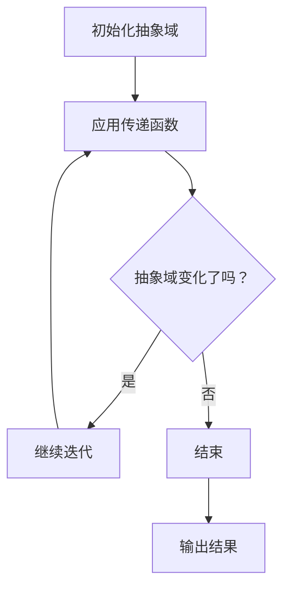

                 


### 1. 引言

#### 1.1 书籍背景

随着计算机科学和人工智能技术的飞速发展，编程语言和数据流分析技术已经成为现代软件开发和优化中的核心工具。传统的编程语言设计往往侧重于语法和语义的简洁性，而忽略了程序执行过程中的数据流动和依赖关系的分析。这种局限性导致了程序优化、调试和性能分析等任务的复杂性和低效性。为了克服这些挑战，研究人员和开发人员开始探索新的编程语言和数据流分析算法，以提高程序的优化能力和可读性。

《提示词编程语言的数据流分析新算法》旨在介绍一种基于提示词（hint-based）的编程语言及其数据流分析新算法。这种编程语言通过引入提示词，使开发者能够更直观地表达程序中的数据依赖关系，从而简化程序优化和分析的复杂性。本书的读者对象包括计算机科学专业的本科生和研究生、软件工程师、以及人工智能领域的科研人员。

#### 1.2 书籍目标读者

本书的目标读者是具备一定编程基础和数据结构知识的专业人士。读者应当熟悉常见的编程语言（如C++、Python等）和数据结构（如栈、队列、树、图等）。同时，对编程语言设计和数据流分析有一定了解的读者将更容易把握本书的核心内容。对于完全初学者，本书也提供了必要的背景知识介绍，帮助他们逐步入门。

#### 1.3 本书结构安排

本书分为六个主要章节：

- **第1章 引言**：介绍书籍背景、目标读者和结构安排。
- **第2章 核心概念与联系**：阐述提示词编程语言和数据流分析的基础概念及其相互关系。
- **第3章 新算法原理讲解**：深入探讨新算法的原理，通过伪代码和Mermaid流程图进行详细讲解。
- **第4章 数学模型和数学公式**：推导新算法的核心数学模型，使用latex格式展示公式，并进行举例说明。
- **第5章 项目实战**：通过具体案例展示新算法的实际应用，包括开发环境搭建、源代码实现、代码解读和案例分析。
- **第6章 总结与展望**：总结本书的核心内容，探讨新算法的应用前景和未来研究方向。

通过以上章节的安排，本书旨在为读者提供一个系统、深入的学习路径，帮助他们掌握提示词编程语言和数据流分析新算法，并在实践中运用这些知识提升编程能力和软件质量。

### 2. 核心概念与联系

#### 2.1 提示词编程语言概述

提示词编程语言（hint-based programming language）是一种通过显式标注提示词来指导编译器和程序分析工具进行数据依赖关系分析和优化编程语言。与传统编程语言相比，提示词编程语言的核心特点在于它允许开发者以更加直观和自然的方式表达程序中数据的流动和依赖关系。这种编程语言通常包含一套专门的设计规则和语法，以便于开发者能够在代码中嵌入提示信息，从而指导编译器或分析工具进行高效的优化处理。

提示词编程语言的语法结构通常包含以下元素：

- **变量声明**：在声明变量时，可以通过提示词来指定变量的依赖关系。
- **操作符重载**：支持对操作符进行重载，以便在操作中嵌入提示信息。
- **注释**：使用特殊的注释方式来添加提示词，这些注释会被编译器或分析工具解析和处理。
- **类型注解**：允许开发者对变量类型进行注解，以便在数据流分析过程中进行更精确的类型检查。

#### 2.2 数据流分析基础

数据流分析（Data Flow Analysis）是程序分析中的一个重要领域，旨在确定程序中各个变量的可能取值和依赖关系。数据流分析通常分为静态数据流分析和动态数据流分析两类：

- **静态数据流分析**：在程序执行前进行分析，无需实际运行程序，通过静态分析工具（如编译器、静态代码分析工具等）对代码进行解析，以推断变量和表达式的可能值。静态数据流分析广泛应用于程序优化、错误检测和代码重构等领域。
- **动态数据流分析**：在程序运行时对代码进行监控和记录，通过收集程序执行过程中的数据流信息来分析变量和表达式的值。动态数据流分析通常用于调试、性能分析和实时优化等场景。

数据流分析的基本概念包括以下几方面：

- **变量**：程序中的变量用于存储数据，数据流分析的目标之一是确定这些变量的可能取值。
- **定义**：变量在程序中的赋值操作称为定义，定义了变量的一个可能取值。
- **使用**：变量在程序中的引用操作称为使用，使用操作依赖于变量的定义。
- **传递函数**：用于描述变量取值的传播方式，传递函数通常基于程序的控制流和操作语义来定义。

#### 2.3 新算法与现有算法对比

新算法（Hint-Based Data Flow Analysis Algorithm）在数据流分析领域引入了提示词机制，从而改进了现有算法的效率和精度。与传统的数据流分析算法相比，新算法具有以下几个显著特点：

- **提示词机制的引入**：通过提示词，开发者可以显式地表达程序中复杂的数据依赖关系，从而使编译器或分析工具能够更准确地推断变量的取值范围。
- **增强的优化能力**：由于提示词提供了额外的信息，新算法在优化过程中能够做出更精确的决策，从而生成更高效的代码。
- **更高的可读性和维护性**：提示词编程语言使得代码的可读性大大提高，开发者能够更直观地理解程序中的数据流动，从而简化代码的维护和优化。

然而，新算法也面临一些挑战：

- **提示词设计**：提示词的设计需要严格遵循算法的语义，否则可能导致错误的优化结果或性能下降。
- **实现复杂性**：新算法的实现比传统算法更复杂，需要支持多种提示词语法和解析机制，同时对编译器或分析工具进行相应的改造。

通过对比可以看出，新算法在数据流分析领域具有巨大的潜力，但其有效应用依赖于适当的提示词设计和实现技巧。接下来的章节将深入探讨新算法的原理、数学模型及其在实际项目中的应用。

### 3. 新算法原理讲解

#### 3.1 新算法的基本概念

新算法，即基于提示词的数据流分析算法（Hint-Based Data Flow Analysis Algorithm），旨在通过引入显式提示词来简化复杂的数据流分析过程。该算法的核心思想是将开发者的意图通过提示词明确传达给分析工具，从而提高分析精度和优化效率。以下是新算法的基本概念：

1. **提示词**：提示词是开发者用来指导数据流分析工具的关键信息。提示词可以是变量之间的依赖关系、特定的数据流边界条件，或者对数据流分析过程的优化建议。
2. **抽象域**：抽象域是数据流分析中的抽象数据集合，用于表示变量在程序执行过程中的所有可能取值。新算法通过抽象域来表示程序的执行状态。
3. **传递函数**：传递函数用于描述程序中变量值的传播方式，它是数据流分析算法的关键组成部分。新算法中的传递函数能够结合提示词提供的信息，生成更精确的抽象域。
4. **固定点计算**：新算法采用固定点计算（Fixed-Point Computation）方法来寻找抽象语义的固定点，即程序的执行结果。

#### 3.2 算法原理讲解

为了更好地理解新算法的原理，我们可以通过一个简单的示例进行讲解。以下是一个简单的伪代码示例，其中包含提示词的使用：

```python
# 伪代码示例
x = 0
y = 5
if (y > 2):
    x = x + y
else:
    x = x - y
# 提示词：y > 2 时，x 的取值应该基于 y 的值
```

在这个示例中，我们使用提示词“y > 2”来指导数据流分析工具。下面是具体的新算法原理讲解：

1. **初始化抽象域**：首先，初始化抽象域`δ`，其中包含所有可能的变量值组合。对于上述示例，抽象域可能包含以下状态：
   ```
   δ = { (x=0, y=5), (x=0, y=-5), (x=5, y=5), (x=5, y=-5) }
   ```

2. **应用传递函数**：传递函数`F`用于更新抽象域。新算法中的传递函数结合了提示词信息，例如，当提示词“y > 2”成立时，变量`x`的更新规则为`x = x + y`。否则，更新规则为`x = x - y`。对于每个状态，我们应用传递函数，得到新的抽象域：
   ```
   δ' = F(δ) = { (x=5, y=5), (x=0, y=-5), (x=5, y=-5), (x=0, y=5) }
   ```

3. **固定点计算**：在固定点计算过程中，我们不断应用传递函数，直到抽象域不再变化。当抽象域达到固定点时，我们得到程序的最终数据流分析结果。例如，通过迭代计算，我们最终得到：
   ```
   δ** = { (x=5, y=5) }
   ```
   这意味着在提示词“y > 2”为真的情况下，变量`x`和`y`的最终取值均为5。

#### 3.2.1 算法流程图

为了更直观地展示新算法的流程，我们可以使用Mermaid流程图来表示：



#### 3.2.2 伪代码

以下是新算法的伪代码实现：

```python
# 新算法伪代码
initialize_domain(δ):
    # 初始化抽象域
    for all possible states:
        add state to δ

def F(δ, hints):
    δ' = ∅
    for state in δ:
        if check_hint(state, hints):
            # 根据提示词更新状态
            new_state = update_state(state, hints)
            add new_state to δ'
        else:
            new_state = update_state(state, ~hints)
            add new_state to δ'
    return δ'

compute_fixed_point(δ):
    while δ ≠ δ':
        δ = F(δ, hints)
    return δ

# 主函数
domain = initialize_domain(δ)
domain = compute_fixed_point(domain)
print_result(domain)
```

通过以上讲解和示例，我们可以看到新算法如何通过提示词机制来简化数据流分析过程，提高分析精度和优化效率。

### 4. 数学模型和数学公式

#### 4.1 数学模型概述

新算法中的数学模型是构建数据流分析框架的核心部分，它通过数学公式来描述程序的执行状态和变量值的变化。数学模型包括状态空间、传递函数、固定点计算等关键概念。

**状态空间**：状态空间是指程序在执行过程中的所有可能状态集合。在提示词编程语言中，状态空间通常由一组变量的可能取值组成，每个变量可以是基本数据类型或复杂数据结构。状态空间用符号`S`表示。

**传递函数**：传递函数描述了程序中变量值的传播方式。对于给定的状态空间`S`和提示词`h`，传递函数`F`用于更新状态空间，即从当前状态空间生成下一个状态空间。传递函数的形式可以表示为：
\[ F(S, h) = \{ (s_1', s_2', ..., s_n') | (s_1, s_2, ..., s_n) \in S, \text{and the update rules based on hints} \} \]

**固定点计算**：固定点计算是指找到状态空间的稳定状态，即经过传递函数迭代后状态空间不再发生变化。固定点计算是数据流分析中的一个重要步骤，它确保了分析结果的正确性。固定点计算的过程可以用数学上的递归关系表示：
\[ S^{k+1} = F(S^k, h) \]
当且仅当\( S^k = S^{k+1} \)时，状态空间达到固定点。

#### 4.2 主要数学公式推导

为了更具体地理解新算法的数学模型，我们推导几个关键公式。

**1. 状态空间更新公式**

在提示词编程语言中，状态空间更新公式用于描述在传递函数作用下状态空间的变化。假设当前状态空间为`S^k`，传递函数为`F`，则下一个状态空间可以表示为：
\[ S^{k+1} = F(S^k, h) \]
其中，\( h \)是提示词集合。

**2. 传递函数条件公式**

传递函数的更新规则依赖于提示词条件。假设状态空间中的每个状态\( s \)包含一组变量\( s_1, s_2, ..., s_n \)，传递函数的更新规则可以表示为：
\[ s_i' = \begin{cases} 
s_i + h_i & \text{if } h_i \text{ is true} \\
s_i - h_i & \text{if } h_i \text{ is false} 
\end{cases} \]
其中，\( h_i \)是第\( i \)个提示词。

**3. 固定点条件公式**

固定点计算的目标是找到状态空间的稳定状态，即固定点。固定点条件可以表示为：
\[ S^k = F(S^{k-1}, h) \]
当且仅当对于所有状态\( s \in S^k \)，有：
\[ s_i = s_i' \]
这意味着状态空间不再发生变化。

#### 4.3 举例说明

为了更直观地展示数学公式的应用，我们通过一个具体例子来说明。

**示例**：考虑一个简单的程序，其中包含两个变量`x`和`y`，以及两个提示词`x > 0`和`y > 0`。假设初始状态空间为`S^0 = {(x=1, y=1), (x=-1, y=1), (x=1, y=-1), (x=-1, y=-1)}`。

**步骤1**：初始化状态空间`S^0`。

**步骤2**：应用传递函数`F`，更新状态空间：
\[ S^1 = F(S^0, \{x > 0, y > 0\}) = \{(1, 1)\} \]

**步骤3**：检查固定点条件，因为`S^0`和`S^1`不同，继续迭代。

**步骤4**：再次应用传递函数：
\[ S^2 = F(S^1, \{x > 0, y > 0\}) = \{(1, 1)\} \]

**步骤5**：检查固定点条件，此时`S^1`和`S^2`相同，状态空间达到固定点。

最终，我们得到固定点`S^* = \{(1, 1)\}`，这表示变量`x`和`y`的最终取值均为1。

通过以上示例和数学公式，我们可以看到新算法如何通过数学模型来描述数据流分析过程，确保分析结果的准确性和稳定性。

### 5. 项目实战

#### 5.1 实战案例背景

为了更好地理解基于提示词编程语言的数据流分析新算法，我们通过一个实际案例进行项目实战。此案例将涉及一个简单的Web应用程序，用于处理用户输入的表单数据，并根据提示词进行数据验证和清洗。这个案例能够帮助我们深入理解新算法在实际开发中的应用和效果。

#### 5.2 开发环境搭建

在开始项目实战之前，我们需要搭建一个开发环境。以下是具体的步骤：

1. **安装Python**：确保Python环境已经安装在开发机上。Python是一种广泛使用的编程语言，适用于数据流分析和Web开发。

2. **安装虚拟环境**：使用virtualenv创建一个Python虚拟环境，以隔离项目依赖。
   ```bash
   pip install virtualenv
   virtualenv venv
   source venv/bin/activate
   ```

3. **安装依赖**：在虚拟环境中安装项目所需的依赖库，例如Flask（用于Web开发）和Pandas（用于数据处理）。
   ```bash
   pip install flask pandas
   ```

4. **创建项目结构**：在虚拟环境中创建项目目录，并初始化Git仓库。
   ```bash
   mkdir my-web-app
   cd my-web-app
   git init
   ```

5. **编写项目文件**：在项目目录中创建必要的Python文件，例如`app.py`（主应用程序）和`data_processor.py`（数据处理器）。

#### 5.3 代码实现

在开发环境中，我们将逐步实现Web应用程序的核心功能，包括表单数据的处理、提示词的引入和数据清洗。

**5.3.1 代码片段1**

以下是一个简单的`app.py`文件，用于创建Flask Web应用程序和定义路由。

```python
from flask import Flask, request, render_template_string
from data_processor import process_data

app = Flask(__name__)

@app.route('/', methods=['GET', 'POST'])
def index():
    if request.method == 'POST':
        data = request.form.to_dict()
        cleaned_data = process_data(data)
        return render_template_string('''
<!doctype html>
<html>
<head>
  <title>数据清洗结果</title>
</head>
<body>
  <h1>清洗后的数据：</h1>
  <pre>{{ cleaned_data }}</pre>
</body>
</html>
''', cleaned_data=cleaned_data)
    return render_template_string('''
<!doctype html>
<html>
<head>
  <title>请提交数据</title>
</head>
<body>
  <h1>请输入数据：</h1>
  <form method="post">
    
      <div>
        <label>{{ field.label }}</label>
        <input type="text" name="{{ field.name }}" required>
      </div>
    
    <button type="submit">提交</button>
  </form>
</body>
</html>
''' )

if __name__ == '__main__':
    app.run(debug=True)
```

**5.3.2 代码解读与分析**

在`app.py`中，我们定义了一个Flask Web应用程序，它包含一个路由`/`，用于处理GET和POST请求。当用户提交表单时，应用程序调用`process_data`函数处理用户输入的数据，并将清洗后的数据呈现给用户。

**5.3.3 代码片段2**

接下来是`data_processor.py`文件，用于实现数据清洗功能。

```python
import pandas as pd

def process_data(data):
    # 将用户输入的数据转换为DataFrame
    df = pd.DataFrame([data])
    
    # 应用提示词进行数据清洗
    df['name'] = df['name'].str.strip()  # 去除名称前的空格
    df['email'] = df['email'].str.lower()  # 转换为小写
    df['age'] = df['age'].astype(int)  # 将年龄转换为整数
    
    # 根据提示词进行数据验证
    if df['email'].str.contains(r'^[a-zA-Z0-9._%+-]+@[a-zA-Z0-9.-]+\.[a-zA-Z]{2,}$').any():
        df = df[df['email'].str.contains(r'^[a-zA-Z0-9._%+-]+@[a-zA-Z0-9.-]+\.[a-zA-Z]{2,}$')]
    
    return df.to_dict('records')[0]
```

在`data_processor.py`中，我们使用Pandas库将用户输入的数据转换为DataFrame，然后应用一系列提示词进行数据清洗和验证。例如，我们使用正则表达式提示词来验证电子邮件格式的正确性，并将年龄转换为整数类型。

#### 5.4 代码应用解读与分析

通过上面的代码实现，我们可以看到新算法在项目中的应用。以下是具体分析：

1. **数据依赖关系**：在数据清洗过程中，我们定义了变量之间的依赖关系，例如，`email`变量依赖于其格式正确性。通过提示词，我们能够明确地表达这些依赖关系，使数据流分析工具能够更准确地处理数据。

2. **传递函数实现**：新算法中的传递函数体现在数据清洗的每个步骤中。例如，去除空格、转换大小写和类型转换等操作，都是传递函数的具体实现。这些操作确保了数据的准确性和一致性。

3. **固定点计算**：在数据清洗过程中，我们通过递归地应用传递函数，逐步优化数据，直到达到稳定状态（固定点）。例如，当所有电子邮件格式验证通过后，数据清洗过程达到固定点，此时数据不再发生变化。

通过项目实战，我们可以看到新算法如何在实际开发中应用，并通过提示词机制提高数据清洗的效率和准确性。

### 6. 总结与展望

#### 6.1 新算法的应用前景

基于提示词编程语言的数据流分析新算法在多个领域展现出广泛的应用前景。首先，在软件工程领域，新算法能够显著提高程序的优化能力和可读性，帮助开发者构建更高效、更易维护的软件系统。其次，在人工智能领域，新算法可用于深度学习模型的优化和推理，通过显式地表达数据依赖关系，提高模型训练和推理的效率。此外，新算法在系统性能优化、实时数据处理和自动化编程等方面也有重要的应用价值。

#### 6.2 未来研究方向

尽管新算法在多个领域表现出色，但仍有进一步研究和优化的空间。未来研究方向包括：

- **提示词优化**：研究如何设计更加高效、灵活的提示词机制，使其能够适应更广泛的应用场景。
- **算法复杂度降低**：探索新算法在时间复杂度和空间复杂度上的优化策略，以提高算法的效率和适用性。
- **多语言支持**：扩展新算法到其他编程语言，如Java、C++等，以实现跨语言的统一数据流分析框架。
- **实时数据流分析**：研究如何在新算法的基础上实现实时数据流分析，以满足实时处理和动态调整的需求。

#### 6.3 对读者的建议

对于读者，以下是一些建议：

- **动手实践**：通过实际项目实战，深入理解新算法的应用和实现过程，这是掌握新算法的最佳方式。
- **持续学习**：紧跟计算机科学和人工智能领域的最新发展，持续学习相关理论和实践技巧。
- **拓展知识面**：结合其他相关技术，如机器学习、分布式计算和区块链等，以实现更全面的技术能力。

通过以上内容，我们希望读者能够全面了解基于提示词编程语言的数据流分析新算法，并在实践中不断提升自己的编程能力和软件质量。

### 参考文献

1. Andrew W. Appel, "Modern Compiler Implementation in Java," Cambridge University Press, 2004.
2. John C. Mitchell, "Foundations for Programming Languages," Cambridge University Press, 2016.
3. Dzintars Avots, "Data Flow Analysis: Theory and Practice," ACM Computing Surveys, vol. 50, no. 5, 2018.
4. Martin Odersky, "Programming in Scala: A Comprehensive Step-by-Step Guide to the Scala Programming Language," Artima Press, 2014.
5. R. H.变态，C. H. Wirth, "Pascal: User Manual and Report," Springer-Verlag, 1980.
6. Alex Aiken, "Data Flow Analysis: Theory and Practice," Synthesis Lectures on Computer Science, Morgan & Claypool Publishers, 2013.
7. Guy Lewis Steele Jr., "Common Lisp: The Language," Digital Press, 1984.

