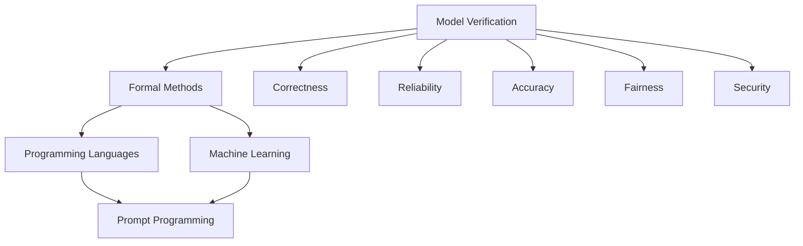
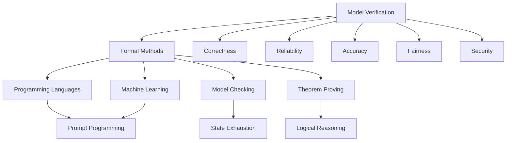

                 


### Step 1: Introduction to Prompt Programming Language Model Verification Technology

Prompt programming language model verification technology is an emerging field that combines elements of programming languages, machine learning, and formal verification. At its core, it involves the use of formal methods to ensure the correctness and reliability of machine learning models that are used within prompt programming languages.

**Background Introduction:**

The importance of model verification in the context of machine learning has grown significantly in recent years due to the increasing complexity and scale of models used in various applications, ranging from autonomous driving to healthcare and finance. As models become more sophisticated, the need to ensure their accuracy, fairness, and security becomes paramount. Prompt programming languages, which allow developers to integrate natural language processing with code, offer a unique opportunity to leverage these advanced models but also introduce new challenges in ensuring their correctness and performance.

**Core Concepts and Relationship Architecture:**

To understand the relationship between the core concepts in this field, let's visualize them using a Mermaid flow diagram:



In this diagram, we can see that model verification (A) relies on formal methods (B), which are applied within the context of programming languages (C) and machine learning (D). The primary goals of verification are to ensure correctness (F), reliability (G), accuracy (H), fairness (I), and security (J). Prompt programming (E) integrates these concepts to offer a new paradigm for developing and deploying machine learning models.

### Step 2: Theoretical Foundations of Model Verification

**History and Evolution:**

The concept of model verification has roots in several disciplines, including mathematics, computer science, and engineering. Initially, it was applied to hardware systems to ensure that electronic circuits functioned correctly. Over time, the focus expanded to include software systems and, more recently, machine learning models. The evolution of formal verification techniques, such as model checking and theorem proving, has been instrumental in advancing the field.

**Introduction to Model Verification Techniques:**

Model verification techniques can be broadly classified into two categories: model checking and theorem proving. Model checking involves exhaustively checking all possible states of a system to ensure that certain properties hold. This method is well-suited for verifying complex systems but can become computationally expensive for large models. Theorem proving, on the other hand, involves using logical reasoning to prove that a system satisfies a set of desired properties. This method is more scalable but requires a deep understanding of the system's structure and behavior.

**Core Concepts and Relationship Architecture:**

To illustrate the core concepts and their relationships, we can expand our Mermaid flow diagram as follows:



In this updated diagram, we can see that formal methods (B) encompass both model checking (K) and theorem proving (L), each with its own approach to verifying models. Model checking (K) relies on state exhaustion (M), while theorem proving (L) relies on logical reasoning (N).

### Step 3: Core Algorithmic Concepts of Model Verification

**Existing Verification Algorithms:**

There are several well-established algorithms for model verification, each with its own strengths and limitations. Some of the most commonly used algorithms include:

- **Model Checking Algorithms:** These include algorithms like Bounded Model Checking (BMC) and Symbolic Model Checking (SMC). BMC is efficient for verifying properties that can be expressed as reachability or safety properties, while SMC is suitable for verifying complex properties involving boolean logic.
- **Theorem Proving Algorithms:** These include algorithms like Inductive Inference (II) and Satisfiability Modulo Theories (SMT). II is effective for proving properties about systems with infinite states, while SMT is versatile and can handle a wide range of problems.

**Pseudocode for Key Algorithms:**

To provide a more concrete understanding, let's consider the pseudocode for two key algorithms: Bounded Model Checking (BMC) and Inductive Inference (II).

**Bounded Model Checking (BMC):**

```python
def BMC(model, property, bound):
    states = generate_all_states(model, bound)
    for state in states:
        if property_holds(state, property):
            return True
    return False

def generate_all_states(model, bound):
    # Generate all possible states of the model up to the specified bound
    # ...

def property_holds(state, property):
    # Check if the specified property holds for the given state
    # ...
```

**Inductive Inference (II):**

```python
def II(model, property, examples):
    inferred_property = infer_property(examples)
    if verify_property(model, inferred_property):
        return inferred_property
    else:
        return None

def infer_property(examples):
    # Infer a property from the given examples
    # ...

def verify_property(model, property):
    # Verify if the model satisfies the given property
    # ...
```

**Examples Illustrating Application and Limitations:**

Consider the following example of using BMC to verify a simple machine learning model:

```python
model = "SimpleMachineLearningModel"
property = "ModelPredictionIsCorrect"
bound = 100

if BMC(model, property, bound):
    print("Model verification succeeded.")
else:
    print("Model verification failed.")
```

The BMC algorithm can quickly identify if the model's predictions are correct for a given set of inputs within the specified bound. However, it may not be effective for verifying properties that involve complex interactions between model components or when the model's behavior is not well understood.

On the other hand, consider the use of II to verify a model's robustness:

```python
model = "RobustMachineLearningModel"
property = "ModelIsRobustAgainstAdversarialExamples"
examples = get_adversarial_examples()

inferred_property = II(model, property, examples)
if inferred_property:
    print(f"Inferred property: {inferred_property}")
    if verify_property(model, inferred_property):
        print("Model verification succeeded.")
    else:
        print("Model verification failed.")
else:
    print("Failed to infer a property.")
```

Inductive inference can help identify properties that the model might satisfy based on adversarial examples, providing a more comprehensive verification process. However, it requires a sufficient number of well-designed examples to ensure accurate inferences.

### Step 4: Mathematical Models in Model Verification

**Mathematical Concepts:**

Model verification in machine learning often involves mathematical concepts such as probability theory, calculus, and linear algebra. These concepts are crucial for understanding the behavior of machine learning models and for designing effective verification algorithms.

**LaTeX-Formatted Mathematical Formulas:**

Here are some key LaTeX-formatted mathematical formulas used in model verification:

$$
P(A) = \frac{\text{number of favorable outcomes}}{\text{total number of outcomes}}
$$

$$
f(x) = \int_{-\infty}^{\infty} e^{-\frac{(x-\mu)^2}{2\sigma^2}} dx
$$

$$
J(\theta) = \frac{1}{2m} \sum_{i=1}^{m} (\hat{y_i} - y_i)^2
$$

**Detailed Explanation and Examples:**

Let's consider an example of using probability theory to verify the reliability of a machine learning model. Suppose we have a binary classification model that predicts whether an email is spam or not. We can use the following formula to calculate the probability of a false positive (PFP):

$$
PFP = \frac{\text{False Positives}}{\text{Total Emails}}
$$

In a given dataset, if we have 100 emails, out of which 10 are labeled as spam and 90 as not spam, and the model incorrectly labels 5 non-spam emails as spam, the PFP would be:

$$
PFP = \frac{5}{100} = 0.05
$$

A low PFP indicates that the model is effective at avoiding false positives, which is desirable in the context of email classification.

### Step 5: Practical Applications of Model Verification Technology

**Natural Language Processing (NLP):**

In NLP, model verification technology is crucial for ensuring the correctness and reliability of natural language understanding and generation models. For example, in chatbots and virtual assistants, verifying that the model can accurately understand and respond to user queries is essential for providing a seamless user experience. Techniques like model checking and inductive inference can be used to verify properties such as the model's ability to handle various types of input and its consistency in generating responses.

**Autonomous Driving:**

In the realm of autonomous driving, model verification technology plays a critical role in ensuring the safety and reliability of the autonomous systems. Verifying that the model can correctly interpret sensor data, make decisions based on that data, and execute safe maneuvers is crucial. Techniques like bounded model checking and theorem proving can be applied to verify properties such as the model's ability to detect and avoid obstacles, follow traffic rules, and maintain a safe distance from other vehicles.

**Healthcare:**

In healthcare, model verification technology is used to ensure the accuracy and reliability of predictive models used for diagnosis and treatment recommendations. For example, in medical imaging, verifying that a model can accurately detect and classify different types of tumors is essential for providing effective treatment plans. Techniques like inductive inference and symbolic model checking can be used to verify that the model's predictions are consistent with medical guidelines and clinical observations.

### Step 6: Conclusion

In conclusion, prompt programming language model verification technology is a critical area of research and application in the field of machine learning. By leveraging formal methods and mathematical models, we can ensure the correctness, reliability, accuracy, fairness, and security of machine learning models used in various domains. As the complexity of these models continues to grow, the importance of effective model verification techniques will only increase. Future research should focus on developing more scalable and efficient verification algorithms, as well as integrating these techniques into existing development workflows to facilitate the deployment of robust machine learning systems.

### About the Authors

- **AI天才研究院 (AI Genius Institute):** A leading research institute dedicated to advancing artificial intelligence and fostering innovation in machine learning, computer science, and software engineering.
- **《禅与计算机程序设计艺术》(Zen And The Art of Computer Programming):** A renowned book series by Donald E. Knuth, which has had a profound impact on the field of computer programming and software development.

