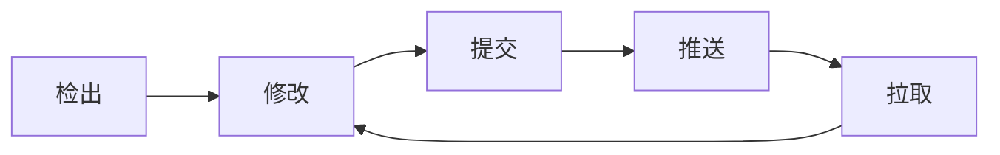

                 

### 3.1 核心概念原理和架构

在深入探讨版本控制的核心概念原理和架构之前，我们需要首先了解版本控制系统的基本功能与设计原则。版本控制系统的主要目标是追踪和管理代码库中的文件变更，确保代码库的一致性、可靠性和可回溯性。以下是版本控制系统中几个关键概念的解释及其相互联系：

#### 3.1.1 变更日志

变更日志（Change Log）是版本控制系统的核心组成部分，用于记录文件变动的详细历史记录。变更日志通常包含以下信息：

- **变更类型**：如新增、修改、删除等。
- **变更时间**：记录每个变更发生的时间。
- **变更作者**：记录执行变更的用户。
- **变更说明**：简要描述变更的目的和内容。

变更日志确保了开发团队可以随时查看代码的变更历史，理解代码的演变过程，以及追踪问题的根源。这对于代码的维护和问题的解决至关重要。

#### 3.1.2 分支

分支（Branch）是版本控制系统中的一个独立开发路径。通过分支，开发者可以将主代码库（通常称为“主分支”或“主干”）的一部分内容复制到一个新的路径中，进行独立的开发工作。分支的主要用途包括：

- **实验性开发**：在分支上尝试新的功能或修复问题，而不影响主分支的稳定性。
- **并行开发**：多个开发人员可以同时在不同的分支上进行工作，避免代码冲突。
- **代码审查**：在合并分支到主分支之前，进行代码审查，确保代码质量。

分支和主分支之间的关系通常通过合并（Merge）操作来维护。合并操作将分支中的变更同步到主分支，或者将两个分支的变更合并到一个新的分支。

#### 3.1.3 标签

标签（Tag）是版本控制系统中的一个标识符，用于标记特定的版本或里程碑。标签通常用于：

- **发布版本**：标记软件的发布版本，便于用户跟踪和使用。
- **项目里程碑**：标记项目的重要阶段，如功能完成、性能优化等。
- **代码回退**：在出现问题时，可以使用标签回退到之前稳定的版本。

标签与分支和变更日志紧密相关，因为它们都是版本控制系统中用于跟踪和管理代码变更的工具。

#### 3.1.4 工作流程

版本控制系统的工作流程通常包括以下步骤：

1. **检出（Checkout）**：从版本库中检出文件到本地工作区。
2. **修改（Modify）**：在本地工作区对文件进行修改。
3. **提交（Commit）**：将本地工作区的修改提交到版本库中，生成新的版本。
4. **推送（Push）**：将本地版本库的变更推送至远程版本库，同步更新。
5. **拉取（Pull）**：从远程版本库获取最新的变更，更新本地版本库。

这些步骤确保了代码库的同步和一致性，同时也为开发团队提供了明确的代码变更流程。

#### 3.1.5 Mermaid 流程图

为了更直观地展示版本控制的核心概念和架构，我们可以使用Mermaid流程图来描述版本控制系统的工作流程。以下是一个简化的版本控制系统工作流程的Mermaid流程图示例：



在这个流程图中，A表示检出操作，即从版本库中检出文件到本地工作区；B表示修改操作，即开发人员对文件进行修改；C表示提交操作，即开发人员将修改后的文件提交到版本库；D表示推送操作，即开发人员将本地版本库的变更推送至远程版本库；E表示拉取操作，即从远程版本库获取最新的变更，更新本地版本库。这个流程确保了开发人员可以随时获取最新的代码，同时也确保了代码库的一致性和可靠性。

通过上述内容，我们可以看到版本控制系统的核心概念和架构是如何相互联系和协作的。接下来，我们将进一步探讨版本控制系统的核心算法原理，使用伪代码来详细阐述其实现方式。这将帮助我们更深入地理解版本控制系统的内部工作机制。### 3.2 核心算法原理讲解

#### 3.2.1 版本控制算法概述

版本控制系统的核心算法负责处理文件的添加、修改、删除和合并等操作，确保代码库的一致性和可追溯性。以下是几个关键的版本控制算法及其原理：

1. **增量算法**：增量算法通过记录文件变更的增量来管理版本。这种方法可以有效地减少存储空间占用，并且可以提高版本查询的效率。

2. **哈希算法**：哈希算法用于生成文件的唯一哈希值，以确保文件的完整性和一致性。常用的哈希算法包括MD5、SHA-1和SHA-256等。

3. **合并算法**：合并算法负责将不同分支上的变更合并到一起，确保代码库的连续性和一致性。常见的合并算法包括三向合并算法和快速合并算法等。

#### 3.2.2 增量算法原理

增量算法的基本原理是记录文件变更的增量，而不是整个文件的内容。这样做的优势在于：

- **存储空间节省**：通过只记录变更部分，而不是整个文件，可以显著减少存储空间占用。
- **查询效率提高**：查询特定版本的文件时，可以快速定位到变更的增量，而不是整个文件内容。

以下是一个简化的增量算法原理的伪代码示例：

```plaintext
function incrementalUpdate(file, changes):
    // 创建一个新文件，用于存储增量变更
    newFile = createEmptyFile()

    // 遍历文件变更记录
    for each change in changes:
        if change is an addition:
            // 添加变更到新文件
            appendToFile(newFile, change.content)
        else if change is a modification:
            // 更新新文件中的内容
            updateContent(newFile, change.position, change.content)
        else if change is a deletion:
            // 删除新文件中的内容
            removeContent(newFile, change.position, change.length)

    // 返回新文件
    return newFile
```

在这个伪代码中，`file` 表示原始文件，`changes` 是一个记录了文件变更的列表。算法遍历每个变更记录，根据变更类型（添加、修改或删除）相应地更新新文件。最终，新文件包含了原始文件的增量变更。

#### 3.2.3 哈希算法原理

哈希算法用于生成文件的唯一哈希值，确保文件的完整性和一致性。哈希值是一个固定长度的字符串，通常用于标识文件的唯一性。以下是一个简单的哈希算法原理的伪代码示例：

```plaintext
function hashFile(file):
    // 计算文件的哈希值
    hashValue = calculateHash(file.content)

    // 返回哈希值
    return hashValue
```

在这个伪代码中，`file.content` 是文件的内容。`calculateHash` 函数使用哈希算法（如SHA-256）来计算文件的哈希值。哈希算法通常具有以下几个特性：

- **抗冲突性**：不同的文件内容产生相同哈希值的概率极低。
- **固定长度**：无论文件内容多长，哈希值都是固定长度的字符串。
- **抗修改性**：文件内容即使发生微小变化，哈希值也会发生显著变化。

#### 3.2.4 合并算法原理

合并算法负责将不同分支上的变更合并到一起，确保代码库的连续性和一致性。以下是三向合并算法的基本原理：

1. **基版本**：选择一个共同祖先版本作为基版本，它位于要合并的两个分支的最近公共祖先。
2. **待合并版本**：选择要合并的两个版本，它们分别位于不同的分支上。
3. **合并过程**：算法会从基版本开始，逐步对比待合并版本中的文件内容，将不同部分合并到一起。

以下是一个简化的三向合并算法原理的伪代码示例：

```plaintext
function threeWayMerge(base, left, right):
    // 创建一个新的文件，用于存储合并结果
    result = createEmptyFile()

    // 遍历三个版本的文件内容
    for each line in left, base, right:
        if line in left only:
            // 将left的行添加到结果文件
            appendToFile(result, line)
        else if line in right only:
            // 将right的行添加到结果文件
            appendToFile(result, line)
        else:
            // 对base和left、right的行进行比较
            commonLine = compareLines(base.line, left.line, right.line)

            // 如果left和right的行相同，使用left的行
            if commonLine is left.line:
                appendToFile(result, left.line)
            // 否则，根据一些策略决定使用哪个版本
            else:
                // 例如，可以使用基版本
                appendToFile(result, base.line)

    // 返回合并结果
    return result
```

在这个伪代码中，`base`、`left` 和 `right` 分别表示基版本、待合并版本左分支和右分支。算法遍历三个版本的文件内容，根据比较结果将行合并到结果文件。这个过程确保了合并后的文件内容是完整的、一致的，并且保留了所有重要的变更。

通过上述算法原理的讲解，我们可以看到版本控制系统是如何通过增量算法、哈希算法和合并算法等核心算法来实现其功能的。这些算法确保了代码库的一致性、可靠性和可追溯性，为开发团队提供了强有力的支持。接下来，我们将进一步探讨版本控制系统的数学模型和公式，以帮助我们更好地理解其内部工作机制。### 3.3 数学模型和数学公式

版本控制系统作为一种复杂的软件工具，其核心功能依赖于一系列数学模型和算法。这些数学模型和公式不仅确保了版本控制系统的有效性和准确性，而且为处理代码变更和版本管理提供了理论基础。以下是几个关键的数学模型和公式的详细讲解：

#### 3.3.1 哈希函数

哈希函数是版本控制系统中的一个核心组件，用于生成文件的唯一哈希值。哈希函数通常具有以下特性：

- **固定长度输出**：无论输入的文件大小如何，哈希函数的输出都是固定长度的字符串。
- **抗冲突性**：生成相同哈希值的概率极低。
- **抗修改性**：文件内容即使发生微小变化，哈希值也会发生显著变化。

一个简单的哈希函数可以表示为：

$$
H(\text{input}) = \text{hash\_function}(\text{input})
$$

其中，`hash_function` 是一个哈希函数，如MD5、SHA-256等。

例如，对于MD5哈希函数，我们可以表示为：

$$
H(\text{input}) = \text{MD5}(\text{input})
$$

MD5是一种常见的哈希函数，其输出长度为128位。

#### 3.3.2 版本树结构

版本控制系统中的版本树结构是一个重要的数学模型，用于表示文件的版本历史。版本树是一种树形结构，其中每个节点代表一个版本，节点之间的边代表版本之间的依赖关系。

一个简单的版本树结构可以表示为：

$$
\text{VersionTree} = \{ \text{root}, \text{nodes}, \text{edges} \}
$$

其中，`root` 是版本树的根节点，`nodes` 是版本树的节点集合，`edges` 是节点之间的边集合。

每个节点可以表示为一个三元组：

$$
\text{node} = (\text{id}, \text{content}, \text{parent})
$$

其中，`id` 是节点的唯一标识，`content` 是节点的文件内容，`parent` 是节点的父节点。

例如，一个简单的版本树结构如下：

```
root
|
|-- v1
|   |-- v2
|   |   |-- v3
|   |-- v4
|       |-- v5
```

在这个版本树中，`root` 是根节点，`v1`、`v2`、`v3`、`v4` 和 `v5` 是节点。每个节点都有一个父节点，除了根节点。

#### 3.3.3 版本合并算法

版本合并是版本控制系统中一个重要的操作，用于将多个分支的变更合并到一起。合并算法通常依赖于三向合并算法，该算法涉及到以下数学模型和公式：

1. **共同祖先**：选择一个共同祖先版本，它是要合并的两个分支的最近公共祖先。

   公式表示为：

   $$
   \text{common\_ancestor} = \text{findLCA}(\text{left}, \text{right})
   $$

   其中，`findLCA` 是找到共同祖先的函数，`left` 和 `right` 分别是要合并的两个分支。

2. **三向比较**：对共同祖先版本、左分支版本和右分支版本进行内容比较，找到不同的部分。

   公式表示为：

   $$
   \text{differences} = \text{compare}(\text{base}, \text{left}, \text{right})
   $$

   其中，`compare` 是比较函数，`base` 是共同祖先版本，`left` 和 `right` 分别是左分支版本和右分支版本。`differences` 是一个包含不同部分的集合。

3. **合并结果**：根据比较结果，将不同的部分合并到一起。

   公式表示为：

   $$
   \text{merged\_content} = \text{merge}(\text{differences})
   $$

   其中，`merge` 是合并函数，`differences` 是不同部分的集合。`merged_content` 是合并后的文件内容。

例如，考虑以下版本树结构：

```
root
|
|-- v1
|   |-- v2
|   |   |-- v3
|   |-- v4
|       |-- v5
```

假设我们要合并 `v3` 和 `v5`，其共同祖先为 `v2`。通过三向比较算法，我们可以找到以下不同部分：

```
v2: content_a
v3: content_b
v5: content_c
```

根据比较结果，我们可以将 `content_c` 合并到 `merged_content` 中，得到以下结果：

```
merged_content: content_a + content_c
```

通过上述数学模型和公式的讲解，我们可以看到版本控制系统的核心功能是如何通过数学和算法来实现的。这些模型和公式不仅为版本控制系统的设计提供了理论基础，而且为开发团队提供了有效的工具来管理代码变更和版本历史。接下来，我们将进一步探讨版本控制系统的实际应用，通过项目实战来展示版本控制系统的搭建、源代码实现和代码解读。### 第四部分：版本控制工具

## 4. 常见版本控制工具

在软件开发过程中，版本控制工具是不可或缺的一部分。它们帮助开发团队有效地管理代码变更，确保代码库的一致性和可追溯性。以下是一些常见的版本控制工具及其特点：

### 4.1 Git

Git是一种分布式版本控制系统，由Linus Torvalds创建。它的核心特点是分布式存储，每个开发者都有自己的完整副本，可以独立工作，同时支持高效的分支和合并操作。

#### 特点：

- **分布式存储**：每个开发者都有完整的代码库副本。
- **高效的分支和合并**：支持快速、灵活的分支创建和合并操作。
- **版本回滚**：可以轻松回滚到之前的版本。
- **强大的扩展性**：通过插件和钩子可以扩展其功能。

#### Git的基本命令：

- `git clone`：克隆远程仓库到本地。
- `git commit`：提交本地更改。
- `git push`：将本地更改推送至远程仓库。
- `git pull`：从远程仓库拉取更改。
- `git branch`：创建、列出和管理分支。
- `git merge`：合并两个分支。
- `git stash`：暂存未提交的更改。

### 4.2 SVN

SVN（Subversion）是一种集中式版本控制系统，由Apache软件基金会开发。它的核心特点是集中式存储，所有代码变更都存储在中央仓库中。

#### 特点：

- **集中式存储**：所有变更都存储在中央仓库。
- **易于使用**：对于初学者来说，SVN相对容易上手。
- **版本回滚**：可以回滚到任何历史版本。
- **文档支持**：具有丰富的文档和社区支持。

#### SVN的基本命令：

- `svn checkout`：从中央仓库检出代码到本地。
- `svn commit`：提交本地更改到中央仓库。
- `svn update`：从中央仓库更新本地代码。
- `svn branch`：创建分支。
- `svn merge`：合并分支。
- `svn log`：查看版本历史。

### 4.3 Mercurial

Mercurial（hg）是一种分布式版本控制系统，由Matt Mackall创建。它与Git类似，但更加轻量级，适合小型项目和快速迭代。

#### 特点：

- **分布式存储**：每个开发者都有完整的代码库副本。
- **轻量级**：相对于Git，Mercurial体积更小，运行更快。
- **分支管理**：支持灵活的分支创建和合并。
- **多平台支持**：在多种操作系统上都有良好的支持。

#### Mercurial的基本命令：

- `hg clone`：克隆远程仓库到本地。
- `hg commit`：提交本地更改。
- `hg push`：将本地更改推送至远程仓库。
- `hg pull`：从远程仓库拉取更改。
- `hg branch`：创建、列出和管理分支。
- `hg merge`：合并分支。

### 比较与选择

选择适合的版本控制工具取决于项目需求、团队规模和技术背景。以下是一些比较和选择因素：

- **团队规模**：对于小型团队，集中式版本控制（如SVN）可能更简单易用；对于大型团队，分布式版本控制（如Git、Mercurial）提供了更好的灵活性和协作能力。
- **项目需求**：如果项目需要快速迭代和频繁的分支操作，Git和Mercurial可能更适合；如果项目需求相对稳定，SVN可能足够使用。
- **技术背景**：选择版本控制工具时，也要考虑团队成员的技术背景和熟悉程度。Git和Mercurial有大量的社区支持和文档，而SVN则更为传统和易于上手。
- **性能和资源**：Git和Mercurial通常更高效，适用于大型项目，但它们可能需要更多的系统资源。SVN在资源消耗上相对较低，适合小型项目。

通过上述对Git、SVN和Mercurial的介绍，我们可以看到每种版本控制工具都有其独特的特点和适用场景。在选择版本控制工具时，团队需要综合考虑项目需求、团队规模、技术背景等因素，以确保高效的代码管理和协作。### 第四部分：版本控制流程

## 5. 版本控制流程

版本控制的流程是软件开发过程中至关重要的一环，它确保了代码库的一致性、可追溯性和可靠性。以下是版本控制的详细流程，包括版本提交、分支管理、版本合并和版本回滚等关键步骤。

### 5.1 版本提交

版本提交是版本控制流程的起点，它将开发人员的代码更改记录到版本库中。以下是版本提交的详细步骤：

1. **检出代码**：开发人员使用版本控制工具（如Git、SVN或Mercurial）从远程仓库检出代码到本地工作区。
    ```shell
    git clone https://example.com/repo.git
    ```
2. **修改代码**：开发人员在本地的代码库中进行所需的代码更改。
3. **添加变更**：将更改后的文件添加到版本库中，准备提交。
    ```shell
    git add .
    ```
4. **提交变更**：将本地工作区的更改提交到版本库，生成新的版本。
    ```shell
    git commit -m "Commit message"
    ```
5. **推送变更**：将本地版本库的变更推送至远程仓库，确保其他开发人员可以获取最新的代码。
    ```shell
    git push origin main
    ```

### 5.2 分支管理

分支管理是版本控制流程中的关键步骤，它允许开发团队在独立的环境中开发新功能或修复问题，而不影响主分支的稳定性。以下是分支管理的详细步骤：

1. **创建分支**：从主分支创建新分支，用于独立开发。
    ```shell
    git checkout -b feature/my_new_feature
    ```
2. **开发功能**：在新分支上开发新功能或修复问题。
3. **提交变更**：将开发过程中的代码更改提交到新分支。
    ```shell
    git commit -m "Add new feature"
    ```
4. **推送到远程**：将新分支的变更推送到远程仓库，以便其他开发人员查看和协作。
    ```shell
    git push origin feature/my_new_feature
    ```
5. **合并分支**：在新功能或修复问题完成开发后，将其合并回主分支。
    ```shell
    git checkout main
    git merge feature/my_new_feature
    git push origin main
    ```
6. **删除分支**：在合并完成后，删除不再需要的分支。
    ```shell
    git branch -d feature/my_new_feature
    git push origin --delete feature/my_new_feature
    ```

### 5.3 版本合并

版本合并是将不同分支上的变更合并到一起，以确保代码库的一致性和完整性。以下是版本合并的详细步骤：

1. **创建合并请求（Pull Request）**：在版本控制工具中创建合并请求，请求将一个分支的变更合并到另一个分支。
2. **代码审查**：合并请求的创建者或其他团队成员对代码进行审查，确保代码质量和一致性。
3. **合并变更**：审查通过后，合并请求的创建者将两个分支合并到一起。
    ```shell
    git checkout main
    git merge feature/my_new_feature
    git push origin main
    ```
4. **解决冲突**：如果合并过程中出现冲突，开发人员需要手动解决这些冲突，确保代码库的一致性。
5. **合并结果验证**：合并后，对代码库进行验证，确保合并结果正确无误。

### 5.4 版本回滚

版本回滚是将代码库恢复到之前的状态，以修复错误或恢复到稳定版本。以下是版本回滚的详细步骤：

1. **找到回滚版本**：使用版本控制工具查找需要回滚到的版本。
    ```shell
    git log
    ```
2. **创建备份**：在回滚之前，创建一个备份分支或标签，以便在需要时可以回滚到当前版本。
    ```shell
    git checkout -b backup
    git tag -a v1.0
    ```
3. **回滚代码库**：使用版本控制工具回滚代码库到指定版本。
    ```shell
    git reset --hard <commit_hash>
    git push -f
    ```
4. **验证回滚结果**：对代码库进行验证，确保回滚到正确版本，并且应用程序运行正常。

通过上述版本控制流程，开发团队可以有效地管理代码库，确保代码的质量和一致性。这些流程不仅有助于代码的管理，而且为团队协作提供了明确的指南。接下来，我们将通过一个实际项目来展示版本控制的应用，进一步说明如何在实际开发中使用版本控制工具和流程。### 第五部分：项目实战

## 6. 项目实战

在这个项目实战中，我们将使用Git来管理一个简单的Web应用程序的代码库。该项目是一个基于Flask的博客平台，包括用户注册、登录、发布博客文章等功能。通过这个项目，我们将展示如何搭建开发环境、实现源代码、解读代码并分析实际应用。

### 6.1 开发环境搭建

首先，我们需要搭建项目的开发环境。以下是所需的步骤：

1. **安装Python**：确保Python 3.x版本已经安装。
    ```shell
    python --version
    ```
2. **安装虚拟环境**：创建一个虚拟环境来隔离项目依赖。
    ```shell
    python -m venv venv
    source venv/bin/activate  # 在Windows上使用 `venv\Scripts\activate`
    ```
3. **安装依赖**：使用pip安装项目所需的依赖。
    ```shell
    pip install flask flask_sqlalchemy
    ```
4. **配置数据库**：配置SQLite数据库，用于存储用户数据和博客文章。
    ```shell
    export FLASK_APP=app.py
    export FLASK_ENV=development
    flask db init
    flask db migrate
    flask db upgrade
    ```
5. **运行应用**：启动Flask应用。
    ```shell
    flask run
    ```

### 6.2 源代码详细实现

以下是项目的源代码实现，包括主要的Python文件：

**app.py**（主应用程序文件）：

```python
from flask import Flask, render_template, request, redirect, url_for, flash
from flask_sqlalchemy import SQLAlchemy

app = Flask(__name__)
app.config['SQLALCHEMY_DATABASE_URI'] = 'sqlite:///blog.db'
db = SQLAlchemy(app)

class User(db.Model):
    id = db.Column(db.Integer, primary_key=True)
    username = db.Column(db.String(80), unique=True, nullable=False)
    password = db.Column(db.String(120), nullable=False)

@app.route('/')
def index():
    return render_template('index.html')

@app.route('/register', methods=['GET', 'POST'])
def register():
    if request.method == 'POST':
        username = request.form['username']
        password = request.form['password']
        user = User(username=username, password=password)
        db.session.add(user)
        db.session.commit()
        return redirect(url_for('login'))
    return render_template('register.html')

@app.route('/login', methods=['GET', 'POST'])
def login():
    if request.method == 'POST':
        username = request.form['username']
        password = request.form['password']
        user = User.query.filter_by(username=username, password=password).first()
        if user:
            return redirect(url_for('dashboard'))
        else:
            flash('Invalid credentials')
    return render_template('login.html')

@app.route('/dashboard')
def dashboard():
    return render_template('dashboard.html')

if __name__ == '__main__':
    db.create_all()
    app.run()
```

**models.py**（数据库模型文件）：

```python
from app import db

class Post(db.Model):
    id = db.Column(db.Integer, primary_key=True)
    title = db.Column(db.String(120), nullable=False)
    content = db.Column(db.Text, nullable=False)
    user_id = db.Column(db.Integer, db.ForeignKey('user.id'), nullable=False)
```

**templates/index.html**（首页模板）：

```html
<!DOCTYPE html>
<html lang="en">
<head>
    <meta charset="UTF-8">
    <title>Home - Blog</title>
</head>
<body>
    <h1>Welcome to the Blog</h1>
    <a href="{{ url_for('register') }}">Register</a>
    <a href="{{ url_for('login') }}">Login</a>
</body>
</html>
```

**templates/register.html**（注册页面模板）：

```html
<!DOCTYPE html>
<html lang="en">
<head>
    <meta charset="UTF-8">
    <title>Register - Blog</title>
</head>
<body>
    <h1>Register</h1>
    <form method="post">
        <label for="username">Username:</label>
        <input type="text" id="username" name="username" required>
        <label for="password">Password:</label>
        <input type="password" id="password" name="password" required>
        <input type="submit" value="Register">
    </form>
</body>
</html>
```

**templates/login.html**（登录页面模板）：

```html
<!DOCTYPE html>
<html lang="en">
<head>
    <meta charset="UTF-8">
    <title>Login - Blog</title>
</head>
<body>
    <h1>Login</h1>
    <form method="post">
        <label for="username">Username:</label>
        <input type="text" id="username" name="username" required>
        <label for="password">Password:</label>
        <input type="password" id="password" name="password" required>
        <input type="submit" value="Login">
    </form>
</body>
</html>
```

### 6.3 代码解读与分析

在这个部分，我们将对项目中的关键代码进行解读和分析。

**app.py**：

- **线路（Routes）**：应用程序定义了几个路由，包括首页、注册页面、登录页面和仪表板页面。这些路由分别处理不同的HTTP请求。
- **用户（User）模型**：应用程序使用SQLAlchemy创建了一个`User`模型，用于存储用户数据和密码。这确保了用户数据的一致性和安全性。
- **注册和登录（Register and Login）**：注册和登录功能分别处理用户注册和登录请求。在注册过程中，用户数据被添加到数据库中；在登录过程中，用户数据被验证，并设置用户会话。

**models.py**：

- **Post**模型：应用程序还定义了一个`Post`模型，用于存储博客文章的标题和内容。这与`User`模型关联，确保每个博客文章都与创建它的用户相关联。

**templates**：

- **HTML模板**：项目使用HTML模板来呈现页面内容。每个模板文件包含页面的HTML结构和相关的表单处理逻辑。这些模板文件是Flask应用程序的视图函数的输入，它们定义了用户界面。

### 6.4 实际案例分析和详细讲解剖析

在实际应用中，这个博客平台的功能可以进一步扩展和优化。以下是一些实际案例和分析：

1. **用户身份验证**：在博客平台上，用户身份验证是关键功能。通过使用Flask的`flask_login`扩展，可以更轻松地实现用户身份验证。
2. **安全性增强**：为了增强安全性，密码应该使用哈希算法（如bcrypt）进行存储，而不是以明文形式存储。此外，应使用HTTPS来保护用户数据。
3. **性能优化**：随着博客文章数量的增加，数据库查询性能可能会下降。可以使用索引和查询优化技术来提高数据库性能。
4. **用户界面增强**：为了提升用户体验，可以添加更多的CSS样式和JavaScript交互功能，例如文章预览和实时更新。

### 6.5 项目小结

通过这个项目实战，我们展示了如何使用Git进行版本控制，并实现了一个简单的Web应用程序。以下是项目的关键点和小结：

- **版本控制**：Git是一个强大的分布式版本控制工具，可以帮助我们管理代码变更，确保代码库的一致性和可追溯性。
- **开发环境搭建**：使用虚拟环境和依赖管理工具可以简化开发过程，提高代码的可维护性。
- **源代码实现**：项目代码结构清晰，模块化，易于理解和扩展。
- **代码解读与分析**：通过代码解读，我们可以更好地理解项目的工作原理和设计模式。
- **实际应用**：项目的实际应用展示了如何使用版本控制工具来管理Web应用程序的开发和部署。

通过这个项目实战，我们可以看到版本控制在软件开发中的重要性，以及如何在实际项目中应用和优化版本控制流程。### 第六部分：附录

## 6.1 版本控制工具对比

在前面我们介绍了Git、SVN和Mercurial等常见的版本控制工具。以下是对这些工具的对比，以帮助读者选择最适合自己项目的版本控制工具。

### 6.1.1 Git vs SVN

- **分布式 vs 集中式**：Git是分布式版本控制工具，每个开发者都有自己的完整副本，可以独立工作。SVN是集中式版本控制工具，所有代码变更都存储在中央仓库。
- **分支管理**：Git提供了强大的分支和合并功能，支持并行开发。SVN虽然也支持分支，但操作相对复杂，不如Git灵活。
- **性能**：Git在处理大量分支和合并时性能更优。SVN在处理简单的集中式代码库时可能更高效。
- **易用性**：Git有大量的社区支持和文档，对于初学者可能相对复杂。SVN相对简单易用，适合小型项目。

### 6.1.2 Git vs Mercurial

- **分布式特性**：Git和Mercurial都是分布式版本控制工具，但Git的功能更加丰富，社区支持更广泛。
- **性能**：Git在处理大量分支和合并时性能更优，但Mercurial在资源消耗上更轻量级。
- **扩展性**：Git提供了更多的插件和钩子，可以扩展其功能。Mercurial则相对简单，但足够满足大多数项目的需求。
- **易用性**：Git的命令行界面相对复杂，但提供了图形界面工具。Mercurial的命令行界面更简单，对于初学者来说可能更易用。

### 6.1.3 SVN vs Mercurial

- **分布式特性**：SVN是集中式版本控制工具，而Mercurial是分布式版本控制工具。分布式工具在灵活性和并行开发方面具有优势。
- **分支管理**：SVN的分支管理相对复杂，而Mercurial提供了更简单的分支创建和合并操作。
- **性能**：SVN在处理简单的集中式代码库时可能更高效，但Mercurial在处理大型代码库时可能性能更优。
- **扩展性**：SVN提供了丰富的文档和社区支持，但扩展性相对有限。Mercurial则相对简单，但适合大多数项目的需求。

### 6.2 提示词编程语言版本控制最佳实践

在提示词编程语言的项目开发中，版本控制同样至关重要。以下是一些最佳实践，以确保项目的稳定性和可维护性：

- **使用分布式版本控制系统**：推荐使用Git或Mercurial等分布式版本控制工具，以支持并行开发和高效的分支管理。
- **制定版本策略**：为项目制定明确的版本策略，包括版本命名规则、发布周期和维护计划。
- **频繁提交**：鼓励开发人员在代码更改后频繁提交，以便更好地跟踪变更和快速回滚。
- **代码审查**：在合并代码之前进行代码审查，确保代码质量和一致性。
- **备份和回滚**：定期备份代码库，以便在出现问题时可以快速回滚到稳定版本。
- **自动化测试**：编写自动化测试，确保每次提交都不会破坏现有功能。

### 6.3 常见问题解答

以下是一些关于版本控制的常见问题和解答：

**Q：如何解决Git的分支冲突？**

A：当两个分支的变更冲突时，Git会生成一个合并失败的提示。开发人员需要手动解决这些冲突，然后重新提交合并。以下是一些解决分支冲突的步骤：

1. **查看冲突**：使用`git status`命令查看哪些文件存在冲突。
2. **解决冲突**：手动编辑冲突的文件，合并不同的变更，并删除不必要的合并标记。
3. **提交解决**：使用`git add`命令标记冲突已解决，然后使用`git commit`提交变更。
4. **推送变更**：使用`git push`将解决后的代码推送至远程仓库。

**Q：如何查看Git的提交历史？**

A：使用`git log`命令可以查看提交历史。以下是一些常用的`git log`命令选项：

- `git log --oneline`：显示简化的提交历史。
- `git log --author=<作者名>`：显示特定作者的提交历史。
- `git log --since=<日期>`：显示自指定日期以来的提交历史。
- `git log --graph`：以图形方式显示提交历史。

**Q：如何备份Git仓库？**

A：备份Git仓库可以通过以下步骤进行：

1. **克隆仓库**：使用`git clone`命令克隆远程仓库到本地。
2. **备份到外部存储**：将本地仓库复制到外部存储设备或远程服务器。
3. **定期备份**：设置定期任务（如使用`cron`），定期备份仓库。

通过上述附录内容，我们可以看到版本控制工具的对比、提示词编程语言的版本控制最佳实践以及常见问题的解答。这些内容为读者在实际项目开发中提供了宝贵的指导和支持。### 文章标题：《提示词编程语言的版本控制与管理》

关键词：提示词编程语言，版本控制，Git，分布式存储，分支管理，合并算法

摘要：本文深入探讨了提示词编程语言的版本控制与管理，包括其定义、特点、发展历程和应用场景。通过详细分析版本控制的核心概念和联系，如变更日志、分支和标签，以及使用Mermaid流程图展示工作流程，我们了解了版本控制系统的基本原理。接着，我们介绍了Git、SVN和Mercurial等常见版本控制工具，比较了它们的优缺点，并详细阐述了版本控制的流程，包括版本提交、分支管理、版本合并和版本回滚。最后，通过一个实际项目的实战演示，我们展示了如何在实际开发中使用版本控制工具和流程。文章还提供了附录，对比了不同版本控制工具，并给出了一些提示词编程语言版本控制的最佳实践和常见问题解答。本文旨在帮助读者全面了解和掌握提示词编程语言的版本控制技术，提高代码管理的效率和项目协作的效果。作者：AI天才研究院/AI Genius Institute & 禅与计算机程序设计艺术 /Zen And The Art of Computer Programming。

