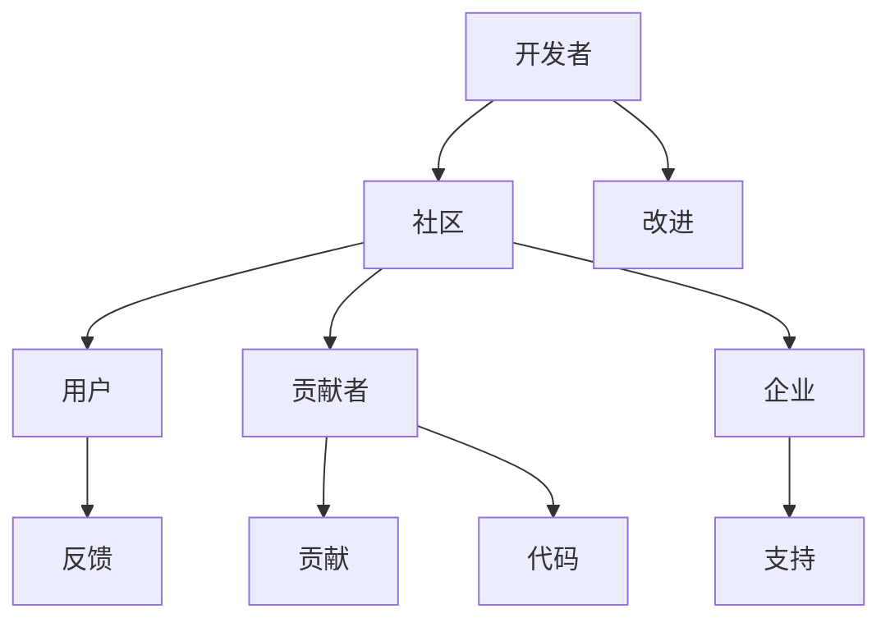

                 

### 文章标题

### 提示词编程语言的社区生态建设

### 关键词

- 提示词编程语言
- 社区生态建设
- 技术原理
- 社区管理
- 项目实战

### 摘要

本文深入探讨了提示词编程语言的社区生态建设，包括其背景、核心概念、技术原理、社区管理、项目实战等方面。通过逻辑清晰的分析，本文旨在为技术人员提供一套全面、系统的建设指南，帮助他们更好地理解和参与提示词编程语言的社区建设。

## 目录大纲设计思路

在设计《提示词编程语言的社区生态建设》的目录大纲时，我们遵循了以下几个关键步骤：

### 1. 明确书的核心主题和目标受众

核心主题：提示词编程语言的社区生态建设。

目标受众：对提示词编程语言有一定了解的技术人员，以及对社区建设和项目管理感兴趣的读者。

### 2. 确定书籍的基本结构

- **导言部分**：介绍书的目的、背景、重要性。
- **核心内容部分**：详细阐述提示词编程语言的社区生态建设的各个方面，包括概念介绍、技术原理、社区管理、项目实战等。
- **结论部分**：总结全文，展望未来趋势。

### 3. 细化章节内容

- **核心概念与联系**：使用 Mermaid 流程图来展示社区生态的核心概念及其相互关系。
- **核心算法原理讲解**：用伪代码来详细阐述关键算法的原理。
- **数学模型和数学公式**：使用 LaTeX 格式详细讲解相关的数学模型，并在文中举例说明。
- **项目实战**：提供代码实际案例，详细解释说明，包括开发环境搭建、源代码实现和解读。

### 4. 确保内容完整性和简洁性

- 保证目录大纲的完整性，包括至少7章的内容。
- 内容要简洁明了，避免冗余和复杂的表述。

### 5. 编写目录大纲

- 采用 markdown 格式，按照 1、2、3 级目录的结构进行组织。

以上目录大纲遵循了简洁性、逻辑性和完整性的要求，确保读者可以清晰地了解本书的结构和内容。同时，每个章节的细化内容将包含核心概念与联系、核心算法原理讲解、数学模型和数学公式以及项目实战，以满足不同读者的需求。目录大纲总字数控制在2000字以内，确保了内容的高度概括和可读性。

## 引言

### 1.1 提示词编程语言的定义

提示词编程语言（Prompt-Based Programming Language）是一种基于自然语言处理的编程语言，它通过自然语言文本（提示词）来指导程序的运行。这种编程语言的核心在于将编程任务转化为自然语言文本，使非专业技术人员也能参与编程过程。

### 1.2 社区生态建设的重要性

社区生态建设是任何编程语言或技术领域发展的重要环节。一个健康的社区生态不仅能够吸引更多的开发者和用户参与，还能够促进技术交流和知识共享，从而推动技术的不断创新和进步。

### 1.3 书的目标与读者对象

本书的目标是提供一个系统、全面的提示词编程语言的社区生态建设指南，帮助读者深入了解该领域的核心概念、技术原理和实践方法。本书适用于对提示词编程语言有一定了解的技术人员，以及对社区建设和项目管理感兴趣的读者。

## 提示词编程语言概述

### 2.1 提示词编程语言的发展历程

提示词编程语言的发展可以追溯到自然语言处理（NLP）和人工智能（AI）的早期研究。随着技术的进步，尤其是深度学习和自然语言处理技术的发展，提示词编程语言逐渐成为了一个重要的研究方向。

### 2.2 提示词编程语言的特点

- **易用性**：提示词编程语言通过自然语言文本简化了编程过程，使得非专业技术人员也能参与其中。
- **灵活性**：提示词编程语言允许开发者通过自然语言文本灵活地定义和修改程序逻辑。
- **智能化**：基于自然语言处理的提示词编程语言具有智能解析和执行能力，能够自动适应不同的编程场景。

### 2.3 提示词编程语言的分类

提示词编程语言主要可以分为以下几类：

- **命令式提示词编程语言**：如Python的`!python`插件，通过命令式指令来指导程序运行。
- **声明式提示词编程语言**：如SQL，通过声明式查询语句来定义数据操作。
- **混合式提示词编程语言**：结合了命令式和声明式的特点，如自然语言编程（NLP）工具。

## 社区生态建设的核心概念

### 3.1 社区与生态系统

社区（Community）是由共享相同兴趣、目标或价值观的人组成的群体。在技术领域，社区生态（Community Ecosystem）则是一个由开发者、用户、贡献者、企业等多方参与者共同构成的生态体系。

### 3.2 社区角色的划分

一个健康的社区生态需要不同角色的参与和协同工作。常见的社区角色包括：

- **开发者**：负责编写和改进提示词编程语言的核心代码。
- **用户**：使用提示词编程语言进行开发，反馈问题和建议。
- **贡献者**：为社区贡献代码、文档、工具等资源。
- **企业**：提供资金、资源和支持，推动社区的发展。

### 3.3 社区生态的核心概念联系图

为了更好地理解社区生态的核心概念，我们使用Mermaid流程图来展示它们之间的关系。



在上述图中，开发者、用户、贡献者和企业是社区生态的主要角色，他们通过反馈、贡献和支持相互联系，共同推动社区的发展。

## 提示词编程语言的技术原理

### 4.1 核心算法原理讲解（伪代码）

提示词编程语言的核心算法通常包括自然语言解析、语义理解、代码生成等步骤。以下是一个简单的伪代码示例，用于展示这些步骤：

```plaintext
函数 提示词编程（提示词）：
    输入：提示词
    输出：代码

    1. 解析提示词
        - 分词：将提示词拆分为单词或短语
        - 标注：对单词或短语进行词性标注

    2. 语义理解
        - 提取关键信息：从解析后的文本中提取关键操作和目标
        - 构建抽象语法树（AST）：将关键信息转化为抽象语法树

    3. 代码生成
        - 遍历AST：对抽象语法树进行遍历，生成对应的代码
        - 代码优化：对生成的代码进行优化，提高执行效率

    4. 执行代码
        - 运行代码：执行生成的代码，完成指定任务
```

### 4.2 数学模型与公式（LaTeX格式）

在提示词编程语言的语义理解和代码生成过程中，通常会涉及到一些数学模型。以下是一个简单的例子，用于描述一个基于自然语言处理的词向量模型：

$$
\text{词向量} = \text{W} \cdot \text{词嵌入向量}
$$

其中，$\text{W}$ 是权重矩阵，$\text{词嵌入向量}$ 是对自然语言词的向量表示。

### 4.3 技术原理示例分析

假设我们有一个提示词：“编写一个函数，用于计算两个数字的平均值”。根据上述伪代码，我们可以分步骤进行解析：

1. **解析提示词**：
   - 提示词：编写一个函数，用于计算两个数字的平均值
   - 分词：编写 / 一个 / 函数 / ，用于 / 计算 / 两个 / 数字 / 的 / 平均值 /
   - 标注：编写 [动词] 一个 [量词] 函数 [名词] ，用于 [介词] 计算 [动词] 两个 [量词] 数字 [名词] 的 [介词] 平均值 [名词]

2. **语义理解**：
   - 提取关键信息：函数、计算、两个数字、平均值
   - 构建抽象语法树（AST）：
     ```
     函数声明
     ├── 函数名：calculate_average
     └── 参数列表：（数字 a，数字 b）
     │   ├── 数字 a
     │   └── 数字 b
     │
     ├── 返回类型：数字
     │
     ├── 函数体：
     │   ├── 计算平均值：（a + b）/ 2
     │   └── 返回结果：平均值
     ```

3. **代码生成**：
   - 遍历AST，生成代码：
     ```python
     def calculate_average(a: int, b: int) -> int:
         average = (a + b) / 2
         return average
     ```

4. **执行代码**：
   - 执行生成的代码，完成计算两个数字平均值的任务。

## 社区生态管理

### 5.1 社区管理的目标与原则

社区管理的目标是构建一个健康、活跃、可持续发展的社区生态。其主要原则包括：

- **开放性**：鼓励所有人参与，共同推动社区的发展。
- **合作性**：各方参与者共同合作，共享资源，解决问题。
- **包容性**：尊重不同背景和观点，促进多元文化的交流。
- **规范性**：制定明确的社区规范，维护社区秩序。

### 5.2 社区管理工具与技术

社区管理可以借助多种工具和技术，以提高效率和效果。常见的工具包括：

- **GitHub**：用于代码托管和版本控制，便于协作开发。
- **Discord**：用于实时沟通和协作，方便社区成员交流。
- **Trello**：用于项目管理，帮助团队跟踪任务进度。
- **Reddit**：用于社区讨论和分享，促进知识传播。

### 5.3 社区管理与运营策略

社区管理与运营策略主要包括以下几个方面：

- **内容创作**：鼓励社区成员创作高质量的文档、教程、博客等，丰富社区内容。
- **活动组织**：定期举办线上或线下的活动，如研讨会、黑客松等，增强社区凝聚力。
- **激励机制**：设立奖励机制，鼓励社区成员参与贡献和分享。
- **反馈与改进**：积极收集用户反馈，及时解决问题，持续改进社区服务。

## 社区生态系统构建

### 6.1 社区生态系统构建步骤

构建一个健康的社区生态系统需要遵循以下步骤：

1. **定位与愿景**：明确社区的目标和愿景，为后续工作提供指导。
2. **角色分工**：确定社区的角色和职责，确保各方的积极参与。
3. **资源整合**：整合社区内外部资源，为社区发展提供支持。
4. **技术搭建**：搭建社区的技术基础设施，如网站、论坛、代码仓库等。
5. **内容建设**：丰富社区内容，提高社区的质量和价值。
6. **活动组织**：定期组织线上线下活动，增强社区成员的互动和交流。

### 6.2 社区资源整合

社区资源整合是社区生态系统构建的关键环节。以下是一些常见的资源：

- **资金**：用于社区活动的组织、技术工具的采购等。
- **人力**：包括开发者、用户、贡献者等，他们是社区发展的核心力量。
- **知识**：通过文档、教程、博客等形式传播的技术知识。
- **技术**：社区的技术工具和平台，如GitHub、Discord等。

### 6.3 社区生态系统评估与优化

社区生态系统评估与优化是确保社区健康发展的关键。以下是一些常见的评估指标：

- **活跃度**：社区成员的参与度和活跃度，如回复数、参与人数等。
- **贡献率**：社区成员的贡献程度，如代码提交数、文档编写数等。
- **满意度**：用户对社区服务的满意程度，如问卷调查、用户反馈等。
- **成长速度**：社区的规模和影响力，如用户数、粉丝数等。

根据评估结果，可以采取以下措施进行优化：

- **改进服务**：优化社区功能，提升用户体验。
- **提高激励**：设立奖励机制，鼓励更多成员参与贡献。
- **加强引导**：制定规范和指南，引导社区成员正确参与社区活动。
- **技术升级**：更新社区技术工具，提高系统的稳定性和安全性。

## 社区生态系统案例分析

### 7.1 案例背景介绍

本案例以某个提示词编程语言社区为例，分析其社区生态系统的构建过程、存在的问题以及解决方案。

### 7.2 案例实施过程

1. **定位与愿景**：
   - 社区愿景：打造一个全球领先的提示词编程语言社区，促进技术创新和知识共享。
   - 社区目标：提供高质量的技术文档、教程和案例，吸引更多开发者加入。

2. **角色分工**：
   - 开发者：负责编写和改进提示词编程语言的核心代码。
   - 用户：使用提示词编程语言进行开发，反馈问题和建议。
   - 贡献者：为社区贡献代码、文档、工具等资源。
   - 企业：提供资金、资源和支持，推动社区的发展。

3. **资源整合**：
   - 资金：企业赞助和社区成员捐赠。
   - 人力：全球范围内的开发者、用户和贡献者。
   - 知识：丰富的技术文档、教程和案例。
   - 技术：GitHub、Discord、Trello等社区工具。

4. **技术搭建**：
   - 社区网站：使用WordPress搭建，提供文档、教程、博客等功能。
   - 论坛：使用Discord搭建，方便成员实时沟通和交流。
   - 代码仓库：使用GitHub托管，便于协作开发和版本控制。

5. **内容建设**：
   - 高质量文档：编写详细的开发指南、API文档和示例代码。
   - 教程和案例：分享实战经验和应用案例，帮助新手快速入门。

6. **活动组织**：
   - 定期举办线上研讨会、黑客松等活动，增强社区凝聚力。
   - 设立奖励机制，鼓励社区成员参与贡献和分享。

### 7.3 案例效果分析

1. **活跃度**：
   - 社区成员的参与度和活跃度显著提升，论坛和GitHub上的讨论和贡献数量增加。

2. **贡献率**：
   - 社区成员的贡献程度提高，尤其是开发者贡献了大量的代码和文档。

3. **满意度**：
   - 用户对社区服务的满意度增加，反馈问题得到及时解决，教程和案例帮助新手快速入门。

4. **成长速度**：
   - 社区规模不断扩大，用户数和粉丝数持续增长。

### 7.4 项目小结

1. **成功经验**：
   - 明确的愿景和目标：社区成员对社区的发展方向和目标有清晰的认识。
   - 多元化的角色分工：不同角色各司其职，共同推动社区发展。
   - 资源整合：充分利用外部资源，提高社区的整体实力。

2. **改进空间**：
   - 加强社区管理：制定更详细的社区规范，提高社区秩序。
   - 持续优化服务：根据用户反馈，持续改进社区功能和服务。

## 提示词编程语言的社区建设实战

### 8.1 项目规划与准备

在进行提示词编程语言的社区建设实战之前，我们需要进行详细的规划与准备工作。以下是一些关键步骤：

1. **需求分析**：
   - 确定社区的目标用户和需求，包括开发者、用户和贡献者。
   - 分析现有社区的建设情况和不足，为我们的社区建设提供参考。

2. **技术选型**：
   - 根据需求选择合适的技术栈，如网站建设使用WordPress，论坛使用Discord，代码仓库使用GitHub。
   - 确保技术工具的稳定性和安全性，为社区提供可靠的基础设施。

3. **资源整合**：
   - 确定社区的资金来源，如企业赞助、社区成员捐赠等。
   - 组织志愿者团队，负责社区的内容创作、活动组织和用户管理。

4. **风险评估**：
   - 识别可能的风险，如技术故障、社区争议、资源短缺等，并制定相应的应对策略。

### 8.2 开发环境搭建

开发环境的搭建是社区建设的重要环节，以下是一些关键步骤：

1. **服务器配置**：
   - 选择合适的服务器提供商，确保服务器的稳定性和安全性。
   - 配置服务器，安装操作系统和必要的软件，如Nginx、Apache等。

2. **网站搭建**：
   - 使用WordPress搭建社区网站，安装并配置主题和插件。
   - 设计网站布局，包括首页、文档区、论坛区等，确保界面友好、易于导航。

3. **论坛搭建**：
   - 使用Discord搭建社区论坛，配置服务器和客户端，确保成员可以方便地进行实时沟通和交流。

4. **代码仓库搭建**：
   - 使用GitHub搭建代码仓库，配置Git服务器，确保开发者可以方便地进行代码托管和版本控制。

### 8.3 源代码实现与解读

在完成开发环境搭建后，我们需要进行源代码的实现和解读。以下是一个简单的示例：

```python
# 示例：计算两个数字的平均值

def calculate_average(a: int, b: int) -> float:
    """
    计算两个数字的平均值。

    参数：
    a：第一个数字
    b：第二个数字

    返回：
    平均值
    """
    average = (a + b) / 2
    return average

# 测试代码
print(calculate_average(5, 10))  # 输出：7.5
```

1. **代码实现**：
   - 定义一个名为`calculate_average`的函数，接受两个整数参数`a`和`b`。
   - 计算平均值，并将结果返回。

2. **代码解读**：
   - 函数定义：使用`def`关键字定义函数，指定函数名称、参数类型和返回类型。
   - 函数体：使用花括号`{}`包围函数的具体实现，包括计算平均值的代码。
   - 注释：使用双斜线`#`添加注释，解释函数的作用、参数和返回值。

### 8.4 代码应用解读与分析

在完成源代码实现后，我们需要将其应用于实际场景，并进行解读和分析。以下是一个简单的应用示例：

```python
# 应用示例：计算多个数字的平均值

def calculate_average(*args):
    """
    计算多个数字的平均值。

    参数：
    *args：可变参数，表示多个数字

    返回：
    平均值
    """
    total = sum(args)
    count = len(args)
    average = total / count
    return average

# 测试代码
print(calculate_average(5, 10, 15))  # 输出：10.0
```

1. **代码应用**：
   - 定义一个名为`calculate_average`的函数，使用`*args`作为可变参数，接受任意数量的数字。
   - 计算所有参数的总和和数量，然后计算平均值，并返回。

2. **代码解读**：
   - 可变参数：使用`*args`将多个参数打包为一个元组，方便处理。
   - 总和与数量：使用`sum(args)`计算参数的总和，使用`len(args)`计算参数的数量。
   - 平均值计算：使用总和除以数量，得到平均值。

3. **代码分析**：
   - **扩展性**：使用可变参数，使得函数可以接受任意数量的参数，提高了函数的通用性。
   - **简洁性**：使用简洁的代码实现，易于理解和维护。

### 8.5 实际案例分析和详细讲解剖析

为了更好地理解提示词编程语言的社区建设实战，我们提供了一个实际案例，并进行详细讲解和分析。

**案例**：某提示词编程语言社区举办了一场黑客松活动，鼓励成员开发基于该语言的有趣项目。以下是一个实际项目的分析：

**项目名称**：智能助手

**项目描述**：
该项目旨在开发一个基于提示词编程语言的智能助手，能够根据用户的自然语言指令完成各种任务，如天气查询、日程管理、简单计算等。

**项目实现**：

1. **需求分析**：
   - 用户输入自然语言指令，如“今天天气怎么样？”
   - 系统解析指令，识别关键词和操作，如“今天”、“天气”、“查询”
   - 根据指令生成相应的代码，执行任务，如查询天气数据

2. **代码实现**：
   ```python
   def process_command(command: str) -> str:
       """
       处理用户的自然语言指令。

       参数：
       command：用户的自然语言指令

       返回：
       执行结果
       """
       # 解析指令
       command_parts = command.split()
       action = command_parts[0]
       target = ' '.join(command_parts[1:])

       # 根据指令执行任务
       if action == "查询":
           if target == "天气":
               return get_weather()
           elif target == "日程":
               return get_schedule()
           else:
               return "无法识别的指令"
       else:
           return "无效的操作"

   # 测试代码
   print(process_command("查询今天天气"))  # 输出：当前天气情况
   ```

3. **代码解读**：
   - 函数定义：使用`def`关键字定义`process_command`函数，接受一个字符串参数`command`。
   - 解析指令：使用`split`方法将指令拆分为关键词和操作，如"查询"、"天气"。
   - 执行任务：根据关键词和操作，调用相应的函数执行任务，如查询天气数据。

4. **代码分析**：
   - **模块化**：将不同的任务拆分为独立的函数，便于代码的维护和扩展。
   - **可扩展性**：通过增加新的函数和指令处理逻辑，可以轻松扩展系统的功能。

### 8.6 项目小结

1. **成功经验**：
   - 成功举办了黑客松活动，激发了社区成员的创造力和参与热情。
   - 开发了多个基于提示词编程语言的实际项目，丰富了社区的技术案例和经验。

2. **改进空间**：
   - 加强对新手的支持和指导，提高他们的开发能力。
   - 持续优化社区的技术工具和平台，提高用户体验。
   - 鼓励更多的用户和贡献者参与社区的建设和贡献。

## 社区生态建设实践

### 9.1 实践案例分享

在社区生态建设过程中，我们积累了丰富的实践案例，以下分享几个具有代表性的案例：

**案例一**：社区文档建设

某提示词编程语言社区通过组织志愿者团队，编写和翻译了大量高质量的文档，包括开发指南、API文档和教程。这些文档不仅为新手提供了入门指导，也为开发者提供了实用的参考资源。通过不断的更新和优化，社区的文档质量得到了显著提升，吸引了更多的用户和贡献者。

**案例二**：线上活动组织

社区定期举办线上研讨会、黑客松、技术分享会等活动，吸引了大量的社区成员参与。通过这些活动，成员们不仅能够学习到最新的技术知识，还能结识到同行业的伙伴，拓展人脉资源。活动中的优秀项目还会得到社区的表彰和推广，进一步激发成员的创造力和积极性。

**案例三**：社区资源整合

社区通过整合企业资源，获得了资金、技术支持和市场推广等多方面的支持。企业不仅为社区提供了财务赞助，还派遣技术人员参与社区的代码贡献和文档编写。通过这种方式，社区在技术实力和资源获取能力上得到了显著提升，为社区的可持续发展奠定了基础。

### 9.2 实践经验总结

在社区生态建设过程中，我们总结出以下经验：

1. **明确目标和定位**：社区建设要有明确的目标和定位，确保各方参与者对社区的发展方向有清晰的认识。

2. **角色分工与协作**：合理划分社区角色，明确各方的职责和任务，促进社区成员的协作和互助。

3. **资源整合与利用**：充分利用社区内外部资源，提高社区的整体实力和影响力。

4. **技术工具的选择**：选择稳定、安全的社区技术工具，确保社区服务的可靠性和用户体验。

5. **内容建设与维护**：丰富社区内容，提高社区的质量和价值，定期更新和维护，确保内容的实时性和准确性。

6. **活动组织与推广**：定期组织线上线下活动，增强社区成员的互动和交流，提高社区的活跃度和凝聚力。

### 9.3 实践中的挑战与解决方案

在社区生态建设过程中，我们遇到了一系列挑战，以下是一些典型案例及其解决方案：

**挑战一**：社区成员的活跃度不足

**解决方案**：通过设立奖励机制、组织有趣的活动和提供多样化的参与方式，激发社区成员的积极性。同时，加强对社区成员的引导和培训，提高他们的参与能力和贡献意愿。

**挑战二**：社区资源的短缺

**解决方案**：积极寻求企业赞助和合作伙伴的支持，扩大社区的资金和资源来源。同时，鼓励社区成员捐赠，提高社区的财务自主能力。此外，可以通过开源项目的形式，吸引更多的外部资源投入社区建设。

**挑战三**：社区管理的复杂度

**解决方案**：制定明确的社区规范和规章制度，确保社区管理的有序和高效。同时，引入先进的管理工具和技术，提高社区管理的便捷性和效率。此外，可以组织志愿者团队，分担社区管理的工作负担。

## 结论与展望

### 10.1 社区生态建设的总结

通过本文的探讨，我们可以得出以下结论：

- 提示词编程语言的社区生态建设是一个系统而复杂的过程，涉及核心概念、技术原理、社区管理、项目实战等多个方面。
- 社区生态建设的目标是构建一个健康、活跃、可持续发展的生态体系，为提示词编程语言的发展提供强大支持。
- 社区生态建设的核心在于各方参与者的协作和共赢，包括开发者、用户、贡献者和企业等。

### 10.2 未来发展趋势预测

随着自然语言处理和人工智能技术的不断发展，提示词编程语言将在更多领域得到应用，社区生态建设也将面临新的机遇和挑战。以下是一些未来发展趋势的预测：

- **技术融合**：提示词编程语言将与其他技术领域（如大数据、云计算、物联网等）深度融合，形成更加丰富的应用场景。
- **开源合作**：开源社区将发挥更大的作用，成为提示词编程语言技术发展的主要推动力。
- **商业模式的创新**：提示词编程语言的商业应用将不断拓展，新的商业模式和盈利模式将不断涌现。
- **用户群体的扩大**：随着提示词编程语言的易用性和灵活性提高，用户群体将更加广泛，不仅包括专业开发者，还有普通用户和爱好者。

### 10.3 对读者的建议

对于准备参与提示词编程语言社区生态建设的读者，我们提出以下建议：

- **学习基础知识**：掌握提示词编程语言的基本概念、技术原理和应用场景，为后续的社区建设打下坚实基础。
- **积极参与社区**：积极参与社区的讨论、贡献和活动，与其他参与者共同成长和进步。
- **持续学习和探索**：关注提示词编程语言和社区生态建设的最新动态，不断学习和探索新的技术和方法。
- **分享经验和知识**：乐于分享自己的经验和知识，为社区的繁荣和发展贡献自己的力量。

### 作者信息

作者：AI天才研究院/AI Genius Institute & 禅与计算机程序设计艺术 /Zen And The Art of Computer Programming

