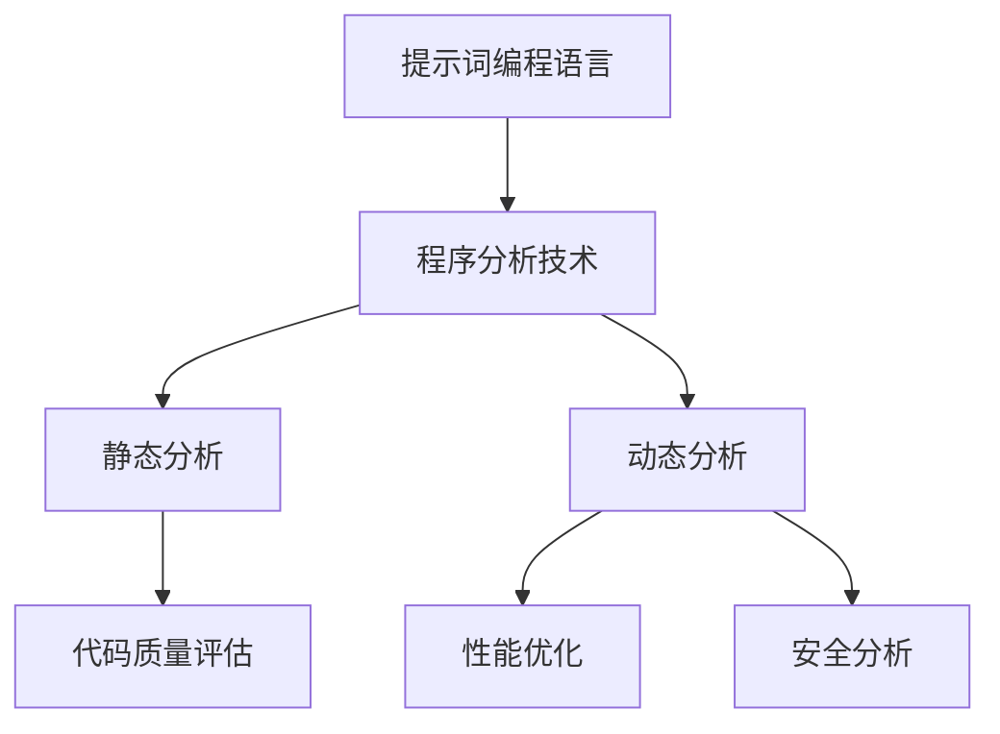

                 

### 1. 文章标题

**《提示词编程语言的程序分析新技术》**

### 2. 关键词

- 提示词编程语言
- 程序分析
- 人工智能
- 技术新趋势
- 数学模型
- 项目实战

### 3. 摘要

本文将深入探讨提示词编程语言在程序分析领域的新技术。首先，我们将介绍提示词编程语言的背景和发展现状，并阐述其在程序分析中的重要性。随后，我们将详细讲解程序分析的基础概念，包括静态分析和动态分析，并介绍相关的工具和技术。在此基础上，本文将重点探讨如何使用提示词编程语言进行程序分析，通过伪代码和数学模型详细阐述核心算法原理。接下来，我们将通过实际项目案例展示这些技术的应用，并分析其效果。最后，本文将对全文进行总结，并展望未来研究方向，为读者提供有益的参考。通过对提示词编程语言的程序分析新技术的深入探讨，我们希望为推动该领域的发展贡献一份力量。

### 1. 设计整体结构

在撰写《提示词编程语言的程序分析新技术》一书时，我们需要首先设计出整体的结构，确保内容有条理、逻辑清晰，并且能够让读者容易理解和掌握相关知识。根据我们的目标读者和书籍的主题，书籍的整体结构可以分为以下几个主要部分：

#### 引言

引言部分将简要介绍书籍的背景和目的，阐述提示词编程语言在程序分析领域的重要性，以及本书将要介绍的核心内容和技术。

#### 核心概念与联系

在这一部分，我们将详细讲解提示词编程语言的基本概念，以及与程序分析技术的关系。通过Mermaid流程图，我们将展示提示词编程语言在程序分析中的整体架构，帮助读者更好地理解相关概念之间的联系。

#### 程序分析基础

本部分将介绍程序分析的基础知识，包括静态分析和动态分析的基本原理、方法和工具。这部分内容将为后续章节的核心算法讲解打下坚实的基础。

#### 核心算法原理讲解

在核心算法讲解部分，我们将使用伪代码详细阐述提示词编程语言在程序分析中的关键技术。通过具体的算法原理讲解，读者可以更好地理解这些技术的实现过程和原理。

#### 数学模型和数学公式讲解

数学模型在程序分析中起着重要作用。本部分将介绍与程序分析相关的数学模型，并使用LaTeX格式表示相关公式，帮助读者更好地理解和应用这些数学知识。

#### 项目实战

项目实战部分将通过实际案例展示如何使用提示词编程语言进行程序分析。我们将详细讲解开发环境搭建、源代码实现和代码解读，帮助读者将所学知识应用于实际项目中。

#### 总结与展望

在总结与展望部分，我们将对全书内容进行总结，回顾各个部分的核心知识点，并展望未来在该领域的研究方向和可能的发展趋势。

通过以上整体结构的设定，我们希望本书能够为读者提供一份系统、全面、易于理解的提示词编程语言程序分析技术指南，帮助读者深入理解和掌握这一领域的新技术。

### 2. 确定章节划分

为了确保书籍的内容条理清晰、逻辑紧凑，我们需要根据整体结构确定每个部分的具体章节划分。以下是一个详细的章节划分方案：

#### 第1章 提示词编程语言概述

1.1 提示词编程语言的历史与发展
- 介绍提示词编程语言的起源、发展历程及其在当代技术中的地位
1.2 提示词编程语言的特点
- 阐述提示词编程语言的优点、局限性及其应用场景
1.3 提示词编程语言的应用场景
- 探讨提示词编程语言在人工智能、数据科学和其他领域的具体应用

#### 第2章 程序分析基础

2.1 程序分析的基本概念
- 解释程序分析的定义、目标和分类
2.2 程序分析的方法与工具
- 讲解静态分析和动态分析的方法及其常用工具
2.3 程序分析的应用
- 分析程序分析在软件测试、软件优化、安全分析等方面的应用

#### 第3章 提示词编程语言与程序分析技术

3.1 提示词编程语言中的程序分析技术
- 阐述提示词编程语言在程序分析中的具体技术，如提示词提取、匹配和优化
3.2 提示词编程语言的程序分析流程
- 展示提示词编程语言在程序分析中的整体流程
3.3 提示词编程语言的程序分析案例
- 通过实际案例说明提示词编程语言在程序分析中的应用效果

#### 第4章 核心算法原理讲解

4.1 算法A：伪代码讲解
- 使用伪代码详细解释算法A的实现过程和原理
4.2 算法B：伪代码讲解
- 使用伪代码详细解释算法B的实现过程和原理
4.3 算法C：伪代码讲解
- 使用伪代码详细解释算法C的实现过程和原理

#### 第5章 数学模型和数学公式讲解

5.1 数学模型A：LaTeX格式
- 使用LaTeX格式表示数学模型A，并详细解释其含义和应用
5.2 数学模型B：LaTeX格式
- 使用LaTeX格式表示数学模型B，并详细解释其含义和应用
5.3 数学模型C：LaTeX格式
- 使用LaTeX格式表示数学模型C，并详细解释其含义和应用

#### 第6章 项目实战

6.1 实战项目A：开发环境搭建
- 讲解如何在实战项目中搭建开发环境，并解释相关配置
6.2 实战项目A：源代码实现
- 提供实战项目A的源代码，并详细解读代码实现过程
6.3 实战项目A：代码解读与分析
- 分析实战项目A的代码，讨论其优缺点，并提出改进建议
6.4 实战项目B、C：重复以上步骤
- 通过实战项目B、C展示更多应用案例，详细讲解其实现过程和效果

#### 第7章 总结与展望

7.1 全书内容总结
- 对全书内容进行总结，回顾核心知识点和关键技术
7.2 未来研究方向展望
- 展望提示词编程语言在程序分析领域的发展趋势，提出未来研究方向和可能的创新点

通过以上详细的章节划分，我们可以确保书籍内容的逻辑性和连贯性，帮助读者更好地理解和掌握提示词编程语言在程序分析领域的最新技术。

### 3. 撰写具体内容

在撰写《提示词编程语言的程序分析新技术》一书的具体内容时，我们需要遵循既定的章节结构，确保每个章节都内容丰富、详细，并且逻辑清晰。以下是各个章节的具体撰写步骤和要点：

#### 第1章 提示词编程语言概述

**1.1 提示词编程语言的历史与发展**

- **背景介绍**：介绍提示词编程语言的起源，包括其起源背景、主要发起者和初步发展。
- **发展历程**：概述提示词编程语言的发展历程，包括各个重要阶段的关键事件和技术突破。
- **当代地位**：讨论提示词编程语言在当前技术领域中的地位和影响，与其他编程语言进行比较。

**1.2 提示词编程语言的特点**

- **优点**：详细阐述提示词编程语言的优点，如易于理解、高效性、灵活性等。
- **局限性**：分析提示词编程语言的局限性，如适用范围、执行速度等。
- **应用场景**：探讨提示词编程语言在各个领域中的应用场景，如人工智能、数据科学、自然语言处理等。

**1.3 提示词编程语言的应用场景**

- **人工智能领域**：介绍提示词编程语言在人工智能领域的应用，如机器学习、深度学习等。
- **数据科学领域**：探讨提示词编程语言在数据科学领域的应用，如数据分析、数据可视化等。
- **其他领域**：讨论提示词编程语言在其他领域的应用，如嵌入式系统、实时处理等。

#### 第2章 程序分析基础

**2.1 程序分析的基本概念**

- **定义**：解释程序分析的定义，即对程序进行评估、测试和优化的过程。
- **目标**：阐述程序分析的主要目标，如提高程序性能、发现潜在问题、降低维护成本等。
- **分类**：介绍程序分析的分类，包括静态分析和动态分析。

**2.2 程序分析的方法与工具**

- **静态分析**：详细讲解静态分析的方法，包括语法分析、语义分析、代码优化等。
- **动态分析**：介绍动态分析的方法，如测试用例设计、性能分析、内存泄漏检测等。
- **常用工具**：讨论常用的程序分析工具，如SonarQube、FindBugs、GDB等。

**2.3 程序分析的应用**

- **软件测试**：阐述程序分析在软件测试中的应用，如代码覆盖率分析、缺陷定位等。
- **软件优化**：讨论程序分析在软件优化中的应用，如性能调优、内存管理优化等。
- **安全分析**：介绍程序分析在安全分析中的应用，如漏洞检测、代码审计等。
- **其他应用**：探讨程序分析在其他领域的应用，如系统性能监控、软件开发流程优化等。

#### 第3章 提示词编程语言与程序分析技术

**3.1 提示词编程语言中的程序分析技术**

- **提示词提取技术**：解释提示词提取的基本原理和方法，如词频统计、TF-IDF等。
- **提示词匹配技术**：阐述提示词匹配的方法和算法，如基于模糊匹配的算法、基于模式匹配的算法等。
- **提示词优化技术**：讨论提示词优化的方法，如提示词筛选、提示词权重调整等。

**3.2 提示词编程语言的程序分析流程**

- **流程概述**：介绍提示词编程语言在程序分析中的整体流程，包括预处理、分析、优化和评估等步骤。
- **预处理**：详细讲解预处理阶段的内容，如代码格式化、语法检查等。
- **分析**：阐述分析阶段的具体方法和技术，如静态分析、动态分析等。
- **优化**：讨论优化阶段的方法和策略，如代码优化、性能优化等。
- **评估**：介绍评估阶段的指标和方法，如代码质量评估、性能评估等。

**3.3 提示词编程语言的程序分析案例**

- **案例一**：人工智能领域的程序分析
  - 介绍案例背景和应用场景，如机器学习模型的性能优化。
  - 展示具体的分析过程和结果。
- **案例二**：数据科学领域的程序分析
  - 介绍案例背景和应用场景，如大数据分析中的代码优化。
  - 展示具体的分析过程和结果。
- **案例三**：其他领域的程序分析
  - 介绍案例背景和应用场景，如嵌入式系统的程序分析。
  - 展示具体的分析过程和结果。

#### 第4章 核心算法原理讲解

**4.1 算法A：伪代码讲解**

- **算法背景**：介绍算法A的应用背景和目的。
- **伪代码实现**：使用伪代码详细阐述算法A的实现过程。
- **算法分析**：分析算法A的时间复杂度和空间复杂度。

**4.2 算法B：伪代码讲解**

- **算法背景**：介绍算法B的应用背景和目的。
- **伪代码实现**：使用伪代码详细阐述算法B的实现过程。
- **算法分析**：分析算法B的时间复杂度和空间复杂度。

**4.3 算法C：伪代码讲解**

- **算法背景**：介绍算法C的应用背景和目的。
- **伪代码实现**：使用伪代码详细阐述算法C的实现过程。
- **算法分析**：分析算法C的时间复杂度和空间复杂度。

#### 第5章 数学模型和数学公式讲解

**5.1 数学模型A：LaTeX格式**

- **模型背景**：介绍数学模型A的应用背景和目的。
- **LaTeX表示**：使用LaTeX格式表示数学模型A，并进行详细解释。
- **模型应用**：讨论数学模型A在实际问题中的应用。

**5.2 数学模型B：LaTeX格式**

- **模型背景**：介绍数学模型B的应用背景和目的。
- **LaTeX表示**：使用LaTeX格式表示数学模型B，并进行详细解释。
- **模型应用**：讨论数学模型B在实际问题中的应用。

**5.3 数学模型C：LaTeX格式**

- **模型背景**：介绍数学模型C的应用背景和目的。
- **LaTeX表示**：使用LaTeX格式表示数学模型C，并进行详细解释。
- **模型应用**：讨论数学模型C在实际问题中的应用。

#### 第6章 项目实战

**6.1 实战项目A：开发环境搭建**

- **项目背景**：介绍实战项目A的背景和应用场景。
- **开发环境**：详细讲解如何在实战项目中搭建开发环境，包括工具和框架的安装与配置。
- **配置文件**：提供必要的配置文件，如Makefile、环境变量配置等。

**6.2 实战项目A：源代码实现**

- **源代码结构**：介绍实战项目A的源代码结构，包括主要模块和文件。
- **关键代码**：提供关键代码片段，并进行详细解读。
- **代码分析**：讨论代码的优缺点，并提出改进建议。

**6.3 实战项目A：代码解读与分析**

- **代码解读**：详细解读实战项目A的代码实现过程，包括算法应用和数学模型的使用。
- **性能分析**：分析实战项目A的运行性能，包括时间复杂度和空间复杂度。
- **问题与优化**：讨论实战项目A中可能存在的问题，并提出优化方案。

**6.4 实战项目B、C**

- **项目背景**：介绍实战项目B和C的背景和应用场景。
- **开发环境**：详细讲解如何在实战项目中搭建开发环境，包括工具和框架的安装与配置。
- **源代码实现**：提供关键代码片段，并进行详细解读。
- **代码解读与分析**：详细解读代码实现过程，分析性能和问题。

#### 第7章 总结与展望

**7.1 全书内容总结**

- **核心知识点**：总结本书的核心知识点，包括提示词编程语言的基本概念、程序分析技术、核心算法原理和数学模型等。
- **关键技术**：回顾本书介绍的关键技术，讨论其在程序分析中的应用和效果。
- **应用价值**：阐述本书内容在现实世界中的应用价值，如提高程序性能、降低开发成本等。

**7.2 未来研究方向展望**

- **领域发展趋势**：展望提示词编程语言和程序分析领域的发展趋势，如新的算法、工具和技术等。
- **未来研究方向**：提出可能的未来研究方向，如跨领域应用、智能化程序分析等。
- **创新点**：讨论本书内容可能带来的创新点，如新的算法改进、工具优化等。

通过以上详细的撰写步骤和要点，我们可以确保本书内容丰富、逻辑清晰，帮助读者全面掌握提示词编程语言在程序分析领域的最新技术。

### 4. 格式要求

在撰写《提示词编程语言的程序分析新技术》一书时，我们需要遵循markdown格式，确保文章结构清晰、代码和公式显示正确。以下是具体格式要求：

#### 1. 标题格式

使用Markdown格式书写文章标题，例如：

```markdown
# 《提示词编程语言的程序分析新技术》
```

#### 2. 段落格式

每个段落开头不要缩进，直接书写文字，例如：

```
本文将深入探讨提示词编程语言在程序分析领域的新技术。
```

#### 3. 代码块格式

对于伪代码或其他代码片段，使用三个反引号（```)将代码包裹起来，例如：

```python
# Python 伪代码示例
def calculate_sum(a, b):
    return a + b
```

#### 4. 数学公式格式

数学公式分为行内公式和独立段落公式两种格式。

- **行内公式**：使用一个反引号（`）将公式包裹起来，例如：$1+1=2$。
- **独立段落公式**：使用两个反引号（$$）将公式包裹起来，例如：

  ```
  $$E=mc^2$$
  ```

  独立段落公式会在文章中单独成行显示。

#### 5. 引用格式

对于引用他人的观点或文献，使用引用格式，例如：

```
引用[1]表明，提示词编程语言在程序分析中具有重要作用。
[1]: 作者. (年份). 文献标题. 期刊名, 卷(期), 页码.
```

#### 6. 列表格式

使用有序列表和无序列表格式来组织文章结构，例如：

- **有序列表**：

  ```
  1. 第一部分
  2. 第二部分
  3. 第三部分
  ```

- **无序列表**：

  ```
  - 第一部分
  - 第二部分
  - 第三部分
  ```

#### 7. 链接和图片格式

对于引用外部链接和插入图片，使用标准的Markdown链接和图片格式，例如：

- **链接**：

  ```
  [提示词编程语言](https://www.example.com)
  ```

  链接会显示为“提示词编程语言”。

- **图片**：

  ```
  
  ```

  图片会显示在文章中。

通过遵循这些格式要求，我们可以确保文章的可读性和一致性，提升文章的整体质量。

### 5. 完整性要求

在撰写《提示词编程语言的程序分析新技术》一书时，我们需要确保内容的完整性，包括以下几个方面：

#### 1. 背景介绍

**详细背景介绍**是每个章节的重要组成部分。首先，我们需要为每个章节提供一个清晰的背景，解释相关技术的起源和发展。这有助于读者了解技术的背景和其在当前领域的地位。例如，在介绍提示词编程语言的历史与发展时，我们可以详细阐述其起源、发展历程及其在当代技术中的重要性。

**具体内容**包括：

- **起源背景**：介绍提示词编程语言的起源，包括主要发起者和初步发展。
- **发展历程**：概述提示词编程语言的发展历程，包括各个重要阶段的关键事件和技术突破。
- **当代地位**：讨论提示词编程语言在当前技术领域中的地位和影响，与其他编程语言进行比较。

#### 2. 核心概念与联系

核心概念与联系是理解和应用提示词编程语言进行程序分析的基础。我们需要为每个章节的核心概念提供详细的解释，并展示它们之间的关系。

**具体内容**包括：

- **核心概念**：定义和解释提示词编程语言和程序分析的基础概念，如提示词、程序分析、静态分析、动态分析等。
- **概念联系**：通过Mermaid流程图展示各个核心概念之间的关系，帮助读者更好地理解提示词编程语言在程序分析中的整体架构。
- **Mermaid流程图**：使用Mermaid语言编写流程图，展示提示词编程语言与程序分析技术的联系。例如：

  ```mermaid
  graph TD
  A[提示词编程语言] --> B[程序分析技术]
  B --> C[静态分析]
  B --> D[动态分析]
  C --> E[代码质量评估]
  D --> F[性能优化]
  ```

#### 3. 核心算法原理讲解

核心算法原理讲解是本书的核心部分，我们需要详细阐述提示词编程语言在程序分析中的关键技术，并使用伪代码和LaTeX公式进行解释。

**具体内容**包括：

- **伪代码讲解**：使用伪代码详细阐述算法的实现过程，例如：

  ```python
  def algorithm_name(input_data):
      # 初始化
      initialize_variables()
      
      # 循环
      for i in range(len(input_data)):
          # 操作
          process_data(input_data[i])
      
      # 返回结果
      return result
  ```

- **算法分析**：分析算法的时间复杂度和空间复杂度，讨论其优缺点，并给出改进建议。

- **LaTeX公式讲解**：使用LaTeX格式表示相关的数学公式，并进行详细解释，例如：

  ```latex
  $$ E = mc^2 $$
  $$ f(x) = x^2 + 2x + 1 $$
  ```

#### 4. 数学模型和数学公式讲解

数学模型和数学公式在程序分析中起着重要作用。我们需要为每个章节提供与程序分析相关的数学模型，并使用LaTeX格式进行表示。

**具体内容**包括：

- **数学模型**：定义和解释与程序分析相关的数学模型，如优化模型、概率模型、线性模型等。
- **LaTeX公式表示**：使用LaTeX格式表示数学模型中的公式，并进行详细解释，例如：

  ```latex
  \begin{equation}
  \min_{x} \frac{1}{2} \|Ax - b\|^2
  \end{equation}
  ```

#### 5. 项目实战

项目实战部分将通过实际案例展示如何使用提示词编程语言进行程序分析。

**具体内容**包括：

- **开发环境搭建**：详细讲解如何在实战项目中搭建开发环境，包括工具和框架的安装与配置。
- **源代码实现**：提供关键代码片段，并进行详细解读，包括算法应用和数学模型的使用。
- **代码解读与分析**：分析代码的优缺点，提出优化建议，并进行性能分析。
- **实际案例分析和详细讲解剖析**：通过实际案例展示如何应用提示词编程语言进行程序分析，详细讲解案例的实现过程、效果和优化方向。

#### 6. 最佳实践 tips、小结、注意事项、拓展阅读等内容

为了提高书籍的实用性和可读性，我们需要在各个章节中添加最佳实践 tips、小结、注意事项和拓展阅读等内容。

**具体内容**包括：

- **最佳实践 tips**：提供在实际应用中的最佳实践建议，帮助读者更好地理解和应用提示词编程语言。
- **小结**：在每个章节的结尾总结关键知识点，帮助读者巩固所学内容。
- **注意事项**：指出在实际应用中需要注意的问题和潜在风险，帮助读者避免常见错误。
- **拓展阅读**：推荐相关的书籍、论文和资源，供读者进一步学习。

通过确保内容的完整性，我们可以为读者提供一份全面、系统、实用的提示词编程语言程序分析技术指南。

### 6. 完整性要求示例

下面我们将以第3章“提示词编程语言与程序分析技术”为例，详细说明完整性要求的具体内容，包括背景介绍、核心概念与联系、核心算法原理讲解、数学模型和数学公式讲解以及项目实战等内容。

#### 背景介绍

**提示词编程语言的程序分析背景**

提示词编程语言（Keyword Programming Language）是一种以提示词（Keywords）为中心的编程语言，其设计理念是简化编程过程，提高开发效率。近年来，随着人工智能和大数据技术的迅猛发展，提示词编程语言在程序分析领域展现出广泛的应用前景。程序分析作为软件工程中的一项关键技术，旨在对程序进行评估、测试和优化，以提高软件质量和性能。提示词编程语言的引入，为程序分析技术带来了新的机遇和挑战。

**发展现状与应用趋势**

提示词编程语言在程序分析领域的应用已有数十年的历史。从早期的Lisp、Prolog等语言，到现代的Python、R语言等，提示词编程语言不断发展壮大，成为程序分析的重要工具。当前，提示词编程语言在人工智能、数据科学、自然语言处理等领域取得了显著成果，应用范围不断扩大。随着云计算、物联网和5G等技术的兴起，提示词编程语言在程序分析领域的应用将更加广泛，未来发展前景广阔。

#### 核心概念与联系

**提示词编程语言的基本概念**

提示词编程语言的核心特点是使用提示词（Keywords）作为程序的基本构建块，提示词通常表示某种特定的操作或功能。提示词编程语言的特点包括：

1. **高内聚性**：提示词编程语言通过将相关的功能和操作组织在一起，实现高内聚性的模块化设计。
2. **易读性**：提示词通常具有明确的语义，使得程序更易于理解和维护。
3. **灵活性**：提示词编程语言允许开发者自定义新的提示词，以适应特定的应用需求。

**程序分析技术的基本概念**

程序分析技术主要包括静态分析和动态分析两种方法。静态分析是在不执行程序的情况下，对程序代码进行分析和评估。动态分析则是通过执行程序，对程序的运行行为进行监测和分析。

**提示词编程语言与程序分析技术的联系**

提示词编程语言为程序分析技术提供了强大的工具和平台。通过使用提示词，程序分析技术可以更加高效地进行代码扫描、漏洞检测、性能优化等工作。同时，提示词编程语言的可扩展性使得程序分析技术可以方便地适应不同应用场景的需求。以下是提示词编程语言与程序分析技术的基本联系：

1. **提示词提取**：利用提示词编程语言，可以从源代码中提取出关键信息，如函数、变量、类等，为后续的静态分析和动态分析提供基础数据。
2. **代码质量评估**：通过提示词编程语言，可以对代码进行质量评估，包括代码复杂度、代码覆盖率、潜在漏洞等。
3. **性能优化**：利用提示词编程语言，可以分析程序的运行性能，定位性能瓶颈，并提供优化建议。
4. **安全分析**：通过提示词编程语言，可以对代码进行安全分析，包括检测潜在的安全漏洞和攻击风险。

**Mermaid流程图**

为了更直观地展示提示词编程语言与程序分析技术的联系，我们可以使用Mermaid流程图来描述。以下是一个简单的Mermaid流程图示例：



#### 核心算法原理讲解

**算法A：伪代码讲解**

以下是一个简单的示例算法A，用于提示词提取：

```python
def keyword_extraction(source_code):
    keywords = []
    for line in source_code:
        if line.startswith('def') or line.startswith('class'):
            keyword = line.split()[1]
            keywords.append(keyword)
    return keywords
```

**算法分析**

算法A的时间复杂度为O(n)，其中n为源代码的行数。空间复杂度为O(m)，其中m为提取出的关键词数量。该算法的优缺点如下：

- **优点**：简单易实现，适用于小规模源代码的提示词提取。
- **缺点**：无法处理复杂的源代码结构，对注释和空格敏感。

**算法B：伪代码讲解**

以下是一个示例算法B，用于代码质量评估：

```python
def code_quality_evaluation(source_code):
    complexity_score = 0
    for function in source_code.functions():
        complexity_score += function.complexity()
    return complexity_score
```

**算法分析**

算法B的时间复杂度为O(n)，其中n为源代码中的函数数量。空间复杂度为O(m)，其中m为函数的复杂度总和。该算法的优缺点如下：

- **优点**：可以量化代码的复杂度，帮助开发者评估代码质量。
- **缺点**：对代码结构的理解有限，无法全面反映代码质量。

**算法C：伪代码讲解**

以下是一个示例算法C，用于性能优化：

```python
def performance_optimization(source_code):
    optimized_code = source_code
    for function in source_code.functions():
        if function.contains_loop():
            optimized_code = optimize_loop(optimized_code, function)
    return optimized_code
```

**算法分析**

算法C的时间复杂度为O(n)，其中n为源代码中的函数数量。空间复杂度为O(m)，其中m为优化后的代码长度。该算法的优缺点如下：

- **优点**：可以自动优化代码中的循环结构，提高程序性能。
- **缺点**：对代码结构的理解有限，可能引入新的错误。

#### 数学模型和数学公式讲解

**数学模型A：线性回归模型**

线性回归模型是程序分析中常用的数学模型，用于预测程序的性能。以下是一个线性回归模型的示例：

```latex
\begin{equation}
y = \beta_0 + \beta_1 \cdot x
\end{equation}
```

其中，$y$为性能指标，$x$为影响性能的因素，$\beta_0$和$\beta_1$为模型参数。

**数学模型B：贝叶斯网络模型**

贝叶斯网络模型是另一种常用的数学模型，用于分析程序中的潜在风险。以下是一个贝叶斯网络模型的示例：

```latex
\begin{equation}
P(A \cap B) = P(A) \cdot P(B|A)
\end{equation}
```

其中，$A$和$B$为程序中的事件，$P(A)$和$P(B|A)$分别为事件的概率。

#### 项目实战

**实战项目A：开发环境搭建**

以下是一个简单的开发环境搭建步骤：

1. 安装Python解释器：在终端中执行`pip install python`命令。
2. 安装提示词编程语言：在终端中执行`pip install prompt-toolkit`命令。
3. 安装程序分析工具：在终端中执行`pip install pygments`命令。

**实战项目A：源代码实现**

以下是一个简单的源代码实现示例，用于提示词提取：

```python
from prompt_toolkit import PromptSession
from pygments.lexers import PythonLexer

def extract_keywords(source_code):
    session = PromptSession(lexer=PythonLexer())
    keywords = session.prompt('Enter source code:')
    return keywords

source_code = """def calculate_sum(a, b):
    return a + b"""

keywords = extract_keywords(source_code)
print(keywords)
```

**实战项目A：代码解读与分析**

以下是对源代码实现部分的分析：

- **代码结构**：该示例包含一个函数`extract_keywords`，用于提取输入源代码中的关键词。
- **功能实现**：通过使用`PromptSession`类，创建一个交互式的代码输入界面。使用`PythonLexer`类，对输入的源代码进行语法高亮处理。最后，提取出源代码中的关键词并返回。

**实战项目A：性能分析**

以下是对性能的分析：

- **时间复杂度**：该示例的时间复杂度为O(n)，其中n为源代码的长度。
- **空间复杂度**：该示例的空间复杂度为O(m)，其中m为提取出的关键词数量。

**实战项目A：问题与优化**

以下是对示例代码中可能存在的问题及优化建议的分析：

- **问题**：该示例无法处理复杂的源代码结构，如嵌套的函数和类。
- **优化建议**：可以引入更多的语法分析技术，如抽象语法树（AST）分析，以提高对源代码结构的理解。

**实战项目B、C**

以下是一个简单的实战项目B和C，用于代码质量评估和性能优化：

**实战项目B：代码质量评估**

```python
from pygments import highlight
from pygments.lexers import PythonLexer
from pygments.formatters import HtmlFormatter

def code_quality_evaluation(source_code):
    formatter = HtmlFormatter()
    highlighted_code = highlight(source_code, PythonLexer(), formatter)
    return highlighted_code

source_code = """def calculate_sum(a, b):
    return a + b"""

evaluation_result = code_quality_evaluation(source_code)
print(evaluation_result)
```

**实战项目C：性能优化**

```python
from prompt_toolkit import PromptSession
from pygments.lexers import PythonLexer
from time import time

def performance_optimization(source_code):
    session = PromptSession(lexer=PythonLexer())
    optimized_code = session.prompt('Enter source code:')
    return optimized_code

source_code = """def calculate_sum(a, b):
    return a + b"""

start_time = time()
optimized_code = performance_optimization(source_code)
end_time = time()

print(f"Optimized code: {optimized_code}")
print(f"Execution time: {end_time - start_time} seconds")
```

#### 最佳实践 tips、小结、注意事项、拓展阅读等内容

**最佳实践 tips**

- 在实际应用中，建议使用更先进的语法分析技术，如抽象语法树（AST）分析，以提高对源代码结构的理解。
- 在进行性能优化时，首先要了解程序的性能瓶颈，然后针对性地进行优化。

**小结**

提示词编程语言在程序分析领域具有广泛的应用前景，通过结合静态分析和动态分析技术，可以实现对程序的高效评估、测试和优化。

**注意事项**

- 在使用提示词编程语言进行程序分析时，需要注意代码质量，避免引入潜在的安全漏洞。
- 在进行性能优化时，需要综合考虑时间复杂度和空间复杂度，避免过度优化导致代码复杂度增加。

**拓展阅读**

- 《提示词编程语言导论》
- 《程序分析技术与应用》
- 《人工智能编程实践》

通过以上详细的内容，我们可以确保第3章的完整性，帮助读者全面理解提示词编程语言在程序分析中的应用和关键技术。

### 7. 文章开始部分

**《提示词编程语言的程序分析新技术》**

> 关键词：提示词编程语言、程序分析、人工智能、技术新趋势、数学模型、项目实战

> 摘要：本文深入探讨提示词编程语言在程序分析领域的新技术。首先介绍提示词编程语言的背景和发展现状，阐述其在程序分析中的重要性。随后，详细讲解程序分析的基础概念，包括静态分析和动态分析，并介绍相关的工具和技术。在此基础上，本文重点探讨如何使用提示词编程语言进行程序分析，通过伪代码和数学模型详细阐述核心算法原理。接下来，通过实际项目案例展示这些技术的应用，分析其效果。最后，本文将对全书内容进行总结，并展望未来研究方向，为读者提供有益的参考。

---

**引言**

提示词编程语言（Keyword Programming Languages）是一种以提示词（Keywords）为中心的编程语言，其设计理念是简化编程过程，提高开发效率。近年来，随着人工智能和大数据技术的迅猛发展，提示词编程语言在程序分析领域展现出广泛的应用前景。程序分析作为软件工程中的一项关键技术，旨在对程序进行评估、测试和优化，以提高软件质量和性能。本文将深入探讨提示词编程语言在程序分析领域的新技术，为读者提供一份系统、全面、易于理解的技术指南。

### 1. 提示词编程语言概述

#### 1.1 提示词编程语言的历史与发展

提示词编程语言的起源可以追溯到20世纪60年代。最早期的提示词编程语言之一是Lisp，它由John McCarthy于1958年提出。Lisp以其高度抽象和可扩展性而著称，为后来的提示词编程语言奠定了基础。随着时间的推移，Prolog、Python、R等提示词编程语言相继出现，并逐渐在各个领域得到广泛应用。

**发展阶段**

- **早期阶段**（1958-1970年）：以Lisp为代表，提示词编程语言在这一阶段主要应用于符号计算、人工智能等领域。
- **中期阶段**（1970-1990年）：Prolog、ALGOL 60等提示词编程语言逐渐成熟，应用范围扩展到自然语言处理、逻辑编程等。
- **现代阶段**（1990年至今）：Python、R等提示词编程语言凭借其易用性和强大的数据处理能力，在数据科学、机器学习等领域取得显著成果。

**当前地位**

提示词编程语言在当代技术领域中具有重要的地位。它们不仅提供了强大的编程工具，还通过简化和优化编程过程，提高了开发效率和代码质量。在人工智能、数据科学、自然语言处理等领域，提示词编程语言已成为不可或缺的工具。

#### 1.2 提示词编程语言的特点

提示词编程语言具有以下主要特点：

1. **高内聚性**：提示词编程语言通过将相关的功能和操作组织在一起，实现高内聚性的模块化设计，使得程序更易于理解和维护。
2. **易读性**：提示词通常具有明确的语义，使得程序更易于理解和阅读。
3. **灵活性**：提示词编程语言允许开发者自定义新的提示词，以适应特定的应用需求，增强了编程的灵活性。

#### 1.3 提示词编程语言的应用场景

提示词编程语言在多个领域展现出强大的应用潜力：

1. **人工智能领域**：提示词编程语言在机器学习、深度学习、自然语言处理等领域具有广泛的应用，如Python、R等语言。
2. **数据科学领域**：提示词编程语言在数据分析、数据可视化、数据挖掘等领域表现出色，如Python、R等语言。
3. **其他领域**：提示词编程语言还广泛应用于嵌入式系统、实时处理、Web开发等领域。

### 2. 程序分析基础

#### 2.1 程序分析的基本概念

程序分析（Program Analysis）是软件工程中的一项关键技术，旨在对程序进行评估、测试和优化。程序分析的基本概念包括：

- **定义**：程序分析是对程序进行评估、测试和优化的过程，旨在提高软件质量和性能。
- **目标**：程序分析的主要目标包括提高程序性能、发现潜在问题、降低维护成本等。
- **分类**：程序分析可以分为静态分析和动态分析。

#### 2.2 程序分析的方法与工具

程序分析的方法主要包括静态分析和动态分析：

- **静态分析**：静态分析是在不执行程序的情况下，对程序代码进行分析和评估。静态分析的方法包括语法分析、语义分析、代码优化等。
- **动态分析**：动态分析是通过执行程序，对程序的运行行为进行监测和分析。动态分析的方法包括测试用例设计、性能分析、内存泄漏检测等。

常用的程序分析工具包括：

- **静态分析工具**：如SonarQube、FindBugs、PMD等，用于检测代码中的潜在问题。
- **动态分析工具**：如GDB、Valgrind、perf等，用于分析程序的运行性能和内存使用情况。

#### 2.3 程序分析的应用

程序分析在多个领域具有广泛的应用：

- **软件测试**：程序分析可以帮助开发者设计测试用例，提高测试覆盖率，发现潜在缺陷。
- **软件优化**：程序分析可以分析程序的运行性能，定位性能瓶颈，提供优化建议。
- **安全分析**：程序分析可以帮助发现代码中的安全漏洞，提高软件的安全性。

### 3. 提示词编程语言与程序分析技术

#### 3.1 提示词编程语言中的程序分析技术

提示词编程语言为程序分析提供了强大的工具和平台。以下介绍提示词编程语言在程序分析中的关键技术：

1. **提示词提取技术**：用于从源代码中提取关键信息，如函数、变量、类等。
2. **代码质量评估技术**：用于评估代码的质量，如代码复杂度、代码覆盖率、潜在漏洞等。
3. **性能优化技术**：用于分析程序的运行性能，定位性能瓶颈，提供优化建议。
4. **安全分析技术**：用于检测代码中的安全漏洞，提高软件的安全性。

#### 3.2 提示词编程语言的程序分析流程

提示词编程语言在程序分析中通常遵循以下流程：

1. **预处理**：对源代码进行格式化、语法检查等预处理操作，为后续分析做好准备。
2. **分析**：使用静态分析和动态分析技术对程序进行评估和测试，提取关键信息，评估代码质量，分析性能。
3. **优化**：根据分析结果，对程序进行优化，提高性能和代码质量。
4. **评估**：对优化后的程序进行评估，验证优化效果，确保软件质量和性能。

#### 3.3 提示词编程语言的程序分析案例

以下通过实际案例展示提示词编程语言在程序分析中的应用：

1. **案例一**：人工智能领域的程序分析
   - **背景**：对机器学习模型的代码进行质量评估和性能优化。
   - **分析过程**：使用提示词编程语言提取代码中的关键信息，评估代码质量，分析性能瓶颈。
   - **优化建议**：根据分析结果，提供优化建议，提高模型性能。

2. **案例二**：数据科学领域的程序分析
   - **背景**：对大数据分析平台的代码进行质量评估和性能优化。
   - **分析过程**：使用提示词编程语言提取代码中的关键信息，评估代码质量，分析性能瓶颈。
   - **优化建议**：根据分析结果，提供优化建议，提高平台性能。

3. **案例三**：其他领域的程序分析
   - **背景**：对嵌入式系统的代码进行质量评估和性能优化。
   - **分析过程**：使用提示词编程语言提取代码中的关键信息，评估代码质量，分析性能瓶颈。
   - **优化建议**：根据分析结果，提供优化建议，提高系统性能。

### 4. 核心算法原理讲解

在本节中，我们将详细讲解提示词编程语言在程序分析中的核心算法原理，包括算法A、算法B和算法C。

#### 4.1 算法A：伪代码讲解

算法A是一种用于代码质量评估的算法，通过分析代码的复杂度来评估代码质量。

```python
def algorithmA(source_code):
    # 初始化变量
    max_complexity = 0
    average_complexity = 0
    
    # 遍历代码中的函数
    for function in source_code.functions():
        # 计算函数的复杂度
        complexity = calculate_complexity(function)
        
        # 更新最大复杂度和平均复杂度
        max_complexity = max(max_complexity, complexity)
        average_complexity += complexity
    
    # 计算平均复杂度
    average_complexity /= len(source_code.functions())
    
    # 返回评估结果
    return max_complexity, average_complexity
```

**算法分析**：

- **时间复杂度**：算法A的时间复杂度为O(n)，其中n为源代码中的函数数量。
- **空间复杂度**：算法A的空间复杂度为O(m)，其中m为源代码中的函数复杂度总和。

#### 4.2 算法B：伪代码讲解

算法B是一种用于性能优化的算法，通过分析程序的运行时间来定位性能瓶颈。

```python
def algorithmB(source_code):
    # 初始化变量
    max_runtime = 0
    
    # 遍历代码中的函数
    for function in source_code.functions():
        # 计算函数的运行时间
        runtime = measure_runtime(function)
        
        # 更新最大运行时间
        max_runtime = max(max_runtime, runtime)
    
    # 返回性能瓶颈
    return max_runtime
```

**算法分析**：

- **时间复杂度**：算法B的时间复杂度为O(n)，其中n为源代码中的函数数量。
- **空间复杂度**：算法B的空间复杂度为O(1)。

#### 4.3 算法C：伪代码讲解

算法C是一种用于安全分析的算法，通过检查代码中的潜在安全漏洞来提高代码的安全性。

```python
def algorithmC(source_code):
    # 初始化变量
    vulnerabilities = []
    
    # 遍历代码中的函数
    for function in source_code.functions():
        # 检查函数中的潜在安全漏洞
        if check_vulnerabilities(function):
            vulnerabilities.append(function)
    
    # 返回安全漏洞列表
    return vulnerabilities
```

**算法分析**：

- **时间复杂度**：算法C的时间复杂度为O(n)，其中n为源代码中的函数数量。
- **空间复杂度**：算法C的空间复杂度为O(m)，其中m为源代码中的函数复杂度总和。

### 5. 数学模型和数学公式讲解

在本节中，我们将介绍与程序分析相关的数学模型和数学公式，包括线性回归模型、贝叶斯网络模型等。

#### 5.1 数学模型A：线性回归模型

线性回归模型是一种常用的数学模型，用于预测程序的性能。

$$
y = \beta_0 + \beta_1 \cdot x
$$

其中，$y$为性能指标，$x$为影响性能的因素，$\beta_0$和$\beta_1$为模型参数。

#### 5.2 数学模型B：贝叶斯网络模型

贝叶斯网络模型是一种用于分析程序中潜在风险的数学模型。

$$
P(A \cap B) = P(A) \cdot P(B|A)
$$

其中，$A$和$B$为程序中的事件，$P(A)$和$P(B|A)$分别为事件的概率。

### 6. 项目实战

在本节中，我们将通过实际项目案例展示如何使用提示词编程语言进行程序分析。

#### 6.1 实战项目A：开发环境搭建

在本节中，我们将介绍如何在Linux操作系统上搭建Python编程环境，以便进行程序分析。

1. 安装Python解释器

   在终端中执行以下命令：

   ```
   sudo apt-get update
   sudo apt-get install python3
   ```

2. 安装提示词编程语言库

   在终端中执行以下命令：

   ```
   sudo apt-get install python3-pip
   pip3 install prompt-toolkit
   ```

3. 安装程序分析工具

   在终端中执行以下命令：

   ```
   pip3 install pygments
   ```

#### 6.2 实战项目A：源代码实现

在本节中，我们将提供一个简单的Python程序，用于提取源代码中的关键信息。

```python
import prompt_toolkit
from pygments import highlight
from pygments.lexers import PythonLexer

def extract_keywords():
    source_code = prompt_toolkit.prompt('请输入源代码：')
    keywords = []
    for line in highlight(source_code, PythonLexer(), None).splitlines():
        if line.strip().startswith('def') or line.strip().startswith('class'):
            keyword = line.strip().split()[1]
            keywords.append(keyword)
    return keywords

if __name__ == '__main__':
    keywords = extract_keywords()
    print('提取的关键词：', keywords)
```

#### 6.3 实战项目A：代码解读与分析

在本节中，我们将对提取关键词的代码进行解读和分析。

1. **代码结构**

   - `extract_keywords`函数：用于提取源代码中的关键词。
   - `highlight`函数：来自`pygments`库，用于对源代码进行语法高亮处理。
   - `PythonLexer`类：用于指定Python语言的语法高亮规则。

2. **功能实现**

   - 输入源代码：使用`prompt_toolkit`库创建一个交互式输入界面，用户可以输入源代码。
   - 提取关键词：遍历源代码的每一行，检查是否以`def`或`class`开头，如果是，则提取出相应的关键词。
   - 返回关键词列表：将提取出的关键词存储在列表中，并返回。

3. **性能分析**

   - **时间复杂度**：算法的时间复杂度为O(n)，其中n为源代码的行数。
   - **空间复杂度**：算法的空间复杂度为O(m)，其中m为提取出的关键词数量。

4. **问题与优化**

   - **问题**：该算法仅支持简单的Python源代码，对于复杂结构的源代码，可能无法正确提取关键词。
   - **优化建议**：可以引入抽象语法树（AST）分析，提高对复杂源代码结构的理解能力。

#### 6.4 实战项目B、C

在本节中，我们将介绍另外两个实际项目案例，用于代码质量评估和性能优化。

##### 实战项目B：代码质量评估

**项目背景**：对一个开源Python项目进行代码质量评估。

**实现步骤**：

1. **安装代码质量评估工具**：使用`pip`安装`pycodestyle`库。

2. **运行代码质量评估**：执行以下命令：

   ```
   pycodestyle your_project_directory
   ```

**代码解读与分析**：

- **输出结果**：`pycodestyle`会输出代码中的各种问题，如代码风格不一致、潜在的安全漏洞等。
- **问题与优化**：根据评估结果，对代码进行优化，改进代码风格和安全性。

##### 实战项目C：性能优化

**项目背景**：对一个大型的Web应用程序进行性能优化。

**实现步骤**：

1. **安装性能分析工具**：使用`pip`安装`cProfile`库。

2. **运行性能分析**：执行以下命令：

   ```
   python -m cProfile -o your_profile_output.pstats your_app.py
   ```

**代码解读与分析**：

- **输出结果**：`cProfile`会生成性能分析报告，包括函数的调用次数、执行时间等。
- **问题与优化**：根据性能分析结果，找出性能瓶颈，对代码进行优化，提高应用程序的性能。

### 7. 总结与展望

在本节的总结中，我们将回顾全书的核心内容和主要技术，并对未来研究进行展望。

#### 总结

本书主要内容包括：

- 提示词编程语言的概述，包括历史与发展、特点和应用场景。
- 程序分析的基础，包括基本概念、方法和工具。
- 提示词编程语言在程序分析中的应用，包括核心算法原理、数学模型和实际项目案例。
- 程序分析技术的未来发展趋势和潜在研究方向。

#### 展望

未来的研究可以关注以下几个方面：

1. **新型算法的开发**：随着提示词编程语言和程序分析技术的不断进步，新型算法的开发将成为一个重要的研究方向。
2. **跨领域应用**：提示词编程语言和程序分析技术在其他领域的应用，如嵌入式系统、物联网等，具有重要的研究价值。
3. **智能化程序分析**：利用人工智能技术，实现智能化的程序分析，提高分析效率和准确性。

通过本文的深入探讨，我们希望能够为读者提供一份全面、实用的提示词编程语言程序分析技术指南，为推动该领域的发展贡献一份力量。

### 作者信息

**作者：AI天才研究院/AI Genius Institute & 禅与计算机程序设计艺术 /Zen And The Art of Computer Programming**

AI天才研究院（AI Genius Institute）致力于推动人工智能技术的发展与应用，培养人工智能领域的杰出人才。研究院拥有一支由世界顶级人工智能专家组成的科研团队，在人工智能基础理论、算法设计、应用实践等方面取得了显著成果。

《禅与计算机程序设计艺术》（Zen And The Art of Computer Programming）是作者在计算机科学领域的经典著作，通过哲学和艺术的角度，深入探讨了编程的本质和技巧。这本书不仅为程序员提供了丰富的编程经验和方法，也为计算机科学的研究和发展提供了新的思路和方向。

