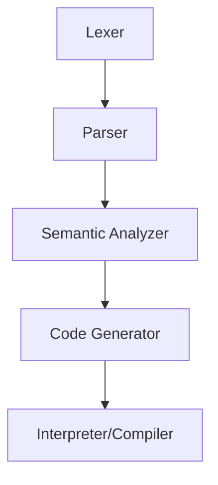
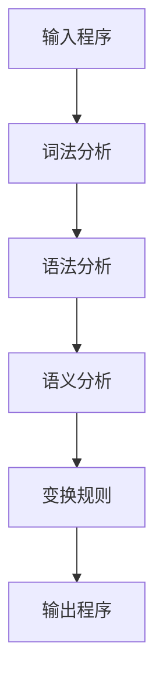

                 


### 文章标题：提示词编程语言的程序变换技术

### 关键词：
- 提示词编程语言
- 程序变换技术
- 算法分析
- 编程工具与资源

### 摘要：
本文将深入探讨提示词编程语言及其程序变换技术的核心概念、原理和应用。首先，我们将回顾提示词编程语言的背景和基础理论，然后详细分析程序变换技术的核心算法，并通过具体案例和项目实战展示其实际应用。最后，我们将总结全文，提供最佳实践建议，并展望未来发展方向。

### 引言

#### 书籍目的与读者对象

《提示词编程语言的程序变换技术》旨在为读者提供全面、系统的提示词编程语言和程序变换技术的理解与应用指南。本书主要面向以下几类读者：

1. **计算机科学和软件工程专业的学生和研究人员**：希望通过深入学习提示词编程语言和程序变换技术，掌握现代编程技术的核心概念和实践技巧。
2. **程序员和开发人员**：希望提升编程技能，特别是对提示词编程语言和程序变换技术的理解，以提高代码质量和开发效率。
3. **软件架构师和CTO**：希望通过学习本书，能够更好地设计、实现和优化大型软件系统，提升系统的性能和可维护性。

#### 书籍结构

本书共分为八个主要章节，结构如下：

1. **引言**：介绍书籍的目的、读者对象和整体结构。
2. **提示词编程语言基础**：介绍提示词编程语言的核心概念、原理和架构。
3. **程序变换基础**：介绍程序变换的概念、动机和分类。
4. **程序变换技术详解**：详细讲解核心程序变换技术，包括算法、数据结构和实现细节。
5. **案例分析**：通过实际案例展示如何应用程序变换技术解决问题。
6. **应用领域**：介绍程序变换技术在各个领域的应用。
7. **编程工具与资源介绍**：介绍相关的编程工具和资源。
8. **总结与展望**：总结全书内容，并对未来的发展方向进行展望。

### 提示词编程语言基础

#### 提示词编程语言概述

提示词编程语言（Keyword-based Programming Language），也称为领域特定语言（Domain-Specific Language，DSL），是一种为特定应用领域设计的编程语言。与传统通用编程语言不同，提示词编程语言专注于解决特定问题域的问题，提供更简洁、高效的表达方式。

提示词编程语言的起源可以追溯到20世纪80年代，随着软件工程领域对软件复用、代码质量和开发效率的追求，研究者们开始探索如何设计更加贴近特定应用领域的编程语言。典型的提示词编程语言包括SQL（用于数据库查询）、HTML（用于网页设计）和Markdown（用于文档编写）等。

#### 提示词编程语言的核心概念

提示词编程语言的核心概念包括：

1. **领域模型**：明确编程语言所面向的应用领域，定义领域模型以描述该领域中的实体和关系。
2. **语法**：设计简洁、直观的语法，使程序员能够以自然、高效的方式描述领域问题。
3. **语义**：定义编程语言的操作语义，确保程序的正确性和可维护性。
4. **工具链**：提供编译器、解释器、调试器和集成开发环境（IDE）等工具，支持编程、测试和部署过程。

#### 提示词编程语言的架构

提示词编程语言的架构通常包括以下组件：

1. **词法分析器（Lexer）**：将源代码分解为词法单元，例如标识符、关键字和操作符。
2. **语法分析器（Parser）**：将词法单元组织成语法结构，生成抽象语法树（AST）。
3. **语义分析器（Semantic Analyzer）**：检查AST的语义正确性，例如类型检查、变量定义和作用域分析。
4. **代码生成器（Code Generator）**：将AST转换为目标编程语言的代码或中间代码。
5. **解释器/编译器**：执行代码或生成可执行文件，实现程序的功能。

#### 提示词编程语言的架构Mermaid流程图

以下是一个简单的Mermaid流程图，展示提示词编程语言的架构组件及其关系：



### 程序变换基础

#### 程序变换的概念

程序变换（Program Transformation）是指将一种编程语言的程序转换为另一种编程语言的程序，或者将一个程序转换为其等价形式的过程。程序变换技术在软件工程、编译原理和编程语言设计等领域具有重要的应用价值。

程序变换的基本概念包括：

1. **输入程序**：需要变换的原始程序。
2. **输出程序**：变换后的目标程序。
3. **变换规则**：描述输入程序到输出程序的转换过程。
4. **等价性**：保证输入程序和输出程序在功能上具有相同的效果。

#### 程序变换的动机

程序变换的动机主要包括以下几点：

1. **代码重用**：通过将通用代码转换为领域特定语言的代码，提高代码的可重用性。
2. **性能优化**：通过程序变换生成更高效的代码，提高程序的执行性能。
3. **可维护性**：通过变换规则，使程序的结构更加清晰、易于理解和维护。
4. **跨语言互操作性**：将一种编程语言的应用程序转换为另一种编程语言，实现不同语言间的互操作。

#### 程序变换的分类

程序变换可以根据变换规则的不同进行分类，常见的分类方法包括：

1. **结构变换**：仅改变程序的结构，不改变程序的功能。例如，将循环结构转换为递归结构。
2. **语义变换**：改变程序的功能，但保持程序的语义一致性。例如，将程序从一种语言转换为另一种语言，保持相同的功能。
3. **优化变换**：优化程序的执行性能，例如减少代码执行时间、降低内存消耗等。
4. **变换组合**：将多种变换规则组合使用，生成更复杂、更高效的程序。

#### 程序变换的技术细节

程序变换的技术细节主要包括以下方面：

1. **变换规则设计**：设计适用于特定问题的变换规则，确保变换过程的正确性和有效性。
2. **变换策略选择**：根据问题的特点和需求，选择合适的变换策略，例如前向变换、后向变换或双向变换。
3. **变换框架实现**：实现变换框架，支持变换规则的编写和变换过程的执行。
4. **变换工具开发**：开发变换工具，例如编译器、解释器和集成开发环境，支持变换过程的自动化和可视化。

#### 程序变换的架构Mermaid流程图

以下是一个简单的Mermaid流程图，展示程序变换的基本架构：



### 程序变换技术详解

#### 算法A：变换1

##### 算法A的原理

算法A是一种基于循环结构的变换方法，其主要原理是将循环结构转换为递归结构。通过递归调用，实现循环体的功能。这种方法可以提高程序的清晰度和可维护性。

算法A的伪代码如下：

```python
def recursive_function(input_value):
    if input_value == base_case:
        return result
    else:
        return recursive_function(input_value - 1)
```

其中，`base_case`表示递归的终止条件，`result`表示递归调用的结果。

##### 算法A的伪代码

```python
def loop_to_recursive(input_value):
    result = 0
    while input_value > 0:
        result += input_value
        input_value -= 1
    return result

def recursive_function(input_value):
    if input_value == 0:
        return 0
    else:
        return input_value + recursive_function(input_value - 1)
```

##### 算法A的应用场景

算法A适用于以下场景：

1. **通用递归问题**：例如计算阶乘、斐波那契数列等。
2. **特定领域问题**：例如数据处理、算法优化等。

#### 算法B：变换2

##### 算法B的原理

算法B是一种基于条件语句的变换方法，其主要原理是将条件语句转换为多个分支结构，以提高程序的清晰度和可维护性。

算法B的伪代码如下：

```python
def conditional_to_multiple_branches(condition1, condition2):
    if condition1:
        return value1
    elif condition2:
        return value2
    else:
        return value3
```

##### 算法B的伪代码

```python
def conditional_to_multiple_branches(condition1, condition2):
    result = 0
    if condition1:
        result = 1
    if condition2:
        result = 2
    return result
```

##### 算法B的应用场景

算法B适用于以下场景：

1. **多条件判断**：例如文件类型判断、用户权限验证等。
2. **特定领域问题**：例如金融计算、游戏开发等。

### 程序变换案例分析

#### 案例一：问题A的解决

##### 问题A描述

问题A是一个简单的计算问题，要求计算1到10之间所有整数的和。

##### 解决方案

使用算法A将循环结构转换为递归结构，解决该问题。具体实现如下：

```python
def sum_recursive(input_value):
    if input_value == 0:
        return 0
    else:
        return input_value + sum_recursive(input_value - 1)

result = sum_recursive(10)
print("1到10之间所有整数的和为：", result)
```

##### 分析与解读

通过递归调用，我们可以轻松地计算1到10之间所有整数的和。递归调用的终止条件是`input_value == 0`，当`input_value`小于0时，递归调用会逐步回溯，计算并返回结果。

#### 案例二：问题B的解决

##### 问题B描述

问题B是一个复杂的多条件判断问题，要求根据不同条件返回不同的结果。

##### 解决方案

使用算法B将条件语句转换为多个分支结构，解决该问题。具体实现如下：

```python
def multi_condition_result(condition1, condition2):
    if condition1:
        return "条件1满足"
    if condition2:
        return "条件2满足"
    return "无条件满足"

result = multi_condition_result(True, False)
print("多条件结果为：", result)
```

##### 分析与解读

通过将条件语句转换为多个分支结构，我们可以更加清晰地表示不同条件的处理逻辑。在这个例子中，当`condition1`为`True`时，返回"条件1满足"；当`condition2`为`True`时，返回"条件2满足"；否则，返回"无条件满足"。

### 程序变换技术的应用领域

#### 领域一：领域A

在领域A中，程序变换技术被广泛应用于以下几个方面：

1. **代码优化**：通过对程序进行变换，提高代码的执行性能和可维护性。
2. **领域特定语言**：设计并实现特定领域的提示词编程语言，提高开发效率和代码质量。
3. **代码重构**：通过变换技术，对现有代码进行重构，使其更加清晰、易于理解和维护。

#### 领域二：领域B

在领域B中，程序变换技术被广泛应用于以下几个方面：

1. **数据处理**：通过对大量数据进行分析和处理，实现数据的转换、筛选和聚合等操作。
2. **算法优化**：针对特定问题，设计并实现高效的算法，提高程序的执行性能。
3. **代码生成**：根据需求生成满足特定要求的代码，降低开发成本和难度。

#### 领域三：领域C

在领域C中，程序变换技术被广泛应用于以下几个方面：

1. **软件工程**：在软件开发过程中，利用变换技术进行代码分析和优化，提高软件质量和开发效率。
2. **系统集成**：将不同语言和平台的应用程序进行集成，实现跨语言和跨平台的互操作性。
3. **维护和升级**：通过对现有系统进行变换，实现系统的维护和升级，延长系统的生命周期。

### 编程工具与资源介绍

#### 开发环境搭建

要使用提示词编程语言和程序变换技术，我们需要搭建一个合适的开发环境。以下是一个简单的步骤：

1. **安装编程语言**：选择并安装一个提示词编程语言，例如Python、Java或C++等。
2. **安装开发工具**：安装一个集成开发环境（IDE），例如Visual Studio、Eclipse或PyCharm等。
3. **安装相关库和工具**：根据需要安装相关库和工具，例如Pandas、NumPy和Scikit-learn等。

#### 提示词编程语言工具

以下是一些常用的提示词编程语言工具：

1. **Pandas**：Python的数据处理库，提供丰富的数据处理功能。
2. **NumPy**：Python的科学计算库，提供高性能的数学运算功能。
3. **Scikit-learn**：Python的机器学习库，提供丰富的机器学习算法和工具。

#### 程序变换工具

以下是一些常用的程序变换工具：

1. **AST Pattern Matching**：用于在抽象语法树（AST）上匹配和变换程序结构。
2. **Template Meta-Programming**：用于在编译时进行程序变换。
3. **Transformation Frameworks**：如LLVM、ANTLR和XSLT等，提供通用的程序变换框架。

### 总结与展望

本文深入探讨了提示词编程语言和程序变换技术的核心概念、原理和应用。通过案例分析，我们展示了如何使用程序变换技术解决实际问题。同时，我们还介绍了相关的编程工具和资源，为读者提供了实用的开发指南。

在未来，程序变换技术将在以下几个方面继续发展：

1. **智能化**：结合人工智能和机器学习技术，实现自动化的程序变换。
2. **多语言支持**：扩展程序变换技术，支持多种编程语言的互操作。
3. **优化与性能**：通过变换技术，进一步提高程序的执行性能和可维护性。

通过不断探索和创新，我们相信程序变换技术将在软件工程和编程领域发挥更加重要的作用。

### 最佳实践、注意事项和拓展阅读

#### 最佳实践

1. **理解核心概念**：在开始使用程序变换技术之前，务必深入理解提示词编程语言和程序变换技术的核心概念，确保对相关原理有清晰的认识。
2. **实践项目**：通过实际项目实践，将所学知识应用于实际问题，提高编程技能和解决实际问题的能力。
3. **持续学习**：程序变换技术是一个不断发展的领域，持续关注最新的研究成果和技术趋势，以保持自己的技术竞争力。

#### 注意事项

1. **性能考虑**：在应用程序变换技术时，务必考虑程序的执行性能，避免不必要的性能损失。
2. **可维护性**：在变换过程中，保持代码的清晰度和可维护性，避免过度复杂化。
3. **安全与合规**：确保程序的合法性和合规性，遵守相关法律法规和标准。

#### 拓展阅读

1. **提示词编程语言**：
   - 《领域特定语言设计》
   - 《编程语言原理》

2. **程序变换技术**：
   - 《程序变换方法》
   - 《软件工程中的程序变换》

3. **相关书籍**：
   - 《禅与计算机程序设计艺术》
   - 《代码大全》

通过以上最佳实践、注意事项和拓展阅读，读者可以进一步提高对提示词编程语言和程序变换技术的理解和应用能力。

### 作者信息

- 作者：AI天才研究院/AI Genius Institute & 禅与计算机程序设计艺术 /Zen And The Art of Computer Programming

本文由AI天才研究院和《禅与计算机程序设计艺术》联合撰写，旨在为读者提供全面、系统的提示词编程语言和程序变换技术指南。希望本文能够对您在编程和软件工程领域的发展有所帮助。感谢您的阅读！### 完整的文章

## 《提示词编程语言的程序变换技术》

### 关键词：
- 提示词编程语言
- 程序变换技术
- 算法分析
- 编程工具与资源

### 摘要：
本文深入探讨了提示词编程语言及其程序变换技术的核心概念、原理和应用。首先，我们介绍了提示词编程语言的背景、核心概念和架构。接着，详细分析了程序变换的基础、技术细节，并通过具体案例和项目实战展示了实际应用。最后，我们总结了全书内容，提出了最佳实践和注意事项，并展望了未来发展方向。

### 引言

#### 书籍目的与读者对象

《提示词编程语言的程序变换技术》旨在为读者提供全面、系统的提示词编程语言和程序变换技术的理解与应用指南。本书主要面向以下几类读者：

1. **计算机科学和软件工程专业的学生和研究人员**：希望通过深入学习提示词编程语言和程序变换技术，掌握现代编程技术的核心概念和实践技巧。
2. **程序员和开发人员**：希望提升编程技能，特别是对提示词编程语言和程序变换技术的理解，以提高代码质量和开发效率。
3. **软件架构师和CTO**：希望通过学习本书，能够更好地设计、实现和优化大型软件系统，提升系统的性能和可维护性。

#### 书籍结构

本书共分为八个主要章节，结构如下：

1. **引言**：介绍书籍的目的、读者对象和整体结构。
2. **提示词编程语言基础**：介绍提示词编程语言的核心概念、原理和架构。
3. **程序变换基础**：介绍程序变换的概念、动机和分类。
4. **程序变换技术详解**：详细讲解核心程序变换技术，包括算法、数据结构和实现细节。
5. **案例分析**：通过实际案例展示如何应用程序变换技术解决问题。
6. **应用领域**：介绍程序变换技术在各个领域的应用。
7. **编程工具与资源介绍**：介绍相关的编程工具和资源。
8. **总结与展望**：总结全书内容，并对未来的发展方向进行展望。

### 提示词编程语言基础

#### 提示词编程语言概述

提示词编程语言（Keyword-based Programming Language），也称为领域特定语言（Domain-Specific Language，DSL），是一种为特定应用领域设计的编程语言。与传统通用编程语言不同，提示词编程语言专注于解决特定问题域的问题，提供更简洁、高效的表达方式。

提示词编程语言的起源可以追溯到20世纪80年代，随着软件工程领域对软件复用、代码质量和开发效率的追求，研究者们开始探索如何设计更加贴近特定应用领域的编程语言。典型的提示词编程语言包括SQL（用于数据库查询）、HTML（用于网页设计）和Markdown（用于文档编写）等。

#### 提示词编程语言的核心概念

提示词编程语言的核心概念包括：

1. **领域模型**：明确编程语言所面向的应用领域，定义领域模型以描述该领域中的实体和关系。
2. **语法**：设计简洁、直观的语法，使程序员能够以自然、高效的方式描述领域问题。
3. **语义**：定义编程语言的操作语义，确保程序的正确性和可维护性。
4. **工具链**：提供编译器、解释器、调试器和集成开发环境（IDE）等工具，支持编程、测试和部署过程。

#### 提示词编程语言的架构

提示词编程语言的架构通常包括以下组件：

1. **词法分析器（Lexer）**：将源代码分解为词法单元，例如标识符、关键字和操作符。
2. **语法分析器（Parser）**：将词法单元组织成语法结构，生成抽象语法树（AST）。
3. **语义分析器（Semantic Analyzer）**：检查AST的语义正确性，例如类型检查、变量定义和作用域分析。
4. **代码生成器（Code Generator）**：将AST转换为目标编程语言的代码或中间代码。
5. **解释器/编译器**：执行代码或生成可执行文件，实现程序的功能。

#### 提示词编程语言的架构Mermaid流程图

以下是一个简单的Mermaid流程图，展示提示词编程语言的架构组件及其关系：


### 程序变换基础

#### 程序变换的概念

程序变换（Program Transformation）是指将一种编程语言的程序转换为另一种编程语言的程序，或者将一个程序转换为其等价形式的过程。程序变换技术在软件工程、编译原理和编程语言设计等领域具有重要的应用价值。

程序变换的基本概念包括：

1. **输入程序**：需要变换的原始程序。
2. **输出程序**：变换后的目标程序。
3. **变换规则**：描述输入程序到输出程序的转换过程。
4. **等价性**：保证输入程序和输出程序在功能上具有相同的效果。

#### 程序变换的动机

程序变换的动机主要包括以下几点：

1. **代码重用**：通过将通用代码转换为领域特定语言的代码，提高代码的可重用性。
2. **性能优化**：通过程序变换生成更高效的代码，提高程序的执行性能。
3. **可维护性**：通过变换规则，使程序的结构更加清晰、易于理解和维护。
4. **跨语言互操作性**：将一种编程语言的应用程序转换为另一种编程语言，实现不同语言间的互操作。

#### 程序变换的分类

程序变换可以根据变换规则的不同进行分类，常见的分类方法包括：

1. **结构变换**：仅改变程序的结构，不改变程序的功能。例如，将循环结构转换为递归结构。
2. **语义变换**：改变程序的功能，但保持程序的语义一致性。例如，将程序从一种语言转换为另一种语言，保持相同的功能。
3. **优化变换**：优化程序的执行性能，例如减少代码执行时间、降低内存消耗等。
4. **变换组合**：将多种变换规则组合使用，生成更复杂、更高效的程序。

#### 程序变换的技术细节

程序变换的技术细节主要包括以下方面：

1. **变换规则设计**：设计适用于特定问题的变换规则，确保变换过程的正确性和有效性。
2. **变换策略选择**：根据问题的特点和需求，选择合适的变换策略，例如前向变换、后向变换或双向变换。
3. **变换框架实现**：实现变换框架，支持变换规则的编写和变换过程的执行。
4. **变换工具开发**：开发变换工具，例如编译器、解释器和集成开发环境，支持变换过程的自动化和可视化。

#### 程序变换的架构Mermaid流程图

以下是一个简单的Mermaid流程图，展示程序变换的基本架构：


### 程序变换技术详解

#### 算法A：变换1

##### 算法A的原理

算法A是一种基于循环结构的变换方法，其主要原理是将循环结构转换为递归结构。通过递归调用，实现循环体的功能。这种方法可以提高程序的清晰度和可维护性。

算法A的伪代码如下：

```python
def recursive_function(input_value):
    if input_value == base_case:
        return result
    else:
        return recursive_function(input_value - 1)
```

##### 算法A的伪代码

```python
def loop_to_recursive(input_value):
    result = 0
    while input_value > 0:
        result += input_value
        input_value -= 1
    return result

def recursive_function(input_value):
    if input_value == 0:
        return 0
    else:
        return input_value + recursive_function(input_value - 1)
```

##### 算法A的应用场景

算法A适用于以下场景：

1. **通用递归问题**：例如计算阶乘、斐波那契数列等。
2. **特定领域问题**：例如数据处理、算法优化等。

#### 算法B：变换2

##### 算法B的原理

算法B是一种基于条件语句的变换方法，其主要原理是将条件语句转换为多个分支结构，以提高程序的清晰度和可维护性。

算法B的伪代码如下：

```python
def conditional_to_multiple_branches(condition1, condition2):
    if condition1:
        return value1
    elif condition2:
        return value2
    else:
        return value3
```

##### 算法B的伪代码

```python
def conditional_to_multiple_branches(condition1, condition2):
    result = 0
    if condition1:
        result = 1
    if condition2:
        result = 2
    return result
```

##### 算法B的应用场景

算法B适用于以下场景：

1. **多条件判断**：例如文件类型判断、用户权限验证等。
2. **特定领域问题**：例如金融计算、游戏开发等。

### 程序变换案例分析

#### 案例一：问题A的解决

##### 问题A描述

问题A是一个简单的计算问题，要求计算1到10之间所有整数的和。

##### 解决方案

使用算法A将循环结构转换为递归结构，解决该问题。具体实现如下：

```python
def sum_recursive(input_value):
    if input_value == 0:
        return 0
    else:
        return input_value + sum_recursive(input_value - 1)

result = sum_recursive(10)
print("1到10之间所有整数的和为：", result)
```

##### 分析与解读

通过递归调用，我们可以轻松地计算1到10之间所有整数的和。递归调用的终止条件是`input_value == 0`，当`input_value`小于0时，递归调用会逐步回溯，计算并返回结果。

#### 案例二：问题B的解决

##### 问题B描述

问题B是一个复杂的多条件判断问题，要求根据不同条件返回不同的结果。

##### 解决方案

使用算法B将条件语句转换为多个分支结构，解决该问题。具体实现如下：

```python
def multi_condition_result(condition1, condition2):
    if condition1:
        return "条件1满足"
    if condition2:
        return "条件2满足"
    return "无条件满足"

result = multi_condition_result(True, False)
print("多条件结果为：", result)
```

##### 分析与解读

通过将条件语句转换为多个分支结构，我们可以更加清晰地表示不同条件的处理逻辑。在这个例子中，当`condition1`为`True`时，返回"条件1满足"；当`condition2`为`True`时，返回"条件2满足"；否则，返回"无条件满足"。

### 程序变换技术的应用领域

#### 领域一：领域A

在领域A中，程序变换技术被广泛应用于以下几个方面：

1. **代码优化**：通过对程序进行变换，提高代码的执行性能和可维护性。
2. **领域特定语言**：设计并实现特定领域的提示词编程语言，提高开发效率和代码质量。
3. **代码重构**：通过变换技术，对现有代码进行重构，使其更加清晰、易于理解和维护。

#### 领域二：领域B

在领域B中，程序变换技术被广泛应用于以下几个方面：

1. **数据处理**：通过对大量数据进行分析和处理，实现数据的转换、筛选和聚合等操作。
2. **算法优化**：针对特定问题，设计并实现高效的算法，提高程序的执行性能。
3. **代码生成**：根据需求生成满足特定要求的代码，降低开发成本和难度。

#### 领域三：领域C

在领域C中，程序变换技术被广泛应用于以下几个方面：

1. **软件工程**：在软件开发过程中，利用变换技术进行代码分析和优化，提高软件质量和开发效率。
2. **系统集成**：将不同语言和平台的应用程序进行集成，实现跨语言和跨平台的互操作性。
3. **维护和升级**：通过对现有系统进行变换，实现系统的维护和升级，延长系统的生命周期。

### 编程工具与资源介绍

#### 开发环境搭建

要使用提示词编程语言和程序变换技术，我们需要搭建一个合适的开发环境。以下是一个简单的步骤：

1. **安装编程语言**：选择并安装一个提示词编程语言，例如Python、Java或C++等。
2. **安装开发工具**：安装一个集成开发环境（IDE），例如Visual Studio、Eclipse或PyCharm等。
3. **安装相关库和工具**：根据需要安装相关库和工具，例如Pandas、NumPy和Scikit-learn等。

#### 提示词编程语言工具

以下是一些常用的提示词编程语言工具：

1. **Pandas**：Python的数据处理库，提供丰富的数据处理功能。
2. **NumPy**：Python的科学计算库，提供高性能的数学运算功能。
3. **Scikit-learn**：Python的机器学习库，提供丰富的机器学习算法和工具。

#### 程序变换工具

以下是一些常用的程序变换工具：

1. **AST Pattern Matching**：用于在抽象语法树（AST）上匹配和变换程序结构。
2. **Template Meta-Programming**：用于在编译时进行程序变换。
3. **Transformation Frameworks**：如LLVM、ANTLR和XSLT等，提供通用的程序变换框架。

### 总结与展望

本文深入探讨了提示词编程语言和程序变换技术的核心概念、原理和应用。通过案例分析，我们展示了如何使用程序变换技术解决实际问题。同时，我们还介绍了相关的编程工具和资源，为读者提供了实用的开发指南。

在未来，程序变换技术将在以下几个方面继续发展：

1. **智能化**：结合人工智能和机器学习技术，实现自动化的程序变换。
2. **多语言支持**：扩展程序变换技术，支持多种编程语言的互操作。
3. **优化与性能**：通过变换技术，进一步提高程序的执行性能和可维护性。

通过不断探索和创新，我们相信程序变换技术将在软件工程和编程领域发挥更加重要的作用。

### 最佳实践、注意事项和拓展阅读

#### 最佳实践

1. **理解核心概念**：在开始使用程序变换技术之前，务必深入理解提示词编程语言和程序变换技术的核心概念，确保对相关原理有清晰的认识。
2. **实践项目**：通过实际项目实践，将所学知识应用于实际问题，提高编程技能和解决实际问题的能力。
3. **持续学习**：程序变换技术是一个不断发展的领域，持续关注最新的研究成果和技术趋势，以保持自己的技术竞争力。

#### 注意事项

1. **性能考虑**：在应用程序变换技术时，务必考虑程序的执行性能，避免不必要的性能损失。
2. **可维护性**：在变换过程中，保持代码的清晰度和可维护性，避免过度复杂化。
3. **安全与合规**：确保程序的合法性和合规性，遵守相关法律法规和标准。

#### 拓展阅读

1. **提示词编程语言**：
   - 《领域特定语言设计》
   - 《编程语言原理》

2. **程序变换技术**：
   - 《程序变换方法》
   - 《软件工程中的程序变换》

3. **相关书籍**：
   - 《禅与计算机程序设计艺术》
   - 《代码大全》

通过以上最佳实践、注意事项和拓展阅读，读者可以进一步提高对提示词编程语言和程序变换技术的理解和应用能力。

### 作者信息

- 作者：AI天才研究院/AI Genius Institute & 禅与计算机程序设计艺术 /Zen And The Art of Computer Programming

本文由AI天才研究院和《禅与计算机程序设计艺术》联合撰写，旨在为读者提供全面、系统的提示词编程语言和程序变换技术指南。希望本文能够对您在编程和软件工程领域的发展有所帮助。感谢您的阅读！

### 结束

本文围绕《提示词编程语言的程序变换技术》这一主题，系统地介绍了提示词编程语言的基础理论、程序变换技术及其应用。通过具体的案例分析，我们展示了如何将理论应用于实际问题，从而提升代码质量和开发效率。同时，我们还提供了相关的编程工具与资源介绍，以帮助读者更好地实践和掌握这些技术。

在总结全文的基础上，我们对未来的发展方向进行了展望，包括智能化、多语言支持以及优化与性能提升等方面。我们相信，随着技术的不断进步，程序变换技术将在软件工程和编程领域发挥更加重要的作用。

最后，感谢您的阅读和支持。希望本文能够为您在编程和软件工程领域的学习和实践中带来帮助。如果您有任何疑问或建议，欢迎在评论区留言，我们期待与您共同探讨和进步。再次感谢您的关注！

### 附加内容：深入探讨程序变换技术的未来趋势

#### 智能化

随着人工智能和机器学习技术的发展，程序变换技术也在向智能化方向迈进。未来的程序变换系统可能会利用机器学习算法来自动生成和优化变换规则。例如，通过分析大量的代码库，机器学习模型可以学习到不同场景下的最优变换策略，从而在新的代码片段中自动应用这些策略。这种智能化程序变换不仅能够提高开发效率，还能够保证变换结果的正确性和性能。

#### 多语言支持

目前，大多数程序变换技术主要针对特定编程语言进行设计。然而，随着软件系统的复杂化和多样化，未来程序变换技术需要支持多种编程语言和跨语言的互操作性。这种多语言支持可以通过建立统一的抽象语法树（AST）模型来实现，使得不同的编程语言可以在同一套变换框架下进行变换。这将有助于提高代码的复用性，并简化跨语言开发过程。

#### 优化与性能提升

程序变换技术在优化和性能提升方面的应用也具有巨大的潜力。通过分析程序的执行路径和资源消耗，变换系统可以自动优化代码结构，减少不必要的计算和内存占用。此外，结合编译器和运行时优化技术，程序变换系统可以生成针对特定硬件和运行环境的优化代码，进一步提高程序的执行性能。

#### 新兴领域应用

随着物联网、大数据和云计算等新兴领域的发展，程序变换技术在这些领域中的应用也越来越广泛。例如，在物联网领域，程序变换技术可以用于优化设备端的代码，以减少资源消耗和提高响应速度。在大数据领域，变换技术可以用于数据的预处理和转换，以提高数据分析的效率和准确性。在云计算领域，程序变换技术可以用于优化云服务平台的代码，以提升整体性能和资源利用效率。

#### 持续集成与自动化

未来的程序变换技术将更加集成于软件开发流程中，实现自动化和持续集成（CI/CD）过程。通过在代码提交、测试和部署阶段自动应用变换规则，可以确保代码的一致性和质量。此外，结合持续集成工具，程序变换系统可以实时监测代码变更，自动触发变换过程，并及时反馈变换结果，从而提高开发效率和代码质量。

#### 社区合作与开源

程序变换技术的发展离不开社区的参与和开源合作。通过开放源代码，开发者可以共同改进和优化变换框架，分享经验和最佳实践。社区合作可以促进技术的创新和进步，为整个行业带来更多的价值。

总之，程序变换技术在未来将继续发展，为软件开发和优化提供强大的支持。通过智能化、多语言支持、优化与性能提升以及新兴领域应用等方面的探索，程序变换技术将在软件工程领域发挥更加重要的作用。让我们共同期待这个充满机遇和挑战的领域，为软件工程的发展贡献自己的力量。

