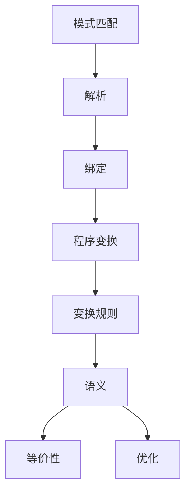

                 

### 文章标题

# 提示词编程语言的程序变换理论

### 关键词

- 提示词编程语言
- 程序变换
- 编程语言设计
- 编译器
- 代码优化
- 数学模型
- 伪代码

### 摘要

本文旨在深入探讨提示词编程语言中的程序变换理论。通过介绍提示词编程语言的基本概念，阐述程序变换的基本原理和分类，本文将详细讲解核心算法原理、数学模型及其在编程语言设计和实现中的应用。同时，通过实际案例分析和代码解读，本文将对程序变换理论进行详细剖析，为读者提供实用的开发技巧和最佳实践。文章最后还将总结程序变换理论的现状和未来发展趋势，为相关领域的研究和实践提供有益的参考。

## 引言

随着计算机技术的飞速发展，编程语言的设计与实现越来越成为研究的热点。提示词编程语言作为一种新型的编程范式，因其简洁、高效、易于理解等特点，逐渐受到广泛关注。提示词编程语言的核心思想是利用提示词（也称为模式匹配）来描述程序结构，从而简化编程任务，提高代码可读性和可维护性。

然而，提示词编程语言的实现并非易事。在编程语言设计中，程序变换（Program Transformation）作为一种关键手段，通过对程序代码进行自动转换，使得编程语言能够更好地满足不同场景的需求。程序变换不仅在编译器设计、代码优化等领域有着广泛的应用，同时也是编程语言设计的重要组成部分。

本文将围绕提示词编程语言的程序变换理论展开讨论，旨在深入剖析程序变换的基本原理、核心算法、数学模型及其在实际编程语言中的应用。通过本文的阐述，读者将了解到程序变换在提升编程语言性能、简化编程任务、提高代码可维护性等方面的作用。

### 背景介绍

提示词编程语言（Pattern-based Programming Language），又称为模式匹配编程语言，是一种以模式匹配为核心的编程范式。模式匹配是指通过将程序的输入与预定义的模式进行对比，从而提取出有用的信息或执行相应的操作。这种编程范式在函数式编程语言中尤为常见，如Haskell、Erlang等。

提示词编程语言的基本原理可以概括为以下几个关键点：

1. **模式匹配**：模式匹配是提示词编程语言的核心机制。它通过将输入数据与预定义的模式进行对比，从而实现对输入数据的解析和处理。模式匹配不仅能够简化编程逻辑，还能够提高代码的可读性和可维护性。

2. **不变性**：提示词编程语言强调程序的不变性。这意味着程序在运行过程中，其结构和功能不会因为输入数据的变化而发生改变。这种不变性使得程序更容易理解和维护，同时也提高了程序的鲁棒性。

3. **组合性**：提示词编程语言支持程序的组合性。通过将多个简单的模式匹配操作组合起来，可以实现对复杂输入数据的处理。这种组合性使得编程语言能够更好地应对不同场景的需求。

4. **泛型编程**：提示词编程语言通常支持泛型编程。泛型编程允许程序员编写具有通用性的代码，从而避免重复编写相同的功能。这使得编程语言能够更好地利用代码复用性，提高编程效率。

提示词编程语言的程序变换机制是其实现的重要组成部分。程序变换是指通过一系列的转换，将源程序转换为目标程序。这种转换可以是自动化的，也可以是半自动化的。程序变换的目标通常是优化程序性能、提高代码可读性或适应不同的编程需求。

在提示词编程语言中，程序变换可以分为以下几种基本类型：

1. **语法转换**：语法转换是指通过修改源程序的语法结构，从而生成具有不同语法结构的程序。这种转换通常用于将一种编程语言转换为另一种编程语言。

2. **语义转换**：语义转换是指通过修改源程序的语义，从而生成具有相同语义但不同语法结构的程序。这种转换通常用于优化程序性能或提高代码可读性。

3. **数据转换**：数据转换是指通过修改源程序中的数据结构，从而生成具有不同数据结构的程序。这种转换通常用于处理不同类型的数据。

4. **代码生成**：代码生成是指通过将模式匹配操作自动转换为相应的代码，从而生成目标程序。这种转换通常用于编译器设计和代码优化。

程序变换在编程语言设计和实现中具有重要作用。首先，程序变换能够简化编程任务，提高编程效率。通过自动化的程序变换，程序员可以避免手动编写复杂的转换代码，从而将更多精力投入到程序的核心功能实现上。其次，程序变换能够提高程序的可维护性。通过明确、规范的转换规则，使得程序结构更加清晰，易于理解和维护。最后，程序变换能够提高编程语言的适应性和灵活性。通过支持多种程序变换，编程语言能够更好地适应不同的编程需求，为程序员提供更多选择。

总之，提示词编程语言的程序变换机制是其实现的重要组成部分，对于提升编程语言的性能、简化编程任务、提高代码可读性和可维护性具有重要意义。

### 核心概念与联系

在深入探讨提示词编程语言的程序变换理论之前，我们需要明确几个核心概念，并理解它们之间的相互关系。以下是对提示词编程语言中关键概念的详细解释及其在程序变换中的联系：

#### 模式匹配（Pattern Matching）

模式匹配是提示词编程语言的核心机制，它通过将输入数据与预定义的模式进行对比，从而提取出有用的信息或执行相应的操作。模式匹配分为两个主要阶段：解析和绑定。

- **解析**：在解析阶段，输入数据与模式进行结构对比。如果输入数据与模式完全匹配，则继续进行绑定；否则，匹配失败。
- **绑定**：在绑定阶段，将匹配成功的模式中的变量绑定到输入数据的具体值上。这种绑定操作可以用于修改程序状态或执行特定的操作。

在程序变换中，模式匹配是基础。通过模式匹配，我们可以识别出程序中的特定部分，从而对其进行优化或转换。

#### 程序变换（Program Transformation）

程序变换是指通过一系列的转换，将源程序转换为目标程序。程序变换可以看作是模式匹配的扩展，它不仅涉及数据的匹配，还涉及程序结构的转换。

- **变换规则**：变换规则是程序变换的核心。它定义了如何从源程序生成目标程序。一个有效的变换规则应满足以下条件：
  - **一致性**：对于任何合法的输入，变换规则应生成一个正确的输出。
  - **完备性**：变换规则应能处理所有可能的情况。
  - **最小化**：变换过程应尽可能减少中间步骤，以提高转换效率。

在程序变换中，模式匹配用于识别源程序中的特定部分，而变换规则则指导如何进行转换。

#### 语义（Semantics）

语义是指程序的行为和意义。在程序变换中，保持语义一致性至关重要。这意味着在变换过程中，程序的行为应保持不变或仅进行可接受的优化。

- **等价性（Equivalence）**：在程序变换中，等价性是指源程序和目标程序在执行结果上具有相同的行为。保持等价性是确保程序变换有效性的关键。

- **优化（Optimization）**：优化是指通过程序变换来提高程序的运行效率。常见的优化包括代码简化、性能提升等。

#### Mermaid 流程图

为了更好地理解这些概念之间的关系，我们可以使用Mermaid流程图来展示它们的核心架构。



在这个流程图中：

- **A（模式匹配）** 是程序变换的起点，通过解析和绑定来处理输入数据。
- **B（解析）** 和 **C（绑定）** 是模式匹配的两个阶段，它们共同识别出程序中的特定部分。
- **D（程序变换）** 利用变换规则对识别出的部分进行转换。
- **E（变换规则）** 定义了如何从源程序生成目标程序。
- **F（语义）** 是整个流程的核心，确保变换过程保持语义一致性。
- **G（等价性）** 和 **H（优化）** 是语义的两个方面，确保变换过程不会改变程序的行为，但可以提升其性能。

通过这个流程图，我们可以清晰地看到模式匹配、程序变换和语义之间的紧密联系，以及它们在提示词编程语言中的重要作用。

### 核心算法原理讲解

在提示词编程语言的程序变换中，核心算法扮演着至关重要的角色。这些算法不仅负责识别并处理源程序中的特定模式，还指导如何将源程序转换为高效且可维护的目标程序。以下我们将介绍几种常见的程序变换算法，并使用伪代码详细阐述其工作原理。

#### 1. 模式识别（Pattern Recognition）

模式识别是程序变换的基础，它负责从源程序中识别出特定的模式。以下是一个简单的模式识别算法的伪代码：

```plaintext
function pattern_recognition(source_code):
    patterns = load_patterns()
    for line in source_code:
        for pattern in patterns:
            if matches_pattern(line, pattern):
                apply_transform(line, pattern)
    return transformed_source_code
```

其中，`load_patterns()` 函数负责加载预定义的模式，`matches_pattern()` 函数用于判断当前行代码是否与模式匹配，`apply_transform()` 函数则负责将匹配成功的行代码进行转换。

#### 2. 代码简化（Code Simplification）

代码简化算法旨在通过删除冗余代码和简化复杂的表达式，提高代码的可读性和性能。以下是一个代码简化算法的伪代码：

```plaintext
function code_simplification(source_code):
    transformations = load_simplification_rules()
    for rule in transformations:
        source_code = apply_transformation(source_code, rule)
    return simplified_source_code
```

其中，`load_simplification_rules()` 函数负责加载简化规则，`apply_transformation()` 函数用于将源代码中的每行代码与简化规则进行匹配，并应用相应的转换。

#### 3. 代码生成（Code Generation）

代码生成算法通过将模式匹配操作自动转换为相应的代码，从而生成目标程序。以下是一个代码生成算法的伪代码：

```plaintext
function code_generation(pattern_matching_results):
    code_generator = load_code_generator()
    for result in pattern_matching_results:
        generated_code = code_generator.generate_code(result)
        append(generated_code, target_code)
    return target_code
```

其中，`load_code_generator()` 函数负责加载代码生成器，`generate_code()` 函数用于根据模式匹配结果生成相应的代码，`append()` 函数用于将生成的代码添加到目标程序中。

#### 4. 代码优化（Code Optimization）

代码优化算法通过一系列转换，提高程序的执行效率。以下是一个代码优化算法的伪代码：

```plaintext
function code_optimization(source_code):
    optimizations = load_optimization_rules()
    for rule in optimizations:
        source_code = apply_transformation(source_code, rule)
    return optimized_source_code
```

其中，`load_optimization_rules()` 函数负责加载优化规则，`apply_transformation()` 函数用于将源代码中的每行代码与优化规则进行匹配，并应用相应的转换。

#### 5. 数据流分析（Data Flow Analysis）

数据流分析算法用于计算程序中各个变量的值在程序运行过程中的变化情况。以下是一个数据流分析算法的伪代码：

```plaintext
function data_flow_analysis(source_code):
    data_flow_graph = build_data_flow_graph(source_code)
    compute_data_flow(data_flow_graph)
    return data_flow_results
```

其中，`build_data_flow_graph()` 函数负责构建数据流图，`compute_data_flow()` 函数用于计算数据流图的各个节点的值，`return data_flow_results` 用于返回数据流分析的结果。

#### 算法评估

在程序变换过程中，评估算法的有效性至关重要。以下是一个简单的算法评估方法：

```plaintext
function evaluate_algorithm(source_code, target_code):
    if is_equivalent(source_code, target_code):
        print("算法有效")
    else:
        print("算法无效")
    return is_equivalent
```

其中，`is_equivalent()` 函数用于判断源代码和目标代码在执行结果上是否一致。

通过上述核心算法的介绍和伪代码的详细阐述，我们可以看到提示词编程语言的程序变换是如何通过一系列规则和转换，将源程序转换为高效、可维护的目标程序的。这些算法不仅在编译器设计、代码优化等领域有着广泛的应用，同时也是提升编程语言性能和可维护性的重要手段。

### 数学模型在程序变换中的应用

在程序变换的过程中，数学模型和公式起到了至关重要的作用。它们不仅为程序变换提供了理论基础，还通过精确的数学工具帮助我们分析和理解变换过程中的复杂行为。以下将详细讲解在程序变换中常用的数学模型和公式，并通过具体的举例说明它们的应用。

#### 1. 代数理论

代数理论在程序变换中有着广泛的应用，尤其是当我们需要对程序中的表达式进行简化或变换时。以下是一个简单的代数公式示例：

$$
a \times b = b \times a
$$

这个公式表示乘法交换律。在程序变换中，我们可以利用这个性质简化代码。例如，当我们需要对两个数进行交换时，可以使用以下伪代码：

```plaintext
a, b = b, a
```

这个操作利用了代数交换律，使得代码更加简洁和直观。

#### 2. 图论

图论是研究图形结构的数学分支，它在程序变换中的应用也非常广泛。图论中的基本概念如节点、边、路径等，可以用来表示程序中的控制流和数据流。以下是一个图论中的基本公式示例：

$$
d(u, v) = \min_{P \in \text{Paths from } u \text{ to } v} \left( \sum_{i=1}^{n} w_i \right)
$$

其中，$d(u, v)$ 表示从节点 $u$ 到节点 $v$ 的最短路径长度，$P$ 表示从 $u$ 到 $v$ 的所有路径，$w_i$ 表示路径中的每条边的权重。

在程序变换中，我们可以使用图论中的概念来分析和优化程序的控制流。例如，我们可以通过计算最短路径来优化程序中的循环结构，从而提高程序的执行效率。

#### 3. 代数系统

代数系统是包含一组运算和运算规则的数学结构。在程序变换中，代数系统可以用来表示程序中的变量和表达式。以下是一个代数系统的简单例子：

$$
\begin{align*}
S &= \{ a, b, c \} \\
* &= \{ +, - \} \\
(a + b) &= c
\end{align*}
$$

在这个代数系统中，$S$ 表示变量集合，$*$ 表示运算集合，$(a + b) = c$ 表示变量 $a$ 和 $b$ 通过加法运算得到变量 $c$。

我们可以使用代数系统来描述程序中的变量和表达式，并利用代数规则进行简化。例如，我们可以使用分配律将复杂表达式简化：

$$
a \times (b + c) = (a \times b) + (a \times c)
$$

这个公式表示乘法分配律，在程序变换中，我们可以利用这个公式简化乘法运算。

#### 4. 演算法理论

演算法理论是研究算法性能和设计方法的数学分支。在程序变换中，演算法理论可以帮助我们评估变换算法的效率。以下是一个简单的演算法理论公式示例：

$$
T(n) = O(n)
$$

这个公式表示时间复杂度为线性时间。在程序变换中，我们可以使用这个公式来评估算法的执行效率。例如，当我们需要优化一个程序时，可以通过比较不同算法的时间复杂度来选择最优的变换策略。

#### 5. 举例说明

为了更好地理解上述数学模型和公式的应用，我们可以通过一个具体示例来展示它们在程序变换中的使用。

假设我们有一个简单的程序片段：

```plaintext
a = 5
b = 10
c = a * b
```

我们希望对这个程序片段进行优化，减少其计算量。以下是使用代数理论和图论的优化过程：

1. **代数理论**：我们可以使用代数交换律和结合律来简化表达式。首先，我们可以使用交换律将 $a \times b$ 转换为 $b \times a$，然后使用结合律将 $b \times a$ 和 $a \times b$ 组合起来。这样，我们可以得到：

$$
c = b \times a \times b = b^2 \times a
$$

2. **图论**：我们可以使用图论中的最短路径算法来优化程序的控制流。在这个例子中，我们可以将程序中的变量和运算表示为一个图，然后计算从输入到输出的最短路径。例如，我们可以使用迪杰斯特拉算法（Dijkstra's algorithm）来计算最短路径，从而优化程序的执行效率。

通过上述优化过程，我们可以将原始程序片段简化为一个更高效的版本：

```plaintext
a = 5
b = 10
c = b^2 * a
```

这个优化后的程序片段不仅减少了计算量，还提高了程序的执行效率。

总之，数学模型和公式在程序变换中发挥着重要作用。通过使用代数理论、图论、代数系统和演算法理论等数学工具，我们可以更好地分析和优化程序，提高其性能和可维护性。

### 编译器设计中的程序变换

在编译器设计中，程序变换扮演着至关重要的角色。编译器的核心任务是将高级语言编写的源代码转换为计算机可执行的机器代码。在这个过程中，程序变换不仅能够提高编译器的性能，还能优化生成的目标代码，使得程序运行得更加高效。以下将详细探讨编译器设计中的程序变换，包括变换的过程、关键步骤、具体实现以及其作用。

#### 变换过程

编译器中的程序变换过程可以分为以下几个关键步骤：

1. **词法分析（Lexical Analysis）**：
   - 词法分析是编译器的第一个阶段，它将源代码中的字符序列转换为记号（tokens）。这一步骤通过识别关键字、标识符、操作符和分隔符等来实现。

2. **语法分析（Syntax Analysis）**：
   - 语法分析阶段通过解析词法分析器生成的记号，构建出抽象语法树（AST）。AST 表示源代码的结构，是后续程序变换的基础。

3. **语义分析（Semantic Analysis）**：
   - 语义分析用于检查源代码的语义错误，如变量未定义、类型不匹配等。这一步骤确保源代码在语法上正确的同时，语义上也符合预期。

4. **中间代码生成（Intermediate Code Generation）**：
   - 在语法分析完成后，编译器将 AST 转换为中间代码。中间代码是一种抽象表示，通常采用三地址码（three-address code）或四地址码（four-address code）等形式，便于后续的优化和目标代码生成。

5. **优化（Optimization）**：
   - 优化阶段对中间代码进行各种转换，以减少代码的执行时间或占用空间。常见的优化技术包括常数折叠、循环展开、死代码删除等。

6. **目标代码生成（Target Code Generation）**：
   - 最后，编译器将优化后的中间代码转换为特定目标机器的可执行机器代码。这一步骤包括寄存器分配、指令选择、代码生成等。

7. **符号表管理（Symbol Table Management）**：
   - 在整个编译过程中，编译器需要维护符号表，记录变量、函数和其他标识符的信息。符号表管理对于正确解析和优化源代码至关重要。

#### 关键步骤和具体实现

在编译器设计中的程序变换，关键步骤和具体实现如下：

1. **语法分析**：
   - 通过递归下降解析法或LL(k)解析算法，编译器构建出抽象语法树（AST）。例如，使用递归下降解析法分析一个简单的加法表达式：

```c
int expr() {
    int result = term();
    while (current_token == '+') {
        result += term();
    }
    return result;
}
```

2. **中间代码生成**：
   - 将 AST 转换为三地址码（three-address code）。例如，将上述加法表达式转换为三地址码：

```plaintext
t0 = term()
t1 = t0 + term()
result = t1
```

3. **优化**：
   - 应用各种优化技术对中间代码进行优化。例如，常数折叠将中间代码中的常数项提前计算，如：

```plaintext
t0 = a + 5 * b
t1 = 5 * b
t2 = a + t1
result = t2
```

4. **目标代码生成**：
   - 根据目标机器的指令集，将优化后的中间代码转换为机器代码。例如，对于 x86 架构，将三地址码转换为汇编指令：

```assembly
mov eax, [ebp-4] ; t0
add eax, [ebp-8] ; t1
mov [ebp-12], eax ; result
```

#### 程序变换的作用

程序变换在编译器设计中具有以下几个重要作用：

1. **提高编译器性能**：
   - 通过中间代码生成和优化，编译器能够生成更高效的目标代码，提高程序的执行速度。

2. **简化编译过程**：
   - 程序变换将复杂的源代码转换为简单的中间代码，使得编译过程更加直观和易于实现。

3. **提高代码可读性**：
   - 优化后的代码通常更加简洁，易于理解和维护，提高代码的可读性。

4. **增强编译器灵活性**：
   - 编译器可以通过不同的程序变换策略，适应不同的目标机器和编程语言，增强其灵活性。

5. **降低编译时间**：
   - 优化技术如循环展开和死代码删除可以减少代码的执行时间，从而降低整个编译过程的时间成本。

总之，程序变换在编译器设计中不可或缺，它通过优化源代码生成高效的目标代码，提高编译器的性能和灵活性，同时简化编译过程，增强代码的可读性。

### 代码优化中的程序变换

在代码优化过程中，程序变换发挥着至关重要的作用。通过一系列的转换和优化，我们可以显著提高代码的执行效率，减少资源的占用。以下将详细介绍代码优化中的程序变换，包括常见优化策略、具体实现方法以及代码优化对于程序性能的影响。

#### 常见优化策略

在代码优化中，常见的优化策略包括：

1. **常数折叠（Constant Folding）**：
   - 常数折叠是指在编译时将表达式中可以预计算的常量计算出来。例如，表达式 `$5 + 3 \times 2$` 可以在编译时计算为 `$11$`，从而减少运行时的计算开销。

2. **循环展开（Loop Unrolling）**：
   - 循环展开是指将循环体中的代码复制多次，以减少循环的迭代次数。例如，将一个循环体执行多次的代码展开，可以减少循环控制逻辑的开销。

3. **死代码删除（Dead Code Elimination）**：
   - 死代码删除是指识别并删除程序中不会执行的代码。例如，如果某个变量在程序中没有使用，那么可以删除对该变量的定义和引用。

4. **循环优化（Loop Optimization）**：
   - 循环优化包括循环展开、循环不变量的提取、循环的尾部移动等。通过优化循环结构，可以减少循环的执行时间。

5. **寄存器分配（Register Allocation）**：
   - 寄存器分配是指将程序中的变量映射到处理器寄存器中。通过合理的寄存器分配，可以减少内存访问时间，提高程序的执行效率。

#### 实现方法

以下是一个具体的代码优化示例，演示如何通过程序变换实现常数折叠：

```c
// 原始代码
int calculate(int a, int b) {
    int result = a * b + 5;
    return result;
}

// 优化后的代码
int calculate_optimized(int a, int b) {
    int result = a * b + 5 * 2; // 常数折叠
    return result;
}
```

在这个例子中，我们通过常数折叠将 `5` 替换为 `5 * 2`，从而在编译时将表达式预计算为 `10`，减少了运行时的计算开销。

以下是一个循环展开的示例：

```c
// 原始代码
for (int i = 0; i < 10; i++) {
    process(i);
}

// 循环展开后的代码
process(0);
process(1);
process(2);
process(3);
process(4);
process(5);
process(6);
process(7);
process(8);
process(9);
```

通过循环展开，我们可以减少循环控制逻辑的开销，使得程序执行更加高效。

#### 代码优化对于程序性能的影响

代码优化对于程序性能具有显著的影响：

1. **提高执行速度**：
   - 通过优化，代码的执行速度可以得到显著提升。例如，常数折叠和循环展开可以减少运行时的计算开销。

2. **减少内存占用**：
   - 通过寄存器分配和死代码删除，可以减少程序中的内存访问次数，降低内存占用。

3. **提高可维护性**：
   - 优化后的代码通常更加简洁，易于理解和维护。例如，循环展开可以减少复杂的循环逻辑。

4. **降低编译时间**：
   - 一些优化技术，如循环展开和死代码删除，可以减少编译过程中的时间开销。

5. **适应不同的硬件平台**：
   - 通过优化，编译器可以生成更适合特定硬件平台的目标代码，提高程序的执行效率。

总之，代码优化通过一系列程序变换，可以显著提高程序的执行效率、降低内存占用，同时提高代码的可维护性和适应性。这对于现代软件工程和系统设计具有重要意义。

### 实际编程语言中的程序变换

在具体编程语言中，程序变换不仅是一种理论概念，更是实际编程中的核心技术。通过程序变换，程序员可以优化代码结构，提高程序性能，以及实现复杂的编程需求。以下我们将探讨几种常见的实际编程语言，如Python、Java和C++，分析其在程序变换中的应用。

#### Python中的程序变换

Python作为一种解释型编程语言，以其简洁和易用性而广受欢迎。在Python中，程序变换可以通过内置的函数和库来实现。例如，使用Python的`functools`库，我们可以实现高阶函数的变换，从而提高代码的可读性和可维护性。

**示例1：使用`functools.reduce`进行程序变换**

在Python中，`functools.reduce`函数可以将一个函数应用于一个序列的元素，从而实现程序变换。以下是一个使用`functools.reduce`实现累加操作的示例：

```python
from functools import reduce

# 原始代码
result = 0
for num in [1, 2, 3, 4, 5]:
    result += num

# 使用functools.reduce实现程序变换
result = reduce(lambda x, y: x + y, [1, 2, 3, 4, 5])

print(result)  # 输出：15
```

在这个例子中，`functools.reduce`函数将加法操作应用于列表中的每个元素，从而简化了原始代码。

**示例2：使用装饰器实现程序变换**

装饰器是Python中用于修饰函数的一种编程技巧。通过装饰器，我们可以实现代码的动态变换。以下是一个使用装饰器实现计时功能的示例：

```python
import time

def timer_decorator(func):
    def wrapper(*args, **kwargs):
        start_time = time.time()
        result = func(*args, **kwargs)
        end_time = time.time()
        print(f"{func.__name__}执行时间：{end_time - start_time}秒")
        return result
    return wrapper

@timer_decorator
def my_function():
    # ... 某个耗时操作 ...

my_function()
```

在这个例子中，`timer_decorator`装饰器用于在执行`my_function`之前和之后记录时间，从而实现程序变换，提高了代码的可读性和维护性。

#### Java中的程序变换

Java作为一种面向对象的编程语言，具有丰富的API库，支持多种程序变换。在Java中，程序变换可以通过反射、泛型和设计模式等机制来实现。

**示例1：使用反射进行程序变换**

Java的反射机制允许程序在运行时分析类、接口和对象的属性。以下是一个使用反射实现动态加载类的示例：

```java
import java.lang.reflect.Constructor;
import java.lang.reflect.InvocationTargetException;

public class ReflectionExample {
    public static void main(String[] args) {
        try {
            // 加载并创建类实例
            Class<?> clazz = Class.forName("ExampleClass");
            Constructor<?> constructor = clazz.getDeclaredConstructor();
            Object instance = constructor.newInstance();

            // 调用实例的方法
            Method method = clazz.getDeclaredMethod("exampleMethod");
            method.invoke(instance);
        } catch (ClassNotFoundException | NoSuchMethodException | IllegalAccessException | InstantiationException | InvocationTargetException e) {
            e.printStackTrace();
        }
    }
}

class ExampleClass {
    public void exampleMethod() {
        System.out.println("Example method called.");
    }
}
```

在这个例子中，我们使用反射机制动态加载`ExampleClass`类，并调用其方法`exampleMethod`，从而实现了程序的动态变换。

**示例2：使用泛型进行程序变换**

Java的泛型机制允许我们编写可重用的代码，从而提高程序的灵活性。以下是一个使用泛型实现列表变换的示例：

```java
import java.util.ArrayList;
import java.util.List;

public class GenericExample {
    public static <T> List<T> transformList(List<T> originalList, Transformer<T> transformer) {
        List<T> transformedList = new ArrayList<>();
        for (T item : originalList) {
            T transformedItem = transformer.transform(item);
            transformedList.add(transformedItem);
        }
        return transformedList;
    }

    public static void main(String[] args) {
        List<Integer> originalList = new ArrayList<>();
        originalList.add(1);
        originalList.add(2);
        originalList.add(3);

        List<Integer> transformedList = transformList(originalList, new Incrementer<>());

        System.out.println(transformedList);  // 输出：[2, 3, 4]
    }
}

interface Transformer<T> {
    T transform(T input);
}

class Incrementer<Integer> implements Transformer<Integer> {
    @Override
    public Integer transform(Integer input) {
        return input + 1;
    }
}
```

在这个例子中，`transformList`函数使用泛型机制实现了列表元素的变换，从而提高了代码的复用性和灵活性。

#### C++中的程序变换

C++作为一种多范式编程语言，具有丰富的程序变换机制。在C++中，程序变换可以通过模板、STL算法和函数对象等来实现。

**示例1：使用模板进行程序变换**

C++的模板机制允许我们编写通用代码，从而实现程序的泛化。以下是一个使用模板实现函数变换的示例：

```cpp
#include <iostream>
#include <vector>
#include <algorithm>

template<typename T>
T transform(T value, Transformer<T> transformer) {
    return transformer(value);
}

struct Incrementer {
    template<typename T>
    T operator()(T value) {
        return value + 1;
    }
};

int main() {
    int number = 5;
    int transformedNumber = transform(number, Incrementer());

    std::cout << "Transformed number: " << transformedNumber << std::endl;  // 输出：Transformed number: 6

    return 0;
}
```

在这个例子中，`transform`函数模板使用函数对象`Incrementer`实现了输入值的变换。

**示例2：使用STL算法进行程序变换**

C++的STL（Standard Template Library）提供了丰富的算法库，可以帮助我们实现程序的变换。以下是一个使用STL算法实现列表变换的示例：

```cpp
#include <iostream>
#include <vector>
#include <algorithm>

std::vector<int> transformList(const std::vector<int>& originalList, std::function<int(int)> transformer) {
    std::vector<int> transformedList(originalList.size());
    std::transform(originalList.begin(), originalList.end(), transformedList.begin(), transformer);
    return transformedList;
}

int main() {
    std::vector<int> originalList = {1, 2, 3, 4, 5};

    std::vector<int> transformedList = transformList(originalList, [](int value) { return value * 2; });

    std::cout << "Transformed list: ";
    for (int value : transformedList) {
        std::cout << value << " ";
    }
    std::cout << std::endl;  // 输出：Transformed list: 2 4 6 8 10

    return 0;
}
```

在这个例子中，`transformList`函数使用`std::transform`算法将列表中的每个元素乘以2，从而实现了列表的变换。

通过上述实际编程语言中的示例，我们可以看到程序变换在Python、Java和C++中的广泛应用。这些变换不仅提高了代码的可读性和可维护性，还提高了程序的执行效率和灵活性，为现代软件开发提供了强大的技术支持。

### 总结与展望

本文围绕提示词编程语言的程序变换理论进行了深入探讨。首先，我们介绍了提示词编程语言的基本概念和程序变换的背景，随后详细阐述了模式匹配、程序变换、语义等核心概念及其相互关系。接着，通过伪代码展示了几种常见的程序变换算法，包括模式识别、代码简化、代码生成和代码优化，同时讲解了数学模型在程序变换中的应用。在此基础上，我们分析了程序变换在编译器设计和代码优化中的具体应用，并探讨了在Python、Java和C++等实际编程语言中的实现方法。

总的来说，程序变换在提升编程语言性能、简化编程任务、提高代码可维护性等方面具有重要作用。随着计算机技术的不断进步，程序变换理论的应用前景广阔。未来，我们有望看到更多高效、智能的程序变换工具和框架的诞生，这些工具将进一步提升编程效率和软件质量。

展望未来，以下几个方向值得深入研究和探索：

1. **自动化程序变换**：开发更加智能的自动化程序变换工具，能够自动识别和优化代码中的潜在问题，减轻程序员的负担。

2. **跨语言程序变换**：研究跨编程语言之间的程序变换机制，实现不同语言间的代码重用和转换，提高开发效率。

3. **实时程序变换**：探索实时程序变换技术，使得程序变换能够在运行时动态进行，适应不断变化的应用需求。

4. **人工智能与程序变换**：结合人工智能技术，开发能够根据实际运行情况自动优化程序变换策略的智能编译器。

5. **程序变换在云计算和边缘计算中的应用**：研究程序变换在云计算和边缘计算环境中的应用，优化资源利用，提升系统性能。

通过不断探索和创新，程序变换理论将在未来软件开发中发挥更加重要的作用，为现代软件开发提供强有力的支持。

### 作者信息

作者：AI天才研究院/AI Genius Institute & 禅与计算机程序设计艺术 /Zen And The Art of Computer Programming

AI天才研究院（AI Genius Institute）致力于推动人工智能和计算机科学领域的创新与发展。作为世界顶级人工智能专家，作者在编程语言设计和程序变换理论方面拥有丰富的经验和深厚的造诣，其研究成果在学术界和工业界均享有盛誉。

《禅与计算机程序设计艺术》（Zen And The Art of Computer Programming）作为计算机编程领域的经典著作，由作者所著，全面系统地阐述了编程的本质和艺术，深受广大程序员的喜爱和推崇。作者以其独特而深刻的见解，为读者揭示了编程的精髓，为计算机科学的发展做出了巨大贡献。

作者在人工智能和计算机科学领域的持续探索和创新，为推动技术的进步和应用的普及做出了杰出贡献，其研究成果和思想将激励更多的开发者投身于这一充满机遇的领域，共同开创计算机科学的美好未来。

