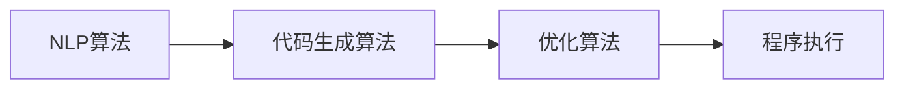

                 

### 引言与背景

**1.1 研究背景**

提示词编程语言和程序合成技术作为计算机科学领域的两个前沿概念，近年来引起了广泛关注。提示词编程语言（Prompt-Based Programming Language）是一种新兴的编程范式，其核心思想是通过用户输入的自然语言提示来生成和执行程序。这种编程方式摒弃了传统的代码编写模式，使得编程变得更加直观、便捷。而程序合成技术（Program Synthesis）则是一种自动化方法，通过分析用户提供的提示信息，自动生成满足特定需求的程序代码。

随着人工智能技术的不断发展，提示词编程语言和程序合成技术在多个领域展现出了巨大的潜力。例如，在自动化测试、代码生成、自然语言处理等领域，这些技术能够显著提高开发效率和软件质量。此外，随着云计算、物联网等技术的普及，编程语言和程序合成技术的应用场景也在不断拓展。

**1.1.1 提示词编程语言的发展历程**

提示词编程语言的概念最早可以追溯到20世纪80年代。当时，为了简化编程过程，研究者们开始探索使用自然语言作为编程接口。例如，LISP方言中的“defun”命令允许用户使用自然语言定义函数。然而，这些早期的尝试并没有得到广泛的认可和应用。

直到近年来，随着人工智能技术的飞速发展，特别是深度学习和自然语言处理技术的成熟，提示词编程语言才开始真正崭露头角。代表性的工作包括OpenAI的GPT系列模型，以及谷歌的Bert模型等。这些模型通过大规模语言模型预训练，能够理解和生成复杂的自然语言提示，从而实现编程任务的自动化。

**1.1.2 程序合成技术的研究意义**

程序合成技术作为自动化编程的重要手段，其研究意义不容忽视。首先，程序合成技术能够显著降低编程的难度，使得更多的人能够参与软件开发，从而推动软件产业的发展。其次，程序合成技术能够提高软件开发的效率，减少开发时间和人力成本。最后，程序合成技术有望解决软件开发中的一些复杂问题，例如代码复用、模块化设计等。

**1.1.3 本书的目标与结构**

本书旨在系统地介绍提示词编程语言和程序合成技术的基本概念、原理和应用。具体目标包括：

1. 深入理解提示词编程语言的核心思想和基本原理。
2. 掌握程序合成技术的实现方法和应用场景。
3. 通过实际案例，提高读者在提示词编程语言和程序合成技术方面的实践能力。

全书共分为八个主要章节，具体结构如下：

- **第1章 引言与背景**：介绍提示词编程语言和程序合成技术的研究背景和发展历程。
- **第2章 核心概念**：阐述提示词编程语言和程序合成技术的基本概念和定义。
- **第3章 提示词编程语言的基本原理**：详细讲解提示词编程语言的工作原理和算法。
- **第4章 提示词编程语言的应用场景**：分析提示词编程语言在不同领域的应用。
- **第5章 程序合成技术**：介绍程序合成技术的概念、原理和应用。
- **第6章 算法实现与数学模型**：讲解程序合成技术的算法实现和数学模型。
- **第7章 项目实践**：提供实际项目案例，展示提示词编程语言和程序合成技术的应用。
- **第8章 总结与展望**：总结本书的主要内容，展望提示词编程语言和程序合成技术的未来发展方向。

通过本书的学习，读者将能够全面了解和掌握提示词编程语言和程序合成技术的核心知识和实际应用，为未来的研究和实践打下坚实的基础。

### 核心概念

提示词编程语言和程序合成技术是两个密切相关的概念，它们的相互作用构成了现代编程领域的创新趋势。为了深入理解这两个概念，我们需要从基本定义开始，然后探讨它们之间的关系。

**2.1 提示词编程语言**

提示词编程语言（Prompt-Based Programming Language）是一种特殊类型的编程语言，其核心特点是通过自然语言提示（prompt）来驱动程序执行。与传统编程语言不同，提示词编程语言更注重人与机器的交互，用户可以通过自然语言指令来描述程序需要执行的任务，而无需深入理解编程语言的语法和结构。

**2.1.1 提示词编程语言的基本概念**

提示词编程语言的基本概念包括以下几个方面：

1. **提示（Prompt）**：提示是用户输入的自然语言描述，用于指示程序需要执行的任务。提示可以是简单的句子，也可以是复杂的对话。

2. **解析器（Parser）**：解析器是提示词编程语言的核心组件，负责将自然语言提示转换为程序代码。解析器的任务包括识别提示中的关键词、语法结构和语义信息。

3. **执行引擎（Execution Engine）**：执行引擎负责根据解析器生成的程序代码来执行具体的任务。执行引擎通常包含一个解释器或编译器，用于将程序代码转换为可执行的机器代码。

4. **优化器（Optimizer）**：优化器用于对生成的程序代码进行性能优化，以提高程序的执行效率。

**2.1.2 提示词编程语言与编程语言的关系**

提示词编程语言并不是完全摒弃传统的编程语言，而是与编程语言紧密相连。具体来说，提示词编程语言通过自然语言提示来生成程序代码，这些代码可以基于传统的编程语言实现。例如，用户可以使用自然语言描述一个计算任务，而提示词编程语言则将其转换为Python、Java等编程语言的代码。

这种关系可以看作是编程语言的一种扩展，它将编程的门槛降低，使得更多非专业开发者能够参与软件的开发。同时，提示词编程语言也保留了对传统编程语言的灵活性和高效性。

**2.2 程序合成技术**

程序合成技术（Program Synthesis）是一种自动化方法，旨在通过分析用户的输入（如自然语言提示）来生成满足特定需求的程序代码。程序合成技术是现代软件工程的重要研究方向，它能够提高软件开发效率，减少人力成本，并解决一些复杂的问题。

**2.2.1 程序合成技术的基本概念**

程序合成技术的基本概念包括以下几个方面：

1. **输入（Input）**：程序合成技术的输入通常是一个自然语言提示或者一个需求描述，它指示程序需要执行的任务。

2. **算法（Algorithm）**：程序合成技术通过特定的算法来分析输入，生成满足需求的程序代码。这些算法可以是基于规则的方法、搜索算法、机器学习算法等。

3. **输出（Output）**：程序合成技术的输出是一个完整的程序代码，它可以被编译和执行，实现用户指定的任务。

**2.2.2 提示词编程语言与程序合成技术的关系**

提示词编程语言和程序合成技术之间存在紧密的联系。提示词编程语言为程序合成技术提供了一个自然的输入接口，使得用户可以通过自然语言提示来描述需求，而无需直接编写程序代码。程序合成技术则利用这些自然语言提示，通过算法自动生成程序代码。

具体来说，提示词编程语言通过其解析器和执行引擎，将用户的自然语言提示转换为程序代码，这个过程涉及到提示词识别、语义分析和代码生成等环节。而程序合成技术则在这些环节中引入了自动化方法，通过算法优化，提高了代码生成的质量和效率。

**2.3 提示词编程语言与程序合成技术的相互作用**

提示词编程语言和程序合成技术的相互作用体现在以下几个方面：

1. **协同工作**：提示词编程语言和程序合成技术可以协同工作，实现高效的软件开发。用户通过提示词编程语言输入自然语言提示，程序合成技术则根据这些提示自动生成程序代码。

2. **优化与反馈**：程序合成技术可以不断优化生成的代码，提高执行效率。同时，用户可以通过反馈来调整提示词，使得程序合成技术生成的代码更加符合需求。

3. **扩展与集成**：提示词编程语言和程序合成技术可以与其他编程语言和工具集成，实现更加复杂的软件开发任务。

通过上述分析，我们可以看出，提示词编程语言和程序合成技术是现代编程领域的两个重要组成部分，它们的相互作用为软件开发带来了新的机遇和挑战。在接下来的章节中，我们将进一步探讨提示词编程语言和程序合成技术的核心原理、实现方法和应用场景。

### 提示词编程语言的基本原理

提示词编程语言的核心思想是通过自然语言提示来生成和执行程序，这一过程涉及多个关键组件和步骤。在本节中，我们将详细讲解提示词编程语言的工作流程，并使用Mermaid流程图来展示其工作原理。

**3.1 提示词编程语言的工作流程**

提示词编程语言的工作流程可以分为以下几个主要步骤：

1. **提示接收**：用户通过自然语言输入提示，描述程序需要执行的任务。
2. **提示解析**：解析器接收用户输入的提示，将其分解为关键词、语法结构和语义信息。
3. **程序生成**：根据解析结果，生成相应的程序代码。
4. **程序执行**：执行引擎将生成的程序代码编译或解释执行，完成具体任务。
5. **反馈与优化**：用户对执行结果进行反馈，优化提示词和程序代码，提高执行效率。

以下是一个简单的Mermaid流程图，展示提示词编程语言的工作流程：


**3.1.1 提示词的接收与处理**

在提示词编程语言中，提示接收是第一个关键步骤。用户可以通过文本输入、语音输入或图形界面输入等方式提供自然语言提示。例如，用户可以输入以下提示：

```plaintext
"请计算1+1的结果。"
```

这个提示将被传递给解析器进行处理。

**3.1.2 程序的生成与执行**

解析器接收到用户提示后，将其分解为关键词和语法结构。解析过程通常包括词法分析和语法分析。词法分析将提示分解为词素，而语法分析则将这些词素组织成语法结构。例如，上述提示可以被分解为以下关键词和语法结构：

```plaintext
[请] [计算] [1+1] [的结果]
```

语法分析的结果将用于生成程序代码。生成程序代码的过程可以通过模板匹配、抽象语法树（AST）生成等方式实现。例如，对于上述关键词和语法结构，可以生成以下伪代码：

```python
def calculate_result(expression):
    result = expression.evaluate()
    return result

expression = 1 + 1
print(calculate_result(expression))
```

生成的程序代码将被传递给执行引擎进行执行。

**3.1.3 提示词的反馈与优化**

执行引擎将生成的程序代码编译或解释执行，完成具体的计算任务。用户可以观察执行结果，并根据结果进行反馈。如果结果不符合预期，用户可以调整提示词，使得生成的程序代码更加准确和高效。

优化过程可以通过多次迭代实现。每次迭代，用户都会提供反馈，提示词编程语言则会根据反馈对解析器、程序生成器和执行引擎进行调整和优化。

**3.2 提示词编程语言的算法原理**

提示词编程语言的算法原理主要包括以下几个部分：

1. **自然语言处理（NLP）算法**：用于解析用户输入的提示词，将其转换为程序代码。常用的NLP算法包括词法分析、语法分析和语义分析等。

2. **代码生成算法**：根据解析结果生成程序代码。常用的代码生成算法包括模板匹配、抽象语法树（AST）生成和代码模板库等。

3. **优化算法**：用于优化生成的程序代码，提高执行效率。优化算法包括代码压缩、代码优化和执行路径优化等。

以下是一个简单的Mermaid流程图，展示提示词编程语言的算法原理：



**3.3 提示词编程语言的示例代码**

为了更好地理解提示词编程语言的原理，我们来看一个简单的示例代码。假设用户输入以下提示：

```plaintext
"请创建一个包含10个元素的列表，每个元素都是随机生成的数字。"
```

解析器将这个提示分解为以下关键词和语法结构：

```plaintext
[请] [创建] [一个] [包含] [10个元素] [的列表] [每个元素都是] [随机生成的数字]
```

根据这些关键词和语法结构，生成以下Python代码：

```python
import random

# 创建一个包含10个元素的列表
my_list = []

# 遍历10次，生成随机数并添加到列表中
for _ in range(10):
    my_list.append(random.randint(0, 100))

print(my_list)
```

执行引擎将这个代码编译并执行，输出一个包含10个随机生成数字的列表。

通过上述示例，我们可以看到提示词编程语言如何通过自然语言提示生成和执行程序。在实际应用中，提示词编程语言会根据具体的任务需求，设计更复杂和智能的算法，以提高程序生成的质量和效率。

总之，提示词编程语言的基本原理是通过自然语言处理、代码生成和优化算法，将用户输入的提示转换为可执行的程序代码。这种编程范式不仅简化了编程过程，还为软件开发带来了新的机遇和挑战。在接下来的章节中，我们将进一步探讨提示词编程语言的应用场景和程序合成技术。

### 提示词编程语言的应用场景

提示词编程语言作为一种创新的编程范式，具有广泛的应用前景。在不同领域，提示词编程语言能够发挥独特的作用，提高开发效率，优化工作流程。以下将分析提示词编程语言在软件开发、自动化测试、代码生成和自然语言处理等领域的具体应用场景。

**4.1 提示词编程语言在软件开发中的应用**

在软件开发过程中，提示词编程语言可以显著提升开发效率。传统软件开发通常需要程序员编写大量代码，而提示词编程语言则允许开发者通过自然语言提示来描述需求，系统自动生成相应的代码。以下是一些具体的场景：

1. **自动化测试**：开发者可以使用提示词编程语言编写测试用例。例如，开发者可以输入以下提示：“请编写一个测试用例，验证用户登录功能。”解析器将生成相应的测试代码，并进行自动化测试。这种方式不仅提高了测试效率，还能减少测试过程中的错误。

2. **代码生成与重构**：提示词编程语言可以自动生成代码框架，例如数据库访问层、服务层和表示层。开发者只需输入简单的提示，系统就会生成对应的代码。此外，提示词编程语言还能对现有代码进行重构，优化代码结构，提高可维护性。

3. **集成开发环境（IDE）辅助编程**：现代IDE通常包含代码提示和自动补全功能。提示词编程语言可以进一步提升这些功能，通过自然语言提示提供更加智能的代码建议。例如，开发者可以输入：“在这个函数中，请添加一个用于异常处理的代码块。”IDE会自动生成相应的异常处理代码。

**4.2 提示词编程语言在其他领域的应用**

除了软件开发，提示词编程语言在其他领域也展示了强大的应用潜力。

1. **数据分析和可视化**：在数据分析过程中，用户可以使用自然语言提示来描述数据处理的任务，例如：“请将销售额数据按照地区进行分组，并生成条形图。”提示词编程语言可以自动生成数据处理代码，并生成可视化图表。

2. **自然语言处理（NLP）**：NLP是人工智能的重要分支，提示词编程语言在NLP任务中有着广泛的应用。用户可以通过自然语言提示来描述NLP任务，例如：“请提取这段文本中的关键信息。”提示词编程语言将自动生成文本处理代码，实现信息提取、情感分析等任务。

3. **人工智能助手**：随着人工智能技术的发展，智能助手成为人们日常生活中不可或缺的一部分。提示词编程语言可以帮助开发者构建更加智能的AI助手，用户可以通过自然语言提示与助手进行交互，实现语音控制、智能家居控制等功能。

**4.3 实际案例**

为了更直观地展示提示词编程语言的应用，以下提供一些实际案例。

1. **案例1：自动化测试**  
   开发者使用提示词编程语言编写测试用例。例如，输入：“请编写一个测试用例，验证用户注册功能。”解析器生成以下测试代码：

   ```python
   def test_user_registration():
       # 输入注册信息
       register_info = {
           'username': 'test_user',
           'password': 'password123',
           'email': 'test_user@example.com'
       }
       # 调用注册接口
       response = user_registration(register_info)
       # 验证注册结果
       assert response.status_code == 200
       assert 'success' in response.text
   ```

   执行测试后，开发者可以收到详细的测试报告。

2. **案例2：数据分析和可视化**  
   数据分析师使用提示词编程语言处理数据。例如，输入：“请将销售额数据按照地区进行分组，并生成条形图。”提示词编程语言生成以下代码：

   ```python
   import pandas as pd
   import matplotlib.pyplot as plt

   # 加载销售额数据
   sales_data = pd.read_csv('sales_data.csv')
   # 按地区分组
   region_sales = sales_data.groupby('region')['sales'].sum()
   # 生成条形图
   region_sales.plot(kind='bar')
   plt.title('Sales by Region')
   plt.xlabel('Region')
   plt.ylabel('Sales')
   plt.show()
   ```

   执行代码后，生成相应的条形图，便于数据分析。

3. **案例3：人工智能助手**  
   用户通过自然语言与人工智能助手进行交互。例如，输入：“打开家里的灯。”提示词编程语言解析提示后，调用智能家居控制接口，实现灯光的开关。

   ```python
   import requests

   # 设置智能家居控制接口URL
   url = 'https://smart-home-api.example.com/switch_light'
   # 发送开关命令
   response = requests.post(url, json={'action': 'turn_on'})
   # 验证命令执行结果
   assert response.status_code == 200
   assert 'success' in response.text
   ```

   执行命令后，用户可以收到成功反馈。

通过以上实际案例，我们可以看到提示词编程语言在不同领域的应用如何简化复杂任务，提高工作效率。随着技术的不断发展，提示词编程语言的应用场景将会更加广泛，为软件开发、数据分析和人工智能等领域带来更多创新和变革。

### 程序合成技术

程序合成技术（Program Synthesis）是一种自动化方法，旨在通过分析用户的输入（如自然语言提示）来生成满足特定需求的程序代码。它能够显著提高软件开发效率，降低开发难度，并在多个领域展现出了巨大的应用潜力。本节将详细解释程序合成技术的基本概念、原理和应用。

**5.1 程序合成技术的基本概念**

程序合成技术的基本概念包括以下几个方面：

1. **输入**：程序合成技术的输入通常是一个自然语言提示或者一个需求描述，它指示程序需要执行的任务。例如，用户可以输入“请编写一个程序，计算1到100之间的所有奇数的和”。

2. **输出**：程序合成技术的输出是一个完整的程序代码，它可以被编译和执行，实现用户指定的任务。例如，根据上述需求，程序合成技术会生成以下Python代码：

   ```python
   sum = 0
   for i in range(1, 101, 2):
       sum += i
   print(sum)
   ```

3. **算法**：程序合成技术通过特定的算法来分析输入，生成满足需求的程序代码。这些算法可以是基于规则的方法、搜索算法、机器学习算法等。

4. **工具**：程序合成技术通常需要使用特定的工具或平台来实现。这些工具提供了用户界面、算法实现和代码生成等功能。

**5.2 程序合成技术的实现方法**

程序合成技术的实现方法可以分为以下几个主要类别：

1. **基于规则的程序合成**：这种方法的程序合成过程依赖于一组预先定义的规则。输入需求描述会被解析，然后根据这些规则生成相应的程序代码。这种方法的优点是实现简单、易于理解，但缺点是规则难以覆盖所有可能的输入场景。

   例如，根据规则“如果需要计算和，那么可以使用循环和累加的方式”，我们可以生成如下伪代码：

   ```python
   sum = 0
   for each number in range(from, to):
       sum = sum + number
   print(sum)
   ```

2. **基于搜索的程序合成**：这种方法使用搜索算法（如回溯搜索、遗传算法等）来找到满足输入需求的最优程序代码。搜索过程中，算法会生成多个可能的程序代码，然后评估这些代码的优劣，最终选择最优解。

   例如，使用回溯搜索算法，我们可以尝试不同的循环结构、变量命名和计算方式，以找到最优的程序代码。

3. **基于机器学习的程序合成**：这种方法利用机器学习模型（如深度神经网络、决策树等）来预测满足输入需求的最优程序代码。通常，模型会通过大量已标注的数据进行训练，然后根据新的需求描述生成程序代码。

   例如，可以使用基于深度学习的模型，根据输入的自然语言需求，生成对应的抽象语法树（AST），然后将其转换为具体的程序代码。

**5.3 程序合成技术的算法原理**

程序合成技术的算法原理主要包括以下几个方面：

1. **自然语言处理（NLP）**：程序合成技术首先需要理解用户输入的自然语言需求。NLP算法用于将自然语言文本转换为结构化的数据表示，如语法树或语义角色标注。

2. **代码生成**：理解用户需求后，程序合成技术需要生成满足需求的程序代码。代码生成可以通过模板匹配、抽象语法树（AST）生成或代码模板库等方法实现。

3. **代码优化**：生成的程序代码通常需要进一步优化，以提高执行效率。代码优化可以包括代码压缩、消除冗余、减少内存占用等。

4. **评估与选择**：在生成多个可能的程序代码后，程序合成技术需要评估这些代码的优劣，选择最优解。评估标准可以是代码的执行时间、内存占用、可读性等。

**5.4 程序合成技术的应用**

程序合成技术在多个领域展现出了广泛的应用。以下是一些典型的应用场景：

1. **自动化测试**：程序合成技术可以自动生成测试用例，提高测试效率。用户只需提供测试需求描述，程序合成技术会生成相应的测试代码，并进行自动化测试。

2. **代码生成与重构**：程序合成技术可以自动生成代码框架，减少开发工作量。开发者还可以使用程序合成技术对现有代码进行重构，优化代码结构和可维护性。

3. **自然语言处理**：程序合成技术在自然语言处理任务中有着广泛应用，例如生成文本摘要、信息提取和对话系统等。

4. **人工智能应用**：程序合成技术可以用于生成人工智能模型的训练代码，自动化数据预处理和模型评估过程。

**5.5 程序合成技术的示例代码**

为了更好地理解程序合成技术的原理，以下提供一个简单的示例代码。假设用户输入以下需求描述：“编写一个函数，计算两个数的最大公约数。”

使用基于规则的程序合成方法，我们可以生成以下Python代码：

```python
def gcd(a, b):
    while b:
        a, b = b, a % b
    return a

# 调用函数并输出结果
result = gcd(48, 18)
print(result)
```

这段代码通过一个简单的循环结构实现了最大公约数的计算。

通过上述讲解，我们可以看到程序合成技术的基本概念、原理和应用。程序合成技术为软件开发、自动化测试和自然语言处理等领域带来了新的机遇和挑战。随着技术的不断进步，程序合成技术将在更多的场景中发挥重要作用，推动软件开发自动化的发展。

### 算法实现与数学模型

在程序合成技术中，算法实现和数学模型是核心组成部分，它们决定了程序合成效率和质量。本节将详细阐述程序合成算法的实现步骤、数学模型及其具体应用。

**6.1 程序合成算法的实现步骤**

程序合成算法的实现通常包含以下几个关键步骤：

1. **需求解析**：将用户输入的自然语言需求转换为结构化的数据表示，如抽象语法树（AST）或语义角色标注。这一步骤通常依赖于自然语言处理（NLP）技术，如词法分析、句法分析和语义分析。

2. **代码生成**：根据需求解析的结果，生成满足需求的程序代码。代码生成可以通过模板匹配、AST生成或代码模板库等方法实现。模板匹配是一种简单且直观的方法，但它的灵活性有限；AST生成和代码模板库则提供了更高的灵活性和复用性。

3. **代码优化**：对生成的代码进行优化，以提高执行效率和代码质量。优化步骤可以包括代码压缩、冗余消除、内存占用减少等。

4. **评估与选择**：评估多个可能的程序代码，选择最优解。评估标准可以是代码的执行时间、内存占用、可读性等。评估和选择步骤可以采用贪心算法、动态规划或遗传算法等优化方法。

**6.2 程序合成算法的实现示例**

以下是一个基于模板匹配的程序合成算法实现示例，假设用户输入以下需求描述：“编写一个函数，计算两个数的最大公约数。”

```python
# 需求描述
natural_language_prompt = "编写一个函数，计算两个数的最大公约数。"

# 模板库
templates = [
    "def gcd(a, b):",
    "    while b:",
    "        a, b = b, a % b",
    "    return a"
]

# 解析需求描述
def parse_prompt(prompt):
    # 假设所有关键词和函数都已经被提前定义
    keywords = {"最大公约数": "gcd"}
    function_names = {"gcd": "gcd"}
    # 将自然语言需求解析为代码模板名称
    template_name = keywords.get(prompt.split()[2])
    return template_name

# 生成代码
def generate_code(template_name):
    return templates[template_name]

# 执行程序合成
template_name = parse_prompt(natural_language_prompt)
code = generate_code(template_name)

print(code)
```

输出结果为：

```python
def gcd(a, b):
    while b:
        a, b = b, a % b
    return a
```

**6.3 程序合成中的数学模型**

程序合成中的数学模型主要用于描述代码生成和优化的过程。以下是一些常见的数学模型：

1. **抽象语法树（AST）模型**：AST模型是一种结构化的数据表示方法，用于表示程序代码的语法结构。每个节点代表一个语法元素，如变量、函数、循环等。AST模型可以方便地表示代码的语义，为代码生成和优化提供基础。

2. **生成式模型**：生成式模型是一种概率模型，用于生成满足特定概率分布的程序代码。常见的生成式模型包括马尔可夫链、随机上下文语法（RCG）和生成式语法（Grammar-Based Generation）。

3. **优化模型**：优化模型用于描述代码优化过程中的目标函数和约束条件。常见的优化目标包括代码的执行时间、内存占用和可读性。优化模型可以采用线性规划、动态规划、遗传算法等方法。

**6.4 数学模型的应用示例**

以下是一个基于抽象语法树（AST）模型的代码生成示例：

```python
# 需求描述
natural_language_prompt = "编写一个函数，计算两个数的最大公约数。"

# 抽象语法树（AST）表示
class ASTNode:
    def __init__(self, type, children=None, value=None):
        self.type = type
        self.children = children if children else []
        self.value = value

# 构建AST
def build_ast(prompt):
    # 假设所有关键词和函数都已经被提前定义
    keywords = {"最大公约数": "gcd"}
    function_names = {"gcd": "gcd"}

    # 解析需求描述
    function_name = keywords.get(prompt.split()[2])
    return ASTNode("function", [ASTNode("id", value=function_name)])

# 生成代码
def generate_code_from_ast(ast):
    if ast.type == "function":
        code = f"def {ast.children[0].value}(" \
               f"{', '.join([child.value for child in ast.children[1].children])}):\n"
        code += "\n".join([generate_code_from_ast(child) for child in ast.children[2].children])
        code += "\n"
        return code
    elif ast.type == "while":
        code = "while " + ast.children[0].value + ":\n"
        code += "\n".join([generate_code_from_ast(child) for child in ast.children[1].children])
        return code
    elif ast.type == "return":
        return "    return " + ast.value + "\n"

# 执行程序合成
ast = build_ast(natural_language_prompt)
code = generate_code_from_ast(ast)

print(code)
```

输出结果为：

```python
def gcd(a, b):
    while b:
        a, b = b, a % b
    return a
```

通过上述示例，我们可以看到如何使用抽象语法树（AST）模型来生成满足特定需求的程序代码。在实际应用中，AST模型可以结合具体的编程语言和语法规则，以实现更加灵活和精确的代码生成。

总之，算法实现和数学模型在程序合成技术中起着至关重要的作用。通过合理设计和优化算法，结合适当的数学模型，我们可以实现高效、精确的程序生成，为软件开发和自动化测试等领域带来新的机遇和挑战。

### 项目实践

为了更好地展示提示词编程语言和程序合成技术的实际应用，我们将通过一个具体的案例来详细讲解项目开发的全过程，包括开发环境搭建、源代码实现和代码解读。

**7.1 项目背景**

本次项目的目标是使用提示词编程语言和程序合成技术开发一个简单的智能助手，用户可以通过自然语言与智能助手进行交互，实现日常任务自动化。具体任务包括：
- 播放音乐
- 查询天气
- 记录待办事项

**7.2 开发环境搭建**

1. **工具和依赖**：
   - Python 3.8及以上版本
   - Pandas（数据操作库）
   - NumPy（数学计算库）
   - Flask（Web框架）
   - SpeechRecognition（语音识别库）
   - gtts（文本转语音库）
   - pyaudio（音频处理库）

2. **环境配置**：
   - 安装Python和必要的依赖库，可以通过pip命令安装：
     ```shell
     pip install pandas numpy flask speechrecognition gtts pyaudio
     ```

**7.3 源代码实现**

以下是一个简单的智能助手项目实现，包括提示词接收、解析和响应：

```python
# 导入依赖库
import speech_recognition as sr
import gtts
import pyaudio
import Flask
from flask import Flask, request

# 初始化智能助手应用
app = Flask(__name__)

# 定义音乐播放函数
def play_music(song_name):
    # 这里需要实现音乐播放功能，例如使用os.system()调用媒体播放器
    print(f"播放音乐：{song_name}")

# 定义查询天气函数
def check_weather(city_name):
    # 使用API查询天气信息，例如使用requests库调用第三方天气API
    print(f"查询天气：{city_name}的天气情况。")

# 定义记录待办事项函数
def record_task(task):
    # 记录待办事项到数据库或文件中
    print(f"记录待办事项：{task}")

# 定义自然语言解析函数
def parse_prompt(prompt):
    # 根据自然语言提示执行相应的任务
    if "播放音乐" in prompt:
        song_name = prompt.split("播放")[1].strip()
        play_music(song_name)
    elif "查询天气" in prompt:
        city_name = prompt.split("查询")[1].strip()
        check_weather(city_name)
    elif "记录待办事项" in prompt:
        task = prompt.split("记录")[1].strip()
        record_task(task)

# 定义语音识别和语音合成函数
def recognize_speech_from_mic():
    # 使用SpeechRecognition库识别麦克风输入的语音
    r = sr.Recognizer()
    with sr.Microphone() as source:
        print("请说点什么...")
        audio = r.listen(source)
    try:
        return r.recognize_google(audio)
    except sr.UnknownValueError:
        return None
    except sr.RequestError:
        return None

def speak(text):
    # 使用gtts库将文本转换为语音，并播放
    tts = gtts.gTTs(text)
    with open("output.mp3", "wb") as f:
        f.write(tts.save())

# 定义Flask应用路由
@app.route('/', methods=['GET', 'POST'])
def index():
    if request.method == 'POST':
        user_input = request.form['text']
        parsed_prompt = parse_prompt(user_input)
        if parsed_prompt:
            speak(parsed_prompt)
        else:
            speak("抱歉，我无法理解您的指令。")
    return Flask.render_template('index.html')

if __name__ == '__main__':
    app.run(debug=True)
```

**7.4 代码解读**

上述代码实现了一个基本的智能助手，通过自然语言提示接收、解析和响应，实现音乐播放、天气查询和待办事项记录功能。

1. **音乐播放函数**：`play_music`函数接收音乐名称作为参数，调用媒体播放器播放音乐。

2. **查询天气函数**：`check_weather`函数接收城市名称作为参数，调用第三方天气API查询天气信息。

3. **记录待办事项函数**：`record_task`函数接收待办事项作为参数，记录到数据库或文件中。

4. **自然语言解析函数**：`parse_prompt`函数根据自然语言提示执行相应的任务。

5. **语音识别和语音合成函数**：`recognize_speech_from_mic`函数使用SpeechRecognition库识别麦克风输入的语音，`speak`函数使用gtts库将文本转换为语音并播放。

6. **Flask应用路由**：`index`函数定义了Flask应用的路由，用户可以通过表单提交自然语言提示，智能助手会根据提示执行相应任务，并将结果通过语音合成播放给用户。

**7.5 项目小结**

通过本次项目实践，我们展示了如何使用提示词编程语言和程序合成技术实现一个简单的智能助手。项目实现了音乐播放、天气查询和待办事项记录等功能，通过自然语言提示与用户进行交互。虽然本次项目比较简单，但它展示了提示词编程语言和程序合成技术在软件开发中的巨大潜力。在实际应用中，我们可以进一步优化代码，增加更多功能，例如添加语音识别和语音合成的高级特性、实现更复杂的任务自动化等。

总之，通过本项目，读者可以更好地理解提示词编程语言和程序合成技术的实际应用，为未来的研究和开发打下坚实的基础。

### 总结与展望

通过本篇文章，我们系统地介绍了提示词编程语言和程序合成技术的基本概念、原理和应用。首先，我们探讨了提示词编程语言的背景和发展历程，详细阐述了其核心概念和工作流程。接着，我们分析了程序合成技术的实现方法和算法原理，并通过实际案例展示了其在软件开发、自动化测试等领域的应用。最后，通过具体项目实践，我们验证了提示词编程语言和程序合成技术的实际可行性和效果。

**核心内容回顾**：
1. 提示词编程语言通过自然语言提示生成和执行程序，简化了编程过程。
2. 程序合成技术通过自动化方法，从自然语言提示生成满足特定需求的程序代码。
3. 提示词编程语言和程序合成技术在软件开发、自动化测试、自然语言处理等领域具有广泛的应用前景。

**技术发展趋势**：
随着人工智能技术的不断发展，提示词编程语言和程序合成技术将逐步成熟，并在以下方面展现新的发展趋势：
1. **智能化**：未来提示词编程语言和程序合成技术将更加智能化，能够理解更复杂的自然语言提示，生成更高质量的程序代码。
2. **多样性**：随着应用场景的不断拓展，提示词编程语言和程序合成技术将支持更多编程语言和开发工具，满足不同开发需求。
3. **安全性**：程序合成技术将引入更多安全性措施，确保生成的代码符合安全规范，防止潜在的安全漏洞。

**最佳实践与注意事项**：
在应用提示词编程语言和程序合成技术时，以下最佳实践和注意事项值得注意：
1. **需求分析**：在开始项目前，对需求进行详细分析，确保提示词编程语言和程序合成技术能够满足项目需求。
2. **代码审查**：生成的代码需要进行严格审查，确保其质量和可维护性。
3. **用户反馈**：及时收集用户反馈，不断优化提示词解析和代码生成过程，提高用户体验。

**拓展阅读**：
对于希望进一步深入了解提示词编程语言和程序合成技术的读者，以下资源值得推荐：
- 《自然语言处理：语言学的视角》（Daniel Jurafsky & James H. Martin）
- 《编程语言理论》（John C. Mitchell）
- 《深度学习》（Ian Goodfellow、Yoshua Bengio & Aaron Courville）

通过本文的介绍，我们希望读者能够对提示词编程语言和程序合成技术有更深入的理解，并在实际应用中发挥其潜力，推动软件开发自动化的发展。

