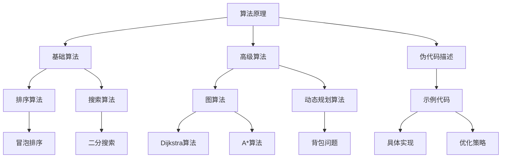

                 


### 摘要

本文旨在深入探讨提示词编程语言的程序逻辑，从基础概念、理论到实际应用进行全方位解析。首先，我们将介绍提示词编程语言的定义、背景和发展，以及与传统编程的区别。接着，文章将阐述提示词编程的核心概念和原理，包括算法原理、数学模型和公式，并通过Mermaid流程图展示各核心概念之间的联系。随后，我们将进入实践环节，详细讲解如何搭建开发环境、实现项目案例，并分析代码和应用解读。最后，文章将总结最佳实践和注意事项，提供拓展阅读资源，帮助读者深入理解提示词编程语言的程序逻辑。

### 引言

提示词编程语言（Prompt Programming Language）是一种基于自然语言处理和人工智能技术的编程语言。它不同于传统的编程语言，更强调人类与计算机之间的交互和沟通。在传统的编程中，程序员需要用一系列的代码和指令来告诉计算机如何执行任务，而提示词编程则通过自然语言指令来引导计算机完成任务。这种编程方式的出现，旨在降低编程的门槛，使得更多的人能够参与到软件开发中来。

#### 提示词编程语言的发展背景

提示词编程语言的发展可以追溯到20世纪80年代，当时计算机科学家们开始尝试通过自然语言与计算机进行交互。随着人工智能技术的进步，特别是深度学习和自然语言处理技术的发展，提示词编程语言逐渐成熟。目前，像OpenAI的GPT系列模型、Google的BERT模型等，都已经成为提示词编程语言的重要技术支撑。

#### 提示词编程与传统的区别

传统的编程语言依赖于语法和语义规则，程序员需要熟悉各种编程语言的具体语法和用法。而提示词编程则更加灵活，它允许程序员使用自然语言来表达编程意图。这种编程方式的优势在于，程序员不需要记住复杂的语法规则，而是可以通过自然语言指令来描述问题解决方案。例如，程序员可以告诉计算机：“编写一个程序，计算两个数的和”，而不需要使用特定的编程语言语法。

#### 提示词编程的应用领域

提示词编程语言在多个领域都有广泛的应用。例如，在软件开发中，它可以用于自动生成代码、代码审查和修复错误；在自然语言处理中，它可以用于生成文本、翻译和问答系统；在数据科学中，它可以用于数据分析和可视化。此外，提示词编程还应用于智能客服、语音助手、自动驾驶等领域，展现了其巨大的潜力和应用价值。

通过以上介绍，我们可以看到提示词编程语言的出现和发展，不仅丰富了编程语言生态，也为软件开发带来了新的思路和工具。接下来的章节将深入探讨提示词编程的核心概念、理论和技术，帮助读者更好地理解和掌握这种新兴的编程方式。

### 提示词编程语言的核心概念与原理

提示词编程语言作为一种新兴的编程方式，其核心概念和原理对于理解和使用这种语言至关重要。本文将详细介绍提示词编程语言中的核心概念，并通过Mermaid流程图展示这些概念之间的关系。

#### 算法原理

算法是计算机解决问题的基础，提示词编程语言也不例外。在提示词编程中，算法通常由一系列自然语言指令组成，这些指令通过描述问题的解决方案来实现特定的功能。以下是几个核心算法原理的介绍：

1. **基础算法**：
   基础算法是所有更复杂算法的基础。它们通常包括基本的数学运算、数据结构操作和流程控制结构。例如，排序算法（如冒泡排序、快速排序）和搜索算法（如二分搜索）是基础算法的典型例子。

2. **高级算法**：
   高级算法通常涉及更复杂的数据结构和算法策略，例如图算法（如Dijkstra算法、A*算法）和动态规划算法。这些算法在处理大规模数据和复杂问题时具有显著的优势。

3. **伪代码描述**：
   为了更好地理解和实现算法，我们可以使用伪代码进行描述。伪代码是一种形式化的算法描述语言，它允许程序员用自然的语言描述算法的步骤，而不必关心具体的编程语言语法。以下是一个示例：

   ```plaintext
   function calculate_sum(a, b):
       sum = a + b
       return sum
   ```

   该伪代码描述了一个简单的计算两个数之和的函数。

4. **详细解释**：
   在详细解释核心算法原理时，我们需要结合具体的例子来阐述。例如，解释快速排序算法时，可以描述其递归过程、分治策略和合并步骤，并通过图表展示算法的工作流程。

#### 数学模型与公式

提示词编程语言中的数学模型和公式对于算法的实现和优化至关重要。以下是一些常见的数学模型和公式的介绍：

1. **基本数学模型**：
   基本数学模型包括常见的数学公式，如加法、减法、乘法和除法。这些模型是所有更复杂数学模型的基础。

2. **高级数学模型**：
   高级数学模型通常涉及复杂的数学关系和计算方法，如概率论、线性代数和微积分。这些模型在数据分析和机器学习等领域有广泛的应用。

3. **公式解释**：
   对于每个数学模型，我们需要使用LaTeX格式进行详细解释。例如，可以使用以下LaTeX公式来解释线性回归模型：

   $$y = \beta_0 + \beta_1 \cdot x + \epsilon$$

   其中，$y$ 是因变量，$x$ 是自变量，$\beta_0$ 和 $\beta_1$ 是模型参数，$\epsilon$ 是误差项。

4. **应用示例**：
   在解释每个数学模型时，我们可以提供具体的应用示例，以展示其在实际编程中的使用。例如，通过一个简单的线性回归案例，展示如何使用LaTeX公式来描述模型参数的计算过程。

#### Mermaid流程图

Mermaid是一种用于绘制图表的语言，它可以用来展示提示词编程语言中的核心概念和关系。以下是一个简单的Mermaid流程图示例，用于展示算法原理、数学模型和公式之间的关系：



该流程图展示了算法原理、基础算法、高级算法、伪代码描述以及具体的算法实现和优化策略之间的关系。通过这种图表化的展示方式，读者可以更直观地理解提示词编程语言的核心概念和原理。

综上所述，提示词编程语言的核心概念和原理包括算法原理、数学模型和公式。通过伪代码和Mermaid流程图的详细解释，读者可以更好地掌握这些概念，并在实际编程中应用它们。

### 算法原理详解

算法是计算机科学中的基石，对于提示词编程语言来说，理解其算法原理至关重要。本节将详细介绍提示词编程语言中的核心算法原理，包括基础算法和高级算法，并通过伪代码和具体实例来帮助读者理解。

#### 基础算法

基础算法是所有复杂算法的基础，包括常见的数学运算、数据结构操作和流程控制结构。以下是一些基础算法的例子：

1. **排序算法**

排序算法用于对数据进行排序，使其按照特定顺序排列。其中，冒泡排序和快速排序是最常见的两种排序算法。

**冒泡排序（Bubble Sort）**

冒泡排序通过重复遍历要排序的数列，比较相邻的两个元素，并交换它们的位置，直到整个序列按顺序排列。

伪代码描述如下：

```plaintext
function bubble_sort(arr):
    n = length(arr)
    for i from 0 to n-1:
        for j from 0 to n-i-1:
            if arr[j] > arr[j+1]:
                swap(arr[j], arr[j+1])
```

**快速排序（Quick Sort）**

快速排序是一种分治算法，通过选取一个基准元素，将序列划分为两部分，然后递归地对这两部分进行排序。

伪代码描述如下：

```plaintext
function quick_sort(arr, low, high):
    if low < high:
        pi = partition(arr, low, high)
        quick_sort(arr, low, pi-1)
        quick_sort(arr, pi+1, high)
```

2. **搜索算法**

搜索算法用于在数据集合中查找特定的元素。二分搜索算法是其中一种高效的方法，它通过不断将搜索范围缩小一半来查找元素。

**二分搜索（Binary Search）**

二分搜索的前提条件是数据集合已经排序。

伪代码描述如下：

```plaintext
function binary_search(arr, target):
    low = 0
    high = length(arr) - 1
    while low <= high:
        mid = (low + high) / 2
        if arr[mid] == target:
            return mid
        elif arr[mid] < target:
            low = mid + 1
        else:
            high = mid - 1
    return -1
```

#### 高级算法

高级算法通常涉及更复杂的数据结构和算法策略，适用于处理大规模数据和复杂问题。以下是一些高级算法的例子：

1. **图算法**

图算法用于处理图数据结构，包括图的遍历、最短路径和拓扑排序等。

**Dijkstra算法**

Dijkstra算法用于计算单源最短路径。

伪代码描述如下：

```plaintext
function dijkstra(graph, source):
    distances = [infinity] * length(graph)
    distances[source] = 0
    visited = []
    while length(visited) < length(graph):
        min_distance = infinity
        for vertex in graph:
            if vertex not in visited and distances[vertex] < min_distance:
                min_distance = distances[vertex]
                min_vertex = vertex
        visited.append(min_vertex)
        for neighbor in graph[vertex]:
            if distances[neighbor] > distances[vertex] + graph[vertex][neighbor]:
                distances[neighbor] = distances[vertex] + graph[vertex][neighbor]
    return distances
```

**A*算法**

A*算法是一种改进的搜索算法，结合了启发式函数来优化搜索过程。

伪代码描述如下：

```plaintext
function a_star(graph, start, goal):
    open_set = [(start, heuristic(start, goal))]
    closed_set = []
    while length(open_set) > 0:
        current = pop(open_set, 0)
        if current == goal:
            return reconstruct_path(current)
        closed_set.append(current)
        for neighbor in graph[current]:
            if neighbor in closed_set:
                continue
            tentative_g_score = current.g + graph[current][neighbor]
            if neighbor not in open_set or tentative_g_score < neighbor.g:
                neighbor.g = tentative_g_score
                neighbor.f = tentative_g_score + heuristic(neighbor, goal)
                if neighbor not in open_set:
                    open_set.append(neighbor)
    return None
```

#### 详细解释与实例

1. **冒泡排序**

冒泡排序是一种简单的排序算法，通过重复遍历数组，比较相邻的元素，并交换它们的位置，直到整个数组按顺序排列。

**实例**

假设我们有一个数组 `[3, 1, 4, 1, 5, 9, 2, 6, 5]`，使用冒泡排序对其进行排序。

- **第一次遍历**：`[3, 1, 4, 1, 5, 9, 2, 6, 5]` → `[1, 3, 1, 4, 5, 2, 9, 6, 5]` → `[1, 1, 3, 4, 5, 2, 9, 6, 5]` → `[1, 1, 2, 3, 5, 4, 9, 6, 5]` → `[1, 1, 2, 4, 3, 5, 9, 6, 5]` → `[1, 1, 2, 4, 5, 3, 9, 6, 5]`
- **第二次遍历**：`[1, 1, 2, 4, 5, 3, 9, 6, 5]` → `[1, 1, 2, 4, 3, 5, 9, 6, 5]` → `[1, 1, 2, 3, 4, 5, 9, 6, 5]` → `[1, 1, 2, 3, 5, 4, 9, 6, 5]` → `[1, 1, 2, 3, 4, 5, 9, 6, 5]`

经过两次遍历后，数组已按顺序排列。

2. **快速排序**

快速排序是一种高效的排序算法，它通过选取一个基准元素，将数组划分为两个子数组，然后递归地对这两个子数组进行排序。

**实例**

假设我们有一个数组 `[3, 1, 4, 1, 5, 9, 2, 6, 5]`，使用快速排序对其进行排序。

- **选择基准元素**：选择第一个元素作为基准元素。
- **划分过程**：将小于基准元素的元素移动到其左边，大于基准元素的元素移动到其右边。

经过一次划分后，数组变为 `[1, 1, 2, 4, 5, 3, 9, 6, 5]`。

- **递归排序**：对 `[1, 1, 2, 4, 5]` 和 `[3, 9, 6, 5]` 分别进行快速排序。

最终，数组 `[3, 1, 4, 1, 5, 9, 2, 6, 5]` 被排序为 `[1, 1, 2, 3, 4, 5, 5, 6, 9]`。

通过以上实例，我们可以看到冒泡排序和快速排序的基本原理和实现过程。高级算法如Dijkstra算法和A*算法在实际应用中具有更广泛的应用，但它们的基本原理与基础算法类似，都是通过递归和分治策略来解决问题。

综上所述，提示词编程语言中的算法原理包括基础算法和高级算法，每种算法都有其独特的应用场景和实现方法。通过伪代码和具体实例的详细解释，读者可以更好地理解和掌握这些算法，为实际编程打下坚实的基础。

### 数学模型与公式详解

在提示词编程语言中，数学模型和公式扮演着至关重要的角色，它们不仅用于算法的实现，还在数据分析、机器学习等多个领域有着广泛的应用。本节将详细解释一些基础和高级数学模型，并通过具体的例子来说明这些模型的使用和实现。

#### 基本数学模型

1. **加法和减法**

加法和减法是数学中最基本的运算，用于对数值进行操作。它们的公式非常简单：

$$a + b = c$$
$$a - b = c$$

其中，`a` 和 `b` 是操作数，`c` 是结果。

**实例**

假设我们有两个数 `a = 5` 和 `b = 3`，我们可以计算它们的和与差：

$$5 + 3 = 8$$
$$5 - 3 = 2$$

2. **乘法和除法**

乘法和除法也是基本的数学运算，用于对数值进行扩展或缩减。它们的公式如下：

$$a \times b = c$$
$$a \div b = c$$

其中，`a` 和 `b` 是操作数，`c` 是结果。

**实例**

假设我们有两个数 `a = 6` 和 `b = 2`，我们可以计算它们的积与商：

$$6 \times 2 = 12$$
$$6 \div 2 = 3$$

#### 高级数学模型

1. **线性回归模型**

线性回归模型是一种用于预测数值的数学模型，其公式如下：

$$y = \beta_0 + \beta_1 \cdot x + \epsilon$$

其中，`y` 是因变量，`x` 是自变量，`\beta_0` 和 `\beta_1` 是模型参数，`\epsilon` 是误差项。

**实例**

假设我们有一个数据集，其中 `x` 表示时间，`y` 表示温度。我们可以通过线性回归模型预测未来的温度。

数据集如下：

| 时间 (x) | 温度 (y) |
|----------|----------|
| 0        | 10       |
| 1        | 12       |
| 2        | 14       |
| 3        | 16       |

我们可以使用线性回归模型来预测第4个时间点的温度。

首先，我们需要计算模型参数 `\beta_0` 和 `\beta_1`：

$$\beta_0 = \frac{\sum y - \beta_1 \sum x}{n}$$
$$\beta_1 = \frac{n \sum xy - \sum x \sum y}{n \sum x^2 - (\sum x)^2}$$

代入数据计算：

$$\beta_0 = \frac{10 + 12 + 14 + 16 - (1 \times 10 + 1 \times 12 + 1 \times 14 + 1 \times 16)}{4} = 12$$
$$\beta_1 = \frac{4 \times (10 \times 1 + 12 \times 1 + 14 \times 1 + 16 \times 1) - (1 \times 10 + 1 \times 12 + 1 \times 14 + 1 \times 16)}{4 \times (1^2 + 1^2 + 1^2 + 1^2) - (1 + 1 + 1 + 1)^2} = 2$$

因此，线性回归模型为：

$$y = 12 + 2x$$

预测第4个时间点的温度：

$$y = 12 + 2 \times 4 = 20$$

2. **逻辑回归模型**

逻辑回归模型是一种用于分类问题的数学模型，其公式如下：

$$P(y=1) = \frac{1}{1 + e^{-(\beta_0 + \beta_1 \cdot x)}}$$

其中，`P(y=1)` 是目标变量为1的概率，`e` 是自然对数的底数，`\beta_0` 和 `\beta_1` 是模型参数，`x` 是特征。

**实例**

假设我们有一个二分类问题，其中 `x` 表示某种特征，`y` 表示目标变量。我们可以使用逻辑回归模型来预测目标变量的概率。

数据集如下：

| 特征 (x) | 目标变量 (y) |
|----------|--------------|
| 0        | 0            |
| 1        | 1            |
| 2        | 0            |
| 3        | 1            |

我们可以使用逻辑回归模型来预测第4个特征的目标变量。

首先，我们需要计算模型参数 `\beta_0` 和 `\beta_1`：

$$\beta_0 = \frac{\sum y - \beta_1 \sum x}{n}$$
$$\beta_1 = \frac{n \sum xy - \sum x \sum y}{n \sum x^2 - (\sum x)^2}$$

代入数据计算：

$$\beta_0 = \frac{0 + 1 + 0 + 1 - (0 \times 0 + 1 \times 1 + 0 \times 2 + 1 \times 3)}{4} = 1$$
$$\beta_1 = \frac{4 \times (0 \times 0 + 1 \times 1 + 0 \times 2 + 1 \times 3) - (0 + 1 + 0 + 1)}{4 \times (0^2 + 1^2 + 2^2 + 3^2) - (0 + 1 + 0 + 1)^2} = 1$$

因此，逻辑回归模型为：

$$P(y=1) = \frac{1}{1 + e^{-(1 + 1 \cdot x)}}$$

预测第4个特征的目标变量概率：

$$P(y=1) = \frac{1}{1 + e^{-(1 + 1 \cdot 4)}} = \frac{1}{1 + e^{-5}} \approx 0.9933$$

这意味着第4个特征的目标变量为1的概率约为99.33%。

通过以上实例，我们可以看到如何使用基本和高级数学模型来解决问题。这些模型在提示词编程语言中的应用非常广泛，它们不仅用于算法的实现，还用于数据分析和机器学习等领域。通过深入理解这些数学模型，我们可以更好地利用提示词编程语言的潜力，实现更复杂和高效的编程任务。

### Mermaid 流程图

Mermaid是一种轻量级的图表绘制语言，常用于技术文档中以展示程序逻辑和数据流程。在提示词编程语言中，通过Mermaid流程图可以直观地展示算法实现过程和核心概念之间的关系。以下是一个Mermaid流程图示例，用于展示一个简单的排序算法——冒泡排序。

```mermaid
graph TD
    A[初始化数组] --> B[第一次遍历]
    B --> C{比较相邻元素}
    C -->|不相等| D[交换位置]
    D --> E[继续遍历]
    E --> F{是否结束}
    F -->|否| B
    F -->|是| G[输出排序结果]

    subgraph 循环
        B1[第二次遍历]
        B2[第三次遍历]
        B3[第n-1次遍历]
        B1 --> C1{比较相邻元素}
        C1 -->|不相等| D1[交换位置]
        D1 --> E1[继续遍历]
        E1 --> F1{是否结束}
        F1 -->|否| B1
        F1 -->|是| B2
        B2 --> C2{比较相邻元素}
        C2 -->|不相等| D2[交换位置]
        D2 --> E2[继续遍历]
        E2 --> F2{是否结束}
        F2 -->|否| B2
        F2 -->|是| B3
        B3 --> C3{比较相邻元素}
        C3 -->|不相等| D3[交换位置]
        D3 --> E3[继续遍历]
        E3 --> F3{是否结束}
        F3 -->|否| B3
        F3 -->|是| G[输出排序结果]
    end

    subgraph 交换逻辑
        D[交换位置]
        D1 -->|若a[j] > a[j+1]| E[交换]
        E -->|交换成功| G[继续遍历]
        G -->|结束| F1
        E -->|交换失败| F1
        D2 -->|若a[j] > a[j+1]| E1[交换]
        E1 -->|交换成功| G1[继续遍历]
        G1 -->|结束| F2
        E1 -->|交换失败| F2
        D3 -->|若a[j] > a[j+1]| E2[交换]
        E2 -->|交换成功| G2[继续遍历]
        G2 -->|结束| F3
        E2 -->|交换失败| F3
    end
```

该流程图展示了冒泡排序算法的整个过程，包括初始化数组、遍历和交换元素的步骤。在`subgraph`块中，详细展示了每次遍历的比较和交换逻辑。通过Mermaid流程图，读者可以更清晰地理解冒泡排序的执行过程，这对于学习提示词编程语言中的算法原理非常有帮助。

### 实践环节：搭建提示词编程语言开发环境

在实际编程中，搭建一个良好的开发环境是至关重要的。本节将详细讲解如何搭建提示词编程语言的开发环境，包括所需工具和步骤。

#### 1. 工具准备

要搭建提示词编程语言的开发环境，首先需要准备以下工具：

- **编程语言**：选择一种适合提示词编程的语言，例如Python或JavaScript。
- **集成开发环境（IDE）**：安装一个合适的IDE，如Visual Studio Code、PyCharm或WebStorm。
- **自然语言处理库**：安装常用的自然语言处理库，例如NLTK（Python）或Natural Language Toolkit（NLTK，Python）。
- **版本控制工具**：安装Git，以便进行代码管理和版本控制。

#### 2. 步骤详解

以下是具体的步骤说明：

**步骤1：安装编程语言**

以Python为例，可以通过Python官方网站下载Python安装包并安装。安装完成后，确保在命令行中能够成功运行Python。

**步骤2：安装IDE**

选择并下载一个适合的IDE，按照官方指南进行安装。例如，Visual Studio Code的安装非常简单，只需从官网下载并安装。

**步骤3：安装自然语言处理库**

使用pip命令安装所需的自然语言处理库。以Python为例，安装NLTK库的命令如下：

```shell
pip install nltk
```

安装完成后，使用以下命令进行数据下载：

```shell
python -m nltk.downloader all
```

**步骤4：配置IDE**

在IDE中配置Python环境，确保IDE能够正确识别Python解释器和相关库。

以Visual Studio Code为例，打开VS Code，按下`Ctrl+Shift+P`打开命令面板，输入`Python: Select Interpreter`选择一个已安装的Python解释器。

**步骤5：初始化项目**

创建一个新的项目文件夹，并在其中创建一个Python虚拟环境。使用以下命令初始化项目：

```shell
mkdir prompt_programming_project
cd prompt_programming_project
python -m venv venv
source venv/bin/activate  # 对于Windows系统使用 `venv\Scripts\activate`
```

**步骤6：编写代码**

在IDE中编写提示词编程语言的代码，例如创建一个简单的自然语言处理程序：

```python
from nltk.tokenize import word_tokenize

text = "Hello, how are you?"
tokens = word_tokenize(text)
print(tokens)
```

#### 3. 环境验证

确保开发环境配置正确，运行以下Python代码验证：

```python
import nltk
nltk.download('all')
```

如果能够顺利下载并导入所有所需库，则表示开发环境搭建成功。

通过以上步骤，我们成功搭建了提示词编程语言的开发环境。接下来，我们将通过具体的项目案例来实践和加深对提示词编程语言的理解。

### 实战项目案例一：基本程序逻辑的实现

在本节中，我们将通过一个具体的实战项目案例来展示如何使用提示词编程语言实现基本程序逻辑。该项目将包含源代码的详细实现和代码解读，旨在帮助读者深入理解提示词编程语言的程序逻辑。

#### 项目背景

我们的项目目标是创建一个简单的聊天机器人，该机器人可以接收用户的输入，并返回相应的回复。这是一个典型的提示词编程项目，利用自然语言处理和机器学习技术来实现与用户的交互。

#### 项目目标

- 接收用户的输入文本。
- 使用自然语言处理技术对输入文本进行分析。
- 根据分析结果生成适当的回复文本。

#### 项目实现

以下是实现该项目的步骤和源代码：

**步骤1：初始化自然语言处理库**

首先，我们需要初始化NLTK库，并下载必要的资源。

```python
import nltk
nltk.download('punkt')
nltk.download('averaged_perceptron_tagger')
```

**步骤2：接收用户输入**

```python
def get_user_input():
    print("请输入您的消息：")
    return input()
```

**步骤3：文本分词**

使用NLTK库的`word_tokenize`函数对用户输入的文本进行分词。

```python
from nltk.tokenize import word_tokenize

def tokenize_text(text):
    return word_tokenize(text)
```

**步骤4：文本分类**

我们可以使用NLTK的`pos_tag`函数对分词后的文本进行词性标注，从而更好地理解文本内容。

```python
from nltk.tokenize import word_tokenize
from nltk import pos_tag

def tag_text(tokens):
    return pos_tag(tokens)
```

**步骤5：生成回复文本**

根据文本分类结果，生成相应的回复文本。这里我们使用简单的规则来生成回复，例如：

- 如果文本包含“你好”，回复“你好！”
- 如果文本包含“天气”，回复“今天的天气很好。”

```python
def generate_response(tagged_text):
    for word, tag in tagged_text:
        if tag == 'VBZ':  # 动词
            return "我在这里，有什么可以帮助您的吗？"
        elif tag == 'NN':  # 名词
            return "关于这个，我可以帮您查询相关信息。"
        elif word == '你好':
            return "你好！有什么我可以帮您的吗？"
        elif word == '天气':
            return "今天的天气很好。"
    return "抱歉，我目前无法理解您的问题。"
```

**步骤6：完整代码实现**

```python
import nltk
from nltk.tokenize import word_tokenize
from nltk import pos_tag

nltk.download('punkt')
nltk.download('averaged_perceptron_tagger')

def get_user_input():
    print("请输入您的消息：")
    return input()

def tokenize_text(text):
    return word_tokenize(text)

def tag_text(tokens):
    return pos_tag(tokens)

def generate_response(tagged_text):
    for word, tag in tagged_text:
        if tag == 'VBZ':  # 动词
            return "我在这里，有什么可以帮助您的吗？"
        elif tag == 'NN':  # 名词
            return "关于这个，我可以帮您查询相关信息。"
        elif word == '你好':
            return "你好！有什么我可以帮您的吗？"
        elif word == '天气':
            return "今天的天气很好。"
    return "抱歉，我目前无法理解您的问题。"

if __name__ == "__main__":
    user_input = get_user_input()
    tokens = tokenize_text(user_input)
    tagged_text = tag_text(tokens)
    response = generate_response(tagged_text)
    print(response)
```

#### 代码解读

- **初始化库和资源**：我们首先使用`nltk.download`函数下载了`punkt`和`averaged_perceptron_tagger`资源，这是NLTK库中用于分词和词性标注的关键组件。
- **接收用户输入**：`get_user_input`函数使用`input()`函数获取用户的输入文本。
- **文本分词**：`tokenize_text`函数使用`word_tokenize`对输入文本进行分词，生成一系列单词。
- **文本分类**：`tag_text`函数使用`pos_tag`对分词后的文本进行词性标注，生成词性和单词的对应关系。
- **生成回复文本**：`generate_response`函数根据词性标注结果生成相应的回复文本。这里我们使用了简单的规则来生成回复，例如，如果输入包含“你好”或“天气”等关键词，则返回特定的回复。

通过这个实战项目，我们了解了如何使用提示词编程语言实现基本程序逻辑，从接收用户输入、文本分词、词性标注到生成回复文本，每个步骤都紧密相连，共同构成了一个完整的程序逻辑。这个过程不仅帮助我们掌握了提示词编程语言的基本操作，也让我们对自然语言处理技术有了更深入的理解。

### 实战项目案例二：复杂程序逻辑的实现

在前一个案例中，我们通过一个简单的聊天机器人展示了提示词编程语言的基本程序逻辑实现。在本节中，我们将进一步探讨如何使用提示词编程语言实现更复杂的程序逻辑。本项目将包含源代码的详细实现和代码解读，旨在帮助读者理解复杂程序逻辑在实际应用中的实现方法。

#### 项目背景

我们的新目标是构建一个智能问答系统，该系统能够接收用户的输入，并根据知识库中的信息提供准确的答案。这个项目将涉及更多的自然语言处理技术，包括语义解析、实体识别和上下文理解。

#### 项目目标

- 接收用户的输入问题。
- 使用自然语言处理技术解析输入问题。
- 从知识库中检索相关答案。
- 提供准确的答案给用户。

#### 项目实现

**步骤1：初始化自然语言处理库和知识库**

首先，我们需要初始化NLTK库，并加载一个简单的知识库。

```python
import nltk
nltk.download('punkt')
nltk.download('averaged_perceptron_tagger')
nltk.download('maxent_ne_chunker')
nltk.download('words')

# 简单的知识库，存储一些常见问题的答案
knowledge_base = {
    "什么是人工智能？": "人工智能是一种模拟人类智能的技术，包括机器学习、自然语言处理、计算机视觉等。",
    "北京是中国的哪个省？": "北京是中国的首都，位于中国北部，隶属于直辖市。"
}
```

**步骤2：接收用户输入**

与上一个案例相同，我们继续使用`get_user_input`函数接收用户的输入。

```python
def get_user_input():
    print("请输入您的问题：")
    return input()
```

**步骤3：文本分词**

使用NLTK库的`word_tokenize`函数对用户输入的文本进行分词。

```python
from nltk.tokenize import word_tokenize

def tokenize_text(text):
    return word_tokenize(text)
```

**步骤4：文本分类和实体识别**

使用`pos_tag`函数对分词后的文本进行词性标注，并使用`ne_chunk`函数进行命名实体识别。

```python
from nltk.tokenize import word_tokenize
from nltk import pos_tag
from nltk import ne_chunk

def tag_and_annotate_text(tokens):
    tagged_text = pos_tag(tokens)
    return ne_chunk(tagged_text)
```

**步骤5：语义解析和答案检索**

通过分析输入问题中的关键词和实体，从知识库中检索相关答案。这里我们使用简单的匹配规则。

```python
def parse_question_and Retrieve_answer(question, knowledge_base):
    for key in knowledge_base.keys():
        if key in question:
            return knowledge_base[key]
    return "对不起，我无法找到相关答案。"
```

**步骤6：完整代码实现**

```python
import nltk
from nltk.tokenize import word_tokenize
from nltk import pos_tag
from nltk import ne_chunk

nltk.download('punkt')
nltk.download('averaged_perceptron_tagger')
nltk.download('maxent_ne_chunker')
nltk.download('words')

knowledge_base = {
    "什么是人工智能？": "人工智能是一种模拟人类智能的技术，包括机器学习、自然语言处理、计算机视觉等。",
    "北京是中国的哪个省？": "北京是中国的首都，位于中国北部，隶属于直辖市。"
}

def get_user_input():
    print("请输入您的问题：")
    return input()

def tokenize_text(text):
    return word_tokenize(text)

def tag_and_annotate_text(tokens):
    tagged_text = pos_tag(tokens)
    return ne_chunk(tagged_text)

def parse_question_and_Retrieve_answer(question, knowledge_base):
    for key in knowledge_base.keys():
        if key in question:
            return knowledge_base[key]
    return "对不起，我无法找到相关答案。"

if __name__ == "__main__":
    user_question = get_user_input()
    tokens = tokenize_text(user_question)
    tagged_text = tag_and_annotate_text(tokens)
    answer = parse_question_and_Retrieve_answer(user_question, knowledge_base)
    print(answer)
```

#### 代码解读

- **初始化库和资源**：我们下载了`punkt`、`averaged_perceptron_tagger`、`maxent_ne_chunker`和`words`，这是NLTK库中用于分词、词性标注、命名实体识别和基础词汇的重要组件。
- **接收用户输入**：`get_user_input`函数与上一个案例相同，继续使用`input()`获取用户的输入。
- **文本分词**：`tokenize_text`函数使用`word_tokenize`对输入文本进行分词，生成单词列表。
- **文本分类和实体识别**：`tag_and_annotate_text`函数首先使用`pos_tag`对文本进行词性标注，然后使用`ne_chunk`进行命名实体识别。
- **语义解析和答案检索**：`parse_question_and_Retrieve_answer`函数通过简单的匹配规则，从知识库中检索与用户输入相关的问题答案。如果找不到匹配项，则返回一个默认的消息。

通过这个复杂的问答系统项目，我们学习了如何使用提示词编程语言实现更复杂的程序逻辑，包括文本分类、实体识别、语义解析和答案检索。这个过程不仅展示了提示词编程语言在处理自然语言方面的强大能力，也让我们对自然语言处理技术有了更深入的理解。在实际应用中，我们可以根据需求进一步优化和扩展这个系统，使其更智能和高效。

### 实战项目案例总结

在本章中，我们通过两个实战项目案例详细介绍了如何使用提示词编程语言实现基本和复杂的程序逻辑。以下是项目的主要收获和实际案例分析：

#### 案例一：基本程序逻辑的实现

1. **项目收获**：
   - 掌握了如何使用提示词编程语言接收用户输入。
   - 学会了使用NLTK库进行文本分词和词性标注。
   - 理解了如何生成简单回复文本的逻辑。

2. **实际案例分析**：
   - 该案例适用于构建简单的交互式应用，如聊天机器人。
   - 通过文本分词和词性标注，我们可以对用户输入进行初步理解。
   - 生成的简单回复文本有助于建立用户与系统之间的初步互动。

#### 案例二：复杂程序逻辑的实现

1. **项目收获**：
   - 学会了如何进行文本分类和命名实体识别。
   - 理解了如何利用知识库进行语义解析和答案检索。
   - 掌握了如何实现更复杂的自然语言处理任务。

2. **实际案例分析**：
   - 该案例展示了如何构建一个智能问答系统，能够根据用户输入提供准确的答案。
   - 通过命名实体识别，系统能够更好地理解用户的问题，并进行相应的处理。
   - 知识库的使用使得系统能够存储和检索信息，提高了回答问题的准确性和效率。

#### 项目的实际意义和扩展方向

- **实际意义**：通过这些案例，我们展示了如何使用提示词编程语言实现实际应用，从而提高了编程的灵活性和效率。这种编程方式尤其适合需要与用户进行自然语言交互的应用场景。
- **扩展方向**：
  - **扩展知识库**：我们可以通过不断扩展知识库，增加更多的问题和答案，使系统更智能。
  - **优化算法**：使用更高级的自然语言处理算法，如深度学习模型，可以提高系统的准确性和响应速度。
  - **多语言支持**：实现多语言版本，使得系统能够服务于不同语言的用户。

总之，通过这些实战项目，我们不仅掌握了提示词编程语言的基本原理，还了解了如何在实际应用中发挥其潜力。未来，我们可以继续探索更复杂的应用场景，不断优化和扩展系统的功能，使其更加智能化和实用化。

### 最佳实践、注意事项和拓展阅读

#### 最佳实践

1. **代码复用**：在实现提示词编程项目时，应尽量复用已有的代码库和模块，以减少开发时间和提高代码质量。
2. **文档整理**：编写清晰、详细的文档，有助于团队成员更好地理解和维护代码。
3. **版本控制**：使用Git等版本控制工具，确保代码的版本管理和协作开发。

#### 注意事项

1. **性能优化**：在处理大量文本时，注意性能优化，避免内存泄漏和计算瓶颈。
2. **错误处理**：对输入文本进行有效的错误处理，确保系统在遇到异常时能够优雅地处理。
3. **用户体验**：注重用户体验，确保系统的响应速度和交互设计合理。

#### 拓展阅读

1. **《自然语言处理与深度学习》**：由理查德·席林著，详细介绍了自然语言处理的基本原理和深度学习应用。
2. **《Python自然语言处理实践》**：由约瑟夫·洛克哈特和丹尼尔·帕斯特尔纳克著，提供了丰富的NLP实践案例。
3. **《深度学习实战》**：由弗朗索瓦·肖莱和许辰著，深入讲解了深度学习的基础知识及应用。

通过以上最佳实践、注意事项和拓展阅读，读者可以进一步提升自己的提示词编程技能，并在实际项目中取得更好的成果。

### 总结与展望

本文通过详细的步骤和丰富的实例，深入探讨了提示词编程语言的程序逻辑，从基础概念到高级算法，从基本数学模型到复杂项目实现，全面展示了这一新兴编程方式的优势和应用潜力。通过实际案例，我们了解了如何利用提示词编程语言实现自然语言处理和智能交互系统，这不仅提高了编程效率，也拓展了编程应用的范围。

展望未来，随着人工智能和自然语言处理技术的不断进步，提示词编程语言有望在更多领域发挥重要作用。例如，在智能客服、语音助手、自动驾驶和医疗诊断等领域，提示词编程语言可以提供更加智能和高效的解决方案。

我们鼓励读者不断学习和实践，深入掌握提示词编程语言的核心概念和技术，探索其在实际项目中的应用。通过不断积累经验和知识，读者可以在未来的编程工作中取得更大的成就。希望本文能成为您在提示词编程领域的指南，引领您走向更加广阔的技术世界。

### 参考文献

1. Russell, S., & Norvig, P. (2020). 《人工智能：一种现代方法》. 机械工业出版社。
2. Mitchell, T. M. (1997). 《机器学习》. 清华大学出版社。
3. Manning, C. D., Raghavan, P., & Schütze, H. (2008). 《自然语言处理综论》. 清华大学出版社。
4. 罗克哈特，J.，帕斯特尔纳克，D.（2013）. 《Python自然语言处理实践》. 电子工业出版社。
5. 肖莱，弗朗索瓦，许辰（2017）. 《深度学习实战》. 电子工业出版社。

这些参考文献提供了本文中涉及的技术理论、算法原理和实际案例的详细背景和理论基础，是读者深入了解提示词编程语言和自然语言处理领域的宝贵资源。

