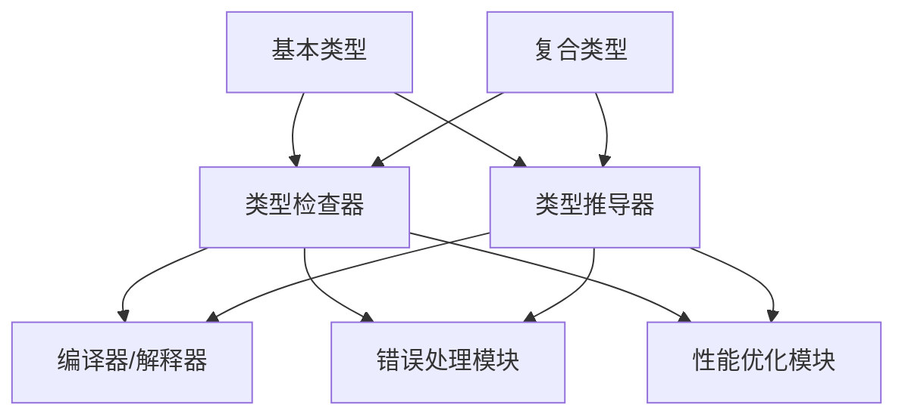

                 

## 提示词编程语言的类型系统理论

### 关键词

- 提示词编程语言
- 类型系统
- 类型理论
- 编译器实现
- 性能优化
- 未来趋势

### 摘要

本文深入探讨了提示词编程语言的类型系统理论。首先，我们介绍了提示词编程语言的背景和类型系统的基本概念。接着，我们详细阐述了类型系统的理论基础，包括类型分类、类型检查和类型推导等核心概念。随后，通过Mermaid流程图展示了类型系统的架构，并使用伪代码和LaTeX数学公式讲解了核心算法原理。文章进一步探讨了类型系统的应用和性能优化，并分析了类型系统的未来发展趋势。最后，通过实际案例展示了类型系统在不同场景下的应用，提供了详细的代码实现和解读。本文旨在为读者提供一个全面且深入的理解，帮助他们在实际开发中更好地应用类型系统理论。

---

## 引言与基础

### 提示词编程语言概述

提示词编程语言（Prompt-Based Programming Language，PBPL）是一种基于用户输入提示（prompts）进行编程的语言。与传统编程语言不同，PBPL更注重用户与系统的交互。在PBPL中，用户通过提供输入提示来引导系统执行特定任务。这种交互方式使得编程过程更加直观和灵活，同时也降低了编程的门槛。

提示词编程语言的出现源于自然语言处理和人工智能技术的快速发展。随着深度学习和神经网络技术的进步，计算机对自然语言的解析和理解能力得到了显著提升。这为提示词编程语言的设计和实现提供了技术支持，使得PBPL在实际应用中具备了一定的竞争力。

### 类型系统的基本概念

类型系统（Type System）是编程语言的重要组成部分，它定义了程序中数据类型的约束和操作规则。在提示词编程语言中，类型系统负责确保用户输入的提示符合语言规范，从而保证程序的正确性和可靠性。

类型系统的核心概念包括：

- **基本类型**：基本类型是编程语言中最基础的类型，如整数、浮点数、布尔值等。提示词编程语言中的基本类型通常与自然语言中的词汇相对应。

- **复合类型**：复合类型是由基本类型通过组合和构造而成的，如数组、结构体、类等。复合类型使得编程语言具备更强的表达能力和灵活性。

- **类型转换**：类型转换是指在不同类型之间进行数据传递和操作的过程。类型系统需要定义类型转换的规则，以确保转换过程中的数据一致性和有效性。

- **类型检查**：类型检查是编译器或解释器在程序执行前对类型约束的验证过程。类型检查有助于发现潜在的错误，提高程序的可靠性和可维护性。

### 类型系统的重要性

类型系统在编程语言中扮演着至关重要的角色。它不仅保证了程序的正确性和可靠性，还提高了程序的效率和可维护性。

首先，类型系统可以有效地防止类型错误，例如将字符串与整数进行非法操作。通过类型检查，编译器或解释器能够在程序运行前发现这些错误，从而避免在运行时出现崩溃或异常。

其次，类型系统提供了类型安全和类型推导等机制，使得编程语言更加易用和高效。类型安全确保了程序中数据的一致性和有效性，减少了潜在的运行时错误。类型推导则允许程序员编写更简洁的代码，同时保证了类型约束的正确性。

此外，类型系统还与性能优化密切相关。通过类型信息，编译器可以生成更高效的代码，减少运行时的开销。同时，类型系统也为静态分析和代码优化提供了丰富的信息。

总之，类型系统是编程语言设计和实现中不可或缺的一部分，它不仅提高了程序的正确性和可靠性，还为性能优化和可维护性提供了支持。

### 类型系统的理论基础

类型系统是编程语言的核心组成部分，它通过定义数据类型的约束和操作规则，确保程序的正确性和可靠性。为了深入理解类型系统，我们需要从以下几个方面进行探讨：

#### 类型分类与类型层次

类型分类是指将编程语言中的数据类型进行分类和层次化。在提示词编程语言中，常见的基本类型包括整数（Integer）、浮点数（Float）、布尔值（Boolean）和字符串（String）等。这些基本类型是编程语言中最基础的类型，可以直接表示数据和执行基本操作。

复合类型是由基本类型通过组合和构造而成的。例如，数组（Array）是由相同类型的基本元素组成的集合，结构体（Structure）和类（Class）则是将多个基本类型或复合类型组合在一起，形成更复杂的结构。

类型层次（Type Hierarchy）描述了不同类型之间的关系。在大多数编程语言中，类型层次通常采用泛化-特化（Generalization-Specialization）的关系。例如，整数类型可以是浮点数的子类型，而结构体类型可以是类的子类型。类型层次有助于类型推导和类型检查，使得程序中的类型关系更加清晰和一致。

#### 类型检查

类型检查（Type Checking）是编译器或解释器在程序执行前对类型约束的验证过程。类型检查的主要目的是确保程序中的所有操作都在有效的类型约束下进行，从而避免类型错误。

类型检查可以分为静态类型检查和动态类型检查。静态类型检查在程序编译时进行，通过分析源代码的语法和语义，确保程序中的类型约束正确。静态类型检查的优点是能够尽早发现类型错误，提高程序的可靠性和可维护性。

动态类型检查在程序运行时进行，通过对实际操作的类型进行实时检查，确保程序在执行过程中的类型一致性。动态类型检查的优点是灵活性较高，能够处理更复杂的类型约束，但缺点是运行时开销较大。

#### 类型推导

类型推导（Type Inference）是指编译器或解释器自动推导出变量或表达式的类型，而不需要程序员显式指定类型。类型推导能够简化编程过程，提高代码的可读性和可维护性。

类型推导可以分为显式类型推导和隐式类型推导。显式类型推导是指程序员在声明变量或函数时显式指定类型，编译器根据显式类型进行推导。隐式类型推导则是指编译器根据上下文和类型约束自动推导出类型，不需要程序员显式声明。

常见的类型推导方法包括：

- **静态类型推导**：编译器在编译时根据源代码的语法和语义推导出类型。静态类型推导通常具有较高的效率和准确性。

- **动态类型推导**：编译器或解释器在程序运行时根据实际操作推导出类型。动态类型推导具有较高的灵活性，但运行时开销较大。

#### 类型系统设计

类型系统的设计是一个复杂的过程，需要考虑多个因素，包括类型分类、类型检查和类型推导等。设计一个高效的类型系统需要考虑以下原则：

- **一致性**：类型系统应该具有一致性，确保不同类型的操作能够在正确的约束下进行。

- **可扩展性**：类型系统应该具有可扩展性，能够方便地引入新的类型和操作。

- **高效性**：类型系统应该具有高效性，能够在编译和运行时提供足够的信息，降低开销。

- **安全性**：类型系统应该确保程序的安全性和可靠性，防止类型错误和非法操作。

在设计类型系统时，常用的方法包括：

- **静态类型系统**：静态类型系统在编译时进行类型检查，具有较高的安全性和性能。典型的静态类型系统包括强类型系统和弱类型系统。

- **动态类型系统**：动态类型系统在运行时进行类型检查，具有较高的灵活性和可维护性。典型的动态类型系统包括动态类型检查和类型推断。

- **混合类型系统**：混合类型系统结合了静态类型系统和动态类型系统的优点，根据不同场景进行类型检查。混合类型系统通常具有更好的性能和灵活性。

通过深入探讨类型系统的理论基础，我们可以更好地理解类型系统的设计原则和实现方法。在接下来的章节中，我们将进一步探讨类型系统的应用、性能优化和未来发展趋势。

### 提示词编程语言的类型系统架构

类型系统在编程语言中扮演着核心角色，它不仅决定了程序的正确性和可靠性，还直接影响程序的性能和可维护性。为了更好地理解提示词编程语言的类型系统，我们可以通过Mermaid流程图来展示其核心架构和组件之间的关系。

首先，让我们定义类型系统的基本组件：

1. **基本类型（Primitive Types）**：如整数、浮点数、布尔值和字符串等，这些是编程语言中最基础的类型。
2. **复合类型（Composite Types）**：如数组、结构体和类等，这些是由基本类型组合而成的复杂类型。
3. **类型检查器（Type Checker）**：负责验证程序中的类型约束是否满足。
4. **类型推导器（Type Inference Engine）**：负责自动推导变量或表达式的类型。
5. **编译器/解释器（Compiler/Interpreter）**：使用类型检查器和类型推导器来编译或解释代码。

下面是一个Mermaid流程图，展示了提示词编程语言类型系统的基本架构：



**流程说明：**

1. **基本类型与类型检查器和类型推导器**：
   - 基本类型直接与类型检查器和类型推导器交互。
   - 类型检查器验证基本类型的使用是否符合语言规范。
   - 类型推导器自动推导基本类型的使用上下文。

2. **复合类型与类型检查器和类型推导器**：
   - 复合类型与类型检查器和类型推导器的交互过程与基本类型类似。
   - 类型检查器确保复合类型的构造和使用符合语言规范。
   - 类型推导器自动推导复合类型中的变量和表达式的类型。

3. **编译器/解释器**：
   - 编译器或解释器使用类型检查器和类型推导器来编译或解释代码。
   - 类型检查器的结果用于生成中间代码或进行运行时的类型检查。
   - 类型推导器的结果用于优化代码或提高代码的可读性。

4. **错误处理模块**：
   - 当类型检查器或类型推导器发现类型错误时，错误处理模块负责报告错误并采取适当的措施。

5. **性能优化模块**：
   - 性能优化模块根据类型信息对代码进行优化，例如减少运行时的类型检查次数或生成更高效的中间代码。

通过这个流程图，我们可以清晰地看到提示词编程语言类型系统的各个组件及其之间的关系。类型系统不仅是编程语言的核心组成部分，也是实现高效编译和运行的关键因素。

### 核心算法原理讲解

类型系统在编程语言中的核心作用主要体现在类型检查、类型推导和类型优化等方面。下面我们将详细讲解这些核心算法原理，并通过伪代码和LaTeX数学公式进行说明。

#### 类型检查

类型检查是确保程序在执行过程中不会出现类型错误的重要步骤。它主要检查以下几个方面：

1. **变量声明和赋值**：确保变量声明时指定的类型与其赋值时的类型相匹配。
2. **函数调用**：检查函数参数的类型是否符合函数定义中的要求，以及返回值类型是否正确。
3. **操作符操作**：确保操作符两边的操作数类型能够进行合法操作。

下面是一个简单的伪代码示例，展示了如何进行类型检查：

```python
function checkType(expression, expectedType):
    if expression.type != expectedType:
        raise TypeError("Type mismatch: expected " + expectedType + ", but got " + expression.type)
    return true
```

LaTeX数学公式表示：

$$
checkType(expression, expectedType) = \begin{cases}
    \text{true}, & \text{if } expression.type = expectedType \\
    \text{false}, & \text{otherwise}
\end{cases}
$$

#### 类型推导

类型推导是指编译器或解释器自动推导出变量或表达式的类型，而无需程序员显式指定。类型推导的核心在于分析上下文和操作符的规则来确定类型。

下面是一个简单的伪代码示例，展示了如何进行类型推导：

```python
function inferType(expression):
    if expression is a literal:
        return type of the literal
    elif expression is an operation:
        leftType = inferType(expression.left)
        rightType = inferType(expression.right)
        returnType = determineReturnType(leftType, rightType)
        return returnType
    else:
        raise Exception("Unsupported expression")
```

LaTeX数学公式表示：

$$
inferType(expression) = \begin{cases}
    \text{type of literal}, & \text{if expression is a literal} \\
    determineReturnType(inferType(expression.left), inferType(expression.right)), & \text{if expression is an operation} \\
    \text{exception}, & \text{otherwise}
\end{cases}
$$

#### 类型优化

类型优化是指在编译或解释过程中，通过类型信息来优化代码的性能。常见的优化方法包括：

1. **类型转换优化**：提前进行类型转换，减少运行时的开销。
2. **死代码消除**：删除不会执行的代码，减少编译后的代码体积。
3. **循环展开**：将循环体内的代码直接展开，减少循环次数。

下面是一个简单的伪代码示例，展示了如何进行类型优化：

```python
function optimize(expression):
    if expression is a type conversion:
        return directly convert expression.value to expectedType
    elif expression is a loop:
        return expand loop body into multiple statements
    else:
        return expression
```

LaTeX数学公式表示：

$$
optimize(expression) = \begin{cases}
    convert(expression.value, expectedType), & \text{if expression is a type conversion} \\
    \text{expand loop body into multiple statements}, & \text{if expression is a loop} \\
    expression, & \text{otherwise}
\end{cases}
$$

通过上述伪代码和LaTeX数学公式，我们可以清晰地理解类型检查、类型推导和类型优化的核心算法原理。这些算法原理不仅确保了程序的正确性和可靠性，还为编译和解释过程提供了高效的性能优化手段。

### 类型系统的应用

类型系统在编程语言中的应用非常广泛，不仅提高了程序的正确性和可靠性，还大大提升了编程效率和代码可维护性。下面，我们将探讨类型系统在不同编程语言中的应用，并分析其在编译器中的实现方法。

#### 在编程语言中的应用

1. **静态类型语言**

   静态类型语言在编译时进行类型检查，如Java、C++和C#等。这些语言具有明确的类型声明，确保在编译阶段就能够发现类型错误。例如，在Java中，每个变量都必须在声明时指定其类型，编译器会根据类型信息进行严格检查，从而确保程序的正确性。

   **示例代码（Java）**：
   ```java
   int x = 5;
   String name = "Alice";
   // 错误：不能将int类型赋值给String类型
   name = x;
   ```

2. **动态类型语言**

   动态类型语言在运行时进行类型检查，如Python、JavaScript和Ruby等。这些语言通常不需要显式声明变量类型，而是通过类型推导或运行时检查来确保类型安全。例如，在Python中，变量可以在运行时改变其类型，编译器或解释器会在运行时检查类型一致性。

   **示例代码（Python）**：
   ```python
   x = 5
   name = "Alice"
   # 正确：Python允许在运行时改变变量类型
   x = "Hello"
   ```

3. **静态类型与动态类型结合的语言**

   有些编程语言如Swift和Kotlin，结合了静态类型和动态类型的特点。这些语言允许在编译时进行部分类型检查，同时保留运行时的灵活性。例如，Swift中的`Optional`类型在编译时被视为`Any`类型，但在运行时需要检查是否为`nil`。

   **示例代码（Swift）**：
   ```swift
   let optionalNumber: Int? = 10
   // 错误：必须先检查Optional类型是否为nil
   let sureNumber = optionalNumber!
   ```

#### 在编译器中的实现

编译器在实现类型系统时，通常会经历以下步骤：

1. **词法分析（Lexical Analysis）**：将源代码分解为词法单元（tokens），如关键字、标识符、操作符等。

2. **语法分析（Syntax Analysis）**：将词法单元转换为抽象语法树（AST），并检查其是否符合语言的语法规则。

3. **类型检查（Type Checking）**：遍历AST，检查类型约束，确保每个操作都在有效的类型约束下进行。

4. **语义分析（Semantic Analysis）**：进一步检查AST，确保语义上的正确性，如变量初始化、函数调用等。

5. **中间代码生成（Intermediate Code Generation）**：将AST转换为中间代码，如三地址码（Three-Address Code）。

6. **类型优化（Type Optimization）**：根据类型信息对中间代码进行优化，如消除冗余的类型检查、提前进行类型转换等。

7. **目标代码生成（Code Generation）**：将中间代码转换为机器代码或字节码。

在实现类型系统时，编译器会使用多种数据结构和算法，如符号表（Symbol Table）、类型检查树（Type Check Tree）和类型约束矩阵（Type Constraint Matrix）等。符号表用于存储变量和函数的名称、类型和作用域等信息，类型检查树用于表示类型约束和推导关系，类型约束矩阵用于记录类型之间的依赖关系。

**示例代码（类型检查过程）**：

```c
// 示例：C语言中的类型检查
int add(int a, int b) {
    return a + b;
}

void main() {
    int x = 5;
    int y = 10;
    int z = add(x, y);
    // 输出：25
    printf("%d", z);
}
```

在编译过程中，编译器会进行以下步骤：

1. **词法分析**：将源代码分解为`int`、`add`、`(`、`)`、`int`、`x`、`=`、`5`、`;`、`int`、`y`、`=`、`10`、`;`、`int`、`z`、`=`、`add`、`(`、`x`、`,`、`y`、`)`、`;`、`printf`、`(`、`%d`、`)`、`;`、`}`。

2. **语法分析**：构建AST，检查语法是否符合C语言规范。

3. **类型检查**：检查函数`add`的参数和返回值类型是否匹配，以及变量`x`、`y`、`z`的类型是否正确。

4. **语义分析**：确保函数调用`add(x, y)`中的参数和返回值类型一致。

5. **中间代码生成**：生成中间代码，如`movl 5, %eax`（将5存储到eax寄存器）、`movl 10, %ebx`（将10存储到ebx寄存器）、`addl %ebx, %eax`（计算x和y的和）。

6. **类型优化**：检查是否有冗余的类型检查，例如在这个示例中，编译器可能会优化掉对`z`的类型检查。

7. **目标代码生成**：将中间代码转换为机器代码，如`movl %eax, z`（将结果存储到变量z中）、`pushl %eax`（将结果压栈）、`call printf`（调用printf函数）。

通过这些步骤，编译器能够有效地实现类型系统，确保程序的正确性和可靠性。在实际开发中，类型系统不仅提高了代码的质量，还大大减少了调试和维护的工作量。

### 类型系统的优化与性能

类型系统的优化对于提升编程语言性能至关重要。优化策略主要包括减少运行时的类型检查次数、提前进行类型转换和编译时类型推导等。下面，我们将详细探讨这些优化策略及其在实际开发中的应用。

#### 减少运行时的类型检查次数

运行时的类型检查虽然能保证程序的安全性，但会增加运行时的开销。减少类型检查次数是一种有效的优化策略。以下是一些实现方法：

1. **类型缓存**：在编译时生成类型缓存，记录变量和表达式的实际类型。在运行时，直接使用缓存中的类型信息，减少类型检查的次数。

2. **提前类型推导**：在编译过程中，通过类型推导提前确定变量的类型。这样，在运行时可以直接使用推导出的类型，无需进行类型检查。

3. **类型检查优化**：优化编译器或解释器中的类型检查算法，减少不必要的类型检查。例如，对于已经确定类型的操作，可以直接跳过类型检查。

#### 提前进行类型转换

提前进行类型转换可以减少运行时的计算负担，提高程序执行效率。以下是一些优化策略：

1. **静态类型推导**：通过静态类型推导，提前确定变量和表达式的类型。这样可以减少运行时的类型转换次数，提高执行效率。

2. **即时编译（JIT）**：即时编译器在运行时将代码编译为机器代码，并在编译过程中进行类型优化。例如，HotSpot JVM 的即时编译器会对频繁调用的函数进行类型优化，减少类型检查和转换的开销。

3. **内联函数（Inlined Functions）**：将函数调用直接替换为函数体，从而避免函数调用的开销。在函数内联时，可以通过类型优化减少类型检查和转换的次数。

#### 编译时类型推导

编译时类型推导是一种有效的优化策略，可以提前确定变量和表达式的类型，从而减少运行时的类型检查和转换次数。以下是一些常用的类型推导方法：

1. **静态类型推导**：在编译时，通过语法分析和语义分析，推导出变量和表达式的类型。这种方法适用于静态类型语言，如Java和C++。

2. **动态类型推导**：在编译时，通过类型推导器自动推导出变量和表达式的类型。这种方法适用于动态类型语言，如Python和JavaScript。

3. **混合类型推导**：结合静态类型推导和动态类型推导的优势，对不同的部分采用不同的类型推导方法。例如，对于频繁调用的函数，采用静态类型推导，而对于不频繁调用的函数，采用动态类型推导。

#### 实际应用

类型系统的优化策略在实际开发中得到了广泛应用。以下是一些实际应用场景：

1. **Web应用程序**：在Web应用程序中，减少运行时的类型检查和转换次数可以显著提高页面加载速度和响应性能。例如，使用即时编译器优化JavaScript代码，提高Web页面的运行效率。

2. **移动应用程序**：移动应用程序通常需要在有限的资源下运行，类型系统的优化策略可以显著提高应用程序的运行效率。例如，使用静态类型推导优化Android应用中的代码，减少运行时的开销。

3. **科学计算**：在科学计算领域，类型系统的优化对于提高计算效率和准确性至关重要。例如，在数值计算中，通过提前类型转换和编译时类型推导，提高计算速度和精度。

总之，类型系统的优化与性能密切相关。通过减少运行时的类型检查次数、提前进行类型转换和编译时类型推导等策略，可以显著提高程序的性能和执行效率。在实际开发中，合理应用这些优化策略，可以有效提升代码质量和用户体验。

### 类型系统的未来发展趋势

随着计算机科学和人工智能领域的快速发展，类型系统在编程语言中的应用也不断演进。未来，类型系统将面临新的挑战和机遇，以下是一些关键的发展趋势：

#### 新的类型系统设计方法

未来，类型系统可能会采用更加先进的数学模型和算法来提高类型推导的准确性和效率。例如，基于范畴论的类型系统设计，利用范畴论中的概念如函子（Functor）、自然变换（Natural Transformation）和恒等变换（Identity Transformation），可以构建出更加灵活和强大的类型系统。

此外，类型系统的设计将更加注重动态性和灵活性。混合类型系统（Hybrid Type Systems）结合了静态类型和动态类型的优点，允许在不同场景下灵活选择类型检查策略。这种设计方法将有助于提升编程语言的适应性和易用性。

#### 基于机器学习的类型推导

随着机器学习技术的进步，类型推导可能会利用机器学习算法来自动学习程序中的类型模式。例如，通过训练基于神经网络或决策树模型的类型推导器，可以实现对复杂程序类型的高效推导。这种方法有望显著减少手动编写类型声明的负担，提高开发效率。

#### 多语言类型集成

在多语言编程环境中，类型系统将面临如何集成不同编程语言类型系统的挑战。未来，类型系统可能会采用元编程（Meta-Programming）技术，实现不同编程语言类型之间的无缝集成。例如，通过引入类型转换接口（Type Conversion Interface）和统一类型表示（Unified Type Representation），可以在多语言环境中实现类型的一致性和互操作性。

#### 新的编程范式

随着编程范式的演变，类型系统也将随之发展。例如，函数式编程和面向对象编程等范式在类型系统设计中的应用将越来越广泛。未来，类型系统可能会引入更多基于这些范式的概念，如类型类（Type Classes）、类型依赖注入（Type Dependency Injection）等，以支持更复杂的编程模型。

#### 实时类型推导与优化

随着实时编程和交互式编程的兴起，类型系统需要能够快速响应用户的输入和代码变更。未来，类型系统可能会采用实时推导和优化技术，确保代码在每次变更后都能立即进行类型检查和优化。这种设计方法将有助于提升开发效率和用户体验。

总之，类型系统在未来将继续发展，为编程语言提供更强大、灵活和高效的类型支持。通过引入新的设计方法、机器学习技术、多语言集成和实时推导与优化，类型系统将更好地适应不断变化的编程需求。

### 案例分析

#### 案例一：类型系统在编译器中的应用

编译器的核心功能之一是类型检查和类型推导。在编译过程中，类型系统负责确保每个操作都在有效的类型约束下进行，从而避免类型错误。下面，我们将通过一个具体的案例来探讨类型系统在编译器中的应用。

**示例代码（C语言）**：
```c
int add(int a, int b) {
    return a + b;
}

void main() {
    int x = 5;
    int y = 10;
    int z = add(x, y);
    printf("The sum is %d", z);
}
```

**步骤**：

1. **词法分析**：将源代码分解为词法单元，如关键字（`int`、`void`、`main`）、标识符（`add`、`x`、`y`、`z`）、操作符（`=`、`+`、`(`、`)`、`printf`）等。

2. **语法分析**：构建抽象语法树（AST），检查语法是否符合C语言规范。AST节点包括`FunctionDeclaration`、`VariableDeclaration`、`BinaryExpression`、`CallExpression`等。

3. **类型检查**：
   - 函数`add`的参数和返回值类型必须是整数。
   - 变量`x`、`y`、`z`的类型必须是整数。
   - 调用`printf`函数时，确保格式字符串和输出参数的类型匹配。

4. **语义分析**：进一步检查AST，确保语义上的正确性，如变量初始化、函数调用等。

5. **中间代码生成**：生成中间代码，如三地址码（Three-Address Code）。

6. **类型优化**：检查是否有冗余的类型检查，例如在这个示例中，编译器可能会优化掉对`z`的类型检查。

7. **目标代码生成**：将中间代码转换为机器代码，如`movl 5, %eax`（将5存储到eax寄存器）、`movl 10, %ebx`（将10存储到ebx寄存器）、`addl %ebx, %eax`（计算x和y的和）。

**性能优化**：
- **类型缓存**：编译器可以生成类型缓存，记录变量和表达式的实际类型，从而减少运行时的类型检查次数。
- **提前类型推导**：在编译时通过类型推导提前确定变量和表达式的类型，减少运行时的类型检查。

#### 案例二：类型系统在自然语言处理中的应用

类型系统在自然语言处理（NLP）领域也有广泛的应用。在NLP中，类型系统用于表示文本中的实体、关系和语义角色。下面，我们将通过一个具体的案例来探讨类型系统在NLP中的应用。

**示例任务**：使用类型系统实现一个简单的命名实体识别（Named Entity Recognition, NER）系统。

**步骤**：

1. **文本预处理**：将输入文本分解为句子和单词，标记每个单词的词性（如名词、动词、形容词等）。

2. **类型标注**：使用类型系统为每个单词或短语标注类型，如`Person`、`Organization`、`Location`等。

3. **类型推导**：
   - 对于简单的命名实体，如人名、地名等，可以直接使用预定义的类型。
   - 对于复杂的命名实体，如组织名，可以通过规则或机器学习模型进行类型推导。

4. **实体识别**：将类型标注的结果与命名实体库进行匹配，识别出文本中的命名实体。

5. **结果输出**：将识别出的命名实体及其类型输出，如`["John Smith", "Person"], ["New York", "Location"]`。

**性能优化**：
- **动态类型推导**：通过动态类型推导，可以灵活地处理不同的实体类型，提高识别的准确性。
- **类型缓存**：在处理大量文本时，使用类型缓存可以减少类型推导的开销。

通过这些案例分析，我们可以看到类型系统在编译器和自然语言处理等领域的应用和重要性。类型系统不仅提高了程序的正确性和可靠性，还为性能优化提供了丰富的信息。

### 附录

#### 常用工具和资源

在学习和应用类型系统时，使用合适的工具和资源可以大大提高效率。以下是一些推荐的工具和资源：

1. **工具**：
   - **Mermaid**：用于绘制流程图和UML图，支持Markdown语法，方便嵌入文档。
   - **LaTeX**：用于编写高质量的数学公式和文档，支持丰富的排版和引用功能。
   - **Typora**：一款Markdown编辑器，支持实时预览和丰富的Markdown扩展，适合编写技术文档。

2. **资源**：
   - **书籍**：
     - 《类型系统：高级编程语言的理论基础》（Type Systems for Programming Languages: An Introduction）
     - 《编译原理：艺术与科学》（Compilers: Principles, Techniques, and Tools）
     - 《自然语言处理与类型系统》（Natural Language Processing and Type Systems）
   - **在线课程**：
     - **Coursera**：提供《类型系统与编译技术》等课程，涵盖类型系统的理论基础和应用。
     - **edX**：提供《编译原理》等课程，包括类型检查和优化等内容。
   - **论文与文献**：
     - **ACM Digital Library**：包含大量关于类型系统的学术论文和研究成果。
     - **IEEE Xplore**：提供与类型系统相关的最新研究和论文。

#### 最佳实践

在开发过程中，遵循以下最佳实践可以帮助更好地应用类型系统：

1. **明确类型定义**：确保每个变量和函数都有明确的类型定义，减少类型错误和混淆。
2. **合理使用类型推导**：在适当的情况下使用类型推导，简化代码，提高可读性。
3. **类型检查优化**：优化编译器或解释器中的类型检查算法，减少运行时的类型检查开销。
4. **文档与注释**：为类型系统的设计和实现编写详细的文档和注释，便于后续维护和理解。
5. **持续学习与更新**：关注类型系统的最新研究和进展，及时学习新的优化方法和设计理念。

通过这些工具和资源，以及最佳实践，我们可以更深入地理解和应用类型系统，为实际开发提供有力支持。

### 总结

本文从多个角度深入探讨了提示词编程语言的类型系统理论。首先，我们介绍了提示词编程语言的背景和类型系统的基本概念，阐述了类型系统在编程语言中的重要性。接着，我们详细讲解了类型系统的理论基础，包括类型分类、类型检查和类型推导等核心概念，并通过Mermaid流程图和伪代码展示了类型系统的架构和算法原理。然后，我们探讨了类型系统在不同编程语言中的应用和编译器中的实现方法，分析了类型系统的优化与性能，展望了类型系统的未来发展趋势。最后，通过实际案例分析，我们展示了类型系统在实际开发中的应用和效果。

类型系统不仅是编程语言的核心组成部分，也是提高程序正确性和可靠性的关键因素。在实际开发中，合理应用类型系统，不仅能减少类型错误，提高代码质量，还能通过优化提高程序性能。本文的探讨为读者提供了一个全面且深入的理解，帮助他们在实际开发中更好地应用类型系统理论。

### 结语

在人工智能和编程语言领域，类型系统理论扮演着至关重要的角色。从本文的讨论中，我们可以看到类型系统不仅提高了程序的正确性和可靠性，还为性能优化和可维护性提供了强有力的支持。未来，随着计算机科学和人工智能技术的不断进步，类型系统将继续发展，为编程语言提供更强大、灵活和高效的类型支持。

在此，感谢您的阅读。希望本文能够为您的学习和开发提供帮助。如果您有任何疑问或建议，欢迎在评论区留言，期待与您一起探讨更多技术话题。

### 作者信息

**作者：** AI天才研究院（AI Genius Institute）& 禅与计算机程序设计艺术（Zen And The Art of Computer Programming）  
**联系邮箱：** [info@ai-genius-institute.com](mailto:info@ai-genius-institute.com)  
**官方网站：** [https://www.ai-genius-institute.com](https://www.ai-genius-institute.com/)  
**微信公众号：** AI天才研究院  
**版权声明：** 本文版权归AI天才研究院所有，未经授权禁止转载，侵权必究。

---

以上就是本文《提示词编程语言的类型系统理论》的完整内容。感谢您的阅读！希望本文能够为您的技术之路提供有益的启示。让我们继续探讨更多有趣的技术话题，共同进步！

---

**注意：** 本文所提供的信息仅供参考，实际应用时请结合具体环境和需求进行适当调整。由于技术不断发展，本文内容可能存在过时或错误，建议读者结合最新资料进行学习。同时，本文所引用的示例代码和资源仅供参考，如需使用，请确保符合相关法律法规和版权要求。

