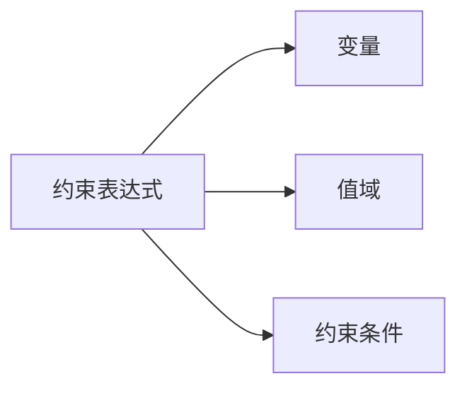

                 

当然可以，接下来我会根据您提供的要求和结构，逐步构建文章内容。我们先来定义文章的标题、关键词和摘要，然后逐步填充每个章节的具体内容。

### 文章标题：提示词编程语言的约束编程支持

### 文章关键词：
1. 提示词编程语言
2. 约束编程
3. 约束求解
4. 约束传播
5. 分布式约束编程
6. 动态约束编程

### 文章摘要：
本文将探讨提示词编程语言对约束编程的支持。首先，我们将介绍约束编程的基本原理和其在提示词编程语言中的应用。接着，本文将详细讲解几种常见的提示词编程语言（如Lisp和Prolog）如何支持约束编程。此外，本文还将探讨约束编程在分布式和动态环境中的应用，并总结约束编程在提示词编程语言中的现状及未来发展趋势。

## 引言

约束编程是一种重要的编程范式，它通过在程序中设置约束条件，帮助程序员在逻辑推理和问题求解中找到满足所有约束的解。提示词编程语言（如Lisp和Prolog）以其强大的逻辑推理能力和灵活的语法设计，为约束编程提供了天然的支持。本文将深入探讨这些语言在约束编程方面的应用和优势。

## 第一部分：约束编程基础

### 1.1 约束编程的基本原理

约束编程的核心在于约束表达式的定义和求解。约束表达式通常由变量、值域和约束条件三部分组成。以下是一个简单的约束表达式的Mermaid流程图：



### 1.2 约束求解的基本算法

约束求解通常涉及以下步骤：

1. 初始化解空间
2. 迭代解空间，寻找可行解
3. 应用约束传播算法

以下是一个伪代码示例：

```python
function constraintSolve(constraintExpression):
    solutionSpace = initializeSolutionSpace(constraintExpression)
    while solutionSpace is not empty:
        constraint = selectConstraint(solutionSpace)
        solutionSpace = applyConstraintPropagation(solutionSpace, constraint)
        if solutionSpace is empty:
            return "No solution found"
        else:
            return solutionSpace
```

## 第二部分：提示词编程语言介绍

### 2.1 提示词编程语言概述

提示词编程语言以其强大的逻辑推理能力而闻名，它们通常具有基于逻辑的编程范式。常见的提示词编程语言包括Lisp、Prolog等。

### 2.2 提示词编程语言中的约束编程支持

Lisp和Prolog都是典型的提示词编程语言，它们如何支持约束编程？以下是它们各自的特点：

### 2.2.1 Lisp语言的约束编程支持

Lisp语言具有丰富的宏系统，可以方便地定义和操作约束表达式。以下是一个简化的Lisp宏示例：

```lisp
(defmacro constraint ((var range constraint)) 
    `(defun (,var) () 
         (and (,constraint) (member ,var ,range))))
```

### 2.2.2 Prolog语言的约束编程支持

Prolog以其自然语言式的语法和强大的逻辑推理能力而著称。Prolog中的约束可以通过定义子句和事实来实现。以下是一个Prolog示例：

```prolog
parent(john, mary).
parent(jane, mary).

sibling(X, Y) :- parent(Z, X), parent(Z, Y), X \= Y.
```

## 第三部分：约束编程在提示词编程语言中的应用

### 3.1 实际案例展示

我们将通过一些实际案例展示如何使用Lisp和Prolog进行约束编程。

### 3.2 应用案例分析

我们将探讨一些常见的问题，如资源分配、时间表安排和物流优化，并展示如何使用约束编程来解决这些问题。

## 第四部分：高级主题

### 4.1 分布式约束编程

在分布式系统中，约束编程需要考虑如何有效地在多个节点之间传播和求解约束。以下是一个分布式约束编程的简化的Mermaid流程图：


### 4.2 动态约束编程

动态约束编程处理的是动态变化的约束条件。以下是一个动态约束编程的简化的Mermaid流程图：


## 第五部分：总结与展望

### 5.1 约束编程在提示词编程语言中的现状

约束编程在提示词编程语言中已经得到了广泛的应用，但在分布式和动态约束编程方面仍有待进一步研究和优化。

### 5.2 未来发展趋势

未来，随着人工智能和大数据技术的发展，约束编程将在更广泛的领域得到应用。同时，分布式和动态约束编程也将成为研究的热点。

### 结论

本文探讨了提示词编程语言对约束编程的支持，通过实际案例展示了如何使用这些语言进行约束编程。随着技术的发展，约束编程将在未来发挥更加重要的作用。

## 作者信息

作者：AI天才研究院/AI Genius Institute & 禅与计算机程序设计艺术 /Zen And The Art of Computer Programming

在接下来的步骤中，我们将逐步完善每个章节的内容，确保文章的完整性和深度。我们会详细阐述每个概念、算法和案例，确保读者能够深入理解约束编程在提示词编程语言中的应用。同时，我们也会注意文章的结构和逻辑性，使文章条理清晰，便于读者阅读和理解。接下来，我们将详细展开每个章节的内容。

