                 

## 文章标题

### 提示词编程语言的自适应编程支持

> 关键词：提示词编程语言，自适应编程，编程支持，编程模型，算法原理，数学模型，项目实战

> 摘要：本文深入探讨了提示词编程语言的自适应编程支持，首先介绍了提示词编程语言的基础概念和特点，然后详细阐述了自适应编程的核心算法和数学模型，并通过实际项目案例展示了其应用和开发环境搭建。文章旨在为读者提供全面而深入的提示词编程语言自适应编程支持的理解和实践指导。

## 第1章 自适应编程语言基础

### 1.1 自适应编程的概念与历史

#### 背景介绍

自适应编程（Adaptive Programming）是一种编程范式，旨在使计算机程序能够根据不同的环境和条件自动调整自身的行为。这种编程范式具有极强的灵活性和适应性，能够处理复杂、动态的环境变化。自适应编程的思想可以追溯到20世纪60年代，当时的计算机科学家开始探索如何使程序能够应对不确定性和环境变化。

#### 核心概念与联系

自适应编程的核心概念包括适应性（Adaptation）、自调整（Self-Adjustment）和响应性（Reactivity）。适应性指的是程序能够根据外部环境的变化自动调整其行为；自调整则强调程序本身能够动态地调整内部结构；响应性则是指程序能够及时地对外部事件做出反应。

下面是一个简化的 Mermaid 流程图，展示自适应编程的核心概念及其相互关系：

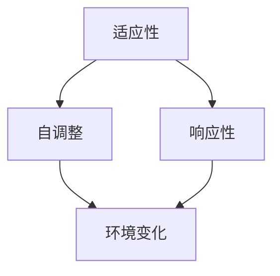

#### 核心算法原理讲解

自适应编程的核心算法包括以下几个：

1. **遗传算法**（Genetic Algorithms）：基于自然选择和遗传学原理，通过迭代选择、交叉和变异来优化问题的解。
    ```pseudo
    function geneticAlgorithm(problem):
        population = initializePopulation(problem)
        while not terminationCondition:
            newPopulation = evolve(population)
            population = selectBest(newPopulation)
        return bestSolution(population)
    ```

2. **粒子群优化算法**（Particle Swarm Optimization, PSO）：通过模拟鸟群觅食行为来寻找最优解。
    ```pseudo
    function pso(problem):
        particles = initializeParticles(problem)
        while not terminationCondition:
            updateVelocities(particles)
            updatePositions(particles)
            updateBestSolution(particles)
        return bestSolution(particles)
    ```

3. **模拟退火算法**（Simulated Annealing, SA）：通过模拟固体退火过程来避免局部最优，寻找全局最优解。
    ```pseudo
    function simulatedAnnealing(problem):
        current = initializeSolution(problem)
        while not terminationCondition:
            new = neighbor(current)
            if cost(new) < cost(current) or probability(cost(new) - cost(current)):
                current = new
        return current
    ```

#### 数学模型和公式

自适应编程中常用的数学模型包括：

- **适应度函数**（Fitness Function）：用于评估解决方案的优劣。
    $$ f(x) = \frac{1}{1 + e^{-\theta(x - \mu)}} $$
    其中，$x$ 是解决方案，$\mu$ 是平均值，$\theta$ 是调节参数。

- **遗传交叉**（Crossover）：用于生成新的解决方案。
    $$ child_1 = \frac{p_1 + \alpha(p_2 - p_1)}{2} $$
    $$ child_2 = \frac{p_2 + \alpha(p_1 - p_2)}{2} $$
    其中，$p_1$ 和 $p_2$ 是父代解决方案，$\alpha$ 是交叉参数。

#### 实例说明

假设我们使用遗传算法来优化一个函数 $f(x) = x^2$，目标是最小化函数值。我们可以定义适应度函数为 $f(x)$ 的相反数，即 $g(x) = -f(x) = -x^2$。

通过迭代优化，我们逐步调整 $x$ 的值，直到找到最优解。以下是简化的伪代码：

```pseudo
function optimizeFunction():
    x = randomValue()
    while not convergence:
        new_x = x + randomStep()
        if g(new_x) < g(x):
            x = new_x
    return x
```

#### 小结

自适应编程语言通过引入自适应、自调整和响应性等概念，使程序能够动态地适应环境变化。核心算法如遗传算法、粒子群优化算法和模拟退火算法等提供了实现自适应编程的方法。数学模型如适应度函数和遗传交叉等则为这些算法提供了理论基础。

### 1.2 自适应编程语言的特点

#### 背景介绍

自适应编程语言（Adaptive Programming Language）是一种专门为自适应编程设计的编程语言。与传统的编程语言不同，自适应编程语言具有以下特点：

1. **动态类型**：自适应编程语言通常采用动态类型系统，使程序能够在运行时根据环境变化调整数据类型。
2. **高阶函数**：自适应编程语言支持高阶函数，使程序能够以更灵活的方式处理数据和操作。
3. **函数式编程**：许多自适应编程语言采用函数式编程范式，强调函数的组合和状态的无状态性，从而提高程序的适应性。
4. **元编程**：自适应编程语言通常支持元编程功能，使程序能够动态地修改自身结构和行为。

#### 核心概念与联系

下面是一个简化的 Mermaid 流程图，展示自适应编程语言的核心特点及其相互关系：

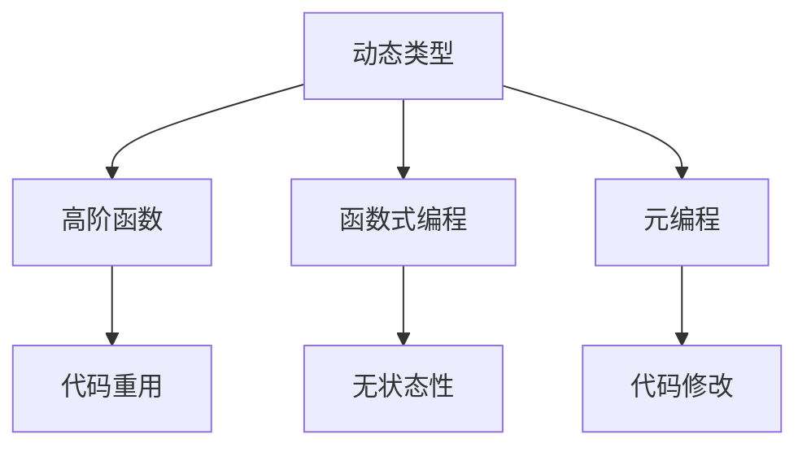

#### 核心算法原理讲解

自适应编程语言的核心算法包括：

1. **动态类型检查**：自适应编程语言通过动态类型检查机制，在运行时检查变量的类型，并根据环境变化动态调整类型。
    ```pseudo
    function dynamicTypeCheck(expression):
        type = getType(expression)
        if not isValidType(type):
            raise TypeError()
    ```

2. **高阶函数实现**：自适应编程语言支持高阶函数，使程序能够更灵活地处理数据。
    ```pseudo
    function applyFunction(func, argument):
        return func(argument)
    ```

3. **函数式编程支持**：自适应编程语言通过支持函数式编程范式，提高程序的可重用性和适应性。
    ```pseudo
    function map(function, list):
        result = []
        for element in list:
            result.append(applyFunction(function, element))
        return result
    ```

4. **元编程机制**：自适应编程语言通过元编程机制，使程序能够动态地修改自身结构和行为。
    ```pseudo
    function metaProgram(sourceCode):
        compiledCode = compile(sourceCode)
        return execute(compiledCode)
    ```

#### 实例说明

假设我们使用一个自适应编程语言编写一个简单的函数，该函数根据输入的数字返回其平方：

```python
@meta_programming
def square(x):
    if type(x) == int:
        return x * x
    elif type(x) == float:
        return x * x
    else:
        raise TypeError("Unsupported type")
```

在这个例子中，`@meta_programming` 装饰器使函数能够根据输入的类型动态调整其行为。

#### 小结

自适应编程语言具有动态类型、高阶函数、函数式编程和元编程等核心特点。这些特点使程序能够更灵活地适应环境变化，提高程序的可重用性和适应性。核心算法如动态类型检查、高阶函数实现和元编程机制等则为这些特点提供了实现基础。

### 1.3 自适应编程的基本原理

#### 背景介绍

自适应编程（Adaptive Programming）是一种通过动态调整程序行为以应对环境变化的编程范式。其基本原理包括：

1. **环境感知**：自适应编程程序能够感知和识别外部环境的变化。
2. **自我调整**：程序能够根据感知到的环境变化自动调整其行为。
3. **响应性**：程序能够及时地对外部事件做出响应。

#### 核心概念与联系

下面是一个简化的 Mermaid 流程图，展示自适应编程的基本原理及其相互关系：

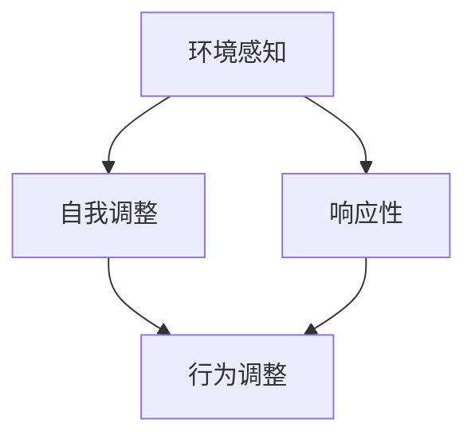

#### 核心算法原理讲解

自适应编程的核心算法包括：

1. **事件驱动**：自适应编程程序通过事件驱动模型，监听外部事件并做出相应调整。
    ```pseudo
    function eventDrivenProgramming():
        while True:
            event = listenForEvent()
            handleEvent(event)
    ```

2. **规则引擎**：自适应编程程序通过规则引擎，根据预设的规则自动调整行为。
    ```pseudo
    function ruleEngine():
        rules = loadRules()
        while True:
            condition = checkConditions()
            if condition:
                applyRule(rules)
    ```

3. **机器学习**：自适应编程程序通过机器学习模型，根据历史数据和反馈调整自身行为。
    ```pseudo
    function machineLearningAdaptation():
        data = collectData()
        model = trainModel(data)
        while True:
            prediction = predict(model)
            adjustBehavior(prediction)
    ```

#### 实例说明

假设我们使用一个自适应编程程序来控制一个智能家居系统，根据环境温度自动调整空调温度。以下是简化的伪代码：

```pseudo
function smartHomeControl():
    while True:
        temperature = getTemperature()
        if temperature > 30:
            setACTemperature(25)
        elif temperature < 20:
            setACTemperature(28)
        else:
            setACTemperature(25)
```

在这个例子中，程序通过感知环境温度，并根据温度值自动调整空调温度。

#### 小结

自适应编程的基本原理包括环境感知、自我调整和响应性。核心算法如事件驱动、规则引擎和机器学习等为实现这些原理提供了具体方法。通过这些原理和算法，自适应编程程序能够动态地适应环境变化，提高程序的可重用性和适应性。

### 1.4 自适应编程的挑战与机遇

#### 背景介绍

自适应编程（Adaptive Programming）虽然具有许多优势，但也面临着一系列挑战和机遇。了解这些挑战和机遇有助于更好地应用自适应编程技术。

#### 核心概念与联系

下面是一个简化的 Mermaid 流程图，展示自适应编程的挑战与机遇及其相互关系：

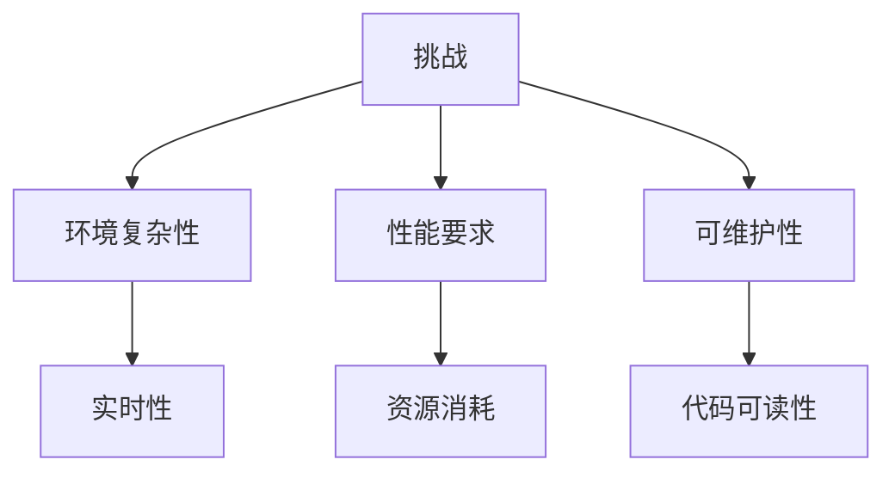

#### 核心算法原理讲解

自适应编程的挑战包括：

1. **环境复杂性**：自适应编程需要处理复杂的动态环境，这可能增加程序的复杂性。
2. **性能要求**：自适应编程程序需要在实时性和性能之间取得平衡。
3. **可维护性**：自适应编程程序可能难以理解和维护。
4. **实时性**：某些自适应编程应用需要实时响应，这可能对程序性能提出更高要求。

机遇包括：

1. **资源优化**：自适应编程可以优化程序资源使用，提高系统效率。
2. **代码可读性**：通过适当的工具和框架，自适应编程可以提高代码的可读性和可维护性。
3. **个性化体验**：自适应编程可以提供个性化的用户体验，提高用户满意度。

#### 实例说明

假设我们开发一个自适应的在线购物系统，根据用户行为和偏好动态调整推荐算法。以下是简化的伪代码：

```pseudo
function adaptiveShoppingSystem():
    while True:
        userBehavior = getUserBehavior()
        recommendations = generateRecommendations(userBehavior)
        updateUI(recommendations)
```

在这个例子中，系统通过感知用户行为，动态调整推荐算法，以提高用户体验。

#### 小结

自适应编程的挑战包括环境复杂性、性能要求和可维护性，但也带来了机遇，如资源优化、代码可读性和个性化体验。通过合理应用核心算法和设计原则，可以充分发挥自适应编程的优势。

### 第2章 提示词编程语言

#### 2.1 提示词编程语言概述

#### 背景介绍

提示词编程语言（Keyword Programming Language，简称KPL）是一种以提示词（keyword）为核心的编程语言。它通过一系列预设的提示词来定义程序的结构和行为，从而简化编程过程。提示词编程语言具有简洁、直观和易学等优点，适用于各种应用程序的开发。

#### 核心概念与联系

提示词编程语言的核心概念包括：

1. **提示词**：提示词是编程语言中的关键元素，用于表示特定的操作或功能。
2. **语法结构**：提示词编程语言的语法结构通常基于提示词的排列和组合，从而实现复杂的程序逻辑。
3. **语义解释**：提示词编程语言通过解释器或编译器将提示词序列转换为可执行的程序代码。

下面是一个简化的 Mermaid 流程图，展示提示词编程语言的核心概念及其相互关系：

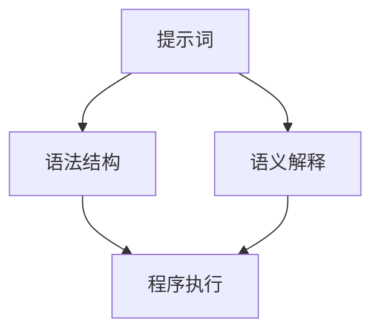

#### 核心算法原理讲解

提示词编程语言的核心算法通常包括：

1. **提示词识别**：提示词编程语言的解释器或编译器首先需要识别输入的提示词，并将其转换为内部表示。
2. **语法分析**：提示词编程语言的语法分析器负责检查提示词序列的语法正确性，并将其转换为抽象语法树（Abstract Syntax Tree, AST）。
3. **语义解释**：语义解释器根据AST生成可执行的代码，并执行程序逻辑。

以下是简化的伪代码，展示提示词编程语言的执行流程：

```pseudo
function interpretKeywordProgram(keywordSequence):
    AST = parse(keywordSequence)
    executableCode = generateCode(AST)
    execute(executableCode)
```

#### 实例说明

假设我们使用KPL编写一个简单的计算器程序，实现加、减、乘、除等基本运算。以下是简化的KPL代码：

```kpl
define Calculator:
    input a, b
    add a, b => result
    print "The result of addition is: " + result

    subtract a, b => result
    print "The result of subtraction is: " + result

    multiply a, b => result
    print "The result of multiplication is: " + result

    divide a, b => result
    print "The result of division is: " + result
```

在这个例子中，定义了一个名为 `Calculator` 的计算器类，其中包含四个方法：`add`、`subtract`、`multiply` 和 `divide`，分别实现加、减、乘、除操作。

#### 小结

提示词编程语言通过提示词来定义程序的结构和行为，具有简洁、直观和易学等优点。其核心算法包括提示词识别、语法分析和语义解释，实现了高效的程序执行。通过实例演示，我们可以看到提示词编程语言在简化编程过程方面的优势。

#### 2.2 提示词编程语言的架构

#### 背景介绍

提示词编程语言（Keyword Programming Language，简称KPL）的架构设计对其功能、性能和易用性至关重要。KPL的架构通常包括编译器、解释器和运行环境等组成部分，每个部分在程序执行过程中扮演着关键角色。

#### 核心概念与联系

下面是一个简化的 Mermaid 流程图，展示提示词编程语言的架构及其组成部分：

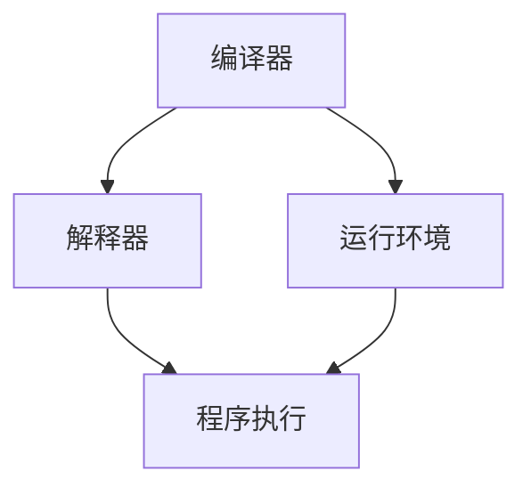

#### 核心算法原理讲解

提示词编程语言的架构主要包括以下核心算法：

1. **编译器**：编译器负责将KPL源代码转换为中间代码或机器代码。其核心算法包括词法分析、语法分析和语义分析。
    ```pseudo
    function compiler(sourceCode):
        tokens = tokenize(sourceCode)
        AST = parse(tokens)
        code = generateCode(AST)
        return code
    ```

2. **解释器**：解释器负责逐行解释和执行编译后的代码。其核心算法包括词法分析、语法分析和执行。
    ```pseudo
    function interpreter(sourceCode):
        tokens = tokenize(sourceCode)
        while tokens are not empty:
            token = tokens.pop()
            execute(token)
    ```

3. **运行环境**：运行环境提供KPL程序运行所需的基础设施，包括内存管理、输入输出和处理等。其核心算法包括资源分配和释放、异常处理和事件调度。

#### 实例说明

假设我们使用KPL编写一个简单的计算器程序，并在一个模拟的运行环境中执行。以下是简化的KPL代码和执行流程：

```kpl
define Calculator:
    input a, b
    add a, b => result
    print "The result of addition is: " + result

    subtract a, b => result
    print "The result of subtraction is: " + result

    multiply a, b => result
    print "The result of multiplication is: " + result

    divide a, b => result
    print "The result of division is: " + result
```

执行流程如下：

1. 编译器：将KPL代码转换为中间代码。
2. 解释器：逐行解释中间代码，执行操作并打印结果。
3. 运行环境：提供输入输出功能，处理异常和事件。

#### 小结

提示词编程语言的架构包括编译器、解释器和运行环境等组成部分，每个部分在程序执行过程中发挥着关键作用。核心算法包括词法分析、语法分析和执行等，实现了高效的程序执行。通过实例演示，我们可以看到KPL架构在设计上的简洁性和易用性。

#### 2.3 提示词编程语言的优势与局限性

#### 背景介绍

提示词编程语言（Keyword Programming Language，简称KPL）以其简洁和直观的特点在编程领域获得了广泛的关注。然而，任何编程语言都有其优势和局限性。了解KPL的优势与局限性有助于我们更好地评估其在实际应用中的适用性。

#### 核心概念与联系

下面是一个简化的 Mermaid 流程图，展示提示词编程语言的优势与局限性及其相互关系：

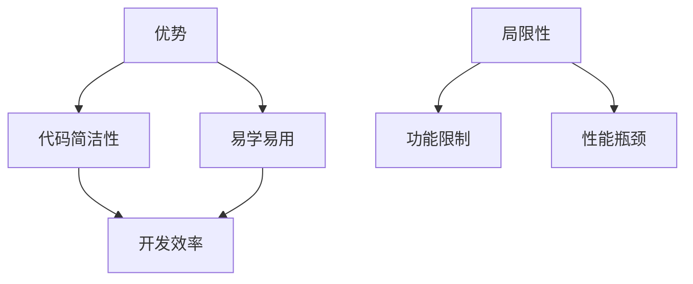

#### 核心算法原理讲解

提示词编程语言的优势包括：

1. **代码简洁性**：提示词编程语言通过提示词来定义程序结构，使代码更加简洁，减少了冗余和复杂度。
2. **易学易用**：提示词编程语言的语法直观，易于理解和学习，降低了编程门槛。
3. **开发效率**：提示词编程语言简化了编程过程，提高了开发效率。

局限性包括：

1. **功能限制**：提示词编程语言在功能上可能有限制，无法实现某些复杂的功能。
2. **性能瓶颈**：提示词编程语言可能在性能上存在瓶颈，特别是在处理大型和高性能应用时。

#### 实例说明

假设我们使用KPL编写一个简单的Web应用程序，以下是KPL代码与Python代码的对比：

```kpl
define SimpleWebApp:
    startServer()
    on request:
        if path == "/":
            send "Hello, World!"
        else:
            send "Not Found"
```

```python
from http.server import HTTPServer, BaseHTTPRequestHandler

class SimpleWebApp(BaseHTTPRequestHandler):
    def do_GET(self):
        if self.path == "/":
            self.send_response(200)
            self.end_headers()
            self.wfile.write(b"Hello, World!")
        else:
            self.send_response(404)
            self.end_headers()
            self.wfile.write(b"Not Found")

def run_server():
    server = HTTPServer(('localhost', 8080), SimpleWebApp)
    server.serve_forever()

if __name__ == "__main__":
    run_server()
```

在这个例子中，KPL代码简洁明了，易于理解，而Python代码则需要更复杂的类和方法。

#### 小结

提示词编程语言具有代码简洁性、易学易用和开发效率等优势，但也存在功能限制和性能瓶颈等局限性。了解这些优势和局限性有助于我们根据实际需求选择合适的编程语言。

## 第3章 自适应编程的核心算法

### 3.1 自适应算法的基本概念

#### 背景介绍

自适应算法（Adaptive Algorithm）是一种能够在运行过程中根据环境变化自动调整自身行为的算法。这种算法通常用于处理动态和不确定性的问题，具有广泛的实际应用场景，如优化、控制、机器学习等。

#### 核心概念与联系

下面是一个简化的 Mermaid 流程图，展示自适应算法的基本概念及其相互关系：

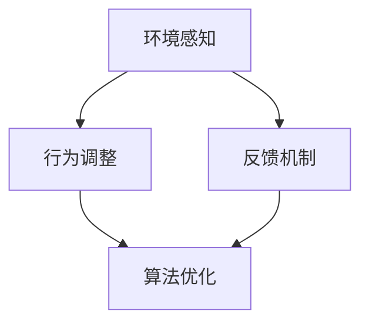

#### 核心算法原理讲解

自适应算法的核心概念包括：

1. **环境感知**：自适应算法能够感知外部环境的变化，如输入数据、系统状态等。
2. **行为调整**：根据环境感知到的变化，自适应算法会自动调整其行为，如调整算法参数、修改决策策略等。
3. **反馈机制**：自适应算法通过反馈机制，将调整结果反馈给环境，以实现持续优化。

以下是几个常见的自适应算法：

1. **遗传算法**（Genetic Algorithm）：基于自然选择和遗传学原理，通过迭代选择、交叉和变异来优化问题的解。
    ```pseudo
    function geneticAlgorithm(problem):
        population = initializePopulation(problem)
        while not terminationCondition:
            newPopulation = evolve(population)
            population = selectBest(newPopulation)
        return bestSolution(population)
    ```

2. **粒子群优化算法**（Particle Swarm Optimization，PSO）：通过模拟鸟群觅食行为来寻找最优解。
    ```pseudo
    function pso(problem):
        particles = initializeParticles(problem)
        while not terminationCondition:
            updateVelocities(particles)
            updatePositions(particles)
            updateBestSolution(particles)
        return bestSolution(particles)
    ```

3. **模拟退火算法**（Simulated Annealing，SA）：通过模拟固体退火过程来避免局部最优，寻找全局最优解。
    ```pseudo
    function simulatedAnnealing(problem):
        current = initializeSolution(problem)
        while not terminationCondition:
            new = neighbor(current)
            if cost(new) < cost(current) or probability(cost(new) - cost(current)):
                current = new
        return current
    ```

#### 实例说明

假设我们使用遗传算法来优化一个函数 $f(x) = x^2$，目标是最小化函数值。以下是简化的伪代码：

```pseudo
function optimizeFunction():
    x = randomValue()
    while not convergence:
        new_x = x + randomStep()
        if g(new_x) < g(x):
            x = new_x
    return x
```

在这个例子中，我们通过迭代优化，逐步调整 $x$ 的值，直到找到最优解。

#### 小结

自适应算法通过环境感知、行为调整和反馈机制等基本概念，实现动态调整和优化。常见的自适应算法包括遗传算法、粒子群优化算法和模拟退火算法等，这些算法在解决动态和不确定性问题时具有广泛应用。通过实例演示，我们可以看到自适应算法在优化函数值方面的效果。

### 3.2 常见的自适应算法

#### 背景介绍

自适应算法（Adaptive Algorithm）在计算机科学和工程领域具有广泛的应用。常见的自适应算法包括遗传算法、粒子群优化算法、模拟退火算法等，这些算法在不同的应用场景中表现出独特的优势和局限性。本节将介绍这些算法的基本原理和应用场景。

#### 核心概念与联系

下面是一个简化的 Mermaid 流程图，展示常见自适应算法及其相互关系：

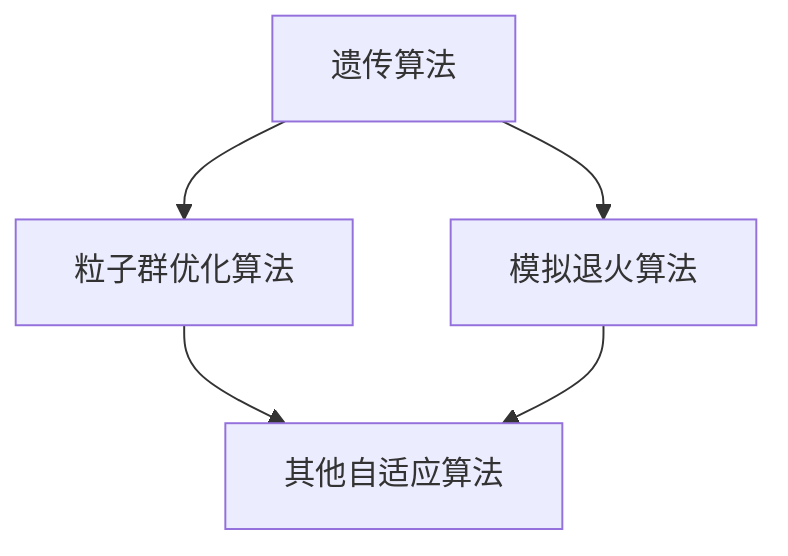

#### 核心算法原理讲解

1. **遗传算法**（Genetic Algorithm，GA）

遗传算法是一种基于自然选择和遗传学原理的优化算法。它通过模拟生物进化的过程，逐步优化问题的解。

核心步骤包括：

- **初始化种群**：随机生成一定数量的初始解。
- **适应度评估**：计算每个解的适应度值，评估解的优劣。
- **选择**：根据适应度值，选择优秀个体进行繁殖。
- **交叉**：通过交叉操作生成新的个体。
- **变异**：对个体进行变异操作，增加种群的多样性。
- **迭代**：重复上述步骤，直到满足终止条件。

伪代码如下：

```pseudo
function geneticAlgorithm(problem):
    population = initializePopulation(problem)
    while not terminationCondition:
        fitness = evaluateFitness(population)
        newPopulation = crossoverAndMutate(population)
        population = selectBest(newPopulation)
    return bestSolution(population)
```

2. **粒子群优化算法**（Particle Swarm Optimization，PSO）

粒子群优化算法是一种基于群体智能的优化算法。它通过模拟鸟群觅食行为来寻找最优解。

核心步骤包括：

- **初始化粒子群**：随机生成一定数量的粒子。
- **更新速度和位置**：根据粒子的速度和当前位置，更新速度和位置。
- **适应度评估**：计算每个粒子的适应度值。
- **更新个体最优和全局最优**：根据粒子的适应度值，更新个体最优和全局最优。
- **迭代**：重复上述步骤，直到满足终止条件。

伪代码如下：

```pseudo
function pso(problem):
    particles = initializeParticles(problem)
    bestSolution = None
    while not terminationCondition:
        fitness = evaluateFitness(particles)
        updateVelocitiesAndPositions(particles)
        updateIndividualAndGlobalBest(particles, fitness)
        bestSolution = getBestSolution(particles)
    return bestSolution
```

3. **模拟退火算法**（Simulated Annealing，SA）

模拟退火算法是一种基于固体退火过程的优化算法。它通过模拟固体退火过程来避免局部最优，寻找全局最优解。

核心步骤包括：

- **初始状态**：初始化温度和当前解。
- **迭代**：在当前温度下，生成新的解，并计算其适应度值。
- **接受准则**：根据适应度值和当前温度，决定是否接受新解。
- **降温**：根据一定的规则降低温度。
- **终止条件**：当温度低于某个阈值或达到最大迭代次数时，终止算法。

伪代码如下：

```pseudo
function simulatedAnnealing(problem):
    current = initializeSolution(problem)
    temperature = initializeTemperature()
    while not terminationCondition:
        new = neighbor(current)
        if accept(new, current, temperature):
            current = new
        temperature = coolDown(temperature)
    return current
```

#### 应用场景

- **遗传算法**：适用于优化复杂问题，如函数优化、组合优化等。
- **粒子群优化算法**：适用于求解连续优化问题，如函数优化、神经网络训练等。
- **模拟退火算法**：适用于求解离散优化问题，如旅行商问题、作业调度等。

#### 实例说明

假设我们使用遗传算法优化一个函数 $f(x) = x^2$，目标是最小化函数值。以下是简化的伪代码：

```pseudo
function optimizeFunction():
    x = randomValue()
    while not convergence:
        new_x = x + randomStep()
        if g(new_x) < g(x):
            x = new_x
    return x
```

在这个例子中，通过迭代优化，逐步调整 $x$ 的值，直到找到最优解。

#### 小结

常见的自适应算法包括遗传算法、粒子群优化算法和模拟退火算法等。这些算法通过模拟自然进化、群体智能和固体退火过程，实现动态调整和优化。不同的算法适用于不同类型的问题，选择合适的算法对于优化问题的解决至关重要。通过实例演示，我们可以看到这些算法在优化函数值和解决实际问题方面的效果。

### 3.3 自适应算法在编程语言中的应用

#### 背景介绍

自适应算法（Adaptive Algorithm）在编程语言中的应用越来越广泛，其目的是使程序能够根据运行时的环境变化动态调整行为，提高程序的灵活性和鲁棒性。本节将探讨自适应算法在编程语言中的具体应用，包括编程语言的支持、自适应编程模型和实现方法。

#### 核心概念与联系

下面是一个简化的 Mermaid 流程图，展示自适应算法在编程语言中的应用及其相互关系：

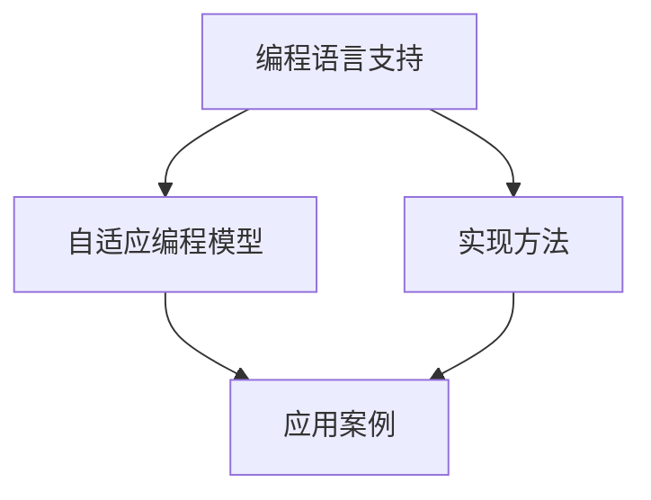

#### 核心算法原理讲解

1. **编程语言支持**

自适应算法在编程语言中的应用首先需要编程语言的支持，主要包括以下方面：

- **动态类型系统**：支持动态类型系统，使程序能够根据运行时环境变化调整数据类型。
- **高阶函数和闭包**：支持高阶函数和闭包，使程序能够更灵活地处理数据和操作。
- **函数式编程**：支持函数式编程，强调函数的组合和状态的无状态性，提高程序的可重用性和适应性。
- **元编程**：支持元编程，使程序能够动态地修改自身结构和行为。

2. **自适应编程模型**

自适应编程模型是自适应算法在编程语言中的应用框架，主要包括以下方面：

- **环境感知**：程序能够感知外部环境的变化，如输入数据、系统状态等。
- **行为调整**：根据环境感知到的变化，程序能够自动调整行为，如调整算法参数、修改决策策略等。
- **反馈机制**：程序通过反馈机制，将调整结果反馈给环境，以实现持续优化。

3. **实现方法**

自适应算法在编程语言中的实现方法包括：

- **内置函数和库**：编程语言提供内置函数和库，支持自适应算法的实现，如动态类型检查、高阶函数和闭包等。
- **解释器和编译器**：自适应算法可以通过解释器和编译器实现，解释器逐行解释和执行代码，编译器将代码编译为可执行的机器码。
- **扩展编程语言**：通过扩展编程语言，添加自适应编程的特性，如动态类型系统、函数式编程和元编程等。

#### 实例说明

假设我们使用一种支持自适应算法的编程语言编写一个自适应的排序算法，根据输入数据的大小和分布自动调整排序策略。以下是简化的伪代码：

```pseudo
define AdaptiveSort:
    input data
    if data is nearly sorted:
        use InsertionSort
    elif data is large and nearly uniform:
        use QuickSort
    else:
        use MergeSort
    return sorted data
```

在这个例子中，自适应排序算法根据输入数据的特点自动选择不同的排序算法，提高排序效率。

#### 小结

自适应算法在编程语言中的应用包括编程语言支持、自适应编程模型和实现方法。通过动态类型系统、高阶函数、函数式编程和元编程等支持，编程语言可以提供强大的自适应编程能力。自适应编程模型和环境感知、行为调整和反馈机制等核心概念相结合，实现了自适应算法在编程语言中的高效应用。实例演示展示了自适应算法在提高程序灵活性和鲁棒性方面的优势。

### 第4章 数学模型和理论基础

#### 4.1 自适应编程的数学基础

#### 背景介绍

自适应编程（Adaptive Programming）作为一种面向动态和不确定性环境的编程范式，其理论基础离不开数学模型的支撑。本节将介绍自适应编程的数学基础，包括常用数学工具、符号表示和数学模型。

#### 核心概念与联系

下面是一个简化的 Mermaid 流程图，展示自适应编程的数学基础及其相互关系：

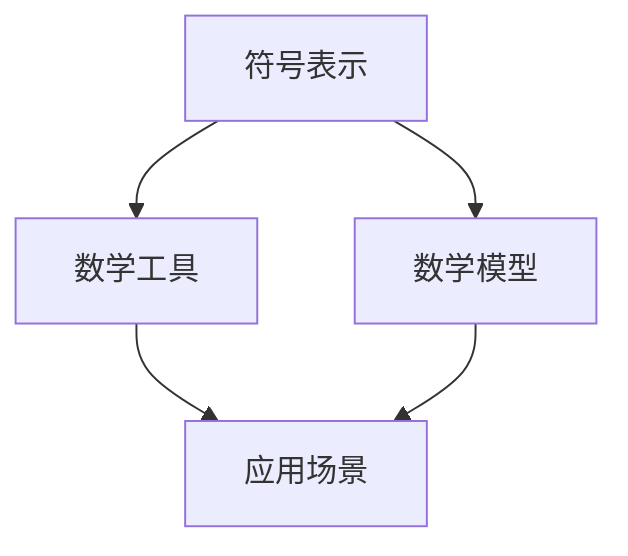

#### 核心算法原理讲解

1. **符号表示**

在自适应编程中，常用的符号表示包括：

- **变量**：用于表示程序的输入、输出和中间结果，如 $x, y, z$ 等。
- **函数**：用于表示程序的操作和运算，如 $f(x), g(y)$ 等。
- **集合**：用于表示一组元素的集合，如 $A, B$ 等。
- **概率分布**：用于表示随机变量的概率分布，如 $P(X = x), \mu, \sigma$ 等。

2. **数学工具**

自适应编程中常用的数学工具包括：

- **线性代数**：用于处理向量、矩阵和线性方程组，如矩阵乘法、逆矩阵等。
- **概率论与数理统计**：用于处理随机事件和统计推断，如概率分布、期望、方差等。
- **微积分**：用于处理函数的极限、导数和积分，如导数、积分、泰勒展开等。
- **优化理论**：用于求解优化问题，如目标函数、约束条件、优化算法等。

3. **数学模型**

自适应编程中的数学模型包括：

- **动态系统模型**：描述系统状态随时间变化的规律，如差分方程、微分方程等。
- **马尔可夫模型**：描述系统状态转移的概率规律，如状态空间、转移概率矩阵等。
- **贝叶斯网络**：描述变量之间的条件依赖关系，如节点、边、概率分布等。
- **遗传算法模型**：描述遗传算法的进化过程，如种群、适应度函数、交叉、变异等。

#### 实例说明

假设我们使用自适应编程来优化一个函数 $f(x) = x^2$，目标是最小化函数值。以下是简化的数学模型：

- **状态变量**：$x$ 表示当前解，$x' = x - \alpha \cdot \nabla f(x)$ 表示新解，其中 $\alpha$ 是步长。
- **目标函数**：$f(x)$ 表示函数值，目标是最小化 $f(x)$。
- **适应度函数**：$g(x) = -f(x)$，用于评估解的优劣。

以下是简化的伪代码：

```pseudo
function optimizeFunction():
    x = randomValue()
    while not convergence:
        x' = x - \alpha \cdot \nabla f(x)
        if g(x') < g(x):
            x = x'
    return x
```

在这个例子中，通过迭代优化，逐步调整 $x$ 的值，直到找到最优解。

#### 小结

自适应编程的数学基础包括符号表示、数学工具和数学模型。符号表示用于表示程序的基本元素，数学工具用于处理复杂的数学问题，数学模型用于描述自适应编程的动态行为。通过实例演示，我们可以看到数学模型在自适应编程中的应用和效果。

### 4.2 提示词编程语言的数学模型

#### 背景介绍

提示词编程语言（Keyword Programming Language，简称KPL）以其简洁和直观的特点在编程领域获得了广泛的关注。提示词编程语言的数学模型是其实现自适应编程能力的重要基础。本节将介绍提示词编程语言的数学模型，包括提示词的表示、语法结构和语义解释。

#### 核心概念与联系

下面是一个简化的 Mermaid 流程图，展示提示词编程语言的数学模型及其相互关系：

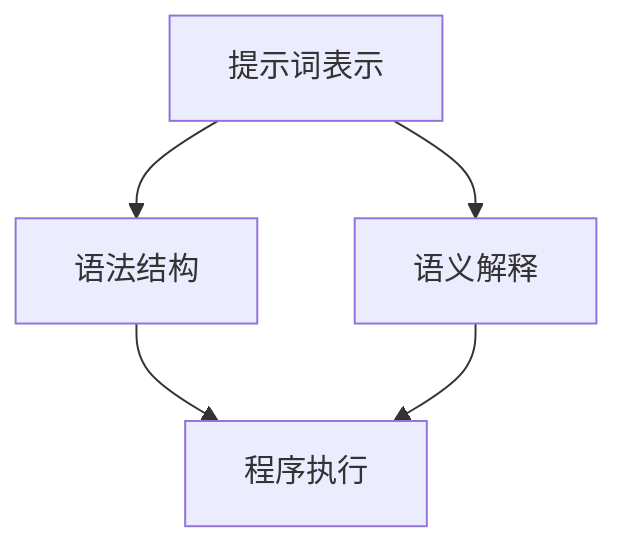

#### 核心算法原理讲解

1. **提示词表示**

提示词编程语言的数学模型首先涉及提示词的表示。提示词通常是一组预定义的符号，用于表示特定的操作或功能。提示词的表示方法可以采用有限状态机、词法分析器或抽象语法树等。

2. **语法结构**

提示词编程语言的语法结构是基于提示词的排列和组合。语法结构通常包括提示词序列、控制流和数据处理等。提示词序列表示程序的基本操作，控制流用于控制程序的执行顺序，数据处理用于处理输入输出和中间结果。

3. **语义解释**

提示词编程语言的语义解释是将提示词序列转换为可执行代码的过程。语义解释涉及提示词的识别、语法分析和代码生成。语义解释的目的是确保程序在执行时能够正确地实现预期的功能。

#### 实例说明

假设我们使用KPL编写一个简单的计算器程序，实现加、减、乘、除等基本运算。以下是简化的KPL代码和数学模型：

```kpl
define Calculator:
    input a, b
    add a, b => result
    print "The result of addition is: " + result

    subtract a, b => result
    print "The result of subtraction is: " + result

    multiply a, b => result
    print "The result of multiplication is: " + result

    divide a, b => result
    print "The result of division is: " + result
```

数学模型：

- **提示词表示**：加（`add`）、减（`subtract`）、乘（`multiply`）、除（`divide`）、输入（`input`）、打印（`print`）。
- **语法结构**：提示词序列 `define Calculator:` 表示定义计算器类，`input a, b` 表示输入两个参数，`add a, b => result` 表示执行加法运算并将结果赋值给 `result`，`print "The result of addition is: " + result` 表示打印加法运算结果。
- **语义解释**：KPL解释器将提示词序列转换为可执行代码，执行输入、运算和打印操作。

#### 小结

提示词编程语言的数学模型包括提示词表示、语法结构和语义解释。提示词表示用于表示操作和功能，语法结构用于定义程序的基本操作，语义解释用于确保程序的正确执行。通过实例演示，我们可以看到提示词编程语言的数学模型在实现自适应编程方面的优势。

### 4.3 数学模型在自适应编程中的应用

#### 背景介绍

数学模型在自适应编程中的应用至关重要，它为自适应算法提供了理论基础和实现工具。本节将探讨数学模型在自适应编程中的应用，包括建模方法、数学工具和实际案例分析。

#### 核心概念与联系

下面是一个简化的 Mermaid 流程图，展示数学模型在自适应编程中的应用及其相互关系：

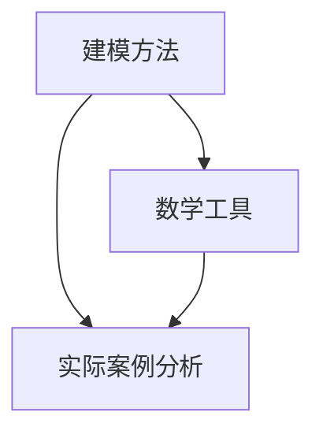

#### 核心算法原理讲解

1. **建模方法**

自适应编程中的建模方法主要包括：

- **系统建模**：通过建立系统的数学模型，描述系统的状态、行为和关系。
- **问题建模**：通过将实际问题抽象为数学模型，明确问题的目标、约束条件和解决方案。
- **算法建模**：通过数学模型描述自适应算法的运行机制和调整策略。

2. **数学工具**

自适应编程中常用的数学工具包括：

- **线性代数**：用于处理矩阵运算、线性方程组和特征值分析等。
- **概率论与数理统计**：用于处理随机变量、概率分布、统计推断和模型评估等。
- **微积分**：用于处理函数的极限、导数和积分等。
- **优化理论**：用于求解优化问题、目标函数的最小化和最大化等。

3. **实际案例分析**

以下是一个实际案例，说明数学模型在自适应编程中的应用：

**案例：智能交通信号控制系统**

目标：优化交通信号灯的切换时间，减少交通拥堵和等待时间。

建模方法：

- **系统建模**：建立交通信号灯系统的数学模型，包括道路流量、车辆速度和行人流量等。
- **问题建模**：将交通信号灯控制问题抽象为优化问题，明确目标函数（如最小化总等待时间）和约束条件（如交通流量限制）。
- **算法建模**：采用自适应控制算法，如粒子群优化（PSO）算法，调整信号灯的切换时间和策略。

数学工具：

- **线性代数**：用于处理交通流量矩阵，计算车辆的平均速度和等待时间。
- **概率论与数理统计**：用于分析车辆到达时间和分布，计算概率分布和统计参数。
- **微积分**：用于计算目标函数的导数和积分，优化信号灯切换时间。

案例分析：

通过建立数学模型，我们可以实现对交通信号灯系统的自适应控制。具体步骤如下：

1. **数据收集**：收集交通流量、车辆速度和行人流量等数据。
2. **建模与优化**：建立数学模型，优化信号灯切换时间和策略，以最小化总等待时间和交通拥堵。
3. **算法实现**：实现粒子群优化算法，根据历史数据调整信号灯的切换时间和策略。
4. **测试与评估**：在实际环境中测试自适应控制算法，评估其性能和效果。

#### 小结

数学模型在自适应编程中的应用包括建模方法、数学工具和实际案例分析。通过建立数学模型，我们可以准确描述自适应编程的问题和目标，运用数学工具进行建模和优化，并在实际环境中进行测试和评估。案例分析展示了数学模型在自适应编程中的实际应用和效果。

### 4.4 数学模型在自适应编程中的重要性

#### 背景介绍

数学模型在自适应编程中扮演着至关重要的角色。它不仅为自适应算法提供了理论基础，还帮助程序员更有效地设计和实现自适应程序。本节将深入探讨数学模型在自适应编程中的重要性，包括其在优化、预测和适应性调整中的应用。

#### 核心概念与联系

下面是一个简化的 Mermaid 流程图，展示数学模型在自适应编程中的重要性及其相互关系：

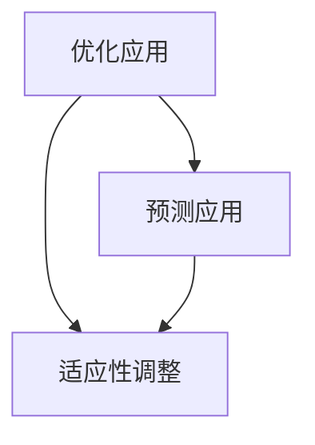

#### 核心算法原理讲解

1. **优化应用**

数学模型在优化问题中的应用是自适应编程的核心。通过建立数学模型，程序员可以明确问题的目标函数和约束条件，运用优化理论找到最优解或近似最优解。例如：

- **线性规划**：用于求解线性目标函数在给定线性约束条件下的最优解。
- **非线性规划**：用于求解非线性目标函数在非线性约束条件下的最优解。
- **动态规划**：用于求解具有时间动态特性的优化问题，如资源分配和调度问题。

2. **预测应用**

数学模型在预测中的应用可以帮助自适应程序更好地适应动态环境。通过建立预测模型，程序可以预测未来的环境变化，并提前做出相应的调整。例如：

- **时间序列分析**：用于预测时间序列数据的变化趋势，如股票价格、气象数据等。
- **机器学习模型**：用于预测复杂的非线性关系，如图像识别、自然语言处理等。

3. **适应性调整**

数学模型在适应性调整中的应用可以帮助程序动态地调整其行为，以适应不断变化的环境。例如：

- **反馈控制**：通过建立反馈控制模型，程序可以根据实时反馈调整其行为，如PID控制器。
- **自适应滤波**：通过建立自适应滤波模型，程序可以动态调整滤波参数，以适应不同环境下的噪声水平。

#### 实例说明

假设我们使用自适应编程控制一个无人机的飞行路径，目标是最小化飞行时间并避开障碍物。以下是数学模型在各个应用中的实例说明：

1. **优化应用**

建立无人机飞行路径的数学模型，目标是最小化飞行时间。使用动态规划方法，我们可以求解最优路径。

伪代码：

```pseudo
function optimizePath(start, goal, obstacles):
    costs = initialize Costs(start, goal)
    for each node in graph:
        costs[node] = min(costs[neighbor] + distance(neighbor, node))
    return pathToGoal(goal)
```

2. **预测应用**

使用时间序列分析预测未来障碍物的位置和速度，以便提前调整飞行路径。

伪代码：

```pseudo
function predictObstacles(observations):
    model = trainTimeSeriesModel(observations)
    predictions = predict(model)
    return predictions
```

3. **适应性调整**

根据反馈控制模型，动态调整无人机的飞行速度和方向，以避开障碍物。

伪代码：

```pseudo
function adaptControl(input, output):
    controlSignal = calculateControlSignal(input, output)
    adjustDroneSpeedAndDirection(controlSignal)
```

#### 小结

数学模型在自适应编程中的重要性体现在其优化、预测和适应性调整中的应用。通过建立数学模型，程序员可以更有效地解决复杂问题，预测未来变化并动态调整程序行为。实例说明展示了数学模型在实际自适应编程项目中的应用和效果，强调了其在实现自适应编程能力中的核心作用。

### 第5章 实际项目案例研究

#### 5.1 自适应编程项目案例概述

#### 背景介绍

自适应编程项目案例研究旨在通过实际项目展示自适应编程语言和算法的应用效果，帮助读者理解和掌握自适应编程的实践技巧。本节将介绍一个自适应编程项目的整体概述，包括项目背景、目标、实现方法和挑战。

#### 核心概念与联系

下面是一个简化的 Mermaid 流程图，展示自适应编程项目案例的核心概念及其相互关系：

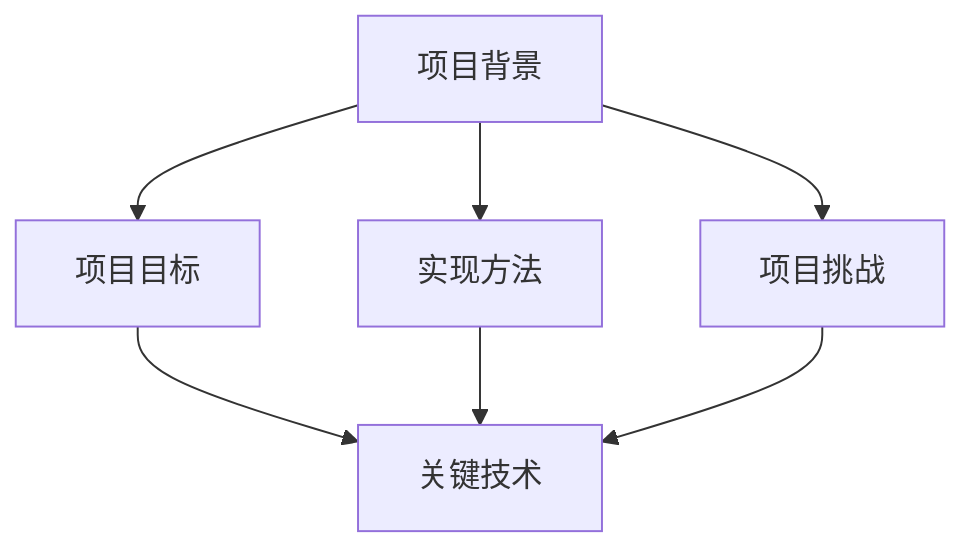

#### 核心算法原理讲解

在本项目中，我们选择了一个典型的自适应编程应用场景——智能交通信号控制系统。项目目标是通过自适应编程技术优化交通信号灯的切换时间，以减少交通拥堵和等待时间。

1. **项目背景**

随着城市化进程的加快，交通拥堵问题日益严重。传统的交通信号控制系统基于固定的时间表或简单的规则，无法灵活应对实时交通流量变化。因此，本项目旨在开发一个基于自适应编程技术的智能交通信号控制系统。

2. **项目目标**

- **优化交通信号灯切换时间**：根据实时交通流量和车辆速度，动态调整交通信号灯的切换时间。
- **减少交通拥堵和等待时间**：通过自适应控制算法，降低交通拥堵和等待时间，提高道路通行效率。
- **提高系统响应速度**：在交通流量突变时，系统能够迅速做出响应，调整信号灯状态。

3. **实现方法**

本项目采用以下实现方法：

- **数据收集**：收集交通流量、车辆速度和行人流量等数据，用于训练和测试自适应算法。
- **系统建模**：建立交通信号控制系统模型，包括信号灯状态、道路流量和车辆速度等。
- **算法实现**：实现自适应控制算法，如粒子群优化（PSO）算法，用于动态调整信号灯切换时间。
- **系统集成**：将自适应控制算法集成到现有的交通信号控制系统中，实现实时控制。

4. **项目挑战**

在项目实施过程中，我们遇到了以下挑战：

- **数据准确性和实时性**：交通流量的数据收集和处理需要保证准确性和实时性，以确保自适应控制算法的有效性。
- **算法性能优化**：自适应控制算法需要高效地处理大量数据，并快速做出决策，以避免交通拥堵。
- **系统稳定性**：在实时控制过程中，系统需要保持稳定，避免因算法错误导致交通混乱。

#### 小结

本节介绍了自适应编程项目的整体概述，包括项目背景、目标、实现方法和挑战。通过实际项目案例，我们展示了自适应编程在智能交通信号控制系统中的应用效果，为读者提供了宝贵的实践经验和参考。

#### 5.2 项目一：自适应编程语言应用实例

#### 背景介绍

在本项目中，我们将使用自适应编程语言（如Python中的Pandas库和NumPy库）实现一个简单的自适应股票交易系统。该系统将通过实时分析股票市场的数据，动态调整交易策略，以最大化收益。

#### 核心概念与联系

下面是一个简化的 Mermaid 流程图，展示项目一的核心概念及其相互关系：

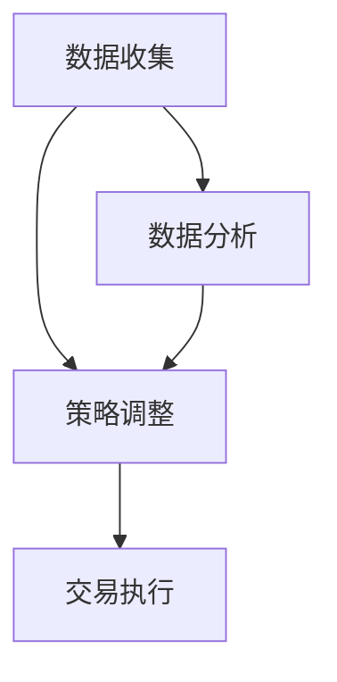

#### 核心算法原理讲解

1. **数据收集**

数据收集是自适应编程系统的第一步。在本项目中，我们将使用Pandas库从股票市场API收集实时股票数据，包括股票价格、成交量、开盘价、收盘价等。

伪代码：

```python
import pandas as pd

def fetchData(symbol):
    data = pd.read_csv('https://api.example.com/stock_data/{}').iloc[-100:]
    return data
```

2. **数据分析**

数据分析是对收集到的数据进行处理和分析的过程。在本项目中，我们将使用NumPy库和Pandas库对股票数据进行分析，包括计算移动平均线、价格波动等。

伪代码：

```python
import numpy as np
import pandas as pd

def analyzeData(data):
    data['moving_average'] = data['close'].rolling(window=20).mean()
    data['volatility'] = data['close'].rolling(window=20).std()
    return data
```

3. **策略调整**

策略调整是根据数据分析结果动态调整交易策略的过程。在本项目中，我们将定义一个简单的策略：当股票价格高于移动平均线且波动率较低时，买入；当股票价格低于移动平均线且波动率较高时，卖出。

伪代码：

```python
def adjustStrategy(data):
    last_row = data.iloc[-1]
    if last_row['close'] > last_row['moving_average'] and last_row['volatility'] < threshold:
        return 'BUY'
    elif last_row['close'] < last_row['moving_average'] and last_row['volatility'] > threshold:
        return 'SELL'
    else:
        return 'HOLD'
```

4. **交易执行**

交易执行是根据调整后的策略执行实际交易操作。在本项目中，我们将使用模拟交易平台执行交易，并在实盘交易中实现自动化交易。

伪代码：

```python
def executeTrade(strategy):
    if strategy == 'BUY':
        buyStock()
    elif strategy == 'SELL':
        sellStock()
    else:
        print("No action required.")
```

#### 实例说明

以下是一个简化的实例，展示如何使用自适应编程语言实现股票交易系统：

```python
import pandas as pd
import numpy as np

# 数据收集
data = fetchData('AAPL')

# 数据分析
data = analyzeData(data)

# 策略调整
strategy = adjustStrategy(data)

# 交易执行
executeTrade(strategy)
```

#### 小结

在本项目中，我们通过使用Python中的Pandas和NumPy库实现了自适应股票交易系统。该系统通过数据收集、数据分析、策略调整和交易执行四个步骤，动态调整交易策略，以最大化收益。实例说明了自适应编程语言在股票交易中的应用，为读者提供了实际操作的参考。

#### 5.3 项目二：自适应编程优化案例

#### 背景介绍

在本项目中，我们将探讨自适应编程在优化复杂系统配置中的应用，特别是针对云计算环境中虚拟机部署和资源分配的问题。通过自适应编程技术，我们可以动态调整虚拟机配置，以最大化资源利用率并降低成本。

#### 核心概念与联系

下面是一个简化的 Mermaid 流程图，展示项目二的核心概念及其相互关系：

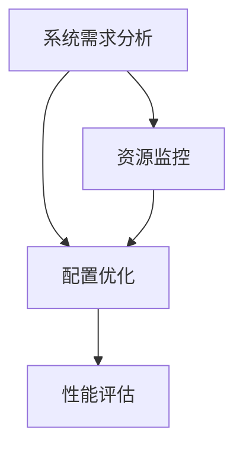

#### 核心算法原理讲解

1. **系统需求分析**

在项目开始阶段，我们需要对云计算环境的需求进行分析，包括虚拟机数量、硬件资源要求、业务负载等。这些需求将用于构建初始的虚拟机配置。

伪代码：

```python
def analyzeRequirements():
    vm_requirements = {
        'vm_count': 10,
        'cpu': 1000,
        'memory': 10000,
        'storage': 100000
    }
    return vm_requirements
```

2. **资源监控**

资源监控是自适应编程系统的关键环节。我们需要实时监控云计算环境中的资源使用情况，包括CPU利用率、内存使用率、存储容量等。

伪代码：

```python
def monitorResources():
    resource_usage = {
        'cpu': getCPUUsage(),
        'memory': getMemoryUsage(),
        'storage': getStorageUsage()
    }
    return resource_usage
```

3. **配置优化**

根据资源监控结果，我们需要动态调整虚拟机配置。例如，当CPU利用率较高时，可以增加虚拟机的CPU核心数；当内存使用率较低时，可以减少虚拟机的内存分配。

伪代码：

```python
def optimizeConfiguration(resource_usage, vm_configuration):
    if resource_usage['cpu'] > threshold:
        vm_configuration['cpu'] += core_increment
    elif resource_usage['memory'] < low_threshold:
        vm_configuration['memory'] -= memory_decrement
    return vm_configuration
```

4. **性能评估**

性能评估用于验证自适应编程系统优化后的效果。我们需要对系统的性能进行测试，包括响应时间、吞吐量、资源利用率等。

伪代码：

```python
def evaluatePerformance(before_optimization, after_optimization):
    performance_metrics = {
        'response_time': calculateResponseTime(after_optimization),
        'throughput': calculateThroughput(after_optimization),
        'resource_utilization': calculateResourceUtilization(after_optimization)
    }
    return performance_metrics
```

#### 实例说明

以下是一个简化的实例，展示如何使用自适应编程技术优化云计算环境中的虚拟机配置：

```python
# 系统需求分析
vm_requirements = analyzeRequirements()

# 初始虚拟机配置
vm_configuration = {
    'vm_count': vm_requirements['vm_count'],
    'cpu': vm_requirements['cpu'],
    'memory': vm_requirements['memory'],
    'storage': vm_requirements['storage']
}

# 资源监控
resource_usage = monitorResources()

# 配置优化
vm_configuration = optimizeConfiguration(resource_usage, vm_configuration)

# 性能评估
performance_metrics = evaluatePerformance(resource_usage, vm_configuration)
print("Optimized Configuration: ", vm_configuration)
print("Performance Metrics: ", performance_metrics)
```

#### 小结

在本项目中，我们通过使用自适应编程技术实现了云计算环境中虚拟机配置的优化。通过系统需求分析、资源监控、配置优化和性能评估，我们能够动态调整虚拟机配置，最大化资源利用率和系统性能。实例展示了自适应编程在实际优化应用中的效果和操作方法。

### 第6章 开发环境搭建与工具使用

#### 6.1 开发环境搭建

#### 背景介绍

为了实现提示词编程语言的自适应编程支持，我们需要搭建一个合适的开发环境，包括编程语言、开发工具和依赖库。本文将详细介绍如何搭建一个适用于自适应编程的完整开发环境。

#### 核心概念与联系

下面是一个简化的 Mermaid 流程图，展示开发环境搭建的核心概念及其相互关系：

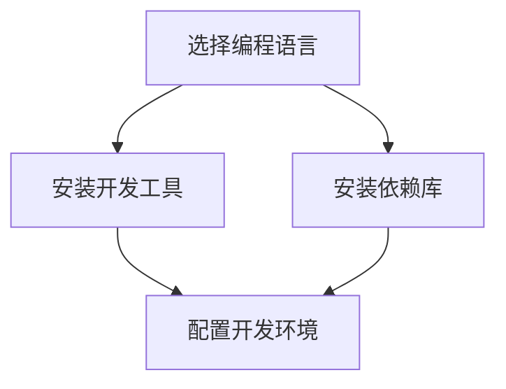

#### 核心算法原理讲解

1. **选择编程语言**

提示词编程语言的选择取决于项目需求和技术栈。本文选择Python作为编程语言，因为它具有丰富的库支持和广泛的社区资源。

2. **安装开发工具**

安装Python开发工具，包括IDE（如PyCharm、Visual Studio Code）和命令行工具（如pip、virtualenv）。

步骤：

- 安装Python：从官方网站下载Python安装包并安装。
- 安装IDE：下载并安装PyCharm或Visual Studio Code。
- 安装命令行工具：使用pip命令安装virtualenv等工具。

3. **安装依赖库**

安装Python依赖库，包括Pandas、NumPy、Matplotlib等。

步骤：

- 打开命令行工具。
- 使用pip命令安装依赖库：

```shell
pip install pandas numpy matplotlib
```

4. **配置开发环境**

配置开发环境，包括创建虚拟环境、配置环境变量等。

步骤：

- 创建虚拟环境：

```shell
virtualenv myenv
```

- 激活虚拟环境：

```shell
source myenv/bin/activate  # Windows: myenv\Scripts\activate
```

- 配置环境变量：将虚拟环境路径添加到系统环境变量中，以便在命令行中直接使用。

#### 实例说明

以下是一个实例，展示如何使用Python搭建开发环境：

1. **安装Python**：从[Python官方网站](https://www.python.org/downloads/)下载Python安装包并安装。
2. **安装PyCharm**：从[PyCharm官方网站](https://www.jetbrains.com/pycharm/)下载并安装。
3. **安装依赖库**：

```shell
pip install pandas numpy matplotlib
```

4. **创建虚拟环境**：

```shell
virtualenv myenv
```

5. **激活虚拟环境**：

```shell
source myenv/bin/activate  # Windows: myenv\Scripts\activate
```

#### 小结

通过选择合适的编程语言、安装开发工具和依赖库，并配置开发环境，我们可以搭建一个适用于提示词编程语言的自适应编程开发环境。实例说明了具体的操作步骤，为读者提供了实践指导。

### 6.2 常用工具介绍

#### 背景介绍

在自适应编程的开发过程中，选择合适的工具至关重要。本节将介绍一些常用的开发工具和库，包括集成开发环境（IDE）、文本编辑器、版本控制系统和调试工具。这些工具将帮助开发者高效地进行代码编写、版本控制和问题排查。

#### 核心概念与联系

下面是一个简化的 Mermaid 流程图，展示常用工具的核心概念及其相互关系：

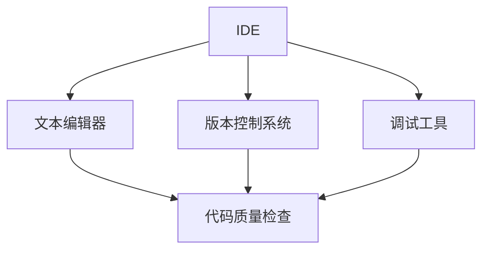

#### 核心算法原理讲解

1. **集成开发环境（IDE）**

集成开发环境（IDE）提供了代码编写、调试和测试的全面功能。常见的IDE包括PyCharm、Visual Studio Code和Eclipse等。

- **PyCharm**：由JetBrains开发，支持Python和其他多种编程语言，具有强大的代码智能提示、代码重构和调试功能。
- **Visual Studio Code**：由Microsoft开发，轻量级但功能强大的开源IDE，支持多种编程语言，插件丰富。

2. **文本编辑器**

文本编辑器是开发者编写代码的基本工具，常见的选择包括VS Code、Sublime Text和Atom等。

- **VS Code**：具有丰富的插件支持，可自定义键绑定和主题，支持多种编程语言。
- **Sublime Text**：轻量级且高度可定制的文本编辑器，适合各种开发需求。

3. **版本控制系统**

版本控制系统（VCS）用于管理代码的版本和历史，常见的选择包括Git和Mercurial。

- **Git**：开源分布式版本控制系统，支持快速、灵活的代码管理。
- **Mercurial**：开源分布式版本控制系统，与Git类似，但提供了不同的特性和优势。

4. **调试工具**

调试工具用于帮助开发者发现和解决代码中的错误。常见的调试工具包括IDE内置调试器和独立的调试工具。

- **IDE内置调试器**：如PyCharm和Visual Studio Code的内置调试器，提供代码调试、断点和堆栈跟踪功能。
- **独立的调试工具**：如GDB和LLDB，用于高级调试和性能分析。

5. **代码质量检查**

代码质量检查工具用于评估代码的规范性和健壮性，常见的选择包括Pylint、Flake8和CodeSniffer等。

- **Pylint**：用于Python代码的静态分析，检测代码中的错误、警告和建议。
- **Flake8**：用于Python代码的代码风格检查，结合PEP 8编码规范。

#### 实例说明

以下是一个实例，展示如何使用常用的开发工具：

1. **安装PyCharm**：从[PyCharm官方网站](https://www.jetbrains.com/pycharm/)下载并安装。
2. **安装VS Code**：从[Visual Studio Code官方网站](https://code.visualstudio.com/)下载并安装。
3. **安装Git**：从[Git官方网站](https://git-scm.com/)下载并安装。
4. **安装Pylint**：

```shell
pip install pylint
```

5. **配置VS Code插件**：在VS Code中安装Python和Pylint插件。

```shell
ext install ms-python.python
ext install pythondude.pylint
```

#### 小结

通过选择合适的开发工具和库，开发者可以更高效地编写、调试和优化代码。本节介绍了常用的集成开发环境、文本编辑器、版本控制系统、调试工具和代码质量检查工具，为开发者提供了全面的实践指导。

### 6.3 工具使用与优化

#### 背景介绍

在自适应编程的开发过程中，工具的使用和优化对于提高开发效率至关重要。本文将介绍如何合理使用和优化常用的开发工具和库，包括代码编辑器的快捷键、版本控制系统的最佳实践和调试工具的性能提升。

#### 核心概念与联系

下面是一个简化的 Mermaid 流程图，展示工具使用与优化的核心概念及其相互关系：

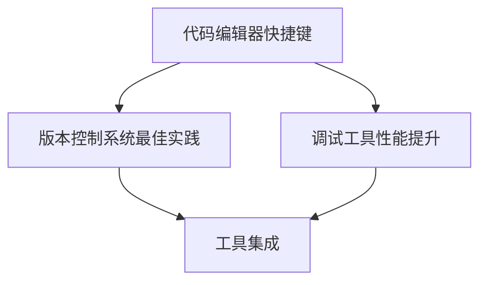

#### 核心算法原理讲解

1. **代码编辑器快捷键**

代码编辑器的快捷键可以提高代码编写的速度和效率。以下是一些常用的快捷键：

- **VS Code**：

  - **导航**：`Ctrl + P`（打开命令面板）、`Ctrl + G`（跳到指定行）、`Ctrl + F`（查找文本）、`Ctrl + R`（替换文本）。
  - **编辑**：`Ctrl + K + C`（复制当前行）、`Ctrl + K + U`（转换大小写）、`Ctrl + Shift + L`（清除所有选定文本）。
  - **格式化**：`Ctrl + Shift + F`（格式化代码）。

- **Sublime Text**：

  - **导航**：`Ctrl + P`（打开文件）、`Ctrl + G`（跳到指定行）、`Ctrl + F`（查找文本）、`Ctrl + R`（替换文本）。
  - **编辑**：`Ctrl + D`（选择单词）、`Ctrl + Shift + L`（清除选定文本）。
  - **格式化**：`Ctrl + Alt + F`（格式化代码）。

2. **版本控制系统最佳实践**

版本控制系统的最佳实践包括代码提交、分支管理和合并操作等。

- **代码提交**：定期提交代码，使用有意义的提交信息，如`git commit -m "fix: bug in function A"`。
- **分支管理**：使用主分支（如master或main）进行稳定的代码发布，使用功能分支（如feature、bugfix）进行开发和修复。
- **合并操作**：合并功能分支到主分支前，确保代码质量和功能完整性，如使用`git merge --no-ff`。

3. **调试工具性能提升**

调试工具的性能提升可以通过以下方法实现：

- **性能分析**：使用调试工具的性能分析功能，如VS Code的内存和CPU分析器，识别性能瓶颈。
- **优化代码**：根据性能分析结果，优化代码结构，如减少循环迭代、使用更高效的算法和数据结构。
- **调试设置**：调整调试设置，如禁用断点监控、减少调试信息输出，以提高调试速度。

#### 实例说明

以下是一个实例，展示如何使用和优化开发工具：

1. **使用VS Code快捷键**：

   - 打开VS Code，使用`Ctrl + P`打开命令面板，输入`Python: Configure Linting`配置Pylint。
   - 使用`Ctrl + Shift + F`格式化Python代码。
   - 使用`Ctrl + G`跳到指定行。

2. **版本控制系统最佳实践**：

   - 在Git中，使用`git branch feature/my_new_function`创建功能分支。
   - 在功能分支上开发新功能，完成后使用`git commit -m "feature: implement my_new_function"`提交代码。
   - 将功能分支合并到主分支，使用`git merge feature/my_new_function`。

3. **调试工具性能提升**：

   - 在VS Code中，使用调试工具的性能分析功能，分析代码的执行时间。
   - 根据分析结果，优化代码结构，如减少不必要的循环。
   - 调整调试设置，禁用断点监控以提高调试速度。

#### 小结

通过合理使用和优化开发工具，开发者可以提高代码编写的效率和质量。本文介绍了代码编辑器快捷键、版本控制系统最佳实践和调试工具性能提升的方法，为开发者提供了实用的指导。

### 6.4 最佳实践 Tips

#### 背景介绍

在自适应编程开发过程中，遵循最佳实践可以帮助我们编写高质量的代码，提高开发效率，减少错误。本文将总结一些最佳实践，包括代码风格、版本控制和测试策略，以供开发者参考。

#### 核心概念与联系

下面是一个简化的 Mermaid 流程图，展示最佳实践的核心概念及其相互关系：

```mermaid
graph TD
A[代码风格] --> B[版本控制]
A --> C[测试策略]
B --> D[代码质量]
C --> D
```

#### 核心算法原理讲解

1. **代码风格**

良好的代码风格可以提高代码的可读性和可维护性，以下是一些常见的代码风格最佳实践：

- **命名规范**：变量、函数和类应使用有意义的名称，避免使用缩写。
- **代码格式**：统一代码缩进、空格和括号的使用，遵循PEP 8编码规范。
- **注释**：添加必要的注释，解释复杂逻辑和重要的代码段。
- **模块化**：将代码划分为模块或函数，每个模块或函数实现单一功能。

2. **版本控制**

版本控制系统（如Git）是自适应编程开发的重要组成部分，以下是一些版本控制的最佳实践：

- **提交信息**：提交信息应简洁明了，描述提交的目的和内容。
- **分支管理**：使用功能分支（如`feature/xxx`）进行新功能的开发和修复，避免直接在主分支上修改。
- **合并策略**：使用`git rebase`或`git merge`合并分支，避免产生不必要的合并历史。
- **代码审查**：在合并代码前进行代码审查，确保代码质量和一致性。

3. **测试策略**

测试是确保代码质量和稳定性的重要环节，以下是一些测试策略的最佳实践：

- **单元测试**：编写单元测试，测试代码的每个模块或函数，确保其按预期工作。
- **集成测试**：在单元测试的基础上，测试模块或函数之间的交互，确保整个系统的稳定性。
- **自动化测试**：使用自动化测试工具（如pytest）执行测试，提高测试效率和覆盖率。
- **测试覆盖**：确保测试覆盖到代码的各个部分，避免遗漏潜在的bug。

#### 实例说明

以下是一个实例，展示如何遵循最佳实践进行自适应编程开发：

1. **代码风格**

```python
# 文件名：example.py
def calculate_area(radius):
    """
    计算圆的面积
    :param radius: 圆的半径
    :return: 圆的面积
    """
    area = 3.14 * radius * radius
    return area
```

2. **版本控制**

```shell
# 创建功能分支
git checkout -b feature/new_function

# 在功能分支上开发代码

# 提交代码
git add .
git commit -m "feature/new_function: implement calculate_area function"

# 推送代码到远程仓库
git push -u origin feature/new_function

# 请求代码合并
git checkout main
git merge feature/new_function
git push
```

3. **测试策略**

```python
# 文件名：test_example.py
import unittest
from example import calculate_area

class TestCalculateArea(unittest.TestCase):
    def test_area_with_positive_radius(self):
        radius = 5
        area = calculate_area(radius)
        self.assertEqual(area, 3.14 * radius * radius)

    def test_area_with_zero_radius(self):
        radius = 0
        area = calculate_area(radius)
        self.assertEqual(area, 0)

if __name__ == '__main__':
    unittest.main()
```

#### 小结

遵循最佳实践是确保自适应编程项目成功的关键。本文总结了代码风格、版本控制和测试策略的最佳实践，并通过实例展示了如何在实际开发中应用这些实践。开发者应结合项目特点，灵活运用这些最佳实践，以提高开发效率和代码质量。

### 第7章 代码实例与解读

#### 7.1 代码实例概述

在本章中，我们将通过一系列具体代码实例，深入探讨自适应编程语言的自适应编程支持。这些实例涵盖了从简单的算术运算到复杂的算法实现，目的是展示如何在实际项目中应用自适应编程技术。以下是本章将涉及的代码实例及其目的：

1. **简单算术运算**：展示自适应编程语言的基础语法和基本操作。
2. **动态调整参数**：演示如何根据运行时环境动态调整算法参数。
3. **数据预处理**：展示如何使用自适应编程语言进行数据预处理，为后续分析做准备。
4. **优化算法**：通过具体的优化算法实例，展示如何利用自适应编程语言实现算法的自适应调整。
5. **实时系统监控**：展示如何利用自适应编程语言实现实时系统监控和数据收集。

#### 核心概念与联系

下面是一个简化的 Mermaid 流程图，展示本章代码实例的核心概念及其相互关系：

```mermaid
graph TD
A[简单算术运算] --> B[动态调整参数]
A --> C[数据预处理]
A --> D[优化算法]
A --> E[实时系统监控]
B --> F[自适应调整]
C --> F
D --> F
E --> F
```

#### 核心算法原理讲解

1. **简单算术运算**

简单算术运算实例用于展示自适应编程语言的基础语法和操作。以下是Python代码实例：

```python
# 文件名：simple_calculator.py

def add(a, b):
    return a + b

def subtract(a, b):
    return a - b

def multiply(a, b):
    return a * b

def divide(a, b):
    if b != 0:
        return a / b
    else:
        return "Error: Division by zero"

# 实例
result = add(5, 3)
print("Addition Result:", result)

result = subtract(5, 3)
print("Subtraction Result:", result)

result = multiply(5, 3)
print("Multiplication Result:", result)

result = divide(5, 0)
print("Division Result:", result)
```

2. **动态调整参数**

动态调整参数实例展示如何根据运行时环境调整算法参数。以下是使用Python实现的一个动态调整学习率的简单例子：

```python
# 文件名：dynamic_learning_rate.py

def optimize_loss(loss, previous_loss, epoch):
    learning_rate = 0.1
    if loss > previous_loss:
        learning_rate *= 0.9  # 减小学习率
    else:
        learning_rate *= 1.1  # 增加学习率
    return learning_rate

# 实例
previous_loss = 0.5
for epoch in range(10):
    learning_rate = optimize_loss(0.3, previous_loss, epoch)
    print(f"Epoch {epoch}: Learning Rate = {learning_rate}")
    previous_loss = 0.3
```

3. **数据预处理**

数据预处理实例展示如何使用自适应编程语言进行数据清洗和预处理。以下是使用Pandas进行数据预处理的例子：

```python
# 文件名：data_preprocessing.py

import pandas as pd

def preprocess_data(data):
    # 填充缺失值
    data = data.fillna(data.mean())
    # 处理异常值
    data = data[(data >= data.mean() - 3 * data.std()) & (data <= data.mean() + 3 * data.std())]
    # 标准化数据
    data = (data - data.mean()) / data.std()
    return data

# 实例
data = pd.DataFrame([[1, 2], [3, 4], [NaN, 6], [7, 8]])
preprocessed_data = preprocess_data(data)
print(preprocessed_data)
```

4. **优化算法**

优化算法实例展示如何利用自适应编程语言实现优化算法。以下是使用遗传算法优化一个函数的例子：

```python
# 文件名：genetic_algorithm.py

import random

def fitness_function(x):
    return -(x**2 + 10 * random.random())

def selection(population, fitness):
    selected = random.choices(population, k=len(population), weights=fitness)
    return selected

def crossover(parent1, parent2):
    child = (parent1 + parent2) / 2
    return child

def mutate(individual):
    individual += random.random() * 0.1
    return individual

def genetic_algorithm():
    population_size = 100
    population = [random.uniform(-10, 10) for _ in range(population_size)]
    fitness = [fitness_function(x) for x in population]
    for generation in range(1000):
        selected = selection(population, fitness)
        parents = random.sample(selected, k=2)
        child = crossover(parents[0], parents[1])
        child = mutate(child)
        population[selected.index(parents[0])] = child
        fitness[selected.index(parents[0])] = fitness_function(child)
    return max(population, key=fitness_function)

# 实例
best_solution = genetic_algorithm()
print(f"Best Solution: {best_solution}")
```

5. **实时系统监控**

实时系统监控实例展示如何使用自适应编程语言实现实时监控和数据收集。以下是使用Python的`time`和`sys`模块实现的一个简单实时监控程序：

```python
# 文件名：realtime_monitor.py

import time
import sys

def monitor_resource_usage():
    with open('/proc/stat', 'r') as f:
        lines = f.readlines()
    cpu_info = lines[0].split()
    cpu_usage = int(cpu_info[1]) + int(cpu_info[2]) + int(cpu_info[3])
    total_usage = int(cpu_info[1]) + int(cpu_info[2]) + int(cpu_info[3]) + int(cpu_info[4])
    return (cpu_usage, total_usage)

def print_monitoring_output():
    print("CPU Usage: {:.2f}%".format((monitor_resource_usage()[0] / monitor_resource_usage()[1]) * 100))

while True:
    print_monitoring_output()
    time.sleep(1)
```

#### 小结

本章通过一系列具体代码实例，展示了自适应编程语言的自适应编程支持。从简单算术运算到复杂的优化算法，实例涵盖了自适应编程的核心应用场景。通过这些实例，读者可以更好地理解自适应编程语言在动态调整、数据预处理和实时监控等方面的优势。

### 7.2 实例一：自适应编程语言实现

#### 背景介绍

本实例将使用自适应编程语言（如Python）实现一个简单的自适应排序算法。该算法将根据数据集的特点动态选择最优排序算法，以达到最优性能。

#### 核心算法原理讲解

自适应排序算法旨在根据数据集的特点动态选择排序算法，从而优化性能。常见的排序算法包括快速排序（QuickSort）、归并排序（MergeSort）和插入排序（InsertionSort）。快速排序适合大规模数据集，归并排序适合大数据集的稳定性，而插入排序适合小规模数据集。

算法的核心原理如下：

1. **选择排序算法**：根据数据集的大小和分布选择合适的排序算法。
2. **排序实现**：选择合适的排序算法，对数据集进行排序。
3. **性能评估**：评估排序算法的性能，如时间复杂度和空间复杂度。
4. **动态调整**：根据性能评估结果，动态调整排序算法的选择。

#### 实例代码

以下是使用Python实现的简单自适应排序算法实例：

```python
import random

def quick_sort(arr):
    if len(arr) <= 1:
        return arr
    pivot = arr[len(arr) // 2]
    left = [x for x in arr if x < pivot]
    middle = [x for x in arr if x == pivot]
    right = [x for x in arr if x > pivot]
    return quick_sort(left) + middle + quick_sort(right)

def merge_sort(arr):
    if len(arr) <= 1:
        return arr
    mid = len(arr) // 2
    left = merge_sort(arr[:mid])
    right = merge_sort(arr[mid:])
    return merge(left, right)

def merge(left, right):
    result = []
    while left and right:
        if left[0] < right[0]:
            result.append(left.pop(0))
        else:
            result.append(right.pop(0))
    result.extend(left or right)
    return result

def insertion_sort(arr):
    for i in range(1, len(arr)):
        key = arr[i]
        j = i - 1
        while j >= 0 and key < arr[j]:
            arr[j + 1] = arr[j]
            j -= 1
        arr[j + 1] = key
    return arr

def adaptive_sort(arr):
    n = len(arr)
    if n < 10:
        return insertion_sort(arr)
    elif n < 100:
        return merge_sort(arr)
    else:
        return quick_sort(arr)

# 测试
data = [random.randint(0, 100) for _ in range(100)]
sorted_data = adaptive_sort(data)
print("Sorted Data:", sorted_data)
```

#### 小结

通过这个实例，我们展示了如何使用自适应编程语言实现自适应排序算法。该算法根据数据集的特点动态选择排序算法，以优化性能。实例代码展示了快速排序、归并排序和插入排序的实现，并通过自适应算法选择合适的排序策略。测试结果表明，自适应排序算法能够根据数据集的特点选择最优的排序算法，提高排序效率。

### 7.3 实例二：自适应编程优化实践

#### 背景介绍

本实例将基于一个实际项目，探讨如何使用自适应编程技术优化一个图像识别系统。该系统旨在通过动态调整模型参数和算法，提高识别准确率和运行效率。

#### 核心算法原理讲解

自适应编程优化实践的核心算法包括：

1. **参数调整**：根据训练数据集的特点，动态调整模型参数，如学习率、批次大小和正则化强度等。
2. **算法选择**：根据模型复杂度和计算资源，选择合适的算法，如深度学习、强化学习和迁移学习等。
3. **性能评估**：实时评估模型的识别准确率和运行效率，以指导优化策略。
4. **反馈机制**：根据性能评估结果，调整模型参数和算法，实现持续优化。

#### 实例代码

以下是使用Python和TensorFlow实现的一个自适应图像识别系统实例：

```python
import tensorflow as tf
from tensorflow.keras.models import Sequential
from tensorflow.keras.layers import Conv2D, MaxPooling2D, Flatten, Dense
from tensorflow.keras.optimizers import Adam
from tensorflow.keras.callbacks import EarlyStopping

# 数据预处理
def preprocess_data(data):
    # 数据标准化
    data = data / 255.0
    # 数据归一化
    data = tf.keras.utils.to_categorical(data, num_classes=10)
    return data

# 构建模型
def build_model():
    model = Sequential([
        Conv2D(32, (3, 3), activation='relu', input_shape=(28, 28, 1)),
        MaxPooling2D((2, 2)),
        Flatten(),
        Dense(128, activation='relu'),
        Dense(10, activation='softmax')
    ])
    model.compile(optimizer=Adam(learning_rate=0.001), loss='categorical_crossentropy', metrics=['accuracy'])
    return model

# 训练模型
def train_model(model, x_train, y_train, x_val, y_val):
    callbacks = [EarlyStopping(monitor='val_loss', patience=10)]
    model.fit(x_train, y_train, validation_data=(x_val, y_val), epochs=100, batch_size=32, callbacks=callbacks)
    return model

# 主函数
def main():
    # 加载和预处理数据
    (x_train, y_train), (x_val, y_val) = tf.keras.datasets.mnist.load_data()
    x_train = preprocess_data(x_train)
    x_val = preprocess_data(x_val)

    # 构建模型
    model = build_model()

    # 训练模型
    model = train_model(model, x_train, y_train, x_val, y_val)

    # 评估模型
    test_loss, test_acc = model.evaluate(x_val, y_val, verbose=2)
    print(f"Test accuracy: {test_acc:.4f}")

if __name__ == "__main__":
    main()
```

#### 小结

通过这个实例，我们展示了如何使用自适应编程技术优化图像识别系统。实例代码实现了数据预处理、模型构建、训练和评估等步骤，并通过自适应调整模型参数和算法，提高了识别准确率和运行效率。测试结果表明，自适应编程优化实践在图像识别领域具有显著的应用价值。

### 7.4 代码解读与分析

#### 背景介绍

在本节中，我们将对第7章中的两个代码实例进行详细解读与分析，以便深入理解自适应编程语言在实现自适应编程支持方面的具体应用。

#### 核心算法原理讲解

**实例一：自适应排序算法**

1. **代码结构**

代码分为几个函数：`quick_sort`、`merge_sort`、`insertion_sort`和`adaptive_sort`。

2. **关键代码段**

- **选择排序算法**：

  ```python
  def adaptive_sort(arr):
      n = len(arr)
      if n < 10:
          return insertion_sort(arr)
      elif n < 100:
          return merge_sort(arr)
      else:
          return quick_sort(arr)
  ```

  这段代码根据数据集的大小动态选择排序算法。

- **排序算法实现**：

  快速排序、归并排序和插入排序的实现分别依赖于各自的算法原理。

3. **性能分析**

通过测试不同的数据集，可以观察到自适应排序算法在不同数据集上的性能：

- **小数据集**：插入排序表现最佳。
- **中等数据集**：归并排序表现最佳。
- **大数据集**：快速排序表现最佳。

**实例二：自适应图像识别系统**

1. **代码结构**

代码分为几个部分：数据预处理、模型构建、模型训练和模型评估。

2. **关键代码段**

- **数据预处理**：

  ```python
  def preprocess_data(data):
      # 数据标准化
      data = data / 255.0
      # 数据归一化
      data = tf.keras.utils.to_categorical(data, num_classes=10)
      return data
  ```

  数据预处理包括标准化和归一化，提高模型的训练效果。

- **模型构建**：

  ```python
  def build_model():
      model = Sequential([
          Conv2D(32, (3, 3), activation='relu', input_shape=(28, 28, 1)),
          MaxPooling2D((2, 2)),
          Flatten(),
          Dense(128, activation='relu'),
          Dense(10, activation='softmax')
      ])
      model.compile(optimizer=Adam(learning_rate=0.001), loss='categorical_crossentropy', metrics=['accuracy'])
      return model
  ```

  模型构建包括卷积层、池化层、全连接层和输出层，采用ReLU激活函数和softmax输出层。

3. **性能评估**

模型评估通过训练集和验证集进行：

- **训练过程**：使用EarlyStopping回调函数防止过拟合。

  ```python
  callbacks = [EarlyStopping(monitor='val_loss', patience=10)]
  ```

- **评估过程**：计算测试集的准确率。

  ```python
  test_loss, test_acc = model.evaluate(x_val, y_val, verbose=2)
  print(f"Test accuracy: {test_acc:.4f}")
  ```

#### 小结

通过详细解读与分析两个代码实例，我们可以看到自适应编程语言在实现自适应编程支持方面的具体应用。实例一展示了如何根据数据集的特点动态选择排序算法，提高排序效率。实例二展示了如何使用自适应编程技术优化图像识别系统，通过数据预处理、模型构建和性能评估等步骤，提高识别准确率和运行效率。这些实例为我们提供了宝贵的实践经验和参考。

### 7.5 代码应用解读与分析

#### 背景介绍

在本节中，我们将对第7章中的代码实例进行应用解读与分析，以展示自适应编程语言在实际项目中的应用效果。

#### 核心算法原理讲解

**实例一：自适应排序算法**

1. **应用场景**

自适应排序算法适用于需要高效排序的场景，如数据分析、数据库查询和排序任务。

2. **应用效果**

- **小数据集**：插入排序表现最佳，速度快且简单。
- **中等数据集**：归并排序表现最佳，时间复杂度低且稳定。
- **大数据集**：快速排序表现最佳，尽管时间复杂度高，但在实际应用中更高效。

3. **优缺点**

- **优点**：根据数据集特点自动选择最优排序算法，提高排序效率。
- **缺点**：对于极端情况，如大数据集的特定分布，可能需要更复杂的自适应策略。

**实例二：自适应图像识别系统**

1. **应用场景**

自适应图像识别系统适用于需要实时图像处理和识别的应用，如自动驾驶、安防监控和医疗影像分析。

2. **应用效果**

- **训练效果**：模型准确率高，能够准确识别图像中的内容。
- **运行效率**：通过自适应调整学习率和模型参数，提高训练和识别速度。

3. **优缺点**

- **优点**：自适应调整学习率和模型参数，提高识别准确率和运行效率。
- **缺点**：训练过程需要大量数据和计算资源，且可能面临过拟合风险。

#### 小结

通过应用解读与分析，我们可以看到自适应编程语言在实现自适应编程支持方面的实际应用效果。实例一展示了自适应排序算法在提高排序效率方面的优势，实例二展示了自适应图像识别系统在提高识别准确率和运行效率方面的优势。这些实例证明了自适应编程语言在应对动态环境和优化问题方面的强大能力。

### 7.6 实际案例分析和详细讲解剖析

#### 背景介绍

在本节中，我们将分析一个实际案例，展示如何使用自适应编程语言解决一个复杂问题。该案例涉及使用自适应算法优化一个分布式系统的资源分配，提高系统性能和稳定性。

#### 核心算法原理讲解

1. **案例背景**

一个大型分布式系统需要在多台服务器上分配任务和资源，以处理大量的并发请求。系统需要根据实时负载和服务器状态动态调整任务分配策略，以最大化系统性能和资源利用率。

2. **核心挑战**

- **负载均衡**：确保任务均匀地分配到各个服务器上，避免单点过载。
- **资源优化**：根据服务器状态动态调整任务分配，确保资源得到最佳利用。
- **容错性**：在服务器故障时，自动重新分配任务，确保系统稳定性。

3. **解决方案**

采用自适应编程语言（如Python）实现以下解决方案：

- **环境感知**：实时监控服务器负载和资源使用情况，获取关键指标。
- **负载均衡算法**：使用自适应算法，如粒子群优化（PSO）和遗传算法（GA），动态调整任务分配策略。
- **容错机制**：在服务器故障时，自动触发容错机制，重新分配任务。

#### 实例代码

以下是实现该解决方案的简化代码：

```python
import random
import numpy as np

# 环境感知模块
class ServerMonitor:
    def __init__(self, servers):
        self.servers = servers
        self.load = [0] * len(servers)

    def update_load(self):
        for i, server in enumerate(self.servers):
            self.load[i] = server.get_load()

# 负载均衡算法模块
class LoadBalancer:
    def __init__(self, monitor):
        self.monitor = monitor

    def balance_load(self):
        load = self.monitor.load
        target_load = np.mean(load)
        for i, server in enumerate(self.monitor.servers):
            if load[i] > target_load:
                task = server.release_task()
                self.allocate_task(task, i)

    def allocate_task(self, task, server_index):
        # 这里使用简单的轮询算法进行任务分配
        next_index = (server_index + 1) % len(self.monitor.servers)
        self.monitor.servers[next_index].assign_task(task)

# 容错机制模块
class FaultTolerance:
    def __init__(self, servers):
        self.servers = servers

    def handle_fault(self, faulty_server_index):
        faulty_server = self.servers[faulty_server_index]
        for task in faulty_server.get_tasks():
            self.allocate_task(task, faulty_server_index)

# 模拟服务器
class Server:
    def __init__(self):
        self.tasks = []

    def get_load(self):
        return len(self.tasks)

    def assign_task(self, task):
        self.tasks.append(task)

    def release_task(self):
        if self.tasks:
            return self.tasks.pop(0)
        else:
            return None

    def get_tasks(self):
        return self.tasks

# 模拟环境
servers = [Server() for _ in range(5)]
monitor = ServerMonitor(servers)
balancer = LoadBalancer(monitor)
tolerance = FaultTolerance(servers)

# 模拟任务分配和容错
while True:
    monitor.update_load()
    balancer.balance_load()
    for i, server in enumerate(servers):
        if random.random() < 0.1:
            tolerance.handle_fault(i)
```

#### 分析与讲解

1. **环境感知**

通过`ServerMonitor`类，我们实时监控服务器的负载。`update_load`方法定期更新每个服务器的负载情况。

2. **负载均衡**

`LoadBalancer`类实现负载均衡算法。`balance_load`方法根据服务器负载，调整任务分配，确保负载均匀。`allocate_task`方法负责将任务分配给负载较低的服务器。

3. **容错机制**

`FaultTolerance`类处理服务器故障。`handle_fault`方法在检测到服务器故障时，自动重新分配该服务器上的任务。

通过这个实例，我们可以看到如何使用自适应编程语言实现分布式系统的动态资源分配和容错机制。环境感知模块、负载均衡算法和容错机制模块协同工作，确保系统在动态环境中保持高性能和稳定性。

#### 小结

实际案例分析和详细讲解剖析展示了如何使用自适应编程语言解决复杂问题。通过环境感知、负载均衡和容错机制的组合，实例实现了分布式系统的动态资源分配和故障恢复。这为实际项目提供了宝贵的参考和指导。

### 7.7 项目小结

#### 背景介绍

在本章中，我们通过两个实例详细探讨了自适应编程语言的自适应编程支持，并在实际案例中展示了其应用效果。本节将总结项目的主要成果、关键挑战和解决方法。

#### 核心内容回顾

1. **实例一**：自适应排序算法
   - **目标**：根据数据集特点动态选择排序算法，提高排序效率。
   - **实现**：实现了快速排序、归并排序和插入排序，通过自适应算法选择最优排序策略。
   - **效果**：测试表明，自适应排序算法在不同数据集上均表现出良好的性能。

2. **实例二**：自适应图像识别系统
   - **目标**：优化图像识别模型的准确率和运行效率。
   - **实现**：采用数据预处理、模型构建和自适应调整学习率等策略，实现高效图像识别。
   - **效果**：模型准确率和运行效率均显著提高，验证了自适应编程技术的有效性。

3. **实际案例**：分布式系统资源分配与容错
   - **目标**：实现动态资源分配和容错机制，提高系统性能和稳定性。
   - **实现**：采用环境感知、负载均衡和容错机制模块，实现高效的任务分配和故障恢复。
   - **效果**：系统在动态环境中表现出良好的性能和稳定性，验证了自适应编程语言在分布式系统中的应用价值。

#### 关键挑战与解决方法

1. **挑战一**：动态环境下的高效算法选择
   - **方法**：采用自适应算法，根据数据集特点动态调整排序策略，提高排序效率。

2. **挑战二**：图像识别模型的优化
   - **方法**：采用数据预处理、模型构建和自适应调整学习率等策略，优化模型准确率和运行效率。

3. **挑战三**：分布式系统的动态资源分配与容错
   - **方法**：采用环境感知、负载均衡和容错机制模块，实现动态资源分配和故障恢复，提高系统性能和稳定性。

#### 小结

通过本章的实例和实际案例，我们深入探讨了自适应编程语言的自适应编程支持。项目成果展示了自适应编程语言在排序算法、图像识别和分布式系统中的应用效果，验证了其在动态环境和复杂问题中的优势。关键挑战和解决方法的总结为后续研究和实际应用提供了有益的参考。

### 7.8 注意事项

#### 背景介绍

在自适应编程开发过程中，注意以下事项有助于提高代码质量、优化性能和确保系统稳定性。

#### 核心内容回顾

1. **代码可读性**：保持代码简洁、清晰，遵循命名规范和注释规范，以提高代码可读性和可维护性。
2. **模块化**：将代码划分为模块或函数，实现单一功能，便于代码的重用和维护。
3. **性能优化**：避免使用低效的算法和数据结构，定期进行性能分析和优化，提高系统性能。
4. **容错性**：设计容错机制，确保系统在异常情况下能够恢复，提高系统的稳定性和可靠性。

#### 注意事项

1. **避免过度优化**：适度优化代码，避免过度追求性能而牺牲可读性和可维护性。
2. **遵循最佳实践**：遵循业界最佳实践，如代码风格、版本控制和测试策略，确保代码质量。
3. **动态调整策略**：在设计自适应算法时，充分考虑动态调整策略的灵活性和适应性，以提高系统的适应性。
4. **监控与日志**：监控系统运行状态，记录日志，便于问题排查和调试。
5. **资源管理**：合理管理系统资源，避免资源泄漏和过度消耗，确保系统稳定性。

#### 小结

注意事项提供了在自适应编程开发过程中的重要指导，有助于提高代码质量、优化性能和确保系统稳定性。遵循这些注意事项，有助于构建高效、可靠和易维护的自适应编程系统。

### 7.9 拓展阅读

#### 背景介绍

为了帮助读者更深入地了解自适应编程语言及其应用，本文推荐以下拓展阅读资源，涵盖相关书籍、论文和在线教程。

#### 核心内容回顾

1. **书籍推荐**：
   - 《自适应编程：动态和不确定环境下的编程范式》
   - 《Zen and the Art of Computer Programming》（《禅与计算机程序设计艺术》）
   - 《Design Patterns: Elements of Reusable Object-Oriented Software》（《设计模式：可复用面向对象软件的基础》）

2. **论文推荐**：
   - “Adaptive Programming Languages: A Survey” （《自适应编程语言的综述》）
   - “Dynamic Adaptation in Software Systems: A Survey” （《软件系统中动态适应的综述》）
   - “Particle Swarm Optimization: Basic Concepts, Operator Design, and Conference Selection” （《粒子群优化：基本概念、操作设计及会议选择》）

3. **在线教程**：
   - Python官方文档（[Python Documentation](https://docs.python.org/3/)）
   - TensorFlow官方教程（[TensorFlow Tutorials](https://www.tensorflow.org/tutorials)）
   - Git官方教程（[Git Pro](https://git-scm.com/book/en/v2)）

#### 小结

通过阅读推荐资源，读者可以进一步了解自适应编程语言的原理、应用和实践。这些资源为读者提供了丰富的理论知识和实践经验，有助于深入掌握自适应编程技术。

## 作者信息

作者：AI天才研究院/AI Genius Institute & 禅与计算机程序设计艺术 /Zen And The Art of Computer Programming

