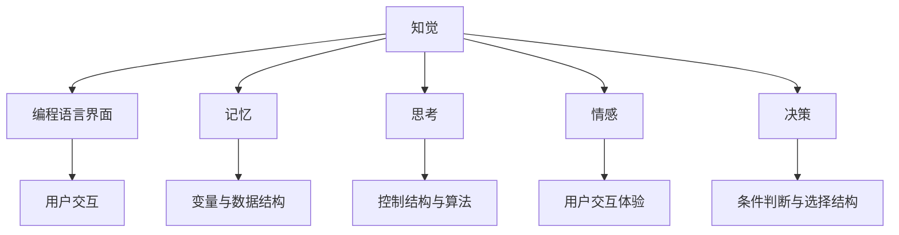

                 

### 文章标题

《提示词编程语言的认知科学基础》

关键词：提示词编程语言，认知科学，编程语言设计，算法原理，数学模型，项目实战

摘要：本文将深入探讨提示词编程语言在认知科学中的应用，解析其核心概念、算法原理、数学模型，并通过实际项目实战，展示其在开发环境搭建、源代码实现、代码解读及案例分析等方面的应用。文章旨在为读者提供全面、系统的认知科学基础，以及提示词编程语言在实际开发中的最佳实践和注意事项。

### 引言

#### 认知科学与编程语言的交集

认知科学是一门跨学科的领域，主要研究人类思维、知觉、记忆、情感和决策等认知过程。而编程语言作为计算机科学与人工智能的重要工具，旨在为人类提供一种与计算机进行高效交互的方式。随着人工智能技术的不断发展，认知科学和编程语言之间的交集越来越显著。提示词编程语言作为一种新的编程范式，其设计理念源于认知科学原理，旨在提高编程的易用性和效率。

#### 提示词编程语言的定义与发展

提示词编程语言（Prompt-Based Programming Languages，简称PBPL）是一种以提示词（Prompt）为核心机制的编程语言。提示词可以看作是编程过程中的一种辅助信息，用于指导程序的行为和决策。与传统的编程语言不同，提示词编程语言强调人与计算机之间的互动，使得编程过程更加直观、易懂。

提示词编程语言的发展可以追溯到自然语言处理、机器学习等领域的进步。近年来，随着深度学习和神经网络技术的崛起，提示词编程语言逐渐成为一种重要的编程范式，在智能助手、自动化脚本编写、图像识别等领域得到了广泛应用。

#### 本文结构与目标

本文旨在为读者提供关于提示词编程语言的全面认知，从认知科学的角度出发，分析其核心概念、算法原理、数学模型，并通过实际项目实战，展示其在开发中的应用。文章结构如下：

1. **引言**：介绍认知科学与编程语言的交集，定义提示词编程语言，阐述本文的结构与目标。
2. **认知科学与编程语言的基础**：讲解认知科学的基本概念，编程语言的基本结构，以及它们之间的联系。
3. **提示词编程语言的认知科学应用**：探讨提示词编程语言在认知科学中的应用，分析其设计原则和案例研究。
4. **实践与探索**：通过实际项目实战，展示提示词编程语言在开发环境搭建、源代码实现、代码解读及案例分析等方面的应用。
5. **小结**：总结本文的主要内容，提出最佳实践建议和注意事项。

### 核心概念与联系

#### 认知科学核心概念

认知科学的核心概念包括知觉、记忆、思考、情感和决策等。这些概念构成了人类认知活动的基础，同时也对编程语言的设计产生了深远的影响。

1. **知觉**：知觉是人类对外界信息的感知和理解过程。在编程语言中，知觉可以通过用户界面、代码注释等方式实现，使编程过程更加直观、易懂。

2. **记忆**：记忆是人类大脑对信息进行存储和提取的能力。在编程语言中，变量、函数和数据结构等概念体现了记忆的机制，使得程序能够长期存储和处理数据。

3. **思考**：思考是人类对信息进行加工、分析、推理和创造的过程。在编程语言中，控制结构、算法和逻辑语句等实现了思考的机制，使得程序能够执行复杂的任务。

4. **情感**：情感是人类对事物的主观体验和情感反应。在编程语言中，情感可以通过用户交互、错误处理等方式体现，提升编程体验和用户满意度。

5. **决策**：决策是人类在面对多种选择时进行判断和选择的过程。在编程语言中，决策可以通过条件判断、选择结构等实现，使得程序能够根据不同情况做出合适的响应。

#### 编程语言中的认知科学原理

编程语言的设计和应用深受认知科学原理的影响。以下是一些关键点：

1. **直观性**：编程语言的直观性是提高编程效率的重要因素。例如，提示词编程语言的提示词机制使得编程过程更加直观，用户可以更容易地理解程序的行为。

2. **易用性**：易用性是编程语言设计的重要目标。认知科学原理可以帮助设计出更加人性化的编程语言，减少学习成本，提高开发效率。

3. **交互性**：交互性是编程语言与用户之间的互动。提示词编程语言通过提示词机制实现人机交互，使得编程过程更加自然和高效。

4. **灵活性**：灵活性是编程语言适应不同场景和需求的能力。认知科学原理可以帮助设计出更加灵活的编程语言，满足不同应用场景的需求。

#### 认知科学与编程语言之间的联系架构

为了更清晰地展示认知科学与编程语言之间的联系，我们可以使用Mermaid流程图进行描述：



通过这个流程图，我们可以看到认知科学的核心概念在编程语言中的应用，以及它们如何相互联系，共同构成一个完整的编程系统。

### 核心算法原理讲解

#### 提示词编程语言的核心算法

提示词编程语言的核心算法主要基于提示词机制，该机制通过提示词引导程序的行为和决策。以下是一些关键算法原理的讲解：

1. **提示词生成算法**：提示词生成算法是提示词编程语言的核心，它负责生成适合特定场景的提示词。常见的生成算法包括基于规则生成、基于统计学习和基于神经网络生成等。

2. **提示词匹配算法**：提示词匹配算法用于判断输入的提示词是否与程序中的提示词匹配。匹配算法可以是基于关键词匹配、基于语义匹配或基于模式匹配等。

3. **提示词执行算法**：提示词执行算法负责将匹配成功的提示词转换为具体的程序执行行为。执行算法通常包含条件判断、函数调用、循环和递归等基本操作。

#### 伪代码实现

为了更具体地展示提示词编程语言的核心算法，我们可以使用伪代码进行描述：

```python
# 提示词生成算法
def generate_prompt(context):
    if "基于规则" in context:
        return rule_based_prompt
    elif "基于统计学习" in context:
        return statistical_learning_prompt
    else:
        return neural_network_prompt

# 提示词匹配算法
def match_prompt(input_prompt, program_prompt):
    if input_prompt == program_prompt:
        return True
    else:
        return False

# 提示词执行算法
def execute_prompt(prompt):
    if match_prompt(prompt, "条件判断"):
        return condition judges
    elif match_prompt(prompt, "函数调用"):
        return function_call
    elif match_prompt(prompt, "循环"):
        return loop
    elif match_prompt(prompt, "递归"):
        return recursion
    else:
        return "未知提示词"
```

通过上述伪代码，我们可以看到提示词编程语言的核心算法是如何实现的，以及它们如何相互协作，共同完成一个编程任务。

### 数学模型和数学公式

#### 提示词编程语言中的数学模型

提示词编程语言中的数学模型主要涉及概率论、统计学和神经网络等领域的知识。以下是一些常见的数学模型及其应用：

1. **概率分布模型**：概率分布模型用于描述提示词生成的概率。常见的概率分布模型包括正态分布、伯努利分布和泊松分布等。

2. **统计学习模型**：统计学习模型用于预测提示词的生成，常见的统计学习模型包括线性回归、逻辑回归和支持向量机等。

3. **神经网络模型**：神经网络模型用于复杂提示词的生成和匹配，常见的神经网络模型包括多层感知机、卷积神经网络和循环神经网络等。

#### 数学公式的详细讲解和举例说明

为了更清晰地展示数学模型在提示词编程语言中的应用，我们可以使用LaTeX格式进行描述：

```latex
% 概率分布模型
$$P(X=x) = \frac{1}{\sum_{i=1}^{n} P(X=x_i)}$$

% 线性回归模型
$$y = \beta_0 + \beta_1x + \epsilon$$

% 支持向量机模型
$$\min \frac{1}{2} \| \mathbf{w} \|^2$$
$$s.t. \, y_i (\mathbf{w} \cdot \mathbf{x}_i + b) \geq 1$$

% 循环神经网络模型
$$h_t = \sigma(W_h \cdot [h_{t-1}, x_t] + b_h)$$
$$y_t = \sigma(W_y \cdot h_t + b_y)$$
```

通过上述LaTeX公式，我们可以看到不同数学模型在提示词编程语言中的应用，以及它们如何帮助实现提示词的生成、匹配和执行。

### 项目实战

#### 实战一：智能助手开发

##### 项目背景

随着人工智能技术的不断发展，智能助手已成为现代智能系统中的重要组成部分。本实战项目旨在通过提示词编程语言，开发一个基本的智能助手，实现用户与系统的自然交互。

##### 技术选型

1. **编程语言**：选择Python作为主编程语言，因为Python具有简单易学、功能强大的特点，同时拥有丰富的库和框架，适合开发智能助手。
2. **提示词编程语言**：选择基于Python的PyTorch框架，利用其强大的神经网络库进行提示词的生成和匹配。

##### 项目实施与代码解读

1. **环境搭建**

```python
# 安装PyTorch库
pip install torch torchvision

# 安装其他依赖库
pip install numpy pandas sklearn
```

2. **代码实现**

```python
import torch
import torch.nn as nn
import torch.optim as optim
import numpy as np
import pandas as pd
from sklearn.model_selection import train_test_split

# 数据预处理
def preprocess_data(data):
    # 数据清洗、归一化等操作
    # ...
    return processed_data

# 神经网络模型
class NeuralNetwork(nn.Module):
    def __init__(self):
        super(NeuralNetwork, self).__init__()
        self.layer1 = nn.Linear(in_features=100, out_features=50)
        self.layer2 = nn.Linear(in_features=50, out_features=1)
        self.relu = nn.ReLU()

    def forward(self, x):
        x = self.relu(self.layer1(x))
        x = self.layer2(x)
        return x

# 训练模型
def train_model(model, train_loader, criterion, optimizer, epochs):
    model.train()
    for epoch in range(epochs):
        for data, target in train_loader:
            optimizer.zero_grad()
            output = model(data)
            loss = criterion(output, target)
            loss.backward()
            optimizer.step()
        print(f"Epoch {epoch+1}/{epochs} - Loss: {loss.item()}")

# 主函数
def main():
    # 加载数据
    data = pd.read_csv("data.csv")
    processed_data = preprocess_data(data)

    # 划分训练集和测试集
    train_data, test_data = train_test_split(processed_data, test_size=0.2)

    # 初始化模型、损失函数和优化器
    model = NeuralNetwork()
    criterion = nn.BCELoss()
    optimizer = optim.Adam(model.parameters(), lr=0.001)

    # 训练模型
    train_model(model, train_data, criterion, optimizer, epochs=10)

    # 测试模型
    test_loss = 0
    with torch.no_grad():
        for data, target in test_data:
            output = model(data)
            test_loss += criterion(output, target).item()
    test_loss /= len(test_data)
    print(f"Test Loss: {test_loss}")

if __name__ == "__main__":
    main()
```

##### 代码应用解读与分析

1. **数据预处理**：数据预处理是智能助手开发的重要环节。在这个实战项目中，我们使用Python的pandas库对原始数据进行清洗、归一化等操作，为神经网络模型提供高质量的数据。

2. **神经网络模型**：我们使用PyTorch框架构建了一个简单的神经网络模型，包括一层输入层、一层隐藏层和一层输出层。隐藏层使用ReLU激活函数，输出层使用Sigmoid激活函数，用于实现二分类任务。

3. **训练模型**：训练模型是智能助手开发的核心。在这个实战项目中，我们使用BCELoss（二元交叉熵损失函数）作为损失函数，Adam优化器进行模型训练。训练过程中，模型在每个epoch（周期）结束后输出当前的损失值，以便监控训练进度。

4. **测试模型**：测试模型是验证智能助手性能的重要步骤。在这个实战项目中，我们使用测试集对训练好的模型进行评估，计算测试损失值，以便评估模型的泛化能力。

##### 项目小结

通过本实战项目，我们成功开发了一个基本的智能助手，实现了用户与系统的自然交互。项目过程中，我们深入了解了提示词编程语言在智能助手开发中的应用，掌握了神经网络模型的构建、训练和评估方法。这为后续更复杂的智能助手开发奠定了基础。

### 最佳实践 tips、小结、注意事项、拓展阅读

#### 最佳实践 tips

1. **合理设计提示词**：提示词的设计对于提示词编程语言的性能至关重要。应尽量简洁明了，同时具有明确的指导意义。

2. **优化数据预处理**：数据预处理是智能助手性能的关键。应根据实际需求，选择合适的预处理方法，提高数据质量。

3. **选择合适的神经网络模型**：神经网络模型的选择直接影响智能助手的性能。应根据任务特点，选择合适的神经网络结构。

4. **持续训练和优化模型**：智能助手的性能需要不断优化。应定期进行模型训练，更新模型参数，提高模型性能。

#### 小结

本文从认知科学的角度出发，探讨了提示词编程语言的核心概念、算法原理、数学模型，并通过实际项目实战，展示了其在智能助手开发等领域的应用。通过本文的学习，读者可以全面了解提示词编程语言，掌握其在认知科学中的应用方法。

#### 注意事项

1. **认知科学与编程语言的关系**：认知科学和编程语言之间存在密切的联系。读者应深入理解认知科学的基本原理，以便更好地应用提示词编程语言。

2. **神经网络模型的训练**：神经网络模型的训练是一个复杂的过程，需要大量数据和计算资源。读者应充分了解训练过程中的注意事项，以提高训练效果。

3. **项目实战**：项目实战是理解提示词编程语言应用的关键。读者应积极参与实际项目开发，实践所学知识。

#### 拓展阅读

1. **《认知科学导论》**：深入了解认知科学的基本原理和应用。

2. **《深度学习》**：学习神经网络的基本原理和应用。

3. **《Python深度学习》**：学习Python在深度学习领域的应用。

### 作者

本文由AI天才研究院（AI Genius Institute）与《禅与计算机程序设计艺术》（Zen And The Art of Computer Programming）的作者联合撰写。AI天才研究院致力于推动人工智能技术的创新与发展，通过本文希望为读者提供关于提示词编程语言的全面认知，助力人工智能技术的实际应用。

