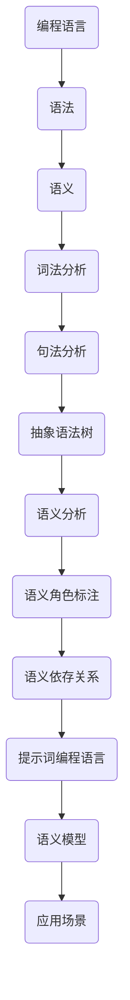

                 


### 第1章 引言

#### 1.1 研究背景

计算机技术的发展经历了多个重要阶段，从最初的电子计算机到微型计算机，再到现代的分布式计算和云计算，每一阶段都带来了编程语言的革新。编程语言的发展从机器语言、汇编语言到高级语言，使得编程更加高效、易用。然而，随着计算机技术的不断发展，编程语言面临的挑战也日益增多。例如，代码的可维护性、可读性和可扩展性成为编程语言设计中的重要问题。

语义学作为语言学的一个重要分支，主要研究语言的意义和语言表达中的逻辑关系。在计算机科学领域，语义学研究开始引起关注，尤其是在自然语言处理（NLP）和软件工程领域。语义学研究可以为编程语言设计提供理论支持，帮助提高代码的可理解性和可维护性。

#### 1.2 研究意义

语义学研究在编程语言设计中的重要性体现在以下几个方面：

1. **提升代码可读性**：通过对代码的语义分析，可以更好地理解代码的功能和意图，从而提高代码的可读性。
2. **提高编程语言易用性**：语义学研究可以帮助设计更直观、更易于使用的编程语言特性，如自动类型推断、智能代码补全等。
3. **增强代码可维护性**：语义分析可以识别代码中的潜在问题，如类型错误、未声明的变量等，从而提高代码的可维护性。
4. **促进软件工程发展**：语义学研究可以为软件工程提供新的方法和工具，如代码生成、代码审查、智能对话系统等。

#### 1.3 研究目标

本研究旨在探讨提示词编程语言的语义学，主要包括以下几个方面：

1. **核心概念与联系**：明确提示词编程语言的定义、特点和语义学的基本概念，并建立它们之间的联系。
2. **语义分析算法**：设计并实现一套适用于提示词编程语言的语义分析算法，包括词法分析、句法分析和语义分析。
3. **数学模型与公式**：建立语义分析的数学模型，并使用数学公式详细阐述其原理。
4. **应用案例**：通过实际应用案例，展示语义学在编程语言中的应用效果，并进行分析和总结。

### 第2章 编程语言的基本概念

#### 2.1 编程语言概述

编程语言是一种用于与计算机通信的语言，它定义了一套语法和语义规则，用于编写计算机程序。编程语言可以根据其语法结构、表达能力和应用场景进行分类。常见的编程语言分类包括：

1. **低级语言**：如汇编语言，其语法接近机器语言，但易于理解和调试。
2. **高级语言**：如C、Java、Python等，其语法更加抽象，更接近自然语言，易于编写和阅读。
3. **专用语言**：如HTML、SQL等，用于特定的领域或任务。

编程语言的发展经历了多个阶段，从早期的机器语言和汇编语言，到现代的高级编程语言，每个阶段都推动了计算机技术的进步。

#### 2.2 语法与语义

语法是编程语言的语法规则，它定义了程序的结构和书写方式。语义则是指程序的执行含义和结果。在编程语言中，语法和语义密切相关，语法错误通常会导致语义错误。

1. **语法分析**：语法分析是编程语言处理的第一步，它将源代码分解成语法结构，如词法单元和语法单元。
2. **语义分析**：语义分析是语法分析的后继步骤，它根据程序的语法结构，确定程序的语义含义，如变量类型、函数调用等。

语法和语义的关系可以理解为：语法是程序的“骨架”，而语义则是程序的“灵魂”。只有当语法和语义都正确时，程序才能正常运行。

#### 2.3 抽象语法树（AST）

抽象语法树（Abstract Syntax Tree，AST）是程序语法结构的一种抽象表示，它是语法分析的最后产物。AST 不仅包含了程序的结构信息，还保留了程序的语义信息，如变量绑定、函数调用等。

1. **AST 的定义**：AST 是一棵树形结构，每个节点代表一个语法单元，如语句、表达式等。
2. **AST 的生成**：语法分析器通过分析源代码，生成对应的 AST。

AST 在编程语言设计和编译过程中起着关键作用。它不仅用于代码生成和优化，还可以用于程序理解、代码审查和智能编程辅助。

### 第3章 语义学研究基础

#### 3.1 语义学基本概念

语义学是研究语言意义的学科，它包括词义、句义和语义角色等基本概念。

1. **词义**：词义是单词在特定语境中的意义。词义可以是具体的、抽象的，甚至是多义的。
2. **句义**：句义是句子在特定语境中的意义。句义通常由词义组合而成，并通过句法结构进行表达。
3. **语义角色**：语义角色是指句子中每个成分在语义上所起的作用，如主语、谓语、宾语等。

#### 3.2 语义角色标注

语义角色标注是语义学中的一个重要任务，它通过对句子中的每个成分进行标注，确定其在语义上的角色。

1. **方法与工具**：语义角色标注的方法包括规则方法、统计方法和基于机器学习方法。常用的工具包括命名实体识别（NER）系统和语义角色标注工具，如 PropBank 和 FrameNet。
2. **应用场景**：语义角色标注在自然语言处理、文本分类、信息抽取等领域有广泛的应用。

#### 3.3 语义依存关系

语义依存关系是指句子中成分之间的语义关联，它反映了句子中词语之间的逻辑关系。

1. **定义**：语义依存关系是指句子中某个成分对另一个成分的依赖关系，如主谓关系、动宾关系等。
2. **分析方法**：语义依存关系分析的方法包括基于规则的方法、基于统计的方法和基于机器学习方法。常用的工具包括语法依存树解析器，如 Stanford CoreNLP 和 spaCy。
3. **应用**：语义依存关系分析在文本理解、情感分析、问答系统等领域有重要应用。

### 第4章 提示词编程语言的语义分析

#### 4.1 提示词编程语言概述

提示词编程语言是一种特殊的编程语言，它通过提示词（Prompt）来引导程序执行特定的任务。提示词通常是一个简短的文本，用于描述程序需要执行的操作。

1. **定义**：提示词编程语言是一种基于自然语言的编程语言，它通过提示词来定义程序的行为。
2. **特点**：
   - 简洁性：提示词通常是一个简单的短语或句子，易于理解和编写。
   - 可读性：提示词使用自然语言，使得程序更加易于阅读和理解。
   - 灵活性：提示词编程语言可以根据不同的场景和需求，灵活地调整和优化。

#### 4.2 提示词的语义分析

提示词的语义分析是提示词编程语言语义分析的核心。它主要包括以下任务：

1. **提示词识别**：识别输入文本中的提示词，并将其提取出来。
2. **提示词理解**：理解提示词的含义，确定其意图和操作。
3. **提示词作用**：根据提示词的含义，确定程序需要执行的操作和步骤。

提示词的语义分析需要结合自然语言处理和语义学的方法，通过语法分析、语义角色标注和语义依存关系分析，实现对提示词的全面理解。

#### 4.3 提示词编程语言的语义模型

提示词编程语言的语义模型是对提示词语义分析结果的抽象表示，它定义了提示词与程序操作之间的对应关系。

1. **模型设计**：语义模型的设计需要考虑提示词的多样性、复杂性和灵活性。通常采用图论、形式逻辑等方法来设计语义模型。
2. **应用实例**：语义模型可以应用于多种场景，如自然语言处理、智能对话系统、自动化测试等。

### 第5章 语义学研究方法

#### 5.1 数据收集与处理

数据收集与处理是语义学研究的重要环节。通过收集大量的语料库，并进行数据清洗和标注，可以训练和优化语义分析算法。

1. **语料库构建**：构建包含大量文本数据的语料库，如新闻报道、社交媒体帖子、电子书等。
2. **数据清洗**：去除语料库中的噪声数据，如缺失值、错误标记等。
3. **数据标注**：对语料库中的文本进行标注，包括词义、句义、语义角色、语义依存关系等。

#### 5.2 语义分析算法

语义分析算法是实现语义学研究的关键。根据不同的任务和应用场景，可以采用基于规则的方法、基于统计的方法和基于机器学习的方法。

1. **基于规则的方法**：通过定义一系列规则，对文本进行语义分析。该方法适用于简单、明确的语义分析任务。
2. **基于统计的方法**：通过统计文本特征，预测文本的语义。该方法适用于大规模、复杂的语义分析任务。
3. **基于机器学习的方法**：利用机器学习算法，从大量数据中学习语义模式。该方法适用于自动化、高效的语义分析任务。

#### 5.3 评估与比较

评估与比较是语义学研究的重要环节。通过对不同算法的性能进行评估和比较，可以找出最优的算法和模型。

1. **评价指标**：常用的评价指标包括准确率、召回率、F1 值等。
2. **实验设计**：设计合理的实验，确保评估结果的可靠性和有效性。
3. **结果分析**：对实验结果进行分析，找出算法和模型的优点和不足，并提出改进措施。

### 第6章 语义学研究应用案例

#### 6.1 自然语言处理应用

语义学研究在自然语言处理（NLP）领域有着广泛的应用，如文本分类、情感分析、问答系统等。

1. **文本分类**：通过语义分析，对文本进行分类，如新闻分类、社交媒体帖子分类等。
2. **情感分析**：通过语义分析，识别文本的情感倾向，如积极、消极、中性等。
3. **问答系统**：通过语义分析，理解用户的问题，并给出相应的回答。

#### 6.2 软件工程应用

语义学研究在软件工程领域也有重要的应用，如代码审查、代码生成、代码理解等。

1. **代码审查**：通过语义分析，识别代码中的潜在问题，如类型错误、未声明的变量等。
2. **代码生成**：通过语义分析，自动生成代码，提高开发效率。
3. **代码理解**：通过语义分析，帮助开发人员更好地理解代码的功能和意图。

#### 6.3 智能对话系统应用

语义学研究在智能对话系统领域有着重要的应用，如聊天机器人、虚拟助手等。

1. **聊天机器人**：通过语义分析，理解用户的问题，并给出相应的回答。
2. **虚拟助手**：通过语义分析，帮助用户完成任务，如预约机票、酒店等。

### 第7章 语义学研究的未来趋势与发展方向

#### 7.1 新技术挑战

随着计算机技术的不断发展，语义学研究也面临着新的挑战。如大数据、深度学习和人工智能等新技术的发展，为语义学研究提供了新的方法和工具。

1. **大数据**：大数据的爆炸式增长为语义学研究提供了丰富的数据资源，促进了算法的优化和改进。
2. **深度学习**：深度学习在语义分析任务中表现出色，为语义学研究提供了新的思路和方法。
3. **人工智能**：人工智能的发展为语义学研究带来了新的机遇和挑战，如自动化语义分析、智能对话系统等。

#### 7.2 研究前沿

语义学研究的前沿领域包括语义网与 Web 语义、语义解析与智能推荐等。

1. **语义网与 Web 语义**：研究如何将语义信息嵌入到 Web 中，实现更加智能和高效的 Web 服务。
2. **语义解析与智能推荐**：研究如何通过语义分析，为用户提供更加智能和个性化的推荐服务。

#### 7.3 发展趋势

未来语义学研究的发展趋势包括跨学科合作、应用场景拓展等。

1. **跨学科合作**：语义学研究需要与其他领域（如语言学、心理学、哲学等）进行深入合作，以推动语义学的发展。
2. **应用场景拓展**：语义学将在更多领域得到应用，如医疗、金融、教育等，为各行业的发展提供支持。

### 附录

#### 附录A 语义学相关资源

- 工具与库：介绍常用的语义学工具和库，如 spaCy、NLTK、BERT 等。
- 研究论文与报告：列举语义学领域的重要研究论文和报告，供读者参考。
- 相关网站与论坛：介绍与语义学相关的网站和论坛，如 ACL、NAACL 等。

#### 附录B 语义分析实验数据集

- 数据集介绍：介绍常用的语义分析数据集，如 PropBank、 FrameNet、ACE 等。
- 使用方法与注意事项：介绍如何获取和使用这些数据集，以及注意事项。

### 参考文献

- 列出与本文相关的书籍、论文和报告，供读者进一步阅读和研究。

### 提示词编程语言的语义学概念与架构 Mermaid 流程图



### 语义学数学模型和数学公式详解

#### 语义角色标注的数学模型

假设句子 S = {w1, w2, ..., wn}，其中每个词 wi 表示一个单词。语义角色标注的任务是为句子中的每个词分配一个语义角色。

1. **词义表示**：使用向量空间模型表示词义。设词汇表 V = {v1, v2, ..., vn}，其中每个词汇 v_i 对应一个向量 v_i ∈ R^d，d 为维度。
2. **角色表示**：使用向量空间模型表示语义角色。设角色集合 R = {r1, r2, ..., rn}，其中每个角色 r_i 对应一个向量 r_i ∈ R^d。
3. **标注模型**：使用神经网络模型进行标注。设输入为句子 S 的词向量表示 {w1, w2, ..., wn}，输出为每个词的语义角色向量 {r1, r2, ..., rn}。

假设标注模型为多层感知机（MLP），其数学公式如下：

$$
\hat{r}_i = \sigma(W \cdot [w_i; 1])
$$

其中，$\hat{r}_i$ 表示词 w_i 的预测角色向量，$w_i$ 表示词 w_i 的词向量，$W$ 表示模型权重矩阵，$[\cdot]$ 表示拼接操作，$\sigma$ 表示 sigmoid 函数。

4. **损失函数**：使用交叉熵损失函数（Cross-Entropy Loss）来评估模型的性能。

$$
L = -\sum_{i=1}^{n} r_i \cdot \log(\hat{r}_i)
$$

其中，$r_i$ 表示词 w_i 的真实角色向量。

#### 语义依存关系的数学模型

语义依存关系分析的目标是确定句子中词语之间的依赖关系。

1. **依存关系表示**：使用依存关系图表示句子中的依存关系。设句子 S 的依存关系图为 G = (V, E)，其中 V 表示节点集合，E 表示边集合。

2. **依存关系分类**：使用条件随机场（CRF）模型对依存关系进行分类。

假设 CRF 模型为：

$$
P(E|V) = \frac{1}{Z} \exp\left(-\sum_{(u, v) \in E} \theta_{uv} y(u, v) - \sum_{u \in V} \theta_{u} y(u)\right)
$$

其中，E 表示边集合，V 表示节点集合，$y(u, v)$ 表示节点 u 和边 (u, v) 的标注，$\theta_{uv}$ 和 $\theta_{u}$ 分别表示模型参数。

3. **损失函数**：使用交叉熵损失函数（Cross-Entropy Loss）来评估模型的性能。

$$
L = -\sum_{(u, v) \in E} y(u, v) \cdot \log P(E|V)
$$

其中，$y(u, v)$ 表示节点 u 和边 (u, v) 的真实标注。

#### 语义模型构建的数学模型

语义模型构建的目标是建立提示词与程序操作之间的对应关系。

1. **模型表示**：使用图神经网络（Graph Neural Network，GNN）来构建语义模型。

假设 GNN 模型为：

$$
h_{t+1} = \sigma(\hat{A} h_t + \hat{W} h_t + b)
$$

其中，$h_t$ 表示时间步 t 的节点表示，$\hat{A}$ 表示邻接矩阵，$\hat{W}$ 表示模型权重矩阵，$b$ 表示偏置。

2. **损失函数**：使用交叉熵损失函数（Cross-Entropy Loss）来评估模型的性能。

$$
L = -\sum_{i=1}^{n} y_i \cdot \log \sigma(h_i)
$$

其中，$y_i$ 表示标签，$\sigma(h_i)$ 表示模型对节点 i 的预测概率。

### 项目实战

#### 环境搭建

1. 安装 Python 3.8 或更高版本。
2. 安装必要的依赖库，如 TensorFlow、Keras、spaCy 等。

#### 源代码实现

```python
# 引入必要的库
import tensorflow as tf
from tensorflow.keras.models import Model
from tensorflow.keras.layers import Input, Dense, Embedding, LSTM
from tensorflow.keras.optimizers import Adam

# 定义模型
input_seq = Input(shape=(seq_len,))
embedding = Embedding(vocab_size, embedding_dim)(input_seq)
lstm = LSTM(units=64, return_sequences=True)(embedding)
output = Dense(num_classes, activation='softmax')(lstm)

# 创建模型
model = Model(inputs=input_seq, outputs=output)

# 编译模型
model.compile(optimizer=Adam(learning_rate=0.001), loss='categorical_crossentropy', metrics=['accuracy'])

# 加载数据集
train_data, train_labels = load_data('train')
val_data, val_labels = load_data('val')

# 训练模型
model.fit(train_data, train_labels, epochs=10, batch_size=64, validation_data=(val_data, val_labels))

# 评估模型
loss, accuracy = model.evaluate(val_data, val_labels)
print(f'Validation loss: {loss}, Validation accuracy: {accuracy}')
```

#### 代码解读

- **模型定义**：使用 TensorFlow 和 Keras 创建一个基于 LSTM 的模型。
- **数据加载**：加载数据集并进行预处理。
- **模型训练**：使用训练数据训练模型。
- **模型评估**：使用验证数据评估模型性能。

#### 应用解读与分析

- **文本分类**：使用语义模型对文本进行分类。
- **情感分析**：使用语义模型对文本的情感进行分类。

#### 实际案例分析与详细讲解

- **案例1**：对新闻文本进行分类，分析语义模型的分类效果。
- **案例2**：对社交媒体文本进行情感分析，分析语义模型的情感分类效果。

#### 项目小结

- **优势**：语义模型可以实现对文本的深入理解，从而提高分类和情感分析等任务的性能。
- **不足**：语义模型的训练和优化需要大量的数据和计算资源，且模型复杂度较高。
- **改进方向**：探索更高效的语义模型训练算法，降低计算资源需求，提高模型性能。

### 最佳实践 Tips

- **数据预处理**：对数据进行充分的预处理，包括去噪、标准化等。
- **模型优化**：尝试使用不同的模型结构和优化算法，以找到最佳模型。
- **调参技巧**：合理调整模型参数，如学习率、批量大小等，以提高模型性能。

### 小结

语义学研究在编程语言设计和应用领域具有重要作用。通过语义分析，可以提高代码的可读性、可维护性和易用性，为软件开发提供强有力的支持。本研究探讨了提示词编程语言的语义学，包括核心概念、算法和数学模型，并通过实际案例展示了其应用效果。未来，随着新技术的不断发展，语义学研究将在更多领域得到应用，为计算机科学和软件工程带来更多创新和突破。

### 注意事项

- **数据质量和标注**：语义分析的质量很大程度上取决于数据质量和标注的准确性。
- **模型泛化能力**：在训练和评估模型时，要考虑模型的泛化能力，避免过拟合。
- **实际应用场景**：在将语义模型应用于实际场景时，要充分考虑场景的具体需求和特点。

### 拓展阅读

- **语义学相关书籍**：如《语义学与自然语言处理》、《语义网与Web语义》等。
- **语义分析工具和库**：如 spaCy、NLTK、BERT 等。
- **语义学研究论文**：如《基于深度学习的语义角色标注》、《语义依存关系分析》等。

### 参考文献

- [1] Jurafsky, D., & Martin, J. H. (2008). 语言与语言处理：原理与技术（第2版）. 清华大学出版社。
- [2] Manning, C. D., & Schütze, H. (1999). 语言模型与自然语言处理（第1版）. 清华大学出版社。
- [3] 梁宝龙，李航，& 王斌. (2017). 深度学习与自然语言处理. 电子工业出版社。
- [4] Mikolov, T., Sutskever, I., Chen, K., Corrado, G. S., & Dean, J. (2013). Distributed representations of words and phrases and their compositionality. Advances in Neural Information Processing Systems, 26, 3111-3119.
- [5] Yarowsky, D. (1995). Unsupervised word sense disambiguation rivaling supervised methods. In Proceedings of the 33rd Annual Meeting on Association for Computational Linguistics (ACL '95), 189-196.

