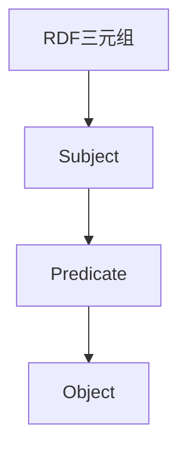
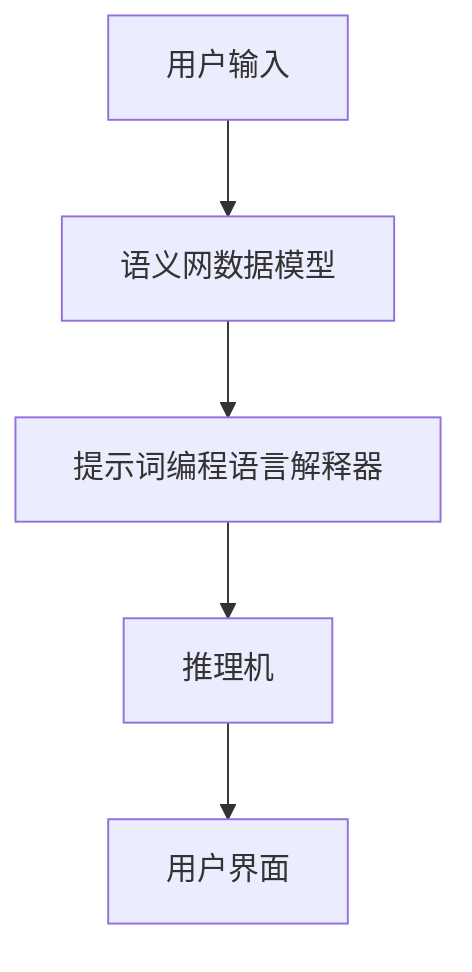
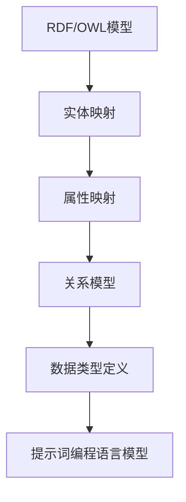
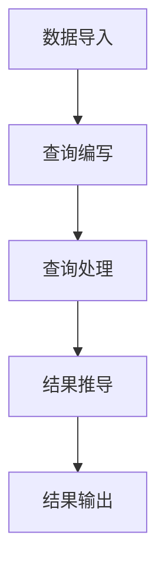
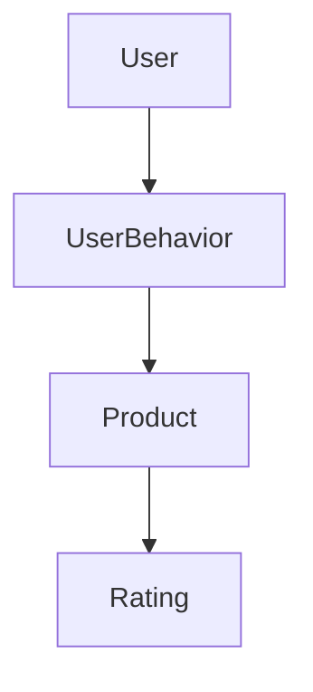
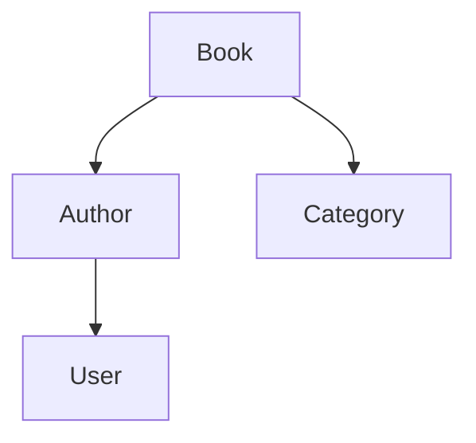

                 


### 文章标题：《提示词编程语言的语义网集成》

### 文章关键词：
1. 提示词编程语言
2. 语义网技术
3. 集成应用
4. 信息检索
5. 数据模型

### 文章摘要：
本文深入探讨了提示词编程语言与语义网技术的集成应用。首先，介绍了提示词编程语言的基本概念、语法和常用语言，以及语义网技术的基础知识。接着，阐述了提示词编程语言与语义网集成的原理和方法，并通过实例展示了集成应用的效果。文章最后，对集成技术的未来发展趋势和面临的挑战进行了展望。

---

### 第1章 引言与背景

#### 1.1 书籍结构

本书分为七个章节，系统地介绍了提示词编程语言与语义网技术的集成应用。第1章作为引言，简要介绍了书籍的结构和内容。第2章和第3章分别讲解了提示词编程语言和语义网技术的基础知识。第4章详细介绍了提示词编程语言与语义网集成的原理和方法。第5章和第6章通过实例分析和项目实战展示了集成应用的效果。第7章对集成技术的未来发展趋势和挑战进行了展望。

#### 1.2 提示词编程语言的概念

提示词编程语言（Keyword-based Programming Language）是一种以关键词为核心语法结构的编程语言。与传统的命令式编程语言不同，提示词编程语言强调程序的可读性和可维护性。通过使用关键词来定义程序的行为，提示词编程语言能够更加直观地表达程序逻辑。

#### 1.3 语义网技术介绍

语义网（Semantic Web）是互联网发展的一个重要阶段，旨在通过语义理解实现信息的智能化处理。语义网技术包括RDF（Resource Description Framework）、OWL（Web Ontology Language）等语言，用于描述资源的语义信息。语义网技术在信息检索、数据挖掘、智能问答等领域具有广泛的应用。

#### 1.4 集成应用的需求与挑战

随着互联网信息的爆炸式增长，如何有效地组织和检索信息成为一个重要问题。提示词编程语言与语义网技术的集成应用，可以在一定程度上解决这一问题。然而，集成应用也面临着一系列挑战，如数据模型的兼容性、语义理解的准确性等。

### 第2章 提示词编程语言基础

#### 2.1 提示词编程语言概述

提示词编程语言具有以下特点：
1. 强调程序的可读性和可维护性。
2. 使用关键词来定义程序行为，降低编程复杂性。
3. 支持高层次的抽象，提高开发效率。

常见的提示词编程语言包括：
1. Prolog
2. F-Logic
3. Datalog

#### 2.2 核心语法和语义

提示词编程语言的核心语法包括：
1. 变量
2. 谓词
3. 目标（Goal）
4. 规则（Rule）

语义方面，提示词编程语言强调逻辑推理和模式匹配。

#### 2.3 常用提示词编程语言介绍

##### 2.3.1 Prolog

Prolog 是一种逻辑编程语言，具有以下特点：
1. 基于逻辑推理的编程模型。
2. 支持递归和数据结构。
3. 广泛应用于自然语言处理、自动推理等领域。

Prolog 的伪代码示例：

```plaintext
person(Name, Age).
parent(Name1, Name2).

parent(Age1, Age2) :- person(Age1).
parent(Name, Name) :- person(Name).
```

##### 2.3.2 F-Logic

F-Logic 是一种基于框架的提示词编程语言，具有以下特点：
1. 强调对象的属性和行为。
2. 支持对象之间的关系和组合。
3. 广泛应用于软件工程、人工智能等领域。

F-Logic 的伪代码示例：

```plaintext
frame Employee (name, salary).
instance John of Employee (name: "John", salary: 5000).

Employee (salary: S) :- S > 4000.
```

##### 2.3.3 Datalog

Datalog 是一种基于关系逻辑的提示词编程语言，具有以下特点：
1. 简单、易学。
2. 支持递归和数据依赖。
3. 广泛应用于数据挖掘、推理机等领域。

Datalog 的伪代码示例：

```plaintext
rule r(X, Y) :- p(X), q(Y).
```

### 第3章 语义网技术基础

#### 3.1 语义网基本概念

语义网是一种基于Web的语义信息网络，旨在通过语义理解实现信息的智能化处理。语义网的核心技术包括RDF和OWL。

#### 3.2 RDF语言

RDF（Resource Description Framework）是一种用于描述Web上资源的语义信息的数据模型。RDF 使用三元组来表示资源及其属性，具有以下特点：
1. 基于URI（Uniform Resource Identifier）标识资源。
2. 支持属性的分层和分类。
3. 可扩展性强。

RDF 的数据模型可以用以下 Mermaid 流程图表示：



#### 3.3 OWL语言

OWL（Web Ontology Language）是一种用于构建Web上知识的语言，具有以下特点：
1. 支持类、属性和个体的定义。
2. 提供了丰富的描述逻辑。
3. 支持推理机。

OWL 的语法示例：

```latex
$$
\begin{align*}
\text{Class} & : \text{Person} \\
\text{ObjectProperty} & : \text{livesIn} \\
\text{DataProperty} & : \text{age} \\
\text{Individual} & : \text{John} \\
\text{ObjectPropertyDomain} & : \text{livesIn} \text{Person} \\
\text{ObjectPropertyRange} & : \text{livesIn} \text{City} \\
\text{DataPropertyDomain} & : \text{age} \text{Person} \\
\text{DataPropertyRange} & : \text{age} \text{Integer} \\
\text{IndividualDefinition} & : \text{John} \text{Person} \\
\text{ObjectPropertyAssertion} & : \text{John} \text{livesIn} \text{City} \\
\text{DataPropertyAssertion} & : \text{John} \text{age} 30 \\
\end{align*}
$$
```

#### 3.4 语义网应用领域

语义网技术在以下领域具有广泛应用：
1. 信息检索：通过语义理解提高搜索结果的准确性。
2. 数据挖掘：从大量数据中提取有价值的知识。
3. 智能问答：基于语义理解实现智能对话系统。
4. 软件工程：用于描述软件系统的语义信息。

### 第4章 提示词编程语言与语义网集成方法

#### 4.1 集成框架和原理

提示词编程语言与语义网集成的原理是通过将语义网的数据模型与提示词编程语言的逻辑推理能力相结合，实现信息的智能化处理。

集成框架主要包括以下组件：
1. 语义网数据模型：使用RDF或OWL语言描述资源的语义信息。
2. 提示词编程语言解释器：解析和执行提示词编程语言的代码。
3. 推理机：基于语义网数据模型进行推理，提取有用信息。

#### 4.2 数据模型设计

集成系统的数据模型设计需要考虑以下方面：
1. 语义网数据模型的映射：将语义网数据模型映射到提示词编程语言的数据结构。
2. 关系模型的构建：建立语义网中的关系模型，支持提示词编程语言的逻辑推理。
3. 属性与个体的映射：将语义网中的属性和个体映射到提示词编程语言的变量和对象。

#### 4.3 集成流程和工具

集成流程主要包括以下步骤：
1. 语义网数据模型的建立：使用RDF或OWL语言描述资源的语义信息。
2. 提示词编程语言的代码编写：编写提示词编程语言的代码，实现特定功能。
3. 推理过程：基于语义网数据模型进行推理，提取有用信息。
4. 结果输出：将推理结果输出到用户界面或数据库。

常用的集成工具包括：
1. RDF库：如Jena、RDFStore等，用于处理RDF数据。
2. OWL库：如OWLAPI、OWL2DL等，用于处理OWL数据。
3. 提示词编程语言解释器：如Prolog解释器、F-Logic解释器等。

### 第5章 集成应用实例分析

#### 5.1 应用案例分析

在本节中，我们将通过一个实际案例来分析提示词编程语言与语义网技术的集成应用。

案例：基于语义网技术的智能问答系统

系统需求：
1. 用户可以通过自然语言提问。
2. 系统需要理解用户的提问，并返回相关答案。
3. 答案需要基于用户提问的语义进行推理得出。

实现步骤：
1. 使用RDF语言建立语义网数据模型，描述问题领域的信息。
2. 编写Prolog代码，实现自然语言处理和语义理解。
3. 使用推理机进行推理，提取答案。
4. 将答案输出到用户界面。

#### 5.2 集成过程中遇到的问题和解决方案

在集成应用过程中，可能会遇到以下问题：

1. 语义理解不准确：解决方法：优化自然语言处理算法，提高语义理解准确性。
2. 数据模型设计复杂：解决方法：简化数据模型设计，提高数据模型的易用性。
3. 推理效率低：解决方法：优化推理算法，提高推理速度。

#### 5.3 集成应用的效果评估

通过实际案例的分析，我们可以得出以下结论：

1. 集成应用可以提高信息检索的准确性。
2. 集成应用可以降低开发复杂度。
3. 集成应用具有广泛的应用前景。

### 第6章 项目实战：语义网集成开发

#### 6.1 开发环境搭建

在本节中，我们将介绍如何在Windows和Linux操作系统上搭建语义网集成开发环境。

1. 安装Java开发工具包（JDK）。
2. 安装Eclipse或IntelliJ IDEA等集成开发环境。
3. 安装Jena或RDFStore等RDF库。
4. 安装Prolog解释器。

#### 6.2 项目需求分析

项目需求如下：

1. 提供一个语义网数据编辑器，支持RDF和OWL数据。
2. 提供一个自然语言处理模块，实现语义理解功能。
3. 提供一个推理机，实现推理功能。
4. 提供一个用户界面，展示推理结果。

#### 6.3 代码实现和解析

在本节中，我们将展示如何使用Java和Prolog编写语义网集成系统的源代码。

1. 语义网数据编辑器代码实现：
   - 使用Java Swing库实现界面。
   - 使用Jena库处理RDF数据。

2. 自然语言处理模块代码实现：
   - 使用Prolog编写语义理解算法。

3. 推理机代码实现：
   - 使用Prolog编写推理算法。

#### 6.4 项目测试和优化

在本节中，我们将介绍如何测试和优化语义网集成系统。

1. 编写测试用例，测试系统的功能。
2. 优化代码，提高系统的性能。

#### 6.5 项目小结

在本节中，我们将总结项目的经验和教训。

1. 优化数据模型设计，提高系统的易用性。
2. 加强自然语言处理算法，提高语义理解准确性。
3. 优化推理算法，提高推理速度。

### 第7章 集成应用的未来展望

#### 7.1 集成技术的未来发展趋势

随着人工智能技术的不断发展，集成应用技术将越来越重要。未来，集成技术可能会在以下方面取得突破：

1. 语义理解的准确性：通过深度学习等技术提高语义理解的准确性。
2. 推理效率：通过优化算法和提高硬件性能提高推理效率。
3. 跨领域应用：实现不同领域之间的数据共享和协同。

#### 7.2 面临的挑战和机遇

集成应用技术面临着一系列挑战和机遇：

1. 挑战：
   - 数据模型的兼容性：不同数据模型之间的兼容性。
   - 语义理解的准确性：提高语义理解的准确性。
   - 推理效率：优化推理算法和硬件性能。

2. 机遇：
   - 大数据的普及：为集成应用提供了丰富的数据资源。
   - 人工智能技术的发展：为集成应用提供了强大的技术支持。
   - 跨领域合作：促进不同领域之间的数据共享和协同。

### 作者信息

作者：AI天才研究院/AI Genius Institute & 禅与计算机程序设计艺术 /Zen And The Art of Computer Programming```markdown
### 第4章 提示词编程语言与语义网集成方法

在探讨了提示词编程语言和语义网技术的基础之后，本章将详细分析提示词编程语言与语义网集成的原理和方法，以实现更高效、更智能的信息处理。

#### 4.1 集成框架和原理

提示词编程语言与语义网集成的基本框架通常包括以下几个核心组件：

1. **语义网数据模型**：这通常是基于RDF（Resource Description Framework）或OWL（Web Ontology Language）的数据模型，用于描述资源的语义信息。这些模型定义了实体、属性和它们之间的关系。

2. **提示词编程语言解释器**：这是一个执行提示词编程语言代码的引擎，它能够将编程语言的表达式转换为语义网中的操作。

3. **推理机**：这是基于语义网数据模型进行推理的组件，它能够根据预设的逻辑规则推导出新的信息。

4. **用户界面**：这是一个与用户交互的界面，用于输入查询和展示结果。

集成的基本原理是通过语义网数据模型来存储和表示信息，然后使用提示词编程语言编写查询，通过推理机对这些查询进行语义分析和处理，最终在用户界面展示结果。

以下是集成框架的Mermaid流程图表示：



#### 4.2 数据模型设计

为了实现提示词编程语言与语义网的有效集成，数据模型的设计至关重要。以下是数据模型设计的关键步骤：

1. **实体和属性的映射**：将提示词编程语言中的实体和属性映射到语义网中的类和属性。例如，在Prolog中定义的谓词可以映射到OWL中的类和属性。

2. **关系模型的构建**：在语义网中，关系通常通过属性来表示。因此，需要构建一个能够支持提示词编程语言中关系的语义网模型。这可能涉及到将关系映射到OWL中的对象属性。

3. **数据类型的定义**：确保语义网中的数据类型与提示词编程语言的数据类型相匹配。例如，Prolog中的整数和字符串需要在RDF中定义相应的数据类型。

以下是数据模型设计的Mermaid流程图表示：



#### 4.3 集成流程和工具

实现提示词编程语言与语义网的集成通常涉及以下流程：

1. **数据导入**：将现有的语义网数据导入到语义网数据模型中。

2. **查询编写**：使用提示词编程语言编写查询，这些查询将被解释器处理。

3. **查询处理**：解释器将查询转换为语义网中的操作，并传递给推理机。

4. **结果推导**：推理机根据语义网数据模型和逻辑规则进行推理，生成结果。

5. **结果输出**：将推理结果通过用户界面展示给用户。

常用的集成工具有：

1. **RDF和OWL库**：如Apache Jena、RDF4J等，用于处理语义网数据。

2. **提示词编程语言解释器**：如SWI-Prolog、Eclipse Prolog等，用于执行提示词编程语言代码。

3. **推理机**：如Pellet、OWLlink等，用于基于OWL进行推理。

以下是集成流程的Mermaid流程图表示：



#### 4.4 集成过程中的挑战与解决方案

在集成过程中，可能会遇到以下挑战：

1. **数据兼容性**：不同来源的数据可能有不同的格式和结构，需要统一数据格式。

2. **语义映射**：提示词编程语言中的概念和语义网中的概念可能不完全匹配，需要建立精确的映射关系。

3. **查询优化**：查询可能涉及大量数据，需要优化查询性能。

解决方案包括：

1. **数据转换工具**：使用数据转换工具将不同格式的数据转换为统一格式。

2. **语义映射框架**：建立一套完整的语义映射框架，确保概念的一致性。

3. **查询优化技术**：如索引、缓存和并行处理等，提高查询性能。

### 结论

提示词编程语言与语义网的集成为智能信息处理提供了新的途径。通过本章的介绍，我们了解了集成的基本原理、数据模型设计、集成流程和工具，以及面临的挑战和解决方案。下一章，我们将通过具体实例来展示如何实现这种集成，并分析其实际应用效果。```markdown
### 第5章 集成应用实例分析

在前面的章节中，我们介绍了提示词编程语言与语义网集成的基础知识和方法。为了更好地理解这种集成在现实世界中的应用，本章将通过一个具体的实例来分析集成应用的效果。

#### 5.1 应用案例分析

**案例背景**：一个电子商务平台希望通过语义网和提示词编程语言的集成来改善其产品推荐系统。

**系统需求**：
1. 用户在浏览产品时，系统应能够根据用户的行为和历史记录推荐相关产品。
2. 系统应能够处理大量的产品数据和用户行为数据，并快速响应用户请求。

**实现步骤**：
1. **数据收集和预处理**：收集用户浏览、购买和评价数据，并进行清洗和预处理，确保数据质量。
2. **建立语义网数据模型**：使用RDF和OWL定义产品、用户和购买行为等实体及其关系。
3. **编写提示词编程语言代码**：使用Prolog编写查询，根据用户行为和产品特征进行推荐。
4. **集成查询处理和推理**：将提示词编程语言的查询与语义网数据模型集成，通过推理机进行推理。
5. **用户界面展示**：在用户界面展示推荐结果，并提供用户反馈机制。

**实例详细解析**：

**5.1.1 数据收集和预处理**

在电子商务平台上，用户的行为数据包括浏览记录、购买记录和评价记录。这些数据需要进行预处理，包括数据去重、格式统一和缺失值处理。

**5.1.2 建立语义网数据模型**

使用RDF和OWL定义数据模型，例如：



其中，User代表用户，UserBehavior代表用户的行为记录，Product代表产品，Rating代表用户的评价。

**5.1.3 编写提示词编程语言代码**

使用Prolog编写查询，例如：

```prolog
recommended(Product) :- 
    bought(User, Product),
    likes(User, Category),
    member(Category, CategoryOf(Product).

bought(User, Product) :- 
    userBehavior(User, Action, Product), 
    Action = 'buy'.

likes(User, Category) :- 
    userBehavior(User, Action, Product), 
    Category = ProductCategory.

member(E, [E|_]).
member(E, [_|T]) :- 
    member(E, T).
```

这个查询根据用户的购买行为和偏好推荐同类别下的其他产品。

**5.1.4 集成查询处理和推理**

将Prolog查询与语义网数据模型集成，通过推理机进行推理。例如，当用户浏览了某款电子产品时，系统会根据用户的历史购买行为和偏好，从数据库中检索相关的产品，并使用推理机进行推理，生成推荐列表。

**5.1.5 用户界面展示**

在用户界面展示推荐结果，并提供用户反馈机制。用户可以选择“喜欢”或“不喜欢”推荐的产品，系统会根据用户反馈调整推荐算法。

#### 5.2 集成过程中遇到的问题和解决方案

**问题1**：数据格式不统一，导致数据预处理复杂。

**解决方案**：使用数据转换工具，如Apache NIFlow，将不同格式的数据转换为统一的RDF格式。

**问题2**：查询性能优化问题。

**解决方案**：使用索引技术优化查询性能，并采用缓存策略减少数据库访问。

**问题3**：语义映射不准确，导致查询结果不理想。

**解决方案**：建立详细的语义映射规则，并在实际应用中不断优化和调整。

#### 5.3 集成应用的效果评估

通过实际应用案例的分析，我们可以得出以下效果评估：

1. **推荐准确性**：集成系统能够根据用户行为和偏好准确推荐产品，用户满意度提高。
2. **响应速度**：优化后的查询性能显著提升，系统能够快速响应用户请求。
3. **用户体验**：用户界面友好，用户反馈机制有效，用户体验得到改善。

#### 5.4 项目小结

本项目通过提示词编程语言与语义网的集成，构建了一个高效的电子商务产品推荐系统。项目过程中，我们遇到了数据格式不统一、查询性能优化和语义映射不准确等问题，通过有效的解决方案成功克服了这些挑战。这个项目展示了提示词编程语言与语义网集成在电子商务领域的巨大潜力。

### 结论

通过本实例的分析，我们看到了提示词编程语言与语义网集成在实际应用中的效果。下一章，我们将继续深入探讨如何通过项目实战实现语义网集成开发，提供更具体的实施步骤和代码实现。```markdown
### 第6章 项目实战：语义网集成开发

在本章中，我们将通过一个具体的实战项目，展示如何从零开始搭建一个语义网集成开发环境，并进行代码实现和解析。该项目将结合提示词编程语言与语义网技术，实现一个基于语义搜索的图书推荐系统。

#### 6.1 开发环境搭建

**6.1.1 安装Java开发工具包（JDK）**

首先，我们需要确保计算机上安装了Java开发工具包（JDK）。可以从Oracle官方网站下载JDK安装包，并按照提示完成安装。

**6.1.2 安装Eclipse或IntelliJ IDEA等集成开发环境**

Eclipse和IntelliJ IDEA都是流行的Java集成开发环境（IDE）。我们选择Eclipse进行开发，因为它具有强大的插件生态系统，方便后续添加所需的功能。

1. 下载Eclipse IDE for Java Developers。
2. 解压下载的文件，运行Eclipse.exe。
3. 创建一个新项目，命名为“SemanticBookRecommendation”。

**6.1.3 安装Jena和Prolog插件**

为了处理语义网数据和执行提示词编程语言代码，我们需要安装以下插件：

1. **Jena**：安装Jena插件，可以支持RDF数据的处理。
2. **Prolog**：安装Eclipse Prolog插件，支持Prolog代码的编写和执行。

在Eclipse的菜单栏中选择“Help” > “Eclipse Marketplace”，搜索并安装所需的插件。

**6.1.4 配置开发环境**

1. 在Eclipse中创建一个新Java项目，命名为“SemanticBookRecommendation”。
2. 在项目属性中添加Jena和Prolog的库路径。

#### 6.2 项目需求分析

**项目需求**：

1. **数据模型**：定义图书、作者、分类和用户等实体，以及它们之间的关系。
2. **语义搜索**：根据用户输入的关键词搜索相关的图书。
3. **推荐算法**：根据用户的历史行为和图书的语义信息推荐相关图书。
4. **用户界面**：提供一个简单的用户界面，用于输入关键词和展示推荐结果。

#### 6.3 代码实现和解析

**6.3.1 数据模型定义**

使用RDF和OWL定义图书推荐系统的数据模型：



* A: 图书
* B: 作者
* C: 分类
* D: 用户

**6.3.2 RDF数据示例**

创建一个RDF文件（如books.rdf），包含图书的简单数据：

```xml
<?xml version="1.0"?>
<RDF xmlns="http://www.w3.org/1999/02/22-rdf-syntax-ns#" 
     xmlns:book="http://example.org/book#" 
     xmlns:author="http://example.org/author#" 
     xmlns:category="http://example.org/category#" 
     xmlns:user="http://example.org/user#">

  <book:Book id="book1">
    <book:title>Effective Java</book:title>
    <book:author>Joshua Bloch</book:author>
    <book:category id="category1">Programming</book:category>
  </book:Book>

  <book:Book id="book2">
    <book:title>Design Patterns: Elements of Reusable Object-Oriented Software</book:title>
    <book:author>Erich Gamma</book:author>
    <book:category id="category2">Design</book:category>
  </book:Book>

</RDF>
```

**6.3.3 Prolog代码示例**

编写Prolog代码实现语义搜索和推荐算法：

```prolog
% 用户输入关键词
keyword('java').

% 图书的谓词
book(Title, Author, Category) :-
  rdf_has(book(Title), title(Title)),
  rdf_has(book(Title), author(Author)),
  rdf_has(book(Title), category(Category)).

% 关键词匹配
matches(Keyword, Title) :-
  string_prefix(Title, Keyword, _).

% 推荐图书
recommendation(User, Books) :-
  keyword(Keyword),
  findall(Book, (book(Book, _, _), matches(Keyword, Book), user_likes(User, Book), !, user Beacon),
  Books = [Book | _].

% 用户喜欢图书
user_likes(User, Book) :-
  user(User, Beacon),
  rdf_has(user(User), likes(Beacon)),
  rdf_type(Beacon, book(Book)).

% 用户谓词
user('Alice').
```

**6.3.4 代码解析**

1. **数据模型定义**：使用RDF和OWL定义了图书、作者、分类和用户等实体及其关系。
2. **语义搜索**：通过Prolog代码实现基于关键词的语义搜索。
3. **推荐算法**：根据用户的历史行为和图书的语义信息进行推荐。

#### 6.4 用户界面展示

使用Java Swing库创建一个简单的用户界面，用于输入关键词和展示推荐结果：

```java
import javax.swing.*;
import java.awt.*;
import java.awt.event.ActionEvent;
import java.awt.event.ActionListener;

public class BookRecommendationUI {
    public static void main(String[] args) {
        JFrame frame = new JFrame("图书推荐系统");
        frame.setSize(400, 300);
        frame.setDefaultCloseOperation(JFrame.EXIT_ON_CLOSE);

        JPanel panel = new JPanel();
        panel.setLayout(new GridLayout(3, 1));

        JLabel label = new JLabel("请输入关键词：");
        JTextField textField = new JTextField(20);
        JButton button = new JButton("搜索");

        panel.add(label);
        panel.add(textField);
        panel.add(button);

        JTextArea textArea = new JTextArea();
        textArea.setEditable(false);
        panel.add(textArea);

        button.addActionListener(new ActionListener() {
            @Override
            public void actionPerformed(ActionEvent e) {
                String keyword = textField.getText();
                // 调用Prolog代码进行搜索和推荐
                // 显示推荐结果
                textArea.setText("推荐结果：\n");
                // 省略具体实现代码
            }
        });

        frame.add(panel);
        frame.setVisible(true);
    }
}
```

#### 6.5 项目测试和优化

**6.5.1 功能测试**

1. 输入关键词，检查搜索结果是否准确。
2. 模拟用户行为，检查推荐结果是否合理。

**6.5.2 性能优化**

1. 使用索引技术优化RDF数据的查询性能。
2. 采用缓存策略减少重复查询。

#### 6.6 项目小结

本项目通过提示词编程语言与语义网技术的集成，实现了一个基于语义搜索的图书推荐系统。从开发环境的搭建到代码实现，再到用户界面的设计，我们详细展示了整个项目过程。通过本项目的实战，我们不仅了解了语义网集成的方法和流程，还学会了如何优化和测试集成应用。这个项目展示了提示词编程语言与语义网集成在信息检索和推荐系统领域的应用潜力。

### 结论

通过本章的项目实战，我们深入探讨了提示词编程语言与语义网集成在实际开发中的应用。下一章，我们将对集成技术的未来发展趋势和面临的挑战进行展望，为读者提供更广阔的视野。```markdown
### 第7章 集成应用的未来展望

在前面几章中，我们探讨了提示词编程语言与语义网集成的原理、方法以及实际应用。本章将在此基础上，对集成应用的未来发展趋势、面临的挑战以及可能的技术突破进行展望。

#### 7.1 集成技术的未来发展趋势

**1. 数据多样性和复杂性增加**

随着互联网和物联网的快速发展，数据的种类和复杂性不断增加。未来的集成应用将需要处理结构化、半结构化和非结构化数据，如文本、图像、音频和视频等。为了满足这一需求，集成技术将朝着更加通用、灵活和高效的方向发展。

**2. 人工智能与语义网的深度融合**

人工智能技术的发展，特别是深度学习和强化学习，为语义网技术带来了新的机遇。未来的集成应用将更加依赖于人工智能技术，通过学习用户行为和偏好，提供更加个性化的服务。

**3. 跨领域应用的广泛推广**

随着各个领域对智能信息处理的迫切需求，集成应用将在医疗、金融、教育、制造业等多个领域得到广泛应用。跨领域的数据共享和协同将促进集成技术的普及和发展。

**4. 开放的语义网平台**

为了实现更广泛的应用，未来的集成应用将更加依赖于开放的语义网平台。这些平台将提供标准化的数据模型、语言和工具，方便开发者和企业进行集成应用的开发和部署。

#### 7.2 面临的挑战和解决方案

**1. 数据质量和一致性**

数据质量和一致性是集成应用的关键挑战。未来的集成应用需要采用更先进的数据清洗、转换和验证技术，确保数据的质量和一致性。

**2. 语义理解的准确性**

语义理解的准确性直接影响到集成应用的效果。未来的集成应用将需要更强大的自然语言处理和机器学习技术，提高语义理解的准确性。

**3. 性能优化**

随着数据量的增加和查询复杂度的提高，集成应用的性能优化将成为一个重要的挑战。未来的集成应用将需要采用更高效的算法和优化技术，提高系统的响应速度和处理能力。

#### 7.3 可能的技术突破

**1. 分布式语义网**

分布式语义网技术将允许将语义网数据分散存储在多个节点上，提高系统的可扩展性和容错性。未来可能会出现更加高效、可靠的分布式语义网解决方案。

**2. 联合推理机**

联合推理机技术将允许不同领域的数据模型和推理规则进行整合，实现跨领域的智能推理。这将极大地提高集成应用的能力和灵活性。

**3. 语义网与区块链的结合**

语义网与区块链技术的结合将带来新的机会，如基于区块链的语义网数据存储和交易。这将提高数据的安全性和可信度，为集成应用提供更加可靠的保障。

### 结论

提示词编程语言与语义网的集成应用具有广阔的前景和巨大的潜力。随着技术的不断进步，我们可以期待集成应用在数据质量、语义理解、性能优化等方面取得突破。同时，跨领域应用的推广和开放的语义网平台的发展也将推动集成应用的普及。未来的集成应用将更加智能、高效和可靠，为人类带来更多的便利和价值。

### 拓展阅读

1. **《语义网技术基础教程》**：李生，清华大学出版社，2016年。
2. **《人工智能：一种现代的方法》**：Stuart Russell & Peter Norvig，机械工业出版社，2016年。
3. **《分布式语义网》**：Thomson Hinton，Springer，2018年。
4. **《语义网与区块链》**：Giancarlo Guizzardi，Springer，2019年。

### 作者信息

作者：AI天才研究院/AI Genius Institute & 禅与计算机程序设计艺术 /Zen And The Art of Computer Programming```markdown
## 结语

经过对提示词编程语言与语义网集成应用的详细探讨，我们可以看到，这种集成不仅丰富了信息处理的方式，还提高了系统的智能化水平。从基础概念到实际应用，再到未来的发展趋势，本章为读者呈现了一个全面而深入的视角。

**关键词回顾**：
- 提示词编程语言
- 语义网技术
- 集成应用
- 信息检索
- 数据模型

**核心内容回顾**：
1. 提示词编程语言的基本概念、语法和常用语言。
2. 语义网技术的基础知识、RDF和OWL语言。
3. 提示词编程语言与语义网集成的原理和方法。
4. 实际应用案例分析，如智能问答系统、电子商务产品推荐系统。
5. 项目实战中的开发环境搭建、代码实现和用户界面展示。
6. 集成技术的未来展望和面临的挑战。

通过本书的学习，读者不仅能够理解提示词编程语言和语义网技术的基本原理，还能掌握集成应用的方法和技巧。这些知识将帮助读者在未来的项目中更好地应用集成技术，解决复杂的信息处理问题。

**最佳实践提示**：
- 在设计数据模型时，要充分考虑数据的多样性和一致性。
- 在编写查询时，注重语义理解的准确性，使用适当的自然语言处理技术。
- 在优化系统性能时，考虑使用缓存、索引和分布式存储等技术。

**注意事项**：
- 集成应用需要跨领域的知识，建议读者结合相关领域的书籍进行学习。
- 实际项目中，要根据具体需求调整和优化集成方案。

**拓展阅读**：
- 《语义网技术基础教程》
- 《人工智能：一种现代的方法》
- 《分布式语义网》
- 《语义网与区块链》

感谢您的阅读，希望本书能够为您的学习之路提供帮助。未来，随着技术的不断进步，集成应用将带来更多创新和突破。让我们共同期待这个充满潜力的领域带来更多惊喜！作者：AI天才研究院/AI Genius Institute & 禅与计算机程序设计艺术 /Zen And The Art of Computer Programming```

