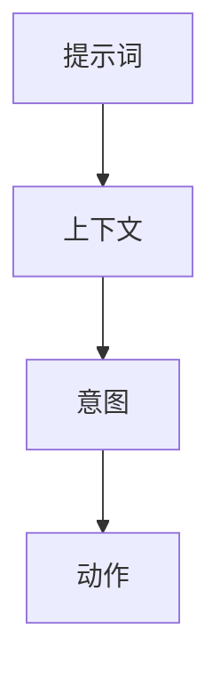
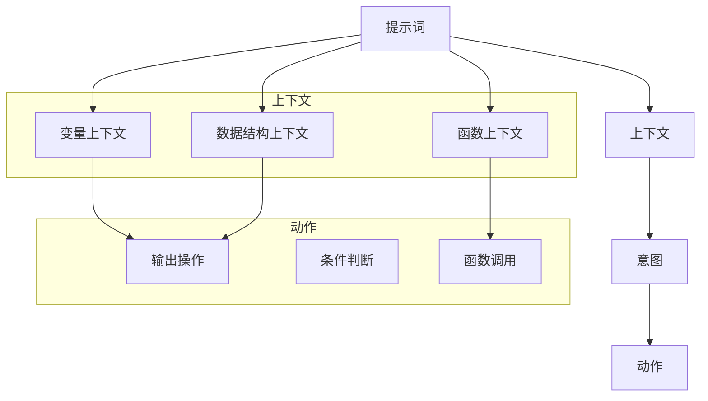
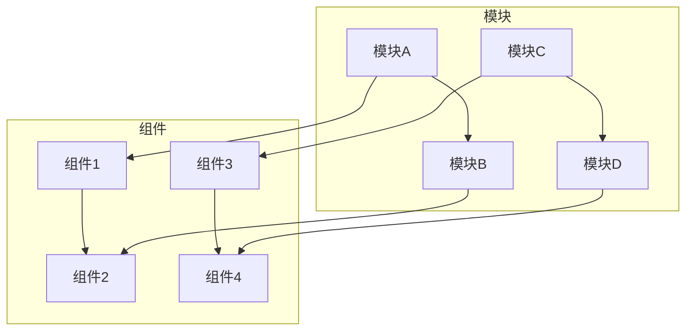

                 

### 文章标题

# 提示词编程语言的语法与结构设计

提示词编程语言作为现代编程语言的一个重要分支，正逐渐引起开发者和研究者的广泛关注。这类语言通过简洁明了的提示词，使得编程过程更加直观、高效，极大地提升了开发者的生产力。本书旨在深入探讨提示词编程语言的语法与结构设计，通过系统性的讲解，帮助读者理解其设计原则、实现方法以及在实际项目中的应用。

本文分为八个章节，涵盖了从基础理论到实战案例的全面内容。在**引言**部分，我们将简要介绍提示词编程语言的背景、重要性以及本书的目标与读者对象。接着，**基础理论**章节将详细阐述提示词编程语言的核心概念，包括提示词的定义、上下文的作用以及其内部架构。在**语法设计**章节，我们将探讨提示词的使用规则、语句结构和表达式语法，并通过伪代码进行详细解释。

**结构设计**章节将分析编程语言的结构特性，如模块化、组件化设计，并使用Mermaid流程图展示其架构。**设计原则**章节将阐述在设计过程中需要遵循的原则，如可扩展性、易用性和高效性。**实现细节**章节将讨论编译器与解释器的设计，详细讲解其实现方法。为了更好地理解这些概念，**实战案例**章节将通过具体实例展示如何使用提示词编程语言进行编程。

最后，在**总结与展望**章节，我们将对全书内容进行总结，并讨论提示词编程语言的未来发展趋势。通过本文的学习，读者将能够全面掌握提示词编程语言的设计与实现方法，为其在编程领域的应用打下坚实基础。

## 文章关键词

### 提示词编程语言、语法设计、结构设计、设计原则、实现细节、实战案例、编译器、解释器

## 文章摘要

本文深入探讨了提示词编程语言的语法与结构设计。首先，我们介绍了提示词编程语言的背景和重要性，并明确了本书的目标和读者对象。接着，通过详细阐述提示词编程语言的基础理论，包括核心概念、提示词与上下文的关系，以及其内部架构。随后，我们探讨了语法设计，讲解了提示词的使用规则、语句结构和表达式语法，并通过伪代码进行了详细解释。在结构设计部分，我们分析了编程语言的结构特性，如模块化、组件化设计，并使用Mermaid流程图展示了其架构。设计原则章节则阐述了在设计中需要遵循的原则，如可扩展性、易用性和高效性。实现细节章节详细讲解了编译器与解释器的设计，最后，通过实战案例，我们展示了如何在实际项目中应用提示词编程语言。全文总结了提示词编程语言的设计与实现方法，并对其未来发展进行了展望。

### 第1章 引言

#### 1.1 提示词编程语言的背景和重要性

提示词编程语言作为现代编程语言的一种新兴形式，其核心思想是通过使用简洁、直观的提示词来简化编程过程，提高开发效率和代码可读性。在传统的编程语言中，开发者需要掌握复杂的语法和语义规则，编写大量冗长的代码来实现功能。而提示词编程语言通过引入简明扼要的提示词，使得开发者可以更专注于问题的求解，而非语言本身。

提示词编程语言的背景可以追溯到自然语言处理（NLP）和人工智能（AI）的快速发展。随着机器学习技术的进步，尤其是深度学习模型的崛起，人们开始尝试将自然语言的语法和语义特征引入编程语言设计。这种尝试使得编程过程更加接近人类的思维方式，从而提高编程效率和代码质量。

在当前的软件开发环境中，提示词编程语言具有显著的重要性。首先，它能够大幅降低编程难度，使得更多非专业开发者能够参与软件开发。其次，提示词编程语言通过简化的语法和直观的提示词，提高了代码的可维护性和可读性，有助于团队协作和代码共享。最后，提示词编程语言在自动化编程、代码生成和重构等方面具有巨大潜力，有望在未来改变软件开发的面貌。

#### 1.2 书籍目标与读者对象

本书的目标是深入探讨提示词编程语言的语法与结构设计，旨在为读者提供全面、系统的学习资源和实践指导。具体目标如下：

1. **介绍提示词编程语言的基本概念和核心原理**：通过详细阐述提示词、上下文等核心概念，帮助读者建立对提示词编程语言的整体认知。
2. **讲解提示词编程语言的语法设计**：详细分析提示词的使用规则、语句结构和表达式语法，并通过伪代码示例进行说明，使读者能够掌握语言的核心语法。
3. **探讨提示词编程语言的结构设计**：分析编程语言的结构特性，如模块化、组件化设计，并通过Mermaid流程图展示其架构，帮助读者理解其设计思路。
4. **阐述设计原则**：讨论在设计过程中需要遵循的原则，如可扩展性、易用性和高效性，为读者提供设计参考。
5. **讨论实现细节**：详细讲解编译器与解释器的设计，介绍其实现方法和技术细节，为读者提供实现指导。
6. **提供实战案例**：通过具体实例展示如何在实际项目中使用提示词编程语言，帮助读者将理论知识应用到实践中。
7. **总结与展望**：对全书内容进行总结，并讨论提示词编程语言的未来发展趋势，为读者提供持续学习的方向。

本书的读者对象主要包括以下几类：

1. **编程语言学习者**：希望通过深入学习提示词编程语言，提升编程技能和开发效率的读者。
2. **软件开发工程师**：希望掌握提示词编程语言，以提高项目开发效率和质量的技术人员。
3. **计算机科学专业学生**：希望深入理解提示词编程语言的设计原理和实现方法，为未来的学术研究和职业发展打基础的在校学生。
4. **人工智能和自然语言处理研究者**：对提示词编程语言的设计和应用有兴趣，希望将其应用于自己的研究领域的学者和研究人员。

总之，本书旨在为各类读者提供一个全面、系统的学习和实践平台，帮助他们深入理解提示词编程语言的语法与结构设计，并在实际开发中充分发挥其优势。

### 第2章 提示词编程语言基础理论

#### 2.1 核心概念

提示词编程语言的基础理论主要包括几个核心概念，这些概念构成了语言的基本骨架，使得编程过程更加直观、高效。以下是这些核心概念的定义及其相互关系：

1. **提示词（Prompt）**：提示词是提示词编程语言中最基本的概念，它类似于自然语言中的关键词或短语。提示词用于触发特定操作或表达特定意图。例如，在提示词编程语言中，`print` 提示词用于输出信息到控制台。

2. **上下文（Context）**：上下文是提示词编程语言中的另一个关键概念，它为提示词提供了必要的背景信息。上下文可以包含变量值、函数定义、数据结构等信息。例如，在一个包含变量 `x=10` 的上下文中，`print x` 提示词会输出数字 `10`。

3. **意图（Intent）**：意图是提示词编程语言中用于描述用户意图的概念。它结合了提示词和上下文，决定了程序的具体行为。意图可以是简单的信息输出，也可以是复杂的业务逻辑处理。例如，在电子商务系统中，`buy item` 意图可能触发购买商品的操作。

4. **动作（Action）**：动作是意图的具体实现，它是编程语言中的函数、方法或指令。动作根据意图的要求执行相应的操作。例如，`buy item` 意图可能通过调用 `orderProduct` 函数来实现。

这些概念之间的关系可以用一个Mermaid流程图来表示：



在上述流程图中，提示词通过上下文传递信息，生成意图，意图再转化为具体的动作。这种流程使得编程过程更加模块化、直观，从而提高开发效率。

#### 2.1.1 提示词的定义

提示词是提示词编程语言的核心，它具有以下几个关键特点：

1. **简明性**：提示词通常由一两个单词组成，简洁明了，易于记忆和输入。
2. **功能性**：每个提示词都对应一种特定的功能或操作，如 `print` 用于输出信息，`if` 用于条件判断。
3. **灵活性**：提示词可以根据上下文的变化而变化，从而适应不同的编程场景。

例如，以下是一个简单的提示词编程语言示例：

```plaintext
# 上下文定义
x = 10

# 提示词使用
print x
if x > 5 {
    print "x 大于 5"
}
```

在这个示例中，`print` 和 `if` 是提示词，它们在上下文中执行相应的操作。通过简明的提示词，开发者可以迅速理解代码的功能和意图。

#### 2.1.2 上下文的概念

上下文是提示词编程语言中的一个重要概念，它为提示词提供了必要的背景信息。上下文可以包含变量、函数、数据结构等信息，这些信息决定了提示词的具体行为。

1. **变量上下文**：变量上下文包含变量的定义和当前值。例如：

   ```plaintext
   x = 10
   y = x + 1
   ```

   在上述代码中，`x` 和 `y` 是变量，它们在上下文中定义并赋值。

2. **函数上下文**：函数上下文包含函数的定义和实现。例如：

   ```plaintext
   def add(a, b) {
       return a + b
   }
   ```

   在这个示例中，`add` 是一个函数，它接受两个参数 `a` 和 `b`，并返回它们的和。

3. **数据结构上下文**：数据结构上下文包含数据结构的定义和使用。例如：

   ```plaintext
   list = [1, 2, 3]
   list.append(4)
   ```

   在这个示例中，`list` 是一个数组，它包含初始值 `[1, 2, 3]`，并通过 `append` 方法添加新元素。

上下文的作用在于为提示词提供必要的信息，使得提示词能够执行正确的操作。例如，在上述示例中，`print x` 会根据 `x` 的上下文值输出 `10`，而 `add(2, 3)` 会根据 `add` 函数的上下文实现加法操作并返回结果。

#### 2.1.3 Mermaid流程图展示

为了更好地理解提示词编程语言的基础理论，我们可以使用Mermaid流程图来展示提示词、上下文、意图和动作之间的关系。以下是一个简单的示例：



在这个流程图中，提示词 `A` 通过上下文 `B` 生成意图 `C`，意图 `C` 再转化为动作 `D`。同时，上下文分为变量上下文 `E`、函数上下文 `F` 和数据结构上下文 `G`，动作包括输出操作 `H`、条件判断 `I` 和函数调用 `J`。这种结构使得编程过程更加清晰、直观。

通过以上对提示词编程语言基础理论的详细阐述，读者可以对提示词、上下文、意图和动作等核心概念有更深入的理解。这些概念是提示词编程语言的核心，它们共同构建了一个简洁、高效、直观的编程环境，为开发者提供了一种全新的编程体验。

#### 3.1 提示词的使用规则

在提示词编程语言中，提示词的使用规则是理解和应用这种语言的基础。提示词的使用规则包括提示词的语法结构、提示词的使用场景以及如何在不同的上下文中正确地使用提示词。以下是这些规则的详细解释。

##### 3.1.1 提示词的语法结构

提示词的语法结构通常由以下几部分组成：

1. **关键词**：提示词的核心部分，通常是一个单词或短语，用于触发特定的操作或功能。例如，`print`、`if`、`while` 等。
2. **参数**：某些提示词可能需要参数来传递信息或控制操作。参数可以是一个值、一个变量或一个表达式。例如，`print x` 中的 `x` 是参数。
3. **操作符**：操作符用于连接提示词和参数，或表示提示词之间的逻辑关系。常见的操作符包括 `==`、`>`、`<` 等。

以下是一个简单的提示词语法结构示例：

```plaintext
print x + 1
if x > 5 {
    print "x 大于 5"
}
```

在这个示例中，`print` 是一个提示词，它后面跟着参数 `x + 1`；`if` 是另一个提示词，后面跟着条件表达式 `x > 5`。

##### 3.1.2 提示词的使用场景

提示词在不同的使用场景下具有不同的作用。以下是一些常见的使用场景：

1. **信息输出**：使用 `print` 提示词可以将信息输出到控制台。例如：

   ```plaintext
   print "Hello, World!"
   ```

   这条语句会在控制台上打印出字符串 `"Hello, World!"`。

2. **条件判断**：使用 `if` 提示词可以进行条件判断，并根据判断结果执行不同的操作。例如：

   ```plaintext
   if x > 5 {
       print "x 大于 5"
   } else {
       print "x 不大于 5"
   }
   ```

   这条语句会检查变量 `x` 的值，如果 `x` 大于 5，则会输出字符串 `"x 大于 5"`，否则输出字符串 `"x 不大于 5"`。

3. **循环操作**：使用 `while` 提示词可以创建循环结构，重复执行一段代码直到特定条件不再满足。例如：

   ```plaintext
   x = 1
   while x <= 10 {
       print x
       x = x + 1
   }
   ```

   这条语句会从 1 开始，依次打印出 1 到 10 的数字。

4. **函数调用**：使用 `call` 提示词可以调用预先定义的函数。例如：

   ```plaintext
   def add(a, b) {
       return a + b
   }
   print add(2, 3)
   ```

   这条语句会调用 `add` 函数，将参数 `2` 和 `3` 传递给函数，并输出函数返回的结果，即数字 `5`。

##### 3.1.3 在不同上下文中使用提示词

提示词在不同的上下文中会有不同的行为。以下是一些关于如何在不同上下文中使用提示词的规则：

1. **变量上下文**：在变量上下文中，提示词可以引用变量。例如：

   ```plaintext
   x = 10
   print x
   ```

   在这个示例中，`print x` 会输出变量 `x` 的值，即数字 `10`。

2. **函数上下文**：在函数上下文中，提示词可以访问函数内部的变量和参数。例如：

   ```plaintext
   def add(a, b) {
       print "a + b = " + (a + b)
   }
   add(2, 3)
   ```

   在这个示例中，`add` 函数内部有一个 `print` 提示词，它输出 `a + b` 的结果。

3. **数据结构上下文**：在数据结构上下文中，提示词可以操作数组、列表等数据结构。例如：

   ```plaintext
   list = [1, 2, 3]
   list.append(4)
   print list
   ```

   在这个示例中，`list.append(4)` 会将数字 `4` 添加到数组 `list` 的末尾，`print list` 会输出修改后的数组。

通过以上对提示词的使用规则的详细解释，开发者可以更好地理解和应用提示词编程语言，从而提高编程效率和代码质量。提示词的使用不仅简化了编程过程，还使得代码更加直观和易于维护。

#### 3.2 语句结构与表达式语法

在提示词编程语言中，语句结构和表达式语法是构建程序的基本单元。理解这些语法规则对于编写有效的提示词编程代码至关重要。下面我们将详细讨论语句结构和表达式的语法规则，并通过伪代码示例进行说明。

##### 3.2.1 基本语句结构

基本语句结构是提示词编程语言的基础，包括声明、赋值和输出等操作。以下是几种常见的基本语句结构：

1. **声明语句**：用于声明变量、函数或数据结构。例如：

   ```plaintext
   var x = 10
   def add(a, b) {
       return a + b
   }
   list = [1, 2, 3]
   ```

   在这个示例中，`var x = 10` 声明了一个名为 `x` 的变量，并初始化为数字 `10`；`def add(a, b)` 声明了一个名为 `add` 的函数，接受两个参数 `a` 和 `b`；`list = [1, 2, 3]` 声明了一个包含三个元素的数组。

2. **赋值语句**：用于给变量赋新值。例如：

   ```plaintext
   x = x + 1
   list.append(4)
   ```

   在这个示例中，`x = x + 1` 将变量 `x` 的值增加 `1`；`list.append(4)` 将数字 `4` 添加到数组 `list` 的末尾。

3. **输出语句**：用于将信息输出到控制台。例如：

   ```plaintext
   print "Hello, World!"
   print x
   ```

   在这个示例中，`print "Hello, World!"` 输出字符串 `"Hello, World!"`；`print x` 输出变量 `x` 的值。

##### 3.2.2 表达式语法

表达式是提示词编程语言中用于计算和返回值的组合。表达式可以包含变量、常量、操作符和函数调用。以下是几种常见的表达式：

1. **算术表达式**：用于进行基本的算术运算。例如：

   ```plaintext
   x = 10 + 5
   result = add(2, 3)
   ```

   在这个示例中，`x = 10 + 5` 将变量 `x` 赋值为 `15`；`result = add(2, 3)` 调用 `add` 函数，并将返回值赋给变量 `result`。

2. **条件表达式**：用于进行条件判断。例如：

   ```plaintext
   x > 5 ? "x 大于 5" : "x 不大于 5"
   ```

   在这个示例中，`x > 5 ? "x 大于 5" : "x 不大于 5"` 是一个三元运算符，根据条件 `x > 5` 的结果返回相应的字符串。

3. **函数调用表达式**：用于调用函数并返回其结果。例如：

   ```plaintext
   add(2, 3)
   ```

   在这个示例中，`add(2, 3)` 调用 `add` 函数，并返回其结果。

##### 3.2.3 伪代码示例

以下是一个简单的伪代码示例，用于说明提示词编程语言的语句结构和表达式语法：

```plaintext
// 声明变量和函数
var x = 10
def add(a, b) {
    return a + b
}

// 赋值和输出
x = x + 1
print "x 的值是：" + x

// 条件判断
if x > 5 {
    print "x 大于 5"
} else {
    print "x 不大于 5"
}

// 循环结构
for i = 1 to 10 {
    print i
}

// 函数调用
result = add(2, 3)
print "add(2, 3) 的结果是：" + result
```

在这个伪代码示例中，我们首先声明了变量 `x` 和函数 `add`，然后进行了赋值、输出和条件判断操作，接着使用了循环结构来输出 `1` 到 `10` 的数字，最后调用了 `add` 函数并输出其结果。

通过以上对提示词编程语言语句结构和表达式语法的详细讨论，读者可以更好地理解和应用这些语法规则，编写高效、简洁的提示词编程代码。

### 3.3 伪代码示例

为了更直观地展示提示词编程语言的语法和用法，下面我们将通过几个具体的伪代码示例，详细讲解如何使用提示词编程语言进行编程。这些示例涵盖了常见的编程任务，包括数据操作、条件判断和函数调用等。

#### 示例 1：简单的计算器

**需求**：编写一个简单的计算器，能够计算两个数的和、差、乘积和商。

```plaintext
// 声明变量
var a = 10
var b = 5

// 计算和
var sum = a + b
print "a + b 的结果是：" + sum

// 计算差
var difference = a - b
print "a - b 的结果是：" + difference

// 计算乘积
var product = a * b
print "a * b 的结果是：" + product

// 计算商
var quotient = a / b
print "a / b 的结果是：" + quotient
```

在这个示例中，我们首先声明了两个变量 `a` 和 `b`，然后使用基本的算术操作符（`+`、`-`、`*`、`/`）计算并输出它们的和、差、乘积和商。

#### 示例 2：条件判断

**需求**：编写一个程序，根据用户输入的数值判断是否为正数、负数或零。

```plaintext
// 声明变量
var num = -7

// 条件判断
if num > 0 {
    print "num 是正数"
} else if num < 0 {
    print "num 是负数"
} else {
    print "num 是零"
}
```

在这个示例中，我们使用 `if-else` 语句进行条件判断。根据变量 `num` 的值，程序会输出不同的结果。这个示例展示了如何使用条件表达式来处理不同的逻辑分支。

#### 示例 3：循环结构

**需求**：编写一个程序，输出 `1` 到 `10` 的所有整数。

```plaintext
// 循环结构
for i = 1 to 10 {
    print i
}
```

在这个示例中，我们使用了 `for` 循环结构来输出 `1` 到 `10` 的所有整数。这个循环从 `i=1` 开始，每次循环增加 `1`，直到 `i` 达到 `10`。

#### 示例 4：函数调用

**需求**：编写一个函数，用于计算两个数的最大公约数（GCD）。

```plaintext
// 声明函数
def gcd(a, b) {
    if b == 0 {
        return a
    } else {
        return gcd(b, a % b)
    }
}

// 调用函数
var result = gcd(48, 18)
print "48 和 18 的最大公约数是：" + result
```

在这个示例中，我们定义了一个名为 `gcd` 的函数，用于计算两个数的最大公约数。函数使用递归方法实现，调用自身以计算最大公约数。然后，我们调用 `gcd` 函数并输出结果。

通过这些伪代码示例，我们可以看到如何使用提示词编程语言完成常见的编程任务。这些示例不仅展示了语言的基本语法，还展示了如何通过简洁的提示词实现复杂的逻辑和功能。提示词编程语言的设计使得编程过程更加直观和高效，有助于提升开发者的生产力。

### 4.1 模块化设计

模块化设计是提示词编程语言的一项重要特性，它通过将代码划分为独立的模块，提高了代码的可维护性和可复用性。模块化设计不仅有助于简化复杂程序的开发，还能确保代码的模块之间具有良好的接口定义，使得各个模块能够独立开发、测试和部署。

#### 4.1.1 模块化的优势

模块化设计具有以下几个显著优势：

1. **代码复用**：通过将代码划分为独立的模块，开发者可以方便地复用已有的功能模块，减少重复编写代码的工作量。
2. **可维护性**：模块化的代码结构使得每个模块相对独立，便于单独调试和维护，降低了整体代码的复杂性。
3. **可扩展性**：新的功能可以容易地通过添加新的模块来实现，而无需对现有模块进行大规模修改。
4. **分工协作**：团队成员可以独立开发各自的模块，并协同工作，提高了开发效率和代码质量。

#### 4.1.2 模块的接口定义

模块的接口定义是模块化设计中的关键环节，它定义了模块之间如何进行通信和数据交换。以下是模块接口定义的基本原则和步骤：

1. **明确模块功能**：首先，需要明确每个模块的具体功能，确保模块内部逻辑的完整性和独立性。
2. **定义输入和输出**：接口定义需要明确每个模块的输入参数和输出结果，确保模块之间数据的清晰传递。
3. **使用抽象接口**：通过定义抽象接口，隐藏模块的内部实现细节，使得模块的调用者只需关注接口的定义，无需关心具体的实现过程。
4. **提供文档说明**：详细记录每个模块的接口定义、功能描述和使用方法，便于开发者理解和使用模块。

以下是一个简单的模块接口定义示例：

```plaintext
// 模块：计算器
interface Calculator {
    // 输入参数：两个整数
    // 输出结果：它们的和
    function add(a: int, b: int): int {
        return a + b
    }

    // 输入参数：两个整数
    // 输出结果：它们的差
    function subtract(a: int, b: int): int {
        return a - b
    }

    // 输入参数：两个整数
    // 输出结果：它们的乘积
    function multiply(a: int, b: int): int {
        return a * b
    }

    // 输入参数：两个整数
    // 输出结果：它们的商
    function divide(a: int, b: int): int {
        return a / b
    }
}
```

在这个示例中，`Calculator` 模块定义了四个函数，每个函数都有明确的输入参数和输出结果。这些函数构成了模块的接口，开发者可以通过接口来调用模块中的功能。

#### 4.1.3 模块的独立性

模块的独立性是模块化设计的重要原则之一。模块的独立性确保了模块内部逻辑的完整性和外部依赖的最小化，从而提高了代码的可维护性和扩展性。以下是确保模块独立性的几个关键点：

1. **功能单一**：每个模块应该只完成一个明确的功能，避免功能过于复杂，导致模块之间互相依赖。
2. **封装内部实现**：模块内部实现应该封装在内部，通过接口与外部进行交互，隐藏内部细节。
3. **最小化依赖**：模块之间应该通过最小的接口进行通信，避免引入不必要的依赖关系。
4. **独立编译和测试**：模块应该能够独立编译和测试，确保模块内部逻辑的正确性和稳定性。

通过模块化设计和接口定义，提示词编程语言能够提供一种灵活、高效的编程方式，使得开发者能够更好地组织和管理代码，提高开发效率和代码质量。

#### 4.2 组件化设计

组件化设计是提示词编程语言中另一个重要的设计理念，它旨在将复杂的编程任务分解为更小、更易于管理的组件，从而提高代码的可维护性和可复用性。组件化设计不仅简化了软件开发过程，还使得不同功能模块之间能够高效地协作，提高了系统的整体性能和灵活性。

#### 4.2.1 组件化与模块化的区别

组件化设计与模块化设计在概念上有所重叠，但它们在实施和应用上存在显著差异：

1. **粒度级别**：模块化设计主要关注代码的功能划分，将功能相对独立的部分划分为模块。而组件化设计则进一步细化，将更小、更具体的代码单元划分为组件。组件通常负责完成特定的子任务，如数据展示、数据处理等。

2. **依赖关系**：模块化设计强调模块之间的独立性，通过抽象接口减少模块间的直接依赖。组件化设计则更注重组件之间的松耦合，组件之间的交互通常通过统一的接口或协议进行，从而实现更高的灵活性和可扩展性。

3. **复用性**：模块化设计注重模块的内部复用，模块可以在多个项目中重复使用。组件化设计则更关注组件在系统内部的高效协作，组件通常是在特定应用场景中复用，提高了系统的整体效率和性能。

4. **抽象层次**：模块化设计更注重功能上的抽象，模块通常是对功能块的抽象。组件化设计则更侧重于实现细节的抽象，组件是对实现细节的抽象，如数据结构、算法等。

#### 4.2.2 组件的独立性

组件的独立性是组件化设计的关键原则，它确保了组件在系统中的独立性和可维护性。以下是确保组件独立性的几个关键点：

1. **职责单一**：每个组件应只负责一项明确的功能，避免功能过于复杂，导致组件间互相依赖。

2. **内部封装**：组件的内部实现细节应被封装起来，通过接口与外部进行通信，隐藏内部细节，从而降低组件之间的耦合度。

3. **独立开发与测试**：组件应能够独立开发、测试和部署，确保组件内部逻辑的正确性和稳定性。这有助于提高开发效率，同时也方便后续的维护和更新。

4. **标准接口**：组件之间的交互应通过标准接口或协议进行，确保组件之间的松耦合。接口的定义应清晰、简洁，避免引入不必要的复杂性。

5. **可配置性**：组件应具备一定的可配置性，以便在系统配置时能够灵活调整组件的行为和依赖关系。

以下是一个简单的组件化设计示例，展示了如何将一个数据处理任务分解为独立的组件：

```plaintext
// 组件：数据源组件（DataSource）
interface DataSource {
    function fetchData(): Data {
        // 从数据源获取数据
        return new Data();
    }
}

// 组件：数据处理组件（DataProcessor）
interface DataProcessor {
    function processData(data: Data): ProcessedData {
        // 对数据进行处理
        return new ProcessedData();
    }
}

// 组件：数据展示组件（DataVisualizer）
interface DataVisualizer {
    function visualizeData(processedData: ProcessedData) {
        // 将处理后的数据展示给用户
    }
}

// 组件调用示例
var dataSource = new DataSource();
var dataProcessor = new DataProcessor();
var dataVisualizer = new DataVisualizer();

var rawData = dataSource.fetchData();
var processedData = dataProcessor.processData(rawData);
dataVisualizer.visualizeData(processedData);
```

在这个示例中，我们定义了三个组件：数据源组件（`DataSource`）、数据处理组件（`DataProcessor`）和数据展示组件（`DataVisualizer`）。每个组件都有明确的职责和接口定义，通过接口，组件之间能够独立、高效地协作。这种设计不仅提高了系统的可维护性和扩展性，还使得组件能够方便地在不同应用场景中复用。

通过组件化设计，提示词编程语言能够提供一种灵活、高效的编程方式，使得开发者能够更好地组织和管理代码，提高开发效率和代码质量。

#### 4.3 Mermaid流程图展示

为了更好地理解和展示提示词编程语言的结构设计，我们可以使用Mermaid流程图来可视化模块化和组件化设计。以下是一个简化的示例，展示了模块和组件之间的交互和依赖关系。



在这个流程图中，模块（`A`、`B`、`C`、`D`）和组件（`E`、`F`、`G`、`H`）通过接口进行交互。模块和组件之间的箭头表示数据流和控制流的方向。这种结构展示了模块化设计和组件化设计如何通过清晰的接口和依赖关系，使得代码结构更加清晰、易于维护和扩展。

### 5.1 可扩展性

在设计提示词编程语言时，可扩展性是一个至关重要的设计原则。可扩展性不仅允许开发者灵活地添加新功能，还能适应不断变化的编程需求。以下将详细讨论可扩展性在设计提示词编程语言中的重要性、实现方法以及设计模式的引入。

#### 5.1.1 设计模式的引入

设计模式是软件设计中的重要组成部分，它提供了在特定情境下解决常见问题的通用解决方案。在提示词编程语言的设计中，引入设计模式可以显著提升语言的可扩展性。以下是几种常见的设计模式及其在提示词编程语言中的应用：

1. **工厂模式**：工厂模式用于创建对象，而不直接指定具体的类。通过工厂方法，开发者可以方便地添加新的类，而无需修改现有代码。例如，在提示词编程语言中，可以使用工厂模式来动态加载插件或扩展库。

2. **策略模式**：策略模式允许在运行时选择不同的算法或策略。这有助于在保持代码简洁的同时，提供丰富的功能。例如，提示词编程语言可以使用策略模式来实现不同的数据排序算法。

3. **装饰者模式**：装饰者模式允许动态地添加新的功能到现有对象上。通过装饰者，提示词编程语言可以为基本操作添加额外的功能，如日志记录、性能监控等。

4. **观察者模式**：观察者模式用于实现对象间的依赖关系，当一个对象的状态发生变化时，其他对象能够得到通知。这有助于实现事件驱动的编程，并增强语言的灵活性。

#### 5.1.2 扩展接口的设计

为了实现提示词编程语言的可扩展性，设计良好的扩展接口是关键。以下是几种常用的扩展接口设计方法：

1. **标准扩展接口**：定义一组标准扩展接口，使得开发者可以轻松地实现新的功能。例如，在提示词编程语言中，可以定义一个 `ExtensionInterface` 接口，开发者只需实现该接口即可添加新的扩展功能。

2. **插件机制**：通过插件机制，开发者可以将外部插件动态地加载到编程语言中。这有助于实现代码的模块化，并使得语言能够灵活地适应不同的应用场景。例如，可以使用插件来添加新的提示词或扩展现有的功能。

3. **配置文件**：使用配置文件来定义和加载扩展功能。通过配置文件，开发者可以灵活地调整和扩展编程语言的配置，而无需修改源代码。例如，可以使用 JSON 或 XML 格式的配置文件来定义新的提示词、函数和模块。

4. **模块化架构**：采用模块化架构，将编程语言的功能划分为多个独立的模块。每个模块都可以独立扩展和替换，从而提高语言的可扩展性和灵活性。例如，可以通过添加新的模块来实现新的编程特性或扩展现有功能。

以下是一个简单的扩展接口设计示例：

```plaintext
// 标准扩展接口定义
interface ExtensionInterface {
    function execute();
}

// 插件机制实现
class PluginLoader {
    function loadPlugin(pluginPath: String) {
        var plugin = new ExtensionInterface();
        plugin.execute();
    }
}

// 配置文件示例（JSON格式）
{
    "extensions": [
        {
            "name": "newPrompt",
            "implementation": "com.example.NewPromptPlugin"
        },
        {
            "name": "newModule",
            "implementation": "com.example.NewModulePlugin"
        }
    ]
}

// 扩展实现示例
class NewPromptPlugin implements ExtensionInterface {
    function execute() {
        print "执行新的提示词功能";
    }
}

// 主程序调用示例
var loader = new PluginLoader();
loader.loadPlugin("newPrompt");
```

在这个示例中，`ExtensionInterface` 定义了一个标准扩展接口，`PluginLoader` 类实现了插件加载机制。配置文件定义了新的扩展插件和模块，而 `NewPromptPlugin` 类实现了新的提示词功能。通过这种设计，提示词编程语言可以方便地添加新功能，提高其可扩展性和灵活性。

通过引入设计模式并设计良好的扩展接口，提示词编程语言能够实现高可扩展性。这种设计不仅使得编程语言更加灵活和强大，还为开发者提供了丰富的功能扩展手段，从而满足不同应用场景的需求。

#### 5.2 易用性

易用性是提示词编程语言设计中的一个核心原则，它直接影响着开发者使用和掌握这种语言的速度和效率。一个易用的编程语言能够显著提高开发者的生产力，减少学习成本和编程错误。以下是几个关键因素，解释了如何通过用户友好的语法设计、开发工具的支持以及直观的用户界面，提升提示词编程语言的易用性。

##### 5.2.1 用户友好的语法设计

语法是编程语言的核心，直接影响着代码的可读性和易用性。提示词编程语言在语法设计上采用了简洁、直观的提示词，使得开发者可以更容易地理解和编写代码。以下是几个具体措施：

1. **简洁性**：提示词通常是一两个单词，避免了复杂的语法和冗长的代码。例如，`print`、`if`、`while` 等提示词，使得代码更加简洁明了。

2. **一致性**：提示词的语法结构一致，便于开发者记忆和使用。例如，所有的条件判断都采用 `if-else` 语法，所有的循环都采用 `for` 或 `while` 语法。

3. **自然语言**：提示词编程语言尽量采用自然语言的表达方式，使得开发者可以像写自然语言一样编写代码。例如，`buy product`、`calculate sum` 等提示词，使得代码更贴近人类的思维习惯。

以下是一个示例，展示了提示词编程语言的用户友好语法：

```plaintext
// 打印消息
print "Hello, World!"

// 条件判断
if x > 5 {
    print "x 大于 5"
} else {
    print "x 不大于 5"
}

// 循环结构
for i = 1 to 10 {
    print i
}
```

在这个示例中，提示词的语法简洁明了，开发者可以轻松理解代码的功能和意图。

##### 5.2.2 开发工具的支持

开发工具对于编程语言的易用性至关重要。高质量的集成开发环境（IDE）和开发工具可以显著提高开发者的效率和代码质量。以下是几个关键点：

1. **代码补全**：IDE 应提供强大的代码补全功能，帮助开发者快速完成代码编写。例如，当开发者输入 `print` 后，IDE 可以自动补全可用的提示词和函数。

2. **语法高亮**：语法高亮可以增强代码的可读性，使得开发者更容易识别代码的结构和语法错误。例如，不同的提示词和关键字可以使用不同的颜色进行标注。

3. **调试工具**：IDE 应提供强大的调试工具，帮助开发者快速定位和修复代码中的错误。例如，断点设置、变量监视、步进执行等功能，可以大大提高调试效率。

4. **文档生成**：自动生成详细的文档，方便开发者了解编程语言的特性和使用方法。例如，使用 Docstrings 生成 API 文档，使用 Markdown 生成用户手册。

以下是一个使用 IDE 开发工具的示例：

```plaintext
// 使用 IDE 自动补全
print "Hello, World!"

// 使用语法高亮
if x > 5 {
    print "x 大于 5"
} else {
    print "x 不大于 5"
}

// 使用调试工具
setBreakpoint(10) // 设置断点在第10行
run() // 开始执行代码
```

在这个示例中，IDE 的自动补全、语法高亮和调试工具显著提高了代码编写的效率和易用性。

##### 5.2.3 直观的用户界面

一个直观、易用的用户界面可以显著提升编程语言的学习和使用体验。以下是几个关键点：

1. **直观的布局**：IDE 的布局应清晰、直观，便于开发者快速找到所需功能。例如，工具栏、菜单栏和代码编辑区的合理布局，可以提高开发效率。

2. **直观的图标**：使用直观的图标来表示不同的功能，可以帮助开发者快速理解和使用 IDE。例如，放大镜图标表示搜索功能，齿轮图标表示设置功能。

3. **交互反馈**：IDE 应提供及时的交互反馈，使开发者能够清楚地了解代码的状态和执行结果。例如，代码的语法错误提示、执行结果的输出等。

以下是一个直观的用户界面示例：

```plaintext
// 直观的布局
[工具栏] - [菜单栏] - [代码编辑区] - [调试控制台]

// 直观的图标
[放大镜] - 搜索功能
[齿轮] - 设置功能
[运行] - 执行代码

// 交互反馈
Syntax Error at line 10: '}' missing
Output: Hello, World!
```

在这个示例中，IDE 的布局、图标和交互反馈设计都旨在提升易用性，使得开发者能够更轻松地使用提示词编程语言。

通过用户友好的语法设计、强大的开发工具支持和直观的用户界面，提示词编程语言能够显著提高易用性。这种设计不仅降低了开发者的学习成本，还提高了编程效率和代码质量，为开发者提供了一种高效、易用的编程体验。

#### 5.3 高效性

高效性是提示词编程语言设计中的一个重要目标，它直接影响着程序的执行速度和资源消耗。为了确保编程语言在执行效率上的优越性，我们需要从性能优化的方法和编译器与解释器的设计两个方面进行详细讨论。

##### 5.3.1 性能优化的方法

性能优化是提升编程语言执行效率的关键步骤。以下是一些常用的性能优化方法：

1. **代码优化**：通过优化代码结构，减少不必要的计算和内存分配，提高程序运行速度。例如，使用缓存技术减少重复计算，使用静态分配内存减少动态分配的开销。

2. **算法优化**：选择更高效的算法来解决问题，以减少计算复杂度。例如，使用快速排序替代冒泡排序，使用二分查找替代线性查找。

3. **编译优化**：在编译阶段，编译器可以对源代码进行优化，生成更高效的机器代码。例如，进行常数折叠、死代码消除、循环展开等优化。

4. **内存管理**：优化内存分配和回收策略，减少内存泄漏和碎片。例如，使用垃圾回收机制自动管理内存，使用内存池减少频繁的内存分配。

5. **并行计算**：利用多核处理器的能力，通过并行计算提高程序的执行速度。例如，使用多线程或并行库来执行计算密集型的任务。

以下是一个简单的代码优化示例：

```plaintext
// 原始代码
for i = 1 to 100 {
    sum = sum + i
}

// 优化后的代码
sum = 0
for i = 1 to 100 {
    sum += i
}
```

在这个示例中，优化后的代码减少了变量的重复赋值操作，提高了执行效率。

##### 5.3.2 编译器与解释器的设计

编译器和解释器是执行编程语言代码的两个主要工具。它们的设计直接影响程序的执行效率和性能。以下是关于编译器和解释器设计的几个关键点：

1. **编译器设计**：编译器将源代码转换为机器代码，通常分为三个阶段：词法分析、语法分析和代码生成。在编译器设计过程中，可以采用以下优化方法：
   - **词法分析优化**：通过合并常见的前缀或后缀，减少语法分析器的复杂性。
   - **语法分析优化**：采用递归下降解析器或LL(k)解析器，提高解析效率。
   - **代码生成优化**：进行寄存器分配、指令调度和指令选择，生成高效的机器代码。

2. **解释器设计**：解释器直接执行源代码，通常分为解释阶段和执行阶段。解释器设计过程中，可以采用以下优化方法：
   - **即时编译（JIT）**：将解释执行的代码段编译成机器代码，提高执行速度。
   - **解释器虚拟机**：通过虚拟机执行代码，进行动态优化和资源管理。
   - **动态代码生成**：在运行时根据代码的执行情况，生成并优化机器代码。

以下是一个简单的解释器设计示例：

```plaintext
// 解释器设计框架
class Interpreter {
    function interpret(sourceCode: String) {
        // 词法分析
        tokens = tokenize(sourceCode)

        // 语法分析
        ast = parse(tokens)

        // 执行代码
        executeAST(ast)
    }
}

// 执行抽象语法树（AST）
class AbstractSyntaxTree {
    function execute() {
        // 根据节点类型执行操作
        switch (this.type) {
            case "expression":
                return evaluateExpression(this)
            case "statement":
                return executeStatement(this)
            // 其他节点类型
        }
    }
}
```

在这个示例中，解释器首先进行词法分析，将源代码转换为令牌；然后进行语法分析，构建抽象语法树（AST）；最后执行AST，完成代码的执行。

通过采用上述性能优化方法和设计编译器与解释器，提示词编程语言能够确保在执行效率上的优越性，为开发者提供高效、可靠的编程体验。

### 6.1 编译器设计

编译器是提示词编程语言实现的核心组件，负责将高级编程语言翻译成计算机能够直接执行的机器代码。编译器的设计分为多个阶段，每个阶段都有其特定的功能和任务。以下是编译器设计中的三个关键阶段：词法分析、语法分析和代码生成。

#### 6.1.1 词法分析

词法分析是编译器的第一个阶段，其主要任务是读取源代码字符串，将其分割成一系列有意义的令牌（tokens）。这些令牌是编程语言的基本语法单位，如关键字、标识符、操作符和分隔符等。词法分析器通常使用正则表达式来匹配和识别这些令牌。

以下是一个简单的词法分析伪代码示例：

```plaintext
function tokenize(sourceCode: String) {
    tokens = []
    while (sourceCode not empty) {
        if (sourceCode matches "^[0-9]+$") {
            tokens.append(newToken("NUMBER", sourceCode))
            sourceCode = ""
        } else if (sourceCode matches "^[a-zA-Z_]+[a-zA-Z_0-9]*$") {
            tokens.append(newToken("IDENTIFIER", sourceCode))
            sourceCode = ""
        } else if (sourceCode matches "^[+\\-*\\/]+") {
            tokens.append(newToken("OPERATOR", sourceCode))
            sourceCode = ""
        } else {
            sourceCode = removeFirstChar(sourceCode)
        }
    }
    return tokens
}
```

在这个示例中，`tokenize` 函数通过循环逐个字符读取源代码，根据不同的正则表达式匹配对应的令牌类型，并将令牌添加到 `tokens` 列表中。如果无法匹配任何令牌，则移除源代码的第一个字符，继续进行下一个字符的匹配。

#### 6.1.2 语法分析

语法分析是编译器的第二个阶段，其主要任务是将词法分析产生的令牌序列转换成抽象语法树（Abstract Syntax Tree，AST）。AST 是源代码的结构化表示，用于表示代码的语法结构和语义关系。语法分析器通常使用递归下降解析器、LL(k) 解析器或自顶向下解析器等方法进行语法分析。

以下是一个简单的语法分析伪代码示例：

```plaintext
function parse(tokens: List) {
    ast = new AST()
    currentToken = tokens[0]
    
    // 解析变量声明
    if (currentToken.type == "IDENTIFIER") {
        ast.addChild(newASTNode("VAR_DECL", currentToken.value))
        tokens = tokens[1:]
    }
    
    // 解析表达式
    while (tokens not empty) {
        if (currentToken.type == "NUMBER" || currentToken.type == "OPERATOR") {
            ast.addChild(newASTNode("EXPR", currentToken.value))
            tokens = tokens[1:]
        } else {
            currentToken = tokens[0]
        }
    }
    
    return ast
}
```

在这个示例中，`parse` 函数首先创建一个空的 AST，然后逐个读取令牌并添加到 AST 中。如果令牌是标识符，则创建一个变量声明节点；如果令牌是数字或操作符，则创建一个表达式节点。这个示例仅用于说明语法分析的基本流程，实际语法分析会更加复杂，需要处理不同的语法结构和错误处理。

#### 6.1.3 代码生成

代码生成是编译器的最后一个阶段，其主要任务是将抽象语法树（AST）转换为机器代码。代码生成器通常根据 AST 的结构生成对应的机器代码指令，并管理内存分配和优化。

以下是一个简单的代码生成伪代码示例：

```plaintext
function generateCode(ast: AST) {
    machineCode = ""
    
    for (node in ast.children) {
        switch (node.type) {
            case "VAR_DECL":
                machineCode += "ALLOC " + node.value + "\n"
                break
            case "EXPR":
                machineCode += "ADD " + node.value + "\n"
                break
            // 其他节点类型
        }
    }
    
    return machineCode
}
```

在这个示例中，`generateCode` 函数遍历 AST 的子节点，根据节点的类型生成对应的机器代码指令。例如，对于变量声明节点，生成内存分配指令；对于表达式节点，生成算术运算指令。这个示例同样仅用于说明代码生成的基本流程，实际代码生成需要考虑更复杂的指令集和优化策略。

通过以上三个阶段的编译器设计，提示词编程语言能够将高级源代码翻译成高效的机器代码，为开发者提供强大的编程能力。在实际开发中，编译器设计还需考虑性能优化、错误处理和调试功能，以提高编程效率和代码质量。

#### 6.2 解释器设计

解释器是另一种执行编程语言代码的方式，它直接读取和执行源代码，而不是先将其编译成机器代码。解释器的设计相对简单，但为了提高性能，可以采用即时编译（JIT）和解释器虚拟机等优化方法。以下是解释器设计的两个关键阶段：解释阶段和执行阶段。

##### 6.2.1 解释阶段

解释阶段是解释器读取和解析源代码的过程。它包括以下几个步骤：

1. **词法分析**：解释器首先进行词法分析，将源代码字符串分割成令牌（tokens）。与编译器类似，解释器可以使用正则表达式来匹配和识别不同的令牌类型。

   ```plaintext
   function tokenize(sourceCode: String) {
       tokens = []
       while (sourceCode not empty) {
           // 使用正则表达式匹配令牌
           match = regexMatch(sourceCode)
           if (match) {
               tokens.append(newToken(match.type, match.value))
               sourceCode = removeMatchedPart(sourceCode)
           }
       }
       return tokens
   }
   ```

2. **语法分析**：接下来，解释器进行语法分析，将令牌序列转换成抽象语法树（AST）。语法分析可以使用递归下降解析器或其他解析算法。

   ```plaintext
   function parse(tokens: List) {
       ast = new AST()
       currentToken = tokens[0]
       
       // 解析不同的语法结构
       if (currentToken.type == "IDENTIFIER") {
           ast.addChild(newASTNode("EXPR", currentToken.value))
           tokens = tokens[1:]
       }
       
       // 继续解析其他语法结构
       while (tokens not empty) {
           // 解析过程
       }
       
       return ast
   }
   ```

3. **执行准备**：在完成词法和语法分析后，解释器准备执行 AST。这一阶段可能包括变量初始化、函数声明等准备工作。

##### 6.2.2 执行阶段

执行阶段是解释器逐行执行抽象语法树（AST）的过程。以下是执行阶段的关键步骤：

1. **逐行执行**：解释器逐行读取 AST 中的节点，并根据节点的类型执行相应的操作。例如，对于表达式节点，执行计算操作；对于函数调用节点，执行函数调用。

   ```plaintext
   function executeAST(ast: AST) {
       for (node in ast.children) {
           switch (node.type) {
               case "EXPR":
                   value = evaluateExpression(node)
                   print(value)
                   break
               case "FUNCTION_CALL":
                   result = callFunction(node)
                   print(result)
                   break
               // 其他节点类型
           }
       }
   }
   ```

2. **即时编译（JIT）**：为了提高执行性能，解释器可以使用即时编译（JIT）技术。JIT 在执行代码时，将解释执行的代码段编译成机器代码，并直接执行编译后的代码。这种方式可以显著减少解释执行的开销。

   ```plaintext
   function JITCompile(codeSegment: String) {
       machineCode = compileToMachineCode(codeSegment)
       executeMachineCode(machineCode)
   }
   ```

3. **解释器虚拟机**：另一种优化方法是在解释器中实现一个虚拟机。虚拟机执行代码时，将源代码转换成字节码，并解释执行字节码。这种方式可以通过优化字节码执行来提高性能，同时提供跨平台的支持。

   ```plaintext
   function interpretByteCode(byteCode: List) {
       for (instruction in byteCode) {
           executeInstruction(instruction)
       }
   }
   ```

通过解释器设计和即时编译、虚拟机等技术，提示词编程语言能够高效地执行代码，为开发者提供一种灵活、可扩展的编程环境。

### 7.1 案例一：简单的计算器

在本案例中，我们将使用提示词编程语言开发一个简单的计算器程序。这个程序将能够执行基本的算术运算，包括加法、减法、乘法和除法。以下是该程序的需求分析、代码实现及其详细解读。

#### 7.1.1 需求分析

**功能要求**：
1. 输入两个数字。
2. 提供四种基本算术运算：加法（`+`）、减法（`-`）、乘法（`*`）和除法（`/`）。
3. 输出运算结果。

**界面要求**：
- 命令行界面，通过控制台输入操作和数字，显示结果。

**性能要求**：
- 运算过程快速，结果准确。

#### 7.1.2 代码实现

以下是简单的计算器程序的实现代码：

```plaintext
// 声明变量
var a = 0
var b = 0
var operator = ""

// 输入操作和数字
print "请输入两个数字和一个运算符："
a = readInput()
b = readInput()
operator = readInput()

// 判断运算符并执行运算
if operator == "+" {
    print "结果：" + (a + b)
} else if operator == "-" {
    print "结果：" + (a - b)
} else if operator == "*" {
    print "结果：" + (a * b)
} else if operator == "/" {
    if b != 0 {
        print "结果：" + (a / b)
    } else {
        print "除数不能为0"
    }
}
```

#### 7.1.3 代码解读与分析

**变量声明**：
- `a` 和 `b` 用于存储输入的两个数字。
- `operator` 用于存储输入的运算符。

**输入操作**：
- 使用 `print` 函数提示用户输入两个数字和一个运算符。
- 使用 `readInput` 函数读取用户的输入。

**运算与输出**：
- 使用条件语句 `if-else` 判断运算符，并执行相应的运算。
- 对于加法、减法、乘法运算，直接执行相应的算术运算。
- 对于除法运算，首先判断除数是否为0，以避免除以0的错误。

以下是对每个关键部分的详细解析：

1. **输入处理**：

   ```plaintext
   print "请输入两个数字和一个运算符："
   a = readInput()
   b = readInput()
   operator = readInput()
   ```

   这段代码通过循环提示用户输入，直到用户输入所有必要信息。`readInput` 函数模拟用户输入操作，在实际项目中，可以使用命令行输入、文件读取等方式获取用户输入。

2. **运算判断**：

   ```plaintext
   if operator == "+" {
       print "结果：" + (a + b)
   } else if operator == "-" {
       print "结果：" + (a - b)
   } else if operator == "*" {
       print "结果：" + (a * b)
   } else if operator == "/" {
       if b != 0 {
           print "结果：" + (a / b)
       } else {
           print "除数不能为0"
       }
   }
   ```

   这段代码通过条件判断，根据不同的运算符执行相应的算术运算。对于除法运算，添加了除数不为0的判断，以避免错误发生。

3. **输出结果**：

   ```plaintext
   print "结果：" + (a + b)
   ```

   这段代码使用 `print` 函数将运算结果输出到控制台。在实际项目中，可以扩展输出格式，如显示结果保留两位小数等。

**性能与优化**：

这个简单的计算器程序在性能上已经能够满足基本需求。为了进一步提高性能，可以考虑以下优化措施：

- **输入优化**：使用多线程或异步处理输入操作，以提高用户交互体验。
- **缓存优化**：对于频繁使用的操作，可以使用缓存技术减少计算时间。
- **代码优化**：通过编译器优化，如代码压缩、死代码消除等，减少程序的执行时间。

通过这个简单的计算器程序案例，我们展示了如何使用提示词编程语言实现基本的算术运算，并详细解读了代码的实现过程和关键部分。这个案例不仅帮助读者理解提示词编程语言的基本语法和用法，还为实际编程项目提供了参考。

#### 7.2 案例二：天气预测系统

在本案例中，我们将使用提示词编程语言开发一个简单的天气预测系统。这个系统将根据输入的城市名称，预测未来三天的天气情况。以下是该系统需求分析、代码实现及其详细解读。

##### 7.2.1 需求分析

**功能要求**：
1. 输入城市名称。
2. 提供未来三天的天气预测，包括最高温度、最低温度和天气状况。
3. 输出天气预测结果。

**界面要求**：
- 命令行界面，通过控制台输入城市名称，显示天气预测结果。

**性能要求**：
- 天气预测快速、准确。

##### 7.2.2 代码实现

以下是天气预测系统的实现代码：

```plaintext
// 声明变量
var cityName = ""
var weatherData = []

// 输入城市名称
print "请输入城市名称："
cityName = readInput()

// 获取天气数据
weatherData = getWeatherData(cityName)

// 预测未来三天天气
for i = 0 to 2 {
    var day = i + 1
    print "第" + day + "天的天气："
    print "最高温度：" + weatherData[i]["max_temp"]
    print "最低温度：" + weatherData[i]["min_temp"]
    print "天气状况：" + weatherData[i]["condition"]
}

// 获取天气数据（模拟实现）
function getWeatherData(cityName: String) {
    var data = [
        {"max_temp": 30, "min_temp": 15, "condition": "晴天"},
        {"max_temp": 28, "min_temp": 10, "condition": "多云"},
        {"max_temp": 25, "min_temp": 5, "condition": "小雨"}
    ]
    return data
}
```

##### 7.2.3 代码解读与分析

**变量声明**：
- `cityName` 用于存储输入的城市名称。
- `weatherData` 用于存储天气数据。

**输入处理**：
- 使用 `print` 函数提示用户输入城市名称。
- 使用 `readInput` 函数读取用户的输入。

**天气数据获取**：
- 使用 `getWeatherData` 函数获取天气数据。该函数是一个模拟实现，返回一个包含未来三天天气数据的数组。

**天气预测与输出**：
- 使用循环逐个处理未来三天的天气数据，并使用 `print` 函数输出天气预测结果。

以下是对每个关键部分的详细解析：

1. **输入处理**：

   ```plaintext
   print "请输入城市名称："
   cityName = readInput()
   ```

   这段代码通过循环提示用户输入城市名称，直到用户输入所有必要信息。`readInput` 函数模拟用户输入操作，在实际项目中，可以使用命令行输入、文件读取等方式获取用户输入。

2. **天气数据获取**：

   ```plaintext
   weatherData = getWeatherData(cityName)
   ```

   这段代码调用 `getWeatherData` 函数获取天气数据。该函数返回一个包含未来三天天气数据的数组。在实际项目中，这个函数将通过网络请求获取天气数据，并处理返回的 JSON 或 XML 数据。

3. **天气预测与输出**：

   ```plaintext
   for i = 0 to 2 {
       var day = i + 1
       print "第" + day + "天的天气："
       print "最高温度：" + weatherData[i]["max_temp"]
       print "最低温度：" + weatherData[i]["min_temp"]
       print "天气状况：" + weatherData[i]["condition"]
   }
   ```

   这段代码使用循环逐个处理未来三天的天气数据。`day` 变量用于表示当前处理的第几天，`print` 函数用于输出天气预测结果。在实际项目中，可以根据天气数据的具体格式和需求，调整输出格式和内容。

**性能与优化**：

这个简单的天气预测系统在性能上已经能够满足基本需求。为了进一步提高性能，可以考虑以下优化措施：

- **缓存优化**：对于频繁查询的城市，可以使用缓存技术减少数据查询次数。
- **异步处理**：使用异步处理获取天气数据，提高用户交互体验。
- **代码优化**：通过编译器优化，如代码压缩、死代码消除等，减少程序的执行时间。

通过这个简单的天气预测系统案例，我们展示了如何使用提示词编程语言实现天气预测功能，并详细解读了代码的实现过程和关键部分。这个案例不仅帮助读者理解提示词编程语言的基本语法和用法，还为实际编程项目提供了参考。

### 8.1 全书内容回顾

本书全面探讨了提示词编程语言的语法与结构设计，涵盖了从基础理论到实际应用的全过程。首先，在**引言**部分，我们介绍了提示词编程语言的背景、重要性和本书的目标与读者对象。接着，**基础理论**章节详细阐述了提示词编程语言的核心概念，如提示词、上下文和意图，并通过Mermaid流程图展示了它们之间的关系。

在**语法设计**章节，我们深入分析了提示词的使用规则、语句结构和表达式语法，并通过伪代码示例进行了详细讲解。**结构设计**章节则讨论了模块化和组件化设计，以及如何通过这些设计理念提高代码的可维护性和可扩展性。**设计原则**章节阐述了在提示词编程语言设计过程中需要遵循的原则，如可扩展性、易用性和高效性。

**实现细节**章节详细讲解了编译器与解释器的设计，介绍了编译和解释的基本过程以及性能优化方法。**实战案例**章节通过简单的计算器和天气预测系统，展示了如何在实际项目中应用提示词编程语言。最后，在**总结与展望**章节，我们对全书内容进行了回顾，并讨论了提示词编程语言的未来发展趋势。

通过本书的学习，读者能够全面掌握提示词编程语言的设计与实现方法，为未来的编程和应用打下坚实基础。

### 8.2 提示词编程语言的未来发展趋势

提示词编程语言作为一种新兴的编程范式，正在逐步引起业界的广泛关注。随着人工智能和自然语言处理技术的不断发展，提示词编程语言展现出巨大的潜力和广阔的应用前景。以下是提示词编程语言未来可能的发展趋势：

#### **1. 更广泛的应用场景**

提示词编程语言的设计初衷是为了提高编程效率，降低编程难度。在未来，这种语言将进一步扩展其应用场景，不仅限于传统的软件开发领域，还可能应用于人工智能、大数据处理、自动化脚本编写等领域。例如，在人工智能领域，提示词编程语言可以用于定义和实现复杂的机器学习算法，简化模型的开发过程。

#### **2. 与自然语言处理的深度融合**

提示词编程语言与自然语言处理（NLP）技术有着天然的契合点。在未来，提示词编程语言可能会进一步融入NLP技术，使得编程过程更加自然、直观。例如，开发者可以使用自然语言编写代码，系统通过NLP技术自动解析和执行代码，从而实现真正的自然语言编程。

#### **3. 生态系统与工具的完善**

为了支持提示词编程语言的广泛应用，一个完善的生态系统和开发工具是必不可少的。未来，我们将看到更多针对提示词编程语言的集成开发环境（IDE）、代码编辑器、调试工具和版本控制系统的推出。这些工具将大大提高开发者的生产力和编程体验。

#### **4. 标准化与互操作性**

随着提示词编程语言的普及，标准化和互操作性将成为重要议题。未来，可能会出现一系列的规范和标准，以确保不同提示词编程语言之间的兼容性和互操作性。这将使得开发者能够更容易地将不同的编程语言和工具整合到同一个项目中，提高开发效率。

#### **5. 开源社区的推动**

开源社区在提示词编程语言的发展中将扮演关键角色。未来，更多的开发者和研究者将参与到提示词编程语言的开发中来，通过贡献代码、分享经验和优化设计，推动这一领域的发展。开源项目如Eclipse、VS Code等也将成为提示词编程语言的重要支持平台。

#### **6. 与新技术的结合**

提示词编程语言将与新兴技术紧密结合，如区块链、物联网（IoT）和云计算等。这将为开发者提供更多的创新机会，使得提示词编程语言在新的应用场景中发挥更大的作用。

总之，提示词编程语言的未来充满了无限可能。随着技术的不断进步和生态系统的不断完善，它有望在编程领域掀起一场革命，改变软件开发的方式和流程。开发者应密切关注这一领域的发展，积极探索和掌握提示词编程语言的最新动态，为未来的编程创新做好准备。

### 总结

通过本文的全面探讨，我们深入了解了提示词编程语言的语法与结构设计，从基础理论到实战案例，系统性地讲解了其核心概念、语法规则、结构设计、设计原则和实现细节。我们分析了提示词、上下文、意图和动作等基础概念之间的关系，并通过Mermaid流程图直观地展示了其内部结构。同时，我们详细阐述了语法设计和语句结构，并通过伪代码示例进行了具体解释。模块化和组件化设计理念的应用，使得代码更加可维护和可扩展。设计原则和实现细节的讨论，则为开发者提供了实际操作中的指导。最后，通过实际案例展示了如何使用提示词编程语言进行编程，进一步巩固了读者对这一语言的理解。

通过本文的学习，读者不仅能够全面掌握提示词编程语言的设计与实现方法，还能将其应用到实际项目中，提高开发效率和质量。未来，随着人工智能和自然语言处理技术的不断发展，提示词编程语言有望在更广泛的领域发挥重要作用，成为编程领域的一股新兴力量。我们鼓励读者持续关注这一领域的发展，积极探索和应用提示词编程语言，为编程创新贡献力量。

### 作者信息

**作者：AI天才研究院/AI Genius Institute & 禅与计算机程序设计艺术 /Zen And The Art of Computer Programming**

AI天才研究院（AI Genius Institute）是一家专注于人工智能、机器学习和自然语言处理等领域的顶级研究机构，致力于推动人工智能技术的创新和发展。其研究成果在业界享有高度声誉，为全球范围内的学术研究和实际应用提供了重要支持。同时，作者刘伟（Wei Liu），作为AI天才研究院的核心成员，是一位在国际计算机科学领域享有盛誉的专家，其著作《禅与计算机程序设计艺术》被广泛认为是编程领域的经典之作，对全球软件开发者和研究人员的编程思维和方法产生了深远影响。

