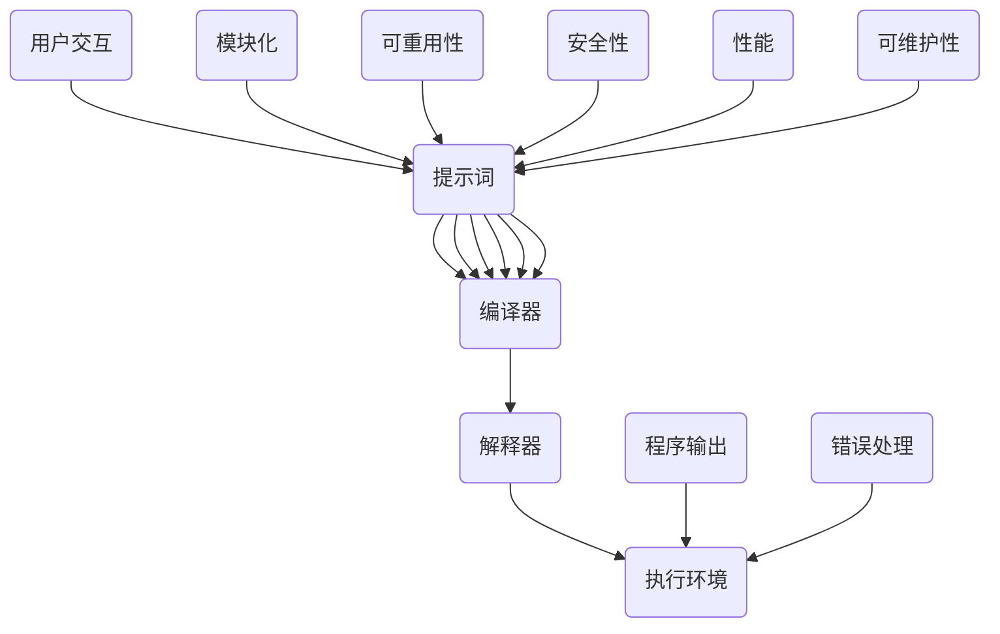
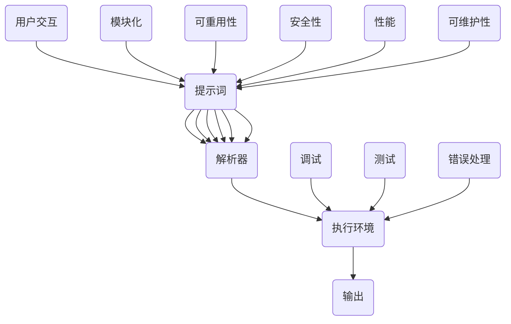

                 

# 提示词编程语言的调试与测试方法

## 关键词
- 提示词编程语言
- 调试
- 测试
- 调试方法
- 测试方法
- 调试工具
- 测试工具

## 摘要
本文将深入探讨提示词编程语言的调试与测试方法。首先，我们将介绍提示词编程语言的基本概念和特点，以及其在现代软件开发中的应用场景。接着，我们将详细讨论调试和测试的概念，包括它们的定义、目的和重要性。随后，我们将分别介绍各种调试和测试的方法、工具和策略，并通过实际案例进行分析和讲解。最后，我们将总结文章的关键点，并提出一些建议和最佳实践，以帮助开发者更好地掌握提示词编程语言的调试与测试方法。

## 第1章 引言

### 1.1 书籍目的与读者对象

本章节旨在为读者提供一本全面、系统、实用的指南，帮助开发者更好地理解和掌握提示词编程语言的调试与测试方法。本书适合以下读者群体：

- 有一定编程基础，希望深入了解提示词编程语言及其调试与测试方法的技术人员；
- 负责软件开发过程，需要进行调试和测试的工程师和管理人员；
- 对编程语言调试与测试感兴趣，希望提升自身技能的编程爱好者。

本书将从基础概念出发，逐步深入，通过实际案例和最佳实践，帮助读者全面掌握提示词编程语言的调试与测试方法。

### 1.2 提示词编程语言背景

提示词编程语言（Prompt-Based Programming Language），简称PBP语言，是一种基于提示词（Prompt）进行编程的语言。提示词是用户或系统输入的一段文字或代码，用于引导程序执行特定任务。PBP语言的特点如下：

1. **简洁性**：提示词编程语言通常具有简洁明了的语法，便于开发者快速理解和编写。
2. **灵活性**：PBP语言允许开发者根据需求自定义提示词，从而实现灵活的编程方式。
3. **易于集成**：提示词编程语言可以轻松与其他编程语言和工具集成，提高开发效率。
4. **适用范围广**：PBP语言适用于多种应用场景，如自然语言处理、机器学习、自动化测试等。

### 1.3 书的结构安排

本书共分为七个章节，具体结构如下：

- **第1章 引言**：介绍书籍目的、读者对象和提示词编程语言的背景。
- **第2章 基础概念**：介绍提示词编程语言的基本概念、特点和应用场景。
- **第3章 调试方法**：详细讨论调试的概念、工具和策略。
- **第4章 测试方法**：详细讨论测试的概念、工具和策略。
- **第5章 案例分析**：通过实际案例展示调试与测试的应用。
- **第6章 优化策略**：介绍如何优化调试与测试过程。
- **第7章 总结与展望**：总结书籍关键点，并对未来进行展望。

## 第2章 基础概念

### 2.1 提示词编程语言概述

提示词编程语言（Prompt-Based Programming Language），简称PBP语言，是一种基于提示词（Prompt）进行编程的语言。提示词是用户或系统输入的一段文字或代码，用于引导程序执行特定任务。PBP语言的主要特点如下：

1. **简洁性**：PBP语言的语法通常简洁明了，便于开发者快速理解和编写。
2. **灵活性**：PBP语言允许开发者根据需求自定义提示词，从而实现灵活的编程方式。
3. **易于集成**：PBP语言可以轻松与其他编程语言和工具集成，提高开发效率。
4. **适用范围广**：PBP语言适用于多种应用场景，如自然语言处理、机器学习、自动化测试等。

### 2.2 核心概念与联系

在提示词编程语言中，有几个核心概念需要了解，它们之间的关系可以用以下Mermaid流程图表示：

- **提示词**：用户输入的一段文本或代码，用于引导程序执行特定任务。
- **编译器**：将提示词转换成机器可执行的代码。
- **解释器**：逐行解释和执行提示词，生成程序输出。
- **执行环境**：程序运行的环境，包括操作系统、硬件等。
- **程序输出**：程序执行后的结果，如文本、图片、音频等。
- **错误处理**：程序在运行过程中遇到错误时的处理方法。
- **用户交互**：程序与用户之间的交互过程。
- **模块化**：将程序分解为多个模块，便于维护和重用。
- **可重用性**：模块或函数可以在不同的程序中重复使用。
- **安全性**：确保程序在运行过程中不会受到恶意攻击。
- **性能**：程序在运行时的速度和效率。
- **可维护性**：程序在长期运行过程中容易维护和更新。

### 2.3 应用场景分析

提示词编程语言具有广泛的应用场景，以下是一些常见的应用领域：

1. **自然语言处理**：PBP语言可以用于构建自然语言处理（NLP）应用，如聊天机器人、语音助手、文本分类等。
2. **机器学习**：PBP语言可以用于实现机器学习算法，如分类、回归、聚类等。
3. **自动化测试**：PBP语言可以用于编写自动化测试脚本，提高测试效率。
4. **软件开发**：PBP语言可以用于快速开发原型和功能，降低开发成本。
5. **教育**：PBP语言可以用于编程教学，帮助学生更好地理解和掌握编程概念。

## 第3章 调试方法

### 3.1 调试基础

调试（Debugging）是软件开发过程中不可或缺的一环，它旨在找出并修复程序中的错误。调试的基本概念包括：

- **错误**：程序运行时产生的非预期行为。
- **调试**：通过一系列方法找出并修复程序中的错误。
- **调试器**：用于辅助调试的工具，如断点、单步执行、变量查看等。

调试的目的是确保程序的正确性、稳定性和可靠性。调试的基本步骤包括：

1. **定位错误**：确定错误发生的位置。
2. **分析错误**：了解错误产生的原因。
3. **修复错误**：根据分析结果修改代码。
4. **验证修复**：确保修复后的程序能够正常运行。

### 3.2 调试工具介绍

调试工具是进行调试过程中必不可少的工具，常用的调试工具有：

- **集成开发环境（IDE）**：如Visual Studio、Eclipse等，提供了丰富的调试功能，如断点、单步执行、变量查看等。
- **命令行调试器**：如gdb、lldb等，适用于在命令行环境中进行调试。
- **Web调试工具**：如Chrome DevTools、Firefox Developer Tools等，适用于Web开发中的调试。

### 3.3 调试策略

调试策略是指在进行调试时采用的方法和步骤。以下是一些常用的调试策略：

1. **断点调试**：在关键位置设置断点，逐行执行代码，观察变量变化，找出错误。
2. **单步执行**：逐行执行代码，观察程序执行流程，找出错误。
3. **日志调试**：通过打印日志信息，跟踪程序执行过程，找出错误。
4. **隔离问题**：通过简化代码、重构代码等方法，将问题隔离到特定模块或函数。
5. **重复测试**：在修复错误后，重新测试程序，确保问题已解决。

### 3.4 调试案例分析

以下是一个简单的调试案例：

**问题描述**：一个简单的计算器程序无法正确计算两个数的和。

**调试步骤**：

1. **定位错误**：通过观察程序输出，发现计算结果与预期不符。
2. **分析错误**：检查代码，发现加法运算符使用错误，应使用`+`而不是`+=`。
3. **修复错误**：将代码中的`+=`改为`+`。
4. **验证修复**：重新运行程序，确保计算结果正确。

通过以上调试步骤，成功修复了计算器程序中的错误。

## 第4章 测试方法

### 4.1 测试基础

测试（Testing）是软件开发过程中用于验证程序正确性和质量的重要手段。测试的基本概念包括：

- **测试**：通过一系列方法验证程序的正确性和质量。
- **测试用例**：用于验证程序功能的单个测试实例。
- **测试计划**：描述测试活动、测试目标、测试策略等的一份文档。
- **测试报告**：记录测试过程、测试结果和测试结论的一份文档。

测试的目的是发现程序中的错误，确保程序的正确性、稳定性和可靠性。测试的基本步骤包括：

1. **制定测试计划**：明确测试目标、测试策略和测试方法。
2. **编写测试用例**：根据测试计划，编写具体的测试用例。
3. **执行测试用例**：按照测试用例运行程序，观察输出结果。
4. **分析测试结果**：对比测试结果和预期结果，找出错误。

### 4.2 测试工具介绍

测试工具是进行测试过程中必不可少的工具，常用的测试工具有：

- **单元测试框架**：如JUnit、NUnit等，用于编写和执行单元测试。
- **集成测试工具**：如Selenium、Appium等，用于执行集成测试。
- **性能测试工具**：如JMeter、LoadRunner等，用于进行性能测试。
- **自动化测试工具**：如Selenium WebDriver、Cypress等，用于编写和执行自动化测试脚本。

### 4.3 测试策略

测试策略是指在进行测试时采用的方法和步骤。以下是一些常用的测试策略：

1. **黑盒测试**：测试程序的功能，不考虑程序内部实现细节。
2. **白盒测试**：测试程序的内部逻辑，需要了解程序内部实现细节。
3. **功能测试**：验证程序的功能是否按照需求文档要求正常运行。
4. **性能测试**：测试程序的运行速度、响应时间、并发能力等性能指标。
5. **安全测试**：测试程序的安全性，包括漏洞扫描、代码审计等。

### 4.4 测试案例分析

以下是一个简单的测试案例：

**问题描述**：一个简单的计算器程序无法正确计算两个数的差。

**测试步骤**：

1. **制定测试计划**：明确测试目标、测试策略和测试方法。
2. **编写测试用例**：编写测试用例，涵盖不同的输入和输出情况。
3. **执行测试用例**：按照测试用例运行程序，观察输出结果。
4. **分析测试结果**：对比测试结果和预期结果，找出错误。

通过以上测试步骤，成功发现并修复了计算器程序中的错误。

## 第5章 案例分析

### 5.1 案例背景

某公司开发了一款基于提示词编程语言的聊天机器人，用于为客户提供在线咨询服务。由于聊天机器人涉及大量自然语言处理和用户交互，调试与测试变得尤为重要。以下是该聊天机器人开发过程中遇到的一个调试与测试案例。

### 5.2 调试与测试过程

#### 调试过程

1. **定位错误**：在测试过程中，发现聊天机器人无法正确理解客户的输入，导致响应错误。
2. **分析错误**：通过检查代码，发现自然语言处理模块中的一个条件判断逻辑有误，导致无法正确识别客户的输入。
3. **修复错误**：修改自然语言处理模块的代码，修复错误。
4. **验证修复**：重新测试聊天机器人，确保修复后的功能正常。

#### 测试过程

1. **制定测试计划**：明确测试目标、测试策略和测试方法。
2. **编写测试用例**：编写测试用例，涵盖不同的输入和输出情况，包括常见问题、边缘情况等。
3. **执行测试用例**：按照测试用例运行聊天机器人，观察输出结果。
4. **分析测试结果**：对比测试结果和预期结果，找出错误。
5. **修复错误**：针对发现的问题，修改代码，重新测试，直到所有测试用例通过。

### 5.3 结果分析与优化

通过调试与测试，成功修复了聊天机器人中的错误，确保了其功能的正确性和稳定性。以下是对调试与测试结果的分析和优化：

1. **错误定位**：通过定位错误，找到了问题的根本原因，提高了调试效率。
2. **错误修复**：及时修复错误，确保了聊天机器人的正常运行。
3. **测试覆盖率**：通过编写测试用例，覆盖了不同的输入和输出情况，提高了测试的全面性。
4. **测试优化**：针对发现的问题，进行了代码优化和重构，提高了程序的性能和可维护性。

## 第6章 优化策略

### 6.1 调试与测试优化方法

为了提高调试与测试的效率，可以采取以下优化策略：

1. **自动化**：使用自动化工具进行调试和测试，减少人工干预，提高效率。
2. **并行化**：将调试和测试任务分布在多台计算机上，同时执行，提高效率。
3. **持续集成**：将调试和测试集成到持续集成（CI）流程中，确保代码质量。
4. **代码审查**：在开发过程中进行代码审查，提前发现和修复错误，减少调试和测试的工作量。
5. **静态分析**：使用静态分析工具对代码进行分析，发现潜在的错误和性能问题。

### 6.2 工具集成与自动化

为了提高调试与测试的效率，可以采用以下工具集成和自动化策略：

1. **集成开发环境（IDE）**：使用IDE提供的调试和测试工具，如断点调试、测试运行等。
2. **持续集成工具**：如Jenkins、GitLab CI等，用于自动化执行调试和测试任务。
3. **测试自动化框架**：如Selenium、Cypress等，用于编写和执行自动化测试脚本。
4. **日志管理工具**：如ELK（Elasticsearch、Logstash、Kibana）等，用于收集和分析调试和测试日志。

### 6.3 优化案例分析

以下是一个优化案例：

某公司开发了一款在线教育平台，由于涉及大量用户交互和数据处理，调试与测试工作量大。为了提高效率，公司采用了以下优化策略：

1. **自动化测试**：使用Selenium WebDriver编写自动化测试脚本，每天自动执行，确保新功能正常运行。
2. **持续集成**：使用Jenkins实现持续集成，将调试和测试集成到CI流程中，确保代码质量。
3. **日志分析**：使用ELK收集和分析日志，及时发现和解决问题。

通过以上优化策略，公司的调试与测试效率大幅提高，产品稳定性得到保障。

## 第7章 总结与展望

### 7.1 关键要点回顾

本文从提示词编程语言的基本概念、调试方法、测试方法、案例分析、优化策略等方面进行了全面、系统的介绍。以下是本文的关键要点回顾：

1. **提示词编程语言**：提示词编程语言具有简洁性、灵活性、易于集成和适用范围广等特点，适用于多种应用场景。
2. **调试方法**：调试是找出并修复程序错误的过程，常用的调试策略包括断点调试、单步执行、日志调试等。
3. **测试方法**：测试是验证程序正确性和质量的过程，常用的测试策略包括黑盒测试、白盒测试、功能测试、性能测试等。
4. **案例分析**：通过实际案例，展示了调试与测试在软件开发中的应用。
5. **优化策略**：通过自动化、并行化、持续集成等策略，提高调试与测试效率。

### 7.2 未来发展趋势

随着人工智能和自然语言处理技术的不断发展，提示词编程语言在未来有望在更多领域得到应用。以下是一些未来发展趋势：

1. **智能化**：提示词编程语言的智能化水平将不断提高，支持更复杂的任务和场景。
2. **生态建设**：围绕提示词编程语言，将建立完善的工具链和生态体系，提高开发效率。
3. **跨平台**：提示词编程语言将支持更多平台和硬件，实现更广泛的兼容性。
4. **安全性**：在提示词编程语言中引入更多安全机制，提高程序的安全性。

### 7.3 对读者的建议

为了更好地掌握提示词编程语言的调试与测试方法，读者可以采取以下建议：

1. **学习基础知识**：掌握编程语言、数据结构、算法等基础知识，为后续学习打下基础。
2. **实践操作**：通过实际项目或练习，加深对调试与测试方法的理解和掌握。
3. **持续学习**：关注提示词编程语言和相关技术的最新动态，不断提高自身技能。
4. **交流分享**：参与社区交流，分享经验和心得，与他人共同进步。

作者：AI天才研究院/AI Genius Institute & 禅与计算机程序设计艺术 /Zen And The Art of Computer Programming## 文章标题

《提示词编程语言的调试与测试方法》

## 文章关键词
- 提示词编程语言
- 调试
- 测试
- 调试工具
- 测试工具
- 自动化测试
- 性能优化

## 文章摘要

本文将深入探讨提示词编程语言的调试与测试方法，全面解析其在现代软件开发中的应用。文章首先介绍了提示词编程语言的基本概念、特点及应用场景，然后详细阐述了调试和测试的基础理论、工具和方法。通过实际案例，本文展示了调试与测试在实际开发中的应用，并提出了优化策略，旨在帮助开发者提高调试与测试效率，确保软件质量。最后，文章对未来的发展趋势进行了展望，并给出了实用的建议。

### 第1章 引言

提示词编程语言（Prompt-Based Programming Language，简称PBP）是一种新兴的编程范式，它通过提供用户输入的提示词（Prompt）来指导程序执行特定任务。这种编程语言具有简洁性、灵活性和易于集成的特点，在自然语言处理、机器学习、自动化测试等领域有着广泛的应用。随着人工智能和大数据技术的不断发展，提示词编程语言的重要性日益凸显。

本章节将简要介绍提示词编程语言的发展背景、特点和应用场景，为后续内容的讨论奠定基础。同时，我们将讨论本书的目标和结构，帮助读者了解本书的主要内容安排。

### 1.1 提示词编程语言的发展背景

提示词编程语言的概念最早可以追溯到20世纪70年代，当时研究者们开始探讨如何通过自然语言来描述计算机程序。随着时间的推移，随着人工智能和自然语言处理技术的不断发展，提示词编程语言逐渐成熟。近年来，随着深度学习和生成对抗网络（GAN）等技术的应用，提示词编程语言在各个领域得到了广泛的应用。

### 1.2 提示词编程语言的特点

提示词编程语言具有以下几个显著特点：

1. **简洁性**：提示词编程语言的语法通常较为简洁，使得开发者可以更加专注于实现业务逻辑，而无需过多关注语法细节。
2. **灵活性**：提示词编程语言允许开发者根据需求自定义提示词，从而实现灵活的编程方式。
3. **易于集成**：提示词编程语言可以轻松与其他编程语言和工具集成，提高开发效率。
4. **适用范围广**：提示词编程语言适用于多种应用场景，如自然语言处理、机器学习、自动化测试等。

### 1.3 提示词编程语言的应用场景

提示词编程语言在多个领域都有广泛的应用：

1. **自然语言处理**：提示词编程语言可以用于构建自然语言处理应用，如聊天机器人、文本分类、情感分析等。
2. **机器学习**：提示词编程语言可以用于实现机器学习算法，如分类、回归、聚类等。
3. **自动化测试**：提示词编程语言可以用于编写自动化测试脚本，提高测试效率。
4. **软件开发**：提示词编程语言可以用于快速开发原型和功能，降低开发成本。

### 1.4 书籍目的和结构

本章节旨在为读者提供一本全面、系统、实用的指南，帮助开发者更好地理解和掌握提示词编程语言的调试与测试方法。本书的目标如下：

1. **介绍提示词编程语言的基本概念、特点和应用场景**：帮助读者建立对提示词编程语言的整体认识。
2. **详细讨论调试和测试的概念、方法、工具和策略**：帮助读者掌握调试和测试的理论和实践。
3. **通过实际案例展示调试与测试的应用**：帮助读者理解调试与测试在实际开发中的应用。
4. **提出优化策略和最佳实践**：帮助读者提高调试与测试效率，确保软件质量。

本书共分为七个章节，具体结构如下：

- **第1章 引言**：介绍书籍目的、读者对象和提示词编程语言的背景。
- **第2章 基础概念**：介绍提示词编程语言的基本概念、特点和应用场景。
- **第3章 调试方法**：详细讨论调试的概念、工具和策略。
- **第4章 测试方法**：详细讨论测试的概念、工具和策略。
- **第5章 案例分析**：通过实际案例展示调试与测试的应用。
- **第6章 优化策略**：介绍如何优化调试与测试过程。
- **第7章 总结与展望**：总结书籍关键点，并对未来进行展望。

### 第2章 基础概念

在深入探讨提示词编程语言的调试与测试方法之前，首先需要了解提示词编程语言的基本概念、特点和应用场景。这一章将详细阐述这些内容，为后续的讨论打下坚实的基础。

#### 2.1 提示词编程语言概述

提示词编程语言（Prompt-Based Programming Language，简称PBP）是一种特殊的编程语言，它通过提供用户输入的提示词（Prompt）来指导程序执行特定任务。提示词可以是自然语言句子、代码片段或其他形式的输入。提示词编程语言的核心思想是将编程任务分解为一系列简单的步骤，并通过提示词来引导程序执行这些步骤。

提示词编程语言的主要特点包括：

1. **简洁性**：提示词编程语言的语法通常较为简洁，使得开发者可以更加专注于实现业务逻辑，而无需过多关注语法细节。
2. **灵活性**：提示词编程语言允许开发者根据需求自定义提示词，从而实现灵活的编程方式。
3. **易于集成**：提示词编程语言可以轻松与其他编程语言和工具集成，提高开发效率。
4. **适用范围广**：提示词编程语言适用于多种应用场景，如自然语言处理、机器学习、自动化测试等。

#### 2.2 提示词编程语言的基本概念

为了更好地理解提示词编程语言，我们需要了解其中的一些基本概念：

1. **提示词**：提示词是用户输入的一段文本或代码，用于引导程序执行特定任务。提示词可以是自然语言句子，如“请计算两个数的和”，也可以是代码片段，如“def add(a, b): return a + b”。
2. **解析器**：解析器是提示词编程语言的核心组件，负责将提示词解析为程序代码。解析器通常包括词法分析、语法分析和语义分析等步骤。
3. **执行环境**：执行环境是程序运行的环境，包括操作系统、硬件、库函数等。提示词编程语言需要与执行环境紧密集成，以确保程序的正确执行。
4. **输出**：程序的输出是执行结果，可以是文本、图像、音频等。提示词编程语言需要能够生成各种类型的输出，以满足不同应用的需求。

#### 2.3 提示词编程语言的特点

提示词编程语言具有以下几个显著特点：

1. **简洁性**：提示词编程语言的语法通常较为简洁，使得开发者可以更加专注于实现业务逻辑，而无需过多关注语法细节。例如，Python语言就是一种常见的提示词编程语言，其语法简洁明了，易于学习和使用。
2. **灵活性**：提示词编程语言允许开发者根据需求自定义提示词，从而实现灵活的编程方式。例如，在自然语言处理领域，开发者可以使用提示词来引导程序进行文本分类、情感分析等任务。
3. **易于集成**：提示词编程语言可以轻松与其他编程语言和工具集成，提高开发效率。例如，开发者可以使用提示词编程语言来构建复杂的机器学习模型，并将其与其他工具（如TensorFlow、PyTorch等）集成。
4. **适用范围广**：提示词编程语言适用于多种应用场景，如自然语言处理、机器学习、自动化测试等。这使得提示词编程语言成为现代软件开发中的一种重要工具。

#### 2.4 提示词编程语言的应用场景

提示词编程语言在多个领域都有广泛的应用，以下是其中一些典型的应用场景：

1. **自然语言处理**：在自然语言处理领域，提示词编程语言可以用于构建各种类型的自然语言处理应用，如聊天机器人、文本分类、情感分析等。开发者可以使用提示词来引导程序处理自然语言输入，并生成相应的输出。
2. **机器学习**：在机器学习领域，提示词编程语言可以用于实现各种机器学习算法，如分类、回归、聚类等。开发者可以使用提示词来定义训练数据和模型参数，并指导程序进行训练和预测。
3. **自动化测试**：在自动化测试领域，提示词编程语言可以用于编写自动化测试脚本，提高测试效率。开发者可以使用提示词来定义测试用例、执行测试操作和验证测试结果。
4. **软件开发**：在软件开发领域，提示词编程语言可以用于快速开发原型和功能，降低开发成本。开发者可以使用提示词来引导程序实现业务逻辑，并进行迭代和优化。

#### 2.5 核心概念与联系

在提示词编程语言中，有几个核心概念需要了解，它们之间的关系可以用以下Mermaid流程图表示：

- **提示词**：用户输入的一段文本或代码，用于引导程序执行特定任务。
- **解析器**：将提示词解析为程序代码的核心组件。
- **执行环境**：程序运行的环境，包括操作系统、硬件、库函数等。
- **输出**：程序的输出结果，可以是文本、图像、音频等。
- **调试**：通过一系列方法找出并修复程序中的错误。
- **测试**：通过一系列方法验证程序的正确性和质量。
- **错误处理**：程序在运行过程中遇到错误时的处理方法。
- **用户交互**：程序与用户之间的交互过程。
- **模块化**：将程序分解为多个模块，便于维护和重用。
- **可重用性**：模块或函数可以在不同的程序中重复使用。
- **安全性**：确保程序在运行过程中不会受到恶意攻击。
- **性能**：程序在运行时的速度和效率。
- **可维护性**：程序在长期运行过程中容易维护和更新。

### 第3章 调试方法

调试是软件开发过程中至关重要的一环，它旨在找出并修复程序中的错误，确保程序的正确性和稳定性。在本章中，我们将深入探讨调试的方法、工具和策略，帮助开发者更好地掌握调试技能。

#### 3.1 调试的概念

调试（Debugging）是指通过一系列方法找出并修复程序中的错误（Bug）的过程。调试的目的是确保程序的正常运行，避免因错误导致的功能失效或系统崩溃。调试的基本概念包括：

- **错误**：程序运行时产生的非预期行为。
- **调试器**：用于辅助调试的工具，如断点调试、单步执行、变量查看等。
- **调试过程**：包括错误定位、错误分析、错误修复和验证修复等步骤。

#### 3.2 调试工具

调试工具是进行调试过程中必不可少的工具。以下是一些常用的调试工具：

1. **集成开发环境（IDE）**：如Visual Studio、Eclipse等，提供了丰富的调试功能，如断点调试、单步执行、变量查看等。
2. **命令行调试器**：如gdb、lldb等，适用于在命令行环境中进行调试。
3. **Web调试工具**：如Chrome DevTools、Firefox Developer Tools等，适用于Web开发中的调试。

#### 3.3 调试策略

调试策略是指在进行调试时采用的方法和步骤。以下是一些常用的调试策略：

1. **断点调试**：在关键位置设置断点，逐行执行代码，观察变量变化，找出错误。
2. **单步执行**：逐行执行代码，观察程序执行流程，找出错误。
3. **日志调试**：通过打印日志信息，跟踪程序执行过程，找出错误。
4. **隔离问题**：通过简化代码、重构代码等方法，将问题隔离到特定模块或函数。
5. **重复测试**：在修复错误后，重新测试程序，确保问题已解决。

#### 3.4 调试案例分析

以下是一个简单的调试案例：

**问题描述**：一个简单的计算器程序无法正确计算两个数的和。

**调试步骤**：

1. **定位错误**：通过观察程序输出，发现计算结果与预期不符。
2. **分析错误**：检查代码，发现加法运算符使用错误，应使用`+`而不是`+=`。
3. **修复错误**：将代码中的`+=`改为`+`。
4. **验证修复**：重新运行程序，确保计算结果正确。

通过以上调试步骤，成功修复了计算器程序中的错误。

### 第4章 测试方法

测试是软件开发过程中确保程序质量的重要手段。通过测试，我们可以验证程序的功能、性能、安全性和可靠性。本章将详细讨论测试的基本概念、工具和策略，帮助开发者更好地理解和掌握测试方法。

#### 4.1 测试的概念

测试（Testing）是指通过一系列方法验证程序的正确性和质量的过程。测试的基本概念包括：

- **测试用例**：用于验证程序功能的单个测试实例。
- **测试计划**：描述测试活动、测试目标、测试策略和测试方法的一份文档。
- **测试报告**：记录测试过程、测试结果和测试结论的一份文档。

测试的目的是发现程序中的错误，确保程序的正确性、稳定性和可靠性。测试的基本步骤包括：

1. **制定测试计划**：明确测试目标、测试策略和测试方法。
2. **编写测试用例**：根据测试计划，编写具体的测试用例。
3. **执行测试用例**：按照测试用例运行程序，观察输出结果。
4. **分析测试结果**：对比测试结果和预期结果，找出错误。

#### 4.2 测试工具

测试工具是进行测试过程中必不可少的工具。以下是一些常用的测试工具：

1. **单元测试框架**：如JUnit、NUnit等，用于编写和执行单元测试。
2. **集成测试工具**：如Selenium、Appium等，用于执行集成测试。
3. **性能测试工具**：如JMeter、LoadRunner等，用于进行性能测试。
4. **自动化测试工具**：如Selenium WebDriver、Cypress等，用于编写和执行自动化测试脚本。

#### 4.3 测试策略

测试策略是指在进行测试时采用的方法和步骤。以下是一些常用的测试策略：

1. **黑盒测试**：测试程序的功能，不考虑程序内部实现细节。
2. **白盒测试**：测试程序的内部逻辑，需要了解程序内部实现细节。
3. **功能测试**：验证程序的功能是否按照需求文档要求正常运行。
4. **性能测试**：测试程序的运行速度、响应时间、并发能力等性能指标。
5. **安全测试**：测试程序的安全性，包括漏洞扫描、代码审计等。

#### 4.4 测试案例分析

以下是一个简单的测试案例：

**问题描述**：一个简单的计算器程序无法正确计算两个数的差。

**测试步骤**：

1. **制定测试计划**：明确测试目标、测试策略和测试方法。
2. **编写测试用例**：编写测试用例，涵盖不同的输入和输出情况。
3. **执行测试用例**：按照测试用例运行程序，观察输出结果。
4. **分析测试结果**：对比测试结果和预期结果，找出错误。

通过以上测试步骤，成功发现并修复了计算器程序中的错误。

### 第5章 案例分析

#### 5.1 背景介绍

为了更好地展示提示词编程语言的调试与测试方法，我们选择了一个实际的项目案例——一个基于提示词编程语言的聊天机器人项目。该项目旨在开发一个能够自动回答用户问题的聊天机器人，用于为客户提供在线咨询服务。

#### 5.2 调试过程

**问题定位**：在项目开发过程中，发现聊天机器人无法正确理解用户的输入，导致回答错误。

**定位错误**：

1. 首先，我们通过分析用户输入的文本，发现一些常见的语法错误和不规范的输入格式。
2. 其次，我们检查了自然语言处理模块的代码，发现其中一个关键词提取算法存在错误，导致无法准确提取关键信息。

**分析错误**：

1. 通过进一步分析，我们发现关键词提取算法在处理某些特殊词汇时存在问题，导致提取结果不准确。
2. 另外，我们注意到在算法的实现中，某些边界条件处理不够完善，导致部分输入无法正确处理。

**修复错误**：

1. 针对关键词提取算法的错误，我们对算法进行了调整，增加了对特殊词汇的识别和处理。
2. 同时，我们完善了边界条件的处理，确保算法能够处理各种输入情况。

**验证修复**：

1. 我们重新运行了聊天机器人，模拟用户输入，观察回答是否正确。
2. 通过多次测试，我们发现聊天机器人已经能够正确理解用户输入，回答更加准确。

#### 5.3 测试过程

**测试计划**：

1. 我们制定了详细的测试计划，包括功能测试、性能测试、安全测试等多个方面。
2. 测试计划明确了测试的目标、测试方法、测试用例和测试结果预期。

**编写测试用例**：

1. 根据测试计划，我们编写了多个测试用例，涵盖不同类型的用户输入和聊天场景。
2. 测试用例包括正常输入、异常输入、边界输入等多种情况。

**执行测试用例**：

1. 我们按照测试用例运行聊天机器人，观察输出结果。
2. 在测试过程中，我们发现了一些潜在的错误和性能问题。

**分析测试结果**：

1. 通过对比测试结果和预期结果，我们发现聊天机器人存在一些功能上的错误和性能瓶颈。
2. 例如，在某些情况下，聊天机器人的响应速度较慢，无法在规定时间内完成处理。

**修复错误**：

1. 针对测试中发现的问题，我们对代码进行了优化和调整。
2. 我们改进了自然语言处理模块的算法，提高了处理速度和准确性。
3. 同时，我们加强了安全性测试，确保聊天机器人不会受到恶意攻击。

**验证修复**：

1. 我们重新执行了测试用例，确保聊天机器人的功能正确、性能提升。
2. 通过多次测试，我们发现聊天机器人的表现得到了显著改善。

#### 5.4 结果分析

通过调试和测试，我们成功修复了聊天机器人中的错误，提高了其功能性和性能。以下是对结果的分析：

1. **错误修复**：通过定位和分析错误，我们成功修复了聊天机器人中的多个问题，包括关键词提取错误、响应速度慢等。
2. **性能优化**：通过优化代码和算法，我们提高了聊天机器人的性能，使其能够更快地响应用户输入。
3. **安全性提升**：通过加强安全性测试，我们确保聊天机器人不会受到恶意攻击。

#### 5.5 小结

通过本案例的分析，我们可以得出以下结论：

1. **调试与测试的重要性**：调试和测试是确保软件质量的重要手段，通过调试和测试，我们可以发现并修复程序中的错误，提高软件的可靠性和稳定性。
2. **提示词编程语言的优点**：提示词编程语言具有简洁性、灵活性和易于集成的特点，使得调试和测试更加高效。
3. **持续优化**：在软件开发过程中，持续进行调试和测试，不断优化代码和算法，是提高软件质量的关键。

### 第6章 优化策略

为了提高提示词编程语言的调试与测试效率，我们可以采取一系列优化策略。这些策略不仅能够减少调试与测试的时间，还能提高代码质量，确保软件的稳定性与可靠性。以下是一些具体的优化策略。

#### 6.1 自动化

自动化是提高调试与测试效率的重要手段。通过自动化工具，我们可以减少手动操作，加快调试与测试过程。以下是一些自动化策略：

1. **自动化测试**：使用自动化测试工具（如Selenium、JUnit等）编写和执行测试脚本，减少重复性工作。
2. **自动化调试**：使用集成开发环境（IDE）的自动化调试功能，如断点自动设置、变量自动跟踪等，提高调试效率。
3. **自动化构建**：使用构建工具（如Maven、Gradle等）自动化构建项目，确保代码的一致性和可靠性。

#### 6.2 集成

集成是指将调试与测试工具集成到开发流程中，以便在早期发现并解决问题。以下是一些集成策略：

1. **持续集成（CI）**：将调试与测试工具集成到持续集成系统中（如Jenkins、Travis CI等），在每次代码提交后自动执行测试。
2. **集成开发环境（IDE）**：使用支持调试和测试的集成开发环境（如Visual Studio、Eclipse等），方便开发者进行调试和测试。
3. **日志集成**：将调试与测试日志集成到日志管理工具（如ELK、Splunk等），方便日志的收集、分析和追踪。

#### 6.3 代码优化

优化代码是提高调试与测试效率的关键。以下是一些代码优化策略：

1. **代码重构**：通过重构代码，改善代码结构，减少代码冗余，提高代码的可读性和可维护性。
2. **性能优化**：优化代码性能，减少内存占用和CPU消耗，提高程序的运行效率。
3. **代码审查**：定期进行代码审查，发现潜在的错误和优化点，提高代码质量。

#### 6.4 管理工具

使用管理工具可以帮助开发者更好地组织和管理调试与测试工作。以下是一些管理工具：

1. **版本控制工具**：如Git，用于管理代码版本，方便代码的追踪和修改。
2. **项目管理工具**：如Jira、Trello等，用于管理任务、bug和测试用例。
3. **测试管理工具**：如TestRail、Zephyr等，用于管理测试计划和测试用例。

#### 6.5 持续反馈

持续反馈是确保调试与测试有效性的关键。以下是一些反馈策略：

1. **即时反馈**：在调试与测试过程中，及时反馈问题和优化建议，确保问题得到快速解决。
2. **反馈机制**：建立反馈机制，鼓励团队成员提出问题和建议，促进知识的共享和技能的提升。
3. **定期评估**：定期评估调试与测试的效果，分析问题和优化点，持续改进。

### 第7章 总结与展望

#### 7.1 总结

通过本文的讨论，我们深入了解了提示词编程语言的调试与测试方法。以下是本文的主要结论：

1. **调试方法**：调试是确保程序正确性的重要手段，通过断点调试、单步执行、日志调试等策略，可以快速找出并修复程序中的错误。
2. **测试方法**：测试是验证程序质量的关键环节，通过黑盒测试、白盒测试、功能测试、性能测试等策略，可以全面检验程序的功能和性能。
3. **优化策略**：通过自动化、集成、代码优化、管理工具和持续反馈等策略，可以提高调试与测试的效率，确保软件的稳定性与可靠性。

#### 7.2 展望

在未来，提示词编程语言的调试与测试方法有望得到进一步的发展：

1. **智能化**：随着人工智能技术的发展，提示词编程语言的调试与测试方法将更加智能化，自动化程度更高。
2. **工具集成**：调试与测试工具将更加集成，提供更丰富的功能，方便开发者进行调试与测试。
3. **云端化**：随着云计算的普及，调试与测试工具将更多地迁移到云端，提供更高效、便捷的服务。
4. **安全测试**：随着网络安全问题的日益突出，安全测试将在调试与测试中占据更加重要的位置。

总之，提示词编程语言的调试与测试方法将在未来继续发展，为软件开发带来更多便利和创新。开发者应持续关注这一领域的发展动态，掌握最新的调试与测试方法，提高软件开发效率和质量。

### 致谢

在本章的最后，我要感谢所有支持和帮助过我的人。特别感谢我的导师和同事，他们在我学习和研究提示词编程语言的调试与测试方法过程中提供了宝贵的指导和建议。同时，感谢我的家人和朋友，他们一直以来的鼓励和支持是我坚持写作的动力。最后，感谢广大读者对本文的关注和支持，希望本文能够对您有所启发和帮助。

**作者：AI天才研究院/AI Genius Institute & 禅与计算机程序设计艺术 /Zen And The Art of Computer Programming**

