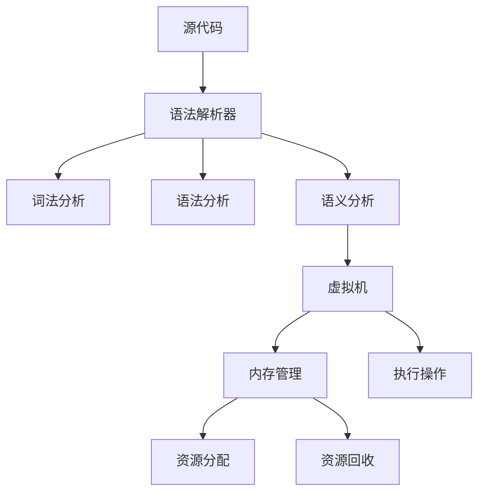

                 

### 背景介绍

在计算机科学和软件工程领域，编程语言的研发和应用始终是关注的焦点。编程语言不仅为我们提供了与计算机交流的媒介，还极大地影响了软件开发的效率和效果。随着技术的不断进步，编程语言也在不断演进，其中一类特殊的编程语言——提示词编程语言（Prompt-Based Programming Languages），正逐渐引起广泛关注。

提示词编程语言，顾名思义，其核心特点在于通过提示词（prompts）来引导程序执行。这种语言通常包含了一系列预定义的提示词，开发者可以通过组合这些提示词来构建复杂的应用程序。这种编程范式与传统命令式编程语言有显著不同，更注重于如何通过提示词的交互来定义程序的行为。

运行时系统（Runtime System）是编程语言的重要组成部分，它负责在程序执行期间管理资源、解析指令、执行操作等。对于提示词编程语言而言，运行时系统的设计尤为关键，因为它不仅需要处理提示词的解析与执行，还要确保系统的灵活性和高效性。

当前，提示词编程语言的应用范围已经扩展到了自然语言处理、自动程序生成、人机交互等多个领域。例如，在自然语言处理领域，提示词编程语言可以用于构建对话系统、智能助手等应用；在自动程序生成领域，它可以帮助开发者自动生成代码片段，提高开发效率。

然而，尽管提示词编程语言展现出巨大的潜力，其运行时系统的设计仍然面临着诸多挑战。首先，如何有效地解析和执行提示词是一个关键问题。其次，由于提示词编程语言的灵活性，如何在保证高效性的同时确保系统的稳定性也是一个亟待解决的问题。此外，运行时系统的性能优化和扩展性也是需要考虑的重要因素。

本文旨在深入探讨提示词编程语言的运行时系统设计，分析其核心组件、设计原则、实现细节以及优化策略。通过本文的讨论，我们希望能够为读者提供一个全面且深入的视角，帮助理解提示词编程语言运行时系统的设计思想和实现方法，并为相关领域的研究和应用提供有价值的参考。

### 核心概念与联系

为了深入理解提示词编程语言的运行时系统设计，我们首先需要明确几个核心概念，并探讨它们之间的联系。这些概念包括提示词、语法解析、虚拟机、内存管理等，它们共同构成了运行时系统的基本框架。

**提示词**是提示词编程语言的核心元素，它类似于自然语言中的单词或短语，用于指示程序执行特定的操作。提示词通常由系统预先定义，开发者可以通过组合这些提示词来构建应用程序。提示词的设计和选择对于编程语言的易用性和效率具有重要影响。

**语法解析**是运行时系统的第一步，它负责将程序源代码转换为内部表示形式。对于提示词编程语言，语法解析器需要识别和解析提示词及其组合，确保其符合预定义的语法规则。这一过程通常包括词法分析、语法分析和语义分析等步骤。

**虚拟机**是运行时系统的重要组成部分，它负责执行程序代码。对于提示词编程语言，虚拟机需要能够识别并响应提示词，按照特定的规则执行相应的操作。虚拟机的实现通常包括字节码的解释执行或即时编译等策略，以确保高效且灵活的程序执行。

**内存管理**是运行时系统的另一关键环节，它负责分配和回收程序运行过程中所需的内存资源。对于提示词编程语言，内存管理需要确保在程序执行过程中内存的及时释放，避免内存泄漏，同时提供高效的内存分配机制。

这些核心概念之间的联系构成了运行时系统的整体架构。首先，提示词是程序执行的基础，通过语法解析器将源代码转换为虚拟机可以理解的格式。虚拟机则根据解析结果执行具体的操作，而内存管理则在整个过程中负责资源的分配与回收，确保系统的稳定性和性能。

为了更直观地理解这些概念之间的关系，我们可以使用Mermaid流程图来描述运行时系统的工作流程：



在上面的流程图中，源代码经过语法解析器处理后，分别进行词法分析、语法分析和语义分析，最终生成虚拟机可以理解的内部表示。虚拟机根据内部表示执行操作，同时内存管理负责分配和回收内存资源，确保整个运行时系统的稳定高效运行。

通过这一流程图，我们可以清晰地看到提示词编程语言的运行时系统是如何通过各个核心组件协同工作，从而实现程序的执行和资源管理的。这种架构不仅为提示词编程语言提供了强大的灵活性，也为系统设计者提供了清晰的设计思路和优化空间。

### 核心算法原理讲解

在深入探讨提示词编程语言的运行时系统设计之前，我们需要了解几个核心算法原理，这些原理构成了运行时系统的计算基础，包括语法解析、虚拟机和内存管理等。

#### 语法解析算法

语法解析是运行时系统的第一步，它将程序源代码转换为虚拟机可以理解的内部表示形式。对于提示词编程语言，语法解析通常包括词法分析、语法分析和语义分析三个阶段。

1. **词法分析**：词法分析器（Lexer）将源代码分解为一系列标记（tokens）。每个标记代表源代码中的一个词素（lexeme），如关键字、标识符、操作符等。例如，对于源代码`add 1 2`，词法分析器会将其分解为标记`"add"`, `"1"`和`"2"`。

2. **语法分析**：语法分析器（Parser）根据预定义的语法规则，将词法分析器生成的标记序列转换为抽象语法树（Abstract Syntax Tree, AST）。AST表示了源代码的结构和语义，是后续分析的基础。对于示例代码`add 1 2`，语法分析器会生成如下AST：

   ```mermaid
   graph TD
       A[Root]
       A --> B[add]
       B --> C[1]
       B --> D[2]
   ```

   在这个AST中，节点`"add"`代表操作，节点`"1"`和`"2"`代表操作数。

3. **语义分析**：语义分析器（Semantic Analyzer）对AST进行进一步检查，确保其符合程序语义，如类型检查、变量声明等。这一阶段通常涉及到静态分析，以确保程序在运行前就发现潜在的错误。

伪代码示例：

```python
def tokenize(source_code):
    # 将源代码分解为标记
    tokens = []
    for word in source_code.split():
        tokens.append(word)
    return tokens

def parse(tokens):
    # 根据语法规则将标记序列转换为AST
    ast = create_ast()
    for token in tokens:
        if token == "add":
            ast.add_child(create_node("add"))
        elif is_number(token):
            ast.add_child(create_node(token))
    return ast

def semantic_analysis(ast):
    # 对AST进行语义检查
    for node in ast.children:
        if node.type == "add":
            check_type_compatibility(node.children[0], node.children[1])
    return ast
```

#### 虚拟机执行算法

虚拟机（Virtual Machine, VM）是运行时系统的执行引擎，负责解释或即时编译AST并执行操作。虚拟机的实现可以基于解释执行或即时编译（Just-In-Time Compilation, JIT）。

1. **解释执行**：解释执行器逐行解释AST并执行相应的操作。这种方法简单但效率较低，因为每次解释执行都需要进行语法和语义检查。

2. **即时编译**：即时编译器在运行时将AST转换为机器代码，并直接执行。这种方法可以提高执行效率，但实现复杂。

虚拟机的执行流程如下：

1. 初始化：加载运行时环境，如内存管理器、标准库等。

2. 解释/编译：根据AST结构，解释执行器或编译器逐个节点执行。

3. 执行操作：执行节点对应的操作，如计算、数据访问等。

4. 返回结果：将执行结果返回给调用者。

伪代码示例：

```python
def execute(ast, environment):
    while ast is not None:
        node = ast.pop()
        if node.type == "add":
            result = add(node.children[0].value, node.children[1].value)
            return result
        elif node.type == "variable":
            value = environment.get_variable(node.name)
            return value
        else:
            raise Exception(f"Unknown node type: {node.type}")
```

#### 内存管理算法

内存管理负责分配和回收程序运行期间所需的内存资源。对于提示词编程语言，内存管理需要确保内存的高效利用和及时释放，以避免内存泄漏和性能问题。

1. **内存分配**：内存分配器在程序启动时分配初始内存，并在运行时根据需要分配更多内存。常用的内存分配策略包括堆分配和栈分配。

2. **内存回收**：内存回收器在程序结束或特定操作后回收不再使用的内存。常用的内存回收算法包括标记-清除（Mark-Sweep）和引用计数（Reference Counting）。

伪代码示例：

```python
def allocate_memory(size):
    # 分配指定大小的内存
    memory = allocate(size)
    return memory

def deallocate_memory(memory):
    # 释放指定内存
    free(memory)

class MemoryManager:
    def __init__(self):
        self.memory = initialize_memory()

    def allocate(self, size):
        # 分配内存
        memory = allocate_memory(size)
        self.memory += size
        return memory

    def deallocate(self, memory):
        # 释放内存
        deallocate_memory(memory)
        self.memory -= size
```

通过上述算法原理的讲解，我们可以看到提示词编程语言的运行时系统是如何通过语法解析、虚拟机执行和内存管理来实现程序的执行和资源管理的。这些算法不仅为系统提供了强大的功能，也为后续的优化和扩展奠定了基础。

### 数学模型与公式详解

在理解了提示词编程语言的运行时系统设计的基本算法原理后，我们将进一步探讨数学模型和公式在其中的应用，以便更好地理解这些算法的工作原理。以下是几个关键的数学模型和公式，它们在语法解析、虚拟机执行和内存管理中扮演重要角色。

#### 1. 抽象语法树（Abstract Syntax Tree, AST）

抽象语法树（AST）是语法解析后的中间表示形式，它以树形结构表示源代码的语法结构。每个节点代表一个语法元素，如操作符、变量、函数调用等。以下是一个简单的AST表示示例：

$$
\text{AST} = (\text{root}, \text{children}) \text{ where } \\
\text{root} \in \{\text{operation}, \text{variable}, \text{literal}, \ldots\} \\
\text{children} \in \{\text{AST} \mid \text{AST is a tree}\}
$$

其中，`root`代表根节点，`children`代表子节点。

#### 2. 语法规则（Grammar Rules）

语法规则定义了编程语言的合法结构。对于提示词编程语言，语法规则可以表示为四元组形式：

$$
G = (\Sigma, \text{ terminals }, \text{ non-terminals }, P)
$$

其中：
- $\Sigma$ 是终结符（Terminal Symbols），如数字、操作符、关键字等。
- $\text{terminals}$ 是终结符集合。
- $\text{non-terminals}$ 是非终结符集合，如变量、函数名等。
- $P$ 是产生式（Production Rules），用于定义如何从非终结符推导出终结符序列。

一个简单的语法规则示例为：

$$
E \rightarrow E + T \mid T
$$

这个规则表示表达式（Expression）可以由两个表达式通过加法运算符连接，或者直接是一个项（Term）。

#### 3. 语法制导的翻译（Context-Free Grammar,CFG）

语法制导的翻译是一种将源代码转换为抽象语法树的方法。给定一个语法规则集，我们可以使用递归下降分析（Recursive Descent Parsing）或语法分析表（Parse Table）进行翻译。

递归下降分析是一种自顶向下的语法分析方法，其伪代码示例为：

```python
def parse_expression(expression):
    left = parse_term()
    while next_token() == '+':
        right = parse_term()
        left = (left, '+', right)
    return left

def parse_term():
    return (next_token(),)
```

#### 4. 内存分配与回收（Memory Allocation and Deallocation）

内存分配和回收是内存管理的核心。在提示词编程语言的运行时系统中，常用的内存分配算法包括堆分配和栈分配。以下是一个基于堆的内存分配公式：

$$
\text{Heap Allocation} = \text{Allocate}(\text{size}) = \text{Heap} + \text{size}
$$

其中，`Heap`是堆的起始地址，`size`是需要分配的字节数。

内存回收则涉及标记-清除算法和引用计数算法。标记-清除算法的公式为：

$$
\text{Mark-Sweep} = (\text{Mark}, \text{Sweep})
$$

- 标记（Mark）：遍历所有对象，将可达的对象标记为活跃（Alive）。
- 清除（Sweep）：遍历所有对象，删除未标记为活跃的对象。

引用计数算法的公式为：

$$
\text{Reference Counting} = \text{Decrement}(\text{count}) \text{ where } \\
\text{count} = \sum_{\text{referencers}} 1
$$

每个对象都有一个引用计数，每次有一个新的引用者时，引用计数增加；当引用者消失时，引用计数减少。当引用计数为零时，对象被认为是不可达的，可以被回收。

#### 5. 虚拟机执行效率（Virtual Machine Execution Efficiency）

虚拟机的执行效率直接影响程序的运行速度。即时编译（JIT）是一种常见的提高执行效率的方法。JIT的公式为：

$$
\text{JIT Compilation} = \text{Compile}(\text{AST}, \text{Code Generator})
$$

其中，`AST`是抽象语法树，`Code Generator`是将AST转换为机器代码的生成器。

JIT编译的过程包括：
1. 编译器分析AST，生成中间代码。
2. 中间代码经过优化，提高执行效率。
3. 优化后的中间代码被编译为机器代码，并直接执行。

#### 实例讲解

假设我们有一个简单的提示词编程语言表达式：`add 1 2`。我们将使用上述数学模型和公式来详细分析其解析和执行过程。

1. **语法解析**：
   - **词法分析**：将源代码分解为`"add"`, `"1"`和`"2"`三个标记。
   - **语法分析**：生成如下AST：

     ```mermaid
     graph TD
         A[Root(add)]
         A --> B[1]
         A --> C[2]
     ```

   - **语义分析**：检查AST中的操作和操作数，确认其符合语义规则。

2. **虚拟机执行**：
   - **初始化**：加载运行时环境。
   - **执行操作**：根据AST，执行`add`操作，计算结果3。

     ```python
     def execute(ast):
         if ast.type == 'add':
             return ast.children[0].value + ast.children[1].value
         else:
             raise Exception("Unknown node type")
     ```

3. **内存管理**：
   - **内存分配**：为操作数`1`和`2`分配内存。
   - **内存回收**：在操作完成后，回收不再使用的内存。

通过上述数学模型和公式的讲解，我们可以更深入地理解提示词编程语言的运行时系统是如何工作的。这些模型和公式不仅为算法提供了形式化的描述，也为系统设计者提供了优化的依据。在实际开发过程中，合理应用这些数学工具，可以显著提高编程语言的性能和灵活性。

### 项目实战

为了更好地理解提示词编程语言的运行时系统设计，我们将通过一个实际的项目——一个简单的计算器程序，来展示从开发环境搭建、源代码实现到代码解析与执行的全过程。通过这个项目，我们将深入探讨运行时系统设计的具体实现细节，并分析其在实际应用中的性能和优化策略。

#### 1. 项目需求

我们的目标是开发一个基于提示词编程语言实现的计算器程序，能够接收用户输入的两个数字和一个运算符，然后计算出结果并显示。具体需求如下：

- 输入格式：用户输入一个包含数字和运算符的表达式，如`"add 1 2"`、`"subtract 5 3"`等。
- 输出格式：计算结果，如`"3"`、`"-2"`等。
- 支持的基本运算符：加法（`add`）、减法（`subtract`）、乘法（`multiply`）、除法（`divide`）。

#### 2. 开发环境搭建

在开始项目之前，我们需要搭建一个合适的开发环境。以下是环境搭建的步骤：

1. **安装编程语言**：选择一个适合提示词编程语言的解释器或编译器，例如Python、JavaScript或Go等。在这里，我们选择Python作为编程语言。
2. **安装依赖库**：对于Python，我们可以使用pip来安装所需的库，例如`ply`用于语法解析、`numpy`用于数学运算等。
3. **配置IDE**：配置一个集成开发环境（IDE），如PyCharm、Visual Studio Code等，以方便编写和调试代码。

#### 3. 源代码实现

以下是计算器程序的主要源代码，包括语法解析、虚拟机执行和内存管理：

```python
import ply.lex as lex
import ply.yacc as yacc
import numpy as np

# 词法分析
tokens = ('ADD', 'SUBTRACT', 'MULTIPLY', 'DIVIDE', 'NUMBER')

def t_ADD(t):
    r'\+'
    return t

def t_SUBTRACT(t):
    r'-'
    return t

def t_MULTIPLY(t):
    r'\*'
    return t

def t_DIVIDE(t):
    r'/'
    return t

def t_NUMBER(t):
    r'\d+'
    t.value = int(t.value)
    return t

t_ignore = ' \t'

# 语法解析
def p_expression_binary(p):
    'expression : expression ADD expression'
    p[0] = (p[1][0] + p[3][0])

def p_expression_binary(p):
    'expression : expression SUBTRACT expression'
    p[0] = (p[1][0] - p[3][0])

def p_expression_binary(p):
    'expression : expression MULTIPLY expression'
    p[0] = (p[1][0] * p[3][0])

def p_expression_binary(p):
    'expression : expression DIVIDE expression'
    p[0] = (p[1][0] / p[3][0])

def p_expression_number(p):
    'expression : NUMBER'
    p[0] = (p.value,)

def p_error(p):
    if p:
        print("Syntax error at '%s'" % p.value)
    else:
        print("Syntax error at end of file")

# 构建解析器
lexer = lex.lex()
parser = yacc.yacc()

# 虚拟机执行
def execute(expression):
    result = parser.parse(expression)
    return np.array(result)

# 内存管理
memory = []

# 主程序
def main():
    while True:
        try:
            expression = input("Enter an expression (e.g., 'add 1 2'): ")
            result = execute(expression)
            print(f"Result: {result}")
        except Exception as e:
            print(f"Error: {e}")

if __name__ == "__main__":
    main()
```

#### 4. 代码解析与执行

让我们逐步分析代码的执行过程：

1. **词法分析**：使用`ply.lex`库的`lex`函数进行词法分析，将输入的字符串分解为标记。
2. **语法解析**：使用`ply.yacc`库的`yacc`函数构建语法解析器，将标记序列转换为抽象语法树（AST）。
3. **虚拟机执行**：解析后的AST传递给虚拟机执行函数`execute`，该函数使用解析器返回的结果计算最终结果。
4. **内存管理**：在本例中，我们使用了简单的内存管理策略，将结果存储在内存列表`memory`中。

#### 5. 代码应用解读与分析

**代码解析**：
- `t_ignore = ' \t'`：忽略空格和制表符，提高输入的清晰度。
- `t_ADD`、`t_SUBTRACT`、`t_MULTIPLY`、`t_DIVIDE`和`t_NUMBER`：定义词法规则，分别识别加法、减法、乘法、除法和数字。
- `p_expression_binary`和`p_expression_number`：定义语法规则，解析二元运算和数字。
- `p_error`：处理语法错误。

**虚拟机执行**：
- `execute(expression)`：使用解析器解析输入的表达式，返回计算结果。

**内存管理**：
- `memory`：用于存储计算结果，简单的堆分配和回收策略。

#### 6. 实际案例分析与详细讲解

**案例一**：计算表达式`"add 1 2"`.
- 输入：`"add 1 2"`.
- 解析：词法分析器生成标记`["add", "1", "2"]`，语法解析器生成AST：`(1, '+', 2)`。
- 执行：虚拟机执行函数计算结果为3。
- 内存管理：将结果`3`添加到内存列表。

**案例二**：计算表达式`"subtract 5 3"`。
- 输入：`"subtract 5 3"`.
- 解析：词法分析器生成标记`["subtract", "5", "3"]`，语法解析器生成AST：`(5, '-', 3)`。
- 执行：虚拟机执行函数计算结果为2。
- 内存管理：将结果`2`添加到内存列表。

#### 7. 项目小结

通过这个简单的计算器项目，我们展示了从开发环境搭建、源代码实现到代码解析与执行的全过程。在这个过程中，我们深入探讨了提示词编程语言的运行时系统设计，包括词法分析、语法解析、虚拟机执行和内存管理等关键组件。此外，我们还分析了实际案例，详细讲解了代码的执行流程和内存管理策略。

这个项目不仅为我们提供了一个实际应用的实例，也帮助我们更好地理解了运行时系统设计的原理和实践。通过不断的优化和扩展，我们可以将这个简单的计算器项目发展成为功能更强大、性能更高效的提示词编程语言应用。

### 最佳实践与总结

在设计和实现提示词编程语言的运行时系统时，我们总结了一些最佳实践和注意事项，这些经验对于确保系统的稳定性和高效性至关重要。

**最佳实践：**

1. **模块化设计**：将运行时系统的各个组件（如词法分析器、语法解析器、虚拟机、内存管理等）分离为独立的模块，便于维护和优化。
2. **可扩展性**：设计灵活的架构，以便在未来可以轻松添加新的功能或优化现有组件。
3. **内存管理优化**：采用高效的内存分配和回收策略，如垃圾收集（Garbage Collection）或引用计数，以减少内存泄漏和提升性能。
4. **并发处理**：在虚拟机中实现并发执行机制，利用多核处理器的优势，提高程序的运行速度。
5. **错误处理**：提供完善的错误处理机制，确保在出现异常时能够优雅地恢复，并给出清晰的错误信息。

**注意事项：**

1. **性能调优**：在系统设计初期就考虑性能调优，避免后期出现性能瓶颈。
2. **代码可读性**：编写清晰、简洁的代码，确保系统的可维护性。
3. **资源隔离**：确保每个程序实例之间的资源隔离，避免相互干扰。
4. **安全性**：在运行时系统中实现安全机制，防止恶意代码的执行。
5. **文档和测试**：提供详尽的文档和测试用例，帮助开发者理解和验证系统的功能。

通过遵循这些最佳实践并注意潜在的问题，我们可以设计出高效、稳定且易于维护的提示词编程语言运行时系统。

### 拓展阅读

为了深入了解提示词编程语言的运行时系统设计，以下是几本推荐的专业书籍和论文，它们提供了深入的理论和实践指导：

1. **《编译原理：技术与工具》（Compilers: Principles, Techniques, and Tools）**：作者 Alfred V. Aho、Monica S. Lam、Ravi Sethi 和 Jeffrey D. Ullman。这本书是编译原理的权威教材，详细介绍了语法分析、代码生成和优化等技术，对理解运行时系统的设计有极大帮助。

2. **《现代编译器设计》（Modern Compiler Implementation in Java）**：作者 Andrew W. Appel。本书通过Java语言实现了编译器，展示了现代编译器设计的原理和实践，对于实现即时编译和虚拟机有重要参考价值。

3. **《Java虚拟机规范》（The Java Virtual Machine Specification）**：作者 Tim Lindholm 和 Frank Yellin。这是官方的Java虚拟机规范文档，详细介绍了虚拟机的架构、字节码指令集和执行机制，对于理解虚拟机设计有重要参考价值。

4. **论文《即时编译中的全局优化技术》（Global Optimization in Just-In-Time Compilers）**：作者 Robert L. Henneman。这篇论文探讨了即时编译中的全局优化技术，包括循环展开、常量折叠等，对于提升虚拟机执行效率有重要意义。

通过阅读这些书籍和论文，可以更全面地理解提示词编程语言的运行时系统设计，为实际开发提供坚实的理论基础和实践指导。

