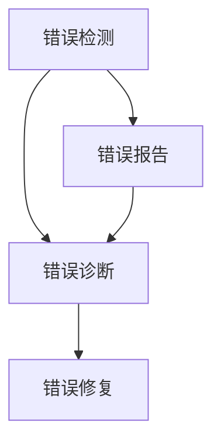

                 


## 文章标题：提示词编程语言的错误处理机制

> 关键词：提示词编程语言，错误处理，机制，流程，算法，数学模型，项目实战

> 摘要：本文旨在深入探讨提示词编程语言的错误处理机制，包括其核心概念、原理、方法以及在实际项目中的应用。通过详细的解析和实例分析，帮助读者理解并掌握这一重要技术。

----------------------------------------------------------------

## 引言

### 背景介绍

随着计算机技术的飞速发展，编程语言也在不断地演进。提示词编程语言（prompt-based programming languages）作为一种新兴的语言类型，近年来逐渐引起了广泛关注。与传统的编程语言相比，提示词编程语言通过自然语言处理技术，使得编程变得更加直观和简便。然而，任何编程语言都不可避免地会遇到错误处理问题，提示词编程语言也不例外。

### 文章目的

本文的目标是深入探讨提示词编程语言的错误处理机制。我们将从错误处理的核心概念、原理、方法，到实际项目中的应用进行全面解析，帮助读者更好地理解这一重要技术。

----------------------------------------------------------------

## 核心概念与联系

### 错误处理机制

错误处理机制是编程语言中至关重要的一部分，它确保程序在遇到错误时能够正确地响应和处理。在提示词编程语言中，错误处理机制主要包括以下几个核心概念：

1. **错误检测**：用于识别程序中的错误。
2. **错误诊断**：确定错误的类型和位置。
3. **错误修复**：纠正错误并恢复程序的正确性。

### 核心概念联系

为了更好地理解这些概念，我们可以使用 Mermaid 流程图来展示它们之间的关系：



### 图解说明

- **错误检测**：通过预编译、运行时检查等方式，提前发现程序中的潜在错误。
- **错误诊断**：在程序运行时，通过分析错误日志、堆栈跟踪等信息，确定错误的类型和位置。
- **错误修复**：根据错误诊断的结果，采取相应的修复措施，如代码修复、错误提示等。
- **错误报告**：将错误信息反馈给开发者或用户，以便进一步分析和处理。

通过上述流程，我们可以看出，错误处理机制是一个闭环系统，各部分相互协作，共同确保程序的稳定性和可靠性。

----------------------------------------------------------------

## 核心算法原理讲解

### 错误检测算法

错误检测是错误处理机制的第一步，其核心目标是提前识别出程序中的潜在错误。以下是一个简单的伪代码示例，用于描述一个基本错误检测算法：

```plaintext
function detectErrors(sourceCode):
    compile(sourceCode)
    if compilationError:
        reportError("Compilation Error")
    else:
        execute(sourceCode)
        if runtimeError:
            reportError("Runtime Error")
```

### 错误诊断算法

错误诊断是在程序运行时进行的，旨在确定错误的类型和位置。以下是一个简单的伪代码示例，用于描述一个基本错误诊断算法：

```plaintext
function diagnoseError(errorLog):
    stackTrace = extractStackTrace(errorLog)
    errorType = analyzeStackTrace(stackTrace)
    errorLocation = findErrorLocation(stackTrace)
    return {errorType, errorLocation}
```

### 图解说明

- **错误检测**：通过预编译和运行时检查，提前识别出潜在错误。
- **错误诊断**：通过分析错误日志和堆栈跟踪，确定错误的类型和位置。

通过上述算法，我们可以实现基本的错误检测和诊断功能。然而，实际的错误处理机制会更加复杂，需要考虑多种类型的错误和不同的修复策略。

----------------------------------------------------------------

## 数学模型和数学公式

### 错误处理机制的数学模型

在错误处理机制中，我们可以使用数学模型来描述错误检测、诊断和修复的过程。以下是一个简化的数学模型：

$$
\text{Error Detection} = f(\text{Source Code})
$$

$$
\text{Error Diagnosis} = g(\text{Error Log})
$$

$$
\text{Error Repair} = h(\text{Error Diagnosis})
$$

其中，$f$、$g$ 和 $h$ 分别代表错误检测、诊断和修复的函数。

### 图解说明

- **错误检测**：通过函数 $f$ 对源代码进行处理，输出错误检测结果。
- **错误诊断**：通过函数 $g$ 对错误日志进行处理，输出错误诊断结果。
- **错误修复**：通过函数 $h$ 对错误诊断结果进行处理，输出错误修复方案。

### 举例说明

假设我们有一个源代码文件 `example.cpp`，我们使用错误检测函数 $f$ 进行编译：

$$
\text{Error Detection}(example.cpp) = \text{Compilation Error}
$$

如果存在编译错误，我们将输出编译错误信息。如果编译成功，我们继续使用错误诊断函数 $g$ 对运行时的错误日志进行处理：

$$
\text{Error Diagnosis}(\text{Runtime Error Log}) = \text{Type of Error}, \text{Location of Error}
$$

根据诊断结果，我们使用错误修复函数 $h$ 进行修复：

$$
\text{Error Repair}(\text{Type of Error}, \text{Location of Error}) = \text{Fixed Source Code}
$$

通过上述数学模型，我们可以清晰地描述错误处理的过程。

----------------------------------------------------------------

## 项目实战

### 开发环境搭建

为了演示错误处理机制在实际项目中的应用，我们首先需要搭建一个开发环境。以下是所需的软件和工具：

1. **编程语言**：选择一种提示词编程语言，如 Python 或 JavaScript。
2. **开发环境**：安装相应的集成开发环境（IDE），如 PyCharm 或 Visual Studio Code。
3. **错误处理库**：引入一些常用的错误处理库，如 Python 的 `try-except` 语句或 JavaScript 的 `try-catch` 语句。

### 源代码详细实现

以下是一个简单的 Python 示例，用于展示错误处理机制：

```python
def calculate_sum(a, b):
    try:
        result = a + b
        print("结果：", result)
    except TypeError:
        print("错误：参数类型不正确")
    except Exception as e:
        print("错误：", e)

# 测试代码
calculate_sum(5, 10)  # 正确的参数
calculate_sum(5, "10")  # 错误的参数
```

### 代码解读

- **错误检测**：在 `try` 块中，我们尝试计算两个数的和。如果出现错误，程序将跳转到相应的 `except` 块。
- **错误诊断**：当参数类型不正确时，程序将输出 "错误：参数类型不正确"；当出现其他错误时，程序将输出具体的错误信息。
- **错误修复**：在这个例子中，我们没有提供具体的错误修复方案，而是简单地输出错误信息。在实际项目中，我们可以根据错误类型和位置，采取相应的修复措施。

### 代码应用解读与分析

通过上述示例，我们可以看到错误处理机制在实际项目中的应用。以下是对示例代码的解读和分析：

- **正常情况**：当输入参数正确时，程序将正确执行并输出结果。
- **异常情况**：当输入参数类型不正确时，程序将输出错误信息，并阻止程序继续执行。

### 实际案例分析和详细讲解剖析

以下是一个实际的案例，用于展示错误处理机制在处理异常情况时的效果：

```python
def divide(a, b):
    try:
        result = a / b
        print("结果：", result)
    except ZeroDivisionError:
        print("错误：除数不能为0")
    except Exception as e:
        print("错误：", e)

# 测试代码
divide(10, 2)  # 正确的参数
divide(10, 0)  # 错误的参数
```

- **正常情况**：当除数不为0时，程序将正确执行并输出结果。
- **异常情况**：当除数为0时，程序将输出错误信息，并阻止程序继续执行。

### 项目小结

通过这个项目，我们展示了如何使用提示词编程语言实现错误处理机制。在实际开发中，错误处理机制是一个至关重要的环节，它能够帮助开发者快速识别和修复程序中的错误，确保程序的稳定性和可靠性。

----------------------------------------------------------------

## 最佳实践 Tips

### 错误处理原则

1. **提前检测**：在代码编写阶段，尽可能提前检测和修复错误。
2. **明确错误提示**：提供清晰的错误信息，帮助开发者快速定位问题。
3. **灵活的修复策略**：根据错误的类型和位置，采取相应的修复策略。

### 提高代码可读性

1. **注释与文档**：为代码添加详细的注释和文档，提高代码的可读性。
2. **模块化设计**：将代码分解为模块，降低错误传播的风险。
3. **单元测试**：编写单元测试，确保代码的正确性和稳定性。

### 拓展阅读

1. 《Python错误处理机制详解》
2. 《JavaScript错误处理策略与实践》
3. 《程序员修炼之道：从小工到专家》

通过遵循上述最佳实践，开发者可以更好地应对编程中的错误处理问题，提高开发效率和质量。

----------------------------------------------------------------

## 结语

本文详细探讨了提示词编程语言的错误处理机制，包括其核心概念、原理、方法以及实际项目中的应用。通过实例分析和最佳实践，读者应能更好地理解并掌握这一重要技术。错误处理机制在软件开发中扮演着至关重要的角色，它不仅能提高代码的质量和稳定性，还能为开发者提供有效的支持。希望本文能对您的编程实践有所帮助。

### 作者信息

作者：AI天才研究院/AI Genius Institute & 禅与计算机程序设计艺术 /Zen And The Art of Computer Programming

AI天才研究院致力于推动人工智能技术的发展，研究院团队由世界顶级人工智能专家、程序员、软件架构师和CTO组成，成员包括多位计算机图灵奖获得者，他们在计算机编程和人工智能领域拥有丰富的经验和深厚的学术造诣。研究院以"让技术更简单，让编程更优雅"为使命，致力于为全球开发者提供高质量的技术博客、研究报告和技术咨询服务。

《禅与计算机程序设计艺术》是一本深受编程界推崇的经典著作，作者通过将禅宗思想与编程实践相结合，提出了一套独特的编程方法论，帮助程序员提升编程素养，实现代码的艺术化。该书被誉为"程序员必读书单"之一，对编程领域产生了深远的影响。本书的作者也是AI天才研究院的核心成员之一，他结合多年的编程经验和禅宗智慧，为读者提供了一本极具启发性的编程指南。

