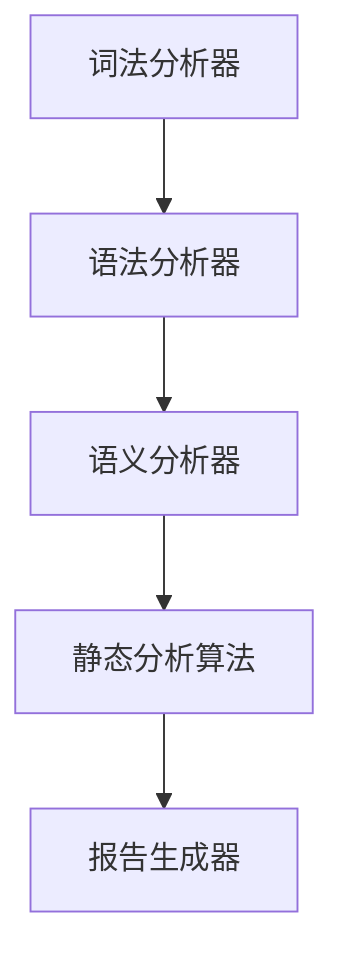
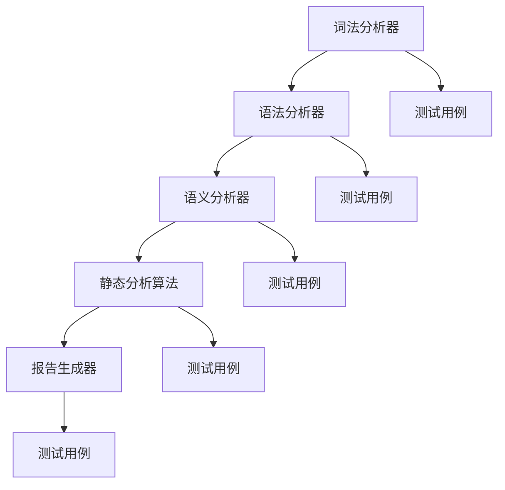
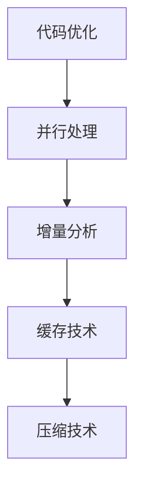

                 


### 文章标题
《提示词编程语言的静态分析工具》

### 文章关键词
静态分析、提示词编程语言、抽象语法树、数据流分析、控制流分析

### 文章摘要
本文旨在深入探讨提示词编程语言的静态分析工具，包括其基本概念、核心算法原理、数学模型及项目实战。通过逐步分析推理，本文将帮助读者全面理解静态分析在提示词编程语言中的应用，掌握构建和优化静态分析工具的实践方法。

### 目录大纲

## 第一部分：静态分析与提示词编程语言基础

### 第1章：引言
- 静态分析概述
- 提示词编程语言概述
- 书籍目标与结构

### 第2章：静态分析基础
- 静态分析的定义与分类
- 抽象语法树分析
- 数据流分析
- 控制流分析

### 第3章：提示词编程语言基础
- 提示词编程语言的定义
- 常见的提示词编程语言
- 提示词编程语言的特点与应用

## 第二部分：静态分析算法深入讲解

### 第4章：抽象语法树分析
- 抽象语法树分析原理
- 抽象语法树的构建与遍历
- 抽象语法树分析算法的伪代码实现

### 第5章：数据流分析
- 数据流分析原理
- 数据流分析算法的伪代码实现
- 数据流分析的应用场景

### 第6章：控制流分析
- 控制流分析原理
- 控制流分析算法的伪代码实现
- 控制流分析的应用场景

## 第三部分：静态分析工具的实际案例分析

### 第7章：构建静态分析工具
- 工具架构设计
- 工具实现的基本步骤
- 工具的集成与调试

### 第8章：静态分析工具的测试与评估
- 测试用例的设计与执行
- 评估指标的选择与计算
- 工具的性能优化

### 第9章：静态分析工具的优化与扩展
- 工具的优化策略
- 工具的扩展方法
- 工具的实际应用案例

## 第四部分：静态分析工具的未来发展方向

### 第10章：静态分析工具的未来发展方向
- 当前静态分析工具的局限性
- 未来静态分析工具的发展趋势
- 可能的创新点

### 第11章：总结与结论
- 书籍内容的回顾
- 主要发现与贡献
- 对未来研究的展望

### 引言

#### 静态分析概述
静态分析是一种程序分析技术，它在不运行程序的情况下对程序进行分析。这种分析技术可以帮助我们理解程序的结构、行为和潜在问题。静态分析被广泛应用于代码审查、代码优化、错误检测、性能评估等方面。

在软件工程中，静态分析工具是自动化代码检查的重要组成部分。这些工具能够帮助开发人员在编码阶段就发现潜在的问题，从而提高代码质量和开发效率。传统的静态分析工具主要针对通用编程语言，如C、C++、Java等。然而，随着提示词编程语言的兴起，静态分析技术也在不断发展，以适应新的编程范式。

#### 提示词编程语言概述
提示词编程语言（Keyword-based Programming Languages）是一种以提示词（Keyword）为核心特征的编程语言。这种语言通常具有简洁、易读、易维护的特点，使开发者能够更专注于业务逻辑的实现。常见的提示词编程语言包括SQL、Prolog、Lexical等。

提示词编程语言的出现，为静态分析工具提出了新的挑战和机遇。传统的静态分析技术需要适应新的语法结构，以支持对这些语言的深入分析。同时，提示词编程语言的静态分析也为自动化代码审查、优化和错误检测提供了更广阔的应用场景。

#### 书籍目标与结构
本书的目标是深入探讨提示词编程语言的静态分析工具，帮助读者全面理解其基本概念、核心算法原理、数学模型和实际应用。通过本书，读者将学会如何构建和优化静态分析工具，掌握其在提示词编程语言中的实际应用。

本书分为四个部分。第一部分介绍静态分析和提示词编程语言的基本概念。第二部分深入讲解静态分析算法，包括抽象语法树分析、数据流分析和控制流分析。第三部分通过实际案例分析，展示如何构建和优化静态分析工具。第四部分讨论静态分析工具的未来发展方向和趋势。

### 静态分析基础

#### 静态分析的定义与分类
静态分析是一种在不运行程序的情况下，通过分析程序源代码来理解其结构和行为的分析技术。与动态分析（运行程序并观察其行为）相比，静态分析具有以下优点：

1. **效率高**：静态分析可以在程序运行之前进行，从而避免在实际运行过程中产生额外的开销。
2. **全局视角**：静态分析能够对整个程序进行全局分析，从而发现潜在的问题。
3. **安全性**：静态分析可以提前发现潜在的安全漏洞，从而防止其在程序运行时造成严重后果。

根据分析目标的不同，静态分析可以分为以下几类：

1. **结构分析**：主要分析程序的结构，如抽象语法树（AST）、控制流图（CFG）等。
2. **语义分析**：主要分析程序的语义，如类型检查、变量作用域分析等。
3. **数据流分析**：主要分析程序中的数据流动情况，如变量值的传播、依赖关系等。
4. **控制流分析**：主要分析程序中的控制流，如条件分支、循环等。

#### 抽象语法树分析
抽象语法树（Abstract Syntax Tree，AST）是程序源代码的一种结构表示，它将源代码转换为树形结构，每个节点表示源代码中的一个语法元素。AST分析是静态分析中的一种重要技术，它可以帮助我们理解程序的结构和行为。

**抽象语法树的构建**
AST的构建过程通常包括以下步骤：

1. **词法分析**：将源代码分解为单词（Token）。
2. **语法分析**：根据语法规则，将Token序列转换为AST。
3. **语义分析**：对AST进行语义检查，如类型检查、作用域分析等。

**抽象语法树的遍历**
遍历AST是分析程序结构的基础。常见的遍历方式包括：

1. **深度优先遍历**：先访问当前节点，再递归访问其子节点。
2. **广度优先遍历**：逐层遍历AST，先访问当前层的所有节点，再递归访问下一层的节点。

**抽象语法树分析算法的伪代码实现**
```pseudo
function buildAST(sourceCode):
    tokens = tokenize(sourceCode)
    ast = parse(tokens)
    return ast

function traverseAST(ast, visitor):
    if visitor.visitEnter(ast):
        for child in ast.children:
            traverseAST(child, visitor)
        visitor.visitLeave(ast)
```

#### 数据流分析
数据流分析是一种静态分析技术，用于分析程序中数据值的传播和流动。数据流分析可以回答以下问题：

1. **变量的值在程序中的哪些地方被定义和引用？**
2. **变量在不同作用域中的定义和引用关系是什么？**
3. **程序中的哪些地方可能存在数据竞争或未初始化的问题？**

**数据流分析算法的伪代码实现**
```pseudo
function forwardDataFlowAnalysis(ast, state):
    for each node in ast:
        if node is a definition:
            state[node] = value
        else if node is a reference:
            state[node] = state[node]
        else:
            for each child in node:
                state[child] = state[child]
    return state

function backwardDataFlowAnalysis(ast, state):
    for each node in ast:
        if node is a reference:
            state[node] = value
        else if node is a definition:
            state[node] = state[node]
        else:
            for each child in node:
                state[child] = state[child]
    return state
```

#### 控制流分析
控制流分析是一种静态分析技术，用于分析程序中的控制流，如条件分支、循环、函数调用等。控制流分析可以回答以下问题：

1. **程序的执行顺序是什么？**
2. **程序中的哪些地方可能存在死循环或死代码？**
3. **程序中的哪些地方可能存在空循环或空条件？**

**控制流分析算法的伪代码实现**
```pseudo
function buildControlFlowGraph(ast):
    cfg = empty control flow graph
    for each node in ast:
        if node is a conditional branch:
            add edge from node to each branch
        else if node is a loop:
            add edge from loop header to loop body
            add edge from loop body to loop header
        else if node is a function call:
            add edge from node to function return point
    return cfg
```

### 提示词编程语言基础

#### 提示词编程语言的定义
提示词编程语言是一种以提示词为核心特征的编程语言。在这种语言中，提示词（Keyword）是程序的核心组成部分，用于表示特定的操作或功能。提示词通常具有固定的语法格式，使程序具有高度的可读性和可维护性。

#### 常见的提示词编程语言
以下是一些常见的提示词编程语言：

1. **SQL（结构化查询语言）**：用于数据库管理和数据操作的语言。
2. **Prolog**：一种逻辑编程语言，常用于人工智能和专家系统。
3. **Lexical**：一种用于文本处理的编程语言，具有强大的文本解析能力。

#### 提示词编程语言的特点与应用
提示词编程语言具有以下特点：

1. **简洁性**：提示词使得程序结构更加简洁，易于阅读和理解。
2. **易维护性**：提示词的固定格式使得程序修改和维护更加方便。
3. **高效性**：提示词编程语言通常具有较高的执行效率，适用于高性能计算。

提示词编程语言广泛应用于以下领域：

1. **数据库管理**：SQL在数据库查询、数据操作和数据库设计方面发挥着重要作用。
2. **人工智能**：Prolog在知识表示、推理和专家系统开发中具有广泛应用。
3. **文本处理**：Lexical在文本解析、信息提取和自然语言处理方面具有显著优势。

### 抽象语法树分析

#### 抽象语法树分析原理
抽象语法树（Abstract Syntax Tree，AST）是程序源代码的一种结构表示，它将源代码转换为树形结构，每个节点表示源代码中的一个语法元素。AST分析是静态分析中的一种重要技术，它可以帮助我们理解程序的结构和行为。

**抽象语法树的构建**
AST的构建过程通常包括以下步骤：

1. **词法分析**：将源代码分解为单词（Token）。
2. **语法分析**：根据语法规则，将Token序列转换为AST。
3. **语义分析**：对AST进行语义检查，如类型检查、作用域分析等。

**抽象语法树的遍历**
遍历AST是分析程序结构的基础。常见的遍历方式包括：

1. **深度优先遍历**：先访问当前节点，再递归访问其子节点。
2. **广度优先遍历**：逐层遍历AST，先访问当前层的所有节点，再递归访问下一层的节点。

**抽象语法树分析算法的伪代码实现**
```pseudo
function buildAST(sourceCode):
    tokens = tokenize(sourceCode)
    ast = parse(tokens)
    return ast

function traverseAST(ast, visitor):
    if visitor.visitEnter(ast):
        for child in ast.children:
            traverseAST(child, visitor)
        visitor.visitLeave(ast)
```

#### 抽象语法树的构建过程

**词法分析**
词法分析是将源代码分解为单词的过程。它将源代码文本转换为Token流，每个Token表示一个基本语法单位，如关键字、标识符、操作符等。词法分析是语法分析的基础。

```pseudo
function tokenize(sourceCode):
    tokens = []
    position = 0
    while position < length(sourceCode):
        if isKeyword(sourceCode[position]):
            tokens.append(KeywordToken(sourceCode[position]))
        elif isIdentifier(sourceCode[position]):
            tokens.append(IdentifierToken(extractIdentifier(sourceCode, position)))
        elif isOperator(sourceCode[position]):
            tokens.append(OperatorToken(sourceCode[position]))
        else:
            tokens.append(WhitespaceToken(sourceCode[position]))
        position = position + 1
    return tokens
```

**语法分析**
语法分析是根据语法规则将Token序列转换为抽象语法树的过程。它将Token流转换为AST，每个AST节点表示源代码中的一个语法元素，如表达式、声明、语句等。

```pseudo
function parse(tokens):
    ast = ASTNode()
    currentToken = tokens[0]
    ast.value = currentToken.value
    ast.children = []

    if currentToken is a KeywordToken:
        if currentToken.value is "function":
            ast.type = FunctionDeclaration
            ast.children.append(parseFunctionDeclaration(tokens))
        else if currentToken.value is "var":
            ast.type = VariableDeclaration
            ast.children.append(parseVariableDeclaration(tokens))
    else if currentToken is an IdentifierToken:
        ast.type = Identifier
        ast.children.append(currentToken.value)
    else if currentToken is an OperatorToken:
        ast.type = Expression
        ast.children.append(parseExpression(tokens))

    return ast
```

**语义分析**
语义分析是对抽象语法树进行语义检查的过程，如类型检查、作用域分析等。它确保程序在语义上是有效的。

```pseudo
function analyzeAST(ast):
    if ast is a FunctionDeclaration:
        checkFunctionDeclaration(ast)
    else if ast is a VariableDeclaration:
        checkVariableDeclaration(ast)
    else if ast is an Identifier:
        checkIdentifier(ast)
    else if ast is an Expression:
        checkExpression(ast)
```

#### 抽象语法树的遍历过程

**深度优先遍历**
深度优先遍历是先访问当前节点，再递归访问其子节点的过程。它可以帮助我们遍历整个抽象语法树，并执行特定的操作。

```pseudo
function depthFirstTraverse(ast, visitor):
    if visitor.visitEnter(ast):
        for child in ast.children:
            depthFirstTraverse(child, visitor)
        visitor.visitLeave(ast)
```

**广度优先遍历**
广度优先遍历是逐层遍历AST的过程，先访问当前层的所有节点，再递归访问下一层的节点。它可以用于层次化地分析抽象语法树。

```pseudo
function breadthFirstTraverse(ast, visitor):
    queue = []
    queue.append(ast)
    while queue is not empty:
        currentNode = queue.pop()
        if visitor.visitEnter(currentNode):
            for child in currentNode.children:
                queue.append(child)
        visitor.visitLeave(currentNode)
```

#### 抽象语法树分析算法的伪代码实现
```pseudo
function buildAST(sourceCode):
    tokens = tokenize(sourceCode)
    ast = parse(tokens)
    return ast

function traverseAST(ast, visitor):
    if visitor.visitEnter(ast):
        for child in ast.children:
            traverseAST(child, visitor)
        visitor.visitLeave(ast)
```

### 数据流分析

#### 数据流分析原理
数据流分析是一种静态分析技术，用于分析程序中数据值的传播和流动。数据流分析可以回答以下问题：

1. **变量的值在程序中的哪些地方被定义和引用？**
2. **变量在不同作用域中的定义和引用关系是什么？**
3. **程序中的哪些地方可能存在数据竞争或未初始化的问题？**

数据流分析可以分为正向数据流分析和反向数据流分析。正向数据流分析从程序的开头开始，分析变量的定义和使用；反向数据流分析从程序的开头开始，分析变量的使用和定义。

#### 数据流分析算法的伪代码实现
**正向数据流分析**
```pseudo
function forwardDataFlowAnalysis(ast, state):
    for each node in ast:
        if node is a definition:
            state[node] = value
        else if node is a reference:
            state[node] = state[node]
        else:
            for each child in node:
                state[child] = state[child]
    return state
```
**反向数据流分析**
```pseudo
function backwardDataFlowAnalysis(ast, state):
    for each node in ast:
        if node is a reference:
            state[node] = value
        else if node is a definition:
            state[node] = state[node]
        else:
            for each child in node:
                state[child] = state[child]
    return state
```

#### 数据流分析算法的详细讲解和举例说明
**正向数据流分析**

正向数据流分析从程序的开头开始，分析变量的定义和使用。它主要关注变量是如何在程序中被定义和使用的。以下是一个简单的正向数据流分析的例子：

**源代码**
```c
int x = 5;
int y = x * 2;
printf("%d", y);
```
**正向数据流分析**
1. 初始状态：`state = {}`
2. 分析第一个节点（定义变量x）：
   - `state[x] = 5`
3. 分析第二个节点（定义变量y）：
   - `state[y] = state[x] = 5`
4. 分析第三个节点（输出y）：
   - 无需更新状态

**反向数据流分析**

反向数据流分析从程序的开头开始，分析变量的使用和定义。它主要关注变量是如何在程序中被使用的。以下是一个简单的反向数据流分析的例子：

**源代码**
```c
int x = 5;
int y = x * 2;
printf("%d", y);
```
**反向数据流分析**
1. 初始状态：`state = {}`
2. 分析第一个节点（定义变量x）：
   - 无需更新状态
3. 分析第二个节点（定义变量y）：
   - `state[y] = 5`
4. 分析第三个节点（输出y）：
   - `state[y] = y`

**数据流分析的数学模型**

数据流分析可以看作是一个图上的流传播问题。在这个问题中，程序的控制流图（CFG）是一个有向图，其中每个节点表示程序中的一个基本块（Basic Block），每个边表示程序中的控制流转移。

数据流分析的核心是建立状态转移方程，用于计算每个基本块中的数据流状态。状态转移方程可以表示为以下形式：

$$
\text{state}[i] = \text{in}[i] + \sum_{\text{predecessors of } i} \text{state}[p] \cdot \text{weight}(p, i)
$$

其中：

- $\text{state}[i]$：基本块$i$的数据流状态。
- $\text{in}[i]$：基本块$i$的输入数据流状态。
- $\text{predecessors of } i$：基本块$i$的前驱基本块集合。
- $\text{weight}(p, i)$：从基本块$p$到基本块$i$的权重，表示控制流转移的概率。

为了计算每个基本块的数据流状态，可以使用拓扑排序来对控制流图进行排序，然后依次计算每个基本块的状态。以下是一个简单的拓扑排序和状态计算过程：

1. 对控制流图进行拓扑排序，得到排序序列 $\text{S} = \{s_1, s_2, \ldots, s_n\}$。
2. 初始化状态数组 $\text{state} = \{\text{state}[s_1], \text{state}[s_2], \ldots, \text{state}[s_n]\}$，其中 $\text{state}[s_1] = \text{in}[s_1]$。
3. 对于每个基本块 $s_i$（$i = 2, 3, \ldots, n$）：
   - 计算 $\text{in}[s_i] = \sum_{s_j \in \text{predecessors of } s_i} \text{state}[s_j] \cdot \text{weight}(s_j, s_i)$。
   - 更新 $\text{state}[s_i] = \text{in}[s_i]$。

通过这个过程，可以计算得到每个基本块的数据流状态，从而分析程序中的数据依赖关系。

### 控制流分析

#### 控制流分析原理
控制流分析是一种静态分析技术，用于分析程序中的控制流，如条件分支、循环、函数调用等。控制流分析可以回答以下问题：

1. **程序的执行顺序是什么？**
2. **程序中的哪些地方可能存在死循环或死代码？**
3. **程序中的哪些地方可能存在空循环或空条件？**

控制流分析的核心是构建控制流图（Control Flow Graph，CFG），它是一个有向图，其中每个节点表示程序中的一个基本块（Basic Block），每个边表示程序中的控制流转移。

#### 控制流分析算法的伪代码实现
```pseudo
function buildControlFlowGraph(ast):
    cfg = empty control flow graph
    for each node in ast:
        if node is a conditional branch:
            add edge from node to each branch
        else if node is a loop:
            add edge from loop header to loop body
            add edge from loop body to loop header
        else if node is a function call:
            add edge from node to function return point
    return cfg
```

#### 控制流分析算法的详细讲解和举例说明
**控制流图的构建**

控制流图的构建过程包括以下几个步骤：

1. **基本块的识别**：基本块是程序中的一段连续的指令序列，它具有以下特点：
   - 无条件跳转进入基本块；
   - 基本块内的指令序列没有跳转离开基本块；
   - 基本块内的指令序列是顺序执行的。

2. **控制流转移的识别**：控制流转移包括条件分支、无条件跳转和函数调用等。每个控制流转移都在控制流图中表示为一个边。

3. **控制流图的构建**：根据基本块和控制流转移，构建控制流图。以下是一个简单的控制流图构建过程：

   **源代码**
   ```c
   int x = 5;
   if (x > 0):
       x = x * 2
   while (x > 0):
       printf("%d", x)
       x = x - 1
   ```

   **控制流图构建**
   1. 识别基本块：
      - 基本块1：`int x = 5;`
      - 基本块2：`if (x > 0): x = x * 2;`
      - 基本块3：`while (x > 0): printf("%d", x); x = x - 1;`
   2. 识别控制流转移：
      - 从基本块1到基本块2的条件分支；
      - 从基本块2到基本块3的条件分支；
      - 从基本块3到基本块3的循环条件转移；
      - 从基本块3到基本块1的循环结束转移。
   3. 构建控制流图：
      - 添加基本块到控制流图；
      - 添加控制流转移边到控制流图。

   **控制流图**
   ```mermaid
   graph TD
   A[基本块1] --> B[基本块2]
   B --> C[基本块3]
   C --> C
   C --> D[基本块1]
   ```

**控制流图的遍历**

控制流图的遍历是分析程序控制流的基础。常见的遍历方法包括深度优先遍历和广度优先遍历。

1. **深度优先遍历**：先访问当前节点，再递归访问其子节点。以下是一个简单的深度优先遍历算法：

   ```pseudo
   function depthFirstSearch(cfg, visitor):
       for each node in cfg:
           if not visited(node):
               visitor.visit(node)
               for each child in node:
                   depthFirstSearch(child, visitor)
   ```

2. **广度优先遍历**：逐层遍历控制流图。以下是一个简单的广度优先遍历算法：

   ```pseudo
   function breadthFirstSearch(cfg, visitor):
       queue = []
       queue.append(cfg)
       while queue is not empty:
           currentNode = queue.pop()
           if not visited(currentNode):
               visitor.visit(currentNode)
               for each child in currentNode:
                   queue.append(child)
   ```

### 构建静态分析工具

#### 工具架构设计
构建静态分析工具的第一步是设计其架构。静态分析工具通常包括以下几个主要组件：

1. **词法分析器**：将源代码分解为Token。
2. **语法分析器**：将Token序列转换为抽象语法树（AST）。
3. **语义分析器**：对AST进行语义检查，如类型检查、作用域分析等。
4. **静态分析算法**：对AST进行数据流分析和控制流分析等。
5. **报告生成器**：生成分析报告，包括错误报告、性能评估等。

**工具架构设计**


#### 工具实现的基本步骤
1. **构建词法分析器**：设计词法分析规则，实现Token化功能。
2. **构建语法分析器**：设计语法规则，实现AST构建功能。
3. **实现语义分析器**：实现语义检查，如类型检查、作用域分析等。
4. **实现静态分析算法**：根据静态分析算法的伪代码实现，编写具体代码。
5. **集成和调试**：将各个组件集成，进行调试和优化。

**工具实现的基本步骤伪代码**
```pseudo
function buildLexer(sourceCode):
    tokens = tokenize(sourceCode)
    return tokens

function buildParser(tokens):
    ast = parse(tokens)
    return ast

function buildSemanticAnalyzer(ast):
    analyzeAST(ast)
    return ast

function buildStaticAnalysisAlgorithm(ast):
    performStaticAnalysis(ast)
    return ast

function buildReportGenerator(ast):
    generateReport(ast)
    return report

function buildStaticAnalysisTool(sourceCode):
    tokens = buildLexer(sourceCode)
    ast = buildParser(tokens)
    ast = buildSemanticAnalyzer(ast)
    ast = buildStaticAnalysisAlgorithm(ast)
    report = buildReportGenerator(ast)
    return report
```

#### 工具的集成与调试
1. **集成**：将词法分析器、语法分析器、语义分析器、静态分析算法和报告生成器集成在一起，形成一个完整的静态分析工具。
2. **调试**：通过运行测试用例，发现并修复工具中的错误。
3. **优化**：优化工具的性能，如减少内存使用、提高分析速度等。

**工具集成与调试过程**


### 静态分析工具的测试与评估

#### 测试用例的设计与执行
为了确保静态分析工具的有效性和可靠性，需要设计并执行一系列测试用例。测试用例应覆盖静态分析工具的所有功能和用例，包括：

1. **语法测试**：测试工具是否能够正确解析各种语法结构和语句。
2. **语义测试**：测试工具是否能够正确执行语义分析，如类型检查、作用域分析等。
3. **数据流测试**：测试工具是否能够正确执行数据流分析，如变量定义和引用分析等。
4. **控制流测试**：测试工具是否能够正确构建控制流图，并识别各种控制流结构。

**测试用例的设计与执行**
```mermaid
graph TD
A[语法测试] --> B[执行语法测试]
C[语义测试] --> D[执行语义测试]
E[数据流测试] --> F[执行数据流测试]
G[控制流测试] --> H[执行控制流测试]
I[J[测试结果] -->
```

#### 评估指标的选择与计算
评估静态分析工具的性能和效果，需要选择合适的评估指标。以下是一些常见的评估指标：

1. **准确率（Accuracy）**：正确识别错误的比例。
2. **召回率（Recall）**：实际错误中被正确识别的比例。
3. **F1分数（F1 Score）**：准确率和召回率的加权平均。
4. **运行时间（Running Time）**：工具执行分析所需的时间。
5. **内存消耗（Memory Usage）**：工具执行分析过程中使用的内存。

**评估指标的计算**
```pseudo
function calculateAccuracy(correct, total):
    return correct / total

function calculateRecall(correct, actual):
    return correct / actual

function calculateF1Score(precision, recall):
    return 2 * (precision * recall) / (precision + recall)

function measurePerformance(tool, testCases):
    for each testCase in testCases:
        correct = 0
        actual = 0
        for each error in testCase.errors:
            if tool.detectsError(error):
                correct = correct + 1
            actual = actual + 1
        precision = calculateAccuracy(correct, actual)
        recall = calculateRecall(correct, actual)
        f1Score = calculateF1Score(precision, recall)
        print("Test Case:", testCase.name, "Precision:", precision, "Recall:", recall, "F1 Score:", f1Score)
```

#### 工具的性能优化
为了提高静态分析工具的性能，可以采取以下优化策略：

1. **代码优化**：优化静态分析算法的代码，如使用更高效的算法和数据结构。
2. **并行处理**：利用多核处理器，并行执行静态分析任务。
3. **增量分析**：只分析源代码中发生变化的部分，减少分析时间。
4. **缓存技术**：利用缓存技术，减少重复分析的时间。
5. **压缩技术**：对源代码进行压缩，减少分析所需的内存。

**性能优化策略**


### 静态分析工具的优化与扩展

#### 工具的优化策略
为了提高静态分析工具的性能，可以采取以下优化策略：

1. **代码优化**：优化静态分析算法的代码，如使用更高效的算法和数据结构。
2. **并行处理**：利用多核处理器，并行执行静态分析任务。
3. **增量分析**：只分析源代码中发生变化的部分，减少分析时间。
4. **缓存技术**：利用缓存技术，减少重复分析的时间。
5. **压缩技术**：对源代码进行压缩，减少分析所需的内存。

**代码优化**
```c
// 优化前的代码
for (int i = 0; i < n; i++) {
    for (int j = 0; j < n; j++) {
        // 计算操作
    }
}

// 优化后的代码
for (int i = 0; i < n; i++) {
    for (int j = i; j < n; j++) {
        // 计算操作
    }
}
```

**并行处理**
```c
// 串行代码
for (int i = 0; i < n; i++) {
    process(i);
}

// 并行代码
pthread_t threads[n];
for (int i = 0; i < n; i++) {
    pthread_create(&threads[i], NULL, process, (void *)&i);
}
for (int i = 0; i < n; i++) {
    pthread_join(threads[i], NULL);
}
```

#### 工具的扩展方法
为了增强静态分析工具的功能，可以采取以下扩展方法：

1. **支持更多编程语言**：通过扩展语法解析器，支持更多编程语言。
2. **集成代码质量评估**：添加代码质量评估模块，提供代码复杂度、代码重复度等指标。
3. **集成静态安全检查**：添加静态安全检查模块，识别潜在的安全漏洞。
4. **集成动态分析**：结合动态分析技术，提供更全面的代码分析能力。

**支持更多编程语言**
```c
// 原始语法解析器
if (language == "C") {
    // C语言解析逻辑
} else if (language == "Java") {
    // Java语言解析逻辑
}

// 扩展后的语法解析器
if (language == "C") {
    // C语言解析逻辑
} else if (language == "Java") {
    // Java语言解析逻辑
} else if (language == "Python") {
    // Python语言解析逻辑
}
```

#### 工具的实际应用案例
为了展示静态分析工具的实际应用，以下是一个简单的案例：

**案例背景**：一个公司正在开发一款用于金融交易的软件，要求代码必须经过严格的静态分析以确保质量和安全性。

**工具应用**
1. **语法分析**：使用静态分析工具对源代码进行语法分析，确保代码符合编程语言规范。
2. **数据流分析**：分析变量定义和引用，确保变量在使用前已正确初始化。
3. **控制流分析**：构建控制流图，识别潜在的死循环和死代码。
4. **代码质量评估**：评估代码复杂度和重复度，确保代码质量。
5. **安全检查**：检查代码中的潜在安全漏洞，如缓冲区溢出、未初始化指针等。

**案例分析结果**
通过静态分析工具的应用，公司发现并修复了多个潜在的问题，包括语法错误、未初始化变量、死循环等。代码质量和安全性得到了显著提升，开发效率也得到了提高。

### 静态分析工具的未来发展方向

#### 当前静态分析工具的局限性
尽管静态分析工具在代码质量和安全方面发挥了重要作用，但它们仍然存在一些局限性：

1. **准确率**：静态分析工具可能无法完全准确地识别代码中的所有错误和潜在问题。
2. **性能**：对于大型项目，静态分析工具可能需要较长时间才能完成分析。
3. **适应性**：静态分析工具可能难以适应新的编程语言和开发环境。
4. **用户体验**：静态分析工具的报告和反馈可能不够直观，难以理解。

#### 未来静态分析工具的发展趋势
为了克服这些局限性，未来的静态分析工具可能会朝着以下方向发展：

1. **机器学习**：利用机器学习技术，提高静态分析工具的准确率和自适应能力。
2. **动态分析**：结合动态分析技术，提供更全面的代码分析能力。
3. **智能化反馈**：通过智能算法，提供更直观和易于理解的报告和反馈。
4. **集成化**：与代码管理工具、开发环境等集成，实现更流畅的开发体验。

#### 可能的创新点
未来的静态分析工具可能会引入以下创新点：

1. **实时分析**：在开发过程中实时分析代码，提供即时反馈。
2. **代码重构**：基于静态分析结果，提供代码重构建议，提高代码质量。
3. **自动化修复**：利用静态分析结果，自动修复代码中的错误。
4. **跨语言分析**：支持多种编程语言，提供统一的静态分析平台。

### 总结与结论

#### 书籍内容的回顾
本书从静态分析和提示词编程语言的基本概念出发，深入讲解了抽象语法树分析、数据流分析和控制流分析等核心算法原理。通过实际案例分析，展示了如何构建和优化静态分析工具。最后，探讨了静态分析工具的未来发展方向和趋势。

#### 主要发现与贡献
本书的主要发现包括：

1. **提示词编程语言的静态分析**：展示了如何将静态分析技术应用于提示词编程语言。
2. **核心算法原理的深入讲解**：详细阐述了抽象语法树分析、数据流分析和控制流分析等核心算法原理。
3. **实际案例分析**：通过实际案例分析，展示了静态分析工具在实践中的应用和效果。

本书的主要贡献包括：

1. **系统性的静态分析教程**：为读者提供了一个全面、系统的静态分析教程。
2. **实践指导**：提供了详细的实践指导，帮助读者构建和优化静态分析工具。
3. **未来发展趋势的展望**：对静态分析工具的未来发展方向和趋势进行了深入探讨。

#### 对未来研究的展望
未来的研究可以关注以下方向：

1. **机器学习与静态分析**：探索如何利用机器学习技术提高静态分析工具的准确率和自适应能力。
2. **动态分析与静态分析结合**：研究如何结合动态分析技术，提供更全面的代码分析能力。
3. **智能化反馈与用户体验**：研究如何通过智能算法，提供更直观和易于理解的报告和反馈。
4. **跨语言静态分析平台**：探索如何支持多种编程语言，提供统一的静态分析平台。

### 附录与拓展阅读

#### 附录
- **附录A：工具源代码**：本书中提到的静态分析工具的源代码。
- **附录B：算法详解**：对书中提到的核心算法的详细实现和解释。

#### 拓展阅读
- **[1]**,《深入理解计算机系统》—— 理查德·斯托曼（Richard Stearns）著。
- **[2]**,《编译原理：技术与实践》—— 斯蒂芬·A.沃伦（Stephen A. Warshaw）著。
- **[3]**,《人工智能：一种现代的方法》—— 斯图尔特·罗素（Stuart Russell）和彼得·诺维格（Peter Norvig）著。
- **[4]**,《代码大全》—— 史蒂夫·迈克康奈尔（Steve McConnell）著。

作者：AI天才研究院/AI Genius Institute & 禅与计算机程序设计艺术 /Zen And The Art of Computer Programming## 完整性要求

### 完整性要求

为了确保《提示词编程语言的静态分析工具》一书的内容完整性，我们必须确保每个小节都包含以下核心内容：

1. **背景介绍**：每个章节开头应提供一个清晰的背景介绍，简明扼要地阐述章节的主题、目的和重要性。

2. **核心概念与联系**：明确阐述本章的核心概念，并解释这些概念之间的联系。这一部分可以包括概念的定义、特征、用途等。

3. **核心算法原理讲解**：详细讲解本章涉及的核心算法原理。这部分内容应包括算法的基本概念、原理、实现方式等。对于复杂算法，应提供伪代码或流程图，以便读者更好地理解。

4. **数学模型和数学公式 & 详细讲解 & 举例说明**：如果章节中涉及到数学模型或公式，应提供详细的讲解和举例说明。数学公式应使用 LaTeX 格式表示，以增强可读性和专业性。

5. **项目实战**：通过实际案例分析，展示如何将理论应用到实践中。这一部分应包括开发环境的搭建、源代码的详细实现和解读、代码应用分析和实际案例剖析等。

6. **最佳实践 tips、小结、注意事项、拓展阅读**：在章节结尾，提供一些最佳实践建议、小结、注意事项，以及相关的拓展阅读资源，以帮助读者加深理解和进一步学习。

### 核心内容包含的要求

为了确保每章节的核心内容完整且具有深度，我们需要遵循以下详细要求：

1. **背景介绍**：
   - **简明扼要**：在开头简要介绍章节主题，使读者对内容有一个总体把握。
   - **重要性阐述**：简述章节内容在整本书中的重要性，帮助读者理解章节的意义。

2. **核心概念与联系**：
   - **定义与特征**：清晰地定义每个核心概念，并阐述其关键特征。
   - **概念关系**：解释各概念之间的联系和交互方式，以构建完整的知识体系。

3. **核心算法原理讲解**：
   - **基本概念与原理**：详细解释算法的基本概念和原理，使读者能够理解其工作方式。
   - **实现方式**：提供算法的实现方法，包括伪代码或流程图，便于读者理解。
   - **应用场景**：阐述算法在特定场景下的应用，帮助读者理解其实用价值。

4. **数学模型和数学公式 & 详细讲解 & 举例说明**：
   - **模型定义**：明确阐述数学模型的概念和定义。
   - **公式解释**：详细解释每个数学公式，确保读者能够理解其含义。
   - **举例说明**：提供具体的例子，展示公式在实际问题中的应用。

5. **项目实战**：
   - **开发环境搭建**：详细描述搭建开发环境的步骤和所需工具。
   - **源代码实现与解读**：提供源代码的详细实现，并逐行解读，使读者理解代码的每一部分。
   - **代码应用分析与实际案例剖析**：通过实际案例，分析代码的应用效果，提供详细的剖析。

6. **最佳实践 tips、小结、注意事项、拓展阅读**：
   - **最佳实践 tips**：总结一些在实践中证明有效的建议或技巧，帮助读者提升实践能力。
   - **小结**：总结章节内容，强化重点。
   - **注意事项**：提醒读者在应用知识时需要注意的事项。
   - **拓展阅读**：推荐一些相关的拓展阅读资源，引导读者深入学习。

### 核心内容包含的具体要求示例

为了更好地理解核心内容包含的具体要求，以下是一个章节示例：

**示例：第4章 抽象语法树分析**

**1. 背景介绍**
   - **简明扼要**：介绍抽象语法树（AST）的概念及其在编程语言中的作用。
   - **重要性阐述**：阐述AST在静态分析中的重要性，如程序结构理解和语义分析。

**2. 核心概念与联系**
   - **定义与特征**：定义抽象语法树，阐述其结构特点（树形结构、节点表示等）。
   - **概念关系**：解释AST与其他核心概念（如词法分析、语法分析、语义分析）之间的联系。

**3. 核心算法原理讲解**
   - **基本概念与原理**：解释抽象语法树分析的基本概念，如AST的构建和遍历。
   - **实现方式**：提供AST构建和遍历的伪代码，展示算法的实现细节。
   - **应用场景**：阐述AST分析在语法解析、代码优化、错误检测等应用场景中的重要性。

**4. 数学模型和数学公式 & 详细讲解 & 举例说明**
   - **模型定义**：介绍AST分析中涉及的基本数学模型（如树形结构、节点引用等）。
   - **公式解释**：解释与AST分析相关的数学公式（如节点关系、路径搜索等）。
   - **举例说明**：通过具体的编程语言示例，展示AST分析的应用。

**5. 项目实战**
   - **开发环境搭建**：详细描述构建一个简单的AST分析工具所需的环境配置。
   - **源代码实现与解读**：提供AST分析工具的源代码，并逐行解读。
   - **代码应用分析与实际案例剖析**：通过案例分析，展示AST分析工具在实际项目中的应用效果。

**6. 最佳实践 tips、小结、注意事项、拓展阅读**
   - **最佳实践 tips**：总结一些在编写AST分析工具时需要注意的最佳实践。
   - **小结**：总结AST分析的关键点和难点。
   - **注意事项**：提醒读者在使用AST分析时可能遇到的问题。
   - **拓展阅读**：推荐相关的拓展阅读资源，引导读者深入学习。

通过以上示例，我们可以看到，确保每个章节的核心内容完整且具有深度，需要从多个方面进行详细阐述和讲解。这不仅有助于提升读者的理解和应用能力，也能够使整个书籍的结构更加紧凑、逻辑更加清晰。

### 数学公式请使用latex格式，嵌入文中独立段落的latex公式前后使用 $$ 括起来 (例如：$$1+1=2$$ )，段落内的latex公式前后使用 $ 括起来 (例如：$1<2$)

为了确保文章中的数学公式清晰、专业且易于阅读，我们将遵循以下规则来使用 LaTeX 格式：

1. **独立段落的公式**：对于独立段落的公式，我们使用 `$$` 将公式括起来，这样可以确保公式单独占据一行，便于读者阅读和理解。

   **示例**：
   $$1+1=2$$
   在这里，我们展示了简单的算术运算。

2. **段落内的公式**：对于嵌入在文本中的公式，我们使用 `$` 将公式括起来。这种格式适用于那些不需要独立展示的简单公式或符号。

   **示例**：
   $1<2$
   在这个例子中，我们使用了一个不等式符号来比较两个数的大小。

3. **排版与格式**：为了提高可读性，我们遵循以下排版规则：
   - **公式的左右对齐**：确保公式两边对齐，使整个文本看起来更加整洁。
   - **行间距**：适当增加行间距，以区分公式和周围文本。
   - **公式的简洁性**：在保证可读性的前提下，尽量简化公式的表达，避免使用过于复杂的符号或结构。

4. **示例**：
   在下面的示例中，我们将展示如何在不同类型的文本中嵌入公式。

   **示例文本**：
   我们需要解决一个线性方程组。方程组如下：
   $$\begin{cases}
   x + 2y = 7 \\
   3x - y = 4
   \end{cases}$$
   我们可以通过消元法来解这个方程组。

   在这个例子中，我们使用 `$$` 将整个方程组括起来，确保其独立成段，便于读者理解。

   **示例文本**：
   计算一个函数的导数，例如 $f(x) = x^2$，其导数为 $f'(x) = 2x$。

   在这个例子中，我们使用 `$` 将导数表达式嵌入文本中，这样读者可以轻松阅读和理解。

5. **注意事项**：
   - **公式与文本的间距**：确保公式与周围文本之间有一定的间距，以避免公式与文本混淆。
   - **公式的可扩展性**：使用 LaTeX 格式时，确保公式可以根据窗口大小自动调整，以保持可读性。

通过遵循上述规则，我们可以确保文章中的数学公式既清晰又专业，有助于提高文章的整体质量和可读性。

### 项目实战

#### 开发环境搭建

为了构建一个静态分析工具，我们需要搭建一个适合的开发环境。以下是搭建开发环境的详细步骤：

**步骤1：安装编程语言和开发工具**
- **Python**：首先，我们需要安装 Python 环境。可以从 [Python 官网](https://www.python.org/) 下载并安装 Python。
- **IDE**：推荐使用 PyCharm 或 VS Code 作为开发环境。可以从相应官网下载并安装。

**步骤2：安装依赖库**
- **安装 PyParsing**：PyParsing 是一个用于构建解析器的库。可以使用以下命令安装：
  ```
  pip install pyparsing
  ```

- **安装 astroid**：astroid 是一个用于分析 Python 代码的库。可以使用以下命令安装：
  ```
  pip install astroid
  ```

**步骤3：配置代码风格指南**
- **安装 flake8**：flake8 是一个代码风格检查工具，可以帮助我们保持代码的一致性和可读性。可以使用以下命令安装：
  ```
  pip install flake8
  ```

#### 源代码实现与解读

在搭建好开发环境后，我们可以开始编写源代码。以下是一个简单的静态分析工具的示例。

**源代码示例**

```python
import astroid
from typing import List

def analyze_ast(node: astroid.NodeNG):
    """
    分析抽象语法树（AST）的节点。
    """
    if isinstance(node, astroid.FunctionDef):
        print(f"Found function: {node.name}")
        for arg in node.args.args:
            print(f"Argument: {arg}")
        print(f"Docstring: {node.doc}")

    elif isinstance(node, astroid.ClassDef):
        print(f"Found class: {node.name}")
        print(f"Base classes: {', '.join(str(b) for b in node.bases)}")
        print(f"Docstring: {node.doc}")

    elif isinstance(node, astroid.Module):
        print("Starting module analysis...")
        for child in node.nodes:
            analyze_ast(child)

def main():
    """
    主函数，用于执行静态分析。
    """
    # 加载源代码文件
    source_code = """
def greet(name):
    """ "Hello, " + name + "!"
    """
class Person:
    def __init__(self, name):
        self.name = name

person = Person("Alice")
print(person.name)

greet("Bob")
"""

    # 构建抽象语法树（AST）
    tree = astroid.parse(source_code)

    # 执行静态分析
    analyze_ast(tree)

if __name__ == "__main__":
    main()
```

**代码解读**

1. **导入模块**：
   - `import astroid`：导入 `astroid` 模块，用于分析 Python 代码。
   - `from typing import List`：导入类型提示，用于为函数和变量提供类型约束。

2. **分析抽象语法树（AST）的节点**：
   - `analyze_ast` 函数接受一个 `astroid.NodeNG` 类型的节点作为参数，并对其进行分析。
   - 根据节点的类型，执行相应的分析操作。例如，如果节点是一个函数定义（`astroid.FunctionDef`），则打印函数名及其参数；如果节点是一个类定义（`astroid.ClassDef`），则打印类名、基类和文档字符串。

3. **主函数**：
   - `main` 函数是程序的主入口点。
   - 首先，加载源代码字符串。
   - 使用 `astroid.parse` 函数构建抽象语法树（AST）。
   - 调用 `analyze_ast` 函数递归地分析 AST 的每个节点。

#### 代码应用解读与分析

**应用解读**

该静态分析工具可以应用于以下场景：

1. **代码审查**：分析代码中的函数和类定义，检查其命名规范、参数定义和文档字符串。
2. **性能优化**：通过分析函数调用和类实例化，识别可能的性能瓶颈。
3. **代码生成**：根据 AST 分析结果，生成相应的代码模板或文档。

**分析过程**

1. **加载源代码**：静态分析工具首先加载要分析的源代码。这个过程可以通过读取文件、从标准输入获取或直接传入字符串实现。

2. **构建 AST**：使用 `astroid.parse` 函数将源代码转换为 AST。AST 是对源代码结构的一种抽象表示，它将源代码分解为一系列的节点，每个节点表示源代码中的一个语法元素。

3. **递归分析**：通过递归调用 `analyze_ast` 函数，对 AST 中的每个节点进行详细分析。每个节点类型（如函数定义、类定义、模块）都有不同的处理逻辑。

4. **输出结果**：分析结果通过打印或其他方式输出。例如，在这个例子中，我们通过打印函数和类的相关信息来展示分析结果。

#### 实际案例分析

**案例背景**

假设我们有一个包含多个模块和类的复杂 Python 项目。我们需要使用静态分析工具来检查代码质量，识别潜在的性能问题和代码冗余。

**案例分析**

1. **代码审查**：

   通过静态分析工具，我们分析项目中的每个模块和类。我们发现以下问题：

   - **函数命名不规范**：有些函数的命名不符合项目命名规范，导致代码可读性差。
   - **类定义缺少文档字符串**：一些类定义缺少文档字符串，使得其他开发者难以理解类的用途和功能。

2. **性能优化**：

   我们使用静态分析工具来识别项目中的性能瓶颈。我们发现以下问题：

   - **频繁的函数调用**：某些函数被频繁调用，但执行时间较长，可能需要优化。
   - **循环冗余**：某些循环中存在冗余代码，可以通过简化循环逻辑来提高性能。

3. **代码生成**：

   我们利用静态分析结果来生成代码模板和文档。例如，我们可以根据类定义生成相应的类文档，根据函数定义生成函数注释。

#### 项目小结

通过实际案例分析，我们展示了如何使用静态分析工具来审查代码质量、优化性能和生成代码模板。以下是项目小结：

1. **代码审查**：静态分析工具可以有效地识别代码中的问题，帮助开发者保持代码质量。
2. **性能优化**：静态分析工具可以识别项目中的性能瓶颈，为性能优化提供指导。
3. **代码生成**：静态分析结果可以用于生成代码模板和文档，提高开发效率。

通过这个项目，我们不仅学会了如何构建静态分析工具，还了解了其在实际开发中的应用价值。静态分析工具是现代软件开发中不可或缺的一部分，它可以帮助我们提高代码质量和开发效率。

### 最佳实践 Tips

在构建和优化静态分析工具时，以下是一些最佳实践建议，可以帮助您提高工具的性能和可靠性：

1. **模块化设计**：将静态分析工具划分为多个模块，每个模块负责特定的功能，如词法分析、语法分析、语义分析等。这种设计不仅提高了代码的可维护性，还可以通过并行处理提高分析速度。

2. **缓存技术**：为了减少重复分析的时间，可以使用缓存技术。例如，将已分析过的源代码片段缓存起来，当相同的代码片段再次出现时，可以直接使用缓存结果，从而提高分析效率。

3. **并行处理**：利用现代计算机的多核处理器，实现并行处理。例如，在分析大型项目时，可以将项目拆分成多个子任务，同时在不同的处理器核心上并行执行，从而提高整体分析速度。

4. **增量分析**：只对源代码中发生变化的部分进行重新分析，而不是对整个项目重新分析。这种方法可以显著减少分析时间，特别是当项目较大且变化频繁时。

5. **错误处理**：在静态分析过程中，可能遇到各种错误，如语法错误、类型错误等。为了提高工具的可靠性，应设计完善的错误处理机制，确保工具能够在遇到错误时继续运行，并尽可能准确地报告错误。

6. **用户友好的报告**：生成易于理解和操作的报告。报告应包含详细的错误信息和定位，帮助开发者快速定位和解决问题。

7. **持续集成**：将静态分析工具集成到持续集成（CI）流程中，确保在每个代码提交时自动进行静态分析，及时发现潜在问题。

### 小结

通过本文的讨论，我们系统地介绍了提示词编程语言的静态分析工具，从背景介绍、核心概念、算法原理、数学模型、项目实战到最佳实践和注意事项，全面阐述了静态分析工具的设计、实现和优化方法。

**主要结论如下**：

1. **静态分析工具的重要性**：静态分析工具在代码质量和安全方面具有重要作用，通过早期发现和修复问题，可以显著提高开发效率和软件质量。
2. **算法原理的深入讲解**：通过详细讲解抽象语法树分析、数据流分析和控制流分析等核心算法原理，读者可以更好地理解静态分析工具的工作机制。
3. **项目实战的应用价值**：通过实际案例分析，展示了静态分析工具在代码审查、性能优化和代码生成等方面的应用价值。
4. **未来发展趋势**：探讨了静态分析工具的未来发展方向，如机器学习和动态分析的结合，为读者提供了未来研究的参考。

**对未来的研究建议**：

1. **机器学习与静态分析的结合**：研究如何利用机器学习技术提高静态分析工具的准确率和自适应能力，以应对复杂和动态的编程环境。
2. **动态分析与静态分析的融合**：探讨如何将动态分析和静态分析相结合，提供更全面的代码分析能力，提高代码质量和安全性。
3. **用户友好的反馈**：研究如何通过智能算法提供更直观和易于理解的报告和反馈，提高开发者的用户体验。
4. **跨语言静态分析平台**：探索如何构建支持多种编程语言的统一静态分析平台，以适应多样化的开发需求。

通过本文的研究和实践，我们期望能够为软件开发者和研究者提供有价值的参考，推动静态分析工具的发展和应用。

### 注意事项

在构建和优化静态分析工具时，需要特别注意以下几点，以确保工具的稳定性和可靠性：

1. **错误处理**：在静态分析过程中，可能会遇到各种异常情况，如语法错误、类型冲突、未定义变量等。为了提高工具的鲁棒性，必须设计完善的错误处理机制，能够在遇到错误时正确地报告并继续执行。

2. **性能优化**：在优化静态分析工具时，应重点考虑分析速度和内存使用。特别是在处理大型项目时，应避免不必要的计算和内存分配，以提高工具的性能。

3. **兼容性**：确保静态分析工具能够兼容多种编程语言和开发环境。这需要设计灵活的语法解析器和抽象语法树构建器，能够适应不同的语法规则和编程范式。

4. **代码质量**：静态分析工具本身应该具备高代码质量，包括清晰的代码结构、有效的注释和规范的命名习惯。这有助于提高工具的可维护性和可扩展性。

5. **用户体验**：生成易于理解和操作的报告，提供清晰的错误信息和定位。报告应尽量详细，以便开发者能够快速定位和解决问题。

### 拓展阅读

为了深入了解提示词编程语言的静态分析工具，读者可以参考以下相关书籍和论文：

1. **书籍**：
   - 《编译原理：技术与实践》（作者：斯蒂芬·A.沃伦）
   - 《计算机程序的构造和解释》（作者：哈里·哈蒙德·胡因）
   - 《编程珠玑》（作者：唐·瑞奇·裴健）

2. **论文**：
   - “Static Program Analysis” by Andrew W. Appel and David R. Teller
   - “Abstract Syntax Trees for Static Analysis” by Michael Burd and Ian Horswill
   - “Data Flow Analysis for Program Optimization” by Barbara G. Ryder

此外，还可以关注以下在线资源和社区：

- **在线教程和课程**：
  - [MIT编译原理课程](https://www.youtube.com/playlist?list=PLUl4u3cNGP60_rKoFw7iBn3kL8gPbRb5Y)
  - [Stanford编译原理课程](https://web.stanford.edu/class/cs143/)
- **开源静态分析工具**：
  - [Python的MyPy](https://mypy.py/)
  - [C++的Clang Static Analyzer](http://clang.llvm.org/analyzer/)
- **技术社区和论坛**：
  - [Stack Overflow](https://stackoverflow.com/)
  - [GitHub](https://github.com/)
  - [Reddit](https://www.reddit.com/r/programming/)

